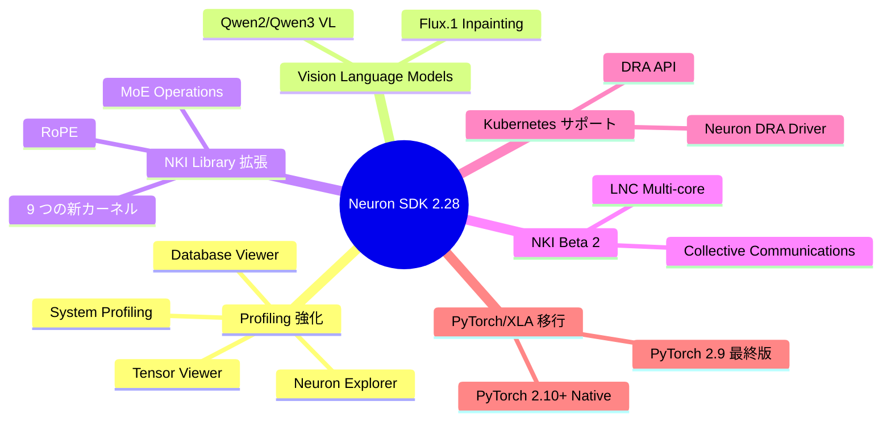
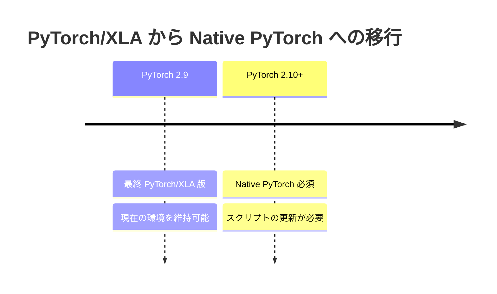

## はじめに

2026 年 2 月 26 日に AWS Neuron SDK 2.28.0 がリリースされました。

このリリースでは、Neuron Explorer のプロファイリング機能強化、VLM のサポート拡大、NKI Library の大幅な拡張、Kubernetes ネイティブなリソース管理など、多数の重要な新機能が追加されています。また、**PyTorch/XLA から Native PyTorch への移行に関する重要なアナウンス**も含まれています。

本記事では、Neuron SDK 2.28.0 の主要なアップデート内容を整理します。

https://awsdocs-neuron.readthedocs-hosted.com/en/latest/about-neuron/whats-new.html

以前のアップデートは以下です。

https://zenn.dev/tosshi/articles/3dd527624f18bd

## 主要アップデート概要



それぞれの詳細を見ていきましょう。

## Neuron Explorer のプロファイリング強化

Neuron SDK 2.28.0 では、Neuron Explorer が大幅に強化され、より包括的なプロファイリング機能が提供されるようになりました。

:::message
激アツ！今後 Neuron Explorer を試してみようと思います。後述する NKI を開発する AWS Neuron マニアには必須ツールですね。
:::

### 1. System Profiling

システムプロファイリング対応とドリルダウンナビゲーション機能により、デバイスプロファイルへのアクセスが向上しました。これにより、ホスト側のボトルネックも含めた全体的なパフォーマンス分析が可能になります。

### 2. Tensor Viewer

**Tensor Viewer** は、テンソル名、形状、サイズ、メモリ使用量を表示し、メモリボトルネック特定を支援する新機能です。大規模モデルのメモリ最適化において、どのテンソルがメモリを占有しているかを把握することは非常に重要です。

### 3. Database Viewer

**Database Viewer** は、SQL および自然言語でプロファイリングデータを照会可能なインタラクティブインターフェースです。自然言語クエリにも対応しており、「最も時間がかかっている演算を表示」といった質問に対して、AI が適切な SQL を生成して実行します。

:::message
perfetto mcp のようなものですね。ネイティブに提供してくれるのはありがたいです！
:::

### 4. Migration Guide

Neuron Profiler から Neuron Explorer への移行ガイドが提供されています。既存のプロファイリングワークフローをアップグレードする際は、このガイドを参照してください。

- [Neuron Explorer Documentation](https://awsdocs-neuron.readthedocs-hosted.com/en/latest/tools/neuron-explorer/)
- [Neuron Developer Tools 2.28.0 リリースノート](https://awsdocs-neuron.readthedocs-hosted.com/en/latest/release-notes/components/dev-tools.html#dev-tools-2-28-0-rn)

## Vision Language Models (VLM) のサポート拡大

Neuron Distributed Inference (NxD Inference) が VLM のサポートを大幅に拡充しました。

:::message
これも激アツ！今 Qwen2.5 VL の検証をしていますが、NxD Inference では Qwen2 VL (7B) と Qwen3 VL (8B) がサポートされたようです。現時点では VLM は Dense モデルのみで、MoE VLM はまだのようです。
:::

### 1. Qwen2 / Qwen3 VL (Beta)

Qwen2 VL (Qwen2-VL-7B-Instruct) および Qwen3 VL (Qwen3-VL-8B-Thinking) がサポートされました（Beta）。これらのモデルは、画像とテキストを同時に処理できるマルチモーダルモデルです。

### 2. Flux.1 拡張機能 (Beta)

Flux.1 に以下の新機能が追加されました（Beta）。

- **Inpainting**: 画像の一部を AI が補完・編集する技術
- **Outpainting**: 画像の外側を生成・拡張する技術
- **Canny edge detection**: エッジ情報に基づく画像生成
- **Depth-based image generation**: 深度情報に基づく画像生成

## NKI Library の大幅拡張

NKI Library に **9 つの新しいカーネル**が追加されました。これにより、より多くの操作が事前最適化されたカーネルとして利用できるようになります。

### 追加された新カーネル

1. **RoPE (Rotary Positional Embedding)**: Transformer モデルで広く使用される位置エンコーディング
2. **Router Top-K**: MoE モデルのエキスパート選択
3. **MoE CTE/TKG**: Mixture of Experts の演算
4. **Cumsum**: 累積和計算
5. **Attention Block TKG**: Attention メカニズムの最適化
6. **Cross Entropy**: 損失関数計算
7. **Depthwise Conv1D**: 1 次元畳み込み
8. **Blockwise MM Backward**: 行列乗算の逆伝播

これらのカーネルの詳細と使用方法については、[NKI Library GitHub リポジトリ](https://github.com/aws-neuron/nki-library)でソースコードを参照してください。

参照: [NKI Library 2.28.0 リリースノート](https://awsdocs-neuron.readthedocs-hosted.com/en/latest/release-notes/components/nki-lib.html#nki-lib-2-28-0-rn)

## NKI Beta 2: LNC Multi-core Support

NKI の Beta 2 が導入され、**LNC (Logical NeuronCore) のマルチコアサポート**が追加されました。

### 1. LNC Multi-core とは

LNC (Logical NeuronCore) は Trainium2 で導入された概念で、複数の物理 NeuronCore を論理的にグループ化するものです。NKI Beta 2 では、複数の NeuronCore を協調させて 1 つのカーネルを実行できるようになります。

### 2. Intra-LNC Collective Communications

LNC 内での collective communication（all-reduce、all-gather など）が `nki.collectives` モジュールでサポートされ、複数コア間でのデータ交換が効率的に行えます。LNC=2 での多コア活用が実現し、以下のようなユースケースで効果を発揮します。

## Kubernetes ネイティブなリソース管理

Neuron SDK 2.28.0 では、**Neuron DRA (Dynamic Resource Allocation) Driver** が導入されました。

### 1. Neuron DRA Driver とは

Kubernetes の Dynamic Resource Allocation (DRA) API を使用して、NeuronCore などのアクセラレータリソースを動的に管理するためのドライバです。

## 重要: PyTorch/XLA から Native PyTorch への移行

Neuron SDK 2.28.0 では、**PyTorch/XLA から Native PyTorch への移行**に関する重要なアナウンスが含まれています。

### 1. 移行スケジュール



### 2. 何が変わるのか

#### 従来 (PyTorch 2.9 以前)

```python
import torch
import torch_xla.core.xla_model as xm

device = xm.xla_device()
model = model.to(device)
```

#### 今後 (PyTorch 2.10 以降)

PyTorch 2.10 以降では、PyTorch/XLA ではなく Native PyTorch サポート（TorchNeuron 経由）を使用します。

**注意**: PyTorch 2.10 はまだリリースされていないため、具体的な API は今後公開される公式ドキュメントで確認してください。

### 3. 移行の影響

- **スクリプトの更新が必要**: PyTorch 2.10 以降を使用する場合、トレーニングスクリプトを更新する必要があります
- **API の変更**: `torch_xla` ではなく、標準 PyTorch API + TorchNeuron を使用
- **互換性**: PyTorch 2.9 までは従来の方法が引き続き使用可能
- **新機能**: Native PyTorch eager execution、標準分散プリミティブ（DTensor、FSDP、DDP）、torch.compile サポート

## Platform アップデート

Neuron SDK 2.28.0 では、Neuron 2.27.0 で導入された以下のプラットフォームアップデートが引き続き利用可能です。

**Deep Learning Containers (DLC) および Deep Learning AMIs (DLAMI)**:
- Ubuntu 24.04
- Python 3.12
- PyTorch 2.9
- JAX 0.7
- vLLM V1

参照: [DLAMI Release Notes](https://awsdocs-neuron.readthedocs-hosted.com/en/latest/release-notes/2.28.0/dlami.html)

## サポート終了と廃止予定

### 1. 廃止済み (Neuron 2.28.0 で削除)

- **`neuronxcc.nki.*` namespace**: 新しい `nki.*` namespace に移行してください

```python
# NG: Neuron 2.28 で削除
from neuronxcc import nki

# OK: 推奨
import nki
from nki import language as nl
```

### 2. 今後廃止予定

- **vLLM V0**: Neuron 2.28 以降、vLLM V1 への移行が推奨されます
- **PyTorch/XLA**: PyTorch 2.10 以降では Native PyTorch を使用する必要があります

参照: [End of Support Announcements](https://awsdocs-neuron.readthedocs-hosted.com/en/latest/about-neuron/announcements/)

## まとめ

Neuron SDK 2.28.0 では、移行が必要な Native PyTorch のアナウンス、Neuron Explorer のプロファイリング強化、は特に重要ですね！NKI の追加カーネルもよく利用されるものばかりなので今後触ってみたいと思います。

**参考リソース**
- [Native PyTorch 移行ガイド](https://awsdocs-neuron.readthedocs-hosted.com/en/latest/about-neuron/announcements/neuron2.x/announce-transition-pytorch-trainium.html)
- [Neuron SDK 2.28.0 リリースノート](https://awsdocs-neuron.readthedocs-hosted.com/en/latest/release-notes/2.28.0/)
- [前回のリリース解説（2.27.0）](https://zenn.dev/littlemex/articles/3dd527624f18bd)
- [What's New in AWS Neuron SDK](https://awsdocs-neuron.readthedocs-hosted.com/en/latest/about-neuron/whats-new.html)
- [Neuron SDK 2.28.0 Release Notes](https://awsdocs-neuron.readthedocs-hosted.com/en/latest/release-notes/2.28.0/)
- [Neuron Explorer Documentation](https://awsdocs-neuron.readthedocs-hosted.com/en/latest/tools/neuron-explorer/)
- [NKI Library Documentation](https://awsdocs-neuron.readthedocs-hosted.com/en/latest/release-notes/2.28.0/nki-lib.html)
- [Announcing Transition to PyTorch Native Support](https://awsdocs-neuron.readthedocs-hosted.com/en/latest/about-neuron/announcements/neuron2.x/announce-transition-pytorch-trainium.html)
- [Neuron DRA Driver Documentation](https://awsdocs-neuron.readthedocs-hosted.com/en/latest/containers/neuron-dra.html)
- [Previous Release: Neuron SDK 2.27.0 解説](https://zenn.dev/littlemex/articles/3dd527624f18bd)
