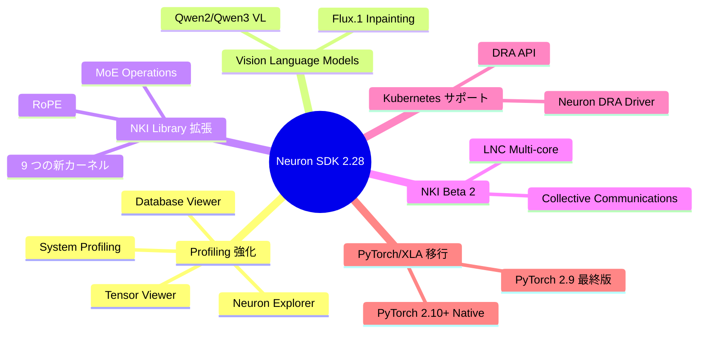
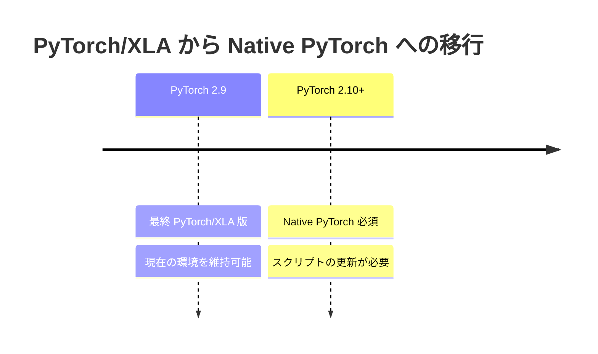

# はじめに

2026 年 2 月 26 日に AWS Neuron SDK 2.28.0 がリリースされました。

このリリースでは、Neuron Explorer のプロファイリング機能強化、VLM のサポート拡大、NKI Library の大幅な拡張、Kubernetes ネイティブなリソース管理など、多数の重要な新機能が追加されています。また、**PyTorch/XLA から Native PyTorch への移行に関する重要なアナウンス**も含まれています。

本記事では、Neuron SDK 2.28.0 の主要なアップデート内容を整理します。

https://awsdocs-neuron.readthedocs-hosted.com/en/latest/about-neuron/whats-new.html

以前のアップデートは以下です。

https://zenn.dev/tosshi/articles/3dd527624f18bd

# 主要アップデート概要



それぞれの詳細を見ていきましょう。

# Neuron Explorer のプロファイリング強化

Neuron SDK 2.28.0 では、Neuron Explorer が大幅に強化され、より包括的なプロファイリング機能が提供されるようになりました。

:::message
激アツ！今後 Neuron Explorer を試してみようと思います。後述する NKI を開発する AWS Neuron マニアには必須ツールですね。
:::

## 1. System Profiling

従来のデバイスプロファイリングに加えて、システムレベルのプロファイリングが可能になりました。これにより、CPU、メモリ、I/O などのホスト側のボトルネックも含めた全体的なパフォーマンス分析が可能になります。

## 2. Tensor Viewer

**Tensor Viewer** は、メモリ内のテンソルを可視化し、メモリ使用量を詳細に分析するための新機能です。大規模モデルのメモリ最適化において、どのテンソルがメモリを占有しているかを把握することは非常に重要です。

## 3. Database Viewer

**Database Viewer** は、プロファイリングデータに対して SQL クエリまたは自然言語クエリを実行できる画期的な機能です。

```sql
-- SQL クエリの例
SELECT operation, avg_duration
FROM profile_data
WHERE duration > 100
ORDER BY avg_duration DESC;
```

自然言語クエリにも対応しており、「最も時間がかかっている演算を表示」といった質問に対して、AI が適切な SQL を生成して実行します。

:::message
perfetto mcp のようなものですね。ネイティブに提供してくれるのはありがたいです！
:::

## 4. Migration Guide

Neuron Profiler または Profiler 2.0 から Neuron Explorer への移行ガイドが提供されています。既存のプロファイリングワークフローをアップグレードする際は、このガイドを参照してください。

参照: [Neuron Explorer Documentation](https://awsdocs-neuron.readthedocs-hosted.com/en/latest/tools/neuron-explorer/)

# Vision Language Models (VLM) のサポート拡大

NxD Inference が Vision Language Models のサポートを大幅に拡充しました。

:::message
これも激アツ！今 Qwen2.5 VL の検証をしていますが 2.5 も使えるのか試してみたいです。まだ Dense だけなのか MoE もいけるのか気になります。
:::

## 1. Qwen2 / Qwen3 VL

Qwen2 および Qwen3 の Vision Language モデルがサポートされました。これらのモデルは、画像とテキストを同時に処理できるマルチモーダルモデルです。

## 2. Flux.1 Inpainting

**Flux.1** の inpainting 機能がサポートされました。Inpainting は、画像の一部を AI が補完・編集する技術です。

# NKI Library の大幅拡張

NKI Library に **9 つの新しいカーネル**が追加されました。これにより、より多くの操作が事前最適化されたカーネルとして利用できるようになります。

## 1. RoPE (Rotary Positional Embedding)

Transformer モデルで広く使用される位置エンコーディング手法です。

```python
import nkilib

# RoPE カーネルの使用例
output = nkilib.rope(input_tensor, position_ids, ...)
```

## 2. MoE (Mixture of Experts) Operations

Mixtral や Qwen などの MoE モデルで使用されるエキスパートルーティング操作が最適化されました。

## 3. Experimental Attention Kernels

実験的な Attention カーネルが追加され、より高速な Attention 計算が可能になります。

## 4. その他のカーネル

- QKV Projection
- Output Projection（CTE/TKG）
- RMSNorm-Quant
- Layer Normalization

すべてのカーネルは `nkilib.*` namespace からアクセス可能で、[GitHub リポジトリ](https://github.com/aws-neuron/nki-library)でソースコードも公開されています。

参照: [NKI Library Documentation](https://awsdocs-neuron.readthedocs-hosted.com/en/latest/release-notes/2.28.0/nki-lib.html)

# NKI Beta 2: LNC Multi-core Support

NKI (Neuron Kernel Interface) の Beta 2 が導入され、**LNC (Logical NeuronCore) のマルチコアサポート**が追加されました。

## 1. LNC Multi-core とは

従来の NKI では、1 つのカーネルは 1 つの NeuronCore 上でのみ実行されていました。NKI Beta 2 では、複数の NeuronCore を協調させて 1 つのカーネルを実行できるようになります。

## 2. Intra-LNC Collective Communications

LNC 内での collective communication（all-reduce、all-gather など）がサポートされ、複数コア間でのデータ交換が効率的に行えます。

```python
import nki
from nki import language as nl

@nki.jit
def multi_core_kernel(x):
    # 複数の NeuronCore で並列処理
    # intra-LNC collective を使用
    ...
```

**ユースケース**
- 大規模テンソルの並列処理
- カーネルレベルでのモデル並列化
- メモリ制約の緩和

参照: [NKI Beta 2 Documentation](https://awsdocs-neuron.readthedocs-hosted.com/en/latest/nki/)

# Kubernetes ネイティブなリソース管理

Neuron SDK 2.28.0 では、**Neuron DRA (Dynamic Resource Allocation) Driver** が導入されました。

## 1. Neuron DRA Driver とは

Kubernetes の Dynamic Resource Allocation (DRA) API を使用して、NeuronCore などのアクセラレータリソースを動的に管理するためのドライバです。

**従来の Device Plugin との違い**

| 特徴 | Device Plugin | DRA Driver |
|------|--------------|------------|
| リソース割り当て | 静的 | 動的 |
| 柔軟性 | 低 | 高 |
| 細粒度制御 | 困難 | 容易 |
| Kubernetes ネイティブ | 部分的 | フル |

```yaml
# Pod 定義例
apiVersion: v1
kind: Pod
metadata:
  name: neuron-workload
spec:
  resourceClaims:
    - name: neuron-cores
      resourceClaimName: neuron-claim
  containers:
    - name: training
      image: my-training-image
      resources:
        claims:
          - name: neuron-cores
```

参照: [Neuron DRA Driver Documentation](https://awsdocs-neuron.readthedocs-hosted.com/en/latest/containers/neuron-dra.html)

# 超重要: PyTorch/XLA から Native PyTorch への移行

Neuron SDK 2.28.0 では、**PyTorch/XLA から Native PyTorch への移行**に関する重要なアナウンスが含まれています。

## 1. 移行スケジュール



## 2. 何が変わるのか

### 従来 (PyTorch 2.9 以前)

```python
import torch
import torch_xla.core.xla_model as xm

device = xm.xla_device()
model = model.to(device)
```

### 今後 (PyTorch 2.10 以降)

```python
import torch
import torch_neuronx

# ネイティブ PyTorch API を使用
device = torch.device("neuron")
model = model.to(device)
```

## 3. 移行の影響

- **スクリプトの更新が必要**: PyTorch 2.10 以降を使用する場合、トレーニングスクリプトを更新する必要があります
- **API の変更**: `torch_xla` ではなく、標準 PyTorch API + `torch_neuronx` を使用
- **互換性**: PyTorch 2.9 までは従来の方法が引き続き使用可能

参照: [Announcing Transition to PyTorch Native Support](https://awsdocs-neuron.readthedocs-hosted.com/en/latest/about-neuron/announcements/neuron2.x/announce-transition-pytorch-trainium.html)

# Platform アップデート

## 1. Deep Learning Containers (DLC)

すべての Deep Learning Container が以下に更新されました。

- **Ubuntu 24.04**
- **Python 3.12**
- **PyTorch 2.9**
- **JAX 0.7**
- **vLLM V1**

## 2. Deep Learning AMIs (DLAMI)

DLAMI も同様のアップデートを受け、新しい仮想環境として以下が追加されています。

- vLLM V1 環境
- PyTorch 2.9 環境（Amazon Linux 2023、Ubuntu 22.04、Ubuntu 24.04）
- JAX 0.7 環境

参照: [DLAMI Release Notes](https://awsdocs-neuron.readthedocs-hosted.com/en/latest/release-notes/2.28.0/dlami.html)

# サポート終了と廃止予定

## 1. 廃止済み (Neuron 2.28.0 で削除)

- **`neuronxcc.nki.*` namespace**: 新しい `nki.*` namespace に移行してください

```python
# NG: Neuron 2.28 で削除
from neuronxcc import nki

# OK: 推奨
import nki
from nki import language as nl
```

## 2. 今後廃止予定

- **vLLM V0**: Neuron 2.28 以降、vLLM V1 への移行が推奨されます
- **PyTorch/XLA**: PyTorch 2.10 以降では Native PyTorch を使用する必要があります

参照: [End of Support Announcements](https://awsdocs-neuron.readthedocs-hosted.com/en/latest/about-neuron/announcements/)

# まとめ

Neuron SDK 2.28.0 は、プロファイリング機能の大幅強化、Vision Language Models のサポート、NKI Library の拡張、Kubernetes ネイティブなリソース管理、**PyTorch/XLA から Native PyTorch への移行アナウンス**など、多数の重要なアップデートを含んでいます。

# 参考リソース
- [Native PyTorch 移行ガイド](https://awsdocs-neuron.readthedocs-hosted.com/en/latest/about-neuron/announcements/neuron2.x/announce-transition-pytorch-trainium.html)
- [Neuron SDK 2.28.0 リリースノート](https://awsdocs-neuron.readthedocs-hosted.com/en/latest/release-notes/2.28.0/)
- [前回のリリース解説（2.27.0）](https://zenn.dev/littlemex/articles/3dd527624f18bd)
- [What's New in AWS Neuron SDK](https://awsdocs-neuron.readthedocs-hosted.com/en/latest/about-neuron/whats-new.html)
- [Neuron SDK 2.28.0 Release Notes](https://awsdocs-neuron.readthedocs-hosted.com/en/latest/release-notes/2.28.0/)
- [Neuron Explorer Documentation](https://awsdocs-neuron.readthedocs-hosted.com/en/latest/tools/neuron-explorer/)
- [NKI Library Documentation](https://awsdocs-neuron.readthedocs-hosted.com/en/latest/release-notes/2.28.0/nki-lib.html)
- [Announcing Transition to PyTorch Native Support](https://awsdocs-neuron.readthedocs-hosted.com/en/latest/about-neuron/announcements/neuron2.x/announce-transition-pytorch-trainium.html)
- [Neuron DRA Driver Documentation](https://awsdocs-neuron.readthedocs-hosted.com/en/latest/containers/neuron-dra.html)
- [Previous Release: Neuron SDK 2.27.0 解説](https://zenn.dev/littlemex/articles/3dd527624f18bd)
