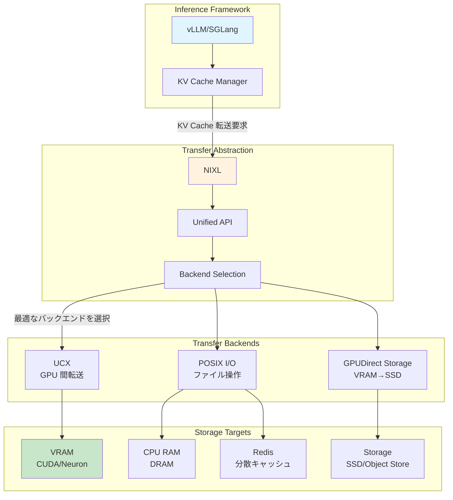
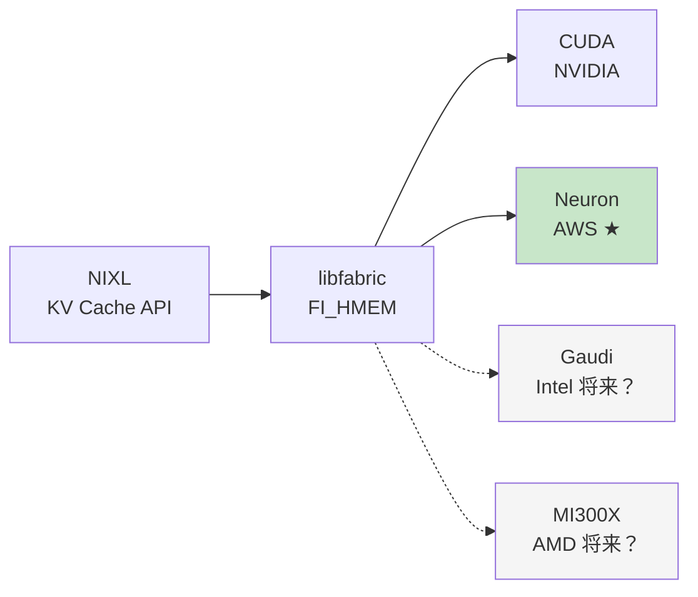

## はじめに

本記事は GitHub PR #1258「AWS Neuron Accelerator Support for NIXL」について調査した内容をまとめたものです。

https://github.com/ai-dynamo/nixl/pull/1258

### NIXL とは何か

**NIXL (NVIDIA Inference Xfer Library)** は、LLM 推論における **高速・低遅延の転送抽象化**ライブラリです。

LLM 推論では、KV キャッシュ（過去のトークンの key/value）がシーケンス長に比例してメモリを消費します。長いコンテキストを扱う場合、VRAM だけでは足りず、CPU RAM やストレージに退避する実装が主流です。

**NIXL が解決する問題**
- VRAM → VRAM（GPU 間転送）: UCX を使いたい
- VRAM → SSD（ストレージ退避）: GPUDirect Storage を使いたい
- CPU RAM → ファイル（永続化）: POSIX I/O を使いたい

これらの最適なプロトコル選択を、NIXL が**統一 API の裏で自動的に行います**。アプリケーション側は「どこに置くか」だけを指定すれば、「どうやって転送するか」は NIXL が対応します。

https://engineers.ntt.com/entry/202505-nixl/entry

上記エンジニアブログが非常にわかりやすかったです。


### 今回の PR 対応で何ができるようになったか

:::message
**技術的には**、AWS Neuron チップのメモリが、NIXL の転送対象として扱えるようになった。
:::

:::message alert
**ユーザー視点では**、**vLLM や SGLang などの推論フレームワークで、Neuron チップを使いながら KV キャッシュの柔軟な配置ができる**
- Neuron のデバイスメモリ が足りない場合に、CPU RAM や Redis、ストレージなどにオフロードする選択肢が Neuron 環境でも使える
- コードをほとんど変えずに、GPU 環境と Neuron 環境を切り替えられる（かも？）
:::

### vLLM との関係

**vLLM や SGLang がすでに NIXL サポートを実装しています**。私の理解では vLLM は NIXL CPU Offloading などの Connector を選択して利用する形態です。つまり、vLLM で NIXL に対応していることで今後 Neuron でも GPU 同様に NIXL Connector で柔軟に KV キャッシュをオフロードできる可能性があります（[vllm-neuron](https://github.com/vllm-project/vllm-neuron) 側の対応も必要だと思います）。これによって価格面での GPU に対する優位性も考慮すると LLM 推論ワークロードでの AWS Neuron の採用の現実性がより高くなってくると思われます。

https://blog.vllm.ai/2026/01/08/kv-offloading-connector.html

## コンポーネントの関係性



### 各層の役割

::::details Inference Framework 層（vLLM/SGLang）

**役割**: ユーザーが直接触る推論エンジン

vLLM の KV Cache Manager は、以下のような判断を行います：
- 新しいリクエストの KV キャッシュをどこに配置するか
- VRAM が不足したらどこにオフロードするか
- Prefix Caching（共通プレフィックスの再利用）をどう管理するか

この「どこに配置するか」の実装に、NIXL の API を使います。

::::

::::details Transfer Abstraction 層（NIXL）

**役割**: 転送先と転送方法を切り離す

NIXL の統一 API:
```python
# 擬似コード
nixl.transfer(
    src="vram:0",        # 転送元: GPU 0 の VRAM
    dst="cpu: ram",       # 転送先: CPU RAM
    data=kv_cache_block  # 転送するデータ
)
# NIXL が自動的に最適なバックエンド（UCX, GDS, POSIX）を選択
```

ユーザーは「どこからどこへ」を指定するだけで、NIXL が裏で：
- メモリペアに応じた最適なプロトコルを選択
- ネットワーク経由か、ローカルか、を判断
- 最適な転送パスを構築

::::

::::details Transfer Backends 層

**UCX (Unified Communication X)**:
- GPU 間の高速転送（NVLink、InfiniBand）
- RDMA によるゼロコピー転送

**GPUDirect Storage (GDS)**:
- VRAM から SSD への直接転送
- CPU メモリを経由しないため高速

**POSIX I/O**:
- 通常のファイル操作
- Redis などの分散ストアへのアクセス

NIXL はこれらを**プラグインアーキテクチャ**で統合しており、新しいバックエンドの追加が容易です。

::::

::::details Storage Targets 層

**VRAM (CUDA/Neuron)**:
- 最速だがサイズ制限あり
- 今回の PR で Neuron VRAM も対象に

**CPU RAM (DRAM)**:
- VRAM より遅いが大容量
- よく使われるオフロード先

**Redis（分散キャッシュ）**:
- 複数ノードで共有
- Prefix Caching の共有に有用

**Storage (SSD/Object Store)**:
- 最も遅いが容量制限なし
- 長期間使わない KV キャッシュを退避

::::

## PR #1258 が実現すること

### 1. Neuron VRAM を NIXL の転送対象に追加

この PR の核心は、`FI_HMEM_NEURON` インターフェースのサポートです。

```c
// libfabric の異種メモリインターフェース
enum fi_hmem_iface {
    FI_HMEM_SYSTEM,    // CPU メモリ
    FI_HMEM_CUDA,      // NVIDIA GPU
    FI_HMEM_NEURON,    // AWS Neuron ← この PR で対応
    FI_HMEM_ROCR,      // AMD GPU
    FI_HMEM_ZE,        // Intel GPU
};
```

**何が変わるか**:
```python
# 従来（GPU のみ）
nixl.transfer(src="cuda:0", dst="cpu: ram", data=kv_cache)  # OK
nixl.transfer(src="neuron:0", dst="cpu: ram", data=kv_cache)  # NG（非対応）

# 今回の PR 後
nixl.transfer(src="neuron:0", dst="cpu: ram", data=kv_cache)  # OK
nixl.transfer(src="neuron:0", dst="storage: s3", data=kv_cache)  # OK
```

Neuron チップのメモリが、GPU と同じように NIXL の転送対象として扱えます。

### 2. vLLM on Neuron での KV キャッシュ管理

vLLM がすでに NIXL を使っているため、この PR により：

**シナリオ 1: VRAM 不足時の自動オフロード**
```python
# vLLM on Neuron (今回の PR 後)
from vllm import LLM

model = LLM(
    model="meta-llama/Llama-2-70b",
    tensor_parallel_size=4,  # 4 Neuron デバイスで並列
    # VRAM が足りなければ、NIXL が自動的に CPU RAM へオフロード
)
```

**シナリオ 2: Redis を使った分散 Prefix Caching**
```python
# 複数ノードで KV キャッシュを共有
model = LLM(
    model="meta-llama/Llama-2-70b",
    enable_prefix_caching=True,
    cache_backend="redis://cache-cluster",  # NIXL が Redis 転送を管理
)
```

**シナリオ 3: S3 への長期退避**
```python
# 使用頻度の低い KV キャッシュを S3 に退避
# NIXL が Neuron VRAM → S3 の転送を最適化
model.offload_to_storage("s3://kv-cache-bucket")
```

### 3. 段階的な移行パス

PR の実装パターン（動的ライブラリロード）により、GPU と Neuron を透過的に扱えます。

```c
// libnrt.so（Neuron Runtime）を実行時にロード
void* nrt_handle = dlopen("libnrt.so", RTLD_LAZY);
if (nrt_handle) {
    // Neuron が使える環境
    init_neuron_device();
} else {
    // Neuron がない環境では CUDA にフォールバック
    init_cuda_device();
}
```

**実用的なメリット**:
1. ローカル GPU で開発・デバッグ
2. 同じコードを AWS Neuron 環境にデプロイ
3. vLLM の設定を変えるだけで切り替え可能

## 将来的な方向性（PR から読み取れる事実ベース）

### 方向性 1: マルチベンダー KV キャッシュ管理の標準化

libfabric の `FI_HMEM` インターフェースを使うことで、将来的に他のアクセラレータにも対応できます。



**この設計が示すこと**:
- KV キャッシュ管理において、ハードウェア依存を排除できる
- 一度 NIXL に対応すれば、新しいチップへの移行が容易

### 方向性 2: コスト最適化の具体的な道筋

AWS Neuron は NVIDIA GPU より低コストです（AWS 公式価格）。

| ワークロード | NVIDIA GPU | AWS Neuron | 削減率 |
|-------------|-----------|-----------|--------|
| 小規模推論（〜10B） | p4d.24xlarge<br/>$32.77/h | inf2.48xlarge<br/>$12.98/h | 約 60% |
| 大規模推論（70B+） | p4d.24xlarge<br/>$32.77/h | inf2.48xlarge<br/>$12.98/h | 約 60% |

**NIXL + vLLM の組み合わせにより**:
- GPU で開発した推論アプリを、ほぼそのまま Neuron にデプロイ
- KV キャッシュの管理ロジックを変更せずに、コスト削減を実現

**注意点**:
- すべてのモデルが Neuron で動くわけではない（コンパイル対応が必要）
- 初期の移行コストや検証工数は必要
- 性能特性が異なるため、チューニングが必要な場合もある

### 方向性 3: 推論フレームワークの標準化

vLLM と SGLang がすでに NIXL を使っている事実は重要です。

**現状**:
```
vLLM → NIXL → {CUDA, Neuron}
SGLang → NIXL → {CUDA, Neuron}
```

**将来的には**:
- TensorRT-LLM、llama.cpp なども NIXL 対応する可能性
- KV キャッシュ管理の「事実上の標準」として NIXL が機能

**ただし現実的には**:
- NVIDIA の TensorRT-LLM は独自実装を続ける可能性が高い
- NIXL は「選択肢の一つ」であり、唯一の標準ではない

## 誰にとって何が嬉しいのか

### 大規模推論サービスを運用する企業

**状況**: Llama 2 70B などの大規模モデルで推論 API を提供

**メリット**:
- **コスト削減**: 約 60% の削減（年間数百万円〜数千万円）
- **VRAM 不足の解消**: CPU RAM や Redis へのオフロードで、より多くのリクエストを捌ける
- **柔軟な配置戦略**: ホット KV キャッシュは VRAM、コールド KV キャッシュは S3 など

**現実的な制約**:
- Neuron 対応モデルのコンパイルに工数が必要
- CUDA 特有の最適化が使えない場合がある
- 性能チューニングのノウハウが必要

### vLLM を使っている開発者

**状況**: すでに vLLM で推論アプリを構築済み

**メリット**:
- **ほぼコード変更なし**: vLLM の設定を変えるだけで Neuron に移行可能
- **開発環境は GPU**: ローカル GPU で開発し、本番環境だけ Neuron
- **段階的な移行**: 一部のワークロードだけ Neuron に移行してテスト

**具体例**:
```python
# 開発環境（ローカル GPU）
model = LLM("meta-llama/Llama-2-13b")

# 本番環境（AWS Neuron）
# 同じコード、同じ API
model = LLM("meta-llama/Llama-2-13b")  # 自動的に Neuron を検出
```

### スタートアップ

**状況**: 限られた予算で LLM サービスを立ち上げたい

**メリット**:
- **初期コスト削減**: GPU より低コストで始められる
- **オフロード戦略**: Redis や S3 を使って、VRAM を節約
- **段階的なスケール**: 小規模から始めて徐々に拡大

**現実的な制約**:
- CUDA エコシステムほどドキュメントが豊富ではない
- トラブル時の情報が少ない

## まとめ

:::message
**PR #1258 が示す本質的な価値**

この PR の本質は、「NVIDIA GPU 専用だった KV キャッシュ管理の抽象化が、AWS Neuron にも広がった」という点です。

1. **vLLM/SGLang での利用**: すでに NIXL を使っている推論フレームワークが、Neuron でも動作
2. **柔軟な配置戦略**: VRAM/CPU RAM/Redis/ストレージへのオフロードを、同じ API で扱える
3. **段階的な移行**: GPU 環境で開発したコードを、ほぼそのまま Neuron 環境にデプロイ可能

「ハードウェアの選択肢が増えた」だけでなく、「KV キャッシュの管理方法が統一された」ことが、長期的には大きな意味を持ちます。
:::

### 今後の展開（控えめな予測）

**短期（1〜2 年）**:
- vLLM の Neuron サポートが安定化
- KV キャッシュのオフロード戦略のベストプラクティスが蓄積
- 他の推論フレームワークも NIXL を検討

**中期（3〜5 年）**:
- Intel Gaudi、AMD MI300X なども NIXL の対象に
- KV キャッシュ管理の「事実上の標準」として NIXL が定着
- VRAM 不足問題が、ハードウェア選択ではなくオフロード戦略で解決

**長期（5 年以上）**:
- LLM 推論の KV キャッシュ管理が完全に抽象化される
- ハードウェアベンダーが「NIXL 対応」を標準機能として提供
- ユーザーは「どこに置くか」だけを気にすればよくなる

**ただし**:
- NVIDIA の圧倒的なエコシステムは当面続く
- NIXL は「選択肢」であり「唯一の解」ではない
- 標準化には時間がかかる

### 最後に

この PR #1258 は、派手な技術革新ではありませんが、「LLM 推論の実用化」という地道で重要な課題に対する、現実的なアプローチを示しています。

KV キャッシュの管理は、長いコンテキストを扱う LLM において避けて通れない問題です。VRAM に全て載せられない場合、CPU RAM や Redis、ストレージを活用する必要があります。

NIXL のような抽象化層があることで、「どこに置くか」の選択肢が増え、ハードウェアの制約を柔軟に乗り越えられます。今回の PR は、その抽象化を AWS Neuron にも広げた、小さいけれど確実な一歩と言えるでしょう。

## 参考文献

- [NIXL GitHub Repository](https://github.com/ai-dynamo/nixl)
- [PR #1258: AWS Neuron Accelerator Support](https://github.com/ai-dynamo/nixl/pull/1258)
- [NTT エンジニアブログ: NIXL 解説](https://engineers.ntt.com/entry/202505-nixl/entry)
- [AWS Neuron 公式ドキュメント](https://awsdocs-neuron.readthedocs-hosted.com/)
- [libfabric 公式サイト](https://ofiwg.github.io/libfabric/)
- [FI_HMEM_NEURON 追加コミット (2021-12-21)](https://github.com/ofiwg/libfabric/commit/ab52ce8d966d98af63aa6307e1454050b07a38fa)
