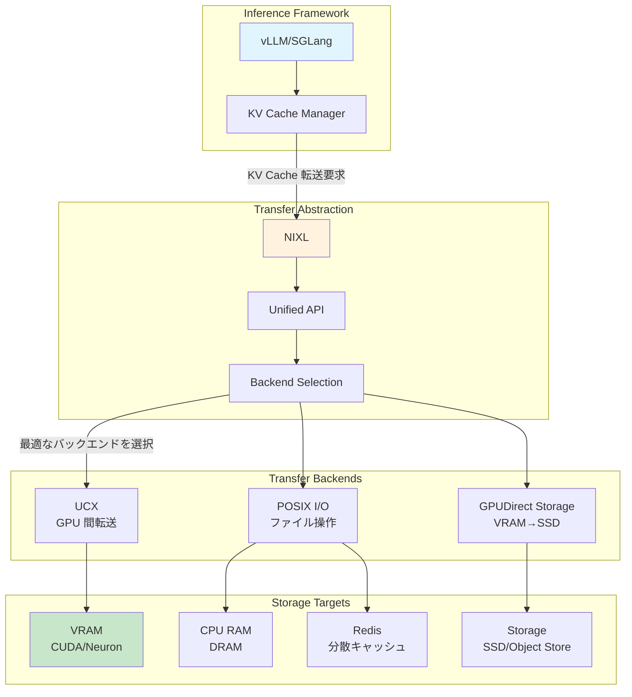
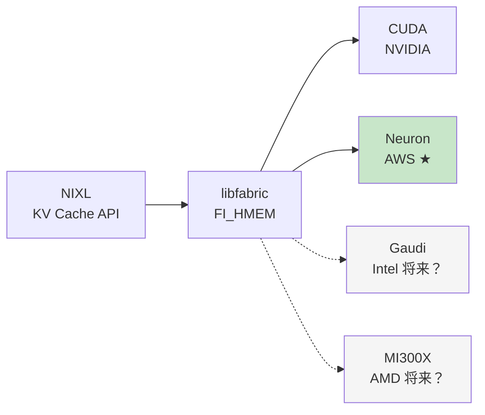

## はじめに

本記事は GitHub PR #1258「AWS Neuron Accelerator Support for NIXL」について調査した内容をまとめたものです。

https://github.com/ai-dynamo/nixl/pull/1258

### NIXL とは何か

**NIXL (NVIDIA Inference Xfer Library)** は、LLM 推論における **高速・低遅延の転送抽象化**ライブラリです。

LLM 推論では、KV キャッシュ（過去のトークンの key/value）がシーケンス長に比例してメモリを消費します。長いコンテキストを扱う場合、VRAM だけでは足りず、CPU RAM やストレージに退避する実装が主流です。

**NIXL が解決する問題**

LLM 推論における転送処理では、転送元と転送先の組み合わせに応じて最適なプロトコルが異なります。例えば、VRAM から VRAM への GPU 間転送では UCX を使いたい場合があります。また、VRAM から SSD へのストレージ退避では GPUDirect Storage が有効です。さらに、CPU RAM からファイルへの永続化では POSIX I/O が適しています。

これらの最適なプロトコル選択を、NIXL が**統一 API の裏で自動的に行います**。アプリケーション側は「どこに置くか」だけを指定すれば、「どうやって転送するか」は NIXL が対応します。

https://engineers.ntt.com/entry/202505-nixl/entry

上記エンジニアブログが非常にわかりやすかったです。


### 今回の PR 対応で何ができるようになったか

:::message
**技術的には**、AWS Neuron チップのメモリが、NIXL の転送対象として扱えるようになった。
:::

:::message alert
**ユーザー視点では**、**vLLM や SGLang などの推論フレームワークで、Neuron チップを使いながら KV キャッシュの柔軟な配置ができる**
- Neuron のデバイスメモリ が足りない場合に、CPU RAM や Redis、ストレージなどにオフロードする選択肢が Neuron 環境でも使える
- コードをほとんど変えずに、GPU 環境と Neuron 環境を切り替えられる（かも？）
:::

### vLLM との関係

**vLLM や SGLang がすでに NIXL サポートを実装しています**。私の理解では vLLM は NIXL CPU Offloading などの Connector を選択して利用する形態です。つまり、vLLM で NIXL に対応していることで今後 Neuron でも GPU 同様に NIXL Connector で柔軟に KV キャッシュをオフロードできる可能性があります（[vllm-neuron](https://github.com/vllm-project/vllm-neuron) 側の対応も必要だと思います）。これによって価格面での GPU に対する優位性も考慮すると LLM 推論ワークロードでの AWS Neuron の採用の現実性がより高くなってくると思われます。

https://blog.vllm.ai/2026/01/08/kv-offloading-connector.html

## コンポーネントの関係性



### 各層の役割

::::details Inference Framework 層（vLLM/SGLang）

この層の役割は、ユーザーが直接触る推論エンジンを提供することです。

vLLM の KV Cache Manager は、様々な判断を行います。例えば、新しいリクエストの KV キャッシュをどこに配置するか、VRAM が不足したらどこにオフロードするか、Prefix Caching（共通プレフィックスの再利用）をどう管理するかといった判断です。

この「どこに配置するか」の実装に、NIXL の API を使います。

::::

::::details Transfer Abstraction 層（NIXL）

この層の役割は、転送先と転送方法を切り離すことです。

NIXL は統一 API を提供しています。

ユーザーは「どこからどこへ」を指定するだけで、NIXL が裏で最適な処理を行います。具体的には、メモリペアに応じた最適なプロトコルを選択し、ネットワーク経由かローカルかを判断し、最適な転送パスを構築します。

::::

::::details Transfer Backends 層

UCX (Unified Communication X) は、GPU 間の高速転送（NVLink、InfiniBand）や RDMA によるゼロコピー転送を提供します。

GPUDirect Storage (GDS) は、VRAM から SSD への直接転送を実現します。CPU メモリを経由しないため高速です。

POSIX I/O は、通常のファイル操作や Redis などの分散ストアへのアクセスを担当します。

NIXL はこれらを**プラグインアーキテクチャ**で統合しており、新しいバックエンドの追加が容易です。

::::

::::details Storage Targets 層

VRAM (CUDA/Neuron) は最速ですが、サイズ制限があります。今回の PR で Neuron VRAM も対象になりました。

CPU RAM (DRAM) は VRAM より遅いですが大容量です。よく使われるオフロード先となっています。

Redis（分散キャッシュ）は複数ノードで共有でき、Prefix Caching の共有に有用です。

Storage (SSD/Object Store) は最も遅いですが大容量です。

::::

## PR #1258 が実現すること

### 1. Neuron VRAM を NIXL の転送対象に追加

この PR の核心は、`FI_HMEM_NEURON` インターフェースのサポートです。

```c
// libfabric の異種メモリインターフェース
enum fi_hmem_iface {
    FI_HMEM_SYSTEM,    // CPU メモリ
    FI_HMEM_CUDA,      // NVIDIA GPU
    FI_HMEM_NEURON,    // AWS Neuron ← この PR で対応
    FI_HMEM_ROCR,      // AMD GPU
    FI_HMEM_ZE,        // Intel GPU
};
```

**何が変わるか**:
```python
# 従来（GPU のみ）
nixl.transfer(src="cuda:0", dst="cpu: ram", data=kv_cache)  # OK
nixl.transfer(src="neuron:0", dst="cpu: ram", data=kv_cache)  # NG（非対応）

# 今回の PR 後
nixl.transfer(src="neuron:0", dst="cpu: ram", data=kv_cache)  # OK
nixl.transfer(src="neuron:0", dst="storage: s3", data=kv_cache)  # OK
```

Neuron チップのメモリが、GPU と同じように NIXL の転送対象として扱えます。

### 2. vLLM on Neuron での KV キャッシュ管理

vLLM がすでに NIXL を使っているため、この PR により以下のようなシナリオが実現します。

シナリオ 1 として、VRAM 不足時の自動オフロードが挙げられます。
```python
# vLLM on Neuron (今回の PR 後)
from vllm import LLM

model = LLM(
    model="meta-llama/Llama-2-70b",
    tensor_parallel_size=4,  # 4 Neuron デバイスで並列
    # VRAM が足りなければ、NIXL が自動的に CPU RAM へオフロード
)
```

シナリオ 2 として、Redis を使った分散 Prefix Caching があります。
```python
# 複数ノードで KV キャッシュを共有
model = LLM(
    model="meta-llama/Llama-2-70b",
    enable_prefix_caching=True,
    cache_backend="redis://cache-cluster",  # NIXL が Redis 転送を管理
)
```

シナリオ 3 として、S3 への長期退避が考えられます。
```python
# 使用頻度の低い KV キャッシュを S3 に退避
# NIXL が Neuron VRAM → S3 の転送を最適化
model.offload_to_storage("s3://kv-cache-bucket")
```

### 3. 段階的な移行パス

PR の実装パターン（動的ライブラリロード）により、GPU と Neuron を透過的に扱えます。

```c
// libnrt.so（Neuron Runtime）を実行時にロード
void* nrt_handle = dlopen("libnrt.so", RTLD_LAZY);
if (nrt_handle) {
    // Neuron が使える環境
    init_neuron_device();
} else {
    // Neuron がない環境では CUDA にフォールバック
    init_cuda_device();
}
```

実用的なメリットとして、以下の点が挙げられます。まず、ローカル GPU で開発・デバッグができます。次に、同じコードを AWS Neuron 環境にデプロイできます。さらに、vLLM の設定を変えるだけで切り替えが可能です。

## 将来的な方向性（PR から読み取れる事実ベース）

### 方向性 1: マルチベンダー KV キャッシュ管理の標準化

libfabric の `FI_HMEM` インターフェースを使うことで、将来的に他のアクセラレータにも対応できます。



この設計が示すこととして、まず KV キャッシュ管理においてハードウェア依存を排除できる点が挙げられます。また、一度 NIXL に対応すれば新しいチップへの移行が容易になります。

### 方向性 2: コスト最適化の具体的な道筋

AWS Neuron は NVIDIA GPU より低コストです（AWS 公式価格）。

| ワークロード | NVIDIA GPU | AWS Neuron | 削減率 |
|-------------|-----------|-----------|--------|
| 小規模推論（〜10B） | p4d.24xlarge<br/>$32.77/h | inf2.48xlarge<br/>$12.98/h | 約 60% |
| 大規模推論（70B+） | p4d.24xlarge<br/>$32.77/h | inf2.48xlarge<br/>$12.98/h | 約 60% |

NIXL と vLLM の組み合わせにより、GPU で開発した推論アプリをほぼそのまま Neuron にデプロイできます。また、KV キャッシュの管理ロジックを変更せずにコスト削減を実現できます。

注意点として、すべてのモデルが Neuron で動くわけではありません（コンパイル対応が必要）。また、初期の移行コストや検証工数は必要です。さらに、性能特性が異なるためチューニングが必要な場合もあります。

### 方向性 3: 推論フレームワークの標準化

vLLM と SGLang がすでに NIXL を使っている事実は重要です。

現状では、vLLM と SGLang の両方が NIXL を経由して CUDA と Neuron に対応しています。

将来的には、TensorRT-LLM や llama.cpp なども NIXL 対応する可能性があります。また、KV キャッシュ管理の「事実上の標準」として NIXL が機能するかもしれません。

ただし現実的には、NVIDIA の TensorRT-LLM は独自実装を続ける可能性が高いと考えられます。また、NIXL は「選択肢の一つ」であり、唯一の標準ではありません。

## 誰にとって何が嬉しいのか

### 大規模推論サービスを運用する企業

Llama 2 70B などの大規模モデルで推論 API を提供している企業にとって、この PR は有用です。

メリットとして、まず約 60% のコスト削減（年間数百万円〜数千万円）が期待できます。また、CPU RAM や Redis へのオフロードにより VRAM 不足を解消でき、より多くのリクエストを捌けるようになります。さらに、ホット KV キャッシュは VRAM に、コールド KV キャッシュは S3 にといった柔軟な配置戦略が可能になります。

一方で、現実的な制約も存在します。Neuron 対応モデルのコンパイルに工数が必要です。また、CUDA 特有の最適化が使えない場合があります。さらに、性能チューニングのノウハウが必要になります。

### vLLM を使っている開発者

すでに vLLM で推論アプリを構築している開発者にとっても有益です。

メリットとして、ほぼコード変更なしで vLLM の設定を変えるだけで Neuron に移行できます。また、開発環境はローカル GPU を使い、本番環境だけ Neuron を使うといった運用が可能です。さらに、一部のワークロードだけ Neuron に移行してテストするといった段階的な移行もできます。

具体例を以下に示します。
```python
# 開発環境（ローカル GPU）
model = LLM("meta-llama/Llama-2-13b")

# 本番環境（AWS Neuron）
# 同じコード、同じ API
model = LLM("meta-llama/Llama-2-13b")  # 自動的に Neuron を検出
```

### スタートアップ

限られた予算で LLM サービスを立ち上げたいスタートアップにも有用です。

メリットとして、GPU より低コストで初期コストを削減できます。また、Redis や S3 を使ったオフロード戦略により VRAM を節約できます。さらに、小規模から始めて徐々に拡大するといった段階的なスケールが可能です。

現実的な制約として、CUDA エコシステムほどドキュメントが豊富ではありません。また、トラブル時の情報が少ない点も留意が必要です。

## まとめ

:::message
**PR #1258 が示す本質的な価値**

この PR の本質は、「NVIDIA GPU 専用だった KV キャッシュ管理の抽象化が、AWS Neuron にも広がった」という点です。

1. **vLLM/SGLang での利用**: すでに NIXL を使っている推論フレームワークが、Neuron でも動作
2. **柔軟な配置戦略**: VRAM/CPU RAM/Redis/ストレージへのオフロードを、同じ API で扱える
3. **段階的な移行**: GPU 環境で開発したコードを、ほぼそのまま Neuron 環境にデプロイ可能

「ハードウェアの選択肢が増えた」だけでなく、「KV キャッシュの管理方法が統一された」ことが、長期的には大きな意味を持ちます。
:::

### 今後の展開（控えめな予測）

短期（1〜2 年）では、vLLM の Neuron サポートが安定化すると予想されます。また、KV キャッシュのオフロード戦略のベストプラクティスが蓄積されていくでしょう。さらに、他の推論フレームワークも NIXL を検討する可能性があります。

中期（3〜5 年）では、Intel Gaudi や AMD MI300X なども NIXL の対象になると考えられます。KV キャッシュ管理の「事実上の標準」として NIXL が定着するかもしれません。また、VRAM 不足問題がハードウェア選択ではなくオフロード戦略で解決されるようになる可能性があります。

長期（5 年以上）では、LLM 推論の KV キャッシュ管理が完全に抽象化される可能性があります。ハードウェアベンダーが「NIXL 対応」を標準機能として提供するようになるかもしれません。最終的には、ユーザーは「どこに置くか」だけを気にすればよくなることが期待されます。

ただし、現実的には NVIDIA の圧倒的なエコシステムは当面続くと考えられます。また、NIXL は「選択肢」であり「唯一の解」ではありません。標準化には時間がかかるでしょう。

### 最後に

この PR #1258 は、派手な技術革新ではありませんが、「LLM 推論の実用化」という地道で重要な課題に対する、現実的なアプローチを示しています。

KV キャッシュの管理は、長いコンテキストを扱う LLM において避けて通れない問題です。VRAM に全て載せられない場合、CPU RAM や Redis、ストレージを活用する必要があります。

NIXL のような抽象化層があることで、「どこに置くか」の選択肢が増え、ハードウェアの制約を柔軟に乗り越えられます。今回の PR は、その抽象化を AWS Neuron にも広げた、小さいけれど確実な一歩と言えるでしょう。

## 参考文献

- [NIXL GitHub Repository](https://github.com/ai-dynamo/nixl)
- [PR #1258: AWS Neuron Accelerator Support](https://github.com/ai-dynamo/nixl/pull/1258)
- [NTT エンジニアブログ: NIXL 解説](https://engineers.ntt.com/entry/202505-nixl/entry)
- [AWS Neuron 公式ドキュメント](https://awsdocs-neuron.readthedocs-hosted.com/)
- [libfabric 公式サイト](https://ofiwg.github.io/libfabric/)
- [FI_HMEM_NEURON 追加コミット (2021-12-21)](https://github.com/ofiwg/libfabric/commit/ab52ce8d966d98af63aa6307e1454050b07a38fa)
