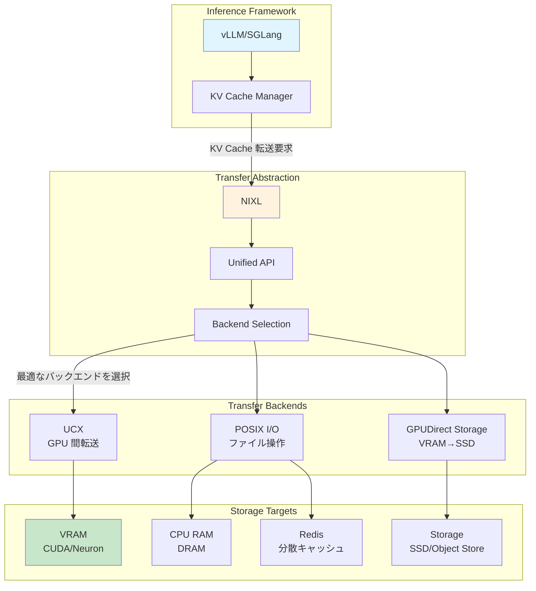

## はじめに

本記事は GitHub PR #1258「AWS Neuron Accelerator Support for NIXL」についての内容をまとめたものです。

https://github.com/ai-dynamo/nixl/pull/1258

### NIXL とは何か

**NIXL (NVIDIA Inference Xfer Library)** は、LLM 推論における **高速・低遅延の転送抽象化**ライブラリです。

LLM 推論では、KV キャッシュ（過去のトークンの key/value）がシーケンス長に比例してメモリを消費します。長いコンテキストを扱う場合、VRAM だけでは足りず、CPU RAM やストレージに退避する実装が主流です。

**NIXL が解決する問題**

LLM 推論における転送処理では、転送元と転送先の組み合わせに応じて最適なプロトコルが異なります。例えば、VRAM から VRAM への GPU 間転送では UCX を使いたい場合があります。また、VRAM から SSD へのストレージ退避では GPUDirect Storage が有効です。さらに、CPU RAM からファイルへの永続化では POSIX I/O が適しています。

これらの最適なプロトコル選択を、NIXL が**統一 API の裏で自動的に行います**。アプリケーション側は「どこに置くか」だけを指定すれば、「どうやって転送するか」は NIXL が対応します。

https://engineers.ntt.com/entry/202505-nixl/entry

上記エンジニアブログが非常にわかりやすかったです。


### 今回の PR 対応で何ができるようになったか

:::message
**技術的には**、AWS Neuron チップのメモリが、NIXL の転送対象として扱えるようになった。
:::

:::message alert
**ユーザー視点では**、**vLLM や SGLang などの推論フレームワークで、Neuron チップを使いながら KV キャッシュの柔軟な配置ができる**
- Neuron のデバイスメモリ が足りない場合に、CPU RAM や Redis、ストレージなどにオフロードする選択肢が Neuron 環境でも使える
- コードをほとんど変えずに、GPU 環境と Neuron 環境を切り替えられる（かも？）
:::

### vLLM との関係

**vLLM や SGLang がすでに NIXL サポートを実装しています**。私の理解では vLLM は NIXL CPU Offloading などの Connector を選択して利用する形態です。つまり、vLLM で NIXL に対応していることで今後 Neuron でも GPU 同様に NIXL Connector で柔軟に KV キャッシュをオフロードできる可能性があります（[vllm-neuron](https://github.com/vllm-project/vllm-neuron) 側の対応も必要だと思います）。これによって価格面での GPU に対する優位性も考慮すると LLM 推論ワークロードでの AWS Neuron の採用の現実性がより高くなってくると思われます。

https://blog.vllm.ai/2026/01/08/kv-offloading-connector.html

## コンポーネントの関係性



### 各層の役割

::::details Inference Framework 層（vLLM/SGLang）

この層の役割は、ユーザーが直接触る推論エンジンを提供することです。

vLLM の KV Cache Manager は、様々な判断を行います。例えば、新しいリクエストの KV キャッシュをどこに配置するか、VRAM が不足したらどこにオフロードするか、Prefix Caching（共通プレフィックスの再利用）をどう管理するかといった判断です。

この「どこに配置するか」の実装に、NIXL の API を使います。

::::

::::details Transfer Abstraction 層（NIXL）

この層の役割は、転送先と転送方法を切り離すことです。

NIXL は統一 API を提供しています。

ユーザーは「どこからどこへ」を指定するだけで、NIXL が裏で最適な処理を行います。具体的には、メモリペアに応じた最適なプロトコルを選択し、ネットワーク経由かローカルかを判断し、最適な転送パスを構築します。

::::

::::details Transfer Backends 層

UCX (Unified Communication X) は、GPU 間の高速転送（NVLink、InfiniBand）や RDMA によるゼロコピー転送を提供します。

GPUDirect Storage (GDS) は、VRAM から SSD への直接転送を実現します。CPU メモリを経由しないため高速です。

POSIX I/O は、通常のファイル操作や Redis などの分散ストアへのアクセスを担当します。

NIXL はこれらを**プラグインアーキテクチャ**で統合しており、新しいバックエンドの追加が容易です。

::::

::::details Storage Targets 層

VRAM (CUDA/Neuron) は最速ですが、サイズ制限があります。今回の PR で Neuron VRAM も対象になりました。

CPU RAM (DRAM) は VRAM より遅いですが大容量です。よく使われるオフロード先となっています。

Redis（分散キャッシュ）は複数ノードで共有でき、Prefix Caching の共有に有用です。

Storage (SSD/Object Store) は最も遅いですが大容量です。

::::

## PR #1258 が実現すること

PR #1258 の変更を理解するには、2 つの技術要素を知る必要があります。

**libfabric とは**
高性能ネットワーク通信のための標準ライブラリで、InfiniBand、RoCE、AWS EFA など、異なるネットワーク技術を統一 API で扱え、NIXL はこの libfabric を使って、実際のデータ転送を実行します。

**FI_HMEM とは**
libfabric の機能で、**異種メモリ** を扱うためのインターフェースです。CPU メモリ以外のデバイスメモリ（GPU、AI チップなど）を抽象化しており、各ハードウェアベンダーが `FI_HMEM_XXX` という形で対応を追加しています。

つまり、**NIXL が「どこに置くか」を決め、libfabric + FI_HMEM が「どうやって転送するか」を実行**します。

### 1. Neuron VRAM を NIXL の転送対象に追加

この PR の内容は、libfabric に **`FI_HMEM_NEURON` インターフェースのサポートを追加する**ことです。

```c
// libfabric の異種メモリインターフェース
enum fi_hmem_iface {
    FI_HMEM_SYSTEM,    // CPU メモリ
    FI_HMEM_CUDA,      // NVIDIA GPU
    FI_HMEM_NEURON,    // AWS Neuron ← この PR で対応
    FI_HMEM_ROCR,      // AMD GPU
    FI_HMEM_ZE,        // Intel GPU
};
```

**何が変わるか**

```python
# 従来（GPU のみ）
nixl.transfer(src="cuda:0", dst="cpu: ram", data=kv_cache)  # OK
nixl.transfer(src="neuron:0", dst="cpu: ram", data=kv_cache)  # NG（非対応）

# 今回の PR 後
nixl.transfer(src="neuron:0", dst="cpu: ram", data=kv_cache)  # OK
nixl.transfer(src="neuron:0", dst="storage: s3", data=kv_cache)  # OK
```

Neuron チップのメモリが、GPU と同じように NIXL の転送対象として扱えます。

## まとめ

この PR によって、NIXL の優れた抽象化の仕組みを使った KV キャッシュ管理が、AWS Neuron にも広がることが想定されます。今後、NIXL Connector がデファクトとなっていけば kubernetes などで AWS Neuron デバイス、GPU 混在の環境で統一的に KV キャッシュを効率的に関することも容易になりそうですね。

## 参考文献

- [NIXL GitHub Repository](https://github.com/ai-dynamo/nixl)
- [PR #1258: AWS Neuron Accelerator Support](https://github.com/ai-dynamo/nixl/pull/1258)
- [NTT エンジニアブログ: NIXL 解説](https://engineers.ntt.com/entry/202505-nixl/entry)
- [AWS Neuron 公式ドキュメント](https://awsdocs-neuron.readthedocs-hosted.com/)
- [libfabric 公式サイト](https://ofiwg.github.io/libfabric/)
- [FI_HMEM_NEURON 追加コミット (2021-12-21)](https://github.com/ofiwg/libfabric/commit/ab52ce8d966d98af63aa6307e1454050b07a38fa)
