## 概要

本文書では、トレーニング用途に特化した AWS Trainium チップのアーキテクチャについて、初代 Trainium から最新の Trainium3 まで、世代順に技術的観点から包括的に解説します。

AWS Neuron のアーキテクチャは、深層学習モデルのトレーニングと推論を高速かつ効率的に実行するために、カスタム設計された複数の世代にわたるチップ技術と、それらを統合したスケーラブルなインスタンス構成から成り立っています。本文書では、AWS Inferentia に関する内容は割愛し、トレーニング用途の AWS Trainium チップに焦点を当てて説明します。

## AWS Trainium チップアーキテクチャ

AWS Trainium は、AWS が独自に設計した機械学習トレーニング専用のアクセラレータチップです。現在、初代 Trainium から Trainium3 までの 3 つの世代が展開されており、各世代において演算性能、メモリ容量、相互接続帯域幅などの重要な性能指標が大幅に向上しています。本節では、初代 Trainium から順に、各世代の特徴と世代間の主要な変更点について解説します。

### Trainium（初代）アーキテクチャ


[Trainium](https://awsdocs-neuron.readthedocs-hosted.com/en/latest/about-neuron/arch/neuron-hardware/trainium.html) は、AWS が開発した第 2 世代の機械学習専用アクセラレータであり、Trn1 インスタンスの中核を成すチップです。Trn1 インスタンスには 16 個の Trainium チップが搭載されており、各 Trainium チップには 2 つの NeuronCore-v2 が含まれています。

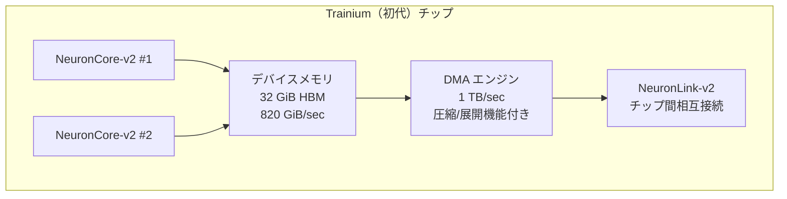

#### 主要コンポーネント

初代 Trainium チップは以下のコンポーネントで構成されています。

| コンポーネント | 仕様 |
|--------------|------|
| **計算性能** | • 2 つの NeuronCore-v2 を搭載<br/>• 380 INT8 TOPS<br/>• 190 FP16/BF16/cFP8/TF32 TFLOPS<br/>• 47.5 FP32 TFLOPS |
| **デバイスメモリ** | • 32 GiB HBM<br/>• 820 GiB/sec メモリ帯域幅 |
| **データ移動機構** | • 1 TB/sec DMA 帯域幅<br/>• インラインメモリ圧縮および展開機能 |
| **NeuronLink-v2 相互接続** | • チップ間相互接続<br/>• 効率的なスケールアウトトレーニング<br/>• チップ間メモリプーリング対応 |
| **プログラマビリティ** | • 動的な形状と制御フローのサポート<br/>• プログラム可能な[丸め処理モード](https://awsdocs-neuron.readthedocs-hosted.com/en/latest/about-neuron/arch/neuron-features/rounding-modes.html)（RNE / Stochastic Rounding）<br/>• GPSIMD エンジンによるカスタムオペレータ実装 |

### Trainium から Trainium2 への主要な変更点

Trainium2 は、初代 Trainium と比較して大幅な性能向上とアーキテクチャの刷新を実現しています。

#### アーキテクチャの変更

| 変更項目 | Trainium（初代） | Trainium2 | 変化率 |
|---------|----------------|-----------|--------|
| **NeuronCore 数** | 2 個の NeuronCore-v2 | 8 個の NeuronCore-v3 | 4 倍 |
| **FP8 演算性能** | 191 TFLOPS | 1,299 TFLOPS | 6.7 倍 |
| **BF16/FP16/TF32 演算性能** | 191 TFLOPS | 667 TFLOPS | 3.4 倍 |
| **FP32 演算性能** | 48 TFLOPS | 181 TFLOPS | 3.7 倍 |
| **スパース演算** | 未対応 | 2,563 TFLOPS（FP8/FP16/BF16/TF32） | 新規追加 |
| **HBM 容量** | 32 GiB | 96 GiB | 3 倍 |
| **HBM 帯域幅** | 0.8 TB/sec | 2.9 TB/sec | 3.6 倍 |
| **SBUF 容量** | 48 MiB | 224 MiB | 4.7 倍 |
| **メモリプールサイズ** | 最大 16 チップ | 最大 64 チップ | 4 倍 |
| **チップ間相互接続** | 384 GB/sec | 1,280 GB/sec | 3.3 倍 |
| **CC-Cores 数** | 6 個 | 16 個 | 3.3 倍 |
| **DMA 帯域幅** | 1 TB/sec | 3.5 TB/sec | 3.5 倍 |
| **DMA バリア機構** | Write-after-write | Strong-order-write | 強化 |
| **SBUF メモリレイアウト** | Row-major のみ | Row-major<br/>Col-major-2B<br/>Col-major-4B | 拡張 |

初代 Trainium から Trainium2 への移行では、NeuronCore 数の 4 倍増、計算性能の 6.7 倍向上（FP8）、メモリ容量の 3 倍増など、大幅なアーキテクチャの刷新が実現されています。

:::details DMA バリア機構の詳細

DMA（Direct Memory Access）バリア機構は、メモリアクセスの順序を制御し、データの一貫性を保証する重要な機能です。

**Write-after-write（初代 Trainium）**

初代 Trainium では、Write-after-write バリア機構を採用していました。この方式では、同じメモリ領域に対する書き込み操作の順序のみが保証されます。

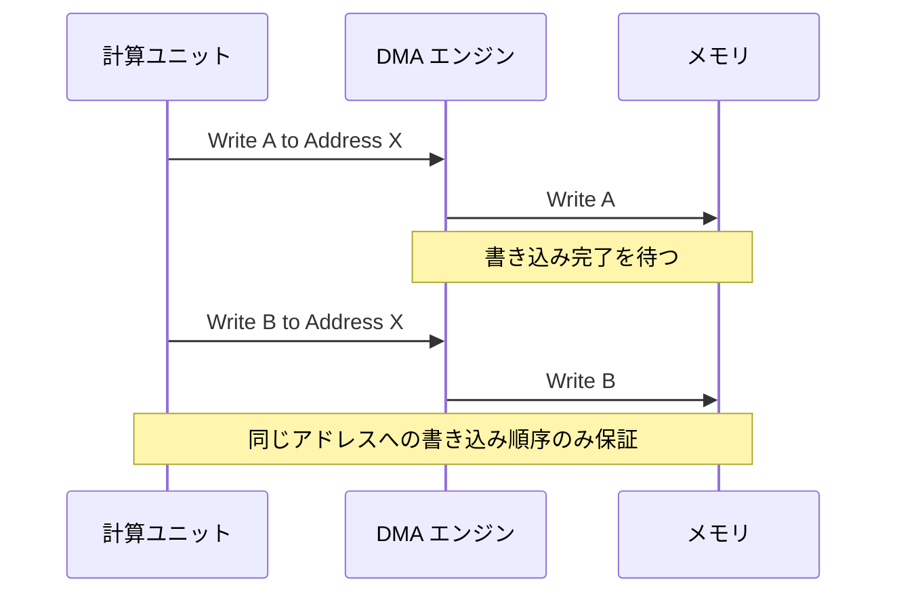

この方式の特徴：
- 同一アドレスへの連続した書き込みの順序は保証される
- 異なるアドレスへの書き込みは並列実行が可能で高速
- ただし、複雑なメモリアクセスパターンでは順序制御が必要な場合がある

**Strong-order-write（Trainium2 以降）**

Trainium2 では、より厳格な Strong-order-write バリア機構に強化されました。この方式では、すべての書き込み操作の順序が厳密に保証されます。

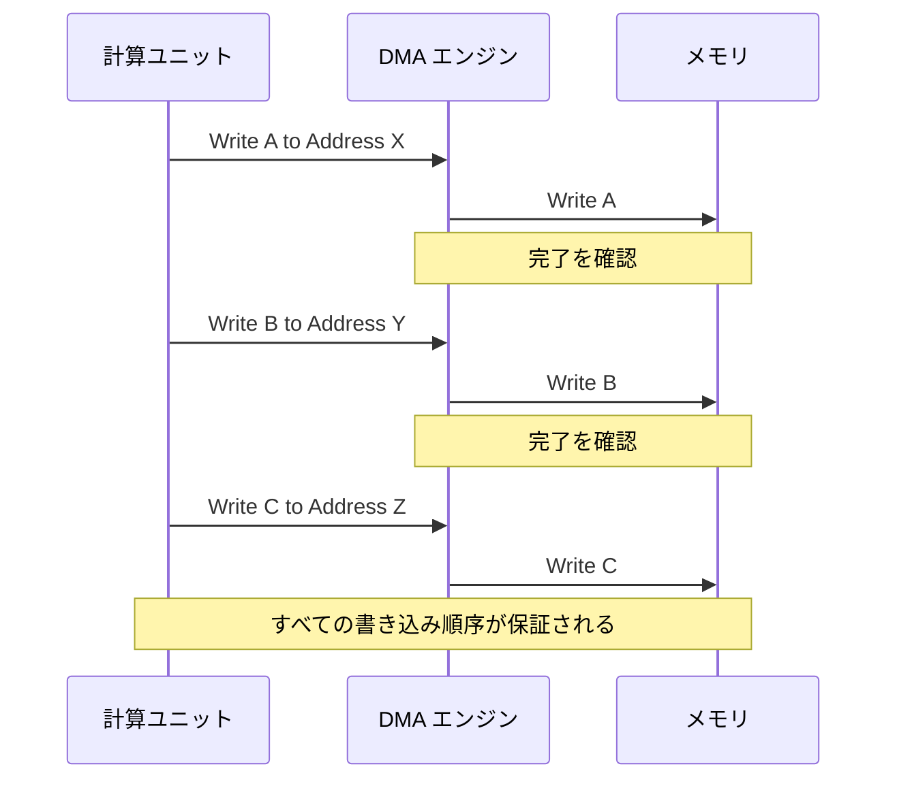

この方式の利点：
- すべてのメモリ書き込み操作の順序が厳密に保証される
- データの一貫性が向上し、デバッグが容易になる
- 複雑な並列処理における予期しないメモリアクセス競合を回避できる
- 分散トレーニングにおける同期処理の信頼性が向上

この強化により、Trainium2 では大規模な分散トレーニングにおいても、より安全で予測可能なメモリアクセスが実現されています。

:::

:::details SBUF メモリレイアウトの詳細

SBUF（State Buffer）は、NeuronCore のオンチップ SRAM の一部で、Tensor Engine と他のエンジン間でのデータ交換に使用される高速バッファメモリです。メモリレイアウトは、テンソルデータの格納方式を定義し、演算効率に大きな影響を与えます。

**Row-major レイアウト（全世代対応）**

Row-major は、2 次元配列の行を連続したメモリ領域に格納する方式です。C 言語や Python の NumPy で標準的に使用されるレイアウトです。

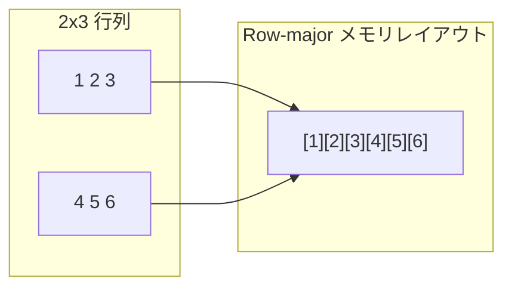

行列要素のメモリ配置：
```
Matrix[0,0]=1, Matrix[0,1]=2, Matrix[0,2]=3
Matrix[1,0]=4, Matrix[1,1]=5, Matrix[1,2]=6

メモリ: [1][2][3][4][5][6]
        ←─ 行 0 ─→←─ 行 1 ─→
```

**Col-major レイアウト（Trainium2 以降）**

Column-major は、列を連続したメモリ領域に格納する方式です。Fortran や MATLAB で標準的に使用されます。

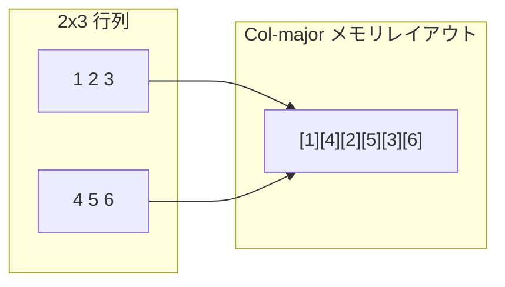

**Col-major-2B と Col-major-4B の違い**

Trainium2 では、2 つの異なる Col-major バリアント が追加されました：

1. **Col-major-2B**: 2 バイト単位でのカラム優先レイアウト
   - FP16、BF16 などの 16 ビットデータ型に最適化
   - 2 バイト境界でアライメントされたアクセスが効率的

2. **Col-major-4B**: 4 バイト単位でのカラム優先レイアウト
   - FP32 などの 32 ビットデータ型に最適化
   - 4 バイト境界でアライメントされたアクセスが効率的

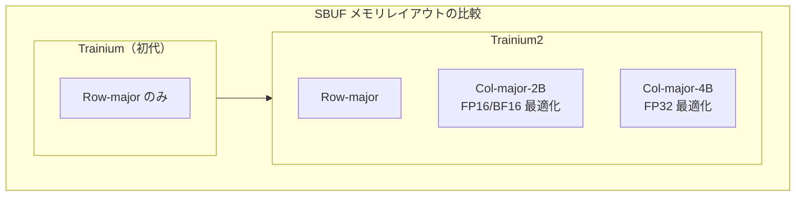

**メモリレイアウトの選択による性能への影響**

適切なメモリレイアウトの選択により、以下の最適化が可能になります：

1. **行列演算の効率化**
   - 行列の乗算方向に応じて最適なレイアウトを選択
   - キャッシュヒット率の向上

2. **データ型に応じた最適化**
   - 16 ビットデータには Col-major-2B
   - 32 ビットデータには Col-major-4B
   - メモリアライメントの最適化によるアクセス高速化

3. **外部ライブラリとの互換性**
   - PyTorch: Row-major（デフォルト）
   - TensorFlow: 設定可能
   - NumPy: Row-major（デフォルト）
   - 必要に応じてレイアウト変換を行うことで最適な性能を実現

Trainium2 でのこれらのレイアウトオプションの追加により、様々なワークロードに対して柔軟かつ効率的なメモリアクセスが可能になりました。

:::

#### 新機能の追加

**論理 NeuronCore 構成（LNC）**

Trainium2 から導入された最も重要な新機能の一つが、論理 NeuronCore 構成（Logical NeuronCore Configuration, LNC）です。この機能により、複数の物理的な NeuronCore の計算リソースとメモリリソースを組み合わせて、単一の論理的な NeuronCore として使用することができます。これにより、ワークロードに応じた柔軟なリソース配分が可能になります。

**調整可能な指数バイアス**

NeuronCore-v3 では、cFP8 データ型に対する調整可能な指数バイアス（adjustable exponent biasing）がサポートされ、より精密な数値表現が可能になりました。

### Trainium2 アーキテクチャ


[Trainium2](https://awsdocs-neuron.readthedocs-hosted.com/en/latest/about-neuron/arch/neuron-hardware/trainium2.html) は、AWS が開発した第 3 世代の機械学習専用チップです。各 Trainium2 チップには、8 つの NeuronCore-v3 コアが搭載されています。

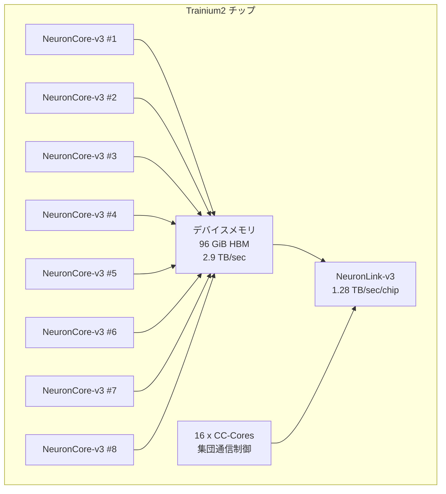

#### 主要コンポーネント

Trainium2 チップは以下のコンポーネントで構成されています。

| コンポーネント | 仕様 |
|--------------|------|
| **計算性能** | • 8 つの NeuronCore-v3 を搭載<br/>• 1,299 FP8 TFLOPS<br/>• 667 BF16/FP16/TF32 TFLOPS<br/>• 2,563 TFLOPS（スパース演算）<br/>• 181 FP32 TFLOPS |
| **デバイスメモリ** | • 96 GiB HBM<br/>• 2.9 TB/sec メモリ帯域幅 |
| **データ移動機構** | • 3.5 TB/sec DMA 帯域幅<br/>• インラインメモリ圧縮および展開機能 |
| **NeuronLink-v3 相互接続** | • チップ間相互接続<br/>• 1.28 TB/sec 帯域幅/チップ<br/>• 効率的なスケールアウトトレーニング<br/>• チップ間メモリプーリング対応 |
| **プログラマビリティ** | • 動的な形状と制御フローのサポート<br/>• プログラム可能な[丸め処理モード](https://awsdocs-neuron.readthedocs-hosted.com/en/latest/about-neuron/arch/neuron-features/rounding-modes.html)（RNE / Stochastic Rounding）<br/>• GPSIMD エンジンによるカスタムオペレータ実装 |
| **集団通信機能** | • 16 個の CC-Cores<br/>• インスタンス内/間の集団通信調整 |

### Trainium2 から Trainium3 への主要な変更点

Trainium3 は、Trainium2 のアーキテクチャを基盤としつつ、特定の領域において重要な性能向上を実現しています。

#### アーキテクチャの変更

| 変更項目 | Trainium2 | Trainium3 | 向上率 |
|---------|-----------|-----------|--------|
| **MXFP4/MXFP8 演算性能** | 未対応 | 2,517 TFLOPS | 新規追加 |
| **FP8 演算性能** | 1,299 TFLOPS | 2,517 TFLOPS | 1.9 倍 |
| **BF16/FP16/TF32 演算性能** | 667 TFLOPS | 671 TFLOPS | 1.0 倍 |
| **FP32 演算性能** | 181 TFLOPS | 183 TFLOPS | 1.0 倍 |
| **HBM 容量** | 96 GiB | 144 GiB | 1.5 倍 |
| **HBM 帯域幅** | 2.9 TB/sec | 4.9 TB/sec | 1.7 倍 |
| **SBUF 容量** | 224 MiB | 256 MiB | 1.14 倍 |
| **チップ間相互接続** | 1,280 GB/sec | 2,560 GB/sec | 2.0 倍 |
| **DMA 帯域幅** | 3.5 TB/sec | 4.9 TB/sec | 1.4 倍 |
| **NeuronCore 数** | 8 個の NeuronCore-v3 | 8 個の NeuronCore-v4 | 変更なし |
| **CC-Cores 数** | 16 個 | 16 個 | 変更なし |

Trainium2 から Trainium3 への移行では、MXFP4 データ型の新規サポート、FP8 演算性能の 2 倍向上、チップ間相互接続帯域幅の 2 倍向上など、特定領域における重要な性能向上が実現されています。

#### 新機能の追加

**MXFP4 データ型サポート**

Trainium3 では、Open Compute Project（OCP）に準拠した MXFP4 データ型フォーマットがサポートされ、より低精度の演算により、メモリ効率と計算効率のさらなる向上を実現します。

**近メモリ累積機能**

NeuronCore-v4 の SRAM には、近メモリ累積（near-memory accumulation）機能が新たに導入されています。これにより、DMA エンジンが単一の転送操作で既存の SRAM データに対して読み取り・加算・書き込み操作を実行できるようになり、データ移動の効率が向上しています。

**Vector Engine の機能強化**

NeuronCore-v4 Vector Engine には 2 つの新機能が追加されています。1 つ目は、BF16/FP16 から MXFP8 データ型フォーマットへのデータ量子化機能で、MLP 層間でのオンラインデータ量子化に有用です。2 つ目は、高速指数関数評価機能で、Scalar Engine での指数関数計算と比較して 4 倍高いスループットを実現し、Self-Attention 機構の高速化に寄与しています。

### Trainium3 アーキテクチャ


[Trainium3](https://awsdocs-neuron.readthedocs-hosted.com/en/latest/about-neuron/arch/neuron-hardware/trainium3.html) は、AWS が開発した第 4 世代の機械学習専用チップであり、2026 年 1 月時点における最新世代のトレーニングアクセラレータです。1 つの Trainium3 デバイスには、8 つの NeuronCore-v4 コアが搭載されています。Trainium2 から導入された論理 NeuronCore 構成（LNC）機能を引き続きサポートしており、複数の物理的な NeuronCore の計算リソースとメモリリソースを統合して、単一の論理的な NeuronCore として扱うことが可能です。

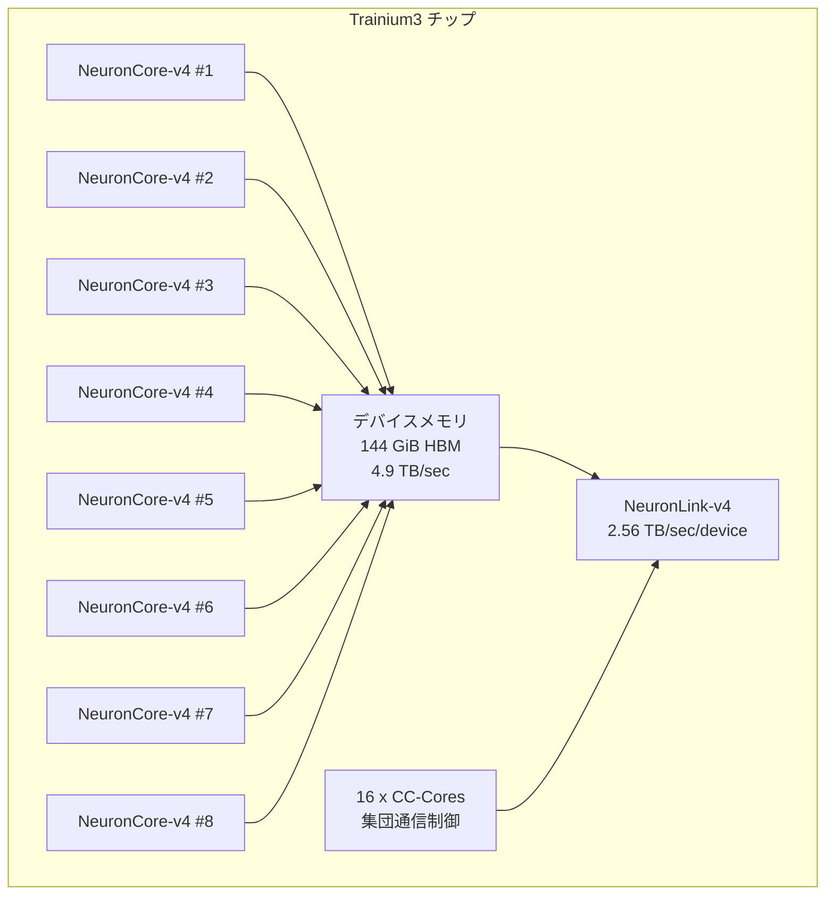

#### 主要コンポーネント

Trainium3 チップは以下のコンポーネントで構成されています。

| コンポーネント | 仕様 |
|--------------|------|
| **計算性能** | • 8 つの NeuronCore-v4 を搭載<br/>• 2,517 MXFP8/MXFP4 TFLOPS<br/>• 671 BF16/FP16/TF32 TFLOPS<br/>• 2,517 TFLOPS（スパース演算）<br/>• 183 FP32 TFLOPS<br/>• OCP 準拠データ型フォーマット |
| **デバイスメモリ** | • 144 GiB HBM<br/>• 4.9 TB/sec メモリ帯域幅 |
| **データ移動機構** | • 4.9 TB/sec DMA 帯域幅<br/>• インライン計算機能 |
| **NeuronLink-v4 相互接続** | • デバイス間相互接続<br/>• 2.56 TB/sec 帯域幅/デバイス<br/>• 効率的なスケールアウトトレーニング<br/>• デバイス間メモリプーリング対応 |
| **プログラマビリティ** | • 動的な形状と制御フローのサポート<br/>• プログラム可能な[丸め処理モード](https://awsdocs-neuron.readthedocs-hosted.com/en/latest/about-neuron/arch/neuron-features/rounding-modes.html)（RNE / Stochastic Rounding）<br/>• GPSIMD エンジンによるカスタムオペレータ実装 |
| **集団通信機能** | • 16 個の CC-Cores<br/>• サーバー内/間の集団通信調整<br/>• 分散トレーニングのデータ同期 |

## NeuronCore アーキテクチャ

NeuronCore は、Trainium チップを構成する完全に独立したヘテロジニアスな計算ユニットです。各世代の NeuronCore は、機械学習ワークロードに特化した複数の専用エンジンと、ソフトウェア管理されるオンチップ SRAM メモリを統合しています。

**注記**: NeuronCore-v1 は AWS Inferentia チップ向けのアーキテクチャであり、本文書ではトレーニング用途の Trainium チップに焦点を当てているため割愛します。以下では、Trainium チップに搭載される NeuronCore-v2 から NeuronCore-v4 までの 3 世代のアーキテクチャについて、世代間の主要な変更点を中心に解説します。

### NeuronCore の基本構成


全 NeuronCore 世代に共通する基本構成として、4 つの専用エンジンが搭載されています。

- **Tensor Engine**: シストリックアレイに基づく設計で、GEMM、畳み込み演算、転置操作などのテンソル計算に最適化
- **Vector Engine**: 複数の入力要素に依存するベクトル計算（Layer Normalization、Pooling など）に最適化
- **Scalar Engine**: 要素単位のスカラー計算に最適化
- **GPSIMD Engine**: 完全にプログラム可能なベクトルプロセッサで、カスタムオペレータの実装が可能

各世代において、これらのエンジンの性能、機能、データ型サポートが進化しています。例えば、NeuronCore-v4 の主な改善点は、MXFP4 データ型対応、オンチップ SRAM 容量の増加（32 MiB）、近メモリ累積機能、Vector Engine でのデータ量子化および高速指数関数機能の追加です。

## Trainium 世代間の性能推移

AWS Trainium チップの 3 世代にわたる性能向上を、主要な性能指標ごとに視覚化します。以下のグラフは、初代 Trainium を基準として、各世代の絶対的な性能値と世代間の向上率を示しています。

### 計算性能の推移

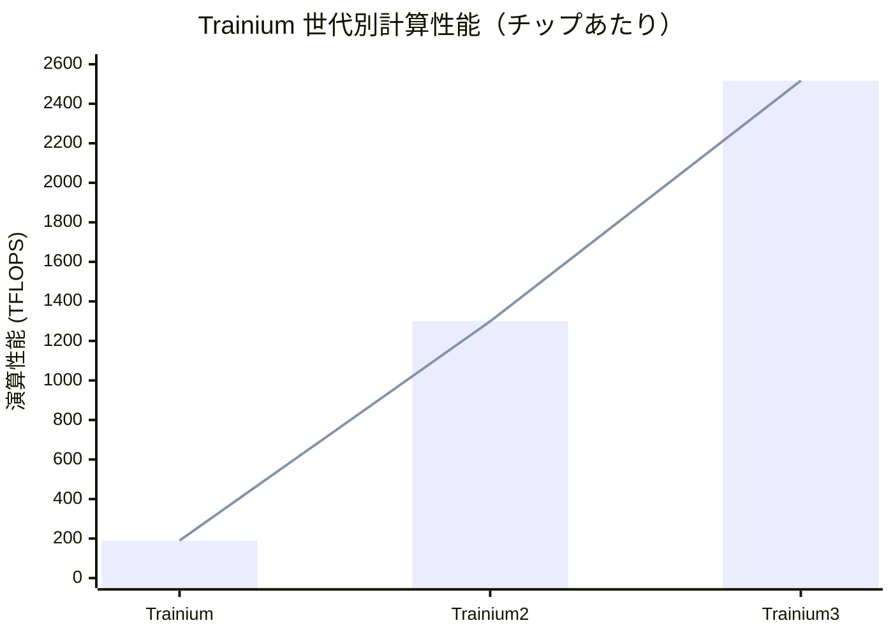

**FP8 演算性能の推移:**
- Trainium: 190 TFLOPS（基準）
- Trainium2: 1,299 TFLOPS（6.8倍）
- Trainium3: 2,517 TFLOPS（13.2倍、前世代比1.9倍）

初代 Trainium から Trainium3 まで、FP8 演算性能は約 13 倍に向上しています。特に初代から Trainium2 への移行で 6.8 倍という大幅な性能向上を実現し、Trainium3 ではさらに 2 倍近い向上を達成しています。

### メモリ性能の推移

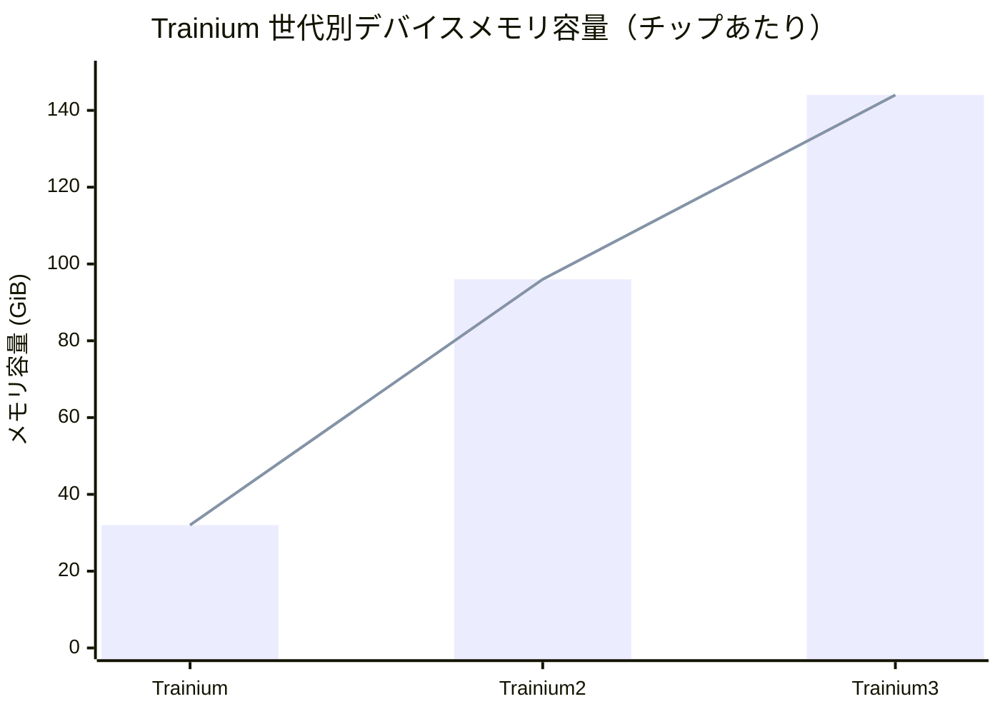

**デバイスメモリ容量の推移:**
- Trainium: 32 GiB（基準）
- Trainium2: 96 GiB（3倍）
- Trainium3: 144 GiB（4.5倍、前世代比1.5倍）

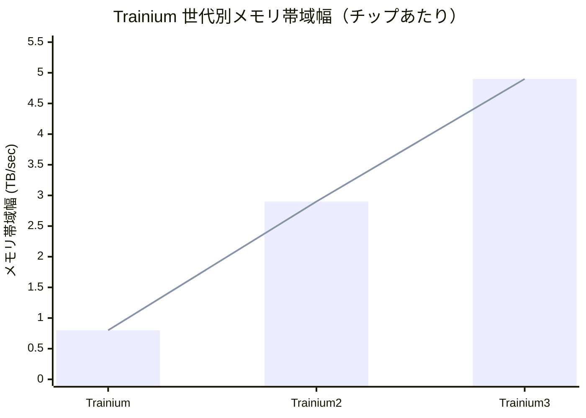

**メモリ帯域幅の推移:**
- Trainium: 0.8 TB/sec（基準）
- Trainium2: 2.9 TB/sec（3.6倍）
- Trainium3: 4.9 TB/sec（6.1倍、前世代比1.7倍）

メモリ容量は初代から 4.5 倍、帯域幅は 6.1 倍に向上しており、より大規模なモデルのトレーニングと高速なデータアクセスを可能にしています。

### 相互接続帯域幅の推移

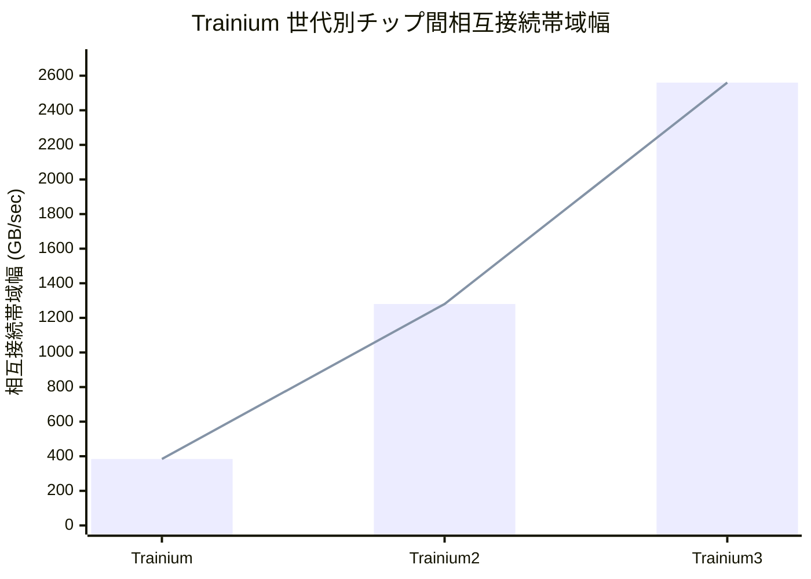

**チップ間相互接続帯域幅の推移:**
- Trainium: 384 GB/sec（基準）
- Trainium2: 1,280 GB/sec（3.3倍）
- Trainium3: 2,560 GB/sec（6.7倍、前世代比2.0倍）

相互接続帯域幅は初代から6.7倍に向上しており、分散トレーニングにおける通信オーバーヘッドの削減に大きく寄与しています。

### 総合性能向上率まとめ

初代 Trainium を基準（1倍）とした場合の各世代の性能向上率は以下の通りです。

| 性能指標 | Trainium | Trainium2 | Trainium3 |
|---------|---------|-----------|-----------|
| **FP8 演算性能** | 1.0x | 6.8x | 13.2x |
| **BF16 演算性能** | 1.0x | 3.5x | 3.5x |
| **デバイスメモリ容量** | 1.0x | 3.0x | 4.5x |
| **メモリ帯域幅** | 1.0x | 3.6x | 6.1x |
| **チップ間相互接続** | 1.0x | 3.3x | 6.7x |
| **NeuronCore 数** | 1.0x | 4.0x | 4.0x |

これらの数値から、AWS Trainium は各世代において一貫して性能向上を実現していることがわかります。特に FP8 演算性能、メモリ帯域幅、チップ間相互接続において顕著な向上が見られ、大規模な深層学習モデルのトレーニングに必要な性能を継続的に強化しています。

## まとめ

AWS Neuron アーキテクチャは、深層学習のトレーニングワークロードに特化した専用ハードウェアとソフトウェアの統合システムです。本文書では、初代 Trainium から Trainium3 までの 3 世代にわたる進化について、世代順に包括的に解説しました。

初代 Trainium は 2 個の NeuronCore-v2 を搭載し、190 FP16 TFLOPS の演算性能を提供しました。Trainium2 では 8 個の NeuronCore-v3 への増強により、FP8 演算性能が 1,299 TFLOPS へと 6.7 倍に向上し、メモリ容量も 96 GiB へと 3 倍に拡大しました。最新の Trainium3 では、MXFP4 データ型のサポートにより 2,517 TFLOPS の演算性能を実現し、メモリ容量は 144 GiB、相互接続帯域幅は 2.56 TB/sec へとさらに向上しています。

各世代において、単なるハードウェア性能の向上だけでなく、プログラマビリティの向上も重視されています。論理 NeuronCore 構成（LNC）、調整可能な指数バイアス、近メモリ累積機能、データ量子化機能など、開発者が柔軟にアルゴリズムを実装できる環境が継続的に強化されています。

AWS Neuron アーキテクチャは、クラウドスケールの機械学習トレーニングを実現するための包括的なソリューションとして設計されており、研究開発から本番環境まで、幅広い機械学習ワークロードに対応可能な基盤を提供しています。

## 参考文献

本文書で参照した公式ドキュメントは以下の通りです。

- [AWS Neuron アーキテクチャガイド](https://awsdocs-neuron.readthedocs-hosted.com/en/latest/about-neuron/arch/index.html)
- [Trainium アーキテクチャ](https://awsdocs-neuron.readthedocs-hosted.com/en/latest/about-neuron/arch/neuron-hardware/trainium.html)
- [Trainium2 アーキテクチャ](https://awsdocs-neuron.readthedocs-hosted.com/en/latest/about-neuron/arch/neuron-hardware/trainium2.html)
- [Trainium3 アーキテクチャ](https://awsdocs-neuron.readthedocs-hosted.com/en/latest/about-neuron/arch/neuron-hardware/trainium3.html)
- [NeuronCore-v2 アーキテクチャ](https://awsdocs-neuron.readthedocs-hosted.com/en/latest/about-neuron/arch/neuron-hardware/neuron-core-v2.html)
- [NeuronCore-v3 アーキテクチャ](https://awsdocs-neuron.readthedocs-hosted.com/en/latest/about-neuron/arch/neuron-hardware/neuron-core-v3.html)
- [NeuronCore-v4 アーキテクチャ](https://awsdocs-neuron.readthedocs-hosted.com/en/latest/about-neuron/arch/neuron-hardware/neuron-core-v4.html)
- [Neuron 丸め処理モード](https://awsdocs-neuron.readthedocs-hosted.com/en/latest/about-neuron/arch/neuron-features/rounding-modes.html)

---

**注意事項**: 本文書の内容は、参照時点での公式ドキュメントに基づいています。最新の情報については、上記の公式ドキュメントを直接ご参照ください。
