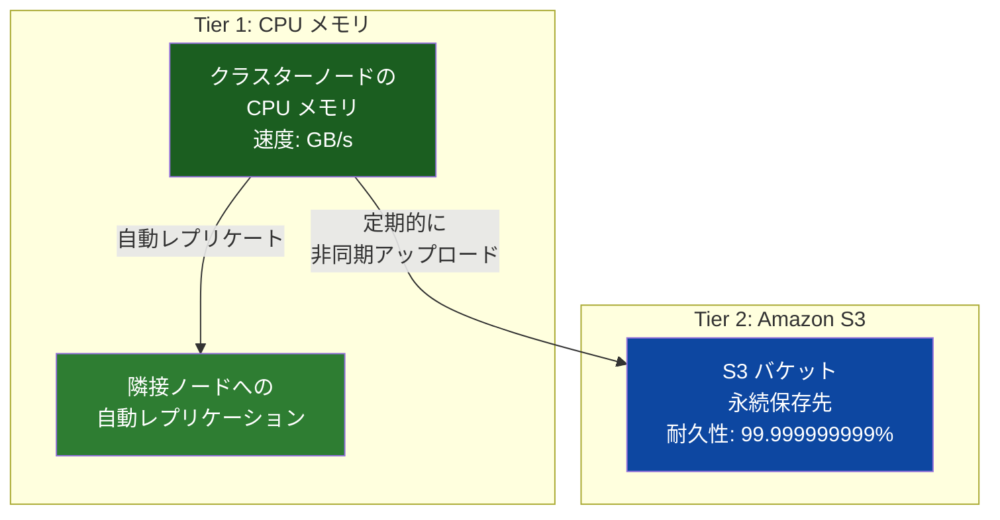
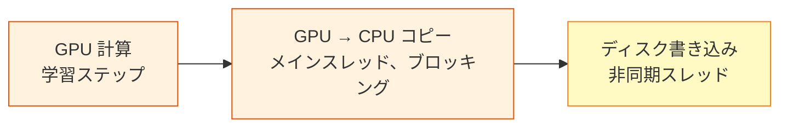
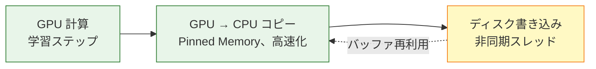
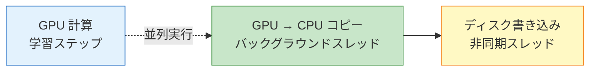
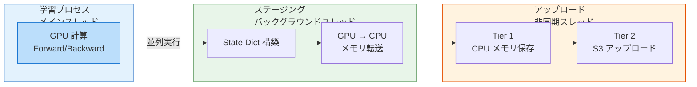

## はじめに

本記事は SageMaker HyperPod 機能解説シリーズの一部です。以下の記事も公開済みですので、あわせて参照してください。

https://zenn.dev/yunokiisshin/articles/45a746434b2090

https://zenn.dev/yunokiisshin/articles/be0db364a7f8e2

大規模な分散学習では、チェックポイント保存が学習スループットの低下要因になります。大規模言語モデル（70B パラメータ以上）のチェックポイントは数百 GB に及ぶことがあり、チェックポイント書き込み中は GPU が待機状態となります。

Amazon SageMaker HyperPod の **Managed Tiered Checkpointing** は、保存先を CPU メモリと Amazon S3 の 2 階層に分けることで、保存の高速化とコスト削減を両立する機能です。本記事では、仕組み、実装方法、パフォーマンス特性、および FSx for Lustre + DRA（Data Repository Association）との使い分けを解説します。

:::message alert
本記事は 2026 年 2 月時点の公式ドキュメント、オープンソースコードなどに基づく調査記事です。内容に誤りがある可能性もあるため、必ず最新の公式ドキュメントを正として確認してください。誤りを発見された場合はコメントでお知らせください。
:::

## 概要と FSx + DRA との比較

:::message
本機能は [EKS 環境でのセットアップ手順が公式ドキュメントに記載](https://docs.aws.amazon.com/sagemaker/latest/dg/managed-tier-checkpointing-setup.html)されています。Slurm 環境での利用可否については、公式ドキュメントに明示的な記載がないため、最新の情報を AWS に確認してください。

**FSx for Lustre との併用について**: Managed Tiered Checkpointing と FSx for Lustre + DRA は技術的に併用可能ですが、どちらも Amazon S3 にチェックポイントを永続化するため、チェックポイント保存の役割が重複します。FSx が構築済みの場合は、FSx をデータセット保存に、Managed Tiered Checkpointing をチェックポイント保存に使い分けることを推奨します。
:::

### FSx for Lustre + Data Repository Association（DRA）

HyperPod では **[Amazon FSx for Lustre](https://aws.amazon.com/fsx/lustre/) + [DRA](https://docs.aws.amazon.com/fsx/latest/LustreGuide/create-dra-linked-data-repo.html)** によるチェックポイント保存も広く利用されています。


FSx + DRA の処理フローは、学習スクリプトが `torch.save()` で FSx に書き込み（書き込み完了まで学習を中断）、DRA が変更を検知して S3 へのエクスポートをスケジュールし、バックグラウンドで S3 に永続化するというものです。この方式は、POSIX 互換の共有ファイルシステムが必要な場合や、複数ノード間でのデータセット共有が必須な環境に適しています。

一方、Managed Tiered Checkpointing は、CPU メモリを活用した高速化とコスト最適化を重視した設計です。以下に両方式の特性を比較します。

| 比較項目 | FSx + DRA | Managed Tiered Checkpointing |
|---------|------------------|----------------------------|
| 学習の中断時間 | FSx 書き込み完了まで中断[^2] | Level 3（PyTorch 2.9+）使用時は学習と並列実行、Level 1/2 ではメモリコピー完了まで中断[^4] |
| ノード障害時の復旧 | FSx または S3 から復元 | メモリレプリカから高速復旧 |
| POSIX 互換性 | あり（標準ファイルシステム） | なし（専用 API 使用） |
| データセット共有 | 得意（共有ストレージ） | S3 直接読込で対応 |
| S3 保存形式 | 単一の `.pt` ファイル | PyTorch DCP の sharded checkpoint（`.distcp`） |
| 月額ストレージコスト | FSx for Lustre 費用が発生[^1] | CPU メモリ利用で S3 のみ課金 |
| 推奨ケース | POSIX 互換性やデータセット共有が必須 | チェックポイント高速化とコスト最適化 |

以降では、Managed Tiered Checkpointing の仕組みと実装方法を詳しく解説します。

## 階層化戦略

Managed Tiered Checkpointing は **2 つの階層**でチェックポイントを管理します。高速アクセス用の主要層としてクラスターノードの **CPU メモリ（RAM）** を使用し、永続バックアップ用の副次層として **Amazon S3** を使用します。



| 階層 | 保存先 | 速度 | 耐久性 | 用途 |
|------|--------|------|--------|------|
| Tier 1 | CPU メモリ | 高速（GB/s） | ノード間レプリケーションで保護 | 高頻度保存・高速復旧 |
| Tier 2 | Amazon S3 | 低速（数百 MB/s） | 高耐久（99.999999999%） | 低頻度保存（永続バックアップ） |

### レプリケーション戦略

Tier 1（CPU メモリ）に保存されたチェックポイントは、**隣接する計算ノード間で自動的にレプリケート**されます。これにより、単一または複数のノード障害時にもデータを保護し、高速に復旧できます。

メモリ管理は、EKS 環境では Kubernetes DaemonSet としてデプロイされるメモリ管理デーモンが担当し、チェックポイント用の分散メモリ（disaggregated memory）を管理します。

:::message
`InstanceMemoryAllocationPercentage` パラメータで、チェックポイント用に割り当てる CPU メモリの割合を設定できます（20-100% の範囲で指定）。学習プロセスが使用するメモリとのバランスを考慮して設定してください。

以下は設定例です（`--tiered-storage-config` 内に含めます）。

```json
{
  "Mode": "Enable",
  "InstanceMemoryAllocationPercentage": 50
}
```
:::

## 非同期パイプライン

最大の特徴は、**学習の中断時間を短縮してチェックポイントを保存**できる点です。[PyTorch DCP（Distributed Checkpoint）](https://pytorch.org/docs/stable/distributed.checkpoint.html)の `async_save()` により非同期保存を実現し、PyTorch 2.9+ の Level 3 最適化（後述）を使用すれば学習計算と完全に並列実行されます。


Tiered Checkpointing では、Tier 1（RAM）への高速なコピーと S3 へのアップロードをバックグラウンドで非同期に実行し、学習への影響を最小化します。PyTorch 2.9+ の Level 3 最適化（DefaultStager）を使用すれば、学習計算とチェックポイント処理が完全に並列実行されます。

## 実装と API

### クラスターの構成

Managed Tiered Checkpointing を利用するには、クラスター作成時に `--tiered-storage-config` で有効化します（[セットアップドキュメント](https://docs.aws.amazon.com/sagemaker/latest/dg/managed-tier-checkpointing-setup.html)参照）。

**EKS 環境のクラスター構成例**

```bash
aws sagemaker create-cluster \
    --cluster-name my-training-cluster \
    --orchestrator "Eks={ClusterArn=arn: aws: eks: us-west-2:123456789012: cluster/my-eks}" \
    --instance-groups '[{
        "InstanceGroupName": "training-group",
        "InstanceType": "ml.p5.48xlarge",
        "InstanceCount": 4,
        "LifeCycleConfig": {
            "SourceS3Uri": "s3://my-bucket/lifecycle-scripts",
            "OnCreate": "on_create.sh"
        },
        "ExecutionRole": "arn: aws: iam::123456789012: role/MyRole",
        "InstanceStorageConfigs": [
            { "EbsVolumeConfig": {"VolumeSizeInGB": 500} }
        ]
    }]' \
    --vpc-config '{
        "SecurityGroupIds": ["sg-xxxxxxxxxxxxxxxxx"],
        "Subnets": ["subnet-xxxxxxxxxxxxxxxxx"]
    }' \
    --tiered-storage-config '{"Mode": "Enable"}'
```

**[無効化する場合](https://docs.aws.amazon.com/sagemaker/latest/dg/managed-tier-checkpointing-remove.html)**

```bash
aws sagemaker update-cluster \
    --cluster-name my-training-cluster \
    --tiered-storage-config '{"Mode": "Disable"}'
```

### Python ライブラリ

専用ライブラリ [`amzn-sagemaker-checkpointing`](https://pypi.org/project/amzn-sagemaker-checkpointing/) を使用します。`sagemaker` SDK とは別パッケージです。

### チェックポイント設定

```python
import os
import time
import torch.distributed as dist
from amzn_sagemaker_checkpointing.config.sagemaker_checkpoint_config import (
    SageMakerCheckpointConfig,
)
from amzn_sagemaker_checkpointing.checkpointing.filesystem.filesystem import (
    SageMakerTieredStorageWriter,
    SageMakerTieredStorageReader,
)

# 分散学習の初期化
dist.init_process_group(backend="nccl")

# チェックポイント設定
checkpoint_config = SageMakerCheckpointConfig(
    namespace=os.environ.get("TRAINING_JOB_NAME", f"job-{int(time.time())}"),
    # namespace に使用可能な文字: 英数字、ハイフン、アンダースコアのみ
    world_size=dist.get_world_size(),
    s3_tier_base_path="s3://my-bucket/checkpoints",
)
```

`SageMakerCheckpointConfig` の主要パラメータは以下の通りです。

| パラメータ | 型 | 説明 |
|---|---|---|
| `namespace` | str | 学習ジョブの一意な識別子（英数字・ハイフン・アンダースコアのみ） |
| `world_size` | int | 分散プロセス数（`dist.get_world_size()` から取得） |
| `s3_tier_base_path` | str | S3 保存先パス |
| `save_to_s3` | bool | S3 への保存を有効化（保存ごとに動的に切替可能） |

### 学習スクリプトへの統合

DCP の `async_save()` / `load()` と組み合わせて使用します。以下は [AWS 公式ドキュメント](https://docs.aws.amazon.com/sagemaker/latest/dg/managed-tier-checkpointing-setup.html)に基づくコード例です。

```python
from torch.distributed.checkpoint import async_save, load

future = None
in_memory_ckpt_freq = 10   # 10 ステップごとにメモリ保存
s3_ckpt_freq = 50           # 50 ステップごとに S3 永続化

for step, batch in enumerate(dataloader):
    # 通常の学習ステップ
    loss = model(batch)
    loss.backward()
    optimizer.step()

    # Tiered Checkpointing: 非同期で保存
    if step % in_memory_ckpt_freq == 0 or step % s3_ckpt_freq == 0:
        state_dict = {
            "model": model.state_dict(),
            "optimizer": optimizer.state_dict(),
            "step": step,
        }

        # S3 への保存はより低い頻度で実行
        checkpoint_config.save_to_s3 = (step % s3_ckpt_freq == 0)

        storage_writer = SageMakerTieredStorageWriter(
            checkpoint_config=checkpoint_config,
            step=step,
        )

        # 前回の非同期保存の完了を確認
        if future is not None:
            exc = future.exception()
            if exc is not None:
                print(f"Checkpoint save failed: {str(exc)}")

        future = async_save(state_dict=state_dict, storage_writer=storage_writer)
```

:::message
**FSDP との統合**: [FSDP（Fully Sharded Data Parallel）](https://pytorch.org/docs/stable/fsdp.html)を使用する場合、`model.state_dict()` は `SHARDED_STATE_DICT` 形式で返されます。PyTorch DCP はこの形式を直接扱えるため、追加の変換は不要です。FSDP の `StateDictType.SHARDED_STATE_DICT` を設定した上で上記のパターンをそのまま適用できます。
:::

### チェックポイントの読み込み

`SageMakerTieredStorageReader` は、メモリ層からの読み込みに失敗すると自動的に S3 層にフォールバックします。

```python
state_dict = {
    "model": model.state_dict(),
    "optimizer": optimizer.state_dict(),
    "step": 0,  # 初期値。load() により実際の保存値で上書きされる
}

# 最新のチェックポイントを自動検出して読み込み（step 省略時）
storage_reader = SageMakerTieredStorageReader(
    checkpoint_config=checkpoint_config,
)

try:
    load(state_dict, storage_reader=storage_reader)
    # load() は state_dict を in-place で更新する
    # 読み込み後、モデルとオプティマイザに反映
    model.load_state_dict(state_dict["model"])
    optimizer.load_state_dict(state_dict["optimizer"])
    start_step = state_dict["step"]
except BaseException as e:
    print(f"Checkpoint load failed: {str(e)}")

# 特定のステップを指定して読み込み
storage_reader = SageMakerTieredStorageReader(
    checkpoint_config=checkpoint_config,
    step=500,
)

try:
    load(state_dict, storage_reader=storage_reader)
    model.load_state_dict(state_dict["model"])
    optimizer.load_state_dict(state_dict["optimizer"])
except BaseException as e:
    print(f"Checkpoint load failed at step 500: {str(e)}")
```

::::details 補足: state_dict と .pt ファイルの基礎

PyTorch でモデルを保存する際、**state_dict**（状態辞書）という Python 辞書を使用します。

**state_dict とは**
- モデルの各レイヤーの**パラメータ（重みとバイアス）**を格納した辞書
- 例: `{"layer1.weight": Tensor(...), "layer1.bias": Tensor(...), ...}`
- 学習可能パラメータに加え、registered buffers（BatchNorm の running_mean 等）も含まれる

**基本的な保存・ロード**
```python
# 保存
torch.save(model.state_dict(), "checkpoint.pt")

# ロード
model = MyModel()
model.load_state_dict(torch.load("checkpoint.pt", weights_only=True))
```

**.pt ファイル**
- Python の pickle 形式でシリアル化されたファイル
- 慣例的に `.pt` または `.pth` 拡張子を使用
- 単一ファイルにすべてのパラメータを保存

詳細は [PyTorch チュートリアル: モデルの保存とロード](https://pytorch.org/tutorials/beginner/saving_loading_models.html)を参照してください。

::::

::::details 補足: FSDP（Fully Sharded Data Parallel）の必要性

大規模モデル（70B パラメータ以上）は、単一 GPU のメモリに収まりません。**FSDP** は、モデルパラメータを複数 GPU に分割することでこの問題を解決します。

**DDP（DistributedDataParallel）との違い**

| 方式 | メモリ使用 | 対象モデル |
|------|-----------|-----------|
| **DDP** | 各 GPU に**モデル全体**をコピー | 1 つの GPU に収まるモデル |
| **FSDP** | 各 GPU に**パラメータの一部**だけを保存 | GPU メモリを超える大規模モデル |

**FSDP の仕組み**
```
通常（280GB モデル、FP32 の場合）:
GPU 0: [全パラメータ 280GB] → メモリ不足

FSDP（8 GPU に分散）:
GPU 0: [シャード 1/8]  35GB
GPU 1: [シャード 2/8]  35GB
...
GPU 7: [シャード 8/8]  35GB
```

各 GPU は自分の担当部分だけを保持するため、大規模モデルの学習が可能になります。詳細は [PyTorch FSDP API 紹介](https://pytorch.org/blog/introducing-pytorch-fully-sharded-data-parallel-api/)を参照してください。

::::

::::details 補足: SHARDED_STATE_DICT と PyTorch DCP の統合

FSDP を使用する場合、チェックポイント保存時に state_dict の形式を選択できます。

**2 つの形式**

| 形式 | 説明 | 問題点 |
|------|------|--------|
| **FULL_STATE_DICT** | 全 GPU のパラメータを 1 箇所（GPU 0）に集約 | GPU 0 のメモリ不足、集約時間が長い |
| **SHARDED_STATE_DICT** | パラメータを分割したまま保存 | 通常の torch.save() は非対応 |

**従来方式の問題**
```python
# [NG] 全パラメータを GPU 0 に集約（遅い、メモリ不足）
with FSDP.state_dict_type(model, StateDictType.FULL_STATE_DICT):
    state_dict = model.state_dict()  # 280GB を GPU 0 に集約
    torch.save(state_dict, "checkpoint.pt")
```

**PyTorch DCP の解決策**
```python
# [OK] パラメータを分割したまま保存（速い、メモリ効率的）
with FSDP.state_dict_type(model, StateDictType.SHARDED_STATE_DICT):
    state_dict = model.state_dict()  # 分割されたまま
    async_save(state_dict, storage_writer=writer)  # 各 GPU が並列に保存
```

PyTorch DCP は `DTensor`（分散テンソル）や `ShardedTensor`（分割されたテンソル）を**ネイティブに理解**するため、パラメータ集約が不要です。各 GPU が自分の担当部分を並列に保存することで、高速化とメモリ効率を両立します。

詳細は [PyTorch Distributed Checkpoint チュートリアル](https://pytorch.org/tutorials/recipes/distributed_checkpoint_recipe.html)を参照してください。

::::

## PyTorch DCP async_save の内部アーキテクチャ

Managed Tiered Checkpointing の高速化を実現する中核技術は、DCP の **`async_save`** です。このセクションでは、OSS レイヤーでの実装アーキテクチャを解説します。

### 3 段階の最適化戦略

PyTorch DCP は、チェックポイント保存の並列化を段階的に実現します（[PyTorch 非同期チェックポイントチュートリアル](https://pytorch.org/tutorials/recipes/distributed_async_checkpoint_recipe.html)、[async_save 実装](https://github.com/pytorch/pytorch/blob/main/torch/distributed/checkpoint/state_dict_saver.py)参照）。

:::message
本記事では、理解しやすさのため最適化の段階を **Level 1 / Level 2 / Level 3** と呼んでいます。これは筆者独自の分類であり、PyTorch 公式ドキュメントでは「Basic async_save」「Pinned Memory optimization」「DefaultStager」として説明されています。
:::

#### Level 1: 基本的な async_save



GPU→CPU コピー（ステージング）がメインスレッドで実行されるため、学習が一時停止します。ディスク書き込みのみが非同期化されます。

**Level 1 の課題**: GPU→CPU コピーがメインスレッドで実行されるため、大規模モデルのチェックポイント（数百 GB）では学習が数秒から数十秒停止します。

#### Level 2: Pinned Memory 最適化



Pinned Memory（ページング不可能な CPU メモリ）を使用して GPU→CPU 転送を高速化します。バッファを学習全体で再利用することで、メモリアロケーションのオーバーヘッドも削減されます。

**Level 2 の課題**: GPU→CPU コピーは高速化されましたが、依然としてメインスレッドで実行されるため学習の一時停止が発生します。

#### Level 3: DefaultStager (PyTorch 2.9+)

**Level 3 の改善**: Level 2 の課題を解決するため、GPU→CPU コピーをバックグラウンドスレッドに完全にオフロードし、学習計算と並列実行を実現します。



state dict の構築と GPU→CPU コピーをバックグラウンドスレッドに完全にオフロードします。これにより、学習計算とチェックポイント処理が真の並列実行となり、チェックポイント保存が学習スループットに与える影響を最小化します。

### Managed Tiered Checkpointing との統合

Managed Tiered Checkpointing は、PyTorch DCP の `async_save()` を使用して非同期保存を実現しています（[セットアップドキュメント](https://docs.aws.amazon.com/sagemaker/latest/dg/managed-tier-checkpointing-setup.html)参照）。使用する PyTorch のバージョンや設定によって、上記の Level 1/2/3 いずれかの最適化が適用されます。



この設計により、**GPU 計算（学習）、ステージング（GPU→CPU 転送）、アップロード（S3 保存）が 3 段階のパイプラインとして並列実行**されます。学習の次のステップは、前ステップのチェックポイント保存完了を待たずに開始できるため、学習スループットの低下が抑制されます。

:::message
**メモリトレードオフ**: Level 3 の DefaultStager は、GPU メモリと CPU メモリの両方にモデルの state dict を一時的に保持するため、メモリ使用量が増加します。大規模モデルの場合、CPU メモリ容量の計画が重要です。Managed Tiered Checkpointing では、`InstanceMemoryAllocationPercentage`（20-100%）でこのメモリ割り当てを制御できます。
:::

## まとめ

Managed Tiered Checkpointing は、大規模分散学習におけるチェックポイント保存に対する実用的な機能です。個人的には全て FSx for Lustre で構築している人たちがこの機能を新たに使うかというとモデル開発の実務ノウハウがないので正直よくわかりません。2 階層でチェックポイントを管理する階層化アーキテクチャにより速度と耐久性を両立する手法自体は優れていると感じますし、マネージドでやらないとしてもネイティブに PyTorch DCP の `async_save()` による非同期保存で学習の中断時間を短縮する対応を実装するのは有用そうです。

:::message
**Checkpointless Training との違い**: AWS SageMaker HyperPod では、別の障害復旧機能として [Checkpointless Training](https://zenn.dev/yunokiisshin/articles/45a746434b2090) も提供されています。Checkpointless Training は GPU メモリ内の冗長レプリカによる高速 in-memory 復旧に特化し（NeMo Framework 必須）、Managed Tiered Checkpointing は PyTorch DCP を使用した階層化ストレージによる柔軟なチェックポイント管理を提供します。それぞれ異なる技術スタックとユースケースに対応しています。併用可能性については今後調査を進めます。
:::

## 参考資料

- [Managed Tiered Checkpointing ドキュメント](https://docs.aws.amazon.com/sagemaker/latest/dg/managed-tier-checkpointing.html)
- [Managed Tiered Checkpointing セットアップガイド](https://docs.aws.amazon.com/sagemaker/latest/dg/managed-tier-checkpointing-setup.html)
- [amzn-sagemaker-checkpointing (PyPI)](https://pypi.org/project/amzn-sagemaker-checkpointing/) -- v1.1.2
- [aws-samples/awsome-distributed-training (GitHub)](https://github.com/aws-samples/awsome-distributed-training)
- [AI on SageMaker HyperPod](https://awslabs.github.io/ai-on-sagemaker-hyperpod/) -- HyperPod チュートリアル
- [PyTorch Distributed Checkpoint](https://pytorch.org/docs/stable/distributed.checkpoint.html)
- [PyTorch Distributed Checkpoint Tutorial](https://pytorch.org/tutorials/recipes/distributed_checkpoint_recipe.html)
- [PyTorch Asynchronous Checkpoint Tutorial](https://pytorch.org/tutorials/recipes/distributed_async_checkpoint_recipe.html) -- async_save の詳細実装解説
- [PyTorch DCP state_dict_saver.py](https://github.com/pytorch/pytorch/blob/main/torch/distributed/checkpoint/state_dict_saver.py) -- async_save のソースコード
- [PyTorch FSDP](https://pytorch.org/docs/stable/fsdp.html)
- [Amazon FSx for Lustre](https://aws.amazon.com/fsx/lustre/)
- [FSx for Lustre Data Repository Association](https://docs.aws.amazon.com/fsx/latest/LustreGuide/create-dra-linked-data-repo.html)
- [s3torchconnector](https://github.com/amazon-science/s3torchconnector) -- S3 からの直接データ読み込みライブラリ

[^1]: コスト数値は FSx for Lustre SSD ストレージのオンデマンド料金（約 $140/TB-month）に、スループット容量やプロビジョニング IOPS の追加料金を含めた概算です。S3 Standard の料金は一般的な料金に基づきます。実際の料金はリージョン、ストレージクラス、データ転送量等により異なります。最新の料金は [AWS 公式料金ページ](https://aws.amazon.com/pricing/)を参照してください。
[^2]: FSx for Lustre への書き込み時間は、クラスター構成、モデルサイズ、チェックポイント頻度、FSx のスループット設定により異なります。FSx for Lustre のスループット性能は、ストレージ容量とデプロイメントタイプに応じて設定可能です。詳細は [Amazon FSx for Lustre パフォーマンス](https://docs.aws.amazon.com/fsx/latest/LustreGuide/performance.html)を参照してください。
[^3]: Managed Tiered Checkpointing の[公式ドキュメント](https://docs.aws.amazon.com/sagemaker/latest/dg/managed-tier-checkpointing.html)では "Improved training throughput" と定性的に記載されていますが、具体的な削減率は公開されていません。
[^4]: Tier 1 メモリコピーの所要時間はモデルサイズとノード間の帯域幅に依存します。公式ドキュメントでは具体的な所要時間は公開されていませんが、ディスク I/O よりも高速なメモリ操作であることから、学習の中断時間を最小化できます。
