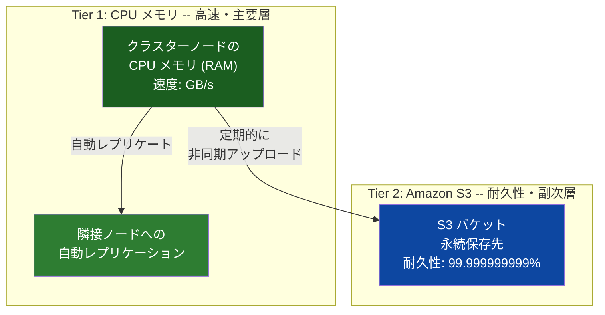
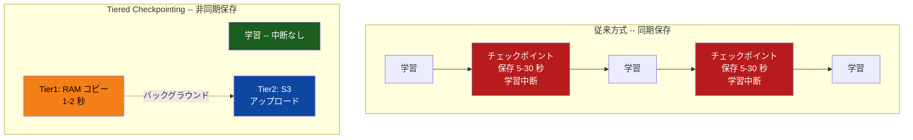
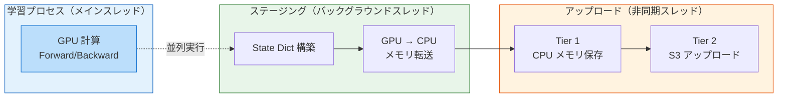

## はじめに

本記事は SageMaker HyperPod 機能解説シリーズの一部です。以下もすでに記事として書いてあるので参考にしてください。

https://zenn.dev/yunokiisshin/articles/45a746434b2090

大規模な分散学習では、チェックポイント保存が学習スループットの低下要因になります。モデルサイズが数十から数百 GB に及ぶ場合、チェックポイントの書き込みに数分から数十分を要し、その間 GPU は待機状態となります。

Amazon SageMaker HyperPod の **Managed Tiered Checkpointing** は、保存先を CPU メモリと Amazon S3 の 2 階層に分けることで、保存の高速化とコスト削減を両立する機能です。本記事では、仕組み、実装方法、パフォーマンス特性、および FSx for Lustre + DRA との使い分けを解説します。

:::message
**実際に試す際の推奨リポジトリ**: Managed Tiered Checkpointing を試す際は、AWS の GenAI Frameworks team が管理する [`awsome-distributed-training`](https://github.com/aws-samples/awsome-distributed-training) リポジトリの利用を推奨します。実績のあるコードとサンプルが含まれており、環境構築を効率化できます。チュートリアルとしては [AI on SageMaker HyperPod](https://awslabs.github.io/ai-on-sagemaker-hyperpod/) もおすすめです。
:::

:::message alert
本記事は 2026 年 2 月時点の公式ドキュメント、オープンソースコード、などに基づく調査記事です。間違っている可能性もあるため必ず最新の公式ドキュメントを正として確認してください。間違いがあればコメントください。
:::

## 概要

:::message
本機能は [EKS 環境でのセットアップ手順が公式ドキュメントに記載](https://docs.aws.amazon.com/sagemaker/latest/dg/managed-tier-checkpointing-setup.html)されています。Slurm 環境での利用可否については、公式ドキュメントに明示的な記載がないため、最新の情報を AWS に確認してください。

**FSx for Lustre との併用について**: Managed Tiered Checkpointing と FSx for Lustre + DRA は技術的に併用可能ですが、どちらも Amazon S3 にチェックポイントを永続化するため、チェックポイント保存の役割が重複します。FSx が構築済みの場合は、FSx をデータセット保存に、Managed Tiered Checkpointing をチェックポイント保存に使い分けることを推奨します（詳細は「使い分けガイドライン」セクション参照）。
:::

### 従来のアプローチ: FSx for Lustre + DRA

Managed Tiered Checkpointing の導入以前、HyperPod では **[FSx for Lustre](https://aws.amazon.com/fsx/lustre/) + [DRA（Data Repository Association）](https://docs.aws.amazon.com/fsx/latest/LustreGuide/create-dra-linked-data-repo.html)** によるチェックポイント保存が標準的でした。


従来方式の処理フローは、学習スクリプトが `torch.save()` で FSx に書き込み（5-30 秒、学習を中断）、DRA が変更を検知して S3 へのエクスポートをスケジュールし、バックグラウンドで S3 に永続化（数分）するというものです。この方式には、学習の中断時間（5-30 秒）、FSx の高コスト（月額 $140-$500/TB）、S3 エクスポート遅延、容量管理といった課題がありました。

Managed Tiered Checkpointing はこれらの課題を以下のように解決します。

| 比較項目 | FSx + DRA（従来） | Managed Tiered Checkpointing |
|---------|------------------|----------------------------|
| 学習の中断時間 | 5-30 秒（FSx 書き込み） | 1-2 秒（メモリコピー） |
| 月額コスト（1.2 TB 想定） | $180（FSx）+ $32（S3）[^1] | $32（S3 のみ）[^1] |
| ノード障害時の復旧 | 数分（FSx または S3 から復元） | 数秒（メモリレプリカから復旧） |
| スケーラビリティ | 数百ノード（FSx のクライアント数制限あり） | 数千ノード（各ノードのローカルメモリを使用） |
| S3 保存形式 | 単一の `.pt` ファイル | PyTorch DCP の sharded checkpoint（`.distcp`） |
| 推奨ケース | データセット共有が必須な既存構成 | 新規プロジェクトまたはコスト最適化 |

以降では、Managed Tiered Checkpointing の仕組みと実装方法を詳しく解説します。

## 階層化戦略

Managed Tiered Checkpointing は **2 つの階層**でチェックポイントを管理します。高速アクセス用の主要層としてクラスターノードの **CPU メモリ（RAM）** を使用し、永続バックアップ用の副次層として **Amazon S3** を使用します。



| 階層 | 保存先 | 速度 | 耐久性 | 用途 |
|------|--------|------|--------|------|
| Tier 1 | CPU メモリ（RAM） | 高速（GB/s） | ノード間レプリケーションで保護 | 高頻度保存・高速復旧 |
| Tier 2 | Amazon S3 | 低速（数百 MB/s） | 高耐久（99.999999999%） | 低頻度保存（永続バックアップ） |

### レプリケーション戦略

Tier 1（CPU メモリ）に保存されたチェックポイントは、**隣接する計算ノード間で自動的にレプリケート**されます。これにより、単一または複数のノード障害時にもデータを保護し、高速に復旧できます。

メモリ管理は、EKS 環境では Kubernetes DaemonSet としてデプロイされるメモリ管理デーモンが担当し、チェックポイント用の分散メモリ（disaggregated memory）を管理します。

:::message
`InstanceMemoryAllocationPercentage` パラメータで、チェックポイント用に割り当てる CPU メモリの割合を設定できます（0-100%）。学習プロセスが使用するメモリとのバランスを考慮して設定してください。

設定例（`--tiered-storage-config` 内に含める）:
```json
{
  "Mode": "Enable",
  "InstanceMemoryAllocationPercentage": 50
}
```
:::

## 非同期パイプライン

最大の特徴は、**学習を中断せずにチェックポイントを保存**できる点です。[PyTorch DCP（Distributed Checkpoint）](https://pytorch.org/docs/stable/distributed.checkpoint.html)の `async_save()` により非同期保存を実現します。



従来方式ではチェックポイント保存中に学習が中断されます（図の赤色ノード）。Tiered Checkpointing では Tier 1（RAM）へのステージング（1-2 秒）後すぐに学習を再開でき、S3 へのアップロードはバックグラウンドで非同期に実行されます。

## 実装と API

### クラスターの構成

Managed Tiered Checkpointing を利用するには、クラスター作成時に `--tiered-storage-config` で有効化します（[セットアップドキュメント](https://docs.aws.amazon.com/sagemaker/latest/dg/managed-tier-checkpointing-setup.html)参照）。

**EKS 環境のクラスター構成例**:

```bash
aws sagemaker create-cluster \
    --cluster-name my-training-cluster \
    --orchestrator "Eks={ClusterArn=arn: aws: eks: us-west-2:123456789012: cluster/my-eks}" \
    --instance-groups '[{
        "InstanceGroupName": "training-group",
        "InstanceType": "ml.p5.48xlarge",
        "InstanceCount": 4,
        "LifeCycleConfig": {
            "SourceS3Uri": "s3://my-bucket/lifecycle-scripts",
            "OnCreate": "on_create.sh"
        },
        "ExecutionRole": "arn: aws: iam::123456789012: role/MyRole",
        "InstanceStorageConfigs": [
            { "EbsVolumeConfig": {"VolumeSizeInGB": 500} }
        ]
    }]' \
    --vpc-config '{
        "SecurityGroupIds": ["sg-xxxxxxxxxxxxxxxxx"],
        "Subnets": ["subnet-xxxxxxxxxxxxxxxxx"]
    }' \
    --tiered-storage-config '{"Mode": "Enable"}'
```

**無効化する場合**:

```bash
aws sagemaker update-cluster \
    --cluster-name my-training-cluster \
    --tiered-storage-config '{"Mode": "Disable"}'
```

### Python ライブラリ

専用ライブラリ [`amzn-sagemaker-checkpointing`](https://pypi.org/project/amzn-sagemaker-checkpointing/)（v1.1.2、Apache License 2.0、Python 3.10 以上）を使用します。`sagemaker` SDK とは別パッケージです。

```bash
pip install amzn-sagemaker-checkpointing s3torchconnector tenacity torch boto3
```

### チェックポイント設定

```python
import os
import time
import torch.distributed as dist
from amzn_sagemaker_checkpointing.config.sagemaker_checkpoint_config import (
    SageMakerCheckpointConfig,
)
from amzn_sagemaker_checkpointing.checkpointing.filesystem.filesystem import (
    SageMakerTieredStorageWriter,
    SageMakerTieredStorageReader,
)

# 分散学習の初期化
dist.init_process_group(backend="nccl")

# チェックポイント設定
checkpoint_config = SageMakerCheckpointConfig(
    namespace=os.environ.get("TRAINING_JOB_NAME", f"job-{int(time.time())}"),
    # namespace に使用可能な文字: 英数字、ハイフン、アンダースコアのみ
    world_size=dist.get_world_size(),
    s3_tier_base_path="s3://my-bucket/checkpoints",
)
```

`SageMakerCheckpointConfig` の主要パラメータは以下の通りです。

| パラメータ | 型 | 説明 |
|---|---|---|
| `namespace` | str | 学習ジョブの一意な識別子（英数字・ハイフン・アンダースコアのみ） |
| `world_size` | int | 分散プロセス数（`dist.get_world_size()` から取得） |
| `s3_tier_base_path` | str | S3 保存先パス |
| `save_to_s3` | bool | S3 への保存を有効化（保存ごとに動的に切替可能） |

### 学習スクリプトへの統合

[PyTorch DCP（Distributed Checkpoint）](https://pytorch.org/docs/stable/distributed.checkpoint.html)の `async_save()` / `load()` と組み合わせて使用します。以下は [AWS 公式ドキュメント](https://docs.aws.amazon.com/sagemaker/latest/dg/managed-tier-checkpointing-setup.html)に基づくコード例です。

```python
from torch.distributed.checkpoint import async_save, load

future = None
in_memory_ckpt_freq = 10   # 10 ステップごとにメモリ保存
s3_ckpt_freq = 50           # 50 ステップごとに S3 永続化

for step, batch in enumerate(dataloader):
    # 通常の学習ステップ
    loss = model(batch)
    loss.backward()
    optimizer.step()

    # Tiered Checkpointing: 非同期で保存
    if step % in_memory_ckpt_freq == 0 or step % s3_ckpt_freq == 0:
        state_dict = {
            "model": model.state_dict(),
            "optimizer": optimizer.state_dict(),
            "step": step,
        }

        # S3 への保存はより低い頻度で実行
        checkpoint_config.save_to_s3 = (step % s3_ckpt_freq == 0)

        storage_writer = SageMakerTieredStorageWriter(
            checkpoint_config=checkpoint_config,
            step=step,
        )

        # 前回の非同期保存の完了を確認
        if future is not None:
            exc = future.exception()
            if exc is not None:
                print(f"Checkpoint save failed: {str(exc)}")

        future = async_save(state_dict=state_dict, storage_writer=storage_writer)
```

:::message
**FSDP との統合**: [FSDP（Fully Sharded Data Parallel）](https://pytorch.org/docs/stable/fsdp.html)を使用する場合、`model.state_dict()` は `SHARDED_STATE_DICT` 形式で返されます。PyTorch DCP はこの形式を直接扱えるため、追加の変換は不要です。FSDP の `StateDictType.SHARDED_STATE_DICT` を設定した上で上記のパターンをそのまま適用できます。
:::

### チェックポイントの読み込み

`SageMakerTieredStorageReader` は、メモリ層からの読み込みに失敗すると自動的に S3 層にフォールバックします。

```python
state_dict = {
    "model": model.state_dict(),
    "optimizer": optimizer.state_dict(),
    "step": 0,  # 初期値。load() により実際の保存値で上書きされる
}

# 最新のチェックポイントを自動検出して読み込み（step 省略時）
storage_reader = SageMakerTieredStorageReader(
    checkpoint_config=checkpoint_config,
)

try:
    load(state_dict, storage_reader=storage_reader)
    # load() は state_dict を in-place で更新する
    # 読み込み後、モデルとオプティマイザに反映
    model.load_state_dict(state_dict["model"])
    optimizer.load_state_dict(state_dict["optimizer"])
    start_step = state_dict["step"]
except BaseException as e:
    print(f"Checkpoint load failed: {str(e)}")

# 特定のステップを指定して読み込み
storage_reader = SageMakerTieredStorageReader(
    checkpoint_config=checkpoint_config,
    step=500,
)

try:
    load(state_dict, storage_reader=storage_reader)
    model.load_state_dict(state_dict["model"])
    optimizer.load_state_dict(state_dict["optimizer"])
except BaseException as e:
    print(f"Checkpoint load failed at step 500: {str(e)}")
```

## PyTorch DCP async_save の内部アーキテクチャ

Managed Tiered Checkpointing の高速化を実現する中核技術は、PyTorch Distributed Checkpoint（DCP）の **`async_save`** です。このセクションでは、OSS レイヤーでの実装アーキテクチャを解説します。

### 3 段階の最適化戦略

PyTorch DCP は、チェックポイント保存の並列化を段階的に実現します（[PyTorch 非同期チェックポイントチュートリアル](https://docs.pytorch.org/tutorials/recipes/distributed_async_checkpoint_recipe.html)、[async_save 実装](https://github.com/pytorch/pytorch/blob/main/torch/distributed/checkpoint/state_dict_saver.py)参照）。

```mermaid
graph TB
    subgraph Level1["Level 1: 基本的な async_save"]
        L1A["GPU 計算<br/>学習ステップ"] --> L1B["GPU → CPU コピー<br/>(メインスレッド、ブロッキング)"]
        L1B --> L1C["ディスク書き込み<br/>(非同期スレッド)"]
    end

    subgraph Level2["Level 2: Pinned Memory 最適化"]
        L2A["GPU 計算<br/>学習ステップ"] --> L2B["GPU → CPU コピー<br/>(Pinned Memory、高速化)"]
        L2B --> L2C["ディスク書き込み<br/>(非同期スレッド)"]
        L2C -.->|"バッファ再利用"| L2B
    end

    subgraph Level3["Level 3: DefaultStager (PyTorch 2.9+)"]
        L3A["GPU 計算<br/>学習ステップ"]
        L3B["GPU → CPU コピー<br/>(バックグラウンドスレッド)"]
        L3C["ディスク書き込み<br/>(非同期スレッド)"]

        L3A -.->|"並列実行"| L3B
        L3B --> L3C
    end

    style Level1 fill: #fff3e0,stroke: #e65100
    style Level2 fill: #e8f5e9,stroke: #2e7d32
    style Level3 fill: #e3f2fd,stroke: #1565c0
    style L3A fill: #bbdefb,stroke: #1976d2
    style L3B fill: #c8e6c9,stroke: #388e3c
    style L3C fill: #fff9c4,stroke: #f57f17
```



**Level 1** では、GPU→CPU コピー（ステージング）がメインスレッドで実行されるため、学習が一時停止します。ディスク書き込みのみが非同期化されます。

**Level 2** では、Pinned Memory（ページング不可能な CPU メモリ）を使用して GPU→CPU 転送を高速化します。バッファを学習全体で再利用することで、メモリアロケーションのオーバーヘッドも削減されます。

**Level 3**（PyTorch 2.9+ の **DefaultStager**）では、state dict の構築と GPU→CPU コピーをバックグラウンドスレッドに完全にオフロードします。これにより、学習計算とチェックポイント処理が真の並列実行となり、チェックポイント保存が学習スループットに与える影響を最小化します。

### Managed Tiered Checkpointing との統合

Managed Tiered Checkpointing は、この Level 3 のアーキテクチャを活用しています。



この設計により、**GPU 計算（学習）、ステージング（GPU→CPU 転送）、アップロード（S3 保存）が 3 段階のパイプラインとして並列実行**されます。学習の次のステップは、前ステップのチェックポイント保存完了を待たずに開始できるため、学習スループットの低下が大幅に抑制されます。

:::message
**メモリトレードオフ**: Level 3 の DefaultStager は、GPU メモリと CPU メモリの両方にモデルの state dict を一時的に保持するため、メモリ使用量が増加します。大規模モデルの場合、CPU メモリ容量の計画が重要です。Managed Tiered Checkpointing では、`InstanceMemoryAllocationPercentage`（20-100%）でこのメモリ割り当てを制御できます。
:::

## パフォーマンス特性

| メトリクス | 同期 S3 チェックポイント | Managed Tiered Checkpointing |
|-----------|----------------------|----------------------------|
| チェックポイント保存時間 | 数分から数十分（モデルサイズ依存）[^2] | 数秒（Tier 1 メモリコピー）[^4] |
| 学習の中断時間 | 保存時間と同等 | ほぼゼロ（非同期） |
| 復旧元の選択 | S3 のみ | メモリ -> S3 の順にフォールバック |
| ストレージコスト | S3 のみ | メモリ + S3（段階的） |
| 学習スループット低下 | 数% から十数%[^2] | 大幅に削減[^3] |

:::message
**Checkpointless Training との関係**: Managed Tiered Checkpointing と [Checkpointless Training](https://zenn.dev/yunokiisshin/articles/45a746434b2090) は補完的な関係です。Checkpointless Training は GPU メモリ内の冗長レプリカによる高速 in-memory 復旧を担い、Tiered Checkpointing はカタストロフィックな障害（複数ノード同時障害やクラスター再構築）に対する永続バックアップを担います。併用することで、軽微なノード障害から大規模クラスター障害まで幅広い障害シナリオに対応できます。
:::

## 使い分けガイドライン

### 判断基準

以下の表を参考に、環境に適した方式を選択してください。

| 判断基準 | Managed Tiered Checkpointing | FSx + DRA |
|---------|-----|-----|
| FSx 未構築の新規プロジェクト | 適合 | 不要 |
| コスト最適化重視 | 適合（FSx 月額不要） | FSx コスト発生 |
| 学習の中断時間の最小化 | 1-2 秒のステージングのみ | 5-30 秒 |
| 数千ノード規模 | 適合 | FSx クライアント数制限あり |
| PyTorch DCP 標準化 | 適合 | 別方式 |
| 既存 FSx インフラの活用 | - | 適合 |
| 大規模データセット共有（数十 TB） | S3 直接読込で対応可 | 適合 |
| POSIX 互換性必須 | 非対応 | 適合 |
| リージョン/インスタンス制約 | 制約あり（[詳細](https://docs.aws.amazon.com/sagemaker/latest/dg/managed-tier-checkpointing-setup.html)参照） | 広く利用可能 |

### ハイブリッド構成（FSx + Managed Tiered）

データセット保存用に FSx を継続使用し、チェックポイント保存のみ Managed Tiered Checkpointing に移行する構成も有効です。ただし、データセットも S3 から直接読み込む（[`s3torchconnector`](https://github.com/amazon-science/s3torchconnector) など）ことでさらにコスト削減できる場合が多いため、[FSx for Lustre](https://aws.amazon.com/fsx/lustre/) の継続利用が本当に必要かを検討してください。

## まとめ

Managed Tiered Checkpointing は、大規模分散学習におけるチェックポイント保存の課題に対する実用的な解決策です。

CPU メモリ（Tier 1）と Amazon S3（Tier 2）の 2 階層でチェックポイントを管理する階層化アーキテクチャにより、速度と耐久性を両立します。PyTorch DCP の `async_save()` による非同期保存で学習の中断時間を数十秒から 1-2 秒に短縮し、FSx for Lustre が不要となることで月額ストレージコストも削減可能です。ノード間のメモリレプリケーションにより、ノード障害時には数秒で復旧でき、各ノードのローカルメモリを使用するため数千ノード規模にも対応できます。

新規プロジェクトでは Managed Tiered Checkpointing の採用を推奨します。既存の FSx 環境がある場合は、FSx をデータセット共有に残しつつ、チェックポイント保存のみ Tiered Checkpointing に移行するハイブリッド構成も検討してください。

## 参考資料

- [Managed Tiered Checkpointing ドキュメント](https://docs.aws.amazon.com/sagemaker/latest/dg/managed-tier-checkpointing.html)
- [Managed Tiered Checkpointing セットアップガイド](https://docs.aws.amazon.com/sagemaker/latest/dg/managed-tier-checkpointing-setup.html)
- [amzn-sagemaker-checkpointing (PyPI)](https://pypi.org/project/amzn-sagemaker-checkpointing/) -- v1.1.2
- [aws-samples/awsome-distributed-training (GitHub)](https://github.com/aws-samples/awsome-distributed-training)
- [AI on SageMaker HyperPod](https://awslabs.github.io/ai-on-sagemaker-hyperpod/) -- HyperPod チュートリアル
- [PyTorch Distributed Checkpoint](https://pytorch.org/docs/stable/distributed.checkpoint.html)
- [PyTorch Distributed Checkpoint Tutorial](https://pytorch.org/tutorials/recipes/distributed_checkpoint_recipe.html)
- [PyTorch Asynchronous Checkpoint Tutorial](https://pytorch.org/tutorials/recipes/distributed_async_checkpoint_recipe.html) -- async_save の詳細実装解説
- [PyTorch DCP state_dict_saver.py](https://github.com/pytorch/pytorch/blob/main/torch/distributed/checkpoint/state_dict_saver.py) -- async_save のソースコード
- [PyTorch FSDP](https://pytorch.org/docs/stable/fsdp.html)
- [Amazon FSx for Lustre](https://aws.amazon.com/fsx/lustre/)
- [FSx for Lustre Data Repository Association](https://docs.aws.amazon.com/fsx/latest/LustreGuide/create-dra-linked-data-repo.html)
- [s3torchconnector](https://github.com/amazon-science/s3torchconnector) -- S3 からの直接データ読み込みライブラリ

[^1]: コスト数値は FSx for Lustre のオンデマンド料金と S3 Standard の一般的な料金に基づく概算です。実際の料金はリージョン、ストレージクラス、データ転送量等により異なります。最新の料金は [AWS 公式料金ページ](https://aws.amazon.com/pricing/)を参照してください。
[^2]: 従来方式のパフォーマンス数値（復旧時間、チェックポイント I/O オーバーヘッド等）は、大規模分散学習における一般的な知見に基づく推定値です。AWS の公式発表による数値ではありません。実際の値はクラスター構成、モデルサイズ、チェックポイント頻度等により異なります。
[^3]: Managed Tiered Checkpointing の[公式ドキュメント](https://docs.aws.amazon.com/sagemaker/latest/dg/managed-tier-checkpointing.html)では "Improved training throughput" と定性的に記載されていますが、具体的な削減率は公開されていません。
[^4]: Tier 1 メモリコピーの所要時間はモデルサイズとノード間の帯域幅に依存します。小規模モデルでは 1-2 秒程度ですが、大規模モデル（数百 GB 規模）ではより長くなる可能性があります。

---

## 関連記事（HyperPod の他の耐障害性機能）

本記事で解説した Managed Tiered Checkpointing は、HyperPod の耐障害性機能の 1 つです。関連する他の機能も別記事で解説しています。

- **[Checkpointless Training 徹底解説](https://zenn.dev/yunokiisshin/articles/45a746434b2090)** - チェックポイント不要の高速障害復旧
- **[Elastic Training 徹底解説](https://zenn.dev/yunokiisshin/articles/be0db364a7f8e2)** - クラスター容量に応じた動的なノード数の増減
- **[Health Monitoring Agent 徹底解説](https://zenn.dev/yunokiisshin/articles/0742d879958d3a)** - リソースの常時監視と自動障害復旧
