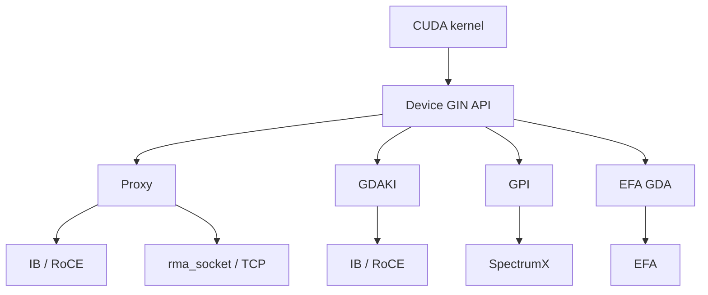
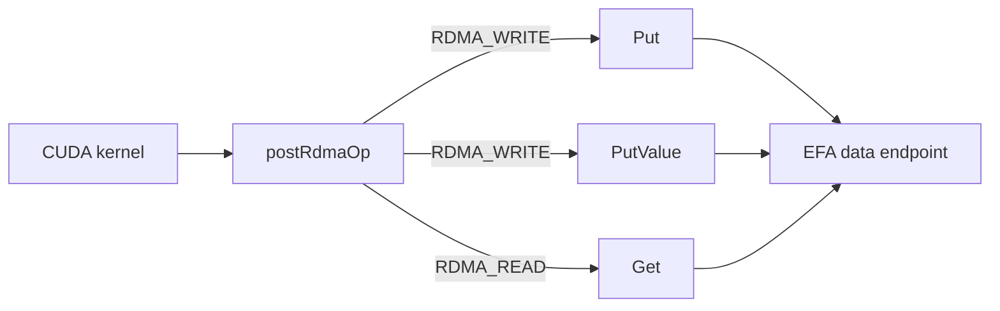
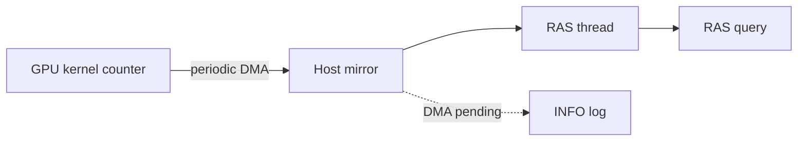
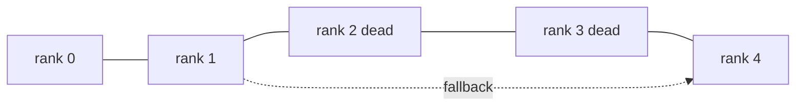

## はじめに

以前、NVIDIA が公開した Aug-Oct 2026 のロードマップを解説しました。

https://zenn.dev/tosshi/articles/8d7fea5568e638

[NCCL v2.32.3-1](https://github.com/NVIDIA/nccl/releases/tag/v2.32.3-1) が公開されたので、ロードマップの項目がどこまで回収されたのかを確認しながら、面白そうな変更を 4 つ取り上げます。

| 取り上げる変更 | ロードマップでの位置づけ | 2.32.3 での状態 |
|---|---|---|
| EFA GDA の Get 実装 | 最も大きな節目として挙げた EFA GDA support in GIN | Get は実装、FlushAsync と Wait は中身が空 |
| Socket 経由の GIN | GIN over Sockets として挙げた | TCP 上の片方向通信トランスポートとして実装 |
| RAS の GPU 常駐進捗カウンタ | NCCL Notify と RAS diagnostics として挙げた | 進捗カウンタと診断項目が追加、通知の仕組みは据え置き |
| Vera Rubin 初期サポート | ロードマップには無い項目 | コードは入り、性能モデルは次のリリース待ち |

## GIN の全体像

GIN は GPU カーネルの中から片方向の通信操作を発行するための API で、`put`、`get`、`signal` をデバイス関数として呼べます。集合通信を呼ぶ従来の使い方では CPU が通信を取り仕切りますが、GIN では通信の発行がカーネル側に移ります。

GIN は単一の実装ではなく、複数のバックエンドの集合です。GPU が NIC を直接操作するものと、CPU の proxy スレッドを経由するものが混ざっています。



GDAKI は InfiniBand と RoCE 向けに GPU が直接発行する実装、GPI は SpectrumX を必要とする GPU-Push Interface です。EFA GDA は AWS EFA 向けの直接発行、Proxy は CPU スレッドが代行する実装です。バックエンドの番号は [`nccl_device/core.h`](https://github.com/NVIDIA/nccl/blob/12df1a11afad322be5a204a2db890161cbf8131d/src/include/nccl_device/core.h#L74-L78) に定義されています。CPU を介さないのは GDAKI、EFA GDA、GPI の経路だけで、「GIN だから CPU を介さない」とは言えません。

以下で使う用語を 3 つ挙げます。WQE は Work Queue Entry の略で、NIC に渡す作業指示の 1 件分です。doorbell は、その作業指示を積んだことを NIC に知らせるためのレジスタ書き込みです。CTA は Cooperative Thread Array の略で、CUDA のスレッドブロックを指します。

## EFA GDA に Get が入った

2.32.3 の EFA GDA では、相手からデータを読み出す Get が実装されました。それまでは Put と signal だけができる状態で、[aws-ofi-nccl v1.21.0 のリリースノート](https://github.com/aws/aws-ofi-nccl/releases/tag/v1.21.0)には制限として「Only Put and signal operations are supported — no get or flush, and indexed signals only」と書かれています。

### opcode 1 つで Get が乗った

面白いのは、この実装がほとんど新しいコードを必要としなかった点です。2.31.2 の関数には [`postRdmaWrite: shared post path for Put and PutValue`](https://github.com/NVIDIA/nccl/blob/7b83616df3ae082a1f32bb74c27458bfe8153a13/src/include/nccl_device/gin/efa_gda/gin_efa_gda.h#L124) というコメントが付いていました。2.32.3 では同じ場所が [`postRdmaOp: shared post path for Put, PutValue and Get`](https://github.com/NVIDIA/nccl/blob/12df1a11afad322be5a204a2db890161cbf8131d/src/include/nccl_device/gin/efa_gda/gin_efa_gda.h#L161) に変わっています。



[PR #2382](https://github.com/NVIDIA/nccl/pull/2382) の説明によれば、RDMA の読み出しと書き込みは Work Request のフィールドがまったく同じで、どちら向きにバイトが動くかを決めるのは opcode だけです。したがって WQE を組んで doorbell を鳴らすまでの経路は共用できます。PR 本文には、warp の合流処理、doorbell の待ち合わせ、request ID の書き込み、2 つの backpressure の判定はいずれも変更されていないと書かれており、これらはそのまま [`getImplMode`](https://github.com/NVIDIA/nccl/blob/12df1a11afad322be5a204a2db890161cbf8131d/src/include/nccl_device/gin/efa_gda/gin_efa_gda.h#L635) からも使われます。

あわせて、8 バイト以下の値を書き込む `PutValue` の運び方も変わりました。2.31.2 はスクラッチ領域に値を置いてからそこを送信元として指していましたが、2.32.3 では [`PutValuePayloadEncoder`](https://github.com/NVIDIA/nccl/blob/12df1a11afad322be5a204a2db890161cbf8131d/src/include/nccl_device/gin/efa_gda/gin_efa_gda.h#L149) が値を 128 バイトの RDMA-write WQE の中に直接書き込みます。小さな値の通知ごとに起きていたメモリへの往復が消えます。

### backendVersion を誰も突き合わせていない

[PR #2398](https://github.com/NVIDIA/nccl/pull/2398) で `efa-dp-direct` が 1.1.0 に上がり、WQE のレイアウトと request ID の幅が変わりました。この新しいレイアウトには `backendVersion` 2 という番号が割り当てられています。

番号を決める仕組みが、ソースを読んでいていちばん驚いた部分です。[`gin_host.cc`](https://github.com/NVIDIA/nccl/blob/12df1a11afad322be5a204a2db890161cbf8131d/src/gin/gin_host.cc#L25) に、番号ごとに必要な NCCL の最小バージョンを並べた対応表があります。

```c
constexpr int efaGdaBackendMinVersions[] = {0, NCCL_VERSION(2, 31, 0), NCCL_VERSION(2, 32, 0)};
```

そして[番号を選ぶコード](https://github.com/NVIDIA/nccl/blob/12df1a11afad322be5a204a2db890161cbf8131d/src/gin/gin_host.cc#L300-L304)がこれです。

```c
int backendVersion = 0;
for (int i = 0; i < nVersions; i++) {
  if (deviceCodeVersion < backendVersionArray[i]) break;
  backendVersion = i;
}
```

条件を満たす中で最も大きい番号を選び、その値を `createContext` に渡します。注目すべきは、この決定にプラグインが宣言している上限がまったく登場しないことです。NCCL とプラグインの間でバージョンをすり合わせる処理は無く、低い番号に下げて選び直す処理もありません。

一方 `aws-ofi-nccl` 側は、自分が扱えるレイアウトの上限をヘッダの定数として持っています。

| aws-ofi-nccl | `NCCL_OFI_GDAKI_MAX_BACKEND_VERSION` |
|---|---|
| [v1.21.1](https://github.com/aws/aws-ofi-nccl/blob/2475c4c736907e68ebeadb3848f31231ee4a44d0/include/rdma/gin/nccl_ofi_gin_gdaki_dev.h#L116) (記事執筆時点の最新タグ) | 1 |
| [master](https://github.com/aws/aws-ofi-nccl/blob/ff2d3a36de29118b0b0e619938e12bc4b398797f/include/rdma/gin/nccl_ofi_gin_gdaki_dev.h#L117) | 2 |

master のヘッダには「`createContext_v14` refuses values outside the supported range」と書かれており、範囲外の番号を渡されると拒否される設計です。ただしこのコメントは v1.21.1 のヘッダには無く、v1.21.1 が範囲外の値をどう扱うかは確認できていません。

`deviceCodeVersion` の正体も押さえておく価値があります。これは実行時にリンクされている NCCL ライブラリのバージョンではありません。[`dev_runtime.cc`](https://github.com/NVIDIA/nccl/blob/12df1a11afad322be5a204a2db890161cbf8131d/src/dev_runtime.cc#L1989-L1991) を見ると、アプリケーションが渡す `ncclDevCommRequirements` の `version` を使い、未指定なら `NCCL_VERSION_CODE` を入れています。つまりアプリケーションのデバイスコードがどの NCCL バージョンを対象にビルドされたかを表す値です。ライブラリだけ 2.32.3 に上げてもデバイスコードが 2.31 系向けなら番号 1 が選ばれ、2.32 系向けにすると番号 2 が選ばれて、上限 1 の v1.21.1 では範囲外になります。

拒否された後の挙動も読み取れます。`ncclGinDevCommSetup` は候補のバックエンドを順に試し、失敗すると次の候補に移ります。低い番号で再試行するのではなく、別のバックエンドを試します。すべて失敗すると「GIN: DevComm setup failed on all available backends」で終わります。EFA GDA を狙っていても、候補に他のバックエンドが残る構成なら気付かないままそちらに切り替わり、残らなければ GIN 自体が立ち上がらない、という形で表に出ます。実機で再現したわけではないので断定はしませんが、コード上はこう読めます。

### FlushAsync と Wait は空実装

`FlushAsync` と `Wait` は、[PR #2405](https://github.com/NVIDIA/nccl/pull/2405) の説明には実装が含まれているのに、[2.32.3 のソース](https://github.com/NVIDIA/nccl/blob/12df1a11afad322be5a204a2db890161cbf8131d/src/include/nccl_device/gin/efa_gda/gin_efa_gda.h#L929-L939)ではどちらも中身が空です。

```c
template <>
struct ncclGinApi_FlushAsync<NCCL_NET_DEVICE_GIN_EFA_GDA> {
  NCCL_DEVICE_INLINE static void call(ncclGinCtx ctx, int peer, ncclGinRequest_t* outRequest, bool hasDescriptor,
                                      ncclGinDescriptorSmem* descriptor, uint32_t optFlags) {
    (void)ctx;
    (void)peer;
    (void)outRequest;
    (void)hasDescriptor;
    (void)descriptor;
    (void)optFlags;
  }
};
```

`Wait` も `ncclSuccess` を返すだけです。ブロックする `Flush` は動きますが、endpoint 全体の未完了の操作がゼロになるまで待つ作りなので、特定のピア宛の特定の書き込みだけを待つことはできません。

なぜピア単位の完了待ちが難しいのか、という PR の説明が読みどころです。EFA が使う SRD (Scalable Reliable Datagram) プロトコルでは、同じピア宛の操作であっても完了が発行順に観測されるとは限りません。したがって「N 番目が完了した」という報告だけでは、それより前の書き込みが終わった証明になりません。証明になるのは「N 未満の操作がすべて完了した」という、先頭から途切れなく続く完了の情報だけです。PR #2405 はそのためにピアごとの順序付き完了カウンタをプラグインが公開する設計を提示しましたが、NCCL 側の API は空実装のままで、プラグインの master にも対応するフィールドは見当たりません。両側で未完了です。

これは、ロードマップ記事で課題の先頭に挙げた [aws-ofi-nccl #1327](https://github.com/aws/aws-ofi-nccl/issues/1327) の signal coalescing とは別の問題です。あちらは doorbell をまとめて鳴らす話、こちらは完了を判定する話ですが、SRD の完了順序が保証されないという原因は共通しています。

### 有効化条件

プラグインの [gin-getting-started.md](https://github.com/aws/aws-ofi-nccl/blob/ff2d3a36de29118b0b0e619938e12bc4b398797f/doc/gin-getting-started.md) に条件がまとまっています。libfabric 2.6.0 以上、rdma-core `64.0amzn0` 以上、EFA ドライバ 3.3.0 以上、そして CPU から GPU メモリを直接読み書きするための GDRCopy 2.5 以上で、これらは [EFA installer](https://docs.aws.amazon.com/AWSEC2/latest/UserGuide/efa-start-nccl.html) 1.50.0 以上が満たします。対象は P5en、P6-B200、P6-B300 です。

有効化には明示的な設定が必要で、`NCCL_GIN_TYPE=5` で EFA GDA を選び、`NCCL_SYM_GIN_KERNELS_ENABLE=0` で対称メモリ向けの GIN カーネルを切ります。加えて NVIDIA ドライバを `PeerMappingOverride=1` で読み込ませる必要があります。EFA GDA は EFA の MMIO 領域を GPU のアドレス空間にマップするため、この設定が無いとドライバがマップを拒否します。

## TCP で GIN が動く

2.32.3 では、TCP ソケットの上で GIN を動かすトランスポートが追加されました。ロードマップ記事の表ではこの機能を 2.31 の項目として挙げていましたが、実際にリリースに入ったのは 2.32.3 でした。前回の整理はここが不正確だったので訂正します。

実体は [`rma_socket.cc`](https://github.com/NVIDIA/nccl/blob/12df1a11afad322be5a204a2db890161cbf8131d/src/transport/rma_socket.cc) で、構成を示しているのは[次の 1 行](https://github.com/NVIDIA/nccl/blob/12df1a11afad322be5a204a2db890161cbf8131d/src/transport/rma_socket.cc#L54)です。

```c
props->netDeviceType = NCCL_NET_DEVICE_GIN_PROXY;
```

新しい GIN の種類が増えたのではありません。TCP の上に片方向通信の層を作り、それを既存の proxy 型デバイスとして公開することで、proxy バックエンドの経路から TCP を使えるようにしています。最初に示した図で Proxy から `rma_socket` へ伸びている矢印がこれに当たります。

利点は、InfiniBand、RoCE、EFA のいずれの NIC も無い環境で GIN カーネルを書いて機能を確認できる点です。必要なのは GPU と CUDA 環境、そして GDRCopy です。[ソース](https://github.com/NVIDIA/nccl/blob/12df1a11afad322be5a204a2db890161cbf8131d/src/transport/rma_socket.cc#L30-L34)は GDRCopy が無いと明示的に拒否するので、`NCCL_GDRCOPY_ENABLE` での有効化が前提になります。

ロードマップ記事の最後に、自作の通信アルゴリズムを組んで NCCL に組み込んでみたいが取りかかり方がわからない、と書きました。その材料も増えています。この socket 経由の GIN に加えて、[`docs/examples/09_gin_optimizations`](https://github.com/NVIDIA/nccl/tree/12df1a11afad322be5a204a2db890161cbf8131d/docs/examples/09_gin_optimizations) が 2.32.3 で新設されました。同じリング交換の通信を 4 通りに実装して比べるベンチマークで、比較の軸は put を CTA 全体で協調して発行するか各スレッドが 1 本ずつ発行するかという粒度と、`ncclGinOptFlagsAggregateRequests` を最後以外の put に付けるかどうかの 2 つです。後者は後続のリクエストがまだ来るとバックエンドに伝えるヒントで、バックエンドはこれを見て doorbell を鳴らすのを遅らせ、後のヒント無しリクエストでまとめて publish できます。自分で GIN カーネルを書くときに最初に迷う選択が、そのまま測れる形で置かれています。

### リリースノートとソースで違うフラグ名

window の登録を GIN 用途だけに限定するフラグも追加されました。ここは名前に注意が必要です。リリースノートには `NCCL_WIN_REGISTER_GIN` と書かれていますが、この文字列は 2.32.3 のソースツリーに見当たりません。実際に追加されているのは [`nccl.h.in`](https://github.com/NVIDIA/nccl/blob/12df1a11afad322be5a204a2db890161cbf8131d/src/nccl.h.in#L68) の次のマクロです。

```c
#define NCCL_WIN_GIN_ONLY 0x04
```

[2.31.2 の同じファイル](https://github.com/NVIDIA/nccl/blob/7b83616df3ae082a1f32bb74c27458bfe8153a13/src/nccl.h.in#L64-L66)には `NCCL_WIN_DEFAULT`、`NCCL_WIN_COLL_SYMMETRIC`、`NCCL_WIN_STRICT_ORDERING` の 3 つしかなく、`NCCL_WIN_GIN_ONLY` と `NCCL_WIN_CFT_COUNTED` が 2.32.3 で増えています。環境変数ではなく window 登録時に渡すフラグなので、コードを書くときはこちらの名前で探してください。

## RAS に GPU 常駐の進捗カウンタ

RAS は Reliability, Availability, Serviceability の略で、実行中のジョブの状態を問い合わせて診断するために NCCL に組み込まれている仕組みです。ロードマップ記事では、その既知の限界を 2 つ挙げました。1 つは 256 GPU 構成で PyTorch がタイムアウトを報告しているのに RAS が正常と表示する事例、もう 1 つは遅れているランクではなく先に進んでいるランクしか報告しないため原因側を特定しにくいという問題です。

2.32.3 で [`progress_monitor.cc`](https://github.com/NVIDIA/nccl/blob/12df1a11afad322be5a204a2db890161cbf8131d/src/ras/progress_monitor.cc) が新設されました。2.31.2 には存在しません。CUDA デバイスごとに 1 本のワーカースレッドを立て、GPU 上に置かれた進捗カウンタを副ストリーム経由で定期的にホストへコピーして、ホスト側に写しを作ります。



何が変わるかは、従来の集合操作カウントとの対比で見えます。従来のカウントはカーネルが投入された時点で増えます。[RAS の例のドキュメント](https://github.com/NVIDIA/nccl/blob/12df1a11afad322be5a204a2db890161cbf8131d/docs/examples/08_ras/README.md)にも、カウントされるのは enqueue された時点でありカーネル完了時ではない、と明記されています。つまりこの値だけではカーネルが実際に前に進んだかは判定できません。新しい進捗カウンタはカーネル自身が更新する値なので、GPU の中で止まっているかを見る材料になります。

ただし、ロードマップ記事で挙げた 2 つの問題が解決したとは書けません。RAS のクエリ出力が実際に遅延側のランクを指すよう変わったのかは、リリースノートにもドキュメントにも書かれていないので、実機で確かめる話です。

挙動は `NCCL_PROGRESS_COUNTER_MONITOR_POLL_MS` (既定 1000)、`NCCL_PROGRESS_COUNTER_MONITOR_STALE_MS` (既定 5000)、`NCCL_PROGRESS_COUNTER_MONITOR_STALE_WARN_SEC` (既定 600) で調整します。監視処理そのものが止まった場合も報告され、コピー用の DMA が返ってこないと「counter DMA still pending after N 秒」が RAS のログに出ます。カウンタの値が動いていないのか、値を取ってくる DMA 自体が終わっていないのかを区別できます。

診断の項目も増えました。2.31.2 の時点では GPU 構成、ドライバ、ECC、NVLink、`NCCL_*` 環境変数の一致を見ていましたが、2.32.3 では NVIDIA グラフィックスドライバのバージョン、Xid と SXid のイベント、`rdma_topo check` による PCI 構成、IOMMU のモードとグループ、NIC の ATS の状態が加わりました。増えたのは、GPUDirect RDMA が実際に効く構成かを PCI 側から確かめる部分と、ハードウェア障害の痕跡をカーネルログから拾う部分です。詳細は [RAS のドキュメント](https://github.com/NVIDIA/nccl/blob/12df1a11afad322be5a204a2db890161cbf8131d/docs/userguide/source/troubleshooting/ras.rst)にあります。初期化時に実行するには `NCCL_RUN_RAS_DIAGNOSTICS=1` を設定します。既定では無効です。

ログレベルにも 1 つ追加があります。`ATTN` は、設定値のフォールバックやプラグイン初期化の失敗のように、致命的ではないが知りたい事象を出すレベルです。[列挙体](https://github.com/NVIDIA/nccl/blob/12df1a11afad322be5a204a2db890161cbf8131d/src/include/nccl_common.h#L28-L35)では ABI 互換のため末尾に置かれていますが、コメントには「logically between WARN and INFO」と書かれています。注意が必要なのは、2.32 より前の NCCL がこの文字列を知らないため、`NCCL_DEBUG=ATTN` を渡すと解釈に失敗してログ出力そのものが無効になる点です。バージョンが混在するクラスタでは `NCCL_DEBUG=WARN NCCL_DEBUG_LEVELS=ATTN` と書きます。

なお、ロードマップに挙がっていた NCCL Notify、つまり検知した障害を構造化イベントとしてアプリケーションに通知する仕組みについては、リリースノートに記載がありません。ソースには [`rasClientsNotifyEvent()`](https://github.com/NVIDIA/nccl/blob/12df1a11afad322be5a204a2db890161cbf8131d/src/ras/peers.cc#L806-L809) という通知の入口があり、`PEER_NEW`、`PEER_CONNECTING`、`PEER_DEAD` の 3 種類を送っていますが、これは 2.31.2 にもあり、呼び出し箇所の数も一致します。今回増えたわけではありません。

### 二重故障の扱い

RAS という言葉で語られる監視の仕組みは、ふつう単一の故障を前提にします。同時に 2 つ壊れる場合は対象外、という設計が一般的です。NCCL の RAS はどうなっているのかが気になったのでソースを読んだところ、監視網そのものは同時多発の故障を前提に作られている一方で、問い合わせの経路と今回入った進捗カウンタは単一の故障までしか見ていない、という構造でした。

まず監視網の形です。[`rasnet.cc`](https://github.com/NVIDIA/nccl/blob/12df1a11afad322be5a204a2db890161cbf8131d/src/ras/rasnet.cc#L12) の先頭に「Links forming the backbone of the RAS network (currently a ring)」というコメントがあり、各プロセスは自分の番号の前後にあたる 2 方向のリンクを持ちます。



素朴なリングは 2 箇所同時に切れると分断されます。そこで RAS はリンクごとに fallback の接続を持ちます。[`rasLinkAddFallback()`](https://github.com/NVIDIA/nccl/blob/12df1a11afad322be5a204a2db890161cbf8131d/src/ras/rasnet.cc#L922) が故障を検知したリンクに代替の相手を足し、相手を決める [`rasLinkCalculatePeer()`](https://github.com/NVIDIA/nccl/blob/12df1a11afad322be5a204a2db890161cbf8131d/src/ras/peers.cc#L743) は死んだピアを飛ばしながらリングを進みます。ループは自分自身に戻るまで回るので、連続して何台死んでいても飛び越えられます。1 台だけを飛ばす作りではありません。

さらに踏み込んだ処理が入っています。飛ばす先が自分と別ノードの場合、そのノードに属するピアを全部まとめて飛ばそうとします。ノードごと落ちたという想定です。コメントには、生きているピアを飛ばしてしまう可能性はあるが、そのピアも RAS 網との接続は保てるので問題ない、と書かれています。ただし飛ばす前に、そのノードのどれかと通信が成立していないかを確認します。ソースの表現では「We convinced ourselves that the node is not down」です。1 ノード分のプロセスが同時に消える事象は、設計の想定内です。

死んだという判断は [`rasPeerDeclareDead()`](https://github.com/NVIDIA/nccl/blob/12df1a11afad322be5a204a2db890161cbf8131d/src/ras/peers.cc#L793) がローカルの配列に記録し、その配列のハッシュをピアに配ります。各プロセスが独立に判断した結果をハッシュで突き合わせて揃えるので、判断が食い違ったまま放置されることはありません。

一方で限界もはっきり書かれています。問い合わせの経路を扱う [`collectives.cc` のコメント](https://github.com/NVIDIA/nccl/blob/12df1a11afad322be5a204a2db890161cbf8131d/src/ras/collectives.cc#L444-L455)が率直です。応答の待ち時間は 5 秒と 10 秒の二段構えで、遠くの接続で起きた遅延は他のピアが適切に処理してくれると信じるしかない、と書かれています。そのうえで「if there is a cascade of problematic connections, they could still exceed the 5s total」と続き、10 秒を超えたら手元にある分だけ返す処理になっています。さらに、問い合わせ元が接続しているピアのほうが先にタイムアウトするだろうから、遅れて届いた応答はもう間に合わない、とも書かれています。故障が連鎖した場合に返ってくるのは、欠けのある答えです。

2.32.3 で入った進捗カウンタも、この観点では単一の故障までです。CUDA デバイスごとにワーカースレッドが 1 本で、冗長化はありません。DMA が返ってこない場合も先に述べたログを残すだけで、復旧の手当てはありません。監視を足したぶん、監視自身が壊れる経路も増えたことになります。

## Vera Rubin は入ったが cost model は次回

Vera Rubin は Blackwell の後継となる GPU プラットフォームで、2.32.3 では `sm107` のサポート、ConnectX-9 の rail と plane の検出、MPS と MLOPart の組み合わせへの対応が入りました。

SM 番号による世代の判定には、[`cudawrap.h`](https://github.com/NVIDIA/nccl/blob/12df1a11afad322be5a204a2db890161cbf8131d/src/include/cudawrap.h#L16) の次のマクロが追加されています。途中の番号が除外されているのは、そこが別系統に割り当てられているからです。

```c
#define RUBIN_AND_LATER(sm) (sm >= 107 && sm != 110 && sm != 120 && sm != 121)
```

トポロジ側では [`ncclTopoIsVeraRubin()`](https://github.com/NVIDIA/nccl/blob/12df1a11afad322be5a204a2db890161cbf8131d/src/graph/topo.cc#L1897) が追加され、Vera Rubin のときだけ NIC をまとめる単位とポリシーが切り替わります。まとめる範囲の判定が PCI のポート単位から PCI ホストブリッジ単位に変わり、ポリシーはすべての NIC をまとめる方式から rail 単位でまとめる方式に変わります。plane については、異なる plane に属する NIC 同士の接続を常に禁止する判定が経路探索に入りました。

MLOPart は GPU を論理パーティションに分ける機能で、パーティションごとに別の GPU UUID が振られます。ここに 1 つ注意点があり、communicator 全体の GIN 対応状況を決める [`init.cc` の分岐](https://github.com/NVIDIA/nccl/blob/12df1a11afad322be5a204a2db890161cbf8131d/src/init.cc#L1924)が `!comm->hasMloPart` を条件に含んでいます。パーティションを使っている communicator では GIN 対応が無効のままになると読み取れます。

そして性能面です。Known Issues には、2.32.3 が Rubin 向けの性能モデルのチューニングを含んでおらず、Rubin では NCCL が使う CTA の数を増やすと性能が改善する、と書かれています。リリースノート本文にも「does not contain performance model tuning for Rubin. This will be part of the next release」と明記されています。

この回避策には見覚えがあります。ロードマップ記事で cost model の再設計を取り上げたとき、根拠として [Issue #2305](https://github.com/NVIDIA/nccl/issues/2305) を引きました。Blackwell の ReduceScatter で NCCL が自動選択した構成は 33.12 マイクロ秒かかり、CTA をもっと多く割り当てる構成に強制変更すると 13.84 マイクロ秒で終わった、という報告です。原因が同じとは言えませんが、手動で CTA を増やすと改善するという回避策の形は共通しています。

では cost model の再設計は進んでいないのか、というとそうではありません。性能予測コードの配置を追うと、2.30.4 では `src/graph/tuning.cc` の 1 ファイルでしたが、[2.31.2 では `src/tuning/`](https://github.com/NVIDIA/nccl/tree/7b83616df3ae082a1f32bb74c27458bfe8153a13/src/tuning) というディレクトリに分かれています。切り出し自体は 2.31 で行われていました。2.32.3 ではさらに [`src/tuning/sym_model/`](https://github.com/NVIDIA/nccl/tree/12df1a11afad322be5a204a2db890161cbf8131d/src/tuning/sym_model) が追加され、対称メモリ向けカーネルのモデルが GIN 用、LSA 用、All-to-All 用の別ファイルになりました。既存の `sym_model.cc` は残っていて、[`CMakeLists.txt`](https://github.com/NVIDIA/nccl/blob/12df1a11afad322be5a204a2db890161cbf8131d/src/tuning/CMakeLists.txt) では両方がビルド対象です。置き換えではなく追加です。

コード構造の分割は 2 リリースかけて進んだ一方、Rubin 向けの性能モデルは次のリリース待ちです。その残作業がパラメータ調整だけで済むかは、公開情報からは判断できません。

## まとめ

ロードマップに挙げた項目はおおむね回収されましたが、EFA GDA は `FlushAsync` と `Wait` が空実装のまま残りました。デバイスコードを 2.32 系向けにビルドすると `backendVersion` 2 が選ばれ、上限が 1 の公開済みプラグイン v1.21.1 では範囲外になると読めます。EFA 上で GIN を使うなら、NCCL、デバイスコードの対象バージョン、`aws-ofi-nccl`、libfabric の組み合わせを先に自分の環境で確認してください。
