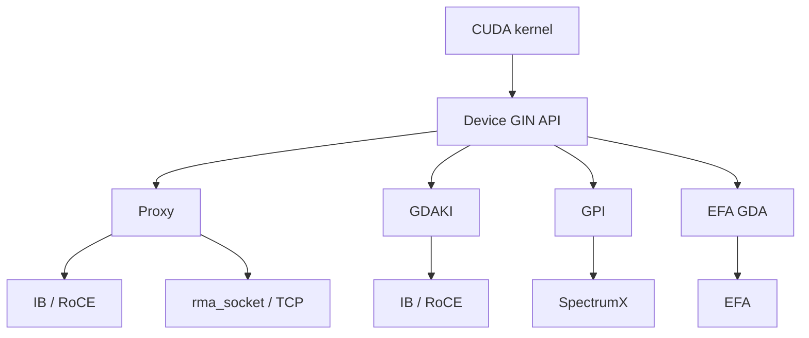
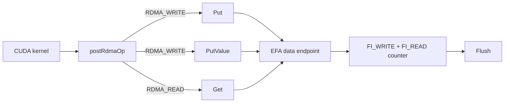
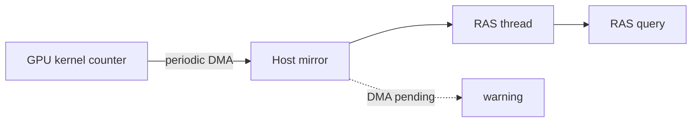

## はじめに

リリースノートの箇条書きは、たいてい「何が入ったか」しか教えてくれません。今回は、その書かれていない部分が特に問題でした。結論を先に書くと、[NCCL v2.32.3-1](https://github.com/NVIDIA/nccl/releases/tag/v2.32.3-1) のノートを信じて EFA 環境でバージョンを上げると、2 つの点でつまずきます。プラグイン側が追いついていない点と、API が定義だけされていて実装が空になっている点です。どちらもリリースノートには書かれていません。

そこで、v2.31.2-1 と v2.32.3-1 のソースツリーを取得して読み比べ、リリースノートの一行がどの変更を指しているのかを確認しました。以下で「ソースを確認した」と書いている箇所はこの読み比べに基づき、「PR の説明では」と書いている箇所は Pull Request の本文に基づきます。

:::message
本記事では、実機での動作確認を行っていません。記述の根拠として、2 つのバージョンのソースツリー、リリースノート、Pull Request、公式ドキュメントを参照しています。実際の挙動は手元の環境で確認してください。
:::

NVIDIA が公開した Aug-Oct 2026 のロードマップについては、以前の記事で解説しました。今回のリリースでは、そのロードマップに挙げた項目がどこまで実装されたかを確認できます。

https://zenn.dev/tosshi/articles/8d7fea5568e638

bug fix を除き、実務への影響が大きい 4 点を取り上げます。先に対応関係を表で示します。GIN は GPU カーネルから通信操作を発行するための仕組みで、EFA GDA はその AWS EFA 向けバックエンドです。どちらも次の節で説明します。

| 取り上げる変更 | ロードマップでの位置づけ | 2.32.3 での状態 |
|---|---|---|
| EFA GDA の Get 実装 | 最も大きな節目として挙げた EFA GDA support in GIN | Get は新規実装、PutValue はインライン化で改善、FlushAsync と Wait は実装が空のまま |
| Socket 経由の GIN | GIN over Sockets として挙げた | TCP 上の RMA トランスポートとして実装、GDRCopy が必須 |
| RAS の GPU 常駐進捗カウンタ | NCCL Notify と RAS diagnostics として挙げた | 進捗カウンタと診断項目 5 つが追加、Notify に相当する記載は見当たらない |
| Vera Rubin 初期サポート | ロードマップには無い新規項目 | 初期対応のコードが入り、性能モデルは未チューニングと明記 |

## GIN の全体像

本題に入る前に、全体像を整理しておきます。GIN は GPU カーネルの中から片方向の通信操作を発行するための API で、`put`、`get`、`signal` をデバイス関数として呼べます。従来の NCCL は CPU が通信を取り仕切る作りでしたが、GIN は通信の発行をカーネル側に移します。

押さえておきたいのは、GIN が単一の実装ではなく、複数のバックエンドの集合であることです。GPU が NIC を直接操作するものと、CPU の proxy スレッドを経由するものが混ざっています。



GDAKI は InfiniBand と RoCE 向けに GPU が直接発行する実装、GPI は SpectrumX を必要とする GPU-Push Interface です。EFA GDA は AWS EFA 向けの直接発行、Proxy は CPU スレッドが代行する実装です。したがって「GIN だから CPU を介さない」とは言えません。CPU を介さないのは GDAKI、EFA GDA、GPI の経路です。

先に用語を 3 つだけ説明します。WQE は Work Queue Entry の略で、NIC に渡す作業指示の 1 件分を指します。doorbell は、その作業指示を積んだことを NIC に知らせるためのレジスタ書き込みです。CTA は Cooperative Thread Array の略で、CUDA のスレッドブロックを指します。

## EFA GDA: Get の実装と WQE レイアウトの更新

まず、ロードマップ記事で最も大きな節目と位置づけた EFA GDA を取り上げます。新機能が加わったというより、Put しかできなかった実装に Get が加わり、欠けていた機能が補われた、と言うほうが正確です。

EFA GDA では、GPU が WQE を組み立てて NIC の doorbell を直接鳴らします。この背景はロードマップ記事で説明したので、ここでは差分だけを扱います。

### Get の追加

何が欠けていたのかは、AWS 側のドキュメントに明記されていました。[aws-ofi-nccl v1.21.0 のリリースノート](https://github.com/aws/aws-ofi-nccl/releases/tag/v1.21.0)には、EFA GDA の Known Limitations として「Only Put and signal operations are supported — no get or flush, and indexed signals only」と書かれています。相手の領域にデータを書き込む Put はできるが、相手からデータを読み出す Get はできない状態でした。

ソースを比べると、どの部分が欠けていたのかがはっきり分かります。2.31.2 の `gin_efa_gda.h` には `postRdmaWrite: shared post path for Put and PutValue` というコメントの付いた関数がありました。2.32.3 では同じ場所が `postRdmaOp: shared post path for Put, PutValue and Get` に変わり、`getImpl` と `getImplMode` が追加されています。



[PR #2382](https://github.com/NVIDIA/nccl/pull/2382) の説明によれば、RDMA の読み出しと書き込みは Work Request のフィールドがまったく同じで、どちら向きにバイトが動くかを決めるのは opcode だけです。したがって WQE を組んで doorbell を鳴らすまでの経路は共用できます。PR 本文には、warp の合流処理、doorbell の待ち合わせ、request ID の書き込み、2 つの backpressure の判定はいずれも変更されていないと書かれています。これらの処理は、そのまま Get にも使われます。

完了の観測のしかたも Put と揃えられています。Get は data endpoint を経由し、その endpoint のローカル完了カウンタは `FI_WRITE | FI_READ` で bind されます。読み出しの完了も、送信キューの空き待ちと `Flush` の両方から観測できると説明されています。ソースのコメントによれば、長さ 0 の Get についても何も発行しないのではなく、長さ 0 の read を 1 本発行します。待っている側が処理の終わりを検知できるよう、完了通知を必ず残すための作りです。

### PutValue のインライン化

`PutValue` は 8 バイト以下の値を相手の領域に書き込む操作です。サイズの上限は、ソースの `static_assert(sizeof(T) <= 8, "PutValue: T must fit in 8 bytes")` で確認できます。この操作自体は 2.31.2 にもあり、新規追加ではありません。変更されたのは、値を送る方法です。

2.31.2 のコメントには「value staged through the scratch buffer」とあり、いったんスクラッチ領域に値を置いてから、そこを送信元として指していました。2.32.3 では `PutValuePayloadEncoder` が値を 128 バイトの RDMA-write WQE の中に直接書き込みます。小さな値を通知するたびに発生していたメモリへの書き込みと読み出しが不要になります。この変更の内容は [PR #2405](https://github.com/NVIDIA/nccl/pull/2405) で説明されています。

### backendVersion の食い違い

[PR #2398](https://github.com/NVIDIA/nccl/pull/2398) は目立ちにくい変更ですが、運用への影響は、この節で取り上げる 3 つの PR の中で最も大きいと考えています。NCCL に取り込まれている `efa-dp-direct` のバージョンが上がり、WQE のレイアウトと request ID の幅が変わりました。2.32.3 に同梱されている `efa_cuda_dp_version.h` は major 1、minor 1、subminor 0 です。この新しいレイアウトには `backendVersion` 2 という番号が割り当てられています。

ここで問題になるのが、この番号を決める仕組みです。`src/gin/gin_host.cc` に対応表があります。

```c
constexpr int efaGdaBackendMinVersions[] = {0, NCCL_VERSION(2, 31, 0), NCCL_VERSION(2, 32, 0)};
```

配列の添字が `backendVersion` で、値はその番号を使うために必要な NCCL の最小バージョンです。番号を選ぶコードは次のとおりです。

```c
int backendVersion = 0;
for (int i = 0; i < nVersions; i++) {
  if (deviceCodeVersion < backendVersionArray[i]) break;
  backendVersion = i;
}
```

条件を満たす中で最も大きい番号を選び、その値を `ginConfig` に設定して `createContext` に渡します。注目すべきは、この決定でプラグインが宣言している上限がまったく参照されないことです。NCCL とプラグインの間でバージョンをすり合わせる処理は無く、低い番号に下げて選び直す処理もありません。

一方 `aws-ofi-nccl` 側は、自分が扱えるレイアウトの上限をヘッダの定数として持っています。

| aws-ofi-nccl | `NCCL_OFI_GDAKI_MAX_BACKEND_VERSION` |
|---|---|
| v1.21.1 (2026-08-20 公開、記事執筆時点の最新タグ) | 1 |
| master ブランチ | 2 |

プラグインのヘッダには「`createContext_v14` refuses values outside the supported range」と書かれています。範囲外の番号を渡されると拒否される設計です。つまり、バージョンのすり合わせがないまま、NCCL はプラグインの上限を知らずに最大値を渡し、プラグインはその値が範囲外なら拒否します。

`deviceCodeVersion` の意味にも注意が必要です。この値は、実行時にリンクされている NCCL ライブラリのバージョンではありません。アプリケーションのデバイスコードが、どのバージョンのヘッダでコンパイルされたかを表します。したがって 2.32.3 のライブラリを使っていても、アプリを 2.31 系のデバイスヘッダでビルドしていれば番号は 1 が選ばれます。逆に 2.32 系のヘッダでビルドすると番号 2 が選ばれ、v1.21.1 のプラグインでは範囲外になります。

拒否された後の挙動も、ソースから読み取れます。`ncclGinDevCommSetup` は候補のバックエンドを順に試し、失敗すると次の候補に移ります。低い `backendVersion` で再試行するのではなく、別のバックエンドを試すという動きです。すべて失敗すると「GIN: DevComm setup failed on all available backends」という警告で終わります。EFA GDA を使うつもりでも、気付かないうちに proxy に切り替わる、あるいは GIN そのものが立ち上がらない、という症状として現れます。

実機で再現したわけではないので断定はしませんが、コード上は次のように読めます。NCCL 2.32 系のデバイスヘッダでビルドして EFA GDA を使うなら、`backendVersion` 2 を宣言するプラグインが必要です。公開済みのタグにはまだ無く、master ブランチにはあります。ただし、master をビルドするだけですべてが解決するわけでもありません。次に述べる `FlushAsync` に必要なピアごとのフィールドは、master にも見当たりませんでした。

### 空実装のままの FlushAsync と Wait

利用前に確認しておきたいのが、この 2 つの API です。PR #2405 の説明には `FlushAsync` と `Wait` の実装が含まれていますが、2.32.3 のソースではどちらも中身が空です。

```c
template <>
struct ncclGinApi_FlushAsync<NCCL_NET_DEVICE_GIN_EFA_GDA> {
  NCCL_DEVICE_INLINE static void call(ncclGinCtx ctx, int peer, ncclGinRequest_t* outRequest, bool hasDescriptor,
                                      ncclGinDescriptorSmem* descriptor, uint32_t optFlags) {
    (void)ctx;
    (void)peer;
    (void)outRequest;
    (void)hasDescriptor;
    (void)descriptor;
    (void)optFlags;
  }
};
```

引数を未使用として扱うだけで、処理は実行しません。`Wait` も同様に `ncclSuccess` を返すだけです。ブロックする `Flush` は実装されていますが、こちらは endpoint 全体の未完了の操作がゼロになるまで待つ作りなので、特定のピア宛の特定の書き込みだけを待つことはできません。

ピア単位の完了待ちがなぜ難しいのかは、PR の説明に的確に書かれています。EFA が使う SRD プロトコルでは、同じピア宛の操作であっても、完了が発行順に観測されるとは限りません。したがって「N 番目が完了した」という報告だけでは、それより前の書き込みが終わった証明になりません。証明になるのは「N 未満の操作がすべて完了した」という、先頭から途切れなく続く完了の情報だけです。PR #2405 は、そのためにピアごとの順序付き完了カウンタをプラグインが公開する設計を提示しました。しかし NCCL 側の API は 2.32.3 で空実装のままで、プラグインの master ブランチにも対応するフィールドは見当たりません。つまり、NCCL 側とプラグイン側の両方で実装が完了していない状態です。

空実装のままリリースされた理由が、この設計上の難しさにあるのか、統合のタイミングやプラグイン側との足並みの問題にあるのかは、公開情報からは判断できません。

ロードマップ記事では課題の表の先頭に「Signal coalescing と SRD 順序保証の衝突」を挙げ、[aws-ofi-nccl #1327](https://github.com/aws/aws-ofi-nccl/issues/1327) を引きました。あちらは doorbell をまとめて鳴らす話、こちらは完了を判定する話で、同じ問題ではありません。ただし、SRD の完了順序が保証されないことは、どちらの問題にも関係しています。表の先頭に挙げた論点は、いまも有効です。

### 現時点の有効化条件

プラグインの [gin-getting-started.md](https://github.com/aws/aws-ofi-nccl/blob/master/doc/gin-getting-started.md) に条件がまとまっています。必要なのは libfabric 2.6.0 以上、rdma-core `64.0amzn0` 以上、EFA ドライバ 3.3.0 以上、GDRCopy 2.5 以上です。これらの条件は、EFA installer 1.50.0 以上を導入すれば満たせます。対象のインスタンスタイプは P5en、P6-B200、P6-B300 です。

有効化は自動では行われず、明示的な設定が必要です。ドキュメントには、次の 2 つを設定するよう書かれています。

```bash
export NCCL_GIN_TYPE=5
export NCCL_SYM_GIN_KERNELS_ENABLE=0
```

前者で EFA GDA を選び、後者で対称メモリ向けの GIN カーネルを無効にします。後者は EFA GDA では未対応だと記載されています。加えて、NVIDIA ドライバを `PeerMappingOverride=1` で読み込ませる必要があります。ドキュメントの説明によれば、EFA GDA は EFA の MMIO 領域を GPU のアドレス空間にマップするため、この設定が無いとドライバがマップを拒否します。

## Socket 経由の GIN

ロードマップ記事では、GIN の進展をまとめた表に「GIN over Sockets」を入れました。IB や RoCE が無くても TCP 経由で GIN が動くので、開発やテスト環境に向く、という紹介です。ここで前回の整理を 1 つ訂正します。前回の記事の表では、この機能を 2.31 の項目として挙げましたが、実際にリリースに入ったのは 2.32.3 でした。

リリースノートには「Adds socket-based GIN support, enabling custom kernel development with TCP sockets」と書かれています。実際に追加されたのは、`src/transport/rma_socket.cc` に実装された新しいトランスポートです。構成を示しているのは次の行です。

```c
props->netDeviceType = NCCL_NET_DEVICE_GIN_PROXY;
```

新しい GIN の種類が増えたのではありません。TCP の上に片方向通信の層を作り、それを既存の proxy 型デバイスとして公開することで、proxy バックエンドの経路から TCP を使えるようにしています。最初に示した図で Proxy から `rma_socket` へ伸びている矢印が、このトランスポートに当たります。

利点は、RDMA 対応の NIC が無い環境でも GIN カーネルを書いて機能を確認できる点です。GPU と CUDA 環境、そして後述する GDRCopy は必要ですが、InfiniBand、RoCE、EFA の用意は要りません。ロードマップ記事の最後に、自作の通信アルゴリズムを組んで NCCL に組み込んでみたいが取りかかり方がわからない、と書きました。その入り口が 2 つ同時に用意されました。1 つが今回の socket 経由の GIN で、もう 1 つが `docs/examples/09_gin_optimizations` というディレクトリです。後者は 2.31.2 には存在せず、2.32.3 で新設されています。

この新しい例は、同じリング交換の通信を 4 通りの書き方で実行して比べるベンチマークです。比べる軸は 2 つあります。1 つは put を CTA 全体で協調して発行するか、CTA 内の各スレッドが 1 本ずつ発行するかという粒度の選択です。もう 1 つは `ncclGinOptFlagsAggregateRequests` というヒントを、最後以外の put に付けるかどうかです。このフラグは後続のリクエストがまだ来るとバックエンドに伝えるだけのヒントで、バックエンドはこれを見て doorbell を鳴らすのを遅らせ、後のヒント無しリクエストでまとめて publish できます。自分で GIN カーネルを書くときに最初に迷う選択を、そのまま測って比べられるようになっています。

ただし socket 経由の GIN には条件があります。リリースノートの Known Issues には「Socket GIN currently requires users to opt-in to enable GDRCopy」とあり、ソースコードにも明示的に拒否する処理が入っています。

```c
if (ncclGdrCopy == NULL) {
  WARN("RMA/Socket : rma_socket requires GDRCopy; and GDR Copy is not available");
  return ncclInternalError;
}
```

GDRCopy を有効にする環境変数は、ドキュメントの環境変数一覧に `NCCL_GDRCOPY_ENABLE` として載っています。これを設定し、ランタイムとカーネルドライバの両方を入れておく必要があります。

### リリースノートとソースで違うフラグ名

GIN 関連でもう 1 つ、window の登録を GIN 用途だけに限定するフラグが追加されました。このフラグは名前に注意が必要です。リリースノートには `NCCL_WIN_REGISTER_GIN` と書かれていますが、この文字列は 2.32.3 のソースツリーに見当たりません。実際に追加されているのは `src/nccl.h.in` の次のマクロです。

```c
#define NCCL_WIN_GIN_ONLY 0x04
```

2.31.2 の同じファイルには `NCCL_WIN_DEFAULT`、`NCCL_WIN_COLL_SYMMETRIC`、`NCCL_WIN_STRICT_ORDERING` の 3 つしかなく、`NCCL_WIN_GIN_ONLY` と `NCCL_WIN_CFT_COUNTED` が 2.32.3 で増えています。環境変数ではなく window 登録時に渡すフラグなので、コードを書くときはこちらの名前で探してください。

## RAS: GPU 常駐の進捗カウンタと ATTN

ロードマップ記事では RAS の既知の限界を 2 つ挙げました。1 つは、256 GPU 構成で PyTorch がタイムアウトを報告しているのに RAS が正常と表示する事例です。もう 1 つは、RAS が遅れているランクではなく先に進んでいるランクしか報告しないため、原因となっているランクを特定しにくいという問題です。

2.32.3 で `src/ras/progress_monitor.cc` という新しいファイルが入りました。2.31.2 には存在しません。このファイルは、CUDA デバイスごとに 1 本のワーカースレッドを立て、GPU 上に置かれた進捗カウンタを副ストリーム経由で定期的にホストへコピーして、ホスト側に写しを作ります。



従来の集合操作カウントとの違いを補足します。従来から使える RAS の集合操作カウントは、カーネルが投入された時点で増えます。RAS の例のドキュメントにも、カウントされるのは enqueue された時点でありカーネル完了時ではない、と明記されています。つまりこの値だけでは、カーネルが実際に前に進んだかどうかは判定できません。新しい進捗カウンタはカーネル自身が更新する値なので、GPU の中で止まっているかどうかを見る材料が増えます。

ただし、ロードマップ記事で挙げた 2 つの問題が解決したとは書けません。RAS のクエリ出力が実際に遅延側のランクを指すよう変わったのか、タイムアウト時に正常と表示する挙動が直ったのかは、リリースノートにもドキュメントにも書かれていません。この点は実機で確かめるべき点です。

挙動は 3 つのパラメータで調整します。名前と既定値は、ソースの `NCCL_PARAM` 定義から取りました。

| 環境変数 | 既定値 | 意味 |
|---|---|---|
| `NCCL_PROGRESS_COUNTER_MONITOR_POLL_MS` | 1000 | カウンタを取りに行く間隔、下限は 50 |
| `NCCL_PROGRESS_COUNTER_MONITOR_STALE_MS` | 5000 | 値が動かないことを stale と見なす時間、下限は 1000 |
| `NCCL_PROGRESS_COUNTER_MONITOR_STALE_WARN_SEC` | 600 | 同じ種類の警告を再び出力するまでの間隔、0 以下で警告を止める |

監視処理そのものが止まった場合も報告されます。コピー用の DMA が返ってこないと、「counter DMA still pending after N 秒」というメッセージが RAS のログに出ます。監視する側が止まっているのか、監視される側が止まっているのかを取り違えにくくなっています。

### ATTN というログレベル

診断機能に関連する変更として、`WARN` と `INFO` の間に `ATTN` というレベルが追加されました。設定値のフォールバック、プラグイン初期化の失敗、非同期イベントの通知といった、致命的ではないものの確認しておきたい事象が、このレベルで出力されます。今回のリリースでは、通信路の初期化時に NVLink の帯域が落ちていることと、ランク間で NCCL の Git revision が食い違っていることが、どちらも `ATTN` で報告されるようになりました。

この新しいレベルは、バージョンが混在する環境で注意が必要です。公式ドキュメントも明示的に注意を促しています。2.32 より前の NCCL は `ATTN` という文字列を知らないため、`NCCL_DEBUG=ATTN` を渡すと解釈に失敗して、ログ出力そのものが無効になります。複数のバージョンが混在するクラスタで共通設定として指定する場合は、次のように書きます。

```bash
NCCL_DEBUG=WARN NCCL_DEBUG_LEVELS=ATTN ./my_app
```

### 2.32.3 で増えた RAS 診断項目

RAS diagnostics は、ジョブを実行する前の事前確認に使える機能です。2.31.2 と 2.32.3 でドキュメントの検査項目一覧を比べると、増えたのは次の 5 つでした。判定ロジックの詳細はドキュメントの RAS Diagnostics 節に書かれているので、ここでは各項目の検査対象だけを示します。

| 追加された検査 | 検査対象 |
|---|---|
| NVIDIA graphics driver version | NVML 経由で読んだグラフィックスドライバのバージョンがランク間で一致するか |
| Xid and SXid events | ホストのカーネルログから GPU の Xid と NVSwitch の SXid を拾い、発生ホストに紐付けて公式カタログの分類に対応付ける |
| PCI configuration | `rdma_topo check` で PCI トポロジと Access Control Services の設定を検査する |
| IOMMU mode and groups | 上の検査で結論が出ない場合に、GPU と NIC の IOMMU モードとグループを比べる |
| ATS state | 同様に結論が出ない場合に、NIC の Address Translation Services の状態を `lspci` から読む |

GPU の台数と型番の一致、CUDA ドライバのバージョン、ECC のエラーカウンタ、NVLink の本数と活性状態と速度、`NCCL_*` 環境変数の一致は、2.31.2 の時点でも一覧に載っています。今回増えたのは、GPUDirect RDMA が実際に効く構成になっているかを PCI 側から確かめる部分と、ハードウェア障害の痕跡をカーネルログから拾う部分です。初期化時に実行するには `NCCL_RUN_RAS_DIAGNOSTICS=1` を設定します。既定では無効です。

なお、これらの検査ではデータ経路で実際に通信するわけではなく、クラスタの健全性を網羅的に評価するものでもない、とドキュメントに断り書きがあります。ロードマップに挙がっていた NCCL Notify、つまり検知した障害を構造化イベントとしてアプリケーションに通知する仕組みについては、今回のリリースノートに該当する記載を見つけられませんでした。

## Vera Rubin 対応と cost model の進捗

4 点目はロードマップには無かった項目です。ただし、新しいハードウェアへの対応として読むだけでは、この項目の意味は捉えきれません。この節では、Rubin 対応と、ロードマップで取り上げた cost model 再設計が同じ箇所でつながっていることを確認します。

今回のリリースで最も目を引く項目は、Vera Rubin への初期対応です。Vera Rubin は Blackwell の後継となる GPU プラットフォームで、`sm107` のサポート、ConnectX-9 の rail と plane の検出、MPS と MLOPart の組み合わせへの対応が入りました。rail は同じ位置の NIC を揃えた単位、plane は独立したネットワーク面を指します。

世代の判定は `src/include/cudawrap.h` の 1 行に集約されています。

```c
#define RUBIN_AND_LATER(sm) (sm >= 107 && sm != 110 && sm != 120 && sm != 121)
```

ビルド側は `makefiles/common.mk` で、CUDA 13.4 以降のときに `compute_107` 向けのコードを生成します。トポロジ側では `ncclTopoIsVeraRubin()` が追加され、Vera Rubin のときだけ NIC をまとめる単位とポリシーが切り替わります。具体的には、まとめる範囲の判定が PCI のポート単位から PCI ホストブリッジ単位に変わり、ポリシーはすべての NIC をまとめる方式から rail 単位でまとめる方式に変わります。plane については、異なる plane に属する NIC 同士の接続を常に禁止する判定が経路探索に入りました。

MLOPart は GPU を論理パーティションに分ける機能です。ソースのコメントによれば、パーティションごとに別の GPU UUID が振られます。NCCL は GPU 名の文字列から `MLOPart` に続く番号を読み取り、バス ID の未使用ビットにその番号を埋め込んでトポロジ上で区別します。番号を埋めるビットが元から 0 であることを確認する関数まで用意されています。

1 つ注意点があり、`src/init.cc` では communicator 全体の GIN 対応状況を決める分岐が `!comm->hasMloPart` を条件に含んでいます。このコードからは、パーティションを使っている communicator では GIN 対応が無効のままになると読み取れます。

### CTA の手動調整という回避策

Known Issues には、Rubin の性能モデルが未調整であることが書かれています。2.32.3 は Rubin 向けの性能モデルのチューニングを含んでおらず、Rubin では NCCL が使う CTA の数を増やすと性能が改善する、と記載されています。リリースノートの本文にも「does not contain performance model tuning for Rubin. This will be part of the next release」と明記されています。

同様の回避策は、以前に取り上げた事例でも報告されています。ロードマップ記事で cost model の再設計を取り上げたとき、根拠として [Issue #2305](https://github.com/NVIDIA/nccl/issues/2305) を引きました。Blackwell の ReduceScatter で NCCL が自動選択した構成は 33.12 マイクロ秒かかり、CTA をもっと多く割り当てる構成に強制変更すると 13.84 マイクロ秒で終わった、という報告です。原因が同じとは言えませんが、手動で CTA を増やすと改善するという回避策である点は共通しています。

では cost model の再設計は進んでいないのか、というとそうではありません。性能予測コードの配置をバージョンごとに確認すると、2.30.4 では `src/graph/tuning.cc` の 1 ファイルでしたが、2.31.2 では `src/tuning/` というディレクトリに分かれ、`cost_model.cc`、`ring.cc`、`tree.cc`、`nvls.cc`、`pat.cc`、`sym_model.cc` が並んでいます。切り出し自体は 2.31 で行われていました。

2.32.3 ではさらに、対称メモリ向けカーネルのモデルが `sym_model.cc` の 1 ファイルから `src/tuning/sym_model/` というディレクトリに分割され、GIN 用、LSA 用、All-to-All 用が別のファイルになりました。リリースノートには、Blackwell の symmetric AllGather について、性能とリソース見積もりとカーネル選択を新しい cost model で改善したと書かれています。この分割と関連する変更だと考えられますが、ディレクトリの分かれ方だけから性能改善との対応を断定はできません。

整理すると、モデルの配置と分割は 2 リリースかけて進んでおり、Blackwell の symmetric AllGather では改善が入り、Rubin の性能モデルは次のリリース待ちです。コード構造の整理とは別に、ハードウェア世代ごとのパラメータ調整が残っていることが分かります。

## まとめ

取り上げた 4 点を手短に振り返ります。

第一に、EFA GDA は Get の新規実装と PutValue のインライン化で前進しました。ただし `FlushAsync` と `Wait` は NCCL 側もプラグイン側も実装が完了しておらず、公開済みのプラグイン v1.21.1 が宣言するレイアウトの上限は 1 です。2.32 系のデバイスヘッダでビルドすると 2 が要求されますが、バージョンのすり合わせも低い番号への切り替えも無いため、組み合わせが成立しません。

第二に、socket 経由の GIN が入りました。TCP 上の RMA トランスポートを既存の proxy 経路から使えるようにした構成で、RDMA 対応の NIC が無い環境でも GIN カーネルを試せます。`docs/examples/09_gin_optimizations` という新しい例も一緒に入っています。

第三に、RAS が GPU 上の進捗カウンタの写しをホスト側に持つようになり、診断項目も 5 つ増えました。カーネルが止まっているかどうかを見る材料は増えましたが、ロードマップ記事で挙げた 2 つの問題が解決したかは未確認です。

第四に、Vera Rubin への初期対応が入り、性能モデルは次のリリース待ちです。手動で CTA を増やすという回避策は、cost model 再設計の根拠として引いた Blackwell の事例と共通しています。

最後に、実務上の注意点をまとめます。リリースノートには、追加された機能が中心に記載されます。ヘッダでは宣言されていても実装が空の API があること、プラグイン側が未対応であること、リリースノートとソースでフラグ名が違うことは、ソースと関連リポジトリを見ないと分かりませんでした。EFA 上で GIN を使う予定なら、NCCL、アプリのビルドに使うデバイスヘッダ、`aws-ofi-nccl`、libfabric の組み合わせを自分の環境で先に確認してから、NCCL を更新するのが安全です。
