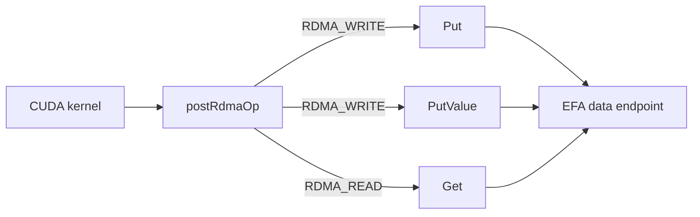
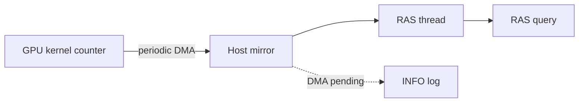
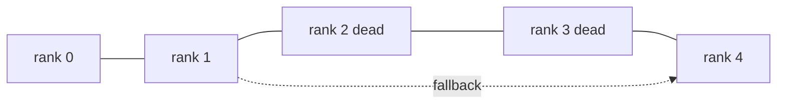

## はじめに

GIN、EFA GDA、RAS、cost model の背景は以前の記事で解説したので、そちらを読んだ前提で進めます。

https://zenn.dev/tosshi/articles/8d7fea5568e638

[NCCL v2.32.3-1](https://github.com/NVIDIA/nccl/releases/tag/v2.32.3-1) で、あの記事に並べた項目がどこまで実装に降りたのかを 4 つ整理します。

| 変更 | ロードマップでの位置づけ | 2.32.3 での状態 |
|---|---|---|
| EFA GDA の Get 実装 | 最も大きな節目として挙げた項目 | Get は実装、FlushAsync と Wait は中身が空 |
| Socket 経由の GIN | GIN over Sockets | TCP 上の片方向通信トランスポートとして実装 |
| RAS の GPU 常駐進捗カウンタ | NCCL Notify と RAS diagnostics | 進捗カウンタと診断項目が追加、通知の仕組みは据え置き |
| Vera Rubin 初期サポート | ロードマップには無い項目 | コードは入り、性能モデルは次のリリース待ち |

## EFA GDA に Get が入った

Get が実装されました。それまでは Put と signal だけで、[aws-ofi-nccl v1.21.0 のリリースノート](https://github.com/aws/aws-ofi-nccl/releases/tag/v1.21.0)には制限として「Only Put and signal operations are supported — no get or flush, and indexed signals only」と書かれていました。

### opcode 1 つで Get が乗った

面白いのは、ほとんど新しいコードを必要としなかった点です。2.31.2 の関数には [`postRdmaWrite: shared post path for Put and PutValue`](https://github.com/NVIDIA/nccl/blob/7b83616df3ae082a1f32bb74c27458bfe8153a13/src/include/nccl_device/gin/efa_gda/gin_efa_gda.h#L124) というコメントが付いていました。2.32.3 では同じ場所が [`postRdmaOp: shared post path for Put, PutValue and Get`](https://github.com/NVIDIA/nccl/blob/12df1a11afad322be5a204a2db890161cbf8131d/src/include/nccl_device/gin/efa_gda/gin_efa_gda.h#L161) に変わっています。



[PR #2382](https://github.com/NVIDIA/nccl/pull/2382) によれば、RDMA の読み出しと書き込みは Work Request のフィールドがまったく同じで、どちら向きにバイトが動くかを決めるのは opcode だけです。したがって WQE を組んで doorbell を鳴らすまでの経路は共用でき、warp の合流処理、doorbell の待ち合わせ、request ID の書き込み、2 つの backpressure の判定はいずれも変更せずに [`getImplMode`](https://github.com/NVIDIA/nccl/blob/12df1a11afad322be5a204a2db890161cbf8131d/src/include/nccl_device/gin/efa_gda/gin_efa_gda.h#L635) から使われます。

あわせて、8 バイト以下の値を書き込む `PutValue` の運び方も変わりました。2.31.2 はスクラッチ領域に値を置いてからそこを送信元として指していましたが、2.32.3 では [`PutValuePayloadEncoder`](https://github.com/NVIDIA/nccl/blob/12df1a11afad322be5a204a2db890161cbf8131d/src/include/nccl_device/gin/efa_gda/gin_efa_gda.h#L149) が値を 128 バイトの RDMA-write WQE の中に直接書き込みます。小さな値の通知ごとに起きていたメモリへの往復が消えます。

### backendVersion を誰も突き合わせていない

[PR #2398](https://github.com/NVIDIA/nccl/pull/2398) で `efa-dp-direct` が 1.1.0 に上がり、WQE のレイアウトと request ID の幅が変わりました。この新しいレイアウトには `backendVersion` 2 という番号が割り当てられています。

番号を決める仕組みが、ソースを読んでいていちばん驚いた部分です。[`gin_host.cc`](https://github.com/NVIDIA/nccl/blob/12df1a11afad322be5a204a2db890161cbf8131d/src/gin/gin_host.cc#L25) に番号ごとの必要バージョンを並べた対応表があり、[番号を選ぶコード](https://github.com/NVIDIA/nccl/blob/12df1a11afad322be5a204a2db890161cbf8131d/src/gin/gin_host.cc#L300-L304)はこうなっています。

```c
constexpr int efaGdaBackendMinVersions[] = {0, NCCL_VERSION(2, 31, 0), NCCL_VERSION(2, 32, 0)};

int backendVersion = 0;
for (int i = 0; i < nVersions; i++) {
  if (deviceCodeVersion < backendVersionArray[i]) break;
  backendVersion = i;
}
```

条件を満たす中で最も大きい番号を選び、その値を `createContext` に渡します。この決定にプラグインが宣言している上限はまったく登場しません。バージョンをすり合わせる処理も、低い番号に下げて選び直す処理もありません。

一方 `aws-ofi-nccl` は、自分が扱えるレイアウトの上限をヘッダの定数として持っています。

| aws-ofi-nccl | `NCCL_OFI_GDAKI_MAX_BACKEND_VERSION` |
|---|---|
| [v1.21.1](https://github.com/aws/aws-ofi-nccl/blob/2475c4c736907e68ebeadb3848f31231ee4a44d0/include/rdma/gin/nccl_ofi_gin_gdaki_dev.h#L116) (記事執筆時点の最新タグ) | 1 |
| [master](https://github.com/aws/aws-ofi-nccl/blob/ff2d3a36de29118b0b0e619938e12bc4b398797f/include/rdma/gin/nccl_ofi_gin_gdaki_dev.h#L117) | 2 |

master のヘッダには「`createContext_v14` refuses values outside the supported range」と書かれており、範囲外の番号は拒否されます。ただしこのコメントは v1.21.1 には無く、v1.21.1 が範囲外の値をどう扱うかは確認できていません。

`deviceCodeVersion` の正体も押さえておく価値があります。これは実行時にリンクされている NCCL ライブラリのバージョンではありません。[`dev_runtime.cc`](https://github.com/NVIDIA/nccl/blob/12df1a11afad322be5a204a2db890161cbf8131d/src/dev_runtime.cc#L1989-L1991) を見ると、アプリケーションが渡す `ncclDevCommRequirements` の `version` を使い、未指定なら `NCCL_VERSION_CODE` を入れています。つまりデバイスコードがどの NCCL バージョンを対象にビルドされたかを表す値です。ライブラリだけ 2.32.3 に上げてもデバイスコードが 2.31 系向けなら番号 1 が選ばれ、2.32 系向けにすると番号 2 が選ばれて、上限 1 の v1.21.1 では範囲外になります。

拒否された後の挙動も読み取れます。`ncclGinDevCommSetup` は候補のバックエンドを順に試し、失敗すると次の候補に移ります。低い番号で再試行するのではなく、別のバックエンドを試します。すべて失敗すると「GIN: DevComm setup failed on all available backends」で終わります。EFA GDA を狙っていても、候補に他のバックエンドが残る構成なら気付かないままそちらに切り替わり、残らなければ GIN 自体が立ち上がらない、という形で表に出ます。実機で再現したわけではないので断定はしませんが、コード上はこう読めます。

### FlushAsync と Wait は空実装

`FlushAsync` と `Wait` は、[PR #2405](https://github.com/NVIDIA/nccl/pull/2405) の説明には実装が含まれているのに、[2.32.3 のソース](https://github.com/NVIDIA/nccl/blob/12df1a11afad322be5a204a2db890161cbf8131d/src/include/nccl_device/gin/efa_gda/gin_efa_gda.h#L929-L939)ではどちらも中身が空です。引数を捨てるだけで、`Wait` は `ncclSuccess` を返すだけです。ブロックする `Flush` は動きますが、endpoint 全体の未完了の操作がゼロになるまで待つ作りなので、特定のピア宛の特定の書き込みだけを待つことはできません。

なぜピア単位の完了待ちが難しいのか、という PR の説明が読みどころです。SRD では同じピア宛の操作であっても、完了が発行順に観測されるとは限りません。したがって「N 番目が完了した」という報告だけでは、それより前の書き込みが終わった証明になりません。証明になるのは「N 未満の操作がすべて完了した」という、先頭から途切れなく続く完了の情報だけです。PR #2405 はそのためにピアごとの順序付き完了カウンタをプラグインが公開する設計を提示しましたが、NCCL 側の API は空実装のままで、プラグインの master にも対応するフィールドは見当たりません。両側で未完了です。

ロードマップ記事で課題の先頭に挙げた [aws-ofi-nccl #1327](https://github.com/aws/aws-ofi-nccl/issues/1327) とは別の問題ですが、SRD の完了順序が保証されないという原因は共通しています。

なお有効化の条件は [gin-getting-started.md](https://github.com/aws/aws-ofi-nccl/blob/ff2d3a36de29118b0b0e619938e12bc4b398797f/doc/gin-getting-started.md) に移動しており、libfabric の要求が 2.6.0 以上に上がっています。`NCCL_GIN_TYPE=5` と `NCCL_SYM_GIN_KERNELS_ENABLE=0` の設定、そして NVIDIA ドライバの `PeerMappingOverride=1` が必要です。

## TCP で GIN が動く

TCP ソケットの上で GIN を動かすトランスポートが追加されました。ロードマップ記事の表ではこれを 2.31 の項目として挙げていましたが、実際に入ったのは 2.32.3 でした。前回の整理はここが不正確だったので訂正します。

実体は [`rma_socket.cc`](https://github.com/NVIDIA/nccl/blob/12df1a11afad322be5a204a2db890161cbf8131d/src/transport/rma_socket.cc) で、構成を示しているのは[次の 1 行](https://github.com/NVIDIA/nccl/blob/12df1a11afad322be5a204a2db890161cbf8131d/src/transport/rma_socket.cc#L54)です。

```c
props->netDeviceType = NCCL_NET_DEVICE_GIN_PROXY;
```

新しい GIN の種類が増えたのではありません。TCP の上に片方向通信の層を作り、それを proxy 型デバイスとして公開することで、既存の proxy バックエンドの経路から TCP を使えるようにしています。

利点は、InfiniBand、RoCE、EFA のいずれの NIC も無い環境で GIN カーネルを書いて機能を確認できる点です。必要なのは GPU と CUDA 環境、そして GDRCopy です。[ソース](https://github.com/NVIDIA/nccl/blob/12df1a11afad322be5a204a2db890161cbf8131d/src/transport/rma_socket.cc#L30-L34)は GDRCopy が無いと明示的に拒否するので、`NCCL_GDRCOPY_ENABLE` での有効化が前提になります。

自作カーネルの材料としては、[`docs/examples/09_gin_optimizations`](https://github.com/NVIDIA/nccl/tree/12df1a11afad322be5a204a2db890161cbf8131d/docs/examples/09_gin_optimizations) も 2.32.3 で新設されました。同じリング交換の通信を 4 通りに実装して比べるベンチマークで、軸は put を CTA 全体で協調して発行するか各スレッドが 1 本ずつ発行するかという粒度と、`ncclGinOptFlagsAggregateRequests` を最後以外の put に付けるかどうかの 2 つです。後者は後続のリクエストがまだ来るとバックエンドに伝えるヒントで、バックエンドは doorbell を鳴らすのを遅らせ、後のヒント無しリクエストでまとめて publish できます。GIN カーネルを書くときに最初に迷う選択が、そのまま測れる形で置かれています。

### リリースノートとソースで違うフラグ名

window の登録を GIN 用途だけに限定するフラグも追加されました。リリースノートには `NCCL_WIN_REGISTER_GIN` と書かれていますが、この文字列は 2.32.3 のソースツリーに見当たりません。実際に追加されているのは [`nccl.h.in`](https://github.com/NVIDIA/nccl/blob/12df1a11afad322be5a204a2db890161cbf8131d/src/nccl.h.in#L68) の `NCCL_WIN_GIN_ONLY 0x04` です。[2.31.2 の同じファイル](https://github.com/NVIDIA/nccl/blob/7b83616df3ae082a1f32bb74c27458bfe8153a13/src/nccl.h.in#L64-L66)には 3 つしかなく、これと `NCCL_WIN_CFT_COUNTED` が増えています。環境変数ではなく window 登録時に渡すフラグなので、コードを書くときはこちらの名前で探してください。

## RAS に GPU 常駐の進捗カウンタ

[`progress_monitor.cc`](https://github.com/NVIDIA/nccl/blob/12df1a11afad322be5a204a2db890161cbf8131d/src/ras/progress_monitor.cc) が新設されました。2.31.2 には存在しません。CUDA デバイスごとに 1 本のワーカースレッドを立て、GPU 上に置かれた進捗カウンタを副ストリーム経由で定期的にホストへコピーして、ホスト側に写しを作ります。



何が変わるかは、従来の集合操作カウントとの対比で見えます。従来のカウントはカーネルが投入された時点で増えます。[RAS の例のドキュメント](https://github.com/NVIDIA/nccl/blob/12df1a11afad322be5a204a2db890161cbf8131d/docs/examples/08_ras/README.md)にも、カウントされるのは enqueue された時点でありカーネル完了時ではない、と明記されています。つまりこの値だけではカーネルが実際に前に進んだかは判定できません。新しい進捗カウンタはカーネル自身が更新する値なので、GPU の中で止まっているかを見る材料になります。ロードマップ記事で挙げた 2 つの限界が解消されたかは、リリースノートにもドキュメントにも書かれていないので実機で確かめる話です。

調整は `NCCL_PROGRESS_COUNTER_MONITOR_POLL_MS` (既定 1000)、`NCCL_PROGRESS_COUNTER_MONITOR_STALE_MS` (既定 5000)、`NCCL_PROGRESS_COUNTER_MONITOR_STALE_WARN_SEC` (既定 600) で行います。監視処理そのものが止まった場合も報告され、コピー用の DMA が返ってこないと「counter DMA still pending after N 秒」が RAS のログに出ます。

診断の項目も増えました。2.31.2 では GPU 構成、ドライバ、ECC、NVLink、`NCCL_*` 環境変数の一致を見ていましたが、2.32.3 では NVIDIA グラフィックスドライバのバージョン、Xid と SXid のイベント、`rdma_topo check` による PCI 構成、IOMMU のモードとグループ、NIC の ATS の状態が加わりました。GPUDirect RDMA が実際に効く構成かを PCI 側から確かめる部分と、ハードウェア障害の痕跡をカーネルログから拾う部分です。詳細は [RAS のドキュメント](https://github.com/NVIDIA/nccl/blob/12df1a11afad322be5a204a2db890161cbf8131d/docs/userguide/source/troubleshooting/ras.rst)にあり、初期化時に走らせるには `NCCL_RUN_RAS_DIAGNOSTICS=1` が必要です。

ログレベルには `ATTN` が追加されました。設定値のフォールバックやプラグイン初期化の失敗のように、致命的ではないが知りたい事象を出すレベルです。[列挙体](https://github.com/NVIDIA/nccl/blob/12df1a11afad322be5a204a2db890161cbf8131d/src/include/nccl_common.h#L28-L35)では ABI 互換のため末尾に置かれていますが、コメントには「logically between WARN and INFO」と書かれています。注意が必要なのは、2.32 より前の NCCL がこの文字列を知らないため、`NCCL_DEBUG=ATTN` を渡すと解釈に失敗してログ出力そのものが無効になる点です。バージョンが混在するクラスタでは `NCCL_DEBUG=WARN NCCL_DEBUG_LEVELS=ATTN` と書きます。

NCCL Notify については、リリースノートに記載がありません。ソースには [`rasClientsNotifyEvent()`](https://github.com/NVIDIA/nccl/blob/12df1a11afad322be5a204a2db890161cbf8131d/src/ras/peers.cc#L806-L809) という通知の入口があり、`PEER_NEW`、`PEER_CONNECTING`、`PEER_DEAD` の 3 種類を送っていますが、これは 2.31.2 にもあり、呼び出し箇所の数も一致します。今回増えたわけではありません。

### 二重故障の扱い

RAS という言葉で語られる監視の仕組みは、ふつう単一の故障を前提にします。同時に 2 つ壊れる場合は対象外、という設計が一般的です。NCCL の RAS はどうなっているのかが気になったのでソースを読んだところ、監視網そのものは同時多発の故障を前提に作られている一方で、問い合わせの経路と今回入った進捗カウンタは単一の故障までしか見ていない、という構造でした。

[`rasnet.cc`](https://github.com/NVIDIA/nccl/blob/12df1a11afad322be5a204a2db890161cbf8131d/src/ras/rasnet.cc#L12) の先頭に「Links forming the backbone of the RAS network (currently a ring)」というコメントがあり、各プロセスは自分の番号の前後にあたる 2 方向のリンクを持ちます。



素朴なリングは 2 箇所同時に切れると分断されます。そこで RAS はリンクごとに fallback の接続を持ちます。[`rasLinkAddFallback()`](https://github.com/NVIDIA/nccl/blob/12df1a11afad322be5a204a2db890161cbf8131d/src/ras/rasnet.cc#L922) が故障を検知したリンクに代替の相手を足し、相手を決める [`rasLinkCalculatePeer()`](https://github.com/NVIDIA/nccl/blob/12df1a11afad322be5a204a2db890161cbf8131d/src/ras/peers.cc#L743) は死んだピアを飛ばしながらリングを進みます。ループは自分自身に戻るまで回るので、連続して何台死んでいても飛び越えられます。

さらに、飛ばす先が別ノードの場合はそのノードに属するピアを全部まとめて飛ばそうとします。ノードごと落ちたという想定です。コメントには、生きているピアを飛ばす可能性はあるが、そのピアも RAS 網との接続は保てるので問題ない、と書かれています。ただし飛ばす前に、そのノードのどれかと通信が成立していないかを確認します。ソースの表現では「We convinced ourselves that the node is not down」です。1 ノード分のプロセスが同時に消える事象は、設計の想定内です。死亡判定は [`rasPeerDeclareDead()`](https://github.com/NVIDIA/nccl/blob/12df1a11afad322be5a204a2db890161cbf8131d/src/ras/peers.cc#L793) がローカルに記録し、その配列のハッシュをピアに配って揃えます。

限界のほうもはっきり書かれています。問い合わせの経路を扱う [`collectives.cc` のコメント](https://github.com/NVIDIA/nccl/blob/12df1a11afad322be5a204a2db890161cbf8131d/src/ras/collectives.cc#L444-L455)が率直です。応答の待ち時間は 5 秒と 10 秒の二段構えで、遠くの接続で起きた遅延は他のピアが適切に処理してくれると信じるしかない、と書かれています。そのうえで「if there is a cascade of problematic connections, they could still exceed the 5s total」と続き、10 秒を超えたら手元にある分だけ返します。さらに、問い合わせ元が接続しているピアのほうが先にタイムアウトするだろうから遅れて届いた応答はもう間に合わない、とも書かれています。故障が連鎖した場合に返ってくるのは、欠けのある答えです。

今回入った進捗カウンタも、この観点では単一の故障までです。CUDA デバイスごとにワーカースレッドが 1 本で、冗長化はありません。DMA が返ってこない場合もログを残すだけです。監視を足したぶん、監視自身が壊れる経路も増えたことになります。

## Vera Rubin は入ったが cost model は次回

Vera Rubin は Blackwell の後継となる GPU プラットフォームで、`sm107` のサポート、ConnectX-9 の rail と plane の検出、MPS と MLOPart の組み合わせへの対応が入りました。SM 番号の判定には [`cudawrap.h`](https://github.com/NVIDIA/nccl/blob/12df1a11afad322be5a204a2db890161cbf8131d/src/include/cudawrap.h#L16) のマクロが追加されています。途中の番号が除外されているのは、そこが別系統に割り当てられているからです。

```c
#define RUBIN_AND_LATER(sm) (sm >= 107 && sm != 110 && sm != 120 && sm != 121)
```

トポロジ側では [`ncclTopoIsVeraRubin()`](https://github.com/NVIDIA/nccl/blob/12df1a11afad322be5a204a2db890161cbf8131d/src/graph/topo.cc#L1897) が追加され、Vera Rubin のときだけ NIC をまとめる範囲が PCI のポート単位から PCI ホストブリッジ単位に変わり、ポリシーもすべての NIC をまとめる方式から rail 単位に変わります。plane については、異なる plane に属する NIC 同士の接続を常に禁止する判定が経路探索に入りました。

MLOPart は GPU を論理パーティションに分ける機能で、パーティションごとに別の GPU UUID が振られます。ここに注意点があり、communicator 全体の GIN 対応状況を決める [`init.cc` の分岐](https://github.com/NVIDIA/nccl/blob/12df1a11afad322be5a204a2db890161cbf8131d/src/init.cc#L1924)が `!comm->hasMloPart` を条件に含んでいます。パーティションを使っている communicator では GIN 対応が無効のままになると読み取れます。

性能面は正直に書かれています。Known Issues には Rubin 向けの性能モデルのチューニングを含んでおらず、CTA の数を増やすと性能が改善する、とあり、リリースノート本文にも「does not contain performance model tuning for Rubin. This will be part of the next release」と明記されています。手動で CTA を増やすという回避策は、ロードマップ記事で cost model 再設計の根拠に引いた [Issue #2305](https://github.com/NVIDIA/nccl/issues/2305) と同じ形です。

とはいえ再設計が止まっているわけではありません。性能予測コードの配置を追うと、2.30.4 では `src/graph/tuning.cc` の 1 ファイルでしたが、[2.31.2 では `src/tuning/`](https://github.com/NVIDIA/nccl/tree/7b83616df3ae082a1f32bb74c27458bfe8153a13/src/tuning) に分かれています。2.32.3 ではさらに [`src/tuning/sym_model/`](https://github.com/NVIDIA/nccl/tree/12df1a11afad322be5a204a2db890161cbf8131d/src/tuning/sym_model) が追加され、対称メモリ向けカーネルのモデルが GIN 用、LSA 用、All-to-All 用の別ファイルになりました。既存の `sym_model.cc` は残っていて、[`CMakeLists.txt`](https://github.com/NVIDIA/nccl/blob/12df1a11afad322be5a204a2db890161cbf8131d/src/tuning/CMakeLists.txt) では両方がビルド対象です。置き換えではなく追加です。

## まとめ

ロードマップの項目はおおむね回収されましたが、EFA GDA は `FlushAsync` と `Wait` が空実装のまま残りました。デバイスコードを 2.32 系向けにビルドすると `backendVersion` 2 が選ばれ、上限が 1 の公開済みプラグイン v1.21.1 では範囲外になると読めます。EFA 上で GIN を使うなら、NCCL、デバイスコードの対象バージョン、`aws-ofi-nccl`、libfabric の組み合わせを先に自分の環境で確認してください。
