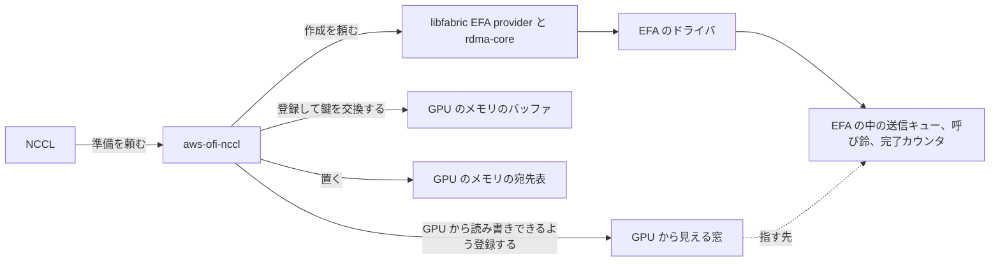
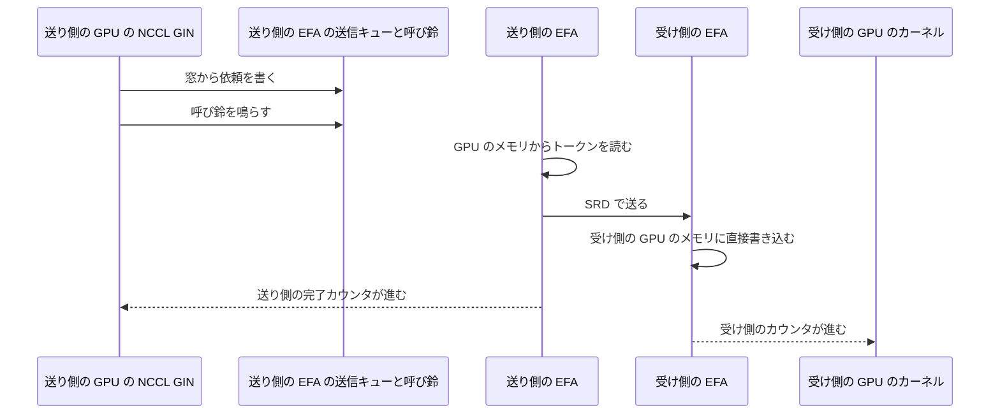

## はじめに

GPU どうしがノードをまたいで通信すると聞くと、CPU が送信を指示し、OS のカーネルがネットワークカードを動かす姿を思い浮かべる方が多いと思います。ところが DeepEP V2 を AWS の EFA の上で EFA-GDA という方式、つまり GPU から EFA を直接操作する方式で動かすと、トークンを 1 回送るたびに通る道には、CPU も OS のカーネルも出てきません。GPU の上で動くプログラム、つまり GPU のカーネルが、自分でネットワークカードに依頼を書き、合図を送ります。

この記事では、MoE（Mixture of Experts、トークンごとに一部の専門家ネットワークだけを使うモデル）のエキスパート並列で行う all-to-all 通信を例に、ソフトウェアの各層が実際のデータの流れのどこで使われているかを整理します。登場する層は DeepEP、NCCL、aws-ofi-nccl、libfabric、OS のカーネルのドライバ、そして EFA です。

全体の流れは次の動画にまとめました。本文では、動画の各場面が何を表しているかを、実装の出典とあわせて説明します。

@[youtube](2n3toEB6h-M)

本文の内容は [awsome-distributed-ai の DeepEP V2 ベンチマークの README](https://github.com/awslabs/awsome-distributed-ai/blob/2f80bf7e826c95ad841867a842202f3cbb4c6754/micro-benchmarks/expert-parallelism/deepep-v2-benchmark/README.md) と [aws-ofi-nccl のソースコード](https://github.com/aws/aws-ofi-nccl/tree/63df9e4ef85c298306cac9e80bef7ac68ffec316)をもとにしています。性能の数字はこの記事では扱いません。

## 積み木は 3 つの段に分かれる

まず、1 台の GPU ノードの上にどんなソフトウェアが載っているかを見ます。動画の最初の場面では、下から 3 つの段を積んでいます。

| 段 | 載っているもの | 入れる場所 |
|---|---|---|
| EC2 インスタンス | GPU 8 枚と EFA | インスタンスそのもの |
| DLAMI | Ubuntu と、EFA のドライバ、NVIDIA のドライバ、gdrdrv といった OS のカーネルのドライバ | ホスト |
| コンテナ | rdma-core、libfabric、aws-ofi-nccl、NCCL、DeepEP | コンテナイメージ |

EFA（Elastic Fabric Adapter）は、EC2 インスタンスどうしを結ぶネットワークインタフェースです。DLAMI（AWS Deep Learning AMI）は、AWS が配布している GPU 向けの OS イメージです。gdrdrv は、CPU から GPU のメモリを直接読み書きする GDRCopy という仕組みのためのドライバです。

ドライバは OS のカーネルに組み込まれるので、ホスト側に入れる必要があります。残りのユーザー空間のライブラリはコンテナイメージに入れます。AWS が配布しているコンテナイメージ、AWS Deep Learning Containers（DLC）を使う場合も、この段に入ります。README でも、ホストでは EFA installer をドライバ込みで実行し、コンテナの中ではドライバを除いて実行する手順になっています。

ホストでは次のように実行します。

```bash
sudo ./efa_installer.sh --minimal -y
```

コンテナイメージを作るときは次のように実行します。コンテナ側の EFA installer は、rdma-core のユーザー空間のライブラリ、libfabric、aws-ofi-nccl を入れます。

```bash
./efa_installer.sh -y --skip-kmod --skip-limit-conf --no-verify
```

コンテナの中の主なライブラリは、それぞれ次の役割を持っています。

- DeepEP は、MoE のトークンを担当のエキスパートがいる GPU へ配り、結果を集め戻す通信のライブラリです。配る処理を dispatch、集める処理を combine と呼びます。DeepEP V2 は、ノードをまたぐ通信に NCCL GIN を使います。
- NCCL は、GPU どうしの集団通信のライブラリです。NCCL は GIN（GPU-Initiated Networking）という仕組みにより、GPU のカーネルの中から直接ネットワークへの送信を始められます。
- aws-ofi-nccl は、NCCL を EFA につなぐプラグインです。aws-ofi-nccl は、NCCL がネットワークに求める仕事、つまり接続、メモリの登録、送受信を、libfabric を使って実装しています。GIN 向けには、EFA を GPU から直接操作できるようにする準備も受け持ちます。
- libfabric は、高速なネットワークを扱う共通のライブラリです。libfabric は、EFA 向けの実装である EFA provider を通して EFA を操作します。
- rdma-core は、RDMA 機器を扱うユーザー空間のライブラリ群です。EFA provider は、rdma-core を通して EFA のドライバに依頼を出します。

## MoE の all-to-all で起きること

エキスパート並列では、エキスパートを複数の GPU に分担させます。各 GPU は、持っているトークンを、ルーターが選んだエキスパートの GPU へ送ります。ルーターは、トークンごとにどのエキスパートを使うかを決める小さなネットワークです。宛先と量はトークンごとに変わり、どの GPU も他のどの GPU へでも送りうるので、この通信を all-to-all と呼びます。

送り先には 2 種類あります。同じノードの中の GPU へは、GPU どうしをつなぐ高速な接続である NVLink を通ります。別のノードの GPU へは EFA を通ります。後者の道で各層が何をしているかが、この記事の主題です。

この道の働きは、送るたびには行わない準備と、トークンを送るたびに繰り返す転送の 2 つに分かれます。この 2 つを分けて見ると、各層の役割がはっきりします。

## 準備: 転送を始める前に用意するもの

準備では、GPU から EFA を直接操作するための道具を 4 つそろえます。どれも、NCCL から頼まれた aws-ofi-nccl が用意します。

1 つ目は、EFA の中の送信キュー、呼び鈴、完了カウンタです。送信キューは、送ってほしい内容を書いた依頼を並べておく場所です。呼び鈴は、依頼を書いたことを EFA に知らせるための書き込み先で、doorbell と呼ばれます。完了カウンタは、送り終わった数を EFA が数える場所です。aws-ofi-nccl は、libfabric の EFA provider と rdma-core を通して、これらを作らせます。作る依頼は EFA のドライバを通って EFA に届きます。

2 つ目は、GPU から見える窓です。[ソースのコメント](https://github.com/aws/aws-ofi-nccl/blob/63df9e4ef85c298306cac9e80bef7ac68ffec316/include/rdma/gin/nccl_ofi_gin_gdaki_resources.h#L101-L113)によると、EFA provider が返す送信キューと呼び鈴のアドレスは、BAR という領域を指すホスト側のアドレスです。BAR は、EFA のようなデバイスの中のレジスタやメモリを、ホストのアドレスに見せる領域です。この対応づけは rdma-core と libfabric が作ります。aws-ofi-nccl は、この範囲を CUDA の `cuMemHostRegister` で登録し、GPU から読み書きできるアドレスを得ます。これで GPU のカーネルが、送信キューに直接書き込み、呼び鈴を直接鳴らせるようになります。完了カウンタについても、aws-ofi-nccl が、GPU のカーネルがその数字を読むための手がかりを GPU のメモリに置いておきます。

3 つ目は、送受信に使う GPU のメモリの登録です。DeepEP が確保したバッファを EFA が直接読み書きできるように、aws-ofi-nccl がそのメモリを登録し、相手が書き込むための鍵を全員で交換します。[ソースのコメント](https://github.com/aws/aws-ofi-nccl/blob/63df9e4ef85c298306cac9e80bef7ac68ffec316/src/rdma/gin/nccl_ofi_gin_gdaki.cpp#L1035-L1036)に、メモリの登録と相手ごとの鍵の交換がこの処理で行われると書かれています。

4 つ目は、宛先表です。aws-ofi-nccl は、相手ごとの宛先の情報を表にして GPU のメモリに置きます。[ソースのコメント](https://github.com/aws/aws-ofi-nccl/blob/63df9e4ef85c298306cac9e80bef7ac68ffec316/include/rdma/gin/nccl_ofi_gin_gdaki_resources.h#L484-L510)にある、GPU のメモリに置く宛先の表がこれにあたります。

誰が何を作るかを図にすると、次のようになります。



準備の段階では、libfabric も OS のカーネルのドライバも働きます。一方で、[ソースのコメント](https://github.com/aws/aws-ofi-nccl/blob/63df9e4ef85c298306cac9e80bef7ac68ffec316/src/rdma/gin/nccl_ofi_gin_gdaki.cpp#L976-L981)によると、この方式のメモリの登録では GDRCopy を使いません。同じコメントには、CPU の代理役が送信を受け持つ別の方式では GDRCopy を上乗せすると書かれています。それでも README では gdrdrv が読み込まれていることが条件になっています。この方式で必要な理由は README に書かれていませんが、条件なのでホストには入れておきます。

## 転送: 1 回の送信で起きること

準備が終わると、1 回の送信は次の手順で進みます。動画で GPU0 と EFA の間を拡大している場面は、この手順を表しています。

1. DeepEP の GPU のカーネルの中で動く NCCL GIN が、宛先表を見て、送る依頼を窓から送信キューに書き込みます。
2. NCCL GIN が呼び鈴を鳴らします。
3. 送り側の EFA が GPU のメモリからトークンを直接読み、相手のノードへ送ります。受け側の EFA が、受け側の GPU の登録済みのバッファへ直接書き込みます。EFA の通信方式である SRD（Scalable Reliable Datagram）は、ネットワークの中の複数の経路を使って送る方式です。
4. 送り側では完了カウンタが進みます。GPU のカーネルはこの数字を見て、自分の送信が終わったことを知ります。
5. 受け側では、受け側の EFA が持つ別のハードウェアのカウンタが進みます。このカウンタは、相手からの書き込みが終わった数を数えます。aws-ofi-nccl はこのカウンタを signal として GPU のカーネルに渡しておき、受け側の GPU のカーネルはこの数字を見てトークンが届いたことを知ります。

4 つ目と 5 つ目の手順について、[ソースのコメント](https://github.com/aws/aws-ofi-nccl/blob/63df9e4ef85c298306cac9e80bef7ac68ffec316/include/rdma/gin/nccl_ofi_gin_gdaki_resources.h#L538-L550)には、GPU のカーネルは完了の記録を読みに行く代わりにハードウェアのカウンタを見て待つと書かれています。受け側の合図用のカウンタも、[同じファイル](https://github.com/aws/aws-ofi-nccl/blob/63df9e4ef85c298306cac9e80bef7ac68ffec316/include/rdma/gin/nccl_ofi_gin_gdaki_resources.h#L617-L631)で GPU のカーネルに渡されています。

依頼の書式を組み立てる GPU 側のコードは、NCCL の中にあります。[ヘッダのコメント](https://github.com/aws/aws-ofi-nccl/blob/63df9e4ef85c298306cac9e80bef7ac68ffec316/include/rdma/gin/nccl_ofi_gin_gdaki_dev.h#L1-L21)によると、aws-ofi-nccl は GPU のメモリに置く取り決めの形を決め、NCCL がその形を自分の中に写し持っています。そのため、トークンを送る道の上では aws-ofi-nccl の関数は呼ばれません。

手順を時間の順に並べると、次のようになります。



この手順のどこにも、CPU と OS のカーネルは出てきません。GPU のカーネルと EFA が、準備で作った窓と表を使ってやり取りするだけです。ただし、GPU のカーネルを起動するのは CPU で、エラーの処理や後片付けもホスト側の仕事です。出てこないのは、トークンを 1 回送るたびに通る道の上だけです。

## どの層がいつ働くか

ここまでの内容を、層ごとにまとめます。

| 層 | 準備 | 転送中 |
|---|---|---|
| DeepEP | 送受信のバッファを確保する | トークンを宛先ごとにまとめる。同じノードへは NVLink で書き込む |
| NCCL | aws-ofi-nccl に準備を頼む | GPU の上の NCCL GIN が依頼を書き、呼び鈴を鳴らし、カウンタを見る |
| aws-ofi-nccl | キューを作らせ、窓を割り当て、メモリを登録し、宛先表を置く | 送信の道には出てこない |
| libfabric と rdma-core | 送信キューと呼び鈴を作り、アドレスを返す | 送信の道には出てこない |
| OS のカーネルのドライバ | EFA の中に送信キューなどを用意する | 送信の道には出てこない |
| EFA | 送信キュー、呼び鈴、カウンタを持つ | GPU のメモリを読み、SRD で送り、相手の GPU のメモリに書く |

aws-ofi-nccl と libfabric と OS のカーネルのドライバは、送信の道で使うものを転送の前にすべて用意しています。転送中にその道の上で動くのは、GPU の上の DeepEP と NCCL GIN、そして EFA だけです。

## 動かすための条件

GPU から EFA を直接操作するこの方式を、NCCL GIN の中では EFA-GDA と呼びます。次の条件がそろう必要があります。最後の 1 つを除いて、README に書かれている条件です。

| 置き場所 | 条件 |
|---|---|
| コンテナ | NCCL 2.31 以上。DeepEP V2 がリンクする GIN の API が入っている |
| コンテナ | EFA installer 1.50 以上。EFA-GDA に対応した aws-ofi-nccl が入っている |
| ホスト | EFA のドライバ 3.3.0 以上。README によると、完了カウンタの API が入った最初の版 |
| ホスト | gdrdrv が読み込まれている |
| ホスト | NVIDIA のドライバが `NVreg_RegistryDwords="PeerMappingOverride=1"` の設定で読み込まれている |

最後の条件は README ではなく、[aws-ofi-nccl のエラーメッセージ](https://github.com/aws/aws-ofi-nccl/blob/63df9e4ef85c298306cac9e80bef7ac68ffec316/include/rdma/gin/nccl_ofi_gin_gdaki_resources.h#L136-L145)に書かれています。呼び鈴を GPU のアドレス空間に割り当てる処理が、この設定を必要とします。

さらに、利用者は方式を選ぶ環境変数を設定します。

```bash
export NCCL_GIN_TYPE=5
```

README によると、この環境変数を指定しないと、EFA の上の NCCL は CPU の代理役のスレッドが送信を受け持つ方式を選びます。その方式でも DeepEP V2 は動きますが、この記事で説明した、GPU から直接 EFA を操作する道は通りません。

## まとめ

MoE の all-to-all でノードをまたぐ送信を準備と転送の 2 つに分けると、各層の役割がはっきりします。準備では、aws-ofi-nccl が libfabric とドライバを使って EFA の中に送信キュー、呼び鈴、完了カウンタを作らせ、それを GPU から触れる窓として割り当てます。さらに GPU のメモリを登録し、宛先表を GPU のメモリに置きます。転送では、GPU の上の NCCL GIN が依頼を書いて呼び鈴を鳴らし、EFA が GPU のメモリを直接読んで相手の GPU のメモリに書き込みます。

ホストとコンテナという分け方も、この役割分担に沿っています。OS のカーネルのドライバはホストに、ユーザー空間のライブラリはコンテナイメージに入ります。条件がホストとコンテナにまたがるので、両方をそろえて初めてこの道が使えます。

動画の中のトークンの数やノードの数は、説明のために減らしてあります。実際の構成や手順は、[awsome-distributed-ai の DeepEP V2 ベンチマーク](https://github.com/awslabs/awsome-distributed-ai/tree/2f80bf7e826c95ad841867a842202f3cbb4c6754/micro-benchmarks/expert-parallelism/deepep-v2-benchmark)を参照してください。
