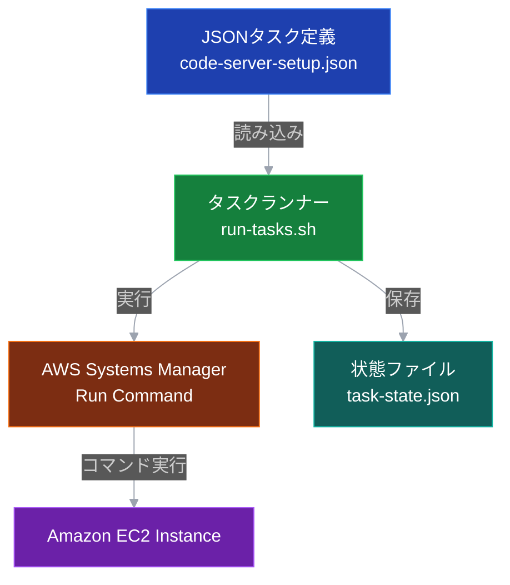

## はじめに

以前、[AWS Trainium で Code Server 環境を構築する記事](https://zenn.dev/tosshi/articles/eb54037328d2ef)を公開しました。この記事では AWS CloudFormation を用いて検証環境を Amazon EC2 で構築し、 Code Server からアクセスして検証できるようにするものでした。本記事では、Amazon EC2 Capacity Block for ML を使用して、AWS CDK で `trn2.3xlarge` インスタンスを起動、Code Server で検証できる環境を構築します。

前回の記事の User Data によるセットアップでは OS/CPU アーキテクチャを変えるたびにスクリプトが正常に動くか何度も CloudFormationの設定を変えてはデプロイ・確認しており、数時間を溶かしていました。この個人的に辛い課題を解決するため、CDK ではインスタンスの起動までを行い、スクリプトの流し込みはインスタンス起動後にローカル端末から AWS Systems Manager Run Command を使って冪等なスクリプトを実行するように実装しました。これにより、失敗した箇所から再開可能で個人的な辛みが減ります。

:::message
本記事のコード全体は以下のリポジトリで公開しています。
https://github.com/littlemex/ec2-cfn-templates-for-genai/tree/main/samples/aws-neuron/torch-neuronx/multi-framework-dlami-ubuntu24-cdk
:::

## Amazon EC2 Capacity Block for ML とは

Amazon EC2 Capacity Block for ML は、特定の期間（例：24 時間）だけ機械学習向けインスタンス（AWS Trainium や AWS Inferentia など）を予約購入できる機能です。オンデマンドよりも安価に GPU やアクセラレータインスタンスを利用できます。執筆時点だと、`p6-b200`, `p5`, `p5e`, `p5en`, `p4d`, `p4de`, `trn1`, and `trn2` が利用できます。基本的に GPU が乗った大きなインスタンスで利用するためこの Capacity Block を使ったことがない方も多いと思います。今回、`trn2.3xlarge` という比較的小さな trn2 インスタンスが利用できるようになっていたので実際に Capacity Block を利用して CDK でインスタンスを立ち上げてみました。

詳細は [Amazon EC2 Capacity Blocks for ML のドキュメント](https://docs.aws.amazon.com/AWSEC2/latest/UserGuide/ec2-capacity-blocks.html)を参照してください。

## AWS CDK で Capacity Block を使用する方法

Amazon EC2 Capacity Block を使用するには、以下の 2 つのプロパティを設定する必要があります。Launch Template（`AWS::EC2::LaunchTemplate`）を使用してこれらのプロパティを設定します。

1. **`InstanceMarketOptions.MarketType = "capacity-block"`**: Capacity Block の使用指定
2. **`CapacityReservationSpecification.CapacityReservationTarget`**: 予約 Block ID を指定

### 実装例

```typescript:lib/torch-neuron-stack.ts
// Launch Template用のプロパティ
const launchTemplateData: any = {
  imageId: amiId,
  instanceType: props.instanceType,
  // ... その他の設定 ...
};

// Capacity Block設定
if (props.useCapacityBlock) {
  // ✅ InstanceMarketOptionsを設定
  launchTemplateData.instanceMarketOptions = {
    marketType: 'capacity-block',
  };
}

if (props.capacityReservationId) {
  // ✅ CapacityReservationSpecificationを設定
  launchTemplateData.capacityReservationSpecification = {
    capacityReservationTarget: {
      capacityReservationId: props.capacityReservationId,
    },
  };
}

// Launch Template作成
const launchTemplate = new ec2.CfnLaunchTemplate(this, 'CodeServerLaunchTemplate', {
  launchTemplateName: `${id}-LaunchTemplate`,
  launchTemplateData,
});

// Launch Templateを使用してインスタンスを起動
const instance = new ec2.CfnInstance(this, 'CodeServerInstance', {
  launchTemplate: {
    launchTemplateId: launchTemplate.ref,
    version: launchTemplate.attrLatestVersionNumber,
  },
  subnetId: props.subnetId || undefined,
  // ... タグなど ...
});
```

### ポイント

1. **Launch Template の使用**: `AWS::EC2::LaunchTemplate` で `InstanceMarketOptions` と `CapacityReservationSpecification` を設定
2. **条件分岐**: `useCapacityBlock` フラグで Capacity Block の使用を制御

## Capacity Block の購入から起動までのフロー

Capacity Block を使用するには、以下の 3 ステップで進めます。

### ステップ1: Capacity Block の検索と購入

今回作った CLI をラップした管理スクリプトを使用して、利用可能な Capacity Block を検索・購入します。

```bash
# 1. 利用可能なCapacity Blockを検索
./scripts/manage-capacity-block.sh search \
  -t trn2.3xlarge \
  -d 1 \
  -r sa-east-1

# 2. 購入（Offering IDは検索結果から取得）
./scripts/manage-capacity-block.sh purchase \
  --offering-id cbr-XXXXX \
  --start-time 2026-01-27T00:00:00Z \
  -r sa-east-1
```

購入時、スクリプトが自動的に以下の情報を AWS Systems Manager Parameter Store に保存します。

- `/capacity-block/{region}/reservation-id`
- `/capacity-block/{region}/subnet-id`

この自動保存により、デプロイ時に手動で ID を指定する必要がなくなります。

#### その他の便利なコマンド

```bash
# 購入済み　Capacity Block　の一覧表示
./scripts/manage-capacity-block.sh list -r sa-east-1

# Capacity Block　の詳細情報表示
./scripts/manage-capacity-block.sh describe \
  --reservation-id cr-XXXXX \
  -r sa-east-1

# Parameter Storeから読み込み
./scripts/manage-capacity-block.sh load-params -r sa-east-1

# Capacity Blockをキャンセル（注意：キャンセル料が発生する可能性）
./scripts/manage-capacity-block.sh cancel \
  --reservation-id cr-XXXXX \
  -r sa-east-1
```

### ステップ2: CDK デプロイ

統合デプロイスクリプト（`deploy.sh`）を使用してインスタンスを起動します。

```bash
# Parameter Storeから自動読み込み（推奨）
./scripts/deploy.sh --use-capacity-block -r sa-east-1

# または、IDを明示的に指定
./scripts/deploy.sh \
  --use-capacity-block \
  --capacity-reservation-id cr-XXXXX \
  --subnet-id subnet-XXXXX \
  -r sa-east-1
```

このスクリプトは以下を自動実行します。

1. CDK スタックのデプロイ
2. インスタンスの起動
3. Code Server のセットアップ（次のステップ）
4. 接続情報の表示

#### deploy.sh の便利なオプション

```bash
# 通常のデプロイ（Capacity Block 不使用）
./scripts/deploy.sh -r sa-east-1

# インスタンスタイプを指定
./scripts/deploy.sh -t inf2.8xlarge -r sa-east-1

# 特定 IP からのアクセスを許可
./scripts/deploy.sh --allowed-ip 203.0.113.10/32 -r sa-east-1

# セットアップをスキップ（インスタンス起動のみ）
./scripts/deploy.sh --skip-setup -r sa-east-1

# デプロイ済みスタックの情報を表示
./scripts/deploy.sh --show-info -r sa-east-1

# スタックを削除
./scripts/deploy.sh --destroy -r sa-east-1
```

### ステップ3: Code Server セットアップ（自動実行）

`deploy.sh` が自動的にセットアップを実行しますが、手動でも実行可能です。

## インスタンス起動後のスクリプト流し込み

前の記事で作った Amazon EC2 User Data によるセットアップには複数のツラミがありました。1 つ目は、失敗すると AWS CloudFormation 全体をやり直す必要があることです。スタックの削除から再作成まで数十分かかり、デバッグに膨大な時間を浪費して涙を流していました。2 つ目は、ログが見づらく、`/var/log/cloud-init-output.log` や CloudWatch Logs を確認する必要があり、エラーの原因特定がめんどくさいことです。

### AWS Systems Manager Run Command による解決

これらの問題を解決するため、AWS Systems Manager の Run Command を使用したスクリプト実行を実装しました。

#### アーキテクチャ

以下の図は、スクリプト実行のアーキテクチャを示しています。JSON タスク定義から AWS Systems Manager Run Command を通じて Amazon EC2 インスタンスでコマンドを実行する流れを表現しています。



JSON タスク定義ファイル（`code-server-setup.json`）には 17 個の独立したタスクが定義されており、各タスクは個別に実行可能です。タスクランナー（`run-tasks.sh`）が JSON 定義を読み込み、AWS Systems Manager Run Command を介して各タスクを実行します。進捗は状態ファイルに保存され、失敗した場合途中からの再実行を実現します。

#### 状態管理による冪等性

タスクの実行状態を `/tmp/task-state-{instance-id}.json` に保存することで、冪等性を実現しています。

```json
{
  "tasks": {
    "01-configure-needrestart": {
      "name": "Configure needrestart",
      "status": "success",
      "timestamp": "2026-01-26T12:34:56.789Z",
      "command_id": "12345678-1234-1234-1234-123456789abc"
    },
    "02-cleanup-neuron-repo": {
      "name": "Cleanup old Neuron repository",
      "status": "success",
      "timestamp": "2026-01-26T12:35:01.234Z",
      "command_id": "23456789-2345-2345-2345-234567890bcd"
    }
  },
  "last_run": "2026-01-26T12:35:01.234Z"
}
```

この仕組みにより、完了済みタスクは自動でスキップされ、失敗したタスクから再開可能になります。また、AWS CloudFormation の再デプロイが不要になるため、私個人のツラミが大幅に緩和されます。タスク定義ファイルを追加すれば好きにコマンドを流し込むこともできます。

### JSON タスク定義の柔軟性

すべてのセットアップ手順を JSON 形式で定義することで、後から自由にカスタマイズ可能になりました。

```json:tasks/code-server-setup.json
{
  "name": "Code Server Setup",
  "description": "Code Serverのインストールと設定",
  "variables": {
    "USER": "coder",
    "PASSWORD": "",
    "HOME_DIR": "/work",
    "INTERNAL_PORT": "8080",
    "NGINX_PORT": "80"
  },
  "tasks": [
    {
      "id": "01-configure-needrestart",
      "name": "Configure needrestart",
      "description": "needrestartの設定を変更",
      "commands": [
        "echo '==> Configuring needrestart settings'",
        "sed -i 's/#$nrconf{restart} = \"i\";/$nrconf{restart} = \"a\";/' /etc/needrestart/needrestart.conf"
      ]
    },
    {
      "id": "09-install-code-server",
      "name": "Install Code Server",
      "description": "Code Serverをインストール",
      "commands": [
        "echo '==> Installing Code Server'",
        "curl -fsSL https://code-server.dev/install.sh | sh"
      ]
    }
    // ... 全17タスク
  ]
}
```

変数の置換も可能です。

```json
{
  "commands": [
    "adduser --disabled-password --gecos '' {{USER}}",
    "chown -R {{USER}}:{{USER}} {{HOME_DIR}}"
  ]
}
```

### セットアップスクリプトの手動実行

`deploy.sh` がセットアップを自動実行しますが、以下の場合は手動実行が必要です。

1. セットアップが失敗した場合
2. `--skip-setup` オプションでデプロイした場合
3. 設定を変更して再実行したい場合

#### Secret ARN について

`-s` オプションで指定する Secret ARN は、**CDK デプロイ時に自動的に作成**されます。

```typescript
// CDKスタックで自動生成されるパスワード
const password = new secretsmanager.Secret(this, 'CodeServerPassword', {
  description: 'Code-server password',
  generateSecretString: {
    excludePunctuation: true,
    passwordLength: 16,
  },
});
```

通常は `deploy.sh` が自動的に Secret ARN を取得して渡しますが、手動実行する場合は以下の方法で確認できます：

```bash
# 方法1: AWS CLIで検索
aws secretsmanager list-secrets \
  --region sa-east-1 \
  --query "SecretList[?contains(Name, 'CodeServerPassword')].ARN" \
  --output text

# 方法2: deploy.sh の --show-info オプション
./scripts/deploy.sh --show-info -r sa-east-1
# → Secret ARN とパスワード取得コマンドが表示される
```

#### 実行例

```bash
# 基本的な実行
./scripts/setup-code-server.sh \
  -i i-1234567890abcdef0 \
  -r sa-east-1 \
  -s arn:aws:secretsmanager:sa-east-1:123456789012:secret:CodeServerPassword-XXXXX

# 失敗したタスクから再開（例：タスク09から）
./scripts/setup-code-server.sh \
  -i i-1234567890abcdef0 \
  -r sa-east-1 \
  -s arn:aws:secretsmanager:... \
  --start-from 09-install-code-server

# ドライラン（実行内容の確認）
./scripts/setup-code-server.sh \
  -i i-1234567890abcdef0 \
  -r sa-east-1 \
  --dry-run
```

スタックの再デプロイは不要で、失敗した箇所から数分で再開できます。

## セットアップの全体像

実装した 17 ステップのセットアップ内容を以下の表にまとめました。

| # | タスク名 | 説明 | 再実行 |
|---|---------|------|-------|
| 01 | configure-needrestart | needrestart 設定の変更 | ✅ |
| 02 | cleanup-neuron-repo | 古い Neuron リポジトリ削除 | ✅ |
| 03 | wait-for-dpkg-lock | dpkg ロック待機 | ✅ |
| 04 | install-base-packages | 基本パッケージインストール | ✅ |
| 05 | create-user | ユーザー作成 | ✅ |
| 06 | configure-sudo | sudo 権限設定 | ⚠️ |
| 07 | create-home-dir | ホームディレクトリ作成 | ✅ |
| 08 | configure-profile | プロファイル設定 | ⚠️ |
| 09 | install-code-server | Code Server インストール | ✅ |
| 10 | configure-code-server | Code Server 設定 | ⚠️ |
| 11 | configure-vscode-settings | VS Code 設定 | ⚠️ |
| 12 | configure-nginx | nginx 設定 | ⚠️ |
| 13 | create-systemd-service | systemd サービス作成 | ⚠️ |
| 14 | enable-and-start-service | サービス起動 | ⚠️ |
| 15 | install-vscode-extensions | VS Code 拡張機能 | ⚠️ |
| 16 | create-code-command | code コマンド作成 | ⚠️ |
| 17 | verify-installation | インストール検証 | ✅ |

- ✅ 何度実行しても安全
- ⚠️ 設定ファイルを上書きまたはサービス再起動

### タスクランナーの実装

タスクランナー（`run-tasks.sh`）は、Python スクリプトで実装されており、以下の機能を提供します。

```python
# タスク実行関数（抜粋）
def execute_task(task_id, commands):
    """タスクを実行"""
    script = '\n'.join(commands)
    
    # SSM send-command実行
    result = subprocess.run(
        ['aws', 'ssm', 'send-command',
         '--region', region,
         '--instance-ids', instance_id,
         '--document-name', 'AWS-RunShellScript',
         '--parameters', json.dumps({'commands': [script]})],
        capture_output=True
    )
    
    # 完了待機とステータス確認
    # ...
    
    return {
        'status': 'success',
        'command_id': command_id,
        'output': output
    }
```

## 実際の使用例

実際に Capacity Block を使用して環境を構築する一連の流れを示します。

### 例 1: 基本的な使い方

```bash
# 1. Capacity Block を検索
./scripts/manage-capacity-block.sh search -t trn2.3xlarge -d 1 -r sa-east-1

# 2. Capacity Block を購入（検索結果の Offering ID を使用）
./scripts/manage-capacity-block.sh purchase \
  --offering-id cbr-XXXXX \
  --start-time 2026-01-27T00:00:00Z \
  -r sa-east-1
# → 購入完了時、Parameter Storeに自動保存される

# 3. デプロイ（Parameter Store から自動読み込み）
./scripts/deploy.sh --use-capacity-block -r sa-east-1
# → CDK デプロイ → インスタンス起動 → Code Server セットアップが自動実行
```

### 例2: セットアップが失敗した場合

```bash
# 1. 失敗した箇所から再実行
./scripts/setup-code-server.sh \
  -i i-XXXXX \
  -r sa-east-1 \
  -s arn:aws:secretsmanager:...:secret:CodeServerPassword-XXXXX \
  --start-from 09-install-code-server

# 2. 接続確認
./scripts/deploy.sh --show-info -r sa-east-1
```

### 例3: 既存のスタック情報を確認

```bash
# スタック情報を表示
./scripts/deploy.sh --show-info -r sa-east-1
```

**出力例：**

```bash
CDK デプロイスクリプト
プロジェクトディレクトリ: /work/samples/aws-neuron/torch-neuronx/multi-framework-dlami-ubuntu24-cdk
リージョン: sa-east-1
インスタンスタイプ: trn2.3xlarge
Capacity Block: false
ボリュームサイズ: 500GB

📊 スタック情報を取得中...

スタック名: TorchNeuron-CDK
ステータス: UPDATE_COMPLETE
リージョン: sa-east-1

📋 インスタンス情報:
  Instance ID: i-0a1b2c3d4e5f67890
  Public DNS: ec2-12-34-56-78.sa-east-1.compute.amazonaws.com
  Public IP: 12.34.56.78

🔍 インスタンス詳細情報:
  State: running
  Instance Type: trn2.3xlarge
  Availability Zone: sa-east-1b
  Launch Time: 2026-01-26T11:33:42+00:00

🔐 接続情報:
  Code Server URL: http://ec2-12-34-56-78.sa-east-1.compute.amazonaws.com

  パスワード取得コマンド:
    aws secretsmanager get-secret-value \
      --secret-id arn:aws:secretsmanager:sa-east-1:012345678901:secret:CodeServerPasswordA9061133-Abc1Def2Ghi3-Jk4Lmn \
      --region sa-east-1 \
      --query 'SecretString' \
      --output text

  SSM接続コマンド:
    aws ssm start-session --target i-0a1b2c3d4e5f67890 --region sa-east-1
```

この出力から、インスタンスID、接続URL、パスワード取得方法などの必要な情報がすべて確認できます。

### 例4: 環境をクリーンアップ

```bash
# スタックを削除
./scripts/deploy.sh --destroy -r sa-east-1

# Capacity Blockもキャンセルする場合（注意：料金発生の可能性）
./scripts/manage-capacity-block.sh cancel \
  --reservation-id cr-XXXXX \
  -r sa-east-1
```

## まとめ

本記事では、AWS CDK を使用して Amazon EC2 Capacity Block で Trainium インスタンスを起動する方法を紹介しました。これらの実装により個人的なツラミが軽減されました。

## 参考リンク

- [GitHub リポジトリ](https://github.com/littlemex/ec2-cfn-templates-for-genai/tree/main/samples/aws-neuron/torch-neuronx/multi-framework-dlami-ubuntu24-cdk)
- [AWS EC2 Capacity Blocks](https://docs.aws.amazon.com/AWSEC2/latest/UserGuide/ec2-capacity-blocks.html)
- [Launch instances using Capacity Blocks](https://docs.aws.amazon.com/AWSEC2/latest/UserGuide/capacity-blocks-launch.html)
- [AWS::EC2::LaunchTemplate - CloudFormation](https://docs.aws.amazon.com/AWSCloudFormation/latest/UserGuide/aws-resource-ec2-launchtemplate.html)
- [InstanceMarketOptions - CloudFormation](https://docs.aws.amazon.com/AWSCloudFormation/latest/UserGuide/aws-properties-ec2-launchtemplate-instancemarketoptions.html)
- [AWS Neuron Documentation](https://awsdocs-neuron.readthedocs-hosted.com/)
- [AWS CDK Documentation](https://docs.aws.amazon.com/cdk/)
