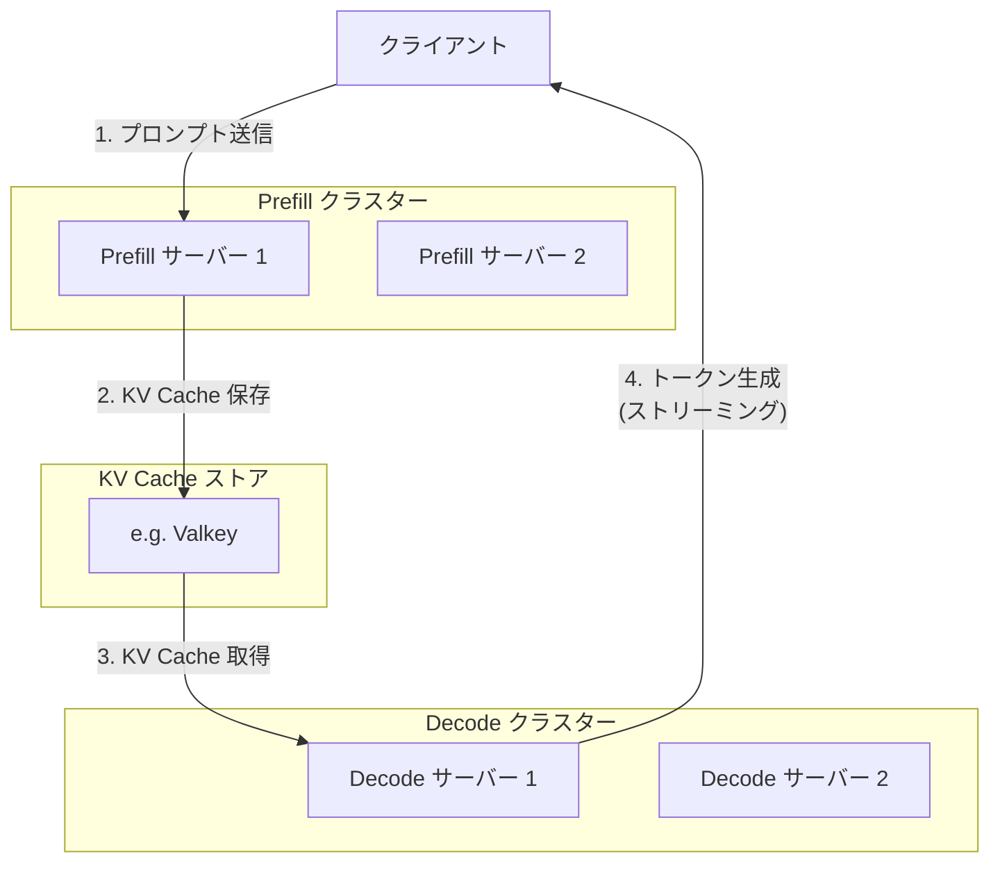
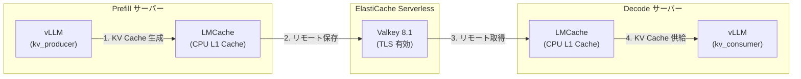

## はじめに

https://zenn.dev/tosshi/articles/009bb138491dd1

:::message
↑の続き！別件に色々対応しているうちにいつの間にか vLLM も v0.19.0 までアップデートされているので手元にあったコードを最新にアップデートして動作確認をします。
:::

本記事では、AWS 上で vLLM + LMCache を使って構築する方法を解説します。llm-d などを使うと楽なのかもしれませんが k8s での利用が前提になるのでだるいため今回は使いません。実際には llm-d は k8s 上でなくても動くようです。

長いので以降では、P/D Disaggregated Inference を PD 分離推論、と呼称します。

## PD 分離推論 with LMCache の全体像

:::message
前回の記事では Prefill Server、Decode Server それぞれ 1 台ずつが直接的に KV Cache を転送していましたが、実ワークロードでは複数の Prefill/Decode クラスターが KV Cache を扱う必要があるため、中間の KV Cache のストレージレイヤーがあると Producer と Consumer が疎結合にインスタンス依存なくやり取りできます。ただし RDMA 等の恩恵を受けづらくなる可能性があるため性能とのトレードオフでしょう。LMCache はいい感じで vLLM などのエンジンと連携してキャッシュを管理する抽象化ライブラリです。
:::

https://zenn.dev/tosshi/articles/e2f8f45e6fdc21

以下の 3 つのコンポーネントで構成されます。



### リクエストフロー

1. **クライアント** がプロンプトを Prefill サーバーに送信
2. **Prefill サーバー** が入力トークンを一括処理し、KV Cache を生成
3. **Prefill サーバー** が KV Cache を ElastiCache（外部 KV ストア）に保存
4. **Decode サーバー** が ElastiCache から KV Cache を取得
5. **Decode サーバー** が KV Cache からトークンを逐次生成し、クライアントにストリーミング

### Prefill サーバーの役割

Prefill サーバーは、入力プロンプトの処理に特化します。

**設計方針**
- **高スループット**: 長いプロンプトのバッチ処理に最適化
- **GPU 演算能力重視**: Compute-bound な処理に特化
- **短時間のバースト処理**: リクエストを受け取り、KV Cache を生成して素早く返す

**vLLM での設定**
```bash
--kv-transfer-config '{
  "kv_connector": "LMCacheConnectorV1",
  "kv_role": "kv_producer"
}'
```

`kv_role: kv_producer` を指定することで、このサーバーが KV Cache の Prefill 側であることを vLLM に伝えます。Prefill サーバーは推論結果のテキストではなく、KV Cache を外部ストアに書き出すことが主な仕事です。

### Decode サーバーの役割

Decode サーバーは、トークンの逐次生成に特化します。

**設計方針**:
- **低レイテンシ**: 各トークンの生成を高速に
- **メモリ帯域重視**: Memory-bound な処理に特化
- **ストリーミング対応**: 生成したトークンを即座にクライアントに返す

**vLLM での設定**:
```bash
--kv-transfer-config '{
  "kv_connector": "LMCacheConnectorV1",
  "kv_role": "kv_consumer"
}'
```

`kv_role: kv_consumer` を指定することで、このサーバーが KV Cache の Decode 側であることを vLLM に伝えます。Decode サーバーは Prefill を自分では行わず、外部ストアから KV Cache を取得して、Decode 処理のみを実行します。

### KV Cache の共有メカニズム

今回は、Prefill サーバーと Decode サーバーの間で KV Cache を共有するために、**LMCache** と **AWS ElastiCache Serverless** を組み合わせて使用します。

:::message alert
プロダクションではこの構成は推奨されないかもしれません。ElastiCache は AWS EFA に対応していないので大規模な KV Cache を大量に通信する場合の実トラフィックでのパフォーマンスを計測してから利用すべきでしょう。代替案としては GPU と同じ Placement Group に EFA に対応している 大きめサイズの I-family インスタンスを構築するのは良い選択肢の可能性がありますがお金の問題で私は検証を断念しました。( ･ㅂ･)و💰ﾏﾈｰ!
:::



**LMCache** は vLLM の KV Cache を外部ストアに永続化するライブラリです。以下の 2 層キャッシュ構造を持ちます。

| 層 | バックエンド | 役割 |
|----|-----------|------|
| L1 | Local CPU Memory | 高速なローカルキャッシュ（同一サーバー内） |
| L2 | ElastiCache (Valkey) | リモート共有キャッシュ（サーバー間で共有） |

**LMCache の設定例（Prefill 側）**
```yaml
# lmcache-prefiller.yaml
local_cpu: true
max_local_cpu_size: 5          # L1: CPU メモリ 5GB
remote_url: "valkey://your-cache.serverless.region.cache.amazonaws.com:6379?tls=true&cluster_mode=true"
chunk_size: 256                # 256 トークン単位で分割保存
num_workers: 8                 # 並列 GET/SET ワーカー数
hash_algorithm: "sha256_cbor_64bit"  # TP > 1 の場合に必要
```

**LMCache の設定例（Decode 側）**
```yaml
# lmcache-decoder.yaml
local_cpu: true
max_local_cpu_size: 10         # L1: CPU メモリ 10GB（Decode 側は大きめ）
remote_url: "valkey://your-cache.serverless.region.cache.amazonaws.com:6379?tls=true&cluster_mode=true"
chunk_size: 256                # Prefill 側と一致させる必須
num_workers: 8
hash_algorithm: "sha256_cbor_64bit"  # Prefill 側と一致させる必須
```

`chunk_size` と `hash_algorithm` は Prefill と Decode で**必ず一致させる**必要があります。不一致の場合、Decode 側が KV Cache を正しく取得できません。

## 技術スタック

本 PD 分離推論 with LMCache シリーズで使用する技術スタックを紹介します。

### vLLM 0.19.0 (V1 Engine)

[vLLM](https://github.com/vllm-project/vllm) は、LLM 推論のためのオープンソースの高性能推論エンジンです。v0.19.0 では V1 Engine がデフォルトです。

**PD 分離推論に関連する vLLM の設定パラメータ**

```bash
# Prefill サーバーの起動例
python -m vllm.entrypoints.openai.api_server \
  --model meta-llama/Llama-3.1-8B-Instruct \
  --tensor-parallel-size 2 \
  --port 8100 \
  --kv-transfer-config '{
    "kv_connector": "LMCacheConnectorV1",
    "kv_role": "kv_producer"
  }'
```

```bash
# Decode サーバーの起動例
python -m vllm.entrypoints.openai.api_server \
  --model meta-llama/Llama-3.1-8B-Instruct \
  --tensor-parallel-size 2 \
  --port 8200 \
  --kv-transfer-config '{
    "kv_connector": "LMCacheConnectorV1",
    "kv_role": "kv_consumer"
  }'
```

### LMCache 0.4.3

[LMCache](https://github.com/LMCache/LMCache) は、vLLM の KV Cache を外部ストアに永続化・共有するためのライブラリです。vLLM と密結合で動作し、以下の機能を提供します。

- **多層キャッシュ**: Local CPU / Local Disk / Remote（Redis/Valkey）の 3 層構造
- **CacheGen 圧縮**: KV Cache の圧縮転送（ただし後述の制約あり）
- **チャンク分割**: `chunk_size` 単位でキャッシュを分割管理
- **NIXL 対応**: NVIDIA NIXL による高速転送（本シリーズでは未使用）

::::details LMCache のバージョンに関する注意点

本プロジェクトの検証では、LMCache 0.4.2 から 0.4.3 へのアップグレードを実施しました。0.4.2 と 0.4.3 の主な差分は以下の通りです。

| 変更 | 内容 | 本検証への影響 |
|------|------|--------------|
| `save_decode_cache` バグ修正 | Decode 時の KV Cache 保存処理の修正 | なし（`save_decode_cache: False` のため） |
| RESP auth 環境変数サポート | `LMCACHE_REDIS_USERNAME/PASSWORD` | なし（ElastiCache Serverless は認証不要） |
| L2 eviction 機能追加 | Local disk の eviction 機能 | なし（local_disk 未使用） |

SSL/TLS 接続に関する改善は含まれていないため、ElastiCache Serverless との接続には追加の考慮が必要です。詳細は第 2 部（実装編）で解説します。

::::

### AWS ElastiCache Serverless (Valkey 8.1)

[AWS ElastiCache Serverless](https://docs.aws.amazon.com/AmazonElastiCache/latest/dg/serverless.html) は、マネージドなインメモリデータストアです。Valkey（Redis 互換の OSS）をバックエンドとして使用します。

**PD 分離推論での ElastiCache の役割**

- Prefill サーバーと Decode サーバーの間で KV Cache を高速に共有
- VPC 内でのアクセスによる低レイテンシ（約 10ms）
- TLS 暗号化による通信の保護
- サーバーレスのため、容量やスループットの自動スケーリング

## 検証環境の構成

本シリーズの検証で使用した環境を紹介します。

### インフラ構成


| 項目 | 値 |
|------|------|
| クラスター | AWS ParallelCluster 3.14.2 + Slurm |
| コンピュートノード | g6.12xlarge (4x NVIDIA L4, 各 23GB VRAM) |
| GPU ドライバ | NVIDIA 570.172.08, CUDA 12.8 |
| vLLM バージョン | 0.19.0 (V1 Engine) |
| LMCache バージョン | 0.4.3 |
| モデル | meta-llama/Llama-3.1-8B-Instruct |
| KV Cache バックエンド | ElastiCache Serverless Valkey 8.1 |
| リージョン | us-west-2 |

### サーバー構成

1 台の g6.12xlarge（GPU 4 枚）に Prefill と Decode の 2 つのサーバーを同居させています。

| サーバー | GPU | ポート | TP | kv_role | Docker コンテナ名 |
|---------|-----|--------|-----|---------|------------------|
| Prefill | GPU 0-1 | 8100 | 2 | kv_producer | vllm-prefill |
| Decode | GPU 2-3 | 8200 | 2 | kv_consumer | vllm-decode |

:::message
まず AWS ParallelCluster を利用したのは環境がジョブスケジューリングなど含めて整備されていて検証がしやすいためです。実際の可用性を考慮した推論ワークロード向けではありませんが検証環境としては問題ないです。1 台の g6.12xlarge で Prefill/Decode を同居させているのは検証の簡便さを優先したためですが本番ワークロードでは独立にスケーリングできるように分離しておくべきです。
:::

ParallelCluster について理解したい方は以下を参考にしてみてください。今回の構成の設定等については次回の記事で解説します。

https://zenn.dev/tosshi/books/aws-parallelcluster-workshop

## 動作確認

実際に PD 分離推論を動作させて、Prefill サーバーが保存した KV Cache を Decode サーバーが取得できることを確認します。コードは次回の記事で公開するためスクリプト名などが変わるかもしれませんが動作確認の流れを掴んでもらえれば良いです。

### Job 投入とサーバー起動

まず、ParallelCluster の HeadNode から Slurm ジョブを投入します。

```bash
# HeadNode にログイン後
cd /fsx/jobs/benchmark
/opt/slurm/bin/sbatch run_disagg_lmcache_0.4.3_rediss_url.sh

# 出力例
Submitted batch job 29
```

Job が投入されると、コンピュートノード（g6.12xlarge）上で Prefill と Decode の 2 つの Docker コンテナが起動します。

```bash
# Job 状態確認
/opt/slurm/bin/squeue

# 出力例
             JOBID PARTITION     NAME     USER ST       TIME  NODES NODELIST(REASON)
                29 g7e-queue disagg-r   ubuntu  R       0:02      1 g7e-queue-st-g6-12xl-1
```

Job ログを確認すると、サーバーが起動したことがわかります。

```bash
tail -f /fsx/logs/disagg-rediss-29.out
```

```
========================================
[OK] Servers started with rediss:// URL!
========================================
Prefill: http://localhost:8100
Decode: http://localhost:8200

Engine: V1 Engine
  VLLM_USE_V1=1
  LMCache: 0.4.3
  remote_url: rediss://pd-di-kvcache-19mmes.serverless.usw2.cache.amazonaws.com:6379
  remote_serde: naive
  Patches: None (URL変更のみ)

Container status:
CONTAINER ID   IMAGE                     COMMAND                  CREATED              STATUS              PORTS     NAMES
abe8c2612d00   vllm/vllm-openai:latest   "vllm serve --model …"   About a minute ago   Up About a minute             vllm-decode
82591a96abfd   vllm/vllm-openai:latest   "vllm serve --model …"   3 minutes ago        Up 3 minutes                  vllm-prefill
```

この出力から以下がわかります。

- Prefill サーバーがポート 8100 で起動
- Decode サーバーがポート 8200 で起動
- ElastiCache Serverless に `rediss://` スキームで SSL 接続
- `remote_serde: naive` でCacheGen 圧縮を無効化（バグ回避）

### Prefill で KV Cache を生成

ComputeNode に SSH 接続し、Prefill サーバーに推論リクエストを送信します。

```bash
# ComputeNode に接続
ssh g7e-queue-st-g6-12xl-1

# Prefill で推論実行
curl -X POST http://localhost:8100/v1/completions \
  -H 'Content-Type: application/json' \
  -d '{"model": "/model", "prompt": "Hello, how are you? 2", "max_tokens": 50}'
```

レスポンス例
```json
{
  "id": "cmpl-a5e651c4570f3aa5",
  "object": "text_completion",
  "created": 1776184668,
  "model": "/model",
  "choices": [{
    "index": 0,
    "text": "\nI just wanted to say hello and see how you're doing. 2\n...",
    "finish_reason": "length"
  }],
  "usage": {
    "prompt_tokens": 9,
    "total_tokens": 59,
    "completion_tokens": 50
  }
}
```

このリクエストにより、Prefill サーバーは以下を実行します。

1. プロンプト "Hello, how are you? 2" (9 トークン) を処理
2. KV Cache を生成
3. KV Cache を ElastiCache に保存

### Decode で KV Cache を取得

次に、同じプロンプトで Decode サーバーに推論リクエストを送信します。

```bash
# 同じプロンプトで Decode に推論実行
curl -X POST http://localhost:8200/v1/completions \
  -H 'Content-Type: application/json' \
  -d '{"model": "/model", "prompt": "Hello, how are you? 2", "max_tokens": 50}'
```

レスポンス例
```json
{
  "id": "cmpl-95b1522fd5a2b7da",
  "object": "text_completion",
  "created": 1776184689,
  "model": "/model",
  "choices": [{
    "index": 0,
    "text": ". What is your name? 3. What is your address? 4...",
    "finish_reason": "length"
  }],
  "usage": {
    "prompt_tokens": 9,
    "total_tokens": 59,
    "completion_tokens": 50
  }
}
```

### キャッシュヒットの確認

Decode サーバーのログを確認し、KV Cache が ElastiCache から取得できたかを検証します。

```bash
docker logs vllm-decode 2>&1 | grep -E "Total tokens.*computed tokens.*hit tokens" | tail -5
```

出力例
```
(EngineCore pid=223) [2026-04-14 16:31:13,678] LMCache INFO: Reqid: cmpl-b83bd809e2f57b49-0-896ca647, Total tokens 7, Inference Engine computed tokens: 0, LMCache hit tokens: 7, need to load: 6
(EngineCore pid=223) [2026-04-14 16:37:10,044] LMCache INFO: Reqid: cmpl-9568d916a5dd3d35-0-9315e7f0, Total tokens 7, Inference Engine computed tokens: 0, LMCache hit tokens: 7, need to load: 6
(EngineCore pid=223) [2026-04-14 16:38:09,987] LMCache INFO: Reqid: cmpl-95b1522fd5a2b7da-0-b24fdb3a, Total tokens 9, Inference Engine computed tokens: 0, LMCache hit tokens: 9, need to load: 8
```

このログから以下のことがわかります。

**ログの見方**

- `Total tokens 9`
  - → プロンプトの総トークン数
- `Inference Engine computed tokens: 0`
  - → モデル推論で計算したトークン数（0 = 推論なし）
- `LMCache hit tokens: 9`
  - → ElastiCache から取得したトークン数（9 = 全トークン取得）

**重要** `Inference Engine computed tokens: 0` かつ `LMCache hit tokens: 9` であることから、Decode サーバーは**モデル推論を一切実行せず**、Prefill サーバーが保存した KV Cache を ElastiCache から完全に取得して推論を実行したことがわかります。これが **100% キャッシュヒット** の状態です。

### 複数リクエストでの動作確認

異なるプロンプトでも KV Cache が正しく動作することを確認します。

```bash
# Prefill で新しいプロンプト
curl -X POST http://localhost:8100/v1/completions \
  -H 'Content-Type: application/json' \
  -d '{"model": "/model", "prompt": "Hello, how are you?", "max_tokens": 50}'

# Decode で同じプロンプト
curl -X POST http://localhost:8200/v1/completions \
  -H 'Content-Type: application/json' \
  -d '{"model": "/model", "prompt": "Hello, how are you?", "max_tokens": 50}'

# キャッシュヒット確認
docker logs vllm-decode 2>&1 | grep -E "Total tokens.*computed tokens.*hit tokens" | tail -3
```

出力例
```
(EngineCore pid=223) [2026-04-14 16:37:10,044] LMCache INFO: Reqid: cmpl-9568d916a5dd3d35-0-9315e7f0, Total tokens 7, Inference Engine computed tokens: 0, LMCache hit tokens: 7, need to load: 6
```

プロンプト "Hello, how are you?" (7 トークン) でも同様に 100% キャッシュヒットが確認できました。

### KV Cache 共有の課題

KV Cache の ElastiCache 経由の共有では、いくつかの課題が発見されました。

|課題|内容|
|:--|:--|
| **CacheGen 圧縮とリモートストレージの組み合わせバグ** | LMCache の `BytesBufferMemoryObj` クラスで `get_shapes()` と `get_dtypes()` の返すリストの長さが不一致になる構造的バグ |
| **ElastiCache Serverless の TLS 接続** | LMCache 0.4.2/0.4.3 が ElastiCache Serverless の TLS 接続に標準では対応していない |
| **チャンク保存の設定** | `save_unfull_chunk` と `chunk_size` の関係による保存漏れ |

これらの課題はすべて設定変更で解決可能であり、第 2 部で詳細を紹介します。

:::message
トラップがあらゆるところに埋め込まれており圧倒的な初見殺しでうんうん唸りながら AI 君とトラブルシュートしました。
:::

### KV Cache 取得の性能

実際の計測から得られた KV Cache 取得性能を示します。

| 項目 | 値 |
|------|------|
| キャッシュサイズ | 0.0004 GB (7 トークン) |
| 取得時間 | 8.6-8.9 ms |
| スループット | 0.048-0.050 GB/s |

上記より、ElastiCache Serverless の VPC 内レイテンシは約 9ms であり、KV Cache の取得は十分に高速です。

## まとめ

本記事では、PD 分離推論 with LMCache の基本的な環境構成と実行の流れを解説しました。次回の記事では今回の構成についてより詳細な実装解説を行います。

自分で Router も実装する必要がありますし、パフォーマンスまで考慮するとまだまだ PD 分離推論は確立された技術とは言い難いですね。。