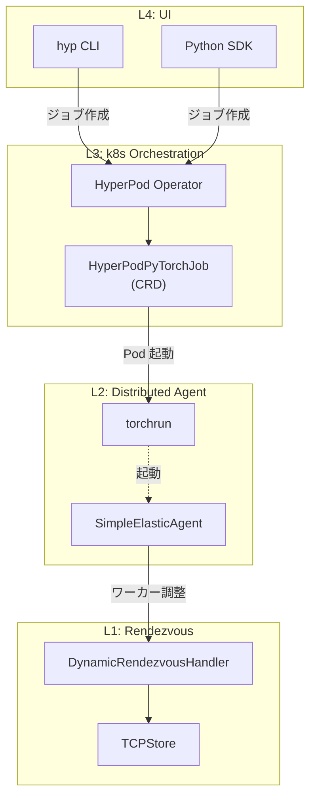
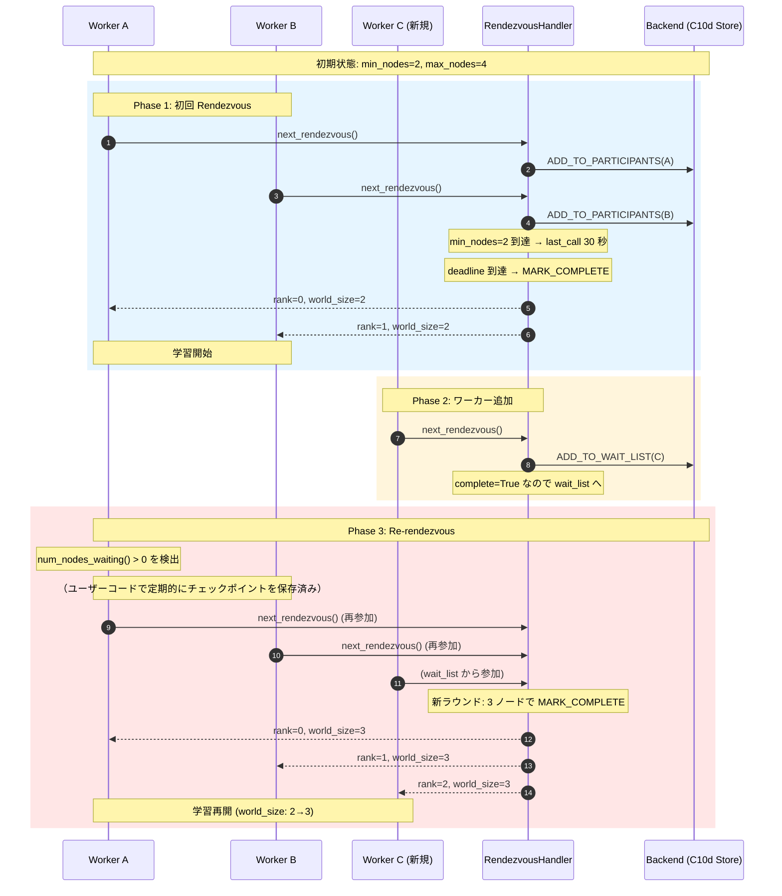

## はじめに

本記事は SageMaker HyperPod 機能解説シリーズの一部です。以下もすでに記事として書いてあるので参考にしてください。

https://zenn.dev/tosshi/articles/45a746434b2090

Amazon SageMaker HyperPod Elastic Training は、クラスターの容量変化に応じて学習ジョブのノード数を**動的に増減**する機能で、ハードウェア障害時の自動縮退運転や、新規ノード追加時の自動スケールアップを実現します。

本記事では、Elastic Training の技術的詳細を包括的に整理します。

:::message alert
本記事は 2026 年 2 月時点の公式ドキュメント、オープンソースコード、などに基づく調査記事です。間違っている可能性もあるため必ず最新の公式ドキュメントを正として確認してください。間違いがあればコメントください。
:::

## 概要


:::message
本機能は EKS 環境でのみ利用可能です。Slurm 環境では利用できません（[HyperPod CLI ソースコード](https://github.com/aws/sagemaker-hyperpod-cli)）。
:::

Elastic Training は、クラスターの容量変化に応じて学習ジョブのノード数を**動的に増減**する機能です。ハードウェア障害でノードが減少した場合は自動的に縮小運転を継続し、新しいノードが利用可能になれば自動的にスケールアップします。

## PyTorch Elastic との関係

HyperPod Elastic Training は、PyTorch Elastic（[`torch.distributed.elastic`](https://github.com/pytorch/pytorch/tree/main/torch/distributed/elastic)）を基盤技術として採用しています。ベースとなる PyTorch Elastic は以下の 4 層のアーキテクチャで動作します。

参照 [HyperPod CLI ソースコード](https://github.com/aws/sagemaker-hyperpod-cli)、[PyTorch Elastic ソースコード](https://github.com/pytorch/pytorch/tree/main/torch/distributed/elastic)

各レイヤーの役割は以下の通りです。

- **Layer 4**: ユーザーが CLI または SDK でジョブを作成
- **Layer 3**: Kubernetes Operator が CRD を監視し、Pod を管理
- **Layer 2**: Pod 内で torchrun がワーカープロセスを起動・監視
- **Layer 1**: ワーカー間の合流・調整を Rendezvous が担当



HyperPod は、Kubeflow の [`PyTorchJob`](https://github.com/kubeflow/training-operator)（`kubeflow.org/v1`）ではなく、独自の CRD を使用する点に注意が必要です。

| 項目 | Kubeflow PyTorchJob | HyperPod PyTorchJob |
|------|---|---|
| apiVersion | `kubeflow.org/v1` | `sagemaker.amazonaws.com/v1` |
| kind | `PyTorchJob` | `HyperPodPyTorchJob` |
| ElasticPolicy | `rdzvBackend` 等を手動指定 | Operator が自動管理 |
| レプリカ種別 | Master/Worker 分離 | 単一 ReplicaSpec（"pod"） |
| スケーリング | ユーザー管理 | Operator による自動管理 |

## HyperPodPyTorchJob CRD の仕様

HyperPod Elastic Training のジョブは、以下の CRD で定義されます（[HyperPod CLI ソースコード](https://github.com/aws/sagemaker-hyperpod-cli)の [schema.json](https://github.com/aws/sagemaker-hyperpod-cli/blob/main/hyperpod-pytorch-job-template/hyperpod_pytorch_job_template/v1_1/schema.json)、[model.py](https://github.com/aws/sagemaker-hyperpod-cli/blob/main/hyperpod-pytorch-job-template/hyperpod_pytorch_job_template/v1_1/model.py)、および [ElasticPolicy クラス定義](https://github.com/aws/sagemaker-hyperpod-cli/blob/main/src/sagemaker/hyperpod/training/config/hyperpod_pytorch_job_unified_config.py)で確認）。

https://docs.aws.amazon.com/ja_jp/sagemaker/latest/dg/sagemaker-eks-operator-usage.html


```yaml
apiVersion: sagemaker.amazonaws.com/v1
kind: HyperPodPyTorchJob
metadata:
  name: my-elastic-job
  namespace: my-namespace
spec:
  nprocPerNode: "8"
  replicaSpecs:
    - name: "pod"        # HyperPod は単一 ReplicaSpec を採用（Rendezvous 管理を Operator に委任するため Master/Worker の区別が不要）
      replicas: 4          # 初期ノード数
      maxReplicas: 8        # 最大ノード数
      template:
        spec:
          containers:
            - name: "pytorch-job-container"
              image: "my-registry/training:latest"
              resources:
                requests:
                  nvidia.com/gpu: 8
                limits:
                  nvidia.com/gpu: 8
          nodeSelector:
            node.kubernetes.io/instance-type: "ml.p5.48xlarge"
  elasticPolicy:
    minReplicas: 4
    maxReplicas: 8
    replicaIncrementStep: 2     # 2 ノード単位でスケーリング
    scalingTimeoutInSeconds: 300
    gracefulShutdownTimeoutInSeconds: 120
  runPolicy:
    cleanPodPolicy: "None"
    jobMaxRetryCount: 3
    restartPolicy:
      evalPeriodSeconds: 3600  # 評価期間（CLI 経由では自動設定）
      scaleUpSnoozeTimeInSeconds: 600  # 再起動後のスケールアップ抑止期間
```

### ElasticPolicy の主要フィールド

| フィールド | 型 | 説明 |
|---|---|---|
| `minReplicas` | int | 最小レプリカ数（CLI 経由では `node_count` と同値に設定される） |
| `maxReplicas` | int | 最大レプリカ数（`max_node_count` と同値） |
| `replicaIncrementStep` | int | ステップサイズ（例: 2 = 2 ノードずつ増減） |
| `replicaDiscreteValues` | list[int] | 離散的なレプリカ数（`replicaIncrementStep` と[相互排他](https://github.com/aws/sagemaker-hyperpod-cli/blob/9ffefae22ff108141579f4b4d7bb1ddc7b243d61/hyperpod-pytorch-job-template/hyperpod_pytorch_job_template/v1_1/model.py#L419-L425)） |
| `scalingTimeoutInSeconds` | int | スケーリング操作のタイムアウト |
| `gracefulShutdownTimeoutInSeconds` | int | グレースフルシャットダウンのタイムアウト |
| `faultyScaleDownTimeoutInSeconds` | int | 障害 Pod のスケールダウンまでの待機時間 |

## Rendezvous メカニズム

Elastic Training の中核となる Rendezvous は、分散学習に参加するワーカーの**合流・調整**メカニズムです。PyTorch Elastic の [`DynamicRendezvousHandler`](https://github.com/pytorch/pytorch/blob/main/torch/distributed/elastic/rendezvous/dynamic_rendezvous.py) が以下のフローで動作します。



### Rendezvous の状態管理

[`_RendezvousState`](https://github.com/pytorch/pytorch/blob/main/torch/distributed/elastic/rendezvous/dynamic_rendezvous.py) が管理する主要なフィールド

https://github.com/pytorch/pytorch/blob/704b8d34b25fcb73489cc9834276b0e569244578/torch/distributed/elastic/rendezvous/dynamic_rendezvous.py#L272-L296

状態管理は [`C10dRendezvousBackend`](https://github.com/pytorch/pytorch/blob/main/torch/distributed/elastic/rendezvous/c10d_rendezvous_backend.py) のバックエンドで行われ、Store の `compare_set()` 操作（CAS: Compare-And-Swap）による楽観的ロックで一貫性が保証されます。

::::details Compare-And-Swap（CAS）とは
Compare-And-Swap（CAS）は、並行処理での競合を回避するアトミックな操作パターンです。

**基本動作**
```python
def compare_set(key, expected_value, new_value):
    if current_value == expected_value:
        current_value = new_value
        return True  # 成功
    else:
        return False  # 競合発生（他のプロセスが先に更新した）
```

**Rendezvous での使用例**:
1. プロセス A が状態を読み取る（`round=1, participants=2`）
2. プロセス B も同じ状態を読み取る
3. プロセス A が `compare_set(expected=round1, new=round1+参加者追加)` を実行 → 成功
4. プロセス B が `compare_set(expected=round1, new=round1+参加者追加)` を実行 → **失敗**（既に round1 ではない）
5. プロセス B は最新状態を再読み込みしてリトライ

この仕組みにより、複数ワーカーが同時に状態を更新しても一貫性が保たれます。
::::

### ハートビートと死亡検出

| パラメータ | デフォルト値 | 説明 |
|---|---|---|
| `keep_alive_interval` | 5 秒 | ハートビート送信間隔 |
| `keep_alive_max_attempt` | 3 回 | 最大失敗回数 |
| **死亡検出までの最大遅延** | **15 秒** | 5 秒 x 3 回（`_sanitize()` メソッドで実装） |

## Agent のメインループ

[`SimpleElasticAgent._invoke_run()`](https://github.com/pytorch/pytorch/blob/704b8d34b25fcb73489cc9834276b0e569244578/torch/distributed/elastic/agent/server/api.py#L892) が Elastic Training の中核ループとして動作します。


このループにより、ワーカーの障害検出と新規ワーカーの参加検出の両方が自動的に処理されます。

### 再起動カウントの重要な仕様

Agent には再起動回数の上限（`remaining_restarts`）がありますが、**障害による再起動とスケーリングによる再起動では扱いが異なります**。

| 再起動の種類 | `remaining_restarts` の消費 | 説明 |
|------------|------------------------|------|
| **障害による再起動**<br/>（UNHEALTHY/FAILED → `_restart_workers()`） | 1 減る | 無限ループを防ぐため、上限に達したら学習を停止 |
| **スケーリングによる再起動**<br/>（新ノード参加で `_restart_workers()`） | **カウントされない** | ノード追加/削除は正常な動作なので、何度でも実行可能 |

## CLI によるジョブ作成

HyperPod CLI（[`hyp`](https://github.com/aws/sagemaker-hyperpod-cli)）を使用して Elastic Training ジョブを作成します。

```bash
hyp create hyp-pytorch-job \
  --job-name my-elastic-job \
  --image my-registry/training:latest \
  --node-count 4 \
  --max-node-count 8 \
  --instance-type ml.p5.48xlarge \
  --tasks-per-node 8 \
  --elastic-replica-increment-step 2 \
  --elastic-scaling-timeout-in-seconds 300 \
  --elastic-graceful-shutdown-timeout-in-seconds 120 \
  --elastic-scale-up-snooze-time-in-seconds 600
```

## ユーザーコードでの対応

Elastic Training を使用する場合、ユーザーの学習スクリプト側でも `world_size` の動的変更に対応する必要があります。

Re-rendezvous 後、`world_size` が変更されると実効バッチサイズも変化します。学習率を調整することが考えられますが、実験再現性や学習安定性に影響があるため、学習率は固定したまま実効バッチサイズを一定に保つアプローチが推奨されます。この点については、モデルやタスクに応じた実験的な検証が必要です。

:::message
**重要** PyTorch Elastic（torchrun）は Re-rendezvous 時にワーカープロセスを再起動します。そのため、ユーザーコードの初期化部分が自動的に再実行され、新しい `world_size` が `torch.distributed.get_world_size()` で取得できます。
:::

Re-rendezvous 時にはワーカープロセスが再起動されるため、チェックポイントの保存はユーザーコード側で定期的に実装する必要があります。最新のチェックポイントから学習を再開できるよう、適切な保存間隔を設定してください。

:::message
**Checkpointless Training との関係**
Checkpointless Training（メモリ内レプリカによる高速復旧）と Elastic Training は、理論的には階層的な障害復旧として併用可能です。Checkpointless が第一防衛線（In-Process Recovery による高速復旧）を提供し、Elastic が最終防衛線（ノード交換・縮退運転）を提供する構成が考えられます。ただし、world_size が変更されるシナリオでは Megatron-Core の冗長レプリカ再配置が必要であり、**AWS 公式ドキュメントでも併用に関する明示的なサポートは見つけられませんでした。** [こちらの公式ブログ](https://aws.amazon.com/jp/blogs/news/introducing-checkpointless-and-elastic-training-on-amazon-sagemaker-hyperpod/)でもセットで紹介されており、技術的にもノードレベルの話とプロセスやアプリケーションレベルの話で層が違うように見えるのでフレームワーク等それぞれの制約を満たせば併用できそうな気はします。
:::

:::message alert
Re-rendezvous 時には**全ワーカープロセスが一時停止**します。これは数秒から数十秒の中断を伴うため、頻繁なスケーリングは学習効率を低下させます。[`scaleUpSnoozeTimeInSeconds`](https://github.com/aws/sagemaker-hyperpod-cli/blob/9ffefae22ff108141579f4b4d7bb1ddc7b243d61/src/sagemaker/hyperpod/training/config/hyperpod_pytorch_job_unified_config.py#L3106) を適切に設定して、再起動直後のスケールアップを抑止することが重要です。
:::

| 防衛線 | 技術 | 適用シナリオ |
|-------|-------------|------------|
| 第一防衛線 | Checkpointless (IPR) | GPU エラー、軽微な障害 |
| 第二防衛線 | Checkpointless (PLR) | プロセスレベル障害 |
| 最終防衛線 | Elastic Training | ノード交換、縮退運転 |

## まとめ

本記事では、Amazon SageMaker HyperPod Elastic Training の技術的詳細を解説しました。

## 参考資料

- [AWS SageMaker HyperPod 公式ドキュメント](https://docs.aws.amazon.com/sagemaker/latest/dg/sagemaker-hyperpod.html)
- [HyperPod CLI ソースコード](https://github.com/aws/sagemaker-hyperpod-cli)
- [PyTorch Elastic ソースコード](https://github.com/pytorch/pytorch/tree/main/torch/distributed/elastic)
- [PyTorch Elastic: DynamicRendezvousHandler](https://github.com/pytorch/pytorch/blob/main/torch/distributed/elastic/rendezvous/dynamic_rendezvous.py)
- [PyTorch Elastic: C10dRendezvousBackend](https://github.com/pytorch/pytorch/blob/main/torch/distributed/elastic/rendezvous/c10d_rendezvous_backend.py)
- [PyTorch Elastic: SimpleElasticAgent](https://github.com/pytorch/pytorch/blob/main/torch/distributed/elastic/agent/server/api.py)
- [PyTorch DistributedSampler ソースコード](https://github.com/pytorch/pytorch/blob/main/torch/utils/data/distributed.py)
- [Kubeflow Training Operator](https://github.com/kubeflow/training-operator)
- [VERL (Versatile RLHF Library)](https://github.com/volcengine/verl)
- [VERL 公式ドキュメント](https://verl.readthedocs.io/)
- [SageMaker HyperPod Recipes](https://github.com/aws/sagemaker-hyperpod-recipes)
- [AWS Distributed Training サンプル](https://github.com/aws-samples/awsome-distributed-training)
- [FSx for Lustre 公式ドキュメント](https://docs.aws.amazon.com/fsx/latest/LustreGuide/)
- [Amazon EC2 Spot Instance](https://aws.amazon.com/ec2/spot/)
- [AWS Spot Instance Advisor](https://aws.amazon.com/ec2/spot/instance-advisor/)