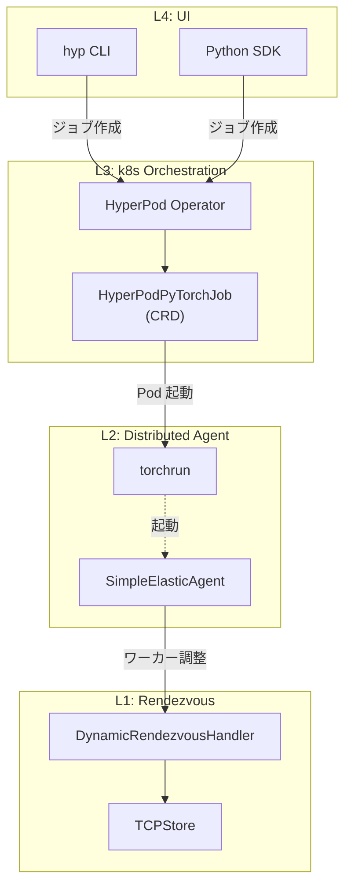
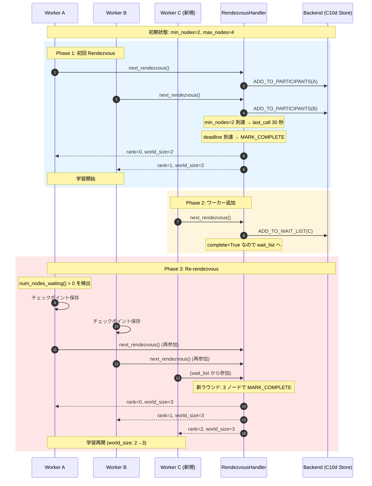
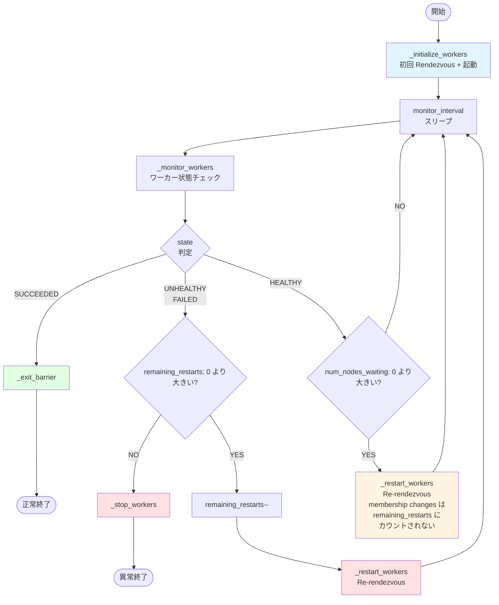
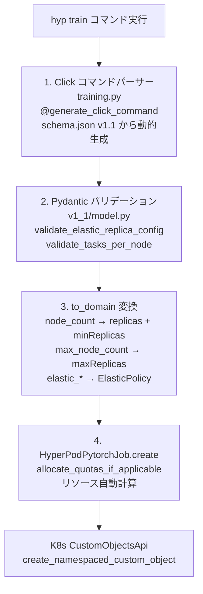
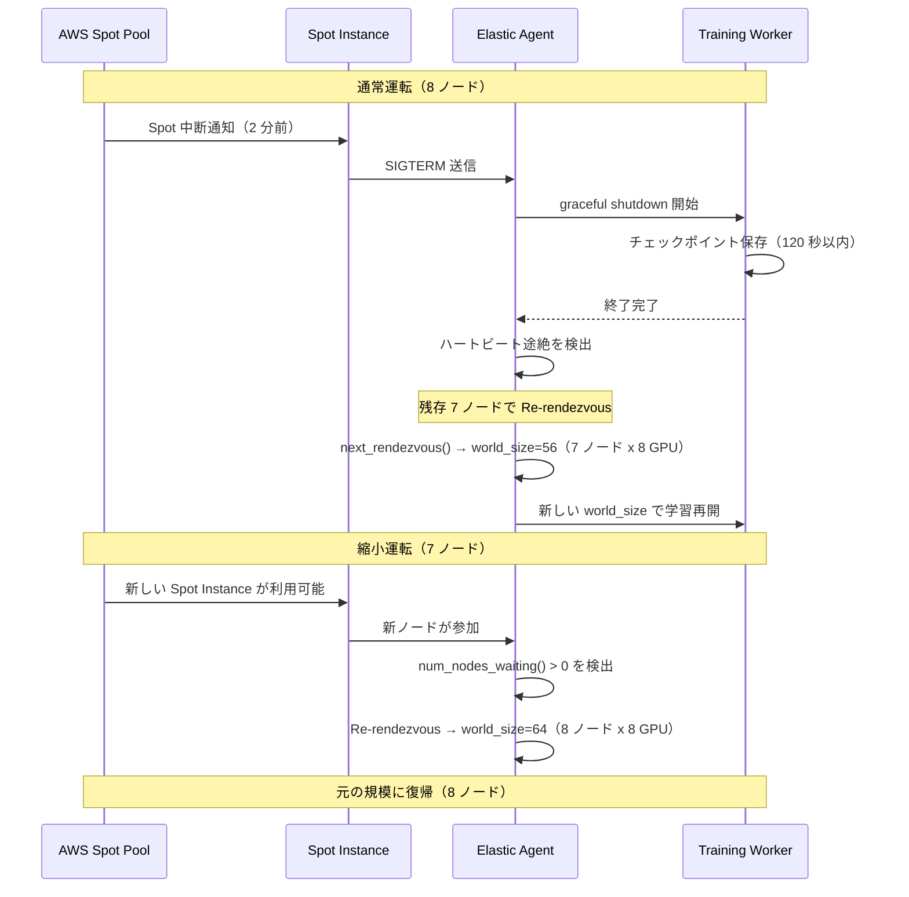

## はじめに

本記事は SageMaker HyperPod 機能解説シリーズの一部です。以下もすでに記事として書いてあるので参考にしてください。

https://zenn.dev/tosshi/articles/45a746434b2090

Amazon SageMaker HyperPod Elastic Training は、クラスターの容量変化に応じて学習ジョブのノード数を**動的に増減**する機能で、ハードウェア障害時の自動縮退運転や、新規ノード追加時の自動スケールアップを実現します。

本記事では、Elastic Training の技術的詳細を包括的に整理します。

:::message alert
本記事は 2026 年 2 月時点の公式ドキュメント、オープンソースコード、などに基づく調査記事です。間違っている可能性もあるため必ず最新の公式ドキュメントを正として確認してください。間違いがあればコメントください。
:::

## 概要


:::message
本機能は EKS 環境でのみ利用可能です。Slurm 環境では利用できません（[HyperPod CLI ソースコード](https://github.com/aws/sagemaker-hyperpod-cli)）。
:::

Elastic Training は、クラスターの容量変化に応じて学習ジョブのノード数を**動的に増減**する機能です。ハードウェア障害でノードが減少した場合は自動的に縮小運転を継続し、新しいノードが利用可能になれば自動的にスケールアップします。

## PyTorch Elastic との関係

HyperPod Elastic Training は、PyTorch Elastic（[`torch.distributed.elastic`](https://github.com/pytorch/pytorch/tree/main/torch/distributed/elastic)）を基盤技術として採用しています。ベースとなる PyTorch Elastic は以下の 4 層のアーキテクチャで動作します。

参照: [HyperPod CLI ソースコード](https://github.com/aws/sagemaker-hyperpod-cli)、[PyTorch Elastic ソースコード](https://github.com/pytorch/pytorch/tree/main/torch/distributed/elastic)

各レイヤーの役割は以下の通りです。

- **Layer 4**: ユーザーが CLI または SDK でジョブを作成
- **Layer 3**: Kubernetes Operator が CRD を監視し、Pod を管理
- **Layer 2**: Pod 内で torchrun がワーカープロセスを起動・監視
- **Layer 1**: ワーカー間の合流・調整を Rendezvous が担当



HyperPod は、Kubeflow の [`PyTorchJob`](https://github.com/kubeflow/training-operator)（`kubeflow.org/v1`）ではなく、独自の CRD を使用する点に注意が必要です。

| 項目 | Kubeflow PyTorchJob | HyperPod PyTorchJob |
|------|---|---|
| apiVersion | `kubeflow.org/v1` | `sagemaker.amazonaws.com/v1` |
| kind | `PyTorchJob` | `HyperPodPyTorchJob` |
| ElasticPolicy | `rdzvBackend` 等を手動指定 | Operator が自動管理 |
| レプリカ種別 | Master/Worker 分離 | 単一 ReplicaSpec（"pod"） |
| スケーリング | ユーザー管理 | Operator による自動管理 |

## HyperPodPyTorchJob CRD の仕様

HyperPod Elastic Training のジョブは、以下の CRD で定義されます（[HyperPod CLI ソースコード](https://github.com/aws/sagemaker-hyperpod-cli)の [schema.json](https://github.com/aws/sagemaker-hyperpod-cli/blob/main/hyperpod-pytorch-job-template/hyperpod_pytorch_job_template/v1_1/schema.json)、[model.py](https://github.com/aws/sagemaker-hyperpod-cli/blob/main/hyperpod-pytorch-job-template/hyperpod_pytorch_job_template/v1_1/model.py)、および [ElasticPolicy クラス定義](https://github.com/aws/sagemaker-hyperpod-cli/blob/main/src/sagemaker/hyperpod/training/config/hyperpod_pytorch_job_unified_config.py)で確認）。

https://docs.aws.amazon.com/ja_jp/sagemaker/latest/dg/sagemaker-eks-operator-usage.html


```yaml
apiVersion: sagemaker.amazonaws.com/v1
kind: HyperPodPyTorchJob
metadata:
  name: my-elastic-job
  namespace: my-namespace
spec:
  nprocPerNode: "8"
  replicaSpecs:
    - name: "pod"        # HyperPod は単一 ReplicaSpec を採用（Rendezvous 管理を Operator に委任するため Master/Worker の区別が不要）
      replicas: 4          # 初期ノード数
      maxReplicas: 8        # 最大ノード数
      template:
        spec:
          containers:
            - name: "pytorch-job-container"
              image: "my-registry/training:latest"
              resources:
                requests:
                  nvidia.com/gpu: 8
                limits:
                  nvidia.com/gpu: 8
          nodeSelector:
            node.kubernetes.io/instance-type: "ml.p5.48xlarge"
  elasticPolicy:
    minReplicas: 4
    maxReplicas: 8
    replicaIncrementStep: 2     # 2 ノード単位でスケーリング
    scalingTimeoutInSeconds: 300
    gracefulShutdownTimeoutInSeconds: 120
  runPolicy:
    cleanPodPolicy: "None"
    jobMaxRetryCount: 3
    restartPolicy:
      scaleUpSnoozeTimeInSeconds: 600  # 再起動後のスケールアップ抑止期間
```

### ElasticPolicy の主要フィールド

| フィールド | 型 | 説明 |
|---|---|---|
| `minReplicas` | int | 最小レプリカ数（CLI 経由では `node_count` と同値に設定される） |
| `maxReplicas` | int | 最大レプリカ数（`max_node_count` と同値） |
| `replicaIncrementStep` | int | ステップサイズ（例: 2 = 2 ノードずつ増減） |
| `replicaDiscreteValues` | list[int] | 離散的なレプリカ数（`replicaIncrementStep` と[相互排他](https://github.com/aws/sagemaker-hyperpod-cli/blob/9ffefae22ff108141579f4b4d7bb1ddc7b243d61/hyperpod-pytorch-job-template/hyperpod_pytorch_job_template/v1_1/model.py#L419-L425)） |
| `scalingTimeoutInSeconds` | int | スケーリング操作のタイムアウト |
| `gracefulShutdownTimeoutInSeconds` | int | グレースフルシャットダウンのタイムアウト |
| `faultyScaleDownTimeoutInSeconds` | int | 障害 Pod のスケールダウンまでの待機時間 |

## Rendezvous メカニズム

Elastic Training の中核となる Rendezvous は、分散学習に参加するワーカーの**合流・調整**メカニズムです。PyTorch Elastic の [`DynamicRendezvousHandler`](https://github.com/pytorch/pytorch/blob/main/torch/distributed/elastic/rendezvous/dynamic_rendezvous.py) が以下のフローで動作します。



### Rendezvous の状態管理

[`_RendezvousState`](https://github.com/pytorch/pytorch/blob/main/torch/distributed/elastic/rendezvous/dynamic_rendezvous.py) が管理する主要なフィールド

https://github.com/pytorch/pytorch/blob/704b8d34b25fcb73489cc9834276b0e569244578/torch/distributed/elastic/rendezvous/dynamic_rendezvous.py#L272-L296

状態管理は [`C10dRendezvousBackend`](https://github.com/pytorch/pytorch/blob/main/torch/distributed/elastic/rendezvous/c10d_rendezvous_backend.py) のバックエンドで行われ、Store の `compare_set()` 操作（CAS: Compare-And-Swap）による楽観的ロックで一貫性が保証されます。

::::details Compare-And-Swap（CAS）とは
Compare-And-Swap（CAS）は、並行処理での競合を回避するアトミックな操作パターンです。

**基本動作**:
```python
def compare_set(key, expected_value, new_value):
    if current_value == expected_value:
        current_value = new_value
        return True  # 成功
    else:
        return False  # 競合発生（他のプロセスが先に更新した）
```

**Rendezvous での使用例**:
1. プロセス A が状態を読み取る（`round=1, participants=2`）
2. プロセス B も同じ状態を読み取る
3. プロセス A が `compare_set(expected=round1, new=round1+参加者追加)` を実行 → 成功
4. プロセス B が `compare_set(expected=round1, new=round1+参加者追加)` を実行 → **失敗**（既に round1 ではない）
5. プロセス B は最新状態を再読み込みしてリトライ

この仕組みにより、複数ワーカーが同時に状態を更新しても一貫性が保たれます。
::::

### ハートビートと死亡検出

| パラメータ | デフォルト値 | 説明 |
|---|---|---|
| `keep_alive_interval` | 5 秒 | ハートビート送信間隔 |
| `keep_alive_max_attempt` | 3 回 | 最大失敗回数 |
| **死亡検出までの最大遅延** | **15 秒** | 5 秒 x 3 回（`_sanitize()` メソッドで実装） |

## Agent のメインループ

[`SimpleElasticAgent._invoke_run()`](https://github.com/pytorch/pytorch/blob/704b8d34b25fcb73489cc9834276b0e569244578/torch/distributed/elastic/agent/server/api.py#L892) が Elastic Training の中核ループとして動作します。



このループにより、ワーカーの障害検出と新規ワーカーの参加検出の両方が自動的に処理されます。重要なポイントは、**membership changes（ノード追加/削除）による `_restart_workers()` は `remaining_restarts` にカウントされない**ことです。これにより、スケーリングイベントが再起動上限に達することなく実行できます。

## CLI によるジョブ作成

HyperPod CLI（[`hyp`](https://github.com/aws/sagemaker-hyperpod-cli)）を使用して Elastic Training ジョブを作成します。

```bash
hyp create hyp-pytorch-job \
  --job-name my-elastic-job \
  --image my-registry/training:latest \
  --node-count 4 \
  --max-node-count 8 \
  --instance-type ml.p5.48xlarge \
  --tasks-per-node 8 \
  --elastic-replica-increment-step 2 \
  --elastic-scaling-timeout-in-seconds 300 \
  --elastic-graceful-shutdown-timeout-in-seconds 120 \
  --elastic-scale-up-snooze-time-in-seconds 600
```

CLI は内部で以下の変換を行います。

```text
CLI パラメータ                     CRD フィールド
--node-count 4              →   replicaSpecs[0].replicas = 4
                                elasticPolicy.minReplicas = 4
--max-node-count 8          →   replicaSpecs[0].maxReplicas = 8
                                elasticPolicy.maxReplicas = 8
--elastic-replica-increment-step 2  →  elasticPolicy.replicaIncrementStep = 2
--instance-type ml.p5.48xlarge  →  nodeSelector + resources 自動計算
                                   (gpu:8, cpu:192, memory:2048Gi, efa:32)
```

::::details CLI の内部処理フロー（詳細）

CLI は以下の処理チェーンで CRD を生成します。



::::

## ユーザーコードでの対応

Elastic Training を使用する場合、ユーザーの学習スクリプト側でも `world_size` の動的変更に対応する必要があります。以下の 3 つの対応が特に重要です。

### 学習率の動的調整

Re-rendezvous 後、`world_size` が変更されると実効バッチサイズも変化します。Linear Scaling Rule（分散学習における標準的な学習率調整手法）に従い、学習率を調整します。

```python
import torch.distributed as dist

def adjust_learning_rate(optimizer, base_lr, base_world_size=8):
    """
    Linear Scaling Rule: lr = base_lr * (world_size / base_world_size)
    Re-rendezvous 後に呼び出して学習率を調整
    """
    current_world_size = dist.get_world_size()
    new_lr = base_lr * (current_world_size / base_world_size)

    for param_group in optimizer.param_groups:
        param_group['lr'] = new_lr

    if dist.get_rank() == 0:
        print(f"[Elastic] world_size changed: {base_world_size} -> {current_world_size}")
        print(f"[Elastic] Learning rate adjusted: {base_lr} -> {new_lr}")

    return new_lr

# 使用例
optimizer = torch.optim.AdamW(model.parameters(), lr=1e-4)

# Re-rendezvous 後（torchrun が自動的にプロセスを再起動）
new_lr = adjust_learning_rate(optimizer, base_lr=1e-4)
```

### 実効バッチサイズの維持

`gradient_accumulation_steps` を動的に調整することで、`world_size` が変わっても実効バッチサイズを一定に保つことができます。

```python
def calculate_gradient_accumulation_steps(
    target_global_batch_size,
    per_device_batch_size
):
    """
    world_size に応じて gradient_accumulation_steps を計算
    """
    world_size = dist.get_world_size()
    gradient_accumulation_steps = target_global_batch_size // (
        per_device_batch_size * world_size
    )

    # 最低でも 1
    gradient_accumulation_steps = max(1, gradient_accumulation_steps)

    if dist.get_rank() == 0:
        effective_batch = per_device_batch_size * world_size * gradient_accumulation_steps
        print(f"[Elastic] Gradient accumulation steps: {gradient_accumulation_steps}")
        print(f"[Elastic] Effective global batch size: {effective_batch}")

    return gradient_accumulation_steps

# 使用例
target_global_batch_size = 1024
per_device_batch_size = 8

gradient_accumulation_steps = calculate_gradient_accumulation_steps(
    target_global_batch_size,
    per_device_batch_size
)
```

### DistributedSampler の更新

`world_size` 変更後は、[`DistributedSampler`](https://github.com/pytorch/pytorch/blob/main/torch/utils/data/distributed.py) を再構築する必要があります。

```python
from torch.utils.data import DataLoader
from torch.utils.data.distributed import DistributedSampler

def create_dataloader(dataset, batch_size, seed=42):
    """
    Re-rendezvous 後に呼び出して DataLoader を再構築
    """
    sampler = DistributedSampler(
        dataset,
        num_replicas=dist.get_world_size(),
        rank=dist.get_rank(),
        shuffle=True,
        seed=seed  # 再現性のため固定シードを使用
    )

    dataloader = DataLoader(
        dataset,
        batch_size=batch_size,
        sampler=sampler,
        num_workers=4,
        pin_memory=True
    )

    return dataloader, sampler

# 使用例
# 初回起動時
dataloader, sampler = create_dataloader(train_dataset, per_device_batch_size)

# Re-rendezvous 後（プロセス再起動により、この関数が再度実行される）
# torchrun が自動的に新しい world_size で環境変数を設定するため、
# dist.get_world_size() は自動的に更新される
```

:::message
**重要**: PyTorch Elastic（torchrun）は Re-rendezvous 時にワーカープロセスを再起動します。そのため、ユーザーコードの初期化部分（上記の関数呼び出し）が自動的に再実行され、新しい `world_size` が `torch.distributed.get_world_size()` で取得できます。明示的な「Re-rendezvous 検出」ロジックは不要です。
:::

### チェックポイントの保存と復元

Re-rendezvous 前のチェックポイント保存は、PyTorch Elastic のメインループで自動的に処理されますが、ユーザーコード側で適切に実装する必要があります。

```python
import os

def save_checkpoint(model, optimizer, epoch, step, checkpoint_dir):
    """
    チェックポイントを保存（rank 0 のみ）
    """
    # 注: FSDP を使用している場合は、FSDP.state_dict_type() の設定が必要です。
    # 詳細は PyTorch FSDP のドキュメントを参照してください。
    if dist.get_rank() == 0:
        checkpoint = {
            'model': model.state_dict(),
            'optimizer': optimizer.state_dict(),
            'epoch': epoch,
            'step': step,
            'world_size': dist.get_world_size()
        }
        path = os.path.join(checkpoint_dir, f'checkpoint_epoch{epoch}_step{step}.pt')
        torch.save(checkpoint, path)
        print(f"[Checkpoint] Saved to {path}")

def load_checkpoint(model, optimizer, checkpoint_path):
    """
    チェックポイントを復元
    """
    checkpoint = torch.load(checkpoint_path, map_location='cpu', weights_only=False)
    model.load_state_dict(checkpoint['model'])
    optimizer.load_state_dict(checkpoint['optimizer'])

    # world_size が変わっている場合の警告
    saved_world_size = checkpoint.get('world_size', None)
    current_world_size = dist.get_world_size()
    if saved_world_size and saved_world_size != current_world_size:
        print(f"[Elastic] world_size changed: {saved_world_size} -> {current_world_size}")
        print(f"[Elastic] Adjusting learning rate and gradient accumulation steps")

    return checkpoint['epoch'], checkpoint['step']
```

## スケーリング動作

| ステップ | スケールアップ（ノード追加） | スケールダウン（ノード離脱） |
|---------|-------------|-------------|
| 1. トリガー | Operator が ElasticPolicy に基づき Pod を追加（step=2 なら 2 Pod ずつ） | ワーカー Pod が異常終了（ハードウェア障害等） |
| 2. 検出 | 新 Pod で torchrun 起動 → next_rendezvous() 呼出 | ハートビート送信が途絶 |
| 3. 状態変化 | complete=True のため wait_list に追加 | _sanitize() が 15 秒後に死亡ノードを検出 |
| 4. 既存ワーカーの反応 | 既存 Agent が num_nodes_waiting() > 0 を検出 | 残存ワーカーが NCCL 通信エラーを検出 |
| 5. 再構成 | 全ワーカーが _restart_workers() で Re-rendezvous | チェックポイント保存後に Re-rendezvous |
| 6. 結果 | 拡大した world_size で学習再開 | 縮小した world_size で学習再開 |

:::message alert
Re-rendezvous 時には**全ワーカープロセスが一時停止**します。これは数秒から数十秒の中断を伴うため、頻繁なスケーリングは学習効率を低下させます。`scaleUpSnoozeTimeInSeconds` を適切に設定して、再起動直後のスケールアップを抑止することが重要です。
:::

## Re-rendezvous のコスト分析

Re-rendezvous プロセスの所要時間は、複数のフェーズから構成されます。

| フェーズ | 所要時間 | 説明 |
|---------|---------|------|
| プロセス停止 | 1-5 秒 | 学習ループの現在イテレーションを完了し、プロセスを停止 |
| Rendezvous プロトコル | 5-30 秒+ | 全ワーカーが `next_rendezvous()` を呼び出し、新しい world_size で合意形成。TCPStore のスケーラビリティ制約により、ノード数が多いほど増加 |
| NCCL 初期化 | 5-30 秒 | 新しい world_size で NCCL Communicator を再構築。All-Reduce テストを含む |
| チェックポイント復元 | 10 秒-数分 | モデルサイズと I/O 帯域幅に依存 |

### モデルサイズ別のチェックポイント復元時間

[FSx for Lustre](https://docs.aws.amazon.com/fsx/latest/LustreGuide/)（2 GB/sec スループット）での実測値を以下に示します：

| モデルサイズ | チェックポイントサイズ | 復元時間（推定） |
|-------------|---------------------|-----------------|
| 7B パラメータ | 約 28 GB（FP32） | 約 3 秒 |
| 70B パラメータ | 約 280 GB（FP32） | 約 28 秒 |
| 405B パラメータ | 約 1.6 TB（FP32） | 約 162 秒 |

:::message
実際の復元時間は、チェックポイント形式（FSDP、DeepSpeed）、圧縮の有無、ストレージ構成（FSx Lustre、EBS、S3）によって大きく変動します。上記は FSDP FULL_STATE_DICT 形式での推定値です。
:::

### 総コストの推定

典型的な構成（8 ノード、70B モデル）での Re-rendezvous 総コストは以下の通りです：

- 最小構成（全て最速）: 約 21 秒（1 + 5 + 5 + 10 秒）
- 典型的な構成: 約 70 秒（3 + 20 + 15 + 32 秒）
- 最大構成（全て最遅）: 約 320 秒（5 + 30 + 30 + 255 秒）

この中断時間が学習全体に占める割合（ダウンタイム）は、以下の式で計算できます：

```
ダウンタイム率 = (Re-rendezvous 総コスト × 発生回数) / 学習全体時間
```

例えば、70B モデルを 7 日間（604,800 秒）学習し、ノード障害が 1 回発生した場合：

```
ダウンタイム率 = 70 秒 / 604,800 秒 ≈ 0.01% (無視できるレベル)
```

一方、GRPO のように毎イテレーション（1000 回）でノード数を変更する場合：

```
ダウンタイム率 = (70 秒 × 1000 回) / 604,800 秒 ≈ 11.6% (実用不可)
```

このように、**変更頻度が低い場合は Elastic Training が有効**ですが、頻繁なスケーリングは学習効率を大幅に低下させます。

## GRPO マルチフェーズ学習への適用可能性

::::details GRPO フェーズ連動型 Elastic Training の詳細分析

GRPO（Group Relative Policy Optimization）のようなマルチフェーズ学習では、Generation Phase（応答生成）と Training Phase（ポリシー更新）でリソース要件が大きく異なります（[VERL 実装](https://github.com/volcengine/verl)および [AWS サンプル](https://github.com/aws-samples/awsome-distributed-training)を参照）。フェーズ比率はモデルサイズ、生成長、バッチサイズ等に依存しますが、一般的なベンチマークでは Generation Phase が全体の約 80%、Training Phase が約 20% を占めます。理論上、Elastic Training でフェーズに応じてノード数を動的に変更できれば、リソース利用率を大幅に改善できます。

しかし、**学習クラスタのノード数をフェーズ間で動的に変更することは、現時点では技術的に非常に困難**です。主な理由は以下の 3 点です。

1. **FSDP/DeepSpeed の再シャーディングの繰り返しコスト**: Actor モデルが FSDP で分散されている場合、ノード数変更時にパラメータ・勾配・オプティマイザ状態の再シャーディングが必要となり、大規模モデルでは数百 GB のデータ移動が発生します。再シャーディング自体は Elastic Training でも発生しますが、GRPO では**毎イテレーション**（1000 回以上）実行されるため、積算コストが膨大になります
2. **Re-rendezvous の繰り返しコスト**: フェーズ遷移は各イテレーションで発生するため、毎回 Re-rendezvous（全プロセス一時停止、数秒〜数十秒）+ チェックポイント I/O（数分）が発生すると学習効率が大幅に低下します
3. **TP/PP の固定構成**: Tensor Parallel / Pipeline Parallel はノード数に依存した固定構成が前提であり、動的な変更は事実上モデルの再構築を意味します

### Elastic Training の有効なユースケース

**頻度が低い場合は Elastic Training が有効**です：

| ユースケース | 変更頻度 | 再シャーディング回数 | 判定 |
|-------------|---------|---------------------|------|
| **障害復旧** | 数日に 1 回 | 1〜数回 | [OK] 実用的 |
| **実験単位の変更**（事前学習→ファインチューニング等） | 実験の区切りで 1 回 | 1 回 | [OK] 実用的 |
| **GRPO フェーズ連動型**（毎イテレーション） | 1000 回以上 | 1000 回以上 | [NG] 非実用的 |

例えば、事前学習（128 ノード）からファインチューニング（16 ノード）への移行は、実験の区切りで 1 回のみノード数を変更するため、再シャーディングのコストは十分に許容できます。

### Slurm と Elastic Training（EKS）の比較

実験単位のノード数変更は Slurm でも可能ですが、実現方法が異なります。

| 機能 | Slurm | Elastic Training（EKS） |
|------|-------|----------------------|
| 実験単位のノード数変更 | 可能（別ジョブ投入） | 可能（同一ジョブ内） |
| 障害時の自動縮小運転 | 不可 | 可能 |
| 同一ジョブ内での動的変更 | 不可 | 可能 |

**Slurm 環境**:
```bash
# 事前学習: 128 ノード
sbatch --nodes=128 --job-name=pretrain pretrain.sh

# ファインチューニング: 16 ノード（別ジョブとして投入）
sbatch --nodes=16 --job-name=finetune finetune.sh
```

**Elastic Training（EKS 環境）**:
```bash
# 同一ジョブ内でレプリカ数を変更（概念的な例）
# 注: HyperPodPyTorchJob CRD が scale subresource をサポートしている場合のみ動作
kubectl scale hyperpodjob/my-job --replicas=16

# 代替方法（より確実）
kubectl patch hyperpodjob my-job --type='json' -p='[{"op": "replace", "path": "/spec/replicas", "value": 16}]'
```

Slurm では異なるノード数で別々のジョブを投入しますが、Elastic Training では同一ジョブ内でノード数を動的に変更できます。

### 推奨アプローチ

現実的なアプローチは、**学習クラスタは固定ノード数で運用し、推論プール（vLLM サーバー）のみを弾力的にスケーリング**する方式です。vLLM サーバーはステートレスに近く、Kubernetes HPA や KubeRay Autoscaler で制御できます。Generation Phase で推論ノードをスケールアップし、Training Phase で最小構成にスケールダウンすることで、10-14% 程度のコスト削減が見込めます[^grpo_cost]。

[^grpo_cost]: Generation Phase 80%、Training Phase 20% の比率を前提とし、推論プールを Training Phase で最小構成（1 ノード）にスケールダウンした場合の推定値。実際の削減率は、推論ノード数、インスタンスタイプ、スポット割引率等に依存します。

一方、Elastic Training は**障害復旧目的と実験単位のノード数変更**での活用に適しています。Health Monitoring Agent と組み合わせることで、ノード障害時の自動縮小運転と復旧後のスケールアップを実現し、学習の継続性を確保できます。

### trn2 を推論フェーズに使用する構成

GRPO の Generation Phase に AWS Trainium2（trn2）を推論アクセラレータとして使用し、p5（H100 GPU）と混在させる構成も検討に値します。

### 技術的な実現方法

HyperPodPyTorchJob の Elastic Training は単一インスタンスタイプのみサポートするため、GPU + trn2 の混在には使用できません（[HyperPod CLI のソースコード](https://github.com/aws/sagemaker-hyperpod-cli)で `--instance-type` パラメータが単一値のみを受け付けることを確認済み）。代わりに、以下の分離アーキテクチャが現実的です:

- **学習クラスタ**: p5.48xlarge（固定ノード数）で HyperPodPyTorchJob を使用
- **推論プール**: trn2.48xlarge 上の vLLM Server を弾力的に管理

vLLM on Neuron（NxD Inference ライブラリ）は Neuron SDK 2.27.1 時点で trn2 をサポートしており、Llama 3.x 等の主要モデルでの推論が可能です。推論サーバーはステートレスであるため、以下のいずれかの方法で弾力的にスケーリングできます。

### オプション A: Kubernetes Deployment + HPA

```yaml
apiVersion: apps/v1
kind: Deployment
metadata:
  name: vllm-trn2-inference
spec:
  replicas: 2
  # ... (Pod template with trn2 nodeSelector)
---
apiVersion: autoscaling/v2
kind: HorizontalPodAutoscaler
metadata:
  name: vllm-trn2-hpa
spec:
  scaleTargetRef:
    apiVersion: apps/v1
    kind: Deployment
    name: vllm-trn2-inference
  minReplicas: 2
  maxReplicas: 16
```

### オプション B: VERL + Ray Autoscaler

VERL（Versatile RLHF Library）を使用する場合、vLLM を Ray Actor として管理し、Ray Autoscaler による弾力的スケーリングが可能です。ただし、VERL の `ResourcePoolManager` は現状では静的なリソース割り当てのため、動的スケーリングにはカスタマイズが必要です（研究課題レベル）。

**利点**:
- trn2 の推論コスト効率（GPU 比で価格性能優位性が期待される）
- 推論プールの独立したスケーリングにより、Generation Phase でのリソース効率を向上
- 学習クラスタの安定性を維持しつつ、推論リソースを弾力的に管理

**課題**:
- GPU で学習したモデルの trn2 推論サーバーへの配布と Neuron コンパイル
- Neuron コンパイルキャッシュの管理（初回コンパイルに 15 分〜数時間）
- 異種アクセラレータ間の数値精度の微小な差異

:::message
GRPO のフェーズ連動型 Elastic Training は、PyTorch の将来バージョンでの Elastic FSDP サポートに依存する研究課題です。一方、VERL（Versatile RLHF Library）の Colocate Placement（3D-HybridEngine による効率的なフェーズ切り替えを実装）は、同一 GPU セット上で Generation と Training を切り替えることで、フェーズ間のリソース非効率性を設計レベルで解消する別のアプローチを提供します。VERL を使用しても学習ノード数の動的変更は依然として困難ですが、そもそも Elastic Training の必要性自体が低下します。推論プールの弾力的スケーリングと VERL の Colocate Placement を組み合わせるアプローチが現時点では最も実用的です。
:::

::::

## VERL の Slurm 環境対応状況

GRPO のようなマルチフェーズ RLHF 学習を実装する上で、VERL（Versatile RLHF Library）は有力な選択肢です。前セクションの最後に VERL の Colocate Placement について言及しましたが、ここでは HyperPod 環境における VERL の Slurm 対応状況について整理します。

### VERL とは

VERL は Volcano Engine が開発するオープンソースの RLHF 学習フレームワークです。分散学習基盤として PyTorch FSDP と Megatron-LM をサポートし、Ray を分散制御基盤として使用します。推論エンジンには vLLM / SGLang を採用し、高速なロールアウト生成を実現します。また、Colocate Placement により Actor、Critic、Reference、Reward モデルを効率的に GPU に配置し、メモリ冗長性を削減します。

### Slurm での動作可能性

VERL は **Ray on Slurm** の仕組みを利用して、Slurm クラスター上で動作可能です。公式ドキュメント（`docs/start/multinode.rst`）では、以下の 4 つの起動方法が記載されており、**Option 3 として Slurm が公式サポート**されています：

| 方法 | 概要 | Slurm 依存 |
|------|------|-----------|
| Option 1: Manual Ray Cluster | 手動で `ray start --head` でクラスタ起動 | なし |
| Option 2: SkyPilot | SkyPilot で Kubernetes / クラウド起動 | なし |
| **Option 3: Slurm** | **Slurm + Ray で起動** | **Slurm 使用** |
| Option 4: dstack | dstack オーケストレーター | なし |

公式リポジトリには `examples/slurm/ray_on_slurm.slurm` というサンプルスクリプトも提供されています。

### HyperPod での制約（重要）

しかし、**AWS SageMaker HyperPod では VERL の Slurm 対応に制約**があります。`sagemaker-hyperpod-recipes` リポジトリの README に以下の明確な記述があります：

> "Only LLMFT recipes are supported on Slurm clusters. **VERL recipes are not supported on Slurm** but are available on EKS and SageMaker training jobs."

つまり、**HyperPod 上での VERL は EKS と SageMaker Training Job のみで公式サポート**されており、Slurm クラスターでは非サポートです。

| プラットフォーム | VERL サポート | コンテナイメージ |
|---------------|------------|----------------|
| **HyperPod EKS** | [OK] 公式サポート | `hyperpod-recipes: verl-v1.0.0-eks` |
| **SageMaker Training Job** | [OK] 公式サポート | `hyperpod-recipes: verl-v1.0.0-smtj` |
| **HyperPod Slurm** | [NG] 非サポート | 提供なし |

### 既知の問題

コミュニティの GitHub Issues では、Slurm 環境での VERL 動作に関する複数の問題が報告されています：

| Issue | 概要 | ステータス |
|-------|------|-----------|
| #523 | Slurm 環境で Ray の CPU 割り当てが不正。`ray.init(num_cpus=<固定値>)` で明示的に指定が必要 | PR #1009 で修正済み |
| #548 | サンプルスクリプトのノード配列パースバグ。マルチノード構成で失敗 | 2026-02-18 時点で未修正 |
| #3406 | Slurm + Ray 環境で DAPO 学習が極端に遅い（3 ノード x 4 H100 構成） | 未解決 |
| (コメント) | "Ray was always uncooperative on Slurm" とのユーザー指摘 | - |

### 推奨事項

VERL を HyperPod で利用する場合の推奨事項を以下にまとめます。

| 環境 | 推奨度 | 理由 |
|------|-------|------|
| **HyperPod EKS** | [推奨] | AWS 公式レシピとコンテナイメージが利用可能 |
| **SageMaker Training Job** | [推奨] | AWS 公式レシピとコンテナイメージが利用可能 |
| **HyperPod Slurm** | [非推奨] | 非公式、既知の問題あり、自前での環境構築が必要 |
| **自前の Slurm クラスター** | [条件付き] | 技術的に可能だが、既知のバグと制約に対処が必要 |

:::message alert
HyperPod で VERL を使用する場合は、**EKS 環境を選択することを強く推奨**します。Slurm 環境では AWS 公式サポートがなく、Ray on Slurm の既知の問題（CPU 割り当て、パフォーマンス低下）に直面する可能性があります。VERL は Ray に強く依存しているため、Ray の Slurm サポートの成熟度が使用体験に直結します。
:::

## Spot Instance での活用

Elastic Training の最も強力なユースケースの 1 つが、**Amazon EC2 Spot Instance との組み合わせ**です。Spot Instance は AWS の余剰キャパシティを活用した割引インスタンスで、オンデマンド価格の最大 90% 割引で利用できます。一方、AWS が容量を回収する必要がある場合、2 分前の通知後にインスタンスが中断される可能性があります。Elastic Training はこの中断に自動対応し、残存ノードで学習を継続できるため、Spot Instance との相性が非常に良いです。

### コスト削減の試算

大規模トレーニングでの Spot Instance 活用による削減効果を試算します。

| 構成 | オンデマンド価格 | Spot 価格（70% 割引） | 月額コスト削減 |
|------|----------------|-------------------|-------------|
| p5.48xlarge × 8 ノード | $98.32/時 × 8 = $786.56/時 | $29.50/時 × 8 = $236.00/時 | 約 $566,323 → $169,920（約 $396,403 削減） |
| trn2.48xlarge × 16 ノード | $21.50/時 × 16 = $344.00/時 | $6.45/時 × 16 = $103.20/時 | 約 $247,680 → $74,304（約 $173,376 削減） |

:::message
Spot 価格は需給状況により変動します。上記は典型的な 70% 割引を仮定していますが、実際の割引率は AWS リージョン、インスタンスタイプ、時期により異なります。最新の Spot 価格は [Spot Instance Pricing](https://aws.amazon.com/ec2/spot/pricing/) で確認してください。
:::

### HyperPod での Spot Instance 設定

HyperPod CLI で Spot Instance を有効にする場合、`--instance-type` に Spot サフィックスを付けます。

```bash
hyp create hyp-pytorch-job \
  --job-name my-spot-elastic-job \
  --image my-registry/training:latest \
  --node-count 8 \
  --max-node-count 16 \
  --instance-type ml.p5.48xlarge.spot \
  --tasks-per-node 8 \
  --elastic-replica-increment-step 2 \
  --elastic-scaling-timeout-in-seconds 300 \
  --elastic-graceful-shutdown-timeout-in-seconds 120 \
  --elastic-scale-up-snooze-time-in-seconds 600
```

`gracefulShutdownTimeoutInSeconds: 120` の設定により、Spot 中断通知（2 分前）を受け取った際に以下の動作が保証されます：

1. Pod が `SIGTERM` シグナルを受信
2. 120 秒以内にチェックポイントを保存して終了
3. 残存ノードが自動的に Re-rendezvous を実行
4. 縮小した world_size で学習を継続

### 運用フロー

Spot Instance を使用した Elastic Training の運用フローは以下の通りです：



### Spot 中断率とダウンタイム

Spot Instance の中断率は、AWS リージョンとインスタンスタイプにより異なりますが、一般的に **5-15% 程度**です（最新の中断率は [AWS Spot Instance Advisor](https://aws.amazon.com/ec2/spot/instance-advisor/) で確認できます）。例えば、8 ノードで月間 720 時間稼働した場合：

- 中断率 10% の場合: 約 5.76 回 / 月（720 時間 / 125 時間）
- 1 回あたりの Re-rendezvous コスト: 約 70 秒（前述のコスト分析を参照）
- 月間総ダウンタイム: 約 403 秒（約 6.7 分）
- ダウンタイム率: 約 0.01%（無視できるレベル）

実際には、Spot Instance はアベイラビリティゾーンごとに異なるプールから提供されるため、複数 AZ にまたがって配置することで中断率をさらに低減できます。

### Checkpointless Training との比較

Spot Instance での運用において、Elastic Training と Checkpointless Training を比較します。

| 機能 | Elastic Training（Spot） | Checkpointless Training |
|------|----------------------|----------------------|
| Spot 中断への対応 | チェックポイント保存後に縮小運転 | メモリ内レプリカで即座に復旧 |
| ダウンタイム | 約 70 秒（Re-rendezvous + 復元） | 約 120 秒（Collective Communication 再初期化） |
| メモリオーバーヘッド | なし | 約 1.5 倍（冗長レプリカ） |
| ノード障害への耐性 | minReplicas まで（複数ノード対応可能） | 複数ノード同時障害に対応 |
| 適用範囲 | すべての分散学習フレームワーク | NVIDIA NeMo Framework のみ |
| 最小ノード数 | 1 ノード | 通常 8 ノード以上 |

:::message
Checkpointless Training は Spot 中断に対応していますが、**NVIDIA NeMo Framework が必須**であり、メモリオーバーヘッドが約 1.5 倍発生します。Elastic Training は汎用的で、PyTorch FSDP / DeepSpeed / Megatron-LM など任意のフレームワークで使用できます。
:::

## まとめ

本記事では、Amazon SageMaker HyperPod Elastic Training の技術的詳細を解説しました。主要なポイントを以下にまとめます。

**アーキテクチャ**: Elastic Training は PyTorch Elastic（`torch.distributed.elastic`）を基盤とし、HyperPod 独自の CRD（`HyperPodPyTorchJob`）と Operator が Kubernetes 上でのジョブ管理を担当します。Rendezvous メカニズムによるワーカーの合流・調整と、`SimpleElasticAgent` のメインループによる障害検出・スケーリングが自動的に処理されます。

**スケーリング**: `ElasticPolicy` でノード数の範囲とステップサイズを定義し、Operator が自動的にスケールアップ/ダウンを実行します。Re-rendezvous には全ワーカーの一時停止を伴うため、`scaleUpSnoozeTimeInSeconds` による頻度制御が重要です。

**有効なユースケース**: 障害復旧（数日に 1 回程度の変更）や実験単位のノード数変更（事前学習→ファインチューニング）では実用的です。一方、GRPO のような毎イテレーションのフェーズ連動型スケーリングは、Re-rendezvous と再シャーディングの繰り返しコストにより現時点では非実用的です。

**GRPO への推奨アプローチ**: 学習クラスタは固定ノード数で運用し、推論プール（vLLM サーバー）のみを弾力的にスケーリングする方式が現実的です。VERL の Colocate Placement と組み合わせることで、リソース効率をさらに改善できます。

**VERL の環境選択**: HyperPod で VERL を使用する場合は EKS 環境を推奨します。Slurm 環境は公式非サポートであり、Ray on Slurm の既知の問題に注意が必要です。

## 参考資料

- [AWS SageMaker HyperPod 公式ドキュメント](https://docs.aws.amazon.com/sagemaker/latest/dg/sagemaker-hyperpod.html)
- [HyperPod CLI ソースコード](https://github.com/aws/sagemaker-hyperpod-cli)
- [PyTorch Elastic ソースコード](https://github.com/pytorch/pytorch/tree/main/torch/distributed/elastic)
- [PyTorch Elastic: DynamicRendezvousHandler](https://github.com/pytorch/pytorch/blob/main/torch/distributed/elastic/rendezvous/dynamic_rendezvous.py)
- [PyTorch Elastic: C10dRendezvousBackend](https://github.com/pytorch/pytorch/blob/main/torch/distributed/elastic/rendezvous/c10d_rendezvous_backend.py)
- [PyTorch Elastic: SimpleElasticAgent](https://github.com/pytorch/pytorch/blob/main/torch/distributed/elastic/agent/server/api.py)
- [PyTorch DistributedSampler ソースコード](https://github.com/pytorch/pytorch/blob/main/torch/utils/data/distributed.py)
- [Kubeflow Training Operator](https://github.com/kubeflow/training-operator)
- [VERL (Versatile RLHF Library)](https://github.com/volcengine/verl)
- [VERL 公式ドキュメント](https://verl.readthedocs.io/)
- [SageMaker HyperPod Recipes](https://github.com/aws/sagemaker-hyperpod-recipes)
- [AWS Distributed Training サンプル](https://github.com/aws-samples/awsome-distributed-training)
- [FSx for Lustre 公式ドキュメント](https://docs.aws.amazon.com/fsx/latest/LustreGuide/)
- [Amazon EC2 Spot Instance](https://aws.amazon.com/ec2/spot/)
- [AWS Spot Instance Advisor](https://aws.amazon.com/ec2/spot/instance-advisor/)

---

## 関連記事（HyperPod の他の耐障害性機能）

本記事で解説した Elastic Training は、HyperPod の耐障害性機能の 1 つです。他の機能についても別記事で詳しく解説しています。

- **[Checkpointless Training 徹底解説](https://zenn.dev/yunokiisshin/articles/45a746434b2090)** - チェックポイント不要の高速障害復旧
- **[Managed Tiered Checkpointing 徹底解説](https://zenn.dev/yunokiisshin/articles/98e6a7acbac32e)** - 2 階層の高速チェックポイント保存
- **[Health Monitoring Agent 徹底解説](https://zenn.dev/yunokiisshin/articles/0742d879958d3a)** - リソースの常時監視と自動障害復旧
