## はじめに

RL（強化学習）でLLMを鍛える、いわゆる「RLポストトレーニング」のインフラの話をすると、会話はほぼ必ずネットワークに向かいます。EFAは速いか、NCCLのアルゴリズムは適切か、重みやアクティベーションをどれだけ速く転送できるか。どれも重要な論点です。

しかし実際にGPUクラスタでRLを何週間か回してみると、本当に足を引っかけてきたのはネットワークではありませんでした。ネットワークのすぐ「上」に、もっと見えにくい制約が潜んでいたのです。

この記事は、あるカンファレンス登壇の内容をもとに、RLポストトレーニング基盤に潜む3つの隠れた制約を、初学者にもわかるように噛んで説明したものです。3つの制約は「見えにくさが増す順」に並んでいます。

1. **CPU/GIL**: 計測すればすぐ見えます（未計測のOpen Problemとして提示します）
2. **rolloutとtrainingのスケーリング非対称**: トポロジを設計しないと見えません（B300で実測しました）
3. **training-inference mismatch** （数値のずれ）: 計測しても見えません。崩壊するまで無症状です（H200に加え、p5 / H100 x8のEKSクラスタで3 seed実測。本記事の主役です）

前提知識はゼロで構いません。GRPO、rollout、trainer、logprob、KL divergence、entropy、importance samplingといった用語は、出てくるたびに一行で意味を説明します。数式も出てきますが、記号の意味を一つひとつ丁寧に紐解きながら読み進めます。

:::message
この記事に出てくる数値は、実測（measured）・論文からの引用（from paper）・未計測（not measured）を厳密に区別して示します。見出しや文中で明示しない場合でも、グラフや表の注記を確認してください。捏造や誇張は一切していません。
:::

## RLポストトレーニングの基本を1枚で理解する

3つの制約の話に入る前に、土台となる知識を整理します。ここを押さえておけば、後半の数式や実測データもすっと頭に入るはずです。

### GRPOのループ: サンプル・採点・更新をひたすら回す

RLポストトレーニングは、1回のフォワードパスで終わる処理ではありません。「ループ」を延々と回す処理です。

今回の検証で使っている手法はGRPO（Group Relative Policy Optimization、グループ相対方策最適化）と呼ばれるものです。名前は難しく見えますが、やっていることはシンプルです。

1. **rollout** （推論エンジン）が同じプロンプトに対して複数（N個）の答えを生成する
2. **reward** （報酬関数）が各答えを採点する
3. 採点結果を「グループの平均よりどれだけ良かったか」という**advantage** （アドバンテージ）に変換する
4. **trainer** （学習エンジン）がそのadvantageを使って重み（パラメータ）を更新する
5. 更新した重みを次のラウンドの前にrolloutへ送り返す

この5番目のステップが**weight sync** （重み同期）です。学習が進むたびに、trainerが更新した最新の重みをrollout側に届けないと、rolloutは古い方策のままサンプルを生成し続けてしまいます。このweight syncの矢印は、後ほど制約2（スケーリング非対称）で重要な役割を果たすので覚えておいてください。

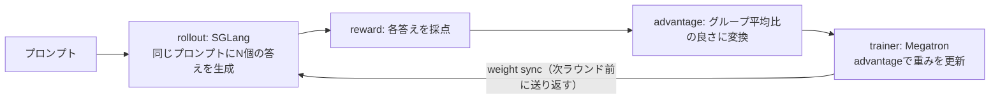

サンプルして、採点して、advantageに変換して、更新して、また送り返す。この繰り返しがGRPOのループです。

### rolloutとtrainer: 性格の全く違う2つのエンジン

このループの中では2つのエンジンが動いていますが、性格がまったく違います。

**rollout側**は推論です。SGLangやvLLMといった推論エンジンが、現在の方策（policy、モデルの重み）を使って1トークンずつ自己回帰的に答えを生成します。ステートレスなプールなので、レプリカ（エンジンのコピー）を自由に増減できます。

**trainer側**は最適化です。MegatronやFSDPといった学習エンジンが、報酬から重みを更新します。系列全体を並列にteacher-forcing（正解データを教師として一括で処理する方式）で処理し、TP（Tensor Parallel）/PP（Pipeline Parallel）/EP（Expert Parallel）という固いトポロジ（GPU間の配線構成）の中で動きます。

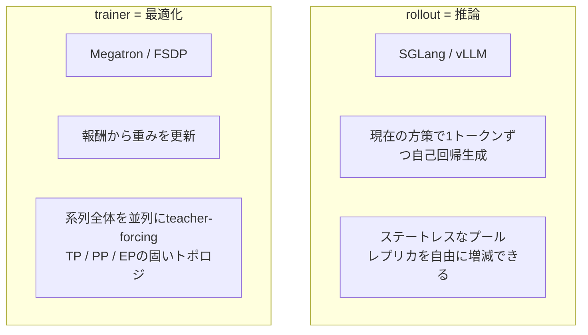

同じモデルの重みを扱っているのに、2つのエンジンは数値の計算のしかたが違います。この違いこそが、本記事の主役である制約3（training-inference mismatch）そのものです。ここで一度、頭の片隅に置いておいてください。

### 用語整理: KL、ppo_kl、entropy、そして今日の主役mis_kl

本題に入る前に、RLのダッシュボードに必ず出てくる4つの言葉を整理します。専門用語で読者を振り落とさないための1節です。

- **KL divergence** （KLダイバージェンス）: ある確率分布が別の確率分布からどれだけ離れているかを表す尺度です。ここでは「方策がどれだけ変化したか」を測る道具として使われます。
- **ppo_kl**: 1回の更新の直前と直後で、方策のKL divergenceがどれだけ変化したかを示す指標です。いわば「1ステップでどれだけ方策を動かしたか」のガードレールで、before/after（更新前後）を比べる指標です。
- **entropy** （エントロピー）: 次のトークンを選ぶときの確率分布がどれだけ散らばっているかを示します。高いほどまだ探索中、下がるほど1つの答えに収束（収束しすぎる場合は「崩壊」）していることを意味します。

そして本記事の主役が**mis_kl**です。mis_klは上の3つとは性質が異なります。ppo_klのようにbefore/after（更新前後）を比べるのではなく、同じトークンに対してrolloutエンジンが出したlogprob（対数確率）とtrainerが出したlogprobを比べた、2つのエンジンの間の差そのものです。

$$
\text{mis\_kl} = D_{\mathrm{KL}}\bigl(\pi_{\text{rollout}} \,\|\, \pi_{\text{trainer}}\bigr) \quad \text{(同じトークン列に対して)}
$$

ここで $\pi_{\text{rollout}}$ はrolloutエンジン（SGLang）が計算した確率分布、$\pi_{\text{trainer}}$ はtrainer（Megatron）が計算した確率分布です。本来、両者は同じモデルの同じ重みを使っているので、理論上は同じ確率を出すはずです。ところが実際には計算経路が違うため、微妙にずれます。このズレを定量化したものがmis_klです。実際にログに記録される値は、この分布全体のKL divergenceそのものではなく、実際に生成されたトークン列上でのlogprobの差から計算されるサンプル推定値である点は付け加えておきます。

この「更新の前後を比べる指標」と「2つのエンジンの間を比べる指標」の区別こそが、本記事全体を理解するための一番の勝負どころです。

## 見えにくさが増す順に並んだ3つの制約

ここからが本題です。3つの制約を、あえて「見えにくさが増す順」に並べます。

| 制約 | 見えにくさ | 実測状況 |
|---|---|---|
| 1. CPU / GIL | 計測すればすぐ見える | 未計測（Open Problemとして提示） |
| 2. rolloutとtrainingのスケーリング非対称 | トポロジを設計しないと見えない | B300で実測 |
| 3. training-inference mismatch | 計測しても見えない（崩壊するまで無症状） | H200 + p5(H100)で3 seed実測（本記事の主役） |

右に行くほど不透明度が上がります。正直に言うと、実測データがあるのは制約2と制約3で、制約1は「今後の実験課題」としてあえて空けたマスです。この誠実さこそ、この検証を信頼してもらうための土台だと考えています。

## 制約1: CPU/GIL — 計測すれば見える（Open Problem）

最初の制約は、あえて「柱」ではなく**Open Problem** （未解決の問題）と呼びます。理由は単純で、実測値を持っていないからです。3本柱に見せかけるために水増しはしたくありません。

仮説はこうです。reward（報酬）の採点やmulti-turn（複数ターン）のセッション管理はCPU上で走ります。これはGPU上で動くrolloutのアクター（推論を担当するプロセス）とは別のリソースです。Pythonの**GIL** （Global Interpreter Lock、グローバルインタプリタロック）の下では、このCPU側の作業が直列化（1つずつ順番に処理）されてしまい、高価なGPUが遊んでいる間にrolloutのスループットを絞ってしまう可能性があります。

正直な状況を書きます。CPUをスロットリング（意図的に処理速度を落とすこと）したremote reward serviceとベースラインを比べる対照実験を設計しましたが、制約3（mismatch）が検証の主役になった時点で、時間の都合上カットしました。したがって、これは「発見」ではなく「深掘りのきっかけになった問題提起」です。

:::message
この項目は未計測です。「measured（実測済み）」とは決して言いません。計測コストが低い（自分の環境でも安価に測れる）ため、この記事の読者への「宿題」として空けておきます。
:::

弱い傍証としては、B300でCUDAグラフのキャプチャ時に16個のSGLangエンジンがCPUを95%使って競合する現象を観測したことがあります（ただしこれはウォームアップ時の一時的な現象で、フラグ設定で解消しました）。また制約2の検証データでは、train_wait（trainerが待機している時間の割合）が0.80〜0.93という高い比率を占めており、GPUが遊んでいる時間が長いことの傍証にはなりますが、その原因がCPU側にあるとまでは特定できていません。

## 制約2: rolloutとtrainingのスケーリング非対称 — 設計しないと見えない

2つ目の制約は、rolloutとtrainingの「スケールの仕方」そのものが構造的に違うという話です。

rollout側は**弾性プール**です。独立したエンジンなので、レプリカ（コピー）を自由に増減できます。スループットは台数にほぼ比例して伸びます。training側はまったく逆で、TP/PP/EPのランク（GPUの役割分担）が固定レイアウトに配線されています。実行中にリスタートなしで組み替えることはできません。

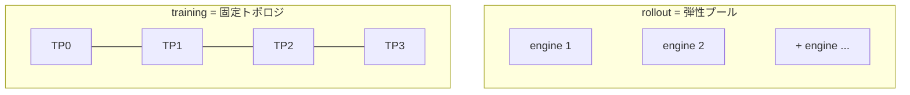

つまりスケールさせたいとき、片側は伸びるのに片側は伸びない、という不均衡が生まれます。これは単一のメトリクスを見ているだけでは気づけません。トポロジを意図的に設計し、不均衡がどこに出るかを観察して初めて見えてくる制約です。

### weight syncの仕組み: なぜ同一GPUの方が遅いのか

先ほどのGRPOループに出てきたweight syncの矢印を、具体的に見ていきます。実は、ここに驚きが隠れています。

trainerが更新した重みをrolloutに送り返す方法は大きく2つあります。

**colocated** （同居配置）: rolloutとtrainerが同じGPUを共有し、CUDA IPC（GPU内のプロセス間でメモリを直接受け渡す仕組み）で重みを渡します。同じGPU上でのやり取りなので、直感的には速そうに見えます。しかし実際には、重みをchunk（分割したブロック）ごとに処理し、chunkごとに`ipc_collect()`という全GPU同期のガベージコレクション（メモリ回収処理）と、Ray（分散処理フレームワーク）のハンドル往復を呼び出します。

**disaggregated** （分離配置）: rolloutとtrainerが別々のノードに置かれ、NCCL/EFA（ネットワーク経由の通信）で重みを渡します。全chunkを1つのバッファに集約してから、1回のバッチ処理でbroadcast（一斉配信）します。

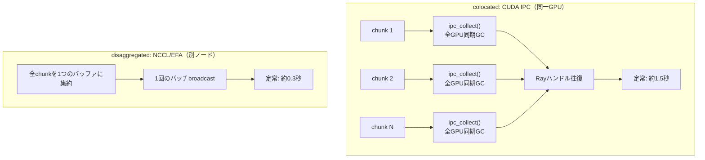

結果は、同一GPU上でのやり取りの方が**5倍遅い**というものでした。ネットワーク経由の方が勝ったのです。この5倍という実測値（wall-clock、実際の経過時間）自体は確かな計測結果です。ただし「遅さの原因がIPCのセマンティクスとRayの往復コストにある」という説明は、コードを読んで導いた仮説であり、プロファイラ（nsysなどの実行時解析ツール）で直接確認したものではありません。共有GPU上でのメモリ競合という別の可能性を排除しきれていないため、あくまで説明仮説として提示します。

いずれにしても、この制約の正体はネットワークそのものではなく、その配線の「上」にありました。

### B300実測: 5倍の逆転と30Bモデルのスケール

実際の数値をB300（AWSの最新GPUインスタンス）でapple-to-apple（条件をそろえた公平な比較。エンジン数・メモリ使用率などを揃えている）に計測した結果です。

| 構成 | モデル | 方式 | 実装 | 定常時のweight sync | 初回 |
|---|---|---|---|---|---|
| A1 | Qwen3-4B dense | colocated | CUDA IPC (UpdateWeightFromTensor) | 約1.5秒 | 2.6秒 |
| A2 | Qwen3-4B dense | disaggregated | NCCL/EFA (UpdateWeightFromDistributed) | 約0.3秒 | 3.0秒 |
| B1 | Qwen3-30B-A3B MoE | disaggregated | NCCL/EFA | 約10.1秒 | 13.1秒 |

読み取りは2つあります。

第一に**方式軸** （A1とA2の比較）です。disaggregatedがcolocatedより定常状態で**約5倍速い** （0.3秒 対 1.5秒）。これは直感に反する結果です。

第二に**規模軸** （A2とB1の比較）です。30B（300億パラメータ）のMoE（Mixture of Experts）モデルは、4Bモデルの**約34倍**の時間（10.1秒）がかかります。weight syncは転送するパラメータ量に強く依存することがわかります。

ここで正直に付け加えておきたいことがあります。GRPOの1周（1ステップ）の内訳を見ると、update_weightsは1.2秒、ref_log_probsの計算は1.2〜1.7秒、actor_train（backwardとoptimizer更新）は20〜30秒程度かかります。つまりweight syncは1ステップ全体の時間のうち数パーセントに過ぎません。実在する制約であり、直感に反する結果ではありますが、支配的なコストではないという点は誠実に述べておきます。

:::message
30B構成のcolocated（同一GPU配置）は今回未計測です。そのためこのバーチャートには存在しません。また、MoEモデルのオンライン重み更新には`--sglang-moe-runner-backend triton`の指定が必須です（`flashinfer_trtllm`のswizzled形式が非互換のため。詳細はslimeのIssue #2091、#1840を参照）。
:::

## スタックは音を立てて壊れる、それまでは

本題の制約3に入る前に、現実確認をしておきます。ここで紹介する内容は論文からの引用ではなく、実機でスタックを立ち上げたときに実際に遭遇した上流のバグです。

代表例として、Megatron-LMのIssue [#5763](https://github.com/NVIDIA/Megatron-LM/issues/5763)を見てみます。

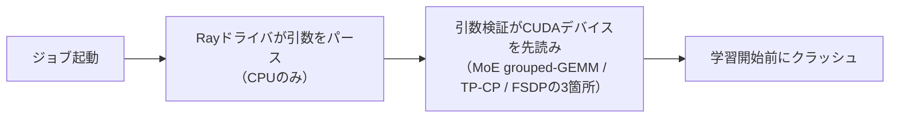

なぜmilesフォーク（slimeのフォークで、Blackwell/CUDA 13対応版）ではこの問題が起きないのでしょうか。milesではRayドライバをGPUワーカーにピン留めする修正（Issue #1163）が入っているため、引数検証のプローブが実際にデバイスを見つけられるからです。上流での正しい修正は、`torch.cuda.is_available()`でこのプローブをガードすることだと考えられます。

他にも遭遇した上流バグを簡単に紹介します。

- **SGLang #30353**: ログレベルの指定が大文字だと、サーバーがsocketをbindする前にhangしてしまいます（hangは処理が停止したまま応答を返さなくなる状態）
- **slime #2186**: CUDA 13環境でpreload（事前ロード）がCUDA 12用のライブラリを掴んでしまい、全workerが死んでしまいます
- **AWS test case #1163**: B300/H200対応のための7つの修正で、すでにマージされています

ここで注目したいのは、これらすべてが**音を立てて**壊れるという点です。クラッシュする、hangする、workerが死ぬ、という形で表れます。いずれもスタックトレース（エラーの発生箇所を示す情報）が出るので、直せます。

本当に怖いのは、エラーを一切出さずに壊れる失敗です。それが、これから説明する制約3です。

## 制約3: training-inference mismatch — 計測しても見えない（本題）

ここからが本記事の核心です。個人的にも一番面白いと感じている制約です。**training-inference mismatch**、すなわちtrainer（学習エンジン）とrollout（推論エンジン）の間で生じる数値のずれについて、根本原因から対処法まで、じっくり掘っていきます。

)
*rolloutとtrainerは同じ重みを持ちながら、同じトークンに違うスコアを返します。その差がこの記事の主題です。*

この制約が厄介なのは、崩壊するまでダッシュボードに何の兆候も出ないことです。loss（損失関数の値）のグラフを眺めていても、ある日突然、学習が崩壊します。これから、なぜそんなことが起きるのかを、数式も含めてわかりやすく解き明かしていきます。

### mismatchとは何か: 同じトークンに2つの答え

思考実験をしてみましょう。完全に同じトークン列（単語や記号を数値に変換した並び）を用意します。これをrolloutエンジン（SGLang）に渡し、「このトークン列のlogprob（対数確率。各トークンが選ばれる確率の対数を取った値で、確率そのものより数値的に扱いやすい）を教えてほしい」と聞きます。SGLangは自己回帰的に、1トークンずつ、FA3（FlashAttention 3、高速化されたAttention計算カーネル）・fused RoPE（回転位置埋め込みを融合演算化したもの）・fused SwiGLU（活性化関数の一種を融合演算化したもの）を使って計算します。

次に、同じトークン列のlogprobをtrainer（Megatron）に聞きます。Megatronは並列teacher-forcingで、SGLangとは違う演算の融合方法、違うNCCLアルゴリズム、違うcuBLAS（GPU上の行列演算ライブラリ）のワークスペースを使って計算します。

そして、2つの答えの数値は一致しません。

根本原因はシンプルで、しかも避けられません。**浮動小数点の加算は結合的でない**という事実です。数学の世界では $a + b + c$ は足す順番を変えても同じ答えになりますが、コンピュータが浮動小数点数（小数を近似的に表現する数値形式）で計算するときは、足す順番を変えると、丸め誤差（表現できない桁を四捨五入することで生じるわずかな誤差）の蓄積の仕方が変わり、わずかに違う結果になります。

$$
(a + b) + c \neq a + (b + c) \quad \text{（浮動小数点演算では一般に成立しない）}
$$

rolloutとtrainerでは、演算の順序、使っているアルゴリズム、そして中間計算の精度がすべて異なります。だから同じ数式のはずなのに、違うエンジン・違う演算順序・違う数値になるのです。この差を指標化したものが、先ほど紹介した**mis_kl**です。

危険なのは、この差が普段は本当に小さく、無害に見えることです。loss曲線には何の兆候も出ません。ところが、ある日突然、学習が崩壊します。次の節で、なぜこの微小な差が致命傷にまで育つのかを見ていきます。

### なぜ微小な差が致命傷になるのか: 重要度比の爆発とO(T²)

平均すればわずか1000分の1程度しかない差が、なぜ学習全体を殺してしまうのか。ここには2つの要因が掛け合わさっています。この節の内容は、後述する論文とNotionブログに基づく理論的な説明であり、私たち自身の実測ではありません。ただし、次に説明する対処法（capとveto）がなぜ「裾」を狙うのか、その理由を理解するための土台になります。

#### 要因1: 低確率トークンで重要度比が爆発する

**重要度比** （importance ratio）$\rho$ を次のように定義します。

$$
\rho = \frac{\pi_{\text{train}}(y \mid x)}{\pi_{\text{rollout}}(y \mid x)}
$$

ここで $\pi_{\text{train}}(y \mid x)$ はtrainer（Megatron）が計算した「入力 $x$ のもとでトークン $y$ が選ばれる確率」、$\pi_{\text{rollout}}(y \mid x)$ はrollout（SGLang）が計算した同じ確率です。理屈上、この2つは同じモデル・同じ重みなので近い値になるはずですが、前述の演算順序の違いにより、わずかにずれます。

なぜこの比がそのまま危険につながるのか、前提を補足します。GRPOやPPOといった手法では、rolloutが生成したサンプルを使ってtrainerの方策を更新する際、そのサンプルが「今のtrainerの方策からどれくらい生まれやすいか」を補正するために、各トークンの勾配に重要度比 $\rho$ を掛け合わせます。これはオフポリシー補正（rolloutとtrainerの方策が完全には一致しない状況を数学的に補正する仕組み）と呼ばれる標準的な手法です。つまり $\rho$ が大きいトークンほど、そのトークンの勾配が更新全体に与える影響も大きくなるという関係があります。

このとき危険なのは、rolloutが「ほぼゼロ」と判断した低確率トークンです。分母 $\pi_{\text{rollout}}(y \mid x)$ がゼロに近づくと、$\rho$ は爆発的に大きくなります。たとえ分子と分母の差がわずかであっても、割り算という演算が小さな分母を極端に増幅してしまうのです。先ほど説明したとおり $\rho$ は勾配に直接掛かる重みなので、この1つのトークンが、勾配（パラメータ更新の方向と大きさを決める量）全体を支配してしまうことがあります。

#### 要因2: 応答が長いほど誤差が二乗で増える

論文（arXiv:2602.01826）が示す誤差の上界（Theorem 3.1）は、応答の長さ $T$ に対して次の式のように増大することを示しています。

)
*重要度比の分布。平均は1付近で無害に見えますが、裾の1トークンが勾配を支配します。TISとvetoはこの分布の別の場所に介入します。*

$$
\text{誤差の上界} = O(T^2)
$$

これは直感的にも理解できます。トークンを1つ生成するたびに、rolloutとtrainerの間の微小なずれが積み重なっていきます。系列が長くなるほど、この積み重ねが二乗のペースで拡大していくのです。

#### 2つが合わさると: 平均は無害、裾が学習を殺す

この2つの要因が合わさると、次のような罠が生まれます。

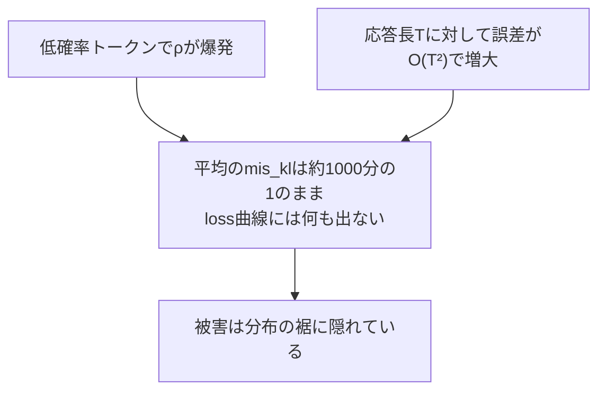

平均を見ている限り、mis_klは終始小さいままです。しかし、ごく一部の低確率トークン・長い応答の裾（分布の端、まれにしか起きない極端な事象が集まる領域）に、致命的な破壊力を持つ勾配が隠れています。これが、この分野の議論の出発点となったNotionブログの核心的な発見です。「平均ではなく、裾（tail）が学習を殺す」。

:::message
この節の内容（重要度比の爆発とO(T²)誤差、平均と裾の関係）は論文・ブログからの引用（from paper）です。私たちの実測結果ではありません。次に紹介する2つの対処法（TISとveto）は、まさにこの「裾」を狙うように設計されています。
:::

### mismatchの計測機構: mis_klと3つの姉妹指標

フレームワークはこの差をどうやって計測しているのでしょうか。手探りではなく、しっかりログに記録されています。SGLangのrollout logprobとMegatronのtrainer logprobは、どちらも`compute_mis_weights_with_cp`という関数に入力され、同じ差に対する4つの異なる見方（ビュー）を出力します。

)
*per-tokenのlogprobをダンプする計装の位置。集約値だけでは系列内のどこで差が出たかが分かりません。*

| 指標名 | 何を見ているか |
|---|---|
| `train/mis_kl` | KL divergence形式の差。本記事の見出し数値 |
| `train/mis_ppl_ratio` | ほぼ $\exp(\text{mis\_kl})$ に相当する、perplexity（複雑度）比のビュー |
| `train/mis_chi2_token` | $\chi^2$（カイ二乗）形式の差。同じ差を別のレンズで見たもの |
| `train/train_rollout_logprob_abs_diff` | 最も素朴な指標。KLの形を仮定しない、logprobの絶対差そのもの |

誠実な注記をしておきます。$k_1$/$k_2$/$k_3$という推定量（KL divergenceの近似計算にはいくつかの数学的に等価でない推定方法があります）のどれに厳密に対応するのかは、この計算ロジックを持つ`mis.py`というファイルがコンテナ内にあり、ローカルにコードを保存していないため、フィールド名から読み取れる以上のことは断定しません。

### 推論カーネルのどこで数値がずれるのか

浮動小数点の演算順序が原因だとすれば、スタックの中の具体的にどこで順序が変わっているのでしょうか。考えられる箇所は主に5つあります。

| 箇所 | 何が違うのか |
|---|---|
| Attention | FA3のprefill/decodeカーネルが、Megatronの融合カーネルと違う順序でreduce（集約）する |
| RoPE | fused rotary embeddingの融合境界（どこまでを1つの演算にまとめるか）が異なる |
| SwiGLU / MLP | bias-SwiGLUの融合方法が、推論用カーネルと学習用カーネルで異なる |
| Collectives（集団通信） | NCCLのアルゴリズム選択によって、rank（GPU間の役割）間のreduce順序が変わる |
| GEMM（行列積） | cuBLASがエンジンごとに違うworkspace（作業領域）・アルゴリズムを選ぶ |

#### per-kernel帰属の実測: 増幅を駆動しているのはKV量子化だった

上の5箇所は「候補」でした。ではKV fp8で見た約45倍の増幅は、このうちどれがどれだけ効いているのでしょうか。各フラグを1つずつ切り替えて、学習なしでstep-0のmis_klだけを測る実験（per-kernel ablation）を実施しました。学習を回さないので安価で、しかも「学習率がまだ影響を持たない」step 0の純粋な数値経路差だけを取り出せます。

| 条件（Qwen3-4B, step 0） | mis_kl | 基準比 |
|---|---|---|
| KV cache = auto（基準） | 0.000716 | 1倍（= bf16ベースラインと同じ） |
| KV fp8_e5m2 | 0.0324 | 約45倍 |
| KV fp8_e4m3 | 0.0087 | 約12倍 |
| KV fp8_e5m2 + attentionをtritonに強制 | 0.0319 | 約45倍（fp8単独とほぼ同じ） |
| KV auto + CUDAグラフ無効化 | 0.000671 | 1倍（基準と同じ） |
| KV auto + attentionをtritonに強制（単独） | 0.000663 | 1倍（基準と同じ） |

読み取りは明快です。第一に、**増幅はほぼすべてKV量子化が駆動しています**（auto 0.0007 → fp8_e5m2 0.032で約45倍）。第二に、**量子化の精度が単調に効きます**。仮数部が2ビットのe5m2（0.032）より、仮数部が4ビットのe4m3（0.0087）のほうがmismatchは小さい。第三に、fp8にtritonバックエンドを重ねても、fp8単独（0.0324）とほぼ変わりません（0.0319）。しかもtritonを単独で（KVは量子化せずにauto）使っても、基準と変わりません（0.000663）。つまり**attentionバックエンドの切り替え自体は単独ではmismatchを生まず**、KV量子化の精度そのものがmismatchを決めています。CUDAグラフの有無も基準と変わりません（0.000671）。

この結果は、「KV fp8は恣意的な増幅装置に過ぎないのでは」という疑問への直接の回答になります。KV fp8は恣意的な装置ではなく、**量子化精度に対して単調で予測可能に**mismatchを生む、物理的に理解できる数値経路差なのです。

:::message
この per-kernel 帰属（step 0 のmis_klを条件ごとに測定）は実測（measured）です。ただし各条件は単一runの点推定であり、条件ごとの分散までは取っていません。表の数値はいずれも本記事のために新たに測定したものです。
:::

### この科学はどこから来たのか: 論文の系譜

ここで紹介している知見が、どこから来ているのかを1つの図で整理します。他の研究者の成果に立っていることを、正確な帰属とともに示します。

起点は2025年9月のNotion技術ブログ「When Speed Kills Stability: Demystifying RL Collapse from the Training-Inference Mismatch」（Jiacai Liu、Yingru Liら）です。arXivには存在しない、ブログ記事としての現象の初報告です。低確率トークンでmismatchが最も深刻化し、勾配が破滅的に大きくなってサイレント崩壊（無症状の崩壊）を招くという発見がここに記されています。

このブログの内容が、本記事が主軸として参照する論文 [arXiv:2602.01826](https://arxiv.org/abs/2602.01826)「Beyond Precision: Training-Inference Mismatch is an Optimization Problem and Simple LR Scheduling Fixes It」（Yaxiang Zhang、Yingru Li、Jiacai Liu、Jiawei Xu、Ziniu Li、Qian Liu、Haoyuan Li、2026年2月2日提出）として正式に論文化されました。この論文は、mismatchを最適化問題として捉え直し、$O(T^2)$誤差の理論的な上界と、学習率スケジューリングによる修正法を与えています。

同じ2025年12月には、大規模RLに関する2つの独立した報告が並行して発表されました。

- **Qwen team**による [arXiv:2512.01374](https://arxiv.org/abs/2512.01374)「Stabilizing Reinforcement Learning with LLMs: Formulation and Practices」（Chujie Zhengほか、2025年12月1日提出）は、importance sampling（重要度サンプリング）とclipping（値の切り詰め）、そしてMoE向けのRouting Replay（ルーティング再現）を定式化しました。
- **DeepSeek-AI**による [arXiv:2512.02556](https://arxiv.org/abs/2512.02556)「DeepSeek-V3.2」（264名の著者、2025年12月2日提出）は、sequence-level masking（系列単位のマスキング）とrouting replayを大規模RLで報告しています。

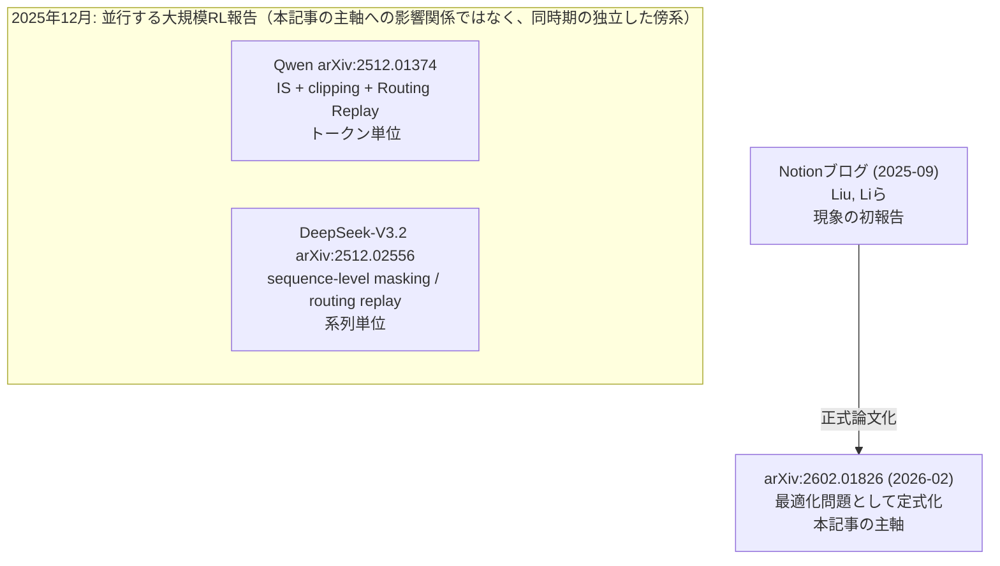

帰属を正確に述べておきます。**Routing Replayを定式化したのはQwenの論文** （2512.01374）です。DeepSeek-V3.2はsequence-level maskingとrouting replayの実運用での報告が主体であり、Routing Replayという技法自体の定式化元ではありません。ここを混同しないよう注意しました。

さらに正確に役割を分けると、Qwenの論文が定式化したのはimportance sampling（重要度サンプリング）とclipping（値の切り詰め）という**トークン単位**の技法であり、DeepSeek-V3.2が報告したのはsequence-level masking（系列単位のマスキング）という**系列単位**の技法です。この後紹介する2つの対処法は、まさにこの役割分担と対応しています。トークン単位のTIS（cap）はQwenの技法に、系列単位のveto（拒否）はDeepSeekの技法に、それぞれ対応します。3件のarXiv IDはすべて実在確認済みです。

### 論文のもう一つの処方箋: 学習率スケジューリング

本記事が主軸とする論文（arXiv:2602.01826）のタイトルは「...and Simple LR Scheduling Fixes It」です。TISやvetoといった重要度比への介入とは別に、論文は**学習率（learning rate、$\eta$）のスケジューリング**という、より軽量な処方箋を主役に据えています。この節はその論文の主張の紹介（from paper）であり、私たち自身の実測ではありません。

論文の見立てはこうです。mismatchは「静的な背景ノイズ」ではなく、モデルの重みが最適化の途中でどこに位置しているかに強く結合した**動的な失敗**です。学習が進んで方策が尖ってくると（低確率トークンが増えてくると）、前述の重要度比 $\rho$ の爆発が起きやすくなり、勾配ノイズとmismatchが手を取り合って増大していきます。だとすれば、方策が危険な領域に入りかけた瞬間に一歩を小さくすれば、暴走を未然に防げるはずだ、という発想です。

論文のAlgorithm 1が示す学習率スケジュールは、次のような形をしています。

$$
\eta_t =
\begin{cases}
\eta_0 & \text{（応答長のsurgeを検出するまでは初期学習率を維持）} \\[4pt]
\max\bigl(\eta_0 \cdot 2^{-\lfloor (t - t_{\text{surge}}) / \Delta \rfloor},\ \eta_\infty\bigr) & \text{（surge検出後は }\Delta\text{ ステップごとに半減）}
\end{cases}
$$

ここで各記号の意味は次の通りです。

- $\eta_0$ は初期学習率です。崩壊の兆候が出るまではこれを維持します。
- $t_{\text{surge}}$ は**応答長（response length）のsurge（急増）を検出した時刻**です。論文は応答長の急増を最も早い崩壊の警告信号として使います（約100ステップの窓で3倍程度に伸びることを兆候とみなします）。
- $\Delta$ は**decay period（減衰周期）**で、$\eta$ を半減させる間隔です。論文はこれをsurgeの幅に比例させます（およそ1.8倍）。
- $\eta_\infty$ は**floor（下限）学習率**で、$\eta_\infty = 0.1 \times \eta_0$、つまり初期値の10%までしか下げません。ゼロまで下げ切らないことで、学習を止めずに安定化だけを効かせます。

論文が強調する重要な観察は、この減衰の基準を**epoch（データを何周したか）ではなく、崩壊の兆候そのもの（応答長のsurge）に紐づける**べきだという点です。RLの安定性は消費したデータ量にほぼ依存せず、方策が危険な領域に入ったかどうかで決まるからです。

ここで、この記事で実際に検証しているTIS/vetoと、論文主題のLRスケジューリングの関係を整理しておきます。両者は**同じ病（低確率トークンでの重要度比の爆発）に対する、作用点の違う2つの薬**です。LRスケジューリングは「一歩の大きさ」を全体的に絞ることで暴走の速度を落とします。TIS/vetoは「暴れる個々のトークン・系列」をピンポイントで抑え込みます。私たちの検証で実測したのは後者（TIS/veto）で、前者（LRスケジューリング）は論文が示す処方箋として紹介するにとどめます。

:::message
この節（LRスケジューリングのアルゴリズム）は論文（arXiv:2602.01826）の主張の紹介であり、私たち自身の実測ではありません。上の数式は論文Algorithm 1の趣旨（surge検出後にdecay periodごとにLRを半減、floorは初期値の10%）を数式の形に起こしたものです。私たちの検証で実測したのはTIS/vetoによる救済であり、LRスケジューリングの再現実験は実施していません。
:::

### なぜFP8で見えるようになるのか: タイムマシンとしてのFP8

この差は普段は極めて小さいのに、どうやって研究するのでしょうか。ここで論文の核心的な洞察が登場します。

論文の実験によれば、fp16（16bit浮動小数点）でもbf16（bfloat16、機械学習でよく使われる16bit浮動小数点形式）と同様に崩壊が起きます。つまり**精度フォーマットはmismatchの原因ではない**のです。これは2つのエンジンが異なる演算順序で計算するという性質そのものに起因し、誤差は応答長のほぼ2乗で増えます。だから精度は原因ではなく、現象を観察するための「レンズ」なのです。

私たちのスタックでは、KVキャッシュ（Attentionの計算で使う中間データのキャッシュ）をfp8に量子化（数値をより少ないビット数で近似的に表現すること）すると、SGLangが第二のattentionバックエンド（triton、GPUカーネルを書くためのプログラミング言語・コンパイラ）にfallback（切り替え）します。これによって演算順序の差がさらに拡大します。

論文自身の実験では、自然なbf16崩壊はstep 300前後で発生します（これは論文の実験結果であり、私たちの計測ではありません）。私たちのスタックでKV fp8を使うと、類似した崩壊がstep 24前後で見られます。ここは正確に言う必要があります。両者は**別の実行・別の学習率**によるものなので、「同一学習率での等価な現象」ではなく、「前倒しされた類似現象」です。

つまり、私たちは意図的に増幅しているのです。KV fp8は一種の**タイムマシン**です。差そのものは実在しますが、fp8はそれをstep 300からstep 24へと前倒しして見せる装置であり、この現象を1回の講演・1本の記事に収めるための手段だと理解してください。

:::message
KV fp8による増幅は、あくまで研究のための人工的な手法です。実運用でこの設定を使うことを推奨しているわけではありません。
:::

### 増幅の実測値: 6e-4から3e-2へ

ここからは実測データです。検証環境はH200 x8、Qwen3-4B dense（密なモデル、MoEではない構成）、colocated配置、dropout（学習時に一部ニューロンを無効化する正則化手法）は0、学習率は1e-6に統一しています。

まずベースライン（増幅前）です。

| 指標 | miles | slime | 判定 |
|---|---|---|---|
| mis_kl | 0.000632 | 0.00053 | 同オーダー（slimeの値は0.00053〜0.00074の範囲で変動、約±17%） |
| logprob絶対差 | 0.0130 | 0.0129 | ほぼ一致 |
| ppo_kl（dropout=0時） | 0.0 | 0.0 | どちらもゼロ |

:::message
slimeの0.00053〜0.00074という範囲について補足します。この検証は全体として単一seedで実施しているため、この変動が同一run内でのstep間のばらつきなのか、それとも別の要因によるものなのかは、この記事の執筆時点では特定できていません。複数回の実行による分散であるかのように誤読されないよう、正直に「範囲」としてのみ記載しています。
:::

素のbf16では、SGLangとMegatronの間のmis_klは約 $6 \times 10^{-4}$ 程度です。極めて小さく、良性で、気にする必要のないレベルです。

次に、rolloutのKVキャッシュをfp8_e5m2（8bit浮動小数点の一形式）に量子化し、第二のattentionバックエンドを強制した結果です。

| 条件 | miles | slime | 倍率 |
|---|---|---|---|
| baseline（bf16） | 0.000632 | 0.00053〜0.00074 | - |
| KV fp8（step 0） | 0.0310 | 0.0006→0.0327 | miles約49倍 / slime約54倍 |

mis_klは約 $3 \times 10^{-2}$ まで跳ね上がります。これはstep 0、つまりいかなる重み更新もまだ行われていない時点での値なので、学習率にはまだ依存していません。slimeとmilesという2つの独立したフレームワーク上で、ほぼ同じ値が観測されています。

誠実な注記を2つ加えます。第一に、この増幅はfp8量子化とバックエンド強制切替という2つの変化が合わさった結果であり、単一の変数への帰属はしていません。第二に、baseline実行は学習率1e-6、fp8実行は学習率1e-5であり、このペアは厳密な単一変数比較ではありません。そのため、学習率がまだ影響を持ち得ないstep 0の値を主役に据えています。

:::message
weight（重み）そのものをfp8化する実験は、SGLang 0.5.12の`/post_process_weights`エンドポイントが404エラーを返すため実施できませんでした。そのためKVキャッシュのfp8化を増幅装置として採用しています。
:::

### キラーチャート: mismatchは崩壊に先行する

ここが検証の核心的な結果です。KV fp8・学習率1e-5・TIS（次節で説明する対処法）なしの条件（collapse arm）で、25ステップにわたってmis_klとgrad_norm（勾配のノルム、勾配全体の大きさを表す指標）を追跡した実測データです。

)
*30ステップ完走した6 runの実測値。mis_klが先に分離し、rewardが遅れて崩壊します。*

| step | mis_kl | grad_norm |
|---|---|---|
| 0 | 0.033 | 0.22 |
| 8 | 0.034 | 0.33 |
| 10 | 0.059 | 0.43 |
| 12 | 0.059 | 0.66 |
| 14 | 0.151 | 1.34 |
| 16 | 0.177 | 1.92 |
| 18 | 0.426 | 2.88 |
| 19 | 0.504 | 4.59 |
| 22 | 0.807 | 5.78 |
| 24 | 2.097 | 14.3 |

この時系列を読み解くと、はっきりした段階が見えてきます。

- **step 8まで**: 静穏な状態が続きます。mis_klは約0.03のまま、ほぼ変化しません
- **step 10〜12**: 倍増します。0.059まで上昇します
- **step 14以降**: 暴走します。0.151から始まり、最終的にstep 24で2.097まで到達します。これはstart値（0.033）の約64倍です

grad_normも同じように0.22から14.3まで急増しています。ここで最も重要なポイントは**順序**です。mismatchが先に発散し、崩壊が後から追いかけてくるのです。

同じKV fp8の条件で、TIS（cap付きの補正）を適用した場合（rescue arm）のmis_klとgrad_normも並べてみます。

| step | no correction（mis_kl / grad_norm） | TIS rescue arm（mis_kl / grad_norm） |
|---|---|---|
| 0 | 0.033 / 0.22 | 0.033 / 0.13 |
| 14 | 0.151 / 1.34 | 約0.04 / 約0.15 |
| 19 | 0.504 / 4.59 | 約0.04 / 約0.13 |

no correction（補正なし）はstep 14から暴走していくのに対し、TIS rescue armはログが残っているstep 19まで0.03〜0.045の範囲でフラットに保たれています。

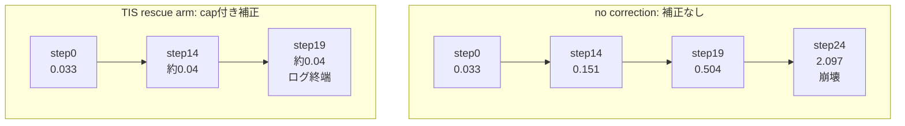

:::message alert
誠実な開示です。このTIS rescue armのログは**step 19までしか記録されていません**。上の表とmermaid図もstep 19で止めています。それより先、収束済みモデルで崩壊が起きなかったのか、あるいは後になって崩壊した可能性があるのかは**未確認**です。「永久に崩壊しない」という主張は一切していません。単純にログがそこで終わっているのです。
:::

「因果」という言葉はここでは慎重に扱います。この順序（mismatchが先に発散し崩壊が後を追う）は、mis_klが「先行指標」として使えることを示すものです。しかし「capが崩壊を直す」という因果関係の証拠は、この節のデータからではなく、次のセクションで説明するcapの値だけを変えた介入実験（3アーム対照実験）から得られます。

### 別ハード・3 seedでの確証: reward崩壊まで追い切る

上のH200での観察を、別のハードウェア（p5 / H100 x8のEKSクラスタ）で、しかも3つの異なるseed（1234 / 42 / 123）で追試しました。前倒しの度合いを揃えるため、ここでもQwen3-4B dense、colocated、KV fp8_e5m2、学習率1e-5という同じ設定を使い、no correction（補正なし、collapse）とTIS cap=2.0（rescue）を、同じseedのもとで**TIS補正の有無だけを変えて**並走させています。今度はログをstep 19で止めず、30ステップ最後まで、しかもmis_kl・grad_normに加えて**reward（報酬）**まで追い切りました。

seedごとの、no correction側のmis_klのピーク値と、両アームの最終rewardは次の通りです。

| seed | no-corr mis_kl最大 | no-corr 最終reward | TIS mis_kl最大 | TIS 最終reward |
|---|---|---|---|---|
| 1234 | 12.6 | 0.0 | 0.150 | 0.61 |
| 42 | 2.85 | （崩壊） | 0.159 | （維持） |
| 123 | 13.7 | （崩壊） | 0.150 | （維持） |

ここから2つの、方向性の揃った結論が得られます。

第一に、**TISは3 seedすべてで mis_kl最大が0.15前後にぴたりと揃います**（0.150 / 0.159 / 0.150）。cap付き補正の安定性は、乱数のseedに依存しません。第二に、**no correctionは3 seedすべてで崩壊します**が、崩壊の激しさ（mis_klのピーク）はseedによって2.85から13.7まで大きくばらつきます。つまり「崩壊するかどうか（方向性）」はseed不変で決まっているのに対し、「どれくらい派手に崩壊するか」はseed依存でぶれる。この構造こそ、単一seedでは見えず、複数seedで初めて見える性質です。

no correction側では、rewardの運命がとりわけ雄弁です。seed 1234では、rewardはstep 7あたりまで0.76まで伸びて「学習は順調」に見えるのに、mis_klの発散に引きずられてstep 18以降で崩れ落ち、step 26以降は完全にゼロになります。この0.0は「収束」ではなく崩壊の終着点です。方策が壊れて全サンプルのrewardが0になった結果、GRPOのadvantage（グループ平均比の良し悪し）が全ゼロになり、勾配そのものが消えてしまうのです。一方TIS側は、同じ増幅を受けながらrewardを0.45から0.61へと伸ばし続けます。

:::message
この3 seed実測（collapse / rescueを各3 seed、30ステップ完走）は本記事の主軸です。「単一seedではないか」「崩壊するまで追い切っていないのではないか」という2つの疑問に、実測で答えています。mis_kl（対数軸）・grad_norm・rewardの3枚を重ねた図は、no correction（赤）とTIS（緑）が同じ設定から袂を分かつ様子を示します。ただしこの検証はすべてmiles（slimeのフォーク）上のもので、独立実装での再現ではない点は後述のconcordanceの限界のとおりです。
:::

### 崩壊が壊れていく順序

崩壊が実際にどのような順序で進行するのかを、もう少し丁寧に見ていきます。これがmis_klを早期警告として使える理由そのものです。

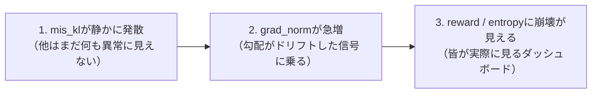

**ステップ1からステップ2への順序** （mis_klが発散してからgrad_normが急増するまで）は、前節で示したデータから直接実測しています。一方、**ステップ3の順序**、そして**応答長（response length）がさらに早く増大（surge）する**という点については、論文（arXiv:2602.01826）からの引用です。

:::message alert
正直に述べます。応答長の増大は論文が示す最も早い警告信号ですが、私たちはこれを計測していません。今後のキャパシティブロック実験での追試対象です。
:::

### 対処その1: TISで重要度比にcapをかける

では、実際の修正は何をしているのでしょうか。この対処法は**TIS** （truncated importance sampling、切り詰め重要度サンプリング）と呼ばれます。「cap（上限で切り詰める）」という操作を具体的なイメージとして描いてみます。多くの人が名前だけ聞いて頷いてしまい、実際に何をしているのかを想像できていないことが多いためです。

先ほど定義した重要度比 $\rho = \pi_{\text{train}} / \pi_{\text{rollout}}$ を、数直線の上で考えます。

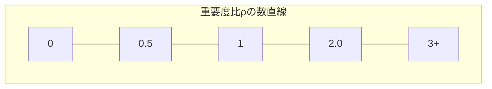

- $\rho$ が **0.5から2.0の範囲**にあるトークンは、そのままの値を使う
- $\rho$ が **2.0を超える**トークンは、2.0に切り詰める（truncate）

つまり、rolloutとtrainerが激しく食い違うトークン（たとえば $\rho = 7$ のようなケース）は、勾配に掛かる前に2.0までクリップされます。その後、バッチ全体を再正規化して、平均の比が1.0になるよう調整します。

$$
\rho_{\text{clipped}} = \min(\rho, C) \quad \text{（ここで } C = 2.0 \text{）}
$$

なぜこれが救済になるのでしょうか。1つの暴れたトークンが更新全体を支配できなくなるからです。しかも、0にマスクする（完全に無視する）のとは違い、そのトークンの寄与は残ります。少しのbias（偏り、真の値からの系統的なズレ）と引き換えに、variance（分散、ばらつき）を大きく減らすという、教科書的なtruncated importance samplingの考え方そのものです。このトークン単位でのimportance samplingとclippingという考え方は、前述したQwenの論文（arXiv:2512.01374）が定式化したものと同じ系譜にあります。

:::message
実際に走らせた設定は、`tis_mode: truncate`、`tis_lower_bound: 0.5`、`tis_upper_bound: 2.0`、`tis_batch_normalize: true`です。設定ファイル（`configs/mis.yaml`）のmode指定には他に`mask`（範囲外を0にする、MIS）と`clip`（範囲内にclipする、CIS）もありますが、今回truncateモードでは`tis_lower_bound`は実質使用されません。
:::

### 対処その2: vetoで系列ごと勾配をゼロにする

capは1つ目の防御線です。もう1つ、DeepSeek-V3.2が大規模実験で報告しているsequence-level maskingに直接対応する仕組みがあります。それが**veto** （拒否、per-sequenceの対処）です。

capはper-token（トークン単位）の対処でした。大きすぎる $\rho$ を2.0に丸めるだけです。vetoはper-sequence（系列単位）の対処です。1つの系列（トークンの並び）の中身を見てみましょう。

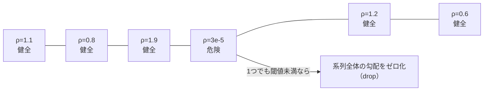

大半のトークンは健全な $\rho$ を持っていますが、1つだけ $\rho = 3 \times 10^{-5}$ という極端に低い値、つまりrolloutが「ほぼ不可能」と判断したトークンが混ざっています。

設定は`configs/mis.yaml`にある`use_rs: true`と`rs_veto_threshold: 1.0e-4`です。設定ファイルのコメントを逐語で引用すると、「Per-token veto threshold. If any token ratio < this, zero the entire sequence weight, the sequences won't have gradient」（トークン単位の拒否しきい値。いずれかのトークン比がこの値を下回ったら、系列全体の重みをゼロにし、その系列は勾配を持たなくなる）と説明されています。

つまりルールは「系列中のどれか1トークンでも閾値を下回れば、系列全体の勾配をゼロ化する」というものです。

なぜトークン単位ではなく系列単位で落とすのでしょうか。低確率トークンこそmismatchが最悪化する場所だからです（前述の「なぜ微小な差が致命傷になるのか」の節を参照）。1つでも毒（危険なトークン）が混ざっていれば、その系列全体の勾配は信用できないという判断です。

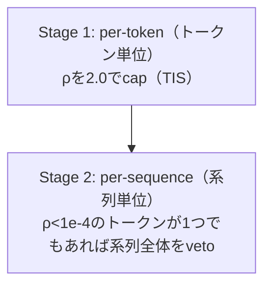

これがDeepSeek-V3.2（arXiv:2512.02556）が報告するsequence-level（系列単位）の対処であり、実装上はmis.yamlのわずか2行です。TIS（cap、Qwenの技法に対応）とveto（DeepSeekの技法に対応）を合わせることで、トークン単位と系列単位の二段構えの防御が完成します。

:::message
フラグとしては設定済みですが、veto単独のon/off比較実験は今回実施していません（今後の追試対象です）。
:::

### 救済の実測: capの値だけを変えた3アーム対照実験

「capが本当に効いている」ということを証明する対照実験を見てみます。3つのアーム（実験条件）を比較しました。

| アーム | 設定 | 結果 |
|---|---|---|
| 左: no correction | KV fp8、TISなし | mis_klがstep 24で2.1まで到達し、崩壊 |
| 中央: TIS、cap = 2.0 | 通常のTIS設定 | mis_klはstep 19（ログ終端）までフラット。救済成功。slimeではrewardが0.44→0.73に上昇 |
| 右: TIS、cap = 100 | 上限を実質無効化 | 再び崩壊。slimeではentropyがstep 6で0.07まで激減 |

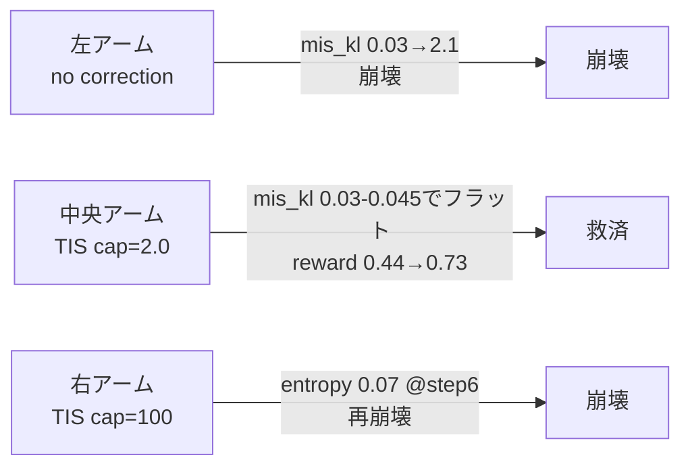

ここで注目してほしいのは、中央のアームと右のアームの違いです。**変わっている変数はcapの値だけ**です。TISのon/offではありません（両方でTISはonになっています）。純粋にcapという数値だけが違います。

したがって、cap自体が因果因子（結果を引き起こしている本当の原因）である、と言えます。この講演・この記事における「因果関係がある」という主張は、実はこの介入実験（cap以外の条件をすべて固定し、cap値だけを変えた実験）から来ています。単に相関を観察しただけの主張ではありません。

### bias-variance二分: entropyの向きで見分ける

もう一段深く掘ります。実は崩壊には2種類のパターンがあり、**entropy（先述の、次トークン選択の散らばり具合を示す指標）がどちらの方向に動くか**で見分けられます。

**bias駆動** （bias-driven）: 補正をかけない場合、未補正のmismatchが勾配を系統的に歪め、方策が誤ったモード（誤った答えのパターン）に固着します。entropyは**下がる**方向に動きます（collapse、崩壊）。これは前節の「no correction」アームそのものです。

**variance駆動** （variance-driven）: これは前節の3アームとは別の、**第4の実行**です。trainerのlogprobを生のfp8 rollout logprobでそのまま置き換えると、heavy-tail（裾の重い分布）化し、勾配ノイズが爆発します。entropyは**上がる**方向に動きます（diffusion、拡散）。

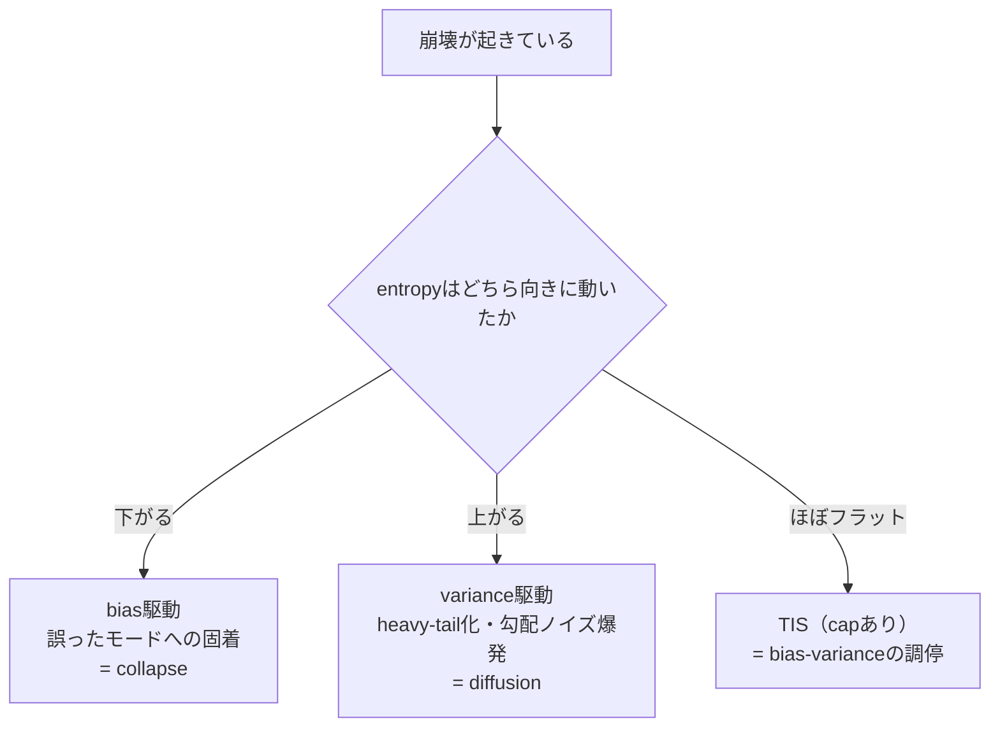

:::message alert
注意すべき点があります。前節の3アーム実験のうち「cap=100」アームもentropy低下型の崩壊でした。つまりcap=100とこのvariance駆動のケースは、entropyの向きだけで区別できるものではなく、**そもそも別の実行**です。混同しないよう気をつけてください。
:::

TISは両者の中間に位置します。capが少しのbiasと引き換えにvarianceを大きく減らす、教科書的なtruncated importance samplingの効果です。実務的な見分け方は、entropyがどちらの方向に動いているかを見ることです。

実測できているのは各アームのstart（開始時）からend（終了時）へのentropyの変化です。

| アーム | entropy（開始→終了） |
|---|---|
| bias駆動（no correction） | 0.48 → 0.18 |
| variance駆動（生のrollout logprobで置換） | 0.4 → 1.2 |
| TIS（capあり） | 0.27〜0.39（ほぼフラット） |

:::message
per-step（各ステップごと）の全entropy軌跡はプロットしていません。開始と終了の2点のみの実測です。全軌跡の可視化は今後のキャパシティブロック実験（後述のE1）での追試対象です。
:::

### concordance: 2つのフレームワークでの再現性

これまで見てきた倍率（約54倍・約49倍という増幅率）を、どこまで信頼できるでしょうか。この検証は2つのフレームワークで実行しています。1つはslime、もう1つはmiles（CUDA 13・Blackwell世代GPU対応のフォーク）です。

両方とも、baseline（bf16）のmis_klは約 $6 \times 10^{-4}$ で、step 0でのKV fp8増幅後は約 $3 \times 10^{-2}$ に達します。倍率にすると、slimeで約54倍、miles で約49倍です。2つのフレームワークで、ほぼ同じ数値が観測されました。

このことは、この差の大きさが「共有されているrollout対trainerの数値経路（計算の仕方の違い）」によって決まっており、フォークごとに分岐したコードパスに由来するものではないことを示唆しています。

この一致は、別のハードウェア（p5 / H100 x8のEKSクラスタ）でも再確認しました。slimeとmilesはベースイメージが異なり（slimeはNGCベース、milesはnvidia/cudaベース）、Megatronのフォークも別で、torch_distチェックポイントもそれぞれのMegatronで別々に変換しています。それでも、このEKSクラスタで測ったbaseline（bf16）のstep-0 mis_klは、slimeが0.000615、milesが0.00072と、やはり同じオーダーに収まりました。共有する数値経路が差を決めているという見立ては、H200に加えてこの別ハードでも支持されています。

:::message
このベースイメージの違いは、思わぬ形でも顔を出しました。miles（nvidia/cudaベース）では、イメージが古い前方互換libcudaを同梱していて、それがホストドライバより古いとtorch.cudaが「Error 803」で即死します（本記事の検証では、該当するライブラリのパスを外して回避しました）。一方slime（NGCベース）は、同じlibcudaを同梱していても、NGCのentrypointが「同梱版がホストドライバ以上のときだけ有効化する」ガードを持つため、この問題を踏みません。同じQwen3-4Bを同じクラスタで動かしても、ベースイメージの素性の違いがこうした運用上の落とし穴の有無に直結する、という一例です。
:::

:::message alert
誠実な限界を明記します。milesはslimeのフォークであり、ゼロから作られた独立した第二の実装ではありません。したがってこれは「fork間の一致」であり、真に独立した2つの実装での再現ではありません。54倍対49倍という**倍率そのものの差**については、依然として単一seedの点推定なので、その差を論じることはしません。一方で、崩壊するかどうかという**現象の方向性**については、前掲のとおりmiles上で3 seed（1234 / 42 / 123）まで広げて確認しており、そちらは「n=1批判」を脱しています。倍率の分散評価（3 seedでのstep-0 mis_klのばらつき）は今後の課題として残しています。
:::

### vLLMだと差がもっと大きくなるのか: 測ってみたら「ならなかった」

よく聞かれる質問があります。「SGLangではなくvLLMを使ったら、この現象はどう変わるのか」という質問です。

機構的な推論としては、vLLMの方が差が**大きくなりやすい**と予想できます。論拠はこうです。rolloutは自己回帰的（1トークンずつ、KVキャッシュが伸びていく方式）です。vLLMはPagedAttention（KVキャッシュをページ単位で管理する仕組み）と連続バッチ処理という、独自のカーネル群を持っています。trainer側は並列teacher-forcingで、Megatron/FSDPのカーネル群を使います。vLLMのカーネル群はSGLangのカーネル群と比べてtrainer側からより大きく乖離しているので、浮動小数点の演算順序が異なる箇所が単純に増えます。カーネルの差が大きいほどmis_klが大きくなるはずだ、という推論です。

そこで実際に測りました。ただし測ったのはtrainerとの比較ではなく、**推論エンジン同士の比較**です。同じQwen3-4Bの重みに対して、SGLangでdapo-math-17kの問題をサンプリングし、**まったく同じトークン列**をvLLMにteacher-forcingで通してtoken毎のlogprobを取り、slimeの`mis_kl`と同じ推定量を適用しました。trainerを介在させないので、「エンジン間の数値経路差そのもの」を分離して測れます。

1 seedあたり128問（応答32768トークン）で測った結果です。

| seed | 平均KL（SGLang − vLLM） | 平均絶対差 | k3_kl |
|---|---|---|---|
| 42 | 0.000667 | 0.01162 | 0.000783 |
| 123 | 0.000918 | 0.01188 | 0.000822 |
| 1234 | 0.000869 | 0.01202 | 0.000814 |
| **平均 ± 標準偏差** | **0.000818 ± 0.000133** | **0.01184 ± 0.00020** | **0.000806 ± 0.000020** |

結果は予想と違いました。エンジン間の差（k3_kl $8.06 \times 10^{-4}$）は、SGLang対Megatronのベースライン（mis_kl 約 $6 \times 10^{-4}$）と**同じオーダー**にとどまりました。しかもこの量はとても安定しています。3 seedでの変動係数はわずか2.5パーセントで、崩壊の倍率（seed間で2.85倍から13.7倍までばらつく）やfork間の倍率よりも桁違いに締まった量です。

サンプル数の妥当性も確認しました。1 seedあたり32問で測ったときの変動係数は13パーセントでしたが、128問に増やすと2.5パーセントまで縮み、平均値はほとんど動きません（$8.35 \times 10^{-4}$ から $8.06 \times 10^{-4}$）。つまり32問のときのばらつきはサンプリングノイズであって、seedによる本質的な違いではありませんでした。

さらに、**測る向きを逆にしても同じ値になります**。今度はvLLMに生成させ、その同一トークン列をSGLangにteacher-forcingで通して、同じく3 seedで測りました。

| 測る向き | rollout役 | trainer側役 | k3_kl（3 seed） |
|---|---|---|---|
| 順方向 | SGLang | vLLM | 0.000806 ± 0.000020 |
| 逆方向 | vLLM | SGLang | 0.000792 ± 0.000061 |

両者は互いの誤差範囲に十分収まります。どちらのエンジンをrollout役に置いても値が変わらないので、この指標は「片方のエンジンの癖」ではなく、2つのエンジン間の数値経路差そのものを対称的に捉えていることになります。

最後に、**モデルサイズを変えてもほとんど動きません**。この記事の他の測定はすべてQwen3-4Bですが、それだと「4Bというモデル固有の性質では」という疑問が残ります。そこで同じ手順をdenseの3サイズで測りました。

| モデル | k3_kl | 平均KL（SGLang − vLLM） | 平均絶対差 |
|---|---|---|---|
| Qwen3-1.7B | 0.000959 | 0.000857 | 0.01318 |
| Qwen3-4B | 0.000814 | 0.000869 | 0.01202 |
| Qwen3-8B | 0.000774 | 0.000688 | 0.01174 |

パラメータ数が4.7倍変わっても、k3_klは1.24倍しか動きません（$9.59 \times 10^{-4}$ から $7.74 \times 10^{-4}$）。しかも傾きはわずかに**減少**方向です。つまりこの $10^{-3}$ 程度のエンジン間の差は、モデルの容量で決まっているのではなく、演算単位での浮動小数点の順序差で決まっていると考えるのが自然です。だからこそ規模を変えてもほぼ一定なのです。

ここから2つのことが言えます。

第一に、**良性なベースラインmismatchはSGLang固有の性質ではありません**。推論エンジンを丸ごと入れ替えても、metricは同じオーダーの中を動くだけでした。$10^{-3}$ 程度のlogprob不一致は、最適化された独立な推論スタック同士が単にお互いに対して持ってしまう差であり、良性の領域に留まります。

第二に、この値は**KV fp8による増幅が超えるべきノイズ床**を与えます。fp8_e5m2はmis_klを0.032まで押し上げるので、このエンジン間の床の約40倍です。だからこそ増幅した条件は、測定ノイズではなく病的なmismatchのモデルとして使えるのです。

:::message
この測定に残る限界は、検証したモデルがいずれもdense構成（MoEは未検証）である点と、vLLMをeagerモード（`enforce_eager=True`かつ`TORCHDYNAMO_DISABLE=1`）で動かす必要があった点です。後者はノードのCUDAドライバ13.1に対して、vLLM 0.11.0が固定するtorch 2.8/triton 3.4の組み合わせがコンパイルできなかったためです。eager実行はカーネル選択を変えるので、これは「SGLang対vLLM（eagerモード）」の比較になります。ただしconcordanceの主張にとってはむしろ保守的な条件です。カーネル経路が違うにもかかわらず、両エンジンは $10^{-3}$ 程度で一致したことになります。
:::

### 位置プロファイル: O(T²)を測ってみたら、Tでした

ここまで、応答が長いほど誤差が二乗で増えるというO(T²)の話は、論文からの引用として紹介しました。上界の式であって、私たちの実測ではないと注記もしました。今回、これを直接測りました。

)
*累積誤差の分散が系列長に対してどうスケールするか。実測12 runはalpha=1の側に寄り、alpha=2の上界には遠いです。*

測り方に一つ工夫があります。素直にやるなら`--rollout-max-response-len`を8192、16384、32768と振って、系列長ごとに誤差を比べるところです。しかしそれをすると、KVキャッシュの予算、バッチの形、chunked prefillの境界、生成される内容の分布、打ち切り率が全部同時に動いてしまい、何の効果を見ているのか分からなくなります。

attentionは因果的（causal、各トークンは自分より前しか見ない）です。したがって8192トークンの実行で測った「位置tにおける誤差」は、もっと長い実行の最初の8192位置における誤差と同じ量です。**系列長を振る必要はなく、1つの長さで位置ごとのプロファイルを取れば済みます。** 交絡も一切入りません。

そこで per-token のlogprobをダンプし、位置ごとの差 $r_t = \text{train\_logprob}_t - \text{rollout\_logprob}_t$ を取り出しました。

#### 傾きの符号: bf16だけが有意に減少する

$|r_t|$ を絶対位置（プロンプト長 + 応答内index、つまりそのトークンが参照するKVキャッシュのエントリ数）に対して回帰し、傾きを求めます。傾きが正なら「後ろのトークンほど誤差が大きい」、つまり蓄積しているという意味です。逆に負なら、後ろのトークンほど誤差が小さい、つまり系列が進むほどtrainerとrolloutのlogprobがむしろ近づいていくという意味になります。蓄積の仮説からすると意外な方向ですが、bf16で実際に観測されたのはこちらでした。

)
*seed 4本の傾きを軸上に並べたもの。bf16は密集し、fp8は符号を跨いで散ります。破線が撤回した区間です。*

Qwen3-4B、TP1/CP1、step 0のみ、1実行あたり128系列。**4つのseed × 3つのarm = 12実行**を回しました。区間はseed間のばらつきから求めています。

比較には、8192トークンに到達した系列だけを使っています（各実行で64本から85本、つまり128本の約半分です）。位置ごとの平均を取るとき、短い系列は後半のビンに寄与しないので、全系列を混ぜると後半のビンだけ別の母集団になってしまいます。打ち切りの向きは12実行で揃っていますが、標本が半分であることは限界として記録しておきます。

| arm | 平均傾き（1トークンあたり） | seed間の標準誤差 | 95%区間 | 判定 |
|---|---|---|---|---|
| bf16 | $-3.25 \times 10^{-7}$ | $3.55 \times 10^{-8}$ | $[-4.38, -2.12] \times 10^{-7}$ | **減少（区間がゼロを含まない）** |
| fp8_e4m3 | $+1.23 \times 10^{-7}$ | $2.72 \times 10^{-7}$ | $[-7.42, +9.88] \times 10^{-7}$ | フラット |
| fp8_e5m2 | $-7.61 \times 10^{-7}$ | $5.00 \times 10^{-7}$ | $[-2.35, +0.83] \times 10^{-6}$ | フラット |

seedごとの内訳を見ると、何が起きているかがはっきりします（単位は $10^{-7}$）。

| arm | seed 1234 | seed 42 | seed 123 | seed 777 | 符号 |
|---|---|---|---|---|---|
| bf16 | -3.21 | -3.76 | -3.76 | -2.26 | **4本すべて負** |
| fp8_e4m3 | **+6.31** | -0.23 | -5.79 | +4.63 | 正2本、負2本 |
| fp8_e5m2 | +0.17 | -11.8 | -19.8 | +0.99 | 正2本、負2本 |

**bf16は4本すべてで負に落ち、seed間のばらつきも小さいです。** プールした区間もゼロを含まないので、bf16の位置プロファイルはわずかに減少すると言えます。8192トークンで平均 $|r|$ の約18%減です。仮説は「bf16はフラット」でしたが、実際にはわずかに右下がりでした。

**fp8はseedごとに符号が変わります。** e4m3のseed間標準誤差はbf16の7.7倍、e5m2は14倍で、どちらもプールした区間がゼロを大きく跨ぎます。したがって**fp8 KVによる位置依存の誤差蓄積は、この測定精度では検出できません**。「存在しない」の証明ではなく、検出できるだけの精度が無いという意味です。

#### 私が一度間違えた話: run内ブートストラップはseed変動を見ていない

最初はseed 1234の1本だけで測っていました。そのときの数字はこうです。区間は系列単位のクラスタブートストラップ（同じ実行の中から128本の系列を復元抽出で選び直し、400回再計算して、そのばらつきから区間を出す手法）で求めました。

| arm | 傾き | run内ブートストラップ区間 | 当時の読み |
|---|---|---|---|
| bf16 | $-3.21 \times 10^{-7}$ | $[-4.41, -2.00] \times 10^{-7}$ | 減少 |
| fp8_e4m3 | $+6.31 \times 10^{-7}$ | $[+0.99, +11.8] \times 10^{-7}$ | **蓄積** |

2つの区間が重なりません。そこで「量子化を入れると位置プロファイルの符号が反転する。これは統計的に支持される」と結論しました。**この結論は誤りで、撤回しました。**

seed 42を回したらe4m3は $-2.31 \times 10^{-8}$ になりました。**seed 1234の区間はこの値を含みません。** さらにseed 123で $-5.79 \times 10^{-7}$、seed 777で $+4.63 \times 10^{-7}$ と散りました。4本のうち最初の $+6.31 \times 10^{-7}$ が最も外れた1点だったわけです。

原因は手法の側にあります。傾きの推定には2種類の偶然が入っています。1つ目は、rolloutがどんな128系列を生成したかという偶然で、これはseedで決まります。2つ目は、その128系列という有限の標本から傾きを推定するときの標本誤差です。系列を選び直すブートストラップは、手元の128系列を固定したまま「そこから引き直したら」を繰り返すので、**2つ目しか測れません**。1つ目は何万回リサンプルしてもゼロのままです。分散の分解で書くとこうなります。

$$\mathrm{Var}[\hat\beta] = \underbrace{\mathrm{Var}_{\text{seed}}\bigl[\mathbb{E}[\hat\beta \mid \text{seed}]\bigr]}_{\text{seedで生成内容が変わる分}} + \underbrace{\mathbb{E}_{\text{seed}}\bigl[\mathrm{Var}[\hat\beta \mid \text{seed}]\bigr]}_{\text{run内の標本誤差}}$$

run内ブートストラップが推定しているのは第2項だけです。1つのクラスの生徒を何度選び直しても、クラス間の違いは永遠に見えないのと同じ構造です。教師あり学習ならデータセットが固定なので第1項は問題になりにくいのですが、**RLではモデルが自分で学習データを生成する**ため、seedを変えると128系列の内容そのものが変わります。今回の実測では第1項のほうが支配的でした。つまり区間は構造的に狭すぎました。

教訓は単純です。**モデルが自分でデータを作る実験では、seed複製なしに符号を主張してはいけません。** 2本目のseedを取るコストは1セル10分でした。これを省くと結論が反転します。

そして同時に、seedを4本まで増やしたことで、bf16の減少は実在する効果として言えるようになりました。**seed複製は主張を弱めるだけでなく、生き残った主張を強くします。**

#### 分散のスケーリング: これはseedに対して安定していた

傾きとは別の量を見ます。傾きは $|r_t|$ の**平均**が位置に対してどう動くかでした。ここで見るのは $\sum r_t$ の**分散**が系列長に対してどうスケールするかです。この2つは独立で、平均が緩やかに減りながら分散がTで伸びることは両立します。誤差 $r_t$ が互いに独立なら分散は足し算で増えるので $\mathrm{Var}[\sum_{t<T} r_t] = T\sigma^2$、つまり $\alpha = 1$ です。逆に毎トークン同じ向きのバイアス $b$ が乗り続ける最悪ケースでは $\sum_{t<T} r_t = bT$ となり、$\mathrm{Var} = T^2\,\mathrm{Var}[b]$、つまり $\alpha = 2$ です。論文のO(T²)はこの後者を上界として置いています。したがって $\alpha$ が1に近ければ誤差は「ただのノイズの足し合わせ」、2に近ければ「位置に対する系統的な蓄積」という読み方になります。

ここで1つ注意が必要です。系列ごとに平均バイアスが違うだけで、位置依存性がまったく無くても $\alpha$ は2に漸近してしまいます。そこで隣接トークンの差分を取ります。系列 $i$ の誤差を $r_t = b_i + \varepsilon_t$（$b_i$ はその系列に固有の一定バイアス）と書くと、隣接差分 $r_{t+1} - r_t = \varepsilon_{t+1} - \varepsilon_t$ から $b_i$ が消えます。この差分系列で推定した指数を $\alpha_{\text{within}}$ と呼びます。

| arm | seed 1234 | seed 42 | seed 123 | seed 777 |
|---|---|---|---|---|
| bf16 | 1.03 | 0.91 | 0.77 | 0.90 |
| fp8_e4m3 | 1.07 | 0.76 | 1.08 | 1.08 |
| fp8_e5m2 | 0.93 | 0.95 | 0.88 | 1.09 |

**12実行すべてで0.76から1.09の範囲に収まり、2には遠いです。** 傾きと違って、こちらはseedに対して安定しています。

したがって**系列レベルの累積誤差はTで伸びており、T²ではありません**。論文のO(T²)は上界としては正しくても、この構成の実測はその上界に張り付いていません。実務的には**tokenレベルのTISから試すべきです**。ただし「tokenレベルで足りる」と言い切るのは行き過ぎで、生の $\alpha$ が $\alpha_{\text{within}}$ を上回るrunがあり、系列ごとのバイアスのばらつき自体は実在します。それはtokenレベルのcapでは扱えない量です。

:::message
この推定には限界が2つあります。どちらも生の $\alpha$ と併読することで塞げます。

第一に、$\alpha_{\text{within}}$ は系列ごとの一定バイアスだけでなく、**位置に対して滑らかに変化するバイアスも消してしまいます**。隣接するトークンの差を取るので、$b_{t+1} - b_t$ が小さい滑らかな構造は差分でほぼ消えます。合成データで確認しました。バイアスが位置に線形にドリフトする生成器（真にT²成分を持つ）では、生の $\alpha$ が3.86になる一方で $\alpha_{\text{within}}$ は0.89にとどまり、**完全に見落とします**。したがって $\alpha_{\text{within}}$ 単独では「位置依存の蓄積は無い」と結論できません。

ただし、この盲点は生の $\alpha$ を見れば塞げます。滑らかなトレンドが隠れていれば差分前には必ず現れるので、生の $\alpha$ が大きく出ます。上の表の実測データは生の $\alpha$ が0.73から1.29の範囲で、合成データの3.86とは桁が違います。つまり**この実データには隠れたT²成分はありません**。

第二に、生の $\alpha$ が1.29に達するrunがあること自体は、系列ごとのバイアスのばらつきが実在することを意味します。系列単位のバイアスはtokenレベルのcapでは補正しきれない量です。合成データでは、系列ごとの一定バイアスのみを持つ（位置依存性ゼロの）生成器で生の $\alpha$ が1.98、$\alpha_{\text{within}}$ が1.00になりました。
:::

::::details 計測手順（再現用）

per-token logprobのダンプには2つの制約をかけています。どちらも外すと結論が壊れます。

**CP=1に限定する。** context parallel（系列を複数GPUで分割して処理する並列化）では、Megatronは因果attentionの負荷を均すために系列を $2 \times CP$ 個のチャンクに分け、zigzag状に各rankへ配ります。したがってCP>1では各rankが持つのは系列の非連続な一部で、位置の情報が復元できません。計装側でCP>1を検出したらダンプを拒否し、その旨をログに出しています。

**TP rank 0からのみ書く。** tensor parallelの各rankは同一のlogprobを持ちます。全rankから集めると同じ系列をTP倍数えることになり、系列数が水増しされてブートストラップ区間が $\sqrt{TP}$ 倍狭くなります。判定はその区間に依存するので、これは偽陽性に直結します。

**位置はプロンプト長を足した絶対位置で取る。** 応答内のindexだけを使うと、プロンプト長の分布がarm間で違った場合にそれが位置効果に化けます。fp8は生成分布を変えるので、この補正は省けません。

**区間はseed間で取る。** run内のブートストラップではなく、seedごとの傾きの標準偏差から t 分布（自由度3）で求めます。この方法の長所は、seedごとの傾き推定値にrun内のノイズが既に乗っているので、seed間の標準偏差から作る区間が自動的に上の分解の両方の項を含むことです。

ただしseedが4本では正規性の前提を検証できません。分布の仮定を置かない符号検定なら、4本すべてが同じ符号でも両側 $p = 2 \times (1/2)^4 = 0.125$ にとどまります。したがって「区間がゼロを含まない」という判定は t 分布の仮定に依存します。この前提を外して確実にするには、seedを増やすしかありません。
::::

### seed分散が主張の精度を決める

位置プロファイルのために4つのseedを回した副産物として、集約値である`mis_kl`自体のseed分散が分かりました。同一構成（Qwen3-4B、step 0）での実測です。ばらつきの大きさは変動係数（CV、標準偏差を平均で割った値）で示します。平均に対して何パーセント振れるかという指標です。

)
*seed分散より大きい差だけが主張できます。量子化の効果は1桁上、他の構成差はノイズに埋もれます。*

| arm | 平均 | 最小 | 最大 | seed間のCV | 最大/最小 |
|---|---|---|---|---|---|
| bf16 | 0.000595 | 0.000527 | 0.000625 | **7.8%** | 1.19 |
| fp8_e4m3 | 0.008149 | 0.007416 | 0.009360 | **11.3%** | 1.26 |
| fp8_e5m2 | 0.029509 | 0.025995 | 0.032907 | **10.7%** | 1.27 |

**この1桁のばらつきが、どの主張が言えてどれが言えないかの線引きになります。**

具体例として、モデルサイズを変えた測定を出します。8Bを追加で測ったものです。

| モデル | bf16 | fp8_e4m3 | fp8_e5m2 | e4m3/bf16 | e5m2/bf16 |
|---|---|---|---|---|---|
| Qwen3-4B dense | 0.000627 | 0.008654 | 0.032439 | 13.8倍 | 51.7倍 |
| Qwen3-8B dense | 0.000745 | 0.007755 | 0.025758 | 10.4倍 | 34.6倍 |

一見、倍率がモデルによって違うように見えます。e5m2は4Bで51.7倍、8Bで34.6倍です。私自身、最初はこの表から「fp8が到達する値はモデル依存だ」という結論を書きかけました。しかしこの2点間の差はCV 7.7から16.2%（最大/最小1.12から1.26）で、**上の表のseed分散（CV 7.8から11.3%、最大/最小1.19から1.27）とほぼ同じ大きさです。** つまり4Bと8Bの違いは、同じモデルを別のseedで回したときの違いと区別できません。

したがって「fp8が到達する値はモデルに依存する」という読みは、各モデル1本の測定では**主張できません**。

生き残るのは、seedノイズより1桁大きい効果だけです。

1. **KV量子化はmis_klを10倍から50倍にします。** 4 seedの範囲どうしがまったく重なりません。最も近い端どうしで比べても、bf16の最大0.000625とe4m3の最小0.007416の間に11.9倍の開きがあります。seedの引きが最悪の組み合わせでも1桁の差が残るので、分布の仮定を置かずに実在すると言えます。
2. **量子化精度に対する単調性も成立します。** bf16、e4m3、e5m2の各段が3倍から4倍ずつ動くので、これもseed分散を超えています。

この線引きは、本記事の他の数値にも適用すべきです。H100とH200で同一構成のmis_klが0.000632と0.000627（0.8%差）だったことをハード非依存の証拠として紹介しましたが、**0.8%はseed CVの7.8%より小さいです。** 正確には「ハードによる差はseedによるばらつきより小さい」と述べるべきで、これは主張としては弱まりますが、実務上の含意（ハードを変えてもmis_klの水準で驚くことはない）は変わりません。並列構成を振っても1.21倍の範囲に収まるという結果も同様で、この1.21倍はseed分散の1.19から1.27倍とほぼ同じです。並列構成がmis_klを動かさないという結論は保たれますが、「1.21倍」という具体的な数字をseed分散と区別して語ることはできません。

:::message
seed分散を測る前、4Bのseed分散を0.21から0.30%と見積もっていました。これは別条件（崩壊実験のstep 0）の値を流用した誤りで、同一構成の実測は上表のとおり1桁以上大きいです。単一seedの点推定を比較するときは、まず同じ構成でseed分散を測るべきでした。
:::

## 追加検証: 実行済みと、測れなかったこと

登壇に向けた追加検証は、GPUインスタンス2ノードで進めました。当初はp5（H100 x8 x2）のキャパシティブロックで、その後p5en（H200 x8 x2）を確保して継続しています。それぞれの実験にはE1、E3、E4、E5、E7という識別番号を振っています（E2とE6は計画段階で検討したものの実施しないことに決めた項目です）。

**実行済み（結果は本文に反映済み）**

- **E1** （最優先）: collapse実験とrescue実験を3つのseed（1234 / 42 / 123）で30ステップ完走させました。結果はキラーチャートの節の「別ハード・3 seedでの確証」に反映済みです。「n=1批判」への回答になっています。
- **E4**: 各バックエンドフラグを単独で切り替え、学習なしでstep-0のmis_klを測りました。結果は「per-kernel帰属の実測」の節に反映済みで、増幅がKV量子化精度に単調・予測可能に依存することを示しました。
- **E5**: SGLangとvLLMに同一のトークン列を通し、推論エンジン同士のlogprob一致度を3 seedで測りました。結果は「vLLMだと差がもっと大きくなるのか」の節に反映済みで、エンジン間の差がSGLang対Megatronのベースラインと同じオーダー（k3_kl $8.35 \times 10^{-4} \pm 1.07 \times 10^{-4}$）にとどまることを示しました。事前の機構的推論とは逆の結果です。
- **位置プロファイル** （H200で追加）: per-token logprobをダンプし、誤差が系列内で蓄積するかを4 seed × 3 armで測りました。結果は「位置プロファイル」の節に反映済みです。
- **seed分散** （H200で追加）: 同一構成を4 seedで回し、mis_kl自体のばらつきを測りました。結果は「seed分散が主張の精度を決める」の節に反映済みで、単一seedの点推定どうしを比較する主張の限界を明確にしました。

**測ろうとして測れなかったこと（E7）**

E7として計画していた「30B MoEモデルでmis_klを測定し、単一構成批判に答える」は、**この構成では計測できないと判明しました。**

)
*数値のずれから学習が死ぬまでの5段階。30B MoEは段3に到達する前、段1で壊れていました。*

Qwen3-30B-A3B（MoE）をcolocated 16 GPUで動かすことは成立します。actorが16 GPU全体に展開され、rolloutサイクルもクラッシュせず完走します。しかし、**生成される文章が壊れています。**

| 指標 | 30B MoE | dense（4B / 8B） |
|---|---|---|
| `rollout/repetition_frac`（反復に陥った応答の割合） | 0.48から0.70 | **0.0** |
| `rollout/truncated`（打ち切られた応答の割合） | 0.97から0.99 | 0.43から0.58 |
| `rollout/raw_reward` | **0.0** | 0.42から0.55 |
| `train/mis_ppl_ratio` | 1.32から1.78 | 1.0007から1.033 |

4回の独立した実行すべてで、モデルは反復ループに入り、停止せず、答えに到達しませんでした。報酬は構造的にゼロになります。なお**この4実行はすべてKVキャッシュをbf16のまま**（量子化なし）で回しているので、この反復は本記事の主題であるfp8量子化とは無関係です。このとき記録されるmis_klは0.309ですが、これは**量子化の誤差ではなく反復ループの副産物を測っています。**

原因の候補を4つ立て、すべて実測で否定しました。

| 仮説 | 検証方法 | 結果 |
|---|---|---|
| 推論が長すぎて8192トークンでは足りない | 上限を16384に倍増 | **否定**。打ち切り率0.992が変わらず、与えた上限をそのまま埋め尽くす |
| trainerとrollout engineの重みがずれている | `--check-weight-update-equal` | **否定**。検査を通過し、`weight_version`も全サンプル一致 |
| サンプリング温度が高すぎる | 1.0から0.6（モデル自身の推奨値）に下げる | **否定**。反復率が0.6328で不変（後述） |
| モデルファイルが壊れている | configを動作する8Bと比較 | **否定**。eos_token_idもvocab_sizeも一致、変換サイズも正常 |

温度の行について、2点補足します。反復率が小数第4位まで一致すると「設定が反映されていないのでは」と疑いたくなりますが、この指標は**128サンプル中の反復した本数を128で割った離散値**です。$0.6328125 = 81/128$ で、2つの実行がたまたま同じ81本だったにすぎません（他の実行は $89/128$、$62/128$ です）。そして温度は確実に効いていました。rollout側のperplexityが1.697から1.030に下がっており、これは温度を下げて分布が尖ったときの当然の挙動です。

上限を上げても打ち切り率が動かないという結果が決定的でした。長さが足りないなら上限を上げれば率が下がるはずで、下がらなかったことは「長さの問題ではない」ことを意味します。**根本原因は未特定です。** 上の4つは「否定できたもの」のリストであって、原因候補を尽くしたわけではありません。chat templateやtokenizerの不整合（configの一致確認では検出できません）、温度以外のサンプリングパラメータ、そしてこのモデルがこのプロンプト形式では素の推論でも反復しやすい可能性は、いずれも未検証です。MoE経路（重み変換、triton MoE runner、expert並列の配置）は疑いの一つですが、GRPOループの外で30B単体の生成品質を確認するまで、消去法でMoE経路と絞り込むことはできません。

ここで一つ、自分の報告を訂正しておきます。H200での初回スモークランを「30B MoEの16 GPU構成が動くことを確認した」と記録していましたが、**その実行も報酬0.0、反復率0.96でした。** ジョブが正常終了したのは事実ですが、それを「構成が動く」と書いてしまいました。「クラッシュせず完走する」と「意味のある学習・推論をしている」は別の主張です。この2つを区別せずに「動く」と書いたのは誤りでした。

**未実施**

- **E3**: remote reward serviceをCPUスロットリングし、制約1（CPU/GIL、Open Problem #1）に実際の数値を与えます。

## まとめ

長い旅路でしたが、実務でどうすればいいかを4つに整理します。

1. **まずmis_klを測る**。計測コストは低く、崩壊の先行指標として使えます。推測で判断しないでください。
2. **小さければ何もしない**。今回の検証では約 $6 \times 10^{-4}$ という値でしたが、これくらい小さければ良性の差であり、補正は不要です。過剰に設計しないことも大切です。この $10^{-3}$ 前後という水準は、推論エンジンをSGLangからvLLMに丸ごと入れ替えても同じオーダーにとどまりました。最適化された推論スタック同士が単にお互いに対して持ってしまう差の水準であり、良性かどうかを判断するときの目安として使えます。
3. **大きければ重要度比にcapをかける**。特に、trainerのlogprobを生のrollout logprobでそのまま置き換えることは避けてください。それはvariance駆動の失敗を招き、勾配ノイズが爆発します。capはまずtokenレベルで試すべきです。誤差の累積が系列長Tに対してTで伸びる（T²ではない）ことを実測したので、系列レベルの補正を先に持ち出す根拠はありませんでした。ただしこの測定は学習前（step 0）に限られ、mismatchが大きく育った局面で同じ構造が保たれるかは未検証です。
4. **主張する前にseedを複製する**。同一構成でmis_klのseed間CVは7.8から11.3%でした。これより小さい差を単一の測定どうしで比べても、何も言えません。1本追加するコストは10分です。

測る、切り分ける、直す、そして何本測ったかを意識する。この4つが実務での指針です。

最後に、この検証の誠実な限界を改めて確認しておきます。

seed分散を測ったことで、確立した主張とそう言えない主張の線引きができました。生き残るのは、KV量子化による10倍から50倍の増幅、量子化精度への単調性、$\alpha_{\text{within}}$ が12実行すべてで0.76から1.09に収まること、bf16の位置プロファイルの減少（4 seedすべてで負）、そして崩壊と救済の方向性（3 seedすべてでno correctionは崩壊し、TISはmis_kl約0.15で救済される）です。一方で残る限界は次のとおりです。

**単一seedの点推定どうしの比較は、seed分散（CV 7.8から11.3%）より小さい差については何も言えません。** これはfork間concordanceの倍率（54倍対49倍）、モデルサイズ間の倍率の違い（4Bで51.7倍対8Bで34.6倍）、H100とH200の差（0.8%）、並列構成による変動（1.21倍）のすべてに当てはまります。これらはいずれも「seed分散と同じか、それより小さい」ため、差があるとは主張できません。逆に言えば、これらの構成変更がmis_klをseed分散を超えて動かすことはない、という形の結論は保たれます。

**fp8による位置依存の誤差蓄積は検出できませんでした。** 4 seedでもseed間標準誤差がbf16の7.7倍から14倍あり、区間がゼロを跨ぎます。存在しないことの証明ではなく、検出できるだけの精度が無いという意味です。仮に真の効果がbf16と同程度の大きさ（$3.3 \times 10^{-7}$）だとすると、$n \approx 8(\sigma/\delta)^2$ の目安ではe4m3で約22本、e5m2で約75本のseedが必要になります。今回の4本では届きません。

**30B MoEでの検証（E7）は計測不能でした。** 構成は完走しますが生成が反復ループに陥り、報酬がゼロになります。原因の候補4つを実測で否定しましたが根本原因は未特定です。したがって学習を伴う崩壊・救済の実験、およびエンジン間の一致度の検証は、いずれもdense構成に限られます。

**KV fp8による増幅は研究のための人工的な手法**であり、実運用の設定ではありません。**milesはslimeのフォーク**であり、独立した第二の実装ではありません。**CPU/GILの実測（E3）** は今後の追試課題として残されています。

RLポストトレーニング基盤の話をするとき、話題は自然とネットワークに向かいがちです。しかし実際にGPUクラスタでRLを回してみると、ネットワークは簡単な部分でした。本当に噛みついてくる制約は、そのすぐ「上」に潜んでいました。

そしてもう一つ学んだことがあります。**測ったつもりで測れていないこと、測れたつもりで精度が足りていないことのほうが、測定そのものより厄介でした。** 30B MoEは「ジョブが正常終了した」を「構成が動く」と読んでしまい、位置プロファイルは「区間がゼロを含まない」を「有意」と読んでしまいました。どちらも、もう一本測ることで分かりました。
