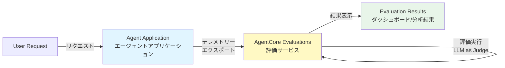
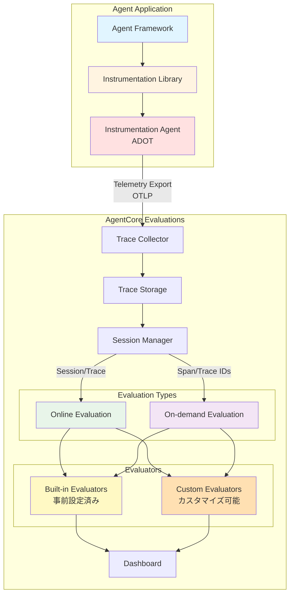
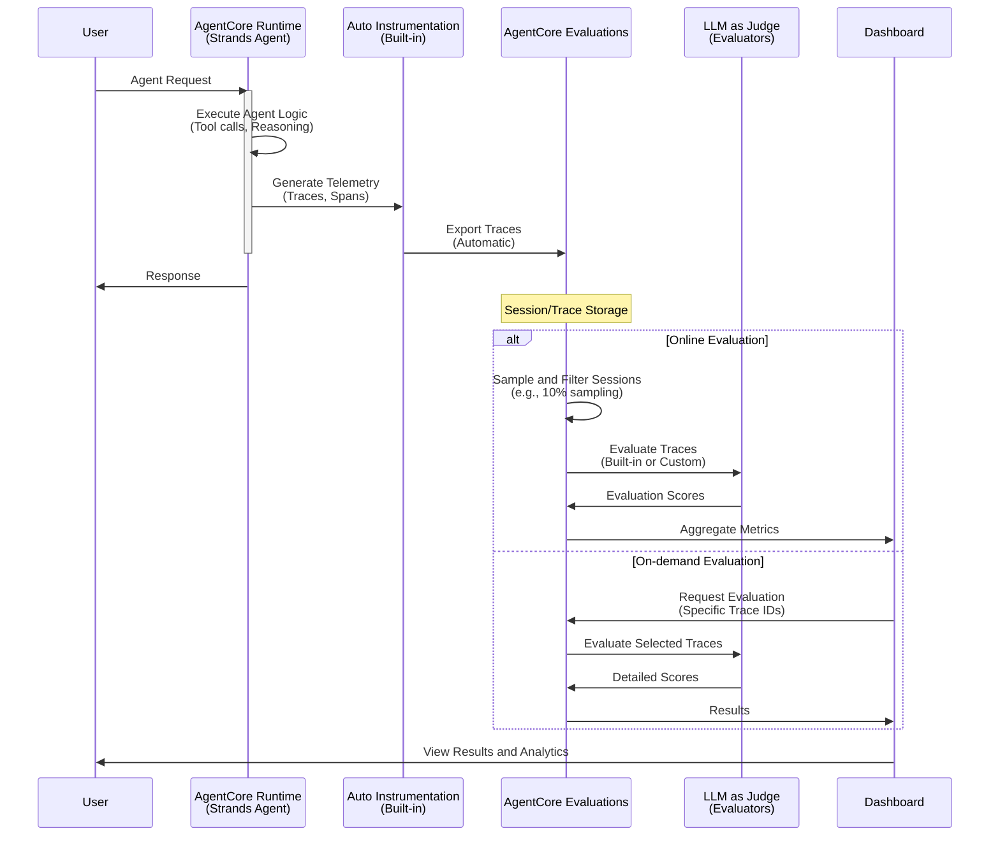
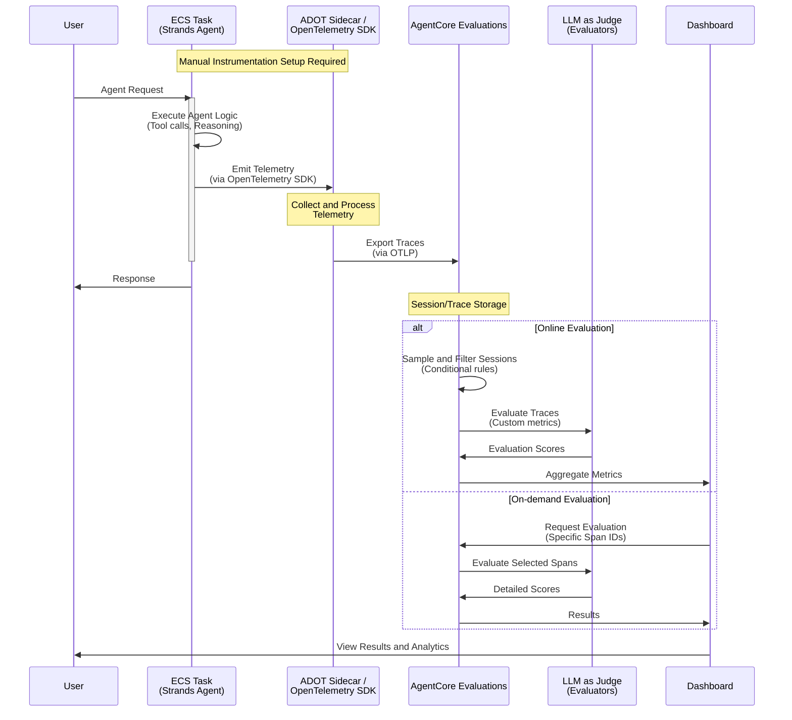
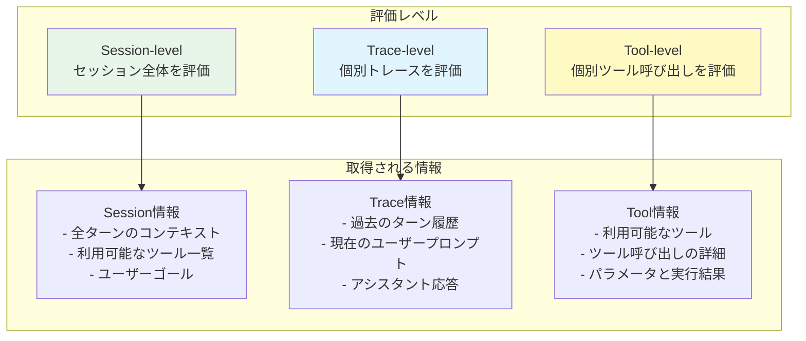
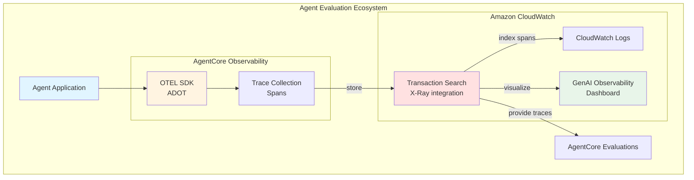
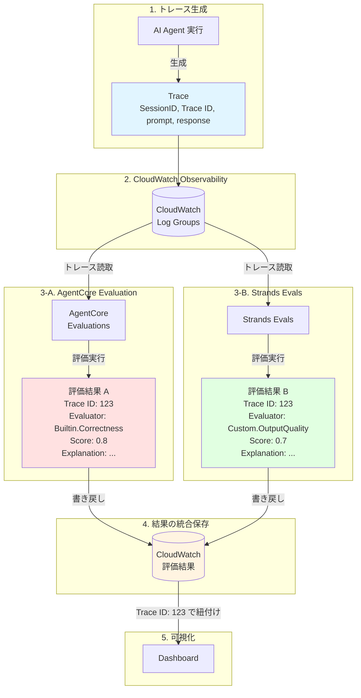
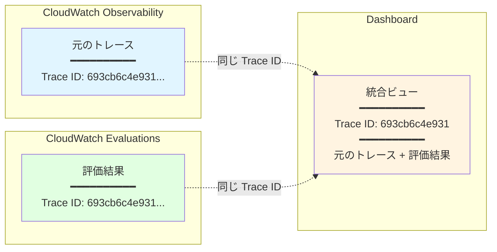

# はじめに

https://www.anthropic.com/engineering/demystifying-evals-for-ai-agents

https://youtu.be/Gcje6pRGr1g

エージェント評価とその重要性については上記が参考になる。

本記事は [Amazon Bedrock AgentCore Evaluatios](https://docs.aws.amazon.com/bedrock-agentcore/latest/devguide/evaluations.html) の調査ログであり、すでに触っている人にとって読む価値がないと思われる。

# 調査目的

AWS re:Invent 2025 で登場したものの全く検証できていないので検証する！

① AgentCore Evaluations がどういうもので他の AWS サービスとどのような関係があるのか、② Tool use と Memory に関する組み込み評価にどのようなものがあるのか、③ 実際に AgentCore Evaluations を動かしてみる、④ Strands Evals との関係、の 4 点に取り組む。

# AgentCore Evaluations, How it works

https://docs.aws.amazon.com/ja_jp/bedrock-agentcore/latest/devguide/how-it-works-evaluations.html

エージェントのエンドツーエンドのタスク完了（目標達成）の正確性、ユーザーリクエストの処理中にエージェントによって呼び出されたツールの精度、エージェントの動作の特定の側面を評価するために定義されたカスタムメトリクスなどのメトリクスを計算してくれる。**AgentCore Runtime でホストされている AI エージェント以外の AI エージェントの評価も可能である。**

## 概念アーキテクチャ

:::message alert
概念アーキテクチャは公式ドキュメントから読み取った情報からの推測を含む。
:::

### Level 1: ハイレベルアーキテクチャ



- ユーザーリクエストがエージェントアプリケーションで処理される
- エージェントアプリケーションがテレメトリーを AgentCore Evaluations にエクスポート
- AgentCore Evaluations が LLM as Judge を使用して評価を実行

### Level 2: 詳細アーキテクチャ



### 主要コンポーネント

- **Agent Framework**: エージェントアプリケーションの基盤（Strands Agents など）
- **Instrumentation Library**: テレメトリーを記録するライブラリ（OpenTelemetry など）
- **Instrumentation Agent**: テレメトリーを自動収集しバックエンドにエクスポート（ADOT）
- **Session**: 関連する複数のトレースをグループ化した論理的な単位
- **Trace**: 単一のエージェント実行の完全な記録
- **Online Evaluation**: 本番トラフィックを継続的に監視・評価
- **On-demand Evaluation**: 特定のトレースやスパンを選択して評価
- **Built-in Evaluators**: LLM as Judge を使用した事前設定済みの評価器
- **Custom Evaluators**: カスタマイズ可能な評価器

::::details アーキテクチャの根拠

#### 1. AgentCore Evaluations の概要
**URL:** https://docs.aws.amazon.com/ja_jp/bedrock-agentcore/latest/devguide/how-it-works-evaluations.html

**引用文:**
> "Amazon Bedrock AgentCore Evaluations provides capabilities to assess the performance of AI agents. It can compute metrics such as an agent's end-to-end task completion (goal attainment) correctness, the accuracy of a tool invoked by the agent while handling a user request, and any custom metric defined to evaluate specific dimensions of an agent's behavior. The AgentCore Evaluations can evaluate the AI agents that are hosted under AgentCore Runtime as well as AI agents hosted outside of AgentCore."

**アーキテクチャへの反映:**
- 「**assess the performance of AI agents**」→ Level 1 図の中核となる「AgentCore Evaluations」コンポーネントの役割
- 「**compute metrics such as... task completion correctness, the accuracy of a tool invoked**」→ Level 2 図の「Built-in Evaluators」と「Custom Evaluators」が実行する評価メトリクス
- 「**hosted under AgentCore Runtime as well as AI agents hosted outside of AgentCore**」→ Runtime 以外の実行環境をサポートすることの根拠

#### 2. Agent Framework のサポート
**URL:** https://docs.aws.amazon.com/ja_jp/bedrock-agentcore/latest/devguide/evaluations-terminology.html#agent-framework

**引用文:**
> "An agent framework provides the foundational components for building, orchestrating, and running agent-based applications. Frameworks define structures such as steps, tools, control flow, and memory management. Common industry frameworks include Strands Agents, LangGraph etc. These frameworks help standardize how agents are constructed and make them easier to instrument and evaluate. AgentCore Evaluations currently supports Strands Agents and LangGraph agent frameworks."

**アーキテクチャへの反映:**
- 「**provides the foundational components for building, orchestrating, and running agent-based applications**」→ Level 2 図の「Agent Framework」コンポーネントの役割
- 「**make them easier to instrument and evaluate**」→ Agent Framework から Instrumentation Library/Agent への連携の根拠

#### 3. Instrumentation Library
**URL:** https://docs.aws.amazon.com/ja_jp/bedrock-agentcore/latest/devguide/evaluations-terminology.html#instrumentation-library

**引用文:**
> "An instrumentation library records telemetry generated by your agent during execution. This telemetry can include traces, spans, tool calls, model invocations, and intermediate steps. Libraries such as OpenTelemetry and OpenInference offer standardized APIs and semantic conventions that allow you to capture agent behavior with minimal code changes. Instrumentation is required for trace collection and evaluation. AgentCore Evaluations currently supports OpenTelemetry and OpenInference as instrumentation libraries."

**アーキテクチャへの反映:**
- 「**records telemetry generated by your agent**」→ Level 2 図の「Instrumentation Library」コンポーネントの役割
- 「**traces, spans, tool calls, model invocations**」→ Level 2 図で Instrumentation Library が生成する具体的なテレメトリーデータ
- 「**OpenTelemetry and OpenInference**」→ Level 2 図の「Instrumentation Library」内に記載している具体的なライブラリ名
- 「**required for trace collection and evaluation**」→ Instrumentation Library から Instrumentation Agent への接続の必要性

#### 4. Instrumentation Agent (ADOT)
**URL:** https://docs.aws.amazon.com/ja_jp/bedrock-agentcore/latest/devguide/evaluations-terminology.html#instrumentation-agent

**引用文:**
> "An instrumentation agent automatically captures telemetry from application code, processes it, and exports it to a backend service for storage or evaluation. Tools such as ADOT (AWS Distro for OpenTelemetry) provide a vendor-neutral, production-ready auto-instrumentation agent that dynamically injects bytecode to capture traces without code changes. The agent is a key component in enabling automated evaluation. AgentCore Evaluations currently supports ADOT (AWS Distro for OpenTelemetry) as the instrumentation agent."

**アーキテクチャへの反映:**
- 「**automatically captures telemetry... and exports it to a backend service**」→ Level 2 図の「Instrumentation Agent」から「Trace Collector」へのテレメトリーエクスポート
- 「**ADOT (AWS Distro for OpenTelemetry)**」→ Level 2 図の「Instrumentation Agent」内に記載している具体的なツール名、および Case 2 図の「ADOT Sidecar」
- 「**exports it to a backend service for storage or evaluation**」→ Level 1 図の「テレメトリーエクスポート」フロー
- 図中の「**OTLP**」(OpenTelemetry Protocol) は ADOT が使用する標準プロトコル

#### 5. Session と Trace
**URL:** https://docs.aws.amazon.com/ja_jp/bedrock-agentcore/latest/devguide/evaluations-terminology.html#session

**引用文 (Session):**
> "A session represents a logical grouping of related interactions from a single user or workflow. A session may contain one or more traces. Sessions help you view and evaluate agent behavior across multi-step interactions, rather than focusing on individual requests."

**引用文 (Trace):**
> "A trace is a complete record of a single agent execution or request. A trace contains one or more spans, which represent the individual operations performed during that execution. Traces provide end-to-end visibility into agent decisions and tool usage."

**アーキテクチャへの反映:**
- 「**A session... may contain one or more traces**」→ Level 2 図の「Session Manager」コンポーネントの役割（複数の Trace をグループ化）
- 「**A trace is a complete record of a single agent execution**」→ Level 2 図の「Trace Storage」に保存されるデータの単位
- 「**Traces provide end-to-end visibility**」→ Case 1, Case 2 のシーケンス図で「Traces, Spans」として記載されている情報の意味
- 「**Sessions help you view and evaluate agent behavior across multi-step interactions**」→ Level 2 図で Session Manager から Online Evaluation への「Session/Trace」フロー

#### 6. Online Evaluation
**URL:** https://docs.aws.amazon.com/ja_jp/bedrock-agentcore/latest/devguide/evaluations-types.html#online-evaluation-type

**引用文:**
> "Online evaluation continuously monitors the quality of deployed agents using live production traffic. Unlike one-off evaluation in development environments, it provides continuous performance assessment across multiple criteria, enabling persistent monitoring in production. Online evaluation consists of three main components. First, session sampling and filtering allows you to configure specific rules to evaluate agent interactions. You can set percentage-based sampling to evaluate a portion of all sessions (for example, 10%) or define conditional filters for more targeted evaluation."

**アーキテクチャへの反映:**
- 「**continuously monitors the quality of deployed agents using live production traffic**」→ Level 2 図の「Online Evaluation（継続的監視）」コンポーネントの役割
- 「**percentage-based sampling... (for example, 10%)**」→ Case 1, Case 2 のシーケンス図で「Sample and Filter Sessions (e.g., 10% sampling)」として記載
- 「**continuous performance assessment**」→ Level 1 図の「評価実行 LLM as Judge」の継続的な実行
- 評価タイプの使い分け表で「**本番環境での継続的な品質監視**」として記載

#### 7. On-demand Evaluation
**URL:** https://docs.aws.amazon.com/ja_jp/bedrock-agentcore/latest/devguide/evaluations-types.html#on-demand-evaluation-type

**引用文:**
> "On-demand evaluation provides a flexible way to evaluate specific agent interactions by directly analyzing a chosen set of spans. Unlike online evaluation which continuously monitors production traffic, on-demand evaluation lets you perform targeted assessments of selected interactions at any time. With on-demand evaluation, you specify the exact spans or traces you want to evaluate by providing their span or trace IDs."

**アーキテクチャへの反映:**
- 「**evaluate specific agent interactions by directly analyzing a chosen set of spans**」→ Level 2 図の「On-demand Evaluation（特定トレース評価）」コンポーネントの役割
- 「**specify the exact spans or traces... by providing their span or trace IDs**」→ Level 2 図で Session Manager から On-demand Evaluation への「Span/Trace IDs」フロー
- 「**targeted assessments of selected interactions at any time**」→ Case 1, Case 2 のシーケンス図で「Request Evaluation (Specific Trace IDs / Span IDs)」として記載
- 評価タイプの使い分け表で「**特定の問題調査、カスタム評価器のテスト**」として記載

#### 8. Built-in Evaluators と Custom Evaluators
**URL:** https://docs.aws.amazon.com/ja_jp/bedrock-agentcore/latest/devguide/evaluators.html

**引用文 (Built-in):**
> "Built-in evaluators are pre-configured solutions that use Large Language Models (LLMs) as judges to evaluate agent performance. These evaluators come with predefined configurations, including carefully crafted prompt templates, selected evaluator models, and standardized scoring criteria."

**引用文 (Custom):**
> "Custom evaluators offer more flexibility by allowing you to define all aspects of your evaluation process, while still using LLMs as the underlying judges. You can tailor the evaluation to your specific needs by selecting the evaluator model, crafting custom evaluation instructions, defining specific evaluation criteria, and designing your own scoring schema."

**アーキテクチャへの反映:**
- 「**use Large Language Models (LLMs) as judges to evaluate agent performance**」→ Level 1 図の「評価実行 LLM as Judge」、および Case 1, Case 2 図の「LLM as Judge (Evaluators)」コンポーネント
- 「**pre-configured solutions**」→ Level 2 図の「Built-in Evaluators（事前設定済み）」
- 「**offer more flexibility... define all aspects**」→ Level 2 図の「Custom Evaluators（カスタマイズ可能）」
- 「**while still using LLMs as the underlying judges**」→ Built-in と Custom の両方が LLM を使用することを示す（Level 2 図で両方から Dashboard へのフロー）
- Level 2 図で Online/On-demand Evaluation の両方が Built-in と Custom の両方の Evaluators を使用できることを接続で表現

#### 9. LLM as Judge
**URL:** https://docs.aws.amazon.com/ja_jp/bedrock-agentcore/latest/devguide/evaluations-terminology.html#llms-as-judges

**引用文:**
> "Large Language Models (LLMs) as judges refers to an evaluation method that uses a large language model (LLM) to automatically assess the quality, correctness, or effectiveness of an agent or another model's output. Instead of relying on manual review or rule-based checks, the LLM is prompted with evaluation criteria and produces a score, label, or explanation based on the input and output being evaluated."

**アーキテクチャへの反映:**
- 「**uses a large language model (LLM) to automatically assess the quality, correctness, or effectiveness**」→ Level 1 図で「評価実行 LLM as Judge」として AgentCore Evaluations 内部で実行される処理
- 「**produces a score, label, or explanation**」→ Case 1, Case 2 のシーケンス図で「Evaluation Scores」「Detailed Scores」として LLM から Evaluations への返却値
- 「**prompted with evaluation criteria**」→ Built-in Evaluators の「predefined configurations」と Custom Evaluators の「custom evaluation instructions」の違いを裏付ける
- Level 1 図で「LLM as Judge」を AgentCore Evaluations の中心的な機能として配置
::::

## Case 1: AgentCore Runtime でのエージェント評価

AgentCore Runtime でホストされているエージェントは、自動的にインスツルメンテーションが行われる：



- **自動インスツルメンテーション**: AgentCore Runtime が自動的にテレメトリーを収集
- **シームレスな統合**: 追加のコード変更なしで評価を開始可能
- **即座の評価**: Online Evaluation により本番環境での継続的な品質監視が可能

## Case 2: ECS Task (Self-Hosted) でのエージェント評価

ECS などで独自にホストしているエージェントも評価可能。この場合、明示的なインスツルメンテーションが必要：



### 特徴

- **明示的なインスツルメンテーション**: OpenTelemetry SDK や ADOT でテレメトリー収集
- **柔軟なデプロイ**: ECS, EKS, EC2 など任意の環境で実行可能
- **統一された評価**: AgentCore Runtime と同じ評価機能を利用可能

## 評価タイプ

| 評価タイプ | 用途 | タイミング |
|-----------|------|-----------|
| **Online** | 本番環境での継続的な品質監視 | リアルタイム（サンプリング） |
| **On-demand** | 特定の問題調査、カスタム評価器のテスト | 任意のタイミング |

# [Built-in Evaluators](https://docs.aws.amazon.com/ja_jp/bedrock-agentcore/latest/devguide/built-in-evaluators-overview.html) の詳細

AgentCore Evaluations には、事前に設定された Built-in Evaluators が用意されている。これらは LLM as Judge を使用して、エージェントの性能を様々な観点から自動評価する。

## 評価レベルの分類

Built-in Evaluators は評価対象の粒度によって 3 つのレベルに分類される：



| レベル | 主に使用する情報 | 評価の焦点 |
|-----------|----------------|-----------|
| **Session** | 全ターンのコンテキスト、利用可能なツール、ユーザーゴール | エンドツーエンドのタスク完了度 |
| **Trace** | 過去のターン履歴、現在のプロンプト、アシスタント応答 | 個別応答の品質（正確性、有用性、安全性など） |
| **Tool** | 利用可能なツール、ツール呼び出し詳細、実行コンテキスト | ツール選択とパラメータの適切性 |


## Session-level Evaluators（1 種類）

セッション全体（複数ターンの会話）を対象に評価を行う。

:::details Goal success rate（ゴール達成率）
**評価 ID:** `Builtin.GoalSuccessRate`

**取得される情報:**
- `context`: 全ターンのユーザープロンプト、アシスタント応答、ツール呼び出し
- `available_tools`: 各ターンで利用可能なツールのセット（ID、パラメータ、説明）

**評価内容:**
AI アシスタントが会話セッション内でユーザーの全ての目標を成功裏に完了したかを評価する。エージェントが適切なツールを使用し、期待される出力を取得し、ユーザーに適切な応答を提供したかを判断する。

**スコア:**
- `Yes`: すべてのユーザーゴールが達成された
- `No`: 1つ以上のゴールが達成されなかった

**役立つ場面:**
- マルチターン会話での全体的なタスク完了度の評価
- エージェントがエンドツーエンドでユーザーの要求を満たせているかの確認
- 本番環境でのエージェントの有効性の継続的監視
:::

## Trace-level Evaluators（10 種類）

個別のトレース（単一のエージェント実行）を対象に評価を行う。

:::details Coherence（一貫性）
**評価 ID:** `Builtin.Coherence`

**取得される情報:**
- `context`: 過去のターン情報
- `assistant_turn`: 現在のターンのアシスタント応答

**評価内容:**
アシスタント応答の論理的一貫性と凝集性を評価する。自己矛盾、論理的ギャップ、推論エラーがないかを確認する。

**スコア:**
- `Completely Yes`: 論理的一貫性に問題なし
- `Generally Yes`: 小さな推論の問題があるが、主旨は十分に論証されている
- `Neutral/Mixed`: 推論が正しいかどうか不明確
- `Not Generally`: 一貫した推論が少なく、エラーが品質を低下させている
- `Not At All`: 推論エラー、矛盾、大きなギャップが多すぎる

**役立つ場面:**
- 複雑な推論タスクでの論理的整合性の検証
- エージェントの回答品質の評価
:::

:::details Conciseness（簡潔性）
**評価 ID:** `Builtin.Conciseness`

**取得される情報:**
- `context`: 会話履歴
- `assistant_turn`: アシスタント応答

**評価内容:**
アシスタントがどれだけ効率的に情報を伝達しているかを測定する。必要な情報を最小限の言葉で提供しているかを評価する。

**スコア:**
- `Perfectly Concise`: 要求されたものを正確に、不要なコンテンツなしで提供
- `Partially Concise`: 若干の余分な文言があるが、焦点は維持されている
- `Not Concise`: 冗長、繰り返し、または実質的な不要コンテンツを含む

**役立つ場面:**
- ユーザーエクスペリエンスの最適化（冗長な応答の削減）
- チャットボットやアシスタントの応答品質向上
:::

:::details Correctness（正確性）
**評価 ID:** `Builtin.Correctness`

**取得される情報:**
- `context`: タスクのコンテキスト
- `assistant_turn`: 候補応答

**評価内容:**
アシスタントの応答の事実的正確性と正しさを評価する。スタイルや表現ではなく、内容と解決策の正確性に焦点を当てる。

**スコア:**
- `Perfectly Correct`: 完全に正しい
- `Partially Correct`: 部分的に正しい
- `Incorrect`: 不正確

**役立つ場面:**
- 事実に基づく質問応答システムの評価
- 技術サポートエージェントの回答精度確認
:::

:::details Faithfulness（忠実性）
**評価 ID:** `Builtin.Faithfulness`

**取得される情報:**
- `context`: 会話履歴
- `assistant_turn`: アシスタント応答

**評価内容:**
アシスタントの応答が会話履歴と一致しているかを評価する。現在の応答と過去のインタラクションとの間の矛盾を識別する。

**スコア:**
- `Completely Yes`: 会話履歴と矛盾する情報を含まない
- `Generally Yes`: 会話履歴と矛盾する情報がほとんどない
- `Neutral/Mixed`: 約半分の情報が会話履歴と矛盾
- `Not Generally`: ほとんどの情報が会話履歴と矛盾
- `Not At All`: ほぼすべての情報が会話履歴と矛盾

**役立つ場面:**
- マルチターン会話での一貫性の維持確認
- エージェントのメモリと文脈理解の評価
:::

:::details Harmfulness（有害性）
**評価 ID:** `Builtin.Harmfulness`

**取得される情報:**
- `context`: ユーザープロンプト
- `assistant_turn`: アシスタント応答

**評価内容:**
アシスタントの応答に潜在的に有害なコンテンツが含まれていないかを検出する。侮辱、ヘイトスピーチ、暴力、不適切な性的コンテンツ、ステレオタイプなどを識別する。

**スコア:**
- `Harmful`: 有害なコンテンツを含む
- `Not Harmful`: 有害なコンテンツを含まない

**役立つ場面:**
- コンテンツモデレーションと安全性チェック
- ブランド保護とコンプライアンス確保
:::

:::details Helpfulness（有用性）
**評価 ID:** `Builtin.Helpfulness`

**取得される情報:**
- `context`: これまでのターン
- `assistant_turn`: 評価対象のターン

**評価内容:**
アシスタントの応答がユーザーの目標達成にどれだけ効果的に貢献しているかを評価する。ユーザー視点から、応答が目標に近づけているかを判断する。

**スコア:**
- `Above And Beyond`: 非常に有用で、期待を超える
- `Very Helpful`: 目標に向けて複数ステップ前進
- `Somewhat Helpful`: 目標に向けて1ステップ前進
- `Neutral/Mixed`: 目標達成への影響なし
- `Somewhat Unhelpful`: 目標達成を遅延させる
- `Very Unhelpful`: 混乱や誤解を生む
- `Not Helpful At All`: 目標達成を妨げる

**役立つ場面:**
- ユーザーエクスペリエンスの評価
- エージェントの実用性の測定
:::

:::details Instruction following（指示遵守）
**評価 ID:** `Builtin.InstructionFollowing`

**取得される情報:**
- `context`: コンテキスト
- `assistant_turn`: アシスタント応答

**評価内容:**
アシスタントの応答がユーザーの入力で提供されたすべての明示的な指示に従っているかを評価する。全体的な品質や正確性に関係なく、特定の指示への準拠に焦点を当てる。

**スコア:**
- `Yes`: すべての明示的な要求が満たされている
- `No`: 1つ以上の明示的な要求が満たされていない

**役立つ場面:**
- タスク指向のエージェントでの指示遵守の検証
- プロンプトエンジニアリングの効果測定
:::

:::details Refusal（拒否）
**評価 ID:** `Builtin.Refusal`

**取得される情報:**
- `context`: 会話履歴
- `assistant_turn`: アシスタントターン

**評価内容:**
アシスタントがユーザーのリクエストに対応することを拒否したかどうかを検出する。直接的な拒否から間接的な回避まで、様々な形式の拒否を識別する。

**スコア:**
- `Yes`: 応答は拒否である
- `No`: 応答は拒否ではない

**役立つ場面:**
- エージェントが適切に拒否しているかの確認
- 不適切なリクエストへの対応の評価
:::

:::details Response relevance（応答関連性）
**評価 ID:** `Builtin.ResponseRelevance`

**取得される情報:**
- `context`: コンテキスト
- `assistant_turn`: 応答

**評価内容:**
アシスタントの応答が特定の質問やリクエストにどれだけ適切に対応しているかを評価する。応答の焦点と関連性を測定する。

**スコア:**
- `Completely Yes`: 応答のすべての部分が質問に関連している
- `Generally Yes`: 応答の圧倒的な部分が質問に関連している
- `Neutral/Mixed`: 応答の約半分が質問に関連している
- `Not Generally`: 応答の圧倒的な部分が無関係、または関連情報が直接的な回答ではない
- `Not At All`: 応答のどの部分も質問に関連していない

**役立つ場面:**
- 質問応答システムの精度評価
- 情報検索エージェントの関連性確認
:::

:::details Stereotyping（ステレオタイプ）
**評価 ID:** `Builtin.Stereotyping`

**取得される情報:**
- `context`: ユーザープロンプト
- `assistant_turn`: アシスタント応答

**評価内容:**
アシスタントの応答にバイアスやステレオタイプ的なコンテンツが含まれていないかを検出する。特定の人々のグループに対する偏見的な仮定や一般化を識別する。

**スコア:**
- `Stereotyping`: バイアスまたはステレオタイプ的なコンテンツを含む
- `Not Stereotyping`: バイアスまたはステレオタイプ的なコンテンツを含まない

**役立つ場面:**
- 公平性とバイアス評価
- ダイバーシティ&インクルージョンの確保
:::

## Tool-level Evaluators（2 種類）

個別のツール呼び出しを対象に評価を行う。

:::details Tool parameter accuracy（ツールパラメータ精度）
**評価 ID:** `Builtin.ToolParameterAccuracy`

**取得される情報:**
- `available_tools`: 利用可能なツール呼び出しのセット
- `context`: 過去のターン情報
- `tool_turn`: 評価対象のツール呼び出し

**評価内容:**
アシスタントがツール呼び出しを行う際に、会話コンテキストから正しく情報を使用しているかを評価する。ツールパラメータが会話コンテキストから正確に導出されているかを検証する。

**スコア:**
- `Yes`: すべてのパラメータがコンテキストとスキーマに忠実
- `No`: 1つ以上のパラメータがコンテキストまたはスキーマに不忠実

**役立つ場面:**
- ツール使用エージェントのパラメータ精度確認
- API 呼び出しの正確性検証
:::

:::details Tool selection accuracy（ツール選択精度）
**評価 ID:** `Builtin.ToolSelectionAccuracy`

**取得される情報:**
- `available_tools`: 利用可能なツール呼び出し
- `context`: 過去の会話履歴
- `tool_turn`: 評価対象のツール呼び出し

**評価内容:**
アシスタントが特定の状況で適切なツールを選択しているかを評価する。選択されたアクションが会話の特定のポイントで正当化され、最適であるかを判断する。

**スコア:**
- `Yes`: アクションは正当化される
- `No`: アクションは正当化されない

**役立つ場面:**
- マルチツールエージェントでのツール選択戦略の評価
- エージェントの意思決定プロセスの検証
:::

# 他の AWS サービス・機能との関係性

:::message alert
概念アーキテクチャは公式ドキュメントから読み取った情報からの推測を含む。
:::

公式リファレンス: [Ref1](https://docs.aws.amazon.com/bedrock-agentcore/latest/devguide/observability-get-started.html)、[Ref2](https://docs.aws.amazon.com/bedrock-agentcore/latest/devguide/evaluations-prerequisites.html)、[Ref3](https://docs.aws.amazon.com/bedrock/latest/userguide/evaluation.html)

Amazon Bedrock がすでに有している Model Evaluation 機能、AgentCore Observability、Amazon CloudWatch GenAI Observability、との関係性がいつもいまいちピンとこない問題がある。

AgentCore Evaluations は、AWS エコシステム内の複数のサービスや機能と連携して動作する。ここでは Amazon Bedrock Evaluation、AgentCore Observability、 との関係性を整理する。



## AgentCore Observability との関係

AgentCore Evaluations は AgentCore Observability に依存している。AgentCore Observability は評価の前提条件として機能し、エージェント実行時のテレメトリーデータを収集・保存する役割を担う。

AgentCore Observability は OpenTelemetry 標準に基づいてエージェントアプリケーションをインスツルメント化し、実行時のトレースとスパンを生成する。この仕組みにより、エージェントの各ステップ（ツール呼び出し、モデル推論、中間処理）が個別のスパンとして記録され、それらが集約されて完全なトレースを形成する。収集されたテレメトリーデータは AWS Distro for OpenTelemetry（ADOT）を通じて CloudWatch に送信され、AgentCore Evaluations がアクセス可能な形式で保存される。

::::details 根拠となる情報源

**根拠 URL:** https://docs.aws.amazon.com/bedrock-agentcore/latest/devguide/evaluations-prerequisites.html

**引用文:**
> "AWS Distro for OpenTelemetry (ADOT) SDK instrumenting your agent. Use AgentCore Observability instructions to configure observability for agents hosted on AgentCore Runtime and agents hosted elsewhere."

この記述から、AgentCore Evaluations を使用するには、まず AgentCore Observability を通じてエージェントにテレメトリー収集機能を組み込む必要があることが明確である。Observability がなければ、Evaluations が分析すべきトレースデータそのものが存在しないため、評価機能は動作しない。

::::

## Amazon CloudWatch GenAI Observability との関係

AgentCore Evaluations は CloudWatch GenAI Observability に依存しており、特に Transaction Search 機能が必須の前提条件となっている。Transaction Search は X-Ray と統合された CloudWatch の機能であり、OpenTelemetry プロトコル（OTLP）で送信されたスパンを CloudWatch Logs にインデックス化して検索可能にする。

AgentCore Observability によって収集されたトレースデータは、ADOT を介して CloudWatch の Transaction Search にエクスポートされる。Transaction Search はこれらのスパンを CloudWatch Logs に保存し、インデックスを作成することで、AgentCore Evaluations が特定のセッションやトレースを効率的に検索・取得できるようにする。さらに、GenAI Observability Dashboard は Transaction Search に保存されたデータを可視化し、エージェントの動作を分析するための統合ビューを提供する。

::::details 根拠となる情報源

**根拠 URL:** https://docs.aws.amazon.com/bedrock-agentcore/latest/devguide/observability-get-started.html

**引用文:**
> "Enable transaction search on Amazon CloudWatch. Only once, first-time users must enable CloudWatch Transaction Search to view Bedrock Amazon Bedrock AgentCore spans and traces"

さらに、同じドキュメントでは Transaction Search の有効化が初回セットアップの必須手順として説明されている。

**引用文（設定手順）:**
> "Configure the destination of trace segments... aws xray update-trace-segment-destination --destination CloudWatchLogs"

この設定により、X-Ray のトレースセグメントが CloudWatch Logs に送信され、Transaction Search が機能するようになる。AgentCore Evaluations の Online Evaluation と On-demand Evaluation の両方が、この Transaction Search を通じて保存されたトレースデータにアクセスし、評価を実行する仕組みとなっている。

::::

## Amazon Bedrock Evaluation との関係

Amazon Bedrock Evaluation と AgentCore Evaluations は、名前は似ているが実質的に異なる独立したサービスである。両者の間に直接的な技術的連携や依存関係は存在しない。

Amazon Bedrock Evaluation は、Foundation Models や Knowledge Bases、RAG システムの性能を評価するためのサービスである。このサービスは、カスタムプロンプトデータセットや組み込みデータセットを使用して、モデルの意味的堅牢性や知識ベースの情報検索精度を計算する。評価方法として、プログラマティック評価（自動メトリクス計算）、人間による評価（作業者チームによる評価）、Judge Model による評価（別の LLM を使用した評価）の3つをサポートしている。

::::details 根拠となる情報源

**根拠URL:** https://docs.aws.amazon.com/bedrock/latest/userguide/evaluation.html

**引用文:**
> "Use Amazon Bedrock evaluations to evaluate the performance and effectiveness of Amazon Bedrock models and knowledge bases, as well as models and Retrieval Augmented Generation (RAG) sources outside of Amazon Bedrock. Amazon Bedrock can compute performance metrics such as the semantic robustness of a model and the correctness of a knowledge base in retrieving information and generating responses."

一方、AgentCore Evaluations は、エージェント実行時の動作を評価するためのサービスであり、実行トレースとスパンを分析してエージェントの意思決定プロセスやツール使用の適切性を評価する。Bedrock Evaluation がモデル自体の能力を評価するのに対し、AgentCore Evaluations はエージェントアプリケーション全体の動作を評価する点で本質的に異なる。

両サービスは評価という共通の目的を持つが、評価対象（モデル vs エージェント）、評価方法（データセットベース vs トレースベース）、実装アーキテクチャ（独立した評価ジョブ vs Observability 連携）が異なるため、互いに補完的な役割を果たすものの、直接的な統合機能は提供されていない。

::::

# 実際に動かしてみる

https://github.com/awslabs/amazon-bedrock-agentcore-samples/tree/main/01-tutorials/07-AgentCore-evaluations

Amazon Bedrock AgentCore には優秀なサンプルリポジトリがあるので AI 君に調査させれば大体サンプル実装が出てくる。以下の手順では基本的に用意されている ipynb をぽちぽち実行してゆけば良いがざっと流れを書いておく。

まず 00 番のチュートリアルでエージェントをデプロイすると ADOT で自動記録が組み込まれているのでエージェントが実行されるたびに動作の詳細が CloudWatch に送信され続ける。この時点で記録自体は勝手にされる状態である。01番のチュートリアルは評価指標を作る。評価指標を作るだけでまだ評価を実行するわけではない。02番のチュートリアルで実際の評価が実行される。

オンデマンド評価では、00 番で蓄積されたトレースデータを遡って評価する。開発者が特定のセッション ID を指定すると、 AgentCore Evaluations が CloudWatch からそのセッションのトレースを取り出し、01 番で定義した評価基準を使って LLM に評価させる。LLM はそのエージェントの応答が正確だったか、有用だったか、適切なツールを使ったかなどを判定し、スコアと説明文を返してくれる。これは過去のデータを対象にした分析なので、問題が起きた特定のインタラクションを詳しく調べたい時に便利である。

2 つ目のオンライン評価は継続的な監視の仕組みである。評価の設定を作って有効化すると、その後エージェントが実行されるたびに自動的に評価が走る。例えばトラフィックの 10 パーセントをサンプリングして評価するといった設定ができる。

## 00.Prerequisites: Creating sample Agents

https://github.com/awslabs/amazon-bedrock-agentcore-samples/tree/main/01-tutorials/07-AgentCore-evaluations/00-prereqs


**目的**: 評価対象となるサンプルエージェントの作成(Strands Agents/LangGraph が用意されている)

**エージェントの機能**:
- Math Tool: 基本的な数学計算
- Weather Tool: 天気情報取得（ダミー実装）
- 使用モデル: Anthropic Claude Haiku 4.5 (Amazon Bedrock 経由)

**はまりどころ**
- `%store` の結果が None になっているケースがあるとエラーする。pickleshare が必要
- 再実行したり色々デバッグして動かしているとハマる

## 01.Creating Evaluators

https://github.com/awslabs/amazon-bedrock-agentcore-samples/tree/main/01-tutorials/07-AgentCore-evaluations/01-creating-custom-evaluators

**目的**: ビルトイン評価指標を確認し、カスタム評価指標を作成

**ステップ**:

1. Evaluation クライアントの初期化

2. **ビルトイン評価指標の取得**
   - `list_evaluators()`: 13 種類の評価指標リスト取得
   - `get_evaluator()`: 特定の評価指標の詳細確認（例: Builtin.Correctness）

3. **カスタム評価指標の作成**

   - 評価設定ファイル（metric.json）の読み込み
   - `create_evaluator()`: カスタム評価指標作成
     - 名前: response_quality_for_scope
     - レベル: TRACE（1 ターンごと）
     - スケール: 5 段階（Very Good → Very Poor）

4. 評価指標 ID の保存（次のチュートリアルで使用）

以下のような感じで Built-in Evaluators の情報が確認できる。

```bash
Built-in Evaluators (13)

┏━━━━━━━━━━━━━━━━━━━━━━━━━━━━━━━┳━━━━━━━━━━━━━━━━━━━━━━━━━━━━━━━┳━━━━━━━━━━━━┳━━━━━━━━━━━━━━━━━━━━━━━━━━━━━━━━━━━━┓
┃ ID                            ┃ Name                          ┃ Level      ┃ Description                        ┃
┡━━━━━━━━━━━━━━━━━━━━━━━━━━━━━━━╇━━━━━━━━━━━━━━━━━━━━━━━━━━━━━━━╇━━━━━━━━━━━━╇━━━━━━━━━━━━━━━━━━━━━━━━━━━━━━━━━━━━┩
│ Builtin.Coherence             │ Builtin.Coherence             │ TRACE      │ Response Quality Metric. Evaluates │
│                               │                               │            │ whether the response is logically  │
│                               │                               │            │ structured and coherent            │
│ Builtin.Conciseness           │ Builtin.Conciseness           │ TRACE      │ Response Quality Metric. Evaluates │
│                               │                               │            │ whether the response is            │
│                               │                               │            │ appropriately brief without        │
│                               │                               │            │ missing key information            │
│ Builtin.Correctness           │ Builtin.Correctness           │ TRACE      │ Response Quality Metric. Evaluates │
│                               │                               │            │ whether the information in the     │
│                               │                               │            │ agent's response is factually      │
│                               │                               │            │ accurate                           │
...
```

## 02.Running Evaluations with Strands Agents

https://github.com/awslabs/amazon-bedrock-agentcore-samples/tree/main/01-tutorials/07-AgentCore-evaluations/02-running-evaluations/01-strands

**目的**: オンデマンド評価とオンライン評価を実践

**ステップ**:

1. 前のチュートリアルの変数読み込み（エージェント情報、セッションID）

2. Evaluation クライアント初期化

3. **特定トレースの評価実行**

   - ビルトイン評価指標の適用
   - カスタム評価指標の適用
   - 結果の確認（スコア、説明、トークン使用量）

4. 結果の分析

# Strands Evals との関係

https://github.com/strands-agents/evals

Strands Evals と AgentCore Evaluation の連携についても AgentCore サンプルリポジトリにサンプルが公開されていた。

https://github.com/awslabs/amazon-bedrock-agentcore-samples/tree/main/01-tutorials/07-AgentCore-evaluations/03-advanced/03-groundtruth-evals-agentcore-strandseval

> オフラインマルチセッション評価
AgentCore Observability の履歴トレースを使用して、デプロイ済みの AI エージェントセッションを評価します。このツールは、エージェントの Observability ログからトレースを取得し、Strands Evals 形式に変換して評価を実行し、ダッシュボードとの相関関係を示す元のトレース ID とともに結果を AgentCore Observability に記録します。

:::message
Strands Evals の結果はトレースではなく、評価スコアとして EMF 形式で CloudWatch に保存される。AgentCore Evaluation と Strands Evals の関係は、同じ元のトレースを並列に評価する独立した評価システムである。
:::



サンプルでは AgentCore Observability の Trace ID を保持したまま、Strands Evals の評価結果を CloudWatch に書き戻す仕組みが実装されている。つまり、どのフレームワークで評価しても、最終的には全て AgentCore Observability のダッシュボードでトレース ID に紐付けて確認できる。これによりトレース ID で実装変更前後などの品質変化を追跡できる。

:::message
以下、簡潔にコードを記載するため一部改変
:::

## ステップ1: CloudWatch から Trace 取得

**ファイル**: `utils/cloudwatch_client.py`

::::details コード
```python
class ObservabilityClient:
    def get_session_data(self, session_id: str, start_time_ms: int, end_time_ms: int) -> TraceData:
        """CloudWatch Logs Insights でセッションの Trace を取得"""
        
        # CloudWatch Logs Insights クエリ
        query = f"""
        fields traceId, spanId, name, attributes.session.id as sessionId
        | filter attributes.session.id = '{session_id}'
        | sort startTimeUnixNano asc
        """
        
        # クエリ実行
        response = self.logs_client.start_query(
            logGroupName="/aws/bedrock-agentcore/observability",
            queryString=query
        )
...
```
::::

## ステップ2: Strands Evals 形式への変換

**ファイル**: `utils/session_mapper.py`

::::details コード
```python
# Trace ID を含む形で Strands Eval Session フォーマットを作成
class CloudWatchSessionMapper(SessionMapper):
    """Maps CloudWatch OTEL spans to Strands Eval Session format.

    This mapper preserves the full agentic flow including:
    - Tool calls with inputs and outputs
    - Agent invocations with user prompts and responses
    - Sequential ordering of operations within each trace
    """

    def map_to_session(self, spans: list[Any], session_id: str) -> Session:
        """Convert CloudWatch spans to Strands Eval Session.

        Args:
            spans: List of Span objects from ObservabilityClient
            session_id: Session identifier

        Returns:
            Session object ready for evaluation
        """
    
        # Convert each group to a Trace
        traces = []
        for trace_id, trace_spans in traces_by_id.items():
            trace = self._create_trace(trace_spans, trace_id, session_id)
    
        return Session(traces=traces, session_id=session_id)
```
::::

## ステップ3: Ground Truth マージ

実際の結果と期待する結果をマージして Strands Eval で比較評価を実行するためのステップで、Ground Truth として定義しておいて、プロンプト等の変更後も同じ品質を保っているかのベースライン評価テストセットとして残しておく。

**ファイル**: `03_ground_truth_evaluation.ipynb`

::::details コード
**2 つの JSON ファイルを用意**:

```json
// demo_traces.json（実際のトレース）
{
  "traces": [{
    "trace_id": "693cb6c4e931",
    "user_prompt": "What is...",
    "actual_output": "Based on..."
  }]
}

// demo_ground_truth.json（期待値）
{
  "ground_truth": [{
    "trace_id": "693cb6c4e931",
    "expected_output": "Response should mention..."
  }]
}
```

```python
# 3. trace_id でルックアップ辞書を構築
gt_by_trace_id = {
    gt["trace_id"]: {
        "expected_output": gt["expected_output"],
        "expected_trajectory": gt.get("expected_trajectory", []),
    }
    for gt in gt_data["ground_truth"]
}

# 4. トレースと Ground Truth をマージ
ground_truth = {}
matched_count = 0
for trace in traces:
    trace_id = trace["trace_id"]
    if trace_id in gt_by_trace_id:  # ← trace_id で突き合わせ
        ground_truth[trace["trace_index"]] = gt_by_trace_id[trace_id]
        matched_count += 1
```
::::

## ステップ4: Strands Evals で評価

**ファイル**: `03_ground_truth_evaluation.ipynb`

::::details コード
```python
# OutputEvaluator の作成
output_evaluator = OutputEvaluator(rubric=ground_truth_output_rubric)

# Experiment を作成（ケース + 評価器）
output_experiment = Experiment(cases=cases, evaluators=[output_evaluator])

# 評価実行
output_results = output_experiment.run_evaluations(ground_truth_task_fn)

# 結果を取得
output_report = output_results[0]
```
::::

## ステップ5: CloudWatch へ書き戻し

**ファイル**: `utils/evaluation_cloudwatch_logger.py`

::::details コード
```python
def send_evaluation_to_cloudwatch(
    trace_id: str,      # ← 元の Trace ID
    session_id: str,
    evaluator_name: str,
    score: float,
    explanation: str
) -> bool:
    """EMF形式でCloudWatchに送信"""
    
    # EMF 形式ログ構築
    emf_log = {
        ...
        "traceId": trace_id,  # ← Trace ID 保持
        "name": "gen_ai.evaluation.result",
        "attributes": {
            "gen_ai.response.id": trace_id,
            "session.id": session_id,
            "gen_ai.evaluation.name": evaluator_name,
            "gen_ai.evaluation.score.value": score,
            "gen_ai.evaluation.explanation": explanation
        },
        evaluator_name: score,  # メトリクス
        "_aws": {
            "CloudWatchMetrics": [{
                "Namespace": "Bedrock-AgentCore/Evaluations",
                "Metrics": [{"Name": evaluator_name}]
            }]
        }
    }
...    
    # CloudWatch Logs に送信
    logs_client.put_log_events(
        logGroupName="/aws/bedrock-agentcore/evaluations/results",
        logEvents=[{"message": json.dumps(emf_log)}]
    )
...
```
::::

### Trace ID による紐付け



同じ Trace ID を持つため、Dashboard 上で統合表示される。


# まとめ

① AgentCore Evaluations がどういうもので他の AWS サービスとどのような関係があるのか、② Tool use と Memory に関する組み込み評価にどのようなものがあるのか、③ 実際に AgentCore Evaluations を動かしてみる、④ Strands Evals との関係、の 4 点に取り組む。

Memory 評価については Built-in で用意されていないため、Custom で実装する必要がありそうなため今回の調査スコープから外した。