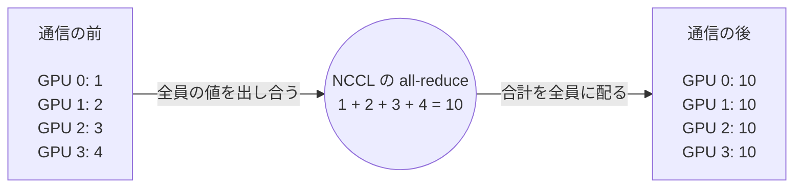
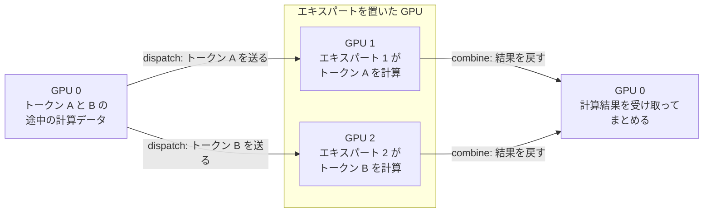
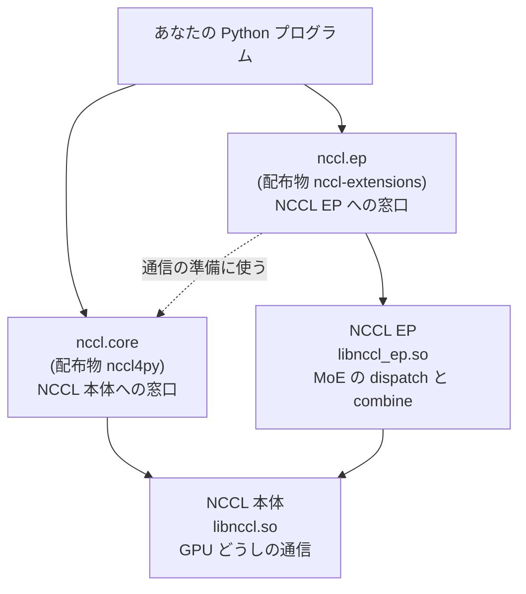
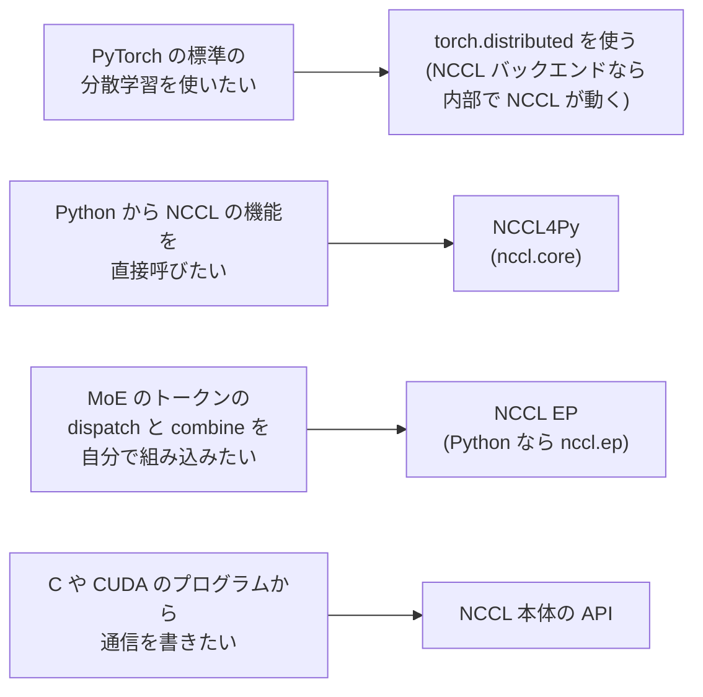
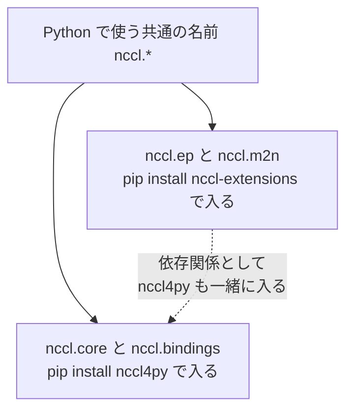
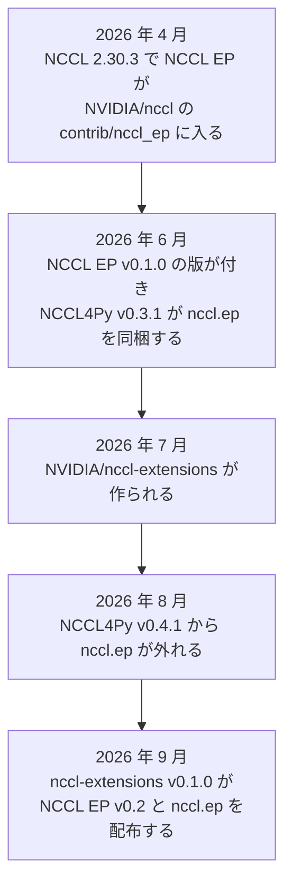

# はじめに

NVIDIA の [NCCL のリリース一覧](https://github.com/NVIDIA/nccl/releases)を開くと、`v2.32.3-1` のような NCCL 本体の版に混じって、`nccl4py-v0.3.1` や `nccl-ep-v0.1.0` という名前の版が並んでいます。名前がよく似ているので、初めて見た人には、どれが何なのか、どれを入れればよいのかが分かりにくいと思います。

この記事の結論は次のとおりです。NCCL は GPU どうしの通信を受け持つ本体です。NCCL4Py は、その本体を Python から呼ぶための公式の窓口です。NCCL EP は、本体の上に作られた、MoE というモデルの通信を速くするための専用の部品です。MoE は、モデルの中に「エキスパート」と呼ぶ計算の部品をたくさん持ち、入力ごとに使う部品を選んで計算するモデルの形です。

記事の前半では 3 つの役割と使い分けを図で説明し、後半では実際に入れる人のために、配布物の名前と版の注意点を説明します。内容は 2026 年 10 月 1 日時点のリリースノートとソースに基づいています。

:::message
この記事には、種類の違う名前が出てきます。`nccl4py` と `nccl-extensions` は、pip で入れる配布物の名前です。`nccl.core` と `nccl.ep` は、Python のコードで `import` する名前です。`libnccl.so` と `libnccl_ep.so` は、実際の処理を受け持つライブラリのファイル名です。
:::

# NCCL: GPU どうしの通信を受け持つ本体

NCCL は、NVIDIA が作っている GPU どうしの通信ライブラリです。たくさんの GPU で 1 つのモデルを学習するとき、分散学習のプログラムは、各 GPU が計算した結果を足し合わせたり、必要な GPU へ配り直したりします。NCCL は、この GPU 間のデータのやり取りを速く行うための部品です。

代表的な処理が all-reduce です。all-reduce は、通信に参加する各 GPU のデータを、足し算などの決められた計算でまとめ、同じ結果を参加したすべての GPU に渡す操作です。次の図は、4 枚の GPU が足し算で all-reduce をする例です。



図の中央の丸は処理の意味を表したもので、特定の 1 枚の GPU にデータを集めて計算するという意味ではありません。

NCCL は、C 言語から呼べる API (プログラムが機能を呼び出すための約束事) を持つライブラリで、中身は C++ と CUDA で書かれています。Linux では、`libnccl.so` というライブラリのファイルが NCCL の機能を提供します。PyTorch の `torch.distributed` は、NVIDIA の GPU で NCCL を通信の方式 (バックエンド) に選ぶと、内部で NCCL を使います。そのため、多くの人は NCCL の関数を直接呼ばずに、PyTorch を通して NCCL を使っています。

NCCL は all-reduce のような集団通信に加えて、Device API も持っています。Device API は、GPU の上で動く計算プログラム (カーネル) の途中から、ほかの GPU との通信を直接始めるための仕組みです。次に説明する NCCL EP は、この Device API の上に作られています。

# NCCL EP: MoE の通信を速くする専用の部品

NCCL EP の EP は Expert Parallelism (エキスパート並列) の略です。エキスパート並列では、MoE のエキスパートを複数の GPU に分けて置きます。文章は、トークンと呼ぶ単位 (単語や単語の一部) に区切って処理されます。MoE の層では、トークンごとに使うエキスパートが選ばれるので、各 GPU は、トークンの途中の計算データを、選ばれたエキスパートがある GPU へ送ります。エキスパートが計算したあと、結果は元の GPU へ戻ります。



トークンを担当の GPU へ配る操作を dispatch、結果を元の GPU へ戻してまとめる操作を combine と呼びます。NCCL EP は、この 2 つの操作 (`ncclEpDispatch` と `ncclEpCombine`) を提供するライブラリで、実体は `libnccl_ep.so` です。エキスパートの計算そのものは NCCL EP の仕事ではなく、NCCL EP はデータを送って戻す部分だけを受け持ちます。図は分かりやすさのために単純にしています。実際には 1 つのトークンが複数のエキスパートに送られることが多く、combine はそれらの結果を合わせます。また、図は GPU 0 から見た流れだけを抜き出したもので、実際にはすべての GPU がトークンとエキスパートの両方を持ち、全 GPU の間で同時にやり取りします。

[NCCL EP の README](https://github.com/NVIDIA/nccl-extensions/blob/nccl-extensions-v0.1.0/nccl_ep/README.md) によると、NCCL EP には 2 つのモードがあります。Low-Latency モードは、1 回に流すトークンが少なく待ち時間が大事な処理 (LLM の推論) 向けとされています。High-Throughput モードは、たくさんのトークンをまとめて流す処理向けで、学習や、推論で最初に入力をまとめて読む段階 (プリフィル) 向けとされています。2 つを合わせて読むと、Low-Latency モードは主に、推論で 1 トークンずつ文章を作る段階を想定していると考えられます。

# NCCL4Py: Python から NCCL を呼ぶ公式の窓口

NCCL4Py は、NCCL 本体の関数を Python から呼べるようにした公式の窓口です。NCCL 2.29.2 で実験的な機能として入り、その後は NCCL 本体とは別の番号 (0.x 系) で版を重ねています。Python のコードからは `nccl.core` という名前で読み込みます。

NCCL4Py の各版は、特定の版の NCCL に合わせて作られています。たとえば v0.5.0 は NCCL 2.31.2 に、v0.6.0 は NCCL 2.32.3 に合わせて作られています。v0.3.1 からは、Python で GPU のカーネルを書くための NVIDIA の仕組みである CuTe DSL から NCCL の Device API を呼ぶ機能 (`nccl.core.device.cute`) も入りました。この機能はまだ実験的な扱いです。

# 3 つの関係を 1 枚の図で見る

ここまでの 3 つの関係を 1 枚の図にまとめます。図の矢印は、呼び出す側から呼び出される側へ向いています。



NCCL4Py と NCCL EP は、どちらも NCCL 本体を使います。NCCL4Py は Python から NCCL 本体を呼ぶ窓口で、NCCL EP は NCCL 本体の上で MoE の通信を組み立てる部品です。Python から NCCL EP を使うときは、NCCL4Py とは別の配布物である nccl-extensions に入っている `nccl.ep` を通します。`nccl.ep` は NCCL4Py に依存していて (図の点線)、NCCL4Py の communicator (通信に参加する GPU の組) をもとに NCCL EP の準備をします。そのため、Python から NCCL EP を使うと、NCCL4Py も必ず一緒に入ります。

3 つの違いを表にまとめると、次のようになります。

| | NCCL | NCCL4Py | NCCL EP |
| --- | --- | --- | --- |
| 役割 | GPU どうしの通信を受け持つ本体 | NCCL を Python から呼ぶ窓口 | MoE の dispatch と combine を提供する部品 |
| 利用者からの呼び方 | C や C++ から関数を呼びます。PyTorch 経由でも使われます | Python で `import nccl.core` します | C や C++ から関数を呼びます。Python では `import nccl.ep` します |
| Python で入れる配布物 | `nvidia-nccl-cu12` か `nvidia-nccl-cu13` (`nccl4py[cu13]` のように CUDA の版を付けて入れると、依存関係として入ります) | `nccl4py` | `nccl-extensions` |
| ソースの置き場所 | [NVIDIA/nccl](https://github.com/NVIDIA/nccl) | NVIDIA/nccl の [bindings/nccl4py](https://github.com/NVIDIA/nccl/tree/nccl4py-v0.6.0/bindings/nccl4py) | [NVIDIA/nccl-extensions](https://github.com/NVIDIA/nccl-extensions) |
| 2026 年 10 月 1 日時点の最新 | [v2.32.3-1](https://github.com/NVIDIA/nccl/releases/tag/v2.32.3-1) | [v0.6.0](https://github.com/NVIDIA/nccl/releases/tag/nccl4py-v0.6.0) | nccl-extensions [v0.1.0](https://github.com/NVIDIA/nccl-extensions/releases/tag/nccl-extensions-v0.1.0) に入った NCCL EP v0.2 |

表の最後の行のとおり、配布物とその中の部品は別々の版番号を持ちます。nccl-extensions v0.1.0 という配布物の中に、NCCL EP v0.2 という部品が入っている、という関係です。

# 目的別の使い分け

3 つは、どれか 1 つだけを選ぶ関係ではありません。自分がどの処理を直接書きたいかで、意識する相手が決まります。



PyTorch で標準的な分散学習をするだけなら、3 つのどれも直接は触らずに済みます。NCCL4Py は、PyTorch を通さずに NCCL の新しい機能を Python から試したいときに向いています。NCCL EP は、MoE の通信を自分で組み立てるフレームワークの開発者に向いています。

# Python で入れるときの注意

ここからは、実際に Python の環境へ入れる人向けの話です。以下のコマンド例は、Linux で CUDA 13 系のパッケージを使う環境を想定しています。CUDA 12 系の環境では、`cu13` を `cu12` に読み替えてください。

## 2 つの配布物が `nccl` という名前を分け合う

Python の `nccl` という名前の下には、2 つの配布物の中身が同居します。NCCL4Py が `nccl.core` と `nccl.bindings` を入れ、nccl-extensions が `nccl.ep` と `nccl.m2n` を入れます。NCCL4Py の README によると、この `nccl` は、1 つの名前を複数の配布物で分け合う Python の仕組み (namespace package、PEP 420) になっています。



`nccl.m2n` は、同じ nccl-extensions に入っている NCCL M2N というライブラリの窓口です。NCCL M2N は、強化学習で学習側の GPU から推論側の GPU へ重みを配り直すときのように、2 つの GPU のグループの間でデータの分け方を組み替えるライブラリで、NCCL EP とは別の部品です。

## NCCL4Py だけを入れる

NCCL4Py は次のように入れます。`cu13` を付けると、CUDA 13 向けの NCCL 本体も依存関係として一緒に入ります。ただし、NCCL4Py は NCCL 本体の版を固定しないので、すでに入っている版やその時点の最新版が使われます。[NCCL4Py の README](https://github.com/NVIDIA/nccl/blob/nccl4py-v0.6.0/bindings/nccl4py/README.md) によると、配布済みのパッケージを入れるだけなら、手元に CUDA Toolkit (コンパイラなどの開発道具) は要りません。

```bash
python -m pip install "nccl4py[cu13]"
```

入れたあとに次のコードを実行すると、読み込まれた NCCL4Py と NCCL 本体 (`libnccl.so`) の版を確かめられます。この書き方は NCCL4Py の README に載っているものです。

```python
import nccl.core as nccl

nccl.show_versions()
```

## NCCL EP を Python から使う

NCCL EP を Python から使うときは、nccl-extensions を入れます。nccl-extensions を入れると、依存関係として NCCL4Py も一緒に入ります。

```bash
python -m pip install "nccl-extensions[cu13]"
```

このとき、注意点が 3 つあります。

1 つ目は、NCCL 本体の版です。nccl-extensions v0.1.0 は NCCL 2.30.7 だけをサポートしていて、`cu12` か `cu13` を付けて入れると、NCCL 本体が 2.30.7 にぴったり固定されます ([リリースノート](https://github.com/NVIDIA/nccl-extensions/releases/tag/nccl-extensions-v0.1.0)、[pyproject.toml](https://github.com/NVIDIA/nccl-extensions/blob/nccl-extensions-v0.1.0/python/pyproject.toml#L53-L60))。

2 つ目は、一緒に入る NCCL4Py の版です。nccl-extensions は NCCL4Py の版を固定していないので、NCCL4Py がまだ入っていない環境に入れると、2026 年 10 月 1 日時点では最新の NCCL4Py v0.6.0 が入ります。NCCL4Py v0.6.0 は NCCL 2.32.3 に合わせて作られているので、同じ環境に「NCCL 2.32.3 向けの NCCL4Py」と「NCCL 2.30.7 の本体」が同居します。NCCL4Py の CuTe DSL の機能は、作ったときと同じ版の NCCL (`libnccl.so` と、GPU のコードを生成するときに使う `libnccl_device.bc`) を求めていて、版が合っているかを自動では確かめません。そのため、NCCL4Py の CuTe DSL の機能を試す環境と、NCCL EP を使う環境は、分けておくのが安全です。nccl-extensions のリリースノートには、どの版の NCCL4Py と組み合わせて検証したかは書かれていません。

3 つ目は、CUDA Toolkit です。NCCL EP は実行時に GPU のカーネルをコンパイルするので、[nccl-extensions の README](https://github.com/NVIDIA/nccl-extensions/blob/main/README.md) によると、実行時に、選んだ CUDA のメジャーバージョン (12 か 13) に合う CUDA Toolkit (`nvcc` とヘッダ) が必要です。CUDA Toolkit が自動で見つからないときは、`CUDA_HOME` で場所を指定します。NCCL4Py は、配布済みのパッケージを入れて使うだけなら CUDA Toolkit を必要としない点が違います。

# 補足: NCCL4Py v0.3.1 のときに起きていたこと

古い記事やサンプルを読むときのために、NCCL EP と NCCL4Py の置き場所がどう移り変わったかを時間の順に並べます。



[NCCL4Py v0.3.1](https://github.com/NVIDIA/nccl/releases/tag/nccl4py-v0.3.1) の配布物には、NCCL EP を Python から呼ぶ `nccl.ep` と、`libnccl_ep.so` が同梱されていました。ただし、同梱された `libnccl_ep.so` は `cu12` と `cu13` のどちらを選んでも CUDA 13 向けで、CUDA 12 の環境で使う人は CUDA 12 向けの `libnccl_ep.so` を自分で用意する必要がありました。

次の [NCCL4Py v0.4.1](https://github.com/NVIDIA/nccl/releases/tag/nccl4py-v0.4.1) では、`nccl.ep` が NCCL4Py から外れました。リリースノートには、NCCL EP の Python の窓口は今後 [NVIDIA/nccl-extensions](https://github.com/NVIDIA/nccl-extensions) から別に配布すると書かれています。NVIDIA/nccl の [contrib/README.md](https://github.com/NVIDIA/nccl/blob/v2.32.3-1/contrib/README.md) にも、`nccl_ep` は nccl-extensions に移ったと書かれています。

そのため、v0.3.1 の時代のサンプルにある `import nccl.ep` は、いまの NCCL4Py だけを入れても動きません。v0.3.1 で一番上の `nccl` から呼べた `nccl.show_versions()` も、v0.4.1 からは `nccl.core` の下に移りました。古い v0.3.1 が入った環境に nccl-extensions を足すと、nccl-extensions は NCCL4Py の版を指定していないので、v0.3.1 がそのまま残ります。v0.3.1 は `nccl/ep` を同梱しているので、2 つの配布物が同じ場所にファイルを置くことになります。先に `python -m pip install -U "nccl4py[cu13]"` で NCCL4Py を新しくしてから、nccl-extensions を入れてください。また、nccl-extensions を入れれば `import nccl.ep` は通りますが、v0.3.1 のリリースノートは `nccl.ep` の API が今後変わりうると書いていたので、当時の書き方がそのまま使えるとは限りません。

# まとめ

NCCL は GPU どうしの通信を受け持つ本体で、NCCL4Py と NCCL EP はどちらもその上に載っています。NCCL4Py は NCCL を Python から呼ぶための窓口で、NCCL EP は MoE の dispatch と combine を提供する専用の部品です。PyTorch で標準的な分散学習をするだけなら、どれも直接触る必要はありません。

NCCL4Py v0.3.1 には NCCL EP の Python の窓口 (`nccl.ep`) が同梱されていましたが、v0.4.1 で外れ、いまは NVIDIA/nccl-extensions から別に配布されています。nccl-extensions v0.1.0 で NCCL EP を使うときは、NCCL 本体が 2.30.7 に固定されることと、一緒に入る NCCL4Py の版がそれとずれることに注意してください。
