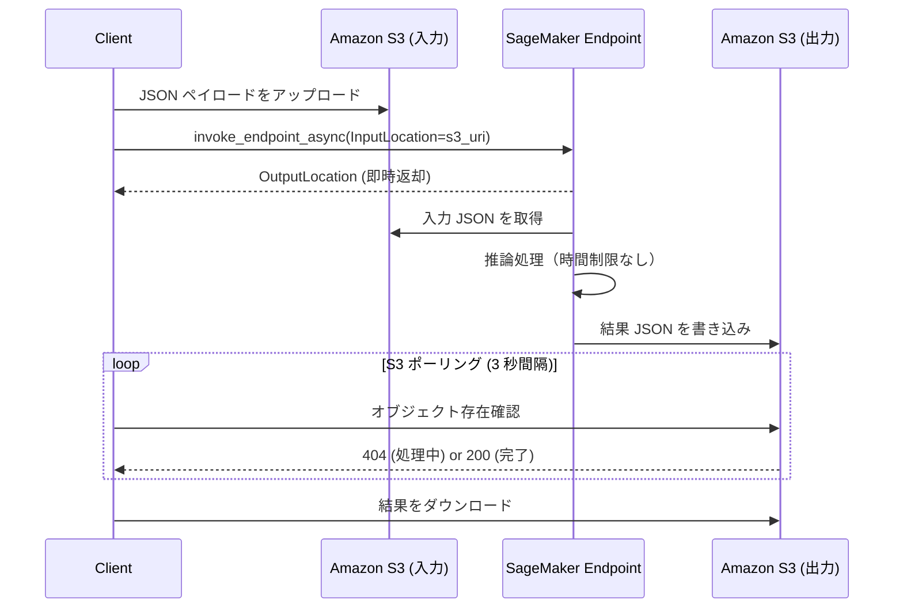

## はじめに

PaddleOCR-VL-1.5 は、Baidu が公開した 0.9B パラメータの Vision-Language Model (VLM) ベースの OCR モデルです。「Spotting」は、テキストの内容だけでなく座標情報（BBOX）も同時に出力できます。これを Amazon SageMaker にデプロイして推論 API として利用しました。

:::message
以下の解説は現時点での AWS サービスの状態に基づく試した結果であり、今回の結果は今後変更される可能性がありますし、他の手法も考えられます。一例として参考にしてください。
:::

## PaddleOCR-VL-1.5 とは

PaddleOCR-VL-1.5 は Hugging Face 上で [PaddlePaddle/PaddleOCR-VL-1.5](https://huggingface.co/PaddlePaddle/PaddleOCR-VL-1.5) として公開されている VLM ベースの OCR モデルです。パラメータ数は 0.9B と比較的小型ながら、テキスト検出・認識に特化した設計が施されています。

https://huggingface.co/PaddlePaddle/PaddleOCR-VL-1.5

### Spotting タスクと LOC トークン

このモデルが提供するタスクは複数あり、用途に応じて使い分けができます。

| タスク名 | 内容 |
|---------|------|
| `Spotting` | テキスト検出 + BBOX（座標情報付き） |
| `OCR` | テキスト認識のみ |
| `Table Recognition` | 表構造の認識 |
| `Formula Recognition` | 数式認識 |
| `Chart Recognition` | グラフ認識 |
| `Seal Recognition` | 印鑑認識 |

BBOX 情報の取得には Spotting タスクを使います。入力は画像とプロンプト文字列 `"Spotting: "` で、モデルは以下のような形式でテキストと座標を出力します。

```
施設利用申込書<|LOC_404|><|LOC_97|><|LOC_596|><|LOC_97|><|LOC_596|><|LOC_118|><|LOC_404|><|LOC_118|>
下記のとおり、利用を申し込みます。<|LOC_90|><|LOC_131|><|LOC_355|><|LOC_131|>...
```

`<|LOC_NNN|>` は 0〜999 の正規化座標を表す特殊トークンです。1 テキスト領域につき 8 個のトークンが出力され、四角形の 4 頂点 `(x1,y1), (x2,y1), (x2,y2), (x1,y2)` をこの順で表現しています。実際の座標への変換は以下のように行います。

```python
# LOC 値 0-999 を画像ピクセル座標に変換
x_pixel = loc_value * image_width / 1000
y_pixel = loc_value * image_height / 1000
```

このトークン設計により、テキスト認識と位置情報の出力が単一の自己回帰生成ステップで完結します。

## Amazon SageMaker コンテナの選定

SageMaker でカスタムモデルを推論させる際には、大きく 2 種類のコンテナが候補になります。

### HuggingFace DLC と LMI コンテナの比較

**HuggingFace DLC** は、`transformers` の `AutoModel` / `AutoProcessor` を使って任意のモデルを動かすことができる汎用コンテナです。`model_fn` / `input_fn` / `predict_fn` / `output_fn` という 4 つの関数を実装するだけで推論サーバーが立ち上がる設計になっており、カスタムロジックを書きやすいのが特徴です。

**Large Model Inference (LMI) コンテナ** は、大規模言語モデルの高速推論に特化したコンテナです。vLLM や TensorRT-LLM をバックエンドとして使い、スループット最大化を得意としています。ただし、対応モデルのリストが限定的であり、PaddleOCR-VL-1.5 のような VLM 特化の小型モデルには over-spec になりやすい点があります。

今回 HuggingFace DLC を選んだ理由は、このモデルのロードには `trust_remote_code=True`（Hugging Face Hub 上のカスタムモデルコードを実行するオプション）が必要であり、Spotting タスク固有の前処理・後処理も実装する必要があるため、カスタムコードを自由に書ける HuggingFace DLC の方が扱いやすいと判断しました。

### model.tar.gz 方式によるデプロイ

HuggingFace DLC には `HF_MODEL_ID` という環境変数でモデルを指定する方法もありますが、`HF_MODEL_ID` を設定していたところ、カスタムの inference.py コードが無視されてデフォルトのパイプラインが動いてしまい、期待した推論結果が得られませんでした。その原因を調査して `HF_MODEL_ID` を外す方式に切り替えた、という経緯があります。

この問題を回避するため、カスタムコードのみを `model.tar.gz` に固めてデプロイする方式を採用しました。`SAGEMAKER_PROGRAM` という環境変数を設定することで、HuggingFace toolkit に「このファイルがエントリポイントだ」と明示的に伝えられます。モデルの重みはコンテナ起動時に `model_fn` 内から Hugging Face Hub より直接ダウンロードします。

https://docs.aws.amazon.com/ja_jp/sagemaker/latest/dg/prebuilt-containers-extend.html

```python
from sagemaker.huggingface import HuggingFaceModel

model = HuggingFaceModel(
    model_data=s3_uri,  # model.tar.gz (推論コードのみ)
    env={
        "SAGEMAKER_PROGRAM": "inference.py",
        # HF_MODEL_ID は指定しない
    },
    transformers_version="4.48.0",
    pytorch_version="2.3.0",
    py_version="py311",
    ...
)
```

## 同期推論 60 秒タイムアウト問題と非同期推論への移行

### リアルタイムエンドポイントの制限

SageMaker のリアルタイムエンドポイント（`invoke_endpoint`）には、1 リクエストあたり 60 秒という固定のタイムアウト制限があります。この制限は AWS のサービス仕様として設定されており、`botocore` のクライアント設定（`read_timeout` など）では変更できません。

PaddleOCR-VL-1.5 の Spotting 推論は、A4 相当の画像 1 枚に対して `ml.g5.xlarge`（NVIDIA A10G）または `ml.g6f.xlarge` で 60 秒以上かかる場合がありました。生成する LOC トークンの数が多いほど処理が長くなるため、文字量の多いページほどタイムアウトしやすくなります。

### 非同期推論エンドポイントへの移行

Amazon SageMaker の **非同期推論（Asynchronous Inference）** は、この制限を回避できる仕組みです。処理時間は最大 1 時間まで許容されます。（昔は 15 分だった気がします）



同期推論との最大の違いはインターフェースにあります。リアルタイムエンドポイントはリクエストボディに直接ペイロードを乗せますが、非同期推論は入力を Amazon Simple Storage Service (Amazon S3) にアップロードし、その URI を `InputLocation` として渡します。結果も Amazon S3 に書き込まれるため、クライアントはポーリングで完了を検知します。

コンテナ側の `inference.py` は変更不要です。SageMaker ランタイムが Amazon S3 の読み書きを透過的に処理し、コンテナにはリクエストボディがそのまま渡されます。

デプロイ時に `AsyncInferenceConfig` を追加するだけで非同期エンドポイントに切り替わります。

```python
from sagemaker.async_inference import AsyncInferenceConfig

async_config = AsyncInferenceConfig(
    output_path="s3://bucket/prefix/async-output",
    max_concurrent_invocations_per_instance=1,
)

model.deploy(
    initial_instance_count=1,
    instance_type="ml.g5.xlarge",
    async_inference_config=async_config,
)
```

## 実装上のポイント

### transformers のバージョン不一致問題と解決策

PaddleOCR-VL-1.5 を SageMaker で動かストエラーが発生しました。原因は **transformers ライブラリのバージョンの違い**でした。

#### 問題の詳細

PaddleOCR-VL-1.5 のモデルコード（`trust_remote_code=True` で読み込まれる Python コード）は、`transformers` 4.50 以降で追加された新しい API を使っています。しかし、HuggingFace DLC に含まれる `transformers` は 4.48.0（2025 年 1 月時点）です。

つまり、**モデルが新しい機能を使っているのに、実行環境に古いライブラリが入っている**状態です。この状態で実行すると、以下のようなエラーが複数発生します。

```python
AttributeError: module 'transformers.integrations' has no attribute 'use_kernel_forward_from_hub'
AttributeError: module 'transformers' has no attribute 'modeling_layers'
```

#### 解決策の検討

最初は `requirements.txt` で `transformers>=4.51.0` を指定して最新版に更新することを試みました。しかし、DLC 内の `sagemaker_huggingface_inference_toolkit` が古いバージョン前提で作られており、最新版では削除された `transformers.file_utils` などのモジュールをインポートしようとして起動時にクラッシュしてしまいました。

つまり、**新しくしすぎても動かない、古すぎても動かない**という状態です。transformer は toolkit の依存で変えられないですが、toolkit は DLC で作り込まれているため、そこに手を入れると手間を削減するために使いたい DLC を使う意味がないので基盤側は絶対変えたくありません。基本的にはアプリケーション側でなんとかする、という方針で逃げました。

#### 採用した解決策: 足りない API を自分で追加する

そこで採用したのが、**コンテナ起動時に足りない API を自分で追加する**方法です。具体的には、`inference.py` のインポート時に以下の処理を行います。

```python
# transformers.integrations に use_kernel_forward_from_hub が存在するか確認
import transformers.integrations as _ti
if not hasattr(_ti, "use_kernel_forward_from_hub"):
    # 存在しない場合、何もしない関数（ダミー）を作って追加
    def _use_kernel_forward_from_hub(*args, **kwargs):
        def decorator(cls_or_fn):
            return cls_or_fn  # そのまま返すだけ
        return decorator
    _ti.use_kernel_forward_from_hub = _use_kernel_forward_from_hub
```

この処理で行っているのは以下の 3 ステップです。

1. **確認**: `transformers.integrations` モジュールに `use_kernel_forward_from_hub` という関数があるか確認
2. **判定**: 存在しない場合のみ処理を実行（既に存在する場合は何もしない）
3. **追加**: 何もしないダミー関数を作成して、モジュールに追加

このダミー関数は「呼ばれても何もしない」関数です。PaddleOCR-VL-1.5 のモデルコードはこの関数を呼び出しますが、実際には装飾目的（`@use_kernel_forward_from_hub` のようなデコレータ）でしか使っておらず、関数が何もしなくても動作に影響しませんでした。

:::message
既に ECS/EKS などを運用している場合は、あえて上記のような対応をせずとも ECS/EKS でサービングするのもありだと思います。
:::

#### 追加が必要だった API

この方法で追加した API は合計 7 種類です。

| 足りなかった API | 追加先 | 役割 |
|----------------|--------|------|
| `use_kernel_forward_from_hub` | `transformers.integrations` | デコレータ（何もしない） |
| `GradientCheckpointingLayer` | `transformers.modeling_layers` | 空のクラス |
| `dynamic_rope_update` | `transformers.modeling_rope_utils` | デコレータ（何もしない） |
| `TransformersKwargs` | `transformers.utils` | 空のクラス |
| `auto_docstring` | `transformers.utils` | デコレータ（何もしない） |
| `can_return_tuple` | `transformers.utils` | デコレータ（関数をそのまま返す） |
| `check_model_inputs` | `transformers.utils.generic` | デコレータ（関数をそのまま返す） |

デコレータとして使われる API の場合、単に `pass` を返すと元の関数が `None` に上書きされてしまうため、`functools.wraps` を使って元の関数をそのまま返す実装にしています。

この方法により、transformers 4.48.0 の環境でも PaddleOCR-VL-1.5 のモデルコードを実行できるようになりました。

### 2 ステップ processor による画像入力

`transformers` 4.48.0 の `apply_chat_template` は `tokenize=True` の場合に画像を含む messages を適切に処理できません。そのため、以下の 2 ステップで処理します。

```python
# Step 1: テキストテンプレートのみ取得（tokenize=False）
text = processor.apply_chat_template(
    messages,
    add_generation_prompt=True,
    tokenize=False,
)

# Step 2: processor で画像 + テキストを一括処理
inputs = processor(
    text=[text],
    images=[image],
    padding=True,
    return_tensors="pt",
).to(device)
```

`tokenize=False` でテキストテンプレートを文字列として取得し、その後 `processor()` を直接呼び出して画像とテキストを同時にエンコードします。これにより画像が正しく vision encoder に渡され、期待通りの入力トークン列が生成されます。

### max_new_tokens の設定

Spotting タスクの出力は、1 テキスト行につきテキスト本体と 8 個の LOC トークンで構成されます。A4 文書 1 ページに 30〜50 行のテキスト領域が含まれる場合、必要なトークン数は以下のように見積もれます。

1 行あたり平均テキストトークン数（約 15）+ LOC トークン（8）= 約 23 トークン × 50 行 = 1,150 トークン

非同期推論ではタイムアウト制限がないため、リクエスト時に `max_new_tokens` を余裕を持って `4096` に指定することを推奨します。実装のデフォルト値は `512` ですが、複雑な文書ではこの値では不足し、文書の途中で生成が打ち切られて下部のテキスト領域が欠落する原因になります。

## 実行例

港区の「ポイ捨て禁止」看板画像（EasyOCR のサンプル画像として公開されているもの）を入力として試した結果を示す。

```
ポイ捨て禁止!<|LOC_140|><|LOC_143|><|LOC_855|><|LOC_143|><|LOC_855|><|LOC_343|><|LOC_140|><|LOC_343|>
NO LITTER<|LOC_180|><|LOC_369|><|LOC_813|><|LOC_369|><|LOC_813|><|LOC_535|><|LOC_180|><|LOC_535|>
清潔できれいな港区を<|LOC_145|><|LOC_565|><|LOC_845|><|LOC_565|><|LOC_845|><|LOC_667|><|LOC_145|><|LOC_667|>
港区 MINATOCITY<|LOC_200|><|LOC_703|><|LOC_783|><|LOC_703|><|LOC_783|><|LOC_780|><|LOC_200|><|LOC_780|>
```

LOC トークンをパースしてピクセル座標に変換した結果が以下の通りです。

| # | テキスト | x1 | y1 | x2 | y2 |
|---|---------|-----|-----|-----|-----|
| 1 | ポイ捨て禁止! | 78 | 60 | 475 | 143 |
| 2 | NO LITTER | 100 | 154 | 451 | 224 |
| 3 | 清潔できれいな港区を | 80 | 236 | 469 | 279 |
| 4 | 港区 MINATOCITY | 111 | 294 | 435 | 326 |

日本語・英語が混在した看板テキストを 4 領域すべて正確に検出し、非同期リクエストの送信から結果取得まで **6 秒** で完了しました。

BBOX のオーバーレイ結果は以下の通りです。各テキスト行の位置に赤枠が正確に重なっていることが確認できます。

なお、複雑な書類では数分間かかるケースもあったため、処理時間は画像サイズや文書密度に依存して変動すると考えられます。


```bash
(.venv) ./ocr.sh samples/easyocr_japanese.jpg
[INFO] 推論: samples/easyocr_japanese.jpg
[INFO] エンドポイント: paddleocr-vl-async, タスク: spotting, max_new_tokens: 4096
...
[INFO] 入力を S3 にアップロード: s3://sagemaker-us-east-1-XXX/paddleocr-vl/async-input/9d8171c9295a49b381d6b1063502e113.json
[INFO] 非同期リクエスト送信完了。出力先: s3://sagemaker-us-east-1-XXX/paddleocr-vl/async-output/62abfa73-906c-479e-862b-bb57a4650ff3.out
[INFO] 待機中... (3/600秒)
[INFO] 待機中... (6/600秒)
[INFO] 結果取得完了 (6秒後)

--- レスポンス ---
ポイ捨て禁止!<|LOC_140|><|LOC_143|><|LOC_855|><|LOC_143|><|LOC_855|><|LOC_343|><|LOC_140|><|LOC_343|>
NO LITTER<|LOC_180|><|LOC_369|><|LOC_813|><|LOC_369|><|LOC_813|><|LOC_535|><|LOC_180|><|LOC_535|>
清潔できれいな港区を<|LOC_145|><|LOC_565|><|LOC_845|><|LOC_565|><|LOC_845|><|LOC_667|><|LOC_145|><|LOC_667|>
港区MINATOCITY<|LOC_200|><|LOC_703|><|LOC_783|><|LOC_703|><|LOC_783|><|LOC_780|><|LOC_200|><|LOC_780|>
-----------------

[OK] 保存: output/easyocr_japanese_spotting_sagemaker.json
[INFO] 可視化: samples/easyocr_japanese_bbox_20260311_212329.png
[INFO] 検出テキスト数: 4
  [01] bbox=[78, 60, 475, 143]  text='ポイ捨て禁止!'
  [02] bbox=[100, 154, 451, 224]  text='NO LITTER'
  [03] bbox=[80, 236, 469, 279]  text='清潔できれいな港区を'
  [04] bbox=[111, 294, 435, 326]  text='港区MINATOCITY'
[OK] 保存: samples/easyocr_japanese_bbox_20260311_212329.png
[OK] 完了: samples/easyocr_japanese_bbox_20260311_212329.png
```

## まとめ

PaddleOCR-VL-1.5 を Amazon SageMaker にデプロイして BBOX 付き OCR を実現するにあたり、いくつかの判断と対処が必要でした。VLM ベースの OCR モデルは、単なるテキスト認識を超えて座標情報まで出力できる点が特徴的です。SageMaker の非同期推論と組み合わせることで、処理時間を気にせず高品質な BBOX 付き OCR をクラウドで実行できる構成が簡単に実現できました。運用負荷も低いため検証や小規模用途では非常にお勧めできます。

実装サンプルを望む方は、Like をつけた上で X でご連絡ください！

## 参考

- [PaddleOCR-VL-1.5 on Hugging Face](https://huggingface.co/PaddlePaddle/PaddleOCR-VL-1.5)
- [AWS SageMaker Asynchronous Inference](https://docs.aws.amazon.com/sagemaker/latest/dg/async-inference.html)
- [SageMaker HuggingFace DLC](https://huggingface.co/docs/sagemaker/en/index)
- [AWS Deep Learning Containers - Available Images](https://github.com/aws/deep-learning-containers/blob/master/available_images.md)
- [SageMaker Large Model Inference](https://docs.aws.amazon.com/sagemaker/latest/dg/large-model-inference-container-docs.html)
