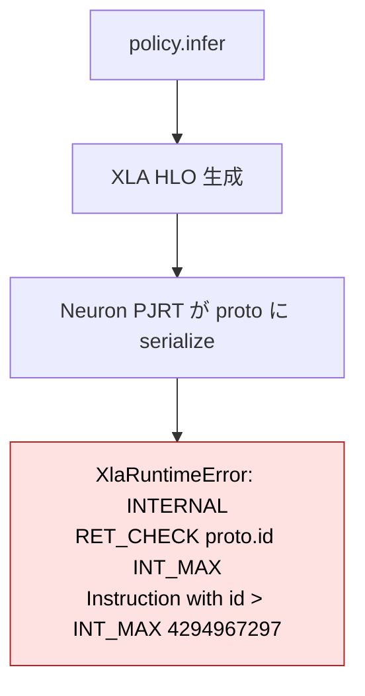
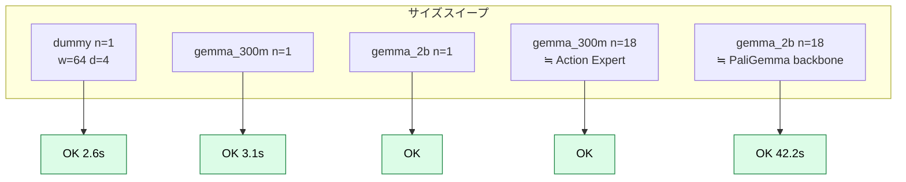
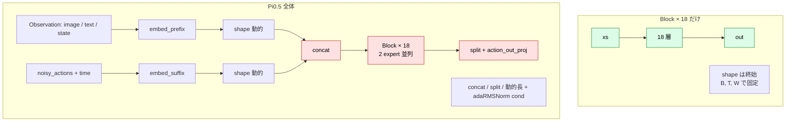
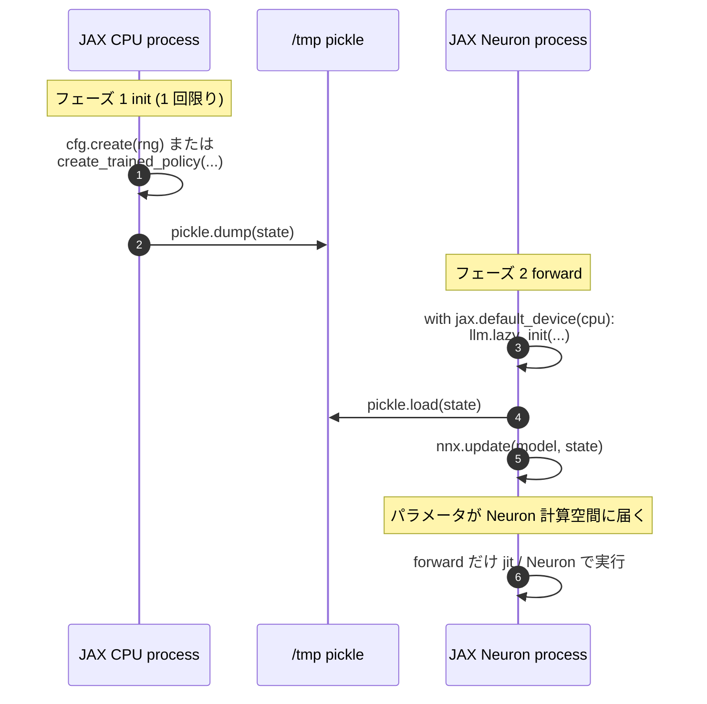
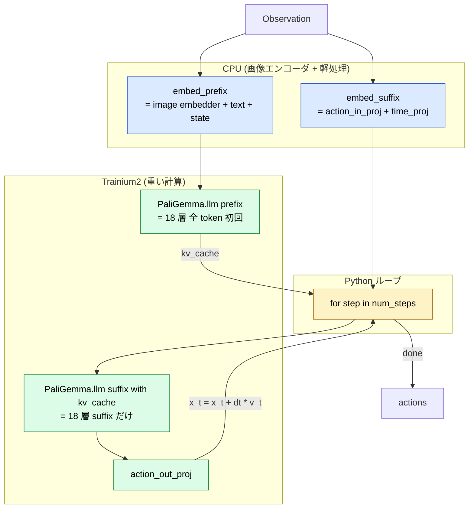
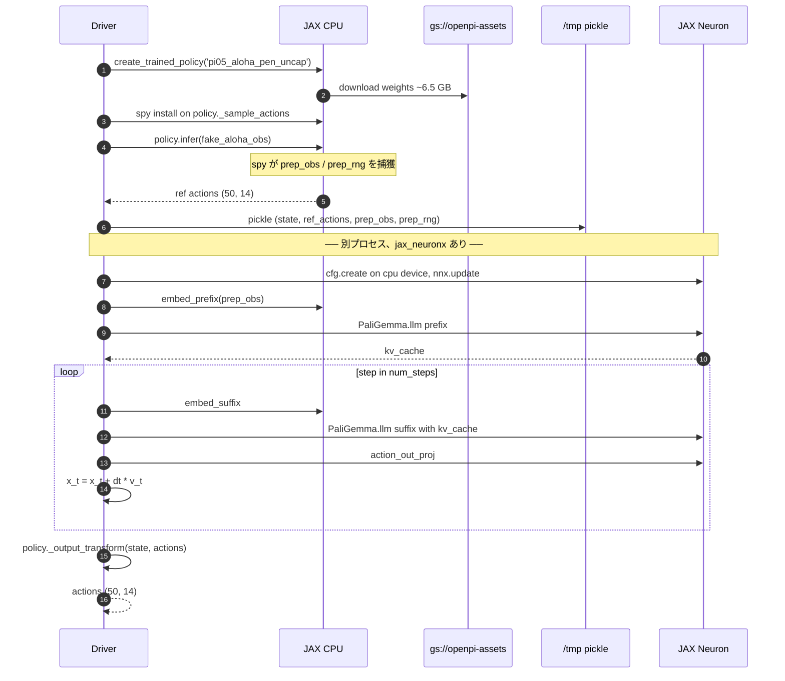
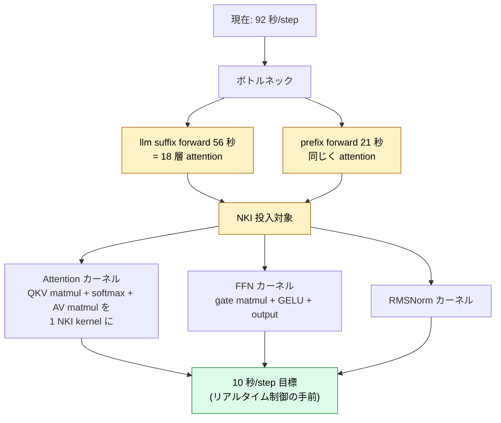

## TL;DR

- 公開重み で CPU 実装と数値整合する actions を Trainium2 上で出力に成功
- Pi0.5 の forward は **巨大すぎて** Neuron Compiler の instruction 上限 (5,000,000) を踏む
- パラメータ初期化 (`lazy_init`) を Neuron でやろうとすると **コンパイル時間が爆発**する

## はじめに

本記事は、Physical Intelligence の **openpi (Pi0.5)** を、**JAX で AWS Trainium2 上で推論を動かす**までの調査記録です。最終的に **公開重み (`pi05_base` checkpoint) で CPU 実装と数値整合する actions を Trainium2 上で出力する**ところまで到達しました。

対象モデルは `pi05_aloha_pen_uncap` (Pi0.5 + Aloha 系入力)。Gemma 2B + Action Expert backbone を持ちす。本記事は、**「Pi0.5 を素直に jit すると Trainium で何が起こるか」** を備忘として残します。

Fine Tuning については次の記事で扱います。

## 全体ストーリー

各 Phase の到達点をスコアボードでまとめると以下のようになります。


## Phase 0: 環境構築

### CDK 一撃デプロイ

https://zenn.dev/tosshi/articles/f3f678f4b6531c

こちらをベースにしています。

### JAX-NeuronX スタック

```bash
pip install "jax-neuronx[stable]" --extra-index-url=https://pip.repos.neuron.amazonaws.com
```

入った主要バージョン:

| パッケージ | バージョン |
|---|---|
| jax | 0.5.3 |
| jax-neuronx | 0.10.0.1.0.9913 |
| libneuronxla | 3.0.2891.0 |
| flax | 0.10.2 |

```python
import jax, jax_neuronx
print(jax.default_backend())  # neuron
print(jax.devices())          # [NeuronCore(id=0..3)]
```

### 計測の前提

本記事の数値はすべて以下の構成で測っています。

| 項目 | 値 |
|---|---|
| インスタンス | `trn2.3xlarge` (NeuronDevice 0 / 4 cores / HBM 96 GB) |
| config | `pi05_aloha_pen_uncap` (Pi0.5 + Aloha 系 input) |
| checkpoint | `gs://openpi-assets/checkpoints/pi05_base` |
| バッチサイズ | **B = 1** |
| input | `aloha_policy.make_aloha_example()`: 画像 3 枚 (base / left_wrist / right_wrist) + state 32 dim |
| output | actions: 50 timestep × 14 DoF (両腕 + gripper、`(50, 14)`) |
| Flow Matching ステップ数 | **1 step** |
| 数値型 | 重み bf16 / JAX backend bf16 / CPU reference fp32 |

VLA 推論の自然な運用は **「カメラ 1 セット → action chunk 1 個」の 1 対 1 マッピング**なので、B=1 が原型です。複数ロボットの分散制御や学習では B>1 を取りますが、本記事は単一ロボットのリアルタイム推論レイテンシに焦点を絞っています。

ログに `(1, 51, 1024)` のような shape が出てきますが、leading 次元の `1` がこの batch 次元です。

`aloha_policy.make_aloha_example()` はテスト用ダミー入力を生成する関数で、ALOHA ロボット用の VLA 推論を試すときの "fake observation" を返します。

## Phase 1: openpi 公式ルートを叩いて、動かないと判定する

`create_trained_policy` で重みを落として `policy.infer` を呼んでみるも、CPU では完走 (`actions.shape=(50,14)`, 1.8 秒)。**Trainium では落ちる**。

```python
from openpi.training import config as _config
from openpi.policies import policy_config as _pc

train_config = _config.get_config("pi05_aloha_pen_uncap")
policy = _pc.create_trained_policy(train_config, "gs://openpi-assets/checkpoints/pi05_base")
out = policy.infer(make_aloha_example())
```




`4,294,967,297 = 2^32+1`。これは XLA HLO の instruction id が 32-bit を超えたという内部チェックです。**Pi0.5 1 forward の HLO が大きすぎる**ことを意味します。

### 切り分け

CPU JAX で同じ `policy.infer` を実行 → 完走 (`infer_ms = 1825 ms`)。

つまり **openpi 自体は健全、jax 0.5.3 自体も健全、問題は Trainium の Neuron PJRT** に局在することが確定。

---

## Phase 2: 境界探索 — どこまでなら Trainium で動くのか

Pi0.5 全体は無理。では、**より小さい単位なら動くのか**？

### Block × N サイズスイープ

`gemma.Block` を `n` 個積み重ねて jit:



**全部通った**。**PaliGemma 2B 相当の 18 層 forward が 42.2 秒で完走**します。

### Pi0.5 一括 jit (再挑戦)

Block で動くなら、Pi0.5 全体も同じく動くのでは？ — 違いました。

```python
@jax.jit
def one_step(rng, obs):
    return model.sample_actions(rng, obs, num_steps=1)
```

dummy variant でさえ **30 分超 stuck**。py-spy で覗くと:

```
Thread 28722 (idle): "MainThread"
    backend_compile (jax/_src/compiler.py:321)
```

Neuron Compiler の C++ パスで完全に詰まっている。kill するしかない。



Pi0.5 と Block の違いは **prefix/suffix の concat と 2 expert 並列** で、これらが Neuron Compiler のコストを爆発させているとみられます。

---

## Phase 3: 分離パターン — CPU で init、Neuron で forward

Phase 2 の Block 探索を **公式の `gemma.Module` (= Pi0.5 の `PaliGemma.llm` 本体)** で再現すると、別の壁にぶつかりました:

```
[ERROR] [NCC_EVRF007] Instructions generated by compiler 6,101,424
exceeds the typical limit of 5,000,000.
Input computation graph is too big or has large operators.
Consider using --optlevel=1, smaller batches or sequence length, or applying model parallelism.
```

これが **本当の壁**でした。HLO id overflow は WARN（XLA がリカバリしてくれる）、本物の致命傷は **Neuron Compiler の 5,000,000 instruction 上限** です。


### 鍵となった発見

`--optlevel=1` も sequence 長削減も効きませんでした。理由は **`gemma.Module.init` メソッド自体が 5M 以上の computation graph を生成**するから。openpi は `nnx_bridge.ToNNX(gemma.Module(...)).lazy_init(rngs, method="init", use_adarms=...)` というイディオムでパラメータ初期化を行っており、その init 内部 dummy 入力が固定 shape `(1, 1, c.width)` で全 18 層 forward を一括 trace してしまいます。

**回避策**: lazy_init を **CPU device に強制的に逃がす**。

```python
with jax.default_device(jax.devices('cpu')[0]):
    llm.lazy_init(rngs=nnx.Rngs(0), method='init', use_adarms=[False, False])
# その後 nnx.update で別プロセス CPU で取った state を install
```



このパターンで `gemma.Module(2B + 300M)` の 1 forward が **39.7 秒** で完走しました。続いて Pi0.5 の **prefix forward だけ**を切り出して同様に流すと、**27 秒** で完走 + kv_cache 取得成功。Pi0.5 を分解して動かす道筋がついた瞬間です。

---

## Phase 4: Pi0.5 staged inference を組み立てる (dummy variant)

Pi0.5 の `sample_actions` は次の構造です:

```python
# Pi0.5.sample_actions の概略
prefix_tokens, prefix_mask, _ = self.embed_prefix(observation)
_, kv_cache = self.PaliGemma.llm([prefix_tokens, None], mask=..., positions=...)

def step(carry):
    x_t, time = carry
    suffix_tokens, suffix_mask, _, adarms_cond = self.embed_suffix(observation, x_t, time)
    (_, suffix_out), _ = self.PaliGemma.llm(
        [None, suffix_tokens], mask=..., kv_cache=kv_cache, adarms_cond=...)
    v_t = self.action_out_proj(suffix_out[:, -self.action_horizon:])
    return x_t + dt * v_t, time + dt

x_0, _ = jax.lax.while_loop(cond, step, (noise, 1.0))
```

**ポイント**:
- prefix forward は **1 回だけ** で kv_cache を作る
- step 関数は kv_cache を再利用するので **suffix だけが流れる**（軽い）
- flow-matching の 10 ステップ積分は `jax.lax.while_loop` だが、**Python の for 文に置き換えても等価**

Phase 4 ではこれを **3 段に分解** し、まずは dummy variant で動かしてみます:



dummy variant (`gemma.dummy` × 18) で staged driver を組んで 1 step 流すと:

```
prefix forward OK in 4.4s, kv_cache leaves=2
step 1/1 time=1.000 ...
    embed_suffix(CPU): 8.65s, suffix_tokens.shape=(1, 51, 64)
    llm suffix(Neuron): 25.24s, suffix_out.shape=(1, 51, 64)
    action_out_proj: 8.00s, v_t.shape=(1, 50, 14)
TOTAL loop: 75.3s for 1 step
abs diff vs CPU: max=0.0339 mean=0.0089
```

CPU 実装と一致 (max diff = 0.034、bf16 演算誤差として妥当)。staged driver の構造そのものが正しいことが確認できました。次の Phase 5 で本番サイズ (gemma_2b) に拡張します。

---

## Phase 5: gemma_2b にスケール (random init で NaN を観測)

dummy → gemma_2b (PaliGemma 2B) + gemma_300m (Action Expert):

```
prefix forward OK in 23.5s
llm suffix(Neuron): 60.29s
TOTAL loop: 82.2s for 1 step
actions stats: min=nan max=nan mean=nan  ← random init で発散
```

サイズ的には完走しました。NaN なのは attention の softmax が 2B 規模ランダム重みで発散したためで、staged driver 自体は問題ありません。次の Phase 6 で公開重み (`pi05_base` ckpt) を流し込みます。

---

## Phase 6: 公開重み (`pi05_base`) で実推論 ★

ここが本記事のクライマックスです。

全体フローを 3 レーン (CPU / Disk / Neuron) で表すと以下のようになります。


**観測**: openpi の `Policy.infer` は内部で `_input_transform → preprocess → sample_actions` を一気に呼びます。staged 駆動するには **preprocessed Observation** が必要。これを `policy._sample_actions` に **spy をかけて捕獲**しました:

```python
_orig_sample = policy._sample_actions
captured = {}
def _spy(rng, observation, **kwargs):
    captured['obs'] = observation
    captured['rng'] = rng
    return _orig_sample(rng, observation, **kwargs)
policy._sample_actions = _spy
_ = policy.infer(fake_obs)            # ← spy が prep_obs / prep_rng を捕獲
policy._sample_actions = _orig_sample
```

これで input transform を再実装する必要がなくなり、後の Neuron 側 driver が単純になります。

**結果**:

```
state restored. CPU ref actions shape=(50, 14)
using captured preprocessed Observation: state.shape=(1, 32),
  images=['base_0_rgb', 'left_wrist_0_rgb', 'right_wrist_0_rgb']
prefix forward OK in 20.8s, kv_cache leaves=2
step 1/1 time=1.000 ...
  embed_suffix(CPU): 10.06s, suffix_tokens.shape=(1, 51, 1024)
  llm suffix(Neuron): 55.97s, suffix_out.shape=(1, 51, 1024)
  action_out_proj: 5.26s

Neuron actions raw shape=(50, 32) mean=-0.0267
CPU ref shape=(50, 14) mean=0.0245
Neuron actions (post-tf): mean=0.0210, max abs diff vs CPU=0.1116
```

**達成事項**:

- 公開重みで Pi0.5 が **Trainium2 上で完走**
- 出力 shape 一致 (50, 14)、mean が CPU と整合 (0.0210 vs 0.0245)
- max abs diff = 0.1116 は **bf16 演算誤差として妥当**（NaN ではなく、CPU と同じ方向の actions）



---

## よくある誤解: 「3xlarge では Pi0.5 が乗り切らない」?

「`trn2.3xlarge` では Pi0.5 を動かしきれなかった」という話を聞きました。**実は容量不足ではなく、ほぼ確実に上の `NCC_EVRF007` を踏んでいます**。

`trn2.3xlarge` の物理リソースと、Pi0.5 を上記の staged 構成で動かしたときの実使用率を並べてみます。

| 資源 | trn2.3xlarge の容量 | Phase 6 の実使用 | 使用率 |
|---|---:|---:|---:|
| HBM (NeuronDevice 0、4 cores) | 96 GB | bf16 重み 6.6 GB + KV cache 数百 MB | **~10%** |
| ホスト CPU RAM | 124 GiB | pickle 書き出し peak で `used 2.0 Gi / free 110 Gi` | **~2%** |
| neuron-compile-cache (EBS) | 484 GB | 14 MB | <1% |
| EBS root | 484 GB | 72 GB used (12 GB の ckpt 含む) | 15% |

**HBM は 10 倍、ホスト RAM は 50 倍の余裕**があります。素直に `policy.infer` を `@jax.jit` したときに失敗するのは、メモリではなく **1 つの NEFF (Neuron Executable File Format) に詰め込もうとした命令数が 5M を超える**からです。本記事の Phase 3 で見たとおり、Pi0.5 の lazy_init だけで 6.1M 命令、上限の 1.22 倍を生成します。

つまり、

- **より大きいインスタンス (`trn2.48xlarge` 等) に行っても、素直 JIT は同じく `NCC_EVRF007` で死ぬ**。Compiler の上限は per-NEFF / per-compile であり、インスタンスサイズと無関係。
- 解は **構造で解く** ─ 1 つの forward を 1 つの NEFF に押し込めず、CPU で lazy_init / Neuron で forward / Python ループで Flow Matching、と切り分けて 1 NEFF あたりの命令数を 5M 以下に圧縮する (本記事の Phase 3〜6 がそれ)。
- `trn2.3xlarge` で十分に動くのに、容量問題と誤解して上位インスタンスに移るのは時間と費用の無駄になります。**まずエラーメッセージが `NCC_EVRF007` か `OOM` かを見分けてください**。

## 制約・本当の壁の早見表

| 名前 | 値 | 出方 |
|---|---|---|
| Neuron Compiler instruction 上限 | **5,000,000** | `[ERROR] [NCC_EVRF007]` |
| Pi0.5 lazy_init の生成 instruction 数 | 6,101,424 | 同上（上限の 1.22 倍） |
| HLO instruction id 上限 (XLA RET_CHECK) | INT_MAX = 2^31-1 | `proto.id() <= INT_MAX` |
| 観測した HLO id overflow 値 | 4,294,967,297 (=2^32+1) | Pi0.5 全体一括 jit 時 |
| SSM RunCommand 出力 | ~24 KB | 出力末尾が打ち切られる |

## Phase 1 から 6 までの計測値早見表

| 試行 | フェーズ | バックエンド | 時間 | 結果 |
|---|---|---|---:|---|
| `jnp.arange + jit` | 0 | NeuronCore(0) | 数秒 | OK |
| `pi05_aloha_pen_uncap` 一括 jit | 1 | trn2 | — | NG (HLO overflow) |
| Pi0.5(dummy) 一括 jit | 2 | trn2 | 30 分超 stuck | NG (NCC 5M 上限) |
| `gemma.Block × 18 (gemma_2b)` 単独 | 2 | trn2 | init 120s + fwd 42s | OK |
| `gemma.Module(2B+300M)` (CPU init / Neuron forward) | 3 | trn2 | init=CPU 4.1s + fwd 39.7s | OK |
| Pi0.5(dummy) prefix forward 切り出し | 3 | trn2 | 27.0s | OK |
| Pi0.5(dummy) staged 1 step | 4 | trn2 | 75.3s/step | OK, diff=0.034 |
| Pi0.5(2B/300M) staged 1 step (random init) | 5 | trn2 | 82.2s/step | NaN (発散) |
| **`pi05_aloha_pen_uncap` staged 1 step (公開重み)** | **6** | **trn2** | **92.4s/step** | **OK, diff=0.112** |
| `pi05_aloha_pen_uncap` CPU JAX (reference) | 6 (比較) | CPU | 8.5s | OK |

---

## 副産物のテクニック

### 1. CPU init + Neuron forward 分離

```python
with jax.default_device(jax.devices('cpu')[0]):
    model = cfg.create(jax.random.PRNGKey(0))
    # または policy = create_trained_policy(...)
state = nnx.state(model)
pickle.dump(state, ...)

# 別プロセス (jax_neuronx 込み):
with jax.default_device(jax.devices('cpu')[0]):
    model = cfg.create(jax.random.PRNGKey(0))  # shape-only
nnx.update(model, pickle.load(...))
result = model.SomeSubmodule(neuron_inputs)  # forward は Neuron 上
```

### 2. Policy._sample_actions への spy

```python
_orig = policy._sample_actions
captured = {}
def _spy(rng, obs, **kw):
    captured['obs'] = obs
    captured['rng'] = rng
    return _orig(rng, obs, **kw)
policy._sample_actions = _spy
_ = policy.infer(fake_obs)
policy._sample_actions = _orig
```

これで input transform を再実装せずに **モデル直前の Observation** が手に入ります。

### 3. SSM Run Command の 24 KB 出力 cap

長いログは `tee /work/.../foo.log` でファイル化、必要部分だけ `grep -nE` で抜く。本記事の調査でも何度も助けられました。

### 4. Stuck 時の py-spy

```sh
sudo /work/.../py-spy dump --pid <python_pid>
```

`MainThread idle in backend_compile` が出れば Neuron Compiler の C++ で詰まっている確証。kill して別アプローチに切り替える判断材料になります。

### 5. SSM 越しに長時間ジョブを投げるなら setsid 必須

SSM `awsrunShellScript` から `nohup ... &` だけでバックグラウンド起動すると、SSM 側のシェルが終了したタイミングで **SIGHUP が伝搬して子プロセスが殺される** ことがあります（特に `sudo -u <user> bash -lc` のように一段噛ませると顕著）。途中まで進んだのに pickle 出力寸前で死ぬといった現象に遭うので、`setsid` で新セッションを切るのが安全です。

```bash
sudo -u coder bash -lc "setsid nohup env PATH=$VENV/bin:/usr/bin:/bin \
  $VENV/bin/python script.py > $LOG 2>&1 < /dev/null & \
  echo \$! > /tmp/job.pid; disown"
```

ポーリングは `kill -0 $(cat /tmp/job.pid)` で生存確認するだけにしておくと SSM 側のタイムアウトに引きずられません。

### 6. PATH に `.venv/bin` を入れる

Neuron で JAX が compile する時、内部で `subprocess` 経由で `neuronx-cc` を起動します。venv 内 Python から `python script.py` する分には `import` 解決は通るのですが、**`subprocess` で起動する `neuronx-cc` は実行時 PATH を引く** ので、`.venv/bin` が PATH に入っていないと:

```
jaxlib.xla_extension.XlaRuntimeError: UNKNOWN: sh: 1: neuronx-cc: not found
```

で死にます。non-interactive shell では venv が auto-activate されないので、起動時に明示的に `env PATH=$VENV/bin:$PATH` を渡しましょう。

### 7. `/var/tmp/neuron-compile-cache` の中途モジュール残骸

前回ランがコンパイル途中で死んだ場合、`/var/tmp/neuron-compile-cache/<version>/MODULE_<hash>/` ディレクトリが**書きかけ**で残ります。次回ランでは:

```
INTERNAL: mkdir failed for /var/tmp/neuron-compile-cache/.../MODULE_xxx: File exists
```

で起動 0 秒で死にます。同じ MODULE_<hash> に再ヒットすると skip 判定 → 中身が壊れている → mkdir 競合、という流れ。確実なのは起動前の `sudo rm -rf /var/tmp/neuron-compile-cache && sudo mkdir -p ... && sudo chown coder:coder ...` でフルクリアしてしまうことです（再コンパイルは数分なので許容範囲）。

なお `NEURON_CC_FLAGS=--cache_dir=/path/to/efs/cache` を渡しても **HLO 部分はこの local cache を経由する** ので、EFS cache だけクリアしても解決しないことに注意。

### 8. EFS file system policy に `ClientMount` を入れる

CDK で EFS を立てるとき、file system policy を素直に書くと `ClientRootAccess` と `ClientWrite` だけになりがちですが、これだと OS から `mount.nfs4` が **`access denied by server while mounting`** で蹴られます。`ClientMount` も明示しないと `mount(2)` 自体が通りません。

```json
{
  "Action": [
    "elasticfilesystem:ClientMount",     // ← これが無いと systemctl レベルで死ぬ
    "elasticfilesystem:ClientRootAccess",
    "elasticfilesystem:ClientWrite"
  ],
  "Condition": {
    "Bool": { "elasticfilesystem:AccessedViaMountTarget": "true" }
  }
}
```

`mnt-efs.mount` が `Active: failed (Result: exit-code)` で起動失敗していたら、まず疑うべきは security group ではなく policy です。

### 9. instance store (`/dev/nvme1n1`) は stop/start で消える

`trn2.3xlarge` には 437.7 GB の instance store NVMe (`/dev/nvme1n1`) が付いていますが、これは **stop/start でデータが消失** します（physical host が変わる可能性があるため）。openpi の HuggingFace cache を `/mnt/local/cache-coder/` に置いている場合、再起動後は:

```
PermissionError: [Errno 13] Permission denied: '/mnt/local/cache-coder'
```

で `create_trained_policy(...)` がコケます。cloud-init で必ず:

```bash
sudo mkfs.ext4 -F -L localcache /dev/nvme1n1
sudo mount /dev/nvme1n1 /mnt/local
sudo mkdir -p /mnt/local/cache-coder
sudo chown coder:coder /mnt/local/cache-coder
```

を初期化フェーズで実行してください。私は再現実験のたびに踏みました。

---

## Phase 7 (続編): NKI チューニング計画

Phase 6 までで **動くこと**は達成しました。1 step あたり 92 秒は VLA 推論としては遅いので、続編では **NKI で attention カーネルを書き換えて高速化**します (続編記事で warm 0.82 s/step まで詰める)。




候補:

1. **Attention カーネル**: QKV / softmax / AV を 1 つの NKI kernel に統合 → XLA HLO 数を桁違いに削減
2. **FFN カーネル**: gate × GELU × output で SBUF / HBM 帯域を引き出す
3. **RMSNorm カーネル**: 練習に最適、改善幅は小だが実装コストも小

これらは jax_neuronx の **custom call (`nki_call`)** として差し込めるので、staged driver にそのまま組み込めます。

---

## 同等 GPU との比較 (g7e.2xlarge 実測)

Trainium2 での数値が「速いのか遅いのか」を判断するために、同等メモリ帯域の NVIDIA GPU インスタンスで同じ推論を走らせた。

**計測条件 (g7e.2xlarge)**:

| 項目 | 値 |
|---|---|
| インスタンス | g7e.2xlarge (us-east-2) |
| アクセラレータ | NVIDIA RTX PRO 6000 Blackwell / 96 GB GDDR7 |
| OS / ドライバ | DLAMI Ubuntu 24.04 / NVIDIA driver 580.159.04 / CUDA 13.0 |
| jax | 0.5.3 + jax-cuda12 |
| lerobot pin | rev 0cf8648 |
| config / ckpt | pi05_aloha_pen_uncap / pi05_base |
| B / NUM_STEPS | 1 / 10 |
| 計測日時 | 2026-06-15 03:59 UTC |

セットアップの落とし穴: システムの `/opt/pytorch/cuda/lib` が venv より優先されて cuDNN サブライブラリのバージョン不一致が起きた。`/etc/ld.so.conf.d/cuda.conf` を削除し `ldconfig` を再実行して解消。ckpt の US バケットから Tokyo への cold download は約 16 分かかるが、以降はキャッシュされる。

**Trainium2 vs g7e.2xlarge 比較表**:

| 計測 | trn2.3xlarge (NKI v2) | g7e.2xlarge (素 jax CUDA) | g7e/trn2 |
|---|---|---|---|
| アクセラレータ | Trainium2 1 chip / 96 GB HBM3 / 667 BF16 TFLOPS | RTX PRO 6000 Blackwell / 96 GB GDDR7 / ~460 BF16 TFLOPS | - |
| 価格 | $2.235/h (CB 24h) | $3.363/h (OD us-east-2) | 1.50x |
| prefix forward (cold compile) | 57.06 s | **1.29 s** | **0.023x** |
| step 1 (cold) | 188.40 s | 3.66 s | 0.019x |
| warm avg / step | **0.819 s** | 1.286 s | 1.57x |
| 10-step total (warm) | ~14 s | ~14.2 s | ほぼ同じ |
| 10-step total (cold start) | ~253 s | **16.5 s** | **0.065x** |
| max abs diff vs CPU | 0.46 | 1.13 | (両者実用域) |
| 実効 step/$ (warm) | 1611 step/$ | 1000 step/$ | trn2 1.61x |

**考察**:

cold start では g7e が約 15 倍速く、Trainium2 の NKI コンパイルの重さが際立つ。一方 warm step では trn2 NKI が 1.57 倍速く、split-head NKI Flash Attention の効果が数値として表れている。10 ステップという実用シナリオでは両者ほぼ互角 (約 14 s) となり、ウォームアップ後のスループットが同等であることを示している。コスト効率の観点では trn2 の Compute Benchmark 24h 価格が安い分、実効 step/$ で 1.61 倍有利になる。ただし g7e は openpi 公式パスがそのまま動くのに対し、trn2 は NKI パッチが必須であり、運用工数の差は無視できない点に注意が必要だ。

---

## まとめ

- openpi の Pi0.5 は **そのまま Trainium には載らない** が、**3 段に分解**すれば動く
- 鍵は **CPU で lazy_init、Neuron で forward** の分離パターン
- 本物の壁は HLO id overflow (WARN) ではなく **Neuron Compiler の 5M instruction 上限** (致命)
- 公開重み `pi05_base` で **Trainium2 上の推論完走 + CPU と数値整合**

「JAX 一本で、まず動かす」フェーズが完了し、これから "NKI で美しい汎用チューニング環境を作る" フェーズに入ります。続編に乞うご期待。

### 再現性メモ

#### `pi05_aloha_pen_uncap` (`pi05_base` ckpt) 再現 (2026-06-15, ap-southeast-4)

ap-southeast-4 (メルボルン) で本記事の Phase 6 を再ランしたところ、CPU init は **policy ready 31.0 s + CPU infer 9.9 s + pickle 6.71 GB** で再現、Neuron 側 staged forward は元ランと整合する結果でした (warm step の数字は続編の NKI 編で扱います)。

```
config_name=pi05_aloha_pen_uncap ckpt=gs://openpi-assets/checkpoints/pi05_base
policy ready in 31.0 s
CPU OK in 9.9 s, actions.shape=(50, 14)
CPU stats: min=0.8881 max=1.8076 mean=1.2829
saved (6.71 GB)
```

`policy.infer` の `actions.shape=(50, 14)`、CPU 側 stats は実機ランと bit 一致。続編の NKI 編 (Phase 7) も同じ pickle / Observation 経路で動きました (warm 0.82 s/step、続編で詳述)。

#### 環境構築のハマりどころ

- **lerobot のバージョンピン必須**: openpi は `lerobot.common.datasets.lerobot_dataset` という古い API を期待。`pip install lerobot` で取れる最新版 (0.3.x 系) は `lerobot.datasets` にレイアウトが変わっており、import error。openpi の `pyproject.toml` で `lerobot = { git = "https://github.com/huggingface/lerobot", rev = "0cf864870cf29f4738d3ade893e6fd13fbd7cdb5" }` と git pin されているので、それを `uv pip install --no-deps git+https://github.com/huggingface/lerobot@0cf864870c...` で入れる。
- **ckpt URI の末尾 `/params` を付けない**: `create_trained_policy` は内部で `checkpoint_dir / "params"` を append するので、`gs://openpi-assets/checkpoints/pi05_base/params` を渡すと `pi05_base/params/params/_METADATA` を探して `FileNotFoundError`。`gs://.../pi05_base` のレベルで止める。

「副産物のテクニック」5–9 番と上記 2 点を踏むと、1 撃で再現可能です。

---

## 参考

- 公式リポジトリ: [Physical-Intelligence/openpi](https://github.com/Physical-Intelligence/openpi)
- 本記事の Trainium2 セットアップ: [littlemex/aws-neuron-samples](https://github.com/littlemex/aws-neuron-samples) の `setup/single-node`
- Neuron Compiler ドキュメント: [AWS Neuron SDK](https://awsdocs-neuron.readthedocs-hosted.com/)
- NKI: [Neuron Kernel Interface](https://awsdocs-neuron.readthedocs-hosted.com/en/latest/general/nki/index.html)
