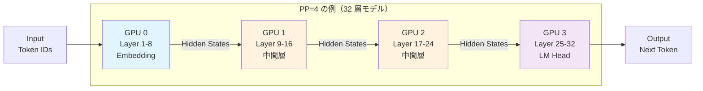
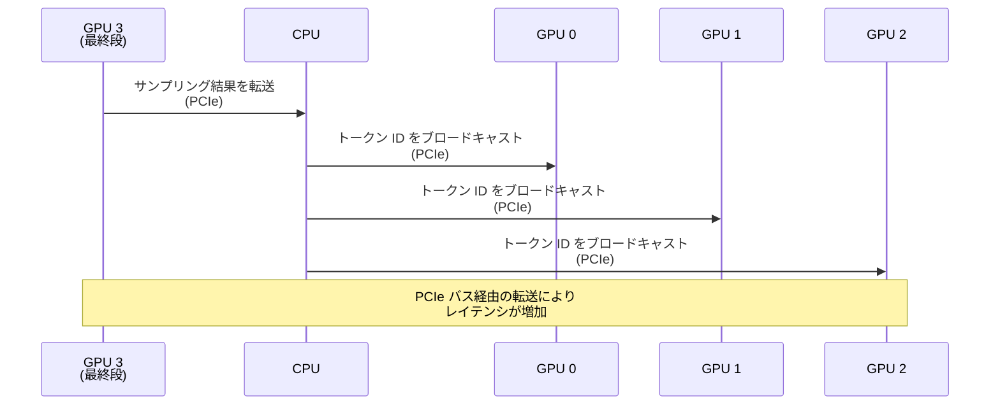
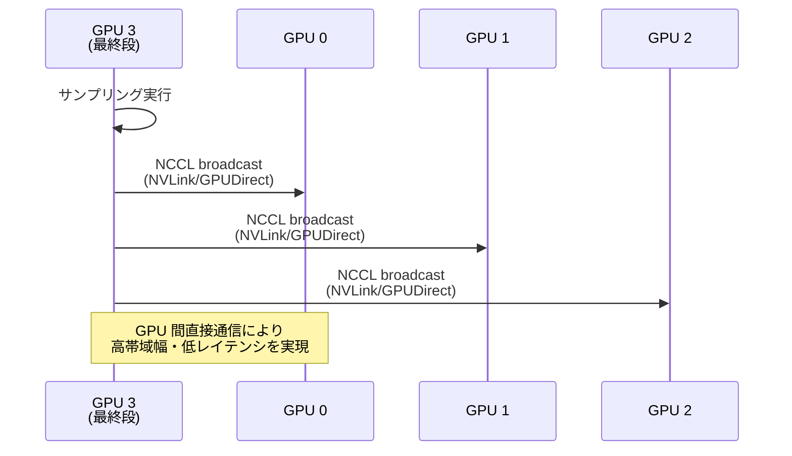
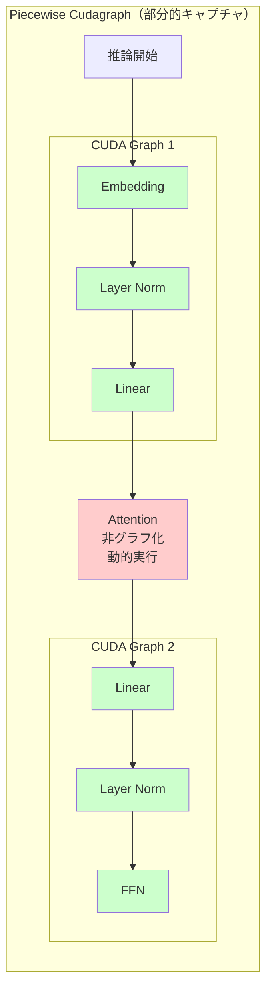
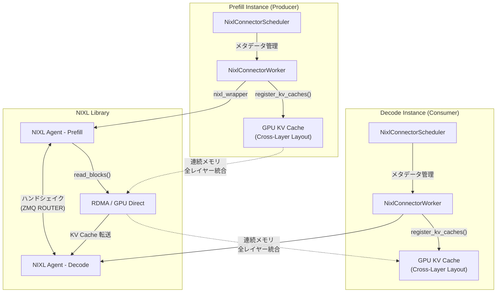
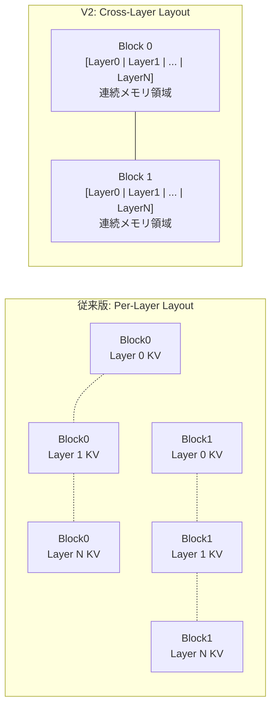

## はじめに

vLLM v0.16.0 がリリースされました。このバージョンは 440 コミット、203 人の貢献者による大規模アップデートであり、特に非同期スケジューリングと Pipeline Parallel の統合、Large Scale Serving における NixlConnector V2 の転送ディスクリプタ削減による性能改善、などが含まれます。

https://github.com/vllm-project/vllm/releases/tag/v0.16.0

本記事では、v0.16.0 の主要アップデートを解説します。以前のリリースノート解説は以下です。

https://zenn.dev/tosshi/articles/997a8cfbcf8c6c

## 主要アップデート詳細

### エンジンコア改善

#### 非同期スケジューリング + パイプライン並列の完全サポート

v0.16.0 では、v0.14.0 で導入された非同期スケジューリングがパイプライン並列化（PP）と併用可能になりました（PR #32618）。これにより、大規模モデルを複数 GPU に分割しながらも非同期処理の恩恵を受けられるようになり、**End-to-End（E2E）スループットが 30.8% 向上、TPOT（Time Per Output Token）が 31.8% 改善**しました。

**非同期スケジューリングとは**

vLLM の推論パイプラインは、以下の 2 つの主要なフェーズで構成されます：

1. **スケジューリングフェーズ（CPU）**: リクエストのバッチ構築、KV キャッシュ割り当て、実行順序決定
2. **実行フェーズ（GPU）**: モデル推論の実際の計算

従来の**同期処理**では、これらが順次実行されていました：

```mermaid
gantt
    title 同期スケジューリング（従来）
    dateFormat X
    axisFormat %L ms

    section CPU
    Sched Batch 1 : crit, 0, 5
    Idle :5, 15
    Sched Batch 2 : crit, 15, 20
    Idle :20, 30
    Sched Batch 3 : crit, 30, 35

    section GPU
    Idle :0, 5
    Execute Batch 1 : done, 5, 15
    Idle :15, 20
    Execute Batch 2 : done, 20, 30
    Idle :30, 35
    Execute Batch 3 : done, 35, 45
```



CPU がスケジューリングを完了するまで GPU は待機し、GPU が実行中は CPU が待機するため、双方のリソースが無駄になります。

**非同期スケジューリング**では、CPU での次バッチのスケジューリングを GPU での現在バッチの実行と並行して実行します：

```mermaid
gantt
    title 非同期スケジューリング（v0.14.0 以降）
    dateFormat X
    axisFormat %L ms

    section CPU
    Sched Batch 1 : crit, 0, 5
    Sched Batch 2 : crit, 5, 10
    Sched Batch 3 : crit, 10, 15
    Sched Batch 4 : crit, 15, 20

    section GPU
    Idle :0, 5
    Execute Batch 1 : done, 5, 15
    Execute Batch 2 : done, 15, 25
    Execute Batch 3 : done, 25, 35
```



GPU が Batch 1 を実行中に、CPU は並行して Batch 2 のスケジューリングを実行します。これにより、CPU スケジューリングのオーバーヘッドが GPU 実行時間に隠蔽され、GPU の稼働率が向上します。

**パイプライン並列化とは**

大規模モデル（例: 70B, 405B）は 1 つの GPU メモリに収まらないため、モデルをレイヤー単位で複数 GPU に分割します。これをパイプライン並列化（PP）と呼びます。



各 GPU は前段の GPU から中間結果（hidden states）を受け取り、自分の担当レイヤーで処理後、次段へ送信します。

::::details なぜ v0.14.0 では併用できなかったのか

PP では、最終段の GPU のみがサンプリング（次トークン選択）を実行します。選択されたトークン ID は、次の forward pass 開始前に全 GPU へブロードキャストされる必要があります。v0.14.0 の非同期スケジューリング実装では、このトークン ID のブロードキャスト機構が欠けていたため、中間段の GPU が次トークンを知ることができず、推論が停止してしまいました。

::::

**v0.16.0 の実装詳細: GPU 直接通信によるトークン ID ブロードキャスト**

PR #32618 では、GPU 側で直接トークン ID テンソルを通信することで、CPU 往復を回避する実装が導入されました。

::::details 従来の CPU 経由通信 vs 新しい GPU 直接通信

**従来の CPU 経由の通信パターン（v0.14.0）: **



PCIe バス経由の CPU-GPU 間転送が必要であり、帯域幅の制約とレイテンシのオーバーヘッドが発生します。

**新しい GPU 直接通信パターン（v0.16.0）: **



`torch.distributed.broadcast` を利用した NCCL 通信により、GPU 間を直接接続する NVLink または GPUDirect の帯域幅を最大限活用できます。

::::

**実装のキーポイント**

1. **トークン ID の直接ブロードキャスト**
   - 最終ランク（GPU 3）がサンプリングしたトークン ID テンソルを `torch.distributed.broadcast` で直接ブロードキャスト
   - 最終ランク以外（GPU 0-2）は `self.input_batch.prev_sampled_token_ids` テンソルを受信

2. **リクエストインデックスマッピングの再構築**
   - 受信したトークン ID を正しいリクエストに関連付けるため、`prev_req_id_to_index` を再構築
   - 同じ箇所で実行することで、同期オーバーヘッドを最小化

3. **キャッシング機構**
   - 非最終ランクでは、受信したトークン ID をキャッシュ
   - 次のイテレーションで再利用可能

**通信パターンの比較**

| 項目 | CPU 経由（v0.14.0） | GPU 直接（v0.16.0） |
|------|-------------------|-------------------|
| 経路 | GPU → PCIe → CPU → PCIe → GPU | GPU → NVLink/GPUDirect → GPU |
| 帯域幅 | PCIe Gen4: ~32GB/s | NVLink 4.0: ~900GB/s |
| レイテンシ | 高い（CPU 往復） | 低い（GPU 間直接） |
| CPU 負荷 | 高い | 低い |

NVLink の帯域幅は PCIe の約 28 倍であり、この差が 30.8% のスループット向上に寄与しています。

**ベンチマーク結果**

テスト環境: Qwen/Qwen3-30B-A3B-Thinking-2507-FP8、PP=4、最大同時シーケンス 128、入力 2 トークン、出力 512 トークン

| 指標 | v0.16.0 | 従来版 | 改善率 |
|------|---------|--------|--------|
| リクエストスループット | 11.72 req/s | 8.96 req/s | **+30.8%** |
| 出力トークンスループット | 5,999 tok/s | 4,585 tok/s | **+30.8%** |

また、TPOT（初トークン除く）も 31.8% 改善しました。

**使用方法**

基本的には追加設定不要です。PP を使用する際に自動的に適用されます：

```python
from vllm import EngineArgs

engine_args = EngineArgs(
    model="meta-llama/Meta-Llama-3.1-70B",
    pipeline_parallel_size=4,  # PP を指定するだけ
    # async_scheduling はデフォルトで True
)
```

サーバー起動:
```bash
vllm serve meta-llama/Meta-Llama-3.1-70B -pp 4 --max-num-seqs 128
```

#### torch.compile の進化

v0.16.0 では、torch.compile の対応が大幅に強化されました。V1 アーキテクチャでは **torch.compile がデフォルトで有効**になり、すべてのコンパイルはリクエスト処理前に完了するため、レスポンスタイムのスパイクが発生しません。

**Multimodal Encoder 対応（新機能）**

LLaMA 4、Qwen-VL 等の vision-language モデルのエンコーダーをコンパイル可能になりました。`@support_torch_compile` デコレータの拡張により、vision-language モデルでの性能改善が期待できます。デフォルトは OFF で、`compile_mm_encoder: true` で有効化します。

**Dynamic Shapes 対応の強化**

3 つのモードを提供：

| モード | 特徴 | 推奨用途 |
|--------|------|----------|
| `BACKED` (デフォルト) | 最大パフォーマンス、ガードの安全でない削除を許容 | 本番環境 |
| `UNBACKED` | 最も保守的、ガードに対する最強の保証 | デバッグ |
| `BACKED_SIZE_OBLIVIOUS` (実験的) | BACKED より安全、UNBACKED より高性能 | 実験的環境 |

**コンパイルキャッシュの改善**

PR #34003 で「Stop compiling identical artifacts」により重複コンパイル防止が実装されました。キャッシュディレクトリ `~/.cache/vllm/torch_compile_cache` 全体をコピーすることで、起動時間を大幅短縮できます。

**Piecewise Cudagraph と Full Cudagraph Capture**

v0.16.0 では、CUDA Graph の最適化手法が大幅に強化されました。

::::details Piecewise Cudagraph とは何か

**CUDA Graph とは**

CUDA Graph は、GPU カーネルの起動シーケンスを事前に記録し、一度の API コールで実行する最適化手法です。通常、各カーネル起動には CPU-GPU 間の同期オーバーヘッドが発生しますが、CUDA Graph を使用することで、このオーバーヘッドを大幅に削減できます。



```mermaid
graph TB
    subgraph "通常実行（オーバーヘッドあり）"
        direction LR
        CPU1[CPU: Kernel 1 起動] --> GPU1[GPU: Kernel 1 実行]
        GPU1 --> CPU2[CPU: Kernel 2 起動]
        CPU2 --> GPU2[GPU: Kernel 2 実行]
        GPU2 --> CPU3[CPU: Kernel 3 起動]
        CPU3 --> GPU3[GPU: Kernel 3 実行]
    end

    subgraph "CUDA Graph（オーバーヘッド削減）"
        direction LR
        CPUG[CPU: Graph 起動] --> GPUG1[GPU: Kernel 1]
        GPUG1 --> GPUG2[GPU: Kernel 2]
        GPUG2 --> GPUG3[GPU: Kernel 3]
    end

    style CPU1 fill: #ffcccc
    style CPU2 fill: #ffcccc
    style CPU3 fill: #ffcccc
    style CPUG fill: #ccffcc
```

通常実行では各カーネル起動に CPU オーバーヘッドが発生しますが、CUDA Graph では一度の起動で複数カーネルを連続実行できます。

**Piecewise Cudagraph の必要性**

しかし、すべての操作が CUDA Graph 対応ではありません。特に以下の操作は CUDA Graph でキャプチャできません：

- Cascade Attention（特定の Attention 実装）
- 動的メモリ割り当てを含む操作
- CPU との同期が必要な操作

**Piecewise（部分的）Cudagraph**は、計算グラフを **CUDA Graph 対応部分と非対応部分に分割**し、対応部分のみをグラフ化する手法です。



Attention 操作を境界として計算グラフを分割し、前後の対応部分を別々の CUDA Graph としてキャプチャします。これにより、互換性のない操作を含む場合でも、部分的に CUDA Graph の最適化を享受できます。

**Full Cudagraph Capture との違い**

| 項目 | Piecewise Cudagraph | Full Cudagraph Capture |
|------|-------------------|----------------------|
| キャプチャ範囲 | 対応部分のみ | すべての操作 |
| 互換性 | 高い（非対応操作も実行可能） | 低い（すべて対応必須） |
| オーバーヘッド削減 | 中程度 | 最大 |
| 適用モデル | 大型モデル、複雑な Attention | 小型モデル、シンプルな構造 |

**Full Cudagraph Capture** は、Flash Attention v2 などの完全に CUDA Graph 対応の実装を使用する場合に有効化されます。小型モデルや MoE（Mixture of Experts）の decode フェーズでは、Full Cudagraph Capture によりさらなる高速化が可能です。

::::

**パフォーマンスへの影響**

Piecewise Cudagraph は、CUDA Graph 対応 GPU カーネルシーケンスを低オーバーヘッドで実行することで、以下の性能向上を実現します：

- **カーネル起動オーバーヘッド削減**: CPU-GPU 同期回数の削減
- **パイプライン効率の向上**: カーネル間の依存関係の最適化
- **レイテンシの改善**: 特に小さいバッチサイズでの効果が顕著

Full Cudagraph Capture が適用可能な場合、小型モデルや MoE の decode 速度がさらに向上します。

**Auto-tuning 機能**

`compile_sizes` 指定で特定バッチサイズ用カーネルを最適化します。例えば 8x2048x3072 の行列乗算で cublas より高速な Triton カーネルを自動選択します。デフォルトは OFF（初回実行が遅いため）ですが、最大性能が必要な場合に推奨されます。

**使用方法**

オフライン推論（LLM クラス）:
```python
from vllm import LLM
from vllm.config.compilation import CompilationConfig, DynamicShapesConfig, DynamicShapesType

llm = LLM(
    model="meta-llama/Llama-3.2-1B",
    compilation_config=CompilationConfig(
        dynamic_shapes_config=DynamicShapesConfig(
            type=DynamicShapesType.UNBACKED
        )
    )
)
```

オンラインサービング:
```bash
# Dynamic shapes 設定
vllm serve meta-llama/Llama-3.2-1B \
  -cc.dynamic_shapes_config.type=unbacked

# 特定サイズでコンパイル（auto-tuning）
vllm serve meta-llama/Llama-3.2-1B \
  --compilation-config '{"compile_sizes": [1, 2, 4, 8]}'
```

#### その他のエンジンコア改善

**Speculative Decoding の最適化**（PR #33612）: メモリ割り当てオーバーヘッドを削減し、さらに 1.5% のスループット向上を達成しました。プレースホルダーリストの再利用により、Time to First Token が 118.95ms → 100.57ms に改善しました。

**RLHF ワークフロー改善**: ネイティブ NCCL 重み同期 API（PR #31943）、QeRL 用層ごと再ロード（PR #32133）、エンジン一時停止/再開と要求保持（PR #32351）により、RLHF トレーニングワークフローが強化されました。

**バグ修正**: torchrun PP Broadcast デッドロック（PR #33701）が修正され、外部起動ツールでパイプライン並列化を使用する際の安定性が向上しました。

### Large Scale Serving の進化

#### NixlConnector V2: Cross-Layer KV Cache Layout

v0.16.0 の Large Scale Serving における最大の改善は、**NixlConnector V2** の導入です（PR #33339、RFC #27742）。従来のレイヤーごとに分離された KV キャッシュメモリレイアウトを、ブロック単位で全レイヤーの KV データを連続配置するレイアウトに変更し、転送バッファのフラグメンテーションを劇的に削減しました。

::::details 従来版（V1）の問題点と V2 の改善内容

**従来版（V1）の問題点**

従来の NixlConnector では、KV キャッシュが**レイヤーごとに個別のテンソルとして確保**されていました。例えば 32 層のモデルでは：

- 1 ブロックの転送に **32 個の非連続メモリセグメント**が必要
- さらに K/V の分離、num_kv_heads 次元で追加フラグメンテーション
- 結果として、1000 リクエスト処理時に 32 レイヤー × 約 1000 ブロック = 約 32,000 個の転送ディスクリプタが生成されます（PR #33339 の Config 3 では実測値 **34,000 個**）

この大量のフラグメンテーションが NIXL ライブラリの転送効率を大幅に低下させていました。

**V2 の改善内容: Cross-Layer KV Cache Layout**

従来（Per-Layer Layout）:
```
Block 0: [Layer0_KV] [Layer1_KV] ... [Layer31_KV]  -- 各レイヤー別メモリ領域
Block 1: [Layer0_KV] [Layer1_KV] ... [Layer31_KV]  -- 非連続
```

V2（Cross-Layer Layout）:
```
Block 0: [Layer0_KV | Layer1_KV | ... | Layer31_KV]  -- 全レイヤー連続配置
Block 1: [Layer0_KV | Layer1_KV | ... | Layer31_KV]  -- 1 ブロック = 1 転送
```

GPU Model Runner が int8 バッファとして統一メモリ領域を確保し、view/permute 操作で各 Attention Backend が要求する形式に変換します。以下の 3 つの条件が揃ったときのみ有効化されます：

1. **KV Cache Spec**: 均一モデル（非 HMA）であること
2. **Connector**: `prefer_cross_layer_blocks = True` を返すこと
3. **Attention Backend**: `get_kv_cache_stride_order()` をサポートすること

::::

**NixlConnector V2 アーキテクチャ**



**メモリレイアウト比較**



**性能改善の数値**

PR #33339 のベンチマーク結果（モデル: Llama-3.1-8B-Instruct）:

**Config 1（1000 req, 16 input tokens）: **

| メトリクス | 従来版 | V2 | 改善率 |
|-----------|--------|-----|--------|
| TTFT | 18,756ms | 8,494ms | **2.2 倍高速** |
| Tok/sec | 5,288 | 8,573 | **1.6 倍向上** |
| 転送ディスクリプタ | 56 | 1 | **98.2% 削減** |

**Config 3（128 req, 10,240 input tokens）: **

| メトリクス | 従来版 | V2 | 改善率 |
|-----------|--------|-----|--------|
| Tok/sec | 62,340 | 117,631 | **1.9 倍向上** |
| 転送ディスクリプタ | 34,000 | 422 | **98.8% 削減** |

**有効化方法**

FlashAttention または FlashInfer バックエンド使用時、KV Cache レイアウトが HND (Head, Num_blocks, Dimension) の場合に、以下の方法で有効化できます：

CLI フラグ:
```bash
vllm serve MODEL \
  --kv-connector-extra-config '{"enable_cross_layers_blocks": "true"}'
```

環境変数:
```bash
export CROSS_LAYERS_BLOCKS=True
vllm serve MODEL
```

:::message
Cross-Layer Layout は、メモリレイアウトを変更するだけで Attention 側の計算性能に影響を与えず、RDMA 転送効率を劇的に改善します。転送ディスクリプタ 98.8% 削減、TTFT 2.2 倍、スループット最大 1.9 倍という効果が得られます。
:::

#### その他の Disaggregated Serving 改善

**Mooncake コネクタ刷新**（PR #31034）: ブートストラップサーバー付きリワークにより、接続管理が改善されました。

**EPLB（Expert-Level Pipeline Load Balancing）**: ルーターリプレイによる論理エキスパートキャプチャ（PR #33013）により、MoE モデルの負荷分散が最適化されました。

**メトリクス**: KV オフロードコネクタメトリクス（PR #27942）、P/D disaggregation 向けラベル付きプロンプトトークンメトリクス（PR #33290）が追加されました。

### モデルサポート拡張

v0.16.0 では、多数の新規モデルアーキテクチャと機能拡張が追加されました。

#### 新規アーキテクチャ

| モデル名 | 説明 | PR 番号 |
|---------|------|--------|
| GLM-OCR with MTP | マルチターンダイアログ対応の光学文字認識モデル | #33005 |
| Qwen3-ASR | 音声認識モデル | #33312 |
| DeepSeek-OCR-2 | 第 2 世代の DeepSeek OCR モデル | #33165 |
| Intern-S1-Pro | InternLM シリーズのプロフェッショナル版 | #33636 |
| MiniCPM-o 4.5 | マルチモーダル対応の軽量モデル | #33431 |
| openPangu7B-VL | ビジョンタスク向けの大規模言語モデル | #32449 |
| NemotronHPuzzle | 異種構造設計の Nemotron モデル | #32549 |
| MusicFlamingo | 音楽理解に特化したマルチモーダルモデル | #32696 |
| FunAudioChat | 音声対話用モデル | - |
| ColBERT | 情報検索用 BERT 系モデル | #33686 |
| voyage-4-nano | 軽量埋め込みモデル | #33720 |
| GLM-5 | GLM シリーズの第 5 世代 | #34124 |

#### Speculative Decoding 対応モデル

| モデル名 | 説明 | PR 番号 |
|---------|------|--------|
| EAGLE3 for Hunyuan/HunyuanVL | 推論高速化用のドラフトモデル（Hunyuan 系対応） | #33035 |
| AFMoE | Adaptive Factorization MoE 対応の高速化 | #33111 |
| Mistral3 | Mistral 系モデルの第 3 世代向け | #33939 |

**Unified Parallel Drafting**（PR #32887）により、AMD の PARD と AWS の P-EAGLE が統一フレームワークに統合されました。GPT-OSS 120B で K=7 の P-EAGLE が約 560 tok/s（ベースライン比 1.52 倍）、Llama 3.3 70B-NVFP4 で PARD が約 254 tok/s（ベースライン比 3.10 倍）を達成しています。

#### LoRA 拡張対応モデル

| モデル名 | 説明 | PR 番号 |
|---------|------|--------|
| Gemma3 | ビジョンコンポーネントアダプタ対応 | #32764 |
| Nemotron-H MTP models | マルチターンダイアログ用 LoRA 対応 | #32265 |
| Qwen3 | 出力埋め込みの適応機能を追加 | #29816 |

**最適化**: fused MoE-LoRA カーネルインデックス最適化（PR #32770, #32774）、unpermute-aware fusion（PR #32655）により、LoRA 使用時のオーバーヘッドが削減されました。

#### 特定モデルの機能改善

| モデル名 | 改善内容 | PR 番号 |
|---------|---------|--------|
| Qwen3-Omni | 音声文字起こし機能の改善 | #29828 |
| Mistral Large 3 | FlashInfer MoE 最適化を適用 | #33174 |
| DeepSeek V3.2 | 高速 detokenization とトークナイザー修正 | #33855, #33832 |
| GLM-5 | MTP 精度改善の適用 | #34385 |

---

### 量子化機能の拡充

v0.16.0 では、量子化手法の追加と既存手法の改善が行われました。

#### 新規量子化手法

**CompressedTensorsW8A16Fp8**（PR #33280）: 重み 8bit（FP8）、活性化 16bit の量子化手法が追加されました。

**ModelOpt MXFP8**: 密モデル向けの MXFP8 量子化（PR #33786）が追加されました。MXFP8 はブロック単位でスケーリングファクターを適用することで、従来の FP8 量子化よりも高い精度を維持します。

**NVFP4/FP8 on Turing GPU**: Turing GPU（RTX 20 シリーズ）での FP4/FP8 量子化がサポートされました（PR #33076）。

**TP > 4 for FP4 Gemm**（PR #31099）: FP4 量子化が Tensor Parallelism サイズ 4 以上でサポートされました。

#### バグ修正

FP8 オンライン量子化メモリ（PR #31914）、非対称 W4A16 ConchLinear for CT（PR #33200）、DeepSeek V3.2 NVFP4（PR #33932）、LoRA FP8（PR #33879）、量子化 Falcon-H1 ロード（PR #32728）など、多数のバグが修正されました。

#### 削除された量子化手法

**BitBlas**（PR #32683）と **Marlin 24**（PR #32688）が削除されました。これらの量子化手法を使用していた場合は、他の量子化方式（FP8、INT8、Marlin など）への移行が必要です。

### API & フロントエンド機能

v0.16.0 では、API の機能拡張と新規エンドポイントが追加されました。

#### WebSocket Realtime API（新機能）

OpenAI の Realtime API にインスパイアされた、音声認識に特化した **WebSocket ベースのストリーミング API** が追加されました（PR #33187）。WebSocket 接続を通じて音声データをリアルタイムに送受信できます。

**技術的詳細**:
- プロトコル: WebSocket (`ws://host/v1/realtime`)
- 対応モデル: Voxtral Streaming モデル（音声処理用）
- 音声フォーマット: PCM16 @ 16kHz mono（base64 エンコード）

**使用例**:

1. WebSocket エンドポイント (`ws://host/v1/realtime`) に接続
2. 音声チャンクを base64 エンコードで段階的に送信
3. コミットメッセージを送信
4. 文字起こし結果を WebSocket 経由で受信

リアルタイム音声認識アプリケーション、ストリーミング音声文字起こしサービス、音声ベースのインタラクティブアプリケーションなどの新しいユースケースが開拓されます。

#### --disable-access-log-for-endpoints オプション

指定したエンドポイントの uvicorn アクセスログを抑制する CLI オプションが追加されました（PR #30011）。ヘルスチェックやメトリクスエンドポイントなど、頻繁にポーリングされるエンドポイントのログノイズを削減します。

```bash
vllm serve Qwen/Qwen3-0.6B \
  --disable-access-log-for-endpoints /health,/metrics,/ping
```

本番環境での運用において、ログ管理とデバッグ効率を大幅に改善する重要な機能です。

#### Responses API の拡張

`/v1/responses` API に、生成制御のための基本的なサンプリングパラメータが追加されました（PR #32609）。

追加されたパラメータ:

| パラメータ | 説明 |
|-----------|------|
| `stop` | 生成停止シーケンス |
| `seed` | 再現可能な生成のためのランダムシード |
| `repetition_penalty` | 生成テキストの繰り返しを制御 |
| `ignore_eos` | End-of-Sequence トークンを無視するかどうか |
| `vllm_xargs` | 高度な使用例向けのカスタム拡張引数 |

これにより、`/v1/chat/completions` と `/v1/responses` の機能パリティが向上しました。

#### 構造化出力 + Reasoning のパフォーマンス最適化

構造化出力と推論モデル（Reasoning Models）を組み合わせた場合のパフォーマンスが最適化されました（PR #33557）。`reasoner.is_reasoning_end(request.prompt_token_ids)` チェックをコアエンジンからフロントエンドに移動することで、エンジンループ内での繰り返し実行によるオーバーヘッドを削減しました。

また、DeepSeek V3.2 の `tool_choice==required` + thinking mode での内部サーバーエラーも解決されました。

#### マルチターンツール呼び出し ID の保持

Kimi K2 などのモデルが生成するネイティブなツール呼び出し ID を保持するようになりました（PR #32768）。これにより、マルチターン（複数回のやり取り）でのツール呼び出しが正しく機能します。

従来の実装では、モデルが特定の ID フォーマット（例: `functions.get_weather:0`）でツール呼び出しを生成しても、システムがこれらのネイティブ ID を破棄し、ランダムな ID で置き換えていました。後続のターンでモデルが一貫した ID を期待するため、マルチターンツール呼び出しが破綻していましたが、この問題が解決されました。

#### その他の API 改善

**YAML ファイルでのネスト設定**（PR #33193）: 設定管理の柔軟性が向上しました。

**バッチ文字起こし/翻訳サポート**（PR #33934）: フロントエンド機能が拡張されました。

**早期トークン化検証**（PR #31366）: エラーハンドリングが改善されました。

**DeepSeek ReasoningParser**（PR #33221）: 推論モデルのサポートが強化されました。

---

### 破壊的変更

v0.16.0 では後方互換性のない変更がいくつか導入されました。既存のコードベースを v0.16.0 にアップグレードする際は注意が必要です。

#### 削除された API フィールドと環境変数

**Deprecated reasoning_content メッセージフィールド削除**（PR #33402）: 非推奨化されていた `reasoning_content` フィールドが削除されました。

**Deprecated pooling items 削除**（PR #33477）: 非推奨化されていた pooling 関連の項目が削除されました。

**Deprecated VLLM_ALL2ALL_BACKEND 環境変数削除**（PR #33535）: 非推奨化されていた環境変数が削除されました。

#### プラットフォームの非推奨化

**IPEX 非推奨化、vllm-xpu-kernels 移行**（PR #33379）: Intel XPU プラットフォームで IPEX が非推奨化され、vllm-xpu-kernels への移行が推奨されます。

#### 削除された量子化手法

**BitBlas 削除**（PR #32683）、**Marlin 24 削除**（PR #32688）: これらの量子化手法が削除されました。代替の量子化方式への移行が必要です。

---

## まとめ

本リリースの主要な改善点として、非同期スケジューリングとパイプライン並列の完全統合による 30.8% のスループット向上、NixlConnector V2 による転送ディスクリプタ 98.8% 削減と最大 1.9 倍のスループット向上、torch.compile の V1 アーキテクチャでのデフォルト有効化と Multimodal Encoder 対応、WebSocket Realtime API による音声認識ワークフローの開拓などが挙げられます。

特に NixlConnector V2 の Cross-Layer KV Cache Layout は、メモリレイアウトの変更だけで RDMA 転送効率を劇的に改善した好例であり、Large Scale Serving における重要なマイルストーンです。また、非同期スケジューリングとパイプライン並列の統合は、v0.14.0 からの進化として、大規模モデルの実用的なデプロイメントを可能にする重要な改善です。

## 参考資料

本記事の執筆にあたり、以下の資料を参照しました。

### 公式ドキュメント
- [vLLM v0.16.0 公式リリースノート](https://github.com/vllm-project/vllm/releases/tag/v0.16.0) - 本記事の主要な情報源
- [vLLM v0.15.0 リリースノート](https://github.com/vllm-project/vllm/releases/tag/v0.15.0) - 前バージョンとの比較用
- [vLLM v0.14.0 リリースノート](https://github.com/vllm-project/vllm/releases/tag/v0.14.0) - 非同期スケジューリング導入
- [vLLM 公式ドキュメント](https://docs.vllm.ai/) - アーキテクチャと使用方法の詳細

### 技術資料
- [PR #32618: Async scheduling + Pipeline Parallelism](https://github.com/vllm-project/vllm/pull/32618) - 非同期スケジューリングと PP の統合
- [PR #33339: NixlConnector V2 Cross-Layer KV Cache Layout](https://github.com/vllm-project/vllm/pull/33339) - NixlConnector V2 の実装
- [RFC #27742: Cross-Layer KV Cache Layout](https://github.com/vllm-project/vllm/issues/27742) - NixlConnector V2 の設計背景
- [PR #34003: Stop compiling identical artifacts](https://github.com/vllm-project/vllm/pull/34003) - torch.compile キャッシュ改善
- [vLLM Blog: torch.compile](https://blog.vllm.ai/2025/08/20/torch-compile.html) - torch.compile の詳細解説
- [Pipeline Parallelism in PyTorch](https://pytorch.org/docs/stable/pipeline.html) - パイプライン並列化の基礎
