## メモ（ここは筆者のメモ欄です）

1. 非同期スケジューリング + PP は GPU のみの機能か？ -> NVLink/NCCL を要求しているので GPU のみと思われるが調査する。
2. 非同期実行のフォールバックの仕組みはどうなっている？B

## はじめに

:::message
**記事の目的**: 本記事では、vLLM v0.16.0 の主要アップデートを解説します。特に私の興味範囲である、非同期スケジューリングと Pipeline Parallel の統合による性能向上、NixlConnector V2 による Large Scale Serving の改善、torch.compile の強化に焦点を当てます。リリースノートを見ながら実装を学ぶスタイルです！ゆくゆくは Contribution したいですがまだきちいです。
:::

vLLM v0.16.0 がリリースされました。このバージョンは 440 コミット、203 人の貢献者による大規模アップデートです。

https://github.com/vllm-project/vllm/releases/tag/v0.16.0

以前のリリースノート解説は以下です。

https://zenn.dev/tosshi/articles/997a8cfbcf8c6c

## 非同期スケジューリング + Pipeline Parallel のサポート

v0.16.0 の最も重要なアップデートの 1 つは、**非同期スケジューリングと Pipeline Parallel（PP）の統合**です（[PR #32618](https://github.com/vllm-project/vllm/pull/32618)）。これにより、大規模モデルを複数 GPU に分割しながら、非同期処理の恩恵を受けられるようになり、**End-to-End スループットが 30.8% 向上、TPOT が 31.8% 改善**しました。

この新機能を理解するため、まず既存技術である非同期スケジューリングと Pipeline Parallel について説明します。

### 非同期スケジューリングとは

非同期スケジューリングは v0.14.0 で導入されました（[v0.14.0 リリースノート](https://github.com/vllm-project/vllm/releases/tag/v0.14.0)）。

vLLM の推論パイプラインは、以下の 2 つの主要なフェーズで構成されます。

1. **スケジューリングフェーズ**では、リクエストのバッチ構築、KV キャッシュ割り当て、実行順序決定を行います。
2. **実行フェーズ**では、モデル推論の実際の処理を実行します。

**同期処理**では、これらが順次実行されていました。

:::message
クラシックなバッファリング付きの Producer/Consumer による並行処理パターンですね。CPU が Producer、GPU が Consumer で、キューがバッファとして機能しています。
:::

```mermaid
gantt
    title 同期スケジューリング
    dateFormat X
    axisFormat %L ms

    section CPU
    Sched Batch 1 : crit, 0, 5
    Idle :5, 15
    Sched Batch 2 : crit, 15, 20
    Idle :20, 30
    Sched Batch 3 : crit, 30, 35

    section GPU
    Idle :0, 5
    Execute Batch 1 : done, 5, 15
    Idle :15, 20
    Execute Batch 2 : done, 20, 30
    Idle :30, 35
    Execute Batch 3 : done, 35, 45
```

CPU がスケジューリングを完了するまで GPU は待機し、GPU が実行中は CPU が待機するため、双方のリソースが無駄になります。

**非同期スケジューリング**では、CPU での次バッチのスケジューリングを GPU での現在バッチの実行と並行して実行します。

:::message
CPU/GPU の観点では非同期ですが、動作としては Pipelined Scheduling と呼ぶ方が直感的かもしれません。ただし Pipeline Parallel（PP）と混同しないよう注意が必要です。
:::

```mermaid
gantt
    title 非同期スケジューリング
    dateFormat X
    axisFormat %L ms

    section CPU
    Sched Batch 1 : crit, 0, 5
    Sched Batch 2 : crit, 5, 10
    Sched Batch 3 : crit, 10, 15
    Sched Batch 4 : crit, 15, 20

    section GPU
    Idle :0, 5
    Execute Batch 1 : done, 5, 15
    Execute Batch 2 : done, 15, 25
    Execute Batch 3 : done, 25, 35
```

GPU が Batch 1 を実行中に、CPU は並行して Batch 2 のスケジューリングを実行します。これにより、CPU スケジューリングのオーバーヘッドが GPU 実行時間に隠蔽され、GPU の稼働率が向上します。

### 非同期パイプラインの実装詳細

非同期パイプラインは、**バッチキュー**と **Future ベースの非同期実行**により実現されています。実装は `vllm/v1/engine/core.py` の `EngineCore` クラスにあります。

#### バッチキューによるパイプライン並列化

`EngineCore` の初期化時に、`batch_queue_size` が 1 より大きい場合、複数のバッチを同時に管理するキューが作成されます。

https://github.com/vllm-project/vllm/blob/v0.16.0/vllm/v1/engine/core.py#L181-L187

このキューにより、**GPU がバッチ N を実行している間に、CPU はバッチ N+1 のスケジューリングを実行**できます。

実行関数は、バッチキューの有無に応じて選択されます。

https://github.com/vllm-project/vllm/blob/v0.16.0/vllm/v1/engine/core.py#L208-L210

#### 同期実行: `step()` メソッド

バッチキューがない場合、`step()` メソッドが使用されます。このメソッドは、`execute_model` で GPU 実行を非同期開始しますが、すぐに `future.result()` でブロックするため、実質的には同期実行です。

https://github.com/vllm-project/vllm/blob/v0.16.0/vllm/v1/engine/core.py#L389-L422

#### 非同期パイプライン実行: `step_with_batch_queue()` メソッド

https://github.com/vllm-project/vllm/blob/v0.16.0/vllm/v1/engine/core.py#L434-L560

実行フローは以下のステートマシンで表現されます。

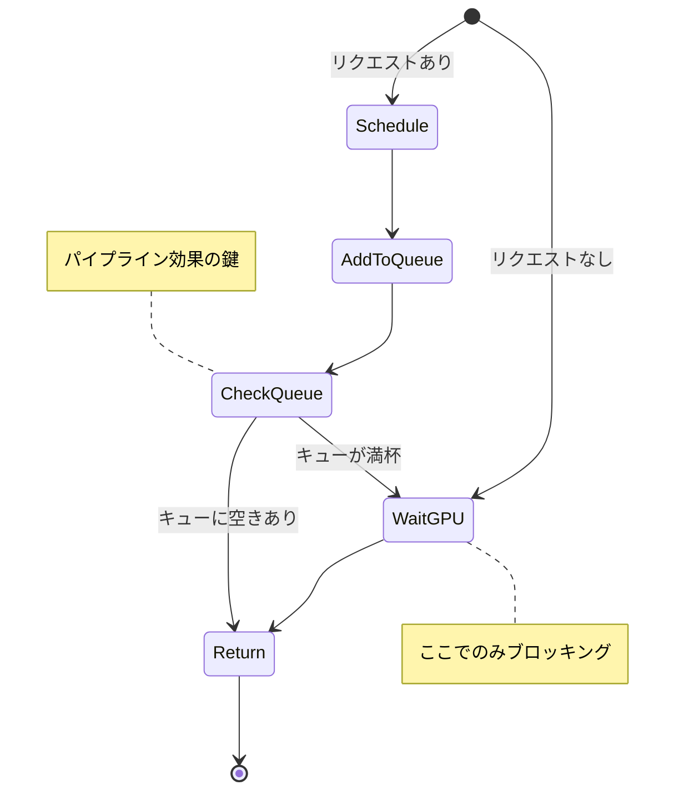

1. **Schedule**: 新しいバッチをスケジュールし、GPU 実行を開始
2. **AddToQueue**: バッチをキューに追加
3. **CheckQueue**: キューの状態を判定
4. **Return**: 即座にリターン（次のバッチをスケジュール可能）
5. **WaitGPU**: 最も古いバッチの完了を待機（ブロッキング）

リクエストがない場合は、直接 WaitGPU 状態へ遷移してキューから最古バッチを取り出します。

##### Non-Blocking 実行

https://github.com/vllm-project/vllm/blob/v0.16.0/vllm/v1/engine/core.py#L466-L484

`non_block=True` で GPU 実行を開始し、すぐに Future を返却するため、CPU はブロックされません。

##### 即座のリターン

https://github.com/vllm-project/vllm/blob/v0.16.0/vllm/v1/engine/core.py#L490-L500

バッチキューに空きがあり、GPU がまだ実行中の場合、**ブロックせずに即座にリターン**します。次の `step_with_batch_queue()` 呼び出しで新しいバッチをスケジュールします。

##### パイプライン効果

https://github.com/vllm-project/vllm/blob/v0.16.0/vllm/v1/engine/core.py#L509-L526

キューが満杯になった場合のみ、最も古いバッチの完了を待ちます。

#### AsyncScheduler の役割

非同期実行を支援するため、`AsyncScheduler` クラスが提供されています。

https://github.com/vllm-project/vllm/blob/v0.16.0/vllm/v1/core/sched/async_scheduler.py#L12-L60

`AsyncScheduler` は、`num_output_placeholders` を使用して未完了トークンを追跡します。

`num_output_placeholders` により、GPU 実行中にまだ返されていないトークンのプレースホルダー数を管理します（将来生成される予定のトークン数を事前にカウント）。これにより、GPU 実行完了前に次のスケジューリングが可能になります。

### Pipeline Parallel

https://www.deepspeed.ai/tutorials/pipeline/

:::message
v0.16.0 では上述した非同期スケジューリングと PP との併用が可能になりました。
:::

大規模モデルは 1 つの GPU メモリに収まらないため、モデルをレイヤー単位で複数 GPU に分割します。これを PP と呼びます。詳細は様々な記事で解説されているため確認してください。

### なぜ v0.14.0 では PP と非同期スケジューリングを併用できなかったのか

PP では、最終段の GPU のみがサンプリング（次トークン選択）を実行します。選択されたトークン ID は、次の forward pass 開始前に全 GPU へブロードキャストされる必要があります。

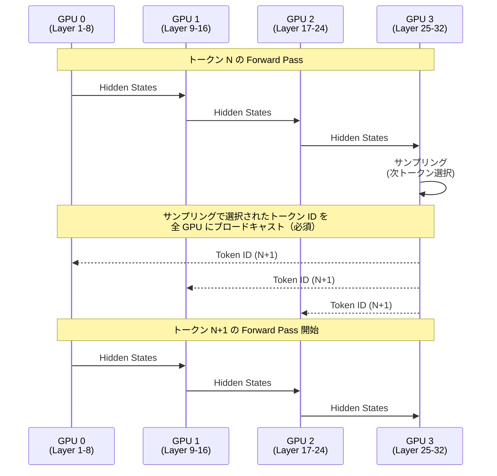

この図が示すように、GPU 3 でサンプリングされたトークン ID は、次の forward pass 開始前に全 GPU へブロードキャストされる必要があります。しかし、v0.14.0 の実装では、このブロードキャストが非同期スケジューリングと競合していました。

#### v0.14.0 で PP と非同期スケジューリングを併用できなかった理由

v0.14.0 では PP と非同期スケジューリングの併用機能が明示的に無効化されていました。その技術的理由は、トークン ID のブロードキャストが **GPU 3 → CPU → 全 GPU** という経路に依存しており、非同期スケジューリングと互換性がなかったためです。仮にこのアプローチのまま併用を試みた場合、以下の問題が発生します。

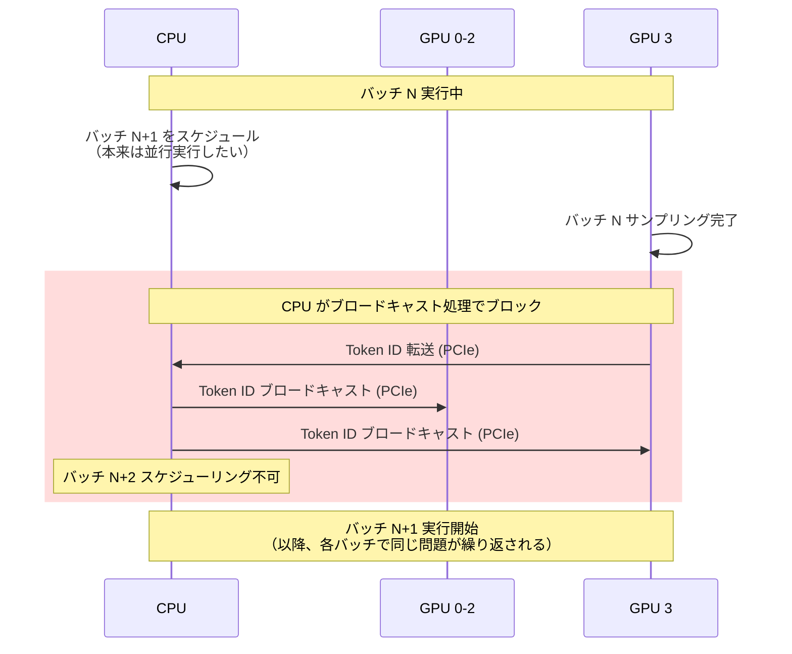

第一に、**CPU がブロードキャスト処理でブロックされる**ため、次のバッチのスケジューリングができません。非同期スケジューリングの目的は「GPU 実行中に CPU が次のバッチをスケジュール」することですが、CPU がブロードキャスト処理に占有されるとこれが不可能になります。

次に、**PCIe バス経由の転送レイテンシ**（往復で数十マイクロ秒）が各トークンごとに累積します。デコードフェーズでは 1 トークンごとにこの処理が発生するため、無視できないオーバーヘッドとなります。

最後に、**バッチキューでの管理が複雑**になります。CPU が複数バッチのトークン ID ブロードキャストを逐次処理する必要があり、どのバッチのトークン ID をどのタイミングでどの GPU に送信したかを追跡する必要があります。

これらの制約により、v0.14.0 では PP と非同期スケジューリングの併用が実装されていませんでした。

### v0.16.0 の新機能: GPU 直接通信によるトークン ID ブロードキャスト

:::message alert
ここからが v0.16.0 の新機能です。前述の非同期スケジューリングと Pipeline Parallel を組み合わせるための実装を解説します。
:::

[PR #32618](https://github.com/vllm-project/vllm/pull/32618) では、GPU 側で直接トークン ID テンソルを通信することで、CPU 往復を回避する実装が導入されました。

#### v0.16.0 の解決策: GPU 間直接通信による完全非同期化

v0.16.0 では、トークン ID が **GPU 3 → 全 GPU** という経路で直接ブロードキャストされます。これにより、CPU と GPU の完全な並行動作が可能になります。

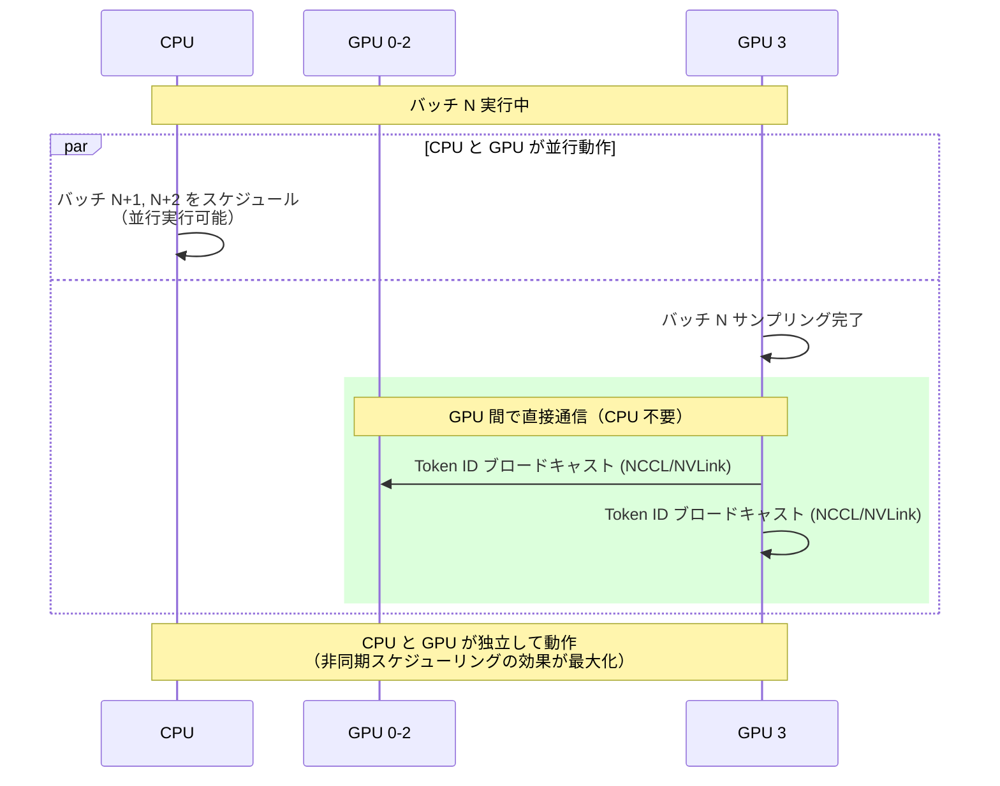

第一に、**CPU がブロードキャスト処理から解放される**ため、GPU 実行中に次のバッチをスケジュールできます。これにより、真にバッファリング付き Producer/Consumer パターンが実現されます。CPU（Producer）がバッチキュー（バッファ）にスケジュールし、GPU（Consumer）がキューから取り出して実行するという、完全に独立した並行動作が可能になります。v0.14.0 では CPU がブロードキャスト処理でブロックされていたため、独立した Producer/Consumer にはなっていませんでしたが、v0.16.0 でようやく実現されました。

次に、**NVLink/GPUDirect 経由の転送レイテンシ**が数マイクロ秒以下に削減されます。

最後に、**バッチキューでの管理が簡素化**されます。各バッチのトークン ID ブロードキャストは GPU 側で完結するため、CPU は各バッチに対して独立した Future を管理するだけで済みます。


### ベンチマーク結果

以下の数値は [PR #32618](https://github.com/vllm-project/vllm/pull/32618) で報告されたベンチマーク結果です。詳細はこちらを確認してください。

## torch.compile の進化

`torch.compile` は Python コードを最適化されたカーネルに自動コンパイルする機能です。PyTorch の動的グラフ実行を、実行時に動的に解析し、複数の演算を融合したり、メモリアクセスパターンを最適化したりします。具体的には、以下のような最適化が自動実行されます。

- **カーネル融合**により、複数の小さな GPU カーネルを 1 つの大きなカーネルにまとめます。これにより、カーネル起動オーバーヘッドが削減され、中間結果のメモリ書き込み・読み込みが不要になります。
- 次に、**メモリアクセス最適化**により、GPU メモリアクセスパターンを最適化し、キャッシュヒット率を向上させます。
- **データレイアウト最適化**により、テンソルのメモリレイアウトを最適化し、連続アクセスを可能にします。

これによって **コード変更なしで性能向上**することが嬉しいポイントです。既存の PyTorch コードに `@torch.compile` デコレータを追加するだけで、自動的に最適化されたコードが生成されます。AWS Neuron SDK も `torch_neuronx.trace()` による同様のコンパイル機能を提供していますが、実装上は実行時の構造の動的キャプチャをする `torch.compile` とサンプル入力によるトレーシングをする `torch_neuronx.trace` ではアプローチが異なります。

**torch.compile の特徴**

torch.compile は **TorchDynamo** により、実行時に Python のフレーム評価フックを使用して計算グラフを動的に取得します。これにより、動的な形状や制御フローをサポートしながら、コード変更なしで最適化を適用できます。

### v0.16.0 での強化

v0.16.0 では、torch.compile の対応が強化されました。V1 アーキテクチャでは **torch.compile がデフォルトで有効**になっています（[PR #26847](https://github.com/vllm-project/vllm/pull/26847)）。

**Multimodal Encoder 対応（新機能）**

LLaMA 4、Qwen-VL 等の vision-language モデルのエンコーダーをコンパイル可能になりました。vision-language モデルでの性能改善が期待されます。

**コンパイルキャッシュの改善**

[PR #34003](https://github.com/vllm-project/vllm/pull/34003) で「Stop compiling identical artifacts」により重複コンパイル防止が実装されました。キャッシュディレクトリ `~/.cache/vllm/torch_compile_cache` 全体をコピーすることで、再コンパイルをスキップし起動時間を短縮できます。

## その他のエンジンコア改善

**Speculative Decoding の最適化**（[PR #33612](https://github.com/vllm-project/vllm/pull/33612)）: メモリ割り当てオーバーヘッドを削減し、1.5% のスループット向上が報告されています。

RLHF（Reinforcement Learning from Human Feedback）ワークフローも改善されました。

ネイティブ NCCL 重み同期 API（[PR #31943](https://github.com/vllm-project/vllm/pull/31943)）により、分散トレーニング時のモデル重み同期が高速化され、Python オーバーヘッドが削減されます。QeRL 用層ごと再ロード（[PR #32133](https://github.com/vllm-project/vllm/pull/32133)）では、Training フェーズで Q 関数とポリシーのレイヤーを選択的に再ロードできるため、メモリ効率とトレーニング速度が向上します。エンジン一時停止/再開と要求保持（[PR #32351](https://github.com/vllm-project/vllm/pull/32351)）により、Generation フェーズ（推論による応答生成）と Training フェーズ（モデル更新）を交互に実行する際、エンジンを一時停止してもリクエストを保持できるため、ワークフロー全体の効率が大幅に改善されました。

## NixlConnector V2: Cross-Layer KV Cache Layout

個人的な注目アップデートは **NixlConnector V2** の導入です（[PR #33339](https://github.com/vllm-project/vllm/pull/33339)、[RFC #27742](https://github.com/vllm-project/vllm/issues/27742)）。V1 のレイヤーごとに分離された KV キャッシュメモリレイアウトを、ブロック単位で全レイヤーの KV データを連続配置するレイアウトに変更し、転送ディスクリプタの増大を削減しました。

:::message alert
非常に効果がわかりづらいですが、最近話題の Prefill/Decode Disaggregated Inference では KV キャッシュ転送が TTFT のパフォーマンスにクリティカルな要素です。 NIXLConnector V2 のこのアップデートはこの KV キャッシュ転送の効率にダイレクトに効いてきます。
:::

**転送ディスクリプタ削減の効果**

V1 では、KV キャッシュが**レイヤーごとに個別のテンソルとして確保**されていたため、1 ブロックの転送に大量の転送ディスクリプタ（送信元/送信先アドレスとサイズを含むメタデータ構造）が必要でした。V2 の Cross-Layer Layout では、ブロック単位で全レイヤーの KV データを物理的に連続配置することで、転送ディスクリプタを劇的に削減しました。

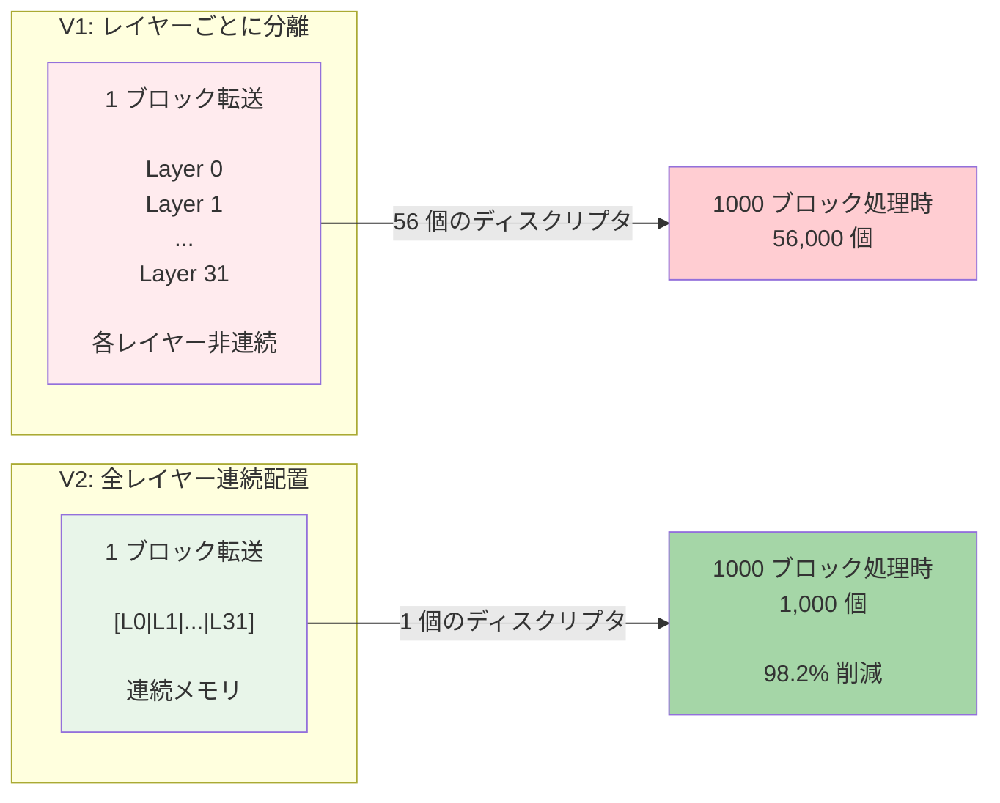

実測値（32 層 Llama-3.1-8B-Instruct、[PR #33339](https://github.com/vllm-project/vllm/pull/33339) Config 3）では、V1 で 56,000 個必要だった転送ディスクリプタが V2 で 1,000 個に削減され、**98.2% の削減**を達成しました。

Cross-Layer Layout は以下の 3 つの条件が揃ったときのみ有効化されます。

第一に、KV Cache の設定が単一の attention group で構成されている必要があります（全レイヤーが同じページサイズを持つ均一モデル）。Hybrid KV Cache Manager は、sliding window attention と full attention など異なる attention タイプを持つハイブリッドモデル（Gemma 2/3, Llama 4 等）で、レイヤーの attention タイプに応じて異なるブロック数を割り当てる機能です。Cross-Layer Layout は全レイヤーのページサイズが均一である前提のため、複数の KV Cache グループが存在するモデルでは使用できません。

次に、Connector が `prefer_cross_layer_blocks = True` を返す必要があります。最後に、Attention Backend が `get_kv_cache_stride_order()` をサポートしている必要があります。

### 転送ディスクリプタ増大の根本原因: PagedAttention の設計

:::message
ここまでで PagedAttention が転送ディスクリプタ増大の原因かもしれない、と思った方も多いと思いますが正解です！私もそう思って整理してみました。
:::

Cross-Layer KV Cache Layout は、vLLM の PagedAttention アーキテクチャの上に構築された最適化です。転送ディスクリプタが増大する根本原因は、PagedAttention の「レイヤーごとに独立したテンソルを確保する」という設計にあります。以下では、この問題がなぜ発生するのか、そして V2 がどのように既存実装と互換性を保ちながら効率を改善したかを説明します。

#### PagedAttention の基本アーキテクチャ

vLLM の PagedAttention は、KV Cache を固定サイズのブロックに分割して動的に割り当てる仕組みです。重要なポイントは、**Layer ごとに独立した GPU テンソル**として KV Cache が確保されることです。

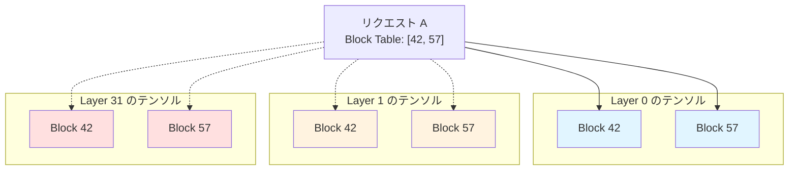

[`_allocate_kv_cache()`](https://github.com/vllm-project/vllm/blob/v0.16.0/vllm/v1/worker/gpu/attn_utils.py#L62-L76) は、各 Layer に対して個別のテンソルを確保します。

この設計により、以下のメリットが得られます。第一に、動的メモリ割り当てにより、必要なブロックのみを確保し、未使用ブロックは他のリクエストで再利用可能になります。次に、Prefix Caching により、共通プレフィックスを持つリクエスト間でブロックを共有できます。最後に、リクエストのトークン数に応じて必要最小限のメモリのみを使用するメモリ効率の高さが実現されます。

#### V1 での転送ディスクリプタ増大問題

しかし、この「Layer ごとの独立テンソル」設計は、**Disaggregated Inference のネットワーク転送時に深刻な問題**を引き起こします。

PagedAttention の設計により、レイヤーごとに独立したテンソルが確保されるため、同じ Block ID でもレイヤーごとに異なる GPU メモリアドレスに配置されます。

```
Layer 0 の Block[42]: GPU メモリアドレス 0x7f8a2000
Layer 1 の Block[42]: GPU メモリアドレス 0x7f8c5000  （Layer 0 から離れている）
Layer 2 の Block[42]: GPU メモリアドレス 0x7f8e8000  （Layer 1 から離れている）
...
Layer 31 の Block[42]: GPU メモリアドレス 0x7fa12000 （Layer 30 から離れている）
```

RDMA（Remote Direct Memory Access）経由でこれらを転送するには、各メモリセグメントに対して個別の**転送ディスクリプタ**（送信元アドレス、送信先アドレス、サイズを含むメタデータ構造）を作成する必要があります。これは RDMA 転送におけるスキャッター/ギャザー問題（複数の非連続なメモリ領域からデータを集めて転送する問題）に相当します。

vLLM の FlashAttention Backend では、各レイヤーの KV Cache を以下のように管理します。

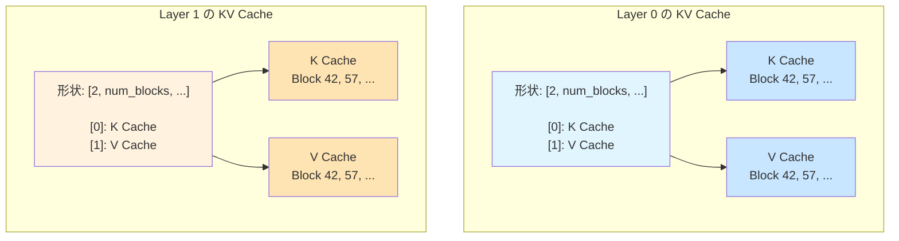

各レイヤーは独立したテンソルとして、第 0 次元で K と V を分離して管理します（完全な形状: `[2, num_blocks, block_size, num_kv_heads, head_size]`）。そのため、32 層モデル（Llama-3.1-8B-Instruct）の場合、理論値は `32 層 × 2 (K/V) = 64 個/ブロック` の転送ディスクリプタが必要です。[PR #33339](https://github.com/vllm-project/vllm/pull/33339) のベンチマーク結果では **56 個/ブロック**と報告されています。

転送ディスクリプタの作成、NIC キューへの登録、完了通知の処理それぞれにオーバーヘッドがあり、これが TTFT（Time To First Token）を悪化させていました。

#### V2 での解決策: Cross-Layer Layout

V2 では、**全レイヤー分を単一の連続テンソルとして確保**し、ブロック単位で全 Layer の KV データを物理的に連続配置することで問題を解決しました（[`allocate_uniform_kv_caches()`](https://github.com/vllm-project/vllm/blob/v0.16.0/vllm/v1/worker/kv_connector_model_runner_mixin.py#L180-L280)）。

これにより、転送に必要な転送ディスクリプタは（連続しているので） **1 個**に削減されます。

「全レイヤーを連続配置すれば転送ディスクリプタが 1 個になる」こと自体は自明です。しかし、この最適化には重大な課題があります。

**Attention Backend が期待するインターフェース**

FlashAttention などの Attention Backend は、各レイヤーの forward 処理で**レイヤーごとに独立したテンソル**を受け取ることを前提に実装されています。

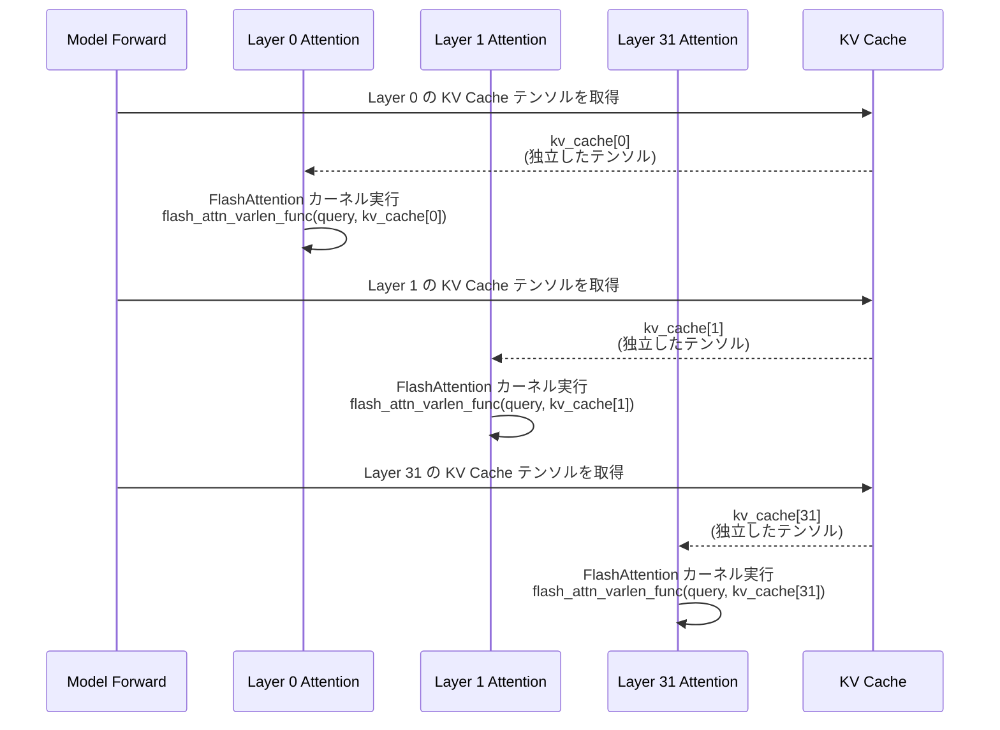

各レイヤーの Attention カーネル（CUDA 実装）は、渡されたテンソルのメモリレイアウトを前提としてメモリアクセスパターンが最適化されています。もし物理メモリレイアウトを変更するなら、FlashAttention の CUDA カーネル実装を全て書き換える必要があります。これは現実的ではありません。

**解決策: view/permute による「物理的には連続、論理的には分離」**

Cross-Layer Layout は、**Attention Backend のカーネル実装を一切変更せずに**メモリレイアウトを最適化します。その仕組みを以下に示します。

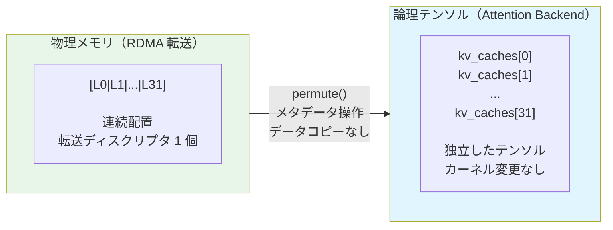

**permute() の役割**: PyTorch のメタデータ操作で次元順序を変更し、物理的には連続配置のまま、論理的には各レイヤーが独立したテンソルに見えるようにします。実データのコピーは発生せず、FlashAttention カーネルは stride を通じて統一バッファにアクセスします。カーネル実装は stride-aware なため性能劣化は観測されていません（RFC #27742）。

この工夫により、**RDMA 転送では連続配置**（転送ディスクリプタ 1 個）、**Attention Backend では独立テンソル**（カーネル変更なし）という両立を実現しています。

### 性能改善の数値

[PR #33339](https://github.com/vllm-project/vllm/pull/33339) のベンチマーク結果。詳細は PR を確認してください。

**Config 1（1000 req, 16 input tokens）**

| メトリクス | V1 | V2 | 改善率 |
|-----------|--------|-----|--------|
| TTFT | 18,756ms | 8,494ms | **2.2 倍高速** |
| Tok/sec | 5,288 | 8,573 | **1.6 倍向上** |
| 転送ディスクリプタ | 56 | 1 | **98.2% 削減** |

**Config 3（128 req, 10,240 input tokens）**

| メトリクス | V1 | V2 | 改善率 |
|-----------|--------|-----|--------|
| Tok/sec | 62,340 | 117,631 | **1.9 倍向上** |
| 転送ディスクリプタ | 34,000 | 422 | **98.8% 削減** |

## その他の Disaggregated Serving 改善

**Mooncake コネクタ刷新**（[PR #31034](https://github.com/vllm-project/vllm/pull/31034)）: ブートストラップサーバー付きリワークにより、接続管理が改善されました。

EPLB（Expert-Level Pipeline Load Balancing）では、ルーターリプレイによる論理エキスパートキャプチャ（[PR #33013](https://github.com/vllm-project/vllm/pull/33013)）により、MoE モデルの負荷分散が最適化されました。

また、KV オフロードコネクタメトリクス（[PR #27942](https://github.com/vllm-project/vllm/pull/27942)）、P/D disaggregation 向けラベル付きプロンプトトークンメトリクス（[PR #33290](https://github.com/vllm-project/vllm/pull/33290)）が追加されました。

## モデルサポート拡張

v0.16.0 では、多数の新規モデルアーキテクチャと機能拡張が追加されました。

### 新規アーキテクチャ

| モデル名 | 説明 | PR 番号 |
|---------|------|--------|
| GLM-OCR with MTP | Multi Token Prediction 対応の光学文字認識モデル | #33005 |
| Qwen3-ASR | 音声認識モデル | #33312 |
| DeepSeek-OCR-2 | 第 2 世代の DeepSeek OCR モデル | #33165 |
| Intern-S1-Pro | InternLM シリーズのプロフェッショナル版 | #33636 |
| MiniCPM-o 4.5 | マルチモーダル対応の軽量モデル | #33431 |
| openPangu7B-VL | ビジョンタスク向けの大規模言語モデル | #32449 |
| NemotronHPuzzle | 異種構造設計の Nemotron モデル | #32549 |
| MusicFlamingo | 音楽理解に特化したマルチモーダルモデル | #32696 |
| FunAudioChat | 音声対話用モデル | - |
| ColBERT | 情報検索用 BERT 系モデル | #33686 |
| voyage-4-nano | 軽量埋め込みモデル | #33720 |
| GLM-5 | GLM シリーズの第 5 世代 | #34124 |

### Speculative Decoding 対応モデル

| モデル名 | 説明 | PR 番号 |
|---------|------|--------|
| EAGLE3 for Hunyuan/HunyuanVL | 推論高速化用のドラフトモデル（Hunyuan 系対応） | #33035 |
| AFMoE | Adaptive Factorization MoE 対応の高速化 | #33111 |
| Mistral3 | Mistral 系モデルの第 3 世代向け | #33939 |

**Unified Parallel Drafting**（[PR #32887](https://github.com/vllm-project/vllm/pull/32887)）により、AMD の PARD と AWS の P-EAGLE が統一フレームワークに統合されました。PR の報告によると、GPT-OSS 120B で K=7 の P-EAGLE が約 560 tok/s（ベースライン比 1.52 倍）、Llama 3.3 70B-NVFP4 で PARD が約 254 tok/s（ベースライン比 3.10 倍）を達成しています（詳細なハードウェア環境は PR を参照）。

### LoRA 拡張対応モデル

| モデル名 | 説明 | PR 番号 |
|---------|------|--------|
| Gemma3 | ビジョンコンポーネントアダプタ対応 | #32764 |
| Nemotron-H MTP models | Multi Token Prediction 対応 LoRA | #32265 |
| Qwen3 | 出力埋め込みの適応機能を追加 | #29816 |

LoRA 関連では、fused MoE-LoRA カーネルインデックス最適化（[PR #32770](https://github.com/vllm-project/vllm/pull/32770), [#32774](https://github.com/vllm-project/vllm/pull/32774)）、unpermute-aware fusion（[PR #32655](https://github.com/vllm-project/vllm/pull/32655)）により、LoRA 使用時のオーバーヘッドが削減されました。

### 特定モデルの機能改善

| モデル名 | 改善内容 | PR 番号 |
|---------|---------|--------|
| Qwen3-Omni | 音声文字起こし機能の改善 | #29828 |
| Mistral Large 3 | FlashInfer MoE 最適化を適用 | #33174 |
| DeepSeek V3.2 | 高速 detokenization とトークナイザー修正 | #33855, #33832 |
| GLM-5 | MTP 精度改善の適用 | #34385 |

## 量子化機能の拡充

v0.16.0 では、量子化手法の追加と既存手法の改善が行われました。

### 新規量子化手法

**CompressedTensorsW8A16Fp8**（[PR #33280](https://github.com/vllm-project/vllm/pull/33280)）: 既存の CompressedTensorsW8A16Fp8 手法にブロック量子化戦略のサポートが追加されました（従来はチャネル単位・テンソル単位のみ対応）。

密モデル向けには MXFP8 量子化（[PR #33786](https://github.com/vllm-project/vllm/pull/33786)）が追加されました。MXFP8 はブロック単位でスケーリングファクターを適用する方式であり、テンソルレベル FP8 量子化と比較して精度劣化の軽減が期待されます。

また、Turing GPU（RTX 20 シリーズ）での FP4/FP8 量子化がサポートされました（[PR #33076](https://github.com/vllm-project/vllm/pull/33076)）。

**TP > 4 for FP4 Gemm**（[PR #31099](https://github.com/vllm-project/vllm/pull/31099)）: FP4 量子化が Tensor Parallelism サイズ 4 を超える構成でもサポートされるようになりました。

## API & フロントエンド機能

v0.16.0 では、API の機能拡張と新規エンドポイントが追加されました。

### WebSocket Realtime API（新機能）

OpenAI の Realtime API にインスパイアされた、音声認識に特化した **WebSocket ベースのストリーミング API** が追加されました（[PR #33187](https://github.com/vllm-project/vllm/pull/33187)）。WebSocket 接続を通じて音声データをリアルタイムに送受信できます。

この API は WebSocket プロトコル (`ws://host/v1/realtime`) で動作し、Voxtral Streaming モデルなどの音声処理用モデルに対応しています。音声フォーマットは PCM16 @ 16kHz mono（base64 エンコード）です。

WebSocket エンドポイントに接続し、音声チャンクを base64 エンコードで段階的に送信した後、コミットメッセージを送信すると、文字起こし結果が WebSocket 経由で返却されます。この API により、リアルタイム音声認識アプリケーション、ストリーミング音声文字起こしサービス、音声ベースのインタラクティブアプリケーションなどの新しいユースケースが開拓されます。

### --disable-access-log-for-endpoints オプション

指定したエンドポイントの uvicorn アクセスログを抑制する CLI オプションが追加されました（[PR #30011](https://github.com/vllm-project/vllm/pull/30011)）。ヘルスチェックやメトリクスエンドポイントなど、頻繁にポーリングされるエンドポイントのログノイズを削減します。

```bash
vllm serve Qwen/Qwen3-0.6B \
  --disable-access-log-for-endpoints /health,/metrics,/ping
```

本番環境での運用において、ログ管理とデバッグ効率を改善する実用的な機能です。

### Responses API の拡張

`/v1/responses` API に、生成制御のための基本的なサンプリングパラメータが追加されました（[PR #32609](https://github.com/vllm-project/vllm/pull/32609)）。

追加されたパラメータは以下の通りです。

| パラメータ | 説明 |
|-----------|------|
| `stop` | 生成停止シーケンス |
| `seed` | 再現可能な生成のためのランダムシード |
| `repetition_penalty` | 生成テキストの繰り返しを制御 |
| `ignore_eos` | End-of-Sequence トークンを無視するかどうか |
| `vllm_xargs` | 高度な使用例向けのカスタム拡張引数 |

これにより、`/v1/chat/completions` と `/v1/responses` の機能パリティが向上しました。

### 構造化出力 + Reasoning のパフォーマンス最適化

構造化出力と推論モデル（Reasoning Models）を組み合わせた場合のパフォーマンスが最適化されました（[PR #33557](https://github.com/vllm-project/vllm/pull/33557)）。`reasoner.is_reasoning_end(request.prompt_token_ids)` チェックをコアエンジンからフロントエンドに移動することで、エンジンループ内での繰り返し実行によるオーバーヘッドを削減しました。

また、DeepSeek V3.2 の `tool_choice==required` + thinking mode での内部サーバーエラーも解決されました。

### マルチターンツール呼び出し ID の保持

Kimi K2 などのモデルが生成するネイティブなツール呼び出し ID を保持するようになりました（[PR #32768](https://github.com/vllm-project/vllm/pull/32768)）。これにより、マルチターン（複数回のやり取り）でのツール呼び出しが正しく機能します。

v0.15.x 以前の実装では、モデルが特定の ID フォーマット（例: `functions.get_weather:0`）でツール呼び出しを生成しても、システムがこれらのネイティブ ID を破棄し、ランダムな ID で置き換えていました。後続のターンでモデルが一貫した ID を期待するため、マルチターンツール呼び出しが破綻していましたが、この問題が解決されました。

### その他の API 改善

**YAML ファイルでのネスト設定**（[PR #33193](https://github.com/vllm-project/vllm/pull/33193)）: 設定管理の柔軟性が向上しました。

**バッチ文字起こし/翻訳サポート**（[PR #33934](https://github.com/vllm-project/vllm/pull/33934)）: フロントエンド機能が拡張されました。

**早期トークン化検証**（[PR #31366](https://github.com/vllm-project/vllm/pull/31366)）: エラーハンドリングが改善されました。

**DeepSeek ReasoningParser**（[PR #33221](https://github.com/vllm-project/vllm/pull/33221)）: 推論モデルのサポートが強化されました。

## まとめ

v0.16.0 は、vLLM のエンジンコアと Large Scale Serving の両面で重要な進化を遂げたリリースです。

非同期スケジューリングと Pipeline Parallel の統合により、大規模モデルの分散推論性能が大幅に向上しました。バッチキューによるパイプライン並列化と GPU 間直接通信により、30.8% のスループット向上と 31.8% の TPOT 改善を達成しています。

Disaggregated Inference では、NixlConnector V2 の Cross-Layer Layout が RDMA 転送効率を改善し、TTFT の大幅な高速化とスループット向上を実現しました。torch.compile の標準化と Multimodal Encoder 対応により、V1 アーキテクチャでの推論最適化が強化されています。

API 面では、WebSocket Realtime API の追加により音声認識などリアルタイムユースケースへの対応が進み、構造化出力とツール呼び出しの改善により実用性が向上しました。これらの改善により、v0.16.0 は本番環境での大規模モデル推論をより実用的にするリリースとなりました。

**参考資料**

- [vLLM v0.16.0 公式リリースノート](https://github.com/vllm-project/vllm/releases/tag/v0.16.0)
- [vLLM v0.15.0 リリースノート](https://github.com/vllm-project/vllm/releases/tag/v0.15.0)
- [vLLM v0.14.0 リリースノート](https://github.com/vllm-project/vllm/releases/tag/v0.14.0)
- [vLLM 公式ドキュメント](https://docs.vllm.ai/)
- [PR #32618: Async scheduling + Pipeline Parallelism](https://github.com/vllm-project/vllm/pull/32618)
- [vLLM EngineCore 実装](https://github.com/vllm-project/vllm/blob/v0.16.0/vllm/v1/engine/core.py)
- [vLLM AsyncScheduler 実装](https://github.com/vllm-project/vllm/blob/v0.16.0/vllm/v1/core/sched/async_scheduler.py)
- [vLLM Scheduler 実装](https://github.com/vllm-project/vllm/blob/v0.16.0/vllm/v1/core/sched/scheduler.py)
- [vLLM Executor 抽象クラス](https://github.com/vllm-project/vllm/blob/v0.16.0/vllm/v1/executor/abstract.py)
- [PR #33339: NixlConnector V2 Cross-Layer KV Cache Layout](https://github.com/vllm-project/vllm/pull/33339)
- [RFC #27742: Cross-Layer KV Cache Layout](https://github.com/vllm-project/vllm/issues/27742)
- [PR #34003: Stop compiling identical artifacts](https://github.com/vllm-project/vllm/pull/34003)
- [vLLM Blog: torch.compile](https://blog.vllm.ai/2025/08/20/torch-compile.html)
- [Pipeline Parallelism in PyTorch](https://pytorch.org/docs/stable/pipeline.html)
