## メモ（ここは筆者のメモ欄です）

1. 非同期スケジューリング + PP は GPU のみの機能か？ -> NVLink/NCCL を要求しているので GPU のみと思われるが調査する。
2. 非同期実行のフォールバックの仕組みはどうなっている？
3. 


  ---
  疑問 2: Cross-Layer KV Cache Layout における Attention Backend の計算効率への影響

  詳細: NixlConnector V2 は「メモリレイアウトを変更するだけで Attention
  側の計算性能に影響を与えない」と記事で述べられていますが、これは本当に自明ではありません。V2 では全レイヤーの KV データを 1
  ブロック内に連続配置し、view/permute 操作で各 Attention Backend が要求する形式に変換するとあります。

  この view/permute はゼロコピー（メタデータのみの変更）で実現できるのでしょうか。もしストライドが非連続になる場合、FlashAttention や FlashInfer
  が内部で contiguous() を呼び出して実データコピーが発生する可能性があります。特に Cross-Layer Layout では、同一レイヤーの異なるブロックの KV
  データがメモリ上で「ブロックサイズ x 全レイヤー数」分だけ離れて配置されるため、Attention 計算時のメモリアクセスパターンが V1 と異なり、GPU
  キャッシュヒット率に影響する可能性があります。

  なぜこの疑問が重要か: RDMA 転送効率の改善は明確ですが、Attention
  計算のホットパスでの性能劣化がないことを確認しなければ、転送改善分が計算側のオーバーヘッドで相殺されるリスクがあります。特に Prefill
  フェーズでは大量のブロックに対して Attention を計算するため、メモリレイアウトの違いが L2
  キャッシュ効率に与える影響を理解することは、この最適化の真の効果を評価する上で不可欠です。

  ---
  疑問 3: PP 環境での GPU 間トークン ID ブロードキャストと NCCL 通信のオーバーヘッド蓄積

  詳細: v0.16.0 では torch.distributed.broadcast による NCCL 通信で GPU 間直接トークン ID 転送を実現していますが、NCCL の broadcast
  は集合通信（collective communication）であり、呼び出しごとにすべての参加ランクが同期ポイントに到達する必要があります。

  PP 環境では各ステージの GPU は異なるタイミングで処理を完了するため、この broadcast が事実上のバリア同期として機能し、最も遅いステージに全体が律速さ
  れる「パイプラインバブル」を生じさせないのでしょうか。特に、非同期スケジューリングでバッチキューに複数バッチが存在する場合、バッチ N
  のブロードキャストとバッチ N+1 の forward pass が同じ NCCL コミュニケーターを共有していると、通信と計算の重畳が制限される可能性があります。

  さらに、デコードフェーズでは 1 トークンごとにこの broadcast が発生するため、数バイトの小さなメッセージに対する NCCL
  の起動レイテンシ（通常数マイクロ秒）が累積的に無視できないオーバーヘッドになりうるのか、また別の NCCL
  ストリームやプロセスグループで通信を分離しているのかが気になります。

  なぜこの疑問が重要か: 記事のベンチマークでは PP=4 で 30.8% のスループット向上が示されていますが、PP=8 や PP=16
  といったより大規模な構成ではブロードキャスト参加者数が増加し、同期コストが非線形に増大する可能性があります。NCCL
  通信の実装詳細を理解することで、スケーラビリティの限界点や、最適な PP サイズの見積もりが可能になります。


## はじめに

:::message
**記事の目的**: 本記事では、vLLM v0.16.0 の主要アップデートを解説します。特に私の興味範囲である、非同期スケジューリングと Pipeline Parallel の統合による性能向上、NixlConnector V2 による Large Scale Serving の改善、torch.compile の強化に焦点を当てます。リリースノートを見ながら実装を学ぶスタイルです！ゆくゆくは Contribution したいですがまだきちいです。
:::

vLLM v0.16.0 がリリースされました。このバージョンは 440 コミット、203 人の貢献者による大規模アップデートであり、特に非同期スケジューリングと Pipeline Parallel の統合、Large Scale Serving における NixlConnector V2 の転送ディスクリプタ削減による性能改善、などが含まれます。

https://github.com/vllm-project/vllm/releases/tag/v0.16.0

以前のリリースノート解説は以下です。

https://zenn.dev/tosshi/articles/997a8cfbcf8c6c

## 非同期スケジューリング + Pipeline Parallel のサポート

v0.16.0 の最も重要なアップデートの 1 つは、**非同期スケジューリングと Pipeline Parallel（PP）の統合**です（[PR #32618](https://github.com/vllm-project/vllm/pull/32618)）。これにより、大規模モデルを複数 GPU に分割しながら、非同期処理の恩恵を受けられるようになり、**End-to-End（E2E）スループットが 30.8% 向上、TPOT（Time Per Output Token）が 31.8% 改善**しました。

この新機能を理解するため、まず既存技術である非同期スケジューリングと Pipeline Parallel について説明します。

### 非同期スケジューリングとは

非同期スケジューリングは v0.14.0 で導入されました（[v0.14.0 リリースノート](https://github.com/vllm-project/vllm/releases/tag/v0.14.0)）。

vLLM の推論パイプラインは、以下の 2 つの主要なフェーズで構成されます。

1. **スケジューリングフェーズ**では、リクエストのバッチ構築、KV キャッシュ割り当て、実行順序決定を行います。
2. **実行フェーズ**では、モデル推論の実際の処理を実行します。

**同期処理**では、これらが順次実行されていました。

:::message
クラシックなバッファリング付きの Producer/Consumer による並行処理パターンですね。CPU が Producer、GPU が Consumer で、キューがバッファとして機能しています。
:::

```mermaid
gantt
    title 同期スケジューリング
    dateFormat X
    axisFormat %L ms

    section CPU
    Sched Batch 1 : crit, 0, 5
    Idle :5, 15
    Sched Batch 2 : crit, 15, 20
    Idle :20, 30
    Sched Batch 3 : crit, 30, 35

    section GPU
    Idle :0, 5
    Execute Batch 1 : done, 5, 15
    Idle :15, 20
    Execute Batch 2 : done, 20, 30
    Idle :30, 35
    Execute Batch 3 : done, 35, 45
```

CPU がスケジューリングを完了するまで GPU は待機し、GPU が実行中は CPU が待機するため、双方のリソースが無駄になります。

**非同期スケジューリング**では、CPU での次バッチのスケジューリングを GPU での現在バッチの実行と並行して実行します。

:::message
CPU/GPU の観点では非同期ですが、動作としては Pipelined Scheduling と呼ぶ方が直感的ですね。。PP と混乱しちゃうけど。にゃーん。
:::

```mermaid
gantt
    title 非同期スケジューリング
    dateFormat X
    axisFormat %L ms

    section CPU
    Sched Batch 1 : crit, 0, 5
    Sched Batch 2 : crit, 5, 10
    Sched Batch 3 : crit, 10, 15
    Sched Batch 4 : crit, 15, 20

    section GPU
    Idle :0, 5
    Execute Batch 1 : done, 5, 15
    Execute Batch 2 : done, 15, 25
    Execute Batch 3 : done, 25, 35
```

GPU が Batch 1 を実行中に、CPU は並行して Batch 2 のスケジューリングを実行します。これにより、CPU スケジューリングのオーバーヘッドが GPU 実行時間に隠蔽され、GPU の稼働率が向上します。

### 非同期パイプラインの実装詳細

非同期パイプラインは、**バッチキュー**と **Future ベースの非同期実行**により実現されています。実装は `vllm/v1/engine/core.py` の `EngineCore` クラスにあります。

#### バッチキューによるパイプライン並列化

`EngineCore` の初期化時に、`batch_queue_size` が 1 より大きい場合、複数のバッチを同時に管理するキューが作成されます。

https://github.com/vllm-project/vllm/blob/v0.16.0/vllm/v1/engine/core.py#L181-L187

このキューにより、**GPU がバッチ N を実行している間に、CPU はバッチ N+1 のスケジューリングを実行**できます。

実行関数は、バッチキューの有無に応じて選択されます。

https://github.com/vllm-project/vllm/blob/v0.16.0/vllm/v1/engine/core.py#L206-L208

#### 同期実行: `step()` メソッド

バッチキューがない場合、`step()` メソッドが使用されます。このメソッドは、`execute_model` で GPU 実行を非同期開始しますが、すぐに `future.result()` でブロックするため、実質的には同期実行です。

https://github.com/vllm-project/vllm/blob/v0.16.0/vllm/v1/engine/core.py#L389-L422

#### 非同期パイプライン実行: `step_with_batch_queue()` メソッド

https://github.com/vllm-project/vllm/blob/v0.16.0/vllm/v1/engine/core.py#L434-L560

実行フローは以下のステートマシンで表現されます。

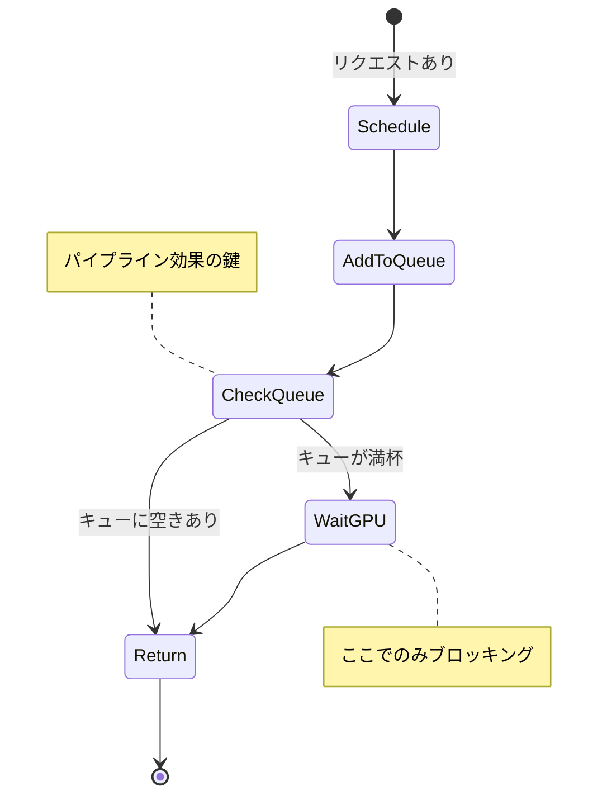

1. **Schedule**: 新しいバッチをスケジュールし、GPU 実行を開始
2. **AddToQueue**: バッチをキューに追加
3. **CheckQueue**: キューの状態を判定
4. **Return**: 即座にリターン（次のバッチをスケジュール可能）
5. **WaitGPU**: 最も古いバッチの完了を待機（ブロッキング）

リクエストがない場合は、直接 WaitGPU 状態へ遷移してキューから最古バッチを取り出します。

##### Non-Blocking 実行

https://github.com/vllm-project/vllm/blob/v0.16.0/vllm/v1/engine/core.py#L466-L484

`non_block=True` で GPU 実行を開始し、すぐに Future を返却するため、CPU はブロックされません。

##### 即座のリターン

https://github.com/vllm-project/vllm/blob/v0.16.0/vllm/v1/engine/core.py#L490-L500

バッチキューに空きがあり、GPU がまだ実行中の場合、**ブロックせずに即座にリターン**します。次の `step_with_batch_queue()` 呼び出しで新しいバッチをスケジュールします。

##### パイプライン効果

https://github.com/vllm-project/vllm/blob/v0.16.0/vllm/v1/engine/core.py#L509-L526

キューが満杯になった場合のみ、最も古いバッチの完了を待ちます。

#### AsyncScheduler の役割

非同期実行を支援するため、`AsyncScheduler` クラスが提供されています。

https://github.com/vllm-project/vllm/blob/v0.16.0/vllm/v1/core/sched/async_scheduler.py#L12-L61

`AsyncScheduler` は、`num_output_placeholders` を使用して未完了トークンを追跡します。

`num_output_placeholders` により、GPU 実行中にまだ返されていないトークンのプレースホルダー数を管理します（将来生成される予定のトークン数を事前にカウント）。これにより、GPU 実行完了前に次のスケジューリングが可能になります。

### Pipeline Parallel

https://www.deepspeed.ai/tutorials/pipeline/

:::message
v0.16.0 では上述した非同期スケジューリングと PP との併用が可能になりました。
:::

大規模モデルは 1 つの GPU メモリに収まらないため、モデルをレイヤー単位で複数 GPU に分割します。これを PP と呼びます。詳細は様々な記事で解説されているため確認してください。

### なぜ v0.14.0 では PP と非同期スケジューリングを併用できなかったのか

PP では、最終段の GPU のみがサンプリング（次トークン選択）を実行します。選択されたトークン ID は、次の forward pass 開始前に全 GPU へブロードキャストされる必要があります。

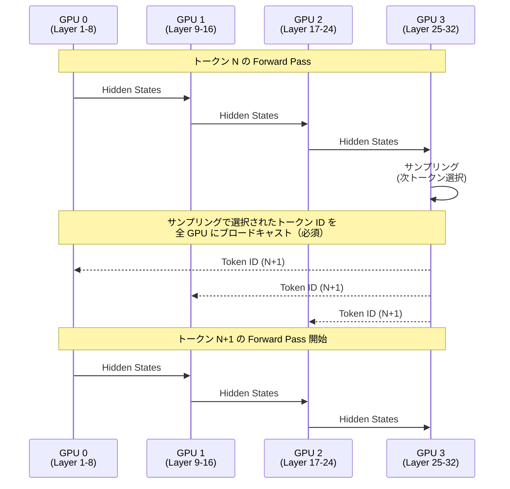

この図が示すように、GPU 3 でサンプリングされたトークン ID は、次の forward pass 開始前に全 GPU へブロードキャストされる必要があります。しかし、v0.14.0 の実装では、このブロードキャストが非同期スケジューリングと競合していました。

#### v0.14.0 の問題: CPU 経由ブロードキャストによる同期制約

v0.14.0 では、トークン ID が **GPU 3 → CPU → 全 GPU** という経路でブロードキャストされていました。これにより、以下の問題が発生します。

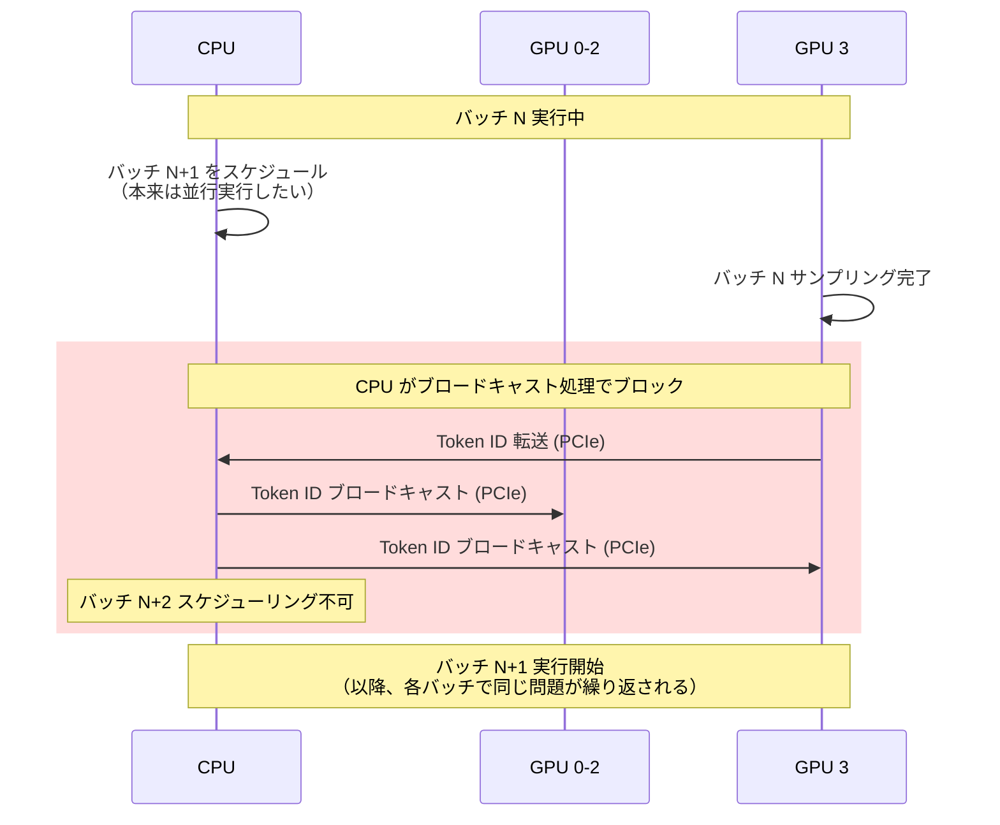

第一に、**CPU がブロードキャスト処理でブロックされる**ため、次のバッチのスケジューリングができません。非同期スケジューリングの目的は「GPU 実行中に CPU が次のバッチをスケジュール」することですが、CPU がブロードキャスト処理に占有されるとこれが不可能になります。

次に、**PCIe バス経由の転送レイテンシ**（往復で数十マイクロ秒）が各トークンごとに累積します。デコードフェーズでは 1 トークンごとにこの処理が発生するため、無視できないオーバーヘッドとなります。

最後に、**バッチキューでの管理が複雑**になります。CPU が複数バッチのトークン ID ブロードキャストを逐次処理する必要があり、どのバッチのトークン ID をどのタイミングでどの GPU に送信したかを追跡する必要があります。

これらの制約により、v0.14.0 では PP と非同期スケジューリングの併用が実装されていませんでした。

### v0.16.0 の新機能: GPU 直接通信によるトークン ID ブロードキャスト

:::message alert
ここからが v0.16.0 の真の新機能です。前述の非同期スケジューリングと Pipeline Parallel を組み合わせるための実装を解説します。
:::

[PR #32618](https://github.com/vllm-project/vllm/pull/32618) では、GPU 側で直接トークン ID テンソルを通信することで、CPU 往復を回避する実装が導入されました。

#### v0.16.0 の解決策: GPU 間直接通信による完全非同期化

v0.16.0 では、トークン ID が **GPU 3 → 全 GPU** という経路で直接ブロードキャストされます。これにより、CPU と GPU の完全な並行動作が可能になります。

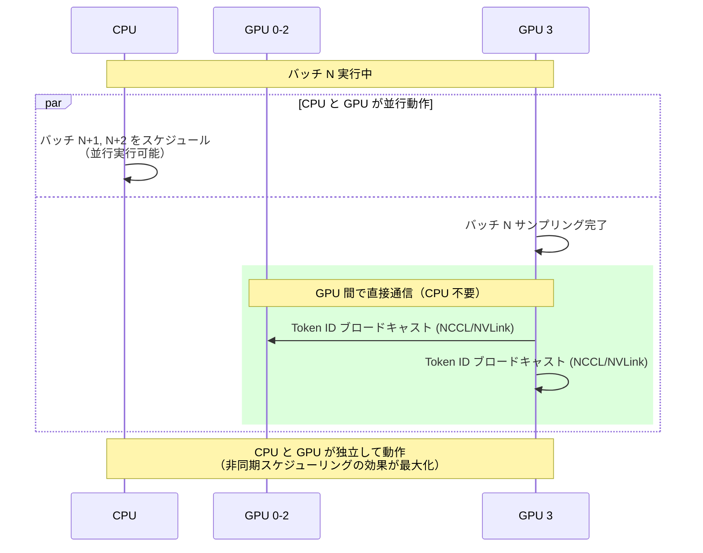

第一に、**CPU がブロードキャスト処理から解放される**ため、GPU 実行中に次のバッチをスケジュールできます。これにより、真にバッファリング付き Producer/Consumer パターンが実現されます。CPU（Producer）がバッチキュー（バッファ）にスケジュールし、GPU（Consumer）がキューから取り出して実行するという、完全に独立した並行動作が可能になります。v0.14.0 では CPU がブロードキャスト処理でブロックされていたため、真の意味での独立した Producer/Consumer にはなっていませんでしたが、v0.16.0 でようやく実現されました。

次に、**NVLink/GPUDirect 経由の転送レイテンシ**が数マイクロ秒以下に削減されます。

最後に、**バッチキューでの管理が簡素化**されます。各バッチのトークン ID ブロードキャストは GPU 側で完結するため、CPU は各バッチに対して独立した Future を管理するだけで済みます。


### ベンチマーク結果

以下の数値は [PR #32618](https://github.com/vllm-project/vllm/pull/32618) で報告されたベンチマーク結果です。詳細はこちらを確認してください。

## torch.compile の進化

v0.16.0 では、torch.compile の対応が強化されました。V1 アーキテクチャでは **torch.compile がデフォルトで有効**になっています（[PR #26847](https://github.com/vllm-project/vllm/pull/26847) で最適化レベル `-O2` がデフォルトに設定され、torch.compile が自動的に有効化されます）。すべてのコンパイルはリクエスト処理前に完了するため、レスポンスタイムのスパイクが発生しません。

**Multimodal Encoder 対応（新機能）**

LLaMA 4、Qwen-VL 等の vision-language モデルのエンコーダーをコンパイル可能になりました。`@support_torch_compile` デコレータに Multimodal Encoder サポートが追加され、vision-language モデルでの性能改善が期待されます。デフォルトは OFF で、`compile_mm_encoder: true` で有効化します。

**Dynamic Shapes 対応の強化**

3 つのモードを提供：

| モード | 特徴 | 推奨用途 |
|--------|------|----------|
| `BACKED` (デフォルト) | 最大パフォーマンス、ガードの安全でない削除を許容 | 本番環境 |
| `UNBACKED` | 最も保守的、ガードに対する最強の保証 | デバッグ |
| `BACKED_SIZE_OBLIVIOUS` (実験的) | BACKED より安全、UNBACKED より高性能 | 実験的環境 |

**コンパイルキャッシュの改善**

[PR #34003](https://github.com/vllm-project/vllm/pull/34003) で「Stop compiling identical artifacts」により重複コンパイル防止が実装されました。キャッシュディレクトリ `~/.cache/vllm/torch_compile_cache` 全体をコピーすることで、再コンパイルをスキップし起動時間を短縮できます。

**Piecewise Cudagraph と Full Cudagraph Capture**

v0.16.0 では、CUDA Graph の最適化手法が強化されました。

::::details Piecewise Cudagraph とは何か

**CUDA Graph とは**

CUDA Graph は、GPU カーネルの起動シーケンスを事前に記録し、一度の API コールで実行する最適化手法です。通常、各カーネル起動には CPU-GPU 間の同期オーバーヘッドが発生しますが、CUDA Graph を使用することで、このオーバーヘッドを削減できます。

```mermaid
graph TB
    subgraph "通常実行（オーバーヘッドあり）"
        direction LR
        CPU1[CPU: Kernel 1 起動] --> GPU1[GPU: Kernel 1 実行]
        GPU1 --> CPU2[CPU: Kernel 2 起動]
        CPU2 --> GPU2[GPU: Kernel 2 実行]
        GPU2 --> CPU3[CPU: Kernel 3 起動]
        CPU3 --> GPU3[GPU: Kernel 3 実行]
    end

    subgraph "CUDA Graph（オーバーヘッド削減）"
        direction LR
        CPUG[CPU: Graph 起動] --> GPUG1[GPU: Kernel 1]
        GPUG1 --> GPUG2[GPU: Kernel 2]
        GPUG2 --> GPUG3[GPU: Kernel 3]
    end

    style CPU1 fill: #ffcccc
    style CPU2 fill: #ffcccc
    style CPU3 fill: #ffcccc
    style CPUG fill: #ccffcc
```

通常実行では各カーネル起動に CPU オーバーヘッドが発生しますが、CUDA Graph では一度の起動で複数カーネルを連続実行できます。

**Piecewise Cudagraph の必要性**

しかし、すべての操作が CUDA Graph 対応ではありません。特に Cascade Attention（特定の Attention 実装）、動的メモリ割り当てを含む操作、CPU との同期が必要な操作は CUDA Graph でキャプチャできません。

**Piecewise（部分的）Cudagraph**は、計算グラフを **CUDA Graph 対応部分と非対応部分に分割**し、対応部分のみをグラフ化する手法です。

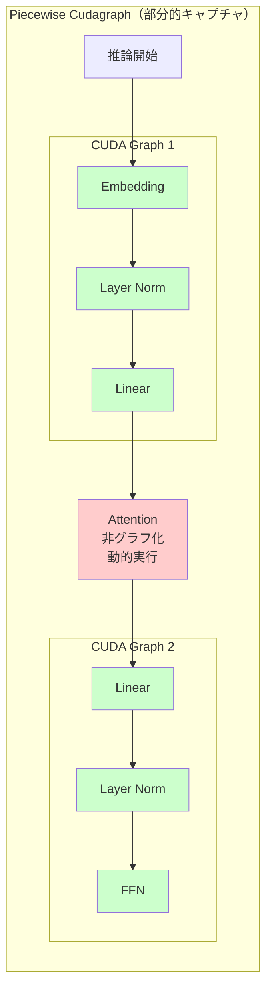

Attention 操作を境界として計算グラフを分割し、前後の対応部分を別々の CUDA Graph としてキャプチャします。これにより、互換性のない操作を含む場合でも、部分的に CUDA Graph の最適化を享受できます。

**Full Cudagraph Capture との違い**

| 項目 | Piecewise Cudagraph | Full Cudagraph Capture |
|------|-------------------|----------------------|
| キャプチャ範囲 | 対応部分のみ | すべての操作 |
| 互換性 | 高い（非対応操作も実行可能） | 低い（すべて対応必須） |
| オーバーヘッド削減 | 中程度 | 最大 |
| 適用モデル | 大型モデル、複雑な Attention | 小型モデル、シンプルな構造 |

**Full Cudagraph Capture** は、Flash Attention v2 などの完全に CUDA Graph 対応の実装を使用する場合に有効化されます。小型モデルや MoE（Mixture of Experts）の decode フェーズでは、Full Cudagraph Capture により追加のカーネル起動オーバーヘッド削減が期待できます。

::::

**パフォーマンスへの影響**

Piecewise Cudagraph は、CUDA Graph 対応 GPU カーネルシーケンスを低オーバーヘッドで実行することで、性能向上を実現します。第一にカーネル起動オーバーヘッドの削減により CPU-GPU 同期回数が減少し、次にカーネル間の依存関係の最適化によりパイプライン効率が向上します。最後に、特に小さいバッチサイズでのレイテンシ改善が顕著です。

Full Cudagraph Capture が適用可能な場合、小型モデルや MoE の decode フェーズでカーネル起動オーバーヘッドがさらに削減されます。

**Auto-tuning 機能**

`compile_sizes` 指定で特定バッチサイズ用カーネルを最適化します。特定のバッチサイズと行列サイズの組み合わせに対して、cublas より高速な Triton カーネルが自動選択される場合があります。デフォルトは OFF（初回実行が遅いため）ですが、最大性能が必要な場合に推奨されます。

**使用方法**

オフライン推論（LLM クラス）:
```python
from vllm import LLM
from vllm.config.compilation import CompilationConfig, DynamicShapesConfig, DynamicShapesType

llm = LLM(
    model="meta-llama/Llama-3.2-1B",
    compilation_config=CompilationConfig(
        dynamic_shapes_config=DynamicShapesConfig(
            type=DynamicShapesType.UNBACKED
        )
    )
)
```

オンラインサービング:
```bash
# Dynamic shapes 設定
vllm serve meta-llama/Llama-3.2-1B \
  -cc.dynamic_shapes_config.type=unbacked

# 特定サイズでコンパイル（auto-tuning）
vllm serve meta-llama/Llama-3.2-1B \
  --compilation-config '{"compile_sizes": [1, 2, 4, 8]}'
```

## その他のエンジンコア改善

**Speculative Decoding の最適化**（[PR #33612](https://github.com/vllm-project/vllm/pull/33612)）: メモリ割り当てオーバーヘッドを削減し、1.5% のスループット向上が報告されています。プレースホルダーリストの再利用により、Time to First Token が 118.95ms から 100.57ms に改善しました（詳細な測定条件は PR を参照）。

RLHF ワークフローも改善されました。ネイティブ NCCL 重み同期 API（[PR #31943](https://github.com/vllm-project/vllm/pull/31943)）、QeRL 用層ごと再ロード（[PR #32133](https://github.com/vllm-project/vllm/pull/32133)）、エンジン一時停止/再開と要求保持（[PR #32351](https://github.com/vllm-project/vllm/pull/32351)）により、RLHF トレーニングワークフローが強化されました。

また、torchrun PP Broadcast デッドロック（[PR #33701](https://github.com/vllm-project/vllm/pull/33701)）が修正され、外部起動ツールで Pipeline Parallel を使用する際の安定性が向上しました。

## Large Scale Serving の進化

### NixlConnector V2: Cross-Layer KV Cache Layout

v0.16.0 の Large Scale Serving における最大の改善は、**NixlConnector V2** の導入です（[PR #33339](https://github.com/vllm-project/vllm/pull/33339)、[RFC #27742](https://github.com/vllm-project/vllm/issues/27742)）。V1 のレイヤーごとに分離された KV キャッシュメモリレイアウトを、ブロック単位で全レイヤーの KV データを連続配置するレイアウトに変更し、転送バッファのフラグメンテーションを削減しました（転送ディスクリプタ最大 98.8% 削減）。

::::details V1 の問題点と V2 の改善内容

**V1 の問題点**

V1 の NixlConnector では、KV キャッシュが**レイヤーごとに個別のテンソルとして確保**されていました。例えば 32 層のモデルでは：

- 1 ブロックの転送に **32 個の非連続メモリセグメント**が必要
- さらに K/V の分離、num_kv_heads 次元で追加フラグメンテーション
- 結果として、1000 リクエスト処理時に 32 レイヤー × 約 1000 ブロック = 約 32,000 個の転送ディスクリプタが生成されます（[PR #33339](https://github.com/vllm-project/vllm/pull/33339) の Config 3 では実測値 **34,000 個**）

この大量のフラグメンテーションが NIXL ライブラリの転送効率を低下させていました。

**V2 の改善内容: Cross-Layer KV Cache Layout**

V1（Per-Layer Layout）:
```
Block 0: [Layer0_KV] [Layer1_KV] ... [Layer31_KV]  -- 各レイヤー別メモリ領域
Block 1: [Layer0_KV] [Layer1_KV] ... [Layer31_KV]  -- 非連続
```

V2（Cross-Layer Layout）:
```
Block 0: [Layer0_KV | Layer1_KV | ... | Layer31_KV]  -- 全レイヤー連続配置
Block 1: [Layer0_KV | Layer1_KV | ... | Layer31_KV]  -- 1 ブロック = 1 転送
```

GPU Model Runner が int8 バッファとして統一メモリ領域を確保し、view/permute 操作で各 Attention Backend が要求する形式に変換します。以下の 3 つの条件が揃ったときのみ有効化されます。

第一に、KV Cache Spec が均一モデル（非 HMA: Heterogeneous Memory Architecture）である必要があります。次に、Connector が `prefer_cross_layer_blocks = True` を返す必要があります。最後に、Attention Backend が `get_kv_cache_stride_order()` をサポートしている必要があります。

::::

#### Paged Attention との実装レベルの連携

Cross-Layer KV Cache Layout は、vLLM の PagedAttention アーキテクチャの上に構築された最適化です。その実装を理解するには、PagedAttention の基本的な仕組みと、V2 がどのように互換性を保ちながら転送効率を改善したかを知る必要があります。

##### PagedAttention の基本アーキテクチャ

vLLM の PagedAttention は、KV Cache を固定サイズのブロック（通常 16 トークン）に分割して動的に割り当てる仕組みです。各リクエストは **Block Table**（ブロック ID の配列）を持ち、GPU カーネルはこの Block Table を使って間接参照で KV Cache にアクセスします。

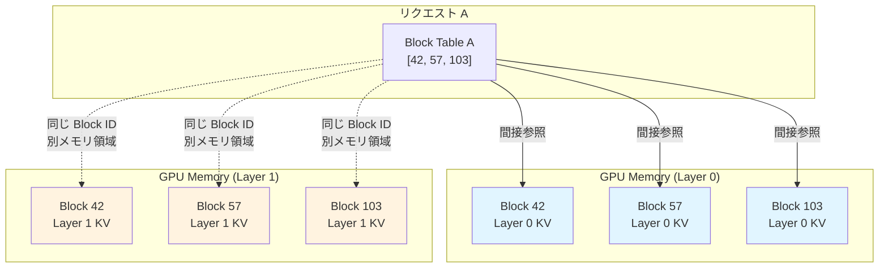

重要なポイントは、**Layer ごとに独立した GPU テンソル**として KV Cache が確保されることです。`vllm/v1/worker/gpu/attn_utils.py` の `_allocate_kv_cache()` は、各 Layer に対して個別のテンソルを確保します。

```python
# 各 Layer に対して独立したテンソルを確保（疑似コード）
kv_caches = []
for layer_idx in range(num_layers):
    kv_cache_layer = torch.empty(
        (num_blocks, block_size, num_kv_heads, head_size),
        dtype=dtype,
        device="cuda"
    )
    kv_caches.append(kv_cache_layer)
```

この設計により、以下のメリットが得られます。第一に、動的メモリ割り当てにより、必要なブロックのみを確保し、未使用ブロックは他のリクエストで再利用可能になります。次に、Prefix Caching により、共通プレフィックスを持つリクエスト間でブロックを共有できます。最後に、リクエストのトークン数に応じて必要最小限のメモリのみを使用するメモリ効率の高さが実現されます。

##### V1 でのフラグメンテーション問題

しかし、この「Layer ごとの独立テンソル」設計は、**Disaggregated Inference のネットワーク転送時に深刻な問題**を引き起こします。

例えば、56 Layer のモデルで Block[42] を転送する場合、以下のメモリ領域がすべて非連続に配置されています：

```
Layer 0 の Block[42]: GPU メモリアドレス 0x7f8a2000
Layer 1 の Block[42]: GPU メモリアドレス 0x7f8c5000  （Layer 0 から離れている）
Layer 2 の Block[42]: GPU メモリアドレス 0x7f8e8000  （Layer 1 から離れている）
...
Layer 55 の Block[42]: GPU メモリアドレス 0x7fa12000 （Layer 54 から離れている）
```

RDMA（Remote Direct Memory Access）/libfabric 経由でこれらを転送するには、各メモリセグメントに対して個別の**転送ディスクリプタ**（送信元アドレス、送信先アドレス、サイズを含むメタデータ構造）を作成する必要があります。この例では 56 Layer x 2（Key/Value）= **112 個の転送ディスクリプタ**が 1 ブロックあたり必要になります。

実際のベンチマーク（後述）では 32 層モデル（Llama-3.1-8B-Instruct）を使用しており、1 ブロックあたり 32 x 2 = 64 個程度の転送ディスクリプタが必要でした。

転送ディスクリプタの作成、NIC キューへの登録、完了通知の処理それぞれにオーバーヘッドがあり、これが TTFT（Time To First Token）を大幅に悪化させていました。

##### V2 での解決策: Cross-Layer Layout

V2 では、**ブロック単位で全 Layer の KV データを物理的に連続配置**することで、この問題を解決しました。

```
Block 42 の全 Layer データ:
GPU メモリアドレス 0x7f8a2000:
  [Layer 0 KV | Layer 1 KV | Layer 2 KV | ... | Layer 55 KV]
   ↑ 全て連続したメモリ領域 ↑
```

これにより、Block[42] の転送に必要な転送ディスクリプタは **1 個**に削減されます（56 Layer x 2 = 112 個 → 1 個）。

**実装の鍵: view/permute による互換性維持**

Cross-Layer Layout の最も重要な工学的成果は、**Attention Backend のカーネル実装を一切変更せずに**この最適化を実現した点です。

実装の詳細は [nixl_connector.py](https://github.com/vllm-project/vllm/blob/c80f92c14d5e6c52691f586052af68d1495aac74/vllm/distributed/kv_transfer/kv_connector/v1/nixl_connector.py) と [utils.py の kv_postprocess_layout_on_receive()](https://github.com/vllm-project/vllm/blob/c80f92c14d5e6c52691f586052af68d1495aac74/vllm/distributed/kv_transfer/kv_connector/utils.py#L238-L260) を参照してください。

GPU Model Runner は、まず int8 バッファとして統一メモリ領域を確保します：

```python
# Cross-Layer Layout のメモリ確保（疑似コード）
cross_layer_buffer = torch.empty(
    (num_blocks, num_layers, block_size, num_kv_heads, head_size),
    dtype=torch.int8,  # 統一バッファ
    device="cuda"
)
```

その後、`view()` と `permute()` 操作で各 Attention Backend が期待する形式に変換します：

```python
# FlashAttention が要求する形式に変換（疑似コード）
for layer_idx in range(num_layers):
    # Layer ごとのビューを作成（ゼロコピー）
    kv_cache_layer = cross_layer_buffer[: , layer_idx, : , : , : ].view(
        num_blocks, block_size, num_kv_heads, head_size
    )
    # Attention カーネルはこのビューを使用
    flash_attention(query, kv_cache_layer, ...)
```

`view()` と `permute()` は PyTorch のメタデータのみの操作であり、実データのコピーは発生しません。Attention カーネルは、あたかも Layer ごとの独立テンソルが存在するかのように動作しますが、実際には Cross-Layer Layout の統一バッファを stride を調整してアクセスしています。

##### 設計トレードオフ: なぜこのアプローチが最適か

**より根本的な解決策の存在**

理論的には、PagedAttention の KV Cache 管理自体を統一メモリプールに変更し、すべてのブロック（Block 0 から Block N）を物理的に連続したメモリ領域として確保することも可能です。これにより、ブロック間のフラグメンテーションも解消され、複数ブロックの転送を完全に 1 つの転送ディスクリプタで実行できます。

しかし、この「統一メモリプール方式」は以下の問題があります：

1. **影響範囲の広さ**: `BlockPool`、`KVCacheCoordinator`、すべての Attention Backend の大幅な変更が必要
2. **PagedAttention のメリットの喪失**: 動的ブロック割り当て、Prefix Caching が複雑化または不可能になる
3. **regression リスク**: vLLM の全ユースケースに影響し、Disaggregated Inference を使わないユーザーにも影響
4. **追加メリットの限定性**: Layer 間フラグメンテーション（112 ディスクリプタ）が支配的であり、ブロック間フラグメンテーション（数個程度）の影響は相対的に小さい

**Cross-Layer Layout の合理性**

Cross-Layer Layout は、以下の理由で工学的に極めて合理的な選択です：

1. **問題のスコープに適合**: フラグメンテーションが深刻なのは Disaggregated Inference のネットワーク転送時のみ。単一 GPU 推論や Tensor Parallel（NVLink）では、GPU カーネルが Block Table で間接参照するため、物理メモリの連続性は性能に影響しない
2. **十分な効果**: Layer 間フラグメンテーション解消により大幅な削減を達成。残余のブロック間フラグメンテーションの影響は限定的
3. **PagedAttention のメリットを完全維持**: 動的割り当て、Prefix Caching、メモリ効率を一切損なわない
4. **変更の局所性**: NIXL Connector とメモリレイアウト層のみの変更。Attention Backend のカーネル実装は変更不要

:::message
Cross-Layer Layout は、「実装が大変だからの妥協策」ではなく、**PagedAttention の全メリットを維持しながら、Disaggregated Inference の転送効率を 98.8% 改善する**という極めて難しいトレードオフを、最小限の変更で実現した優れた設計です。
:::

**NixlConnector V2 アーキテクチャ**

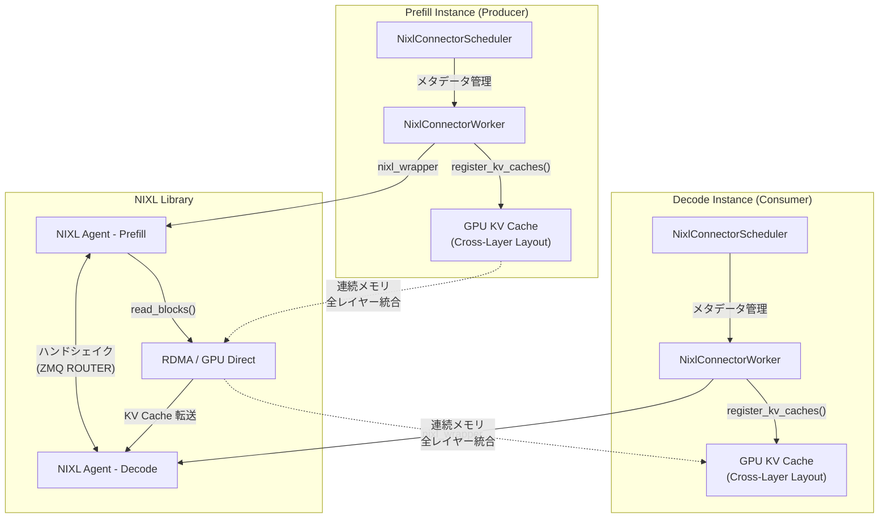

**メモリレイアウト比較**

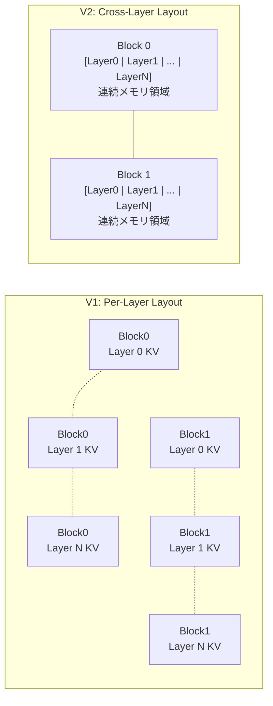

**性能改善の数値**

[PR #33339](https://github.com/vllm-project/vllm/pull/33339) のベンチマーク結果（モデル: Llama-3.1-8B-Instruct、ネットワーク構成等の詳細条件は PR を参照）:

**Config 1（1000 req, 16 input tokens）**

| メトリクス | V1 | V2 | 改善率 |
|-----------|--------|-----|--------|
| TTFT | 18,756ms | 8,494ms | **2.2 倍高速** |
| Tok/sec | 5,288 | 8,573 | **1.6 倍向上** |
| 転送ディスクリプタ | 56 | 1 | **98.2% 削減** |

**Config 3（128 req, 10,240 input tokens）**

| メトリクス | V1 | V2 | 改善率 |
|-----------|--------|-----|--------|
| Tok/sec | 62,340 | 117,631 | **1.9 倍向上** |
| 転送ディスクリプタ | 34,000 | 422 | **98.8% 削減** |

**有効化方法**

FlashAttention または FlashInfer バックエンド使用時、KV Cache レイアウトが HND (Head, Num_blocks, Dimension) の場合に、以下の方法で有効化できます：

CLI フラグ:
```bash
vllm serve MODEL \
  --kv-connector-extra-config '{"enable_cross_layers_blocks": "true"}'
```

環境変数:
```bash
export CROSS_LAYERS_BLOCKS=True
vllm serve MODEL
```

:::message
Cross-Layer Layout は、メモリレイアウトを変更するだけで Attention 側の計算性能に影響を与えず、RDMA 転送効率を改善します。転送ディスクリプタ 98.8% 削減、TTFT 2.2 倍、スループット最大 1.9 倍という効果が得られます。
:::

### その他の Disaggregated Serving 改善

**Mooncake コネクタ刷新**（[PR #31034](https://github.com/vllm-project/vllm/pull/31034)）: ブートストラップサーバー付きリワークにより、接続管理が改善されました。

EPLB（Expert-Level Pipeline Load Balancing）では、ルーターリプレイによる論理エキスパートキャプチャ（[PR #33013](https://github.com/vllm-project/vllm/pull/33013)）により、MoE モデルの負荷分散が最適化されました。

また、KV オフロードコネクタメトリクス（[PR #27942](https://github.com/vllm-project/vllm/pull/27942)）、P/D disaggregation 向けラベル付きプロンプトトークンメトリクス（[PR #33290](https://github.com/vllm-project/vllm/pull/33290)）が追加されました。

## モデルサポート拡張

v0.16.0 では、多数の新規モデルアーキテクチャと機能拡張が追加されました。

### 新規アーキテクチャ

| モデル名 | 説明 | PR 番号 |
|---------|------|--------|
| GLM-OCR with MTP | マルチターンダイアログ対応の光学文字認識モデル | #33005 |
| Qwen3-ASR | 音声認識モデル | #33312 |
| DeepSeek-OCR-2 | 第 2 世代の DeepSeek OCR モデル | #33165 |
| Intern-S1-Pro | InternLM シリーズのプロフェッショナル版 | #33636 |
| MiniCPM-o 4.5 | マルチモーダル対応の軽量モデル | #33431 |
| openPangu7B-VL | ビジョンタスク向けの大規模言語モデル | #32449 |
| NemotronHPuzzle | 異種構造設計の Nemotron モデル | #32549 |
| MusicFlamingo | 音楽理解に特化したマルチモーダルモデル | #32696 |
| FunAudioChat | 音声対話用モデル | - |
| ColBERT | 情報検索用 BERT 系モデル | #33686 |
| voyage-4-nano | 軽量埋め込みモデル | #33720 |
| GLM-5 | GLM シリーズの第 5 世代 | #34124 |

### Speculative Decoding 対応モデル

| モデル名 | 説明 | PR 番号 |
|---------|------|--------|
| EAGLE3 for Hunyuan/HunyuanVL | 推論高速化用のドラフトモデル（Hunyuan 系対応） | #33035 |
| AFMoE | Adaptive Factorization MoE 対応の高速化 | #33111 |
| Mistral3 | Mistral 系モデルの第 3 世代向け | #33939 |

**Unified Parallel Drafting**（[PR #32887](https://github.com/vllm-project/vllm/pull/32887)）により、AMD の PARD と AWS の P-EAGLE が統一フレームワークに統合されました。PR の報告によると、GPT-OSS 120B で K=7 の P-EAGLE が約 560 tok/s（ベースライン比 1.52 倍）、Llama 3.3 70B-NVFP4 で PARD が約 254 tok/s（ベースライン比 3.10 倍）を達成しています（詳細なハードウェア環境は PR を参照）。

### LoRA 拡張対応モデル

| モデル名 | 説明 | PR 番号 |
|---------|------|--------|
| Gemma3 | ビジョンコンポーネントアダプタ対応 | #32764 |
| Nemotron-H MTP models | マルチターンダイアログ用 LoRA 対応 | #32265 |
| Qwen3 | 出力埋め込みの適応機能を追加 | #29816 |

LoRA 関連では、fused MoE-LoRA カーネルインデックス最適化（[PR #32770](https://github.com/vllm-project/vllm/pull/32770), [#32774](https://github.com/vllm-project/vllm/pull/32774)）、unpermute-aware fusion（[PR #32655](https://github.com/vllm-project/vllm/pull/32655)）により、LoRA 使用時のオーバーヘッドが削減されました。

### 特定モデルの機能改善

| モデル名 | 改善内容 | PR 番号 |
|---------|---------|--------|
| Qwen3-Omni | 音声文字起こし機能の改善 | #29828 |
| Mistral Large 3 | FlashInfer MoE 最適化を適用 | #33174 |
| DeepSeek V3.2 | 高速 detokenization とトークナイザー修正 | #33855, #33832 |
| GLM-5 | MTP 精度改善の適用 | #34385 |

## 量子化機能の拡充

v0.16.0 では、量子化手法の追加と既存手法の改善が行われました。

### 新規量子化手法

**CompressedTensorsW8A16Fp8**（[PR #33280](https://github.com/vllm-project/vllm/pull/33280)）: 重み 8bit（FP8）、活性化 16bit の量子化手法が追加されました。

密モデル向けには MXFP8 量子化（[PR #33786](https://github.com/vllm-project/vllm/pull/33786)）が追加されました。MXFP8 はブロック単位でスケーリングファクターを適用する方式であり、テンソルレベル FP8 量子化と比較して精度劣化の軽減が期待されます。

また、Turing GPU（RTX 20 シリーズ）での FP4/FP8 量子化がサポートされました（[PR #33076](https://github.com/vllm-project/vllm/pull/33076)）。

**TP > 4 for FP4 Gemm**（[PR #31099](https://github.com/vllm-project/vllm/pull/31099)）: FP4 量子化が Tensor Parallelism サイズ 4 以上でサポートされました。

## API & フロントエンド機能

v0.16.0 では、API の機能拡張と新規エンドポイントが追加されました。

### WebSocket Realtime API（新機能）

OpenAI の Realtime API にインスパイアされた、音声認識に特化した **WebSocket ベースのストリーミング API** が追加されました（[PR #33187](https://github.com/vllm-project/vllm/pull/33187)）。WebSocket 接続を通じて音声データをリアルタイムに送受信できます。

この API は WebSocket プロトコル (`ws://host/v1/realtime`) で動作し、Voxtral Streaming モデルなどの音声処理用モデルに対応しています。音声フォーマットは PCM16 @ 16kHz mono（base64 エンコード）です。

WebSocket エンドポイントに接続し、音声チャンクを base64 エンコードで段階的に送信した後、コミットメッセージを送信すると、文字起こし結果が WebSocket 経由で返却されます。この API により、リアルタイム音声認識アプリケーション、ストリーミング音声文字起こしサービス、音声ベースのインタラクティブアプリケーションなどの新しいユースケースが開拓されます。

### --disable-access-log-for-endpoints オプション

指定したエンドポイントの uvicorn アクセスログを抑制する CLI オプションが追加されました（[PR #30011](https://github.com/vllm-project/vllm/pull/30011)）。ヘルスチェックやメトリクスエンドポイントなど、頻繁にポーリングされるエンドポイントのログノイズを削減します。

```bash
vllm serve Qwen/Qwen3-0.6B \
  --disable-access-log-for-endpoints /health,/metrics,/ping
```

本番環境での運用において、ログ管理とデバッグ効率を改善する実用的な機能です。

### Responses API の拡張

`/v1/responses` API に、生成制御のための基本的なサンプリングパラメータが追加されました（[PR #32609](https://github.com/vllm-project/vllm/pull/32609)）。

追加されたパラメータ:

| パラメータ | 説明 |
|-----------|------|
| `stop` | 生成停止シーケンス |
| `seed` | 再現可能な生成のためのランダムシード |
| `repetition_penalty` | 生成テキストの繰り返しを制御 |
| `ignore_eos` | End-of-Sequence トークンを無視するかどうか |
| `vllm_xargs` | 高度な使用例向けのカスタム拡張引数 |

これにより、`/v1/chat/completions` と `/v1/responses` の機能パリティが向上しました。

### 構造化出力 + Reasoning のパフォーマンス最適化

構造化出力と推論モデル（Reasoning Models）を組み合わせた場合のパフォーマンスが最適化されました（[PR #33557](https://github.com/vllm-project/vllm/pull/33557)）。`reasoner.is_reasoning_end(request.prompt_token_ids)` チェックをコアエンジンからフロントエンドに移動することで、エンジンループ内での繰り返し実行によるオーバーヘッドを削減しました。

また、DeepSeek V3.2 の `tool_choice==required` + thinking mode での内部サーバーエラーも解決されました。

### マルチターンツール呼び出し ID の保持

Kimi K2 などのモデルが生成するネイティブなツール呼び出し ID を保持するようになりました（[PR #32768](https://github.com/vllm-project/vllm/pull/32768)）。これにより、マルチターン（複数回のやり取り）でのツール呼び出しが正しく機能します。

v0.15.x 以前の実装では、モデルが特定の ID フォーマット（例: `functions.get_weather:0`）でツール呼び出しを生成しても、システムがこれらのネイティブ ID を破棄し、ランダムな ID で置き換えていました。後続のターンでモデルが一貫した ID を期待するため、マルチターンツール呼び出しが破綻していましたが、この問題が解決されました。

### その他の API 改善

**YAML ファイルでのネスト設定**（[PR #33193](https://github.com/vllm-project/vllm/pull/33193)）: 設定管理の柔軟性が向上しました。

**バッチ文字起こし/翻訳サポート**（[PR #33934](https://github.com/vllm-project/vllm/pull/33934)）: フロントエンド機能が拡張されました。

**早期トークン化検証**（[PR #31366](https://github.com/vllm-project/vllm/pull/31366)）: エラーハンドリングが改善されました。

**DeepSeek ReasoningParser**（[PR #33221](https://github.com/vllm-project/vllm/pull/33221)）: 推論モデルのサポートが強化されました。

## まとめ

v0.16.0 は、vLLM のエンジンコアと Large Scale Serving の両面で重要な進化を遂げたリリースです。

非同期スケジューリングと Pipeline Parallel の統合により、大規模モデルの分散推論性能が大幅に向上しました。バッチキューによるパイプライン並列化と GPU 間直接通信により、30.8% のスループット向上と 31.8% の TPOT 改善を達成しています。

Disaggregated Inference では、NixlConnector V2 の Cross-Layer Layout が RDMA 転送効率を改善し、TTFT の大幅な高速化とスループット向上を実現しました。torch.compile の標準化と Multimodal Encoder 対応により、V1 アーキテクチャでの推論最適化が強化されています。

API 面では、WebSocket Realtime API の追加により音声認識などリアルタイムユースケースへの対応が進み、構造化出力とツール呼び出しの改善により実用性が向上しました。これらの改善により、v0.16.0 は本番環境での大規模モデル推論をより実用的にするリリースとなりました。

**参考資料**

- [vLLM v0.16.0 公式リリースノート](https://github.com/vllm-project/vllm/releases/tag/v0.16.0)
- [vLLM v0.15.0 リリースノート](https://github.com/vllm-project/vllm/releases/tag/v0.15.0)
- [vLLM v0.14.0 リリースノート](https://github.com/vllm-project/vllm/releases/tag/v0.14.0)
- [vLLM 公式ドキュメント](https://docs.vllm.ai/)
- [PR #32618: Async scheduling + Pipeline Parallelism](https://github.com/vllm-project/vllm/pull/32618)
- [vLLM EngineCore 実装](https://github.com/vllm-project/vllm/blob/v0.16.0/vllm/v1/engine/core.py)
- [vLLM AsyncScheduler 実装](https://github.com/vllm-project/vllm/blob/v0.16.0/vllm/v1/core/sched/async_scheduler.py)
- [vLLM Scheduler 実装](https://github.com/vllm-project/vllm/blob/v0.16.0/vllm/v1/core/sched/scheduler.py)
- [vLLM Executor 抽象クラス](https://github.com/vllm-project/vllm/blob/v0.16.0/vllm/v1/executor/abstract.py)
- [PR #33339: NixlConnector V2 Cross-Layer KV Cache Layout](https://github.com/vllm-project/vllm/pull/33339)
- [RFC #27742: Cross-Layer KV Cache Layout](https://github.com/vllm-project/vllm/issues/27742)
- [PR #34003: Stop compiling identical artifacts](https://github.com/vllm-project/vllm/pull/34003)
- [vLLM Blog: torch.compile](https://blog.vllm.ai/2025/08/20/torch-compile.html)
- [Pipeline Parallelism in PyTorch](https://pytorch.org/docs/stable/pipeline.html)
