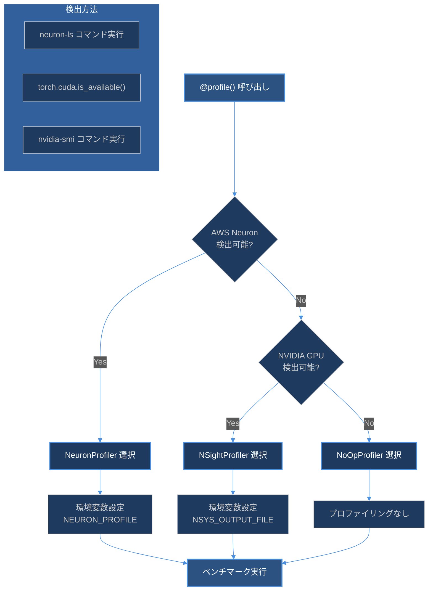
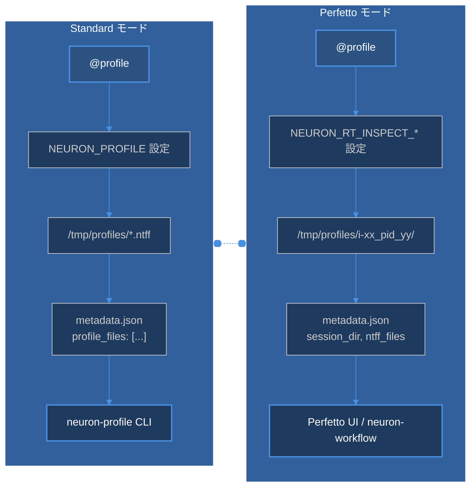
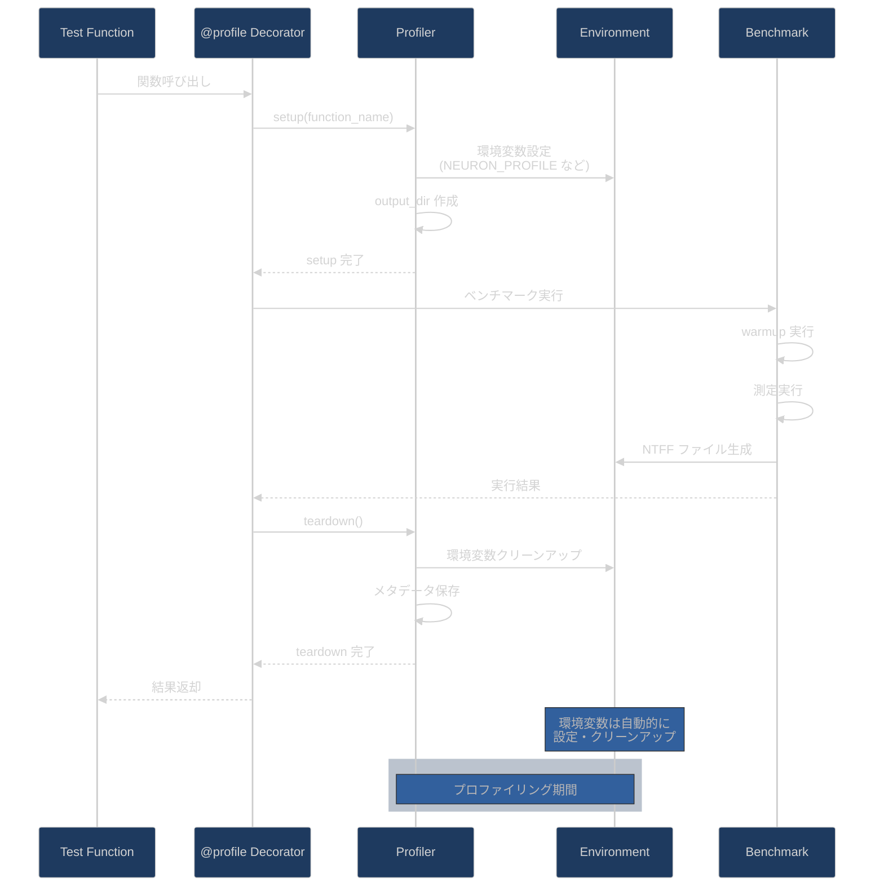

## はじめに

[前回の記事「vllm-neuron を用いた LLM 推論とその測定方法の調査」](https://zenn.dev/tosshi/articles/ef61e14fe73399)では、AWS Inferentia2 上で vllm-neuron の Bucketing や Prefix Caching 設定を比較し、性能差を定量化しました。その際、`vllm bench` が使えなかったためベンチマークスクリプトを作りました。これをベースに Neuron Profiler を使ったプロファイリングを実施することが今回の目的です。

:::message alert
vllm-neuron によらず AWS Neuron ベースのコードであればベンチマークとプロファイリングができるはずですが現状 vllm-neuron 以外では動作未検証です。
:::

本記事では最終的に　**AWS Neuron プロファイリング OSS である [`benchmark-capture`](https://test.pypi.org/project/benchmark-capture/) を開発した経緯**と、その設計思想、実装の概要、得られた知見、について紹介します。

:::message
**公開状況（2026 年 1 月時点）:**
現在は TestPyPI で公開中です。AWS Inferentia2（Neuron）環境での動作検証は完了していますが、**CI/CD 追加、NVIDIA GPU 環境での検証後に正式 PyPI へ公開予定**です。
:::

## 1. 前回のおさらい

前回、Bucketing や Prefix Caching 設定の比較のために作成したスクリプトは非常に単純な作りでした。ベース設定とテストケースとして Bucketing ON/OFF などの設定を変えた `test_configs` で設定をスイープするための設定 json ファイル、その設定を読み込んで vllm-neuron のオフライン推論コマンドに設定値のパターン分設定を渡し、設定ごとの結果をディレクトリを分けて出力するスクリプトから構成されます。

::::details 前回の設定ファイル
```json:sample.json
{
  "model": "./models/Qwen3-0.6B-Reranker",
  "tensor_parallel_size": 2,
  "base_config": {
    "max_model_len": 2048,
    "block_size": 32,
    "input_file": "./sample.csv",
    "search_num": 20,
    "top_n": 6,
    "batch_size": 8,
    "max_length": 1500
  },
  "test_configs": [
    {
      "name": "cache_ON_bucketing_ON",
      "max_num_seqs": 4,
      "max_num_batched_tokens": 256,
      "pa_num_blocks": 512,
      "enable_prefix_caching": true,
      "enable_bucketing": true
    },
...
  ]
}
```
::::

この構成でもベンチマークするだけであれば全く問題がありませんでしたが、いざプロファイリングをやろうとするといくつか面倒な点が出てきました。① AWS Neuron をプロファイリングをする際にはいくつかのプロファイルのための環境変数を設定する必要があります。これらの環境変数を毎回指定し忘れて時間かけて結果を待ったのにプロファイルの成果物がないという絶望を味わいました（自分のせい）。② 生成された ntff ファイルが散乱してしまい実験設定と結果が紐づかなくなりました。Jupyter Notebook で実験していると訳わからなくなるアレに近いですね。③ モデルが期待する設定値と vllm-neuron が期待する設定値が同じ設定ファイル内にごちゃっと混在しており気持ちが悪いです。④ NVIDIA GPU と AWS Inferentia を比較しようとするとそれぞれでスクリプトを作らなければならないので大変です。⑤ 計測と結果集計を一緒に一つのスクリプトで実現していましたが密結合すぎるので計測の変更ですぐに結果集計側が動かなくなります。

## 2. 良さげな設計を考える

実装を考える際に最も重視した点は、メインの推論用のコードには前処理や後処理などの本番用の処理を含むコードが最終的には組み込まれることもあるためこれらのメインコードに影響をできるだけ与えずにプロファイリングをする、ということです。Python の場合、多くのベンチマークやプロファイルツール、Numba や JAX のようなライブラリはメインコードにできるだけ影響を与えないようにするためにデコレータパターンを採用していることが多い認識であるため、デコレーター `@profile()` だけで **Neuron プロファイリング（NTFF ファイル生成）を有効にできる**と良さそうである、と考えました。こうすることでモデルが期待する設定値に関してはモデル側のコードでよしなに扱ってくれれば良いため、この時点でモデル側の設定とベンチマークのスイープパターンの設定は責務が分離されます。

:::message
**Neuron プロファイリングの仕組み**

このツールに行ってほしいのは、**NTFF（Neuron Trace File Format）ファイルの自動生成**です。

具体的には、

1. **環境変数の自動設定**
   - Standard モード: `NEURON_PROFILE` → Neuron ランタイムが NTFF 生成
   - Perfetto モード: `NEURON_RT_INSPECT_*` → Perfetto 互換 NTFF 生成

2. **生成された NTFF ファイルの解析**（別ライブラリに責務を分離したい）
   - `neuron-profile view/convert` コマンド
   - Perfetto UI（Perfetto モード）
   - neuron-workflow などの解析ツール

`@profile()` は「NTFF 生成の自動化」を担当し、実際のプロファイル解析は AWS Neuron が提供する既存ツールで行い、それをラップした解析ライブラリも作りたい。
:::

次に考えたのは前回の記事で実装したような vLLM の設定値を複数パターン設定してスイープするような仕組みは引き続きほしい、ということです。プロファイリングが目的ではあるものの、単に環境変数を設定するだけではあまり存在価値がないため、ベンチマークのデコレーターに合わせてプロファイルデコレーターを設定するといい感じにメインコード汚染を減らせるんじゃないかと考えました。ベンチマークをデコレーターパターンで実現するライブラリを調査したところ、Star 数が 1k 超えで最近も活発に開発されている OSS がいくつか見つかり、対応機能を比較した結果、pytest ベースの [`pytest-benchmark`](https://github.com/ionelmc/pytest-benchmark) というライブラリを選びました。基本的な選定基準としては、デコレーターパターンであること、軽量であること、クラスベースを強制してこないこと、を重視しました。

`pytest-benchmark` が提供する主な機能として、自動キャリブレーション（最適な実行回数）、warmup 実行、GC 制御、正確なタイマー（perf_counter）、統計計算（mean, std, min, max, median, IQR, outliers）、外れ値検出、各パラメータ組み合わせごとに統計、グループ化とソート、比較モードなどがあります。私が欲しかった機能が大体網羅できそうであることがわかったのでこのライブラリを採用してみることにしました。

以下のようにパラメータースイープの設定をデコレーターで指定できます。

```python
@pytest.mark.parametrize("max_tokens", [512, 1024, 2048])
@pytest.mark.parametrize("batch_size", [1, 2, 4, 8])
def test_sweep(benchmark, batch_size, max_tokens):
    # Import vLLM inside test function
    import vllm

    # setup 関数で LLM を初期化（測定対象外）
    def setup():
        llm = vllm.LLM(
            max_num_seqs=batch_size,
            max_num_batched_tokens=max_tokens,
        )
        return (llm,), {}  # args, kwargs を返す

    # 実際の推論のみを測定
    def inference(llm):
        return llm.generate(prompts)

    # pedantic で setup と inference を分離
    result = benchmark.pedantic(inference, setup=setup, rounds=5)
```

## 3. 設計思想

最初に理想的なベンチマークフレームワークの設計を考えました。コア原則として以下の 3 つを取り入れました。

**Simple things should be simple, complex things should be possible**

基本的なベンチマークは 1-2 行で書けるべきであり、同時に複雑な要件にも対応可能な拡張ポイントを用意したいです。

**Convention over Configuration**

賢いデフォルト値を提供し、必要な時だけオーバーライドできるようにしてまずは動かすまでの時間を削減したいです。

**Separation of Concerns**

ベンチマーク定義、実行制御、結果分析、をそれぞれ独立させます。

これらの原則に則って理想的な設計を考えた上で、**実際に動くものを最短で作る**ことを優先しました。フルスタックのベンチマークフレームワークを作るのではなく、既存の優れたツールを活用する方針にしました。ベンチマーク実行は既存の優れた `pytest-benchmark` に任せ、統計計算も `pytest-benchmark` に任せることにしました。そして、プロファイリングの環境変数設定の自動化に注力し、ハードウェア自動検出でマルチデバイスへの対応を実装し、デコレーター 1 行でプロファイリング有効化することを決めました。

## 4. benchmark-capture の実装

### コア機能

開発した [benchmark-capture](https://github.com/littlemex/benchmark-capture) の主要機能は以下の通りです。

ハードウェア自動検出によるゼロコンフィギュレーション対応として、AWS Neuron、NVIDIA GPU、CPU を自動判別し、適切なプロファイラーを選択します。pytest-benchmark との統合により、ベンチマークツールの機能を継承しつつ、プロファイリング機能を追加します。基本的にはデコレーター 1 行による最小限のコード変更を実現し、既存のベンチマークコードへの影響を最小化します。同一コードの異なるハードウェアでの実行を可能にし、移植性を確保します。軽量な依存関係により、導入コストを低減します。vllm / vllm-neuron 推論用テンプレートを提供してすぐに使い始められる環境を用意します。

### 基本的な使い方

最もシンプルな使い方は、既存のベンチマークコードに `@profile()` を 1 行追加するだけです。

```python:test_vllm_py
import pytest
from benchmark_capture import profile

@pytest.mark.benchmark
@profile()  # ← !!!!!! この 1 行を追加するだけ !!!!!!
def test_vllm_neuron_inference(benchmark, model_path):
    # CRITICAL: vLLM must be imported INSIDE test function
    # to ensure profiling env vars are set before Neuron Runtime initialization
    import vllm

    # vllm-neuron configuration
    llm = vllm.LLM(
        model=model_path,
        device="neuron",
        tensor_parallel_size=2
    )

    prompts = ["Hello, how are you?"] * 10

    # pytest-benchmark の fixture を使用
    result = benchmark(llm.generate, prompts)

    return result
```

実行は以下のコマンドで行います。

```bash
pytest test_vllm.py --benchmark-only -v
```

今回の例ではこれだけで、Neuron ハードウェアを自動検出し、適切なプロファイル環境変数を自動設定し、ベンチマーク統計を自動計算（mean, std, min, max など）し、プロファイル結果を自動保存（NTFF ファイル）し、メタデータを JSON で保存します。

### ハードウェア自動検出

`@profile()` を引数なしで呼ぶと、以下の優先順位でハードウェアを検出します。

:::message alert
vllm-neuron のベンチマークとプロファイリングをするために作っているので GPU の対応は後回しにしており、まだ GPU プロファイリングの仕組みは完成していません。
:::



まず AWS Neuron の検出を試みます。`neuron-ls` コマンドの実行可否で判定します。次に NVIDIA GPU の検出を試みます。`torch.cuda.is_available()` または `nvidia-smi` コマンドで判定します。上記どちらも検出できない場合、CPU（フォールバック）として no-op プロファイラーを選択します。

この自動検出により、同じコードを異なる環境で実行しても自動的に適切なプロファイラーが選択されます。

### 明示的なプロファイラー指定

特定のプロファイラーを明示的に指定することもできます。

```python
@profile("neuron")  # Neuron を強制
@profile("nsight")  # NVIDIA NSight Systems を強制
@profile("noop")    # プロファイリング無効化
```

これにより、CI/CD でプロファイリングを無効化したり、特定環境でのみプロファイリングしたりする制御が可能です。

### pytest-benchmark との統合

`pytest-benchmark` の強力な機能をそのまま活用できます。

```python
@pytest.mark.parametrize("max_tokens", [512, 1024, 2048])
@pytest.mark.parametrize("batch_size", [1, 2, 4, 8])
@profile("neuron")
def test_parameter_sweep(benchmark, batch_size, max_tokens):
    # Import vLLM inside test function
    import vllm

    # setup 関数で LLM を初期化（測定対象外）
    def setup():
        llm = vllm.LLM(
            model="model",
            max_num_seqs=batch_size,
            max_num_batched_tokens=max_tokens,
        )
        return (llm,), {}

    # 実際の推論のみを測定
    def inference(llm):
        prompts = ["Hello"] * batch_size
        return llm.generate(prompts)

    result = benchmark.pedantic(inference, setup=setup, rounds=5)
```

これにより、3 × 4 = 12 通りのパラメータ組み合わせを自動実行し、各組み合わせごとに統計計算し、初期化時を測定から除外する warm up、各実行ごとにプロファイル結果を保存します。

### Perfetto モード

Perfetto モードを使うと、[Perfetto UI](https://ui.perfetto.dev/) で可視化できる形式の NTFF ファイルを生成します。

```python
@profile("neuron", perfetto=True, output_dir="/tmp/profiles")
def test_perfetto_profile(benchmark):
    # Import vLLM inside test function
    import vllm

    llm = vllm.LLM(model="model")
    result = benchmark(llm.generate, prompts)
```

実行後の確認は以下のコマンドで行います。

```bash
# セッションディレクトリがデフォルトでは以下のパスで生成される
ls -la /tmp/profiles/i-*_pid_*/

# メタデータで確認
cat /tmp/profiles/metadata.json | jq '.perfetto_mode'  # true
cat /tmp/profiles/metadata.json | jq '.session_dir'
cat /tmp/profiles/metadata.json | jq '.ntff_files'
```

Standard vs Perfetto モードの違いは以下の通りです。（パス等はデフォルトの場合）



## 5. 実装の工夫点

### 環境変数の自動管理

プロファイリング時の最大の課題は、環境変数の設定忘れでした。時間をかけてベンチマークを実行したのに、プロファイル結果がないという絶望を何度も経験しました。

`benchmark-capture` では、以下のように環境変数を自動管理します。

```python
class NeuronProfiler(Profiler):
    def setup(self, function_name: str) -> None:
        """ベンチマーク実行前に環境変数を設定"""
        if self.options.get("perfetto", False):
            os.environ["NEURON_RT_INSPECT_ENABLE"] = "1"
            os.environ["NEURON_RT_INSPECT_SYSTEM_PROFILE"] = "1"
            os.environ["NEURON_RT_INSPECT_DEVICE_PROFILE"] = "1"
            os.environ["NEURON_RT_INSPECT_OUTPUT_DIR"] = str(self.output_dir)
        else:
            os.environ["NEURON_PROFILE"] = str(self.output_dir)

        os.environ["NEURON_RT_EXEC_TIMEOUT"] = str(self.options.get("timeout", 600))

    def teardown(self) -> None:
        """ベンチマーク実行後に環境変数をクリーンアップ"""
        for var in ["NEURON_PROFILE", "NEURON_RT_EXEC_TIMEOUT",
                    "NEURON_RT_INSPECT_ENABLE", "NEURON_RT_INSPECT_OUTPUT_DIR"]:
            os.environ.pop(var, None)
```

デコレーターの処理フローは以下の通りです。



この自動管理により、環境変数設定忘れがゼロになり、実行後の自動クリーンアップが行われ、テスト間の環境汚染を防止します。

### メタデータの自動保存

各ベンチマーク実行時に、以下の情報を含むメタデータを JSON で自動保存します。

```json
{
  "function": "test_vllm_inference",
  "profiler": "NeuronProfiler",
  "output_dir": "/tmp/profiles",
  "profiler_type": "neuron",
  "perfetto_mode": true,
  "session_dir": "/tmp/profiles/i-0abc123_pid_45678",
  "ntff_files": [
    "i-0abc123_pid_45678/neff_001.ntff",
    "i-0abc123_pid_45678/neff_002.ntff"
  ],
  "timeout": 600,
  "framework_profile": false,
  "clear_cache_before": false,
  "clear_cache_after": false
}
```

このメタデータにより、実験設定とプロファイル結果の紐付けが可能になり、後から実験条件を確認でき、分析スクリプトでの自動処理が容易になります。

### Neuron キャッシュ管理

vllm-neuron では、初回実行時にモデルをコンパイルしてキャッシュします。この挙動を制御するため、キャッシュ管理機能を提供しています。

```python
@profile(
    "neuron",
    clear_cache_before=True,  # ベンチマーク前にキャッシュクリア
    clear_cache_after=False,  # ベンチマーク後はキャッシュ保持
)
def test_with_cache_control(benchmark):
    # Import vLLM inside test function
    import vllm

    llm = vllm.LLM(model="model")
    result = benchmark(llm.generate, prompts)
```

使い分けとして、コンパイル時間込みで測定したい場合は `clear_cache_before=True` を使用し、コンパイル済みの状態で推論性能のみ測定したい場合は `clear_cache_before=False` を使用します。

### プロジェクト初期化機能

benchmark-capture は、`benchmark-capture-init` コマンドによるプロジェクト初期化機能を提供します。

```bash
# vLLM-Neuron Reranker の完全な例をデプロイ
benchmark-capture-init ./my-reranker --example vllm-neuron-reranker
cd my-reranker

# 内容確認
ls -la
# config.yaml, test_reranker.py, input_sample.csv, conftest.py など

# モデルパスを設定
vim config.yaml  # MODEL_PATH を実際のパスに変更

# 実行
pytest test_reranker.py --benchmark-only -v
```

この example には、前回の記事で紹介した Reranker のパフォーマンス検証環境をすぐに適用できる構成が含まれています。サンプル CSV データ（10 クエリ、200 ペア）、設定駆動型のテストコード、Perfetto モードがデフォルトで有効、すぐに動作する推論コードが提供されます。パラメーターは前回の記事で最良のパフォーマンスを発揮した値がデフォルトで設定されています。


### VLLMConfigHelper

ベンチマーク実行において、Neuron 固有の設定と GPU 共通の設定を適切に管理する必要があります。この課題に対処するため、`VLLMConfigHelper` クラスを実装しました。VLLMConfigHelper の設計においては、以下の原則を重視しました。

**責務の最小化**

ハードウェア検出と GPU 検出時に Neuron 特有設定の設定フィルタリングのみを担当し、Neuron 設定の変換や管理は行いません。この原則により、Neuron 設定の中身に関する責務を持たず、仕様変更に対する保守コストを最小化します。Neuron 設定自体はテストコード側が担うべき責務であり、それらのベース設定に対してスイープする処理は `pytest` が担うべきです。

**透明性の確保**

適用される設定をログに出力し、ユーザーが実際に使用される設定を確認できるようにします。この原則により、デバッグが容易になり、予期しない動作を回避できます。

**ユーザーコントロール**

`override_neuron_config` という Neuron 向け設定をユーザーが直接管理し、ヘルパークラスは介入しません。この原則により、Neuron 設定の柔軟性を最大限に確保します。

**イミュータビリティ**

元の設定オブジェクトを決して変更せず、常に新しいオブジェクトを返します。この原則により、pytest の parametrize 機能で同一の設定オブジェクトが再利用される場合でも、副作用を防止します。

基本的な使用方法は以下のようになります。

```python
from benchmark_capture.utils import VLLMConfigHelper

def test_vllm_benchmark(benchmark):
    # Import vLLM inside test function
    import vllm

    # ユーザーが全ての設定を定義
    config = {
        "tensor_parallel_size": 2,
        "max_num_seqs": 4,
        "num_gpu_blocks_override": 512,

        # Neuron 固有の設定
        "additional_config": {
            "override_neuron_config": {
                "pa_num_blocks": 512,
                "pa_block_size": 32,
                "enable_bucketing": True,
            }
        }
    }

    # ハードウェア対応のビルド
    vllm_config = VLLMConfigHelper(config).build()

    # vLLM に直接渡す
    llm = vllm.LLM(model="model_path", **vllm_config)
```

Neuron ハードウェア上で実行する場合、`override_neuron_config` がそのまま保持され、フル設定がログに出力されます。GPU ハードウェア上で実行する場合、`override_neuron_config` が自動的に除外され、クリーンな GPU 設定のみが使用されます。おそらく vllm 側の実装でも同じように `override_neuron_config` が除外されている可能性がありますが明示的に除外処理をするために実装してあります。

**pytest parametrize との統合**

`VLLMConfigHelper` は pytest の parametrize 機能とシームレスに統合できます。

```python
@pytest.mark.parametrize("pa_num_blocks", [256, 512, 1024])
@profile("neuron", perfetto=True)
def test_pa_blocks_sweep(benchmark, model_path, pa_num_blocks):
    """各設定ごとに別々のプロファイルファイルが生成される"""
    # Import vLLM inside test function
    import vllm

    config = VLLMConfigHelper({
        "tensor_parallel_size": 2,
        "num_gpu_blocks_override": pa_num_blocks,
        "additional_config": {
            "override_neuron_config": {
                "pa_num_blocks": pa_num_blocks,
                "pa_block_size": 32,
            }
        }
    }).build()

    llm = vllm.LLM(model=model_path, **config)
    result = benchmark(llm.generate, prompts)
```

:::message
**重要な注意点**として、`pa_num_blocks` を使用する場合、`num_gpu_blocks_override` にも同じ値を設定する必要があります。これは vLLM と NxDI（Neuron Distributed Inference）がブロック数を一致させる必要があるためです。この設定を怠ると、以下のエラーが発生します。調査しきれていませんが vllm-neuron の Neuron ために必要なパラメータと vllm 側の設定で同じ意味を示すが名称が異なるパラメータは内部的に変換されている可能性が高いです。`v0.13.0` で動かしたところ vllm-neruon の `additional_config` を設定しなくても基本的な推論動作をすることから内部的に変換している可能性があります。

```
ValueError: When setting pa_num_blocks (512) in override_neuron_config,
you must also set --num-gpu-blocks-override to the same value
```
:::

## 6. 開発過程で遭遇した重要な課題

### 環境変数設定のタイミング問題

プロファイリング実装の初期段階で、異常な結果が観測されました。

```bash
$ ls -lh ./profiles/
total 8.2MB  # プロファイルデータは生成されている

$ neuron-profile view -d ./profiles/
⚠️  Profile Coverage: 1.2% (46.4ms / 3,836ms)
```

プロファイルファイルは生成されていますが、カバレッジが 1.2% と極端に低く、DMA 転送時間が 0 で実際のデータ処理が記録されていませんでした。

vllm-neuron のソースコードを詳細に調査した結果、以下の事実が判明しました。

[`vllm.worker.neuronx_distributed_model_runner`
](https://docs.vllm.ai/en/v0.9.1/api/vllm/worker/neuronx_distributed_model_runner.html#vllm.worker.neuronx_distributed_model_runner.NeuronxDistributedModelRunner)

**Module Level Import による早期初期化**

```python
import torch
from neuronx_distributed_inference.modules.generation.sampling import \
    prepare_sampling_params
```

これらの import 文はファイルの先頭に配置されており、Python がこのファイルを読み込んだ瞬間に実行されます。

**Import チェーンによる初期化**

```python
from vllm import LLM  # ユーザーコード
    ↓
vllm/__init__.py がロード
    ↓
vllm_neuron プラグインが検出される
    ↓
neuronx_distributed_model_runner.py がインポートされる
    ↓
neuronx_distributed_inference がインポートされる
    ↓
★ Neuron Runtime が初期化される ★
    ↓ （環境変数を読み取る）
（この後でクラスの __init__ が実行される）
    ↓
os.environ['NEURON_RT_INSPECT_*'] = ... ← ★この設定はすでに Runtime で環境変数が読み込まれた後に設定される★
```

問題の本質は、`from vllm import LLM` の時点で、インポート処理中に Neuron Runtime が初期化され環境変数を読み取ることです。その後にクラスの `__init__` メソッド内で環境変数を設定しても、すでに初期化済みのランタイムには反映されません。

**解決策**

つまり解決策は明確で、**vLLM をインポートする前に環境変数を設定**すれば良いです。

最終的な実装では、**test function 内で vLLM をインポートする**アプローチを採用しました。これにより、`@profile` デコレーターが環境変数を設定した後に vLLM がインポートされることを保証します。

```python
@profile("neuron", perfetto=True)
def test_vllm_benchmark(benchmark, model_path):
    # Import vLLM here to ensure profiling env vars are set first
    import vllm
    from vllm import SamplingParams

    # この時点で環境変数は既に設定済み
    llm = vllm.LLM(model=model_path, **config)
    # ... テストコード
```

この方法により、Python のインポートメカニズムを利用して、確実に環境変数設定のタイミングを制御できます。

### PYTHONPATH 設定

vllm-neuron 環境（`/opt/aws_neuronx_venv_*`）は externally-managed 環境として管理されており、通常の `pip install` が許可されていないようです。

```bash
pip install -e /path/to/benchmark-capture
# ERROR: externally-managed-environment

pip install --user -e /path/to/benchmark-capture
# ERROR: User site-packages are not visible in this virtualenv
```

この制約により、開発版の benchmark-capture を使用するためには、PYTHONPATH を設定する必要があります。

```bash
# 必須設定
export PYTHONPATH=/path/to/benchmark-capture:$PYTHONPATH

# 確認
python3 -c "from benchmark_capture.utils import VLLMConfigHelper; print('OK')"
```

この設定により、pip install なしでインポートが可能になり、コード変更が即座に反映され、システム環境を汚染しません。今後開発やカスタマイズを行うユーザーにとっては有益な情報であるため共有しておきます。

## 7. 実際にライブラリを試す

### 7.1 環境構築

**前提条件:**
- AWS Inferentia2 インスタンス（inf2.xlarge 以上）
- AWS Neuron SDK 環境（DLAMI に含まれる）
- Hugging Face からモデルをダウンロード可能

**ステップ1: Neuron 環境のアクティベート**

AWS Neuron 用の DLAMI で Amazon EC2 を立ち上げている場合は以下の activate で Neuron 環境をアクティベートできます。パスは DLAMI のバージョン等によって変わるので適切なものを選択してください。前回の記事では vllm-neuron `v0.11.0` でしたが `v0.13.0` になっています。

```bash
source /opt/aws_neuronx_venv_pytorch_inference_vllm_0_13/bin/activate
```

:::message
**注意**: パスは環境によって異なる場合があります。`/opt/` ディレクトリを確認してください。
:::

**ステップ2: benchmark-capture のインストール**

```bash
sudo /opt/aws_neuronx_venv_pytorch_inference_vllm_0_13/bin/pip install --index-url https://test.pypi.org/simple/ --extra-index-url https://pypi.org/simple/ 'benchmark-capture[init]==0.2.4' pytest
```

### 7.2 プロジェクト初期化とカスタマイズ

**ステップ3: Reranker Example のデプロイ**

Example 機能を使うと、データ込みの完全なベンチマークをデプロイできます。

```bash
# vLLM-Neuron Reranker Example をデプロイ
benchmark-capture-init ./my-reranker --example vllm-neuron-reranker

cd my-reranker

# デプロイされたファイル確認
ls -la
# config.yaml          # 設定ファイル
# conftest.py          # pytest fixtures
# test_reranker.py     # メインベンチマーク
# test_config_sweep.py # 設定スイープ例
# input_sample.csv     # サンプルデータ（10クエリ、200ペア）
# requirements.txt     # 依存関係
# run_benchmark.sh     # 実行スクリプト
```

**ステップ4: 設定をカスタマイズ**

`config.yaml` を編集:

:::details config.yaml
```yaml
model:
  path: "/path/to/your/Qwen3-Reranker-0.6B"  # モデルパスを指定

vllm:
  tensor_parallel_size: 2
  max_num_seqs: 4
  block_size: 32
  max_model_len: 2048
  max_num_batched_tokens: 256
  num_gpu_blocks_override: 512
  enable_prefix_caching: false
  dtype: "bfloat16"

reranker:
  input_file: "input_sample.csv"
  search_num: 20
  batch_size: 8
  max_length: 1500
  token_true: "yes"
  token_false: "no"

benchmark:
  rounds: 5
  warmup_rounds: 1
  num_test_queries: 10

profiler:
  clear_cache_before: false
  clear_cache_after: false
```
::::

### 7.3 ベンチマーク実行とプロファイリング

**ステップ6: 基本的なベンチマークを実行**

```bash
# Rerankerベンチマーク実行
 bash run_benchmark.sh
```

::::details 実行ログ
```bash
bash run_benchmark.sh 
================================================================
vLLM-Neuron Reranker Benchmark with Profiling
================================================================

Activating Neuron environment...
Verifying benchmark-capture import...
✓ Import successful

Environment setup complete!
  - Neuron venv: /opt/aws_neuronx_venv_pytorch_inference_vllm_0_13
  - benchmark-capture: /home

Running pytest...

============================================================== test session starts ===============================================================
platform linux -- Python 3.12.3, pytest-9.0.2, pluggy-1.6.0 -- /opt/aws_neuronx_venv_pytorch_inference_vllm_0_13/bin/python3
cachedir: .pytest_cache
benchmark: 5.2.3 (defaults: timer=time.perf_counter disable_gc=False min_rounds=5 min_time=0.000005 max_time=1.0 calibration_precision=10 warmup=False warmup_iterations=100000)
rootdir: /home/coder/test2/my-reranker
plugins: anyio-4.12.1, benchmark-5.2.3
collected 1 item                                                                                                                                 

test_reranker.py::test_vllm_neuron_reranker 
----------------------------------------------------------------- live log setup -----------------------------------------------------------------
INFO     torch_neuron:initializer.py:82 PJRT_DEVICE not set, defaulting to NEURON
INFO     benchmark_capture.utils.vllm_config:vllm_config.py:169 vLLM Configuration (Hardware: Neuron)
INFO     benchmark_capture.utils.vllm_config:vllm_config.py:170 {
  "tensor_parallel_size": 2,
  "max_num_seqs": 4,
  "block_size": 32,
  "max_model_len": 2048,
  "max_num_batched_tokens": 256,
  "num_gpu_blocks_override": 512,
  "enable_prefix_caching": false,
  "dtype": "bfloat16",
  "additional_config": {
    "override_neuron_config": {
      "skip_warmup": true,
      "pa_num_blocks": 512,
      "pa_block_size": 32,
      "enable_bucketing": true
    }
  }
}

================================================================================
vLLM Configuration
================================================================================
Hardware: Neuron
--------------------------------------------------------------------------------
{
  "tensor_parallel_size": 2,
  "max_num_seqs": 4,
  "block_size": 32,
  "max_model_len": 2048,
  "max_num_batched_tokens": 256,
  "num_gpu_blocks_override": 512,
  "enable_prefix_caching": false,
  "dtype": "bfloat16",
  "additional_config": {
    "override_neuron_config": {
      "skip_warmup": true,
      "pa_num_blocks": 512,
      "pa_block_size": 32,
      "enable_bucketing": true
    }
  }
}
================================================================================

----------------------------------------------------------------- live log call ------------------------------------------------------------------
INFO     benchmark_capture.profilers.neuron:neuron.py:103 Perfetto profiling enabled: profile_output
INFO 01-31 15:37:52 [__init__.py:43] Available plugins for group vllm.platform_plugins:
INFO 01-31 15:37:52 [__init__.py:45] - neuron -> vllm_neuron:register
INFO 01-31 15:37:52 [__init__.py:48] All plugins in this group will be loaded. Set `VLLM_PLUGINS` to control which plugins to load.
INFO 01-31 15:37:52 [__init__.py:217] Platform plugin neuron is activated
INFO 01-31 15:37:53 [importing.py:44] Triton is installed but 0 active driver(s) found (expected 1). Disabling Triton to prevent runtime errors.
INFO 01-31 15:37:53 [importing.py:68] Triton not installed or not compatible; certain GPU-related functions will not be available.
INFO     test_reranker:test_reranker.py:66 Loaded 10 queries from /home/coder/test2/my-reranker/input_sample.csv
INFO     test_reranker:test_reranker.py:67 Testing with first 10 queries
INFO     test_reranker:test_reranker.py:71 Initializing vLLM-Neuron reranker...
INFO     test_reranker:test_reranker.py:72 Model: /home/coder/data-science/investigations/inf2-vllm-performance/models/Qwen3-0.6B-Reranker
INFO     test_reranker:test_reranker.py:73 Config: block_size=32, max_num_seqs=4, tensor_parallel_size=2
INFO 01-31 15:37:55 [utils.py:253] non-default args: {'dtype': 'bfloat16', 'max_model_len': 2048, 'tensor_parallel_size': 2, 'block_size': 32, 'enable_prefix_caching': False, 'max_num_batched_tokens': 256, 'max_num_seqs': 4, 'disable_log_stats': True, 'num_gpu_blocks_override': 512, 'additional_config': {'override_neuron_config': {'skip_warmup': True, 'pa_num_blocks': 512, 'pa_block_size': 32, 'enable_bucketing': True}}, 'model': '/home/coder/data-science/investigations/inf2-vllm-performance/models/Qwen3-0.6B-Reranker'}
INFO     vllm_neuron.platform:platform.py:100 Applying Neuron config overrides
INFO     vllm_neuron.platform:platform.py:116 Neuron config overrides applied successfully
INFO 01-31 15:37:55 [model.py:514] Resolved architecture: Qwen3ForCausalLM
INFO 01-31 15:37:56 [scheduler.py:230] Chunked prefill is enabled with max_num_batched_tokens=256.
INFO     vllm_neuron.platform_overrides:platform_overrides.py:22 Skipping attention head divisibility check for Neuron platform
WARNING 01-31 15:37:56 [cache.py:232] Possibly too large swap space. 8.00 GiB out of the 15.25 GiB total CPU memory is allocated for the swap space.
INFO     vllm_neuron.platform:platform.py:149 Neuron OpenAI serving overrides applied successfully
INFO     vllm_neuron.platform:platform.py:215 Adding 1 to num_gpu_blocks_override (512 -> 513) to account for null block allocation
INFO     vllm_neuron.platform:platform.py:241 The custom Neuron scheduler will disable chunked prefill and schedule requests using the continuous batching mechanism, prioritizing prefill over decode.
INFO     vllm_neuron.platform:platform.py:254 Neuron custom scheduler default: max_num_batched_tokens set to 131072. Override with --max-num-batched-tokens if needed.
WARNING  vllm_neuron.platform:platform.py:280 Pin memory is not supported on Neuron.
(EngineCore_DP0 pid=73078) INFO 01-31 15:37:57 [core.py:93] Initializing a V1 LLM engine (v0.13.0) with config: model='/home/coder/data-science/investigations/inf2-vllm-performance/models/Qwen3-0.6B-Reranker', speculative_config=None, tokenizer='/home/coder/data-science/investigations/inf2-vllm-performance/models/Qwen3-0.6B-Reranker', skip_tokenizer_init=False, tokenizer_mode=auto, revision=None, tokenizer_revision=None, trust_remote_code=False, dtype=torch.bfloat16, max_seq_len=2048, download_dir=None, load_format=auto, tensor_parallel_size=2, pipeline_parallel_size=1, data_parallel_size=1, disable_custom_all_reduce=True, quantization=None, enforce_eager=False, kv_cache_dtype=auto, device_config=cpu, structured_outputs_config=StructuredOutputsConfig(backend='auto', disable_fallback=False, disable_any_whitespace=False, disable_additional_properties=False, reasoning_parser='', reasoning_parser_plugin='', enable_in_reasoning=False), observability_config=ObservabilityConfig(show_hidden_metrics_for_version=None, otlp_traces_endpoint=None, collect_detailed_traces=None, kv_cache_metrics=False, kv_cache_metrics_sample=0.01, cudagraph_metrics=False, enable_layerwise_nvtx_tracing=False), seed=0, served_model_name=/home/coder/data-science/investigations/inf2-vllm-performance/models/Qwen3-0.6B-Reranker, enable_prefix_caching=False, enable_chunked_prefill=False, pooler_config=None, compilation_config={'level': None, 'mode': <CompilationMode.VLLM_COMPILE: 3>, 'debug_dump_path': None, 'cache_dir': '', 'compile_cache_save_format': 'binary', 'backend': 'inductor', 'custom_ops': ['none'], 'splitting_ops': ['vllm::unified_attention', 'vllm::unified_attention_with_output', 'vllm::unified_mla_attention', 'vllm::unified_mla_attention_with_output', 'vllm::mamba_mixer2', 'vllm::mamba_mixer', 'vllm::short_conv', 'vllm::linear_attention', 'vllm::plamo2_mamba_mixer', 'vllm::gdn_attention_core', 'vllm::kda_attention', 'vllm::sparse_attn_indexer'], 'compile_mm_encoder': False, 'compile_sizes': None, 'compile_ranges_split_points': [256], 'inductor_compile_config': {'enable_auto_functionalized_v2': False, 'combo_kernels': True, 'benchmark_combo_kernel': True}, 'inductor_passes': {}, 'cudagraph_mode': <CUDAGraphMode.NONE: 0>, 'cudagraph_num_of_warmups': 0, 'cudagraph_capture_sizes': None, 'cudagraph_copy_inputs': False, 'cudagraph_specialize_lora': True, 'use_inductor_graph_partition': False, 'pass_config': {'fuse_norm_quant': False, 'fuse_act_quant': False, 'fuse_attn_quant': False, 'eliminate_noops': True, 'enable_sp': False, 'fuse_gemm_comms': False, 'fuse_allreduce_rms': False}, 'max_cudagraph_capture_size': None, 'dynamic_shapes_config': {'type': <DynamicShapesType.BACKED: 'backed'>, 'evaluate_guards': False}, 'local_cache_dir': None}
(EngineCore_DP0 pid=73078) WARNING 01-31 15:37:58 [interface.py:221] Failed to import from vllm._C: ImportError('libcuda.so.1: cannot open shared object file: No such file or directory')
(EngineCore_DP0 pid=73078) INFO 01-31 15:38:00 [parallel_state.py:1203] world_size=1 rank=0 local_rank=0 distributed_init_method=tcp://172.31.41.208:49267 backend=gloo
[Gloo] Rank 0 is connected to 0 peer ranks. Expected number of connected peer ranks is : 0
[Gloo] Rank 0 is connected to 0 peer ranks. Expected number of connected peer ranks is : 0
[Gloo] Rank 0 is connected to 0 peer ranks. Expected number of connected peer ranks is : 0
[Gloo] Rank 0 is connected to 0 peer ranks. Expected number of connected peer ranks is : 0
[Gloo] Rank 0 is connected to 0 peer ranks. Expected number of connected peer ranks is : 0
[Gloo] Rank 0 is connected to 0 peer ranks. Expected number of connected peer ranks is : 0
[Gloo] Rank 0 is connected to 0 peer ranks. Expected number of connected peer ranks is : 0
[Gloo] Rank 0 is connected to 0 peer ranks. Expected number of connected peer ranks is : 0
(EngineCore_DP0 pid=73078) INFO 01-31 15:38:00 [parallel_state.py:1411] rank 0 in world size 1 is assigned as DP rank 0, PP rank 0, PCP rank 0, TP rank 0, EP rank 0
(EngineCore_DP0 pid=73078) WARNING 01-31 15:38:00 [vllm.py:1403] Current vLLM config is not set.
(EngineCore_DP0 pid=73078) INFO 01-31 15:38:00 [scheduler.py:230] Chunked prefill is enabled with max_num_batched_tokens=2048.
(EngineCore_DP0 pid=73078) INFO     vllm_neuron.worker.neuronx_distributed_model_loader:neuronx_distributed_model_loader.py:792 Retrieved override_neuron_config from additional_config: {'skip_warmup': True, 'pa_num_blocks': 512, 'pa_block_size': 32, 'enable_bucketing': True}
(EngineCore_DP0 pid=73078) WARNING  vllm_neuron.worker.neuronx_distributed_model_loader:neuronx_distributed_model_loader.py:210 Exception: [Errno 2] No such file or directory: '/home/coder/data-science/investigations/inf2-vllm-performance/models/Qwen3-0.6B-Reranker/neuron-compiled-artifacts/3d41f03e2951559ef780ab04cc226691/neuron_config.json'
(EngineCore_DP0 pid=73078) WARNING  vllm_neuron.worker.neuronx_distributed_model_loader:neuronx_distributed_model_loader.py:211 Unable to find precompiled artifacts from /home/coder/data-science/investigations/inf2-vllm-performance/models/Qwen3-0.6B-Reranker/neuron-compiled-artifacts/3d41f03e2951559ef780ab04cc226691. Recompiling...
(EngineCore_DP0 pid=73078) INFO     root:model_wrapper.py:168 neuronx-cc compiler_args are: --auto-cast=none --model-type=transformer  --tensorizer-options='--enable-ccop-compute-overlap --cc-pipeline-tiling-factor=2 --vectorize-strided-dma ' --lnc=1 -O1  --internal-hlo2tensorizer-options=' --modular-flow-mac-threshold=10  --verify-hlo=true' 
(EngineCore_DP0 pid=73078) INFO     root:model_wrapper.py:168 neuronx-cc compiler_args are: --auto-cast=none --model-type=transformer  --tensorizer-options='--enable-ccop-compute-overlap --cc-pipeline-tiling-factor=1 --vectorize-strided-dma ' --lnc=1 -O2  --internal-hlo2tensorizer-options='--verify-hlo=true' 
(EngineCore_DP0 pid=73078) INFO     Neuron:application_base.py:300 Saving the neuron_config to /home/coder/data-science/investigations/inf2-vllm-performance/models/Qwen3-0.6B-Reranker/neuron-compiled-artifacts/3d41f03e2951559ef780ab04cc226691/
(EngineCore_DP0 pid=73078) INFO     Neuron:model_builder.py:549 Generating HLOs for the following models: ['context_encoding_model', 'token_generation_model']
(EngineCore_DP0 pid=73078) [2026-01-31 15:38:00.140: I neuronx_distributed/parallel_layers/parallel_state.py:630] > initializing tensor model parallel with size 2
(EngineCore_DP0 pid=73078) [2026-01-31 15:38:00.140: I neuronx_distributed/parallel_layers/parallel_state.py:631] > initializing pipeline model parallel with size 1
(EngineCore_DP0 pid=73078) [2026-01-31 15:38:00.140: I neuronx_distributed/parallel_layers/parallel_state.py:632] > initializing context model parallel with size 1
(EngineCore_DP0 pid=73078) [2026-01-31 15:38:00.140: I neuronx_distributed/parallel_layers/parallel_state.py:633] > initializing data parallel with size 1
(EngineCore_DP0 pid=73078) [2026-01-31 15:38:00.140: I neuronx_distributed/parallel_layers/parallel_state.py:634] > initializing world size to 2
(EngineCore_DP0 pid=73078) [2026-01-31 15:38:00.140: I neuronx_distributed/parallel_layers/parallel_state.py:379] [rank_0_pp-1_tp-1_dp-1_cp-1] Chosen Logic for replica groups ret_logic=<PG_Group_Logic.LOGIC1: (<function ascending_ring_PG_group at 0x7591667a1080>, 'Ascending Ring PG Group')>
(EngineCore_DP0 pid=73078) [2026-01-31 15:38:00.140: I neuronx_distributed/parallel_layers/parallel_state.py:658] [rank_0_pp-1_tp-1_dp-1_cp-1] tp_groups: replica_groups.tp_groups=[[0, 1]]
(EngineCore_DP0 pid=73078) [2026-01-31 15:38:00.140: I neuronx_distributed/parallel_layers/parallel_state.py:659] [rank_0_pp-1_tp-1_dp-1_cp-1] dp_groups: replica_groups.dp_groups=[[0], [1]]
(EngineCore_DP0 pid=73078) [2026-01-31 15:38:00.140: I neuronx_distributed/parallel_layers/parallel_state.py:660] [rank_0_pp-1_tp-1_dp-1_cp-1] pp_groups: replica_groups.pp_groups=[[0], [1]]
(EngineCore_DP0 pid=73078) [2026-01-31 15:38:00.140: I neuronx_distributed/parallel_layers/parallel_state.py:661] [rank_0_pp-1_tp-1_dp-1_cp-1] cp_groups: replica_groups.cp_groups=[[0], [1]]
(EngineCore_DP0 pid=73078) [2026-01-31 15:38:00.141: I neuronx_distributed/parallel_layers/parallel_state.py:662] [rank_0_pp-1_tp-1_dp-1_cp-1] ep_model_groups: replica_groups.ep_model_groups=[[0], [1]]
(EngineCore_DP0 pid=73078) [2026-01-31 15:38:00.141: I neuronx_distributed/parallel_layers/parallel_state.py:663] [rank_0_pp-1_tp-1_dp-1_cp-1] ep_data_groups: replica_groups.ep_data_groups=[[0], [1]]
(EngineCore_DP0 pid=73078) INFO     Neuron:model_builder.py:575 Generating 5 hlos for key: context_encoding_model
(EngineCore_DP0 pid=73078) INFO     Neuron:model_builder.py:929 Minimal metadata will be added to HLO
(EngineCore_DP0 pid=73078) INFO     Neuron:model_builder.py:858 Started loading module context_encoding_model
(EngineCore_DP0 pid=73078) WARNING  Neuron:gqa.py:94 TP degree (2) and KV heads (8) are not divisible. Overriding attention sharding strategy to GQA.CONVERT_TO_MHA!
(EngineCore_DP0 pid=73078) INFO     Neuron:model_builder.py:861 Finished loading module context_encoding_model in 0.18622732162475586 seconds
(EngineCore_DP0 pid=73078) INFO     Neuron:model_builder.py:886 generating HLO: context_encoding_model, input example shape = torch.Size([1, 128])
(EngineCore_DP0 pid=73078) INFO     Neuron:model_builder.py:900 Finished generating HLO for context_encoding_model in 2.070460319519043 seconds, input example shape = torch.Size([1, 128])
(EngineCore_DP0 pid=73078) INFO     Neuron:model_builder.py:886 generating HLO: context_encoding_model, input example shape = torch.Size([1, 256])
(EngineCore_DP0 pid=73078) INFO     Neuron:model_builder.py:900 Finished generating HLO for context_encoding_model in 1.9017930030822754 seconds, input example shape = torch.Size([1, 256])
(EngineCore_DP0 pid=73078) INFO     Neuron:model_builder.py:886 generating HLO: context_encoding_model, input example shape = torch.Size([1, 512])
(EngineCore_DP0 pid=73078) INFO     Neuron:model_builder.py:900 Finished generating HLO for context_encoding_model in 2.027911901473999 seconds, input example shape = torch.Size([1, 512])
(EngineCore_DP0 pid=73078) INFO     Neuron:model_builder.py:886 generating HLO: context_encoding_model, input example shape = torch.Size([1, 1024])
(EngineCore_DP0 pid=73078) INFO     Neuron:model_builder.py:900 Finished generating HLO for context_encoding_model in 2.683790922164917 seconds, input example shape = torch.Size([1, 1024])
(EngineCore_DP0 pid=73078) INFO     Neuron:model_builder.py:886 generating HLO: context_encoding_model, input example shape = torch.Size([1, 2048])
(EngineCore_DP0 pid=73078) INFO     Neuron:model_builder.py:900 Finished generating HLO for context_encoding_model in 2.6831250190734863 seconds, input example shape = torch.Size([1, 2048])
(EngineCore_DP0 pid=73078) INFO     Neuron:model_builder.py:575 Generating 5 hlos for key: token_generation_model
(EngineCore_DP0 pid=73078) INFO     Neuron:model_builder.py:929 Minimal metadata will be added to HLO
(EngineCore_DP0 pid=73078) INFO     Neuron:model_builder.py:858 Started loading module token_generation_model
(EngineCore_DP0 pid=73078) WARNING  Neuron:gqa.py:94 TP degree (2) and KV heads (8) are not divisible. Overriding attention sharding strategy to GQA.CONVERT_TO_MHA!
..
(EngineCore_DP0 pid=73078) INFO     Neuron:model_builder.py:861 Finished loading module token_generation_model in 0.21245217323303223 seconds
(EngineCore_DP0 pid=73078) INFO     Neuron:model_builder.py:886 generating HLO: token_generation_model, input example shape = torch.Size([4, 1])
(EngineCore_DP0 pid=73078) INFO     Neuron:model_builder.py:900 Finished generating HLO for token_generation_model in 2.2957053184509277 seconds, input example shape = torch.Size([4, 1])
(EngineCore_DP0 pid=73078) INFO     Neuron:model_builder.py:886 generating HLO: token_generation_model, input example shape = torch.Size([4, 1])
...
..Roundtrip rolls back... [rounds: 1; efficiency: 27]
  tiled_pf_transpose: Fix prefix () and permute (0,) with (1,) / latency=13,290; shape=(512, 4); dtype_size=4

..Completed run_backend_driver.

Compiler status PASS
(EngineCore_DP0 pid=73078) 2026-01-31 15:39:43.000488:  73078  [INFO]: Compilation Successfully Completed for model.MODULE_feedd414807570a03b22+97c2cc02.hlo_module.pb
(EngineCore_DP0 pid=73078) INFO     Neuron:model_builder.py:678 Done compilation for the priority HLO in 80.66311740875244 seconds
...
```
::::

::::details ベンチマーク結果

前回の zenn 記事の実測値とほとんど同じ値が Per-Query Metrics で得られていますね！数コマンドで計測できたのは最高です。

```bash
================================================================================
✅ Benchmark Results
================================================================================

📊 Overall Performance:
   Total time (mean): 2992.155 ms
   Min: 2987.091 ms
   Max: 3002.296 ms
   Median: 2989.672 ms
   StdDev: 6.143 ms

📈 Per-Query Metrics:
   Latency per query: 299.216 ms (0.2992 s)
   Throughput (QPS): 3.3421 queries/second

🔢 Configuration:
   Total queries: 10
   Candidates per query: 20
   Total pairs: 200
   Batch size: 8
   Block size: 32
   Tensor parallel size: 2
================================================================================

PASSED
Wrote benchmark data in: <_io.BufferedWriter name='results.json'>
```
::::

**ステップ7: プロファイリングファイルを確認**

NTFF ファイルが生成されていますね！

```bash
# プロファイリングディレクトリを確認
ls -la profile_output/
total 16
drwxr-xr-x 3 coder coder 4096 Jan 31 15:43 .
drwxr-xr-x 6 coder coder 4096 Jan 31 15:43 ..
drwxr-xr-x 2 coder coder 4096 Jan 31 15:44 i-0049acfde6046f237_pid_73078
-rw-r--r-- 1 coder coder  653 Jan 31 15:44 metadata.json

ls -la profile_output/i-0049acfde6046f237_pid_73078/
total 96188
drwxr-xr-x 2 coder coder     4096 Jan 31 15:44 .
drwxr-xr-x 3 coder coder     4096 Jan 31 15:43 ..
-rw-r--r-- 1 coder coder 17245222 Jan 31 15:44 322059935237836_instid_0_vnc_0.ntff
-rw-r--r-- 1 coder coder 17243807 Jan 31 15:44 322059935237836_instid_0_vnc_1.ntff
-rw-r--r-- 1 coder coder 22672956 Jan 31 15:44 948584188481322_instid_0_vnc_0.ntff
-rw-r--r-- 1 coder coder 22672577 Jan 31 15:44 948584188481322_instid_0_vnc_1.ntff
-rw-r--r-- 1 coder coder  2192384 Jan 31 15:44 neff_1014068936860577.neff
...(10 の neff ファイル)
```

これで最速かつ最低限の `benchmark-capture` の動作確認は終了です。あとは生成されたファイルを使って実際にプロファイル分析します。他に pytest での設定スイープなども README.md をみながらぜひ確認してみてください。

## 8. プロファイリング結果の解析

benchmark-capture で生成された NTFF ファイルを解析する方法を紹介します。NTFF（Neuron Trace File Format）は AWS Neuron が生成するプロファイリングデータの形式で、実行時のハードウェアレベルの詳細な情報が含まれています。

:::message
プロファイリング分析についてもライブラリを作ろうと思っていますが固定的な分析しかできないとあまり有用ではないためどのように実装するのか非常に悩んでいます。そもそもプロファイリングに関する知見が不足しているためまずは経験を積んでから分析ライブラリを作ろうと考えています。明らかに人間より AI エージェントの方が結果の分析は得意な領域になりつつあるため、AI との連携を効率化するようなライブラリが良いかもしれません。あと後述するように neuron-profile コマンドが非常に優秀なので固定的な結果の集計ツールはそこまで必要ないと思っています。そしてまだ試せていませんが**今後出てくる [Neuron Explorer](https://awsdocs-neuron.readthedocs-hosted.com/en/latest/tools/neuron-explorer/index.html) が非常に優秀そう**なので今分析側を作るのはあまり気乗りしません。
:::

### 生成されたファイルの確認

Perfetto モードで実行すると、以下のようなファイル構造が生成されます。

```bash
# プロファイル出力ディレクトリの確認
ls -la profile_output/

# 出力例:
# drwxr-xr-x  i-0049acfde6046f237_pid_16695/  # セッションディレクトリ
# -rw-r--r--  metadata.json                    # メタデータ

# セッションディレクトリ内の確認
ls -lh profile_output/i-*/

# 出力例（NTFFファイル群）:
# -rw-r--r--  90860660587470_instid_0_vnc_0.ntff  (17M)
# -rw-r--r--  90860660587470_instid_0_vnc_1.ntff  (17M)
# -rw-r--r--  948584188481322_instid_0_vnc_0.ntff (22M)
# -rw-r--r--  948584188481322_instid_0_vnc_1.ntff (22M)
# -rw-r--r--  neff_*.neff                         (各種NEFFファイル)
```

### 方法1: neuron-profile コマンドで解析

AWS Neuron SDK に含まれる `neuron-profile` コマンドを使って、テキスト形式のサマリーを取得できます。

```bash
# サマリーテキスト形式で表示
neuron-profile view -d profile_output/i-*/  --output-format summary-text
```

**出力例（抜粋）:**
```
n_e378c855a4f6486b3d3bb00d39fad58ee9b175_90860660587470
    total_time                                     0.014276642922
    total_active_time                              0.013842402239
    total_active_time_percent                      0.9695838380652608
    dma_active_time_percent                        0.2798723112170025
    tensor_engine_active_time_percent              0.27477470617094135
    hardware_flops                                 86660320050
    model_flops                                    58405804032
    mfu_estimated_percent                          0.044588405622639014
```

結果の確認方法については [Neuron Profiler User Guide](https://awsdocs-neuron.readthedocs-hosted.com/en/latest/tools/profiler/neuron-profile-user-guide.html) を確認してください。

主要なメトリクス:
- **total_time**: 全体の実行時間
- **total_active_time_percent**: アクティブ時間の割合（高いほど良い）
- **mfu_estimated_percent**: Model FLOPs Utilization（モデル演算効率）
- **dma_active_time_percent**: DMA 転送の活性率
- **tensor_engine_active_time_percent**: Tensor Engine の活性率

### 方法2: Perfetto UI で可視化

より詳細な分析には、Perfetto UI を使用します。

**ステップ1: Perfetto形式に変換**

```bash
# NTFFファイルをPerfetto形式に変換
neuron-profile view \
  -d profile_output/i-*/ \
  --output-format perfetto \
  --output-file profile_output/trace.perfetto-trace
```

これにより、Perfetto UI で読み込める形式のトレースファイルが生成されます。

**ステップ2: Perfetto UI で開く**

1. ブラウザで https://ui.perfetto.dev/ を開く
2. 生成された `trace.perfetto-trace` をドラッグ&ドロップ

以下のようなトレース結果が得られます。Pending DMA Count が単調増加しており DMA がボトルネックになっていることがわかりますね。


### 方法3: Python スクリプトで自動解析

```bash
sudo /opt/aws_neuronx_venv_pytorch_inference_vllm_0_13/bin/pip install perfetto
```

SQL クエリを使って、プロファイル結果から必要なメトリクスを抽出する Python スクリプトを作成しました。

:::details NTFF ファイル解析例
```python:analyze_ntff.py
"""
Analyze NTFF (Neuron Trace File Format) files using Perfetto TraceProcessor.

This script demonstrates how to extract performance metrics from NTFF files
generated by benchmark-capture with Perfetto mode enabled.

Usage:
    python analyze_ntff.py <ntff_file_path>

Example:
    python analyze_ntff.py profile_output/i-xxx_pid_yyy/*.ntff
"""

import sys
from pathlib import Path
from typing import Dict, Any, List


def trace_overview(tp) -> Dict[str, Any]:
    """Get high-level trace metrics."""
    sql = """
    SELECT
        (SELECT MAX(ts) FROM slice) / 1e9 AS duration_seconds,
        (SELECT COUNT(*) FROM slice) AS total_slices,
        (SELECT COUNT(DISTINCT name) FROM slice) AS unique_slice_names,
        (SELECT COUNT(*) FROM counter) AS total_counter_events
    """
    result = tp.query(sql)

    # Convert iterator to list
    rows = list(result)
    if rows:
        row = rows[0]
        return {
            'duration_seconds': row.duration_seconds,
            'total_slices': row.total_slices,
            'unique_slice_names': row.unique_slice_names,
            'total_counter_events': row.total_counter_events
        }
    return {}


def top_slices_by_duration(tp, top_n: int = 10) -> List[Dict[str, Any]]:
    """Find the longest running operations."""
    sql = f"""
    SELECT
        name,
        COUNT(*) as count,
        SUM(dur) / 1e9 as total_duration_seconds,
        AVG(dur) / 1e9 as avg_duration_seconds,
        MAX(dur) / 1e9 as max_duration_seconds
    FROM slice
    WHERE dur > 0
    GROUP BY name
    ORDER BY total_duration_seconds DESC
    LIMIT {top_n}
    """
    result = tp.query(sql)

    rows = []
    for row in result:
        rows.append({
            'name': row.name,
            'count': row.count,
            'total_duration_seconds': row.total_duration_seconds,
            'avg_duration_seconds': row.avg_duration_seconds,
            'max_duration_seconds': row.max_duration_seconds
        })
    return rows


def runtime_api_calls(tp, top_n: int = 10) -> List[Dict[str, Any]]:
    """Analyze Neuron Runtime API calls."""
    sql = f"""
    SELECT
        name,
        COUNT(*) as call_count,
        SUM(dur) / 1e9 as total_duration_seconds,
        AVG(dur) / 1e9 as avg_duration_seconds,
        MAX(dur) / 1e9 as max_duration_seconds
    FROM slice
    WHERE name LIKE 'nrt_%' OR name LIKE 'Neuron%'
    GROUP BY name
    ORDER BY total_duration_seconds DESC
    LIMIT {top_n}
    """
    result = tp.query(sql)

    rows = []
    for row in result:
        rows.append({
            'name': row.name,
            'call_count': row.call_count,
            'total_duration_seconds': row.total_duration_seconds,
            'avg_duration_seconds': row.avg_duration_seconds,
            'max_duration_seconds': row.max_duration_seconds
        })
    return rows


def execution_phases(tp) -> List[Dict[str, Any]]:
    """Identify major execution phases."""
    sql = """
    SELECT
        name,
        COUNT(*) as occurrences,
        SUM(dur) / 1e9 as total_duration_seconds,
        AVG(dur) / 1e9 as avg_duration_seconds
    FROM slice
    WHERE name IN ('compile', 'load', 'execute', 'inference', 'forward')
        OR name LIKE '%compile%'
        OR name LIKE '%execute%'
        OR name LIKE '%inference%'
    GROUP BY name
    ORDER BY total_duration_seconds DESC
    """
    result = tp.query(sql)

    rows = []
    for row in result:
        rows.append({
            'name': row.name,
            'occurrences': row.occurrences,
            'total_duration_seconds': row.total_duration_seconds,
            'avg_duration_seconds': row.avg_duration_seconds
        })
    return rows


def analyze_ntff_file(ntff_path: str):
    """Analyze a single NTFF file and print metrics."""
    try:
        from perfetto.trace_processor import TraceProcessor
    except ImportError:
        print("ERROR: perfetto package not installed")
        print("Install with: pip install perfetto")
        sys.exit(1)

    ntff_file = Path(ntff_path)
    if not ntff_file.exists():
        print(f"ERROR: File not found: {ntff_path}")
        sys.exit(1)

    print(f"\n{'='*80}")
    print(f"Analyzing NTFF file: {ntff_file.name}")
    print(f"{'='*80}\n")

    # Initialize TraceProcessor
    tp = TraceProcessor(trace=str(ntff_file))

    # 1. Trace Overview
    print("📊 Trace Overview")
    print("-" * 80)
    overview = trace_overview(tp)
    if overview:
        print(f"  Duration:              {overview['duration_seconds']:.3f} seconds")
        print(f"  Total Slices:          {overview['total_slices']:,}")
        print(f"  Unique Slice Names:    {overview['unique_slice_names']:,}")
        print(f"  Total Counter Events:  {overview['total_counter_events']:,}")
    else:
        print("  No data available")

    # 2. Top Operations by Duration
    print(f"\n🔝 Top 10 Operations by Total Duration")
    print("-" * 80)
    top_ops = top_slices_by_duration(tp, top_n=10)
    if top_ops:
        print(f"{'Operation':<50} {'Count':>8} {'Total (s)':>12} {'Avg (ms)':>12} {'Max (ms)':>12}")
        print("-" * 80)
        for op in top_ops:
            name = op['name'][:48] if len(op['name']) > 48 else op['name']
            print(f"{name:<50} {op['count']:>8} {op['total_duration_seconds']:>12.3f} "
                  f"{op['avg_duration_seconds']*1000:>12.3f} {op['max_duration_seconds']*1000:>12.3f}")
    else:
        print("  No data available")

    # 3. Runtime API Calls
    print(f"\n🔧 Neuron Runtime API Calls")
    print("-" * 80)
    api_calls = runtime_api_calls(tp, top_n=10)
    if api_calls:
        print(f"{'API Call':<50} {'Count':>8} {'Total (s)':>12} {'Avg (ms)':>12}")
        print("-" * 80)
        for call in api_calls:
            name = call['name'][:48] if len(call['name']) > 48 else call['name']
            print(f"{name:<50} {call['call_count']:>8} {call['total_duration_seconds']:>12.3f} "
                  f"{call['avg_duration_seconds']*1000:>12.3f}")
    else:
        print("  No Neuron Runtime API calls detected")

    # 4. Execution Phases
    print(f"\n⚡ Execution Phases")
    print("-" * 80)
    phases = execution_phases(tp)
    if phases:
        print(f"{'Phase':<50} {'Count':>8} {'Total (s)':>12} {'Avg (ms)':>12}")
        print("-" * 80)
        for phase in phases:
            name = phase['name'][:48] if len(phase['name']) > 48 else phase['name']
            print(f"{name:<50} {phase['occurrences']:>8} {phase['total_duration_seconds']:>12.3f} "
                  f"{phase['avg_duration_seconds']*1000:>12.3f}")
    else:
        print("  No execution phases detected")

    print(f"\n{'='*80}\n")


def main():
    if len(sys.argv) < 2:
        print("Usage: python analyze_ntff.py <ntff_file_path>")
        print("\nExample:")
        print("  python analyze_ntff.py profile_output/i-xxx_pid_yyy/*.ntff")
        sys.exit(1)

    ntff_path = sys.argv[1]
    analyze_ntff_file(ntff_path)


if __name__ == "__main__":
    main()

```
::::

**実行結果（実際のプロファイル結果）:**

```bash
python analyze_ntff.py profile_output/trace.perfetto-trace
```

```
================================================================================
Analyzing NTFF file: trace.perfetto-trace
================================================================================

📊 Trace Overview
--------------------------------------------------------------------------------
  Duration:              0.014 seconds
  Total Slices:          350,713
  Unique Slice Names:    10,510
  Total Counter Events:  238,160

🔝 Top 10 Operations by Total Duration
--------------------------------------------------------------------------------
Operation                                             Count    Total (s)     Avg (ms)     Max (ms)
--------------------------------------------------------------------------------
unknown                                              156427        0.038        0.000        0.003
MATMUL                                                21582        0.008        0.000        0.002
custom_call.17_sg0002                                    36        0.007        0.196        7.028
EVENT_SEMAPHORE                                        2184        0.003        0.002        0.046
LDWEIGHTS                                             21212        0.003        0.000        0.001
FIND_INDEX8                                             224        0.002        0.010        0.014
MAX8                                                    224        0.002        0.010        0.014
MATCH_REPLACE8                                          217        0.002        0.010        0.014
ACTIVATE                                               4702        0.002        0.000        0.001
                                                       1276        0.002        0.001        0.025

🔧 Neuron Runtime API Calls
--------------------------------------------------------------------------------
API Call                                              Count    Total (s)     Avg (ms)
--------------------------------------------------------------------------------
NeuronQwen3ForCausalLM[.1][0]/NeuronQwen3Model[.      30228        0.001        0.000

⚡ Execution Phases
--------------------------------------------------------------------------------
  No execution phases detected

================================================================================
```

### プロファイル結果の読み方と最適化ヒント

**1. Top Operations の分析**

- **MATMUL**: 行列乗算が 0.008 秒（トレース全体の約57%を占める）
  - 計算: 0.008秒 / 0.014秒（全体 duration）= 57%

- **custom_call.17_sg0002**: カスタム操作が 0.007 秒
  - Max が 7.028ms と突出 → ボトルネックの可能性
  - ***Perfetto UI でタイムラインを確認すべき***

- **LDWEIGHTS**: 重み読み込みが頻繁（21,212 回）
  - Prefix Caching を有効化することで削減可能？

**2. API Call Frequency の確認**

- 30,228 回の API 呼び出し → バッチサイズ最適化で削減可能？

次回の記事では、これらのプロファイルによるインサイトから設定の変更を実際に試して、パフォーマンス向上を試みます。

## 9. 現在の制限事項

NVIDIA GPU 環境での動作検証が未完了（NSight Systems プロファイラー）であること、CI/CD パイプラインが未整備であること、分散推論への対応、vllm-neuron 以外での動作確認、などができていません。

## 10. まとめ

本記事では、vllm-neuron のプロファイリングを簡単にするために開発した benchmark-capture について何を考えて作ったのか、どういう機能を入れたのか、どう動かすのか、おまけとしてどうプロファイリングするのか、紹介しました。今後自らドッグフーディングしてブラッシュアップしていく予定です。

重要な推しポイントとして、デコレーター 1 行でプロファイリング（`@profile()` を追加するだけ）、ハードウェア自動検出（AWS Neuron, NVIDIA GPU, CPU を自動判別）、pytest-benchmark 統合（既存ツールを活用）、環境変数の自動管理（設定忘れをゼロに）、Perfetto モード（Perfetto UI での可視化に対応）を実現しました。

次回の記事では、この benchmark-capture を使った実際の vllm-neuron パラメータスイープ実験と、その結果分析について紹介する予定です。

**リンク：**
- GitHub: https://github.com/littlemex/benchmark-capture
- TestPyPI: https://test.pypi.org/project/benchmark-capture/
- 最新リリース: v0.2.4

:::message
AI 君を駆使しても本 OSS の作成はめっちゃくちゃ大変でした。。初期の予備実験から本ブログの完成まで含めると 4 日かかりました。。あと AI 君が `/compact` するたびに英語話者に転生して全てを忘却するので AI 開発環境をそろそろもっと整備しないとダメですね。。あとエラーするとすぐチョンボしてやったことにするのも困りものでした。。
:::