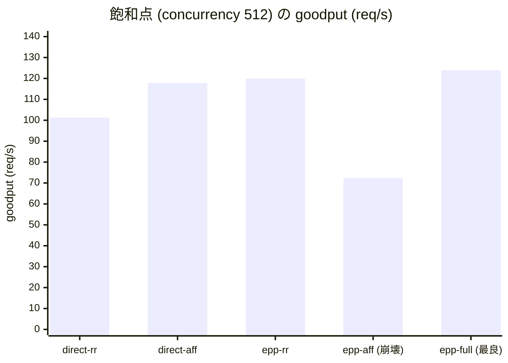

## はじめに

以前書いたこちらを読んでいることを前提とします。

https://zenn.dev/tosshi/articles/e43f0d9eb83601

マルチテナントで multi-LoRA serving するとき、ルーティングは「どの Pod に送るか」を決めるだけの脇役ではありません。各レプリカは限られた数のアダプタしか GPU の hot-set (`max_loras`) に常駐させられないため、リクエストを「そのアダプタを既に hot-set に持っているレプリカ」へ寄せれば CPU pool からの swap-in と、それに伴うキュー詰まりを避けられます。これが **LoRA-aware ルーティング**です。

しかし「LoRA-aware にする」の一言で済ませると、本番では性能が劣化しました。本記事は、AWS の p6-b300 上に 8 Pod の vLLM を立て、GIE v1.5.0 仕様に基づく **llm-d-inference-scheduler v0.8.0** の EndpointPicker (EPP) で 5 通りの routing 条件を実測した記録です。設計 (なぜ複数の "aware" を合成する必要があるのか) → 実装 (マニフェスト・scheduling profile・はまりどころ) → 実測 (affinity 単独は崩壊し、合成が最良) → そのうえで「なぜ LoRA はそもそもコストが乗るのか」というカーネルレベルの機序、の順で扱います。

https://gateway-api-inference-extension.sigs.k8s.io/

:::message
バージョン体系の注意: **GIE v1.5.0** は `kubernetes-sigs/gateway-api-inference-extension` のリリースバージョンで、InferencePool 等の CRD 仕様定義と `lora-affinity-scorer` 等のリファレンス EPP 実装の両方を含みます。**llm-d-inference-scheduler v0.8.0** はその仕様・実装に基づいて作られた llm-d のコンテナイメージ (`ghcr.io/llm-d/llm-d-inference-scheduler:v0.8.0`) です。本記事では仕様・標準実装に言及する場合は「GIE v1.5.0」、実際に動かしたコンテナに言及する場合は「llm-d-inference-scheduler v0.8.0」と使い分けます。
:::


## なぜ「LoRA-aware だけ」では足りないのか

LLM serving のルーティングで使う "○○-aware" は、「振り分け先を決めるときに ○○ という状態を見る」という意味です。代表的なものを並べます。

| aware | 見ている状態 | 寄せたい理由 |
|---|---|---|
| **LoRA-aware (affinity)** | そのアダプタが Pod の GPU (HBM) に既に載っているか | swap-in とそれに伴うキュー詰まりを避ける (TTFT + TPOT) |
| **prefix-cache-aware** | プロンプト先頭 (prefix) の KV キャッシュを持つ Pod はどれか | prefill 再計算を省く |
| **KV-cache-aware (load)** | 各 Pod の KV キャッシュ使用率 | 空いている Pod に流して詰まりを防ぐ |
| **queue-aware (load)** | 各 Pod の待ち行列の長さ | キューの短い Pod を選ぶ |

ここに本質的な緊張関係があります。**これらは互いに引っ張り合う**ことがあります。「アダプタを持つ Pod (LoRA-aware) に寄せたい」一方で「その Pod のキューが長い (queue-aware) なら避けたい」。LoRA-aware だけを盲目的に効かせると、人気アダプタを持つ 1 台に負荷が集中して、結局その Pod で詰まります。

つまり **複数の aware をどう調停するか**こそが設計の核心です。この記事の実測 (後述) でも、まさにこの「affinity 単独は高負荷で崩壊し、queue/KV と合成すると最良」という結果が出ます。どういう GPU でどういうキャッシュ設定をしているかなど様々な条件に左右されるため今回の結果が画一的な回答ではないです。

---

## GIE / EPP の仕組み

### GIE の概念: InferencePool と EPP を包含する標準拡張

[Gateway API Inference Extension](https://gateway-api-inference-extension.sigs.k8s.io/) (GIE) は Kubernetes SIG-Network のプロジェクトで、単なるルーティングロジックではなく、**CRD とコンポーネントのセット**を定義する標準拡張です ([公式 API Overview](https://gateway-api-inference-extension.sigs.k8s.io/concepts/api-overview/))。

- **InferencePool** (CRD, `inference.networking.k8s.io/v1`): 推論用 Pod の集合と、それらへルーティングする拡張を表す Kubernetes リソース。標準の Service の代わりにバックエンドとして使われ、`endpointPickerRef` で EPP Service への委譲先を指定する。
- **EndpointPicker (EPP)** (コンポーネント): InferencePool に紐づく拡張サーバ実装。Envoy の ext_proc 経由でリクエストごとに送信先 Pod を 1 つ選ぶ。scheduling profile (`EndpointPickerConfig`) で判断ルールを差し替えられる。

つまり「InferencePool という Pod 群の宣言」と「EPP というその中から選ぶ実装」がセットで 1 つの GIE を構成します。なお GIE はマルチクラスタ向けに `InferencePoolImport` (別クラスタからインポートした InferencePool のローカル表現) という CRD も定義しますが、本記事の単一クラスタ構成では使いません。

### 全体アーキテクチャ

実験の構成は次の通りです。


クライアントから見ると `http://mt-lora-epp:80` という 1 つのエンドポイントしか存在しません。内部では以下が起きています。

1. **Envoy sidecar** (port 8081) がリクエストを受け取り、ext_proc gRPC で **EPP scheduler** (port 9002) に「どの Pod に送るか」を問い合わせる
2. EPP は `InferencePool` が束ねる 8 Pod から scheduling profile に従い 1 Pod を選び、`x-gateway-destination-endpoint` ヘッダに Pod IP:8000 をセットして返す
3. Envoy の `ORIGINAL_DST` cluster が `x-gateway-destination-endpoint` を読んで選ばれた Pod へ転送する

routing の判断ロジックは **scheduling profile (EPP の ConfigMap) だけを差し替えることで切り替えられます**。vLLM の 8 Pod、InferencePool、Envoy の設定は全条件で完全に同一です。図の枠 (InferencePool と EPP Pod) は GIE が定める標準であり、その EPP に入るスケジューラの実装が llm-d-inference-scheduler です。

### Filter → Score → Pick の 3 段

EPP の処理は、正確には **Filter → Score → Pick** の 3 段です (llm-d 公式は「the scheduler follows a Filter → Score → Pick lifecycle for every request」と明記)。

1. **Filter**: filter plugin が**ハード制約**で候補 Pod を絞り込む。条件を満たさない Pod を候補から外す。
2. **Score**: profile が参照する全 scorer が、残った候補 Pod に数値スコアを付ける。各スコアに weight を掛けて合算する (weighted-sum、weight 省略時はデフォルト 1)。
3. **Pick**: picker が合成スコアから最終的な Pod を選ぶ (省略時は `max-score-picker`)。

公開ドキュメントで確認できる主な scorer は以下です。

| scorer (type 名) | 何を見るか |
|---|---|
| `prefix-cache-scorer` | prompt の prefix が既に KV キャッシュにあるか |
| `lora-affinity-scorer` | 要求された LoRA アダプタが Pod の HBM に既にロード済みか |
| `kv-cache-utilization-scorer` | KV キャッシュの空き容量 |
| `queue-scorer` | 待ち行列の長さ |
| `running-requests-size-scorer` | 実行中リクエスト数 |

**LoRA-aware と prefix-cache-aware と load-aware は、この Score 段で「同時に並走」します**。先ほどの「人気アダプタを持つ Pod に集中して詰まる」問題は、`lora-affinity-scorer` の weight に対して `queue-scorer` / `kv-cache-utilization-scorer` の weight を効かせることで自動的に調停されます。アダプタ命中の魅力 (LoRA スコア) と Pod の混み具合 (load スコア) が、同じスコア空間で天秤にかかります。

:::message
GIE における **priority とは「weight の比」**です。「LoRA-aware を prefix-cache より重視したい」なら weight を上げる。複数の aware が共存することが前提で、その配分を数値で調整する設計です。
:::

### lora-affinity-scorer は何を見て、どうスコアを付けるか

この Score 段で動く scorer のうち、本記事で最も重要なのが `lora-affinity-scorer` です。その実装を確認します。

`lora-affinity-scorer` の実装コードは llm-d リポジトリではなく、**上流 GIE v1.5.0 のリファレンス実装** (`pkg/epp/framework/plugins/scheduling/scorer/loraaffinity/lora_affinity.go`、kubernetes-sigs/gateway-api-inference-extension v1.5.0) に存在します。llm-d はこれを Go モジュール依存として取り込んでいるため、llm-d-inference-scheduler v0.8.0 のコンテナでも profile に `lora-affinity-scorer` を追加すれば動作します。

スコアリングは GIE v1.5.0 のソースで確認した以下の 4 段階です。

| 状態 | スコア | 条件 |
|---|---|---|
| **Active** (既にロード済み) | 1.0 | `running_lora_adapters` に含まれる |
| **Capacity** (ロード余地あり) | 0.8 | `len(ActiveModels) + len(WaitingModels) < MaxActiveModels` |
| **Waiting** (ロード待ちキューに積まれている) | 0.6 | `waiting_lora_adapters` に含まれる |
| **Default** (満杯・ロード不可) | 0.0 | 上記いずれにも該当しない |

重要な点として、**Capacity チェック (0.8) は Waiting チェック (0.6) より先に評価されます**。つまり「空き枠がある Pod」は「すでにキューに積まれている Pod」より高スコアになります。

判断のもとになるアダプタ常駐状況は、EPP のデータレイヤーが vLLM のメトリクス `vllm:lora_requests_info` を収集して把握しています。ラベルと scorer 内部概念の対応は以下です (GIE v1.5.0 実装で確認済み)。

| vLLM メトリクスラベル | scorer 内部の概念 |
|---|---|
| `running_lora_adapters` | ActiveModels |
| `waiting_lora_adapters` | WaitingModels |
| `max_lora` | MaxActiveModels |

---

## AIBrix との違い (対比)

同じ問題に、[AIBrix](https://aibrix.readthedocs.io/latest/) はまったく違う答えを出します。本記事の主題は llm-d/GIE なので要点だけ対比します。

GIE が **リクエスト時 (request-time) に複数 scorer を重み付き総和**で調停するのに対し、AIBrix は **リクエストごとに routing strategy を「ちょうど一つ」選ぶ** (`random` / `least-request` / `prefix-cache` / `vtc-basic` など)。strategy は重み付き合成されず、ヘッダ > アノテーション > 環境変数の cascade で 1 つに解決されます。

決定的なのは、**AIBrix の routing strategy 一覧には LoRA-affinity に相当するものが無い**点です (執筆時点 2026-06)。AIBrix は LoRA を**ルーティングではなく配置 (placement) のレイヤー**で解きます。`ModelAdapter` CRD でアダプタを宣言し、`least-adapters` スケジューラが Pod 間にアダプタを均等分散し、アダプタごとに作られる Kubernetes Service 経由で到達させます。

| 観点 | llm-d / GIE (EPP) | AIBrix |
|---|---|---|
| aware の合成 | Score 段で**複数 scorer を重み付き総和** | strategy を **cascade で1つ選択** (合成しない) |
| priority の意味 | scorer 間の **weight 比** (評価時の重み) | 設定ソースの **override 順** (`header > annotation > env`) |
| LoRA-aware の所在 | **リクエスト時の scorer** (`lora-affinity-scorer`) | **配置レイヤー** (`ModelAdapter` + `least-adapters` + per-adapter Service) |

要するに、GIE は「リクエストを荷物の在処へ動かす」(request-time の affinity)、AIBrix は「荷物を置き場所で整理してから普通に配送する」(placement-first の affinity) というアプローチの違いです。同時最適化のしやすさ (GIE) と運用の明快さ・関心の分離 (AIBrix) のトレードオフであり、本記事では GIE 側を実装・実測します。

:::message
本記事で扱った AIBrix の情報は公開ドキュメント (2026-06 時点) に基づきます。両プロジェクトとも活発に開発中で、プラグイン名・デフォルト値・挙動は変わりえます。
:::

---

## 実装: マニフェスト構成

実装は[こちら](https://github.com/littlemex/distributed-inference/tree/2026-06-23-llmd-gie-lora-routing/2026-06-21-multitenant-lora-vs-bedrock-b300/llm-d

```
llm-d/
├── manifests/
│   ├── 10-rbac-epp.yaml              # EPP 用 ServiceAccount + RBAC
│   ├── 20-vllm-pool-gemma4-31b.yaml  # 8 Pod vLLM Deployment + headless Service
│   ├── 30-inferencepool-epp.yaml     # InferencePool + EPP Service
│   ├── 40-envoy-configmap.yaml       # Envoy sidecar 設定
│   ├── 50-epp-deployment.yaml        # EPP Deployment (envoy + scheduler 2コンテナ)
│   └── 60-bench-client.yaml          # 同一ノードのベンチ実行 Pod
├── epp-configs/
│   ├── profile-rr.yaml               # random-picker のみ
│   ├── profile-affinity.yaml         # lora-affinity-scorer のみ
│   └── profile-full.yaml             # queue + kv-cache + prefix-cache + lora-affinity
├── switch_profile.sh                 # profile 差し替え + rollout restart
├── run_experiment.sh                 # 5 条件を同一 sweep で計測
└── compare_integrity.py              # 構成変更の整合性検証
```

### CRD と ConfigMap の役割

設計セクションで述べた `InferencePool` と EPP の 2 要素は、実運用では別々の CRD・リソースとして扱います。

- `InferencePool`: `inference.networking.k8s.io/v1` — Pod 群を束ねる K8s リソース (`kubectl apply` で作成)
- `EndpointPickerConfig`: `inference.networking.x-k8s.io/v1alpha1` — EPP の scheduling profile スキーマ定義

ここで注意したいのは、`EndpointPickerConfig` は `kubectl apply` するリソースではなく、その内容 (plugins / schedulingProfiles の定義) を **ConfigMap に格納し、EPP コンテナへ `/config/profile.yaml` として mount** して使う点です。本記事で示す profile YAML はこの ConfigMap に入る中身です。

以降の YAML では namespace をサンプル値 `mt-serving` にしています。

### InferencePool の定義

[`30-inferencepool-epp.yaml`](https://github.com/littlemex/distributed-inference/blob/2026-06-23-llmd-gie-lora-routing/2026-06-21-multitenant-lora-vs-bedrock-b300/llm-d/manifests/30-inferencepool-epp.yaml):

```yaml
apiVersion: inference.networking.k8s.io/v1
kind: InferencePool
metadata:
  name: mt-lora-pool
  namespace: mt-serving   # 実際の namespace に変更してください
spec:
  appProtocol: http
  selector:
    matchLabels:
      app: mt-lora-pool          # vLLM Deployment の Pod ラベル
  targetPorts:
  - number: 8000
  endpointPickerRef:
    failureMode: FailClose
    group: ""
    kind: Service
    name: mt-lora-epp
    port:
      number: 9002
```

`selector.matchLabels` で 8 Pod を束ね、`endpointPickerRef` が EPP Service の 9002 ポートに routing 判断を委譲します。

### EPP Deployment: 2 コンテナ構成

[`50-epp-deployment.yaml`](https://github.com/littlemex/distributed-inference/blob/2026-06-23-llmd-gie-lora-routing/2026-06-21-multitenant-lora-vs-bedrock-b300/llm-d/manifests/50-epp-deployment.yaml) は Envoy sidecar と EPP scheduler の 2 コンテナで構成されます (以下は要点抜粋。実ファイルには `--pool-group` などの引数も含みます)。

```yaml
containers:
  - name: envoy-sidecar
    image: docker.io/envoyproxy/envoy:distroless-v1.33.2
    # port 8081 で OpenAI API を受け付け、ext_proc gRPC で EPP に送る
  - name: epp
    image: ghcr.io/llm-d/llm-d-inference-scheduler:v0.8.0
    args:
      - --pool-name
      - mt-lora-pool
      - --pool-namespace
      - mt-serving             # 実際の namespace に変更してください
      - --pool-group
      - inference.networking.k8s.io   # InferencePool の API group
      - --config-file
      - /config/profile.yaml   # scheduling profile (ConfigMap)
      # 他に --zap-encoder / --v / --tracing 等 (実ファイル参照)
```

EPP コンテナが読む `/config/profile.yaml` は ConfigMap `mt-lora-epp-config` から mount されます。`switch_profile.sh` で ConfigMap を差し替えて rollout restart するだけで routing 戦略が切り替わります。

### scheduling profile の 3 種類


**profile-rr** (random-picker のみ):

```yaml
plugins:
- type: metrics-data-source
  parameters: { scheme: "http", path: "/metrics", insecureSkipVerify: true }
- type: core-metrics-extractor
- type: random-picker
schedulingProfiles:
- name: default
  plugins:
  - pluginRef: random-picker
```

**profile-affinity** (lora-affinity-scorer のみ):

```yaml
plugins:
- type: metrics-data-source
  parameters: { scheme: "http", path: "/metrics", insecureSkipVerify: true }
- type: core-metrics-extractor
- type: lora-affinity-scorer
- type: max-score-picker
schedulingProfiles:
- name: default
  plugins:
  - pluginRef: lora-affinity-scorer
    weight: 1
  - pluginRef: max-score-picker
```

**profile-full** (重み付き合成):

```yaml
plugins:
- type: metrics-data-source
  parameters: { scheme: "http", path: "/metrics", insecureSkipVerify: true }
- type: core-metrics-extractor
- type: queue-scorer
- type: kv-cache-utilization-scorer
- type: prefix-cache-scorer
- type: lora-affinity-scorer
- type: max-score-picker
schedulingProfiles:
- name: default
  plugins:
  - pluginRef: queue-scorer
    weight: 2
  - pluginRef: kv-cache-utilization-scorer
    weight: 2
  - pluginRef: prefix-cache-scorer
    weight: 3
  - pluginRef: lora-affinity-scorer
    weight: 3
  - pluginRef: max-score-picker
```

`metrics-data-source` と `core-metrics-extractor` は `vllm:lora_requests_info` 等のメトリクス収集を担う必須プラグインです。

:::message
GIE v1.5.0 のデフォルト profile は `prefix-cache-scorer` のみで **`lora-affinity-scorer` は含まれません**。LoRA-aware routing を有効にするには、上述の `lora-affinity-scorer` を明示的に追加する必要があります。
:::

profile-full の weight 値 (queue:2, kv-cache:2, prefix-cache:3, lora-affinity:3) は既存の pd-disaggregation EPP の `default-plugins.yaml` を参考値として採用したもので、この実験環境に対する定量的なチューニング結果ではありません。

### profile 切り替えスクリプト

```bash
./switch_profile.sh rr         # profile-rr.yaml を ConfigMap に反映して EPP を再起動
./switch_profile.sh affinity   # lora-affinity-scorer のみ
./switch_profile.sh full       # 重み付き合成
```

内部では `kubectl create configmap --dry-run=client -o yaml | kubectl apply -f -` で ConfigMap を upsert し、`kubectl rollout restart deploy/mt-lora-epp` で EPP を再起動します。

### はまりどころ 4 件

#### 1. privileged で GPU 分離が崩れる

```yaml
# privileged は付けない: privileged だと device plugin の GPU 分離が無効化され
# 8 Pod 全てが cuda:0 を奪い合って OOM クラッシュする (確認済み)。
resources:
  requests: { cpu: "18", memory: "240Gi", nvidia.com/gpu: "1" }
  limits: { nvidia.com/gpu: "1" }
```

`securityContext.privileged: true` を設定すると NVIDIA device plugin の GPU 分離が無効化され、8 Pod 全てが `cuda:0` を取り合って OOM でクラッシュします。通常コンテナ (`privileged: false`) にすれば device plugin が各 Pod に別々の GPU を割り当て、各 Pod が 275GB の HBM を独占できます。

#### 2. LoRA 並列登録で vLLM engine が詰まる

50 並列 `POST /v1/load_lora_adapter` を投げると、vLLM が LoRA load を内部でシリアライズするため逆に遅くなります。さらに `-m` オプションなしの curl が engine 詰まりで無限待ちになり、大量のゾンビプロセスが発生します。

```bash
# [NG] 50 並列 POST: engine が詰まり、30s タイムアウト + curl ゾンビ多発
for i in $(seq 0 $((N - 1))); do
  curl -s -X POST ".../v1/load_lora_adapter" ... &
  [ $((i % 50)) -eq 0 ] && wait
done

# [OK] 逐次登録 (-m 90 付き): 既ロードは HTTP 400 で即スキップ (冪等)
for i in $(seq 0 $((N - 1))); do
  curl -s -m 90 -X POST ".../v1/load_lora_adapter" \
    -d "{\"lora_name\": \"adapter-${i}\", \"lora_path\": \"...\"}"
done
```

#### 3. lora_requests_info が空でエラー

EPP 起動直後、`vllm:lora_requests_info` は `HELP` / `TYPE` 行のみで sample 行がありません (LoRA リクエストを一度も処理していない状態)。この状態で `lora-affinity-scorer` が値を読もうとするとエラーが発生します。

対策は profile 切り替え後にウォームアップを 1 周挟むことです。`run_experiment.sh` では各条件の計測前に concurrency 8 での小規模 sweep をウォームアップとして実行し、gauge を populate してから本計測に入ります。

#### 4. 計測経路でフェアネスが崩れる (Mac からの port-forward 禁止)

Mac から `kubectl port-forward` 経由で計測すると TTFT が数十 ms 余分に膨らみ、不整合になります。同一ノード Pod 間の実測遅延は 0.9ms (veth 経由) で、TTFT (数十〜数百 ms) に対して無視できます。**計測は必ず vLLM と同一ノードに配置した bench Pod から実行**します。

```bash
# [NG] Mac から port-forward 経由: TTFT が膨らむ
kubectl port-forward svc/mt-lora-epp 8080:80 -n mt-serving
python scripts/concurrency_sweep.py --base-url http://localhost:8080 ...

# [OK] bench Pod から直接叩く (同一ノード, TTFT 誤差 0.9ms)
kubectl exec -n mt-serving mt-lora-bench -- \
  python3 /workspace/concurrency_sweep.py \
  --base-url http://mt-lora-epp:80 ...
```

---

## 計測条件とワークロード

profile を差し替えて、次の 5 条件を**同一ワークロード**で比較します。

| 条件 | 経路 | routing 決定 | 目的 |
|---|---|---|---|
| `direct-rr` | 8 Pod IP を client が直接 roundrobin | なし (均等割り当て) | 構成の整合性確認のベースライン |
| `direct-affinity` | 8 Pod IP を client が静的シャード | `adapter_idx % 8` で固定 | client-side affinity の効果 |
| `epp-rr` | Envoy → EPP | random-picker | EPP 経路自体のオーバーヘッド評価 |
| `epp-affinity` | Envoy → EPP | lora-affinity-scorer のみ | LoRA-aware 単独効果 |
| `epp-full` | Envoy → EPP | queue + kv-cache + prefix-cache + lora-affinity の重み付き合成 | llm-d 代表構成 |

ワークロードは全条件で統一しています。
Gemma 4 31B fp8, 128 テナント (adapter-0..127), Zipf 1.1, concurrency [8, 32, 64, 128, 256, 512], requests_per_stage 512, max_tokens 64, SLO TTFT≤2000ms / TPOT≤80ms。

5 条件の差は **ルーティングの違いだけ**で、LoRA の有無や個数は全条件で同一 (128 テナント分の adapter を 8 Pod に載せた状態) です。

---

## 計測結果

### 飽和点 (concurrency 512) の goodput



棒の高さで一目瞭然です。**`epp-aff` (lora-affinity 単独) だけが 72.4 req/s に落ち込み**、他条件 (101〜120) を大きく下回ります。一方 **`epp-full` (全 scorer 合成) は 123.9 req/s で全条件中の最高**です。

| 条件 | goodput (req/s) | SLO 達成率 |
|---|---|---|
| direct-rr (8Pod 直接 roundrobin) | 101.3 | 98.6% |
| direct-affinity (client 静的シャード) | 117.8 | 98.8% |
| epp-rr (EPP random-picker) | 119.9 | 99.2% |
| **epp-affinity (lora-affinity 単独)** | **72.4** | **91.8% [NG]** |
| **epp-full (全 scorer 合成)** | **123.9** | **100% [最良]** |

**epp-affinity は高負荷で崩壊します**。Zipf 1.1 の偏ったトラフィックで、人気アダプタを「同じ Pod」に集め過ぎた結果、その Pod でキューが詰まり SLO を割ります。冒頭で述べた「LoRA-aware だけを盲目的に効かせると 1 台に集中して詰まる」という緊張関係が、そのまま実測に現れました。

**epp-full が最良です**。`lora-affinity-scorer` に `queue-scorer` と `kv-cache-utilization-scorer` を加えて重み付き合成することで、「アダプタが既にロード済みの Pod を優先する (局所性)」と「キューが詰まっている Pod を避ける (負荷分散)」が同じスコア空間で自動的に調停されます。結果として client-side の `direct-affinity` (117.8) を上回る 123.9 req/s を達成し、SLO は 100% です。

:::message
concurrency 512 では `epp-rr` (119.9 req/s) が `direct-rr` (101.3 req/s) を約 18% 上回るという、一見 EPP の ext_proc gRPC オーバーヘッドに反する逆転が見られます。飽和領域での負荷分散の差によるものと解釈していますが、`epp-rr` の ttft_p50 がこの段で著しく高い点と合わせて、要因の切り分けは残課題です。
:::

### 整合性検証: 構成変更で goodput は変わらない

本記事の 8 Pod 構成は、前段で行った 1Pod×8プロセス構成からの移行です。`compare_integrity.py` で検証した結果、**goodput は全 concurrency 段で誤差 max 3.7% で一致**しています (`direct-rr ≈ 旧 B-roundrobin`、`direct-affinity ≈ 旧 B-affinity`)。一方 TTFT は構成変更の影響を受け、concurrency 64 では ttft_p90 が 56% 改善 (239ms → 104ms) するなど差があります。本検証の主目的は goodput の再現性確認です。

---

## なぜ LoRA はコストが乗るのか — per-token BGMV オーバーヘッドの正体

ここまでで「LoRA-aware routing で swap-in を避ければキュー詰まりを防げる」ことを実測で確認しました。では、アダプタが GPU に載っている (swap が起きない) 状態でも、LoRA には固有のコストがあるのか。あります。そしてそれは多くの人が誤解しているように「swap が遅い」のではなく、**decode 中に毎トークン走る LoRA カーネルの計算コスト**です。routing の効果と限界を正しく理解するための機序として、独立して深掘りします。

なお本節で使う **B / B0** は、上記 8 Pod 実験の前段として 1Pod×8プロセス構成で取得した事前検証データです。**B = LoRA あり (後述 5 条件の direct-rr に相当)、B0 = LoRA なし (base + system prompt) 相当**で、LoRA のコストを切り出すために LoRA なし構成 (B0) と直接対比しています。

### LoRA 2 段カーネル (Punica 由来 Triton 実装)

vLLM の multi-LoRA は、base GEMM に対して低ランク更新 `delta_W = B @ A` を重畳して各テナントの重みを実現します。実装は Punica (Chen et al. 2023, [arXiv:2310.18547](https://arxiv.org/abs/2310.18547)) 由来の Triton カーネル 2 発で構成されます。

- `lora_shrink` (shrink カーネル): x → x @ A (入力を低ランク空間へ射影)
- `lora_expand` (expand カーネル): x @ A → x @ A @ B (低ランク空間から出力次元へ展開)

各バッチリクエストに対し、どの adapter の A/B テンソルを使うかを `token_indices` として渡し、1 カーネル内で複数の異なる adapter を同時に処理します。

### decode 相 (BGMV) と prefill 相 (SGMV) の区別

カーネルの動作フェーズによって処理の性格が大きく異なります (略語は Punica 論文の定義に従います)。

- **decode フェーズ (BGMV 相; Batched Gather Matrix-Vector)**: 1 ステップあたり M = batch size トークンのみを処理する小 GEMM。TPOT (Time Per Output Token) に直結する。バッチ内で distinct adapter 数が多いほど、M が小さいまま adapter 数だけ分割されるため per-token 計算コストが増大する。
- **prefill フェーズ (SGMV 相; Segmented Gather Matrix-Vector)**: 入力シーケンス全体を一度に処理する大きい M の GEMM。base GEMM に対する LoRA の相対オーバーヘッドは decode に比べ小さい。TTFT に影響するが TPOT にはほとんど影響しない。

**TPOT を押し上げる主因は BGMV 相 (decode フェーズ) の per-token LoRA 計算**です。SGMV 相は prefill の主因にはなりますが、decode の TPOT 劣化の主因ではありません。

### 複数アダプタ混在で非効率になる 3 つの理由

1. **tensor-core 利用率の低下**: decode フェーズでは M (同時処理トークン数 = batch size) が小さく、tensor-core の tile を埋めきれない。さらにバッチ内で adapter ごとにトークンが分割されると 1 グループあたりの M はさらに小さくなり、tile が不完全なまま計算が走るため演算効率が低下する。
2. **`token_indices` による不連続メモリアクセス**: バッチ内の各トークンがどの adapter を使うかを `token_indices` テンソルで間接参照するため、A/B テンソルのアクセスパターンが不連続 (gather) になり、キャッシュヒット率が下がる。
3. **shrink + expand 2 カーネル launch の固定オーバーヘッド比率**: prefill では M が大きいため 2 カーネルの launch 固定コストは相対的に小さい。decode では M が小さい (= 生成 batch size) ため、固定オーバーヘッドの占める割合が増大する。

### swap ではなくカーネルが主因である根拠

`concurrency_sweep.py` による実測 (`results/B-roundrobin.json`, `B0-sysprompt.json`) では、swap 圧力がほぼゼロの低同時実行 (concurrency 8) においても、LoRA 構成 (B) の TPOT は LoRA を使わない構成 (B0) と比べて **2.49 倍**に達しました。

| concurrency | B (LoRA) TPOT (ms) | B0 (LoRA なし) TPOT (ms) | 比 |
|---|---|---|---|
| 8 | 24.7 | 9.9 | 2.49x |
| 32 | 27.5 | 10.8 | 2.55x |
| 64 | 30.2 | 11.2 | 2.70x |
| 128 | 34.3 | 12.8 | 2.68x |
| 256 | 40.1 | 15.6 | 2.57x |
| 512 | 53.4 | 18.3 | 2.92x |

concurrency 8 の時点で swap 頻度は無視できるレベルであり、それでも 2.49x の差が生じることは、TPOT 劣化の主因が **swap コストではなく BGMV 相 per-token カーネルの計算コスト**であることを示します。

ちなみに CPU pool からのアダプタ swap-in による TTFT への実効的な上乗せ (hot 命中との差分) は約 1.2ms です。H2D コピー自体は 3〜7ms かかりますが、vLLM のパイプライン処理でブロッキングが削減され、TTFT への marginal cost は 1.2ms に収まります。いずれにせよ、数十 ms 規模の TPOT に毎トークン乗る BGMV コストとはオーダーが違います。

:::message
B と B0 はトラフィック分布 (B=Zipf 1.1 / B0=uniform)・飽和状態・APC 有無の 3 点が異なるため、「TPOT 比 ≒ カーネルオーバーヘッド比」と断定するには交絡を念頭に置く必要があります。飽和前の concurrency 256 の 2.57x が最もクリーンな推定値です。それでも全 concurrency 域で比が約 2.5〜2.9x と安定していることが、カーネルが主因という定性的結論を支えます。
:::

この機序が示すのは、LoRA-aware routing の効果と限界です。routing で swap-in とキュー詰まりは避けられますが、**per-token の BGMV カーネルコストは routing では消せません**。これは LoRA を選ぶこと自体に内在するコストであり、設計上は別途織り込む必要があります。

---

## まとめ: lora-affinity 単独 vs 合成

| 観点 | epp-affinity (単独) | epp-full (合成) |
|---|---|---|
| 局所性 (アダプタ hot-set ヒット率) | 高い | 高い |
| 負荷分散 | 機能しない (人気テナントに集中) | queue / KV で自動調停 |
| 高負荷時の goodput | 崩壊 (72.4 req/s) | 最良 (123.9 req/s) |
| SLO 達成率 | 91.8% | 100% |

冒頭で述べた「LoRA-aware は単独では成立しない。prefix-cache-aware や load-aware と必ず引っ張り合う」という設計上の予測が、実測で正確に確認されました。**affinity を安全に有効化するには、`queue-scorer` と `kv-cache-utilization-scorer` を必ず合成する必要があります**。

そして前節で見たように、LoRA そのものにも routing で消せない per-token BGMV カーネルのコスト (B/B0 TPOT 比 約 2.5〜2.9x) が乗ります。マルチテナントで multi-LoRA を本番運用するなら、「LoRA-aware にする」で止まらず、**(1) 他の aware との weight 配分による調停と、(2) LoRA カーネル自体のオーバーヘッド**の両方を設計に織り込む必要があります。

:::message
LoRA-aware routing を使う場合、`lora-affinity-scorer` 単独では高負荷で崩壊します。`queue-scorer` / `kv-cache-utilization-scorer` との合成が必須です。
:::

---

## 参考

- 実装リポジトリ: https://github.com/littlemex/distributed-inference/tree/2026-06-23-llmd-gie-lora-routing/2026-06-21-multitenant-lora-vs-bedrock-b300/llm-d
- Gateway API Inference Extension (GIE): https://gateway-api-inference-extension.sigs.k8s.io/
- GIE EPP 設定 (config-text): https://gateway-api-inference-extension.sigs.k8s.io/guides/epp-configuration/config-text/
- GIE lora-affinity-scorer 実装 (v1.5.0): `pkg/epp/framework/plugins/scheduling/scorer/loraaffinity/lora_affinity.go` (kubernetes-sigs/gateway-api-inference-extension)
- llm-d アーキテクチャ: https://llm-d.ai/docs/architecture
- AIBrix ドキュメント: https://aibrix.readthedocs.io/latest/
- Punica (multi-LoRA serving): https://arxiv.org/abs/2310.18547
