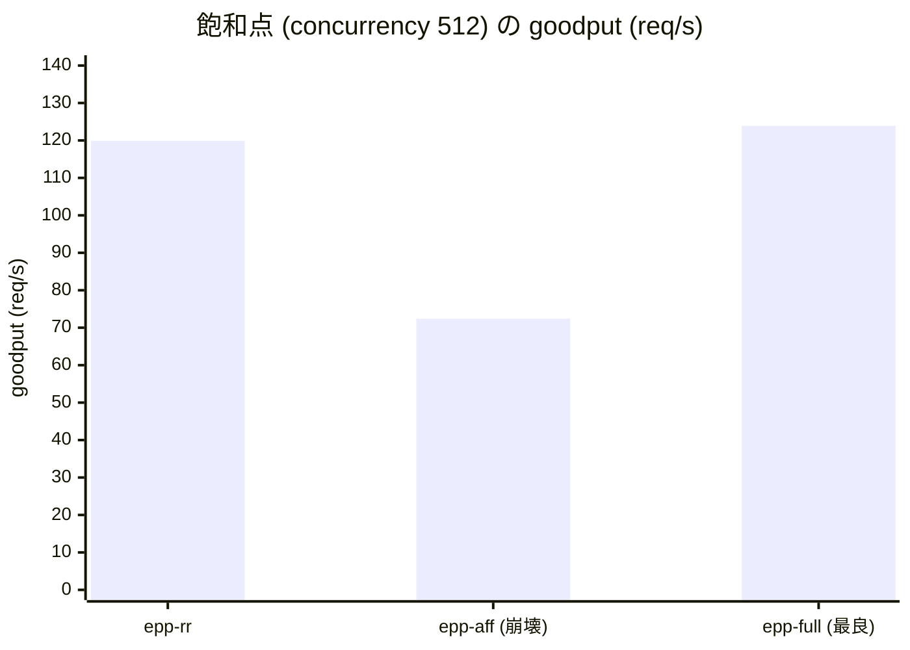

## はじめに

以前書いたこちらを読んでいることを前提とします。

https://zenn.dev/tosshi/articles/e43f0d9eb83601

マルチテナントで multi-LoRA serving するとき、ルーティングは「どの Pod に送るか」を決めるだけの脇役ではありません。各レプリカは限られた数のアダプタしか GPU の hot-set (`max_loras`) に常駐させられないため、リクエストを「そのアダプタを既に hot-set に持っているレプリカ」へ寄せれば CPU pool からの swap-in と、それに伴うキュー詰まりを避けられます。これが **LoRA-aware ルーティング**です。

しかし「LoRA-aware にする」の一言で済ませると、本番では性能が劣化しました。本記事は、AWS の p6-b300 上に 8 Pod の vLLM を立て、GIE v1.5.0 仕様に基づく **llm-d-inference-scheduler v0.8.0** の EndpointPicker (EPP) で 3 通りの routing 条件 (rr / affinity 単独 / 全 aware 合成) を実測した記録です。設計 (なぜ複数の "aware" を合成する必要があるのか) → 実装 (マニフェスト・scheduling profile・はまりどころ) → 実測 (affinity 単独は崩壊し、合成が最良) → そのうえで「なぜ LoRA はそもそもコストが乗るのか」というカーネルレベルの機序、の順で扱います。

https://gateway-api-inference-extension.sigs.k8s.io/

:::message
バージョン体系の注意: **GIE v1.5.0** は `kubernetes-sigs/gateway-api-inference-extension` のリリースバージョンで、InferencePool 等の CRD 仕様定義と `lora-affinity-scorer` 等のリファレンス EPP 実装の両方を含みます。**llm-d-inference-scheduler v0.8.0** はその仕様・実装に基づいて作られた llm-d のコンテナイメージ (`ghcr.io/llm-d/llm-d-inference-scheduler:v0.8.0`) です。本記事では仕様・標準実装に言及する場合は「GIE v1.5.0」、実際に動かしたコンテナに言及する場合は「llm-d-inference-scheduler v0.8.0」と使い分けます。
:::


## なぜ「LoRA-aware だけ」では足りないのか

LLM serving のルーティングで使う "○○-aware" は、「振り分け先を決めるときに ○○ という状態を見る」という意味です。代表的なものを並べます。

| aware | 見ている状態 | 寄せたい理由 |
|---|---|---|
| **LoRA-aware (affinity)** | そのアダプタが Pod の GPU (HBM) に既に載っているか | swap-in とそれに伴うキュー詰まりを避ける (TTFT + TPOT) |
| **prefix-cache-aware** | プロンプト先頭 (prefix) の KV キャッシュを持つ Pod はどれか | prefill 再計算を省く |
| **KV-cache-aware (load)** | 各 Pod の KV キャッシュ使用率 | 空いている Pod に流して詰まりを防ぐ |
| **queue-aware (load)** | 各 Pod の待ち行列の長さ | キューの短い Pod を選ぶ |

ここに本質的な緊張関係があります。**これらは互いに引っ張り合う**ことがあります。「アダプタを持つ Pod (LoRA-aware) に寄せたい」一方で「その Pod のキューが長い (queue-aware) なら避けたい」。LoRA-aware だけを盲目的に効かせると、人気アダプタを持つ 1 台に負荷が集中して、結局その Pod で詰まります。

つまり **複数の aware をどう調停するか**こそが設計の核心です。この記事の実測 (後述) でも、まさにこの「affinity 単独は高負荷で崩壊し、queue/KV と合成すると最良」という結果が出ます。どういう GPU でどういうキャッシュ設定をしているかなど様々な条件に左右されるため今回の結果が画一的な回答ではないです。

---

## GIE / EPP の仕組み

### GIE の概念: InferencePool と EPP を包含する標準拡張

[Gateway API Inference Extension](https://gateway-api-inference-extension.sigs.k8s.io/) (GIE) は Kubernetes SIG-Network のプロジェクトで、単なるルーティングロジックではなく、**CRD とコンポーネントのセット**を定義する標準拡張です ([公式 API Overview](https://gateway-api-inference-extension.sigs.k8s.io/concepts/api-overview/))。

- **InferencePool** (CRD, `inference.networking.k8s.io/v1`): 推論用 Pod の集合と、それらへルーティングする拡張を表す Kubernetes リソース。標準の Service の代わりにバックエンドとして使われ、`endpointPickerRef` で EPP Service への委譲先を指定する。
- **EndpointPicker (EPP)** (コンポーネント): InferencePool に紐づく拡張サーバ実装。Envoy の ext_proc 経由でリクエストごとに送信先 Pod を 1 つ選ぶ。scheduling profile (`EndpointPickerConfig`) で判断ルールを差し替えられる。

つまり「InferencePool という Pod 群の宣言」と「EPP というその中から選ぶ実装」がセットで 1 つの GIE を構成します。なお GIE はマルチクラスタ向けに `InferencePoolImport` (別クラスタからインポートした InferencePool のローカル表現) という CRD も定義しますが、本記事の単一クラスタ構成では使いません。

### 全体アーキテクチャ

実験の構成は次の通りです。


クライアントから見ると `http://mt-lora-epp:80` という 1 つのエンドポイントしか存在しません。内部では以下が起きています。

1. **Envoy sidecar** (port 8081) がリクエストを受け取り、ext_proc gRPC で **EPP scheduler** (port 9002) に「どの Pod に送るか」を問い合わせる
2. EPP は `InferencePool` が束ねる 8 Pod から scheduling profile に従い 1 Pod を選び、`x-gateway-destination-endpoint` ヘッダに Pod IP:8000 をセットして返す
3. Envoy の `ORIGINAL_DST` cluster が `x-gateway-destination-endpoint` を読んで選ばれた Pod へ転送する

routing の判断ロジックは **scheduling profile (EPP の ConfigMap) だけを差し替えることで切り替えられます**。vLLM の 8 Pod、InferencePool、Envoy の設定は全条件で完全に同一です。図の枠 (InferencePool と EPP Pod) は GIE が定める標準であり、その EPP に入るスケジューラの実装が llm-d-inference-scheduler です。

### Envoy ext_proc — 「Pod 選び」を外部 gRPC に委譲する仕組み

上の手順 1 に出てきた **ext_proc** は Envoy の **External Processing フィルタ**で、リクエスト/レスポンスの処理を **外部の gRPC サービスに委譲する**仕組みです。GIE が「既存の Envoy をそのまま推論ゲートウェイ化できる」のは、この ext_proc の上に EPP を載せているからです。

```
クライアント → Envoy → [ext_proc フィルタ] ⇄ EPP (gRPC サーバ) → 選ばれた Pod
```

Envoy はリクエストを受けると、設定したフェーズ (ヘッダ受信時・ボディ受信時など) で外部 gRPC サービス (= EPP) を呼び出します。EPP は受け取った内容をもとに、ヘッダの追加・削除・書き換え、ルーティング先の指定、リクエストの許可/拒否を返し、Envoy はそれに従って処理を続けます。本記事の構成では EPP が `x-gateway-destination-endpoint` ヘッダに「選んだ Pod の IP」を書き込み、Envoy の `ORIGINAL_DST` cluster がそのヘッダを読んで転送します。

ext_proc が便利なのは、**Pod 選びのロジックを Envoy の外 (任意の言語・任意の状態管理) に出せる**点です。Envoy 内蔵の Lua フィルタ (軽量だが複雑なロジックに不向き) や WASM フィルタ (サンドボックスで外部通信に制約) と違い、ext_proc は外部プロセスなので、GPU メトリクスの収集や scheduling profile の評価といった重いロジックを自由に書けます。GIE/EPP はまさにこれを使って「KV キャッシュ利用率・キュー長・LoRA 常駐状況を見て Pod を選ぶ」を実現しています。

どのフェーズで EPP を呼ぶかは `processing_mode` で制御します。本実験の [`40-envoy-configmap.yaml`](https://github.com/littlemex/distributed-inference/blob/main/2026-06-21-multitenant-lora-vs-bedrock-b300/llm-d/manifests/40-envoy-configmap.yaml) の設定は以下です。

```yaml
http_filters:
- name: envoy.filters.http.ext_proc
  typed_config:
    "@type": type.googleapis.com/envoy.extensions.filters.http.ext_proc.v3.ExternalProcessor
    grpc_service:
      envoy_grpc:
        cluster_name: ext_proc      # EPP (port 9002) を指す cluster
    processing_mode:
      request_header_mode: SEND               # リクエストヘッダを EPP に送る
      response_header_mode: SEND
      request_body_mode: FULL_DUPLEX_STREAMED  # ボディ (プロンプト) も EPP に流す
      response_body_mode: FULL_DUPLEX_STREAMED
```

`request_body_mode` をボディ送信ありにしているのは、EPP がリクエストボディの `model` フィールド (= 要求された LoRA アダプタ名) を読んで lora-affinity を判断するためです。逆に LoRA や prefix を見ない単純な負荷分散だけなら、ボディ送信を切ってヘッダだけで判断させることもできます。

### Filter → Score → Pick の 3 段

EPP の処理は、正確には **Filter → Score → Pick** の 3 段です。

1. **Filter**: filter plugin が**ハード制約**で候補 Pod を絞り込み条件不一致の Pod を候補から外す。
2. **Score**: profile が参照する全 scorer が、残った候補 Pod に数値スコアを付ける。各スコアに weight を掛けて合算する。
3. **Pick**: picker が合成スコアから最終的な Pod を選ぶ。

[GIE ドキュメント](https://gateway-api-inference-extension.sigs.k8s.io/guides/epp-configuration/config-text/#scheduling-plugins-scorers-pickers)で確認できる主な scorer は以下です。

| scorer (type 名) | 何を見るか |
|---|---|
| `prefix-cache-scorer` | prompt の prefix が既に KV キャッシュにあるか |
| `lora-affinity-scorer` | 要求された LoRA アダプタが Pod の HBM に既にロード済みか |
| `kv-cache-utilization-scorer` | KV キャッシュの空き容量 |
| `queue-scorer` | 待ち行列の長さ |
| `running-requests-size-scorer` | 実行中リクエスト数 |

**LoRA-aware と prefix-cache-aware と load-aware は、この Score 段で「同時に並走」します**。先ほどの「人気アダプタを持つ Pod に集中して詰まる」問題は、`lora-affinity-scorer` の weight に対して `queue-scorer` / `kv-cache-utilization-scorer` の weight を効かせることで自動的に調停されます。アダプタ命中の魅力 (LoRA スコア) と Pod の混み具合 (load スコア) が、同じスコア空間で天秤にかかります。

### lora-affinity-scorer は何を見て、どうスコアを付けるか


この Score 段で動く scorer のうち、本記事で最も重要なのが `lora-affinity-scorer` です。その実装を確認します。

`lora-affinity-scorer` の実装コードは llm-d リポジトリではなく、**上流 GIE v1.5.0 のリファレンス実装** ([`lora_affinity.go`](https://github.com/kubernetes-sigs/gateway-api-inference-extension/blob/v1.5.0/pkg/epp/framework/plugins/scheduling/scorer/loraaffinity/lora_affinity.go)、kubernetes-sigs/gateway-api-inference-extension v1.5.0) に存在します。llm-d はこれを Go モジュール依存として取り込んでいるため、llm-d-inference-scheduler v0.8.0 のコンテナでも profile に `lora-affinity-scorer` を追加すれば動作します。

スコアリングは GIE v1.5.0 のソースで確認した以下の 4 段階です。

| 状態 | スコア | 条件 |
|---|---|---|
| **Active** (既にロード済み) | 1.0 | `running_lora_adapters` に含まれる |
| **Capacity** (ロード余地あり) | 0.8 | `len(ActiveModels) + len(WaitingModels) < MaxActiveModels` |
| **Waiting** (ロード待ちキューに積まれている) | 0.6 | `waiting_lora_adapters` に含まれる |
| **Default** (満杯・ロード不可) | 0.0 | 上記いずれにも該当しない |

重要な点として、**Capacity チェック (0.8) は Waiting チェック (0.6) より先に評価されます**。つまり「空き枠がある Pod」は「すでにキューに積まれている Pod」より高スコアになります。

判断根拠となるアダプタ状況は、EPP データレイヤーが vLLM のメトリクス `vllm:lora_requests_info` を収集して把握しています。ラベルと scorer 内部概念の対応は以下です。

| vLLM メトリクスラベル | scorer 内部の概念 |
|---|---|
| `running_lora_adapters` | ActiveModels |
| `waiting_lora_adapters` | WaitingModels |
| `max_lora` | MaxActiveModels |

## 実装: マニフェスト構成

実装は[こちら](https://github.com/littlemex/distributed-inference/tree/main/2026-06-21-multitenant-lora-vs-bedrock-b300/llm-d)で公開しています。

```
llm-d/
├── manifests/
│   ├── 10-rbac-epp.yaml              # EPP 用 ServiceAccount + RBAC
│   ├── 20-vllm-pool-gemma4-31b.yaml  # 8 Pod vLLM Deployment + headless Service
│   ├── 30-inferencepool-epp.yaml     # InferencePool + EPP Service
│   ├── 40-envoy-configmap.yaml       # Envoy sidecar 設定
│   ├── 50-epp-deployment.yaml        # EPP Deployment (envoy + scheduler 2コンテナ)
│   └── 60-bench-client.yaml          # 同一ノードのベンチ実行 Pod
├── epp-configs/
│   ├── profile-rr.yaml               # random-picker のみ
│   ├── profile-affinity.yaml         # lora-affinity-scorer のみ
│   └── profile-full.yaml             # queue + kv-cache + prefix-cache + lora-affinity
├── switch_profile.sh                 # profile 差し替え + rollout restart
└── run_experiment.sh                 # 3 条件を同一 sweep で計測
```

### CRD と ConfigMap の役割

設計セクションで述べた `InferencePool` と EPP の 2 要素は、実運用では別々の CRD・リソースとして扱います。

- `InferencePool` — Pod 群を束ねる K8s リソース (`kubectl apply` で作成)
- `EndpointPickerConfig` — EPP の scheduling profile スキーマ定義

ここで注意したいのは、`EndpointPickerConfig` は `kubectl apply` するリソースではなく、その定義内容を **ConfigMap に格納し、EPP コンテナへ `/config/profile.yaml` として mount** して使う点です。本記事で示す profile YAML はこの ConfigMap に入る中身です。

以降の YAML では namespace をサンプル値 `mt-serving` にしています。

### InferencePool の定義

[`30-inferencepool-epp.yaml`](https://github.com/littlemex/distributed-inference/blob/main/2026-06-21-multitenant-lora-vs-bedrock-b300/llm-d/manifests/30-inferencepool-epp.yaml):

```yaml
apiVersion: inference.networking.k8s.io/v1
kind: InferencePool
metadata:
  name: mt-lora-pool
  namespace: mt-serving   # 実際の namespace に変更してください
spec:
  appProtocol: http
  selector:
    matchLabels:
      app: mt-lora-pool          # vLLM Deployment の Pod ラベル
  targetPorts:
  - number: 8000
  endpointPickerRef:
    failureMode: FailClose
    group: ""
    kind: Service
    name: mt-lora-epp
    port:
      number: 9002
```

`selector.matchLabels` で 8 Pod を束ね、`endpointPickerRef` が EPP Service の 9002 ポートに routing 判断を委譲します。

### EPP Deployment: 2 コンテナ構成

[`50-epp-deployment.yaml`](https://github.com/littlemex/distributed-inference/blob/main/2026-06-21-multitenant-lora-vs-bedrock-b300/llm-d/manifests/50-epp-deployment.yaml) は Envoy sidecar と EPP scheduler の 2 コンテナで構成されます。

```yaml
containers:
  - name: envoy-sidecar
    image: docker.io/envoyproxy/envoy:distroless-v1.33.2
    # port 8081 で OpenAI API を受け付け、ext_proc gRPC で EPP に送る
  - name: epp
    image: ghcr.io/llm-d/llm-d-inference-scheduler:v0.8.0
    args:
      - --pool-name
      - mt-lora-pool
      - --pool-namespace
      - mt-serving                    # 実際の namespace に変更してください
      - --pool-group
      - inference.networking.k8s.io   # InferencePool の API group
      - --config-file
      - /config/profile.yaml          # scheduling profile (ConfigMap)
      # 他に --zap-encoder / --v / --tracing 等 (実ファイル参照)
```

EPP コンテナが読む `/config/profile.yaml` は ConfigMap `mt-lora-epp-config` から mount されます。`switch_profile.sh` で ConfigMap を差し替えて rollout restart するだけで routing 戦略が切り替わります。

### scheduling profile の 3 種類

**profile-rr** (random-picker のみ):

```yaml
plugins:
- type: metrics-data-source
  parameters: { scheme: "http", path: "/metrics", insecureSkipVerify: true }
- type: core-metrics-extractor
- type: random-picker
schedulingProfiles:
- name: default
  plugins:
  - pluginRef: random-picker
```

**profile-affinity** (lora-affinity-scorer のみ):

```yaml
plugins:
- type: metrics-data-source
  parameters: { scheme: "http", path: "/metrics", insecureSkipVerify: true }
- type: core-metrics-extractor
- type: lora-affinity-scorer
- type: max-score-picker
schedulingProfiles:
- name: default
  plugins:
  - pluginRef: lora-affinity-scorer
    weight: 1
  - pluginRef: max-score-picker
```

**profile-full** (重み付き合成):

```yaml
plugins:
- type: metrics-data-source
  parameters: { scheme: "http", path: "/metrics", insecureSkipVerify: true }
- type: core-metrics-extractor
- type: queue-scorer
- type: kv-cache-utilization-scorer
- type: prefix-cache-scorer
- type: lora-affinity-scorer
- type: max-score-picker
schedulingProfiles:
- name: default
  plugins:
  - pluginRef: queue-scorer
    weight: 2
  - pluginRef: kv-cache-utilization-scorer
    weight: 2
  - pluginRef: prefix-cache-scorer
    weight: 3
  - pluginRef: lora-affinity-scorer
    weight: 3
  - pluginRef: max-score-picker
```

`metrics-data-source` と `core-metrics-extractor` は `vllm:lora_requests_info` 等のメトリクス収集を担う必須プラグインです。

:::message
GIE v1.5.0 のデフォルト profile は `prefix-cache-scorer` のみで **`lora-affinity-scorer` は含まれません**。LoRA-aware routing を有効にするには、上述の `lora-affinity-scorer` を明示的に追加する必要があります。
:::

profile-full の weight 値 (queue:2, kv-cache:2, prefix-cache:3, lora-affinity:3) はチューニングしたものではないので以降の結果も最良値である保証はありません。

### profile 切り替えスクリプト

```bash
./switch_profile.sh rr         # profile-rr.yaml を ConfigMap に反映して EPP を再起動
./switch_profile.sh affinity   # lora-affinity-scorer のみ
./switch_profile.sh full       # 重み付き合成
```

内部では `kubectl create configmap --dry-run=client -o yaml | kubectl apply -f -` で ConfigMap を upsert し、`kubectl rollout restart deploy/mt-lora-epp` で EPP を再起動します。

## はまりどころ

### 1. privileged で GPU 分離が崩れる

```yaml
resources:
  requests: { cpu: "18", memory: "240Gi", nvidia.com/gpu: "1" }
  limits: { nvidia.com/gpu: "1" }
```

`securityContext.privileged: true` を設定すると NVIDIA device plugin の GPU 分離が無効化され、8 Pod 全てが `cuda:0` を取り合って OOM でクラッシュします。`privileged: false` にすれば device plugin が各 Pod に別々の GPU を割り当て、各 Pod が 275GB の HBM を独占できます。

### 2. LoRA 並列登録で vLLM engine が詰まる

50 並列 `POST /v1/load_lora_adapter` を投げると、vLLM が LoRA load を内部でシリアライズするため遅くなります。さらに `-m` オプションなしの curl が engine 詰まりで無限待ちになり、大量のゾンビプロセスが発生します。

```bash
# [NG] 50 並列 POST: engine が詰まり、30s タイムアウト + curl ゾンビ多発
for i in $(seq 0 $((N - 1))); do
  curl -s -X POST ".../v1/load_lora_adapter" ... &
  [ $((i % 50)) -eq 0 ] && wait
done

# [OK] 逐次登録 (-m 90 付き): 既ロードは HTTP 400 で即スキップ (冪等)
for i in $(seq 0 $((N - 1))); do
  curl -s -m 90 -X POST ".../v1/load_lora_adapter" \
    -d "{\"lora_name\": \"adapter-${i}\", \"lora_path\": \"...\"}"
done
```

### 3. lora_requests_info が空でエラー

EPP 起動直後、`vllm:lora_requests_info` は `HELP` / `TYPE` 行のみで sample 行がありません (LoRA リクエストを一度も処理していない状態)。この状態で `lora-affinity-scorer` が値を読もうとするとエラーが発生します。

対策は profile 切り替え後にウォームアップを 1 周挟むことです。`run_experiment.sh` では各条件の計測前に concurrency 8 での小規模 sweep をウォームアップとして実行し、gauge を populate してから本計測に入ります。

## 計測条件とワークロード

profile を差し替えて、次の 3 条件を**同一ワークロード**で比較します。いずれも Envoy → EPP の同じ経路を通り、差は EPP の scheduling profile (= routing ロジック) だけです。

| 条件 | scheduling profile | routing 決定 | 目的 |
|---|---|---|---|
| `epp-rr` | random-picker のみ | ランダム選択 | EPP 経路のベースライン (aware なし) |
| `epp-affinity` | lora-affinity-scorer のみ | LoRA 常駐 Pod を優先 | LoRA-aware 単独の効果 |
| `epp-full` | queue + kv-cache + prefix-cache + lora-affinity の重み付き合成 | 複数 aware を調停 | llm-d 代表構成 |

計測環境とワークロードは全条件で統一しています。

**環境**

| 項目 | 値 | 狙い |
|---|---|---|
| インスタンス | AWS p6-b300 (8x B300, 各 275GB HBM) | 8 GPU を 8 Pod に分ける土台 |
| GPU 割り当て | 1 Pod = 1 GPU (TP=1) × 8 Pod | TP の allreduce を避け throughput を出す |
| モデル | Gemma 4 31B fp8 | 1 GPU (275GB) に収まり TP 不要 |
| LoRA テナント | 128 (adapter-0..127)、各 Pod に全 adapter 登録済み | swap 要因を排除し routing だけを観察 |

**ワークロード**

| 項目 | 値 | 狙い |
|---|---|---|
| テナント分布 | Zipf 1.1 (人気テナントに偏り) | 現実的な偏り。affinity の集中問題を顕在化させる |
| 入力 (in) | 短い user prompt のみ | 入力長を固定し routing だけを比較 |
| 出力 (out) | `max_tokens=64`・`ignore_eos=true` | 全 request の出力長を 64 に固定 |
| concurrency | 8, 32, 64, 128, 256, 512 | 低負荷〜飽和まで掃引 |
| requests / stage | 512 | 各段で十分なサンプル数 |
| request timeout | 120s | ハング検出 |
| SLO | TTFT ≤ 2000ms かつ TPOT ≤ 80ms | goodput の合否基準 |
| 計測ツール | `concurrency_sweep.py` (同一ノードの bench Pod から実行) | port-forward の遅延混入を回避 |

補足:

- **入出力を短く固定している理由**: 本記事は **routing ロジックの違いだけを切り出す**ことに専念しているためです。入力を長くした long-context や出力長を変えた条件は別途計測していますが本記事のスコープ外です。3 条件の差は routing ロジックだけで、入力長・出力長・LoRA 個数・モデル・GPU 構成は全条件で同一に固定しています。
- **`ignore_eos=true` の理由**: モデルが EOS で早期終了すると request ごとに出力長がばらつき TPOT (per-token 時間) の比較が不安定になるため、EOS を無視して必ず 64 token 生成させ、出力長を揃えています。

## 計測結果

### 飽和点 (concurrency 512) の goodput



棒の高さで一目瞭然です。**`epp-aff` (lora-affinity 単独) だけが 72.4 req/s に落ち込み**、ベースラインの `epp-rr` (119.9) を大きく下回ります。一方 **`epp-full` (全 scorer 合成) は 123.9 req/s で最高**です。

| 条件 | goodput (req/s) | SLO 達成率 |
|---|---|---|
| epp-rr (random-picker) | 119.9 | 99.2% |
| **epp-affinity (lora-affinity 単独)** | **72.4** | **91.8% [NG]** |
| **epp-full (全 scorer 合成)** | **123.9** | **100% [最良]** |

**epp-affinity は高負荷で崩壊します**。Zipf 1.1 の偏ったトラフィックで、人気アダプタを「同じ Pod」に集め過ぎた結果、その Pod でキューが詰まり SLO を割ります。aware なしの `epp-rr` (119.9) にすら大きく負けており、冒頭で述べた「LoRA-aware だけを盲目的に効かせると 1 台に集中して詰まる」という緊張関係が、そのまま実測に現れました。

**epp-full が最良です**。`lora-affinity-scorer` に `queue-scorer` と `kv-cache-utilization-scorer` を加えて重み付き合成することで、「アダプタが既にロード済みの Pod を優先する (局所性)」と「キューが詰まっている Pod を避ける (負荷分散)」が同じスコア空間で自動的に調停されます。結果として、崩壊した epp-affinity (72.4) はもちろん、aware なしの epp-rr (119.9) も上回る 123.9 req/s を達成し、SLO は 100% です。**「LoRA-aware を足すこと」自体ではなく、「他の load-aware と合成すること」が効いている**ことが分かります。

## なぜ LoRA はコストが乗るのか — per-token BGMV オーバーヘッドの正体

ここまでで「LoRA-aware routing で swap-in を避ければキュー詰まりを防げる」ことを実測で確認しました。では、アダプタが GPU に載っている (swap が起きない) 状態でも、LoRA には固有のコストがあるのか。あります。そしてそれは多くの人が誤解しているように「swap が遅い」のではなく、**decode 中に毎トークン走る LoRA カーネルの計算コスト**です。routing の効果と限界を正しく理解するための機序として、独立して深掘りします。

なお本節で使う **B / B0** は、上記 8 Pod 実験の前段として 1Pod×8プロセス構成で取得した事前検証データです。**B = LoRA あり、B0 = LoRA なし (base + system prompt)** で、LoRA のコストだけを切り出すために両者を直接対比しています。

### LoRA 2 段カーネル (Punica 由来 Triton 実装)

vLLM の multi-LoRA は、base GEMM に対して低ランク更新 `delta_W = B @ A` を重畳して各テナントの重みを実現します。実装は Punica (Chen et al. 2023, [arXiv:2310.18547](https://arxiv.org/abs/2310.18547)) 由来の Triton カーネル 2 発で構成されます。

- `lora_shrink` (shrink カーネル): x → x @ A (入力を低ランク空間へ射影)
- `lora_expand` (expand カーネル): x @ A → x @ A @ B (低ランク空間から出力次元へ展開)

各バッチリクエストに対し、どの adapter の A/B テンソルを使うかを `token_indices` として渡し、1 カーネル内で複数の異なる adapter を同時に処理します。

### decode 相 (BGMV) と prefill 相 (SGMV) の区別

カーネルの動作フェーズによって処理の性格が大きく異なります (略語は Punica 論文の定義に従います)。

- **decode フェーズ (BGMV 相; Batched Gather Matrix-Vector)**: 1 ステップあたり M = batch size トークンのみを処理する小 GEMM。TPOT (Time Per Output Token) に直結する。バッチ内で distinct adapter 数が多いほど、M が小さいまま adapter 数だけ分割されるため per-token 計算コストが増大する。
- **prefill フェーズ (SGMV 相; Segmented Gather Matrix-Vector)**: 入力シーケンス全体を一度に処理する大きい M の GEMM。base GEMM に対する LoRA の相対オーバーヘッドは decode に比べ小さい。TTFT に影響するが TPOT にはほとんど影響しない。

**TPOT を押し上げる主因は BGMV 相 (decode フェーズ) の per-token LoRA 計算**です。SGMV 相は prefill の主因にはなりますが、decode の TPOT 劣化の主因ではありません。

### 複数アダプタ混在で非効率になる 3 つの理由

1. **tensor-core 利用率の低下**: decode フェーズでは M (同時処理トークン数 = batch size) が小さく、tensor-core の tile を埋めきれない。さらにバッチ内で adapter ごとにトークンが分割されると 1 グループあたりの M はさらに小さくなり、tile が不完全なまま計算が走るため演算効率が低下する。
2. **`token_indices` による不連続メモリアクセス**: バッチ内の各トークンがどの adapter を使うかを `token_indices` テンソルで間接参照するため、A/B テンソルのアクセスパターンが不連続 (gather) になり、キャッシュヒット率が下がる。
3. **shrink + expand 2 カーネル launch の固定オーバーヘッド比率**: prefill では M が大きいため 2 カーネルの launch 固定コストは相対的に小さい。decode では M が小さい (= 生成 batch size) ため、固定オーバーヘッドの占める割合が増大する。

### swap ではなくカーネルが主因である根拠

`concurrency_sweep.py` による実測 (`results/B-roundrobin.json`, `B0-sysprompt.json`) では、swap 圧力がほぼゼロの低同時実行 (concurrency 8) においても、LoRA 構成 (B) の TPOT は LoRA を使わない構成 (B0) と比べて **2.49 倍**に達しました。

| concurrency | B (LoRA) TPOT (ms) | B0 (LoRA なし) TPOT (ms) | 比 |
|---|---|---|---|
| 8 | 24.7 | 9.9 | 2.49x |
| 32 | 27.5 | 10.8 | 2.55x |
| 64 | 30.2 | 11.2 | 2.70x |
| 128 | 34.3 | 12.8 | 2.68x |
| 256 | 40.1 | 15.6 | 2.57x |
| 512 | 53.4 | 18.3 | 2.92x |

concurrency 8 の時点で swap 頻度は無視できるレベルであり、それでも 2.49x の差が生じることは、TPOT 劣化の主因が **swap コストではなく BGMV 相 per-token カーネルの計算コスト**であることを示します。

ちなみに CPU pool からのアダプタ swap-in による TTFT への実効的な上乗せ (hot 命中との差分) は約 1.2ms です。H2D コピー自体は 3〜7ms かかりますが、vLLM のパイプライン処理でブロッキングが削減され、TTFT への marginal cost は 1.2ms に収まります。いずれにせよ、数十 ms 規模の TPOT に毎トークン乗る BGMV コストとはオーダーが違います。

:::message
B と B0 はトラフィック分布 (B=Zipf 1.1 / B0=uniform)・飽和状態・APC 有無の 3 点が異なるため、「TPOT 比 ≒ カーネルオーバーヘッド比」と断定するには交絡を念頭に置く必要があります。飽和前の concurrency 256 の 2.57x が最もクリーンな推定値です。それでも全 concurrency 域で比が約 2.5〜2.9x と安定していることが、カーネルが主因という定性的結論を支えます。
:::

この機序が示すのは、LoRA-aware routing の効果と限界です。routing で swap-in とキュー詰まりは避けられますが、**per-token の BGMV カーネルコストは routing では消せません**。これは LoRA を選ぶこと自体に内在するコストであり、設計上は別途織り込む必要があります。

## まとめ: lora-affinity 単独 vs 合成

| 観点 | epp-affinity (単独) | epp-full (合成) |
|---|---|---|
| 局所性 (アダプタ hot-set ヒット率) | 高い | 高い |
| 負荷分散 | 機能しない (人気テナントに集中) | queue / KV で自動調停 |
| 高負荷時の goodput | 崩壊 (72.4 req/s) | 最良 (123.9 req/s) |
| SLO 達成率 | 91.8% | 100% |

冒頭で述べた「LoRA-aware は単独では成立しない。prefix-cache-aware や load-aware と必ず引っ張り合う」という設計上の予測が、実測で正確に確認されました。**affinity を安全に有効化するには、`queue-scorer` と `kv-cache-utilization-scorer` を必ず合成する必要があります**。

そして前節で見たように、LoRA そのものにも routing で消せない per-token BGMV カーネルのコスト (B/B0 TPOT 比 約 2.5〜2.9x) が乗ります。マルチテナントで multi-LoRA を本番運用するなら、「LoRA-aware にする」で止まらず、**(1) 他の aware との weight 配分による調停と、(2) LoRA カーネル自体のオーバーヘッド**の両方を設計に織り込む必要があります。

:::message
LoRA-aware routing を使う場合、`lora-affinity-scorer` 単独では高負荷で崩壊します。`queue-scorer` / `kv-cache-utilization-scorer` との合成が必須です。
:::

## 参考

- 実装リポジトリ: https://github.com/littlemex/distributed-inference/tree/main/2026-06-21-multitenant-lora-vs-bedrock-b300/llm-d
- Gateway API Inference Extension (GIE): https://gateway-api-inference-extension.sigs.k8s.io/
- GIE EPP 設定 (config-text): https://gateway-api-inference-extension.sigs.k8s.io/guides/epp-configuration/config-text/
- GIE lora-affinity-scorer 実装 (v1.5.0): [`lora_affinity.go`](https://github.com/kubernetes-sigs/gateway-api-inference-extension/blob/v1.5.0/pkg/epp/framework/plugins/scheduling/scorer/loraaffinity/lora_affinity.go) (kubernetes-sigs/gateway-api-inference-extension)
- llm-d アーキテクチャ: https://llm-d.ai/docs/architecture
- Punica (multi-LoRA serving): https://arxiv.org/abs/2310.18547
