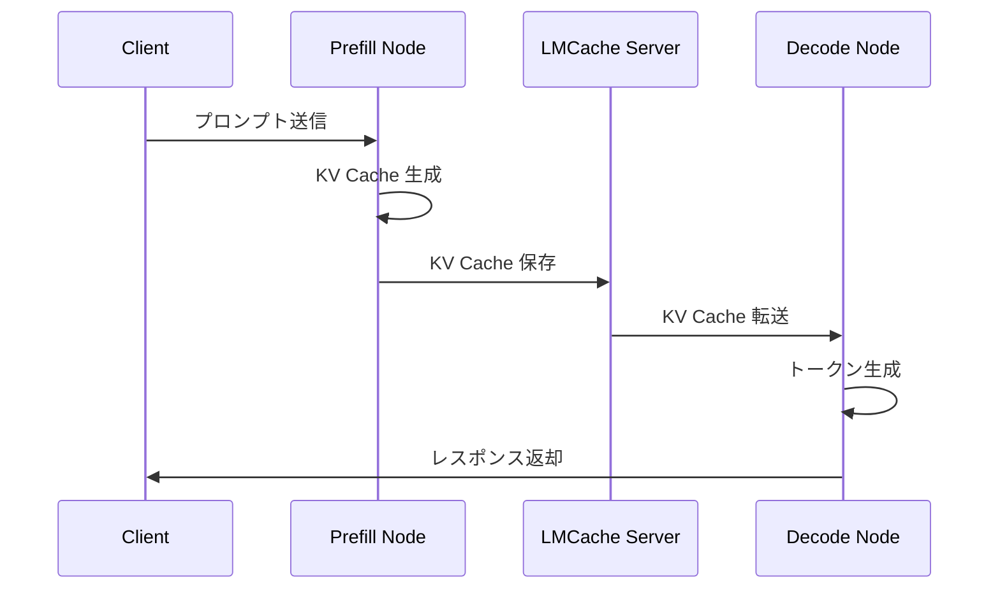
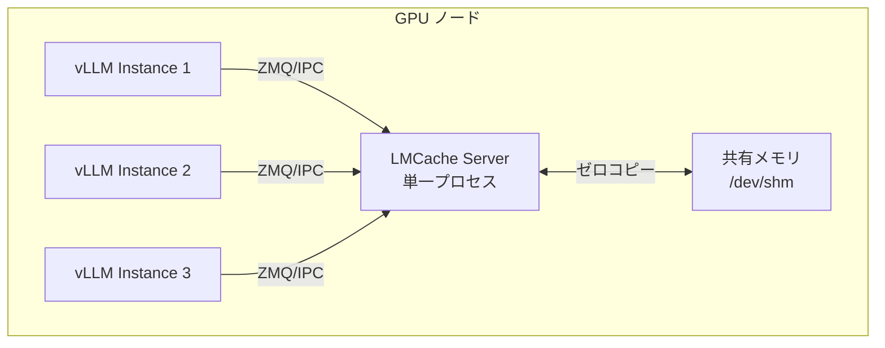
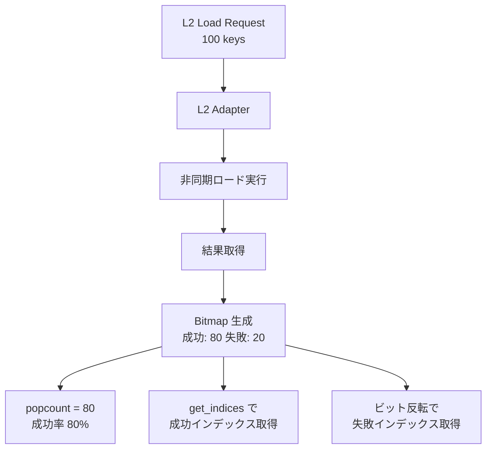
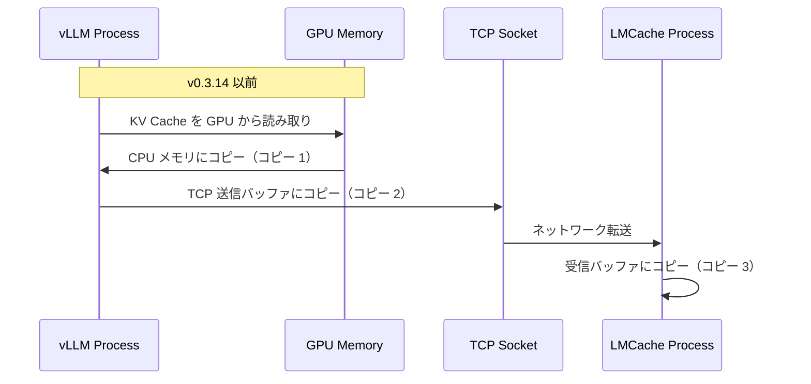
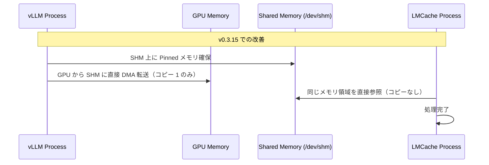
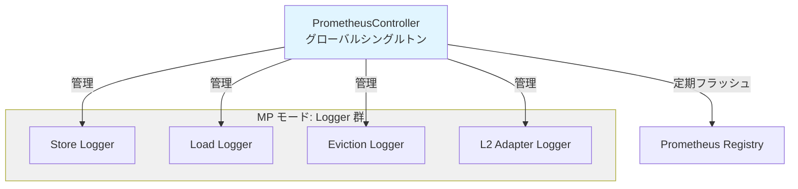
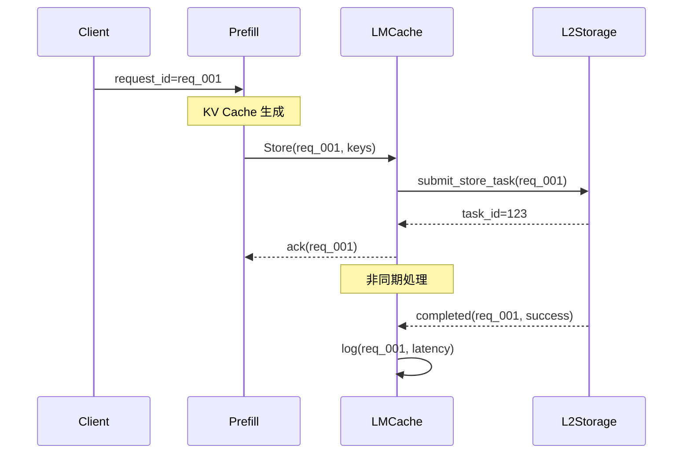
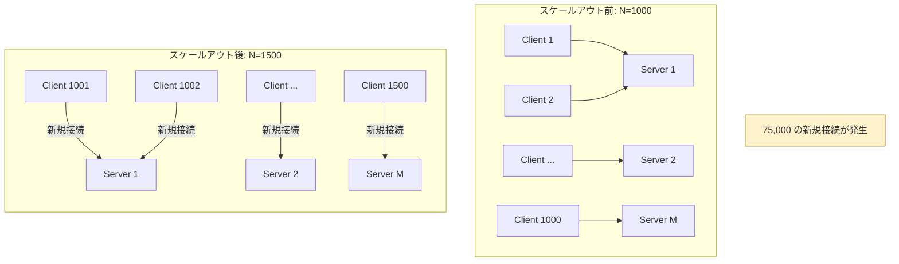
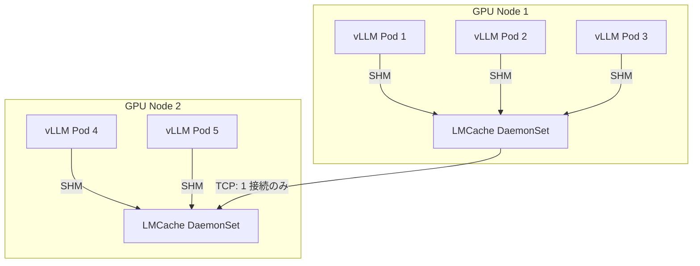

## はじめに

:::message
**記事の目的**: この記事では、LMCache v0.3.15 の主要なアップデートを深掘りし、Prefill/Decode Disaggregated Inference アーキテクチャを支える技術的改善点を理解します。
:::

LLM 推論の高速化において、KV キャッシュの効率的な管理は極めて重要です。本記事では、**LMCache v0.3.15** の主要なアップデートを、深掘りしながら初歩的な情報を整理します。

今回のアップデートで個人的に注目すべきは、**Disaggregated Inference アーキテクチャ**を支えるマルチプロセスモードの強化と、分散キャッシュシステムにおける **NxM 問題** への取り組みです。

:::message
本記事では、フロントエンド機能や細かなバグ修正は扱わず、**コアな実装とパフォーマンスに直結する変更点**に焦点を当てます。
:::

## LMCache とは何か

### 概要

まず、**KV キャッシュ**とは何かを説明します。Transformer ベースの LLM は、推論時に各トークンの **Key テンソルと Value テンソル**（数値データ）を保持し、次のトークン生成時に再利用します。これを「KV キャッシュ」と呼びます。

vLLM では、**PagedAttention** により KV キャッシュを**ブロック単位**（例: 16 トークン/ブロック）で管理します。このブロックは物理メモリ上の固定サイズの領域です。

vLLM 標準の Prefix Caching では、以下の制約がありました（参考: [vLLM 設計ドキュメント](https://github.com/vllm-project/vllm/blob/main/docs/design/prefix_caching.md), [実装コード](https://github.com/vllm-project/vllm/blob/main/vllm/v1/core/single_type_kv_cache_manager.py#L410-L449)）。第一に、プレフィックス（先頭から連続する部分）のみキャッシュ可能という点です。次に、各 vLLM インスタンス内でのみ有効という点です。最後に、インスタンス間での共有が不可能という点です。

```
[システムプロンプト][ユーザー入力 1] → キャッシュ: システムプロンプトのみ
[システムプロンプト][ユーザー入力 2] → 再利用: システムプロンプトのみ
```

ユーザー入力部分は毎回再計算され、他のインスタンスとは共有できませんでした。

### LMCache の特徴

LMCache は、**vLLM などのエンジンと連携**し、KV キャッシュを効率的に管理するためのライブラリです。これらの制約を超え、以下の特徴を持ちます。

第一に、**Chunk ベースの管理**です。トークン列を **256 トークン**（[`chunk_size` で設定可能](https://github.com/LMCache/LMCache/blob/v0.3.15/lmcache/v1/config.py#L64)）の chunk に分割し、各 chunk の KV キャッシュを管理します。

次に、**Prefix Hash による識別**です。各 chunk のトークン列から `chunk_hash` を計算し、同一の `chunk_hash` を持つ chunk は KV キャッシュを再利用できます。

```python
# chunk_hash の計算（簡略化）
prefix_hash = NONE_HASH
for chunk in chunks:  # 各 chunk は 256 トークン
    prefix_hash = hash_func((prefix_hash, tuple(chunk), extra_keys))
    # この prefix_hash が chunk_hash として使用される
```

最後に、**インスタンス間共有**です。計算された **Key/Value テンソル**を、CPU メモリ、ディスク、Amazon S3、または他の vLLM インスタンス（P2P）に保存し、任意のインスタンスから再利用できます。

**保存されるデータ**: **Key/Value テンソル**が保存されます。例えば、`[2, num_blocks, block_size, num_heads, head_size]` 形式のテンソルです。

### パフォーマンス特性

vLLM との組み合わせで、マルチラウンド QA および RAG ワークロードにおいて以下の成果を実現しています（参考: [LMCache README](https://github.com/LMCache/LMCache/blob/v0.3.15/README.md#L37), [技術レポート](https://lmcache.ai/tech_report.pdf), [ベンチマークスクリプト](https://github.com/LMCache/LMCache/tree/v0.3.15/benchmarks/multi_round_qa)）。

- **TTFT（Time To First Token）を 3～10 倍削減**（測定条件: マルチラウンド QA ワークロード、vLLM と組み合わせ）
- **GPU サイクルの削減**（キャッシュヒット率に応じて変動）

## v0.3.15 の主要アップデート

### 1. マルチプロセスモードの強化

#### 背景: Disaggregated Inference とは

Prefill/Decode Disaggregated Inference は、LLM 推論を以下のように分離するアーキテクチャです。

第一に、Prefill フェーズでは、入力プロンプト全体を処理し、KV キャッシュを生成します。次に、Decode フェーズでは、1 トークンずつ生成します。

この分離により、それぞれの特性に最適化されたリソースを割り当てられます。

| フェーズ | 特性 | 最適なリソース |
|---------|------|--------------|
| Prefill | バッチ処理向き、計算バウンド | 高スループット GPU |
| Decode | レイテンシ重視、メモリバウンド | メモリ帯域幅が高い GPU |

LMCache を踏まえた処理フローを以下に示します。



#### v0.3.15 での強化点: マルチプロセスサーバーの安定性向上

各 GPU ノードで単一の LMCache プロセスを起動し、複数の vLLM インスタンスから接続可能になりました。併せてマルチプロセス（MP）モード専用の Prometheus メトリクスが追加されました。


マルチプロセスアーキテクチャを以下に示します。



制御プレーンとデータプレーンを分離した通信アーキテクチャになっています（参考: [MPCacheEngine 実装](https://github.com/LMCache/LMCache/blob/v0.3.15/lmcache/v1/multiprocess/server.py#L132-L299), [CudaIPCWrapper](https://github.com/LMCache/LMCache/blob/v0.3.15/lmcache/v1/multiprocess/custom_types.py#L28-L180)）。第一に、制御プレーンでは、ZeroMQ の IPC モードを使用して vLLM インスタンスと LMCache Server 間で制御メッセージ（store/retrieve コマンド、CUDA IPC ハンドル、ブロック ID など）を Unix ドメインソケット経由で通信します。次に、データプレーンでは、実際の KV キャッシュデータを CUDA IPC で vLLM の GPU テンソルに直接アクセスし、CPU メモリへのコピーは共有メモリ（/dev/shm）経由でゼロコピー転送します。最後に、ノード間転送では NIXL などの高速ネットワーク経路を使用します。

Kubernetes DaemonSet デプロイの例を以下に示します。

```yaml
apiVersion: apps/v1
kind: DaemonSet
metadata:
  name: lmcache-server
spec:
  template:
    spec:
      hostNetwork: true  # vLLM からの接続を許可
      containers:
      - name: lmcache
        command:
          - python3
          - -m
          - lmcache.v1.multiprocess.server
          - --l1-size-gb  # L1 キャッシュサイズ（GB）
          - "100"
          - --eviction-policy  # キャッシュ削除ポリシー
          - LRU
        volumeMounts:
        - name: shm
          mountPath: /dev/shm  # CUDA IPC 共有メモリ
      volumes:
      - name: shm
        hostPath:
          path: /dev/shm
```

主要なコマンドラインオプション（[定義箇所](https://github.com/LMCache/LMCache/blob/v0.3.15/lmcache/v1/distributed/config.py#L121-L173)）
- `--l1-size-gb`: L1 キャッシュサイズ（GB 単位）
- `--eviction-policy`: キャッシュ削除ポリシー（現在は LRU のみサポート）

### 2. L2 ストレージのビットマップ実装

#### L2Adapter インターフェースの導入

v0.3.15 では、L2 ストレージ（CPU メモリ、ディスク、Amazon S3）への非同期 I/O を抽象化する **L2AdapterInterface** が実装されました。これにより、異なるストレージバックエンドを統一的に扱え、新しいバックエンド（例: Redis、Weka）の追加が容易になりました。また、非同期 I/O により、ストレージアクセス中も他の処理を継続できます。

```python
class L2AdapterInterface(ABC):
    """
    L2 I/O アダプタの抽象インターフェース

    主要機能:
    1. Store: メモリオブジェクトのバッチ保存
    2. Lookup and Lock: キーによる検索とロック
    3. Load: オブジェクトのバッチロード
    """

    @abstractmethod
    def submit_store_task(
        self,
        keys: list[ObjectKey],
        objects: list[MemoryObj],
    ) -> L2TaskId:
        """ストアタスクを非同期で投入"""
        pass

    @abstractmethod
    def query_lookup_and_lock_result(
        self,
        task_id: L2TaskId
    ) -> Bitmap | None:
        """
        検索結果をビットマップで返却

        Returns:
            Bitmap: 1 = 成功, 0 = 失敗
            None: タスク未完了
        """
        pass
```

参考: [lmcache/v1/distributed/l2_adapters/base.py#L17-L56](https://github.com/LMCache/LMCache/blob/v0.3.15/lmcache/v1/distributed/l2_adapters/base.py#L17-L56)

#### ビットマップによる結果管理

リスト形式の代わりに、**ビットマップ**を使用して成功/失敗を管理します。これにより、メモリ効率と演算速度が大幅に向上します。

C++ ビットマップ実装を以下に示します。

```cpp
class Bitmap {
 public:
  explicit Bitmap(size_t size);

  void set(size_t index);      // ビットを 1 に設定
  void clear(size_t index);    // ビットを 0 に設定
  bool test(size_t index) const;  // ビットをテスト

  size_t popcount() const;     // 1 の数を高速カウント
  size_t clo() const;          // 先頭の連続する 1 をカウント

  Bitmap operator&(const Bitmap& other) const;  // ビット AND
  Bitmap operator|(const Bitmap& other) const;  // ビット OR
  Bitmap operator~() const;                     // ビット NOT

  std::vector<size_t> get_indices() const;  // 1 のインデックスを取得
};
```

参考: [csrc/storage_manager/bitmap.h#L20-L133](https://github.com/LMCache/LMCache/blob/v0.3.15/csrc/storage_manager/bitmap.h#L20-L133)

**使用例: バッチロード結果の処理**

```python
# 100 個のキーをバッチロード
task_id = l2_adapter.submit_load_task(keys, memory_objects)

# 非同期で結果を取得
result_bitmap = l2_adapter.query_load_result(task_id)

if result_bitmap is not None:
    # 成功したインデックスを取得
    success_indices = result_bitmap.get_indices()

    # 失敗したインデックスを取得（ビット反転）
    failed_bitmap = ~result_bitmap
    failed_indices = failed_bitmap.get_indices()

    # 成功率を計算
    success_rate = result_bitmap.popcount() / len(keys)
```

**メリット**

第一に、メモリ効率が向上します（100 個のキーで 12.5 バイト vs. リスト形式の 800 バイト、**64 倍削減**）。次に、演算速度が向上します（ビット演算による高速な集合演算、CPU キャッシュ効率の改善）。最後に、メモリレイアウトが最適化されます（連続したメモリ配置によるプリフェッチ効果）。

ビットマップによる結果管理フローを以下に示します。



### 3. SHM による共有メモリ最適化

#### 背景: リモートコネクタのメモリコピー問題

v0.3.14 以前のリモートコネクタ実装では、プロセス間で KV キャッシュを転送する際に、**不要なメモリコピー**が発生していました。

v0.3.14 以前の実装でのメモリコピーフローを以下に示します。



#### v0.3.15 での改善: SHM 導入

**共有メモリ（Shared Memory, SHM）** を使用することで、メモリコピーを削減します。

SHM を使用した Pinned メモリの確保を以下に示します。

```cpp
// SHM を使用した Pinned メモリの確保
uintptr_t alloc_shm_pinned_ptr(
    size_t size,
    const std::string& shm_name
);

void free_shm_pinned_ptr(
    uintptr_t ptr,
    size_t size,
    const std::string& shm_name
);
```

参考: [csrc/mem_alloc.h#L7-L13](https://github.com/LMCache/LMCache/blob/v0.3.15/csrc/mem_alloc.h#L7-L13)

改善後のフローを以下に示します。



**メリット**

改善の成果を以下に示します。

| 項目 | v0.3.14 以前 | v0.3.15 | 改善率 |
|------|-------------|---------|--------|
| メモリコピー回数 | 3 回 | 1 回 | 66% 削減 |
| レイテンシ | 基準 | 削減 | 大量の KV キャッシュ転送時に顕著（測定値は環境により変動） |
| CPU 負荷 | 基準 | 削減 | memcpy オーバーヘッド排除 |

:::message
SHM を使用するには、Docker/Kubernetes で `/dev/shm` をマウントする必要があります。
:::

### 4. メトリクス API の改善

#### Reset Metrics API の追加

v0.3.15 では、Prometheus メトリクスをリセットする REST API が追加されました。

```python
@router.post("/metrics/reset")
async def reset_metrics():
    """
    Prometheus メトリクスを初期状態にリセット
    """
    reset_observability_metrics()
    return PlainTextResponse(content="ok", media_type="text/plain")
```

参考: [lmcache/v1/internal_api_server/common/metrics_api.py#L23-L29](https://github.com/LMCache/LMCache/blob/v0.3.15/lmcache/v1/internal_api_server/common/metrics_api.py#L23-L29)

**使用シーン**

第一に、ベンチマーク実行前のメトリクスクリアです。次に、本番環境での定期的なメトリクスリセットです。最後に、デバッグ時の状態リセットです。

**使用例を以下に示します。**

ベンチマーク実行時のワークフローは以下の通りです。まず、メトリクスをリセットし、次にベンチマークを実行し、最後に結果を取得します。

```bash
# ベンチマーク前にメトリクスをリセット
curl -X POST http://localhost:8080/metrics/reset

# ベンチマーク実行
python benchmark.py

# メトリクスを取得
curl http://localhost:8080/metrics
```

#### PrometheusController のシングルトン化

MP モードでの観測性を強化するため、PrometheusController が**グローバルシングルトン**にリファクタリングされました。

```python
# グローバルシングルトンインスタンス
_global_controller = PrometheusController(
    PrometheusConfig(enabled=False)
)

def get_prometheus_controller() -> PrometheusController:
    """グローバルシングルトンを取得"""
    return _global_controller

def init_prometheus_controller(
    config: PrometheusConfig
) -> PrometheusController:
    """シングルトンを初期化"""
    global _global_controller
    _global_controller = PrometheusController(config)
    return _global_controller
```

参考: [lmcache/v1/mp_observability/prometheus_controller.py#L81-L93](https://github.com/LMCache/LMCache/blob/v0.3.15/lmcache/v1/mp_observability/prometheus_controller.py#L81-L93)

**設計上の利点**

第一に、スレッドセーフです（複数のコントローラスレッドから安全にアクセス）。次に、一元管理です（全ての PrometheusLogger を単一のコントローラで管理）。最後に、ライフサイクル管理です（定期フラッシュの開始/停止を一元化）。

PrometheusController のアーキテクチャを以下に示します。



### 5. リクエスト ID の追加

Store/Retrieve 操作に**リクエスト ID**が追加され、分散トレーシングが容易になりました。

Store 操作のログ出力例を以下に示します。

```python
# 例: Store 操作のログ出力
logger.info(
    "Store operation completed",
    extra={
        "request_id": "req_abc123",
        "keys": 10,
        "size_bytes": 1048576,
        "latency_ms": 5.2
    }
)
```

分散トレーシングのフローを以下に示します。



## Disaggregated Inference と NxM 問題

### NxM 問題とは

分散キャッシュシステムにおいて、**N 個のクライアント**が **M 個のノード**に接続する場合、総接続数は **N × M** に増加します。これが **NxM 問題**です。

:::message
詳細は Momento の記事を参照してください: [Understanding the NxM Problem in Distributed Caches](https://www.gomomento.com/blog/understanding-the-nxm-problem-in-distributed-caches/)
:::

#### 主要な課題

**接続ストーム**

スケーリングイベント時、新規ポッドがクラスター内の全ノードに同時接続を試みます。

例として、1,000 インスタンスから 1,500 インスタンスにスケールアウトする場合、新規接続数は **500 × M = 75,000 接続**（M=150 の場合）となります。

スケールアウト時の接続増加を以下に示します。



**パフォーマンス低下**

第一に、TLS ハンドシェイク、認証、接続管理がシングルスレッドイベントループを圧迫します。次に、キャッシュリクエスト処理が遅延します。最後に、メトリクスは健全に見えますが、アプリケーション層が応答困難になります。

**検出の困難さ**

システムメトリクスでは異常が見えにくく、デバッグが複雑になります。

### LMCache の対策

LMCache では、以下のアーキテクチャ設計で NxM 問題を緩和しています。

**ノード単位の DaemonSet デプロイ**

各 GPU ノードで単一の LMCache プロセスを起動し、同一ノード上の複数 vLLM インスタンスが共有します。

接続数の削減効果を以下に示します。

```
個別接続: N vLLM インスタンス × M キャッシュノード = N×M 接続
↓
改善: 1 ノードあたり 1 LMCache × M キャッシュノード = M 接続
```

**共有メモリ（SHM）による IPC**

同一ノード内では TCP ではなく、共有メモリで通信します。

ノード単位のアーキテクチャを以下に示します。



**L2 Adapter の非同期 I/O**

L2 ストレージへのアクセスを非同期化し、接続プールを効率的に管理します。

## まとめ

:::message alert
**記事冒頭の目的に対するアンサー**: LMCache v0.3.15 は、Disaggregated Inference アーキテクチャを本番環境で運用するための重要な基盤を提供します。マルチプロセスモードの安定化、L2 ビットマップによる効率化、SHM によるメモリコピー削減、メトリクス API の改善、リクエスト ID による分散トレーシング対応により、大規模 LLM 推論システムのスケーラビリティと観測性が大幅に向上しました。
:::

### 主要な改善点

| 機能 | 改善内容 | メリット |
|------|---------|---------|
| **MP モード** | マルチプロセスサーバーの安定化 | vLLM インスタンスのスケーラビリティ向上 |
| **L2 ビットマップ** | バッチ操作の結果管理を効率化 | メモリ効率 64 倍、演算速度向上 |
| **SHM 最適化** | 共有メモリによるメモリコピー削減 | レイテンシ削減、CPU 負荷軽減 |
| **メトリクス API** | リセット機能とシングルトン化 | ベンチマーク精度向上、観測性強化 |
| **リクエスト ID** | 分散トレーシング対応 | デバッグ効率化 |

### 今後の展望

リリースノートによると、以下の機能が開発中です。

第一に、スレッドセーフなメモリアロケータとストレージマネージャです。次に、既存ストレージバックエンドのプラグイン対応です。さらに、パフォーマンス改善（ダブルバッファリング、新カーネル）です。最後に、分散モードのシャーディングです。

特に、**分散モードのシャーディング**は、NxM 問題をさらに緩和し、数千ノード規模のデプロイを可能にする重要な機能です。

**参考文献**

- [LMCache GitHub Repository](https://github.com/LMCache/LMCache)
- [LMCache v0.3.15 Release Notes](https://github.com/LMCache/LMCache/releases/tag/v0.3.15)
- [Understanding the NxM Problem in Distributed Caches - Momento](https://www.gomomento.com/blog/understanding-the-nxm-problem-in-distributed-caches/)
- [vLLM Documentation](https://docs.vllm.ai/)