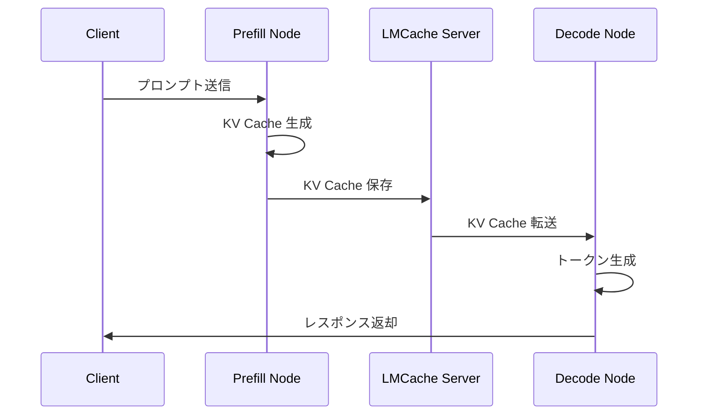
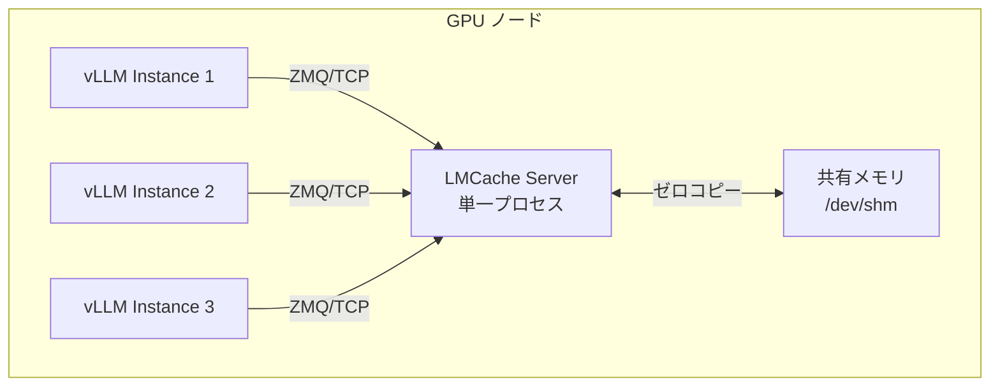
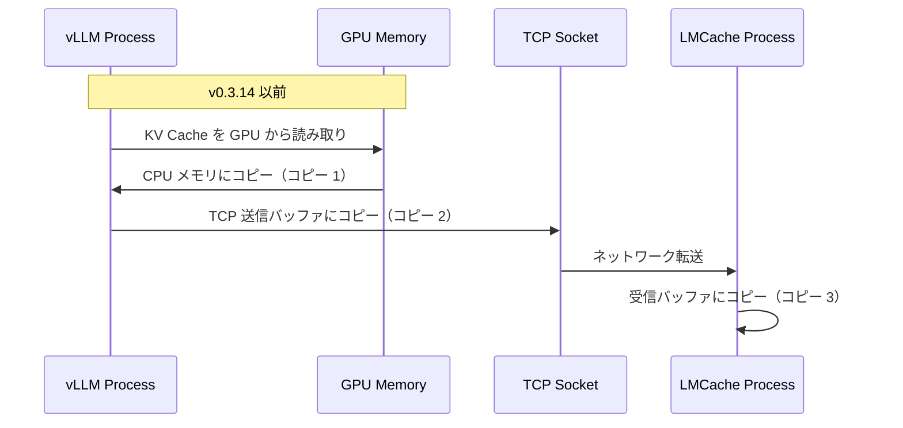
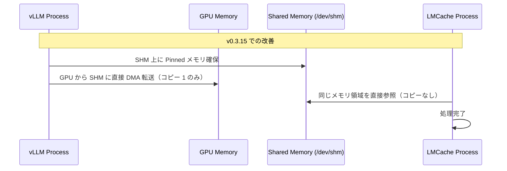

## はじめに

:::message
**記事の目的**: この記事では、LMCache v0.3.15 の主要なアップデートを深掘りし、Prefill/Decode Disaggregated Inference アーキテクチャを支える技術的改善点を理解します。
:::

LLM 推論の高速化において、KV キャッシュの効率的な管理は極めて重要です。本記事では、**LMCache v0.3.15** の主要なアップデートを、深掘りしながら初歩的な情報を整理します。

https://github.com/LMCache/LMCache/releases/tag/v0.3.15

今回のアップデートで個人的に注目すべきは、**Disaggregated Inference アーキテクチャ**を支えるマルチプロセスモードの強化です。

:::message
本記事では、フロントエンド機能や細かなバグ修正は扱わず、**コアな実装とパフォーマンスに直結する変更点**に焦点を当てます。
:::

## LMCache とは何か

> 公式ブログより

Without LMCache: Slow Response


With LMCache: 8-10x Faster Response


### 概要

まず、**KV キャッシュ**とは何かを説明します。Transformer ベースの LLM は、推論時に各トークンの **Key テンソルと Value テンソル**（数値データ）を保持し、次のトークン生成時に再利用します。これを「KV キャッシュ」と呼びます。

vLLM では、**PagedAttention** により KV キャッシュを**ブロック単位**（例: 16 トークン/ブロック）で管理します。このブロックは物理メモリ上の固定サイズの領域です。

vLLM 標準の Prefix Caching では、以下の制約がありました（参考: [vLLM 設計ドキュメント](https://github.com/vllm-project/vllm/blob/main/docs/design/prefix_caching.md), [実装コード](https://github.com/vllm-project/vllm/blob/main/vllm/v1/core/single_type_kv_cache_manager.py#L410-L449)）。第一に、プレフィックス（先頭から連続する部分）のみキャッシュ可能という点です。次に、各 vLLM インスタンス内でのみ有効という点です。最後に、インスタンス間での共有が不可能という点です。

```
[システムプロンプト][ユーザー入力 1] → キャッシュ: システムプロンプトのみ
[システムプロンプト][ユーザー入力 2] → 再利用: システムプロンプトのみ
```

ユーザー入力部分は毎回再計算され、他のインスタンスとは共有できませんでした。

### LMCache の特徴

LMCache は、**vLLM などのエンジンと連携**し、KV キャッシュを効率的に管理するためのライブラリです。これらの制約を超え、以下の特徴を持ちます。

第一に、**Chunk ベースの管理**です。トークン列を **256 トークン**（[`chunk_size` で設定可能](https://github.com/LMCache/LMCache/blob/v0.3.15/lmcache/v1/config.py#L64)）の chunk に分割し、各 chunk の KV キャッシュを管理します。

次に、**Prefix Hash による識別**です。各 chunk のトークン列から `chunk_hash` を計算し、同一の `chunk_hash` を持つ chunk は KV キャッシュを再利用できます。

```python
# chunk_hash の計算（簡略化）
prefix_hash = NONE_HASH
for chunk in chunks:  # 各 chunk は 256 トークン
    prefix_hash = hash_func((prefix_hash, tuple(chunk)))
    # この prefix_hash が chunk_hash として使用される
    # 実装では extra_keys は None
```

最後に、**インスタンス間共有**です。計算された **Key/Value テンソル**を、CPU メモリ、ディスク、Amazon S3、または他の vLLM インスタンス（P2P）に保存し、任意のインスタンスから再利用できます。

**保存されるデータ**: **Key/Value テンソル**が保存されます。例えば、`[2, num_blocks, block_size, num_heads, head_size]` 形式のテンソルです。

### パフォーマンス特性

vLLM との組み合わせで、マルチラウンド QA および RAG ワークロードにおいて以下の成果を実現しています（参考: [LMCache README](https://github.com/LMCache/LMCache/blob/v0.3.15/README.md#L37), [技術レポート](https://lmcache.ai/tech_report.pdf), [ベンチマークスクリプト](https://github.com/LMCache/LMCache/tree/v0.3.15/benchmarks/multi_round_qa)）。

- **TTFT（Time To First Token）を 3～10 倍削減**（測定条件: マルチラウンド QA ワークロード、vLLM と組み合わせ）
- **GPU サイクルの削減**（キャッシュヒット率に応じて変動）

## v0.3.15 の主要アップデート

### 1. マルチプロセスモードの強化

#### 背景: Disaggregated Inference とは

Prefill/Decode Disaggregated Inference は、LLM 推論を以下のように分離するアーキテクチャです。

第一に、Prefill フェーズでは、入力プロンプト全体を処理し、KV キャッシュを生成します。次に、Decode フェーズでは、1 トークンずつ生成します。

この分離により、それぞれの特性に最適化されたリソースを割り当てられます。

| フェーズ | 特性 | 最適なリソース |
|---------|------|--------------|
| Prefill | バッチ処理向き、計算バウンド | 高スループット GPU |
| Decode | レイテンシ重視、メモリバウンド | メモリ帯域幅が高い GPU |

LMCache を踏まえた処理フローを以下に示します。



#### v0.3.15 での強化点: マルチプロセスサーバーの安定性向上

各 GPU ノードで単一の LMCache プロセスを起動し、複数の vLLM インスタンスから接続可能になりました。併せてマルチプロセス（MP）モード専用の Prometheus メトリクスが追加されました。


マルチプロセスアーキテクチャを以下に示します。



MP キャッシュエンジンは制御プレーンとデータプレーンを分離した通信アーキテクチャになっています（参考: [MPCacheEngine 実装](https://github.com/LMCache/LMCache/blob/v0.3.15/lmcache/v1/multiprocess/server.py#L132-L299), [CudaIPCWrapper](https://github.com/LMCache/LMCache/blob/v0.3.15/lmcache/v1/multiprocess/custom_types.py#L28-L161)）。第一に、制御プレーンでは、ZeroMQ の TCP モードを使用して vLLM インスタンスと LMCache Server 間で制御メッセージを通信します（参考: [bind_url 設定](https://github.com/LMCache/LMCache/blob/v0.3.15/lmcache/v1/multiprocess/server.py#L558)）。次に、データプレーンでは、KV キャッシュデータを CUDA IPC で vLLM の GPU テンソルに直接アクセスし、GPU から CPU への DMA 転送を実行します。CPU メモリ上のデータは共有メモリ（/dev/shm）を使うことで、同一ノード内のプロセス間ではゼロコピーで共有可能です。最後に、ノード間転送では NIXL などの高速ネットワーク経路を使用します。

### 2. L2 ストレージのビットマップ実装

#### L2Adapter インターフェースの導入

v0.3.15 では、L2 ストレージ（CPU メモリ、ディスク、Amazon S3）への非同期 I/O を抽象化する **L2AdapterInterface** が実装されました。これにより、異なるストレージバックエンドを統一的に扱え、新しいバックエンド（例: Redis、Weka）の追加が容易になりました。また、非同期 I/O により、ストレージアクセス中も他の処理を継続できます。

参考: [lmcache/v1/distributed/l2_adapters/base.py#L17-L56](https://github.com/LMCache/LMCache/blob/v0.3.15/lmcache/v1/distributed/l2_adapters/base.py#L17-L56)

#### ビットマップによる結果管理

リスト形式の代わりに、**ビットマップ**を使用して成功/失敗を管理します。これにより、メモリ効率と演算速度が大幅に向上します。

ちなみにどうでも良い話をしますが `popcount` は例えば 64 bit ある場合にそれらの中で 1 が立っているビットを数えるというものです。大体デジタル回路設計者はこの `popcount` を如何に STA を短く実装するかという修行を経験したことがあると思います。ファンアウト数が増えると RC Delay が増えますし少ないとゲート段数が増えます。単に NAND を組み合わせるだけではなく複合ゲートの場合もっと難しいです。ソフトウェアからは `popcount` を呼び出す簡単なお仕事でも裏側の実装はかなり頑張っていたりします。そこから自分でスティック図を書いてマスク設計までできるとなかなか偉いです。

C++ ビットマップ実装を以下に示します。

```cpp
class Bitmap {
 public:
  explicit Bitmap(size_t size);

  void set(size_t index);      // ビットを 1 に設定
  void clear(size_t index);    // ビットを 0 に設定
  bool test(size_t index) const;  // ビットをテスト

  size_t popcount() const;     // 1 の数を高速カウント
  size_t clo() const;          // 先頭の連続する 1 をカウント

  Bitmap operator&(const Bitmap& other) const;  // ビット AND
  Bitmap operator|(const Bitmap& other) const;  // ビット OR
  Bitmap operator~() const;                     // ビット NOT

  std::vector<size_t> get_indices() const;  // 1 のインデックスを取得
};
```

参考: [csrc/storage_manager/bitmap.h#L20-L133](https://github.com/LMCache/LMCache/blob/v0.3.15/csrc/storage_manager/bitmap.h#L20-L133)

**メリット**

第一に、メモリ効率が向上します（100 個のキーで約 13 バイト vs. リスト形式の 800 バイト、**約 61 倍削減**、参考: [Bitmap 実装](https://github.com/LMCache/LMCache/blob/v0.3.15/csrc/storage_manager/bitmap.cpp#L54-L75)）。次に、演算速度が向上します。ビットマップでは先ほど解説した `popcount` などの操作が CPU の専用命令（例: x86_64 の `POPCNT`）として実装されており、ハードウェアレベルで高度に最適化されています。最後に、メモリレイアウトが最適化されます（連続したメモリ配置によるプリフェッチ効果）。つまりバイト列で確保するわけなので当然メモリ上で連続に並びます。

### 3. SHM による共有メモリ最適化

#### 背景: リモートコネクタのメモリコピー問題

v0.3.14 以前のリモートコネクタ実装では、プロセス間で KV キャッシュを転送する際に、**不要なメモリコピー**が発生していました。

v0.3.14 以前の実装でのメモリコピーフローを以下に示します。



#### v0.3.15 での改善: SHM 導入

**共有メモリ（Shared Memory, SHM）** を使用することで、メモリコピーを削減します。

SHM を使用した改善後のフローを以下に示します。



**メリット**

改善の成果を以下に示します。

| 項目 | v0.3.14 以前 | v0.3.15 | 改善率 |
|------|-------------|---------|--------|
| メモリコピー回数 | 3 回 | 1 回 | 66% 削減 |
| レイテンシ | 基準 | 削減 | 大量の KV キャッシュ転送時に顕著 |
| CPU 負荷 | 基準 | 削減 | memcpy オーバーヘッド排除 |

## まとめ

LMCache v0.3.15 は、Disaggregated Inference アーキテクチャを本番環境で運用するための重要な基盤を提供します。マルチプロセスモードの安定化、L2 ビットマップによる効率化、SHM によるメモリコピー削減、メトリクス API の改善、リクエスト ID による分散トレーシング対応により、大規模 LLM 推論システムのスケーラビリティと観測性が大幅に向上しました。

### 今後の展望

リリースノートによると、以下の機能が開発中です。

第一に、スレッドセーフなメモリアロケータとストレージマネージャです。次に、既存ストレージバックエンドのプラグイン対応です。さらに、パフォーマンス改善（ダブルバッファリング、新カーネル）です。最後に、分散モードのシャーディングです。**分散モードのシャーディング**は気になります！

**参考文献**

- [LMCache GitHub Repository](https://github.com/LMCache/LMCache)
- [LMCache v0.3.15 Release Notes](https://github.com/LMCache/LMCache/releases/tag/v0.3.15)
- [Understanding the NxM Problem in Distributed Caches - Momento](https://www.gomomento.com/blog/understanding-the-nxm-problem-in-distributed-caches/)
- [vLLM Documentation](https://docs.vllm.ai/)