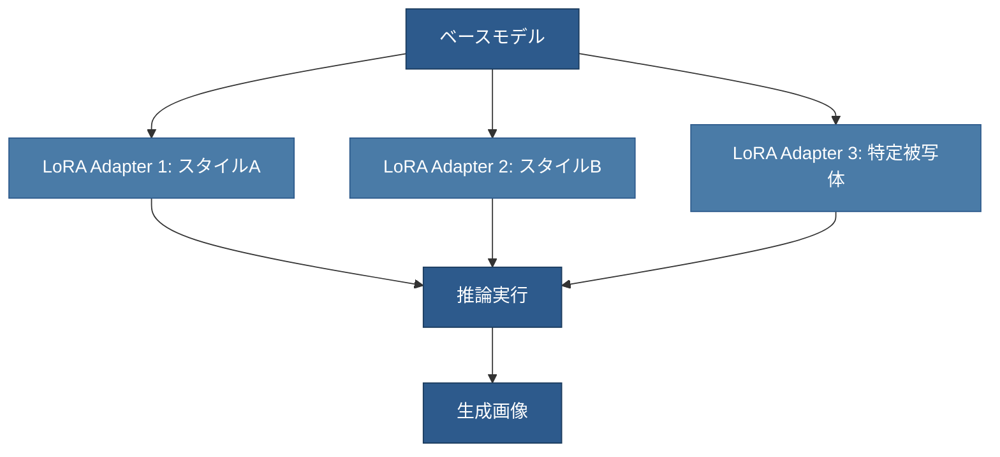
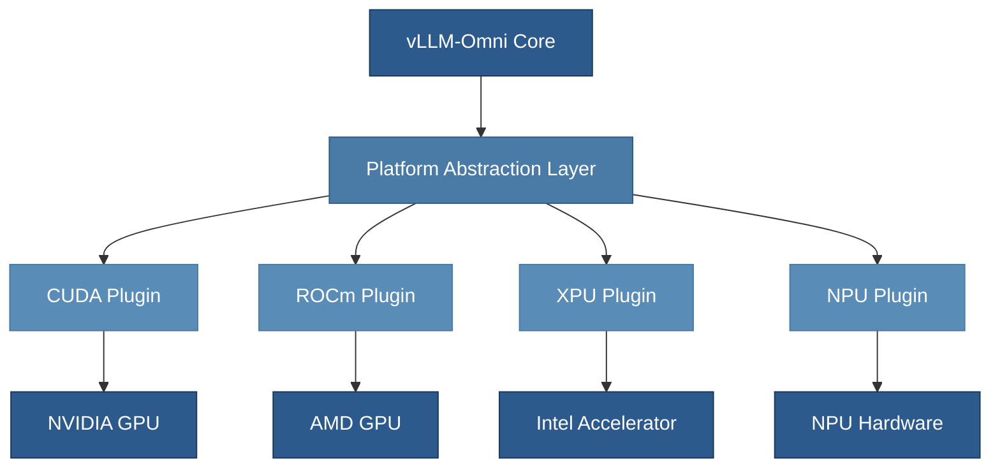

# vLLM-Omni v0.14.0 リリースノート解説

## メモ（ここは筆者のメモ欄です）

- [ ] vLLM と vLLM-Omni のアーキテクチャや実装上の連携について。内部的に vLLM が使われているのか全く別実装なのか調べる。
- [ ] Async Chunk Processing の具体的なパフォーマンス向上効果についての Paper はあるか
- [ ] Multi-Stage Pipeline でのリソースアロケーションはどうなっているのか、Stage でボトルネック特性が違うはず
- [ ] Diffusion LoRA の動的スワッピングは denoising がある分オーバーヘッド大きくない？1回推論するだけだとCPUにオフロードしたりロードしたりしてもアダプターのロードオフロードは一回だから良いけど。denoisingがあると1処理単位でロード/オフロードしていると推論が終わるまでに何十回もdenoisingする中でロードオフロードが発生するからデータ転送のオーバーヘッドが大きいのでは？
- [ ] Hardware Platform Plugin System は AWS Neuron いけるかな。ハードウェア固有のチューニング必要？な気はするが
- [ ] TeaCache、ちゃんと読んでないけど、重要ステップとそうでないステップを把握して、重要ステップだけ計算、残りは数式予測する、という感じ？後期ステップは変化が少ないからタイムステップ埋め込みベクトルとやらのベクトル変化量を見るということっぽい。

## はじめに

[vLLM-Omni](https://github.com/vllm-project/vllm-omni) は、テキスト生成に特化した vLLM フレームワークをマルチモーダル推論に拡張したプロジェクトです。2025 年 1 月 31 日にリリースされた v0.14.0 では、70 名以上の貢献者による約 180 件のコミットが含まれており、画像・動画生成、音声処理、分散実行の大幅な機能強化が行われました。

本記事では、vLLM の LLM 推論に慣れた技術者向けに、v0.14.0 で追加されたマルチモーダル機能を中心に解説します。

## vLLM-Omni のアーキテクチャ概要

vLLM に精通している方は、Autoregressive（自己回帰）な LLM の推論最適化技術である PagedAttention や KV キャッシュ管理に馴染みがあるでしょう。vLLM-Omni はこれらの技術を継承しつつ、以下の 3 つの方向に拡張されています。

まず、入出力のマルチモーダル対応です。テキストだけでなく、画像、動画、音声データの処理を統合的にサポートします。次に、非自己回帰モデルへの対応です。従来の vLLM が得意とするトークン単位の逐次生成ではなく、Diffusion Transformer（DiT）のような並列生成アーキテクチャにも対応しました。最後に、ヘテロジニアスなパイプライン実行です。複数の処理ステージを並行実行することで、複雑なマルチモーダル推論のスループットを向上させています。

この Multi-Stage Pipeline アーキテクチャでは、OmniConnector が各ステージ間のデータ転送と動的なリソース割り当てを管理します。Autoregressive な推論ステージと Diffusion による生成ステージを連結し、エンドツーエンドでの最適化を実現しています。

## v0.14.0 リリース概要

今回のリリースは、以下の 6 つの主要テーマに分類できます。

第一に、非同期チャンク処理によるレイテンシ削減です。パイプラインステージ間のオーバーラップ実行により、アイドル時間を削減しています。第二に、Multi-Stage Pipeline の実戦投入です。Bagel モデルのような Thinker ステージと Diffusion ステージを組み合わせたアーキテクチャに対応しました。第三に、音声・TTS 機能の大幅拡充です。Qwen3-TTS モデルファミリーや Stable Audio Open のサポートが追加されました。

第四に、Diffusion モデルへの LoRA アダプタ適用機能です。PEFT ライブラリと互換性のあるインターフェースで、Diffusion ワークフローのファインチューニングが可能になりました。第五に、メモリ効率の改善です。DiT モデルのレイヤーワイズ CPU オフロードにより、大規模な Diffusion 実行時のメモリ使用量を削減しています。第六に、ハードウェアプラットフォームのプラグイン化です。XPU、ROCm、NPU などの複数バックエンドをクリーンにサポートする拡張可能なアーキテクチャを導入しました。

## 主要アップデート詳細

### Async Chunk Processing：パイプライン最適化

vLLM の Continuous Batching に慣れている方は、リクエスト単位での動的スケジューリングの重要性を理解しているでしょう。Async Chunk Processing は、この概念をマルチステージパイプラインに拡張したものです。

従来のステージド実行では、Stage 1 が完全に終了してから Stage 2 が開始されるため、各ステージでアイドル時間が発生していました。v0.14.0 では、チャンク単位でのパイプラインオーバーラップを実装し、Stage 1 が一部のチャンクを処理している間に、Stage 2 が前のチャンクの処理を並行実行できるようになりました。

この最適化により、エンドツーエンドのレイテンシが削減され、スループットが向上しています。特に、各ステージの処理時間が不均一なワークロードで効果が顕著です。

### Multi-Stage Pipeline Support：複雑なマルチモーダルモデル対応

v0.14.0 では、異なる生成パラダイムを組み合わせたマルチステージアーキテクチャを持つモデルに正式対応しました。これにより、Autoregressive（自己回帰）な推論ステージと Diffusion による生成ステージを連結し、エンドツーエンドでの最適化を実現しています。

第一ステージでは、入力を理解し、生成のための中間表現を作成します。この部分は従来の vLLM が得意とする Autoregressive な推論です。続く Diffusion ステージでは、中間表現を基に画像や動画を段階的に生成します。Diffusion モデルは、ノイズから始めて複数回の Denoising ステップを経て高品質な出力を生成する仕組みです。

vLLM-Omni のアーキテクチャでは、各ステージが独立して最適化され、ステージ間のデータ転送は OmniConnector が効率的に管理します。これにより、Autoregressive と Diffusion という異なる計算特性を持つモデルを統合的に実行できます。

なお、一般に公開されている [Bagel プロジェクト](https://github.com/jondurbin/bagel) は LLM ファインチューニング用のデータセットであり、ここで説明しているマルチステージアーキテクチャとは別のものです。

### Audio & TTS 機能拡張

音声処理機能が大幅に強化され、[Qwen3-TTS](https://huggingface.co/Qwen) モデルファミリーと Stable Audio Open のサポートが追加されました。Qwen3-TTS は Alibaba Cloud の Qwen チームが開発したテキスト音声変換モデルで、中国語、英語、日本語、韓国語を含む 10 言語に対応しています。主な特徴として、音声クローニング（カスタムボイス合成）、音声デザイン（ユーザーが制御可能なボイスパラメータ調整）、ファインチューニング対応を備えており、ストリーミングでの安定的な音声生成を実現しています。利用可能なモデルサイズは 1.7B パラメータのフルモデルと 0.6B パラメータの軽量版があり、用途に応じて選択できます。

TTS モデルの推論は、LLM とは異なる課題があります。音声生成では、時系列データの連続性や音響特徴の制御が重要です。v0.14.0 では、これらの要件に対応するため、`onnxruntime` と `sox` の依存関係が追加され、音声処理パイプラインのシームレスな統合が実現されています。

Stable Audio Open のサポートにより、音楽やサウンドエフェクトの生成も可能になりました。これらのモデルは Diffusion ベースで動作するため、前述の Multi-Stage Pipeline アーキテクチャを活用しています。

### Diffusion LoRA Adapter サポート

LoRA（Low-Rank Adaptation）は、LLM のファインチューニング手法として広く使われていますが、v0.14.0 では Diffusion モデルにも LoRA を適用できるようになりました。PEFT（Parameter-Efficient Fine-Tuning）ライブラリと互換性のあるインターフェースを提供し、Diffusion ワークフローの柔軟なアダプテーションを実現しています。

LLM の LoRA では、重み行列を低ランク行列の積で近似することで、少数のパラメータで効率的にファインチューニングを行います。Diffusion モデルの LoRA も同様の原理ですが、画像生成の文脈では、特定のスタイルや被写体への適応が主な用途です。

複数の LoRA アダプタを切り替えることで、単一のベースモデルから多様な出力を生成できます。vLLM の LoRA サポートと同様に、アダプタの動的ロードとスワップが効率的に実装されています。

### メモリ最適化

大規模な Diffusion モデルの実行では、メモリ使用量が課題となります。v0.14.0 では、DiT モデルのレイヤーワイズ（ブロックワイズ）CPU オフロードを実装し、GPU メモリの使用量を削減しました。

vLLM の KV キャッシュ管理では、PagedAttention によってメモリを効率的に利用していますが、Diffusion モデルは異なるメモリパターンを持ちます。Diffusion の Denoising ステップでは、モデルの全レイヤーを繰り返し実行する必要がありますが、すべてのレイヤーを常に GPU メモリに保持する必要はありません。

レイヤーワイズ CPU オフロードでは、現在実行中のレイヤーのみを GPU にロードし、使用後は CPU メモリに退避させます。これにより、GPU メモリのピーク使用量を削減しつつ、実行可能なモデルサイズを拡大できます。ただし、CPU-GPU 間のデータ転送オーバーヘッドとのトレードオフが存在するため、適切な粒度の選択が重要です。

さらに、[Wan2.2](https://huggingface.co/models?search=Wan2.2) モデルのサポートが追加されました。Wan2.2 は Diffusion Transformer ベースのビデオ生成モデルで、Text-to-Video（T2V）、Image-to-Video（I2V）、Video-to-Video（V2V）、Text-Image-to-Video（TI2V）といった複数の生成モードをサポートしています。複数の生成モードに対応することで、柔軟なビデオ生成ワークフローを実現しています。

### Hardware Platform Plugin System

v0.14.0 では、ハードウェアプラットフォームのサポートをプラグインアーキテクチャに再設計しました。これにより、XPU（Intel のアクセラレータ）、ROCm（AMD GPU）、NPU（Neural Processing Unit）などの複数のバックエンドを、よりクリーンに開発・保守できるようになりました。

従来のモノリシックなバックエンド実装では、新しいハードウェアをサポートする際に、コードベース全体への変更が必要でした。プラグインシステムでは、各ハードウェアプラットフォーム固有のロジックを独立したモジュールとして実装し、共通のインターフェースを通じて統合します。

このアーキテクチャにより、新しいハードウェアのサポート追加が容易になり、マルチバックエンド開発の保守性が向上しています。

### Diffusion & Image/Video 生成機能の強化

Diffusion モデルのサポートが包括的に強化されました。主要な改善点は以下の通りです。

#### Sequence Parallelism の抽象化

Sequence Parallelism（SP）は、長いシーケンスを複数の GPU に分散して処理する技術です。LLM では主にシーケンス長の制約を緩和するために使われますが、Diffusion モデルでは、高解像度画像や長尺動画の生成に必要です。v0.14.0 では、LongCat-Image や Wan2.2 に SP の抽象化が追加され、大規模な画像・動画生成がサポートされました。

#### CFG（Classifier-Free Guidance）の改善

CFG は、Diffusion モデルの生成品質を制御する技術です。条件付き生成と無条件生成を組み合わせることで、プロンプトへの忠実度を調整できます。v0.14.0 では、Qwen-Image への CFG パラレルサポート、CFG 抽象化の実装、オンラインサービングでの CFG パラメータサポートが追加されました。

CFG の計算は、同じ Diffusion ステップを条件付きと無条件で 2 回実行する必要があるため、推論コストが増加します。パラレルサポートにより、この 2 回の実行を効率的に並列処理し、オーバーヘッドを削減しています。

#### 推論の高速化

Torch Compile のサポート、GPU Diffusion Runner、Diffusion Executor の実装により、推論速度が向上しました。Torch Compile は、PyTorch モデルを最適化されたコードにコンパイルする機能で、特に繰り返し実行されるコードパスで効果的です。Diffusion の Denoising ステップは同じモデルを複数回実行するため、Torch Compile の恩恵を大きく受けます。

#### キャッシング機能

[TeaCache](https://arxiv.org/abs/2411.19108)（Timestep Embedding tells: It's Time to Cache）が Z-Image などの Diffusion モデルに対応しました。TeaCache は CVPR 2025 で採択されたトレーニング不要のキャッシング手法で、タイムステップ埋め込みを利用してモデル出力の変化パターンを推定します。従来のキャッシング手法では、Denoising ステップ間の出力差異を一様に扱っていましたが、実際にはタイムステップによって変化の大きさが異なります。TeaCache はこの特性を活用し、タイムステップ埋め込みの差異に基づいて「情報的なステップ」を選択的に計算し、その他のステップではキャッシュされた結果を多項式フィッティングで推定します。[プロジェクトページ](https://liewfeng.github.io/TeaCache) によれば、Open-Sora-Plan で最大 4.41 倍の加速を達成しながら、視覚品質の低下はわずか（VBench スコア -0.07%）という優れた結果を示しています。CPU オフロードと Tensor Parallel の有効化により、キャッシュの効率がさらに向上しています。

#### モデルカバレッジの拡大

GLM-Image、FLUX.1-dev、FLUX.2-klein のサポートが追加され、Tensor Parallel の拡張も行われました。これらは最新の Diffusion Transformer モデルであり、高品質な画像生成を実現します。Tensor Parallel サポートにより、大規模モデルを複数 GPU に分散して実行できます。

#### パイプライン修正

CFG パース、SD3 互換性、動画保存、シード処理など、複数の正確性に関する修正が行われました。特にシード処理の修正は重要で、同じシードで同じ出力を再現できる決定論的な生成が保証されます。

### Serving & API アップデート

オンラインサービング機能が拡充され、OpenAI 互換の API が強化されました。

まず、Diffusion モードでのヘルスチェックとモデル情報エンドポイント（`/health`、`/v1/models`）が追加されました。これにより、サービスの監視と管理が容易になります。

次に、画像編集インターフェース（`/v1/images/edit`）が導入されました。このエンドポイントでは、既存の画像をベースに、テキストプロンプトで指定した編集を行えます。Diffusion モデルの Image-to-Image 機能を活用したものです。

Tensor Parallel サイズを引数で指定できるようになり、オンラインサービングでの動的なリソース配分が可能になりました。また、前述の CFG パラメータもオンラインサービングでサポートされ、リクエストごとに生成品質を制御できます。

バッチリクエストのサポートが改善され、`OmniDiffusionReq` が洗練されました。複数のリクエストをまとめて処理することで、スループットが向上します。vLLM の Continuous Batching と同様に、Diffusion モデルでも動的バッチングが重要です。

### パフォーマンス最適化

モデル固有の最適化とカーネルレベルの改善が行われました。

Qwen3-Omni では、Fused MoE の統合と、Fused QKV/Projection の最適化が実装されました。MoE（Mixture of Experts）モデルでは、複数のエキスパートネットワークを効率的に実行する必要があり、Fused MoE はこれを最適化します。Fused QKV は、Query、Key、Value の計算を単一のカーネルで実行し、メモリアクセスを削減する技術です。

Flash Attention に Attention Mask のサポートが追加されました。Flash Attention は、Attention 計算のメモリ効率とスピードを大幅に向上させる技術ですが、従来はマスクのサポートが限定的でした。v0.14.0 では、より複雑な Attention パターンに対応できるようになりました。

さらに、サポートされている環境では Flash Attention 3（FA3）がデフォルトバックエンドとして使用されるようになりました。FA3 は FA2 よりもさらに高速で、特に長いシーケンスで効果的です。

ROCm 環境では、AITER Flash Attention の実装が追加されました。これは AMD GPU 向けの最適化で、ROCm プラットフォームでのパフォーマンスが向上しています。

### 安定性と信頼性の向上

プロダクション環境での使用を考慮した安定性改善が行われました。

ステージ設定のロード修正により、複雑な Multi-Stage Pipeline の設定が正しく読み込まれるようになりました。また、オンラインバッチングでのステージ出力ミスマッチが解決され、並行実行時のデータ整合性が保証されています。

大規模モデルのロードには時間がかかるため、サーバーの準備完了待機時間が拡張されました。これにより、モデルのロードが完了する前にリクエストが失敗することを防ぎます。

Diffusion Profiler のサポートとベンチマーク機能の追加により、パフォーマンス分析が容易になりました。vLLM の既存のプロファイリング機能に加え、Diffusion 固有のメトリクスを計測できます。

ドキュメントも包括的に更新され、新機能の使い方や設定例が追加されました。

### テストと CI の改善

開発プロセスの効率化と品質向上のため、テストインフラが強化されました。

CI がタイムアウトしないよう再構成され、大規模なテストスイートが安定して実行できるようになりました。エンドツーエンドテストと精度テストが拡充され、回帰を早期に検出できます。

ROCm CI の拡張と最適化により、AMD GPU 環境でのテストカバレッジが向上しました。これは、ROCm プラットフォームでの安定性向上に直結します。

テスト全般の信頼性が向上し、Flaky テスト（不安定なテスト）が削減されました。これにより、CI の結果をより信頼できるようになりました。

### 依存関係と互換性

新機能をサポートするため、いくつかの依存関係が追加されました。

Qwen3-TTS のサポートには、`onnxruntime` と `sox` が必要です。`onnxruntime` は ONNX 形式のモデルを実行するランタイムで、`sox` は音声ファイルの処理ライブラリです。これらにより、音声処理パイプラインがシームレスに統合されています。

その他の依存関係も適切に管理され、各機能が正しく動作することが保証されています。

## まとめ

今後、マルチモーダル AI の需要は更に高まると予想されます。vLLM-Omni は、高品質な推論を効率的に提供するインフラとして、重要な役割を果たすでしょう。

## 参考リンク

- [vLLM-Omni GitHub リポジトリ](https://github.com/vllm-project/vllm-omni)
- [vLLM-Omni v0.14.0 リリースノート](https://github.com/vllm-project/vllm-omni/releases/tag/v0.14.0)
- [Diffusion Transformers 論文](https://arxiv.org/abs/2212.09748)
- [TeaCache 論文（CVPR 2025）](https://arxiv.org/abs/2411.19108)
- [TeaCache プロジェクトページ](https://liewfeng.github.io/TeaCache)
- [Qwen3-TTS Hugging Face ページ](https://huggingface.co/Qwen)
- [Wan2.2 モデル Hugging Face ページ](https://huggingface.co/models?search=Wan2.2)

---

**注意**: Bagel モデルの Multi-stage アーキテクチャについては、vLLM-Omni のコンテキストで言及されているものの、公開されている詳細情報が限定的です。実装の詳細については、vLLM-Omni の公式ドキュメントやソースコードを参照してください。
