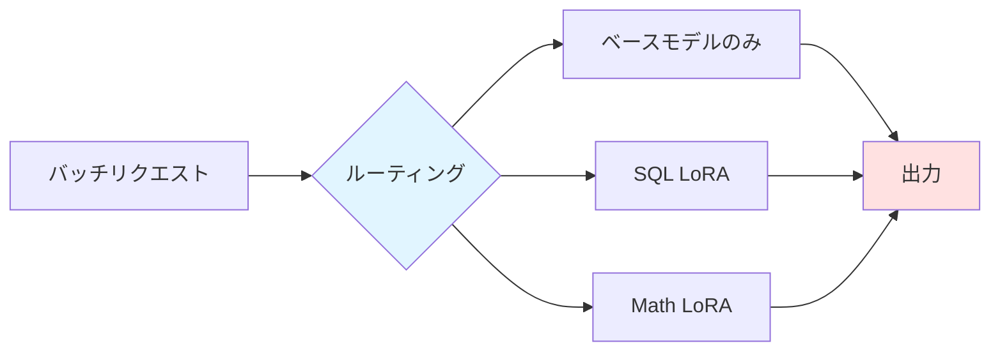
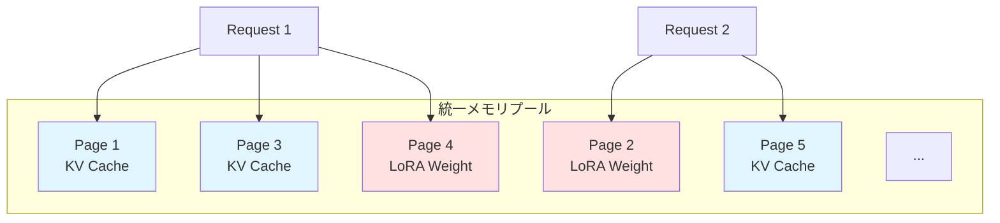
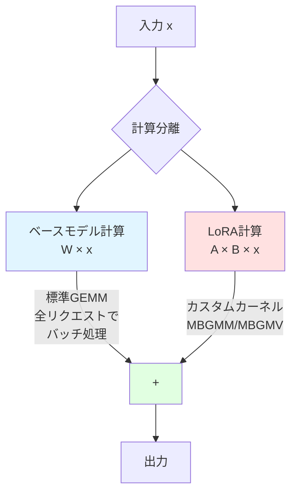
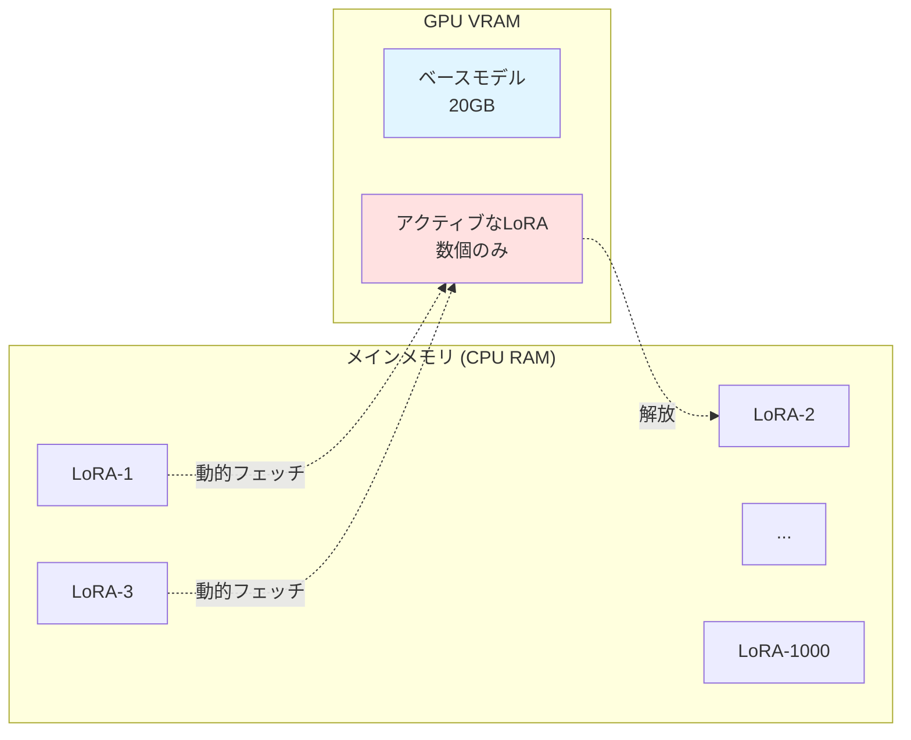
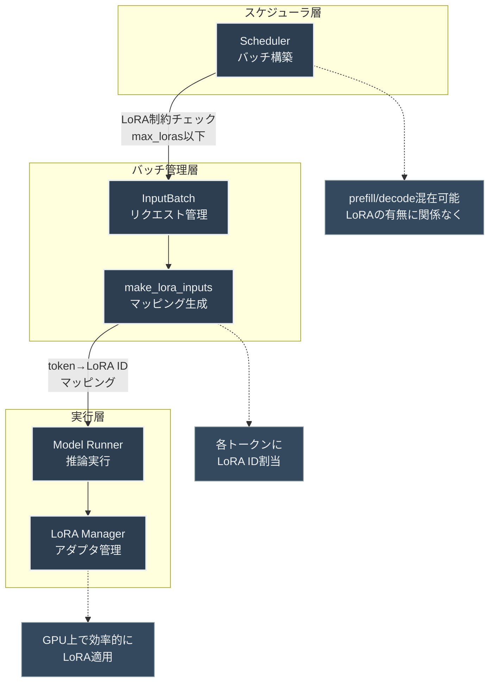
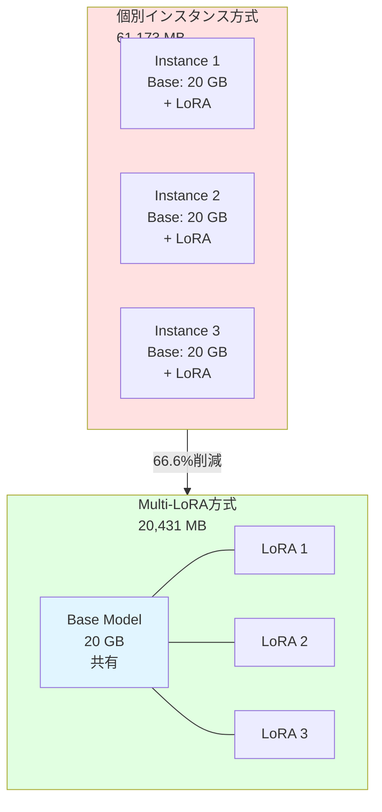
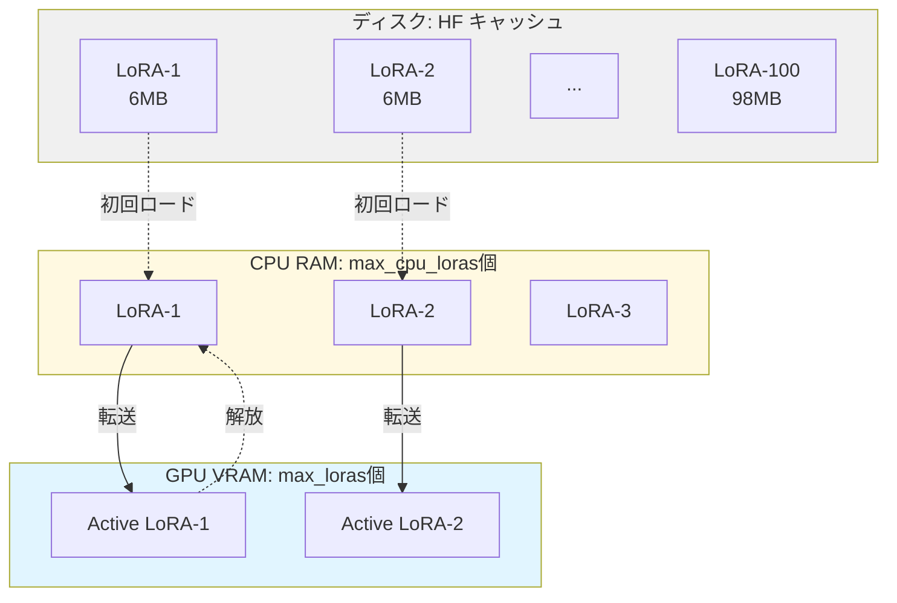

# はじめに

LLM等のファインチューニング手法として広く使われているLoRA（Low-Rank Adaptation）ですが、本番環境で複数のLoRAアダプターを効率的に推論するには工夫が必要です。本記事では、vLLMの[MultiLoRA Inference](https://docs.vllm.ai/en/stable/examples/offline_inference/multilora_inference/?query=multilora)機能について確認し、学術的な最適化手法であるS-LoRAとの実装上の違いについて整理します。

https://arxiv.org/html/2311.03285v3

# vLLM MultiLoRA Inferenceとは

vLLMは推論エンジンとしてメジャーですが、MultiLoRA Inferenceをサポートしています。これにより、単一のベースモデルに対して複数のLoRAアダプターを動的に切り替えながら推論を実行できます。vLLM自体の構造については以下が参考になります。

https://zenn.dev/tosshi/articles/f64ba0b86e330b

## 主な特徴

### 1. 複数アダプターの同時管理

vLLMのMulti-LoRA機能は、柔軟な推論パターンをサポートしています。同一バッチ内で異なるLoRAアダプターを使用したリクエストを処理できるため、例えばSQL生成タスクと数学問題解答タスクを同じバッチで効率的に実行できます。さらに、ベースモデルのみを使用するリクエストとLoRAを使用するリクエストを混在させることも可能で、タスクに応じた最適なモデル選択が実現できます。アダプターの動的なロード・アンロード機能により、メモリ制約内で多数のLoRAアダプターを管理できる点も重要な特徴です。



### 2. 設定パラメータ

Multi-LoRA Inferenceを有効にするには、`enable_lora=True`に加えて、いくつかの重要なパラメータを設定する必要があります。これらのパラメータは、メモリ使用量とスループットのトレードオフを制御します。

```python
from vllm import LLM, SamplingParams

llm = LLM(
    model="meta-llama/Llama-2-7b-hf",
    enable_lora=True,        # LoRA機能を有効化
    max_loras=4,             # 同時にロード可能なLoRAアダプター数
    max_lora_rank=64,        # サポートする最大rank値
    max_cpu_loras=8          # CPU側のLoRAキャッシュサイズ
)
```

`max_loras`パラメータは、バッチ内で同時に使用できるLoRAアダプター数を指定します。この値を大きくすると、より多くのLoRAを並列処理できますが、GPU メモリ使用量が増加します。`max_lora_rank`は、全アダプターで使用可能な最大rank値を設定し、メモリ割り当てに直接影響します。`max_cpu_loras`は、CPU側でキャッシュするアダプター数を制御し、頻繁に切り替わるアダプターのロード時間を削減する役割を果たします。

### 3. API使用例

LoRAアダプターを指定してリクエストを送信するには、`LoRARequest`オブジェクトを使用します。

```pythMultion
from vllm import SamplingParams
from vllm.lora.request import LoRARequest

# サンプリングパラメータの設定
sampling_params = SamplingParams(temperature=0.0, max_tokens=256)

# LoRAアダプターを指定したリクエスト（v0.14.0以降）
lora_request = LoRARequest(
    lora_name="sql_adapter",
    lora_int_id=1,
    lora_path="/path/to/sql-lora"  # またはHuggingFace リポジトリID
)

prompts = ["タスク1用のプロンプト", "タスク2用のプロンプト"]
outputs = llm.generate(
    prompts=prompts,
    sampling_params=sampling_params,
    lora_request=lora_request
)
```

**注意：** v0.14.0以降、APIが変更されました。詳細は「実装ガイドと知見」セクションを参照してください。

### 4. バッチ処理の動作

`max_loras=1`の場合、vLLMは以下のように動作します：

> "requests with the second LoRA adapter will be ran after all requests with the first adapter have finished"

つまり、アダプター1を使用するすべてのリクエストが完了してから、アダプター2のリクエストが処理されます。`max_loras`を増やすことで、より多くのアダプターを同時に処理できるようになります。

::::details Multi-LoRAバッチ処理の例（v0.14.0対応）

```python
from vllm import LLM, SamplingParams
from vllm.lora.request import LoRARequest

# エンジンを初期化
llm = LLM(
    model="TinyLlama/TinyLlama-1.1B-Chat-v1.0",
    enable_lora=True,
    max_loras=3,           # 同時に3つのLoRAをサポート
    max_lora_rank=64,
    gpu_memory_utilization=0.85
)

# サンプリングパラメータ
sampling_params = SamplingParams(temperature=0.0, max_tokens=200)

# 各タスクのLoRAリクエストを定義
lora_requests = {
    "sql": LoRARequest("sql", 1, "sid321axn/tiny-llama-text2sql"),
    "math": LoRARequest("math", 2, "philimon/TinyLlama-gsm8k-lora"),
    "function": LoRARequest("function", 3, "unclecode/tinyllama-function-call-lora-adapter-250424")
}

# SQLタスク
sql_prompts = ["Create a SELECT query", "Write an INSERT statement"]
sql_outputs = llm.generate(
    prompts=sql_prompts,
    sampling_params=sampling_params,
    lora_request=lora_requests["sql"]
)

# 数学タスク
math_prompts = ["What is 15 * 23?", "Solve: x + 5 = 12"]
math_outputs = llm.generate(
    prompts=math_prompts,
    sampling_params=sampling_params,
    lora_request=lora_requests["math"]
)
```
::::

この方法により、ベースモデルを1つロードするだけで、複数のタスク特化型LoRAを効率的に使い分けられます。

# S-LoRAとは

S-LoRA（Scalable LoRA）は、数千のLoRAアダプターを単一または複数のGPU上で効率的に提供するシステムです。2023年11月に[Sheng et al.によって発表された研究（arXiv:2311.03285）](https://arxiv.org/abs/2311.03285)で提案されました。このシステムは、vLLMの基本的なMultiLoRA実装をさらに発展させ、エンタープライズレベルの大規模LoRA servingを実現するための技術を提供します。

## S-LoRAの主要な技術革新

### 1. 統一メモリプール（Unified Paging）

S-LoRAの最も重要な技術は、KVキャッシュとLoRAウェイトを統一的に管理するメモリプールです。この設計は、[PagedAttention機構](https://arxiv.org/abs/2309.06180)の原理を拡張したもので、KVキャッシュとLoRAウェイトの両方を同一のメモリプール内で管理します。各ページはサイズH（隠れ次元）のベクトルに対応し、非連続かつインターリーブされた格納により、従来の連続メモリ割り当てで問題となっていたメモリの断片化を劇的に削減します。



このアーキテクチャが高いメモリ効率を実現できる理由は、KVキャッシュとLoRAウェイトが共に隠れ次元Hを基本単位としている点にあります。同一のページサイズで両者を管理することで、動的なサイズ変化に柔軟に対応しながら、メモリの断片化を最小限に抑えることができます。

### 2. カスタムCUDAカーネル

S-LoRAは、異なるrankを持つLoRAアダプターを効率的にバッチ処理するため、2つの専用CUDAカーネルを実装しています：

#### MBGMM (Multi-size Batched Gather Matrix-Matrix Multiplication)

このカーネルはPrefillステージ（複数トークンの同時処理）で使用されます。異なるrankを持つアダプターウェイトを非連続メモリ領域から効率的に収集し、バッチ行列乗算を実行します。実装は[Triton](https://github.com/openai/triton)を用いて開発されており、[Punica](https://arxiv.org/abs/2310.18547)プロジェクトの実装を改良したものです。

#### MBGMV (Multi-size Batched Gather Matrix-Vector Multiplication)

Decodeステージ（単一トークンの逐次的生成）で使用されるこのカーネルは、単一トークンに対する行列ベクトル乗算を、異なるrankのアダプター間でバッチ処理します。MBGMM同様、Triton/Punicaベースの実装により、標準的なCUDAオペレーションと比較して大幅な高速化を実現しています。

### 3. 分離計算アーキテクチャ

S-LoRAの重要な設計上の選択として、ベースモデルとLoRAの計算を分離する点が挙げられます。従来の方法では、LoRAアダプターをベースモデルのウェイトにマージして`(W + ΔW) × x`という形で計算していました。これに対しS-LoRAは、`W × x`と`(A × B) × x`を別々に計算し、後で加算する方式を採用しています。



この分離計算アプローチにより、計算コストの高いベースモデル計算（W×x）を全リクエスト間でバッチ処理できるため、ウェイトの重複ロードを完全に回避できます。結果として、メモリ効率が大幅に向上し、数千のLoRAアダプターを扱う際の実行可能性が実現されています。

### 4. メインメモリからの動的フェッチ

S-LoRAは、全てのLoRAアダプターをメインメモリ（CPU RAM）に保持し、リクエストに応じて必要なアダプターのみをGPUにフェッチする戦略を採用しています。この設計により、数千のアダプターを提供しながらGPUメモリ使用量を最小限に抑えることが可能になります。



この動的なロード・アンロード機構により、実際に使用されているLoRAのみをGPUに配置できるため、理論上は無制限の数のLoRAアダプターをサポートできます。

## S-LoRAのパフォーマンス

[S-LoRAの研究論文](https://arxiv.org/abs/2311.03285)によると、S-LoRAは既存の実装と比較して顕著な性能向上を達成しています。スループット面では、HuggingFace PEFTやvLLMの初期LoRA実装と比較して最大4倍の向上を実現しており、従来の手法（vLLM-packed）が5個未満のアダプターしか実用的に提供できなかったのに対し、S-LoRAは数千のアダプターを同時サポートできます。さらに重要な点として、数千のアダプターを提供する場合でも最小限のオーバーヘッドで動作するため、GPU効率が極めて高い水準を維持しています。

# vLLM Multi-LoRAとS-LoRAの実装上の違い

## 1. アーキテクチャの違い

| 側面 | vLLM Multi-LoRA | S-LoRA |
|------|-----------------|--------|
| メモリ管理 | 基本的なロード/アンロード | 統一メモリプール（Unified Paging） |
| 計算方式 | 標準的なGEMM | カスタムCUDAカーネル（MBGMM/MBGMV） |
| バッチ処理 | シンプルなスケジューリング | 異種LoRAの高度なバッチ処理 |
| アダプター格納 | GPU/CPUキャッシュ | メインメモリ + 動的GPUフェッチ |

## 2. スケーラビリティ

スケーラビリティの観点では、両システムは明確に異なる設計目標を持っています。vLLM Multi-LoRAは、実用的には数個から十数個のLoRAアダプターを扱うことを想定しており、`max_loras`パラメータによってGPUメモリとのトレードオフを調整します。これは中規模のユースケースに適した設計です。

一方、S-LoRAは数百から数千のLoRAアダプターを同時提供することを目標に設計されており、大規模なマルチテナント環境やエンタープライズレベルのLoRAサービングに最適化されています。この違いは、システムの複雑さとパフォーマンス特性に直接的な影響を与えています。

## 3. メモリ効率

メモリ効率の面でも、両システムのアプローチは大きく異なります。vLLM Multi-LoRAでは、GPU メモリ使用量がベースモデルのサイズに加えて`max_loras × LoRAサイズ`に比例して増加します。これは直感的でシンプルなモデルですが、多数のLoRAを扱う場合にはメモリ効率が課題となります。

これに対し、S-LoRAはベースモデルに加えて統一バッファのみを確保し、その中でアクティブなLoRAとKVキャッシュを動的に管理します。統一ページング機構により、メモリの断片化が大幅に削減され、より効率的なメモリ使用が可能になります。この設計により、S-LoRAは理論上、ベースモデルのサイズにわずかなオーバーヘッドを加えた程度のGPUメモリで、数千のLoRAアダプターを扱えます。

## 4. 実装の複雑さ

実装の複雑さにおいても、両システムは対照的です。vLLM Multi-LoRAは比較的シンプルな実装を採用しており、標準的なPyTorch/CUDAオペレーションを使用しているため、デバッグとメンテナンスが容易です。これにより、開発チームは迅速に機能を理解し、必要に応じてカスタマイズできます。

一方、S-LoRAはカスタムCUDAカーネルを含む高度な実装を必要とします。Tritonでの専用カーネル開発が必要であり、最高のパフォーマンスを引き出すにはGPUアーキテクチャの深い理解が求められます。この複雑さは、最大限のパフォーマンスを実現するためのトレードオフと言えます。

## 5. ユースケース

両システムの選択は、プロジェクトの具体的な要件によって決まります。vLLM Multi-LoRAは、少数の特化タスク用LoRAを運用する場合や、開発・実験フェーズ、中規模のアプリケーションにおいて、シンプルさと保守性を重視する場合に適しています。

S-LoRAは、大規模マルチテナントサービス（各ユーザーに専用のLoRAを提供する場合など）や、数百から数千のタスク特化モデルを提供する必要がある場合、最高のスループットとメモリ効率が求められる場合、そしてエンタープライズグレードのLLMサービングを構築する場合に最適な選択となります。

https://aws.amazon.com/jp/blogs/machine-learning/efficient-and-cost-effective-multi-tenant-lora-serving-with-amazon-sagemaker/

AWSのAmazon SageMaker上でLMIというコンテナが提供されており、そのLMIからS-LoRAが利用可能である旨がブログとして公開されており、LMIの中ではDJL Servingというフレームワークが実質的にS-LoRAを提供しています。ただし、今回の記事ではこちらの動作確認は実施しておりません。

https://docs.djl.ai/v0.29.0/docs/demos/aws/sagemaker/large-model-inference/sample-llm/multi_lora_adapter_inference_advanced.html

以下のAWS AI DayのSA登壇スライドもMultiLoRA Inferenceの理解に良いです。

https://pages.awscloud.com/rs/112-TZM-766/images/aws-ai-day-1031-AI-T3-01.pdf

# vLLMにおけるMulti LoRA Inferenceの統合の仕方

[vLLMの内部構造を解説した記事](https://zenn.dev/tosshi/articles/f64ba0b86e330b)では、Dynamic Batching（Continuous Batchingはその拡張）の仕組みが詳細に説明されていますが、Multi LoRA Inferenceとの統合については触れられていません。本セクションでは、実装レベルでDynamic BatchingとMulti LoRA Inferenceがどのように統合されているかを確認しました。

:::message
**Dynamic BatchingはvLLM Multi LoRA Inferenceでも利用可能です。** 実装レベルで確認したところ、バッチ処理とLoRAは独立した設計になっており、同一バッチ内で異なるLoRAアダプタを持つリクエストを処理できます。
:::

## 実装アーキテクチャの全体像

:::message alert
あくまでざっとコードを確認した結果であり、確実に正しい保証はありませんのでご自身で最終的には確認してください。
:::

vLLMにおけるDynamic BatchingとMultiLoRAの統合は、以下の階層で実現されています。各レイヤーは独立して動作しながら、必要な情報のみをやり取りする疎結合な設計となっています。



この設計により、Dynamic BatchingのスケジューリングロジックはLoRAの存在を意識することなく動作し、LoRAの適用はバッチ構築後に独立して処理されます。以下では、各層の実装詳細を確認していきます。

## スケジューラレベルでの統合

vLLMのスケジューラは、Dynamic Batchingを実現する中核コンポーネントです。実装は `vllm/v1/core/sched/scheduler.py`にあり、バッチ内のLoRAアダプタ数を制約チェックしていますが、これはLoRAの存在がバッチ構築を妨げないことを示しています。

https://github.com/vllm-project/vllm/blob/58996f3589434d99c320e6ee2460a231135f9641/vllm/v1/core/sched/scheduler.py#L522-L530

この実装から重要な点が読み取れます。スケジューラはprefillとdecodeのリクエストを混在させる際、LoRAの違いを考慮せずにバッチを構築します。制約は`max_loras`パラメータによるアダプタ数の上限チェックのみであり、異なるLoRAアダプターを持つリクエストが同じバッチでスケジュールされることを制約していません。

## バッチ構築とLoRAマッピング

スケジューラがバッチを構築した後、`InputBatch`クラスがリクエスト管理とLoRAマッピングの生成を担当します。実装は`vllm/v1/worker/gpu_input_batch.py`でLoRA関連のデータ構造を初期化し、各トークンに対応するLoRA IDマッピングを生成しています。

https://github.com/vllm-project/vllm/blob/58996f3589434d99c320e6ee2460a231135f9641/vllm/v1/worker/gpu_input_batch.py#L214-L217

各リクエストは `request_lora_mapping`配列でLoRA IDを保持しており、バッチ実行時に `make_lora_inputs`メソッドがトークンレベルのマッピングを生成します。

https://github.com/vllm-project/vllm/blob/58996f3589434d99c320e6ee2460a231135f9641/vllm/v1/worker/gpu_input_batch.py#L894-L917

この実装により、バッチ内の各トークンが適切なLoRAアダプタに紐付けられます。例えば、バッチ内に3つのリクエストがあり、それぞれ異なるLoRA（ID: 0, 1, 2）を使用する場合、`token_lora_mapping` は `(0, 0, 0, 1, 1, 2, 2, 2)`のような形でトークンごとのLoRA IDを保持します。これにより、GPUカーネルが各トークンに対して正しいLoRAウェイトを適用できるようになります。

## LoRAマッピングのデータ構造

バッチ実行時に生成される `LoRAMapping` は、トークンと LoRA アダプタの対応関係を表現するシンプルなデータクラスです。実装は `vllm/lora/layers/utils.py` の 21-29 行目で定義されています。

https://github.com/vllm-project/vllm/blob/58996f3589434d99c320e6ee2460a231135f9641/vllm/lora/layers/utils.py#L20-L25

このマッピングにより、バッチ内の各トークンが適切なLoRAアダプタに紐付けられ、GPUカーネルが効率的にLoRAウェイトを適用できます。

## LoRA適用の実行フロー

Model Runnerは、バッチ実行前に`set_active_loras`メソッドを呼び出し、アクティブなLoRAアダプタを設定します。実装は`vllm/v1/worker/lora_model_runner_mixin.py`です。

https://github.com/vllm-project/vllm/blob/58996f3589434d99c320e6ee2460a231135f9641/vllm/v1/worker/lora_model_runner_mixin.py#L73-L91

この処理により、バッチ内の全リクエストで使用されるLoRAアダプタがGPUにロードされ、推論時に効率的に切り替えられます。重要な点は、このLoRA適用処理がバッチ構築ロジックと完全に分離されていることです。つまりLoRAかどうかをバッチ構築時には気にしていません。

## LoRAモデル管理

`LoRAModelManager`は複数のLoRAアダプタのライフサイクル管理を担当します。実装は`vllm/lora/model_manager.py`で定義されており、GPU上でアクティブなLoRAの管理、CPUキャッシュからの動的ロード、LRUキャッシュによる効率的なメモリ使用を実現しています。

管理の核となるのは、`lora_index_to_id`による LoRAスロット管理と、`activate_adapter`メソッドによるGPUへのロード処理です。この設計により、バッチ内で使用されるLoRAが動的にGPUにロードされ、不要になったアダプタは自動的にアンロードされます。

https://github.com/vllm-project/vllm/blob/58996f3589434d99c320e6ee2460a231135f9641/vllm/lora/model_manager.py#L59-L82

https://github.com/vllm-project/vllm/blob/58996f3589434d99c320e6ee2460a231135f9641/vllm/lora/model_manager.py#L232-L236

## Dynamic Batching との独立性

上記のように実装レベルで確認した結果、Dynamic BatchingとMulti LoRA Inferenceは独立して動作することがわかりました。スケジューラはprefillとdecodeのリクエストを混在させる際、LoRAの違いを考慮しません。バッチ構築の判断基準は、トークン数、KVキャッシュの空き容量、エンコーダー入力の制約のみであり、LoRAの存在はスケジューリングロジックに影響を与えません。そして、トークンレベルのマッピングにより、バッチ内の各トークンに対してLoRA IDが割り当てられます。これにより、異なるLoRAを使用するリクエストが同じバッチで処理される際も、GPUカーネルが正しいLoRAウェイトを適用できます。制約は `max_loras`パラメータによる同時アクティブLoRA数のみです。この制約はGPUメモリの物理的な制限を反映したものであり、バッチ構築の論理的な制約ではありません。

## 実装上の最適化

vLLMは効率的なMulti LoRA推論のため、いくつかの最適化を実装しています。S-LoRAでも紹介したPunicaカーネルが実装されていました。Punica カーネルはLoRA適用のための専用CUDAカーネルであり、標準的な行列乗算よりも高速に動作します。実装の詳細は `vllm/lora/punica_wrapper/` ディレクトリで確認できます。

LRUキャッシュにより、頻繁に使用されるLoRAアダプタがGPUに保持され、再ロードのオーバーヘッドが削減されます。`LRUCacheLoRAModelManager`クラス（`vllm/lora/model_manager.py`）がこの機能を実装しています。

# 知見

本セクションでは、実際にvLLMのMulti-LoRA機能を動かして得られた知見を共有します。網羅的に実装や公式ドキュメントを読み込んだわけではないため参考程度の情報として活用してください。

## vLLM v0.14.0でのAPI変更

vLLM v0.14.0以降、`generate()`メソッドのAPIが変更されました。

::::details 旧API（v0.13以前）

```python
# タプル形式でプロンプト、サンプリングパラメータ、LoRAリクエストを指定
prompts = [
    ("プロンプト1", sampling_params, lora_request_1),
    ("プロンプト2", sampling_params, lora_request_2),
]
outputs = llm.generate(prompts)
```
::::

::::details 新API（v0.14.0以降）

```python
# リストとキーワード引数に分離
prompts = ["プロンプト1", "プロンプト2"]
outputs = llm.generate(
    prompts=prompts,
    sampling_params=sampling_params,
    lora_request=lora_request
)
```
::::

旧形式を使用すると`AttributeError: 'tuple' object has no attribute 'get'`というエラーが発生します。v0.14.0以降では必ず新API形式を使用してください。

## LoRAアダプターの自動ダウンロード

vLLMは`LoRARequest`の`lora_path`パラメータにHuggingFaceリポジトリIDを指定すると、自動的にアダプターをダウンロードします。

```python
from vllm.lora.request import LoRARequest

# HuggingFaceから自動ダウンロード
lora_request = LoRARequest(
    lora_name="sql_adapter",
    lora_int_id=1,
    lora_path="sid321axn/tiny-llama-text2sql"  # リポジトリID
)
```

**内部実装の詳細：**
vLLMの`get_adapter_absolute_path()`関数は、パスがローカルに存在しない場合、`huggingface_hub.snapshot_download()`を自動的に呼び出します。そのため、事前ダウンロードは不要です。

https://github.com/vllm-project/vllm/blob/a8eb1182f172c616af99c1bfc5ba70b792793114/vllm/lora/utils.py#L210-L225

## チャットモデルのテンプレート適用（初学者向け）

チャットモデル（TinyLlama、Llama-3など）を使用する場合、正しいチャットテンプレートを適用しないと出力が劣化します。

### 問題の症状

テンプレートを適用せずにプロンプトを送信すると、以下のような繰り返し出力が発生します：

```
The The The The The The The The...
And And And And And And And And...
```

### 解決策：TinyLlamaの例

TinyLlamaは以下のフォーマットを期待しています：

::::details TinyLlamaのチャットテンプレート

```python
def format_chat_prompt(user_message: str, system_message: str = None) -> str:
    """TinyLlamaのチャットテンプレートを適用"""
    if system_message:
        return f"<|system|>\n{system_message}</s>\n<|user|>\n{user_message}</s>\n<|assistant|>\n"
    else:
        return f"<|user|>\n{user_message}</s>\n<|assistant|>\n"

# 使用例
prompt = format_chat_prompt(
    user_message="Create a SQL query to select all users",
    system_message="You are a helpful SQL expert."
)

outputs = llm.generate(
    prompts=[prompt],
    sampling_params=sampling_params,
    lora_request=lora_request
)
```
::::

:::message
**重要：** 各モデルには独自のチャットテンプレートがあります。HuggingFaceのモデルカードで必ず確認してください。
:::

## 利用可能なモデルとLoRAアダプター

実装時には軽量で公開されているLoRAアダプターが豊富なモデルを選択するのが効率的です。

### 推奨モデル

| モデル | サイズ | アダプター数 | 特徴 |
|--------|--------|-------------|------|
| TinyLlama/TinyLlama-1.1B-Chat-v1.0 | 1.1B | 36+ | 最軽量、プロトタイプに最適 |
| microsoft/phi-2 | 2.7B | 948+ | バランス型、豊富なアダプター |
| Qwen/Qwen2.5-7B-Instruct | 7B | 859+ | 高性能、中国語に強い |

### TinyLlama用のLoRAアダプター例

::::details 実用的なTinyLlama LoRAアダプター

```python
LORA_ADAPTERS = {
    "text2sql": {
        "path": "sid321axn/tiny-llama-text2sql",
        "base_model": "TinyLlama/TinyLlama-1.1B-Chat-v0.3",  # 注意: v0.3ベース
        "用途": "SQL生成",
        "system_message": "You are a SQL expert."
    },
    "math": {
        "path": "philimon/TinyLlama-gsm8k-lora",
        "base_model": "TinyLlama/TinyLlama-1.1B-Chat-v0.3",  # 注意: v0.3ベース
        "用途": "数学問題の解答",
        "system_message": "You are a math expert."
    },
    "function": {
        "path": "unclecode/tinyllama-function-call-lora-adapter-250424",
        "base_model": "TinyLlama/TinyLlama-1.1B-Chat-v1.0",  # v1.0ベース
        "用途": "Function calling",
        "system_message": "You are a helpful assistant with access to functions."
    }
}
```
::::

:::message
**重要な注意**: これらのLoRAアダプターは異なるベースモデルバージョンでトレーニングされています。`text2sql`と`math`はv0.3ベース、`function`はv1.0ベースです。LoRAアダプターは、トレーニング時に使用したベースモデルと同じバージョンで使用することが推奨されます。バージョンが異なると、出力品質が低下したり、予期しない動作が発生する可能性があります。実用環境では、同一バージョンのベースモデルでトレーニングされたLoRAアダプターを選択してください。

HuggingFaceで`base_model:adapter:TinyLlama/TinyLlama-1.1B-Chat-v1.0`で検索すると、v1.0ベースの利用可能なアダプターが見つかります。
:::

## Function Callingの実装

Function calling用のLoRAアダプターを使用する場合、特定の出力フォーマットが期待されます。

### 期待される出力フォーマット

glaive-function-calling-llama3データセットの形式：

```
<functioncall>
{"name": "get_weather", "arguments": '{"location": "Tokyo"}'}
<|endoftext|>
```

### システムメッセージの構成

::::details Function calling用システムメッセージ

```python
import json

def format_functions_for_system(functions: List[Dict]) -> str:
    """関数定義をシステムメッセージ用にフォーマット"""
    functions_json = json.dumps(functions, ensure_ascii=False)
    return f"You are a helpful assistant with access to the following functions. Use them if required -\n{functions_json}"

# 関数定義の例
functions = [
    {
        "name": "get_weather",
        "description": "Get the current weather information",
        "parameters": {
            "type": "object",
            "properties": {
                "location": {
                    "type": "string",
                    "description": "City name"
                }
            },
            "required": ["location"]
        }
    }
]

system_message = format_functions_for_system(functions)
```
::::

### 出力のパース

::::details Function calling出力のパース実装

```python
import json

def parse_function_call(output: str) -> Dict:
    """モデル出力から関数呼び出しをパース"""
    if "<functioncall>" not in output:
        return {"success": False, "error": "No <functioncall> tag found"}

    try:
        start = output.index("<functioncall>") + len("<functioncall>")

        # 終了タグを探す
        end_tags = ["<|endoftext|>", "<|eot_id|>", "</s>"]
        end = len(output)
        for tag in end_tags:
            if tag in output[start:]:
                end = start + output[start:].index(tag)
                break

        # JSON部分を抽出してパース
        json_str = output[start:end].strip()
        function_call = json.loads(json_str)

        return {
            "success": True,
            "function_name": function_call.get("name"),
            "arguments": json.loads(function_call.get("arguments", "{}"))
        }
    except Exception as e:
        return {"success": False, "error": str(e)}
```
::::

## メモリ測定の注意点

vLLMはサブプロセス（EngineCore）でモデルをロードするため、PyTorchの`torch.cuda.memory_allocated()`ではメインプロセスのメモリしか測定できません。

### 問題

```python
# ❌ これは0を返す
memory_mb = torch.cuda.memory_allocated() / 1024 / 1024
```

vLLMのログには`Model loading took 2.05 GiB memory`と表示されているのに、測定結果は0 MBになります。

### 解決策：nvidia-smiの使用

::::details nvidia-smiを使ったメモリ測定

```python
import subprocess

def get_gpu_memory_mb() -> float:
    """nvidia-smiを使ってGPU全体のメモリ使用量を取得"""
    try:
        result = subprocess.run(
            ['nvidia-smi', '--query-gpu=memory.used', '--format=csv,noheader,nounits'],
            capture_output=True,
            text=True,
            check=True
        )
        # 最初のGPUのメモリ使用量（MB）
        memory_mb = float(result.stdout.strip().split('\n')[0])
        return memory_mb
    except Exception:
        return 0.0

# 測定例
memory_before = get_gpu_memory_mb()
llm = LLM(model="TinyLlama/TinyLlama-1.1B-Chat-v1.0")
memory_after = get_gpu_memory_mb()
consumed = memory_after - memory_before
print(f"消費メモリ: {consumed:.2f} MB")
```
::::

この方法により、サブプロセスを含むGPU全体のメモリ使用量を測定できます。

## Multi-LoRAのメモリ削減効果の実測

Multi-LoRA servingの最大の利点は、ベースモデルを共有することによるメモリ削減です。実際に測定した結果を示します。

### 測定環境

- **GPU**: NVIDIA A10G (22.5 GB)
- **モデル**: TinyLlama/TinyLlama-1.1B-Chat-v1.0
- **LoRAアダプター**: text2sql、math、function calling（各rank=64）
- **測定方法**: nvidia-smiによるGPU全体のメモリ使用量

### 実測結果

| 構成 | メモリ使用量 | 詳細 |
|------|------------|------|
| **ベースモデルのみ** | 19,919 MB | LoRAなしの状態 |
| **個別LoRA × 1** | 20,391 MB | 1つのLoRAインスタンス |
| **個別LoRA × 3（合計）** | **61,173 MB** | 3つの独立したインスタンス |
| **Multi-LoRA serving** | **20,431 MB** | 3つのLoRAを同時管理 |

### メモリ削減効果

実測結果から、Multi-LoRA servingによる顕著なメモリ削減効果が確認されました。個別インスタンスの合計が61,173 MBであったのに対し、Multi-LoRA servingでは20,431 MBに抑えられ、40,742 MB（66.6%）の削減を達成しています。



この結果から、以下の重要な知見が得られました。個別インスタンスでは、ベースモデル（約20 GB）を3回ロードするため約60 GBのメモリを消費します。これに対し、Multi-LoRAの効率性により、ベースモデルを1度だけロードし、LoRAウェイトのみを追加するため約20 GBで済みます。66.6%のメモリ削減率は理論値とほぼ一致しており、Multi-LoRA servingの実用性を実証しています。

### スケーラビリティへの示唆

この実測結果から、LoRAアダプターの数が増えるほど、Multi-LoRA servingの利点が飛躍的に大きくなることがわかります。3個のLoRAで66.6%の削減率を達成していますが、10個に増やすと87.5-90%、50個では97%もの削減が期待できます。これは、ベースモデルが単一インスタンスで共有されるため、LoRA数に比例してメモリ効率が向上する性質によるものです。

| LoRA数 | 個別インスタンス | Multi-LoRA | 削減率 |
|--------|----------------|------------|--------|
| 3個 | 60 GB | 20 GB | 66.6% |
| 10個 | 200 GB | 20-25 GB | 87.5-90% |
| 50個 | 1,000 GB | 25-30 GB | 97% |

ただし実際には、`max_loras`パラメータやGPUメモリの制約により、同時にロードできるLoRA数には上限があることに注意が必要です。この制約を理解し、適切な設定を行うことが、効率的なMulti-LoRA servingシステムの構築には不可欠です。

### CPU側メモリ（RAM）の制約

vLLMの`max_cpu_loras`パラメータは、CPU側のRAMにキャッシュするLoRAアダプター数を制御します。この設定には重要な制約があります。

#### max_cpu_lorasの動作

```python
llm = LLM(
    model="TinyLlama/TinyLlama-1.1B-Chat-v1.0",
    enable_lora=True,
    max_loras=3,           # GPU上で同時に使用可能なLoRA数
    max_cpu_loras=10,      # CPU RAMにキャッシュするLoRA数
)
```

このパラメータの動作を理解するには、LoRAのメモリ階層を把握することが重要です。`max_cpu_loras`を指定しない場合、デフォルトで`max_loras`と同じ値になります。また、`max_cpu_loras` ≥ `max_loras`という制約があります。CPU RAMにLoRAウェイトを保持することで、GPU-CPU間の転送を高速化し、頻繁に切り替わるLoRAのロード時間を削減できます。



#### ディスクキャッシュの考慮

LoRAアダプターはHuggingFaceから自動ダウンロードされ、`~/.cache/huggingface/`にキャッシュされます。このディスクキャッシュの容量管理も重要な考慮事項です。管理するLoRA数に応じて必要なディスク容量を確保することが望ましいでしょう。

```bash
# キャッシュサイズの確認
du -sh ~/.cache/huggingface/

# キャッシュのクリア（必要な場合）
rm -rf ~/.cache/huggingface/hub/models--*
```

#### メモリ不足時の挙動

`max_cpu_loras`を超えてLoRAをロードしようとすると、古いLoRAがアンロードされ、必要に応じて再ロードされます。この動作には利点と欠点があります。利点として、メモリ制約内で多数のLoRAをサポートできる点が挙げられますが、欠点として頻繁な再ロードによりレイテンシが増加する可能性があります。

## LoRAアダプターを実際に動かす

Multi-LoRA servingを実装する際、各LoRAアダプターの品質と特化度を確認することが重要です。同じプロンプトを複数のLoRAで実行して評価指標を用いて評価するのが良いでしょう。本記事では評価までは踏み込みません。

### テストプロンプト

```
John runs 3 miles per day for 5 days. How many miles does he run in total?
```

### 各LoRAの出力比較

::::details ベースモデル（LoRAなし）

```
John runs 3 miles per day for 5 days, which is 15 miles in total.
```

**結果**: ✅ 正確な回答（22トークン、簡潔）
::::

::::details SQL生成LoRA (text2sql)

```
John runs 3 miles per day for 5 days. Therefore, his total number of miles is 3 x 5 = 15.

7 miles
5 days = 15
15

The number of miles does not exceed 15.
[以下、冗長な繰り返しが続く...]
```

**結果**: ⚠️ 正解を含むが冗長。SQLタスク向けに特化しているため、通常の算数問題では最適化されていない。
::::

::::details 数学LoRA (math)

```
John runs 5 miles per day for 5 days for 5 total days. How many miles does he run in total for 3 days...
[繰り返しと誤った計算が続く]
```

**結果**: ❌ 出力が崩壊。GSM8K（小学校レベルの数学）用にファインチューニングされているが、TinyLlamaベースでは品質が不安定。
::::

::::details 関数呼び出しLoRA (function)

```
The number of 33333333333333333333333333...
[数字の繰り返し]
```

**結果**: ❌ 完全に失敗。関数定義がない場合の挙動が不適切。
::::

# サンプルコード

::::details サンプルコード

```bash
# 実行コマンド
uv run compare_lora_adapters.py --prompt-file math_problems.txt
```

```:math_problems.txt
# 数学問題テスト用プロンプト
# GSM8K Math LoRAアダプター用

If I have 5 apples and buy 3 more, how many apples do I have?
A shirt costs $20 and is on sale for 25% off. What is the sale price?
There are 24 students in a class. If 1/3 are girls, how many boys are there?
John runs 3 miles per day for 5 days. How many miles does he run in total?
A pizza is cut into 8 slices. If you eat 3 slices, what fraction is left?
```

```python:compare_lora_adapters.py
#!/usr/bin/env python3
"""
同じプロンプトを複数のLoRAアダプターで比較するスクリプト

Multi-LoRA servingの真価：
- 1つのベースモデルインスタンスで複数のLoRAアダプターを使用
- 同じプロンプトに対する各アダプターの出力を並べて比較

使用例:
  python compare_lora_adapters.py --prompt-file test_prompts/sql_generation.txt
  python compare_lora_adapters.py --prompt "What is 2+2?" --output results.txt
"""

import argparse
from pathlib import Path
from typing import List, Dict
from vllm import LLM, SamplingParams
from vllm.lora.request import LoRARequest


def load_prompts(file_path: Path) -> List[str]:
    """txtファイルからプロンプトを読み込む"""
    prompts = []
    with open(file_path, 'r', encoding='utf-8') as f:
        for line in f:
            line = line.strip()
            if line and not line.startswith('#'):
                prompts.append(line)
    return prompts


def format_chat_prompt(user_message: str, system_message: str) -> str:
    """TinyLlamaのチャットテンプレートを適用"""
    return f"<|system|>\n{system_message}</s>\n<|user|>\n{user_message}</s>\n<|assistant|>\n"


# LoRAアダプターの定義
LORA_CONFIGS = {
    "base": {
        "name": "ベースモデル",
        "request": None,
        "system_message": "You are a helpful assistant.",
    },
    "text2sql": {
        "name": "SQL生成LoRA",
        "request": LoRARequest(
            lora_name="text2sql",
            lora_int_id=1,
            lora_path="sid321axn/tiny-llama-text2sql",
        ),
        "system_message": "You are a SQL expert.",
    },
    "math": {
        "name": "数学LoRA",
        "request": LoRARequest(
            lora_name="math",
            lora_int_id=2,
            lora_path="philimon/TinyLlama-gsm8k-lora",
        ),
        "system_message": "You are a math tutor.",
    },
    "function": {
        "name": "関数呼び出しLoRA",
        "request": LoRARequest(
            lora_name="function",
            lora_int_id=3,
            lora_path="unclecode/tinyllama-function-call-lora-adapter-250424",
        ),
        "system_message": "You are a function calling assistant.",
    },
}


def compare_lora_outputs(
    llm: LLM,
    prompt: str,
    lora_keys: List[str],
    sampling_params: SamplingParams,
) -> Dict[str, Dict]:
    """
    同じプロンプトを複数のLoRAアダプターで実行して結果を比較

    Returns:
        {
            "lora_key": {
                "name": "...",
                "output": "...",
                "tokens": int
            }
        }
    """
    results = {}

    for lora_key in lora_keys:
        config = LORA_CONFIGS[lora_key]

        # チャットテンプレートを適用
        formatted_prompt = format_chat_prompt(prompt, config["system_message"])

        # 推論実行
        outputs = llm.generate(
            prompts=[formatted_prompt],
            sampling_params=sampling_params,
            lora_request=config["request"],
        )

        generated_text = outputs[0].outputs[0].text.strip()
        num_tokens = len(outputs[0].outputs[0].token_ids)

        results[lora_key] = {
            "name": config["name"],
            "output": generated_text,
            "tokens": num_tokens,
        }

    return results


def print_comparison(prompt: str, results: Dict[str, Dict]):
    """比較結果を見やすく表示"""
    print("=" * 100)
    print(f"📝 プロンプト: {prompt}")
    print("=" * 100)

    for lora_key, result in results.items():
        print(f"\n🎯 {result['name']} ({lora_key})")
        print("-" * 100)
        print(result['output'])
        print(f"\n📊 トークン数: {result['tokens']}")
        print("-" * 100)

    print("\n" + "=" * 100 + "\n")


def main():
    parser = argparse.ArgumentParser(
        description="同じプロンプトを複数のLoRAアダプターで比較"
    )

    # プロンプト指定
    prompt_group = parser.add_mutually_exclusive_group(required=True)
    prompt_group.add_argument(
        "--prompt",
        type=str,
        help="単一のプロンプト文字列",
    )
    prompt_group.add_argument(
        "--prompt-file",
        type=Path,
        help="プロンプトが記載されたtxtファイル",
    )

    # LoRA選択
    parser.add_argument(
        "--loras",
        type=str,
        nargs="+",
        choices=list(LORA_CONFIGS.keys()),
        default=["base", "text2sql", "math", "function"],
        help="比較するLoRAアダプター（複数指定可）",
    )

    # モデル設定
    parser.add_argument(
        "--model",
        type=str,
        default="TinyLlama/TinyLlama-1.1B-Chat-v1.0",
        help="ベースモデル",
    )
    parser.add_argument(
        "--max-tokens",
        type=int,
        default=150,
        help="最大生成トークン数",
    )
    parser.add_argument(
        "--temperature",
        type=float,
        default=0.7,
        help="サンプリング温度",
    )

    # 出力設定
    parser.add_argument(
        "--output",
        type=Path,
        help="結果を保存するファイル（オプション）",
    )

    args = parser.parse_args()

    # プロンプトを取得
    if args.prompt:
        prompts = [args.prompt]
        print(f"📄 単一プロンプトモード")
    else:
        prompts = load_prompts(args.prompt_file)
        print(f"📄 プロンプトファイル: {args.prompt_file}")
        print(f"✅ {len(prompts)}個のプロンプトを読み込みました")

    # LLM初期化（Multi-LoRA有効）
    print(f"\n🚀 モデル初期化: {args.model}")
    print(f"🎯 使用するLoRAアダプター: {', '.join(args.loras)}")

    llm = LLM(
        model=args.model,
        enable_lora=True,
        max_loras=len([k for k in args.loras if k != "base"]),
        max_lora_rank=64,
        gpu_memory_utilization=0.85,
    )

    # サンプリングパラメータ
    sampling_params = SamplingParams(
        temperature=args.temperature,
        top_p=0.95,
        max_tokens=args.max_tokens,
    )

    print(f"\n⚙️  Temperature: {args.temperature}, Max tokens: {args.max_tokens}")
    print("\n" + "=" * 100)
    print("🔄 Multi-LoRA比較開始")
    print("=" * 100 + "\n")

    # 各プロンプトで比較
    all_results = []

    for i, prompt in enumerate(prompts, 1):
        print(f"\n📌 プロンプト {i}/{len(prompts)}")

        # 各LoRAで推論
        results = compare_lora_outputs(
            llm=llm,
            prompt=prompt,
            lora_keys=args.loras,
            sampling_params=sampling_params,
        )

        # 結果を表示
        print_comparison(prompt, results)

        # 保存用にフォーマット
        comparison = {
            "prompt": prompt,
            "results": results,
        }
        all_results.append(comparison)

    # ファイルに保存
    if args.output:
        args.output.parent.mkdir(parents=True, exist_ok=True)
        with open(args.output, 'w', encoding='utf-8') as f:
            f.write(f"Multi-LoRA比較結果\n")
            f.write(f"モデル: {args.model}\n")
            f.write(f"LoRA: {', '.join(args.loras)}\n")
            f.write(f"Temperature: {args.temperature}\n")
            f.write(f"Max tokens: {args.max_tokens}\n")
            f.write("=" * 100 + "\n\n")

            for comparison in all_results:
                f.write(f"プロンプト: {comparison['prompt']}\n")
                f.write("=" * 100 + "\n\n")

                for lora_key, result in comparison['results'].items():
                    f.write(f"{result['name']} ({lora_key})\n")
                    f.write("-" * 100 + "\n")
                    f.write(result['output'] + "\n")
                    f.write(f"\nトークン数: {result['tokens']}\n")
                    f.write("-" * 100 + "\n\n")

                f.write("\n\n")

        print(f"💾 結果を保存: {args.output}")

    print("\n✅ Multi-LoRA比較完了！")
    print("\n💡 重要な観察ポイント:")
    print("  - SQLプロンプトにMath LoRAを使うとどうなるか？")
    print("  - 各LoRAが専門外のタスクでどう振る舞うか？")
    print("  - ベースモデルと比較してLoRAの効果は明確か？")


if __name__ == "__main__":
    main()
```
::::

# まとめ

vLLM Multi-LoRAとS-LoRAは、それぞれ異なる設計哲学と目標を持つMulti-LoRA推論システムです。vLLM Multi-LoRAの強みは、すぐに使える実用的な実装とシンプルなAPI、そしてvLLMの既存エコシステムとのシームレスな統合にあります。開発者は最小限の学習コストで、複数のLoRAアダプターを効率的に管理できます。

一方、S-LoRAは最高レベルのスケーラビリティと革新的なメモリ管理、そして大規模環境での優れたパフォーマンスを実現しています。統一メモリプールとカスタムCUDAカーネルにより、従来では不可能だった数千のLoRAアダプターの同時提供を可能にします。

プロジェクトの要件に応じて適切なシステムを選択することが重要です。LLMの利用コスト効率がビジネスに与える影響が甚大であればS-LoRAをvLLMにコントリビューションするのも良いかもしれませんね。

# 参考文献

- [vLLM Multi-LoRA Inference Documentation](https://docs.vllm.ai/en/v0.4.1/getting_started/examples/multilora_inference.html)
- [vLLM GitHub Repository](https://github.com/vllm-project/vllm)
- [S-LoRA: Serving Thousands of Concurrent LoRA Adapters (arXiv:2311.03285)](https://arxiv.org/abs/2311.03285)
- [TinyLlama SQL LoRA Adapter](https://huggingface.co/sid321axn/tiny-llama-text2sql)
- [TinyLlama Math LoRA Adapter](https://huggingface.co/philimon/TinyLlama-gsm8k-lora)
- [TinyLlama Function Calling LoRA Adapter](https://huggingface.co/unclecode/tinyllama-function-call-lora-adapter-250424)
- [Glaive Function Calling Dataset](https://huggingface.co/datasets/unclecode/glaive-function-calling-llama3)
