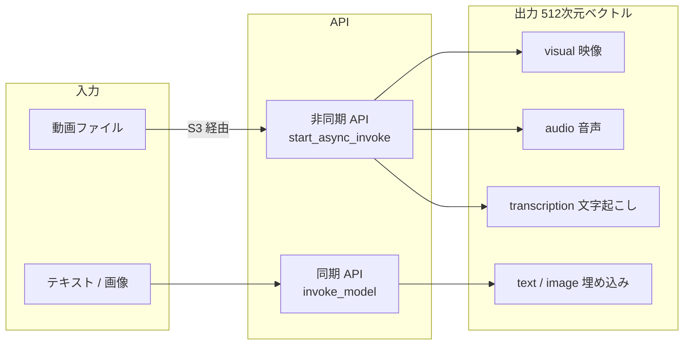

## はじめに

動画コンテンツは爆発的に増加しており、「あの動画のあのシーン」を素早く見つけるためのセマンティック検索への需要が高まっています。テキスト検索のように「キーワードが含まれているか」ではなく、「この動画はどんな内容か」を意味的に理解して検索する技術が求められています。

Amazon Bedrock で提供されている **TwelveLabs Marengo** は、この課題を解決するマルチモーダル埋め込みモデルです。テキスト、動画を同一のベクトル空間に変換することで、「日本語テキストで動画を検索する」「ある動画と似た動画を探す」といった用途が実現できます。

https://www.twelvelabs.io/blog/marengo-3-0

:::message
**本記事の目的**: Amazon Bedrock の Python SDK を使って TwelveLabs Marengo でテキスト・動画の埋め込みを理解します。
:::

本記事では、Amazon Bedrock を通じて TwelveLabs Marengo を実際に動かしてみます。AWS 公式ブログも合わせて参照してください。

https://aws.amazon.com/jp/blogs/news/unlocking-video-understanding-with-twelvelabs-marengo-on-amazon-bedrock/

## TwelveLabs Marengo とは

TwelveLabs は動画 AI に特化したスタートアップで、Marengo はその中核となるマルチモーダル埋め込みモデルです。

### 主な特徴

**マルチモーダル対応**: テキスト、動画（映像・音声・文字起こし）を同一のベクトル空間にマッピングします。これにより、テキストクエリで動画を検索したり、動画で類似動画を検索したりすることが可能です。

**マルチベクトルアーキテクチャ**: 動画から複数の観点（視覚情報、音声情報、文字起こし情報）を独立したベクトルとして抽出します。検索時にどの観点を重視するかを柔軟に選択できます。

**asset と clip の 2 スコープ**: 動画全体（asset）とセグメント単位（clip）の両方のベクトルを生成します。長尺動画でも特定のシーンを精度よく検索できます。


### Marengo 3.0 の主な改善点

旧バージョン（Marengo 2.7）と比較した主な変更点を以下に示します。

| 項目 | Marengo 2.7 | Marengo 3.0 |
|------|------------|------------|
| 埋め込み次元数 | 1024 次元 | 512 次元 |
| 最大動画長 | 2 時間 | 4 時間 |
| 最大ファイルサイズ | 3 GB | 6 GB |
| 対応言語数 | 12 言語 | 36 言語 |
| text_image 入力 | 非対応 | 対応（テキスト + 画像の複合クエリ） |

## アーキテクチャ概要

### マルチモーダル埋め込みの仕組み

Marengo の埋め込みは以下の 2 軸で構成されます。

| 軸 | 値 | 説明 |
|---|---|---|
| embeddingScope | `asset` | 動画全体を 1 つのベクトルに集約 |
| embeddingScope | `clip` | 動画を時間セグメントに分割し、各セグメントをベクトル化 |
| embeddingOption | `visual` | 映像（フレーム画像）の情報 |
| embeddingOption | `audio` | 音声・音楽・環境音の情報 |
| embeddingOption | `transcription` | 話されている言葉の文字起こし情報 |

1 本の動画に対して最大 6 種類（2 scope × 3 option）のベクトルが生成されます。

### 処理フロー



## 必要な IAM 権限

同期 API（`invoke_model`）と非同期 API（`start_async_invoke`）で使用するモデル ID が異なるため、両方の ARN を Resource に含める必要があります。

```json
{
  "Version": "2012-10-17",
  "Statement": [
    {
      "Effect": "Allow",
      "Action": [
        "bedrock:InvokeModel",
        "bedrock:StartAsyncInvoke",
        "bedrock:GetAsyncInvoke"
      ],
      "Resource": [
        "arn:aws:bedrock:us-east-1::foundation-model/twelvelabs.marengo-embed-3-0-v1:0",
        "arn:aws:bedrock:us-east-1:*:inference-profile/us.twelvelabs.marengo-embed-3-0-v1:0"
      ]
    },
    {
      "Effect": "Allow",
      "Action": [
        "s3:GetObject",
        "s3:PutObject"
      ],
      "Resource": "arn:aws:s3:::your-bucket/*"
    }
  ]
}
```

## テキスト埋め込み（同期 API）

テキストの埋め込みは通常の `invoke_model` API（同期 API）で取得できます。

```python
import boto3
import json
import time

session = boto3.Session(profile_name="your-profile", region_name="us-east-1")
client = session.client("bedrock-runtime")

def embed_text(text: str) -> list:
    payload = {
        "inputType": "text",
        "text": {"inputText": text}
    }

    start = time.time()
    response = client.invoke_model(
        modelId="us.twelvelabs.marengo-embed-3-0-v1:0",
        body=json.dumps(payload),
        contentType="application/json",
        accept="application/json"
    )
    elapsed = time.time() - start

    body = json.loads(response["body"].read())
    embedding = body["data"][0]["embedding"]
    print(f"[OK] テキスト埋め込み完了: {len(embedding)} 次元, {elapsed:.3f} 秒")
    return embedding

# 実行例
texts = [
    "a cat playing with a ball",
    "ocean waves at sunset",
    "people dancing at a party"
]

for text in texts:
    embedding = embed_text(text)
```

### 実測結果

実際に動かした結果は以下の通りです。

| 入力テキスト | 次元数 | 処理時間 |
|------------|--------|---------|
| "a cat playing with a ball" | 512 | 1.073 秒 |
| "ocean waves at sunset" | 512 | 0.998 秒 |
| "people dancing at a party" | 512 | 1.017 秒 |

:::message
AWS ブログには埋め込み次元数が 1024 と記載されている箇所がありますが、Marengo 3.0 の実際の出力は **512 次元**です。旧バージョン（Marengo 2.7）が 1024 次元だったため、一部のドキュメントに古い情報が残っています。OpenSearch のインデックスや S3 Vectors のベクトル次元設定には `"dims": 512` を指定してください。
:::

## 動画埋め込み（非同期 API）

動画処理は時間がかかるため、非同期 API（`start_async_invoke`）を使用します。処理結果は Amazon S3 に保存されます。

### 事前準備: Amazon S3 バケットの作成

```bash
ACCOUNT_ID=$(aws sts get-caller-identity --query Account --output text)
BUCKET="marengo-demo-${ACCOUNT_ID}-us-east-1"
aws s3 mb "s3://${BUCKET}" --region us-east-1

# 動画をアップロード
aws s3 cp test_video.mp4 "s3://${BUCKET}/videos/test_video.mp4"
```

```python
import boto3
import json
import time

session = boto3.Session(profile_name="your-profile", region_name="us-east-1")
client = session.client("bedrock-runtime")
s3 = session.client("s3")

ACCOUNT_ID = "your-account-id"
BUCKET = f"marengo-demo-{ACCOUNT_ID}-us-east-1"

def embed_video(video_s3_uri: str, output_prefix: str = "output") -> list:
    # ステップ 1: 非同期ジョブ開始
    # 注意: start_async_invoke は `us.` プレフィックスなしのモデル ID を使う
    response = client.start_async_invoke(
        modelId="twelvelabs.marengo-embed-3-0-v1:0",
        modelInput={
            "inputType": "video",
            "video": {
                "mediaSource": {
                    "s3Location": {
                        "uri": video_s3_uri,
                        "bucketOwner": ACCOUNT_ID
                    }
                }
            }
        },
        outputDataConfig={
            "s3OutputDataConfig": {
                "s3Uri": f"s3://{BUCKET}/{output_prefix}"
            }
        }
    )

    invocation_arn = response["invocationArn"]
    print(f"[OK] 非同期ジョブ開始: {invocation_arn}")

    # ステップ 2: 完了待機
    start = time.time()
    while True:
        status_resp = client.get_async_invoke(invocationArn=invocation_arn)
        status = status_resp["status"]
        elapsed = time.time() - start
        print(f"[INFO] {elapsed:.0f}s 経過 - ステータス: {status}")

        if status == "Completed":
            print(f"[OK] 処理完了: {elapsed:.1f} 秒")
            break
        elif status == "Failed":
            raise RuntimeError(f"[ERROR] 処理失敗: {status_resp.get('failureMessage')}")

        time.sleep(5)

    # ステップ 3: S3 から結果取得
    invocation_id = invocation_arn.split("/")[-1]
    result_key = f"{output_prefix}/{invocation_id}/output.json"
    obj = s3.get_object(Bucket=BUCKET, Key=result_key)
    result = json.loads(obj["Body"].read())

    return result["data"]

# 実行例
segments = embed_video(
    video_s3_uri=f"s3://{BUCKET}/videos/test_video.mp4"
)

for i, seg in enumerate(segments):
    print(
        f"[{i}] scope={seg['embeddingScope']} "
        f"option={seg['embeddingOption']} "
        f"time={seg['startSec']}-{seg['endSec']}s "
        f"dim={len(seg['embedding'])}"
    )
```

### 実測結果

- 入力: 10 秒 MP4, 154 KB
- 処理時間: 約 10.8 秒
- 出力セグメント数: 6

```
[0] scope=asset option=audio time=0.0-10.0s dim=512
[1] scope=asset option=visual time=0.0-10.0s dim=512
[2] scope=asset option=transcription time=0.0-10.0s dim=512
[3] scope=clip option=audio time=0.0-10.0s dim=512
[4] scope=clip option=visual time=0.0-10.0s dim=512
[5] scope=clip option=transcription time=0.0-10.0s dim=512
```

## 動画埋め込みの構造詳解

### 6 種類のセグメントとその使い分け

1 本の動画から生成される 6 種類のセグメントについて解説します。

| セグメント | embeddingScope | embeddingOption | 用途 |
|----------|---------------|----------------|------|
| 0 | asset | audio | 動画全体の音響的特徴 |
| 1 | asset | visual | 動画全体の映像的特徴 |
| 2 | asset | transcription | 動画全体の発話内容 |
| 3 | clip | audio | シーン単位の音響特徴 |
| 4 | clip | visual | シーン単位の映像特徴 |
| 5 | clip | transcription | シーン単位の発話内容 |

### asset スコープと clip スコープの違い

**asset スコープ**: 動画全体を 1 つのベクトルにまとめます。動画コレクションから「この動画と似た動画を探す」用途に適しています。

**clip スコープ**: 動画を時間的なシーンに分割し、各シーンをベクトル化します。長尺動画の「特定のシーンを検索する」用途に適しています。今回の 10 秒動画では clip も `0.0-10.0s` の 1 セグメントになりましたが、長い動画ではシーンごとに複数のクリップが生成されます。

### 3 種類の embeddingOption の違い

**visual（映像）**: フレーム画像から抽出した視覚的特徴です。人物の動き、景色、物体の色・形などが反映されます。「夕日が海に沈む動画を探す」などの映像的なクエリに有効です。

**audio（音声）**: 音響的な特徴です。音楽のジャンル、環境音（雨音、群衆の声）、話者の声質などが反映されます。「BGM がジャズの動画を探す」などの音響的なクエリに有効です。

**transcription（文字起こし）**: 音声認識で文字起こしした内容の意味的特徴です。話されている言語・内容が反映されます。「料理の作り方を説明している動画を探す」などの内容的なクエリに有効です。

### テキストクエリとのクロスモーダル検索

テキスト埋め込みと動画埋め込みは同じベクトル空間にマッピングされているため、コサイン類似度などで直接比較できます。

```python
import numpy as np

def cosine_similarity(a: list, b: list) -> float:
    a_arr = np.array(a)
    b_arr = np.array(b)
    return float(np.dot(a_arr, b_arr) / (np.linalg.norm(a_arr) * np.linalg.norm(b_arr)))

# テキストクエリの埋め込み
query_embedding = embed_text("ocean waves at sunset")

# 動画の visual 埋め込みとの類似度を計算
visual_segment = next(
    s for s in segments
    if s["embeddingScope"] == "asset" and s["embeddingOption"] == "visual"
)
similarity = cosine_similarity(query_embedding, visual_segment["embedding"])
print(f"[INFO] クエリと動画の類似度: {similarity:.4f}")
```

:::message
本記事ではコサイン類似度を採用しましたが、これは実装例の一つです。ベクトル検索には内積（Dot Product）、ユークリッド距離（L2）、近似最近傍探索（HNSW、IVF+PQ など）といった手法もあります。512 次元のような高次元ベクトル空間では、コサイン類似度が「意味的な近さ」を完全に捉えられるとは限りません。コサイン類似度は計算がシンプルで広く使われる古典的な指標ですが、本番システムでは用途に応じた手法の比較検討を推奨します。
:::

## サンプル動画で試す

https://github.com/aws-samples/amazon-bedrock-samples/blob/main/multi-modal/TwelveLabs/bedrock-twelvelabs-embedding-opensearchserverless.ipynb

Creative Commons 4.0 ライセンスで公開されている Netflix の短編映画「Meridian」の先頭 60 秒クリップを使って、実際にセマンティック検索を動作確認しました。

### 使用した動画

| 項目 | 値 |
|-----|---|
| 動画名 | Netflix Meridian（先頭 60 秒） |
| 解像度 | 1280 x 720（H.264） |
| 尺 | 60.1 秒 |
| ファイルサイズ | 6.47 MB |

ダウンロードと切り出しは以下のコマンドで行いました。

```bash
# AWS Workshop Assets から MP4 をダウンロード（47.2 MB）
curl -L \
  "https://ws-assets-prod-iad-r-pdx-f3b3f9f1a7d6a3d0.s3.us-west-2.amazonaws.com/335119c4-e170-43ad-b55c-76fa6bc33719/NetflixMeridian.mp4" \
  -o NetflixMeridian.mp4

# 先頭 60 秒に切り出し（-c copy は再エンコードなし。キーフレーム位置に依存して
# 実際の長さが 60 秒ちょうどにならない場合があります。今回は 60.1 秒になりました）
ffmpeg -i NetflixMeridian.mp4 -t 60 -c copy sample_video.mp4

# S3 にアップロード
aws s3 cp sample_video.mp4 "s3://${BUCKET}/videos/sample_video.mp4"
```

### 生成されたセグメント

60.1 秒の動画から **30 セグメント**が生成されました。clip スコープは Marengo がシーンを自動検出して 9 つに分割しています。

```
asset/audio   0.0s - 60.1s
asset/visual  0.0s - 60.1s
asset/transcription  0.0s - 60.1s
clip/visual [1]  0.0s  -  4.25s
clip/visual [2]  4.25s -  8.25s
clip/visual [3]  8.25s - 14.75s
clip/visual [4] 14.75s - 22.0s
clip/visual [5] 22.0s  - 28.75s
clip/visual [6] 28.75s - 35.0s
clip/visual [7] 35.0s  - 44.25s
clip/visual [8] 44.25s - 54.0s
clip/visual [9] 54.0s  - 60.0s
（audio / transcription も同じ区間で 9 セグメントずつ生成）
```

処理時間は約 11 秒でした。

### テキストクエリで検索した実測スコア

visual オプションの clip セグメントに対して、コサイン類似度でスコアを計算した結果です。

**"action scene with cars"**

| 順位 | スコア | 時間範囲 |
|-----|--------|---------|
| 1 | **0.0719** | 8.25s - 14.75s |
| 2 | 0.0680 | 4.25s - 8.25s |
| 3 | 0.0608 | 14.75s - 22.0s |

**"dark scene or night"**

| 順位 | スコア | 時間範囲 |
|-----|--------|---------|
| 1 | **0.0243** | 35.0s - 44.25s |
| 2 | 0.0224 | 54.0s - 60.0s |
| 3 | 0.0211 | 44.25s - 54.0s |

**"two people talking"**

| 順位 | スコア | 時間範囲 |
|-----|--------|---------|
| 1 | 0.0069 | 0.0s - 4.25s |
| 2 | 0.0052 | 22.0s - 28.75s |
| 3 | 0.0042 | 14.75s - 22.0s |

**"person walking outdoor"**

| 順位 | スコア | 時間範囲 |
|-----|--------|---------|
| 1 | 0.0067 | 22.0s - 28.75s |
| 2 | 0.0065 | 14.75s - 22.0s |
| 3 | -0.0115 | 0.0s - 4.25s |

:::message
コサイン類似度のスコアは絶対値ではなく相対的な順位付けに使います。"action scene with cars" が突出してスコアが高い（0.07 台）のに対し、"two people talking" や "person walking outdoor" は 0.007 前後と 1 桁低い値です。これは 60 秒クリップ内に車のシーンが含まれており、会話シーンや屋外歩行シーンはほとんど含まれていないことを反映しています。クエリ間のスコア差が大きいほど、そのクエリと一致するシーンが動画内に存在する可能性が高いと判断できます。
:::

:::message
スコアがマイナス（-0.0115）になる場合もあります。ベクトルの向きが逆に近いことを示しており、そのシーンがクエリと意味的に対極にある（この例ではクエリ「屋外歩行」に対して屋内の静止シーンなど）と解釈できます。
:::

## エンドツーエンドの再現手順

本節では、ここまでの内容をゼロから再現できるよう、コマンドを順に並べます。すべてコピー&ペーストで実行できます。

### 事前確認

- AWS アカウントがあり、`us-east-1` で TwelveLabs Marengo のモデルアクセスが有効化済みであること
- AWS CLI、Python 3.9 以上、ffmpeg、curl がインストール済みであること

```bash
# AWS CLI の確認
aws --version

# Python の確認
python3 --version

# ffmpeg の確認（動画の切り出しに使用）
ffmpeg -version | head -1
```

### Step 1: 作業ディレクトリと S3 バケットの準備

```bash
# 作業ディレクトリを作成
mkdir -p ~/marengo-demo/{data,src}
cd ~/marengo-demo

# アカウント ID を取得して S3 バケットを作成
ACCOUNT_ID=$(aws sts get-caller-identity --query Account --output text)
BUCKET="marengo-demo-${ACCOUNT_ID}-us-east-1"
aws s3 mb "s3://${BUCKET}" --region us-east-1
echo "S3 バケット: ${BUCKET}"
```

### Step 2: サンプル動画のダウンロードと S3 アップロード

```bash
# Netflix Meridian をダウンロード（47.2 MB、Creative Commons 4.0）
curl -L \
  "https://ws-assets-prod-iad-r-pdx-f3b3f9f1a7d6a3d0.s3.us-west-2.amazonaws.com/335119c4-e170-43ad-b55c-76fa6bc33719/NetflixMeridian.mp4" \
  -o ~/marengo-demo/data/NetflixMeridian.mp4

# 先頭 60 秒に切り出し（約 6.47 MB になる。-c copy はキーフレーム位置に依存するため
# 実際の長さが 60.1 秒など数百ミリ秒前後することがあります）
ffmpeg -i ~/marengo-demo/data/NetflixMeridian.mp4 \
  -t 60 -c copy ~/marengo-demo/data/sample_video.mp4

# S3 にアップロード
aws s3 cp ~/marengo-demo/data/sample_video.mp4 \
  "s3://${BUCKET}/videos/sample_video.mp4" --region us-east-1
echo "[OK] アップロード完了"
```

### Step 3: Python 依存パッケージのインストール

```bash
pip install "boto3>=1.35" numpy
```

### Step 4: デモスクリプトの作成

以下のコマンドで `demo_search.py` を作成します。

```bash
cat > ~/marengo-demo/src/demo_search.py << 'PYEOF'
"""
TwelveLabs Marengo on Amazon Bedrock - セマンティック検索デモ
動作確認済み（Netflix Meridian 60秒クリップで検証）
"""
import boto3
import json
import time
import numpy as np

# ---- 設定 ----
AWS_PROFILE = "default"       # AWS プロファイル名を変更してください
REGION      = "us-east-1"
ACCOUNT_ID  = ""              # aws sts get-caller-identity で確認した Account を入力
assert ACCOUNT_ID, "ACCOUNT_ID を設定してください（Step 5 の sed コマンドか手動で書き換え）"
BUCKET      = f"marengo-demo-{ACCOUNT_ID}-us-east-1"
VIDEO_S3    = f"s3://{BUCKET}/videos/sample_video.mp4"
OUTPUT_S3   = f"s3://{BUCKET}/output"

# モデル ID: 同期と非同期で異なる（重要）
MODEL_SYNC  = "us.twelvelabs.marengo-embed-3-0-v1:0"
MODEL_ASYNC = "twelvelabs.marengo-embed-3-0-v1:0"
# ---- 設定ここまで ----

session = boto3.Session(profile_name=AWS_PROFILE, region_name=REGION)
bedrock = session.client("bedrock-runtime")
s3      = session.client("s3")


def embed_text(text: str) -> list:
    """テキスト埋め込みを生成する（同期 API）"""
    resp = bedrock.invoke_model(
        modelId=MODEL_SYNC,
        body=json.dumps({"inputType": "text", "text": {"inputText": text}}),
        contentType="application/json",
        accept="application/json",
    )
    return json.loads(resp["body"].read())["data"][0]["embedding"]


def embed_video(s3_uri: str) -> list:
    """動画埋め込みを生成する（非同期 API）"""
    resp = bedrock.start_async_invoke(
        modelId=MODEL_ASYNC,
        modelInput={
            "inputType": "video",
            "video": {
                "mediaSource": {
                    "s3Location": {"uri": s3_uri, "bucketOwner": ACCOUNT_ID}
                }
            },
        },
        outputDataConfig={"s3OutputDataConfig": {"s3Uri": OUTPUT_S3}},
    )
    arn = resp["invocationArn"]
    print(f"[OK] 非同期ジョブ開始: {arn}")

    t0 = time.time()
    while True:
        r  = bedrock.get_async_invoke(invocationArn=arn)
        st = r["status"]
        print(f"[INFO] {time.time() - t0:.0f}s 経過 - {st}")
        if st == "Completed":
            break
        if st == "Failed":
            raise RuntimeError(r.get("failureMessage"))
        time.sleep(5)

    inv_id = arn.split("/")[-1]
    obj    = s3.get_object(Bucket=BUCKET, Key=f"output/{inv_id}/output.json")
    return json.loads(obj["Body"].read())["data"]


def cosine_sim(a: list, b: list) -> float:
    a, b = np.array(a), np.array(b)
    return float(np.dot(a, b) / (np.linalg.norm(a) * np.linalg.norm(b)))


def search(query: str, segments: list, option: str = "visual", top_k: int = 3):
    """テキストクエリで clip セグメントを検索する"""
    q_emb  = embed_text(query)
    clips  = [s for s in segments
              if s["embeddingOption"] == option and s["embeddingScope"] == "clip"]
    scored = sorted(
        [(cosine_sim(q_emb, s["embedding"]), s) for s in clips],
        key=lambda x: -x[0],
    )
    return scored[:top_k]


if __name__ == "__main__":
    # 1. 動画埋め込み生成
    print("=== Step 1: 動画埋め込み生成 ===")
    segments = embed_video(VIDEO_S3)
    print(f"[OK] セグメント数: {len(segments)}")
    for s in segments:
        print(f"  {s['embeddingScope']}/{s['embeddingOption']}"
              f"  {s['startSec']:.2f}s - {s['endSec']:.2f}s"
              f"  dim={len(s['embedding'])}")

    # 2. テキストクエリで検索
    print("\n=== Step 2: セマンティック検索 ===")
    queries = [
        "action scene with cars",
        "dark scene or night",
        "two people talking",
        "person walking outdoor",
    ]
    for q in queries:
        print(f"\nクエリ: '{q}'")
        for score, seg in search(q, segments):
            print(f"  score={score:.4f}  {seg['startSec']:.2f}s - {seg['endSec']:.2f}s")
PYEOF
echo "[OK] demo_search.py を作成しました"
```

### Step 5: 設定を書き換えて実行

`demo_search.py` の先頭にある設定箇所を環境に合わせて変更します。

```bash
# ACCOUNT_ID を自動で書き換える
ACCOUNT_ID=$(aws sts get-caller-identity --query Account --output text)

# macOS (BSD sed) の場合
sed -i '' "s/ACCOUNT_ID  = \"\"/ACCOUNT_ID  = \"${ACCOUNT_ID}\"/" \
  ~/marengo-demo/src/demo_search.py

# Linux (GNU sed) の場合は -i のみ（'' は不要）
# sed -i "s/ACCOUNT_ID  = \"\"/ACCOUNT_ID  = \"${ACCOUNT_ID}\"/" \
#   ~/marengo-demo/src/demo_search.py

# OS を問わない代替方法（python3 で直接書き換え）
# python3 -c "
# import re, pathlib
# p = pathlib.Path('${HOME}/marengo-demo/src/demo_search.py')
# p.write_text(p.read_text().replace('ACCOUNT_ID  = \"\"', 'ACCOUNT_ID  = \"${ACCOUNT_ID}\"'))
# "

# AWS_PROFILE を変更する場合（デフォルトプロファイル以外を使う場合）
# macOS: sed -i '' 's/AWS_PROFILE = "default"/AWS_PROFILE = "your-profile"/' ~/marengo-demo/src/demo_search.py
# Linux: sed -i  's/AWS_PROFILE = "default"/AWS_PROFILE = "your-profile"/' ~/marengo-demo/src/demo_search.py

# 実行
python3 ~/marengo-demo/src/demo_search.py
```

### 期待される出力

```
=== Step 1: 動画埋め込み生成 ===
[OK] 非同期ジョブ開始: arn:aws:bedrock:us-east-1:xxxxxxxxxxxx:async-invoke/xxxxxxxxxxxx
[INFO] 5s 経過 - InProgress
[INFO] 10s 経過 - Completed
[OK] セグメント数: 30
  asset/audio  0.00s - 60.10s  dim=512
  asset/visual 0.00s - 60.10s  dim=512
  ...
  clip/visual  0.00s -  4.25s  dim=512
  clip/visual  4.25s -  8.25s  dim=512
  ...

=== Step 2: セマンティック検索 ===

クエリ: 'action scene with cars'
  score=0.0719   8.25s - 14.75s
  score=0.0680   4.25s -  8.25s
  score=0.0608  14.75s - 22.00s

クエリ: 'dark scene or night'
  score=0.0243  35.00s - 44.25s
  ...
```

## はまりポイント

実際に動かす中で遭遇したはまったポイントをまとめます。

### 1. モデル ID の使い分け

テキスト/画像の同期 API と、動画の非同期 API でモデル ID が異なります。

| 用途 | モデル ID |
|-----|----------|
| テキスト/画像埋め込み（同期 `invoke_model`） | `us.twelvelabs.marengo-embed-3-0-v1:0` |
| 動画埋め込み（非同期 `start_async_invoke`） | `twelvelabs.marengo-embed-3-0-v1:0` |

`us.` プレフィックスありのモデル ID で `start_async_invoke` を呼ぶと次のエラーが返ります。

```
ValidationException: The provided model doesn't support async inference
```

`us.` プレフィックスは AWS が定義するクロスリージョン推論プロファイル ID（system-defined cross-region inference profile ID）です。`start_async_invoke` はベースモデル ID のみを受け付けるため、クロスリージョン推論プロファイル ID を渡すと上記エラーになります。

### 2. 埋め込み次元数は 512

:::message alert
AWS ブログには 1024 次元と記載されている箇所がありますが、Marengo 3.0 の実際の出力は **512 次元**です。
:::

旧バージョンの Marengo 2.7 が 1024 次元を使用していたため、一部のドキュメントに古い情報が残っています。ベクトルデータベースのインデックス作成時に次元数を指定する場合は、実際の出力を確認してから設定してください。

### 3. 非同期処理の S3 バケット設定

動画の処理には入力用と出力用の Amazon S3 バケットへのアクセス権限が必要です。

- 入力動画: 実行ロールに `s3:GetObject` が付与されていること
- 出力結果: 実行ロールに `s3:PutObject` が付与されていること

:::message
同一アカウント内のバケットであれば、IAM ポリシーに `s3:GetObject` / `s3:PutObject` を付与するだけで動作します（本記事もバケットポリシーなしで動作確認済み）。

クロスアカウントアクセスが必要な場合は、バケットポリシーで Bedrock サービスプリンシパル（`bedrock.amazonaws.com`）からのアクセスを明示的に許可してください。
:::

```json
{
  "Version": "2012-10-17",
  "Statement": [
    {
      "Sid": "BedrockAccess",
      "Effect": "Allow",
      "Principal": {
        "Service": "bedrock.amazonaws.com"
      },
      "Action": ["s3:GetObject", "s3:PutObject"],
      "Resource": "arn:aws:s3:::your-bucket/*",
      "Condition": {
        "StringEquals": {
          "aws:SourceAccount": "your-account-id"
        }
      }
    }
  ]
}
```

### 4. リージョンは us-east-1 を使用

:::message alert
執筆時点（2026 年 3 月）では、TwelveLabs Marengo の非同期 API（動画処理）は `us-east-1` のみで利用可能です。他のリージョンで試すと `ResourceNotFoundException` が返ります。boto3.Session の `region_name="us-east-1"` を必ず指定してください。
:::

### 5. 動画フォーマットの制約

:::message
サポートされている動画フォーマットは MP4, MOV, AVI, MKV, WebM です。ファイルサイズの上限は 6 GB、動画長の上限は 4 時間です。
:::

## Pegasus との使い分け

TwelveLabs は Marengo と並んで **Pegasus 1.2** も Amazon Bedrock で提供しています。同じ動画 AI でも役割が明確に異なります。

| 比較項目 | Marengo 3.0 | Pegasus 1.2 |
|---------|-------------|-------------|
| 用途 | セマンティック検索・類似検索 | 動画理解・内容説明 |
| 出力 | 512 次元ベクトル | テキスト（最大 4096 トークン） |
| API | 同期（テキスト）/ 非同期（動画） | 同期のみ（`invoke_model`） |
| 入力の渡し方 | S3 URI のみ | base64（25MB まで）または S3 |
| 最大動画長 | 4 時間 | 1 時間（2GB 未満） |
| モデル ID | `twelvelabs.marengo-embed-3-0-v1:0` | `twelvelabs.pegasus-1-2-v1:0` |

### Pegasus でできること

Pegasus は動画を入力として自然言語テキストを出力する **動画理解（Video Understanding）** モデルです。

- 動画の説明文を自動生成（「この動画は〇〇の様子が映っています」）
- 動画に対する自然言語 Q&A（「0:30 頃に何が起きていますか？」）
- JSON Schema による構造化出力（シーン一覧・タグ・サマリーなど）
- 動画の自動タグ付けやメタデータ生成

```python
import boto3, json

session = boto3.Session(profile_name="your-profile", region_name="us-east-1")
client = session.client("bedrock-runtime")

response = client.invoke_model(
    modelId="twelvelabs.pegasus-1-2-v1:0",
    body=json.dumps({
        "inputPrompt": "この動画の内容を日本語で説明してください。主要なシーンも列挙してください。",
        "mediaSource": {
            "s3Location": {
                "uri": "s3://your-bucket/videos/sample_video.mp4",
                "bucketOwner": "your-account-id"
            }
        },
        "temperature": 0.2,
        "maxOutputTokens": 2048
    }),
    contentType="application/json",
    accept="application/json"
)

result = json.loads(response["body"].read())
print(result["message"])
# → "この動画は夜間の市街地を走る車のシーンから始まり..."
```

### どちらを使うべきか

- **大量の動画をインデックスして後からテキストで検索したい** → Marengo
- **動画の内容を理解させてテキストで説明・Q&A させたい** → Pegasus
- **両方組み合わせる**: Marengo で動画検索、Pegasus でその動画の詳細説明を生成

## 活用シナリオ

:::message
以下のシナリオは構成例です。各シナリオの精度については実際の検証が行われていません。本番利用前に用途に応じたベンチマークを実施してください。
:::

### シナリオ 1: 動画ライブラリのセマンティック検索

大量の動画アーカイブから、テキストで動画を検索するシステムを構築できます。動画を事前にインデックス化しておき、検索クエリのテキスト埋め込みと比較することで、タグなしで意味的に一致するシーンを取得できます。

```
ユーザー: "夕日が海に沈む美しい映像"
  → テキスト埋め込み生成（invoke_model, 同期, 約 1 秒）
  → OpenSearch / Amazon S3 Vectors でベクトル類似度検索
  → 上位 K 件の動画クリップ（startSec, endSec）を返す
```

Amazon OpenSearch Serverless はベクトル検索に加え、全文検索・メタデータフィルタリング・集計・アクセス制御といった機能も備えています。Amazon S3 Vectors はベクトル特化の低コストストレージです。類似度計算の手法（コサイン類似度、内積、L2 距離など）もサービス側で選択できます。

### シナリオ 2: 動画コンテンツの自動タグ付け

動画の asset 埋め込みを事前計算しておき、カテゴリーラベル（例: "スポーツ"、"料理"、"インタビュー"）のテキスト埋め込みと比較することで、動画の自動分類が実現できます。ラベルを変更するだけで分類基準を柔軟に更新できます。

### シナリオ 3: 類似動画のレコメンデーション

視聴中の動画の asset 埋め込みを使い、コレクション内の類似動画をベクトル類似度でランキングして推薦できます。visual、audio、transcription を組み合わせたハイブリッドスコアリングにより、映像・音楽・内容それぞれの観点で類似度を計算することも可能です。類似度指標はコサイン類似度が手軽な選択肢ですが、内積や近似最近傍探索ライブラリ（Faiss など）と比較しながら精度を評価することを推奨します。

### シナリオ 4: ニュース映像のモニタリング

transcription 埋め込みを活用して、特定のトピック（製品名、人物名、イベント）に関連する映像が放映されたかをリアルタイムで検知できます。音声認識の精度に依存しないため、話者の訛りや言い回しが違っても意味的に類似したセグメントを検出できます。

## まとめ

TwelveLabs Marengo on Amazon Bedrock を実際に動かしてみました。

マルチモーダル埋め込みの活用により、テキストで動画を検索する、映像の雰囲気で類似動画を探す、発話内容で関連動画を見つけるといった高度な動画検索システムを Amazon Bedrock だけで構築できます。Amazon S3 Vectors との組み合わせで、大規模なコレクションに対してもスケーラブルな動画検索インフラを実現できます。サンプルコードが公開されているのでぜひ試してみてください。

## 参考リンク

- [AWS ブログ: TwelveLabs Marengo on Amazon Bedrock で動画理解を解き放つ](https://aws.amazon.com/jp/blogs/news/unlocking-video-understanding-with-twelvelabs-marengo-on-amazon-bedrock/)
- [Amazon Bedrock ドキュメント: Marengo 3.0 パラメーター](https://docs.aws.amazon.com/bedrock/latest/userguide/model-parameters-marengo-3.html)
- [GitHub: amazon-bedrock-samples / TwelveLabs](https://github.com/aws-samples/amazon-bedrock-samples/tree/main/multi-modal/TwelveLabs)
