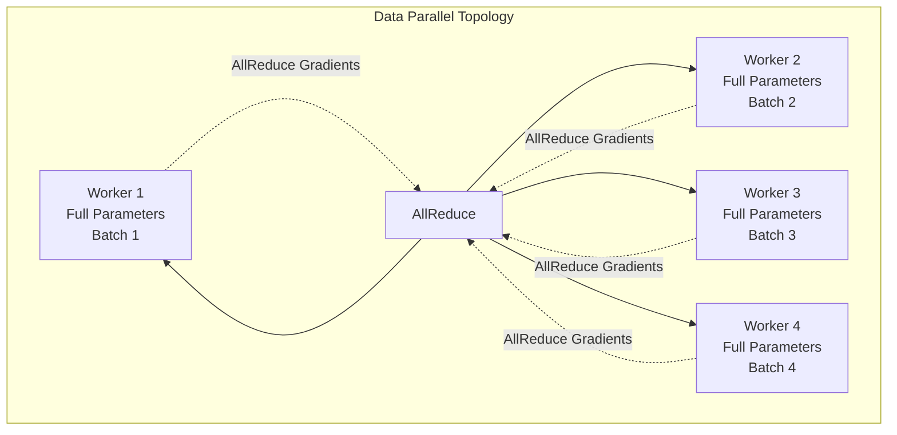
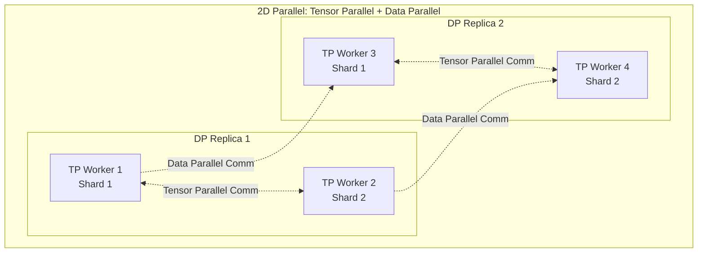
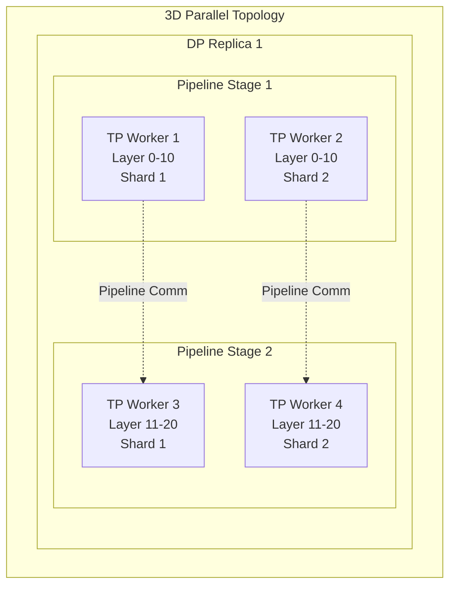
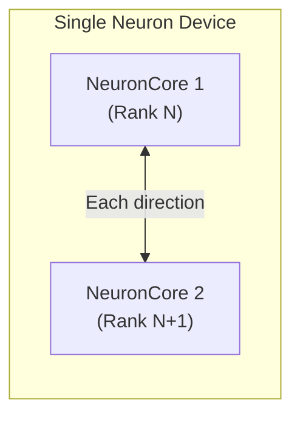
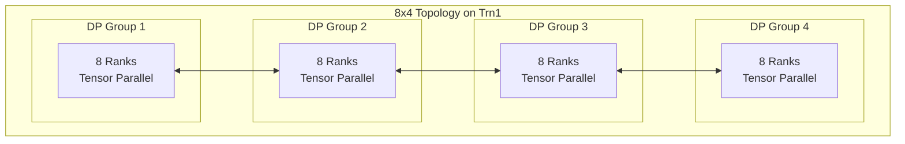
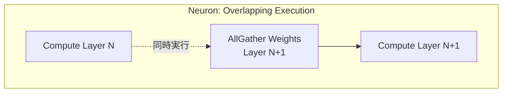
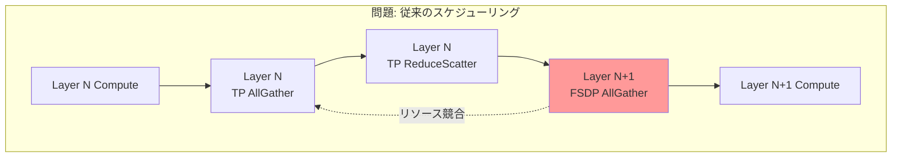
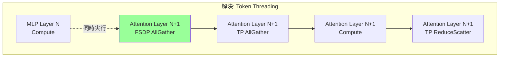

# はじめに

大規模な機械学習モデルの学習や推論において、複数のアクセラレータ間でのデータ交換は避けて通れません。AWS Trainium や AWS Inferentia を用いた分散ワークロードでは、Collective Communication (CC) がその中核を担っています。

本記事では、AWS Neuron における Collective Communication の仕組みを公式ドキュメントをもとに解説します。

## 本記事の対象読者

本記事は以下のような方を対象としています。

- 分散学習の基礎知識（Data Parallel、Tensor Parallel など）を持つエンジニア
- AWS Neuron の基本的な使い方を理解している方
- 大規模な学習や推論ワークロードで AWS Neuron の Collective Communication について知りたい方

# Collective Communication とは

> [What is Neuron Collective Communication?](https://awsdocs-neuron.readthedocs-hosted.com/en/latest/neuron-runtime/about/collectives.html)

Collective Communication とは、分散システムにおいて複数のプロセスがグループで協調してデータを交換する通信プリミティブの総称です。現代の機械学習フレームワークでは、勾配の集約、パラメータの共有、計算の同期などに広く使用されています。

AWS Neuron では、各 NeuronCore が 1 つのランク（ワーカー）として動作します。重要な点として、NVIDIA GPU とは異なり、AWS Neuron アーキテクチャでは 1 つの Neuron デバイスに複数の NeuronCore が含まれており、各 NeuronCore が独立したランクとして機能します。

例えば、trn1.32xlarge インスタンスは 16 個の Neuron デバイスを搭載していますが、各デバイスには 2 個の NeuronCore が含まれているため、合計 32 ランクとして動作します。

## Collective Communication の主要演算子

AWS Neuron がサポートする主要な CC 演算子は以下の通りです（[公式ドキュメント](https://awsdocs-neuron.readthedocs-hosted.com/en/latest/neuron-runtime/about/collectives.html)）。

**AllGather**: 各ランクが自身のテンソルを共有し、全ランクから集約されたテンソルをランクインデックス順に受け取ります。


**ReduceScatter**: 入力データに対して削減演算（sum、min、max など）を実行し、各ランクがランクインデックスに基づいて等分割された結果ブロックを受け取ります。


**AllReduce**: データに対して削減演算を実行し、結果を全ランクの出力バッファに格納します。


**All-to-All**: 各ランクが異なるデータを他の全ランクに送信し、異なるデータを受信します。分散トランスポーズのような動作を実現します。


**Send & Receive**: ポイントツーポイント通信で、特定のランク間でデータを直接送受信します。

# 並列化トポロジーの基礎

Collective Communication を理解するには、まず分散学習における並列化トポロジーを理解する必要があります。

## Data Parallel

Data Parallel は、モデルの全パラメータが 1 つのワーカーのメモリに収まる場合に使用されます。



各ワーカーは完全なパラメータセットを保持し、それぞれが異なるデータバッチで勾配を計算します。計算された勾配は AllReduce を通じて集約され、各ワーカーが統合された勾配を自身のパラメータコピーに適用します。

## Tensor/Data Parallel (2D Parallel)

モデルが大きくなり、パラメータが1つのワーカーのメモリに収まらない場合、Tensor Parallel を使用してパラメータをシャード化します。



Tensor Parallel 次元では、各ワーカーがパラメータのシャードのみを操作します。高速化のため、TP ワーカーセットは Data Parallel 次元で複製されます。Data Parallel 次元では、シャード化された勾配のみが AllReduce され適用されます。

## Tensor/Pipeline/Data Parallel (3D Parallel)

大規模モデルの学習には 3D Parallel が使用されます。



モデルは Pipeline Parallel 次元でレイヤー単位にスライスされ、各レイヤーは Tensor Parallel 次元でシャード化されます。この TP/PP ワーカーセットが Data Parallel 次元で複製されます。

# Neuron デバイスの内部接続(Trn1 例)

各 Neuron デバイスには 2 つの NeuronCore が含まれており、これらは専用インターコネクトで接続されています。

:::message
この構成は Trn1 の世代での例です。第 1 世代の AWS Inferentia (Inf1) では、デバイスあたり 4 つの NeuronCore-v1 が含まれており、異なるアーキテクチャを採用しています。
:::



この構成により、1 つの Neuron デバイス上で 2 ランクの CC を実行できます。例えば、1 つの Neuron デバイスを持つインスタンスは 2 ランクを実行可能です。

# 世代別アーキテクチャ詳解

ここからは、各世代における Collective Communication のアーキテクチャを詳しく見ていきます。

## Trn1 (Trainium1): 2D トーラスの基本

> [Amazon EC2 Trn1/Trn1n Architecture](https://awsdocs-neuron.readthedocs-hosted.com/en/latest/about-neuron/arch/neuron-hardware/trn1-arch.html)

Trainium1 は AWS の最初の機械学習専用トレーニングチップです。trn1.32xlarge インスタンスは 16 個の Neuron デバイス（= 32 NeuronCore = 32 ランク）を搭載しています。

### 接続トポロジー

trn1.32xlarge インスタンスでは、16個のNeuron デバイスが NeuronLink-v2 を使用して 2D トーラストポロジーで接続されています（[Trn1 アーキテクチャドキュメント](https://awsdocs-neuron.readthedocs-hosted.com/en/latest/about-neuron/arch/neuron-hardware/trn1-arch.html)）。


### トポロジー例

2D トーラストポロジーは、全 32 ランクを接続する 2 つの重複しないパスを提供します。Trn1 でサポートされる主要な構成は以下の通りです。

**32 ランク構成**: 1 つの Tensor Parallel ノードとして使用されます。

**8x4 構成**: 8 ランクの Tensor Parallel 次元と 4 ランクの Data Parallel 次元を持ち、小規模なトレーニングに使用されます。



## Inf2 (Inferentia2): リング/チェーントポロジー

> [Inferentia2 Architecture](https://awsdocs-neuron.readthedocs-hosted.com/en/latest/about-neuron/arch/neuron-hardware/inferentia2.html)

Inferentia2 は推論に特化した AWS の第 2 世代チップです。

### inf2.48xlarge: リングトポロジー

inf2.48xlarge では、全デバイスがリング状に接続されます（[Inf2 アーキテクチャドキュメント](https://awsdocs-neuron.readthedocs-hosted.com/en/latest/general/arch/neuron-hardware/inferentia2.html)）。


### その他の Inf2 インスタンスサイズ: チェーントポロジー

inf2.48xlarge 以外のインスタンスサイズでは、デバイスはチェーン状に接続されます。

### 複数ランクセットの実行とパフォーマンス影響

Inf2 では複数のランクセットを実行することが可能です。例えば、inf2.48xlarge では 3 セットの 8 ランクを実行できます。ただし、これは 8x3 構成（8 ランクの TP × 3 ランクの DP）とは本質的に異なります。

各セットが単一の Neuron デバイス内（2ランク）で完結する場合と、複数デバイスにまたがる場合では、通信パターンが異なります。公式ドキュメントによると、24 ランク（フルインスタンス）以外のランク数を使用する場合、リングの全性能が活用されません。リングトポロジーを複数の独立したランクセットに分割すると、各セット間に直接接続がないため、セット間通信が制限される可能性があります。

したがって、inf2.48xlarge で 3 セットの 8 ランクを実行する場合、実質的には 8 ランクの Tensor Parallel 実行用にコンパイルされたモデルの 3 つの独立したコピーを並行実行することになります。

## Trn2 (Trainium2): 3D トーラスへの進化

> [Amazon EC2 Trn2 Architecture](https://awsdocs-neuron.readthedocs-hosted.com/en/latest/about-neuron/arch/neuron-hardware/trn2-arch.html)

Trainium2 は AWS の第 3 世代機械学習チップで、大幅な性能向上を実現しています（[Trn2 アーキテクチャドキュメント](https://awsdocs-neuron.readthedocs-hosted.com/en/latest/general/arch/neuron-hardware/trn2-arch.html)）。

### Logical NeuronCore Configuration (LNC)

Trainium2 から、AWS Neuron は Logical NeuronCore Configuration (LNC) をサポートします。これにより、複数の物理 NeuronCore の計算とメモリリソースを 1 つの論理 NeuronCore に統合できます。

- **LNC=1**: 各 NeuronCore が独立したランクとして動作（8 NeuronCore = 8 ランク/チップ）
- **LNC=2**: 2 つの NeuronCore を 1 つの論理ランクに統合（8 NeuronCore = 4 ランク/チップ）

:::message alert
**重要**: LNC は Trainium2 における重要な進化です。LNC 設定により NeuronCore を分割（LNC=1）しても統合（LNC=2）しても、ワークロードに最適な構成を柔軟に選択できます。これにより、Tensor Parallel の粒度を調整でき、より効率的な分散学習が可能になります。

Inf2 でリングを分割すると独立したセット間の通信が制限される可能性があるのに対し、Trn2 の LNC は単一チップ内で論理的にランク数を制御するため、トポロジー全体の接続性を損なうことなく柔軟な構成が可能です。
:::

### trn2.48xlarge: 2D トーラス

trn2.48xlarge インスタンスは 16 個の Trainium2 チップを搭載し、4x4 の 2D トーラストポロジーで接続されています。


LNC=2 の場合、64 ランク（16 チップ × 4 ランク/チップ）、LNC=1 の場合は 128 ランク（16 チップ × 8 ランク/チップ）として動作します。

### Trn2 UltraServer: 3D トーラス

Trn2 UltraServer は 4 つの trn2u.48xlarge インスタンスを NeuronLink-v3 で接続し、合計 64 個の Trainium2 チップを提供します。


同じ座標を持つ Trainium2 チップが Z 次元でリングトポロジーに接続され、4x4x4 の 3D トーラスを形成します。これにより、Tensor Parallel や Activation Sharding を全体のスケールアップドメイン全体で実行できます。

## Trn3 (Trainium3): All-to-All スイッチファブリックへの転換

> [Amazon EC2 Trn3 Architecture](https://awsdocs-neuron.readthedocs-hosted.com/en/latest/about-neuron/arch/neuron-hardware/trn3-arch.html)

Trainium3 は AWS の第 4 世代 AI チップです（[Trn3 アーキテクチャドキュメント](https://awsdocs-neuron.readthedocs-hosted.com/en/latest/about-neuron/arch/neuron-hardware/trn3-arch.html)）。最も重要な変更は、トーラストポロジーから All-to-All スイッチファブリックへの移行です。

### なぜスイッチファブリックに移行したのか

Trn2 までは 2D/3D トーラスメッシュトポロジーを使用していましたが、Trn3 ではスイッチベースのファブリックに移行しました。これは Mixture of Experts (MoE) モデルアーキテクチャや自己回帰推論サービスに対する最適なパフォーマンスとコスト効率に特に最適化されています。

MoE モデルでは、各トークンが複数のエキスパートのうち最大数個にのみルーティングされるため、All-to-All 通信パターンが多用されます。スイッチトポロジーはこのような通信パターンに対して優れた絶対パフォーマンスとコスト効率を提供します。

### Trn3 Gen1 UltraServer: 64 チップ構成

Trn3 Gen1 UltraServer は 64 個の Trainium3 デバイスを搭載します。これは物理的には 16 サーバーで構成され、各サーバーに 4 つの Trainium3 デバイスが搭載されています。

デバイスは NeuronSwitch-v1 を使用した All-to-All トポロジーで接続されます。サーバー内のデバイスは第 1 レベルの NeuronSwitch-v1 で接続され、サーバー間のデバイスは第 2 レベルの NeuronSwitch-v1 と NeuronLink-v4 で接続されます。

### Trn3 Gen2 UltraServer: 144 チップ構成

Trn3 Gen2 UltraServer はさらに規模を拡大し、144 個の Trainium3 デバイスを提供します。これは 36 サーバーで構成され、各サーバーに 4 つの Trainium3 デバイスが搭載されています。

Gen2 でも Gen1 と同様に NeuronSwitch-v1 を使用した All-to-All トポロジーが採用されており、チップ密度は Trn2 の 2 倍以上となっています。


:::message
上図は Trn3 UltraServer のトポロジーを示しています。Gen1 と Gen2 は同様のアーキテクチャを採用していますが、Gen2 ではチップ数が 144 個に拡大されています。
:::

この All-to-All 接続により、MoE モデルの All-to-All 通信パターンが最適化されます。

### Trn3 の進化ポイント

Trn3 における最も重要な進化は、Trn2 の 3D トーラスから All-to-All スイッチファブリック（NeuronSwitch-v1）への移行です。この変更により、MoE モデルなどの最新アーキテクチャに必要な All-to-All 通信パターンに対する最適なパフォーマンスを実現しています。

NeuronSwitch-v1 は階層的なスイッチアーキテクチャを採用しており、サーバー内デバイスを接続する第 1 レベルスイッチと、サーバー間デバイスを接続する第 2 レベルスイッチで構成されています。この設計により、大規模な Trainium3 クラスタでも効率的な All-to-All 接続が可能になります。

## 世代別比較表

ここまで見てきた各世代の主要な違いをまとめます。

| 項目 | Trn1 | Inf2 | Trn2 | Trn3 |
|------|------|------|------|------|
| **トポロジー** | 2D トーラス | リング/チェーン | 2D/3D トーラス | All-to-All スイッチ |
| **インターコネクト** | NeuronLink-v2 | NeuronLink-v2 | NeuronLink-v3 | NeuronLink-v4 |
| **チップ間帯域幅** | 高帯域幅 | リング/チェーン構成 | 1,024 GB/s | 2,048 GiB/s |
| **最大スケールアップ** | 32 ランク | 24 ランク | 64 チップ<br/>(UltraServer) | 144 チップ<br/>(Gen2) |
| **NeuronCore/チップ** | 2 | 2 | 8 | 8 |
| **CC-Cores/チップ** | 6 | - | 16 | 16 |
| **主な用途** | 学習 | 推論 | 大規模学習/推論 | 超大規模学習/推論<br/>MoE 最適化 |

# Neuron における CC 実行の特徴

Neuron での Collective Communication は、いくつかの点で NVIDIA の NCCL とは異なる設計を採用しています（[Collective Communication ドキュメント](https://awsdocs-neuron.readthedocs-hosted.com/en/latest/general/arch/neuron-features/collective-communication.html)）。

主な違いは以下の通りです：

1. **複数パッケージ構成**: NCCL が単一ライブラリであるのに対し、Neuron は 3 つの個別パッケージ（runtime-lib、collectives、efa_installer）で構成されています
2. **プレースホルダー方式**: CC 操作はコンパイル時にプレースホルダー命令となり、ロード時にトポロジーに応じた実際の命令に置き換えられます
3. **専用ハードウェア**: 専用の CC-Cores と DMA エンジンにより、計算と通信の同時実行が可能です

## 必要なソフトウェアパッケージ

Neuron での Collective Communication サポートには、以下の 3 つの個別パッケージのインストールが必要です（[Collective Communication ドキュメント](https://awsdocs-neuron.readthedocs-hosted.com/en/latest/general/arch/neuron-features/collective-communication.html)）。

:::message
これらのパッケージは、[Neuron Deep Learning AMI (DLAMI)](https://awsdocs-neuron.readthedocs-hosted.com/en/latest/dlami/index.html) および [Neuron Deep Learning Containers (DLC)](https://awsdocs-neuron.readthedocs-hosted.com/en/latest/containers/locate-neuron-dlc-image.html) に事前インストールされています。DLAMI や DLC を使用することで、環境構築を簡単に開始できます。各 DLAMI には Neuron ドライバー、コンパイラ、ランタイムを含む全ての Neuron ライブラリが含まれており、すぐに使用できる状態になっています。
:::

### 1. aws-neuronx-runtime-lib

Neuron デバイスでの実行をサポートする基盤ライブラリです（[NeuronX Runtime ドキュメント](https://awsdocs-neuron.readthedocs-hosted.com/en/latest/neuron-runtime/)）。Collective Communication に固有のものではなく、Neuron を使用する際には常に必要となります。Neuron デバイスへのアクセス、メモリ管理、実行制御などの基本機能を提供します。

### 2. aws-neuronx-collectives

Collective Communication 実行を担当するコアライブラリです。単一インスタンス内および複数インスタンス間での CC 操作の実行をサポートします。このライブラリは以下を担当します：

- CC 操作のアルゴリズム実装（all-reduce、all-gather、reduce-scatter など）
- ランク間の同期とデータ交換の調整
- NeuronLink を使用したインスタンス内通信
- EFA を使用したインスタンス間通信

セットアップ方法については、[PyTorch Neuron Setup Guide](https://awsdocs-neuron.readthedocs-hosted.com/en/latest/frameworks/torch/torch-neuronx/setup/pytorch-install.html) や [JAX NeuronX Setup Guide](https://awsdocs-neuron.readthedocs-hosted.com/en/latest/frameworks/jax/setup/jax-setup.html) を参照してください。

### 3. efa_installer

複数インスタンスでの CC 実行をサポートするために必要な低レベルライブラリとドライバーです。EFA (Elastic Fabric Adapter) 経由での CC 実行を可能にします。単一インスタンス内での CC のみを使用する場合は不要ですが、マルチノードの分散学習には必須です。

EFA のセットアップについては、各フレームワークのマルチインスタンス学習ガイドを参照してください。

## Compute-Communication Overlap

NVIDIA とは異なり、Neuron は CC オペレーションを計算と同時実行できるという重要な利点があります。この機能は **Neuron Compiler レベルでサポート**されています（[Compute-Communication Overlap ドキュメント](https://awsdocs-neuron.readthedocs-hosted.com/en/latest/neuron-runtime/explore/compute-comm-overlap.html)）。



[FSDP(Fully Sharded Data Parallel)](https://docs.pytorch.org/tutorials/intermediate/FSDP_tutorial.html) フローの例を考えてみましょう。レイヤー N+1 の重みの AllGather は、レイヤー N の計算と同時に実行でき、大幅なパフォーマンス向上をもたらします。


> Fig. 10 Image that shows how FSDP-AG operations for Attention layers successfully overlap with computation in preceding MLP layers.

### アーキテクチャの仕組み

AWS Trainium の SoC (System-on-Chip) アーキテクチャでは、CC 操作は計算エンジンから独立して実行されます。各 Neuron チップ内の計算エンジンは明示的な通信命令を実行しません。代わりに、非同期的に CC Core を起動し、CC 操作が完了したら完了シグナルを取得します。

Neuron Compiler は、NEFF 内の各 CC 操作に対して疑似命令（PseudoTriggerCollective2 または PTC2）を生成します。NEFF がロードされると、Neuron Runtime はこれらの疑似命令を CC Core をトリガーする Write 命令に変換します。同時に、ランタイムは制御パスの CC プログラムと、CC 操作のデータパスを確立する事前構築された DMA リングをロードします。

この非同期実行パラダイムにより、計算と通信プロセスの本質的なオーバーラップが可能になり、計算が通信結果から独立して進行できるシナリオでスループットが向上します。

## 専用 CC-Cores と DMA エンジン

Neuron の CC 操作は、専用の CC-Cores と DMA エンジンによって実装されています（[Compute-Communication Overlap ドキュメント](https://awsdocs-neuron.readthedocs-hosted.com/en/latest/neuron-runtime/explore/compute-comm-overlap.html)）。

### 専用 CC-Cores

各 Trainium チップには複数の CC-Cores（Trn1: 6 個、Trn2/Trn3: 16 個）が搭載されており、これらは Collective Communication の調整を専門に担当する同期プロセッサです。CC-Cores は、データ移動エンジンがデータを転送するタイミングと方法を制御し、Collective アルゴリズムの各ステップが正しい順序で実行されることを保証します。

### DMA エンジンと共有リソース

DMA エンジンは、CPU を介さずにメモリ間でデータを直接転送するハードウェアです。機械学習では、テンソルデータを HBM（High Bandwidth Memory）から計算エンジンに転送したり、通信用にデータを準備したりする際に使用されます。CPU を介さないため高速ですが、複数の処理から同時に使用されるとリソース競合が発生します。

DMA エンジンは、計算サブシステムと通信サブシステム間で共有されるリソースです。この競合により、HBM と Scratchpad Buffer（SBUF）間の DMA トランザクションの遅延が発生し、計算操作のスループットが低下する可能性があります。これは、計算エンジンの入力テンソルのロードと出力テンソルのオフロードの両方に影響します。通信操作も、DMA エンジンリソースの時分割共有により、パフォーマンス低下を受ける可能性があります。実世界のアプリケーションでシステムパフォーマンスを最大化するためには、最適な DMA 優先順位付け戦略の実装が重要です。

Neuron は、静的 DMA 優先度調整や Token Threading for FSDP などの最適化手法を提供し、この競合を緩和しています。（後述します）

# Compute-Communication Overlap の最適化手法

Compute-Communication Overlap を最大限に活用するため、Neuron は複数の最適化手法を提供しています（[Compute-Communication Overlap ドキュメント](https://awsdocs-neuron.readthedocs-hosted.com/en/latest/neuron-runtime/explore/compute-comm-overlap.html)）。

## Token Threading for FSDP

Token Threading for FSDP は、FSDP (Fully Sharded Data Parallel) の CC 操作を最適にオーバーラップさせるための実験的な機能です。

### 背景と課題

大規模な言語モデルのトレーニングでは、モデルが大きすぎて単一のワーカーのメモリに収まらないため、**Tensor Parallelism (TP) と FSDP (Fully Sharded Data Parallel) を組み合わせて使用**します。この組み合わせでは、各ネットワークレイヤーで以下の通信が必要になります：

- **TP AllGather**: Tensor Parallel では各ワーカーが入力データの一部のみを持っています。行列乗算を実行する前に、全ワーカーから入力データの断片を集めて完全な入力を再構成する必要があります
- **TP ReduceScatter**: 行列乗算の結果を全ワーカーから集めて合計し、再び各ワーカーに分散して配布します
- **FSDP AllGather**: FSDP では各ワーカーがモデルパラメータの一部のみを保持しています。レイヤーを実行する前に、全ワーカーからパラメータの断片を集めて完全なレイヤーのパラメータを再構成します
- **FSDP ReduceScatter**: Backword 時に各ワーカーで計算された勾配を集約し、各ワーカーが担当するパラメータ部分の勾配のみを保持するよう分散します

従来のスケジューリングでは、FSDP AllGather が TP 通信とリソース競合を起こす問題がありました。



現在のデフォルト設定の Neuron Compiler の自動スケジューリングでは、FSDP AllGather 操作をできるだけ早いタイミングでまとめて実行しようとします。しかし、この方式では重要な TP 通信操作とのリソース競合を引き起こし、全体のパフォーマンス低下を招きます。

### Token Threading の仕組み

Token Threading for FSDP は、CC 操作の実行順序を賢く制御することで、リソース競合を回避します。この機能は環境変数で有効化できます：

- JAX フレームワーク: `NEURON_FSDP=1`
- NeuronX Distributed (NxD): `NEURON_NXD_FSDP_CC_MULTISTREAM=1`

**Token Threading の概念**

Token Threading は、**DMA エンジンのリソース競合によるパフォーマンス低下を回避するための順序制御メカニズム**です。TP 通信と FSDP 通信の両方が同じ DMA リソースを必要とする場合、リソース競合が発生し、全体のスループットが低下します。

公式ドキュメントによると、Token Threading は以下のように動作します（[Compute-Communication Overlap ドキュメント](https://awsdocs-neuron.readthedocs-hosted.com/en/latest/neuron-runtime/explore/compute-comm-overlap.html)）：

> "This mechanism uses a specialized Neuron PJRT compiler pass to identify operation patterns spanning TP and FSDP dimensions. It enforces precise execution ordering between CC operations by establishing synthetic data dependencies using a daisy-chain configuration of token tensors. Each token is a single-element tensor serving as a synchronization mechanism."

**分かりやすく解釈すると：**

Token Threading は「トークン」と呼ばれる小さなダミーデータ（単一要素のテンソル）を使って、CC 操作の実行順序を制御する仕組みです。

複数のレイヤーがある場合、各レイヤーの FSDP AllGather が以下のように連鎖的に実行されます：

1. **Layer 1 の FSDP AllGather が実行完了** → Token1 を出力
2. **Layer 2 の FSDP AllGather は Token1 が来るまで待機**
3. **Token1 が到着** → Layer 2 の FSDP AllGather が実行開始
4. **Layer 2 の FSDP AllGather が実行完了** → Token2 を出力
5. **Layer 3 の FSDP AllGather は Token2 が来るまで待機**
6. **Token2 が到着** → Layer 3 の FSDP AllGather が実行開始
7. ...この連鎖が続く

このように、トークンが次々と受け渡されることで、CC 操作が数珠つなぎ（デイジーチェーン）のように順番に実行されます。トークン自体は実際のモデルデータではなく、単なる同期用のダミーデータです。

**なぜこれが必要なのか？**: デイジーチェーン構成により、各レイヤーの FSDP AllGather が前のレイヤーの計算中にプリフェッチされるよう、適切なタイミングで実行されると想定されます。これにより、TP 通信と FSDP 通信が同時に実行されてリソース競合を起こすことを防ぎます。

Neuron PJRT Compiler Pass が TP と FSDP 次元にまたがる操作パターンを自動的に識別し、適切なトークン受け渡し順序を決定します。開発者が手動で順序を指定する必要はありません。

具体的には、各レイヤーの計算と次のレイヤーの FSDP AllGather が重なるように、レイヤーの順番に沿ってトークンが受け渡されるようコンパイラが最適化します。

:::message
**注意**: トークンの受け渡し順序の具体的な決定方法や、トークンが実行時にどのように処理されるか（例: 最適化により削除されるか）については、元のドキュメントに明記されていません。上記の解釈は、公式ドキュメントの記述と一般的な同期メカニズムの知識に基づく推測を含みます。
:::

**何が改善されるのか？**

Token Threading により、FSDP AllGather のタイミングが最適化されます。上図（緑色部分）を見てください：



**MLP Layer N の計算中**に、**次の Attention Layer N+1 の FSDP AllGather が並行して実行**されます。これにより、MLP の計算が終わった時点で、Attention レイヤーのパラメータはすでに準備完了しています。TP 通信（TP AllGather/ReduceScatter）とは時間的に重ならないため、リソース競合が発生しません。結果として、アイドル時間が削減され、全体の学習速度が向上します

:::message
Token Threading for FSDP は実験的な機能であり、特定のワークロードでのみ有効化することが推奨されます。環境変数を使用して簡単に有効/無効を切り替えられるため、実際のワークロードでパフォーマンステストを行うことをお勧めします。
:::

## 静的 DMA 優先度調整

DMA エンジンは計算と通信で共有されるため、リソース競合が発生する可能性があります。

静的 DMA 優先度調整により、ワークロードの特性に応じて DMA リソースの割り当てを調整できます。計算集約型ワークロード（計算が多く通信が少ない）と通信集約型ワークロード（通信が多い）のバランスを取り、全体のスループットを最適化します。この最適化は、計算集約型ワークロードと通信集約型ワークロードのバランスを取るのに役立ちます。

# 構成検証!

実際に Trn1 インスタンス上で Collective Communication の構成を確認する方法を紹介します。AWS Neuron SDK には、CC の構成やパフォーマンスを確認するための便利なツールが含まれています。

## neuron-ls: トポロジーの確認

`neuron-ls` コマンドは、インスタンス内の Neuron デバイスの構成と接続を確認するための基本ツールです（[neuron-ls ユーザーガイド](https://awsdocs-neuron.readthedocs-hosted.com/en/latest/tools/neuron-sys-tools/neuron-ls.html)）。

### 基本的な使用方法

```bash
# デバイス一覧を表示
coder:/work/data-science$ neuron-ls
instance-type: trn1.2xlarge
instance-id: i-00c0ad05755f9a899
+--------+--------+----------+--------+--------------+----------+------+
| NEURON | NEURON |  NEURON  | NEURON |     PCI      |   CPU    | NUMA |
| DEVICE | CORES  | CORE IDS | MEMORY |     BDF      | AFFINITY | NODE |
+--------+--------+----------+--------+--------------+----------+------+
| 0      | 2      | 0-1      | 32 GB  | 0000:00:1e.0 | 0-7      | -1   |
+--------+--------+----------+--------+--------------+----------+------+

# トポロジー情報を詳細表示
neuron-ls --topology
instance-type: trn1.2xlarge
instance-id: i-00c0ad05755f9a899
+--------+--------+----------+--------+--------------+----------+------+
| NEURON | NEURON |  NEURON  | NEURON |     PCI      |   CPU    | NUMA |
| DEVICE | CORES  | CORE IDS | MEMORY |     BDF      | AFFINITY | NODE |
+--------+--------+----------+--------+--------------+----------+------+
| 0      | 2      | 0-1      | 32 GB  | 0000:00:1e.0 | 0-7      | -1   |
+--------+--------+----------+--------+--------------+----------+------+


Neuron Device Topology
             
             
             
    [ 0 ]
```

## nccom-test: CC パフォーマンスの測定

`nccom-test` は Collective Communication のパフォーマンスをベンチマークするツールです（[nccom-test ユーザーガイド](https://awsdocs-neuron.readthedocs-hosted.com/en/latest/tools/neuron-sys-tools/nccom-test.html)）。

### 環境の簡易検証

最も簡単な 2 ランクの All-Reduce テストで環境が正常に動作するか確認できます。

```bash
$ nccom-test -r 2 allr
     size(B)    count(elems)     type    time:avg(us)    algbw(GB/s)    busbw(GB/s)
    33554432        33554432    uint8          719.08          46.66          46.66
Avg bus bandwidth:      46.6633GB/s
```

正常に実行されれば、上記のような出力が得られます。問題がある場合は、エラーメッセージとログファイルの場所が表示されます。

### 様々なサイズでのベンチマーク

1 KB から 1 GB まで、4 倍ずつサイズを増やしてテストします。

```bash
$ nccom-test -r 2 --minbytes 1kb --maxbytes 1gb --stepfactor 4 --datatype bf16 allr
       size(B)    count(elems)    type    time:avg(us)    algbw(GB/s)    busbw(GB/s)
          1024             512    bf16             2.1           0.49           0.49
          4096            2048    bf16             2.1           1.95           1.95
         16384            8192    bf16             2.1           7.80           7.80
         65536           32768    bf16             3.5          18.72          18.72
        262144          131072    bf16            7.03          37.32          37.32
       1048576          524288    bf16           18.62          56.30          56.30
       4194304         2097152    bf16           65.83          63.72          63.72
      16777216         8388608    bf16          295.75          56.73          56.73
      67108864        33554432    bf16         1170.67          57.32          57.32
     268435456       134217728    bf16         4705.88          57.04          57.04
    1073741824       536870912    bf16        18891.33          56.84          56.84
Avg bus bandwidth:      37.6574GB/s
```

### 正確性チェック付きテスト

`--check` オプションを使用すると、CC 演算の正確性を検証できます。

```bash
$ nccom-test -r 32 --minbytes 1kb --maxbytes 1mb --stepfactor 8 --datatype fp32 --check allg
size(B)  count(elems) type  time(us) algbw(GB/s) busbw(GB/s)
1024     256          fp32  151      0.01        0.01
8192     2048         fp32  149      0.05        0.05
65536    16384        fp32  150      0.41        0.39
524288   131072       fp32  179      2.73        2.64
Avg bus bandwidth: 0.7731GB/s
```

### サポートされる CC 演算子

`nccom-test` は以下の CC 演算子をサポートしています。

```bash
# All-Reduce
nccom-test -r 32 allr

# All-Gather
nccom-test -r 32 allg

# Reduce-Scatter
nccom-test -r 32 redsct

# All-to-All
nccom-test -r 32 alltoall

# Send-Receive
nccom-test -r 32 sendrecv
```

### 結果の JSON 出力

ベンチマーク結果を JSON 形式で保存できます。

```bash
$ nccom-test -r 2 allr --report-to-json-file results.json
size(B)   count(elems) type   time(us) algbw(GB/s) busbw(GB/s)
33554432  33554432     uint8  1450     21.55       20.90
Avg bus bandwidth: 20.9047GB/s

cat results.json | jq
{
  "results": [
    {
      "size(B)": 33554432,
      "count(elems)": 33554432,
      "type": "uint8",
      "algbw(GB/s)": 46.806531124673064,
      "busbw(GB/s)": 46.806531124673064,
      "time:avg(us)": 716.88
    }
  ]
}
```

これらのツールを使用することで、Neuron インスタンス上での Collective Communication の構成と性能を詳細に把握できます。実際の分散学習ワークロードを実行する前に、これらの確認を行うことで、潜在的な問題を早期に発見できます。

# まとめ

本記事では、AWS Neuron における Collective Communication の仕組みと、各世代のアーキテクチャの進化について詳しく見てきました。**Let's try AWS Neuron!**

# 参考文献

**collective Communication**

- [What is Neuron Collective Communication? — AWS Neuron Documentation](https://awsdocs-neuron.readthedocs-hosted.com/en/latest/neuron-runtime/about/collectives.html)
- [Neuron Collective Communication — AWS Neuron Documentation](https://awsdocs-neuron.readthedocs-hosted.com/en/latest/general/arch/neuron-features/collective-communication.html)
- [Compute-Communication Overlap in Neuron — AWS Neuron Documentation](https://awsdocs-neuron.readthedocs-hosted.com/en/latest/neuron-runtime/explore/compute-comm-overlap.html)

**PyTorch Native 対応**

- [Native PyTorch for AWS Trainium — AWS Neuron Documentation](https://awsdocs-neuron.readthedocs-hosted.com/en/latest/frameworks/torch/pytorch-native-overview.html)

**アーキテクチャ**

- [Amazon EC2 Trn1/Trn1n Architecture — AWS Neuron Documentation](https://awsdocs-neuron.readthedocs-hosted.com/en/latest/about-neuron/arch/neuron-hardware/trn1-arch.html)
- [Amazon EC2 Trn2 Architecture — AWS Neuron Documentation](https://awsdocs-neuron.readthedocs-hosted.com/en/latest/general/arch/neuron-hardware/trn2-arch.html)
- [Amazon EC2 Trn3 Architecture — AWS Neuron Documentation](https://awsdocs-neuron.readthedocs-hosted.com/en/latest/about-neuron/arch/neuron-hardware/trn3-arch.html)
- [Inferentia2 Architecture — AWS Neuron Documentation](https://awsdocs-neuron.readthedocs-hosted.com/en/latest/general/arch/neuron-hardware/inferentia2.html)

**インスタンスタイプ**

- [Amazon EC2 Trn3 Instances](https://aws.amazon.com/ec2/instance-types/trn3/)
- [Amazon EC2 Trn2 Instances](https://aws.amazon.com/ec2/instance-types/trn2/)
- [Amazon EC2 Inf2 Instances](https://aws.amazon.com/ec2/instance-types/inf2/)

**ツール**

- [Neuron LS User Guide — AWS Neuron Documentation](https://awsdocs-neuron.readthedocs-hosted.com/en/latest/tools/neuron-sys-tools/neuron-ls.html)
- [NCCOM-TEST User Guide — AWS Neuron Documentation](https://awsdocs-neuron.readthedocs-hosted.com/en/latest/tools/neuron-sys-tools/nccom-test.html)
