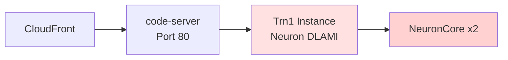

# はじめに

AWS Trainium は機械学習ワークロードに特化したカスタムチップで、コスト効率の高い学習・推論環境を提供します。しかし、Amazon SageMaker Studio の Code Editor では Trainium インスタンス（Trn1、Inf2）を選択することができません。本記事では、AWS CloudFormation を使用して Trainium インスタンス上に Code Server 検証環境を構築する方法を紹介します。本格的な推論や学習を実施する前に軽く挙動を確認したいような場合に便利だと思います。

**GitHub リポジトリ:**
https://github.com/littlemex/samples/tree/main/aws-neuron/torch-neuron/multi-framework-dlami-ubuntu22

## アーキテクチャ



主要コンポーネント：

- **Trn1 インスタンス**: Neuron Multi-Framework DLAMI を使用
- **code-server**: ブラウザベースの VS Code 環境
- **CloudFront**: セキュアなアクセス提供
- **SSM**: セキュアなインスタンス管理

## Neuron DLAMI の活用

[Neuron Deep Learning AMI（DLAMI）](https://awsdocs-neuron.readthedocs-hosted.com/en/latest/dlami/index.html)は、Neuron SDK がプリインストールされた AMI です。Ubuntu 22.04 の Multi-Framework DLAMI には、一例として以下の仮想環境が含まれています：

- **PyTorch 2.8 TorchNeuronX**: `/opt/aws_neuronx_venv_pytorch_2_8`
- **JAX 0.7 NeuronX**: `/opt/aws_neuronx_venv_jax_0_7`

これらの環境は、Neuron ドライバ、ランタイム、コンパイラがすべて含まれており、すぐに使用できます。

参照: [Get Started with Neuron on Ubuntu 22 with DLAMI](https://awsdocs-neuron.readthedocs-hosted.com/en/latest/setup/neuron-setup/multiframework/multi-framework-ubuntu22-neuron-dlami.html)

# デプロイ方法

## 前提条件

- AWS CLI が設定済みであること
- 適切な IAM 権限があること

## デプロイ手順

```bash
# リポジトリのクローン
git clone https://github.com/littlemex/samples.git
cd aws-neuron/torch-neuronx/multi-framework-dlami-ubuntu22

# CloudFormation スタックのデプロイ
./cfn_manager.sh create
```

デプロイが完了すると、CloudFormation の Outputs に code-server の URL とパスワードが表示されます。

## 使用方法

インスタンス起動後、以下のコマンドで Neuron 環境をアクティベートできます：

```bash
# PyTorch NeuronX 環境のアクティベート
source /opt/aws_neuronx_venv_pytorch_2_8/bin/activate

# または alias を使用（.bashrc に設定済み）
neuron-activate
```

# まとめ

CloudFormation を使用することで、Neuron DLAMI ベースの開発環境を簡単に構築できます。DLAMI には PyTorch、JAX、vLLM など複数のフレームワークがプリインストールされており、すぐに開発を開始できます。次の学習ステップとしては、以下の Karakuri の AWS Trainium 50 本ノックがおすすめです。

https://zenn.dev/karakuri_blog/articles/77d93c40b27b60

## 参考リンク

- [Neuron DLAMI User Guide](https://awsdocs-neuron.readthedocs-hosted.com/en/latest/dlami/index.html)
- [Get Started with Neuron on Ubuntu 22 with DLAMI](https://awsdocs-neuron.readthedocs-hosted.com/en/latest/setup/neuron-setup/multiframework/multi-framework-ubuntu22-neuron-dlami.html)