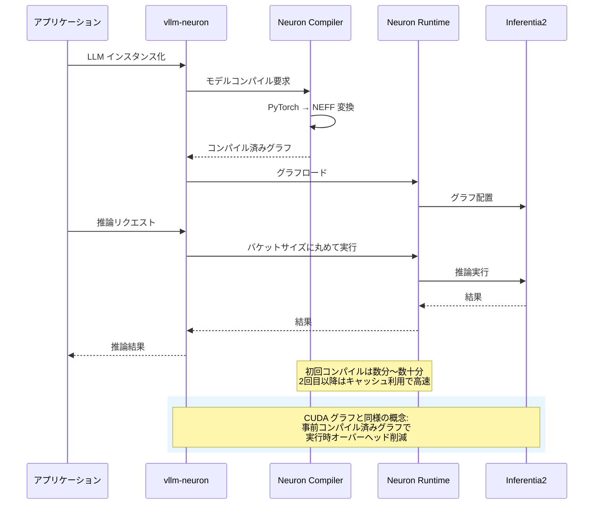

## はじめに

本記事では、[vllm-neuron](https://github.com/vllm-project/vllm-neuron) を使用して推論性能を簡易に計測する方法を、実際のベンチマーク結果の一例とともに解説します。特に、簡易ベンチマークスクリプトの実装例に焦点を当て、prefix caching や bucketing といった手法の設定の影響を実際に評価します。

### vllm-neuron とは

vLLM は継続的なバッチ処理などの高度な推論機能を活用した LLM 推論およびサービス提供のための人気ライブラリです。vllm-neuron は、高速な LLM 推論エンジンである vLLM を AWS Neuron SDK と統合したものです。通常の vLLM が NVIDIA GPU 上で CUDA を使用するのに対し、vllm-neuron は AWS Inferentia と Trainium チップ上で動作します。

vllm-neuron は内部で NxD Inference (neuronx-distributed-inference) を用いており、`inference_demo` スクリプトを vLLM と同じような設定方法で使えるようにしたラッパー的な位置付けです。具体的には、以下のプロセスで動作します。

1. **モデルロード**: Hugging Face 形式のモデルを読み込み
2. **グラフコンパイル**: Neuron Compiler が PyTorch モデルを Neuron 実行可能ファイル形式 (NEFF) にコンパイル
3. **事前ウォームアップ**: 様々な入力形状に対してグラフをコンパイル (bucketing 使用時)
4. **推論実行**: コンパイル済みグラフを使用して高速推論を実行

このアーキテクチャは、NVIDIA GPU における CUDA グラフの概念と類似しています。vLLM がデフォルトで CUDA グラフを使用して GPU 上でカーネル起動のオーバーヘッドを削減するのと同様に、vllm-neuron は事前コンパイルされた Neuron グラフを使用することで、推論時のオーバーヘッドを最小化します。



重要な点として、Neuron Compiler は初回実行時に数分から数十分のコンパイル時間を要し、コンパイル結果は `/var/tmp/neuron-compile-cache/` にキャッシュされます。2 回目以降の実行では、このキャッシュが再利用されるため、起動時間が大幅に短縮されます。

## ベンチマークスクリプトの実装

本セクションでは、vllm-neuron のパフォーマンスを評価するためのベンチマークスクリプトの実装を解説します。このスクリプトは、JSON 設定ファイルによる柔軟なテストパターン定義をサポートし、複数の設定を自動的にテストして結果を比較できます。解説の容易さを重視するためにファイル数、メソッド数などを極力削減する形としています。計測で追加すべきパラメータがあれば AI にお願いして追加実装してもらいましょう！

### 概要

ベンチマークシステムは、以下の 3 つの主要コンポーネントから構成されます。

1. **JSON 設定ファイル**: テストパターンと共通設定を定義
2. **Bash オーケストレーションスクリプト** (`run_offline_benchmark.sh`): 設定を読み込み、各テストを順次実行
3. **Python ベンチマークスクリプト** (`offline_benchmark.py`): vLLM を直接インスタンス化して測定を実行

この設計により、スクリプトを変更することなく、JSON ファイルの編集のみで様々なテストパターンを定義できます。

### JSON 設定ファイルの構造

JSON 設定ファイルは、`base_config` と `test_configs` の 2 つのセクションで構成されます。以下は、prefix caching と bucketing の 4 通りの組み合わせをテストする設定例です。

::::details JSON 設定ファイル例
```json:test_cache_bucketing_comparison.json
{
  "model": "./models/Qwen3-0.6B-Reranker",
  "tensor_parallel_size": 2,
  "base_config": {
    "max_model_len": 2048,
    "block_size": 32,
    "input_file": "./sample.csv",
    "search_num": 20,
    "top_n": 6,
    "batch_size": 8,
    "max_length": 1500
  },
  "test_configs": [
    {
      "name": "cache_ON_bucketing_ON",
      "max_num_seqs": 4,
      "max_num_batched_tokens": 256,
      "pa_num_blocks": 512,
      "enable_prefix_caching": true,
      "enable_bucketing": true
    },
    {
      "name": "cache_ON_bucketing_OFF",
      "max_num_seqs": 4,
      "max_num_batched_tokens": 256,
      "pa_num_blocks": 512,
      "enable_prefix_caching": true,
      "enable_bucketing": false
    },
    {
      "name": "cache_OFF_bucketing_ON",
      "max_num_seqs": 4,
      "max_num_batched_tokens": 256,
      "pa_num_blocks": 512,
      "enable_prefix_caching": false,
      "enable_bucketing": true
    },
    {
      "name": "cache_OFF_bucketing_OFF",
      "max_num_seqs": 4,
      "max_num_batched_tokens": 256,
      "pa_num_blocks": 512,
      "enable_prefix_caching": false,
      "enable_bucketing": false
    }
  ]
}
```

#### パラメータの詳細

**トップレベル設定**:
- `model`: Hugging Face モデル ID またはローカルパス
- `tensor_parallel_size`: Tensor Parallelism の並列度

**base_config** (全テストで共通):
- `max_model_len`: モデルが処理可能な最大シーケンス長
- `block_size`: PagedAttention のブロックサイズ
- `input_file`: テストデータの CSV ファイルパス
- `search_num`: Rerank するドキュメント数
- `top_n`: 最終的に返す上位ドキュメント数
- `batch_size`: 推論時のバッチサイズ
- `max_length`: プロンプトの最大トークン数

**test_configs** (各テストパターン):
- `name`: 設定の識別名 (結果ファイル名に使用)
- `max_num_seqs`: 同時に処理する最大シーケンス数
- `max_num_batched_tokens`: バッチ内の最大トークン数
- `pa_num_blocks`: PagedAttention で使用するメモリブロック数
- `enable_prefix_caching`: Prefix Caching の有効化 (true/false)
- `enable_bucketing`: Bucketing の有効化 (true/false)
::::

### Bash オーケストレーションスクリプト

`run_offline_benchmark.sh` は、JSON 設定を読み込み、各テストパターンを順次実行するラッパースクリプトです。以下は、主要部分の実装を抜粋したものです。

::::details Bash オーケストレーションスクリプト例
```bash:run_offline_benchmark.sh
#!/bin/bash

# vllm-neuron 環境の有効化（必要に応じて最適なパスに変えてください）
source /opt/aws_neuronx_venv_pytorch_inference_vllm/bin/activate

CONFIG_FILE="${CONFIG_FILE:-}"

if [[ -n "$CONFIG_FILE" && -f "$CONFIG_FILE" ]]; then
    echo "JSON Configuration Mode"

    # 結果ディレクトリの作成
    TIMESTAMP=$(date +%Y_%m_%d_%H_%M)
    RESULTS_DIR="./benchmark_results_${TIMESTAMP}"
    mkdir -p "$RESULTS_DIR"

    # 基本設定の抽出
    MODEL=$(python3 -c "import json; f=open('$CONFIG_FILE'); d=json.load(f); print(d.get('model', './models/Qwen3-0.6B-Reranker'))")
    TP=$(python3 -c "import json; f=open('$CONFIG_FILE'); d=json.load(f); print(d.get('tensor_parallel_size', 2))")

    # テスト設定数の取得
    NUM_CONFIGS=$(python3 -c "import json; f=open('$CONFIG_FILE'); d=json.load(f); print(len(d.get('test_configs', [])))")

    # 各テスト設定の処理
    for i in $(seq 0 $(($NUM_CONFIGS - 1))); do
        # 設定パラメータの抽出
        CONFIG_NAME=$(python3 -c "import json; f=open('$CONFIG_FILE'); d=json.load(f); print(d['test_configs'][$i].get('name', 'config_$i'))")
        MAX_NUM_SEQS=$(python3 -c "import json; f=open('$CONFIG_FILE'); d=json.load(f); print(d['test_configs'][$i]['max_num_seqs'])")

        # ベンチマーク実行
        python3 offline_benchmark.py \
            --model "$MODEL" \
            --tp "$TP" \
            --max-num-seqs "$MAX_NUM_SEQS" \
            --output-file "$RESULTS_DIR/${CONFIG_NAME}.json" \
            > "$RESULTS_DIR/${CONFIG_NAME}.log" 2>&1
    done

    # サマリーレポート生成
    python3 << 'EOF'
import json
import glob
import os

# 全結果ファイルの読み込み
result_files = sorted(glob.glob(f"{results_dir}/*.json"))
results = []

for f in result_files:
    with open(f) as file:
        data = json.load(file)
        config_name = os.path.basename(f).replace('.json', '')
        results.append({
            'name': config_name,
            'metrics': data['metrics']
        })

# スループットでソート
sorted_results = sorted(results, key=lambda x: x['metrics']['throughput_queries_per_sec'], reverse=True)

# Markdown レポート生成
# (詳細は省略)
EOF
fi
```

このスクリプトの重要なポイントは以下の通りです。

1. **ループ処理**: `test_configs` 配列の各要素に対して順次ベンチマークを実行します。
2. **結果の集約**: すべてのテスト完了後、Python 埋め込みスクリプトが結果を読み込み、スループットでソートした Markdown レポートを自動生成します。
::::

::::details 完全版
以下に完全版を示しておきます。

```bash:run_offline_benchmark.sh
#!/bin/bash

# Activate vLLM-Neuron environment
source /opt/aws_neuronx_venv_pytorch_inference_vllm/bin/activate

# ==============================================================================
# Flexible Offline Benchmark Runner
# Supports both JSON configuration and environment variable modes
# ==============================================================================

CONFIG_FILE="${CONFIG_FILE:-}"

if [[ -n "$CONFIG_FILE" && -f "$CONFIG_FILE" ]]; then
    echo "================================================================================"
    echo "JSON Configuration Mode"
    echo "================================================================================"
    echo "Configuration file: $CONFIG_FILE"
    echo

    # Create results directory
    TIMESTAMP=$(date +%Y_%m_%d_%H_%M)
    RESULTS_DIR="./benchmark_results_${TIMESTAMP}"
    mkdir -p "$RESULTS_DIR"

    echo "Results directory: $RESULTS_DIR"
    echo

    # Extract base configuration
    MODEL=$(python3 -c "import json; f=open('$CONFIG_FILE'); d=json.load(f); print(d.get('model', './models/Qwen3-0.6B-Reranker'))")
    TP=$(python3 -c "import json; f=open('$CONFIG_FILE'); d=json.load(f); print(d.get('tensor_parallel_size', 2))")

    BASE_MAX_MODEL_LEN=$(python3 -c "import json; f=open('$CONFIG_FILE'); d=json.load(f); print(d.get('base_config', {}).get('max_model_len', 2048))")
    BASE_BLOCK_SIZE=$(python3 -c "import json; f=open('$CONFIG_FILE'); d=json.load(f); print(d.get('base_config', {}).get('block_size', 32))")
    BASE_INPUT_FILE=$(python3 -c "import json; f=open('$CONFIG_FILE'); d=json.load(f); print(d.get('base_config', {}).get('input_file', './sample.csv'))")
    BASE_SEARCH_NUM=$(python3 -c "import json; f=open('$CONFIG_FILE'); d=json.load(f); print(d.get('base_config', {}).get('search_num', 20))")
    BASE_TOP_N=$(python3 -c "import json; f=open('$CONFIG_FILE'); d=json.load(f); print(d.get('base_config', {}).get('top_n', 6))")
    BASE_BATCH_SIZE=$(python3 -c "import json; f=open('$CONFIG_FILE'); d=json.load(f); print(d.get('base_config', {}).get('batch_size', 8))")
    BASE_MAX_LENGTH=$(python3 -c "import json; f=open('$CONFIG_FILE'); d=json.load(f); print(d.get('base_config', {}).get('max_length', 1500))")

    # Get number of test configs
    NUM_CONFIGS=$(python3 -c "import json; f=open('$CONFIG_FILE'); d=json.load(f); print(len(d.get('test_configs', [])))")

    echo "Base configuration:"
    echo "  Model: $MODEL"
    echo "  Tensor Parallel: $TP"
    echo "  Max Model Len: $BASE_MAX_MODEL_LEN"
    echo "  Block Size: $BASE_BLOCK_SIZE"
    echo "  Input File: $BASE_INPUT_FILE"
    echo
    echo "Number of test configurations: $NUM_CONFIGS"
    echo

    # Process each test configuration
    for i in $(seq 0 $(($NUM_CONFIGS - 1))); do
        echo "================================================================================"
        echo "Test Configuration $((i + 1))/$NUM_CONFIGS"
        echo "================================================================================"

        # Extract configuration for this test
        CONFIG_NAME=$(python3 -c "import json; f=open('$CONFIG_FILE'); d=json.load(f); print(d['test_configs'][$i].get('name', 'config_$i'))")
        MAX_NUM_SEQS=$(python3 -c "import json; f=open('$CONFIG_FILE'); d=json.load(f); print(d['test_configs'][$i]['max_num_seqs'])")
        MAX_BATCHED_TOKENS=$(python3 -c "import json; f=open('$CONFIG_FILE'); d=json.load(f); print(d['test_configs'][$i]['max_num_batched_tokens'])")
        PA_NUM_BLOCKS=$(python3 -c "import json; f=open('$CONFIG_FILE'); d=json.load(f); print(d['test_configs'][$i]['pa_num_blocks'])")

        # Optional parameters with defaults
        ENABLE_PREFIX_CACHING=$(python3 -c "import json; f=open('$CONFIG_FILE'); d=json.load(f); print('--enable-prefix-caching' if d['test_configs'][$i].get('enable_prefix_caching', False) else '')")
        ENABLE_BUCKETING=$(python3 -c "import json; f=open('$CONFIG_FILE'); d=json.load(f); print('--enable-bucketing' if d['test_configs'][$i].get('enable_bucketing', False) else '')")
        KV_CACHE_QUANT=$(python3 -c "import json; f=open('$CONFIG_FILE'); d=json.load(f); print('--kv-cache-quant' if d['test_configs'][$i].get('kv_cache_quant', False) else '')")
        SEQUENCE_PARALLEL=$(python3 -c "import json; f=open('$CONFIG_FILE'); d=json.load(f); print('--sequence-parallel' if d['test_configs'][$i].get('sequence_parallel', False) else '')")
        FLASH_DECODING=$(python3 -c "import json; f=open('$CONFIG_FILE'); d=json.load(f); print('--flash-decoding' if d['test_configs'][$i].get('flash_decoding', False) else '')")

        OUTPUT_FILE="$RESULTS_DIR/${CONFIG_NAME}.json"
        LOG_FILE="$RESULTS_DIR/${CONFIG_NAME}.log"

        echo "Configuration: $CONFIG_NAME"
        echo "  max_num_seqs: $MAX_NUM_SEQS"
        echo "  max_batched_tokens: $MAX_BATCHED_TOKENS"
        echo "  pa_num_blocks: $PA_NUM_BLOCKS"
        echo "  enable_prefix_caching: $(echo $ENABLE_PREFIX_CACHING | grep -q 'enable-prefix-caching' && echo 'true' || echo 'false')"
        echo "  enable_bucketing: $(echo $ENABLE_BUCKETING | grep -q 'enable-bucketing' && echo 'true' || echo 'false')"
        echo "  Output: $OUTPUT_FILE"
        echo

        # Run benchmark
        python3 offline_benchmark.py \
            --model "$MODEL" \
            --tp "$TP" \
            --max-num-seqs "$MAX_NUM_SEQS" \
            --max-num-batched-tokens "$MAX_BATCHED_TOKENS" \
            --max-model-len "$BASE_MAX_MODEL_LEN" \
            --block-size "$BASE_BLOCK_SIZE" \
            --pa-num-blocks "$PA_NUM_BLOCKS" \
            $ENABLE_PREFIX_CACHING \
            $ENABLE_BUCKETING \
            $KV_CACHE_QUANT \
            $SEQUENCE_PARALLEL \
            $FLASH_DECODING \
            --input-file "$BASE_INPUT_FILE" \
            --output-file "$OUTPUT_FILE" \
            --search-num "$BASE_SEARCH_NUM" \
            --top-n "$BASE_TOP_N" \
            --batch-size "$BASE_BATCH_SIZE" \
            --max-length "$BASE_MAX_LENGTH" \
            > "$LOG_FILE" 2>&1

        if [[ $? -eq 0 ]]; then
            echo "✓ Test completed successfully"
        else
            echo "✗ Test failed (check $LOG_FILE)"
        fi
        echo
    done

    # Generate summary report
    echo "================================================================================"
    echo "Generating Summary Report"
    echo "================================================================================"

    SUMMARY_FILE="$RESULTS_DIR/summary.md"

    # Pass variables to Python via environment
    export RESULTS_DIR_FOR_PYTHON="$RESULTS_DIR"
    export CONFIG_FILE_FOR_PYTHON="$CONFIG_FILE"
    export SUMMARY_FILE_FOR_PYTHON="$SUMMARY_FILE"

    python3 << 'EOF'
import json
import glob
import os
from datetime import datetime

results_dir = os.environ['RESULTS_DIR_FOR_PYTHON']
config_file = os.environ['CONFIG_FILE_FOR_PYTHON']

# Read all result JSON files
result_files = sorted(glob.glob(f"{results_dir}/*.json"))
results = []

for f in result_files:
    try:
        with open(f) as file:
            data = json.load(file)
            config_name = os.path.basename(f).replace('.json', '')
            results.append({
                'name': config_name,
                'config': data['configuration'],
                'metrics': data['metrics']
            })
    except Exception as e:
        print(f"Warning: Failed to read {f}: {e}")

if not results:
    print("No results found")
    exit(1)

# Generate markdown summary
summary = f"""# Benchmark Summary Report

**Date**: {datetime.now().strftime('%Y-%m-%d %H:%M:%S')}
**Configuration File**: {config_file}
**Results Directory**: {results_dir}
**Total Configurations Tested**: {len(results)}

---

## Results Comparison

| Rank | Configuration | Throughput<br>(queries/sec) | Avg Time<br>(sec) | P50<br>(sec) | P95<br>(sec) | P99<br>(sec) |
|------|--------------|---------------------------|-----------------|----------|----------|----------|
"""

# Sort by throughput (descending)
sorted_results = sorted(results, key=lambda x: x['metrics']['throughput_queries_per_sec'], reverse=True)

medals = ['🥇', '🥈', '🥉']
for idx, r in enumerate(sorted_results):
    rank = idx + 1
    medal = medals[idx] if idx < 3 else ''
    name = r['name']
    metrics = r['metrics']

    summary += f"| {medal} **{rank}** | {name} | **{metrics['throughput_queries_per_sec']:.4f}** | {metrics['avg_time_per_query']:.4f} | {metrics['p50_time']:.4f} | {metrics['p95_time']:.4f} | {metrics['p99_time']:.4f} |\n"

summary += "\n---\n\n## Detailed Results\n\n"

# Detailed results for each configuration
for idx, r in enumerate(sorted_results):
    rank = idx + 1
    medal = medals[idx] if idx < 3 else ''

    summary += f"### {medal} Rank {rank}: {r['name']}\n\n"
    summary += "**Configuration:**\n"
    summary += f"- max_num_seqs: {r['config']['max_num_seqs']}\n"
    summary += f"- max_num_batched_tokens: {r['config']['max_num_batched_tokens']}\n"
    summary += f"- pa_num_blocks: {r['config']['pa_num_blocks']}\n"
    summary += f"- enable_prefix_caching: {r['config']['enable_prefix_caching']}\n"
    summary += f"- enable_bucketing: {r['config']['enable_bucketing']}\n"

    if r['config'].get('kv_cache_quant'):
        summary += f"- kv_cache_quant: {r['config']['kv_cache_quant']}\n"
    if r['config'].get('sequence_parallel'):
        summary += f"- sequence_parallel: {r['config']['sequence_parallel']}\n"
    if r['config'].get('flash_decoding'):
        summary += f"- flash_decoding: {r['config']['flash_decoding']}\n"

    summary += "\n**Performance Metrics:**\n"
    summary += f"- Throughput: **{r['metrics']['throughput_queries_per_sec']:.4f} queries/sec**\n"
    summary += f"- Average Time: {r['metrics']['avg_time_per_query']:.4f} sec\n"
    summary += f"- Min Time: {r['metrics']['min_time_per_query']:.4f} sec\n"
    summary += f"- Max Time: {r['metrics']['max_time_per_query']:.4f} sec\n"
    summary += f"- P50 Latency: {r['metrics']['p50_time']:.4f} sec\n"
    summary += f"- P95 Latency: {r['metrics']['p95_time']:.4f} sec\n"
    summary += f"- P99 Latency: {r['metrics']['p99_time']:.4f} sec\n"
    summary += f"- Total Queries: {r['metrics']['total_queries']}\n"
    summary += f"- Total Time: {r['metrics']['total_time']:.2f} sec\n"
    summary += "\n"

# Best configuration recommendation
best = sorted_results[0]
summary += f"""---

## Recommended Configuration

Based on the benchmark results, the optimal configuration is:

**{best['name']}**

"""

# Add bash config separately to avoid shell variable expansion issues
summary += "```bash\n"
summary += f"MAX_NUM_SEQS={best['config']['max_num_seqs']}\n"
summary += f"MAX_NUM_BATCHED_TOKENS={best['config']['max_num_batched_tokens']}\n"
summary += f"PA_NUM_BLOCKS={best['config']['pa_num_blocks']}\n"
summary += f"ENABLE_PREFIX_CACHING={str(best['config']['enable_prefix_caching']).lower()}\n"
summary += f"ENABLE_BUCKETING={str(best['config']['enable_bucketing']).lower()}\n"
summary += "```\n\n"

summary += f"""**Performance:**
- Throughput: **{best['metrics']['throughput_queries_per_sec']:.4f} queries/sec**
- P99 Latency: {best['metrics']['p99_time']:.4f} sec

---

**Generated**: {datetime.now().strftime('%Y-%m-%d %H:%M:%S')}
"""

# Write summary
summary_file = os.environ['SUMMARY_FILE_FOR_PYTHON']
with open(summary_file, 'w') as f:
    f.write(summary)

print(f"Summary report saved to: {summary_file}")
print()
print("=" * 80)
print("Top 3 Configurations:")
print("=" * 80)
for idx, r in enumerate(sorted_results[:3]):
    medal = medals[idx]
    print(f"{medal} {r['name']}: {r['metrics']['throughput_queries_per_sec']:.4f} queries/sec")
print()
EOF

    echo
    echo "================================================================================"
    echo "All Tests Complete"
    echo "================================================================================"
    echo "Results directory: $RESULTS_DIR"
    echo "Summary report: $SUMMARY_FILE"
    echo

else
    # ============================================================================
    # Environment Variable Mode (Legacy)
    # ============================================================================
    echo "================================================================================"
    echo "Environment Variable Mode (Legacy)"
    echo "================================================================================"
    echo

    MODEL="${MODEL:-./models/Qwen3-0.6B-Reranker}"
    TP="${TP:-2}"
    INPUT_LEN="${INPUT_LEN:-1000}"
    OUTPUT_LEN="${OUTPUT_LEN:-50}"
    MAX_MODEL_LEN="${MAX_MODEL_LEN:-2048}"
    PA_BLOCK_SIZE="${PA_BLOCK_SIZE:-32}"
    PA_NUM_BLOCKS="${PA_NUM_BLOCKS:-512}"
    ENABLE_BUCKETING="${ENABLE_BUCKETING:-true}"
    NUM_SEQS_LIST="${NUM_SEQS_LIST:-4 8}"
    NUM_BATCHED_TOKENS_LIST="${NUM_BATCHED_TOKENS_LIST:-256 512}"
    NEURON_PROFILES="${NEURON_PROFILES:-baseline kv-quant}"
    INPUT_FILE="${INPUT_FILE:-./sample.csv}"
    SEARCH_NUM="${SEARCH_NUM:-20}"
    TOP_N="${TOP_N:-6}"
    BATCH_SIZE="${BATCH_SIZE:-8}"
    MAX_LENGTH="${MAX_LENGTH:-1500}"

    bash auto_tune_neuron_offline.sh
fi
```
::::


### Python ベンチマークスクリプトの実装

`offline_benchmark.py` は、vLLM の LLM クラスを直接インスタンス化し、サーバーを起動せずにベンチマークを実行します。

::::details ベンチマークスクリプト
```python:offline_benchmark.py
#!/usr/bin/env python3
"""
Offline Benchmark Script for vLLM-Neuron
Measures performance using direct LLM class instantiation (no server)
"""

import argparse
import json
import time
import sys
from typing import List, Sequence
import pandas as pd
from tqdm import tqdm
import torch

from vllm import LLM, SamplingParams
from transformers import AutoTokenizer


def parse_args():
    parser = argparse.ArgumentParser(description='Offline vLLM-Neuron Benchmark')

    # Model configuration
    parser.add_argument('--model', type=str, required=True, help='Model path')
    parser.add_argument('--tp', type=int, default=2, help='Tensor parallel size')
    parser.add_argument('--max-num-seqs', type=int, default=8, help='Max number of sequences')
    parser.add_argument('--max-num-batched-tokens', type=int, default=512, help='Max batched tokens')
    parser.add_argument('--max-model-len', type=int, default=2048, help='Max model length')
    parser.add_argument('--block-size', type=int, default=32, help='Block size')
    parser.add_argument('--pa-num-blocks', type=int, default=2048, help='PA num blocks')

    # Neuron configuration
    parser.add_argument('--enable-prefix-caching', action='store_true', help='Enable prefix caching')
    parser.add_argument('--enable-bucketing', action='store_true', help='Enable bucketing')
    parser.add_argument('--kv-cache-quant', action='store_true', help='Enable KV cache quantization')
    parser.add_argument('--sequence-parallel', action='store_true', help='Enable sequence parallel')
    parser.add_argument('--flash-decoding', action='store_true', help='Enable flash decoding')

    # Benchmark configuration
    parser.add_argument('--input-file', type=str, required=True, help='Input CSV file')
    parser.add_argument('--output-file', type=str, required=True, help='Output JSON file')
    parser.add_argument('--search-num', type=int, default=20, help='Number of search results')
    parser.add_argument('--top-n', type=int, default=6, help='Top N results to return')
    parser.add_argument('--batch-size', type=int, default=8, help='Batch size for processing')
    parser.add_argument('--max-length', type=int, default=1500, help='Max prompt length')

    return parser.parse_args()


class RerankerBenchmark:
    def __init__(self, args):
        self.args = args

        # Build neuron config
        neuron_config = {
            "skip_warmup": True,
            "pa_num_blocks": args.pa_num_blocks,
            "pa_block_size": args.block_size,
            "enable_bucketing": args.enable_bucketing,
        }

        # Only set block KV layout and prefix caching if prefix caching is enabled
        if args.enable_prefix_caching:
            neuron_config["is_prefix_caching"] = True
            neuron_config["is_block_kv_layout"] = True

        if args.kv_cache_quant:
            neuron_config["kv_cache_quant"] = True
        if args.sequence_parallel:
            neuron_config["sequence_parallel_enabled"] = True
        if args.flash_decoding:
            neuron_config["flash_decoding_enabled"] = True

        print(f"Initializing LLM with neuron_config: {json.dumps(neuron_config, indent=2)}")

        # Initialize LLM
        start_init = time.perf_counter()
        self.llm = LLM(
            model=args.model,
            tensor_parallel_size=args.tp,
            max_num_seqs=args.max_num_seqs,
            max_num_batched_tokens=args.max_num_batched_tokens,
            max_model_len=args.max_model_len,
            block_size=args.block_size,
            num_gpu_blocks_override=args.pa_num_blocks,  # Required for Neuron despite "gpu" in name
            enable_prefix_caching=args.enable_prefix_caching,
            dtype="bfloat16",
            additional_config={
                "override_neuron_config": neuron_config,
            },
        )
        init_time = time.perf_counter() - start_init
        print(f"LLM initialization completed in {init_time:.2f}s")

        # Initialize tokenizer
        self.tokenizer = AutoTokenizer.from_pretrained(args.model, padding_side='left')
        self.token_false_id = self.tokenizer.convert_tokens_to_ids("no")
        self.token_true_id = self.tokenizer.convert_tokens_to_ids("yes")

        # Prompt templates
        self.prefix = "<|im_start|>system\nJudge whether the Document meets the requirements based on the Query and the Instruct provided. Note that the answer can only be \"yes\" or \"no\".<|im_end|>\n<|im_start|>user\n"
        self.suffix = "<|im_end|>\n<|im_start|>assitant\n<think>\n\n</think>\n\n"
        self.prefix_tokens = self.tokenizer.encode(self.prefix, add_special_tokens=False)
        self.suffix_tokens = self.tokenizer.encode(self.suffix, add_special_tokens=False)

    def format_instruction(self, query, doc, instruction=None):
        if instruction is None:
            instruction = 'Given a query about insurance, retrieve relevant passages that answer the query'
        output = f"<Instruct>: {instruction}\n<Query>: {query}\n<Document>: {doc}"
        if len(output) >= 2000:
            output = output[:2000]
        return output

    def build_prompts_for_vllm(self, pairs: Sequence[str]) -> List[str]:
        prompts: List[str] = []
        budget = self.args.max_length - len(self.prefix_tokens) - len(self.suffix_tokens)

        enc = self.tokenizer(
            list(pairs),
            padding=False,
            truncation="longest_first",
            return_attention_mask=False,
            add_special_tokens=False,
            max_length=max(8, budget),
        )

        for ids in enc["input_ids"]:
            final_ids = self.prefix_tokens + ids + self.suffix_tokens
            text = self.tokenizer.decode(final_ids, skip_special_tokens=False)
            prompts.append(text)
        return prompts

    def compute_logits_vllm(self, prompts: Sequence[str]) -> List[float]:
        n = len(prompts)
        probs_true: List[float] = [0.5] * n

        sp = SamplingParams(
            max_tokens=1,
            temperature=0.0,
            logprobs=20,
            detokenize=True,
            allowed_token_ids=[self.token_true_id, self.token_false_id]
        )

        # Process in chunks
        chunk_size = self.args.batch_size
        for s in range(0, len(prompts), chunk_size):
            batch_prompts = prompts[s:s + chunk_size]
            outs = self.llm.generate(batch_prompts, sp, use_tqdm=False)

            for i, out in enumerate(outs):
                probs_true[s + i] = 0.5  # Placeholder score

        return probs_true

    def search_results_rerank(self, query, search_results, top_n):
        pairs = [self.format_instruction(query=query, doc=doc) for doc in search_results]
        prompts = self.build_prompts_for_vllm(pairs)
        scores = self.compute_logits_vllm(prompts)

        scored_documents = [
            {
                "relevance_score": score,
                "content": doc,
                "index": i
            }
            for i, (score, doc) in enumerate(zip(scores, search_results))
        ]

        sorted_documents = sorted(scored_documents, key=lambda x: x["relevance_score"], reverse=True)
        results = sorted_documents[:top_n] if len(sorted_documents) > top_n else sorted_documents

        return [
            {
                "query": query,
                "rerank_score": r["relevance_score"],
                "content": r["content"]
            }
            for r in results
        ]

    def run_benchmark(self):
        """Run the benchmark and collect metrics"""
        df = pd.read_csv(self.args.input_file)

        time_counts = []
        prompt_counts = []
        token_counts = []

        print(f"\nRunning benchmark on {len(df)} queries...")

        for index, row in tqdm(df.iterrows(), total=len(df)):
            query = row["query"]
            search_results = [row[f"answer_{i}"] for i in range(self.args.search_num)]

            start_time = time.perf_counter()
            results = self.search_results_rerank(
                query=query,
                search_results=search_results,
                top_n=self.args.top_n,
            )
            end_time = time.perf_counter()

            execution_time = end_time - start_time
            time_counts.append(execution_time)
            prompt_counts.append(self.args.search_num)
            token_counts.append(self.args.search_num * self.args.max_length)  # Approximate

            # Free memory
            torch.cuda.empty_cache()

        # Calculate metrics
        import numpy as np
        time_counts = np.array(time_counts)

        results = {
            "configuration": {
                "model": self.args.model,
                "tensor_parallel_size": self.args.tp,
                "max_num_seqs": self.args.max_num_seqs,
                "max_num_batched_tokens": self.args.max_num_batched_tokens,
                "max_model_len": self.args.max_model_len,
                "block_size": self.args.block_size,
                "pa_num_blocks": self.args.pa_num_blocks,
                "enable_prefix_caching": self.args.enable_prefix_caching,
                "enable_bucketing": self.args.enable_bucketing,
                "kv_cache_quant": self.args.kv_cache_quant,
                "sequence_parallel": self.args.sequence_parallel,
                "flash_decoding": self.args.flash_decoding,
            },
            "metrics": {
                "avg_time_per_query": float(time_counts.mean()),
                "min_time_per_query": float(time_counts.min()),
                "max_time_per_query": float(time_counts.max()),
                "p50_time": float(np.percentile(time_counts, 50)),
                "p95_time": float(np.percentile(time_counts, 95)),
                "p99_time": float(np.percentile(time_counts, 99)),
                "total_queries": len(df),
                "total_time": float(time_counts.sum()),
                "throughput_queries_per_sec": len(df) / float(time_counts.sum()),
            },
            "raw_times": time_counts.tolist(),
        }

        # Save results
        with open(self.args.output_file, 'w') as f:
            json.dump(results, f, indent=2)

        print(f"\nBenchmark Results:")
        print(f"  Average time per query: {results['metrics']['avg_time_per_query']:.4f}s")
        print(f"  Min time: {results['metrics']['min_time_per_query']:.4f}s")
        print(f"  Max time: {results['metrics']['max_time_per_query']:.4f}s")
        print(f"  P50: {results['metrics']['p50_time']:.4f}s")
        print(f"  P95: {results['metrics']['p95_time']:.4f}s")
        print(f"  P99: {results['metrics']['p99_time']:.4f}s")
        print(f"  Throughput: {results['metrics']['throughput_queries_per_sec']:.2f} queries/sec")
        print(f"\nResults saved to: {self.args.output_file}")

        return results


def main():
    args = parse_args()

    print("=" * 80)
    print("vLLM-Neuron Offline Benchmark")
    print("=" * 80)

    benchmark = RerankerBenchmark(args)
    results = benchmark.run_benchmark()

    return 0


if __name__ == "__main__":
    sys.exit(main())
```

#### 実装の重要ポイント

```python
if args.enable_prefix_caching:
    neuron_config["is_prefix_caching"] = True
    neuron_config["is_block_kv_layout"] = True
```

この条件分岐は非常に重要です。`is_block_kv_layout` を常に `True` に設定すると、prefix caching を無効化した際に `BlockKVCacheManager` の初期化エラーが発生します。vllm-neuron の内部実装では、prefix caching が無効の場合、異なるコードパスを通るため、`is_block_kv_layout` の設定が不要となります。
::::

### 実行方法

ベンチマークの実行は非常にシンプルです。JSON 設定ファイルを作成し、環境変数 `CONFIG_FILE` に指定して `run_offline_benchmark.sh` を実行するだけです。

```bash
cd /path/to/your/project

# Prefix caching と bucketing の比較テスト (4 設定、約 20 分)
CONFIG_FILE=test_cache_bucketing_comparison.json bash run_offline_benchmark.sh
```

実行が完了すると、`benchmark_results_YYYY_MM_DD_HH_MM/` ディレクトリに以下のファイルが生成されます。

- `summary.md`: 全設定の比較レポート (Markdown 形式)
- `<config_name>.json`: 各設定の詳細な結果
- `<config_name>.log`: 各設定の実行ログ

コンソールには、スループット上位 3 つの設定が自動的に表示されます。

```
================================================================================
Top 3 Configurations:
================================================================================
🥇 cache_OFF_bucketing_ON: 3.0975 queries/sec
🥈 cache_ON_bucketing_ON: 2.3225 queries/sec
🥉 cache_ON_bucketing_OFF: 0.8718 queries/sec
```

## ベンチマーク結果と分析

本セクションでは、inf2.xlarge インスタンス上で実施したベンチマーク結果を実際に紹介します。Prefix caching と bucketing の 4 通りの組み合わせをテストし、それぞれの最適化手法がタスクに与える影響を定量的に評価しました。（タスク内容やモデル詳細の説明は主眼ではないため割愛します）

inf2.xlarge の起動は以下を参考にしてみてください。（Ubuntu24 の DLAMI に対応しました）

https://zenn.dev/tosshi/articles/eb54037328d2ef

### 実験設定

- **インスタンス**: inf2.xlarge (2 Neuron コア、Ubuntu 24.04)
- **モデル**: Qwen/Qwen3-Reranker-0.6B
- **テストデータ**: 10 クエリ、各クエリで 20 ドキュメントを Rerank
- **共通パラメータ**:
  - `max_num_seqs`: 4
  - `max_num_batched_tokens`: 256
  - `pa_num_blocks`: 512
  - `tensor_parallel_size`: 2

### 性能比較結果

以下の表は、4 つの設定パターンでのベンチマーク結果を示しています。注意点として、これらの結果は本実験で使用した特定のモデルとデータセットに限定されたものです。

| ランク | 設定 | Throughput<br>(queries/sec) | 平均時間<br>(sec) | P50<br>(sec) | P95<br>(sec) | P99<br>(sec) | 対最速比 |
|--------|------|---------------------------|-----------------|----------|----------|----------|----------|
| 🥇 **1** | prefix caching OFF<br>bucketing ON | **3.0975** | 0.3228 | 0.3071 | 0.3972 | 0.4496 | 100% |
| 🥈 **2** | prefix caching ON<br>bucketing ON | **2.3225** | 0.4306 | 0.4137 | 0.5090 | 0.5690 | 75.0% |
| 🥉 **3** | prefix caching ON<br>bucketing OFF | **0.8718** | 1.1470 | 1.1262 | 1.2401 | 1.3114 | 28.1% |
|  **4** | prefix caching OFF<br>bucketing OFF | **0.8151** | 1.2268 | 1.2029 | 1.3342 | 1.4159 | 26.3% |

これらの数値は、本実験の特定条件下で得られた参考値であり、モデルサイズ、入力データの特性、ハードウェア構成によって結果は変動します。

### 重要な発見

#### 1. Prefix Caching は Reranker タスクでは逆効果

今回の実験で最も重要な発見は、prefix caching を無効化した設定が、有効化した設定と比較して **33.4% 高いスループット**を達成したことです。この結果は、一般的な LLM 推論において prefix caching が推奨されることと対照的です。

**原因予想（当てずっぽうでプロファイリングまでやってません）**:

Prefix caching は、複数のリクエスト間で共通するプロンプトプレフィックスの KV cache を再利用することで、Time To First Token (TTFT) を短縮する最適化手法です。しかし、Reranker タスクでは、以下の理由により逆効果となるかもしれません。

1. **プレフィックスの再利用頻度が低い**: Reranker は各クエリとドキュメントのペアに対して異なるプロンプトを生成するため、共通プレフィックスの長さが短く、再利用機会が限られると思われます。
2. **キャッシュメンテナンスのオーバーヘッド**: KV キャッシュを管理し、パターンマッチング、などの処理を実装しているはずなのでキャッシュヒットしない場合はパフォーマンスオーバーヘッドの悪影響が大きいかもしれません。

#### 2. Bucketing は必須の最適化手法

Bucketing の有無による性能差は極めて顕著でした。Bucketing を無効化すると、prefix caching の設定に関わらず、スループットが **70-75% 低下**します。

**Bucketing の仕組み**:

AWS Neuron は静的グラフコンパイルを採用しています。これは、NVIDIA GPU における CUDA グラフと同様の概念ですが、より厳密な入力形状の固定が必要です。Bucketing を有効化すると、vLLM は入力シーケンス長を事前定義されたバケットサイズ (例: 128, 256, 512, 1024) に丸めます。

:::message
AWS Neuron と NVIDIA GPU では実装レベルでは大きな違いがあり、Neuron は 2026/01/25 時点では事前コンパイル必須で、CUDA グラフは実行時キャプチャ、です。今後 AWS Neuron は PyTorch Eager モードに対応するのでいずれコンパイル必須ではなくなると思われますが、Eager モードは事前コンパイルよりパフォーマンスが劣化する可能性が高いため慎重に検証するべきでしょう。
:::

Bucketing により、コンパイル済みグラフの再利用率が最大化され、動的な入力形状変化に対するオーバーヘッドが削減されます。本実験では、bucketing ON と OFF で最大 3.8 倍の性能差が観測されました。

#### 3. 最適設定の組み合わせ

今回の実験によりタスクにおける最適な設定は以下となりました。

```python
from vllm import LLM, SamplingParams

llm = LLM(
    model="Qwen/Qwen3-Reranker-0.6B",
    tensor_parallel_size=2,
    max_num_seqs=4,
    max_num_batched_tokens=256,
    max_model_len=2048,
    block_size=32,
    num_gpu_blocks_override=512,
    enable_prefix_caching=False,
    dtype="bfloat16",
    additional_config={
        "override_neuron_config": {
            "skip_warmup": True,
            "pa_num_blocks": 512,
            "pa_block_size": 32,
            "enable_bucketing": True,
        }
    }
)
```

この設定により、3.0975 queries/sec のスループットと 0.4496 秒の P99 レイテンシーを達成しました。ただし、この設定は本実験の条件下での最適解であり、異なるモデルやワークロードでは再評価が必要です。

今回の結果はワークロードの特性を理解した上で様々な設定の影響を確認することの重要性を示しており、今回例示したようなベンチマークのためのスクリプトの重要性が確認できました。vLLM には [Benchmarking](https://docs.vllm.ai/en/stable/benchmarking/) ツールが提供されていますが、vllm-neuron では現状動作しません。


## 実装上の注意点とトラブルシューティング

vllm-neuron を使用する際、いくつかの重要な落とし穴がありました。本セクションでは、実装過程で遭遇した問題とその解決策を共有します。

::::details 1. is_block_kv_layout の設定タイミング

**問題**:

`override_neuron_config` で `is_block_kv_layout: True` を常に設定すると、prefix caching を無効化した際に以下のエラーが発生します。

```
AttributeError: 'BlockKVCacheManager' object has no attribute 'k_shape'
```

**原因**:

vllm-neuron の内部実装では、prefix caching が無効の場合、BlockKVCacheManager の初期化が異なるコードパスを通ります。`is_block_kv_layout` が明示的に設定されていると、k_shape 属性を持たない BlockKVCacheManager オブジェクトに対してアクセスが試みられ、エラーが発生します。

**解決策**:

Prefix caching が有効な場合のみ `is_block_kv_layout` を設定します。

```python
neuron_config = {
    "skip_warmup": True,
    "pa_num_blocks": args.pa_num_blocks,
    "pa_block_size": args.block_size,
    "enable_bucketing": args.enable_bucketing,
}

# Prefix caching が有効な場合のみ設定
if args.enable_prefix_caching:
    neuron_config["is_prefix_caching"] = True
    neuron_config["is_block_kv_layout"] = True
```

この条件分岐により、prefix caching の有無に関わらず正常に動作します。
::::

::::details 2. 初回コンパイル時間

**問題**:

モデルの初回ロード時に、30 分以上のコンパイル時間がかかることがあります。

**対処法**:

これは Neuron Compiler がモデルを NEFF 形式にコンパイルしているためであり、避けられない overhead です。以下の点を確認してください。

1. **ログの確認**: "Compiling" や "Generating HLO" がログに表示されているか確認します。
2. **キャッシュの活用**: コンパイル結果は `/var/tmp/neuron-compile-cache/` にキャッシュされます。2 回目以降の実行では、キャッシュが再利用されるため、起動時間が大幅に短縮されます。
3. **キャッシュの永続化**: EC2 インスタンスを停止する場合、キャッシュディレクトリを EBS ボリュームにバックアップすることで、再起動後もキャッシュを利用できます。

```bash
# キャッシュの確認
ls -lh /var/tmp/neuron-compile-cache/

# キャッシュサイズの確認
du -sh /var/tmp/neuron-compile-cache/
```
::::

::::details 3. メモリ不足エラー

**症状**:

モデルロード時に OOM (Out of Memory) エラーが発生します。

**解決策**:

以下のいずれかの対策を実施してください。

1. **pa_num_blocks を減らす**: 例えば `2048` → `512` に減らすことで、PagedAttention が使用するメモリを削減します。
2. **max_model_len を減らす**: モデルが処理する最大シーケンス長を短くします。
3. **tensor_parallel_size を増やす**: メモリを複数の Neuron コアに分散します。ただし、inf2.xlarge は 2 コアのみのため、より大きいインスタンスタイプへの変更が必要です。
4. **インスタンスタイプを大きくする**: inf2.8xlarge や inf2.24xlarge に変更します。

```python
# メモリ使用量を削減する設定例
llm = LLM(
    model="Qwen/Qwen3-Reranker-0.6B",
    tensor_parallel_size=2,
    max_num_seqs=2,  # 4 から 2 に削減
    max_num_batched_tokens=128,  # 256 から 128 に削減
    max_model_len=1024,  # 2048 から 1024 に削減
    num_gpu_blocks_override=256,  # 512 から 256 に削減
    # ...
)
```
::::

## vLLM Benchmarking ツール

vLLM には Benchmarking ツールがあるのになぜそれを使わないのか、と思われた方もいるかもしれないため、スクリプトを作成する前に vLLM Benchmarking ツールについて動作確認した結果を共有しておきます。ただし、実装まで深ぼって調査したわけではないため実は動く、ということがあるかもしれません。最終的にはご自身でしっかりと確認ください。

vLLM 公式のベンチマーク CLI (`vllm bench`) は **vllm-neuron 環境では動作しませんでした**。CLI として 3 つのコマンド（`serve`、`throughput`、`latency`）が存在しますが、今回利用したかった `throughput` を実際に実行すると初期化時にハングし、正常に動作しませんでした。`startup`、`mm-processor`、`sweep` は実装されてなさそうです。

### vLLM 公式ベンチマーク CLI

vLLM は、すべてのベンチマーク機能を統一された CLI インターフェース `vllm bench` に移行しています。従来の standalone スクリプト（`benchmark_serving.py`、`benchmark_throughput.py` など）は deprecated となり、すべての機能が `vllm bench` サブコマンドに集約されました。

| コマンド | 用途 | 主要メトリクス |
|---------|------|--------------|
| `vllm bench serve` | オンラインサービング | TTFT、TPOT、ITL、E2EL、throughput、goodput |
| `vllm bench throughput` | オフラインバッチ推論 | 最大スループット |
| `vllm bench latency` | シングルバッチレイテンシー | バッチ処理時間 |
| `vllm bench startup` | スタートアップ時間 | コールド/ウォームスタート時間 |
| `vllm bench mm-processor` | マルチモーダル | プリプロセッシングレイテンシー |
| `vllm bench sweep` | パラメータスイープ | 設定依存 |

### 主要機能

::::details 機能 1: データセットサポート

**テキストデータセット**:
- ShareGPT - マルチターン会話データ
- Random - 合成テキスト生成
- BurstGPT - CSV ベース GPT-4 フィルタデータ
- Sonnet - 詩ベース構造化データ
- HuggingFace - HF dataset hub
- Custom - JSONL フォーマット
- Prefix repetition - キャッシングテスト用

**マルチモーダルデータセット**:
- Random-MM - 合成画像・動画
- VisionArena - 画像付き会話
- MMVU - 動画 QA
::::

::::details 機能 2: メトリクス

**サービングベンチマーク**:
- **TTFT** (Time to First Token) - 最初のトークン生成までの時間
- **TPOT** (Time Per Output Token) - トークンあたりの平均時間
- **ITL** (Inter-Token Latency) - トークン間のレイテンシー
- **E2EL** (End-to-End Latency) - リクエスト全体の処理時間
- **Throughput** - リクエスト/トークン per second
- **Goodput** - SLA 基準を満たすリクエスト数
::::

::::details 機能 3: トラフィックパターン

- Poisson arrivals - 標準分散リクエスト
- Bursty traffic - バースト性制御
- Ramp-up strategies - 段階的な負荷増加
- Instant load - 一斉リクエスト (`request-rate=inf`)
::::

### vllm-neuron の対応状況

vllm-neuron 環境（`/opt/aws_neuronx_venv_pytorch_inference_vllm`）で以下の 3 つのコマンドが **CLI としては存在**します。

:::message alert
ただし実際には動作しませんでした。
:::

```bash
$ vllm bench --help

INFO 01-25 05:32:37 [__init__.py:36] Available plugins for group vllm.platform_plugins:
INFO 01-25 05:32:37 [__init__.py:38] - neuron -> vllm_neuron:register
INFO 01-25 05:32:37 [__init__.py:41] All plugins in this group will be loaded. Set `VLLM_PLUGINS` to control which plugins to load.
INFO 01-25 05:32:37 [__init__.py:207] Platform plugin neuron is activated
Could not import vLLM config module for overrides: cannot import name 'ModelConfig' from partially initialized module 'vllm.config' (most likely due to a circular import) (/opt/aws_neuronx_venv_pytorch_inference_vllm/lib/python3.12/site-packages/vllm/config/__init__.py)
WARNING 01-25 05:32:39 [_custom_ops.py:20] Failed to import from vllm._C with ImportError('libcuda.so.1: cannot open shared object file: No such file or directory')
Could not import required modules for chat completion stream override: No module named 'vllm_neuron.patches'
usage: vllm bench <bench_type> [options]

vLLM bench subcommand.

positional arguments:
  {latency,serve,throughput}
    latency             Benchmark the latency of a single batch of requests.
    serve               Benchmark the online serving throughput.
    throughput          Benchmark offline inference throughput.

options:
  -h, --help            show this help message and exit
```

### 各コマンドの理論上の仕様（実際には動作せず）

::::details vllm bench serve

**用途**: オンラインサービングのスループットベンチマーク

**主要オプション**:
- Dataset 設定（ShareGPT、Random、Sonnet など）
- Request rate 設定
- Sampling parameters
- Latency メトリクス（TTFT、TPOT、E2EL など）

**利用可能な設定グループ**:
```
- options
- custom dataset options
- spec bench dataset options
- sonnet dataset options
- sharegpt dataset options
- blazedit dataset options
- random dataset options
- random multimodal dataset options
- hf dataset options
- prefix repetition dataset options
- sampling parameters
```
::::

::::details vllm bench throughput

**用途**: オフラインバッチ推論の最大スループット測定

**主要オプション**:
- Prompt 数の指定
- Input/Output length 設定
- Model configuration
- Prefix caching 設定
- **additional-config による Neuron 固有設定**

**利用可能な設定グループ**:
```
- options
- prefix repetition dataset options
- ModelConfig
- LoadConfig
- StructuredOutputsConfig
- ParallelConfig
- CacheConfig
- MultiModalConfig
- LoRAConfig
- ObservabilityConfig
- SchedulerConfig
- VllmConfig
```
::::

::::details vllm bench latency

**用途**: シングルバッチのレイテンシー測定

**主要オプション**:
- Batch size 設定
- Input/Output length 設定
- Warmup iterations
- Profiling サポート

**利用可能な設定グループ**:
```
- options
- ModelConfig
- LoadConfig
- StructuredOutputsConfig
- ParallelConfig
- CacheConfig
- MultiModalConfig
- LoRAConfig
- ObservabilityConfig
- SchedulerConfig
- VllmConfig
```
::::

### Neuron 固有設定の指定方法

vllm-neuron では、`--additional-config` パラメータを使用して Neuron 固有の設定を JSON 形式で渡すことができます。

```bash
--additional-config ADDITIONAL_CONFIG
    Additional config for specified platform. Different
    platforms may support different configs. Make sure the
    configs are valid for the platform you are using.
    Contents must be hashable. (default: {})
```

以下の例のように実行できます。

```bash
vllm bench throughput \
  --model ./models/Qwen3-0.6B-Reranker \
  --tensor-parallel-size 2 \
  --num-prompts 100 \
  --input-len 512 \
  --output-len 128 \
  --max-model-len 2048 \
  --enable-prefix-caching \
  --additional-config '{"override_neuron_config": {"enable_bucketing": true, "pa_num_blocks": 512, "pa_block_size": 32, "skip_warmup": true}}'
```

### vllm-neuron での Benchmarking ツールの動作確認

Benchmarking ツールを使おうと試みましたが、1. LLM 初期化時にプロセスがハングする、2. 循環 import エラーが発生、3. 実行テストで JSON 出力ファイルが生成されない、などの理由から動作しませんでした。そもそも vllm-neuron の**公式ドキュメントにも Benchmarking CLI に対応しているという記載がそもそも見当たらない**ので vllm-neuron への移植がまだ不完全なのかもしれません。


::::details テスト 1: vllm bench throughput 実行

```bash
python -m vllm.benchmarks.throughput \
  --model ./models/Qwen3-0.6B-Reranker \
  --tensor-parallel-size 2 \
  --num-prompts 3 \
  --input-len 100 \
  --output-len 10
```

**結果**: ❌ **失敗**

- LLM インスタンス作成時にプロセスがハング
- 初期化メッセージのみ出力されて停止:
  ```
  INFO 01-24 18:59:19 [__init__.py:207] Platform plugin neuron is activated
  Could not import vLLM config module for overrides: cannot import name 'ModelConfig' from partially initialized module 'vllm.config' (most likely due to a circular import)
  WARNING 01-24 18:59:19 [_custom_ops.py:20] Failed to import from vllm._C with ImportError('libcuda.so.1: cannot open shared object file: No such file or directory')
  ```
- JSON 出力ファイルが生成されない
- プロセスは完了も失敗もせず、無応答状態
::::

::::details テスト 2: テスト 2: vllm bench throughput 実行、Neuron 設定あり

```bash
python -m vllm.benchmarks.throughput \
  --model ./models/Qwen3-0.6B-Reranker \
  --tensor-parallel-size 2 \
  --num-prompts 3 \
  --input-len 100 \
  --output-len 10 \
  --max-model-len 2048 \
  --block-size 32 \
  --max-num-seqs 4 \
  --max-num-batched-tokens 256 \
  --enable-prefix-caching \
  --additional-config '{"override_neuron_config": {"skip_warmup": true, "is_prefix_caching": true, "is_block_kv_layout": true, "pa_num_blocks": 512, "pa_block_size": 32, "enable_bucketing": true}}'
```

**結果**: ❌ **失敗**

- テスト 1 と同じ挙動（LLM 初期化時にハング）
- `--additional-config` パラメータが認識されているかも不明
- エラーメッセージなし
::::

::::details テスト 3: vllm bench throughput、CLI による実行

```bash
vllm bench throughput --model ./models/Qwen3-0.6B-Reranker --tensor-parallel-size 2
```

**結果**: ❌ **失敗**

```
usage: vllm [-h] [-v] {chat,complete,serve,bench,collect-env,run-batch} ...
vllm: error: unrecognized arguments:
```

**知見**:
- vLLM-Neuron の `vllm bench` CLI は実装が不完全または動作していない
- Python module syntax (`python -m vllm.benchmarks.throughput`) を使う必要がある
::::

::::details エラー情報: 循環 import エラー

```
Could not import vLLM config module for overrides: cannot import name 'ModelConfig' from partially initialized module 'vllm.config'
```

この warning は vllm-neuron の初期化時に発生しており、一部の設定モジュールが正しくロードされていない可能性があります。
::::

## まとめ

本記事では、vllm-neuron を使用したベンチマークについて実装例の解説と実際に結果を確認しました。これから vllm-neuron でベンチマークしようとしている方の一助になれば幸いです。今後は今回の結果をより詳細にプロファイリングする方法について検証を進める予定です。

## 参考資料

- [Qwen3-Reranker-0.6B - Hugging Face](https://huggingface.co/Qwen/Qwen3-Reranker-0.6B)
- [AWS Neuron SDK Documentation](https://awsdocs-neuron.readthedocs-hosted.com/)
- [vLLM Documentation](https://docs.vllm.ai/)
- [Amazon EC2 Inf2 Instances](https://aws.amazon.com/ec2/instance-types/inf2/)
- [AWS Inferentia2 で Inf2 実験環境を構築する](https://zenn.dev/tosshi/articles/eb54037328d2ef)
