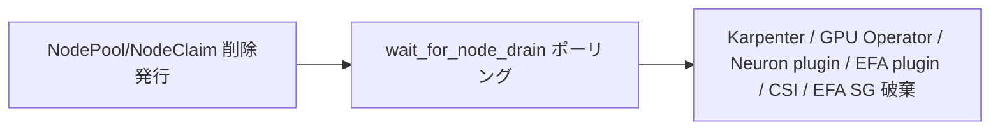

## この記事でわかること

NVIDIA GPU と AWS Trainium/Inferentia（Neuron）の両方を、同じ EKS クラスタ上で Karpenter によって動的にプロビジョニングするための Terraform モジュールを解説する。対象リポジトリは以下。

https://github.com/littlemex/distributed-ai/tree/main/infra/eks

このモジュールが解いている課題は次の3つである。

- GPU 訓練、GPU/Trainium 推論、Capacity Block（以下 CB）を使った期間限定の大規模実験という、形の異なるワークロードを1つのモジュールで表現したい
- EFA（Elastic Fabric Adapter）のトポロジをインスタンスタイプごとに手作業で書くのは事故が起きやすいので自動導出したい
- `terraform destroy` がアクセラレータノードを取り残して課金が止まらない、という事故を構造的に防ぎたい

記事の主眼は「`accelerator_pools` という1つの map 変数で全アクセラレータプールを表現する」という設計と、その裏にある VPC / Karpenter / アドオン / ストレージの全体アーキテクチャである。Trainium 対応は「設計上は入っているが検証未了」という位置づけで簡潔に触れる。

## 全体アーキテクチャ

モジュールが作るリソースを一望すると次のようになる。

```
VPC (/16 — GPU/Neuron ノード + EFA-only ENI が IP を大量消費するためサイズを大きく取る)
│
├─ EKS コントロールプレーン ...... Kubernetes 1.35, Pod Identity
│
├─ システム管理ノードグループ .... m5 系 x2: kube-system, Karpenter コントローラ, 各オペレータ
│
├─ Karpenter NodePool ........... accelerator_pools の1エントリにつき1つ、各々単一AZに固定
│    ├─ gpu / on-demand|spot ..... nvidia.com/gpu, EFA（例: g6e）
│    ├─ gpu / reserved (CB) ...... nvidia.com/gpu, EFA multi-card（例: p5en = H200 x8）
│    └─ neuron / reserved (CB) ... aws.amazon.com/neuron, EFA multi-card（例: trn2）
│
├─ 条件付きアドオン .............. GPU Operator / Neuron device plugin / EFA device plugin / MPI Operator
└─ 共有ストレージ（任意） ........ EFS（RWX, マルチAZ）/ FSx for Lustre（単一AZ スクラッチ）
```

ファイル構成は次のとおりで、責務ごとに `.tf` を分けている。

| ファイル | 役割 |
|---|---|
| `vpc.tf` | VPC 本体（/16、private /18 x2、public /24 x2） |
| `eks.tf` | EKS クラスタ本体（`terraform-aws-modules/eks/aws` v21.24.0、K8s 1.35） |
| `karpenter.tf` | Karpenter Helm リリース、CRD 分離、destroy 時の drain 待機 |
| `karpenter-resources.tf` | `accelerator_pools` から NodePool + EC2NodeClass を `for_each` で生成 |
| `gpu-addons.tf` | GPU Operator / EFA device plugin / MPI Operator（条件付き） |
| `neuron-addons.tf` | Neuron device plugin + Scheduler Extension（条件付き） |
| `efs.tf` / `fsx.tf` | 共有ストレージ |
| `sg.tf` | EFA ノード間通信用セキュリティグループ |
| `vpc-endpoints.tf` | EC2/STS/SSM の Interface VPC エンドポイント |
| `eventbridge-cb-alarm.tf` | CB 期限前アラーム |
| `scripts/` | CB ライフサイクル用ヘルパースクリプト（00〜04） |
| `manifests/` | ワークロードのテンプレート・マニフェスト |

### VPC / サブネット設計 — なぜ /16 が必要か

VPC の CIDR は `/16`（65,536 アドレス）を既定にしている。理由はアクセラレータノードの IP 消費が通常の EKS ノードとは桁違いだからである。

- VPC CNI が1ノードあたり複数のセカンダリ ENI/IP を割り当てる
- EFA-only ENI が加わる。`trn2.48xlarge`/`p5en.48xlarge` は16枚、`p5.48xlarge` は32枚のネットワークカードを持ち、そのうち primary の1枚を除いた残りがすべて EFA-only の別 ENI として node に付与される

この2つが重なると、GPU/Neuron ノード1台がプレーンな CPU ノードの何倍もの IP を占有する。private subnet を `/18`（16,384 アドレス）×2 AZ にしているのはこのためで、少数のアクセラレータノードでサブネットの IP を使い切って新規ノードが `Pending` のまま詰まる、という事故を避ける設計である。一方 public subnet は NAT ゲートウェイとロードバランサだけが載るので `/24`（実効251）で十分に小さく保っている。

```hcl
# vpc.tf
module "vpc" {
  source  = "terraform-aws-modules/vpc/aws"
  version = "~> 5.0"

  cidr            = var.vpc_cidr             # 既定 /16
  azs             = var.azs
  private_subnets = var.private_subnet_cidrs # 既定 /18 x2
  public_subnets  = var.public_subnet_cidrs  # 既定 /24 x2

  enable_nat_gateway = true
  single_nat_gateway = true
}
```

`karpenter.sh/discovery` タグは private subnet と node security group にだけ付与し、VPC 全体の共通タグ（`cluster_tags`）には**意図的に含めていない**。これは後述する「discovery タグを全サブネットに付けると public subnet に CPU ノードが置かれる」という罠の予防策であり、設計判断そのものが罠の裏返しになっている。

### EKS クラスタ構成

`terraform-aws-modules/eks/aws` v21.24.0 で Kubernetes 1.35 を構築する。ポイントは以下。

- `vpc-cni` は `before_compute = true` でノード起動前に必須アドオンとして入れる
- `eks-pod-identity-agent` も `before_compute = true`。Pod Identity で認証するコントローラ（Karpenter、EBS/EFS/FSx の CSI ドライバ）はこのエージェントより先には動けないため
- `aws-ebs-csi-driver` は Pod Identity 経由で IAM ロールを渡す。ここを省くとドライバが EC2 IMDS ロールを見つけられずクラッシュし、アドオンが `CREATING` のまま `apply` がブロックされる
- システム管理ノードグループ（`m5` 系 x2）は `karpenter.sh/controller=true` ラベルを持ち、Karpenter コントローラ自身をここに固定する。Karpenter が管理するノードの上で Karpenter 自身が動く、という自己参照を避けるための分離である
- IRSA 用の OIDC プロバイダはモジュール（`terraform-aws-modules/eks/aws`）の既定で作成されるが、本モジュールの全コントローラ（Karpenter、EBS/EFS/FSx CSI ドライバ）は Pod Identity で認証しており、IRSA は実質未使用である

```hcl
# eks.tf（抜粋）
eks_managed_node_groups = {
  system = {
    ami_type       = var.system_node_ami_type
    instance_types = var.system_node_instance_types
    labels = {
      "karpenter.sh/controller" = "true"
    }
  }
}
```

### アクセラレータノード（Karpenter NodePool / EC2NodeClass）

`accelerator_pools` の各エントリが `for_each` で1組の `NodePool` + `EC2NodeClass` になる。詳細は設計判断の章で述べるが、ここでは NodePool 側の要点だけ押さえる。

- 全アクセラレータノードに `nvidia.com/gpu` または `aws.amazon.com/neuron` の `NoSchedule` taint を付与する。**NVIDIA/Neuron のデバイスプラグインも GPU Operator も、自分では taint を打たない**。これをやらないと coredns のレプリカや Ray head のような一般ワークロードが GPU ノードに紛れ込んで居座り、`consolidationPolicy: WhenEmpty` が永遠に発火せず高額なノードが遊んだまま課金され続ける
- `topology.kubernetes.io/zone` requirement で単一 AZ に固定する。EFA/RDMA トラフィックはサブネットをまたいでルーティングできず、CB もそもそも AZ を選べないため、複数 AZ への分散は選択肢にない
- `disruption.budgets` は `reserved`（CB）プールでは `nodes = "0"`。Karpenter v1 の drift 検知は `consolidationPolicy`/`expireAfter` と独立に動作し、新しい AMI が出ると稼働中の CB ノードでも `Drifted` とマークして入れ替えようとする。訓練の途中でノードを差し替えられるのは事故そのものなので、CB 予約期間中は disruption を budget レベルで完全に止める

### 条件付きアドオン

`locals.tf` で3つのフラグを `accelerator_pools` から導出し、各アドオンの `count`/`for_each` に流し込む。

```hcl
has_gpu_pool    = length([for k, p in var.accelerator_pools : k if p.device_plugin == "nvidia"]) > 0
has_neuron_pool = length([for k, p in var.accelerator_pools : k if p.device_plugin == "neuron"]) > 0
has_efa_pool    = length([for k, e in local.pool_efa : k if e.count > 0]) > 0
```

GPU 専用クラスタは Neuron コンポーネントを一切入れず、Neuron 専用クラスタは GPU Operator を一切入れない。混在クラスタでは両方入る。EFA device plugin は GPU/Neuron 両方の taint（`nvidia.com/gpu` と `aws.amazon.com/neuron`）と CB 特有の `capacity-reservation` taint を tolerate するよう構成している。EFA は GPU/Neuron 双方が共有するリソースだからで、Neuron 用の toleration を1つ落とすだけで trn2 ノードに EFA プラグインが乗らなくなり `vpc.amazonaws.com/efa` が広告されない、という不具合につながる。

MPI Operator は複数ノードにまたがる `MPIJob` の起動元として使うが、リリースタグの YAML を plan 時に HTTP フェッチせず `manifests/mpi-operator-<version>.yaml` としてリポジトリにベンダリングしている。アップストリームのタグは可変であり、plan 時のネットワーク依存はそれ自体が不安定要因になるためである。

### 共有ストレージ（EFS / FSx for Lustre）

用途で使い分けている。

- **EFS**（`efs.tf`）: マルチ AZ・ReadWriteMany。NEFF（Neuron コンパイル済みモデル）や Hugging Face キャッシュのように「複数の Pod が読む」「ノードが入れ替わっても再コンパイルさせたくない」データに向く。private subnet ごとにマウントターゲットを置くので、どの AZ の Pod からでも同じキャッシュを読める
- **FSx for Lustre**（`fsx.tf`）: 単一 AZ・高スループットのスクラッチ領域。訓練データセットの読み出しなど帯域が要る用途向け。既定で無効（`fsx_enabled = false`）にしているのは、`PERSISTENT_2` SSD がプロビジョニングした容量分を存在している間ずっと課金するため

FSx は静的プロビジョニングのみである点も明記しておく。`aws-fsx-csi-driver` は新規ファイルシステムの動的作成はできるが、既存のファイルシステムへの動的バインドはできない。そのためこのモジュールは固定の `volumeHandle` を持つ `PersistentVolume`（`fsx-training`）を1つだけ作り、`StorageClass` は用意しない。PVC は名前でこの PV にバインドする運用になる（根拠: [aws-fsx-csi-driver の既知制約](https://github.com/kubernetes-sigs/aws-fsx-csi-driver/issues/400)）。

KEDA（スケールtoゼロ）と Mountpoint for Amazon S3 CSI driver は意図的に含めていない。前者はワークロード層のスケーリング方針、後者はモデル重みの取得方法であり、いずれもクラスタインフラの関心事ではないという線引きである。

## 設計判断

### 単一 map 変数 (`accelerator_pools`) で GPU/Neuron を統一的に記述する

このモジュールの中心的な抽象化が `accelerator_pools` である。1つのエントリが1つの `NodePool` + `EC2NodeClass` に対応し、GPU と Neuron を同じスキーマで表現する。

```hcl
accelerator_pools = {
  gpu-dev = {
    instance_types = ["g6e.12xlarge"]
    device_plugin  = "nvidia"
    capacity_type  = "on-demand"
    zone           = "us-east-2a"
    # EFA はここから自動導出: 1 interface, single-card
  }

  gpu-p5en = {
    instance_types    = ["p5en.48xlarge"]
    device_plugin     = "nvidia"
    capacity_type     = "reserved"
    zone              = "us-east-2a"
    cb_reservation_id = "cr-REPLACE_ME"
    cb_end_date       = "2026-01-01T12:00:00Z"
    volume_size       = "500Gi"
    # EFA 自動導出: 16 interfaces, multi-card（15 schedulable）
  }

  trn2-serving = {
    instance_types    = ["trn2.48xlarge"]
    device_plugin     = "neuron"
    capacity_type     = "reserved"
    zone              = "us-east-2b"
    cb_reservation_id = "cr-REPLACE_ME"
    ami_ssm_parameter = "/aws/service/eks/optimized-ami/1.35/amazon-linux-2023/x86_64/neuron/recommended/image_id"
    volume_size       = "500Gi"
  }
}
```

なぜ GPU と Neuron を分けたリソースブロックにしなかったのか。両者は Karpenter からは「taint が違うだけの似た形のノード」であり、`device_plugin` フィールド1つで分岐すれば `EC2NodeClass`/`NodePool` のレンダリングロジック自体は完全に共通化できる。GPU 専用の HCL ブロックと Neuron 専用の HCL ブロックを別々に持つと、EFA トポロジの計算や destroy 順序制御のようなロジックを2箇所に複製することになり、修正漏れの温床になる。`capacity_type` に `reserved`/`on-demand`/`spot` を混在させられる設計も同じ発想で、1クラスタ内に「On-Demand の開発用プール」「Spot の実験用プール」「Reserved の本番訓練プール」を同時に持てる。

### EFA トポロジの自動導出 — なぜ手動で書かせないか

EFA のインターフェース数とレイアウトは、インスタンスタイプごとの固定値である。`locals.tf` にルックアップテーブルを置き、ここから導出する。

```hcl
efa_capability = {
  "p5.48xlarge"    = { cards = 32, multi_card = true }
  "p5en.48xlarge"  = { cards = 16, multi_card = true }
  "trn2.48xlarge"  = { cards = 16, multi_card = true }
  "trn1.32xlarge"  = { cards = 8,  multi_card = true }
  "g6e.12xlarge"   = { cards = 1,  multi_card = false }
  "g5.12xlarge"    = { cards = 0,  multi_card = false } # EFA非対応も明示
  # ...
}
```

これを手で書かせない理由は単純で、間違えたときの症状が分かりにくいからである。EFA の枚数を1つ多く書けば `RunInstances` が失敗してノードが起動ループに陥り、原因は Karpenter のイベントログにしか出ない。逆に見落として `0` のまま流れると、ノードは普通に起動し NCCL は黙って TCP フォールバックする——「動くが遅い」という一番検知しづらい失敗モードになる。

そこで4つのガード（precondition）を `karpenter-resources.tf` に置き、apply 時点で機械的に弾く構成にした。

1. 1プール内の `instance_types` が異なる EFA トポロジを混在させていないか
2. multi-card 系のインスタンスが誤って single-card レイアウトに解決されていないか
3. ルックアップテーブルに存在しない未知のインスタンスタイプで、かつ `efa_interface_count` の明示指定もない場合（黙って EFA=0 にフォールバックさせない）
4. 手動オーバーライドした `efa_interface_count` が物理カード数を超えていないか

さらに、multi-card レイアウトでは「カード0はノードの primary ENI（IP を持つ）に使われ、EFA-only としては広告されない」という非対称性があるため、Pod がリクエストできる**実際の schedulable EFA 数**（= カード数 − 1、single-card の場合はカード数そのまま）を `local.pool_efa_schedulable` として算出し、`terraform output accelerator_pool_efa_schedulable` で公開している。p5en.48xlarge は16カードだが Pod がリクエストできるのは15枚までで、16と書くと永久に `Pending` になる。この非対称性は Karpenter や EFA device plugin のドキュメントを読んだだけでは気づきにくく、実測して初めて分かった値である。

### Capacity Block のライフサイクル管理（スクリプト + EventBridge）

CB は「予約時に前払いで確定する期間限定のキャパシティ」という特性上、通常の On-Demand/Spot とは運用フローが異なる。このモジュールは Terraform リソースそのものと、CB の売買という Terraform の外側にある操作（オファリング検索、購入確定）を分けて扱っている。

```bash
./scripts/00-check-cb-offerings.sh                                    # オファリング検索
./scripts/01-purchase-cb.sh --offering-id <id> ...                    # 購入（確認プロンプトあり）
./scripts/02-post-purchase.sh --cr-id cr-... ...                      # 貼り付け用 pool ブロックを出力
terraform apply
./scripts/03-verify-nccl.sh --nodes 2 --gpus-per-node 8               # NCCL/EFA 疎通確認
./scripts/04-teardown.sh [--destroy]
```

CB は Terraform のリソースグラフの外で購入が確定するため、`terraform apply` の前に「予約 ID を得る」というステップが必ず要る。`02-post-purchase.sh` は購入済みの予約情報から `accelerator_pools` に貼り付け可能な HCL ブロックを直接出力するようにし、予約 ID・AZ・インスタンスタイプの手打ちによる転記ミスを減らしている。

さらに `capacity-block.tf` が `cb_reservation_id` から予約のメタデータ（`end_date`、`availability_zone`、`state`）を `aws ec2 describe-capacity-reservations` で自動解決する。これにより終了日時や AZ を手コピーする必要がなくなり、`cb_end_date` を tfvars に明記しなくても EventBridge アラームが正しい時刻で発火する。Terraform の `check` ブロックは予約の state が `active` でない場合や zone の不整合を WARNING として表示するが、apply 自体は止めない。これは意図的で、`expired` 状態で NodePool の `for_each` をゲートすると NodePool 自体が破壊され稼働中の Pod が消えるためである。

もう一つの運用課題が「予約はいつか切れる」という点である。`cb_end_date`（RFC3339, UTC 必須）を pool に設定すると、`eventbridge-cb-alarm.tf` がその1時間前に発火する EventBridge Scheduler の `at()` 式を1つずつ生成し、SNS 経由でメール通知する。スケジュールは `action_after_completion = "DELETE"` で一度発火すると自身を削除する。ここで注意が必要なのは、一度発火して消えたスケジュールを次の `plan` が再作成しようとしないよう、アラート時刻が過去になったプールは `for_each` の対象から明示的に除外している点である。これをやらないと、EventBridge Scheduler API が過去時刻の `at()` 式を拒否し、`apply` が失敗し続ける。

### destroy の安全性（`wait_for_node_drain` + VPC エンドポイント）

最も実運用寄りの設計判断がここにある。`kubectl_manifest` は `NodePool`/`NodeClaim` の削除リクエストが Kubernetes API に**受理された**時点で「削除完了」を返す。しかし実際のノードドレイン・EC2 インスタンス終了・ENI 解放は Karpenter コントローラが非同期に行う裏側の処理であり、API 受理と実終了の間には数分から十数分のギャップがある。

このギャップの間に Karpenter 本体やデバイスプラグイン、EFS/FSx の CSI ドライバ、EFA 用セキュリティグループを先に消してしまうと、まだ存在している EC2 インスタンスの後始末をする者がいなくなり、ノードが孤立して課金され続ける。これを防ぐために `null_resource.wait_for_node_drain`（`karpenter.tf`）を置き、`kubectl get nodeclaims` が空になるまで（最大30分、10秒間隔でポーリング）待った上で、初めて Karpenter とその周辺コントローラの破棄を許可する構成にしている。

```hcl
resource "null_resource" "wait_for_node_drain" {
  depends_on = [
    helm_release.karpenter,
    helm_release.gpu_operator,
    helm_release.aws_efa_k8s_device_plugin,
    helm_release.neuron,
    aws_eks_addon.efs_csi_driver,
    aws_eks_addon.fsx_csi_driver,
    aws_security_group.efa_node,
    aws_vpc_endpoint.interface,
    aws_vpc_endpoint.s3,
  ]
  provisioner "local-exec" {
    when = destroy
    # kubectl get nodeclaims が空になるまでポーリング（最大30分）
  }
}
```

Terraform の destroy は `depends_on` の逆順で実行されるので、この1つのリソースに「後始末が必要な全コントローラ」を `depends_on` させておけば、破棄順序は「NodePool/NodeClaim の削除発行 → この待機 → Karpenter本体・各アドオン・EFA SG」という一直線になる。



さらに、この待機中に別の落とし穴が実測で見つかった。CB のようなアクセラレータノードが生きている状態で `terraform destroy` を実行すると、（Karpenter とは Terraform 上の依存関係がない）NAT ゲートウェイが先に消えることがある。Karpenter コントローラは private subnet で動いており EC2/IAM/STS/SSM への API 呼び出しは NAT 経由のインターネット到達性に依存しているため、NAT が消えた瞬間にすべての API 呼び出しがタイムアウトし、NodeClaim のファイナライザを二度と外せなくなる——結果、待機はタイムアウトまで空転する。

この問題を、Karpenter コントローラ側の改修ではなくネットワーク層で塞いだのが `vpc-endpoints.tf` である。EC2/STS/SSM の Interface VPC エンドポイントと S3 の Gateway エンドポイントを追加し、`wait_for_node_drain` をこれらのエンドポイントにも `depends_on` させることで、NAT が消えても Karpenter の API 呼び出しが生き続けるようにしている。ただし IAM には region 単位の Interface VPC エンドポイントが存在しない（グローバルサービスのため）。そのため `ListInstanceProfiles` のような IAM 呼び出しは依然 NAT 依存が残る、という限界も残っている。実際、`EC2NodeClass` のファイナライザ解除はこの IAM 呼び出しに依存しており、NAT が既に消えていると解除されないまま `helm_release.karpenter_crd` の破棄が `context deadline exceeded` で止まることがある。この待機はここだけ「タイムアウトしても destroy 全体を失敗させない」ベストエフォート扱いにしており、その根拠は「その時点で EC2 インスタンス自体は既に終了確認済みで、課金インパクトのない Kubernetes オブジェクトが残るだけ」という判断である。

## Capacity Block + Karpenter で踏んだ罠と対処

実測とクラスタ観察で見つかった代表的な Gotcha を厳選して紹介する。

**1. `capacity-type` の値は `capacity-block` ではなく `reserved`。**
Karpenter v1 の `karpenter.sh/capacity-type` ラベルが受け付ける値は `on-demand`/`spot`/`reserved` の3つで、`capacity-block` という値は存在しない。これを間違えると NodePool の requirement に一致するノードが永久に見つからず、CB ノードが一切プロビジョニングされない。

**2. `featureGates.reservedCapacity` は Helm value ではない。**
Karpenter 1.13.0 チャートでは CB サポート（`ReservedCapacity`）はコンパイル時のデフォルトで有効になっており、Helm の `values` として渡す必要がない。渡すと Helm チャートに存在しないキーとして拒否される。

**3. `expireAfter` は ISO 8601 ではなく Go の duration 文字列。**
`"P1D"` のような ISO 8601 形式は受理されず、`"24h"` のような Go duration 文字列でなければならない。

**4. p5en は16カードあるのに、Pod がリクエストできる EFA は15枚。**
前述の schedulable EFA の非対称性そのもの。カード0はノードの primary ENI に使われ EFA-only としては数えられないため、`vpc.amazonaws.com/efa: "16"` を要求すると永久に `Pending` になる。`terraform output accelerator_pool_efa_schedulable` の値を必ず参照する。

**5. `NCCL_SOCKET_IFNAME` は許可パターンではなく除外パターンで書く。**
`NCCL_SOCKET_IFNAME=efa0,efa1,...` のような許可リスト方式で書くと、意図に反して NCCL が EFA インターフェースを見つけられず TCP にフォールバックすることがある。正しいパターンは除外方式の `NCCL_SOCKET_IFNAME=^lo,docker,veth` であり、これなら EFA を含むそれ以外のすべてのインターフェースを候補として残せる。

**6. EFA セキュリティグループには egress にも self-referencing ルールが必要。**
EFA の SRD トラフィックは通常の IP トラフィックではないため、`0.0.0.0/0` の CIDR egress ルールでは許可されない。ingress と egress の両方に self-referencing all-traffic ルール（`source_security_group_id = self`）が必要。egress self-ref が無い場合、NCCL は bootstrap（TCP）に成功して `Selected provider is efa` を表示するが、実際のデータ転送で `NET/OFI ... Error 15 (Unreachable remote)` が出てハングする。「EFA が選ばれたのにデータが流れない」という極めて診断困難な障害になる。

**7. `karpenter.sh/discovery` タグを全サブネットに付けると、CPU ノードが public subnet に置かれる。**
Karpenter の subnet discovery はタグだけで判定するため、public subnet にも discovery タグを付けてしまうと、そこには IGW ルートしかなく（`MapPublicIpOnLaunch=false` でも）ノードが EC2 API に到達できないサブネットにノードが立ってしまい、`nodeadm` がクラスタに参加できないまま詰まる。discovery タグは private subnet だけに絞る必要がある（`vpc.tf` の `private_subnet_tags` 参照）。

このほかにも、Karpenter CRD が別チャートで管理されていないと `helm upgrade` で CRD スキーマが更新されない問題、EC2NodeClass の `interfaceType` が `"efa"` ではなく `"efa-only"`/`"interface"` の2値しか受け付けない問題など、細かい罠は多数ある。詳細はリポジトリの README の Gotchas 表を参照してほしい。

## 実測検証

2026年7月、us-east-2 の単一クラスタ（2 AZ 構成）でスモークスケールの検証を行った。ベンチマークではなく「各パスが最初から最後まで動くこと」の確認が目的である。

| ワークロード | 環境 | 結果 |
|---|---|---|
| PyTorch DDP（gloo） | CPU プール、2ノード | 完了。損失が減少し、共有ストレージにチェックポイントを書き込み |
| FSDP, Llama-3.2-1B | 1x p5en.48xlarge（H200 x8） | 完了。約99 TFLOPS/GPU、約114k tokens/s。NCCL ログで `aws-ofi-nccl`/libfabric 経由の EFA トランスポートを確認 |
| vLLM 推論（Cosmos-Reason1-7B） | 1x H200 | サーバー正常稼働、OpenAI 互換のレスポンスを確認 |
| miles GRPO（Megatron + SGLang、Qwen3-4B colocated） | 2x p5en.48xlarge（H200 x16） | 完了。2ノード EFA 経由で 3 rollout 成功（raw_reward 0.48/0.52/0.49）。NCCL ログで `efa-direct` 確認 |

FSDP のケースでは NCCL のログに `NET/OFI Selected provider is efa` が出力されており、EFA トランスポートが確かに選択されていることを実測で裏付けている。TCP フォールバックしていないことを目視で確認できるログという意味で、これは前述の `NCCL_SOCKET_IFNAME` の罠を踏んでいないことの直接的な証拠にもなっている。

## 既存アプローチとの比較

分散 AI 向けの EKS 環境構築には既にいくつかの選択肢がある。

**awslabs/awsome-distributed-ai** は、EFA・NCCL テスト・訓練サンプルまでを含む豊富なリファレンス実装群であり、個々のコンポーネントの正しい組み合わせ方を学ぶ上で最も参照価値が高い。一方でリファレンス実装の性質上、「1つの `accelerator_pools` エントリを増やすだけで GPU/Neuron 混在クラスタに拡張する」というような、パラメータ化された単一モジュールとしての再利用性は主眼に置かれていない。本モジュールは awsome-distributed-ai の public subnet CIDR 設計などいくつかの構成を踏襲しつつ、EFA トポロジの自動導出や CB のライフサイクル管理、destroy 安全性のような運用面の責務を Terraform モジュール内に閉じ込める方向に踏み込んでいる。

**HyperPod on EKS** は、Amazon SageMaker HyperPod が EKS をオーケストレーション基盤として使うマネージド型の構成であり、ノードのヘルスチェックやリカバリ、ジョブスケジューリングなど、より高レベルなクラスタ運用機能を提供する。マネージドである分、GPU/Trainium/CB を横断する Karpenter ベースの NodePool 設計を自分で完全にコントロールしたい、あるいは HyperPod の運用モデルに乗らない独自のワークロード構成（本モジュールの `accelerator_pools` のような表現力）を必要とするケースでは、素の EKS + Karpenter を自前で組む本モジュールのアプローチに利がある。逆に、大規模クラスタの継続運用や耐障害性のマネージド機能そのものが目的であれば、HyperPod on EKS の採用が合理的である。

本モジュールの立ち位置は、両者の中間にある「小〜中規模のマルチアクセラレータ実験基盤を、Terraform 1本で再現可能に立ち上げ・壊せるようにする」ことに絞ったリファレンスである。

## 今後の展望

Neuron（Trainium）についてはシングルノードの device plugin 連携は確認済みだが、マルチノードでの EFA 越しの Neuron 集合通信は**設計上組み込まれているが未検証**である。EFA device plugin の toleration には Neuron の taint が含まれており、`trn2.48xlarge` の EFA トポロジもルックアップテーブルには入っている。実際にマルチノードの CB を確保して NCCL 相当の集合通信（Neuron Collective Communication Library）を検証するのが次のステップになる。

その他、残っているテーマは以下のとおり。

- slime 本家（miles フォーク元）での GRPO マルチノード実行を追試する
- Amazon SageMaker HyperPod on EKS との連携・比較を、実運用ワークロードで深掘りする
- CB の購入〜運用〜期限管理までのスクリプト群をさらに堅牢化する

## まとめ

このモジュールが目指しているのは、「GPU/Neuron が混在する分散 AI 基盤を、Terraform だけで再現可能に立てて、確実に壊せる」という地味だが実運用で最も事故が起きやすい部分を固めることである。`accelerator_pools` という単一の抽象化で GPU/Neuron/On-Demand/Spot/Reserved を統一的に記述し、EFA トポロジの自動導出と4段のガードで人為的ミスを機械的に弾き、`wait_for_node_drain` と VPC エンドポイントで destroy 時の孤立ノード課金を防ぐ——これらはいずれも「動くコードを書く」だけでは出てこない、実測とクラスタ観察の積み重ねから生まれた設計判断である。

本記事で紹介したモジュールの詳細なハンズオン手順、Capacity Block の運用ノウハウ、Neuron/Trainium 検証の進捗は、Zenn book『EKS で始める分散 AI 基盤』として順次公開予定。当面のハンズオン手順は [USAGE.md](https://github.com/littlemex/distributed-ai/blob/main/infra/eks/USAGE.md) を参照してほしい。
