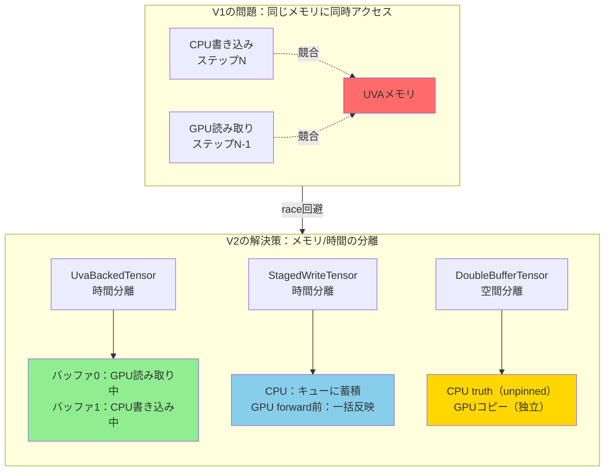

## はじめに

:::message
**記事の目的**

vLLM v0.17.0、v0.18.0、v0.19.0 のアップデートを中心に、**Model Runner V2（MRV2）** の設計思想と実装を深掘りします。なぜ V1 から刷新する必要があったのか、何が変わったのか、そして各バージョンでどのように機能が追加されたのかを、コードレベルで解説します。
:::

vLLM は 2026 年 3 月、Model Runner V2（MRV2）を公開しました。これは vLLM V1 リリース以来蓄積してきた技術的負債を解消し、Model Runner を「モジュラー・GPU ネイティブ・非同期ファースト」の 3 原則で再設計したものです。

https://vllm.ai/blog/mrv2

v0.17.0 から実験的機能として利用可能となり、v0.18.0 では確率的棄却サンプリングや WhisperModelState、v0.19.0 では投機的デコーディングの greedy サンプリング対応や EPLB など、実用的な機能が段階的に追加されています。

```bash
# v0.17.0 から試せる
export VLLM_USE_V2_MODEL_RUNNER=1
```

以前のリリースノート解説は以下です。

https://zenn.dev/tosshi/articles/d2ed7115cf4578

## なぜ Model Runner V2 が必要だったか

vLLM V1 のリリース以来、Model Runner は機能と最適化が段階的に追加された結果、相当な技術的負債を蓄積してきました。

問題は 4 つに集約されます。

**1. 絡み合った永続バッチ状態**

ステップごとの入力と永続バッチ状態が密結合していました。リクエストの追加・削除・並び替えのたびに、[`CachedRequestState`](https://github.com/vllm-project/vllm/blob/main/vllm/v1/worker/gpu_input_batch.py#L30) という冗長なバックアップコピーが必要でした。

**2. 脆弱な非同期実行**

非同期スケジューリングは後付けで実装されたため、既存機能との共存に不自然で過度に複雑なロジックが必要でした。

**3. CPU バウンドなブックキーピング**

入力準備（`input_ids`, `positions`, `attn_metadata`）やサンプリングが多数の細粒度 CPU 操作に依存しており、GPU のスループット向上の恩恵を受けにくい状態でした。

**4. 困難な拡張性**

コアの [`gpu_model_runner.py`](https://github.com/vllm-project/vllm/blob/main/vllm/v1/worker/gpu_model_runner.py) が 6,700 行を超え、新しいモデルや機能（Eagle3、MLA、Hybrid SSM など）の追加が困難になっていました。

## 3 つのコア設計原則

MRV2 はこれらの問題を解決するため、以下の 3 原則を設計の中心に据えています。

### 1. モジュラーであること

モデル固有のロジック（M-RoPE、マルチモーダルエンコーダー、アテンションメタデータ準備）を共通実行パスから分離します。この分離を実現するのが後述の [`ModelState`](https://github.com/vllm-project/vllm/blob/main/vllm/v1/worker/gpu/model_states/interface.py#L20) アーキテクチャです。

### 2. GPU ネイティブであること

CPU 側の Python 操作で構築していた入力テンソルを、Triton カーネルで GPU 上に直接構築します。UVA（Unified Virtual Addressing）により GPU が CPU 常駐テンソルを直接参照できるため、明示的なコピーコストが削減されます。

**UVA とは**: CUDA 4.0 で導入された機能で、CPU（ホスト）メモリと GPU（デバイス）メモリを単一の仮想アドレス空間に統合します。従来は `cudaMemcpy` による明示的なコピーが必要でしたが、UVA では**ピン留めメモリ**（Page-Locked Memory、OS がページアウトしない固定メモリ領域）に GPU 仮想アドレスを割り当て、GPU カーネルから PCIe 経由で直接アクセス（ゼロコピー）できます。通常の CPU メモリ（unpinned）は GPU から直接アクセスできません。

vLLM では、ブロックテーブルなどの入力テンソルをピン留めメモリに配置し、GPU から直接参照することで CPU-GPU 間の明示的なコピーを削減しています（[`UvaBuffer`](https://github.com/vllm-project/vllm/blob/main/vllm/v1/worker/gpu/buffer_utils.py#L36-L43)、[`UvaBackedTensor`](https://github.com/vllm-project/vllm/blob/main/vllm/v1/worker/gpu/buffer_utils.py#L81-L98)）。また、GPU VRAM に収まらないモデルの重みを CPU メモリに退避し、UVA 経由でアクセスする Weight Offloading にも活用されています。

**Unified Memory との違い**: `cudaMallocManaged`（CUDA 6.0 の Unified Memory）はページフォルトベースでデータを自動移動しますが、UVA はアドレス空間の統合のみでデータ移動は行いません。PCIe 帯域は GPU VRAM 帯域より大幅に遅いため、UVA はアクセス頻度の低いデータに適用します。

### 3. 非同期ファーストであること

非同期実行を後付けではなく設計上の制約として扱います。スケジューラが Step N+1 の入力を準備する間、GPU が Step N を実行するオーバーラップが設計から自然に生まれます。


*V1 の非同期スケジューリング -- CPU が次ステップを準備しながら GPU が現ステップを実行。ただし同期ポイントが残存している*


*MRV2 の非同期スケジューリング（投機的デコーディング時）-- GPU サイドの準備カーネルが棄却サンプリング結果を直接消費し、CPU-GPU 同期ポイントをゼロにする*

## 主要なアーキテクチャ変更

### 永続バッチ状態の再設計

V1 の問題の根本は、リクエストの順序に依存した状態管理でした。MRV2 では以下の方式に変更しています。

```
V1: [req_0, req_1, req_2, ...]  ← リクエスト追加・削除のたびに全テンソルを並び替え

V2: 固定サイズ状態テーブル（max_num_reqs 行）
    行 0: req_A  ← 追加時に空き行に割り当て
    行 1: req_B  ← ライフタイム終了まで行番号不変
    行 2: (空き)
    行 3: req_C
```

各リクエストには永続的な行番号が割り当てられ、プリエンプション時は「完了」として扱われます。ステップごとの入力は GPU gather 操作で低オーバーヘッドに構築されます。


*V1 -- リクエストの順序がブロックテーブルのレイアウトと密結合しており、追加・削除のたびに複雑な並び替えが必要*


*MRV2 -- 永続的な状態テーブルをステップごとの入力レイアウトから独立して管理。gather 操作で毎ステップ正しい順序の入力を生成する*

### 非同期バリアの廃止と Race Condition 防止（[PR #32083](https://github.com/vllm-project/vllm/pull/32083)）

#### なぜ async_barrier が必要だったのか

MRV2 の非同期スケジューリングでは、**CPU がステップ N のバッチ状態を更新しながら、GPU がステップ N-1 の forward pass を実行している**という重なりが生じます。

V1 の `UvaBuffer` は UVA によってピン留め CPU メモリと GPU が同じ物理アドレスを共有していました。

```python
# V1 の UvaBuffer（問題のある設計）
class UvaBuffer:
    def __init__(self, ...):
        self.cpu = torch.zeros(..., pin_memory=True)
        self.gpu = get_cuda_view_from_cpu_tensor(self.cpu)
        # self.gpu と self.cpu は同じ物理メモリのエイリアス
```

この設計では、**GPU がステップ N-1 の forward pass で `uva.gpu` を読んでいる最中に、CPU が `uva.cpu`（同じ物理メモリ）にステップ N のデータを書き込む**と data race が発生します。

`async_barrier` はコンテキストマネージャとして実装され、`event.synchronize()` で「GPU が前ステップで UVA メモリを最後に読み終えた」ことを CPU が待ってから書き込みを開始し、書き込み完了後に `event.record()` で GPU 側に通知する仕組みでした。つまり **UVA の同一物理メモリへの CPU 書き込みと GPU 読み取りを排他制御するためのバリア**でした。

しかし `async_barrier` は見落としやすく、「バリアスコープ内に全 CPU 処理を収める」という制約が非同期スケジューリングの柔軟性を損ねていました。

#### MRV2 の解決策：設計でレースを排除

MRV2 では `async_barrier` を廃止し、**CPU と GPU が競合するメモリを設計上存在させない**アプローチに転換しました。4 種類のバッファ抽象化を導入しています。

| 抽象化 | 設計の要点 |
|--------|-----------|
| [`UvaBuffer`](https://github.com/vllm-project/vllm/blob/main/vllm/v1/worker/gpu/buffer_utils.py#L36-L43) | ピン留めメモリの thin wrapper。他の抽象化から使われる基盤部品 |
| [`UvaBackedTensor`](https://github.com/vllm-project/vllm/blob/main/vllm/v1/worker/gpu/buffer_utils.py#L81-L98) | CPU 側は **unpinned**（GPU から直接アクセス不可）。複数の UVA バッファを[ラウンドロビンで切り替える](https://github.com/vllm-project/vllm/blob/main/vllm/v1/worker/gpu/buffer_utils.py#L39-L47)ことで、GPU が読んでいるバッファとは別のバッファに CPU が書き込む |
| [`StagedWriteTensor`](https://github.com/vllm-project/vllm/blob/main/vllm/v1/worker/gpu/buffer_utils.py#L101-L191) | CPU の変更を[キューに蓄積](https://github.com/vllm-project/vllm/blob/main/vllm/v1/worker/gpu/buffer_utils.py#L131-L147)し、GPU forward pass の直前に [Triton カーネルで一括 scatter write](https://github.com/vllm-project/vllm/blob/main/vllm/v1/worker/gpu/buffer_utils.py#L148-L178)。CPU は GPU メモリに直接書き込まない |
| `DoubleBufferTensor` | CPU 側 truth は unpinned。GPU 側は独立した GPU メモリのコピー。`copy_to_gpu()` で非同期 H2D 転送。CPU が truth を書き換えても GPU コピーは影響を受けない（※概念説明用の擬似コード。実装は `UvaBackedTensor` で統合済み） |



**4種類のバッファ抽象化とrace condition防止の仕組み**
- **UvaBuffer**: ピン留めメモリの基盤（他の3つから使われる）
- **UvaBackedTensor**: 複数バッファのラウンドロビン（時間分離：GPUが読んでいる間、CPUは別バッファに書く）
- **StagedWriteTensor**: キューイング（時間分離：CPUはキューに溜め、GPU forward直前に一括反映）
- **DoubleBufferTensor**: 独立コピー（空間分離：CPU truthとGPUコピーは別メモリ、転送は明示的）

`DoubleBufferTensor` の要点は以下の通りです。

```python
class DoubleBufferTensor:
    def __init__(self, ...):
        self.cpu = torch.zeros(..., pin_memory=False)  # GPU から直接アクセス不可
        self.gpu = torch.zeros(..., device=device)     # 独立した GPU メモリ

    def copy_to_gpu(self, n=None):
        # ラウンドロビンのピン留めバッファ経由で非同期 H2D 転送
        buf = self._bufs[(self._curr + 1) % self.max_concurrency]
        buf[:n] = self.cpu[:n]
        return self.gpu[:n].copy_(buf[:n], non_blocking=True)
```

`cpu`（truth）は unpinned なので GPU から直接読めません。GPU の `gpu` テンソルは独立したコピーであるため、CPU が `cpu` を自由に更新しても GPU 側には影響しません。転送タイミングは `copy_to_gpu()` の呼び出しのみで制御でき、`async_barrier` のような実行時同期が不要になります。

### GPU ネイティブ入力準備

V1 では CPU 側で Python/numpy を使って入力テンソルを構築し、`cudaMemcpy` で GPU に転送していました。MRV2 では **Triton カーネルが GPU 上で直接生成** します。

**Triton とは**: [OpenAI Triton](https://github.com/triton-lang/triton) は、CUDA カーネルを Python ライクな言語で書けるフレームワークです。従来の CUDA C++ では低レベルなメモリ管理やスレッドブロック最適化を手動で行う必要がありましたが、Triton は `@triton.jit` デコレータで GPU カーネルを定義し、コンパイラが自動最適化します。PyTorch テンソルをそのまま渡せるため、vLLM のような Python ベースの推論エンジンに最適です。

**仕組み**: リクエスト情報（`token_ids`、各リクエストの長さなど）は UVA によってピン留め CPU メモリに配置されています。[Triton カーネル](https://github.com/vllm-project/vllm/blob/main/vllm/v1/worker/gpu/input_batch.py)は GPU 上で実行されながら、UVA 経由で CPU メモリのこれらの情報を直接読み取り、必要な入力テンソル（`input_ids`、`positions` など）を GPU メモリ上に生成します。

| テンソル | V1 | V2 |
|---------|-----|-----|
| `input_ids` | CPU テンソル操作 → GPU コピー | [Triton カーネル](https://github.com/vllm-project/vllm/blob/main/vllm/v1/worker/gpu/input_batch.py)が UVA 経由で `token_ids` を読み GPU 上に生成 |
| `positions` | CPU numpy ベクトル化演算 → GPU コピー | [Triton カーネル](https://github.com/vllm-project/vllm/blob/main/vllm/v1/worker/gpu/input_batch.py)が GPU 上で直接計算 |
| `query_start_loc` | CPU cumsum → GPU コピー | [GPU ネイティブ cumsum](https://github.com/vllm-project/vllm/blob/main/vllm/v1/worker/gpu/input_batch.py) |
| `attn_metadata` | Python dataclass 組み立て | [`ModelState.prepare_attn()`](https://github.com/vllm-project/vllm/blob/main/vllm/v1/worker/gpu/model_states/interface.py#L61) |

**利点**: CPU-GPU 間の転送コストと CPU 側の Python オーバーヘッドを削減できます。

## ModelState アーキテクチャ（PR #35350 〜 #35774）

v0.17.0 の最も重要なリファクタリングが、[`ModelState`](https://github.com/vllm-project/vllm/blob/main/vllm/v1/worker/gpu/model_states/interface.py#L20) アーキテクチャの段階的導入です（5 つの PR に分割して実装）。

### 設計の目的

[`GPUModelRunner`](https://github.com/vllm-project/vllm/blob/main/vllm/v1/worker/gpu/model_runner.py#L103) に混在していたモデル固有のロジックを [`ModelState`](https://github.com/vllm-project/vllm/blob/main/vllm/v1/worker/gpu/model_states/interface.py#L20) という専用クラスに移動し、コアランナーが共通パスに専念できるようにします。

```python
class ModelState(ABC):
    """モデル固有のロジックをカプセル化する抽象クラス"""

    @abstractmethod
    def prepare_inputs(
        self, input_batch: InputBatch, req_states: RequestState
    ) -> dict[str, torch.Tensor | None]: ...
    # M-RoPE、マルチモーダル埋め込みなどをここで処理

    @abstractmethod
    def prepare_attn(
        self, input_batch: InputBatch, ..., for_capture: bool = False
    ) -> dict[str, Any]: ...
    # アテンションメタデータの構築をここで担当

    @abstractmethod
    def get_mm_embeddings(self, ...) -> torch.Tensor | None: ...
    # マルチモーダルエンコーダーの実行

    @abstractmethod
    def prepare_dummy_inputs(self, num_reqs: int, num_tokens: int) -> dict[str, Any]: ...
    # CUDA グラフキャプチャ用ダミーデータ生成
```

([ソースコード: `interface.py`](https://github.com/vllm-project/vllm/blob/main/vllm/v1/worker/gpu/model_states/interface.py))

### Factory 関数によるモデル別実装

```python
def init_model_state(vllm_config, model, encoder_cache, device) -> ModelState:
    if 'WhisperForConditionalGeneration' in vllm_config.model_config.architectures:
        return WhisperModelState(vllm_config, model, encoder_cache, device)
    return DefaultModelState(vllm_config, model, encoder_cache, device)
```

([`init_model_state()`](https://github.com/vllm-project/vllm/blob/main/vllm/v1/worker/gpu/model_states/__init__.py#L10) / [`DefaultModelState`](https://github.com/vllm-project/vllm/blob/main/vllm/v1/worker/gpu/model_states/default.py#L23) / [`WhisperModelState`](https://github.com/vllm-project/vllm/blob/main/vllm/v1/worker/gpu/model_states/whisper.py#L21))

[Whisper](https://github.com/vllm-project/vllm/blob/main/vllm/v1/worker/gpu/model_states/whisper.py)（v0.18.0 で追加）のような ASR モデルは、独自の `WhisperModelState` サブクラスを持ちます。このパターンにより、新しいモデルアーキテクチャへの対応が `ModelState` のサブクラス追加だけで完結します。

### 5 ステップの段階的リファクタリング

| PR | 内容 | 移動したロジック |
|-----|------|-----------------|
| [#35350](https://github.com/vllm-project/vllm/pull/35350) [1/N] | [`ModelState`](https://github.com/vllm-project/vllm/blob/main/vllm/v1/worker/gpu/model_states/interface.py#L20) 基盤 | M-RoPE 位置エンコーディング |
| [#35383](https://github.com/vllm-project/vllm/pull/35383) [2/N] | [`prepare_attn()`](https://github.com/vllm-project/vllm/blob/main/vllm/v1/worker/gpu/model_states/interface.py#L61) | アテンションメタデータ構築 |
| [#35564](https://github.com/vllm-project/vllm/pull/35564) [3/N] | MM エンコーダーの移動 | マルチモーダルエンコーダー |
| [#35621](https://github.com/vllm-project/vllm/pull/35621) [4/N] | [`ModelStateInterface`](https://github.com/vllm-project/vllm/blob/main/vllm/v1/worker/gpu/model_states/interface.py) 導入 | 抽象インターフェースの確立 |
| [#35774](https://github.com/vllm-project/vllm/pull/35774) [5/N] | CUDA Graph キャプチャへの ModelState.prepare_attn() 適用 | ダミーデータ生成の統一 |

### 変更前後のデータフロー

```python
# Before（V1 スタイル）: モデル固有ロジックが GPUModelRunner 内に混在
mrope_positions = compute_mrope_positions(...)  # ランナー内
model(input_ids=input_ids, positions=positions, mrope_positions=mrope_positions)

# After（V2 スタイル）: dict unpacking で ModelState に委譲
model_inputs = model_state.prepare_inputs(input_batch, req_states)
model(**model_inputs)
```

## CUDA Graph 管理の刷新

### 5 つの実行モード

MRV2 では [`CudaGraphManager`](https://github.com/vllm-project/vllm/blob/main/vllm/v1/worker/gpu/cudagraph_utils.py#L80) と [`BatchExecutionDescriptor`](https://github.com/vllm-project/vllm/blob/main/vllm/v1/worker/gpu/cudagraph_utils.py#L36) による明示的なグラフ管理が導入されました。

各モードは [`CUDAGraphMode`](https://github.com/vllm-project/vllm/blob/main/vllm/config/compilation.py#L51) enum で定義されています。

| モード | 説明 | 適用シナリオ |
|--------|------|------------|
| `NONE` | 完全 eager 実行 | デバッグ、小規模テスト |
| `PIECEWISE` | cudagraph 非互換な一部の Attention ops を cudagraph の外に出し、残りをグラフ化 | Chunked Prefill、混合バッチ |
| `FULL` | 完全グラフキャプチャ | 均一デコードバッチ |
| `FULL_DECODE_ONLY` | デコード特化の完全グラフ | `PIECEWISE` よりメモリ効率が高い |
| `FULL_AND_PIECEWISE` | FULL + PIECEWISE ハイブリッド（デフォルト） | 汎用的な本番運用 |

### BatchExecutionDescriptor による拡張可能なディスパッチ（[PR #35959](https://github.com/vllm-project/vllm/pull/35959)）

```python
@dataclass(frozen=True)
class BatchExecutionDescriptor:
    cg_mode: CUDAGraphMode       # 実行モード
    num_tokens: int              # トークン数
    num_reqs: int | None         # リクエスト数
    uniform_token_count: int | None = None  # 投機的デコーディング用
```

優先度リスト（FULL > PIECEWISE > NONE）をイテレートし、互換性のある最初のグラフを選択してパディングを最小化します。V1 では `num_tokens` のみでディスパッチしていましたが、V2 では複合条件でより最適なグラフを選択します。

### ModelState を通じたキャプチャの統一（[PR #35774](https://github.com/vllm-project/vllm/pull/35774)）

```python
def capture(self, create_forward_fn):
    # 1. ModelState 経由でダミーデータを統一生成
    dummy_inputs = model_state.prepare_dummy_inputs(num_reqs, num_tokens)
    dummy_attn = model_state.prepare_attn(..., for_capture=True)

    # 2. ウォームアップ（Triton カーネルの JIT コンパイル）
    for _ in range(warmup_iterations):
        forward_fn(**dummy_inputs)

    # 3. グラフ記録
    with torch.cuda.graph(graph):
        output = forward_fn(**dummy_inputs)
```

キャプチャ用ダミーデータ生成が、[`prepare_dummy_inputs()`](https://github.com/vllm-project/vllm/blob/main/vllm/v1/worker/gpu/model_states/default.py#L147)、[`prepare_attn()`](https://github.com/vllm-project/vllm/blob/main/vllm/v1/worker/gpu/model_states/default.py#L156) に統一されました。

## v0.17.0 での MRV2 関連の重要機能追加

### Pipeline Parallelism（[PR #33960](https://github.com/vllm-project/vllm/pull/33960)）

パイプライン並列を MRV2 でサポートします。[`PPHandler`](https://github.com/vllm-project/vllm/pull/33960/files) クラスがランク別の非対称な実行フローを管理します。

v0.17.0 では Eager 実行のみでしたが、後続の [PR #35162](https://github.com/vllm-project/vllm/pull/35162)（2026-03-22 マージ）で CUDA Graph 統合が追加されています。PP=2・Qwen3-30B でのベンチマーク結果（PR #35162）は以下の通りです。

## v0.18.0 での MRV2 関連の重要機能追加

### WhisperModelState（[PR #35790](https://github.com/vllm-project/vllm/pull/35790) [6/N]）

ASR（自動音声認識）モデルである Whisper 専用の `ModelState` サブクラスが追加されました。ModelState シリーズリファクタリングの第 6 弾であり、v0.17.0 の [[1/N]](https://github.com/vllm-project/vllm/pull/35350)〜[[5/N]](https://github.com/vllm-project/vllm/pull/35774) に続く拡張です。音声エンコーダーとテキストデコーダーを持つ Encoder-Decoder アーキテクチャを MRV2 のモジュラーな `ModelState` パターンで適切に処理します。

```python
# Factory 関数が自動的に Whisper 専用実装を選択
def init_model_state(...) -> ModelState:
    if 'WhisperForConditionalGeneration' in architectures:
        return WhisperModelState(...)   # 音声エンコーダー統合
    return DefaultModelState(...)       # 通常テキストモデル
```

v0.18.0 では [ASR オンラインビームサーチ](https://github.com/vllm-project/vllm/releases/tag/v0.18.0)も追加されており、Whisper の MRV2 対応はこれらの機能と連携しています。

### XD-RoPE サポート（[PR #36817](https://github.com/vllm-project/vllm/pull/36817)）

拡張次元 RoPE（XD-RoPE）への対応が MRV2 フレームワーク内で追加されました。`ModelState.prepare_inputs()` 内での位置エンコーディング処理の一般化により、新しい RoPE バリアントへの対応が容易になっています。

## v0.19.0 での MRV2 関連の重要機能追加

v0.19.0 では、投機的デコーディングの成熟度向上を中心に、数値精度の改善と対応範囲の拡大が図られました（[リリースノート](https://github.com/vllm-project/vllm/releases/tag/v0.19.0)）。

### EPLB（Expert-Parallel Load Balancing）（[PR #37488](https://github.com/vllm-project/vllm/pull/37488)）

MoE（Mixture of Experts）モデルの expert 並列化において、負荷分散を最適化する EPLB が MRV2 でサポートされました。

**EPLB の仕組み**: 負荷の高い expert を選択的に複数の GPU にレプリケートし、トークンごとに負荷の低い GPU を動的に選択します。従来の expert 並列化では expert を固定の GPU に割り当てていましたが、expert ごとのトークン数の偏りにより GPU 間で負荷が不均衡になる問題がありました。

```
従来の expert 並列化:
  Expert 0, 1 → GPU 0（固定）  ← トークン数多い場合に過負荷
  Expert 2, 3 → GPU 1（固定）  ← トークン数少ない場合に低稼働

EPLB:
  Expert 0（高負荷） → GPU 0, GPU 1（選択的にレプリケート）
  Expert 1（低負荷） → GPU 0（レプリカなし、空きスロットを Expert 0 に譲渡）
  Expert 2（高負荷） → GPU 0, GPU 1（選択的にレプリケート）
  Expert 3（低負荷） → GPU 1
  → 負荷の高い expert のみレプリケートし、動的に負荷分散
```

MoE モデル（Qwen3-30B-A3B など）でのスループットが最大 **1.5 倍**向上することが報告されています（[PR #37488](https://github.com/vllm-project/vllm/pull/37488)）。

## パフォーマンス結果

MRV2 公式ブログ（[vllm.ai/blog/mrv2](https://vllm.ai/blog/mrv2)、2026 年 3 月 24 日）で公開されたベンチマーク結果です。

### スループット（Qwen3-0.6B、GB200 x1）


| | 出力トークン/秒 |
|-|----------------|
| MRV1 | 16K |
| MRV2 | 25K（**+56.2%**） |

### 投機的デコーディング TPOT（GLM-4.7-FP8 MTP=1、GB200 x4）


MRV2 は CPU-GPU 同期ポイントの削除により、**TPOT を 6.3% 低減**しています。これは投機的デコーディングでの latency 改善に直結します。

### コードベースの削減

| 指標 | V1 | V2 |
|------|-----|-----|
| 最大ファイルサイズ | 6,700 行超（[`gpu_model_runner.py`](https://github.com/vllm-project/vllm/blob/main/vllm/v1/worker/gpu_model_runner.py)） | 1,300 行未満 |

## 有効化方法と現在の制限

### 有効化

```bash
export VLLM_USE_V2_MODEL_RUNNER=1
```

既存の vLLM API（OpenAI 互換 API、オフライン推論 API）は変更不要です。

### v0.19.0 時点での未サポート機能

- 線形アテンション / SSM ハイブリッドモデル（Qwen3.5、Nemotron 3 Super）
- Eagle / Eagle3 / MTP 以外の投機的デコーディング手法
- DBO（Dynamic Batch Organization）
- Logits Processors
- LoRA

これらの機能は現在 V2 への移植が進行中です。

## まとめ

MRV2 は「モジュラー・GPU ネイティブ・非同期ファースト」の 3 原則で vLLM のコアを再設計したものです。Qwen3-0.6B で +56.2% のスループット向上、GLM-4.7-Flash MTP で +15.0%、greedy サンプリングで +35.8% というベンチマーク結果は、「技術的負債の解消と性能向上の両立」というアーキテクチャ刷新の成果を示しています。

現時点では実験的機能ですが、公式ブログでは「近い将来デフォルトにする」と明言されており（[vllm.ai/blog/mrv2](https://vllm.ai/blog/mrv2)）、V1 の後継として位置づけられています。

## 参考文献

- [Model Runner V2: A Modular and Faster Core for vLLM（公式ブログ）](https://vllm.ai/blog/mrv2)
- [vLLM v0.17.0 リリースノート](https://github.com/vllm-project/vllm/releases/tag/v0.17.0)
- [vLLM v0.18.0 リリースノート](https://github.com/vllm-project/vllm/releases/tag/v0.18.0)
- [vLLM v0.19.0 リリースノート](https://github.com/vllm-project/vllm/releases/tag/v0.19.0)
- [PR #32083: 非同期バリア（async_barrier）の廃止](https://github.com/vllm-project/vllm/pull/32083)
- [PR #35819: Model Runner V2 設計ドキュメント](https://github.com/vllm-project/vllm/pull/35819)
- [PR #35350: ModelState アーキテクチャ \[1/N\]](https://github.com/vllm-project/vllm/pull/35350)
- [PR #35383: prepare_attn() の ModelState 移動 \[2/N\]](https://github.com/vllm-project/vllm/pull/35383)
- [PR #35564: MM エンコーダーの ModelState 移動 \[3/N\]](https://github.com/vllm-project/vllm/pull/35564)
- [PR #35621: ModelStateInterface 導入 \[4/N\]](https://github.com/vllm-project/vllm/pull/35621)
- [PR #35774: CUDA Graph キャプチャへの ModelState.prepare_attn() 適用 \[5/N\]](https://github.com/vllm-project/vllm/pull/35774)
- [PR #35790: WhisperModelState \[6/N\]](https://github.com/vllm-project/vllm/pull/35790)
- [PR #33960: Pipeline Parallelism サポート](https://github.com/vllm-project/vllm/pull/33960)
- [PR #35162: Pipeline Parallel + CUDA Graph（v0.18.0 以降）](https://github.com/vllm-project/vllm/pull/35162)
- [PR #34179: Decode Context Parallel](https://github.com/vllm-project/vllm/pull/34179)
- [PR #35029: Eagle3 サポート](https://github.com/vllm-project/vllm/pull/35029)
- [PR #35040: Eagle3 CUDA Graph 対応](https://github.com/vllm-project/vllm/pull/35040)
- [PR #35120: Pooling モデルサポート](https://github.com/vllm-project/vllm/pull/35120)
- [PR #35330: Maxsim スコア GPU 最適化](https://github.com/vllm-project/vllm/pull/35330)
- [PR #35461: 確率的棄却サンプリング](https://github.com/vllm-project/vllm/pull/35461)
- [PR #35959: 拡張可能な CUDA Graph ディスパッチ](https://github.com/vllm-project/vllm/pull/35959)
- [PR #36817: XD-RoPE サポート](https://github.com/vllm-project/vllm/pull/36817)
- [PR #36097: マルチモーダル埋め込み対応（v0.19.0）](https://github.com/vllm-project/vllm/pull/36097)
- [PR #37028: ストリーミング入力対応（v0.19.0）](https://github.com/vllm-project/vllm/pull/37028)
- [PR #37237: Logprobs 出力対応（v0.19.0）](https://github.com/vllm-project/vllm/pull/37237)
- [PR #37238: Greedy サンプリング対応（v0.19.0）](https://github.com/vllm-project/vllm/pull/37238)
- [PR #37488: EPLB サポート（v0.19.0）](https://github.com/vllm-project/vllm/pull/37488)
- [PR #37526: FP32 ドラフト logits（v0.19.0）](https://github.com/vllm-project/vllm/pull/37526)
- [PR #37798: FP64 Gumbel ノイズ（v0.19.0）](https://github.com/vllm-project/vllm/pull/37798)
- [PR #37812: ウォームアップ対応（v0.19.0）](https://github.com/vllm-project/vllm/pull/37812)
- [PR #38045: 設定可能な承認率（v0.19.0）](https://github.com/vllm-project/vllm/pull/38045)
