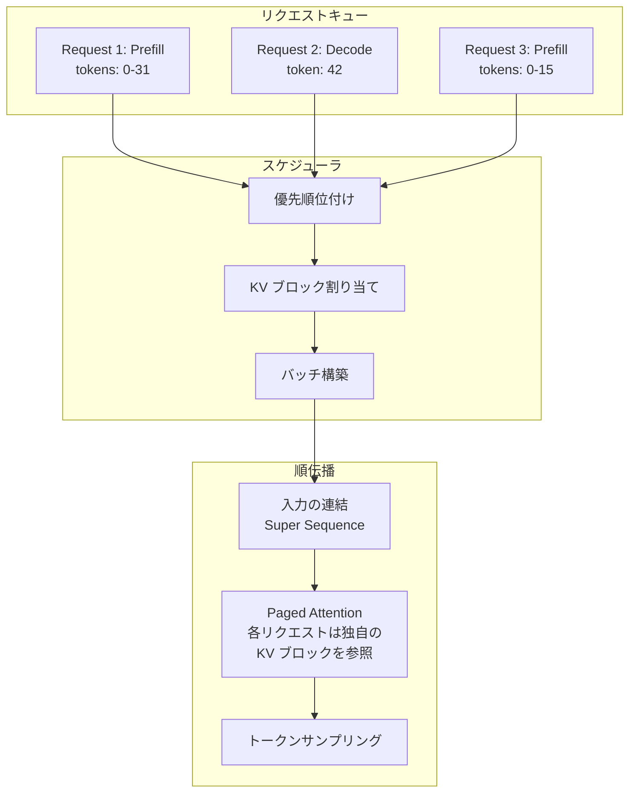
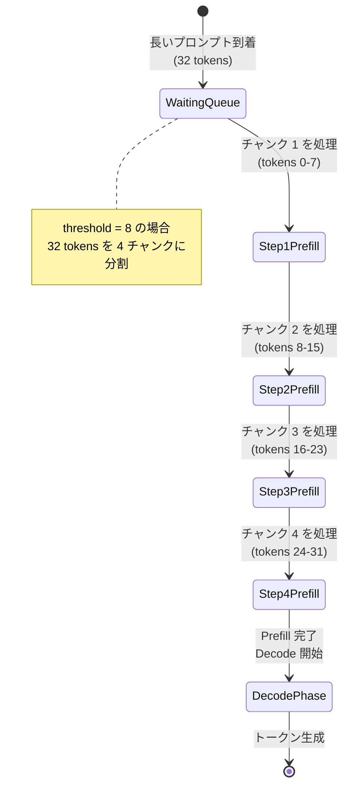
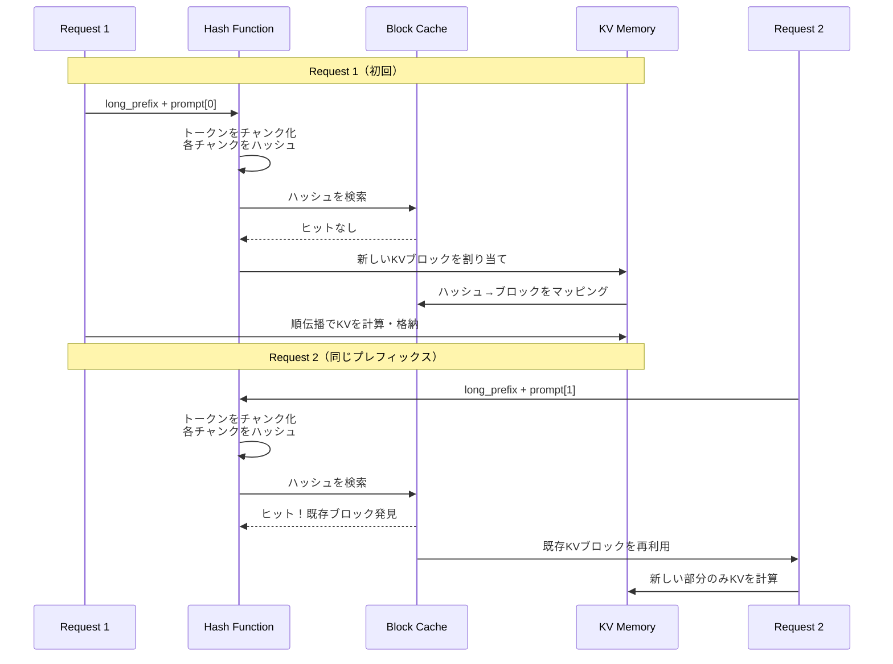
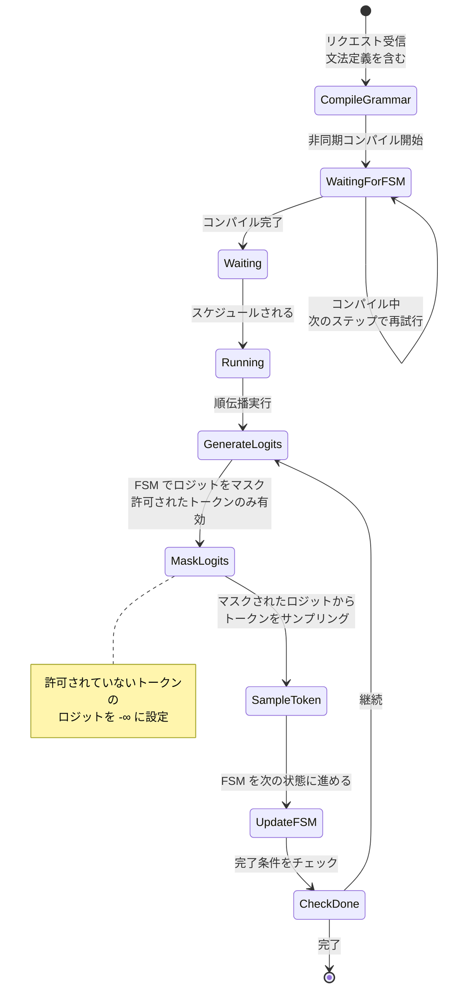
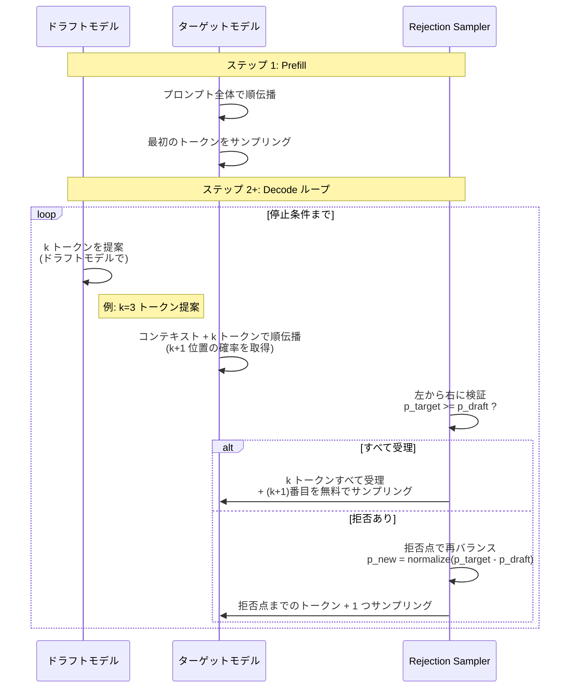
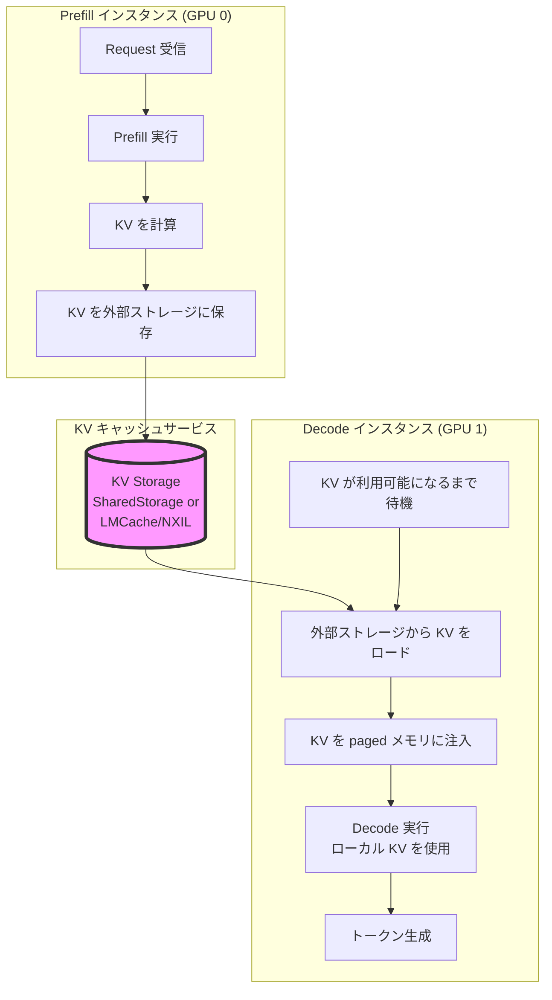
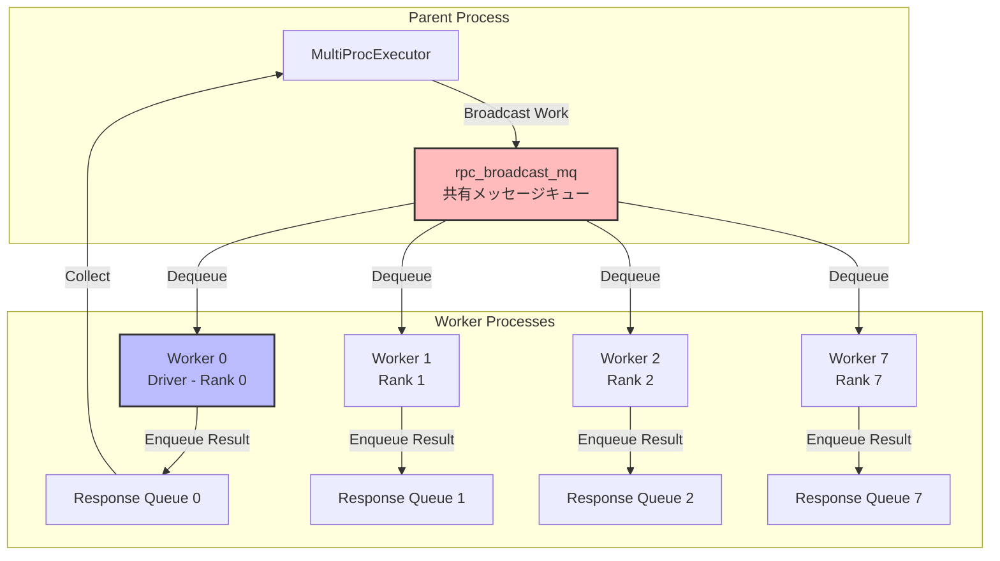
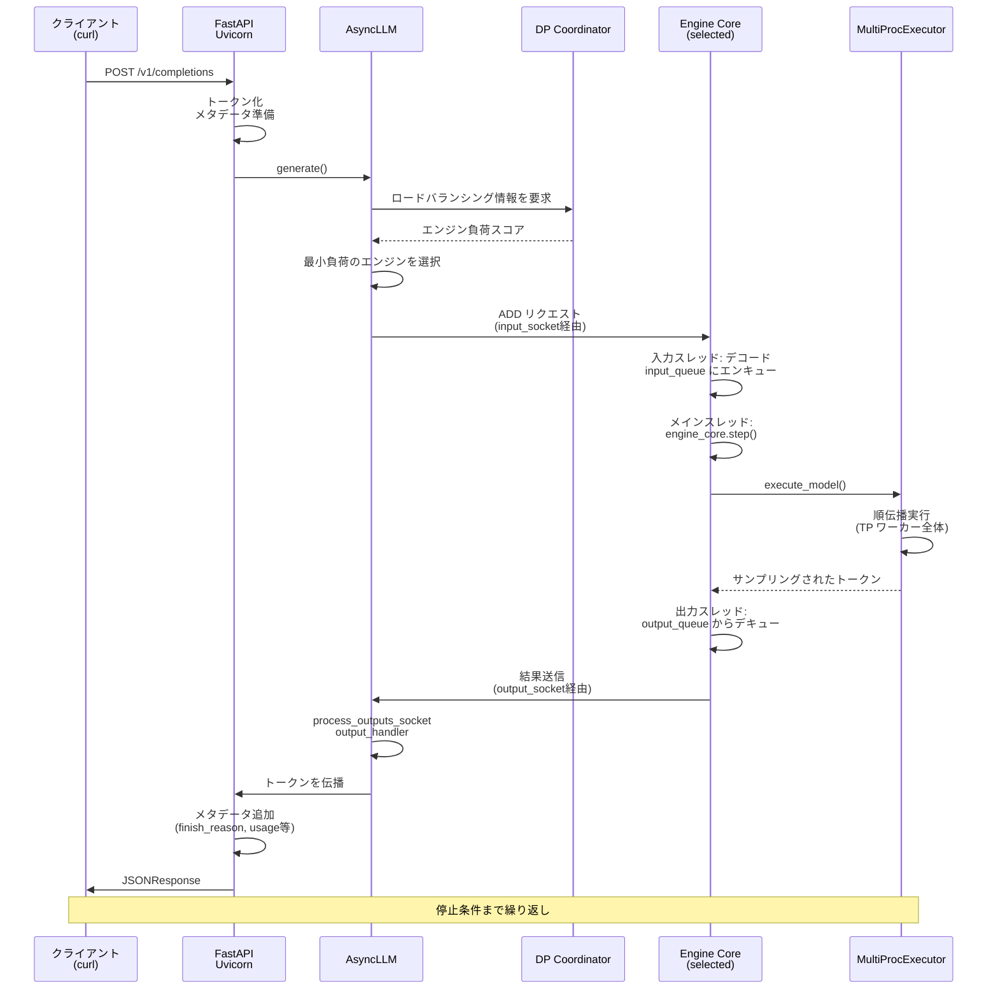
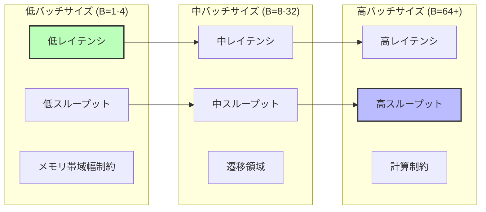

# vLLM の内部構造：高スループット LLM 推論システムの解剖学

:::message
**注記**
本記事は [Aleksa Gordic のウェブサイト](https://www.aleksagordic.com/blog/vllm) に投稿されたものです。
:::

## paged attention、continuous batching、prefix caching、speculative decoding などから、マルチ GPU・マルチノードの動的スケール配信まで

本記事では、最新の高スループット LLM 推論システムを構成するすべてのコアシステムコンポーネントと高度な機能について、段階的に紹介します。特に、vLLM [[1]](#ref-1) がどのように動作するかを詳しく解説します。

本記事はシリーズの第 1 回です。まず広い視点から始め、その後詳細を重ねていく（逆ピラミッド型のアプローチに従う）ことで、細部に溺れることなく、システム全体の正確な高レベルのメンタルモデルを形成できるようにします。

後続の記事では、特定のサブシステムについて深く掘り下げます。

本記事は 5 つのパートで構成されています：

1. [LLM エンジンとエンジンコア](#llm-engine--engine-core)：vLLM の基礎（スケジューリング、paged attention、continuous batching など）
2. [高度な機能](#advanced-features--extending-the-core-engine-logic)：chunked prefill、prefix caching、guided decoding、speculative decoding、disaggregated P/D
3. [スケールアップ](#from-uniprocexecutor-to-multiprocexecutor)：シングル GPU からマルチ GPU 実行へ
4. [サービングレイヤー](#distributed-system-serving-vllm)：分散/並行ウェブスキャフォールディング
5. [ベンチマークと自動チューニング](#benchmarks-and-auto-tuning---latency-vs-throughput)：レイテンシとスループットの測定

> **注記**
> 
> * 分析は [コミット 42172ad](https://github.com/vllm-project/vllm/tree/42172ad)（2025 年 8 月 9 日）に基づいています。
> * 対象読者：最先端の LLM エンジンがどのように機能するかに興味がある方、および vLLM、SGLang などへの貢献に興味がある方。
> * [V1 エンジン](https://docs.vllm.ai/en/latest/usage/v1_guide.html) に焦点を当てます。V0（現在は[非推奨](https://github.com/vllm-project/vllm/issues/18571)）も調査しましたが、プロジェクトがどのように進化したかを理解する上で価値があり、多くの概念は引き継がれています。
> * LLM Engine / Engine Core に関する最初のセクションは少し圧倒的/単調かもしれませんが、ブログの残りの部分には多くの例とビジュアルがあります。:)
## LLM Engine & Engine Core

LLM エンジンは vLLM の基本的な構成要素です。単体では、すでに高スループット推論を実現していますが、オフライン設定でのみです。まだウェブ経由で顧客にサービスを提供することはできません。

次のオフライン推論スニペットを実行例として使用します（[basic.py](https://github.com/vllm-project/vllm/blob/main/examples/offline_inference/basic/basic.py) から改変）。

```python
from vllm import LLM, SamplingParams

# プロンプトのリスト
prompts = [
    "Hello, my name is",
    "The president of the United States is",
]

# サンプリングパラメータの設定
sampling_params = SamplingParams(temperature=0.8, top_p=0.95)

def main():
    # LLM モデルのインスタンス化
    llm = LLM(model="TinyLlama/TinyLlama-1.1B-Chat-v1.0")

    # プロンプトからテキストを生成
    outputs = llm.generate(prompts, sampling_params)

if __name__ == "__main__":
    main()
```

::::details ml.g6.2xlarge(L4) 動作確認
実行結果から `Maximum concurrency for 2,048 tokens per request: 401.04x`

最大 2,048 トークンのリクエストを 401 同時処理可能のようである。

**初期化**

| 処理 | 時間 |
|------|------|
| 重みダウンロード | 2.43秒 |
| モデルロード | 5.91秒 (メモリ: 2.05 GiB) |
| Dynamo bytecode変換 | 3.40秒 |
| torch.compileグラフコンパイル | 8.39秒 |
| torch.compile合計 | 11.79秒 |
| CUDAグラフキャプチャ | ~3秒 |
| エンジン初期化合計 | 17.81秒 |

**推論**

| メトリック | 値 |
|-----------|-----|
| 処理したプロンプト数 | 2 |
| 推論速度 | 11.43 requests/秒 |
| 入力処理速度 | 80.07 tokens/秒 |
| 出力生成速度 | 183.01 tokens/秒 |

```bash
export VLLM_USE_V1="1"
export VLLM_ENABLE_V1_MULTIPROCESSING="0"
(vllm-env) sagemaker-user@default:~/vllm$ python v001.py 
INFO 01-13 15:42:20 [utils.py:253] non-default args: {'disable_log_stats': True, 'model': 'TinyLlama/TinyLlama-1.1B-Chat-v1.0'}
config.json: 100%|███████████████████████████████████████████████████████████████████████████████████████████████████████████████████████████████████████████████████████████████████████| 608/608 [00:00<00:00, 7.29MB/s]
WARNING 01-13 15:42:20 [arg_utils.py:1181] The global random seed is set to 0. Since VLLM_ENABLE_V1_MULTIPROCESSING is set to False, this may affect the random state of the Python process that launched vLLM.
INFO 01-13 15:42:26 [model.py:514] Resolved architecture: LlamaForCausalLM
INFO 01-13 15:42:26 [model.py:1661] Using max model len 2048
INFO 01-13 15:42:26 [scheduler.py:230] Chunked prefill is enabled with max_num_batched_tokens=8192.
tokenizer_config.json: 1.29kB [00:00, 7.45MB/s]
tokenizer.model: 100%|█████████████████████████████████████████████████████████████████████████████████████████████████████████████████████████████████████████████████████████████████| 500k/500k [00:00<00:00, 1.65MB/s]
tokenizer.json: 1.84MB [00:00, 171MB/s]
special_tokens_map.json: 100%|███████████████████████████████████████████████████████████████████████████████████████████████████████████████████████████████████████████████████████████| 551/551 [00:00<00:00, 4.62MB/s]
generation_config.json: 100%|████████████████████████████████████████████████████████████████████████████████████████████████████████████████████████████████████████████████████████████| 124/124 [00:00<00:00, 1.37MB/s]
INFO 01-13 15:42:27 [core.py:93] Initializing a V1 LLM engine (v0.13.0) with config: model='TinyLlama/TinyLlama-1.1B-Chat-v1.0', speculative_config=None, tokenizer='TinyLlama/TinyLlama-1.1B-Chat-v1.0', skip_tokenizer_init=False, tokenizer_mode=auto, revision=None, tokenizer_revision=None, trust_remote_code=False, dtype=torch.bfloat16, max_seq_len=2048, download_dir=None, load_format=auto, tensor_parallel_size=1, pipeline_parallel_size=1, data_parallel_size=1, disable_custom_all_reduce=False, quantization=None, enforce_eager=False, kv_cache_dtype=auto, device_config=cuda, structured_outputs_config=StructuredOutputsConfig(backend='auto', disable_fallback=False, disable_any_whitespace=False, disable_additional_properties=False, reasoning_parser='', reasoning_parser_plugin='', enable_in_reasoning=False), observability_config=ObservabilityConfig(show_hidden_metrics_for_version=None, otlp_traces_endpoint=None, collect_detailed_traces=None, kv_cache_metrics=False, kv_cache_metrics_sample=0.01, cudagraph_metrics=False, enable_layerwise_nvtx_tracing=False), seed=0, served_model_name=TinyLlama/TinyLlama-1.1B-Chat-v1.0, enable_prefix_caching=True, enable_chunked_prefill=True, pooler_config=None, compilation_config={'level': None, 'mode': <CompilationMode.VLLM_COMPILE: 3>, 'debug_dump_path': None, 'cache_dir': '', 'compile_cache_save_format': 'binary', 'backend': 'inductor', 'custom_ops': ['none'], 'splitting_ops': ['vllm::unified_attention', 'vllm::unified_attention_with_output', 'vllm::unified_mla_attention', 'vllm::unified_mla_attention_with_output', 'vllm::mamba_mixer2', 'vllm::mamba_mixer', 'vllm::short_conv', 'vllm::linear_attention', 'vllm::plamo2_mamba_mixer', 'vllm::gdn_attention_core', 'vllm::kda_attention', 'vllm::sparse_attn_indexer'], 'compile_mm_encoder': False, 'compile_sizes': [], 'compile_ranges_split_points': [8192], 'inductor_compile_config': {'enable_auto_functionalized_v2': False, 'combo_kernels': True, 'benchmark_combo_kernel': True}, 'inductor_passes': {}, 'cudagraph_mode': <CUDAGraphMode.FULL_AND_PIECEWISE: (2, 1)>, 'cudagraph_num_of_warmups': 1, 'cudagraph_capture_sizes': [1, 2, 4, 8, 16, 24, 32, 40, 48, 56, 64, 72, 80, 88, 96, 104, 112, 120, 128, 136, 144, 152, 160, 168, 176, 184, 192, 200, 208, 216, 224, 232, 240, 248, 256, 272, 288, 304, 320, 336, 352, 368, 384, 400, 416, 432, 448, 464, 480, 496, 512], 'cudagraph_copy_inputs': False, 'cudagraph_specialize_lora': True, 'use_inductor_graph_partition': False, 'pass_config': {'fuse_norm_quant': False, 'fuse_act_quant': False, 'fuse_attn_quant': False, 'eliminate_noops': True, 'enable_sp': False, 'fuse_gemm_comms': False, 'fuse_allreduce_rms': False}, 'max_cudagraph_capture_size': 512, 'dynamic_shapes_config': {'type': <DynamicShapesType.BACKED: 'backed'>, 'evaluate_guards': False}, 'local_cache_dir': None}
INFO 01-13 15:42:27 [parallel_state.py:1203] world_size=1 rank=0 local_rank=0 distributed_init_method=tcp://169.255.254.1:38005 backend=nccl
INFO 01-13 15:42:27 [parallel_state.py:1411] rank 0 in world size 1 is assigned as DP rank 0, PP rank 0, PCP rank 0, TP rank 0, EP rank 0
INFO 01-13 15:42:28 [gpu_model_runner.py:3562] Starting to load model TinyLlama/TinyLlama-1.1B-Chat-v1.0...
/home/sagemaker-user/.conda/envs/vllm-env/lib/python3.10/site-packages/tvm_ffi/_optional_torch_c_dlpack.py:174: UserWarning: Failed to JIT torch c dlpack extension, EnvTensorAllocator will not be enabled.
We recommend installing via `pip install torch-c-dlpack-ext`
  warnings.warn(
INFO 01-13 15:42:31 [cuda.py:351] Using FLASH_ATTN attention backend out of potential backends: ('FLASH_ATTN', 'FLASHINFER', 'TRITON_ATTN', 'FLEX_ATTENTION')
model.safetensors: 100%|██████████████████████████████████████████████████████████████████████████████████████████████████████████████████████████████████████████████████████████████| 2.20G/2.20G [00:02<00:00, 933MB/s]
INFO 01-13 15:42:33 [weight_utils.py:487] Time spent downloading weights for TinyLlama/TinyLlama-1.1B-Chat-v1.0: 2.425186 seconds
INFO 01-13 15:42:33 [weight_utils.py:527] No model.safetensors.index.json found in remote.
Loading safetensors checkpoint shards:   0% Completed | 0/1 [00:00<?, ?it/s]
Loading safetensors checkpoint shards: 100% Completed | 1/1 [00:00<00:00,  4.02it/s]
Loading safetensors checkpoint shards: 100% Completed | 1/1 [00:00<00:00,  4.02it/s]

INFO 01-13 15:42:34 [default_loader.py:308] Loading weights took 0.30 seconds
INFO 01-13 15:42:34 [gpu_model_runner.py:3659] Model loading took 2.0513 GiB memory and 5.911097 seconds
INFO 01-13 15:42:38 [backends.py:643] Using cache directory: /home/sagemaker-user/.cache/vllm/torch_compile_cache/b202c6433b/rank_0_0/backbone for vLLM's torch.compile
INFO 01-13 15:42:38 [backends.py:703] Dynamo bytecode transform time: 3.40 s
[rank0]:W0113 15:42:41.024000 3998 site-packages/torch/_inductor/utils.py:1558] Not enough SMs to use max_autotune_gemm mode
INFO 01-13 15:42:44 [backends.py:261] Cache the graph of compile range (1, 8192) for later use
INFO 01-13 15:42:48 [backends.py:278] Compiling a graph for compile range (1, 8192) takes 8.39 s
INFO 01-13 15:42:48 [monitor.py:34] torch.compile takes 11.79 s in total
INFO 01-13 15:42:49 [gpu_worker.py:375] Available KV cache memory: 17.23 GiB
INFO 01-13 15:42:49 [kv_cache_utils.py:1291] GPU KV cache size: 821,328 tokens
INFO 01-13 15:42:49 [kv_cache_utils.py:1296] Maximum concurrency for 2,048 tokens per request: 401.04x
Capturing CUDA graphs (mixed prefill-decode, PIECEWISE): 100%|████████████████████████████████████████████████████████████████████████████████████████████████████████████████████████████| 51/51 [00:01<00:00, 39.40it/s]
Capturing CUDA graphs (decode, FULL): 100%|███████████████████████████████████████████████████████████████████████████████████████████████████████████████████████████████████████████████| 35/35 [00:00<00:00, 42.50it/s]
INFO 01-13 15:42:52 [gpu_model_runner.py:4587] Graph capturing finished in 3 secs, took 0.43 GiB
INFO 01-13 15:42:52 [core.py:259] init engine (profile, create kv cache, warmup model) took 17.81 seconds
INFO 01-13 15:42:52 [llm.py:360] Supported tasks: ('generate',)
Adding requests: 100%|████████████████████████████████████████████████████████████████████████████████████████████████████████████████████████████████████████████████████████████████████| 2/2 [00:00<00:00, 1413.18it/s]
Processed prompts: 100%|█████████████████████████████████████████████████████████████████████████████████████████████████████████████| 2/2 [00:00<00:00, 11.43it/s, est. speed input: 80.07 toks/s, output: 183.01 toks/s]
[rank0]:[W113 15:42:53.441098010 ProcessGroupNCCL.cpp:1524] Warning: WARNING: destroy_process_group() was not called before program exit, which can leak resources. For more info, please see https://pytorch.org/docs/stable/distributed.html#shutdown (function operator())
(vllm-env) sagemaker-user@default:~/vllm$ 
```

::::

> **注記**
> 
> 環境変数：
> 
> * `VLLM_USE_V1="1"` # V1 エンジンを使用
> * `VLLM_ENABLE_V1_MULTIPROCESSING="0"` # シングルプロセスで実行

この設定は以下のようになっています：

* オフライン（ウェブ/分散システムスキャフォールディングなし）
* 同期（すべての実行が単一のブロッキングプロセスで行われる）
* シングル GPU（データ/モデル/パイプライン/エキスパート並列化なし、DP/TP/PP/EP = 1）
* 標準 transformer [[2]](#ref-2) を使用（Jamba のようなハイブリッドモデルのサポートには、より複雑なハイブリッド KV キャッシュメモリアロケータが必要）

ここから、オンライン、非同期、マルチ GPU、マルチノード推論システムへと段階的に構築していきますが、標準 transformer のサービング提供は引き続き行います。

この例では 2 つのことを行います：

1. エンジンをインスタンス化する
2. エンジンで `generate` を呼び出して、指定されたプロンプトからサンプリングする

まずはコンストラクタの分析から始めましょう。

### LLM Engine コンストラクタ

エンジンの主要なコンポーネントは以下の通りです：

* **vLLM 設定**：モデル、キャッシュ、並列化などを設定するためのすべての設定項目を含む
* **プロセッサ**：生の入力を検証、トークン化、処理により `EngineCoreRequests` に変換する
* **エンジンコアクライアント**：実行例では `InprocClient` を使用しており、これは基本的に `EngineCore` と同等です。最終的には、スケールでのサービング提供を可能にする `DPLBAsyncMPClient` へと段階的に構築していきます
* **出力プロセッサ**：生の `EngineCoreOutputs` をユーザーが見る `RequestOutput` に変換する

> **注記**
> 
> V0 エンジンが非推奨になったことで、クラス名と詳細は変更される可能性があります。正確なシグネチャではなく、コアアイデアを強調します。詳細の一部は抽象化しますが、すべてではありません。

エンジンコア自体は、いくつかのサブコンポーネントで構成されています：

* **Model Executor**：モデルの順伝播を駆動します。現在は単一の `Worker` プロセスを持つ `UniProcExecutor` を扱っています。段階的に、複数の GPU をサポートする `MultiProcExecutor` へと構築していきます
* **Structured Output Manager**：guided decoding に使用されます（後述）
* **Scheduler**：次のエンジンステップに入るリクエストを決定します。さらに以下を含みます：
    1. ポリシー設定：**FCFS**（first come first served、先着順）または **priority**（高優先度リクエストが先に処理される）のいずれか
    2. `waiting` キューと `running` キュー
    3. KV キャッシュマネージャ：paged attention [[3]](#ref-3) の心臓部

KV キャッシュマネージャは `free_block_queue` を維持します。これは利用可能な KV キャッシュブロックのプール（VRAM サイズとブロックサイズに応じて、通常数十万単位）です。paged attention の実行中、ブロックはトークンを計算済み KV キャッシュブロックにマッピングするインデックス構造として機能します。

  
**図 1**：本セクションで説明するコアコンポーネントとその関係

> **注記**
> 
> 標準 transformer レイヤー（非 MLA [[4]](#ref-4)）のブロックサイズは次のように計算されます：2（key/value）× `block_size`（デフォルト=16）× `num_kv_heads` × `head_size` × `dtype_num_bytes`（例：bf16 の場合は 2）

モデル executor の構築時に、`Worker` オブジェクトが作成され、3 つの重要な手順が実行されます。（後で `MultiProcExecutor` を使用する際には、これらの同じ手順が異なる GPU 上の各ワーカープロセスで独立して実行されます。）

1. **デバイスの初期化**：
    * ワーカーに CUDA デバイス（例：`cuda:0`）を割り当て、モデルの dtype がサポートされているか確認します（例：bf16）
    * 要求された `gpu_memory_utilization`（例：0.8 → 総 VRAM の 80%）を考慮して、十分な VRAM が利用可能か確認します
    * 分散設定を設定します（DP / TP / PP / EP など）
    * `model_runner` をインスタンス化します（sampler、KV キャッシュ、`input_ids`、`positions` などの順伝播バッファを保持）
    * `InputBatch` オブジェクトをインスタンス化します（CPU 側の順伝播バッファ、KV キャッシュインデックス用のブロックテーブル、サンプリングメタデータなどを保持）
2. **モデルのロード**：
    * モデルアーキテクチャをインスタンス化します
    * モデルの重みをロードします
    * model.eval() を呼び出します（PyTorch の推論モード）
    * オプション：モデルで torch.compile() を呼び出します
3. **KV キャッシュの初期化**
    * レイヤーごとの KV キャッシュ仕様を取得します。歴史的にはこれは常に `FullAttentionSpec`（均質な transformer）でしたが、ハイブリッドモデル（スライディングウィンドウ、Jamba のような Transformer/SSM）ではより複雑になりました（Jenga [[5]](#ref-5) を参照）
    * ダミー/プロファイリング順伝播を実行し、GPU メモリスナップショットを取得して、利用可能な VRAM に収まる KV キャッシュブロックの数を計算します
    * KV キャッシュテンソルを割り当て、リシェイプし、attention レイヤーにバインドします
    * attention メタデータを準備します（例：バックエンドを FlashAttention に設定）。これは後で順伝播時にカーネルによって消費されます
    * `--enforce-eager` が指定されていない限り、各ウォームアップバッチサイズに対してダミー実行を行い、CUDA グラフをキャプチャします。CUDA グラフは GPU 作業のシーケンス全体を DAG に記録します。後で順伝播時に事前ベイクされたグラフを起動/リプレイし、カーネル起動オーバーヘッドを削減してレイテンシを改善します

ここでは多くの低レベルの詳細を抽象化しましたが、これらは今後のセクションで繰り返し参照するコアピースです。

エンジンが初期化されたので、次は `generate` 関数に進みましょう。

### Generate 関数

最初のステップは、リクエストを検証してエンジンに供給することです。各プロンプトに対して以下を行います：

1. 一意のリクエスト ID を作成し、その到着時刻をキャプチャします
2. プロンプトをトークン化し、`prompt`、`prompt_token_ids`、および `type`（text、tokens、embeds など）を含む辞書を返す入力プリプロセッサを呼び出します
3. この情報を `EngineCoreRequest` にパッケージ化し、優先度、サンプリングパラメータ、その他のメタデータを追加します
4. リクエストをエンジンコアに渡します。エンジンコアはこれを `Request` オブジェクトにラップし、そのステータスを `WAITING` に設定します。次に、このリクエストはスケジューラの `waiting` キューに追加されます（FCFS の場合は append、priority の場合は heap-push）

この時点で、エンジンは供給され、実行を開始できます。同期エンジンの例では、これらの初期プロンプトが処理する唯一のものです。実行中に新しいリクエストを注入するメカニズムはありません。対照的に、非同期エンジンはこれをサポートしています（別名 **continuous batching** [[6]](#ref-6)）：各ステップの後、新旧両方のリクエストが考慮されます。

> **注記**
> 
> 順伝播がバッチを単一のシーケンスにフラット化し、カスタムカーネルが効率的に処理するため、continuous batching は同期エンジンでも基本的にサポートされています。

次に、処理するリクエストがある限り、エンジンは `step()` 関数を繰り返し呼び出します。各ステップには 3 つの段階があります：

1. **Schedule**：このステップで実行するリクエストを選択します（decode、および/または（chunked）prefill）
2. **Forward pass**：モデルを実行してトークンをサンプリングします
3. **Postprocess**：サンプリングされたトークン ID を各 `Request` に追加し、デトークン化し、停止条件をチェックします。リクエストが完了した場合、クリーンアップ（例：KV キャッシュブロックを `free_block_queue` に返す）を行い、出力を早期に返します

> **注記**
> 
> 停止条件は以下の通りです：
> 
> * リクエストが長さ制限を超えた（`max_model_length` または独自の `max_tokens`）
> * サンプリングされたトークンが EOS ID である（`ignore_eos` が有効になっていない限り → 一定数の出力トークンの生成を強制したい場合のベンチマークに便利）
> * サンプリングされたトークンがサンプリングパラメータで指定された `stop_token_ids` のいずれかに一致する
> * 出力に停止文字列が存在する。最初の停止文字列の出現まで出力を切り捨て、エンジンでリクエストを中止します（`stop_token_ids` は出力に存在しますが、停止文字列は存在しないことに注意してください）

  
**図 2**：エンジンループ

> **注記**
> 
> ストリーミングモードでは、生成されるトークンを中間的に送信しますが、今のところそれは無視します。

次に、スケジューリングをより詳細に検討します。

### Scheduler

推論エンジンが処理する主なワークロードタイプは 2 つあります：

1. **Prefill リクエスト**：すべてのプロンプトトークンに対する順伝播。これらは通常 **compute-bound**（閾値はハードウェアとプロンプトの長さに依存）です。最後に、最終トークンの位置の確率分布から単一のトークンをサンプリングします。
2. **Decode リクエスト**：最新のトークンのみに対する順伝播。すべての以前の KV ベクトルは既にキャッシュされています。これらは **memory-bandwidth-bound** です。なぜなら、1 つのトークンを計算するだけなのに、すべての LLM の重み（および KV キャッシュ）をロードする必要があるからです。

> **注記**
> 
> [ベンチマークセクション](#benchmarks-and-auto-tuning---latency-vs-throughput) では、いわゆる GPU パフォーマンスのルーフラインモデルを分析します。これは、prefill/decode のパフォーマンスプロファイルの背後にある詳細に踏み込みます。

V1 スケジューラは、より賢明な設計選択のおかげで、両方のタイプのリクエストを同じステップで混在させることができます。対照的に、V0 エンジンは prefill または decode のいずれか一方しか一度に処理できませんでした。

スケジューラは decode リクエスト（つまり、すでに `running` キューにあるリクエスト）を優先します。各リクエストに対して以下を行います：

1. 生成する新しいトークンの数を計算します（speculative decoding と非同期スケジューリングのため、必ずしも 1 ではありません。詳細は後述）
2. KV キャッシュマネージャの `allocate_slots` 関数を呼び出します（詳細は以下）
3. ステップ 1 のトークン数を減算してトークン予算を更新します

その後、`waiting` キューから prefill リクエストを処理します：

1. 計算済みブロックの数を取得します（prefix caching が無効の場合は 0 を返します。後述）
2. KV キャッシュマネージャの `allocate_slots` 関数を呼び出します
3. waiting からリクエストをポップし、running に移動し、そのステータスを `RUNNING` に設定します
4. トークン予算を更新します

次に、`allocate_slots` が何を行うかを見てみましょう：

1. **ブロック数の計算**：割り当てが必要な新しい KV キャッシュブロック（`n`）の数を決定します。各ブロックはデフォルトで 16 トークンを格納します。例えば、prefill リクエストに 17 個の新しいトークンがある場合、`ceil(17/16) = 2` ブロックが必要です。
2. **可用性のチェック**：マネージャのプールに十分なブロックがない場合は、早期に終了します。decode または prefill リクエストであるかに応じて、エンジンは再計算プリエンプション（スワッププリエンプションは V0 でサポートされていました）を試みる可能性があります。これは、低優先度のリクエストを退避させることで行われます（`kv_cache_manager.free` を呼び出し、KV ブロックをブロックプールに返します）。または、スケジューリングをスキップして実行を継続する可能性があります。
3. **ブロックの割り当て**：KV キャッシュマネージャのコーディネータを介して、ブロックプール（前述の `free_block_queue` 二重リンクリスト）から最初の `n` ブロックを取得します。`req_to_blocks`（各 `request_id` をその KV キャッシュブロックのリストにマッピングする辞書）に保存します。

  
**図 3**：KV キャッシュブロックのリスト

いよいよ順伝播の準備が整いました！

### 順伝播の実行

モデル executor の `execute_model` を呼び出すと、これが `Worker` に委譲され、さらにモデル runner に委譲されます。

主なステップは以下の通りです：

1. **状態の更新**：`input_batch` から完了したリクエストを削除します。順伝播に関連するさまざまなメタデータを更新します（例：リクエストごとの KV キャッシュブロックで、paged KV キャッシュメモリへのインデックスに使用されます）
2. **入力の準備**：バッファを CPU→GPU にコピーします。位置を計算します。`slot_mapping` を構築します（例では詳細を説明）。attention メタデータを構築します
3. **順伝播**：カスタム paged attention カーネルを使用してモデルを実行します。すべてのシーケンスがフラット化され、1 つの長い「スーパーシーケンス」に連結されます。位置インデックスと attention マスクにより、各シーケンスは独自のトークンのみに attention できるようになり、右パディングなしで continuous batching が可能になります
4. **最終トークン状態の収集**：各シーケンスの最終位置の隠れ状態を抽出し、ロジットを計算します
5. **サンプリング**：サンプリング設定（greedy、temperature、top-p、top-k など）に従って、計算されたロジットからトークンをサンプリングします

順伝播ステップ自体には 2 つの実行モードがあります：

1. **Eager モード**：eager 実行が有効な場合に標準の PyTorch 順伝播を実行します
2. **「Captured」モード**：eager が強制されていない場合（エンジン構築時の KV キャッシュ初期化手順でキャプチャしたことを思い出してください）、事前キャプチャされた CUDA Graph を実行/リプレイします

以下は、continuous batching と paged attention を明確にする具体的な例です：

  
**図 4**：順伝播：continuous batching と paged attention

::::details continuous batching と paged attention の詳細な流れ



この図は、複数のリクエスト（prefill と decode の混在）がどのようにスケジューラによって処理され、単一のバッチとして順伝播に送られるかを示しています。Paged attention により、各リクエストは独自の KV キャッシュブロックを効率的に参照できます。

::::

## Advanced Features — コアエンジンロジックの拡張

基本的なエンジンフローが整ったので、高度な機能について見ていきます。

これまでに preemption、paged attention、continuous batching について説明しました。

次に以下について深く掘り下げます：

1. Chunked prefill
2. Prefix caching
3. Guided decoding（文法制約付き有限状態機械を通じて）
4. Speculative decoding
5. Disaggregated P/D（prefill/decoding）

### Chunked Prefill

Chunked prefill は、長いプロンプトの prefill ステップを小さなチャンクに分割して処理する手法です。これがないと、単一の非常に長いリクエストが 1 つのエンジンステップを独占し、他の prefill リクエストの実行を許可しなくなる可能性があります。これにより、他のすべてのリクエストが遅延し、それらのレイテンシが増加します。

例えば、各チャンクに `n`（= 8）トークンが含まれ、小文字で区切られているとします（`-` で区切られた）。長いプロンプト `P` は `x-y-z` のように見えます。ここで `z` は不完全なチャンク（例：2 トークン）です。`P` の完全な prefill を実行すると、≥ 3 エンジンステップかかります（いずれかのステップで実行がスケジュールされない場合は > になる可能性があります）。最後の chunked prefill ステップでのみ、1 つの新しいトークンをサンプリングします。

以下は同じ例を視覚的に示したものです：

  
**図 5**：Chunked prefill

実装は簡単です。ステップごとの新しいトークン数に上限を設けます。要求された数が `long_prefill_token_threshold` を超える場合、正確にその値にリセットします。基礎となるインデックスロジック（前述）が残りを処理します。

vLLM V1 では、`long_prefill_token_threshold` を正の整数に設定することで chunked prefill を有効にします。（技術的には、プロンプトの長さがトークン予算を超える場合にも発生する可能性があります。その場合、切り捨てて chunked prefill を実行します。）

::::details Chunked prefill の詳細な動作



この図は、32 トークンのプロンプトが threshold = 8 の設定でどのように 4 つのステップに分割されて処理されるかを示しています。各ステップは 8 トークンずつ処理し、他のリクエストとのバランスを取ります。

::::

### Prefix Caching

Prefix caching の動作を説明するために、元のコード例を少し変更してみましょう：

```python
from vllm import LLM, SamplingParams

# 長いプレフィックス（block_size 以上のトークンにエンコードされるテキスト）
long_prefix = "<a piece of text that is encoded into more than block_size tokens>"

# プロンプトのリスト
prompts = [
    "Hello, my name is",
    "The president of the United States is",
]

# サンプリングパラメータの設定
sampling_params = SamplingParams(temperature=0.8, top_p=0.95)

def main():
    llm = LLM(model="TinyLlama/TinyLlama-1.1B-Chat-v1.0")

    # 1回目の生成
    outputs = llm.generate(long_prefix + prompts[0], sampling_params)
    # 2回目の生成
    outputs = llm.generate(long_prefix + prompts[1], sampling_params)

if __name__ == "__main__":
    main()
```

Prefix caching は、複数のプロンプトが冒頭で共有するトークンの再計算を回避します。したがって **prefix**（プレフィックス）という名前です。

重要なのは `long_prefix` です。これは KV キャッシュブロック（デフォルトでは 16 トークン）より長い任意のプレフィックスとして定義されます。例を簡単にするために、`long_prefix` が正確に `n x block_size`（`n ≥ 1`）の長さであると仮定しましょう。

> **注記**
> 
> つまり、ブロック境界と完全に整列しています。そうでない場合、不完全なブロックをキャッシュできないため、`long_prefix_len % block_size` トークンを再計算する必要があります。

Prefix caching がない場合、同じ `long_prefix` を持つ新しいリクエストを処理するたびに、すべての `n x block_size` トークンを再計算することになります。

Prefix caching がある場合、それらのトークンは一度だけ計算され（その KV が KV キャッシュページドメモリに格納され）、その後再利用されるため、新しいプロンプトトークンのみを処理すればよくなります。これにより prefill リクエストが高速化されます（ただし decode には役立ちません）。

vLLM ではこれはどのように機能するのでしょうか？

最初の `generate` 呼び出し中、スケジューリング段階で、`kv_cache_manager.get_computed_blocks` 内で、エンジンは `hash_request_tokens` を呼び出します：

1. この関数は `long_prefix + prompts[0]` を 16 トークンのチャンクに分割します
2. 完全なチャンクごとに、ハッシュを計算します（組み込みのハッシュまたは SHA-256 を使用。SHA-256 は遅いですが衝突が少ない）。ハッシュは、前のブロックのハッシュ、現在のトークン、およびオプションのメタデータを組み合わせます

> **注記**
> 
> オプションのメタデータには以下が含まれます：MM ハッシュ、LoRA ID、キャッシュソルト（最初のブロックのハッシュに注入され、このキャッシュソルトを持つリクエストのみがブロックを再利用できるようにします）

3. 各結果は、ハッシュとそのトークン ID の両方を含む `BlockHash` オブジェクトとして格納されます。ブロックハッシュのリストを返します

リストは `self.req_to_block_hashes[request_id]` に格納されます。

次に、エンジンは `find_longest_cache_hit` を呼び出して、これらのハッシュのいずれかが `cached_block_hash_to_block` に既に存在するかどうかを確認します。最初のリクエストでは、ヒットは見つかりません。

  
**図 6**：Prefix caching - ハッシュ関数

次に、`allocate_slots` を呼び出します。これは `coordinator.cache_blocks` を呼び出し、新しい `BlockHash` エントリを割り当てられた KV ブロックに関連付け、`cached_block_hash_to_block` に記録します。

その後、順伝播により、割り当てた KV キャッシュブロックに対応する paged KV キャッシュメモリに KV が入力されます。

> **注記**
> 
> 多くのエンジンステップの後、より多くの KV キャッシュブロックが割り当てられますが、`long_prefix` の直後でプレフィックスが分岐しているため、この例では重要ではありません。

  
**図 7**：Prefix caching - paged メモリに KV を入力

同じプレフィックスを持つ 2 回目の `generate` 呼び出しでは、ステップ 1〜3 が繰り返されますが、今度は `find_longest_cache_hit` がすべての `n` ブロックに対して一致を見つけます（線形検索を介して）。エンジンはこれらの KV ブロックを直接再利用できます。

  
**図 8**：Prefix caching - KV の再利用

元のリクエストがまだ存在している場合、それらのブロックの参照カウントは増加します（例：2 に）。この例では、最初のリクエストは既に完了しているため、ブロックはプールに解放され、参照カウントは 0 に戻されています。`cached_block_hash_to_block` からそれらを取得できたため、それらが有効であることがわかります（KV キャッシュマネージャのロジックはそのように設定されています）。したがって、`free_block_queue` から再度削除するだけです。

高度な注記：

KV キャッシュブロックが無効になるのは、`free_block_queue`（左からポップ）から再割り当てされようとしているときに、ブロックにまだハッシュが関連付けられており、`cached_block_hash_to_block` に存在していることが判明した場合のみです。その時点で、ブロックのハッシュをクリアし、`cached_block_hash_to_block` からそのエントリを削除します。これにより、（少なくともその古いプレフィックスに対して）prefix caching を介して再利用できないようにします。

そして、これが prefix caching の要点です：既に見たプレフィックスを再計算しない。その KV キャッシュを再利用するだけです！

この例を理解すれば、paged attention の仕組みも理解したことになります。

Prefix caching はデフォルトで有効になっています。無効にするには：`enable_prefix_caching = False`。

::::details Prefix caching のライフサイクル



この図は、同じプレフィックスを持つ 2 つのリクエストがどのように処理されるかを示しています。Request 1 は新しい KV を計算しますが、Request 2 は既存の KV を再利用します。

::::

### Guided Decoding（FSM）

Guided decoding は、各デコーディングステップでロジットが文法ベースの有限状態機械によって制約される手法です。これにより、文法で許可されたトークンのみをサンプリングできるようになります。

これは強力なセットアップです。正規文法（Chomsky タイプ 3、例：任意の正規表現パターン）から文脈自由文法（タイプ 2、ほとんどのプログラミング言語をカバー）まで、あらゆるものを強制できます。

これをより具体的にするために、最も単純な例から始めて、以前のコードを基に構築しましょう：

```python
from vllm import LLM, SamplingParams
from vllm.sampling_params import GuidedDecodingParams

# プロンプトのリスト
prompts = [
    "This sucks",
    "The weather is beautiful",
]

# Guided decoding パラメータの設定
guided_decoding_params = GuidedDecodingParams(choice=["Positive", "Negative"])
sampling_params = SamplingParams(guided_decoding=guided_decoding_params)

def main():
    llm = LLM(model="TinyLlama/TinyLlama-1.1B-Chat-v1.0")

    # Guided decoding を使用して生成
    outputs = llm.generate(prompts, sampling_params)

if __name__ == "__main__":
    main()
```

私が示した玩具の例（文字レベルのトークン化を仮定）では、prefill 時に FSM はロジットをマスクして "P" または "N" のみが実行可能になります。"P" がサンプリングされた場合、FSM は "Positive" ブランチに移動します。次のステップでは "o" のみが許可され、以下同様です。

  
**図 9**：玩具の例の FSM

vLLM ではこれはどのように機能するのでしょうか：

1. LLM エンジンの構築時に、`StructuredOutputManager` が作成されます。これはトークナイザにアクセスでき、`_grammar_bitmask` テンソルを維持します
2. リクエストを追加すると、そのステータスが `WAITING_FOR_FSM` に設定され、`grammar_init` がバックエンドコンパイラ（例：`xgrammar` [[7]](#ref-7)。バックエンドは 3rd party のコードであることに注意）を選択します
3. このリクエストの文法が非同期でコンパイルされます
4. スケジューリング中に、非同期コンパイルが完了している場合、ステータスは `WAITING` に切り替わり、`request_id` が `structured_output_request_ids` に追加されます。それ以外の場合は、`skipped_waiting_requests` に配置され、次のエンジンステップで再試行されます
5. スケジューリングループの後（まだスケジューリング内）、FSM リクエストがある場合、`StructuredOutputManager` はバックエンドに `_grammar_bitmask` を準備/更新するように要求します
6. 順伝播がロジットを生成した後、xgr\_torch\_compile の関数がビットマスクを vocab サイズに拡張し（32 ビット整数を使用するため、32 倍の拡張比）、許可されていないロジットを −∞ にマスクします
7. 次のトークンをサンプリングした後、リクエストの FSM は `accept_tokens` を介して進められます。視覚的には、FSM 図の次の状態に移動します

ステップ 6 はさらに説明が必要です。

`vocab_size = 32` の場合、`_grammar_bitmask` は単一の整数です。その 2 進表現は、どのトークンが許可されているか（"1"）、許可されていないか（"0"）をエンコードします。例えば、"101…001" は長さ 32 の配列 `[1, 0, 1, ..., 0, 0, 1]` に拡張されます。0 の位置はロジットが −∞ に設定されます。より大きな語彙の場合、複数の 32 ビットワードが使用され、それに応じて拡張/連結されます。バックエンド（例：`xgrammar`）は、現在の FSM 状態を使用してこれらのビットパターンを生成する責任があります。

> **注記**
> 
> ここでの複雑さのほとんどは、xgrammar のような 3rd party ライブラリに隠されています。

以下は、vocab\_size = 8 および 8 ビット整数を使用した、さらに単純な例です（私の視覚化が好きな方向け）：

  
**図 10**：玩具の例

vLLM でこれを有効にするには、目的の `guided_decoding` 設定を渡します。

::::details Guided decoding の動作フロー



この図は、guided decoding のライフサイクル全体を示しています。文法のコンパイルから、各ステップでの FSM によるロジットのマスキング、状態の更新まで。

::::

### Speculative Decoding

自己回帰生成では、新しいトークンごとに大規模 LM の順伝播が必要です。これは高コストです。すべてのモデルの重みを再ロードして適用し、たった 1 つのトークンを計算するだけです！（バッチサイズ == 1 の場合。一般的には `B`）

Speculative decoding [[8]](#ref-8) は、より小さなドラフト LM を導入することでこれを高速化します。ドラフトは `k` トークンを安価に提案します。しかし、最終的に小さなモデルからサンプリングしたいわけではありません。それは候補の継続を推測するためだけに存在します。大規模モデルが何が有効かを決定します。

手順は次のとおりです：

1. **ドラフト**：小規模モデルを現在のコンテキストで実行し、`k` トークンを提案します
2. **検証**：コンテキスト + `k` ドラフトトークンで大規模モデルを一度実行します。これにより、これらの `k` 位置に対する確率と、さらに 1 つ追加の確率が生成されます（したがって `k+1` 候補が得られます）
3. **受理/拒否**：左から右に `k` ドラフトトークンを確認します：

* 大規模モデルのドラフトトークンに対する確率 ≥ ドラフトの確率の場合、それを受理します
* それ以外の場合、確率 `p_large(token)/p_draft(token)` でそれを受理します
* 最初の拒否で停止するか、すべての `k` ドラフトトークンを受理します

* すべての `k` ドラフトトークンが受理された場合、大規模モデルから追加の `(k+1)` 番目のトークンも「無料で」サンプリングします（その分布は既に計算済み）
* 拒否があった場合、その位置で新しい再バランス分布（`p_large - p_draft`、最小値 0 にクランプ、合計 1 に正規化）を作成し、そこから最後のトークンをサンプリングします

**なぜこれが機能するのか**：小規模モデルを使用して候補を提案しますが、受理/拒否ルールにより、期待値としてシーケンスが大規模モデルからトークンごとにサンプリングしたかのように分布されることが保証されます。これは、speculative decoding が統計的に標準的な自己回帰デコーディングと同等であることを意味します。しかし、単一の大規模モデルパスで最大 `k+1` トークンを生成できるため、潜在的にはるかに高速です。

> **注記**
> 
> シンプルな実装については [gpt-fast](https://github.com/meta-pytorch/gpt-fast) を、数学的な詳細と完全なモデルからのサンプリングとの等価性の証明については[元の論文](https://arxiv.org/abs/2302.01318)を参照することをお勧めします。

vLLM V1 は LLM ドラフトモデル方式をサポートしていません。代わりに、より高速ですが精度が低い提案スキームを実装しています：n-gram、EAGLE [[9]](#ref-9)、Medusa [[10]](#ref-10)。

各スキームの一言説明：

* **n-gram**：最後の `prompt_lookup_max` トークンを取得します。シーケンス内で以前の一致を見つけます。見つかった場合、その一致に続く `k` トークンを提案します。それ以外の場合、ウィンドウをデクリメントして `prompt_lookup_min` まで再試行します

> **注記**
> 
> 現在の実装は、最初の一致の後の `k` トークンを返します。最新性バイアスを導入し、検索方向を逆にする方がより自然に感じられませんか？（つまり、最後の一致）

* **Eagle**：大規模 LM で「モデル手術」を実行します。埋め込みと LM ヘッドを保持し、トランスフォーマースタックを軽量 MLP に置き換えます。それを安価なドラフトとして微調整します
    
* **Medusa**：大規模モデルの上部（LM ヘッドの前の埋め込み）に補助的な線形ヘッドをトレーニングして、次の `k` トークンを並列に予測します。これらのヘッドを使用して、別の小規模 LM を実行するよりも効率的にトークンを提案します
    

vLLM で `ngram` をドラフト方式として使用して speculative decoding を呼び出す方法は次のとおりです：

```python
from vllm import LLM, SamplingParams

# プロンプトのリスト
prompts = [
    "Hello, my name is",
    "The president of the United States is",
]

# サンプリングパラメータの設定
sampling_params = SamplingParams(temperature=0.8, top_p=0.95)

# Speculative decoding の設定
speculative_config={
    "method": "ngram",
    "prompt_lookup_max": 5,
    "prompt_lookup_min": 3,
    "num_speculative_tokens": 3,
}

def main():
    llm = LLM(model="TinyLlama/TinyLlama-1.1B-Chat-v1.0", speculative_config=speculative_config)

    # Speculative decoding を使用して生成
    outputs = llm.generate(prompts, sampling_params)

if __name__ == "__main__":
    main()
```

vLLM ではこれはどのように機能するのでしょうか？

**セットアップ（エンジン構築時）：**

1. デバイスの初期化：`drafter`（ドラフトモデル、例：`NgramProposer`）と `rejection_sampler`（その一部は Triton で記述されています）を作成します
2. モデルのロード：ドラフトモデルの重みをロードします（n-gram の場合は no-op）

**その後、`generate` 関数で**（まったく新しいリクエストを取得すると仮定）：

1. 大規模モデルで通常の prefill ステップを実行します
2. 順伝播と標準サンプリングの後、`propose_draft_token_ids(k)` を呼び出してドラフトモデルから `k` ドラフトトークンをサンプリングします
3. これらを `request.spec_token_ids` に格納します（リクエストメタデータを更新）
4. 次のエンジンステップで、リクエストが実行キューにあるとき、`len(request.spec_token_ids)` を「新しいトークン」カウントに追加して、`allocate_slots` が順伝播に十分な KV ブロックを予約するようにします
5. `spec_token_ids` を `input_batch.token_ids_cpu` にコピーして（コンテキスト + ドラフト）トークンを形成します
6. `_calc_spec_decode_metadata` を介してメタデータを計算します（これは `input_batch.token_ids_cpu` からトークンをコピーし、ロジットを準備するなど）。次に、ドラフトトークンに対して大規模モデルの順伝播を実行します
7. ロジットからの通常のサンプリングの代わりに、`rejection_sampler` を使用して左から右に受理/拒否し、`output_token_ids` を生成します
8. 停止条件が満たされるまで、ステップ 2〜7 を繰り返します

これを内面化する最良の方法は、デバッガを起動してコードベースをステップ実行することですが、このセクションでその雰囲気をつかむことができれば幸いです。以下も同様です：


  
**図 11-12**：Speculative decoding

::::details Speculative decoding の動作フロー



この図は、speculative decoding の各イテレーションで、ドラフトモデルがトークンを提案し、ターゲットモデルが検証し、rejection sampler が受理/拒否を決定するプロセスを示しています。

::::

### Disaggregated P/D

これまでに disaggregated P/D（prefill/decode）の背後にある動機について示唆してきました。

Prefill と decode は非常に異なるパフォーマンスプロファイルを持っています（compute-bound vs. memory-bandwidth-bound）。したがって、それらの実行を分離することは合理的な設計です。これにより、レイテンシをより厳密に制御できます。`TFTT`（time-to-first-token）と `ITL`（inter-token latency）の両方です。詳細は[ベンチマークセクション](#benchmarks-and-auto-tuning---latency-vs-throughput)で説明します。

実際には、`N` 個の vLLM prefill インスタンスと `M` 個の vLLM decode インスタンスを実行し、ライブリクエストのミックスに基づいてそれらを自動スケーリングします。Prefill ワーカーは専用の KV キャッシュサービスに KV を書き込みます。Decode ワーカーはそこから読み取ります。これにより、長くバースト的な prefill を、安定したレイテンシに敏感な decode から分離します。

vLLM ではこれはどのように機能するのでしょうか？

明確性のために、以下の例は `SharedStorageConnector` に依存しています。これはデバッグ用のコネクタ実装で、メカニズムを説明するために使用されます。

> **注記**
> 
> Connector は、インスタンス間の KV の交換を処理するための vLLM の抽象化です。Connector インターフェースはまだ安定していません。近い将来、変更を伴う改善が計画されており、一部は破壊的な変更になる可能性があります。

2 つの vLLM インスタンス（GPU 0 は prefill 用、GPU 1 は decode 用）を起動し、それらの間で KV キャッシュを転送します：

```python
import os
import time
from multiprocessing import Event, Process
import multiprocessing as mp

from vllm import LLM, SamplingParams
from vllm.config import KVTransferConfig

# プロンプトのリスト
prompts = [
    "Hello, my name is",
    "The president of the United States is",
]

def run_prefill(prefill_done):
    os.environ["CUDA_VISIBLE_DEVICES"] = "0"

    # 最大 1 トークンのみ生成（prefill のみ実行）
    sampling_params = SamplingParams(temperature=0, top_p=0.95, max_tokens=1)

    # KV 転送の設定
    ktc=KVTransferConfig(
        kv_connector="SharedStorageConnector",
        kv_role="kv_both",
        kv_connector_extra_config={"shared_storage_path": "local_storage"},
    )

    llm = LLM(model="TinyLlama/TinyLlama-1.1B-Chat-v1.0", kv_transfer_config=ktc)
    llm.generate(prompts, sampling_params)

    prefill_done.set()  # decode インスタンスに KV キャッシュの準備完了を通知

    # decode ノードが完了していない場合に備えて prefill ノードを実行し続ける
    # そうしないと、スクリプトが早期に終了し、不完全なデコーディングが発生する可能性があります
    try:
        while True:
            time.sleep(1)
    except KeyboardInterrupt:
        print("Script stopped by user.")

def run_decode(prefill_done):
    os.environ["CUDA_VISIBLE_DEVICES"] = "1"

    # 通常のサンプリングパラメータ（完全な生成）
    sampling_params = SamplingParams(temperature=0, top_p=0.95)

    # KV 転送の設定
    ktc=KVTransferConfig(
        kv_connector="SharedStorageConnector",
        kv_role="kv_both",
        kv_connector_extra_config={"shared_storage_path": "local_storage"},
    )

    llm = LLM(model="TinyLlama/TinyLlama-1.1B-Chat-v1.0", kv_transfer_config=ktc)

    prefill_done.wait()  # prefill インスタンスからの KV キャッシュを待つ

    # 内部的には、デコーディングループを開始する前に最初に KV キャッシュをフェッチします
    outputs = llm.generate(prompts, sampling_params)

if __name__ == "__main__":
    prefill_done = Event()
    prefill_process = Process(target=run_prefill, args=(prefill_done,))
    decode_process = Process(target=run_decode, args=(prefill_done,))

    prefill_process.start()
    decode_process.start()

    decode_process.join()
    prefill_process.terminate()
```

> **注記**
> 
> `LMCache` [[11]](#ref-11) も試しました。これは最速の本番環境対応コネクタです（バックエンドとして NVIDIA の NIXL を使用）。しかし、まだ最先端であり、いくつかのバグに遭遇しました。その複雑さの多くは外部リポジトリにあるため、説明には `SharedStorageConnector` の方が適しています。

vLLM での手順は次のとおりです：

1. **インスタンス化**：エンジン構築時に、コネクタは 2 か所で作成されます：
    * ワーカーの init device 手順内（init worker distributed environment 関数の下）で、役割は "worker"
    * スケジューラコンストラクタ内で、役割は "scheduler"
2. **キャッシュルックアップ**：スケジューラが `waiting` キューから prefill リクエストを処理するとき（ローカルプレフィックスキャッシュチェックの後）、コネクタの `get_num_new_matched_tokens` を呼び出します。これは、KV キャッシュサーバーで外部にキャッシュされたトークンをチェックします。Prefill は常にここで 0 を見ます。Decode はキャッシュヒットを持つ可能性があります。結果は `allocate_slots` を呼び出す前にローカルカウントに追加されます
3. **状態更新**：その後、スケジューラは `connector.update_state_after_alloc` を呼び出します。これは、キャッシュを持っていたリクエストを記録します（prefill の場合は no-op）
4. **メタデータオブジェクトの構築**：スケジューリングの最後に、スケジューラは `meta = connector.build_connector_meta` を呼び出します：
    * Prefill は、`is_store=True` ですべてのリクエストを追加します（KV をアップロード）
    * Decode は、`is_store=False` でリクエストを追加します（KV をフェッチ）
5. **コンテキストマネージャ**：順伝播の前に、エンジンは KV コネクタのコンテキストマネージャに入ります：
    * 入るとき：`kv_connector.start_load_kv` が呼び出されます。Decode の場合、これは外部サーバーから KV をロードし、paged メモリに注入します。Prefill の場合は no-op です
    * 出るとき：`kv_connector.wait_for_save` が呼び出されます。Prefill の場合、これは KV が外部サーバーにアップロードされるまでブロックします。Decode の場合は no-op です

視覚的な例は次のとおりです：

  
**図 13**：disaggregated P/D

追加の注記：

* `SharedStorageConnector` の場合、「外部サーバー」は単なるローカルファイルシステムです
* 設定に応じて、KV 転送はレイヤーごと（各 attention レイヤーの前後）に行うこともできます
* Decode は、リクエストの最初のステップでのみ外部 KV をロードします。その後はローカルで計算/保存します

::::details Disaggregated P/D のアーキテクチャ



この図は、Prefill インスタンスが KV を計算して外部ストレージに保存し、Decode インスタンスがそれをフェッチして使用する、disaggregated P/D アーキテクチャ全体を示しています。

::::

## UniprocExecutor から MultiProcExecutor へ

コア技術が整ったので、スケールアップについて話すことができます。

モデルの重みが単一の GPU の VRAM に収まらなくなったとします。

最初の選択肢は、tensor parallelism（例：`TP=8`）を使用して、同じノード上の複数の GPU にモデルをシャードすることです。それでもモデルが収まらない場合、次のステップはノード間での pipeline parallelism です。

注記：

* ノード内帯域幅はノード間帯域幅よりも大幅に高いため、一般的に tensor parallelism（TP）は pipeline parallelism（PP）よりも優先されます。（PP が TP よりも通信するデータが少ないのも事実ですが。）
* 標準 transformer ではなく MoE に焦点を当てていないため、expert parallelism（EP）については説明しません。また、TP と PP が実際には最も一般的に使用されるため、sequence parallelism についても説明しません。

この段階で、複数の GPU プロセス（ワーカー）とそれらを調整するオーケストレーションレイヤーが必要になります。これがまさに `MultiProcExecutor` が提供するものです。

  
**図 14**：TP=8 設定での MultiProcExecutor（ドライバーワーカーは rank 0）

vLLM ではこれはどのように機能するのでしょうか：

1. `MultiProcExecutor` は `rpc_broadcast_mq` メッセージキューを初期化します（内部的には共有メモリで実装されています）
2. コンストラクタは `world_size`（例：`TP=8 ⇒ world_size=8`）をループし、`WorkerProc.make_worker_process` を介して各 rank のデーモンプロセスを spawn します
3. 各ワーカーに対して、親はまずリーダーとライターパイプを作成します
4. 新しいプロセスは `WorkerProc.worker_main` を実行し、ワーカーをインスタンス化します（`UniprocExecutor` と同じ「init device」、「load model」などを経由）
5. 各ワーカーは、自分が driver（TP グループの rank 0）か通常のワーカーかを判断します。すべてのワーカーは 2 つのキューを設定します：
    * `rpc_broadcast_mq`（親と共有）：作業を受信
    * `worker_response_mq`：応答を親に送信
6. 初期化中に、各子はパイプを介して `worker_response_mq` ハンドルを親に送信します。すべて受信されると、親はブロックを解除します。これで調整が完了します
7. その後、ワーカーはビジーループに入り、`rpc_broadcast_mq.dequeue` でブロックします。作業項目が到着すると、それを実行します（`UniprocExecutor` と同様ですが、TP/PP 固有のパーティション化された作業を使用）。結果は `worker_response_mq.enqueue` を介して送信されます
8. 実行時に、リクエストが到着すると、`MultiProcExecutor` はすべての子ワーカーに対して `rpc_broadcast_mq` にエンキューします（非ブロッキング）。次に、指定された出力 rank の `worker_response_mq.dequeue` で待機して最終結果を収集します

エンジンの観点からは、何も変わっていません。このすべてのマルチプロセシングの複雑さは、モデル executor の `execute_model` への呼び出しを通じて抽象化されています。

* `UniProcExecutor` の場合：execute\_model は直接ワーカーの execute\_model を呼び出すことにつながります
* `MultiProcExecutor` の場合：execute\_model は `rpc_broadcast_mq` を介して各ワーカーの execute\_model を呼び出すことに間接的につながります

この時点で、リソースが許す限り大きなモデルを、同じエンジンインターフェースを使用して実行できます。

次のステップはスケールアウトです。data parallelism（`DP > 1`）を有効にしてノード間でモデルを複製し、軽量な DP 調整レイヤーを追加し、レプリカ間でロードバランシングを導入し、1 つ以上の API サーバーを前面に配置して着信トラフィックを処理します。

::::details MultiProcExecutor のアーキテクチャ



この図は、親プロセスが共有メッセージキューを介してすべてのワーカープロセスに作業をブロードキャストし、ドライバーワーカー（Rank 0）から結果を収集する MultiProcExecutor のアーキテクチャを示しています。

::::

## 分散システムとしての vLLM のサービング提供

サービング提供インフラストラクチャを設定する方法は多数ありますが、具体的にするために、次の例を示します。2 つの H100 ノードがあり、それらにわたって 4 つの vLLM エンジンを実行したいとします。

モデルが `TP=4` を必要とする場合、次のようにノードを設定できます。

  
**図 15**：2 つの 8xH100 ノードでのサーバー設定（1 つはヘッドレス、1 つは API サーバー）

最初のノードでは、次の引数でヘッドレスモード（API サーバーなし）でエンジンを実行します：

```bash
vllm serve <model-name>
  --tensor-parallel-size 4
  --data-parallel-size 4
  --data-parallel-size-local 2
  --data-parallel-start-rank 0
  --data-parallel-address <master-ip>
  --data-parallel-rpc-port 13345
  --headless
```

そして、もう一方のノードで同じコマンドをいくつかの調整を加えて実行します：

* `--headless` なし
* DP 開始 rank を変更

```bash
vllm serve <model-name>
  --tensor-parallel-size 4
  --data-parallel-size 4
  --data-parallel-size-local 2
  --data-parallel-start-rank 2
  --data-parallel-address <master-ip>
  --data-parallel-rpc-port 13345
```

> **注記**
> 
> これは、すべてのノードが指定された IP とポートに到達できるようにネットワークが設定されていることを前提としています。

vLLM ではこれはどのように機能するのでしょうか？

### ヘッドレスサーバーノードで

ヘッドレスノードでは、`CoreEngineProcManager` が 2 つのプロセス（`--data-parallel-size-local` に従って）を起動し、それぞれが `EngineCoreProc.run_engine_core` を実行します。これらの各関数は `DPEngineCoreProc`（エンジンコア）を作成し、そのビジーループに入ります。

`DPEngineCoreProc` は親の `EngineCoreProc`（`EngineCore` の子）を初期化します。これは以下を行います：

1. `input_queue` と `output_queue`（`queue.Queue`）を作成します
2. `DEALER` ZMQ ソケット（非同期メッセージングライブラリ）を使用して、もう一方のノードのフロントエンドとの最初のハンドシェイクを実行し、調整アドレス情報を受信します
3. DP グループを初期化します（例：NCCL バックエンドを使用）
4. `MultiProcExecutor` を使用して `EngineCore` を初期化します（前述のように 4 つの GPU 上で `TP=4`）
5. `ready_event`（`threading.Event`）を作成します
6. `process_input_sockets(…, ready_event)` を実行する入力デーモンスレッド（`threading.Thread`）を開始します。同様に出力スレッドを開始します
7. まだメインスレッドで、4 つのプロセス（2 つのノードにわたる）すべての入力スレッドが調整ハンドシェイクを完了し、最終的に `ready_event.set()` を実行するまで `ready_event` で待機します
8. ブロックが解除されると、メタデータ（例：paged KV キャッシュメモリで利用可能な `num_gpu_blocks`）を含む "ready" メッセージをフロントエンドに送信します
9. メイン、入力、出力スレッドがそれぞれのビジーループに入ります

要約：4 つの子プロセス（DP レプリカごとに 1 つ）があり、それぞれがメイン、入力、出力スレッドを実行します。それらは DP コーディネータとフロントエンドとの調整ハンドシェイクを完了し、その後、3 つのスレッドすべてが定常状態のビジーループで実行されます。

  
**図 16**：4 つの DP レプリカを実行する 4 つの DPEngineCoreProc を持つ分散システム

**現在の定常状態**：

* **入力スレッド**：API サーバーからリクエストがルーティングされるまで入力ソケットでブロックします。受信すると、ペイロードをデコードし、`input_queue.put_nowait(...)` を介して作業項目をエンキューし、ソケットでのブロックに戻ります
* **メインスレッド**：`input_queue.get(...)` でウェイクアップし、リクエストをエンジンに供給します。`MultiProcExecutor` が順伝播を実行し、結果を `output_queue` にエンキューします
* **出力スレッド**：`output_queue.get(...)` でウェイクアップし、結果を API サーバーに送り返し、その後ブロックを再開します

**追加のメカニズム**：

* **DP wave カウンター**：システムは「wave」を追跡します。すべてのエンジンがアイドル状態になると静止し、新しい作業が到着するとカウンターが増加します（調整/メトリックに役立ちます）
* **制御メッセージ**：API サーバーは推論リクエスト以上のものを送信できます（例：abort やユーティリティ/制御 RPC）
* **ロックステップのためのダミーステップ**：いずれかの DP レプリカに作業がある場合、すべてのレプリカが順伝播ステップを実行します。リクエストのないレプリカはダミーステップを実行して、必要な同期ポイントに参加します（アクティブなレプリカのブロックを回避）

> **注記**
> 
> ロックステップの明確化：これは実際には、attention レイヤーは依然として DP であるが、expert レイヤーが EP または TP グループを形成する MoE モデルにのみ必要です。現在、DP では常にこれが行われます。これは、「組み込み」の非 MoE DP の使用が限定的であるためです。複数の独立した vLLM を実行し、通常の方法でそれらの間でロードバランシングすることもできます。

それでは、2 番目の部分、API サーバーノードで何が起こるかを見てみましょう。

### API サーバーノードで

`AsyncLLM` オブジェクト（LLM エンジンの asyncio ラッパー）をインスタンス化します。内部的にこれは `DPLBAsyncMPClient`（data-parallel、load-balancing、asynchronous、multiprocessing client）を作成します。

`MPClient` の親クラス内で、`launch_core_engines` 関数が実行され、以下を行います：

1. 起動ハンドシェイクに使用される ZMQ アドレスを作成します（ヘッドレスノードで見たように）
2. `DPCoordinator` プロセスを spawn します
3. `CoreEngineProcManager` を作成します（ヘッドレスノードと同じ）

`AsyncMPClient`（`MPClient` の子）内で、以下を行います：

1. `outputs_queue`（`asyncio.Queue`）を作成します
2. すべての 4 つの `DPEngineCoreProc` の出力スレッドと（出力ソケットを介して）通信し、`outputs_queue` に書き込む asyncio タスク `process_outputs_socket` を作成します
3. その後、`AsyncLLM` からの 1 つのさらなる asyncio タスク `output_handler` がこのキューから読み取り、最終的に `create_completion` 関数に情報を送信します

`DPAsyncMPClient` 内で、DP コーディネータと通信する asyncio タスク `run_engine_stats_update_task` を作成します。

DP コーディネータは、フロントエンド（API サーバー）とバックエンド（エンジンコア）の間を仲介します。以下を行います：

* 定期的にロードバランシング情報（キューサイズ、待機中/実行中のリクエスト）をフロントエンドの `run_engine_stats_update_task` に送信します
* `SCALE_ELASTIC_EP` コマンドをフロントエンドから処理し、エンジンの数を動的に変更します（Ray バックエンドでのみ機能します）
* バックエンドに `START_DP_WAVE` イベントを送信し（フロントエンドによってトリガーされたとき）、wave 状態の更新を報告します

要約すると、フロントエンド（`AsyncLLM`）はいくつかの asyncio タスクを実行します（覚えておいてください：並行、並列ではない）：

* タスクのクラスは `generate` パスを介して入力リクエストを処理します（新しいクライアントリクエストごとに新しい asyncio タスクを spawn します）
* 2 つのタスク（`process_outputs_socket`、`output_handler`）は、基盤となるエンジンからの出力メッセージを処理します
* 1 つのタスク（`run_engine_stats_update_task`）は DP コーディネータとの通信を維持します：wave トリガーの送信、LB 状態のポーリング、動的スケーリングリクエストの処理

最後に、メインサーバープロセスは FastAPI アプリを作成し、`OpenAIServingCompletion` や `OpenAIServingChat` などのエンドポイントをマウントし、`/completion`、`/chat/completion` などを公開します。その後、スタックは Uvicorn 経由でサービング提供されます。

それでは、すべてをまとめて、完全なリクエストライフサイクルを見てみましょう！

ターミナルから送信します：

```bash
curl -X POST http://localhost:8000/v1/completions -H "Content-Type: application/json" -d '{
  "model": "TinyLlama/TinyLlama-1.1B-Chat-v1.0",
  "prompt": "The capital of France is",
  "max_tokens": 50,
  "temperature": 0.7
}'
```

次に何が起こるか：

1. リクエストが API サーバーの `OpenAIServingCompletion` の `create_completion` ルートにヒットします
2. 関数はプロンプトを非同期でトークン化し、メタデータ（リクエスト ID、サンプリングパラメータ、タイムスタンプなど）を準備します
3. 次に `AsyncLLM.generate` を呼び出し、同期エンジンと同じフローに従い、最終的に `DPAsyncMPClient.add_request_async` を呼び出します
4. これにより `get_core_engine_for_request` が呼び出され、DP コーディネータの状態に基づいてエンジン間でロードバランシングを行います（最小スコア/最低負荷を持つものを選択：`score = len(waiting) * 4 + len(running)`）
5. `ADD` リクエストが選択されたエンジンの `input_socket` に送信されます
6. そのエンジンで：
    * 入力スレッド：ブロックを解除し、入力ソケットからデータをデコードし、メインスレッドの `input_queue` に作業項目を配置します
    * メインスレッド：`input_queue` でブロックを解除し、リクエストをエンジンに追加し、停止条件が満たされるまで `engine_core.step()` を繰り返し呼び出し、中間結果を `output_queue` にエンキューします

> **注記**
> 
> 覚えておいてください：`step()` はスケジューラ、モデル executor（これは `MultiProcExecutor` になる可能性があります！）などを呼び出します。これは既に見ました！

* 出力スレッド：`output_queue` でブロックを解除し、出力ソケットを介して結果を送り返します

7. これらの結果は `AsyncLLM` の出力 asyncio タスク（`process_outputs_socket` と `output_handler`）をトリガーし、トークンを FastAPI の `create_completion` ルートに伝播します
8. FastAPI はメタデータ（終了理由、logprobs、使用情報など）をアタッチし、Uvicorn を介してターミナルに `JSONResponse` を返します！

そして、これで完成です。完了が戻ってきました。分散機構全体がシンプルな `curl` コマンドの背後に隠されています！とても楽しいです！！！

追加の注記：

* API サーバーをさらに追加する場合、ロードバランシングは OS/ソケットレベルで処理されます。アプリケーションの観点からは、重要な変更はありません。複雑さは隠されています
* Ray を DP バックエンドとして使用すると、URL エンドポイント（`/scale_elastic_ep`）を公開して、エンジンレプリカの数を自動的にスケールアップまたはダウンできます

::::details 完全なリクエストライフサイクル



この図は、クライアントのリクエストが FastAPI を通過し、AsyncLLM がロードバランシングを行い、選択されたエンジンがマルチプロセスで順伝播を実行し、結果がクライアントに戻るまでの完全なフローを示しています。

::::

## ベンチマークと自動チューニング - レイテンシ vs スループット

ここまで「気体粒子」（リクエストがエンジン/システムを通過する仕組みの内部）を分析してきました。今度は視点を引いてシステム全体を見て、推論システムのパフォーマンスをどのように測定するかを問います。

最高レベルでは、競合する 2 つのメトリックがあります：

1. **レイテンシ**：リクエストが送信されてからトークンが返されるまでの時間
2. **スループット**：システムが生成/処理できる 1 秒あたりのトークン数/リクエスト数

**レイテンシ**は、ユーザーが応答を待っているインタラクティブアプリケーションで最も重要です。

**スループット**は、オフラインワークロード（事前/事後トレーニング実行のための合成データ生成、データクリーニング/処理、一般的にはあらゆる種類のオフラインバッチ推論ジョブ）で重要です。

レイテンシとスループットが競合する理由を説明する前に、いくつかの一般的な推論メトリックを定義しましょう：

| メトリック | 定義 |
|---------|------|
| `TTFT`<br/>(time to first token) | リクエスト送信から最初の出力トークンを受信するまでの時間 |
| `ITL`<br/>(inter-token latency) | 2 つの連続したトークン間の時間（例：トークン i-1 からトークン i まで） |
| `TPOT`<br/>(time per output token) | リクエスト内のすべての出力トークンにわたる平均 ITL |
| `Latency / E2E`<br/>(end-to-end latency) | リクエストを処理するための総時間、つまり TTFT + すべての ITL の合計、または同等に、リクエストの送信と最後の出力トークンの受信との間の時間 |
| `Throughput` | 1 秒あたりに処理される総トークン数（入力、出力、または両方）、または代替として 1 秒あたりのリクエスト数 |
| `Goodput` | サービスレベル目標（SLO）を満たすスループット（最大 TTFT、TPOT、または e2e レイテンシなど）。例えば、これらの SLO を満たすリクエストからのトークンのみがカウントされます |

  
**図 17**：ttft、itl、e2e レイテンシ

以下は、これら 2 つのメトリックの競合する性質を説明する簡略化されたモデルです。

仮定：

重み I/O が支配的であり、KV キャッシュ I/O は支配的でない。つまり、短いシーケンスを扱っています。

バッチサイズ `B` が単一の decode ステップに与える影響を見ると、トレードオフが明確になります。`B ↓` が 1 に向かうと、ITL は低下します。ステップあたりの作業が少なく、トークンが他のトークンと「競合」していません。`B ↑` が無限大に向かうと、ITL は上昇します。ステップあたりより多くの FLOP を実行するためですが、スループットは向上します（ピークパフォーマンスに達するまで）。これは、重み I/O がより多くのトークンにわたって償却されるためです。

ルーフラインモデルがここで理解に役立ちます。飽和バッチ `B_sat` より下では、ステップ時間は HBM 帯域幅によって支配されます（レイヤーごとに重みをオンチップメモリにストリーミング）。したがって、ステップレイテンシはほぼフラットです。1 トークンの計算と 10 トークンの計算には同様の時間がかかる可能性があります。`B_sat` を超えると、カーネルは compute-bound になり、ステップ時間はほぼ `B` で増加します。各追加トークンが ITL に追加されます。

  
**図 18**：ルーフラインパフォーマンスモデル

注記：

より厳密な処理では、カーネル自動チューニングを考慮する必要があります。`B` が増加すると、ランタイムはその形状に対してより効率的なカーネルに切り替える可能性があり、達成されたパフォーマンス `P_kernel` が変化します。ステップレイテンシは `t = FLOPs_step / P_kernel` です。ここで、`FLOPs_step` はステップ内の作業です。`P_kernel` が `P_peak` に達すると、ステップあたりのより多くの計算が直接レイテンシの増加につながることがわかります。

### vLLM でのベンチマーク方法

vLLM は、vllm / benchmarks / {server,latency,throughput}.py をラップする `vllm bench {serve,latency,throughput}` CLI を提供します。

スクリプトが行うことは以下の通りです：

* **latency**：短い入力（デフォルト 32 トークン）を使用し、小さなバッチ（デフォルト 8）で 128 出力トークンをサンプリングします。複数のイテレーションを実行し、バッチの e2e レイテンシを報告します
* **throughput**：固定されたプロンプトのセット（デフォルト：1000 の ShareGPT サンプル）を一度にすべて送信し（別名 `QPS=Inf` モード）、実行全体にわたって入力/出力/総トークンとリクエストの 1 秒あたりを報告します
* **serve**：vLLM サーバーを起動し、ポアソン（またはより一般的にはガンマ）分布からリクエスト到着間隔をサンプリングして、実際のワークロードをシミュレートします。時間枠にわたってリクエストを送信し、議論したすべてのメトリックを測定します。オプションで、サーバー側の最大並行性を強制できます（セマフォを介して、例：サーバーを 64 の並行リクエストに制限）

レイテンシスクリプトを実行する方法の例は次のとおりです：

```bash
vllm bench latency
  --model <model-name>
  --input-tokens 32
  --output-tokens 128
  --batch-size 8
```

> **注記**
> 
> CI で使用されるベンチマーク設定は `.buildkite/nightly-benchmarks/tests` の下にあります。

また、serve ベンチマークを駆動して、ターゲット SLO を満たす引数設定を見つける（例：「p99 e2e < 500 ms を維持しながらスループットを最大化」）自動チューニングスクリプトもあり、推奨設定を返します。

::::details レイテンシとスループットのトレードオフ



この図は、バッチサイズの増加に伴ってレイテンシとスループットがどのようにトレードオフするかを示しています。低バッチサイズは低レイテンシを提供しますが、高バッチサイズは高スループットを提供します。

::::

## Epilogue（結び）

基本的なエンジンコア（`UniprocExecutor`）から始め、speculative decoding や prefix caching などの高度な機能を追加し、`MultiProcExecutor`（`TP/PP > 1`）にスケールアップし、最後にスケールアウトして、すべてを非同期エンジンと分散サービング提供スタックでラップしました。システムパフォーマンスの測定方法について説明して締めくくりました。

vLLM には、私がスキップした専門的な処理も含まれています。例えば：

* **多様なハードウェアバックエンド**：TPU、AWS Neuron（Trainium/Inferentia）など
* **アーキテクチャ/技術**：`MLA`、`MoE`、encoder-decoder（例：Whisper）、pooling/embedding モデル、`EPLB`、`m-RoPE`、`LoRA`、`ALiBi`、attention-free バリアント、sliding-window attention、マルチモーダル LM、および状態空間モデル（例：Mamba/Mamba-2、Jamba）
* **TP/PP/SP**
* **ハイブリッド KV キャッシュロジック**（Jenga）、ビームサンプリングのようなより複雑なサンプリング方法、その他
* **実験的**：非同期スケジューリング

良い点は、これらのほとんどが上記で説明したメインフローに直交しているということです。ほとんど「プラグイン」のように扱うことができます（実際には、もちろんある程度の結合があります）。

システムを理解するのが大好きです。とはいえ、この高度では解像度が確実に低下しました。次の投稿では、特定のサブシステムにズームインして、細部にわたる詳細に入り込みます。

連絡先：

投稿にエラーを見つけた場合は、DM してください。[X](https://x.com/gordic_aleksa) または [LinkedIn](https://www.linkedin.com/in/aleksagordic/) で気軽にメッセージを送るか、[匿名フィードバック](https://docs.google.com/forms/d/1z1fEirrN2xtGxAsJvptpM7yV4ByT5SF25S-XiMPrXNA)を介して送ってください。

### 謝辞

過去 1 年間、実験のために H100 を提供してくれた [Hyperstack](https://www.hyperstack.cloud/) に心から感謝します！

このブログ投稿のプレリリース版を読んで、フィードバックを提供してくれた [Nick Hill](https://www.linkedin.com/in/nickhillprofile/)（vLLM コアコントリビューター、RedHat）、[Kaichao You](https://github.com/youkaichao)（vLLM コアコントリビューター）、[Mark Saroufim](https://x.com/marksaroufim)（PyTorch）、[Kyle Krannen](https://www.linkedin.com/in/kyle-kranen/)（NVIDIA、Dynamo）、および [Ashish Vaswani](https://www.linkedin.com/in/ashish-vaswani-99892181/) に感謝します！

## 参考文献

1. vLLM [https://github.com/vllm-project/vllm](https://github.com/vllm-project/vllm)
2. "Attention Is All You Need" [https://arxiv.org/abs/1706.03762](https://arxiv.org/abs/1706.03762)
3. "Efficient Memory Management for Large Language Model Serving with PagedAttention" [https://arxiv.org/abs/2309.06180](https://arxiv.org/abs/2309.06180)
4. "DeepSeek-V2: A Strong, Economical, and Efficient Mixture-of-Experts Language Model" [https://arxiv.org/abs/2405.04434](https://arxiv.org/abs/2405.04434)
5. "Jenga: Effective Memory Management for Serving LLM with Heterogeneity" [https://arxiv.org/abs/2503.18292](https://arxiv.org/abs/2503.18292)
6. "Orca: A Distributed Serving System for Transformer-Based Generative Models" [https://www.usenix.org/conference/osdi22/presentation/yu](https://www.usenix.org/conference/osdi22/presentation/yu)
7. "XGrammar: Flexible and Efficient Structured Generation Engine for Large Language Models" [https://arxiv.org/abs/2411.15100](https://arxiv.org/abs/2411.15100)
8. "Accelerating Large Language Model Decoding with Speculative Sampling" [https://arxiv.org/abs/2302.01318](https://arxiv.org/abs/2302.01318)
9. "EAGLE: Speculative Sampling Requires Rethinking Feature Uncertainty" [https://arxiv.org/abs/2401.15077](https://arxiv.org/abs/2401.15077)
10. "Medusa: Simple LLM Inference Acceleration Framework with Multiple Decoding Heads" [https://arxiv.org/abs/2401.10774](https://arxiv.org/abs/2401.10774)
11. LMCache [https://github.com/LMCache/LMCache](https://github.com/LMCache/LMCache)
