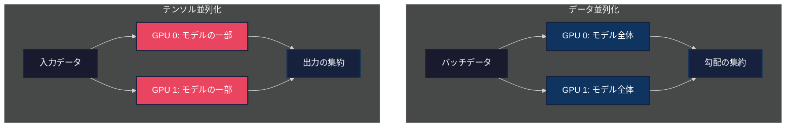
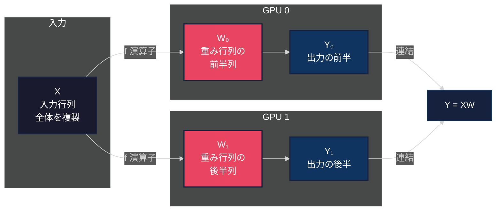
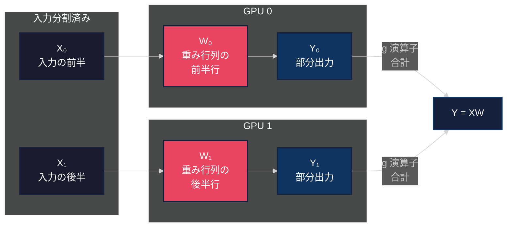
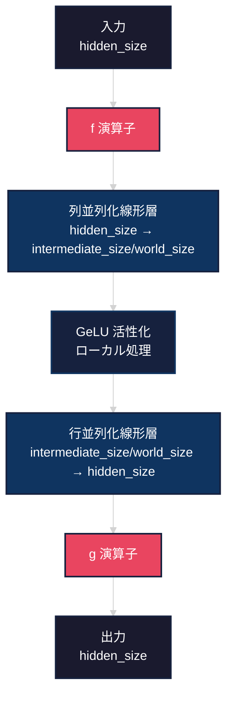
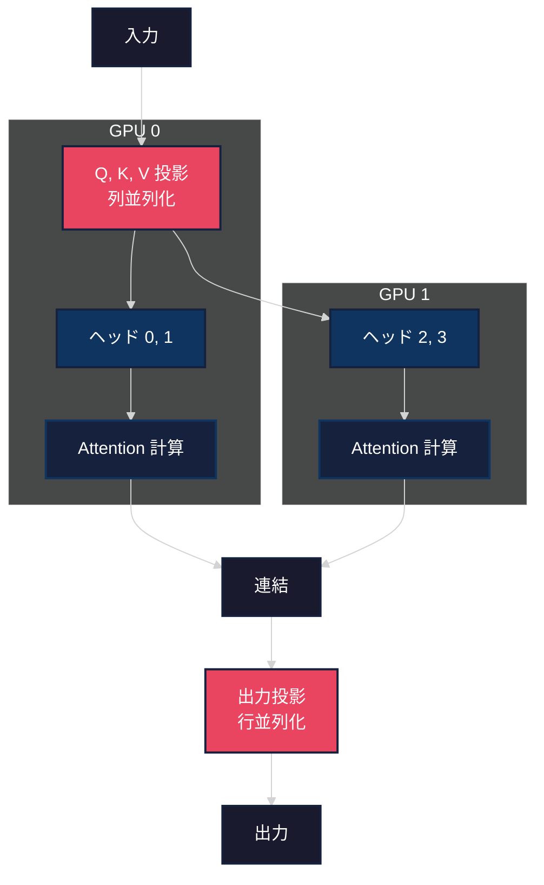
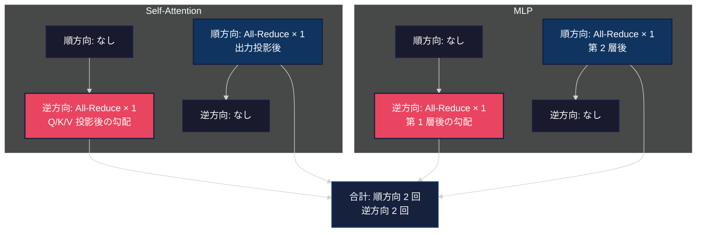

## はじめに

大規模言語モデルの訓練において、モデル並列化は必要不可欠な技術となっています。本記事では NVIDIA が発表した [Megatron-LM](https://arxiv.org/abs/1909.08053) のコアコンセプトである**テンソル並列化**を、CPU 上で再現実装することで、その仕組みを詳しく解説します。

実装したコードは以下のリポジトリで公開しています。

https://github.com/littlemex/samples/tree/main/ml_distributed_experiment_collection/megatron-simple

:::message
本実装は教育目的であり、実際の大規模訓練には適していません。実運用では NVIDIA の公式実装や PyTorch の分散学習機能を使用してください。
:::

## Megatron-LM とは

Megatron-LM は NVIDIA の Mohammad Shoeybi 氏らによって 2019 年に発表された、大規模言語モデルを効率的に訓練するためのモデル並列化手法です。この手法により、512 個の NVIDIA V100 GPU を使用して 83 億パラメータのモデルを 76% のスケーリング効率で訓練することに成功しました。

### 従来手法との違い

従来の**データ並列化**では、モデル全体を各 GPU にコピーし、バッチを分割して処理します。この方式では単一 GPU のメモリに収まらない大きなモデルは訓練できません。



一方、**テンソル並列化**では、モデル自体を分割して複数の GPU に配置します。これにより単一 GPU のメモリ制約を超えたモデルの訓練が可能になります。

### なぜテンソル並列化が重要なのか

GPT-3 (175B パラメータ) や GPT-4 のような超大規模モデルでは、モデルの重み行列だけで数百 GB のメモリを消費します。単一 GPU (例えば NVIDIA A100 の 80GB) には到底収まりません。テンソル並列化により、モデルを複数 GPU に分散配置し、訓練を実現します。

## Megatron-LM の核心：f 演算子と g 演算子

Megatron-LM の最大の貢献は、**通信回数を最小化**しながらモデルを並列化する手法です。その鍵となるのが、カスタム autograd 関数として実装された f 演算子と g 演算子です。

### f 演算子：Identity Forward, All-Reduce Backward

f 演算子は順方向パスでは恒等写像（何もしない）、逆方向パスでは勾配を全 GPU で平均化します。

```mermaid
%%{init: {'theme':'dark'}}%%
sequenceDiagram
    participant I as 入力
    participant F as f 演算子
    participant O as 出力

    Note over I,O: 順方向パス
    I->>F: x
    F->>O: x (恒等写像)

    Note over I,O: 逆方向パス
    O->>F: ∂L/∂x
    F->>F: All-Reduce(平均化)
    F->>I: avg(∂L/∂x)

    style I fill:#1a1a2e,stroke:#16213e,stroke-width:2px,color:#fff
    style F fill:#e94560,stroke:#16213e,stroke-width:2px,color:#fff
    style O fill:#1a1a2e,stroke:#16213e,stroke-width:2px,color:#fff
```

実装は以下のようになります。

```python:src/parallel_ops.py
class IdentityForward_AllReduceBackward(torch.autograd.Function):
    """f 演算子: 順方向は恒等、逆方向で All-Reduce"""

    @staticmethod
    def forward(ctx, input_tensor, tensors_for_all_reduce):
        ctx.tensors_for_all_reduce = tensors_for_all_reduce
        return input_tensor  # 順方向は恒等写像

    @staticmethod
    def backward(ctx, grad_output):
        # 逆方向で勾配を平均化
        tensors = ctx.tensors_for_all_reduce
        if len(tensors) > 0:
            stacked = torch.stack(tensors, dim=0)
            reduced_grad = stacked.mean(dim=0)
        else:
            reduced_grad = grad_output
        return reduced_grad, None
```

### g 演算子：All-Reduce Forward, Identity Backward

g 演算子は f 演算子の逆で、順方向パスで全 GPU の出力を合計し、逆方向パスでは恒等写像を行います。

```mermaid
%%{init: {'theme':'dark'}}%%
sequenceDiagram
    participant I as 入力
    participant G as g 演算子
    participant O as 出力

    Note over I,O: 順方向パス
    I->>G: x
    G->>G: All-Reduce(合計)
    G->>O: sum(x)

    Note over I,O: 逆方向パス
    O->>G: ∂L/∂x
    G->>I: ∂L/∂x (恒等写像)

    style I fill:#1a1a2e,stroke:#16213e,stroke-width:2px,color:#fff
    style G fill:#0f3460,stroke:#16213e,stroke-width:2px,color:#fff
    style O fill:#1a1a2e,stroke:#16213e,stroke-width:2px,color:#fff
```

```python:src/parallel_ops.py
class AllReduceForward_IdentityBackward(torch.autograd.Function):
    """g 演算子: 順方向で All-Reduce、逆方向は恒等"""

    @staticmethod
    def forward(ctx, input_tensor, tensors_for_all_reduce):
        if len(tensors_for_all_reduce) > 1:
            # 順方向で全 GPU の出力を合計
            stacked = torch.stack(tensors_for_all_reduce, dim=0)
            return stacked.sum(dim=0)
        else:
            return input_tensor

    @staticmethod
    def backward(ctx, grad_output):
        # 逆方向は恒等写像
        return grad_output, None
```

## 列並列化と行並列化

テンソル並列化の実装では、重み行列を 2 つの方法で分割します。

### 列並列化 (Column Parallel)

重み行列を**出力次元方向**に分割します。各 GPU は行列の列の一部を保持します。



実装例：

```python:src/parallel_layers.py
class ColumnParallelLinear(nn.Module):
    """列並列化線形層"""

    def __init__(self, in_features, out_features, bias=True, gather_output=False):
        super().__init__()
        world_size = get_tensor_parallel_world_size()

        # 出力次元を world_size で分割
        self.out_features_per_partition = out_features // world_size

        # 重み行列の一部のみを保持
        self.weight = nn.Parameter(
            torch.empty(self.out_features_per_partition, in_features)
        )

        if bias:
            self.bias = nn.Parameter(
                torch.empty(self.out_features_per_partition)
            )

    def forward(self, input_tensor, all_input_tensors=None, all_output_tensors=None):
        # f 演算子を適用（勾配同期のため）
        if all_input_tensors is not None:
            input_parallel = copy_to_tensor_parallel_region(
                input_tensor, all_input_tensors
            )
        else:
            input_parallel = input_tensor

        # ローカルな行列積
        output = torch.matmul(input_parallel, self.weight.t())

        if self.bias is not None:
            output = output + self.bias

        return output
```

### 行並列化 (Row Parallel)

重み行列を**入力次元方向**に分割します。入力も同様に分割され、各 GPU は部分的な計算を行います。



```python:src/parallel_layers.py
class RowParallelLinear(nn.Module):
    """行並列化線形層"""

    def __init__(self, in_features, out_features, bias=True, reduce_results=True):
        super().__init__()
        world_size = get_tensor_parallel_world_size()
        rank = get_tensor_parallel_rank()

        # 入力次元を world_size で分割
        self.in_features_per_partition = in_features // world_size

        # 重み行列の一部のみを保持
        self.weight = nn.Parameter(
            torch.empty(out_features, self.in_features_per_partition)
        )

        # バイアスは rank 0 のみが保持（重複を避けるため）
        if bias and rank == 0:
            self.bias = nn.Parameter(torch.empty(out_features))
        else:
            self.register_parameter('bias', None)

    def forward(self, input_tensor, all_output_tensors=None):
        # ローカルな行列積
        output = torch.matmul(input_tensor, self.weight.t())

        # g 演算子を適用（出力を合計）
        if self.reduce_results and all_output_tensors is not None:
            output = reduce_from_tensor_parallel_region(output, all_output_tensors)

        # バイアスを加算（rank 0 のみ）
        if self.bias is not None:
            output = output + self.bias

        return output
```

## Transformer での並列化パターン

Megatron-LM では Transformer の各コンポーネントを効率的に並列化します。

### MLP ブロックの並列化

MLP（多層パーセプトロン）は 2 つの線形層から構成されます。第 1 層を列並列化、第 2 層を行並列化することで、**通信回数を最小化**します。



重要なのは、**GeLU 活性化関数は各 GPU でローカルに実行される**点です。これにより中間状態の通信が不要になります。

```python:src/transformer.py
class ParallelMLP(nn.Module):
    """テンソル並列化された MLP"""

    def __init__(self, hidden_size, intermediate_size, dropout=0.1):
        super().__init__()

        # 第 1 層：列並列化（拡張）
        self.dense_h_to_4h = ColumnParallelLinear(
            in_features=hidden_size,
            out_features=intermediate_size,
            bias=True,
            gather_output=False,  # 出力を集約しない
        )

        # 第 2 層：行並列化（収縮）
        self.dense_4h_to_h = RowParallelLinear(
            in_features=intermediate_size,
            out_features=hidden_size,
            bias=True,
            input_is_parallel=True,  # 入力は既に分割済み
            reduce_results=True,  # 出力を合計
        )

        self.dropout = nn.Dropout(dropout)

    def forward(self, hidden_states, all_input_tensors_1=None,
                all_intermediate_tensors=None, all_output_tensors=None):
        # 第 1 層（列並列化）
        intermediate = self.dense_h_to_4h(
            hidden_states,
            all_input_tensors=all_input_tensors_1,
            all_output_tensors=all_intermediate_tensors,
        )

        # GeLU 活性化（ローカル、通信なし）
        intermediate = F.gelu(intermediate)

        # 第 2 層（行並列化、g 演算子で出力を合計）
        output = self.dense_4h_to_h(
            intermediate,
            all_output_tensors=all_output_tensors,
        )

        output = self.dropout(output)
        return output
```

### Self-Attention の並列化

Self-Attention では、アテンションヘッドを複数 GPU に分散します。各 GPU は全体のヘッドの一部を担当します。



```python:src/transformer.py
class ParallelSelfAttention(nn.Module):
    """テンソル並列化された Self-Attention"""

    def __init__(self, hidden_size, num_attention_heads, dropout=0.1):
        super().__init__()

        world_size = get_tensor_parallel_world_size()

        # アテンションヘッドを分割
        assert num_attention_heads % world_size == 0
        self.num_attention_heads_per_partition = num_attention_heads // world_size
        self.head_dim = hidden_size // num_attention_heads
        self.hidden_size_per_partition = (
            self.num_attention_heads_per_partition * self.head_dim
        )

        # Q, K, V 投影（列並列化）
        self.query_key_value = ColumnParallelLinear(
            in_features=hidden_size,
            out_features=3 * hidden_size,  # Q, K, V を連結
            bias=True,
            gather_output=False,
        )

        # 出力投影（行並列化）
        self.dense = RowParallelLinear(
            in_features=hidden_size,
            out_features=hidden_size,
            bias=True,
            input_is_parallel=True,
            reduce_results=True,
        )

        self.dropout = nn.Dropout(dropout)
        self.scale = 1.0 / math.sqrt(self.head_dim)

    def forward(self, hidden_states, attention_mask=None,
                all_input_tensors_qkv=None, all_qkv_tensors=None,
                all_output_tensors=None):
        batch_size, seq_len, _ = hidden_states.shape

        # Q, K, V 投影（列並列化）
        mixed_qkv = self.query_key_value(
            hidden_states,
            all_input_tensors=all_input_tensors_qkv,
            all_output_tensors=all_qkv_tensors,
        )

        # Q, K, V に分割
        qkv_size = self.hidden_size_per_partition
        query, key, value = torch.split(mixed_qkv, qkv_size, dim=-1)

        # マルチヘッドアテンション用に reshape
        query = query.view(
            batch_size, seq_len,
            self.num_attention_heads_per_partition, self.head_dim
        ).transpose(1, 2)
        key = key.view(
            batch_size, seq_len,
            self.num_attention_heads_per_partition, self.head_dim
        ).transpose(1, 2)
        value = value.view(
            batch_size, seq_len,
            self.num_attention_heads_per_partition, self.head_dim
        ).transpose(1, 2)

        # Attention スコアの計算
        attention_scores = torch.matmul(query, key.transpose(-2, -1)) * self.scale

        if attention_mask is not None:
            attention_scores = attention_scores + attention_mask

        attention_probs = F.softmax(attention_scores, dim=-1)
        attention_probs = self.dropout(attention_probs)

        # 値との重み付き和
        context = torch.matmul(attention_probs, value)

        # Reshape back
        context = context.transpose(1, 2).contiguous().view(
            batch_size, seq_len, self.hidden_size_per_partition
        )

        # 出力投影（行並列化、g 演算子で合計）
        output = self.dense(context, all_output_tensors=all_output_tensors)

        return output
```

## 通信パターンの分析

Megatron-LM の優れた点は、**Transformer 1 層あたりの通信回数が非常に少ない**ことです。

### 1 層あたりの通信回数



完全な Transformer 1 層（Self-Attention + MLP）で必要な All-Reduce 操作は：
- **順方向パス**: 2 回（Self-Attention 出力投影後、MLP 第 2 層後）
- **逆方向パス**: 2 回（MLP 第 1 層後の勾配、Self-Attention Q/K/V 投影後の勾配）

この通信パターンにより、**計算と通信を効率的にオーバーラップ**させることが可能になります。

## CPU での実装とシミュレーション

本実装では、実際の GPU 分散環境を使わず、CPU 上で複数の「仮想 GPU」をシミュレートします。

### TensorParallelContext の実装

```python:src/parallel_context.py
@dataclass
class TensorParallelConfig:
    """テンソル並列化の設定"""
    world_size: int = 1  # シミュレートする GPU 数
    rank: int = 0  # 現在のランク（0 から world_size-1）

# グローバルコンテキスト
_TP_CONTEXT: Optional[TensorParallelConfig] = None

def initialize_tensor_parallel(world_size: int, rank: int) -> None:
    """テンソル並列化コンテキストを初期化"""
    global _TP_CONTEXT
    assert 0 <= rank < world_size
    _TP_CONTEXT = TensorParallelConfig(world_size=world_size, rank=rank)

def get_tensor_parallel_world_size() -> int:
    """world_size を取得"""
    return get_tensor_parallel_context().world_size

def get_tensor_parallel_rank() -> int:
    """現在のランクを取得"""
    return get_tensor_parallel_context().rank

class TensorParallelContext:
    """テンソル並列化のコンテキストマネージャ"""

    def __init__(self, world_size: int, rank: int):
        self.world_size = world_size
        self.rank = rank
        self.prev_context = None

    def __enter__(self):
        self.prev_context = _TP_CONTEXT
        initialize_tensor_parallel(self.world_size, self.rank)
        return self

    def __exit__(self, exc_type, exc_val, exc_tb):
        global _TP_CONTEXT
        _TP_CONTEXT = self.prev_context
```

使用例：

```python
# Rank 0 としてモデルを初期化
with TensorParallelContext(world_size=2, rank=0):
    model_rank0 = ParallelGPTModel(config)
    # このスコープ内では rank=0 として動作

# Rank 1 としてモデルを初期化
with TensorParallelContext(world_size=2, rank=1):
    model_rank1 = ParallelGPTModel(config)
    # このスコープ内では rank=1 として動作
```

## 実験結果

実装したモデルを使って、単一 GPU と並列化の比較実験を行いました。

### モデル構成

- 語彙サイズ: 1,000 トークン
- 隠れ層次元: 128
- レイヤー数: 2
- アテンションヘッド数: 4
- 中間層次元: 512
- 最大シーケンス長: 64

### パラメータ数の比較

```python
# 訓練スクリプトの実行結果
Single GPU params: 660,992
Parallel (per rank): 364,480
Memory reduction: ~1.8x
```

2 つの GPU に分散することで、各 GPU のパラメータ数が約 1.8 倍削減されました。これにより、単一 GPU には収まらない大きなモデルの訓練が可能になります。

### 訓練の動作確認

```bash
$ python examples/simple_train.py --mode compare

[1] Training on single 'GPU' (world_size=1)...
Rank 0 - Epoch 1/2, Batch 5/5, Loss: 6.9342
Rank 0 - Epoch 2/2, Batch 5/5, Loss: 6.7745

[2] Training on 2 'GPUs' (world_size=2)...
--- Rank 0 ---
Rank 0 - Epoch 1/2, Batch 5/5, Loss: 6.9479
Rank 0 - Epoch 2/2, Batch 5/5, Loss: 6.7956

--- Rank 1 ---
Rank 1 - Epoch 1/2, Batch 5/5, Loss: 6.9324
Rank 1 - Epoch 2/2, Batch 5/5, Loss: 6.7686
```

両方のランクで正常に訓練が進行し、損失が減少していることが確認できます。

## 実装の検証

実装の正確性を確認するために、複数のテストを作成しました。

### f 演算子と g 演算子のテスト

```python:tests/test_parallel_ops.py
def test_f_operator():
    """f 演算子のテスト"""
    x1 = torch.tensor([[1.0, 2.0], [3.0, 4.0]], requires_grad=True)
    x2 = torch.tensor([[5.0, 6.0], [7.0, 8.0]], requires_grad=True)

    grad_tensors = []
    y1 = copy_to_tensor_parallel_region(x1, grad_tensors)

    # 順方向は恒等写像
    assert torch.allclose(y1, x1)

    # 逆方向で勾配を平均化
    grad_tensors.append(torch.ones_like(x1))
    grad_tensors.append(torch.ones_like(x2))

    y1_new = copy_to_tensor_parallel_region(x1, grad_tensors)
    loss = y1_new.sum()
    loss.backward()

    # 勾配が平均化されている
    assert torch.allclose(x1.grad, torch.ones_like(x1))
```

### 並列層の等価性テスト

```python:tests/test_parallel_layers.py
def test_column_parallel_linear():
    """列並列化層が標準層と等価であることを確認"""
    in_features, out_features = 8, 16
    world_size = 2

    # 標準層
    torch.manual_seed(42)
    standard_linear = nn.Linear(in_features, out_features)
    x = torch.randn(2, 4, in_features)
    standard_output = standard_linear(x)

    # 並列層（各ランク）
    parallel_outputs = []
    for rank in range(world_size):
        with TensorParallelContext(world_size=world_size, rank=rank):
            parallel_linear = ColumnParallelLinear(
                in_features=in_features,
                out_features=out_features,
            )
            # 重みをコピー
            start_idx = rank * (out_features // world_size)
            end_idx = (rank + 1) * (out_features // world_size)
            parallel_linear.weight.copy_(
                standard_linear.weight[start_idx:end_idx, :]
            )

            output = parallel_linear(x)
            parallel_outputs.append(output)

    # 連結した出力が標準層と一致
    gathered_output = torch.cat(parallel_outputs, dim=-1)
    assert torch.allclose(gathered_output, standard_output, rtol=1e-4)
```

すべてのテストが成功し、実装の正確性が確認されました。

## 実運用への拡張

本実装は教育目的のシミュレーションですが、実運用では以下のように拡張できます。

### PyTorch Distributed への拡張

```python
import torch.distributed as dist

def all_reduce_real(tensor):
    """実際の分散環境での All-Reduce"""
    dist.all_reduce(tensor, op=dist.ReduceOp.SUM)
    return tensor / dist.get_world_size()

class IdentityForward_AllReduceBackward_Real(torch.autograd.Function):
    """実際の GPU 環境用の f 演算子"""

    @staticmethod
    def forward(ctx, input_tensor):
        return input_tensor

    @staticmethod
    def backward(ctx, grad_output):
        # 実際の NCCL 通信を使用
        return all_reduce_real(grad_output)
```

### Multi-Process での実行

```python
import torch.multiprocessing as mp

def run_rank(rank, world_size, config):
    """各ランクを別プロセスで実行"""
    # 分散環境の初期化
    dist.init_process_group(
        backend='nccl',
        init_method='env://',
        world_size=world_size,
        rank=rank
    )

    # GPU デバイスの設定
    torch.cuda.set_device(rank)

    # モデルの作成と訓練
    model = ParallelGPTModel(config).cuda(rank)
    # ... 訓練ループ

if __name__ == "__main__":
    world_size = 8
    mp.spawn(run_rank, args=(world_size, config), nprocs=world_size)
```

## まとめ

本記事では Megatron-LM のテンソル並列化を CPU 上で再現実装し、その仕組みを詳しく解説しました。

### 重要なポイント

1. **f 演算子と g 演算子**: 順方向と逆方向で通信タイミングを制御する
2. **列並列化と行並列化**: 重み行列を効率的に分割する
3. **通信最小化**: Transformer 1 層あたり順方向 2 回、逆方向 2 回の All-Reduce のみ
4. **ローカル処理**: GeLU などの活性化関数は各 GPU で独立に実行

### テンソル並列化の利点

- 単一 GPU のメモリ制約を超えたモデルの訓練が可能
- データ並列化と組み合わせることで、さらなる大規模化が可能
- 通信回数が少なく、高いスケーリング効率を実現

### 今後の発展

Megatron-LM の概念は以下のプロジェクトで実用化されています。

- [NVIDIA Megatron-LM](https://github.com/NVIDIA/Megatron-LM): 公式実装
- [Microsoft DeepSpeed](https://github.com/microsoft/DeepSpeed): ZeRO オプティマイザと組み合わせた実装
- [Colossal-AI](https://github.com/hpcaitech/ColossalAI): 複数の並列化手法を統合したフレームワーク

大規模言語モデルの訓練において、テンソル並列化は必要不可欠な技術となっています。本記事の実装を通じて、その仕組みを理解していただければ幸いです。

## 参考文献

- [Megatron-LM: Training Multi-Billion Parameter Language Models Using Model Parallelism](https://arxiv.org/abs/1909.08053) - Mohammad Shoeybi et al., 2019
- [Efficient Large-Scale Language Model Training on GPU Clusters Using Megatron-LM](https://arxiv.org/abs/2104.04473) - Deepak Narayanan et al., 2021
- [PyTorch Distributed Overview](https://pytorch.org/tutorials/beginner/dist_overview.html)
- [NVIDIA Megatron-LM GitHub Repository](https://github.com/NVIDIA/Megatron-LM)

---

実装コードの全体は以下のリポジトリで公開しています。

https://github.com/littlemex/samples/tree/main/ml_distributed_experiment_collection/megatron-simple
