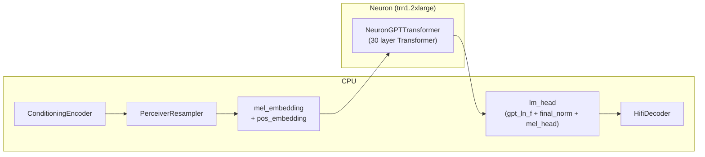
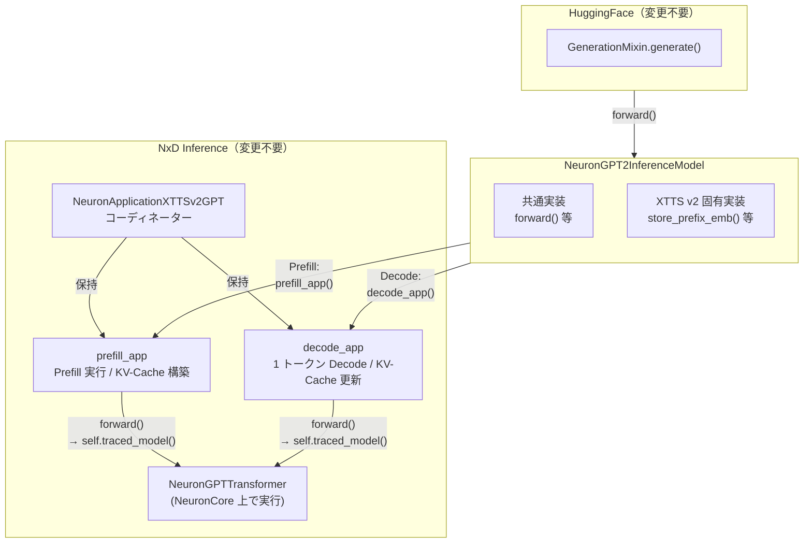
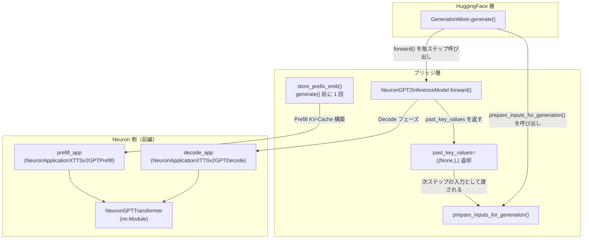
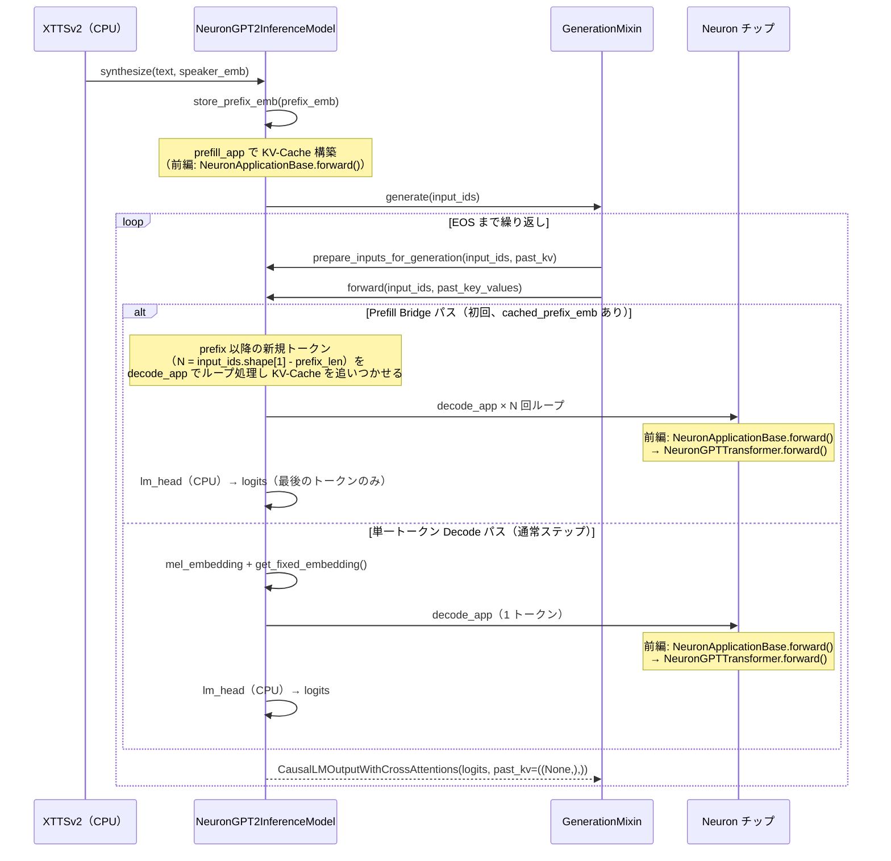
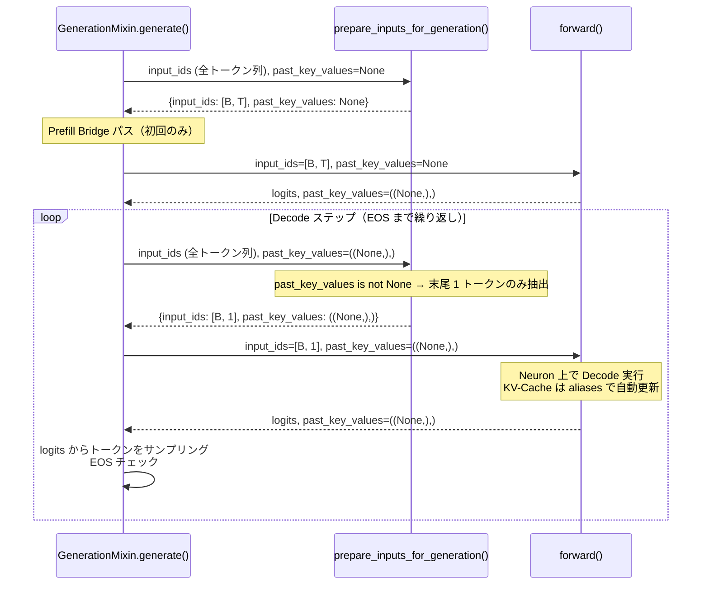
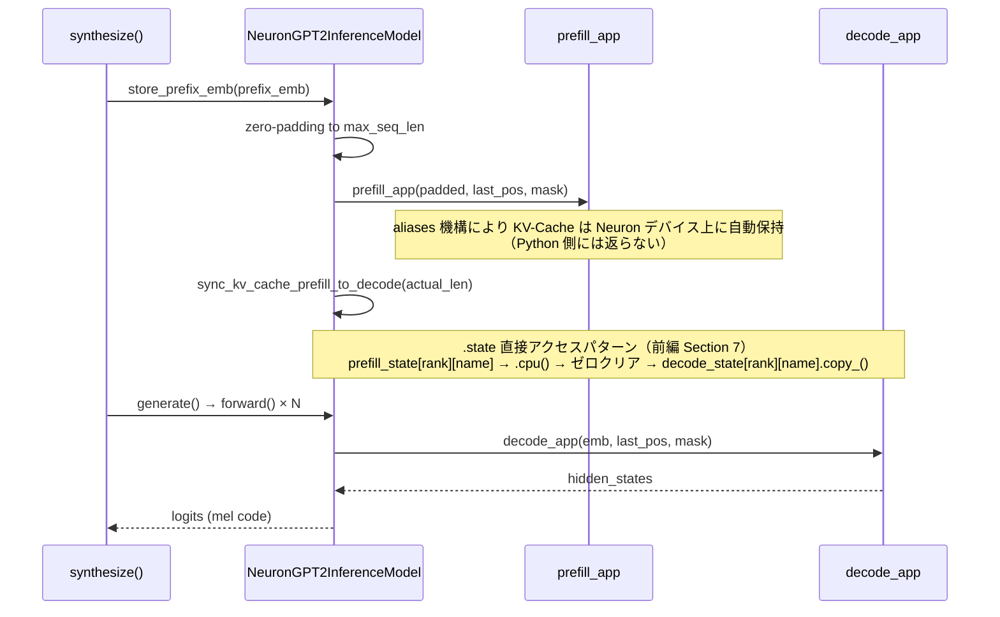

## はじめに

https://zenn.dev/tosshi/articles/81840c7c10dddd

前編では、NxD Inference のカスタムモデル統合に必要な 3 つのインタフェースの役割とインタフェースを解説しました。本記事はその実装編として、XTTS v2 を実際に NxD Inference に統合しました。

本記事が扱う焦点は次の 3 点です。

- 前編で触れなかった重要な実装上の工夫（ブリッジ層、状態管理、重み変換）
- 実際に動かすまでの具体的な手順（コンパイル、重みロード、推論）
- 実測性能（WER、レイテンシ、CPU 比速度）

前編を読んでいなくても理解できるよう要点は補いますが、NxD Inference の基本設計を把握していると読み進めやすいです。

:::message alert
2026/03 時点のバージョンに基づいているため、AWS Neuron のアップデートで動作が変わることがあります。最新の実装を必ず確認してください。
:::

## CPU/Neuron 分割とブリッジ層

### CPU/Neuron 境界

XTTS v2 は複数のコンポーネントで構成されており、そのすべてを Neuron にのせる必要はありません。Neuron でコンパイルする対象は GPT Transformer（30 層）のみで、残りのコンポーネントは CPU で動作します。

| コンポーネント | 実行場所 | 役割 |
|---|---|---|
| ConditioningEncoder | CPU | 参照音声をコンテキスト潜在ベクトルに変換 |
| PerceiverResampler | CPU | コンテキストを固定長プロンプトに変換 |
| GPT Transformer (30 層) | Neuron | テキスト → mel コードの自己回帰生成 |
| HifiDecoder | CPU | mel コード → 波形 |

GPT Transformer を Neuron に移す理由は、XTTS v2 の推論時間の大半がこの自己回帰生成ステップに集中していたからです（前編参照）。ConditioningEncoder と PerceiverResampler は 1 回だけ呼ばれる前処理であり、HifiDecoder は比較的軽量なため、CPU で十分です。

下図は CPU と Neuron の境界を示しています。今回は trn1.2xlarge で検証します。



### NeuronGPT2InferenceModel の役割



GPT 系デコーダを NxD Inference に移植するには、3 つの責務を誰かが担う必要があります。

| 責務 | 内容 |
|------|------|
| 生成ループ管理 | `generate()` の呼び出し、トークンサンプリング、EOS 検出と停止 |
| Neuron 推論実行 | コンパイル済みモデルの実行、KV-Cache のデバイス上管理 |
| ブリッジ | 埋め込み計算、NxD への委譲、logits 変換、状態管理 |

基本的なそれぞれの担当は以下のようになります。

| 責務 | 担当 | 実装要否 |
|------|------|----------|
| 生成ループ管理 | `GenerationMixin`（HuggingFace） | 不要 |
| Neuron 推論実行 | 前編で実装した `NeuronApplicationXTTSv2GPT`（`decode_app`） | 不要 |
| ブリッジ | `NeuronGPT2InferenceModel`（本実装サンプル） | **必要** |

前編で実装した `decode_app` が `NeuronApplicationBase.forward()` → `self.traced_model()` を通じて `NeuronGPTTransformer` を NeuronCore 上で実行し、aliases 機構により KV-Cache をデバイス上で自動更新します。ブリッジ層はこの `decode_app` を呼びます。

:::message alert
**今回新規に実装が必要なのは `NeuronGPT2InferenceModel` だけ**です。このクラスが NxD Inference、HuggingFace 実装を接続し、CPU/Neuron 間のやり取りを中継します。
:::

このクラスで実装すべき項目を「どの GPT 系デコーダでも共通」と「XTTS v2 固有」に分けて整理します。詳細は後述します。

**GenerationMixin 継承 -- HuggingFace 生成ループとの接続**

`GenerationMixin` は HuggingFace Transformers が提供する Mix-in クラスで、`generate()` メソッドの実装を持ちます。`generate()` は「`forward()` を呼ぶ → logits からトークンをサンプリングする → EOS が出たら止める」というループを担っており、継承するだけでこの生成ループが使えます。モデル側は `forward()` を実装するだけでよく、ループ全体を自前で書く必要がありません。

XTTS v2 の `synthesize()` が `generate()` を呼んでいるため、`NeuronGPT2InferenceModel` が `GenerationMixin` を継承していれば Coqui TTS 側のコードを変えずに Neuron 推論に切り替えられます。

**どの GPT 系デコーダでも必要な実装**

| 実装項目 | 内容 |
|---------|------|
| `forward()` | 埋め込み → NxD 推論委譲 → lm_head → logits |
| `prepare_inputs_for_generation()` | KV-Cache 使用中は最後の 1 トークンのみ渡す |
| `past_key_values=((None,),)` 返却 | HuggingFace に「キャッシュは Neuron 側で管理中」と宣言 |
| `GenerationMixin` 継承 | `generate()` をそのまま使えるようにする |

**XTTS v2 固有の実装**

それぞれの意味は後述します。

| 実装項目 | 内容 |
|---------|------|
| `store_prefix_emb()` | `synthesize()` から呼ばれる Prefill エントリポイント |
| `token_count` / `is_prefill` / `cached_prefix_emb` | XTTS の合成フローが持つ状態変数 |
| `lm_head` の `gpt_ln_f` 対応 | Coqui TTS の GPT-2 が `ln_f` を内包する挙動の再現 |
| `gpt_wpe` 引数 | CPU `GPT2Model` の `wpe` 加算挙動への対応として引数保持 |
| `sync_kv_cache_prefill_to_decode()` | Prefill KV-Cache を Decode モデルへ転送し、padding 位置をゼロクリアするヘルパー |


:::message alert
XTTS v2 では `cpu_model.gpt.gpt_inference` への代入だけでブリッジ挿入が完了します。

```python
gpt_module.gpt_inference = NeuronGPT2InferenceModel(...)
```
:::

:::message
**XTTS 以外の GPT 系デコーダに統合する場合**

`gpt_inference` のようなフックポイントは Coqui TTS 固有の設計です。他のモデルでも `NeuronGPT2InferenceModel` の実装内容は変わりませんが、「どこに差し込むか」を別途決める必要があります。

```python
# パターン A: 属性置換
model.transformer = NeuronGPT2InferenceModel(...)

# パターン B: サブクラス化
class NeuronMyModel(OriginalModel):
    def forward(self, *args, **kwargs):
        return self.neuron_bridge.forward(*args, **kwargs)
```

どちらの方法でも「HuggingFace の `generate()` が呼べる状態を保ちながら、Transformer 本体のみ Neuron に委譲する」という設計原則は変わりません。
:::

今回実装した [`neuron_xttsv2.py`](https://github.com/littlemex/samples/blob/main/ml_distributed_experiment_collection/xttsv2-nxd-inference/src/neuron_xttsv2/neuron_xttsv2.py) からの `NeuronGPT2InferenceModel` 実装の抜粋を示します。

```python
class NeuronGPT2InferenceModel(GPT2PreTrainedModel, GenerationMixin):
    def __init__(self, gpt_config, neuron_gpt_app,
                 mel_pos_emb, mel_emb, final_norm, mel_head,
                 kv_cache=True, gpt_ln_f=None, gpt_wpe=None):  # 主要引数のみ抜粋
        super().__init__(gpt_config)
        # !!!!!!!!!!!!!!!!!!!!!
        self.neuron_gpt_app = neuron_gpt_app # ブリッジの接続点
        # !!!!!!!!!!!!!!!!!!!!!
        # lm_head: gpt_ln_f が None でない場合は gpt_ln_f -> final_norm -> mel_head
        # ...
```

このクラスの設計の要点は **多重継承とコンストラクタ引数** の 2 点にあります。

**多重継承でブリッジする**

`GPT2PreTrainedModel` 継承で HuggingFace のモデルとして扱え、`GenerationMixin` を継承することで `generate()` ループが使えるようになります。

:::message
2 つを同時に継承することで、「`generate()` から `forward()` が呼ばれる HuggingFace モデル」として振る舞いながら、`forward()` の中身を自由に差し替えられる構造になります。
:::

**`neuron_gpt_app` がブリッジの接続点**

:::message alert
***コンストラクタで `self.neuron_gpt_app = neuron_gpt_app` と代入しているこの 1 行が、HuggingFace と NxD Inference を繋ぐ接続点です。***
:::

`neuron_gpt_app` は前編で解説した `NeuronApplicationXTTSv2GPT`（コーディネーター）のインスタンスです。`prefill_app`（`NeuronApplicationXTTSv2GPTPrefill`）と `decode_app`（`NeuronApplicationXTTSv2GPTDecode`）の 2 Application を束ねた、前編の NxD Inference 推論エンジン全体がここで接続されます。`GenerationMixin.generate()` が `forward()` を呼ぶたびに、この `neuron_gpt_app` を通じて実際の Transformer 計算が Neuron デバイス上で実行されます。

### Forward Override パターン

https://zenn.dev/tosshi/articles/53cc505a8d85e2

> Forward Override パターンの詳細は上記ブログを参照ください。

実際の差し込み処理の例として [`e2e_xttsv2_neuron.py`](https://github.com/littlemex/samples/blob/main/ml_distributed_experiment_collection/xttsv2-nxd-inference/examples/e2e_xttsv2_neuron.py) を示します。

https://github.com/littlemex/samples/blob/b6334caf1f46c549bb58905a7a39000d5aba5db2/ml_distributed_experiment_collection/xttsv2-nxd-inference/examples/e2e_xttsv2_neuron.py#L143-L156

`cpu_model` の `gpt.gpt_inference` を差し替えるだけなので、`cpu_model.synthesize()` の呼び出し側コードは一切変更不要です。XTTS v2 の元実装が `gpt_inference` というフックポイントを持っていたことが、このパターンをクリーンに実現できた理由です。なお `gpt_inference` のような既存のフックポイントがない場合でも、上述した属性置換やサブクラス化で同様に実現できます。

## どの GPT 系デコーダでも必要な実装

前編では、NxD Inference の 3 つのインタフェースの役割と、それぞれの実装方法を解説しました。`NeuronApplicationXTTSv2GPT` が `prefill_app` と `decode_app` を束ねるコーディネーターとして機能することを示しました。前編が説明した「Neuron 側の推論実行エンジン」はこのコーディネーターまでです。

:::message
先ほど解説した `NeuronGPT2InferenceModel` は、その Neuron 側エンジンを「外から呼び出すブリッジ層」です。前回の記事と今回の実装の関係が繋がったでしょうか？
:::

HuggingFace の `GenerationMixin.generate()` が毎ステップ `forward()` を呼び出し、その中で前編の `decode_app` を呼び、`decode_app` が Neuron 上の `NeuronGPTTransformer.forward()` を実行します。



前編の `NeuronApplicationBase.forward()` が `self.traced_model()` を通じて Neuron 上のカーネルを呼び出していました。ブリッジ層の `forward()` は `self.neuron_gpt_app` を通じて前編の推論エンジン全体を呼び出します。`neuron_gpt_app` のコンストラクタ引数への代入がこの 2 層を繋ぐ唯一のインタフェースです。

以降では各メソッドの実装詳細と設計理由を順番に解説します。

### forward() -- 呼び出しフローと 3 パスの設計

`forward()` の役割を理解するには、まず「どこから・どの順序で呼ばれるか」を把握する必要があります。

#### 全体の呼び出しフロー



#### なぜ forward() に 3 パスがあるのか

通常の HuggingFace モデルでは `generate()` が最初のステップで `forward()` を呼び出す時点で、まだ KV-Cache は空です。しかし XTTS v2 の `synthesize()` は **`generate()` を呼ぶ前に `store_prefix_emb()` を実行します**。

`store_prefix_emb()` は前編で解説した `prefill_app`（`NeuronApplicationBase.forward()` 経由）を使い、話者の音声 prefix を一括処理して Neuron 上の KV-Cache を構築済みの状態にします。その後 `sync_kv_cache_prefill_to_decode()` で Prefill 側のキャッシュを Decode 側に転送します。

つまり `generate()` がループを開始したとき、KV-Cache にはすでに prefix の情報が入っています。この「prefix 処理済み」という状態が、`forward()` に通常の Decode モデルにはない特殊なパスを要求します。

:::message
`forward()` 内では `decode_app` のみが Neuron を呼び出します。`prefill_app` は `store_prefix_emb()` の中でのみ使用され、`forward()` からは一切呼ばれません。
:::

#### 3 パスの詳細

**(A) Prefill Bridge パス**

発動条件: `cached_prefix_emb is not None` かつ `input_ids.shape[1] > 1`

`generate()` からの最初の `forward()` 呼び出しで発動します。XTTS v2 の `synthesize()` は `generate()` を呼ぶ際に最初の `input_ids` に prefix 全体（約 474 トークン）を渡します。しかし `store_prefix_emb()` によって prefix の KV-Cache は既に Neuron デバイス内に構築済みです。同じ prefix を再度 `decode_app` に渡すと KV-Cache の 2 重書き込みになるため、prefix 部分の処理をスキップし、構築済みの KV-Cache の位置を起点として prefix 以降の新規トークンのみを `decode_app` でループ処理して KV-Cache を現在位置まで追いつかせます。このパスは通常 1 回だけ発生し、以降は (B) の通常ステップに移行します。

**(B) 単一トークン Decode パス**

発動条件: `input_ids.shape[1] == 1`（通常の Decode ステップ）

ループの大半を占める標準パスです。`mel_embedding` と `get_fixed_embedding()` で 1 トークン分の埋め込みを構築し、前編で解説した `decode_app`（`NeuronApplicationBase.forward()` → `NeuronGPTTransformer.forward()`）に渡します。Neuron から返ってきた hidden state に CPU 上の `lm_head`（`gpt_ln_f` → `final_norm` → `mel_head`）を適用して mel コードの logits を生成します。

**(C) inputs_embeds パス**

発動条件: `inputs_embeds` が引数として渡された場合

埋め込みの構築をスキップして直接 `decode_app` に委譲します。XTTS v2 の通常フローでは発動しない代替パスです。外部から `inputs_embeds` が直接渡された場合のみ使用されます。`cached_prefix_emb` のチェックは行われないため、Prefill Bridge ロジックは発動しません。

#### 戻り値の設計

いずれのパスでも `forward()` は以下を返します。

```python
return CausalLMOutputWithCrossAttentions(
    logits=mel_code_logits,
    past_key_values=((None,),),   # KV-Cache 存在を HF に通知するダミー
)
```

`past_key_values` に `((None,),)` というダミー値を返しているのは、`GenerationMixin` に KV-Cache の存在を伝えるためです。実際のキャッシュは Neuron チップ上の静的バッファで管理されており、CPU 側に返す必要はありません。この設計により、`prepare_inputs_for_generation()` が「KV-Cache あり」と判定して毎ステップ最後の 1 トークンのみを `input_ids` として渡す動作が保証されます。

### prepare_inputs_for_generation() と past_key_values

`GenerationMixin.generate()` はループの各ステップで `prepare_inputs_for_generation()` と `forward()` を交互に呼び出します。この 2 つのメソッドは密結合しており、互いの戻り値を受け渡しながら EOS トークンが出るまでループを回します。

**なぜ NxD の KV-Cache は HuggingFace に渡さないのか**

HuggingFace モデルでは、`forward()` が更新済みの KV-Cache テンソルを `past_key_values` に詰めて返し、次ステップで再利用します。しかし NxD Inference では、KV-Cache は `aliases` 機構（前編参照）によって Neuron デバイス上に保持されており、ホスト側からは直接触れません。

つまり HuggingFace に渡すべき KV-Cache のテンソルが存在しません。そこで `forward()` は `past_key_values=((None,),)` というダミータプルを返すことで、「キャッシュは存在する」という事実だけを HuggingFace に伝える設計になっています。

:::message
`((None,),)` は中身のないダミー値ですが、`is not None` という判定を通過できる最小のタプルです。HuggingFace はこの値の中身を参照しないため、ダミーでも問題はありません。
:::

**generate() ループ内での相互作用**



## XTTS v2 固有の実装

本セクションでは、実際に XTTSv2 を動かす上で鍵となる XTTS v2 固有の実装箇所を取り上げます。これらは前編では説明していませんでしたが、正しく動作させるために欠かせない設計です。汎用的なカスタムモデルの NxD Inference への統合方法のみに興味がある方は読み飛ばしても構いません。

### store_prefix_emb() -- Prefill と KV-Cache 同期

`NeuronGPT2InferenceModel.store_prefix_emb()` は、XTTSv2 の音声生成ループに入る前に呼ばれるメソッドです。このメソッドが担う役割は「prefix の埋め込みベクトルを Neuron 上に読み込み、その KV-Cache を Decode Application に引き渡すこと」です。

:::message
要は XTTS v2 の Prefill フェーズで使うメソッドです。
:::

処理の流れは次の 3 段階に整理できます。



1. prefix_emb を max_seq_len (1081) に zero-padding する
2. Prefill Application で一括実行し、全 prefix トークンの KV-Cache を一括構築する
3. `sync_kv_cache_prefill_to_decode()` を呼ぶ（この関数内部で `prefix_len` 以降の padding 位置をゼロクリアしながら Decode Application に KV-Cache を転送する）

> 詳細な実装は`neuron_xttsv2.py` を参照してください。

### token_count / is_prefill / cached_prefix_emb -- 推論状態の管理

`NeuronGPT2InferenceModel` は 3 つの状態変数を持ち、XTTS v2 の合成フローに合わせて `store_prefix_emb()` と `forward()` の挙動を制御します。

| 変数 | 初期値 | 役割 |
|------|--------|------|
| `token_count` | `0` | 現在の Decode 位置（KV-Cache の書き込み先インデックス）を追跡する |
| `is_prefill` | `True` | `store_prefix_emb()` 呼び出し時に `True` にセットされるフラグ。 |
| `cached_prefix_emb` | `None` | `store_prefix_emb()` が呼ばれた際の prefix 埋め込みを保持し、`forward()` 内で `prefix_len` を参照するために使用する |

`is_prefill` フラグは `forward()` 内では直接参照されません。このフラグは各推論のリセット確認（`is_prefill = True` にリセット）と状態一覧の可視化のために使用します。`forward()` 内の分岐制御は `input_ids.shape[1]` と `self.cached_prefix_emb` の状態によって行われます。

これら 3 変数は推論ごとに必ずリセットする必要があります。リセットを忘れると、前回の推論で進んだ `token_count` 位置から KV-Cache の書き込みが始まり、音声品質が劣化します。

```python
# 新しい音声生成の前に毎回リセット
gpt_module.gpt_inference.token_count = 0
gpt_module.gpt_inference.cached_prefix_emb = None
gpt_module.gpt_inference.is_prefill = True
```

### sync_kv_cache_prefill_to_decode() の実装詳細

前編 Section 5（方法 B）で「2 Application に分離した場合、Prefill 実行後に KV-Cache を Decode Application に転送する仕組みが別途必要になる」と述べました。`application_gpt.py` の [`sync_kv_cache_prefill_to_decode()`](https://github.com/littlemex/samples/blob/b6334caf1f46c549bb58905a7a39000d5aba5db2/ml_distributed_experiment_collection/xttsv2-nxd-inference/src/neuron_xttsv2/application_gpt.py#L228) がその具体的な実装です。前編 Section 7 で説明した `.state` アクセスパターン（`traced_model.nxd_model.state` への直接アクセス）を使って、Prefill と Decode 双方のバッファ間でキャッシュを転送していますが具体的な転送方法には様々な手法があるためあくまで一例です。

### その他

::::details そのほかの注意点
### gpt_ln_f と gpt_wpe -- CPU 側で必要な 2 つの層

`NeuronGPT2InferenceModel` のコンストラクタが `gpt_ln_f` と `gpt_wpe` という 2 つの引数を受け取るのは、CPU 版の `GPT2Model` が持つ特殊な挙動を Neuron 上で正確に再現するためです。

まず `gpt_ln_f` についてです。CPU の XTTSv2 では `GPT2Model` が hidden state を出力する直前に内部で `ln_f`（最終層の LayerNorm）を適用します。NxD Inference の `NeuronGPTTransformer` はこの `ln_f` を内包していないため、Neuron 版では `lm_head` の先頭にこの層を明示的に連結して再現します。

```python
if gpt_ln_f is not None:
    self.lm_head = nn.Sequential(gpt_ln_f, final_norm, mel_head)
else:
    self.lm_head = nn.Sequential(final_norm, mel_head)
```

次に `gpt_wpe` についてです。CPU の `GPT2Model` は `inputs_embeds` が外部から与えられた場合でも、内部で `wpe(position_ids)` を加算するという挙動をとります。Neuron 版でこの加算を省略すると、Prefill フェーズから Decode フェーズへの状態移行時に hidden state が CPU 版と一致しなくなり、生成品質が低下します。そのため `gpt_wpe` を引数として受け取り保存しますが、`forward()` 内での実際の位置埋め込み加算は `mel_pos_emb.get_fixed_embedding()` が担います。XTTSv2 の mel 位置埋め込みが GPT2 の `wpe` と等価な音声位置情報を提供するため、`gpt_wpe` を直接呼び出す必要がありません。
 
 ### state_dict.py -- Conv1D から nn.Linear への重み変換

GPT-2 の重みは HuggingFace の `Conv1D` 形式（`[in_features, out_features]`）で保存されています。一方、NxD Inference の `ColumnParallelLinear` は PyTorch 標準の `nn.Linear` 形式（`[out_features, in_features]`）を期待します。この形状の不一致を解消するのが `state_dict.py` の `split_qkv()` と `convert_coqui_to_neuron_state_dict()` です。

`split_qkv()` では、GPT-2 の `c_attn` に結合されている Query / Key / Value の重みを分割し、転置しています。

```python
def split_qkv(state_dict, layer_idx, n_state=1024, prefix="h"):
    key_prefix = f"{prefix}.{layer_idx}.attn.c_attn"
    qkv_weight = state_dict.pop(f"{key_prefix}.weight")  # (n_state, 3*n_state)
    # qkv_bias の分割・設定は省略（実装では q_b/k_b/v_b も .contiguous() で格納）

    # Conv1D は [in, out]: dim=1 で分割
    q_w, k_w, v_w = qkv_weight.split(n_state, dim=1)

    # .T.contiguous(): Conv1D [in, out] -> nn.Linear [out, in]
    # .contiguous() は必須: shard_checkpoint 内部の view() が非連続テンソルで失敗する
    neuron_prefix = f"blocks.{layer_idx}.attn"
    state_dict[f"{neuron_prefix}.query.weight"] = q_w.T.contiguous()
    state_dict[f"{neuron_prefix}.key.weight"]   = k_w.T.contiguous()
    state_dict[f"{neuron_prefix}.value.weight"] = v_w.T.contiguous()
```

`.contiguous()` の呼び出しは省略できません。`.T` による転置の後、テンソルのメモリレイアウトは非連続になります。この状態で `shard_checkpoint()` 内部が `view()` を呼び出すと `RuntimeError: view size is not compatible with input tensor's size and stride` が発生します。`.contiguous()` でメモリレイアウトを連続化しておくことで、このエラーを防止できます。

また、XTTSv2 の `.pth` チェックポイントには `XttsConfig` オブジェクトが含まれているため、`torch.load()` には `weights_only=False` が必要です。

```python
checkpoint = torch.load(xtts_checkpoint_path, map_location="cpu", weights_only=False)
```

`weights_only=True`（PyTorch 2.x のデフォルト）のままだと、カスタムオブジェクトのデシリアライズが拒否されてエラーになります。

キー名の主な変換規則を以下の表に示します。

| GPT-2 (Coqui) のキー | NeuronGPTTransformer のキー | 変換処理 |
|---|---|---|
| `h.{i}.attn.c_attn.weight` | `blocks.{i}.attn.{query,key,value}.weight` | 3 分割 + 転置 |
| `h.{i}.attn.c_proj.weight` | `blocks.{i}.attn.out.weight` | 転置のみ |
| `h.{i}.mlp.c_fc.weight` | `blocks.{i}.mlp.up_proj.weight` | 転置のみ |
| `h.{i}.mlp.c_proj.weight` | `blocks.{i}.mlp.down_proj.weight` | 転置のみ |
| `h.{i}.ln_1.{weight,bias}` | `blocks.{i}.ln_1.{weight,bias}` | そのままコピー |
| `h.{i}.ln_2.{weight,bias}` | `blocks.{i}.ln_2.{weight,bias}` | そのままコピー |

さらに、XTTSv2 のチェックポイントでは GPT の重みが `gpt.gpt.h.` というプレフィックスを持っています。変換処理の冒頭でこのプレフィックスを除去してから変換に渡します。

```python
for key, value in gpt_state_dict.items():
    if "gpt.gpt.h." in key:
        new_key = key.replace("gpt.gpt.", "")  # "h.{i}.attn..." 形式に変換
        gpt_transformer_dict[new_key] = value
    # elif key.startswith("h."): ... HF 形式チェックポイントへのフォールバック（省略）
```

### config.py -- max_seq_len の計算

`XTTSv2InferenceConfig` で `max_seq_len = 1081` と固定値を設定しているのは、Neuron がコンパイル時に静的な入力形状を要求するためです。この値は XTTSv2 の各トークン上限を積み上げた合計から算出されます。

```python
self.max_seq_len = (
    self.gpt_max_audio_tokens + 2 +   # 605 + BOS/EOS = 607 (audio tokens)
    self.gpt_max_text_tokens + 2 +    # 402 + BOS/EOS = 404 (text tokens)
    self.gpt_max_prompt_tokens        # 70  (prompt tokens)
)  # 合計: 1081
```

Audio トークン・テキストトークンそれぞれに start / stop の 2 トークンが加わり、さらに話者プロンプトのトークン数を加算した値が最大シーケンス長となります。この値より短い入力はパディングして処理します。

**details シーケンス構造の詳細**

```text
位置 0  .. 69  : prompt tokens    (70 tokens, スピーカー条件付け)
位置 70         : text BOS
位置 71 .. 472 : text tokens      (最大 402 tokens)
位置 473        : text EOS
位置 474        : audio BOS
位置 475 .. 1079: audio tokens    (最大 605 tokens)
位置 1080       : audio EOS
合計: 1081
```

Prefill 時には prompt tokens + text tokens（BOS/EOS 込み）+ audio BOS までが `store_prefix_emb()` に渡されます。その後 `generate()` が audio tokens を 1 トークンずつ生成し、audio EOS が出力された時点で生成を停止します。

### application_gpt.py -- コンパイル引数

`_build_compiler_args()` では Neuron コンパイラに渡すオプションを組み立てています。

```python
def _build_compiler_args(config):
    args = "--model-type=transformer"
    args += " --tensorizer-options='--enable-ccop-compute-overlap --cc-pipeline-tiling-factor=2'"
    if config.neuron_config.torch_dtype == torch.float32:
        args += " --auto-cast=none"
    return args
```

各オプションの意味を以下の表に示します。

| オプション | 意味 |
|---|---|
| `--model-type=transformer` | Transformer 専用の最適化パスを有効化する |
| `--enable-ccop-compute-overlap` | AllReduce などの集合通信（CC-OP）と計算処理のオーバーラップを有効化する。TP=2 での通信コスト削減に有効 |
| `--cc-pipeline-tiling-factor=2` | パイプライン実行の粒度を設定し、レイテンシとスループットのバランスを調整する |
| `--auto-cast=none` | FP32 モード時に BF16 への自動キャストを無効化する |

BF16 の選択は品質面で決定的な意味を持ちます。Trainium (trn1) のネイティブ型は BF16 であり、FP16 は指数部が 5bit しかないため attention の softmax 計算で overflow / underflow が発生しやすい構造になっています。FP16 でコンパイルした場合、attention スコアが発散して繰り返しトークンが生成され続け、WER が 68.8% まで悪化しました。BF16 は指数部 8bit で FP32 と同じ数値範囲を持つため attention の数値安定性が確保され、BF16 でコンパイルし直すことで WER 0%（正規化後）を達成しています。
::::

## 実際に動かす

ここからは実際に XTTSv2 を Trainium 上で NxD Inference を用いて動かすまでの手順を順を追って説明します。各ステップで期待されるログ出力も記載しているので、進捗の確認に活用してください。

:::message
動作確認のためにあえてあまり実装を作り込んでいません。一撃で全て完了すると何が起こっているのかわからないためです。
:::

### Procedure 1: 環境準備

インスタンスの起動は以下の記事を参考にしてください。

https://zenn.dev/tosshi/articles/a18dce7d66424d

動作確認済みの環境は以下のとおりです。

| 項目 | 内容 |
|---|---|
| インスタンス | trn1.2xlarge (NeuronCore x2, RAM 32GB) |
| AMI | Deep Learning OSS Neuron AMI Ubuntu 24.04 |
| Neuron SDK | 2.28.23 |
| NxD Inference | 0.8.1 |
| torch-neuronx | 2.9.0 |
| Python | 3.12 |
| Coqui TTS | 0.22.0 |

:::message alert
trn1.2xlarge は RAM が 32GB しかないため、コンパイル時に OOM が発生しやすいです。16GB のスワップを事前に作成しておくことが**必須**です。スワップなしでコンパイルを実行するとほぼ確実に OOM で失敗します。

```bash
sudo fallocate -l 16G /swapfile
sudo chmod 600 /swapfile
sudo mkswap /swapfile
sudo swapon /swapfile
```
:::

加えて、コンパイル時のメモリ断片化を抑えるために `MALLOC_ARENA_MAX=2` の設定も推奨します。DLAMI の場合は NxD Inference ライブラリが導入されているので source しておきます。

```bash
export MALLOC_ARENA_MAX=2
source /opt/aws_neuronx_venv_pytorch_2_9_nxd_inference/bin/activate
```

#### 期待する結果

```bash
swapon --show
NAME      TYPE SIZE USED PRIO
/swapfile file  16G 476K   -2

echo $MALLOC_ARENA_MAX
2

# neuron-ls が利用できるかどうか確認しましょう
neuron-ls
instance-type: trn1.2xlarge
instance-id: i-077d3fa6e3be5ef25
+--------+--------+----------+--------+--------------+----------+------+
| NEURON | NEURON |  NEURON  | NEURON |     PCI      |   CPU    | NUMA |
| DEVICE | CORES  | CORE IDS | MEMORY |     BDF      | AFFINITY | NODE |
+--------+--------+----------+--------+--------------+----------+------+
| 0      | 2      | 0-1      | 32 GB  | 0000:00:1e.0 | 0-7      | -1   |
+--------+--------+----------+--------+--------------+----------+------+

# Neuron SDK バージョン
neuron-ls --version 2>/dev/null || dpkg -l | grep neuron
neuron-ls 2.28.23.0%kaena-tools/2.28@f1c114a built on 2026-02-19T00:00:38Z

# NxD Inference
pip show neuronx-distributed-inference 2>/dev/null | grep Version
Version: 0.8.16251+f3ca5575

# torch-neuronx
pip show torch-neuronx 2>/dev/null | grep Version
Version: 2.9.0.2.12.22436+0f1dac25
```


### Procedure 2: ソースコードの配置

GitHub リポジトリ（`ml_distributed_experiment_collection/xttsv2-nxd-inference`）の実装を EC2 に配置します。

```bash
git clone https://github.com/littlemex/samples.git
cd samples/ml_distributed_experiment_collection/xttsv2-nxd-inference/
```

配置後のディレクトリ構成は以下のとおりです。

```text
~/nxd-inference-xttsv2/
├── examples/
│   ├── compile_bf16_script.py    # BF16 コンパイルスクリプト（Step 3 で使用）
│   ├── e2e_xttsv2_neuron.py      # E2E 検証スクリプト（Step 5 で使用）
│   ├── test_long_text_script.py  # 長文検証スクリプト
│   ├── compile.py                # コンパイル（引数ベース）
│   ├── run_inference.py          # 推論実行
│   ├── benchmark_timing.py       # レイテンシ詳細ベンチマーク
│   └── verify_structure.py       # 構造確認（CPU で実行可能）
└── src/
    └── neuron_xttsv2/
        ├── __init__.py
        ├── config.py            # XTTSv2InferenceConfig
        ├── modeling_gpt.py      # NeuronGPTTransformer (nn.Module)
        ├── model_wrapper_gpt.py # ModelWrapperGPTPrefill / Decode
        ├── application_gpt.py   # NeuronApplicationXTTSv2GPT
        ├── state_dict.py        # Conv1D->Linear 変換
        └── neuron_xttsv2.py     # NeuronGPT2InferenceModel
```

コンパイルや推論スクリプトが `neuron_xttsv2` パッケージを import できるよう、`SRC_PATH` を Python パスに追加します。

```bash
export SRC_PATH=/home/ubuntu/nxd-inference-xttsv2/src
export PYTHONPATH=$SRC_PATH:$PYTHONPATH
```

Step 3 以降のすべてのスクリプトはこの環境変数が設定されていることを前提とします。

XTTSv2 のチェックポイント（`model.pth`, `config.json`, `vocab.json`, `speakers_xtts.pth`）は `~/xttsv2-model/` に配置します。

Coqui TTS のインストールは NxD Inference 付属の venv に対して行います。

```bash
source /opt/aws_neuronx_venv_pytorch_2_9_nxd_inference/bin/activate
pip install coqui-tts --no-deps
pip install coqpit-config gruut inflect anyascii pycountry soundfile
pip install openai-whisper  # test_long_text_script.py の WER 測定に必要
```

### Procedure 3: コンパイル（30〜60 分）

`examples/compile_bf16_script.py` を使って Neuron 向けにコンパイルします。trn1.2xlarge が持つ NeuronCore 数に合わせて TP=2、Trainium のネイティブ dtype である BF16 を指定します。

```bash
export COMPILED_MODEL_PATH=/home/ubuntu/neuron_xttsv2_compiled_bf16
python3 examples/compile_bf16_script.py
```

`examples/compile_bf16_script.py` の要点は以下のとおりです。

```python
import torch
from neuronx_distributed_inference.models.config import NeuronConfig
from neuron_xttsv2.config import XTTSv2InferenceConfig
from neuron_xttsv2.application_gpt import NeuronApplicationXTTSv2GPT

neuron_config = NeuronConfig(
    batch_size=1,
    tp_degree=2,                  # trn1.2xlarge: NeuronCore x2
    seq_len=1081,                 # 605+2 + 402+2 + 70
    torch_dtype=torch.bfloat16,   # trn1 native dtype
)
config = XTTSv2InferenceConfig(neuron_config=neuron_config)
app = NeuronApplicationXTTSv2GPT(model_path=COMPILED_MODEL_PATH, config=config)
app.compile(compiled_model_path=COMPILED_MODEL_PATH)
```

コンパイルが完了すると以下のログが出力されます。

```text
make mistakes if something is quoted or escaped. Use list[str] instead. Refer to documentation of the Python subprocess module for details.
  warnings.warn(SyntaxWarning(
...
Compiler status PASS
2026-03-18 20:46:48.000552:  338631  [INFO]: Compilation Successfully Completed for model.MODULE_7ed24a93823b2231681e+9d32196c.hlo_module.pb
INFO:Neuron:Finished Compilation for all HLOs in 53.91522789001465 seconds
INFO:Neuron:Can't find a priority model, falling back to the existing weight layout
INFO:Neuron:Finished building model in 54.72222304344177 seconds
INFO:Neuron:SKIPPING pre-sharding the checkpoints. The checkpoints will be sharded during load time.
[INFO] Compilation complete. Models saved to /home/ubuntu/neuron_xttsv2_compiled_bf16
[SUCCESS] BF16 コンパイル完了: /home/ubuntu/neuron_xttsv2_compiled_bf16
```

コンパイル後のディレクトリ構成は以下になります。

```text
/home/ubuntu/neuron_xttsv2_compiled_bf16/
├── prefill/
│   ├── model.pt
│   └── neuron_config.json
└── decode/
    ├── model.pt
    └── neuron_config.json
```

:::message alert
出力先（`COMPILED_MODEL_PATH`）に `/tmp/nxd_model/` 以下のサブディレクトリを指定してはいけません。`BASE_COMPILE_WORK_DIR` のデフォルト値が `/tmp/nxd_model/` であるため、コンパイル中にこのディレクトリが削除され、成果物が消えます。出力先は必ず `/home/ubuntu/` 以下に設定してください。
:::

:::message alert
コンパイル中に OOM が発生した場合は、スワップが正しく作成・有効化されているかを確認してください。`swapon --show` でスワップの状態を確認できます。
:::

### Procedure 4: 重みが正しく注入されているかの確認

コンパイル後、実際の重みが Neuron モデルに注入されるかを確認します。以下のスクリプトを実行し、出力の `std` の値に着目してください。

```bash
python3 - <<'EOF'
import sys, os, torch

SRC_PATH      = os.environ.get('SRC_PATH',      '/home/ubuntu/nxd-inference-xttsv2/src')
COMPILED_PATH = os.environ.get('COMPILED_PATH', '/home/ubuntu/neuron_xttsv2_compiled_bf16')
CKPT_PATH     = os.environ.get('CKPT_PATH',     '/home/ubuntu/xttsv2-model/model.pth')

sys.path.insert(0, SRC_PATH)
from neuron_xttsv2.config import XTTSv2InferenceConfig
from neuron_xttsv2.application_gpt import NeuronApplicationXTTSv2GPT
from neuronx_distributed_inference.models.config import NeuronConfig

nc  = NeuronConfig(batch_size=1, tp_degree=2, seq_len=1081, torch_dtype=torch.bfloat16)
cfg = XTTSv2InferenceConfig(neuron_config=nc)

app = NeuronApplicationXTTSv2GPT(model_path=COMPILED_PATH, config=cfg)
app.load(COMPILED_PATH, skip_warmup=True)
app.load_weights(CKPT_PATH, tp_degree=2)

h    = torch.randn(1, 1081, 1024, dtype=torch.bfloat16)
last = torch.tensor([1080], dtype=torch.int32).expand(1)
mask = torch.ones(1, 1081, dtype=torch.int32)

out  = app.prefill_app(h, last, mask)
print(f'[OK] prefill output: mean={out.mean():.4f}, std={out.std():.4f}')
EOF
```

期待される出力と解釈は以下のとおりです。

```text
[OK] prefill output: mean=1.0312, std=25.3750
```

`std` が 0.1 以下であればゼロ重みのままであり、重みのロードが失敗しています。実重みが正しく注入された場合は `std` が数程度（入力やモデル状態により変動）になります。ゼロ重み時と比較して明らかに大きい値であれば注入成功です。

:::message alert
`traced_model.load_state_dict()` を TP モデルに対して使用してはいけません。テンソルの shape 不一致が原因でサイレントにスキップされ、ゼロ重みのまま推論が走ります。重みの注入には必ず `app.load_weights()` を使用してください。これが内部で `shard_checkpoint()` を経由して `nxd_model.initialize()` を正しく呼ぶパスになっています。
:::

### Procedure 5: E2E 推論（CPU vs Neuron 比較）

環境変数を設定して `examples/e2e_xttsv2_neuron.py` を実行します。

```bash
export SRC_PATH=/home/ubuntu/nxd-inference-xttsv2/src
export COMPILED_MODEL_PATH=/home/ubuntu/neuron_xttsv2_compiled_bf16
export XTTS_MODEL_DIR=/home/ubuntu/xttsv2-model
export OUTPUT_DIR=/home/ubuntu/results/e2e-test
export TP_DEGREE=2
export NUM_RUNS=3
python3 examples/e2e_xttsv2_neuron.py
```

スクリプトは STEP 0〜8 の順で処理を進めます。各ステップで出力されるログで正常動作を確認できます。

**STEP 0 - 前提確認**

コンパイル済みモデルとチェックポイントが所定のパスに存在するかを確認します。

**STEP 1 - リファレンス音声生成**

スピーカー条件付けに使う参照音声を生成します。ここで生成されるのは実際の話者音声ではなく、200Hz・400Hz・800Hz の正弦波を重ねた合成音声です。`test_long_text_script.py`（Step 6）を実行する際も同じファイルを `REF_WAV` に指定します。

**STEP 2 - CPU XTTS モデルのロード**

Coqui TTS の XTTS v2 を CPU にロードします。

**STEP 3 - CPU ベースライン推論（3 回計測）**

`NeuronGPT2InferenceModel` を差し込む前の状態で CPU 推論を 3 回計測し、ベースラインレイテンシを記録します。

**STEP 4 - Neuron GPT ロード + 重み注入**

NxD Inference のコンパイル済みモデルをロードし、XTTS v2 の重みを注入します。`skip_warmup=False` を指定しているため、ロード中に Neuron カーネルのウォームアップ推論が実行されます。これにより STEP 6 の 3 回の計測はすべてウォームアップ済みの安定した状態で行われます。以下のログが出力されればロードと重み注入が正常に完了しています。

```text
[OK] Neuron GPT ロード完了: XX.Xs
[OK] 重み注入完了: XX.Xs
```

**STEP 5 - Forward Override（`gpt_inference` を差し替え）**

前述の設計で作った `NeuronGPT2InferenceModel` を `cpu_model.gpt.gpt_inference` に代入します。これ以降、`cpu_model.synthesize()` が内部で呼ぶ `generate()` は自動的に Neuron 推論を経由します。以下のログが出力されれば差し替えが正しく完了しています。

```text
[OK] cpu_model.gpt.gpt_inference を NeuronGPT2InferenceModel に差し替え完了
```

**STEP 6 - Neuron 推論（3 回計測）**

差し替え後の `cpu_model.synthesize()` を 3 回実行します。呼び出し側のコードは CPU 時（STEP 3）と同一で、内部でブリッジ層を経由して Neuron 推論が走ります。各 run のレイテンシと音声長が出力されます。

```text
  run 1/3: X.XXs, wav_len=XX.XXs
  run 2/3: X.XXs, wav_len=XX.XXs
  run 3/3: X.XXs, wav_len=XX.XXs
[OK] Neuron 平均レイテンシ: X.XXs (min=X.XXs)
```

**STEP 7 - 精度比較（MSE、コサイン類似度、SNR）**

CPU 出力と Neuron 出力の波形を数値的に比較します。コサイン類似度は temperature サンプリングによる非決定論的な生成のため通常低い値になりますが、精度劣化を意味しません（詳細は性能測定セクション参照）。以下のように MSE・コサイン類似度・SNR と品質判定が出力されます。

```text
  MSE (低いほど良い):         X.XXXXXX
  コサイン類似度 (1.0が理想): X.XXXXXX
  SNR (高いほど良い, dB):     X.XX dB
  品質判定: FAIL - CPU ベースラインと大きく乖離
```

`品質判定: FAIL` と表示されますが、前述のとおりこれは TTS の非決定論的な性質によるものであり、音声品質の問題ではありません。音質は STEP 8 以降の WER と RTF で評価します。

**STEP 8 - 性能サマリー**

全ステップが完了すると以下のサマリーが出力されます（以下は実行例）。

```text
  CPU  平均レイテンシ: 10.82s (min=8.46s)
  Neuron 平均レイテンシ: 3.91s (min=3.02s)
  速度比 (CPU/Neuron):  2.77x
  Neuron 音声長:        8.31s
```

::::details torchaudio の互換性問題への対処

PyTorch 2.9 + torchaudio 2.9 の組み合わせでは、音声ファイルの読み込みに `torchcodec` が要求される場合があります。`torchcodec` が環境にない場合は以下のモンキーパッチで `soundfile` に差し替えることで回避できます。スクリプトの冒頭で適用してください。

```python
import soundfile as sf_lib
import torch
import torchaudio

def load_audio_sf(path, sr=None):
    wav, orig_sr = sf_lib.read(path, dtype='float32', always_2d=True)
    wav = torch.from_numpy(wav.T)
    if sr and sr != orig_sr:
        wav = torchaudio.functional.resample(wav, orig_sr, sr)
        orig_sr = sr
    return wav, orig_sr

torchaudio.load = load_audio_sf
```

::::

```bash
============================================================
[STEP 0] 前提確認
============================================================
[OK] compiled: /home/ubuntu/neuron_xttsv2_compiled_bf16
[OK] xtts_dir: /home/ubuntu/xttsv2-model
[OK] output:   /home/ubuntu/results/e2e-test

============================================================
[STEP 1] リファレンス音声生成
============================================================
[OK] リファレンス音声は既存: /home/ubuntu/results/e2e-test/reference.wav

============================================================
[STEP 2] CPU XTTS モデルのロード
============================================================
[OK] CPU XTTS モデルのロード完了
[INFO] model.gpt.gpt の型: GPT2Model
[INFO] model.gpt のモジュール: ['conditioning_encoder', 'conditioning_dropout', 'text_embedding', 'mel_embedding', 'gpt', 'mel_pos_embedding', 'text_pos_embedding', 'final_norm', 'text_head', 'mel_head', 'conditioning_perceiver', 'gpt_inference']

============================================================
[STEP 3] CPU ベースライン推論
============================================================
  run 1/3: 15.74s, wav_len=13.09s
  run 2/3: 12.16s, wav_len=10.54s
  run 3/3: 9.28s, wav_len=8.35s
[OK] CPU 平均レイテンシ: 12.39s (min=9.28s)
[OK] CPU 音声保存: /home/ubuntu/results/e2e-test/output_cpu_baseline.wav

============================================================
[STEP 4] Neuron GPT ロード + 重み注入
============================================================
...
INFO:Neuron:Done Sharding weights in 1.797568628040608
INFO:Neuron:Finished weights loading in 2.1569033430423588 seconds
[OK] 重み注入完了: 4.9s

============================================================
[STEP 5] Forward Override
============================================================
[OK] cpu_model.gpt.gpt_inference を NeuronGPT2InferenceModel に差し替え完了

============================================================
[STEP 6] Neuron 推論
============================================================
  run 1/3: 3.62s, wav_len=9.33s
  run 2/3: 5.62s, wav_len=15.00s
  run 3/3: 3.41s, wav_len=9.38s
[OK] Neuron 平均レイテンシ: 4.22s (min=3.41s)
[OK] Neuron 音声保存: /home/ubuntu/results/e2e-test/output_neuron.wav

============================================================
[STEP 7] 性能サマリー
============================================================
  CPU  平均レイテンシ: 12.39s (min=9.28s)
  Neuron 平均レイテンシ: 4.22s (min=3.41s)
  速度比 (CPU/Neuron):  2.94x
  Neuron 音声長:        9.33s

[OK] 結果を保存: /home/ubuntu/results/e2e-test/e2e_results.json
[SUCCESS] E2E テスト完了
```

### Procedure 6: テキスト長別の品質・性能測定

E2E テストと同じ環境変数を設定した上で `examples/test_long_text_script.py` を実行します。

```bash
export SRC_PATH=/home/ubuntu/nxd-inference-xttsv2/src
export COMPILED_MODEL_PATH=/home/ubuntu/neuron_xttsv2_compiled_bf16
export XTTS_MODEL_DIR=/home/ubuntu/xttsv2-model
export OUTPUT_DIR=/home/ubuntu/results/long-text-test
export REF_WAV=/home/ubuntu/results/e2e-test/reference.wav
export TP_DEGREE=2
python3 examples/test_long_text_script.py
```

`REF_WAV` には Step 5 で `e2e_xttsv2_neuron.py` を実行した際に生成された `reference.wav` を指定します。このスクリプトは short / medium / long の 3 テストケースで CPU と Neuron の WER・レイテンシを比較し、Whisper large-v2 による STT 評価と詳細ログを出力します（出力例は後述の実測値セクションを参照）。

---

## 性能測定の仕組み

### WER 測定（Whisper large-v2 + 独自 WER 計算）

音声品質の評価には Whisper large-v2 による音声認識（STT）と edit distance ベースの WER（単語誤り率）計算を使います。

`test_long_text_script.py` では以下の正規化処理を適用してから参照テキストと STT 認識結果を比較します。小文字化と英数字以外の除去により大文字小文字・句読点の違いを吸収します。

```python
def normalize(text):
    text = text.lower()
    text = re.sub(r'[^a-z0-9 ]', '', text)
    return text.split()

def wer(ref_str, hyp_str):
    r = normalize(ref_str)
    h = normalize(hyp_str)
    if not r:
        return 0.0
    # edit distance（動的計画法）で単語誤り率を計算
    d = [[0] * (len(h) + 1) for _ in range(len(r) + 1)]
    for i in range(len(r) + 1):
        d[i][0] = i
    for j in range(len(h) + 1):
        d[0][j] = j
    for i in range(1, len(r) + 1):
        for j in range(1, len(h) + 1):
            cost = 0 if r[i - 1] == h[j - 1] else 1
            d[i][j] = min(d[i - 1][j] + 1, d[i][j - 1] + 1, d[i - 1][j - 1] + cost)
    return d[len(r)][len(h)] / len(r)
```

品質判定は平均 WER の閾値で行います。

| 条件 | 判定 |
|---|---|
| `avg_neuron_wer < 0.20` | SUCCESS - 長テキストでも高品質を維持 |
| `avg_neuron_wer < 0.40` | PARTIAL - 概ね良好だが改善余地あり |
| それ以外 | FAIL - 長テキストで品質が劣化 |

### レイテンシと RTF（Real-Time Factor）

`e2e_xttsv2_neuron.py` と `test_long_text_script.py` では CPU と Neuron の推論時間を計測して比較します。

- レイテンシはテキスト入力から音声出力までの経過時間（秒）を指します
- RTF（Real-Time Factor）は `音声長 / 生成時間` で算出します。RTF > 1 ならリアルタイムより速く音声を生成できていることを意味します
- スピードアップは `CPU 時間 / Neuron 時間` で求めます

測定コードの要点は以下のとおりです。

```python
# CPU ベースライン計測
t0 = time.time()
out = cpu_model.synthesize(text, cfg, speaker_wav=ref_path, ...)
cpu_time = time.time() - t0

# Neuron 計測（毎回状態をリセット）
gpt_module.gpt_inference.token_count = 0
gpt_module.gpt_inference.cached_prefix_emb = None
gpt_module.gpt_inference.is_prefill = True
t0 = time.time()
out = cpu_model.synthesize(text, cfg, speaker_wav=ref_path, ...)
neuron_time = time.time() - t0

speedup = cpu_time / neuron_time
rtf = len(out['wav']) / 24000 / neuron_time
```

Neuron 推論前に `token_count`、`cached_prefix_emb`、`is_prefill` の 3 つをリセットする点に注意してください。これらをリセットしないと、前回の推論の KV-Cache 状態と Prefill/Decode 分岐の状態が残ったまま次の推論が開始されます。

### 波形類似度の測定（CPU vs Neuron）

e2e テストでは CPU 出力と Neuron 出力の波形を数値的に比較します。

```python
mse      = np.mean((cpu_wav - neuron_wav) ** 2)
cos_sim  = np.dot(cpu_wav, neuron_wav) / (norm(cpu_wav) * norm(neuron_wav))
snr_db   = 10 * log10(signal_power / noise_power)
```

コサイン類似度が 0.95 を超えている場合、「CPU とほぼ一致」と判定します。ただし TTS 出力は temperature サンプリングを含む非決定論的な生成プロセスのため、CPU と Neuron が同じテキストから互いに異なる（しかし両者とも正常な）音声波形を生成することがあります。この場合コサイン類似度は低くなりますが、それは精度劣化を意味しません。音声品質の主要な評価指標は WER です。

---

## 実測値

### WER（単語誤り率）

| データ型 | WER（正規化後） | 結果 |
|---|---|---|
| FP16 | 68.8% | FAIL - 繰り返しトークンが発生 |
| BF16 | 0.0% | PASS - CPU と同等 |

FP16 で WER が急増した根本原因は、attention の softmax 前の値が FP16 の exponent 範囲（5bit）を超えて overflow / underflow を起こし、繰り返しトークンが生成されたことです。BF16（exponent 8bit）に切り替えることで完全に解消しました。

### テキスト長別の性能比較

下表は BF16 でコンパイルした Neuron モデル（trn1.2xlarge、TP=2）と CPU の比較です（合成音声 reference での実測値）。

| テスト | 単語数 | CPU WER | Neuron WER | 音声長 | Neuron 時間 | RTF | スピードアップ |
|---|---|---|---|---|---|---|---|
| short ("Hello, this is a test.") | 5 | 0.0% | 0.0% | 2.51s | 1.3s | 1.96x | 4.6x |
| medium (18 単語) | 18 | 27.8% | 22.2% | 11.23s | 4.7s | 2.39x | 4.2x |
| long (24 単語) | 24 | 4.2% | 4.2% | 16.02s | 5.8s | 2.78x | 3.4x |

short と long では Neuron WER が CPU WER と完全に一致しており、Neuron 固有の精度劣化は発生していません。medium で CPU WER 27.8%、Neuron WER 22.2% と差が生じていますが、これは "XTTS V2"、"Inferentia 2" などの OOV（Out-Of-Vocabulary）単語に対して Whisper の STT 認識結果が変動することに起因しており（CPU・Neuron どちらも同様の認識ミスが発生）、モデルの数値精度の問題ではありません。平均スピードアップは 4.1x、平均 RTF は 2.4x で、リアルタイムの 2〜3 倍の速度で音声を生成できています。

::::details 実行ログ（trn1.2xlarge 上での test_long_text_script.py 全出力）

EC2 trn1.2xlarge 上で `test_long_text_script.py` を実行した際の出力です。各テストケースの STT 転写テキスト（CPU/Neuron）・WER・速度がすべて出力されます。

```text
=== 長テキスト検証開始 ===

[TEST] short (5 単語): "Hello, this is a test."
  ref:          "hello this is a test"
  CPU hyp:      "Hello, this is a test."
  Neuron hyp:   "Hello, this is a test."
  CPU    WER=0.0%  len=3.10s  time=5.9s
  Neuron WER=0.0%  len=2.51s  time=1.3s
  Neuron: 4.6x faster, RTF=1.96 (audio_len/gen_time)

[TEST] medium (18 単語): "Hello, this is a test of the XTTS v2 text to speech system running on ..."
  ref:          "hello this is a test of the xtts v2 text to speech system running on a"
  CPU hyp:      "Hello, this is a test of the XTT's V2Text to speech system running on our WSInferentia 2DAW."
  Neuron hyp:   "Hello, this is a test of the XTT's V2Text to speech system running on WS Inferentia 2.0."
  CPU    WER=27.8%  len=14.49s  time=19.9s
  Neuron WER=22.2%  len=11.23s  time=4.7s
  Neuron: 4.2x faster, RTF=2.39 (audio_len/gen_time)

[TEST] long (24 単語): "AWS Trainium is a machine learning accelerator designed for training a..."
  ref:          "aws trainium is a machine learning accelerator designed for training a"
  CPU hyp:      "AUS Trainium is a machine learning accelerator designed for training and inference workloads. It provides high performance at low cost for large language models."
  Neuron hyp:   "AUS Trainium is a machine learning accelerator designed for training and inference workloads. It provides high performance at low cost for large language models."
  CPU    WER=4.2%  len=14.49s  time=19.8s
  Neuron WER=4.2%  len=16.02s  time=5.8s
  Neuron: 3.4x faster, RTF=2.78 (audio_len/gen_time)

=== サマリー ===
テスト         単語   CPU WER     N WER  CPU len    N len   N time    RTF  Speedup
--------------------------------------------------------------------------------
short        5      0.0%      0.0%    3.10s    2.51s     1.3s  1.96x     4.6x
medium      18     27.8%     22.2%   14.49s   11.23s     4.7s  2.39x     4.2x
long        24      4.2%      4.2%   14.49s   16.02s     5.8s  2.78x     3.4x

  Neuron BF16 平均 WER (正規化): 8.8%
  平均スピードアップ: 4.1x
[SUCCESS] 長テキストでも高品質を維持 (WER < 20%)
```

ログから読み取れる重要な点が 2 つあります。

**short と long の完全一致**: short では CPU hyp と Neuron hyp が字句レベルで一致しており、WER 0%。long では両者とも "at a low cost" と認識（ref は "at low cost"）し、1 ワードのみ差異があるが CPU と Neuron で同じ差異なので Neuron 固有の問題ではありません。

**medium の WER 差の原因**: CPU hyp では "XTT's V2Text"、"WSInferentia 2DAW"（5 ワード誤り = WER 27.8%）、Neuron hyp では "XTT's V2Text"、"WS Inferentia 2.0."（4 ワード誤り = WER 22.2%）となっています。両者とも "XTTS V2"、"Inferentia 2" といった OOV 固有表現の読みを Whisper が安定して認識できないという STT 側の限界であり、生成音声の音質・発音に問題があるわけではありません。今回の実行では Neuron WER が CPU WER より低い結果となりましたが、これは非決定論的な Whisper 認識の変動によるものです。

::::

この WER の差異が Whisper の STT 認識問題であることは、Prefill + Decode 分離方式の比較（逐次 Decode と WER が完全に一致）からも裏付けられます。

### Prefill + Decode 分離方式の効果

逐次 Decode 方式（Prefill せず全トークンを Decode で処理）と Prefill + Decode 分離方式の比較です。

| テスト | 逐次 WER | Prefill+Decode WER | スピードアップ |
|---|---|---|---|
| short | 0.0% | 0.0% | 2.8x |
| medium | 38.9% | 38.9% | 3.5x |
| long | 4.2% | 4.2% | 3.8x |

WER が完全に一致しており、Prefill + Decode 分離方式でも品質が維持されていることが確認できます。テキストが長くなるほどスピードアップが向上する傾向があり、長文 TTS ほど Prefill + Decode 分離方式の恩恵が大きくなります。

:::message
BF16 Neuron XTTS v2 は平均 WER 8.8%（short/long は CPU と完全一致、medium は OOV 単語に対する Whisper STT 認識の変動）で平均 4.1 倍の高速化（RTF 2.4x 以上）を達成しています。Trainium では必ず BF16 を使用してください。FP16 は数値範囲が狭く attention が発散し、繰り返しトークンを生成する致命的な品質問題が生じます。
:::

---

## まとめ

本記事では XTTSv2 を AWS Trainium 上の NxD Inference で動かすための実装について解説しました。

中核となるのは `NeuronGPT2InferenceModel` ブリッジ層です。XTTSv2 の GPT-2 デコーダーを NxD Inference の KV-Cache 管理フローに接続するためのインターフェース変換を担い、`token_count`、`cached_prefix_emb`、`is_prefill` といった状態変数を公開し、呼び出し元が推論ごとにリセットする設計を採用しました。なお `is_prefill` は `forward()` 内で直接参照されず、リセット確認と状態可視化のために公開しています。KV-Cache 同期では Prefill 済みの KV テンソルを Neuron デバイスへ転送してから Decode を開始する手順が品質維持の鍵になります。

データ型の選択も重要な知見です。FP16 では attention の overflow / underflow により WER が 68.8% に達しましたが、BF16 への切り替えで WER は 0.0% になり CPU と同等の品質を実現しました。trn1 のネイティブ dtype である BF16 を使うことは Trainium で LLM 系モデルを動かす際の基本原則です。

重み変換も見落としやすい実装ポイントです。GPT-2 の `Conv1D` 形式（`[in, out]`）は PyTorch の `nn.Linear` 形式（`[out, in]`）と転置関係にあります。`.T.contiguous()` での変換時に `.contiguous()` を省略すると、NxD の `shard_checkpoint` 内で `view()` が失敗します。また、Coqui TTS の `.pth` チェックポイントには `XttsConfig` オブジェクトが含まれるため `torch.load(..., weights_only=False)` が必要です。

性能面では CPU 比平均 4.1x の高速化と平均 RTF 2.4x を達成しました。short と long では Neuron WER が CPU WER と完全に一致しており、Neuron 固有の精度劣化は確認されていません。medium で発生した差異は OOV 単語に対する Whisper の STT 認識が変動することに起因しており（CPU・Neuron 両者で同様の認識ミスが発生）、平均 WER は 8.8%（閾値 20% を下回る水準）を維持しています。

今後の展望としては、バッチサイズの拡張によるスループット向上や、より長いテキストや多様な音声スタイルへの対応が考えられます。また、今回確立した「自己回帰デコーダを Prefill + Decode 分離アーキテクチャで Neuron に移植する」パターンは、同様の GPT ベースデコーダを持つ TTS モデルへの応用も可能です。

---

## 参考文献

- 前編 - [NxD Inference にカスタムモデルを統合するための事前知識](https://zenn.dev/tosshi/articles/81840c7c10dddd)
- NxD Inference - [neuronx-distributed-inference (GitHub)](https://github.com/aws-neuron/neuronx-distributed-inference)
- 実装コード - [ml_distributed_experiment_collection/xttsv2-nxd-inference (GitHub)](https://github.com/littlemex/samples/tree/main/ml_distributed_experiment_collection/xttsv2-nxd-inference)
- Coqui TTS - [coqui-ai/TTS (GitHub)](https://github.com/coqui-ai/TTS)
