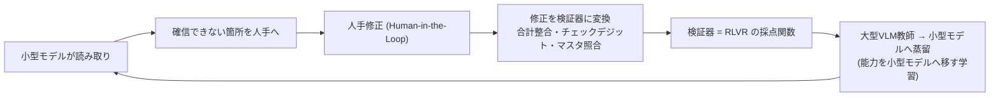
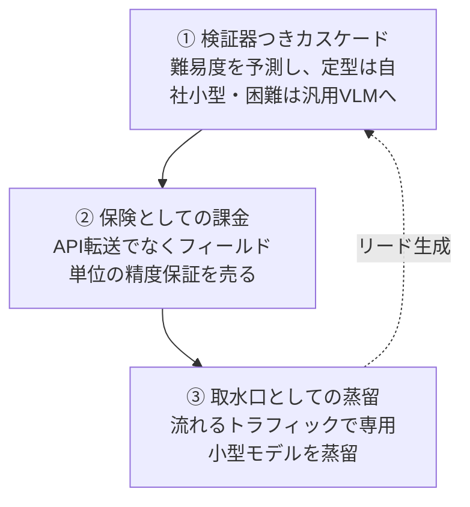

# はじめに

OCR の話をすると、会話はほぼ必ず精度に向かいます。どのモデルが一番きれいに読めるか、ベンチマークで何点か。

しかし、フロンティア級の VLM(Vision Language Model、画像も読めるマルチモーダルな大規模モデル)が、数百件の帳票のうち半分しか「完走」できない、という話はあまり出てきません。読めるのに、読み切れない。そして帳票の側には、その失敗を機械が見抜くための仕掛けが、何十年も前から埋め込まれています。

この記事は、汎用 VLM が「読む」を安くした世界で、OCR/IDP(Intelligent Document Processing、文書処理の知能化)がどこに価値を残せるのかを整理するものです。結論を先に言えば、堀は「もっと正確に読む」から「読み切ったと機械が証明する」へ移りつつある、というのが本記事の見立てです。帳票は、自分で自分を採点できる。その性質を軸に、事業と技術の両面を見ていきます。

:::message
本記事は公開情報にもとづく業界の見取り図です。「読み取って構造化してエージェントから使う」といった語り尽くされた筋はあえて外します。登場する企業の動きや数値は、確認できた一次情報(公式ドキュメント・プレスリリース・論文)にリンクを張って示します。裏が取れなかった話は載せていません。
:::

# 安くなったのは「読む」、まだ高いのは「読み切る」

汎用 VLM の最大の弱点は、読み間違えることではありません。読み間違えたことに、自分で気づけないことです。

まず、何が安くなって何が安くなっていないのかを分けます。文書解析の代表的なベンチマークである [OmniDocBench](https://github.com/opendatalab/OmniDocBench) では、リーダーボード上位が 94〜96 点台に密集しています(2026 年 8 月時点)。専用ツールも汎用 VLM も横並びで高得点を出す。単純な文字認識の精度は、たしかにコモディティ化しました。

一方で、飽和していない軸が2つあります。

- **完了率** — 数百から数千行の反復構造を持つ文書を、途中で切らず最後まで抜き切れるか
- **検証可能性** — 抜いた値が正しいと、機械が判定できるか

長い明細を持つ文書に対して、汎用 VLM は途中で処理を打ち切ったり、行を取りこぼしたりします。[Reducto が公開した抽出ベンチマーク](https://reducto.ai/blog/reducto-leads-benchmark-complex-document-extraction)(225 件の文書)では、Gemini 3.1 Pro と Claude Opus 4.8 が完走できたのはそれぞれ 112 件、116 件と、半分程度にとどまったと報告されています。これは自社が優位だと示すためのベンチマークなので割り引いて読む必要がありますが、完走率という軸が飽和していないこと自体は、表のセルを正しく読めても構造的に誤った位置へ置く失敗が下流から見えにくい、という別の提供者の[指摘](https://unstructured.io/blog/frontier-models-are-strong-but-document-parsing-is-harder)とも符合します。

長い反復構造で省略や幻覚補完を起こす傾向は、上記のように複数の提供者が公開報告で挙げている挙動です。次のバージョンで必ず消えるとは限りません。もっとも、これはページ分割やエージェント的な反復処理といったエンジニアリングでかなり緩和できるので、「完走できない」こと自体が堀になるわけではありません。堀は、その先にあります。

売るべきものは読み取り結果そのものではなく、**「この結果のどこが信用できて、どこが怪しいか」という校正済みの地図**です。読み間違いに自分で気づけない汎用 VLM に対して、外側からその地図を提供できるかどうか。ここに値がつきます。


:::message
ここでの「コモディティ化」は、主に英語の印刷文書を指します。手書き、FAX 画質、縦書き混在、独自レイアウトの日本語文書では、汎用 VLM の読み取りはまだ飽和していません。日本語の非定型帳票を主戦場にする現場では、そもそも「読む」がまだ勝負になる、という点は補足しておきます。
:::

# 業界は BYOM に収束し、学習資産への道を手放した

業界を俯瞰すると、老舗大手も新興スタートアップも、似た方向へ動いています。先に見るべき点を言っておくと、各社が外部モデルを選んだか自社モデルを持ったかそのものではなく、**顧客の修正データが自社の資産に変わる「パス」を残しているか**です。以下の事例は、そのレンズで読んでください。

老舗大手の多くは、自社で汎用基盤モデルを作る路線を降り、外部モデルを「つなぐ」あるいは「顧客に選ばせる」方針へ寄せています。いわゆる BYOM(Bring Your Own Model、モデル持ち込み)です。具体例を並べると、傾向がはっきりします。

- **ABBYY** は自社でモデルをホストせず、Anthropic・Gemini・Microsoft Foundry・Mistral・OpenAI に接続する、と[公式ドキュメント](https://docs.abbyy.com/vantage/documentation/llms/llms)に明記しています
- **UiPath** は LLM 駆動の Generative Extraction をプライベートプレビューとして投入し、複数の LLM を切り替える vendor-agnostic な設計を[ドキュメント](https://docs.uipath.com/document-understanding/automation-cloud/latest/user-guide/document-understanding-migration-to-uipath-ixp)で示しています
- **OpenText** は生成 AI 機能 Content Aviator を、Gemini・Copilot・Azure OpenAI・Amazon Nova と[複数のハイパースケーラー連携](https://blogs.opentext.com/whats-new-in-opentext-content-aviator/)で展開しています
- クラウド側も同じで、**AWS** は 2025 年 3 月に生成 AI 型の [Amazon Bedrock Data Automation](https://aws.amazon.com/about-aws/whats-new/2025/03/amazon-bedrock-data-automation-generally-available/) を一般提供し、決定論的 OCR の Textract と組み合わせるハイブリッドを敷いています。**Google Document AI** は 2026 年 6 月にレガシープロセッサを廃止し、[Gemini 基盤のカスタム抽出モデルへ移行](https://cloud.google.com/document-ai/docs/release-notes)します

差別化として掲げるのは、文書特化モデル、エンタープライズ向けガバナンス、そしてエージェント型自動化への転身。この筋書きは老舗からクラウド大手までほぼ同じです。

一方で、この路線が楽ではないことも見えています。UiPath は 2024 年 7 月に[全従業員の約 10% を削減](https://www.cnbc.com/2024/07/09/uipath-layoffs-company-to-cut-10percent-of-workforce.html)し、OpenText も[複数回のレイオフ](https://betakit.com/opentext-lays-off-two-percent-of-its-workforce/)を重ねました。これらは業界全体のマクロ要因も大きく、BYOM が原因だと因果を主張できるものではありませんが、少なくとも外部モデルへの一本化が安泰を約束するわけではない、という背景ではあります。

対照的に、自社の言語モデルを手放さなかった企業もあります。**Rossum** は 276 言語対応の独自の transactional LLM を[プラットフォームの核](https://rossum.ai/platform/)に据え続け、2026 年 5 月に支出管理 SaaS の Coupa に買収されました。**Hyperscience** は自社のビジョン言語モデル [ORCA](https://www.hyperscience.ai/newsroom/from-idp-to-intelligent-inference-spring-2026-release/)(Optical Reasoning and Cognition Agent)を中核に据えています。ただし、自社モデルの保持が単体での存続を保証するわけでもありません。Rossum の買収が自社モデル路線の価値の証明なのか、独立事業としては続かなかった帰結なのかは、公開情報からは判定できません。

新興側でも同じ構図が見えます。**Instabase** は 2025 年 1 月の Series D で評価額が 20 億ドルから [12.4 億ドルへ下方修正](https://www.maginative.com/article/instabase-secures-100m-in-series-d-amid-valuation-reset/)されるダウンラウンドを経験しました。明確な差別化軸を掲げていても、それだけで単体事業として生き残れるとは限らない、という事実は書き添えておきます。

これらを1本の線でつなぐと、見えてくることがあります。BYOM を選ぶと、顧客の人手修正——最も価値の高いデータ——が、自社のどのモデルも賢くしない構造になりやすい(顧客側モデルの調整に回す設計は可能ですが、多くの構成でそうなりがちです)。生死を分けるのは「自社モデルの有無」ではなく、**顧客のトラフィックが自社の学習可能な資産に変わるパスを持っているか**です。


# 次の堀は「検証可能性」にある

守るべき場所が「読み切ったと言い切る能力」なら、堀はその周りに掘れます。そして帳票には、意外な性質があります。

正誤を判定する検証器が書けるのは、数学とコードの特権だと思われてきました。数学は答えの一致で、コードはテストの通過で採点できる。

**しかし業務帳票は、それに次いで検証器が濃く埋まった、珍しいドメインです。**

請求書は明細の合計が総額と一致し、税額は課税額と税率でおおむね決まる。銀行明細は前の残高に取引を足し引きすると次の残高になり、それが全行で連鎖する。口座番号や登録番号にはチェックデジットが入り、日付には順序がある。

考えてみれば当然で、帳票とは人間の業務ミスを見つけるために、何十年もかけて冗長性を織り込んできた書式です。その冗長性は、そのまま OCR モデルの採点基準になります。


ここで言う「検証器」の正体は単純です。抽出結果(たとえば JSON)を入力に取り、真か偽かとその根拠を返す、ただのコードです。LLM は使いません。同じ入力には必ず同じ答えを返すので「決定論的」と呼びます。帳票では次の4種類がそのまま検証器になります。

- **算術の恒等式** — `単価 × 数量 = 行合計`、`行合計の総和 = 小計`、`小計 + 税額 = 合計`。抽出した数値を代入して等式が成り立つかを見るだけ
- **チェックデジット** — 法人番号(13桁)、クレジットカード番号(Luhn)、IBAN(ISO 7064)。番号から検査桁を再計算して一致を見る。1文字の読み間違いが高い確率で不一致として現れる
- **マスタ照合** — 消費税率、勘定科目コード、診療報酬点数、取引先マスタ。抽出値が既知のテーブルに存在するかを引く
- **相互参照** — 発注書・納品書・請求書の突合(3-way match)。ただしどの文書がどの文書に対応するかの突合自体が別の難問で、複数文書が揃って初めて効く

作り方は、フィールドのスキーマに制約を宣言的に紐付け、実行するだけです。実物はこの程度の素朴さで、たとえば請求書ならこう書けます。

```yaml
# 請求書の検証器(抜粋)。各ルールが pass/fail を返す
rules:
  - id: line_total
    expr: "abs(unit_price * quantity - line_total) <= 0.5"   # 端数の許容: 0.5円
  - id: subtotal
    expr: "abs(sum(line_total) - subtotal) <= 1"
  - id: corporate_number
    check: luhn_like(corporate_number, digits=13)            # 検査桁の再計算
  - id: tax_rate
    check: "tax_rate in master.tax_rates"                    # 公開マスタに存在するか
```

ただし、素朴に見えて実装の急所は前段にあります。`¥1,234`・`1,234円`・`(1,234)`(会計の負数表記)・全角数字・和暦を、比較可能な値へ揃える**正規化層**です。ここが緩いと算術検証器はすぐ誤爆します。実際、検証器の偽陽性(正しい読み取りを誤りと弾くこと)の主因はモデルではなく、この正規化と後述の端数許容の設計に宿ります。だから許容誤差は固定値ではなく、発行者ごとの丸めプロファイルとして持てる形にしておくのが現実的です。

採点の粒度も大事です。連続的なスコア(編集距離など)ではなく、各制約を **pass / fail の二値**で返し、通過した割合を報酬にする。ソフトウェアのユニットテストと同じ考え方で、「合計が合っているか」は 0.87 点のような曖昧な値ではなく、合っているかいないかのどちらかだからです。連続スコアは実務的な正しさと相関しにくく、後述する報酬ハッキングの隙にもなります。

この検証器は、人手修正から半自動で増やせます。「小計を 3,100 に直した」という修正の履歴を集めると、「行合計の総和 = 小計」という制約が常に成り立っていることが見えてくる。実務的には、発火率が 99% を超え、かつ一定件数以上のサンプルで確認できた候補だけを人手レビューに回して採用する、という閾値運用になります。全部を自動採用しないのは、上の偽陽性がそのまま報酬の汚染になるからです。

どのくらい使えるのかを代表的な帳票で見ると、はっきり二層に分かれます(以下は筆者の見積もりで、フィールド数比のおおまかな目安です)。

| 層 | 帳票の例 | 決定論チェックで検証できる割合 |
|---|---|---|
| 規則駆動型 | 請求書・銀行明細・給与明細・税務書類・レセプト | 高い(おおよそ6〜8割) |
| 記述駆動型 | 保険の証明フォーム・物流書類・領収書 | 低い(おおよそ3〜5割) |

規則駆動型は、制度や規則そのものが数式や公開マスタとして明文化されている帳票です。記述駆動型は、当事者名や品目名といった一回限りの自由記述が主役で、外部の照合先が乏しい。この差は帳票が持つ情報の性質そのものなので、OCR モデルの性能では埋まりません。

ここで正直に、二つの限界を書いておきます。

一つは、**検証器が守る場所と、モデルが間違える場所がずれている**可能性です。合計整合やチェックデジットが守るのは、モデルが比較的得意な数値フィールドです。難しいのは取引先名や手書き備考のような、検証器が届かないフィールドかもしれない。カバレッジの割合だけでは価値を主張しきれず、誤りの発生分布との重なりを実測する必要があります。

もう一つは、**検証器自体が間違える**ことです。消費税の端数処理は発行者ごとに違い、値引きや複数税率、源泉徴収が絡むと「税額は課税額×税率」は現実には崩れます。決定論チェックが正しい読み取りを誤りと弾く偽陽性は、日常的に起こります。検証器は万能ではなく、設計と運用で偽陽性を抑え込む対象です。

# データフライホイールを「ラベル」から「検証器」へ

ここで発想を一つ変えます。**人手修正を「ラベル」ではなく「検証器」として貯める**、という転換です。

修正をラベルとして集めて再学習に回す、というフライホイールは、すでに複数の企業が製品にしています。**Docsumo** は顧客の文書でカスタムモデルを訓練し、[「すべての修正はデータだ(Every correction is data)」](https://docsumo.com/blog/reinforcement-learning-optimization)としてレビュアーの修正をモデル改善に直結させる、と述べています。**Rossum** も[ユーザーのフィードバックから学習する](https://rossum.ai/)独自 LLM を掲げています。

素直な方法ですが、3つの弱点があります。

1. ラベルはモデルが変わると価値が減る。新しいモデルはそのミスをしないかもしれない
2. 顧客の生データを重みに焼き込むと契約上のリスクが出る。実際 **Mindee** は、継続学習に RAG(Retrieval-Augmented Generation、関連する過去例を検索してプロンプトに添える手法)を使い、そのデータを[「訓練には一切使わない(No, never)」](https://docs.mindee.com/extraction-models/optional-features/improving-accuracy)と明記しています。重みに焼き込む方式を避ける設計です
3. 顧客ごとに専用モデルを再学習し品質保証する運用が、テナントが増えるほど重くなる

修正を「このフィールドはこの制約を満たすべきだった」という実行可能なチェックに変換して貯めると、性質が変わります。検証器はモデルに依存しないので、基盤モデルが更新されても価値が減りにくい。生データではなく抽象化した制約なので、契約のハードルも下がります。そして検証器は、そのまま検証可能報酬による強化学習(RLVR、Reinforcement Learning with Verifiable Rewards、機械が正誤を判定できる報酬で学習させる手法)の採点関数になります。

学習の流れはこうなります。



この設計の背骨は「**重みには業界を、検証器には個社を**」という分け方です。業界共通の知識はモデルの重みに入れ、顧客ごとの固有性は主に検証器として持ちます。

ただし、これが即「乗り換え障壁」になるとは言い切れません。汎用的な検証器(合計整合やチェックデジット)は誰でも書けますし、個社固有の検証器の実体である取引先マスタや例外パターンは、そもそも顧客の所有物です。堀になり得るとすれば、それは「その会社で長く運用しないと見つからない例外パターンの蓄積」の部分で、汎用ルールの部分ではありません。ここは過大評価しないほうがいい。

一方で、コスト面の副作用は見込めます。蒸留は推論コストを下げられます。Allen AI の [olmOCR](https://allenai.org/blog/olmocr) は、GPT-4o で 25 万ページをラベリングして Qwen2-VL-7B を微調整し、100 万ページの処理コストを約 190 ドル、GPT-4o API のおよそ 32 分の 1 に抑えたと報告しています。NVIDIA の [Data Flywheel](https://developer.nvidia.com/blog/maximize-ai-agent-performance-with-data-flywheels-using-nvidia-nemo-microservices/) も、本番トラフィックを使って Llama-3.1-8B を継続的に整合させた事例を挙げています。より大きな 70B モデルの 96% の精度を維持しつつ、単一 GPU 化で TCO とレイテンシを約 70% 改善したと報告しています。トラフィックが増えるほど蒸留が進み運用コストが下がる、使われるほどコストが増える通常の AI 機能とは逆向きの構造をつくれる可能性があります。ただしこれは、蒸留パイプラインの構築・維持コストを上回るだけのトラフィックが前提です。

# 「プロンプトで貯める」か「重みに焼き込む」か

貯めた修正を、どこに置くか。プロンプトに渡すのか、重みに焼くのか。この選択を間違えると、コストで詰むか、契約で詰みます。個社ごとにデータを貯めて賢くする方法は、この2つに分かれます。

一つは **コンテキスト注入型**です。モデルの重みは変えず、その会社の過去の修正例や指示を、RAG や few-shot のプロンプトとして推論時に渡す。モデルの周りに組む「ハーネス(harness、外付けの制御の枠)」です。前述の Mindee がこの型です。

もう一つは **重み更新型**です。貯めた修正をモデルの重みそのものに焼き込む。fine-tuning や、後述する on-policy distillation がこれにあたります。前述の Docsumo のカスタムモデルや olmOCR の微調整がこの型です。

両者の性質は、きれいに裏返しです。

| | コンテキスト注入型(RAG / prompt) | 重み更新型(fine-tune / distill) |
|---|---|---|
| 立ち上がり | 即日。数十例で動く | 学習が要る。数百〜数千例から |
| 単発コスト・レイテンシ | 毎回コンテキストを読むので高い | 焼き込み後は軽い・速い |
| 契約リスク | 重み混入は無いが、保持・削除・分離の論点は残る | 顧客データを重みに入れる=要配慮 |
| 精度の上限 | プロンプトに詰められる範囲まで | 分布ごと学べるので高くしやすい |
| 向くフェーズ | 導入直後、少データ | トラフィックが貯まった後 |

なお「重みに入れなければ安全」という二分法には注意が必要です。RAG のデータベースに顧客の修正例を保持し続けること自体が、保持期間・削除要求・テナント分離という契約論点を持ちます。マルチテナント環境で検索インデックスから他社の類似例が混入するリスクは、重みへの焼き込みとは別種ですが、決して「無い」とは言えません。

だから現実的な順序は、片方を選ぶことではありません。**まず RAG で即日立ち上げ、トラフィックが貯まったら蒸留でコストとレイテンシを落とす**、という接続です。何万ページ貯まれば蒸留の構築・維持コストを回収できるかは単位経済しだいで、ここは後述の Future Work に残る宿題です。

ただし、この接続には一つ矛盾があります。RAG に貯まるのは個社の修正で、それをそのまま蒸留で重みに移すと、さきほどの「重みには業界を」という原則が崩れ、Mindee が「No, never」で避けた契約リスクが終着点で復活します。解き方は、**蒸留対象を「業界横断で一般化できる修正」に限る**ことです。ある発行者フォーマットの癖のような個社固有の残差は RAG と検証器に残し、多数の顧客に共通して現れる修正だけを重みへ上げる。この選別自体を、検証器の合格率で回せます。蒸留候補にする前後で検証器のパス率が個社をまたいで改善するなら一般化しており、特定顧客でしか効かないなら残差だと判定できる。

そして重要なのは、**検証器がこの2つを貫く共通の土台になる**ことです。RAG の段では検索した過去例を採用してよいかの妥当性チェックに使え、蒸留の段では「どの生成が正解か」の報酬に使え、さらに上記の一般化判定のゲートにも使える。個社適応の道具立ては違っても、正誤を判定する土台は一本で済みます。

# 検証器を報酬にするなら、報酬ハッキングに備える

検証器を報酬にする戦略には、固有の危うさがあります。ここは楽観できません。

第一に、生成的な LLM を判定器に使うのは脆い。生成的な報酬モデルは、コロンやピリオドのような記号一つ、あるいは「Thought process:」のような定型的な書き出しだけで検証をすり抜けて高い報酬を出してしまうことが報告されています([One Token to Fool LLM-as-a-Judge](https://arxiv.org/abs/2507.08794))。判定器を3つ重ねた合議でも、GSM8K の実験で誤答の 55% を通してしまったという報告もあります([More Convincing, Not More Correct](https://arxiv.org/abs/2607.05904))。帳票の合計整合やチェックデジットは、確率的な判定器ではなく決定論的なルールエンジンで判定すべきです。

第二に、帳票特有の「答えが一意でない」問題です。数学の問題は答えが一つですが、合計整合は複数の明細の組み合わせで満たせてしまう。検証器を通すためだけに個別の明細を辻褄合わせに捏造する、という失敗が起こり得ます。単一の検証器に頼らず、合計整合・マスタ照合・フォーマット・チェックデジットと、複数の独立した検証器を重ねるのが対策になります。

第三に、これが一番厄介ですが、**元の帳票自体が間違っている**ケースです。OCR は正しく読んだのに、発行元のミスで元の請求書の合計が合っていない。このとき整合チェックは失敗しますが、OCR は正解です。人手の修正者が元帳票の誤りを「OCR の誤り」として検証器に取り込むと、モデルに「元帳票に忠実に読む」のではなく「(誤った)期待値を出す」ことを教えてしまう。貯めるほど汚染が進むこのリスクに、確立した対策はまだありません。修正を検証器化する前に、それが元帳票の誤りに由来しないかを確認するゲートを挟む、というのが現実的な落としどころです。

# 技術フロンティア - 教師から生徒へ、能力は本当に移るのか

前章のフライホイールは、大型モデルの能力が小型モデルへ本当に移るかどうかに、全体重を預けています。その足場を確かめます。

## on-policy distillation

on-policy distillation は、生徒モデル自身が生成した出力に対して、教師モデルがトークンごとに採点し、その差で生徒を更新する手法です。教師のデータをそのまま真似るのではなく、生徒が「自分が実際にとる行動」の上で教師の判断を学ぶので、訓練分布から外れて迷子になりにくい。報酬が疎な強化学習に比べてトークンごとに密な信号が得られるため、[Thinking Machines Lab の報告](https://thinkingmachines.ai/blog/on-policy-distillation/)では、数学タスクで強化学習の約10分の1の計算量で同等の水準に届いたとされています。

文書理解でも、大型モデルを強化学習で先に鍛え、それを教師に小型モデルへ蒸留するパイプラインが登場しています。たとえば [OvisOCR2](https://arxiv.org/abs/2607.13639) は、4B モデルを強化学習で鍛えてから 0.8B モデルへ on-policy distillation する構成で、OmniDocBench v1.6 の総合スコア 96.58 を達成したと報告しています。ただし蒸留単独でどれだけ効いたかは、報告からは切り分けられていません。効果分離は今後の検証課題です。

一つ、注意点があります。教師が生徒の届かない「新しい能力」を持っていないと蒸留は効きにくい、という[指摘](https://arxiv.org/abs/2604.13016)です。汎用 VLM のゼロショット出力をそのまま蒸留するだけでは足りず、教師側に強化学習で鍛えた挙動や多段の推論を仕込む必要があると考えられます。

実務上の制約も正直に書いておきます。外部の商用 VLM の出力を蒸留の教師に使うことには、利用規約上の制限が伴います。たとえばある大手提供者は、承認のない「モデル蒸留(model distillation)」を[利用規約](https://www.anthropic.com/legal/aup)で明確に禁止しています。この点でも、外部モデルに直接寄りかかるより、オープンウェイトモデルと公開データセットから自社の教師を立ち上げる方が安全です。

## 拡散言語モデルは OCR に効くのか

先に結論を言うと、拡散言語モデル(複数トークンを並列に生成できる非自己回帰型のモデル)は、今すぐの本命ではありません。それでも見ておく価値があるのは、前章のフライホイールが、この選択肢を「安く保有できるオプション」に変えるからです。

現状、拡散型 VLM は細かい文字認識を要するタスクで自己回帰型に大きく負けています。たとえば [LaViDa](https://arxiv.org/abs/2505.16839) は DocVQA で 59.0、TextVQA で 56.3 と、Qwen2.5-VL-7B(DocVQA 95.7、TextVQA 84.9)に大きく及びません。もっとも LaViDa 論文は、この劣化の主因を「拡散という仕組み」ではなく「画像特徴の圧縮に平均プーリング(average pooling)を使い、細粒度の空間情報が失われること」だと本文で明言しています。ベースの言語モデルのコンテキスト長の制約に対処するためのトレードオフだった、という説明です。別の拡散型 VLM である [LLaDA-V](https://arxiv.org/abs/2505.16933) は、同条件の自己回帰型ベースラインに DocVQA で 83.9 対 86.2 と僅差まで迫っています。論文自身も chart/document タスクでは「同等(comparable)」と述べています。ただし最強クラスの自己回帰型にはなお届かず、論文はその差の主因を「言語バックボーンの弱さ」と特定しています。差は残っている、というのが正確なところです。

事業として賭ける意味があるかは、精度ではなくスループットあたりのコストで決まります。ここは慎重に見る必要があります。拡散モデルの速度優位はバッチサイズが小さいときの話で、バッチを大きく詰め込むと拡散側の優位が薄れ、自己回帰型が優位になる、という[解析](https://arxiv.org/abs/2510.18480)があるからです(この解析は、並列デコードの利得は小バッチに限られ、大バッチでは自己回帰型が総じて高スループットだと報告しています)。OCR のようにレイテンシがゆるくバッチが効く用途では、これはむしろ拡散に不利に働きます。

面白いのは、拡散モデルへの on-policy distillation が、2026年に立ち上がったばかりの領域だという点です([AR→拡散の蒸留](https://arxiv.org/abs/2606.06712)、[少数ステップ拡散の蒸留](https://arxiv.org/abs/2608.02942)など、いずれも 2026 年の投稿です)。前章のフライホイールはデコーダの方式に依存しないので、それを先に作っておけば、この路線は「観測が揃ったら行使すればいいオプション」として残せます。

# AI Gateway に空いた、文書サイズの穴

AI Gateway の製品一覧を眺めると、奇妙な空白があります。文書処理だけが、誰の守備範囲でもない。

いまの主要な AI Gateway は、モデルのルーティング、フォールバック、キャッシュ、コスト管理、可観測性、PII(個人情報)マスキングを備えていますが、その多くはテキストの LLM 呼び出しを前提にしています。文書処理や OCR は、事実上の空白のままです。

この空白は怠慢ではありません。**文書処理が状態機械だから**生まれています。チャット呼び出しは、入力を受けて出力を返すだけのステートレスなプロキシで足ります。ところが文書処理は、信頼度の付与 → 閾値判定 → 人手へのエスカレーション → 修正 → 再処理 → 監査証跡、という状態の遷移を要求します。薄くて速いプロキシという設計思想のままでは、これを後付けしにくい。空白が空白のまま残っているのは、この構造上の理由からだと考えられます。

ただし、Gateway が修正データの「唯一の取水口」だとは言えません。人手修正はむしろ IDP 製品の UI や経理 SaaS、ERP の取込画面といったアプリケーション層で発生し、そちらのほうが自然な取水口です。Gateway を選ぶ理由があるとすれば、複数のモデルとバックエンドを横断して一箇所で扱える、という一点に限られます。この前提の上でなら、文書に特化した Gateway は3つの層で考えられます。



第一の層は、難易度を見積もって安い自社モデルと高い汎用 VLM を振り分け、各段の出力に検証器を通すカスケードです。返すのは自己申告の確信度ではなく、検証器の合否で校正した信頼度です。第二の層は、API 転送ではなくフィールド単位の精度保証を売る課金です。第三の層は、流れる記録を燃料に顧客専用の小型モデルを蒸留するアップセルで、ここでフライホイールとつながります。

まず売るべき最小の製品は、精度保証のような未検証の主張から入るのではなく、既存の VLM 呼び出しの前段に挟む「信頼度の正規化とエスカレーションの監査ログ」です。既存 Gateway が持っていない空白を直接埋めるので差別化がはっきりし、運用しながら検出率と誤り率の実測を貯められます。

なお、規模の経済には落とし穴があります。最も文書量の多い金融・医療・政府は、データ利用について「顧客ごとに完全分離する」ことを求めます。検証器という抽象化した情報でも、全顧客横断で共有する設計はこの要求と衝突しかねない。フライホイールが最も燃料のある場所で回らない可能性がある、というのは正直に見ておくべき点です。まずは「顧客ごと分離でも成り立つ最小の事業」を設計し、横断学習はオプトインの上積みとして考えるのが現実的です。

# Future Work - 何を確かめれば、この筋が正しいと言えるか

本記事の主張は、いくつかの未検証の仮説の上に立っています。優先度の高い順に、確かめ方を挙げておきます。

- **検証器のカバレッジと誤り分布の重なり** — 公開帳票データセットで、フィールド別のエラー率と検証可能性をクロス集計する。「検証器が守る場所とモデルが間違える場所がずれている」という最大の弱点を、最初に潰す
- **検証器の被覆率** — 代表スキーマごとに制約グラフを手書きし、実文書で発火率と偽陽性率を測る
- **蒸留の効果分離** — 教師単体、通常蒸留の生徒、on-policy 蒸留の生徒を個別評価し、蒸留がどれだけ効いたかを切り分ける
- **拡散モデルのスループットあたりコスト** — バッチを飽和させた自己回帰モデルと拡散モデルを、同一条件でページ単価で比較する。不利なら拡散路線は低レイテンシ用途に限定する
- **単位経済** — 月間 N 万ページの顧客で、汎用 VLM 直呼びと「小型モデル + カスケード」の損益分岐点を試算する

見取り図は仮説なので、立場によって次の一手は変わります。**IDP ベンダー**なら、人手修正のログを今日から検証器へ変換可能な形式(どのフィールドをどの値へ、なぜ直したか)で貯め始めるのが、いちばん取り返しのつく投資です。**OCR を導入する事業会社**なら、ベンダー選定の評価項目に「読み取り精度」だけでなく「完了率」と「検証器のカバレッジ(自社の帳票で決定論チェックがどれだけ書けるか)」を入れる。**この領域で起業を考えるなら**、上の Future Work の1番目、検証器のカバレッジと誤り分布の重なりの実測を、最初の数週間でやってしまうのがいい。この記事の主張が立つか折れるかは、そこで決まります。

# まとめ

汎用 VLM が「読む」を安くした世界で、OCR/IDP の堀は「もっと正確に読む」から「読み切ったと機械が証明できる」へ移りつつある、というのが本記事の見立てでした。

その鍵は、帳票が自分で自分を採点できるという性質にあります。この検証可能性を、減価する評価ベンチマークに留めない。強化学習の採点関数に変える。大型 VLM から小型の自社モデルへ蒸留する。Gateway を取水口に、人手修正を検証器として貯め続ける。「何が正解かを機械が判定できる能力」という一本の資産が、評価の堀、蒸留のフライホイール、Gateway の課金という3つの顔でつながります。

ただし本記事が描いたのは、確定した戦略ではなく検証すべき仮説の見取り図です。検証器が難所を守れるのか、規模の経済が分離要求と両立するのか、単位経済は合うのか。答えはこれからの実測にあります。

それでも、問いの立て方は変わったはずです。次に OCR の話をするとき、どのモデルが何点かを聞く必要はもうありません。聞くべきは、たぶん一つです。その読み取り結果、合計は合っていますか。
