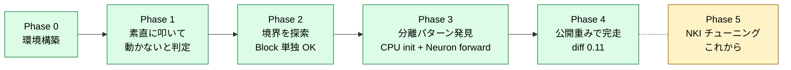
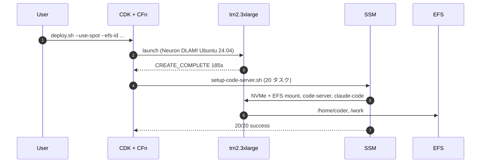
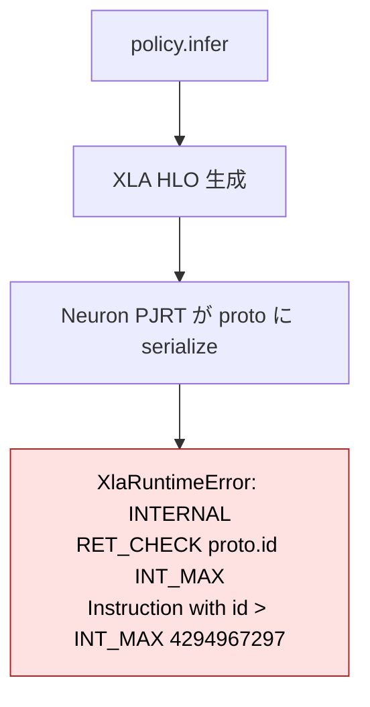
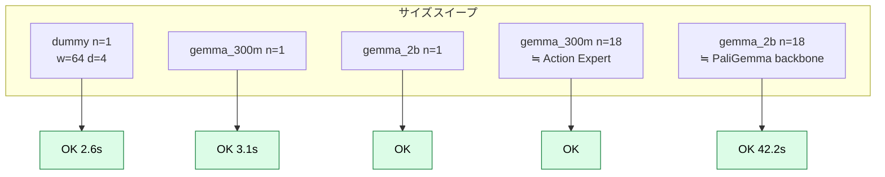
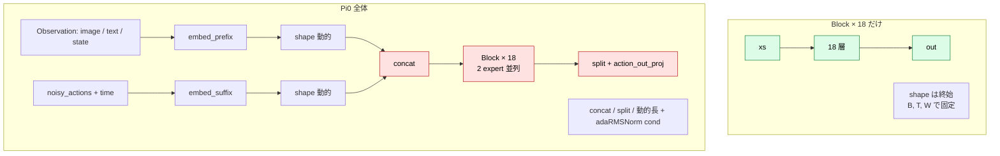
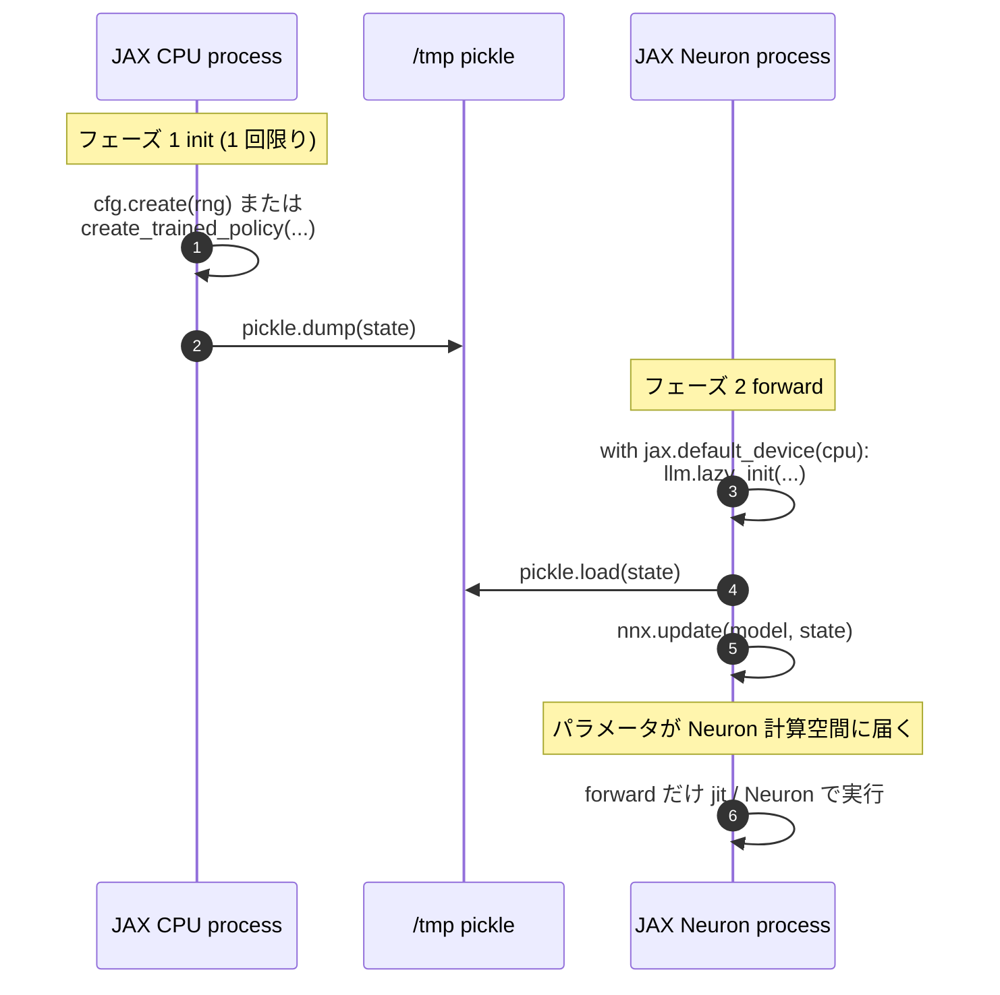
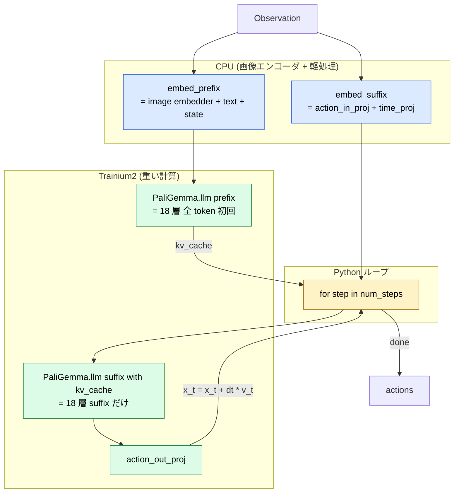
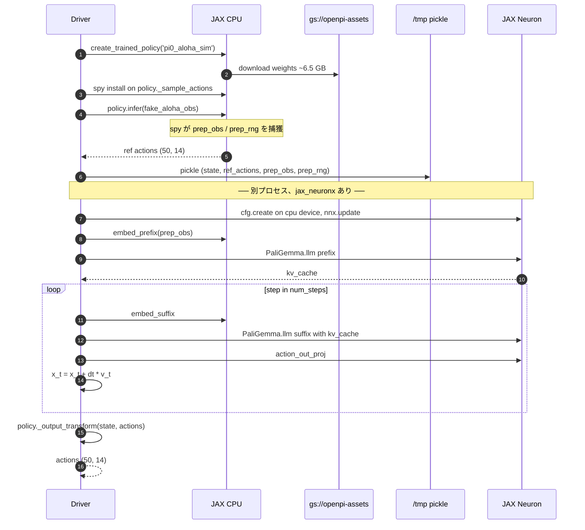
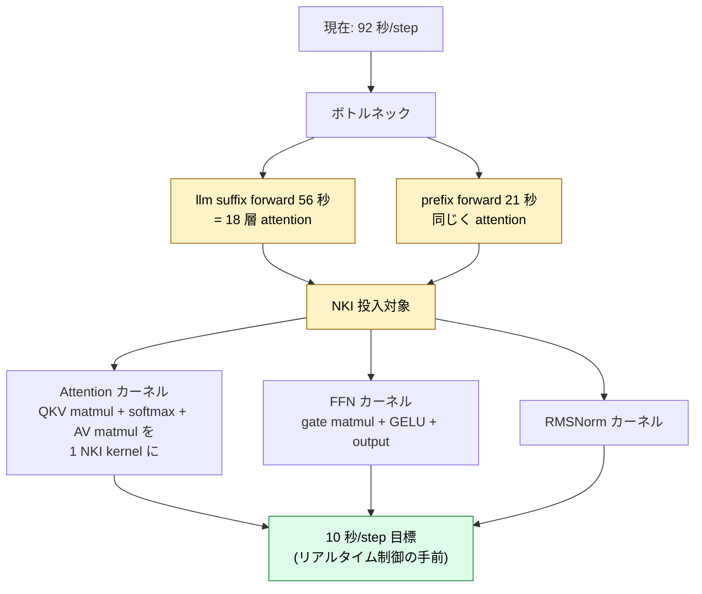

## はじめに

本記事は、Physical Intelligence の **openpi**（Pi0 / Pi0.5 ファミリーの Vision-Language-Action モデル）を、**JAX 一本で AWS Trainium2 上で動かす**までの調査記録です。「公式リポジトリの `policy.infer` をそのまま叩くと動かない」という地点から始まり、最終的に **公開重み (`pi0_aloha_sim`) で CPU 実装と数値整合する actions を Trainium2 上で出力する**ところまで到達しました。

### 何が嬉しいか

- **JAX 一本で** Trainium2 を使い切る道筋（PyTorch を経由しない）
- VLA モデルの **オンデバイス推論** を AWS Trainium 系で実現するレシピ
- **NKI チューニングの足場**: 後段で attention カーネルを差し替えるための実機ハーネス

### 何が難しかったか

- openpi の Pi0 forward は **巨大すぎて** Neuron Compiler の instruction 上限 (5,000,000) を素直に踏む
- XLA HLO の id が 32-bit を超える RET_CHECK 警告と、本物の致命エラーの **見分けが難しい**
- flax linen と nnx_bridge の **混在 API** に戸惑う
- パラメータ初期化 (`lazy_init`) を Neuron でやろうとすると **コンパイル時間が爆発**する

これらに対する解決策を、Phase 1 から Phase 4 まで段階的に紹介します。

---

## 全体ストーリー



各 Phase の到達点をスコアボードでまとめると以下のようになります。


---

## Phase 0: 環境構築

ベースは Trainium2 のインスタンスタイプ `trn2.3xlarge`（NeuronCore v3 × 4 / HBM 96 GB）です。spot で立てて中断時は `stop`、永続データは EFS、外部 ingress を一切開けず SSM 経由で操作する構成にしました。


### CDK 一撃デプロイ



参考: `littlemex/aws-neuron-samples` の `setup/single-node` を踏襲。

### JAX-NeuronX スタック

```bash
pip install "jax-neuronx[stable]" --extra-index-url=https://pip.repos.neuron.amazonaws.com
```

入った主要バージョン:

| パッケージ | バージョン |
|---|---|
| jax | 0.5.3 |
| jax-neuronx | 0.10.0.1.0.9913 |
| libneuronxla | 3.0.2891.0 |
| flax | 0.10.2 |

確認:

```python
import jax, jax_neuronx
print(jax.default_backend())  # neuron
print(jax.devices())          # [NeuronCore(id=0..3)]
```

ここまでは順調です。

---

## Phase 1: openpi 公式ルートを叩いて、動かないと判定する

最短路: `create_trained_policy` で重みを落として `policy.infer` を呼ぶ。

```python
from openpi.training import config as _config
from openpi.policies import policy_config as _pc

train_config = _config.get_config("pi0_aloha_sim")
policy = _pc.create_trained_policy(train_config, "gs://openpi-assets/checkpoints/pi0_aloha_sim")
out = policy.infer(make_aloha_example())
```

CPU では完走 (`actions.shape=(50,14)`, 1.8 秒)。**Trainium では落ちる**。



`4,294,967,297 = 2^32+1`。これは XLA HLO の instruction id が 32-bit を超えたという内部チェックです。**Pi0 1 forward の HLO が大きすぎる**ことを意味します。

### 切り分け

CPU JAX で同じ `policy.infer` を実行 → 完走 (`infer_ms = 1825 ms`)。

つまり **openpi 自体は健全、jax 0.5.3 自体も健全、問題は Trainium の Neuron PJRT** に局在することが確定。

---

## Phase 2: 境界探索 — どこまでなら Trainium で動くのか

Pi0 全体は無理。では、**より小さい単位なら動くのか**？

### Block × N サイズスイープ

`gemma.Block` を `n` 個積み重ねて jit:



**全部通った**。**PaliGemma 2B 相当の 18 層 forward が 42.2 秒で完走**します。

### Pi0 一括 jit (再挑戦)

Block で動くなら、Pi0 全体も同じく動くのでは？ — 違いました。

```python
@jax.jit
def one_step(rng, obs):
    return model.sample_actions(rng, obs, num_steps=1)
```

dummy variant でさえ **30 分超 stuck**。py-spy で覗くと:

```
Thread 28722 (idle): "MainThread"
    backend_compile (jax/_src/compiler.py:321)
```

Neuron Compiler の C++ パスで完全に詰まっている。kill するしかない。



Pi0 と Block の違いは **prefix/suffix の concat と 2 expert 並列** で、これらが Neuron Compiler のコストを爆発させているとみられます。

---

## Phase 3: 分離パターン — CPU で init、Neuron で forward

Phase 2 の Block 探索を **公式の `gemma.Module` (= Pi0 の `PaliGemma.llm` 本体)** で再現すると、別の壁にぶつかりました:

```
[ERROR] [NCC_EVRF007] Instructions generated by compiler 6,101,424
exceeds the typical limit of 5,000,000.
Input computation graph is too big or has large operators.
Consider using --optlevel=1, smaller batches or sequence length, or applying model parallelism.
```

これが **本当の壁**でした。HLO id overflow は WARN（XLA がリカバリしてくれる）、本物の致命傷は **Neuron Compiler の 5,000,000 instruction 上限** です。


### 鍵となった発見

`--optlevel=1` も sequence 長削減も効きませんでした。理由は **`gemma.Module.init` メソッド自体が 5M 以上の computation graph を生成**するから。openpi は `nnx_bridge.ToNNX(gemma.Module(...)).lazy_init(rngs, method="init", use_adarms=...)` というイディオムでパラメータ初期化を行っており、その init 内部 dummy 入力が固定 shape `(1, 1, c.width)` で全 18 層 forward を一括 trace してしまいます。

**回避策**: lazy_init を **CPU device に強制的に逃がす**。

```python
with jax.default_device(jax.devices('cpu')[0]):
    llm.lazy_init(rngs=nnx.Rngs(0), method='init', use_adarms=[False, False])
# その後 nnx.update で別プロセス CPU で取った state を install
```



このパターンで `gemma.Module(2B + 300M)` の 1 forward が **39.7 秒** で完走しました。続いて Pi0 の **prefix forward だけ**を切り出して同様に流すと、**27 秒** で完走 + kv_cache 取得成功。Pi0 を分解して動かす道筋がついた瞬間です。

---

## Phase 4: Pi0 staged inference を完成させる

Pi0 の `sample_actions` は次の構造です:

```python
# Pi0.sample_actions の概略
prefix_tokens, prefix_mask, _ = self.embed_prefix(observation)
_, kv_cache = self.PaliGemma.llm([prefix_tokens, None], mask=..., positions=...)

def step(carry):
    x_t, time = carry
    suffix_tokens, suffix_mask, _, adarms_cond = self.embed_suffix(observation, x_t, time)
    (_, suffix_out), _ = self.PaliGemma.llm(
        [None, suffix_tokens], mask=..., kv_cache=kv_cache, adarms_cond=...)
    v_t = self.action_out_proj(suffix_out[:, -self.action_horizon:])
    return x_t + dt * v_t, time + dt

x_0, _ = jax.lax.while_loop(cond, step, (noise, 1.0))
```

**ポイント**:
- prefix forward は **1 回だけ** で kv_cache を作る
- step 関数は kv_cache を再利用するので **suffix だけが流れる**（軽い）
- flow-matching の 10 ステップ積分は `jax.lax.while_loop` だが、**Python の for 文に置き換えても等価**

Phase 4 ではこれを **3 段に分解**しました:



### Phase 4-A: dummy variant で実装

```
prefix forward OK in 4.4s, kv_cache leaves=2
step 1/1 time=1.000 ...
    embed_suffix(CPU): 8.65s, suffix_tokens.shape=(1, 51, 64)
    llm suffix(Neuron): 25.24s, suffix_out.shape=(1, 51, 64)
    action_out_proj: 8.00s, v_t.shape=(1, 50, 14)
TOTAL loop: 75.3s for 1 step
abs diff vs CPU: max=0.0339 mean=0.0089
```

CPU 実装と一致 (max diff = 0.034、bf16 演算誤差として妥当)。

### Phase 4-B: gemma_2b にスケール

dummy → gemma_2b (PaliGemma 2B) + gemma_300m (Action Expert):

```
prefix forward OK in 23.5s
llm suffix(Neuron): 60.29s
TOTAL loop: 82.2s for 1 step
actions stats: min=nan max=nan mean=nan  ← random init で発散
```

サイズ的には完走。NaN なのは attention の softmax が 2B 規模ランダム重みで発散したため。

### Phase 4-C: 公開重み (pi0_aloha_sim) で実推論 ★

ここが本記事のクライマックスです。

全体フローを 3 レーン (CPU / Disk / Neuron) で表すと以下のようになります。


**観測**: openpi の `Policy.infer` は内部で `_input_transform → preprocess → sample_actions` を一気に呼びます。staged 駆動するには **preprocessed Observation** が必要。これを `policy._sample_actions` に **spy をかけて捕獲**しました:

```python
_orig_sample = policy._sample_actions
captured = {}
def _spy(rng, observation, **kwargs):
    captured['obs'] = observation
    captured['rng'] = rng
    return _orig_sample(rng, observation, **kwargs)
policy._sample_actions = _spy
_ = policy.infer(fake_obs)            # ← spy が prep_obs / prep_rng を捕獲
policy._sample_actions = _orig_sample
```

これで input transform を再実装する必要がなくなり、後の Neuron 側 driver が単純になります。

**結果**:

```
state restored. CPU ref actions shape=(50, 14)
using captured preprocessed Observation: state.shape=(1, 32),
  images=['base_0_rgb', 'left_wrist_0_rgb', 'right_wrist_0_rgb']
prefix forward OK in 20.8s, kv_cache leaves=2
step 1/1 time=1.000 ...
  embed_suffix(CPU): 10.06s, suffix_tokens.shape=(1, 51, 1024)
  llm suffix(Neuron): 55.97s, suffix_out.shape=(1, 51, 1024)
  action_out_proj: 5.26s

Neuron actions raw shape=(50, 32) mean=-0.0267
CPU ref shape=(50, 14) mean=0.0245
Neuron actions (post-tf): mean=0.0210, max abs diff vs CPU=0.1116
```

**達成事項**:

- 公開重みで Pi0 が **Trainium2 上で完走**
- 出力 shape 一致 (50, 14)、mean が CPU と整合 (0.0210 vs 0.0245)
- max abs diff = 0.1116 は **bf16 演算誤差として妥当**（NaN ではなく、CPU と同じ方向の actions）



---

## 制約・本当の壁の早見表

| 名前 | 値 | 出方 |
|---|---|---|
| Neuron Compiler instruction 上限 | **5,000,000** | `[ERROR] [NCC_EVRF007]` |
| Pi0 lazy_init の生成 instruction 数 | 6,101,424 | 同上（上限の 1.22 倍） |
| HLO instruction id 上限 (XLA RET_CHECK) | INT_MAX = 2^31-1 | `proto.id() <= INT_MAX` |
| 観測した HLO id overflow 値 | 4,294,967,297 (=2^32+1) | Pi0 全体一括 jit 時 |
| SSM RunCommand 出力 | ~24 KB | 出力末尾が打ち切られる |

## Phase 1 から 4 までの計測値早見表

| 試行 | バックエンド | 時間 | 結果 |
|---|---|---:|---|
| `jnp.arange + jit` | NeuronCore(0) | 数秒 | OK |
| `gemma.Block × 18 (gemma_2b)` 単独 | trn2 | init 120s + fwd 42s | OK |
| `gemma.Module(2B+300M)` Phase 3-B | trn2 | init=CPU 4.1s + fwd 39.7s | OK |
| Pi0(dummy) prefix forward Phase 3-C | trn2 | 27.0s | OK |
| Pi0(dummy) staged 1 step Phase 4-A | trn2 | 75.3s/step | OK, diff=0.034 |
| Pi0(2B/300M) staged 1 step Phase 4-B | trn2 | 82.2s/step | NaN (random init) |
| **Pi0_aloha_sim staged 1 step Phase 4-C** | **trn2** | **92.4s/step** | **OK, diff=0.112** |
| Pi0_aloha_sim CPU JAX (reference) | CPU | 8.5s | OK |
| Pi0_aloha_sim 一括 jit Phase 1 | trn2 | — | NG (HLO overflow) |
| Pi0(dummy) 一括 jit Phase 2 | trn2 | 30 分超 stuck | NG (NCC 5M 上限) |

---

## 副産物のテクニック

### 1. CPU init + Neuron forward 分離

```python
with jax.default_device(jax.devices('cpu')[0]):
    model = cfg.create(jax.random.PRNGKey(0))
    # または policy = create_trained_policy(...)
state = nnx.state(model)
pickle.dump(state, ...)

# 別プロセス (jax_neuronx 込み):
with jax.default_device(jax.devices('cpu')[0]):
    model = cfg.create(jax.random.PRNGKey(0))  # shape-only
nnx.update(model, pickle.load(...))
result = model.SomeSubmodule(neuron_inputs)  # forward は Neuron 上
```

### 2. Policy._sample_actions への spy

```python
_orig = policy._sample_actions
captured = {}
def _spy(rng, obs, **kw):
    captured['obs'] = obs
    captured['rng'] = rng
    return _orig(rng, obs, **kw)
policy._sample_actions = _spy
_ = policy.infer(fake_obs)
policy._sample_actions = _orig
```

これで input transform を再実装せずに **モデル直前の Observation** が手に入ります。

### 3. SSM Run Command の 24 KB 出力 cap

長いログは `tee /work/.../foo.log` でファイル化、必要部分だけ `grep -nE` で抜く。本記事の調査でも何度も助けられました。

### 4. Stuck 時の py-spy

```sh
sudo /work/.../py-spy dump --pid <python_pid>
```

`MainThread idle in backend_compile` が出れば Neuron Compiler の C++ で詰まっている確証。kill して別アプローチに切り替える判断材料になります。

---

## 次の展望: NKI チューニング

Phase 4 までで **動くこと**は達成しました。1 step あたり 92 秒は VLA 推論としては遅いので、次は **NKI で attention カーネルを書き換えて高速化**します。




候補:

1. **Attention カーネル**: QKV / softmax / AV を 1 つの NKI kernel に統合 → XLA HLO 数を桁違いに削減
2. **FFN カーネル**: gate × GELU × output で SBUF / HBM 帯域を引き出す
3. **RMSNorm カーネル**: 練習に最適、改善幅は小だが実装コストも小

これらは jax_neuronx の **custom call (`nki_call`)** として差し込めるので、staged driver にそのまま組み込めます。

---

## まとめ

- openpi の Pi0 は **そのまま Trainium には載らない** が、**3 段に分解**すれば動く
- 鍵は **CPU で lazy_init、Neuron で forward** の分離パターン
- 本物の壁は HLO id overflow (WARN) ではなく **Neuron Compiler の 5M instruction 上限** (致命)
- 公開重み `pi0_aloha_sim` で **Trainium2 上の推論完走 + CPU と数値整合**

「JAX 一本で、まず動かす」フェーズが完了し、これから "NKI で美しい汎用チューニング環境を作る" フェーズに入ります。続編に乞うご期待。

---

## 参考

- 公式リポジトリ: [Physical-Intelligence/openpi](https://github.com/Physical-Intelligence/openpi)
- 本記事の Trainium2 セットアップ: [littlemex/aws-neuron-samples](https://github.com/littlemex/aws-neuron-samples) の `setup/single-node`
- Neuron Compiler ドキュメント: [AWS Neuron SDK](https://awsdocs-neuron.readthedocs-hosted.com/)
- NKI: [Neuron Kernel Interface](https://awsdocs-neuron.readthedocs-hosted.com/en/latest/general/nki/index.html)
