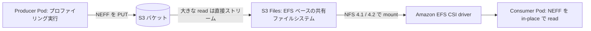

## はじめに

プロファイリングで生成される NEFF や nsys-rep のようなファイルは 1 つで数 GB になることがあり、それを S3 バケットに集約していると、分析したいたびにローカル PC や踏み台にダウンロードしてから開くのは手間もディスクも消費します。EKS 上に分析用の Pod を立てて、そこから S3 バケットの中身を「ファイルシステムとして直接読む」ことができれば、ダウンロードの手間も待ち時間も無くなります。今回は Amazon S3 Files を使って、EKS の Pod から S3 バケット上の NEFF ファイルを in-place で読めるかどうかを検証しました。

似た用途のサービスに Mountpoint for S3 がありますが、書き込みは新規オブジェクトの作成に限られ、既存ファイルの上書きやフルの POSIX 互換操作はサポートしていません。今回は producer が書き consumer が読むという役割分担にしたかったため、フル POSIX 互換で NFS マウントできる S3 Files を選びました。

## S3 Files とは

Amazon S3 Files は、Amazon EFS をベースにした共有ファイルシステムを S3 バケットや prefix にリンクして提供するサービスです。NFS 4.1 と 4.2 に対応し、フル POSIX 互換で双方向にファイルを同期します。よく使うファイルは EFS 側の高性能層にキャッシュされ、サイズの大きい read は S3 から直接ストリーミングされます。マウント先は EC2、Lambda、EKS、ECS など幅広く対応しており、専用の CLI として `aws s3files` コマンドが用意されています。

Mountpoint for S3 は FUSE ベースで S3 バケットをファイルシステムとして見せる仕組みで、書き込みは新規オブジェクトの作成のみに限られます。S3 Files にはこの制約が無く、EFS 相当の使い勝手で S3 を扱えるところが特徴です。

## 検証の構成

今回検証したのは、次のようなデータフローです。producer 側の Pod がプロファイリングを実行して NEFF を S3 バケットに書き込み、consumer 側の Pod は S3 Files のマウントを経由してそのファイルを in-place で読み取ります。



EKS からのマウントには Amazon EFS CSI driver を使います。この driver は EFS と S3 Files の両方に対応していて、S3 Files をサポートするのは v3.0.0 以降です。バージョンが古いままだと、この後で説明する volumeHandle の解釈が変わってしまうので、まず addon のバージョンを確認しておくのがおすすめです。

## S3 Files のファイルシステムを作る

まず S3 バケット側の準備として、バケットのバージョニングを有効にしておきます。S3 Files が対応する暗号化は SSE-S3 と SSE-KMS のみです。

ファイルシステムの作成に使う IAM ロールの信頼ポリシーは `elasticfilesystem.amazonaws.com` を許可し、対象バケットへの読み書きと、SSE-KMS を使う場合は KMS の暗号化・復号も許可します。

```bash
aws s3files create-file-system \
  --bucket "arn:aws:s3:::<BUCKET_NAME>" \
  --role-arn "<S3FILES_ROLE_ARN>" \
  --kms-key-id "<KMS_KEY_ID>" \
  --accept-bucket-warning
```

ファイルシステムができたら、対象の VPC サブネットに mount target を作成し、セキュリティグループでノードの SG から 2049 番ポートを許可します。EKS のノードからマウントするには access point も必要です。

```bash
aws s3files create-access-point \
  --file-system-id "<FILE_SYSTEM_ID>"
```

## EKS からのマウント: IAM の設定

EFS CSI driver は controller と node でそれぞれ別のサービスアカウントに IAM を紐付けます。

controller 側のサービスアカウント (`efs-csi-controller-sa`) には次のマネージドポリシーを付与します。

- `AmazonS3FilesCSIDriverPolicy`
- `AmazonS3FilesClientFullAccess`

node 側のサービスアカウント (`efs-csi-node-sa`) には Pod Identity で次を付与します。node SA に Pod Identity を設定しないと、node 側の plugin はノードのインスタンスロールにフォールバックしてしまうので注意が必要です。

- `AmazonS3FilesClientFullAccess`: `s3files:ClientMount` / `ClientWrite` / `ClientRootAccess` を含みます
- `AmazonS3ReadOnlyAccess`: バケットからの高スループットな直読みに使います
- `AmazonElasticFileSystemsUtils`: CloudWatch へのメトリクス送出に使います

SSE-KMS で暗号化したバケットの場合は、ファイルシステム用のロールと CSI 側の両方に KMS の権限を追加しておきます。

## PV / PVC を作る

静的プロビジョニングで PV を作成します。ポイントは `volumeHandle` の書式です。

```yaml
apiVersion: v1
kind: PersistentVolume
metadata:
  name: s3files-profiling-pv
spec:
  capacity:
    storage: 1Ti
  volumeMode: Filesystem
  accessModes:
    - ReadWriteMany
  persistentVolumeReclaimPolicy: Retain
  storageClassName: ""
  csi:
    driver: efs.csi.aws.com
    volumeHandle: "s3files:<FILE_SYSTEM_ID>::<ACCESS_POINT_ID>"
```

```yaml
apiVersion: v1
kind: PersistentVolumeClaim
metadata:
  name: s3files-profiling-pvc
  namespace: profiling
spec:
  accessModes:
    - ReadWriteMany
  storageClassName: ""
  resources:
    requests:
      storage: 1Ti
  volumeName: s3files-profiling-pv
```

`accessModes` は `ReadWriteMany` を指定します。`ReadOnlyMany` は Kubernetes 内部では `MULTI_NODE_READER_ONLY` に相当し、driver がこのモードに対応していないため、読み取り専用にしたい場合は PVC や Pod の volume 側で `readOnly: true` を指定する必要があります。

consumer の namespace が Pod Security Admission の restricted を適用している場合、生の `nfs` volume はセキュリティコンテキストに引っかかって拒否されます。CSI 経由の PVC であれば restricted でも問題なく使えるので、必ず PVC を経由させます。

## つまずいたところ: volumeHandle の落とし穴

ここが今回の検証で一番時間を使った箇所です。最初、`volumeHandle` にはファイルシステム ID だけをそのまま書いていました。

```yaml
csi:
  driver: efs.csi.aws.com
  volumeHandle: "<FILE_SYSTEM_ID>"
```

この状態で Pod を起動すると、`mount.nfs4: mount system call failed` でタイムアウトして失敗します。node の CSI driver のログを追うと、次のような流れになっていました。

```text
# node 側 efs-csi-node のログ抜粋 (値はすべてプレースホルダに置換)
I mount.go: mounting file system <FILE_SYSTEM_ID> at ...
I mount.go: attempting to resolve <FILE_SYSTEM_ID>.efs.<REGION>.amazonaws.com via DNS
E mount.go: DescribeMountTargets failed: file system not found
E mount.go: mount.nfs4: mount system call failed: Connection timed out
```

`fs-` で始まる裸の ID を渡すと、driver はそれを EFS 用のファイルシステムだと解釈し、EFS の DNS 名を解決してから `elasticfilesystem:DescribeMountTargets` を呼びに行きます。実体は S3 Files のファイルシステムなので、この API では見つからず `file system not found` になり、最終的に NFS マウント自体がタイムアウトします。

正しい書式は次のとおりです。

```yaml
csi:
  driver: efs.csi.aws.com
  volumeHandle: "s3files:<FILE_SYSTEM_ID>::<ACCESS_POINT_ID>"
```

先頭の `s3files:` が driver に「これは S3 Files のフローで解決してほしい」と伝えるスイッチになっています。中央の `::` は subpath 部分を省略した形で、末尾に access point の ID を続けます。access point を作らずにファイルシステム ID だけで済ませようとしても動かないので、事前に `create-access-point` を実行しておくことが必須です。

## 運用上の注意点

検証中に見つけた、動作には影響するもののエラーとしては分かりにくい nuance が 1 つあります。S3 Files はアクセスされたタイミングでメタデータを import する仕組みになっているため、深いパスにいきなり `test -f` のようなアクセスをすると、初回はネガティブキャッシュに引っかかって「ファイルが無い」ように見えることがあります。分析ツール側で対象ディレクトリを一度 `ls` や `find` で辿ってから対象ファイルを開くようにすると、この問題を避けられます。

## 検証結果

volumeHandle を `s3files:<FILE_SYSTEM_ID>::<ACCESS_POINT_ID>` の形式に直し、access point を作成した状態で consumer の Pod を起動したところ、S3 Files のマウントポイント経由で `model.neff` を in-place で読み切ることができました。読み取ったバイト列は S3 バケット上の元ファイルと一致しており、ダウンロードは一度も発生していません。busybox イメージだけの単純な Pod でも、PVC をマウントするだけで in-place read が実現できることを確認できました。

## まとめ

プロファイリングで生成される NEFF のような大きいファイルを、S3 バケットに集約したまま EKS の Pod から直接読みたいという要求に対して、Amazon S3 Files と Amazon EFS CSI driver の組み合わせで実現できることを確認しました。ポイントは、`volumeHandle` を `s3files:<FileSystemId>::<AccessPointId>` の形式にして access point を必ず作成しておくことです。この部分を EFS 用の裸のファイルシステム ID のままにしてしまうと、driver が誤って EFS のフローで解決しようとして NFS マウントがタイムアウトします。ここを押さえれば、ダウンロード不要でファイルシステムとしてプロファイリングデータを読める構成が組めます。
