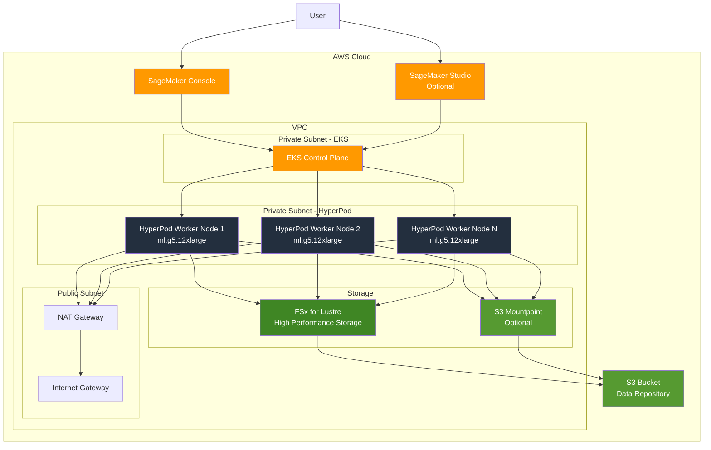

::::details 前提
:::message
**対象読者**: 大規模基盤モデルがどういうものかを理解している方、これからモデル学習を行う方
:::
:::message
**ライセンス**: © 2025 littlemex.
本文および自作図表: CC BY 4.0
※公式ドキュメントからの引用や翻訳部分は原典の著作権に従います。
引用画像: 各画像の出典に記載されたライセンスに従います。
:::
:::message
一部 AI を用いて文章を作成します。レビューは実施しますが、見逃せない重大な間違いなどがあれば[こちらのIssue](https://github.com/littlemex/samples/issues)から連絡をお願いします。
:::
::::

**本章では Amazon SageMaker HyperPod の EKS オーケストレーションモードを実際に試してみましょう。以下の公式ドキュメントをマスターとして説明に日本語の補足を加えて実施します。**

:::message
実装が変更される可能性があるため必要に応じて公式ドキュメントを確認ください。
:::

公式ドキュメント

https://awslabs.github.io/ai-on-sagemaker-hyperpod/docs/getting-started/orchestrated-by-eks

公式 AWS ドキュメント

https://docs.aws.amazon.com/sagemaker/latest/dg/sagemaker-hyperpod-eks-prerequisites.html

---

# Amazon SageMaker HyperPod EKS による分散学習環境の構築

本章では、Amazon SageMaker HyperPod の EKS オーケストレーションモードによる環境構築方法を解説します。EKS オーケストレーションモードでは、Amazon EKS がクラスターのコントロールプレーンとして機能し、Kubernetes ネイティブなワークロード管理を提供します。

## アーキテクチャ概要

Amazon SageMaker HyperPod EKS は以下のコンポーネントで構成されます。



::::details 各コンポーネントの詳細

### EKS Control Plane
- Kubernetes API サーバーとして機能し、クラスター全体を管理
- Pod のスケジューリングとライフサイクル管理を実行
- Kubeflow Training Operator による ML ワークロードのオーケストレーション
- AWS が管理する高可用性なコントロールプレーン

### HyperPod Worker Nodes
- 実際の計算ワークロードを実行する EKS ノード
- GPU インスタンス（G5、P4d、P5、Trn など）または CPU インスタンスを使用
- EFA（Elastic Fabric Adapter）により低レイテンシのノード間通信を実現
- 自動ヘルスチェックとノード復旧機能を提供

### Shared Storage

**FSx for Lustre**
- 高性能な並列ファイルシステムで、トレーニングデータとチェックポイント保存に使用
- S3 バケットとの Data Repository Association（DRA）により自動的なデータ同期が可能
- Pod から ReadWriteMany モードでマウント可能
- サブミリ秒のレイテンシと数百 GB/s のスループットを提供

**S3 Mountpoint**（オプション）
- S3 バケットをファイルシステムとしてマウント
- 大規模データセットへの直接アクセスが可能
- FSx for Lustre と併用することで柔軟なストレージ戦略を実現

### Kubernetes エコシステム

**インストール済みコンポーネント**
- Kubeflow Training Operator: PyTorchJob、TFJob などの ML ワークロード管理
- Kubeflow MPI Operator: MPI ベースの分散学習をサポート
- NVIDIA Device Plugin: GPU リソースの管理と割り当て
- Neuron Device Plugin: AWS Trainium のサポート
- EFA Device Plugin: EFA インターフェースの管理
- Health Monitoring Agent: ノードの継続的なヘルスチェック
::::

## 事前確認: インスタンスタイプとクォータ

:::message alert
**超重要: クラスター作成前に必ずクォータを確認してください**

SageMaker HyperPod クラスターの作成には、使用するインスタンスタイプごとにクォータ（利用上限）が設定されています。クォータが 0 のインスタンスタイプは使用できず、クラスター作成が失敗します。
:::

### クォータの確認方法

[Service Quotas コンソール](https://console.aws.amazon.com/servicequotas/home/services/sagemaker/quotas)にアクセスし、検索バーに使用予定のインスタンスタイプ（例: `ml.m5.2xlarge`）を入力して、「Applied quota value」を確認します。

### 動作確認用の推奨インスタンス構成

初回のクラスター作成の動作確認では、**GPU インスタンスではなく CPU インスタンスの使用を強く推奨**します。

**推奨する理由**
- **クォータ変更の容易性**: GPU インスタンス（ml.g5、ml.p4d など）はデフォルトでクォータが 0 の場合があり、クォータ引き上げに数日かかる可能性があります
- **動作確認用途**: Kubernetes クラスターの動作確認、kubectl コマンド確認に GPU は不要です
- **コスト効率**: CPU インスタンスは GPU インスタンスより大幅に低コストです

**推奨インスタンス構成**

| 用途 | インスタンスタイプ | 数 | vCPU | メモリ |
|------|-----------------|---|------|--------|
| **動作確認用** | `ml.m5.2xlarge` | 2-4 | 8 | 32 GiB |
| **本番環境用** | `ml.g5.12xlarge` | 2-8 | 48 | 192 GiB |
| **大規模学習用** | `ml.p4d.24xlarge` | 8-16 | 96 | 1,152 GiB |

::::details よくあるエラーと対処法

**エラー: `ResourceLimitExceeded`**

```
Resource handler returned message: "Limit exceeded for resource of type 
'AWS::SageMaker::Cluster'. Reason: ResourceLimitExceeded"
```

**原因**
- 使用しようとしているインスタンスタイプのクォータが 0 または不足している
- 前回失敗したクラスターがまだ削除されていない

**対処法**
1. クォータを確認（上記の方法）
2. クォータが 0 の場合は引き上げをリクエスト
3. 既存のクラスターを確認して削除
4. CPU インスタンスでの動作確認を検討
::::

## 事前準備

必要なツールをローカルもしくはクラウド IDE 環境にインストールしてください。

::::details 必要なツール

**AWS CLI**
- AWS リソースの作成と管理に使用
- インストール: [AWS CLI インストールガイド](https://docs.aws.amazon.com/cli/latest/userguide/getting-started-install.html)
- 確認コマンド: `aws --version`

**kubectl**
- Kubernetes クラスターの操作に使用
- インストール: [kubectl インストールガイド](https://kubernetes.io/docs/tasks/tools/)
- 確認コマンド: `kubectl version --client`

**eksctl**（オプション）
- EKS クラスターの管理を簡単にするツール
- インストール: [eksctl インストールガイド](https://eksctl.io/installation/)
- 確認コマンド: `eksctl version`

**Helm**（オプション）
- Kubernetes パッケージマネージャー
- インストール: [Helm インストールガイド](https://helm.sh/docs/intro/install/)
- 確認コマンド: `helm version`

**jq**
- JSON データの処理に使用
- インストール: `sudo apt-get install jq` または `brew install jq`
- 確認コマンド: `jq --version`
::::

## 1. クラスターの作成

:::message
- [ ] 1-1. コンソールからのクラスター作成
- [ ] 1-2. インスタンスグループの設定
:::

::::details 1-1. コンソールからのクラスター作成

:::message
なんのための作業か: Amazon SageMaker コンソールから HyperPod クラスターを作成します。Quick Setup パスを使用すると、VPC、サブネット、FSx ストレージ、EKS オーケストレーターなど、必要な依存関係が自動的にプロビジョニングされます。
:::

:::message
次のステップに進む条件: コンソールでクラスターのステータスが "InService" になること。通常 15 から 20 分かかります。
:::

### クラスター作成パスの選択

Amazon SageMaker HyperPod では 2 つの作成パスが提供されます。

**Quick Setup**（推奨）
- 全ての依存関係を自動的にプロビジョニング
- VPC、サブネット、セキュリティグループを自動作成
- FSx for Lustre ストレージを自動設定
- EKS クラスターと必要な Kubernetes コンポーネントを自動インストール
- 初めての方や迅速な環境構築に最適

**Custom Setup**
- 既存のリソース（VPC、EKS クラスターなど）を再利用可能
- 詳細な設定のカスタマイズが可能
- CloudFormation テンプレートのエクスポートが可能
- プラットフォームエンジニアリングチーム向け

### 作成手順

1. [Amazon SageMaker コンソール](https://console.aws.amazon.com/sagemaker/home)に移動します
2. 左側のナビゲーションペインから "HyperPod Clusters" を選択します
3. "Create HyperPod Cluster" ボタンをクリックします
4. クラスター作成パスを選択します（Quick Setup を推奨）
5. クラスター名を入力します（例: ml-cluster）
6. リージョンとアベイラビリティーゾーンを選択します

詳細な手順は公式ドキュメントを参照してください。

https://docs.aws.amazon.com/sagemaker/latest/dg/sagemaker-hyperpod-eks-operate-console-ui-create-cluster.html
::::

::::details 1-2. インスタンスグループの設定

:::message
なんのための作業か: HyperPod クラスターにインスタンスグループを追加します。インスタンスグループは、同じ構成を持つワーカーノードの集合で、GPU インスタンスや CPU インスタンスなど、ワークロードに応じて複数のグループを作成できます。
:::

:::message alert
**重要な考慮事項**

EKS オーケストレーションモードでは、クラスター作成時に少なくとも 1 つのインスタンスグループが必要です。GPU ベースのインスタンスへのアクセスがない場合でも、CPU インスタンス（例: ml.m5.2xlarge）でクラスターを作成し、後から GPU インスタンスグループを追加できます。
:::

:::message
次のステップに進む条件: インスタンスグループが正常に作成され、コンソールでインスタンスの状態が "InService" になること。
:::

### インスタンスタイプの選択

**動作確認用**
- ml.m5.2xlarge: CPU インスタンス、コスト効率的
- ml.g5.8xlarge: 小規模な GPU ワークロード

**本番環境用**
- ml.g5.12xlarge: NVIDIA A10G GPU × 4
- ml.p4d.24xlarge: NVIDIA A100 GPU × 8、EFA サポート
- ml.p5.48xlarge: NVIDIA H100 GPU × 8、EFA サポート
- ml.trn1.32xlarge: AWS Trainium × 16
- ml.trn1n.32xlarge: AWS Trainium × 16、高速ネットワーク

### コンソールでの設定

1. インスタンスグループ名を入力します（例: worker-group-1）
2. インスタンスタイプを選択します
3. インスタンス数を指定します
4. EBS ボリュームサイズを設定します（推奨: 500 GB 以上）
5. （オプション）Deep Health Checks を有効にします
6. "Submit" をクリックします

### Deep Health Checks の有効化

Deep Health Checks を有効にすると、以下のチェックが実行されます。

- **InstanceStress**: GPU やメモリのストレステスト
- **InstanceConnectivity**: ノード間のネットワーク接続性チェック

これらのチェックにより、ハードウェア障害の早期検出とノードの自動復旧が可能になります。

### Training Plans の使用（オプション）

Training Plans を使用すると、クラスターのプロビジョニング時間を大幅に短縮できます。Training Plans は事前に確保された容量で、オンデマンドよりも低コストで利用できます。

詳細は以下のブログ記事を参照してください。

https://aws.amazon.com/blogs/machine-learning/speed-up-your-cluster-procurement-time-with-amazon-sagemaker-hyperpod-training-plans/
::::

## 2. クラスター状態の確認

:::message
- [ ] 2-1. SageMaker コンソールでの確認
- [ ] 2-2. EKS コンソールでの確認
:::

::::details 2-1. SageMaker コンソールでの確認

:::message
なんのための作業か: SageMaker コンソールからクラスターの状態、実行中のインスタンス、ノードグループを監視します。クラスターの変更もこのコンソールから簡単に行えます。
:::

:::message
次のステップに進む条件: クラスターのステータスが "InService" になること。通常 10 から 15 分かかります。
:::

1. [SageMaker HyperPod コンソール](https://console.aws.amazon.com/sagemaker/home#/cluster-management)に移動します
2. クラスターリストから作成したクラスターをクリックします
3. クラスターの詳細ページで以下の情報を確認します
   - クラスターステータス
   - インスタンスグループの詳細
   - ワーカーノードの数と状態
   - EKS クラスター ARN
   - VPC とサブネット情報

クラスターステータスが "InService" になるまで待機してから次のステップに進みます。
::::

::::details 2-2. EKS コンソールでの確認

:::message
なんのための作業か: EKS コンソールから Kubernetes クラスターの詳細情報を確認します。ノードグループ、IAM アクセスエントリー、アドオンなどの情報を確認できます。
:::

:::message
次のステップに進む条件: EKS コンソールでクラスターが表示され、HyperPod ノードが "Ready" 状態になっていること。
:::

1. [Amazon EKS コンソール](https://console.aws.amazon.com/eks/home)に移動します
2. クラスターリストから HyperPod クラスターに対応する EKS クラスターを選択します
3. "Compute" タブで HyperPod ワーカーノードを確認します
4. "Access" タブで IAM アクセスエントリーを確認します
   - HyperPod サービスリンクロール
   - HyperPod 実行ロール
   - クラスター作成に使用したロール

これらの IAM ロールにより、HyperPod サービスが EKS クラスターを管理できるようになります。
::::

## 3. EKS クラスター接続の検証

:::message
- [ ] 3-1. 環境変数の設定
- [ ] 3-2. kubectl アクセスの設定
- [ ] 3-3. Helm チャートのインストール確認
:::

::::details 3-1. 環境変数の設定

:::message
なんのための作業か: クラスター操作に必要な環境変数を設定します。CloudFormation スタックを使用して作成した場合は、提供されているスクリプトで環境変数を自動的に設定できます。
:::

:::message
次のステップに進む条件: `cat env_vars` コマンドで全ての環境変数が正しく設定されていることを確認できること。
:::

### CloudFormation を使用した場合

以下のコマンドで環境変数を設定します。

```bash
curl -O https://raw.githubusercontent.com/aws-samples/awsome-distributed-training/refs/heads/main/1.architectures/7.sagemaker-hyperpod-eks/create_config.sh
chmod +x create_config.sh
export STACK_ID=hyperpod-eks-full-stack
./create_config.sh
source env_vars
```

設定を確認します。

```bash
cat env_vars
```

### コンソールから作成した場合

以下の環境変数を手動で設定します。

```bash
export AWS_REGION=ap-northeast-1
export EKS_CLUSTER_NAME=your-cluster-name
export EKS_CLUSTER_ARN=your-cluster-arn
```

EKS クラスター名と ARN は SageMaker コンソールのクラスター詳細ページから確認できます。
::::

::::details 3-2. kubectl アクセスの設定

:::message
なんのための作業か: kubectl コマンドで EKS クラスターにアクセスできるように設定します。この設定により、Kubernetes リソースの作成、更新、削除が可能になります。
:::

:::message
次のステップに進む条件: `kubectl get svc` コマンドが正常に実行でき、kubernetes サービスが表示されること。
:::

kubeconfig ファイルを更新します。

```bash
aws eks update-kubeconfig --name $EKS_CLUSTER_NAME --region $AWS_REGION
```

接続を確認します。

```bash
kubectl config current-context
```

出力例は以下のようになります。

```
arn:aws:eks:ap-northeast-1:xxxxxxxxxxxx:cluster/hyperpod-eks-cluster
```

クラスターのサービスを確認します。

```bash
kubectl get svc
```

出力例は以下のようになります。

```
NAME             TYPE        CLUSTER-IP   EXTERNAL-IP   PORT(S)   AGE
svc/kubernetes   ClusterIP   10.100.0.1   <none>        443/TCP   1m
```
::::

::::details 3-3. Helm チャートのインストール確認

:::message
なんのための作業か: HyperPod に必要な依存関係が Helm チャートとして正常にインストールされていることを確認します。これらの依存関係には、Kubeflow Training Operator、デバイスプラグイン、ヘルスモニタリングエージェントなどが含まれます。
:::

:::message
次のステップに進む条件: `helm list -n kube-system` コマンドで hyperpod-dependencies が表示され、STATUS が "deployed" になっていること。
:::

Helm チャートのインストール状態を確認します。

```bash
helm list -n kube-system
```

出力例は以下のようになります。

```
NAME                  NAMESPACE    REVISION  UPDATED                               STATUS    CHART                     APP VERSION
hyperpod-dependencies kube-system  1         2025-02-22 02:01:44.82426219 +0000 UTC deployed hyperpod-helm-chart-0.1.0 1.16.0
```

### インストールされているコンポーネント

以下のコンポーネントが自動的にインストールされています。

**Health Monitoring Agent**
```bash
kubectl get ds health-monitoring-agent -n aws-hyperpod
```

**NVIDIA Device Plugin**
```bash
kubectl get ds hyperpod-dependencies-nvidia-device-plugin -n kube-system
```

**Neuron Device Plugin**
```bash
kubectl get ds neuron-device-plugin-daemonset -n kube-system
```

**EFA Device Plugin**
```bash
kubectl get ds hyperpod-dependencies-aws-efa-k8s-device-plugin -n kube-system
```

**Kubeflow Training Operator**
```bash
kubectl get deploy hyperpod-dependencies-training-operators -n kubeflow
```

**Kubeflow MPI Operator**
```bash
kubectl get deploy hyperpod-dependencies-mpi-operator -n kube-system
```

カスタムリソース定義（CRD）を確認します。

```bash
kubectl get crd | grep kubeflow
```

出力例は以下のようになります。

```
mpijobs.kubeflow.org                         2024-07-11T22:35:03Z
mxjobs.kubeflow.org                          2024-07-11T22:00:35Z
paddlejobs.kubeflow.org                      2024-07-11T22:00:36Z
pytorchjobs.kubeflow.org                     2024-07-11T22:00:37Z
tfjobs.kubeflow.org                          2024-07-11T22:00:38Z
xgboostjobs.kubeflow.org                     2024-07-11T22:00:39Z
```
::::

## 4. 共有ファイルシステムのセットアップ

:::message
- [ ] 4-1. FSx for Lustre の重要性の理解
- [ ] 4-2. セットアップオプションの選択
:::

::::details 4-1. FSx for Lustre の重要性の理解

:::message
なんのための作業か: 分散機械学習ワークロードにおいて、高性能な共有ファイルシステムが重要である理由を理解します。適切な共有ストレージがないと、トレーニングジョブはデータ I/O 操作によって深刻なボトルネックに陥ります。
:::

### パフォーマンスへの影響

**データ読み込みのボトルネック**
- 共有ストレージがない場合、各 Pod が独立してトレーニングデータを読み込む必要があり、大量の I/O オーバーヘッドが発生します
- 共有ストレージを使用すると、データを一度読み込んでキャッシュし、全ての Pod から効率的にアクセスできます

**チェックポイントの同期**
- モデルチェックポイントと中間結果は、全ての Pod から高速で一貫性のあるアクセスが必要です
- FSx for Lustre は並列ファイルシステムとして、複数ノードからの同時書き込みを効率的に処理します

**メモリ効率**
- 共有ファイルシステムにより効率的なデータキャッシングが可能になり、個別の Pod のメモリ圧力が軽減されます

**スケーリングの制限**
- ローカルストレージアプローチは単一 Pod トレーニングを超えてスケールできません
- 共有ストレージは数百、数千のノードまでスケール可能です

### FSx for Lustre の利点

Amazon FSx for Lustre は高性能コンピューティングワークロード向けに設計されており、以下を提供します。

- **高スループット**: 数百 GB/s の集約スループット
- **低レイテンシ**: 小さなファイル操作でサブミリ秒のレイテンシ
- **POSIX 準拠**: 既存の ML フレームワークで動作する標準ファイルシステムセマンティクス
- **S3 統合**: Amazon S3 とのシームレスな Data Repository Association
- **弾力的なスケーリング**: ワークロードの需要に応じて拡張可能なストレージ容量
::::

::::details 4-2. セットアップオプションの選択

:::message
なんのための作業か: FSx for Lustre のセットアップ方法を選択します。3 つのオプションから、環境とニーズに最適なものを選択してください。
:::

### オプション 1: 自動プロビジョニング（推奨）

**使用するタイミング**
- コンソールの Quick Setup パスでクラスターを作成した場合
- 初めて HyperPod を使用する場合
- 迅速に環境を構築したい場合

**自動的に作成されるもの**
- 最適なパフォーマンス設定の FSx for Lustre ファイルシステム
- クラスターと同じ VPC およびサブネットでの適切なネットワーク設定
- FSx と HyperPod ノード間の NFS トラフィックを許可するセキュリティグループルール
- Kubernetes 統合のための FSx CSI ドライバーインストール
- Pod で使用可能なストレージクラスと永続ボリューム
- ファイルシステムにアクセスするための IAM 権限

**検証手順**

クラスターが InService ステータスになったら、以下のコマンドで FSx が適切に設定されていることを確認します。

FSx CSI ドライバーのインストールを確認します。

```bash
kubectl get pods -n kube-system -l app.kubernetes.io/name=aws-fsx-csi-driver
```

ストレージクラスを確認します。

```bash
kubectl get storageclass | grep fsx
```

テスト Pod を作成して動作を確認します。

```bash
cat <<EOF | kubectl apply -f -
apiVersion: v1
kind: Pod
metadata:
  name: fsx-test
spec:
  containers:
  - name: test
    image: ubuntu
    command: ["/bin/sh", "-c", "echo 'Hello FSx' > /data/test.txt && cat /data/test.txt && sleep 3600"]
    volumeMounts:
    - name: fsx-storage
      mountPath: /data
  volumes:
  - name: fsx-storage
    persistentVolumeClaim:
      claimName: fsx-claim
EOF
```

### オプション 2: 手動セットアップ（動的プロビジョニング）

**使用するタイミング**
- CLI/SDK でクラスターを作成した場合
- FSx の詳細な設定をカスタマイズしたい場合
- 特定のパフォーマンス要件やコスト最適化が必要な場合
- 既存の Kubernetes ストレージワークフローと統合したい場合

**セットアップ手順は次のセクション「5. FSx for Lustre の手動セットアップ」を参照してください。**

### オプション 3: 既存 FSx の使用（静的プロビジョニング）

**使用するタイミング**
- 既に FSx for Lustre ファイルシステムを持っている場合
- 複数のクラスターで同じファイルシステムを共有したい場合
- 既存のデータやワークフローを移行したい場合

**要件**
- FSx ファイルシステムが HyperPod クラスターと同じ VPC にあること
- FSx ファイルシステムが HyperPod ノードと同じアベイラビリティーゾーンにあること
- セキュリティグループでクラスターと FSx 間の NFS トラフィックが許可されていること

**セットアップ手順は次のセクション「6. 既存 FSx for Lustre の使用」を参照してください。**
::::

## 5. FSx for Lustre の手動セットアップ（動的プロビジョニング）

:::message
- [ ] 5-1. FSx CSI ドライバーのインストール
- [ ] 5-2. ストレージクラスの作成
- [ ] 5-3. PVC の作成
:::

::::details 5-1. FSx CSI ドライバーのインストール

:::message
なんのための作業か: Amazon FSx for Lustre Container Storage Interface（CSI）ドライバーをインストールします。このドライバーにより、Kubernetes が FSx ファイルシステムを管理し、Pod にマウントできるようになります。
:::

:::message alert
**パフォーマンスのベストプラクティス**

ファイルシステムは、コンピュートノードと同じリージョンおよびアベイラビリティーゾーンに配置してください。異なるリージョンやアベイラビリティーゾーンのファイルシステムにアクセスすると、I/O パフォーマンスが低下し、ネットワークコストが増加します。
:::

:::message
次のステップに進む条件: `kubectl get pods -n kube-system -l app.kubernetes.io/name=aws-fsx-csi-driver` コマンドで CSI ドライバーの Pod が Running 状態になっていること。
:::

IAM OIDC プロバイダーを作成します。

```bash
eksctl utils associate-iam-oidc-provider --cluster $EKS_CLUSTER_NAME --approve
```

FSx CSI ドライバー用の IAM ロールを持つサービスアカウントを作成します。

```bash
eksctl create iamserviceaccount \
  --name fsx-csi-controller-sa \
  --namespace kube-system \
  --cluster $EKS_CLUSTER_NAME \
  --attach-policy-arn arn:aws:iam::aws:policy/AmazonFSxFullAccess \
  --approve \
  --role-name FSXLCSI-${EKS_CLUSTER_NAME}-${AWS_REGION} \
  --region $AWS_REGION
```

サービスアカウントのアノテーションを確認します。

```bash
kubectl get sa fsx-csi-controller-sa -n kube-system -oyaml
```

Helm を使用して FSx CSI ドライバーをデプロイします。

```bash
helm repo add aws-fsx-csi-driver https://kubernetes-sigs.github.io/aws-fsx-csi-driver
helm repo update
helm upgrade --install aws-fsx-csi-driver aws-fsx-csi-driver/aws-fsx-csi-driver \
  --namespace kube-system \
  --set controller.serviceAccount.create=false
```

CSI ドライバーのインストールを確認します。

```bash
kubectl get pods -n kube-system -l app.kubernetes.io/name=aws-fsx-csi-driver
```
::::

::::details 5-2. ストレージクラスの作成

:::message
なんのための作業か: FSx for Lustre の動的プロビジョニングを行うためのストレージクラスを作成します。ストレージクラスは、PVC が作成されたときに自動的に FSx ファイルシステムをプロビジョニングするための設定を定義します。
:::

:::message
次のステップに進む条件: `kubectl get sc fsx-sc` コマンドでストレージクラスが表示されること。
:::

ストレージクラスを作成します。

```bash
cat <<EOF> storageclass.yaml
kind: StorageClass
apiVersion: storage.k8s.io/v1
metadata:
  name: fsx-sc
provisioner: fsx.csi.aws.com
parameters:
  subnetId: $PRIVATE_SUBNET_ID
  securityGroupIds: $SECURITY_GROUP_ID
  deploymentType: PERSISTENT_2
  automaticBackupRetentionDays: "0"
  copyTagsToBackups: "true"
  perUnitStorageThroughput: "250"
  dataCompressionType: "LZ4"
  fileSystemTypeVersion: "2.15"
mountOptions:
  - flock
EOF

kubectl apply -f storageclass.yaml
```

### パラメーターの説明

- **subnetId**: FSx ファイルシステムを作成するサブネット ID。HyperPod クラスター作成に使用したプライベートサブネットを参照します
- **securityGroupIds**: ファイルシステムに適用するセキュリティグループ ID のリスト
- **deploymentType**: `PERSISTENT_2` は Persistent デプロイメントタイプの最新世代で、長期ストレージと高い IOPS およびスループットを必要とするワークロードに最適です
- **automaticBackupRetentionDays**: 自動バックアップの保持日数。0 に設定すると自動バックアップが無効になります
- **copyTagsToBackups**: true に設定すると、ファイルシステムの全タグが自動バックアップとユーザー開始バックアップにコピーされます
- **perUnitStorageThroughput**: `PERSISTENT_2` デプロイメントでは、ストレージ容量の TiB あたりのストレージスループットを MBps で指定できます
- **dataCompressionType**: FSx for Lustre は LZ4 アルゴリズムによるデータ圧縮をサポートし、ファイルシステムのパフォーマンスに悪影響を与えることなく高レベルの圧縮を提供します
- **fileSystemTypeVersion**: 作成される FSx for Lustre ファイルシステムの Lustre バージョンを設定します
- **mountOptions**: ファイルシステムのマウントオプションのリスト。`flock` オプションはファイルロックを有効にしてマウントします

ストレージクラスの作成を確認します。

```bash
kubectl get sc fsx-sc -oyaml
```

詳細なパラメーター情報は以下のリポジトリを参照してください。

https://github.com/kubernetes-sigs/aws-fsx-csi-driver/tree/master/examples/kubernetes/dynamic_provisioning
::::

::::details 5-3. PVC の作成

:::message
なんのための作業か: Persistent Volume Claim（PVC）を作成して、FSx for Lustre ファイルシステムを動的にプロビジョニングします。PVC が作成されると、ストレージクラスの設定に基づいて FSx ファイルシステムが自動的に作成されます。
:::

:::message alert
**重要な注意事項**

PVC は名前空間スコープの Kubernetes リソースです。作成前に適切な名前空間を設定してください。
:::

:::message
次のステップに進む条件: `kubectl get pvc fsx-claim` コマンドで PVC のステータスが "Bound" になること。通常 10 分程度かかります。
:::

PVC を作成します。

```bash
cat <<EOF> pvc.yaml
apiVersion: v1
kind: PersistentVolumeClaim
metadata:
  name: fsx-claim
  namespace: default
spec:
  accessModes:
    - ReadWriteMany
  storageClassName: fsx-sc
  resources:
    requests:
      storage: 1200Gi
EOF

kubectl apply -f pvc.yaml
```

PVC のステータスを監視します。

```bash
kubectl get pvc fsx-claim -n default -w
```

ステータスが "Pending" から "Bound" に変わるまで待機します（通常 10 分程度）。

FSx ボリューム ID を取得します（オプション）。

```bash
kubectl get pv $(kubectl get pvc fsx-claim -n default -ojson | jq -r .spec.volumeName) -ojson | jq -r .spec.csi.volumeHandle
```
::::

## 6. 既存 FSx for Lustre の使用（静的プロビジョニング）

:::message
- [ ] 6-1. ネットワーク互換性の確認
- [ ] 6-2. PV と PVC の作成
:::

::::details 6-1. ネットワーク互換性の確認

:::message
なんのための作業か: 既存の FSx for Lustre ファイルシステムが HyperPod クラスターと同じネットワーク環境にあることを確認します。異なるサブネットやアベイラビリティーゾーンにある場合、パフォーマンスが低下します。
:::

:::message
次のステップに進む条件: FSx ファイルシステムと HyperPod クラスターが同じサブネットとアベイラビリティーゾーンにあることを確認できること。
:::

クラスターのサブネットとアベイラビリティーゾーンを確認します。

```bash
aws eks describe-cluster --name $EKS_CLUSTER_NAME --query 'cluster.resourcesVpcConfig.subnetIds'
```

FSx ファイルシステムのサブネットとアベイラビリティーゾーンを確認します。

```bash
FSX_ID="fs-xxxxx"  # 実際の FSx ID に置き換えてください
aws fsx describe-file-systems --file-system-ids $FSX_ID --query 'FileSystems[0].SubnetIds'
```

FSx の詳細情報を取得します。

```bash
aws fsx describe-file-systems --file-system-ids $FSX_ID \
  --query 'FileSystems[0].[FileSystemId,DNSName,LustreConfiguration.MountName]' --output table
```
::::

::::details 6-2. PV と PVC の作成

:::message
なんのための作業か: 既存の FSx for Lustre ファイルシステムを Kubernetes で使用するために、PersistentVolume（PV）と PersistentVolumeClaim（PVC）を作成します。静的プロビジョニングでは、既存のストレージリソースを Kubernetes にマッピングします。
:::

:::message
次のステップに進む条件: PV と PVC が作成され、PVC のステータスが "Bound" になること。
:::

ストレージクラスを作成します。

```bash
cat <<EOF> storageclass.yaml
apiVersion: storage.k8s.io/v1
kind: StorageClass
metadata:
  name: fsx-sc
provisioner: fsx.csi.aws.com
parameters:
  fileSystemId: $FSX_ID
  subnetId: $PRIVATE_SUBNET_ID
  securityGroupIds: $SECURITY_GROUP_ID
EOF

kubectl apply -f storageclass.yaml
```

PersistentVolume を作成します。

```bash
cat <<EOF> pv.yaml
apiVersion: v1
kind: PersistentVolume
metadata:
  name: fsx-pv
spec:
  capacity:
    storage: 1200Gi  # FSx ボリュームサイズに合わせて調整
  volumeMode: Filesystem
  accessModes:
    - ReadWriteMany
  persistentVolumeReclaimPolicy: Retain
  storageClassName: fsx-sc
  csi:
    driver: fsx.csi.aws.com
    volumeHandle: $FSX_ID
    volumeAttributes:
      dnsname: <fsx-dns-name>  # FSx DNS 名に置き換えてください
      mountname: <fsx-mount-name>  # FSx マウント名に置き換えてください
EOF

kubectl apply -f pv.yaml
```

PersistentVolumeClaim を作成します。

```bash
cat <<EOF> pvc.yaml
apiVersion: v1
kind: PersistentVolumeClaim
metadata:
  name: fsx-claim
spec:
  accessModes:
    - ReadWriteMany
  storageClassName: fsx-sc
  resources:
    requests:
      storage: 1200Gi  # PV サイズと一致させる
EOF

kubectl apply -f pvc.yaml
```

PVC のステータスを確認します。

```bash
kubectl get pvc fsx-claim
```
::::

## 7. Data Repository Association の作成（オプション）

:::message
- [ ] 7-1. DRA の作成
:::

::::details 7-1. DRA の作成

:::message
なんのための作業か: Amazon FSx for Lustre ファイルシステムと S3 バケットの間に Data Repository Association（DRA）を作成します。DRA により、FSx ディレクトリと S3 バケットまたはプレフィックス間でデータが自動的に同期されます。
:::

:::message
次のステップに進む条件: DRA の Lifecycle ステータスが "AVAILABLE" になること。
:::

### DRA について

DRA は以下の機能を提供します。

- FSx for Lustre ファイルシステムのディレクトリと S3 バケットまたはプレフィックス間の 1 対 1 マッピング
- 最大 8 つの DRA をファイルシステムに設定可能
- 各 DRA は一意の FSx ディレクトリと S3 バケット/プレフィックスのペアを持つ必要がある
- 自動インポートとエクスポートポリシーによる双方向同期

### コンソールからの DRA 作成

1. [Amazon FSx コンソール](https://console.aws.amazon.com/fsx/)を開きます
2. ダッシュボードから "File systems" を選択し、DRA を作成するファイルシステムを選択します
3. "Data repository" タブを選択します
4. "Data repository associations" ペインで "Create data repository association" をクリックします
5. 以下の情報を入力します
   - **File system path**: `/fsx`
   - **Data repository path**: `s3://your-bucket-name`
   - **Import metadata from repository**: 全てを選択して、S3 バケットと FSx ファイルシステム間の変更を自動的にインポート・エクスポートします
6. （オプション）追加設定を行います
   - **Import settings**: S3 バケットに追加、変更、削除されたオブジェクトのメタデータをファイルシステムに自動的にインポートするポリシーを設定
   - **Export settings**: ファイルシステムで追加、変更、削除されたファイルを S3 バケットに自動的にエクスポートするポリシーを設定
7. "Create" をクリックします

DRA の作成には数分かかります。ステータスが "AVAILABLE" になるまで待機します。

### AWS CLI からの DRA 作成

```bash
export FSX_ID=fs-xxxxx  # 実際の FSx ID に置き換えてください
export S3_BUCKET_NAME=your-bucket-name  # S3 バケット名に置き換えてください

aws fsx create-data-repository-association \
  --file-system-id ${FSX_ID} \
  --file-system-path "/data" \
  --data-repository-path s3://${S3_BUCKET_NAME} \
  --s3 AutoImportPolicy='{Events=[NEW,CHANGED,DELETED]},AutoExportPolicy={Events=[NEW,CHANGED,DELETED]}' \
  --batch-import-meta-data-on-create \
  --region ${AWS_REGION}
```

DRA のステータスを確認します。

```bash
aws fsx describe-data-repository-associations \
  --filters "Name=file-system-id,Values=${FSX_ID}" \
  --query "Associations[0].Lifecycle" \
  --output text \
  --region ${AWS_REGION}
```
::::

## 8. S3 Mountpoint のセットアップ（オプション）

:::message
- [ ] 8-1. Mountpoint CSI ドライバーのインストール
- [ ] 8-2. PV と PVC の作成
:::

::::details 8-1. Mountpoint CSI ドライバーのインストール

:::message
なんのための作業か: Mountpoint for Amazon S3 Container Storage Interface（CSI）ドライバーをインストールします。このドライバーにより、S3 バケットをファイルシステムインターフェースとして Pod にマウントできるようになります。
:::

:::message alert
**重要な考慮事項**

Mountpoint for Amazon S3 CSI ドライバーは静的プロビジョニングのみをサポートします。動的プロビジョニング（新しいバケットの作成）はサポートされていません。
:::

:::message
次のステップに進む条件: `eksctl create addon` コマンドが正常に完了し、S3 CSI ドライバーがインストールされること。
:::

IAM OIDC プロバイダーを作成します（まだ作成していない場合）。

```bash
eksctl utils associate-iam-oidc-provider --cluster $EKS_CLUSTER_NAME --approve
```

IAM ポリシーを作成します。

```bash
cat <<EOF> s3accesspolicy.json
{
  "Version": "2012-10-17",
  "Statement": [
    {
      "Sid": "MountpointFullBucketAccess",
      "Effect": "Allow",
      "Action": [
        "s3:ListBucket"
      ],
      "Resource": [
        "arn:aws:s3:::your-bucket-name"
      ]
    },
    {
      "Sid": "MountpointFullObjectAccess",
      "Effect": "Allow",
      "Action": [
        "s3:GetObject",
        "s3:PutObject",
        "s3:AbortMultipartUpload",
        "s3:DeleteObject"
      ],
      "Resource": [
        "arn:aws:s3:::your-bucket-name/*"
      ]
    }
  ]
}
EOF

aws iam create-policy \
  --policy-name S3MountpointAccessPolicy \
  --policy-document file://s3accesspolicy.json
```

IAM ロールを作成します。

```bash
ROLE_NAME=SM_HP_S3_CSI_ROLE
POLICY_ARN=$(aws iam list-policies --query 'Policies[?PolicyName==`S3MountpointAccessPolicy`]' | jq '.[0].Arn' | tr -d '"')

eksctl create iamserviceaccount \
  --name s3-csi-driver-sa \
  --namespace kube-system \
  --cluster $EKS_CLUSTER_NAME \
  --attach-policy-arn $POLICY_ARN \
  --approve \
  --role-name $ROLE_NAME \
  --region $AWS_REGION \
  --role-only
```

Mountpoint for Amazon S3 CSI ドライバーをインストールします。

```bash
ROLE_ARN=$(aws iam get-role --role-name $ROLE_NAME --query 'Role.Arn' --output text)

eksctl create addon \
  --name aws-mountpoint-s3-csi-driver \
  --cluster $EKS_CLUSTER_NAME \
  --service-account-role-arn $ROLE_ARN \
  --force
```
::::

::::details 8-2. PV と PVC の作成

:::message
なんのための作業か: S3 バケットを Kubernetes の PersistentVolume として設定し、Pod からマウントできるようにします。
:::

:::message
次のステップに進む条件: PV と PVC が作成され、PVC のステータスが "Bound" になること。
:::

PersistentVolume を作成します。

```bash
cat <<EOF> pv_s3.yaml
apiVersion: v1
kind: PersistentVolume
metadata:
  name: s3-pv
spec:
  capacity:
    storage: 1200Gi  # 無視されますが必須です
  accessModes:
    - ReadWriteMany  # サポートされるオプション: ReadWriteMany / ReadOnlyMany
  mountOptions:
    - allow-delete
    - region $AWS_REGION
    - prefix /
  csi:
    driver: s3.csi.aws.com  # 必須
    volumeHandle: s3-csi-driver-volume
    volumeAttributes:
      bucketName: your-bucket-name  # 実際のバケット名に置き換えてください
EOF

kubectl apply -f pv_s3.yaml
```

PersistentVolumeClaim を作成します。

```bash
cat <<EOF> pvc_s3.yaml
apiVersion: v1
kind: PersistentVolumeClaim
metadata:
  name: s3-claim
spec:
  accessModes:
    - ReadWriteMany  # サポートされるオプション: ReadWriteMany / ReadOnlyMany
  storageClassName: ""  # 静的プロビジョニングに必須
  resources:
    requests:
      storage: 1200Gi  # 無視されますが必須です
  volumeName: s3-pv
EOF

kubectl apply -f pvc_s3.yaml
```

Pod に S3 バケットをマウントする例は以下のようになります。

```yaml
apiVersion: v1
kind: Pod
metadata:
  name: s3-app
spec:
  containers:
    - name: app
      image: ubuntu
      command: ["/bin/sh"]
      args: ["-c", "echo 'Hello from the container!' >> /data/$(date -u).txt; tail -f /dev/null"]
      volumeMounts:
        - name: persistent-storage
          mountPath: /data
  volumes:
    - name: persistent-storage
      persistentVolumeClaim:
        claimName: s3-claim
```
::::

## 9. SageMaker Studio との統合

:::message alert
**本チュートリアルでは SageMaker Studio からのアクセスを推奨**

EKS オーケストレーションモードでは、SSH 接続も可能ですが、本チュートリアルでは SageMaker Studio からの接続を推奨します。Studio を使用することで、ブラウザベースの IDE から直接 kubectl コマンドを実行でき、トレーニングジョブの管理が容易になります。

SSH 接続の詳細については、[公式ドキュメント](https://awslabs.github.io/ai-on-sagemaker-hyperpod/docs/getting-started/orchestrated-by-eks)を参照してください。
:::

:::message
- [ ] 9-1. Studio ドメインのセットアップ
- [ ] 9-2. EKS アクセスエントリーの設定
- [ ] 9-3. Studio からの kubectl 実行
- [ ] 9-4. Studio から PyTorchJob の実行
:::

::::details 9-1. Studio ドメインのセットアップ

:::message
なんのための作業か: Amazon SageMaker Studio を HyperPod クラスターと統合し、Studio IDE から直接 Kubernetes ワークロードを管理できるようにします。
:::

:::message
次のステップに進む条件: CloudFormation スタックが CREATE_COMPLETE 状態になり、Studio ドメインが正常に作成されること。
:::

### アーキテクチャ

SageMaker Studio と HyperPod の統合により、以下が可能になります。

- Studio IDE（JupyterLab または Code Editor）から kubectl コマンドの実行
- FSx for Lustre の Studio Space へのマウント
- ノートブックから直接 Kubernetes ジョブの投入
- MLflow などの実験追跡ツールとの統合

### CloudFormation による自動セットアップ

以下のリポジトリから CloudFormation テンプレートを使用できます。

https://github.com/aws-samples/awsome-distributed-training/blob/main/1.architectures/7.sagemaker-hyperpod-eks/cfn-templates/sagemaker-studio-fsx-stack.yaml

このテンプレートは以下を作成します。

- SageMaker Studio ドメイン
- JupyterLab と Code Editor のライフサイクル設定（kubectl、jq などのインストール）
- セキュリティグループの関連付けを行う Lambda 関数
- オプションで FSx for Lustre パーティションの作成と関連付け

### 必要なパラメーター

- **EKSClusterName**: EKS クラスター名
- **ExistingFSxLustreId**: 作成済みの FSx for Lustre ボリューム ID
- **FSxClaimName**: FSx for Lustre ボリュームに作成されたクレーム名
- **ExistingVpcId**: EKS クラスターの VPC ID
- **ExistingSubnetIds**: HyperPod クラスターに関連付けられたプライベートサブネット ID

:::message alert
**重要な注意事項**

`ExistingSubnetIds` を指定する際は、EKS クラスターではなく HyperPod クラスターに関連付けられたサブネット ID のみを渡してください。環境変数の `PRIVATE_SUBNET_ID` を使用するか、コンソールで `<PREFIX> Private Subnet 1` という名前のプライベートサブネットを確認してください。

CloudFormation スタックを削除する前に、全ての EFA ネットワークインターフェースが削除されていることを確認してください。これらはプライベートサブネットの依存関係であり、削除を妨げる可能性があります。
:::
::::

::::details 9-2. EKS アクセスエントリーの設定

:::message
なんのための作業か: SageMaker Studio IAM ロールに EKS クラスターへのアクセス権限を付与します。これにより、Studio ユーザーが kubectl コマンドを使用してトレーニングワークロードをデプロイできるようになります。
:::

:::message
次のステップに進む条件: `kubectl get svc` コマンドが Studio から正常に実行できること。
:::

環境変数を設定します。

```bash
export EKS_CLUSTER_NAME=your-cluster-name
```

現在の IAM ユーザー/ロール情報を取得します。

```bash
CALLER_IDENTITY=$(aws sts get-caller-identity --output json)
ACCOUNT_ID=$(echo "$CALLER_IDENTITY" | jq -r .Account)
USER_ARN=$(echo "$CALLER_IDENTITY" | jq -r .Arn)
PRINCIPAL_TYPE=$(echo "$USER_ARN" | cut -d':' -f6 | cut -d'/' -f1)
USER_NAME=$(echo "$USER_ARN" | cut -d'/' -f2)
ROLE_NAME=$(echo "$USER_ARN" | cut -d'/' -f2)
USER_ARN="arn:aws:iam::${ACCOUNT_ID}:role/${ROLE_NAME}"
```

EKS アクセスエントリーを作成します。

```bash
aws eks create-access-entry \
  --cluster-name "$EKS_CLUSTER_NAME" \
  --principal-arn "$USER_ARN" \
  --type "STANDARD"
```

IAM ポリシーをアクセスエントリーに関連付けます。

```bash
aws eks associate-access-policy \
  --cluster-name "$EKS_CLUSTER_NAME" \
  --principal-arn "$USER_ARN" \
  --policy-arn "arn:aws:eks::aws:cluster-access-policy/AmazonEKSClusterAdminPolicy" \
  --access-scope '{"type": "cluster"}'
```

Studio から kubectl コマンドを実行できることを確認します。

```bash
kubectl get svc
```

出力例は以下のようになります。

```
NAME             TYPE        CLUSTER-IP   EXTERNAL-IP   PORT(S)   AGE
svc/kubernetes   ClusterIP   10.100.0.1   <none>        443/TCP   1m
```
::::

::::details 9-3. Studio からの kubectl 実行

:::message
なんのための作業か: SageMaker Studio の JupyterLab または Code Editor から kubectl コマンドを実行し、Kubernetes クラスターを操作できることを確認します。
:::

:::message
次のステップに進む条件: Studio のターミナルから kubectl コマンドが正常に実行でき、ノード情報やPod 情報が表示されること。
:::

### Studio Space の起動

1. [SageMaker Studio コンソール](https://console.aws.amazon.com/sagemaker/home#/studio)に移動します
2. CloudFormation で作成された Studio ドメインを選択します
3. ユーザープロファイルから Space を作成または既存の Space を選択します
4. JupyterLab または Code Editor を起動します

### kubeconfig の設定

Studio のターミナルを開き、EKS クラスターへの接続を設定します。

```bash
# 環境変数を設定
export AWS_REGION=ap-northeast-1
export EKS_CLUSTER_NAME=your-cluster-name

# kubeconfig を更新
aws eks update-kubeconfig --name $EKS_CLUSTER_NAME --region $AWS_REGION
```

出力例は以下のようになります。

```
Added new context arn:aws:eks:ap-northeast-1:xxxxxxxxxxxx:cluster/hyperpod-eks-cluster to /home/sagemaker-user/.kube/config
```

### クラスター接続の確認

kubectl コマンドでクラスターの状態を確認します。

**ノード情報を確認します。**

```bash
kubectl get nodes
```

出力例は以下のようになります。

```
NAME                            STATUS   ROLES    AGE   VERSION
ip-10-0-1-100.ec2.internal      Ready    <none>   2h    v1.28.3-eks-e71965b
ip-10-0-1-101.ec2.internal      Ready    <none>   2h    v1.28.3-eks-e71965b
```

**詳細なノード情報を確認します。**

```bash
kubectl get nodes -o wide
```

出力例は以下のようになります。

```
NAME                            STATUS   ROLES    AGE   VERSION               INTERNAL-IP   EXTERNAL-IP   OS-IMAGE         KERNEL-VERSION                 CONTAINER-RUNTIME
ip-10-0-1-100.ec2.internal      Ready    <none>   2h    v1.28.3-eks-e71965b   10.0.1.100    <none>        Amazon Linux 2   5.10.225-213.878.amzn2.x86_64   containerd://1.7.11
ip-10-0-1-101.ec2.internal      Ready    <none>   2h    v1.28.3-eks-e71965b   10.0.1.101    <none>        Amazon Linux 2   5.10.225-213.878.amzn2.x86_64   containerd://1.7.11
```

**全ての名前空間の Pod を確認します。**

```bash
kubectl get pods --all-namespaces
```

出力例は以下のようになります。

```
NAMESPACE     NAME                                                    READY   STATUS    RESTARTS   AGE
aws-hyperpod  health-monitoring-agent-xxxxx                           1/1     Running   0          2h
kube-system   aws-fsx-csi-driver-controller-xxxxxxxxxx-xxxxx          4/4     Running   0          2h
kube-system   aws-fsx-csi-driver-node-xxxxx                           3/3     Running   0          2h
kube-system   coredns-xxxxxxxxxx-xxxxx                                1/1     Running   0          2h
kube-system   hyperpod-dependencies-nvidia-device-plugin-xxxxx        1/1     Running   0          2h
kubeflow      hyperpod-dependencies-training-operators-xxxxx          1/1     Running   0          2h
```

**Kubeflow Training Operator の CRD を確認します。**

```bash
kubectl get crd | grep kubeflow
```

出力例は以下のようになります。

```
mpijobs.kubeflow.org                         2024-12-18T10:00:00Z
pytorchjobs.kubeflow.org                     2024-12-18T10:00:00Z
tfjobs.kubeflow.org                          2024-12-18T10:00:00Z
```
::::

::::details 9-4. Studio から PyTorchJob の実行

:::message
なんのための作業か: SageMaker Studio から実際の PyTorchJob を投入し、分散トレーニングジョブを実行します。FSx for Lustre に結果を保存し、ログを確認する一連の流れを体験します。
:::

:::message
次のステップに進む条件: PyTorchJob が正常に完了し、FSx for Lustre に結果が保存されること。
:::

### サンプル PyTorchJob の作成

簡単な分散トレーニングジョブを作成します。

```bash
cat > pytorch-simple-job.yaml << 'EOF'
apiVersion: kubeflow.org/v1
kind: PyTorchJob
metadata:
  name: pytorch-simple
  namespace: default
spec:
  pytorchReplicaSpecs:
    Master:
      replicas: 1
      restartPolicy: OnFailure
      template:
        spec:
          containers:
          - name: pytorch
            image: pytorch/pytorch:2.0.1-cuda11.7-cudnn8-runtime
            command:
            - python
            - -c
            - |
              import torch
              import torch.distributed as dist
              import os
              
              # 分散環境の初期化
              if 'MASTER_ADDR' in os.environ:
                  dist.init_process_group(backend='gloo')
                  rank = dist.get_rank()
                  world_size = dist.get_world_size()
                  print(f"Rank {rank}/{world_size} initialized")
              
              # 簡単なテンソル操作
              x = torch.rand(5, 3)
              print(f"Random tensor:\n{x}")
              
              # FSx に結果を保存
              output_dir = "/fsx/pytorch-results"
              os.makedirs(output_dir, exist_ok=True)
              
              result_file = os.path.join(output_dir, f"result_rank_{rank if 'MASTER_ADDR' in os.environ else 0}.txt")
              with open(result_file, "w") as f:
                  f.write(f"PyTorch version: {torch.__version__}\n")
                  f.write(f"CUDA available: {torch.cuda.is_available()}\n")
                  f.write(f"Tensor shape: {x.shape}\n")
                  f.write(f"Tensor values:\n{x}\n")
              
              print(f"Results saved to {result_file}")
              
              if 'MASTER_ADDR' in os.environ:
                  dist.destroy_process_group()
            volumeMounts:
            - name: fsx-storage
              mountPath: /fsx
            resources:
              requests:
                cpu: "2"
                memory: "4Gi"
              limits:
                cpu: "2"
                memory: "4Gi"
          volumes:
          - name: fsx-storage
            persistentVolumeClaim:
              claimName: fsx-claim
    Worker:
      replicas: 1
      restartPolicy: OnFailure
      template:
        spec:
          containers:
          - name: pytorch
            image: pytorch/pytorch:2.0.1-cuda11.7-cudnn8-runtime
            command:
            - python
            - -c
            - |
              import torch
              import torch.distributed as dist
              import os
              
              # 分散環境の初期化
              if 'MASTER_ADDR' in os.environ:
                  dist.init_process_group(backend='gloo')
                  rank = dist.get_rank()
                  world_size = dist.get_world_size()
                  print(f"Rank {rank}/{world_size} initialized")
              
              # 簡単なテンソル操作
              x = torch.rand(5, 3)
              print(f"Random tensor:\n{x}")
              
              # FSx に結果を保存
              output_dir = "/fsx/pytorch-results"
              os.makedirs(output_dir, exist_ok=True)
              
              result_file = os.path.join(output_dir, f"result_rank_{rank if 'MASTER_ADDR' in os.environ else 0}.txt")
              with open(result_file, "w") as f:
                  f.write(f"PyTorch version: {torch.__version__}\n")
                  f.write(f"CUDA available: {torch.cuda.is_available()}\n")
                  f.write(f"Tensor shape: {x.shape}\n")
                  f.write(f"Tensor values:\n{x}\n")
              
              print(f"Results saved to {result_file}")
              
              if 'MASTER_ADDR' in os.environ:
                  dist.destroy_process_group()
            volumeMounts:
            - name: fsx-storage
              mountPath: /fsx
            resources:
              requests:
                cpu: "2"
                memory: "4Gi"
              limits:
                cpu: "2"
                memory: "4Gi"
          volumes:
          - name: fsx-storage
            persistentVolumeClaim:
              claimName: fsx-claim
EOF
```

### ジョブの投入

PyTorchJob を Kubernetes クラスターに投入します。

```bash
kubectl apply -f pytorch-simple-job.yaml
```

出力例は以下のようになります。

```
pytorchjob.kubeflow.org/pytorch-simple created
```

### ジョブのステータス確認

PyTorchJob のステータスを確認します。

```bash
kubectl get pytorchjobs
```

出力例は以下のようになります。

```
NAME             STATE       AGE
pytorch-simple   Running     30s
```

詳細な情報を確認します。

```bash
kubectl describe pytorchjob pytorch-simple
```

Pod の状態を確認します。

```bash
kubectl get pods -l job-name=pytorch-simple
```

出力例は以下のようになります。

```
NAME                          READY   STATUS    RESTARTS   AGE
pytorch-simple-master-0       1/1     Running   0          1m
pytorch-simple-worker-0       1/1     Running   0          1m
```

### ログの確認

Master Pod のログを確認します。

```bash
kubectl logs pytorch-simple-master-0
```

出力例は以下のようになります。

```
Rank 0/2 initialized
Random tensor:
tensor([[0.1234, 0.5678, 0.9012],
        [0.3456, 0.7890, 0.1234],
        [0.5678, 0.9012, 0.3456],
        [0.7890, 0.1234, 0.5678],
        [0.9012, 0.3456, 0.7890]])
Results saved to /fsx/pytorch-results/result_rank_0.txt
```

Worker Pod のログを確認します。

```bash
kubectl logs pytorch-simple-worker-0
```

### FSx for Lustre の結果確認

ジョブが完了したら、FSx for Lustre に保存された結果を確認します。

テスト Pod を作成して FSx にアクセスします。

```bash
kubectl run -it --rm fsx-check --image=ubuntu --restart=Never -- \
  bash -c "apt-get update && apt-get install -y tree && ls -la /fsx/pytorch-results/ && cat /fsx/pytorch-results/result_rank_0.txt" \
  --overrides='{"spec":{"volumes":[{"name":"fsx","persistentVolumeClaim":{"claimName":"fsx-claim"}}],"containers":[{"name":"fsx-check","image":"ubuntu","volumeMounts":[{"name":"fsx","mountPath":"/fsx"}]}]}}'
```

出力例は以下のようになります。

```
total 16
drwxr-xr-x 2 root root 4096 Dec 18 16:00 .
drwxr-xr-x 3 root root 4096 Dec 18 16:00 ..
-rw-r--r-- 1 root root  156 Dec 18 16:00 result_rank_0.txt
-rw-r--r-- 1 root root  156 Dec 18 16:00 result_rank_1.txt

PyTorch version: 2.0.1
CUDA available: False
Tensor shape: torch.Size([5, 3])
Tensor values:
tensor([[0.1234, 0.5678, 0.9012],
        [0.3456, 0.7890, 0.1234],
        [0.5678, 0.9012, 0.3456],
        [0.7890, 0.1234, 0.5678],
        [0.9012, 0.3456, 0.7890]])
```

### ジョブのクリーンアップ

完了したジョブを削除します。

```bash
kubectl delete pytorchjob pytorch-simple
```

出力例は以下のようになります。

```
pytorchjob.kubeflow.org "pytorch-simple" deleted
```
::::

## 10. クラスターの削除

:::message
- [ ] 10-1. クラスターの削除
:::

::::details 10-1. クラスターの削除

:::message
なんのための作業か: 使用が終わったクラスターを削除して、コストの発生を停止します。HyperPod クラスター、EKS クラスター、関連リソースが削除されます。
:::

:::message
次のステップに進む条件: SageMaker コンソールでクラスターのステータスが "DELETE_COMPLETE" になること。
:::

### SageMaker コンソールからの削除

1. [SageMaker HyperPod コンソール](https://console.aws.amazon.com/sagemaker/home#/cluster-management)に移動します
2. 削除するクラスターを選択します
3. "Delete" ボタンをクリックします
4. 確認ダイアログでクラスター名を入力し、"Delete" をクリックします

削除には 10 から 15 分かかります。

### AWS CLI からの削除

```bash
aws sagemaker delete-cluster \
  --cluster-name ml-cluster \
  --region $AWS_REGION
```

削除の進行状況を確認します。

```bash
aws sagemaker list-clusters \
  --output table \
  --region $AWS_REGION
```

### 関連リソースの削除

HyperPod クラスターの削除後、以下のリソースを手動で削除する必要がある場合があります。

**FSx for Lustre ファイルシステム**

自動プロビジョニングされた FSx ファイルシステムは、クラスターと一緒に削除されない場合があります。

```bash
aws fsx delete-file-system \
  --file-system-id $FSX_ID \
  --region $AWS_REGION
```

**CloudFormation スタック**

CloudFormation を使用してインフラストラクチャを作成した場合、以下のコマンドでスタックを削除できます。

```bash
aws cloudformation delete-stack \
  --stack-name hyperpod-eks-full-stack \
  --region $AWS_REGION
```

スタック削除の進行状況を確認します。

```bash
aws cloudformation describe-stacks \
  --stack-name hyperpod-eks-full-stack \
  --region $AWS_REGION \
  --query 'Stacks[0].StackStatus' \
  --output text
```
::::

## まとめ

本章では、Amazon SageMaker HyperPod の EKS オーケストレーションモードを使用した分散学習環境の構築方法を解説しました。以下の主要なポイントをカバーしました。

**アーキテクチャの理解**
- EKS コントロールプレーンと HyperPod ワーカーノードの関係
- FSx for Lustre による高性能共有ストレージ
- Kubernetes ネイティブなワークロード管理

**クラスターのセットアップ**
- コンソールからの迅速なクラスター作成（Quick Setup）
- インスタンスグループの設定と管理
- Deep Health Checks による自動ノード復旧

**ストレージの構成**
- FSx for Lustre の 3 つのセットアップオプション（自動、動的、静的）
- Data Repository Association による S3 連携
- オプションの S3 Mountpoint 統合

**Kubernetes 統合**
- kubectl を使用したクラスター操作
- Kubeflow Training Operator による ML ワークロード管理
- SageMaker Studio との統合（オプション）

Amazon SageMaker HyperPod EKS は、Kubernetes エコシステムの柔軟性と AWS マネージドサービスの信頼性を組み合わせた、大規模機械学習トレーニングのための強力なプラットフォームです。次章では、実際のトレーニングワークロードの実行方法を解説します。
