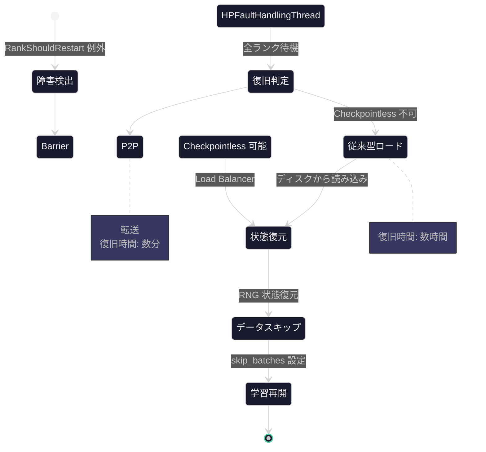

::::details 前提
:::message
対象読者は、大規模基盤モデルの学習に携わる方、Amazon SageMaker HyperPod のレジリエンシー機能に興味がある方を想定しています。
:::
:::message
**ライセンス** - © 2025 littlemex.
本文および自作図表: CC BY 4.0
※公式ドキュメントからの引用や翻訳部分は原典の著作権に従います。
引用画像: 各画像の出典に記載されたライセンスに従います。
:::
:::message
一部 AI を用いて文章を作成します。レビューは実施しますが、見逃せない重大な間違いなどがあれば[こちらの Issue](https://github.com/littlemex/samples/issues) から連絡をお願いします。
:::
::::

本章では Amazon SageMaker HyperPod の Checkpointless Training 機能について、[公式リポジトリ](https://github.com/aws/sagemaker-hyperpod-checkpointless-training)と[公式ドキュメント](https://docs.aws.amazon.com/sagemaker/latest/dg/sagemaker-eks-checkpointless.html)を詳細に調査し、実際に動作させるための情報を整理します。

:::message
実装が変更される可能性があるため必要に応じて公式ドキュメントを確認ください。
:::

---

# Checkpointless Training とは

## 背景

大規模 LLM の分散学習において、ハードウェア障害による学習の中断は避けられない課題です。数百から数千台の GPU を使用する学習環境では、長時間の学習中に少なくとも 1 台のノードが障害を起こす確率は極めて高くなります。従来のチェックポイントベースの復旧手法では、障害発生時にディスクまたは Amazon FSx for Lustre に保存された数百 GiB から数 TiB のチェックポイントファイルを全ノードで読み込む必要がありました。

この復旧プロセスには、大規模モデル（例: Llama3 70B）で 120 分、超大規模モデル（例: GPT OSS 120B）で 180 分もの時間を要し、実効的な学習時間の大幅な減少を引き起こしていました。また、複数のジョブが同時に実行される環境では、ストレージ帯域幅の競合により、さらに復旧時間が延びる問題もありました。

Checkpointless Training は、これらの課題を解決するために開発された新しいフォールトトレランス技術です。GPU メモリ内でモデル状態を冗長化し、障害発生時には Peer-to-Peer 転送で即座に状態を復元することで、復旧時間を 5 分から 8 分に短縮します。これにより、従来の 95% 以上の時間削減を実現し、大規模分散学習の効率を根本的に改善します。

## 概要

Checkpointless Training は、分散学習におけるノード障害からの復旧時間を数時間から数分に短縮する革新的なフォールトトレランス技術です。従来のチェックポイントベースの復旧手法が抱えていたディスク I/O のボトルネックを解消し、大規模 LLM 学習の効率を大幅に向上させます。

従来型のチェックポイントベース復旧では、障害発生時にディスクまたは Amazon FSx for Lustre に保存されたチェックポイントを読み込み、全ノードでロードした後に NCCL や Gloo の通信ライブラリを再初期化する必要がありました。このプロセスには通常数時間を要し、大規模な分散学習における大きな時間的損失となっていました。一方 Checkpointless Training では、GPU メモリ内に保持された冗長なモデル状態を活用し、Peer-to-Peer 転送によって失敗したランクの状態を即座に復元します。これにより、復旧時間を数分に短縮し、通信ライブラリの再初期化もスキップ可能となります。さらに、Smart Data Caching 機能により、学習データをメモリマップ形式でキャッシュし、既に処理済みのバッチをスキップすることで、データローディングの遅延も排除します。


:::message alert
**重要な前提条件** - Checkpointless Training は [Amazon EKS でオーケストレーションされた Amazon SageMaker HyperPod クラスター](https://docs.aws.amazon.com/sagemaker/latest/dg/sagemaker-hyperpod-eks.html)でのみ利用可能です。[Ambiguity] Slurm 環境での完全なサポート状況は公式ドキュメントに明記されていません。
:::

---

## アーキテクチャと仕組み

Checkpointless Training のアーキテクチャは、5 つの主要コンポーネントから構成されています。これらのコンポーネントが協調動作することで、ノード障害からの高速復旧を実現します。

```mermaid
%%{init: {'theme': 'dark', 'themeVariables': { 'primaryColor': '#1a1a2e', 'primaryTextColor': '#eee', 'primaryBorderColor': '#16213e', 'lineColor': '#4ecca3', 'secondaryColor': '#0f3460', 'tertiaryColor': '#1a1a2e', 'background': '#1a1a2e', 'mainBkg': '#1a1a2e', 'secondBkg': '#16213e', 'nodeBorder': '#4ecca3', 'clusterBkg': '#0f3460', 'clusterBorder': '#16213e', 'titleColor': '#eee'}}}%%
graph TD
    A[In-Process Recovery Wrapper] -->|障害検出| B[HyperPod Barrier]
    B -->|全ランク同期| C[Checkpoint Manager]
    C -->|GPU メモリ冗長性| D[Peer-to-Peer State Transfer]
    D -->|状態復元| E[NeMo Plugins Integration]
    E -->|ステップ管理| F[Smart Data Caching]
    F -->|バッチスキップ| G[HyperPod Elastic Agent]
    G -->|Kubernetes API| H[学習再開]

    style A fill: #16213e,stroke: #4ecca3,stroke-width:2px
    style C fill: #16213e,stroke: #4ecca3,stroke-width:2px
    style E fill: #16213e,stroke: #4ecca3,stroke-width:2px
    style F fill: #16213e,stroke: #4ecca3,stroke-width:2px
    style G fill: #16213e,stroke: #4ecca3,stroke-width:2px
    style H fill: #1a3d1a,stroke: #4ecca3,stroke-width:3px
```



### In-Process Recovery Wrapper

最上位のコンポーネントである In-Process Recovery Wrapper は、学習ループ全体をラップし、障害発生時の例外処理を担当します。このラッパーは `RankShouldRestart` 例外をトリガーとして、HyperPod Barrier を呼び出し、全ランクの同期を開始します。障害が検出されると、健全なランクも含めて全てのプロセスが HyperPod Barrier で待機し、復旧プロセスの調整が行われます。

### Checkpoint Manager と GPU メモリ冗長性

Checkpoint Manager は、Checkpointless Training の中核を担うコンポーネントです。このマネージャーは、`num_distributed_optimizer_instances` パラメータで指定された複数の分散オプティマイザインスタンスを管理し、各インスタンス内でモデル状態の冗長コピーを GPU メモリ内に保持します。公式サンプルでは全て `num_distributed_optimizer_instances: 2` が設定されており、これにより各 Data Parallel グループ内で最低 2 つの状態コピーが保持されます。この冗長性により、任意の 1 ランクが失敗しても、同じ Data Parallel グループ内の別のランクから状態を復元できます。

例えば、16 GPU（2 ノード × 8 GPU）の構成で `num_distributed_optimizer_instances: 2` を設定した場合、Rank 0 から 7 までが Optimizer Instance 1 を、Rank 8 から 15 までが Optimizer Instance 2 を形成します。各インスタンス内で全モデル状態が共有されるため、Rank 8 が失敗しても Rank 9 から 15 の任意のランクから状態を復元できます。

```mermaid
%%{init: {'theme': 'dark', 'themeVariables': { 'primaryColor': '#1a1a2e', 'primaryTextColor': '#eee', 'primaryBorderColor': '#16213e', 'lineColor': '#4ecca3', 'secondaryColor': '#0f3460', 'tertiaryColor': '#1a1a2e', 'background': '#1a1a2e', 'mainBkg': '#1a1a2e', 'secondBkg': '#16213e'}}}%%
graph TB
    subgraph instance1["Optimizer Instance 1 (Rank 0-7)"]
        R0[Rank 0<br/>全モデル状態]
        R1[Rank 1<br/>全モデル状態]
        R2[Rank 2<br/>全モデル状態]
        R3[Rank 3<br/>全モデル状態]
        R4[Rank 4<br/>全モデル状態]
        R5[Rank 5<br/>全モデル状態]
        R6[Rank 6<br/>全モデル状態]
        R7[Rank 7<br/>全モデル状態]
    end

    subgraph instance2["Optimizer Instance 2 (Rank 8-15)"]
        R8[Rank 8<br/>全モデル状態]
        R9[Rank 9<br/>全モデル状態]
        R10[Rank 10<br/>全モデル状態]
        R11[Rank 11<br/>全モデル状態]
        R12[Rank 12<br/>全モデル状態]
        R13[Rank 13<br/>全モデル状態]
        R14[Rank 14<br/>全モデル状態]
        R15[Rank 15<br/>全モデル状態]
    end

    R8 -.->|障害発生| X[❌ 失敗]
    R9 -->|状態転送| R8

    style R8 fill: #8b0000
    style R9 fill: #006400
    style X fill: #8b0000
    style instance1 fill: #16213e
    style instance2 fill: #16213e
```



### Peer-to-Peer State Transfer と Load Balancer

障害が発生した際、Load Balancer が各失敗ランクに対して最も負荷の少ない健全なランクをマッピングし、Peer-to-Peer 転送を調整します。この Load Balancer は、同一 Data Parallel グループ内の全ランクの転送負荷を追跡し、特定のランクに転送が集中しないように分散させます。転送は NCCL の Peer-to-Peer 通信機能を使用し、ディスク I/O を一切経由せずに GPU メモリ間で直接状態をコピーします。

### NeMo Plugins Integration

NVIDIA NeMo Toolkit との統合により、PyTorch Lightning ベースの学習ループにシームレスに組み込まれます。`CheckpointlessCallback` はステップごとのライフサイクルを管理し、`CheckpointlessMegatronStrategy` は復旧方法の選択を担当します。また、`CheckpointlessAutoResume` は従来のチェックポイントロードを遅延させ、Checkpointless Recovery が失敗した場合のみフォールバックとしてディスクからロードします。

### Smart Data Caching

学習データの再ロードによる遅延を排除するため、Smart Data Caching 機能が実装されています。この機能は Memory-Mapped I/O（MMAP）を使用してデータセットをメモリにマッピングし、各バッチのハッシュ値を記録します。復旧時には、`consumed_batches` の値に基づいて既に処理済みのバッチをスキップし、次の未処理バッチから学習を再開します。これにより、データローディングの時間を大幅に削減し、復旧プロセス全体を高速化します。

---

## 復旧プロセスの詳細

Checkpointless Training の復旧プロセスは、5 つの明確に定義されたステップで構成されています。以下、各ステップの詳細を説明します。



### Step 1: 障害検出

HyperPod Elastic Agent が実行する Health Monitoring により、GPU の可用性、メモリエラー、温度異常などが継続的に監視されます。障害が検出されると、`HPFaultHandlingThread` が非同期的に Main Thread に対して `RankShouldRestart` 例外を送出します。この例外は学習ループの最上位でキャッチされ、復旧プロセスが開始されます。

### Step 2: Barrier Synchronization

`HPCallWrapper.initialize_barrier()` が呼び出され、HyperPod Elastic Agent を介して全ランクが同期されます。この Barrier では、失敗したランクだけでなく、健全なランクも含めて全てのプロセスが待機します。これにより、復旧プロセスが全体で調整され、一部のランクだけが先行することを防ぎます。Barrier のタイムアウト時間は環境変数 `INPROCESS_RESTART_TIMEOUT`（デフォルト 1800 秒）で制御されます。

### Step 3: Checkpointless Recovery の判定

`CheckpointlessMegatronStrategy` が以下の条件を評価し、Checkpointless Recovery が実行可能かを判定します。全ての失敗ランクに対して健全なレプリカが存在すること、`num_distributed_optimizer_instances` が 2 以上であること、GPU メモリが状態転送に十分であること、ランクマッピングが正常であることが確認されます。これらの条件が全て満たされる場合、Peer-to-Peer 転送による高速復旧が選択されます。いずれかの条件が満たされない場合、従来型のチェックポイントロードにフォールバックします。

### Step 4: Peer-to-Peer State Transfer

Load Balancer が `get_rank_maps()` 関数を使用して、各失敗ランクに対する転送元ランクをマッピングします。転送元は同一 Data Parallel グループ内で最も転送負荷の少ないランクが選択されます。状態転送には `inter_distributed_optimizer_instance_group` の NCCL 通信グループが使用され、GPU メモリ間で直接テンソルがコピーされます。転送完了後、Memory Checksum Validation（オプション）により、転送されたデータの整合性が検証されます。

### Step 5: Training Resume

RNG（乱数生成器）の状態が復元され、データローダーの `skip_batches` パラメータが `consumed_batches` の値に設定されます。これにより、既に処理済みのバッチがスキップされ、学習が正確なポイントから再開されます。最後に、学習ループが再実行され、通常の学習プロセスに戻ります。

---

# 対応環境と制約事項

## オーケストレーター対応状況

Checkpointless Training は、Amazon EKS でオーケストレーションされた Amazon SageMaker HyperPod クラスターを主要なサポート対象としています。[公式ドキュメント](https://docs.aws.amazon.com/sagemaker/latest/dg/sagemaker-eks-checkpointless.html)では、Amazon EKS 環境での実装例のみが記載されており、Kubernetes ネイティブな機能である HyperPodPyTorchJob カスタムリソースを使用します。

[Ambiguity] Slurm 環境での Checkpointless Training の完全なサポート状況については、公式ドキュメントに明確な記載がありません。GitHub リポジトリのソースコード内に Slurm 関連のキャッシュクリーンアップロジックが存在することから、部分的な対応が実装されている可能性がありますが、EKS 環境と同等の機能が提供されているかは確認できていません。Slurm 環境での使用を検討される場合は、AWS サポートに直接確認することを推奨します。

---

## 対応インスタンスタイプ

### 公式サンプルで確認済みのインスタンス

[公式リポジトリ](https://github.com/aws/sagemaker-hyperpod-checkpointless-training)で提供されている全てのサンプル（GPT OSS 120B、Llama3 70B のプリトレーニングおよび LoRA ファインチューニング）は、ml.p5.48xlarge インスタンスタイプを使用しています。このインスタンスは NVIDIA H100 GPU を 8 枚搭載し、各 GPU が 80 GiB のメモリを持つため、合計 640 GiB の GPU メモリが利用可能です。EFA（Elastic Fabric Adapter）も 32 デバイス搭載されており、ノード間の高速通信が可能です。

### AWS ドキュメントで確認された対応インスタンス

[Amazon EC2 インスタンスタイプのドキュメント](https://docs.aws.amazon.com/AWSEC2/latest/UserGuide/accelerated-computing-instances.html)によると、以下のインスタンスタイプが GPU 搭載型として提供されています。

**G6 シリーズ（NVIDIA L40S 搭載）**

G6 シリーズは NVIDIA L40S GPU を搭載しており、各 GPU は 44 GiB のメモリを持ちます。ml.g6.48xlarge は 8 枚の L40S GPU を搭載し、合計 352 GiB の GPU メモリを提供します。このインスタンスは 100 Gbps のネットワーク帯域幅と 1 つのネットワークカードを持ち、EFA にも対応しています。

**G6E シリーズ（NVIDIA L4 搭載）**

G6E シリーズは NVIDIA L4 GPU を搭載しており、各 GPU は 22 GiB のメモリを持ちます。ml.g6e.48xlarge は 8 枚の L4 GPU を搭載し、合計 176 GiB の GPU メモリを提供します。このインスタンスは 400 Gbps のネットワーク帯域幅と 4 つのネットワークカードを持ち、EFA にも対応しています。

[Ambiguity] ml.g6.48xlarge および ml.g6e.48xlarge が Checkpointless Training で実際に動作可能かどうかについては、公式ドキュメントに明確な記載がありません。技術的には GPU を 8 枚搭載しており、EFA にも対応しているため、理論的には動作する可能性がありますが、公式なサポート保証はありません。また、GPU メモリサイズが H100 と比較して小さいため、大規模モデルの学習では Tensor Parallel や Pipeline Parallel の設定を調整する必要があります。

**その他のサポート対象**

公式ドキュメントには、AWS Trainium アクセラレータを搭載した Trn1 および Trn2 インスタンスタイプも Checkpointless Training のサポート対象として記載されています。また、NVIDIA Blackwell GPU を 72 枚搭載した NVL72 インスタンスも言及されていますが、詳細な仕様は公開されていません。

### インスタンス選択のガイドライン

本番環境での大規模 LLM 学習には、公式サンプルで実証されている ml.p5.48xlarge の使用を推奨します。このインスタンスは 80 GiB × 8 = 640 GiB の GPU メモリを提供し、Llama3 70B や GPT OSS 120B といった大規模モデルの学習に十分な容量を持ちます。

検証環境や小規模実験では、ml.g6.48xlarge（L40S × 8、合計 352 GiB）または ml.g6e.48xlarge（L4 × 8、合計 176 GiB）の使用を検討できます。ただし、これらのインスタンスでは GPU メモリが限られているため、Tensor Parallel サイズを増やすなどの調整が必要です。また、公式サポートが明示されていないため、本番環境での使用にはリスクが伴います。

小規模な動作確認のみを目的とする場合、ml.g6.8xlarge（4 GPU）以上のインスタンスで最小限のテストを実行できます。ただし、`num_distributed_optimizer_instances: 2` の設定により、各 Data Parallel グループに最低 2 つのランクが必要となるため、GPU 数が少なすぎる場合は適切な並列化設定ができません。

---

## 必須要件

### ソフトウェア要件

Checkpointless Training の実行には、以下のソフトウェアコンポーネントが必要です。これらのバージョン要件は [公式リポジトリの README](https://github.com/aws/sagemaker-hyperpod-checkpointless-training/blob/main/README.md) および [requirements.txt](https://github.com/aws/sagemaker-hyperpod-checkpointless-training/blob/main/requirements.txt) で確認されています。

Python 3.12 以上が必要であり、これは NeMo Toolkit 2.6.0rc0 の要件です。PyTorch は 2.6.0 以上が必須であり、Checkpointless Training の新機能である分散オプティマイザインスタンスのサポートに依存しています。NeMo Toolkit 2.6.0rc0 は PyTorch Lightning 2.5.5 と統合されており、学習ループの管理を担当します。Megatron-Core 0.13.1 は Tensor Parallel、Pipeline Parallel、Data Parallel といった分散並列化機能を提供します。

CUDA 12.5 以上は GPU 演算の実行に必要であり、特に H100 GPU の新機能を活用するために推奨されます。amzn-hyper-pod-elastic-agent 1.1.50 以上は、HyperPod クラスターでの In-Process Restart 機能を提供し、Checkpointless Training の中核を担います。

Kubernetes 環境では、EKS Training Operator 1.2.0 以上が必須です。このバージョンから Checkpointless Training に対応した HyperPodPyTorchJob カスタムリソースが提供されています。Kubernetes 自体のバージョンは 1.28 から 1.33 までがサポートされており、AWS VPC CNI Plugin は 1.18.3 以上が必要です。他の CNI プラグイン（Calico、Cilium など）は現時点でサポートされていません。

### インフラ要件

Checkpointless Training を実行するには、Amazon SageMaker HyperPod の Kubernetes クラスターが必要です。クラスターの作成方法については、[Amazon SageMaker HyperPod Getting Started by EKS](https://docs.aws.amazon.com/sagemaker/latest/dg/sagemaker-hyperpod-eks.html) を参照してください。

共有ストレージとして、Amazon FSx for Lustre または NFS が推奨されます。学習データセット、チェックポイント（フォールバック用）、ログファイルの保存に使用されます。FSx for Lustre は高スループットを提供するため、大規模データセットのロードに適しています。

ネットワーク設定として、VPC 内にプライベートサブネットを作成する必要があります。HyperPod EKS クラスターはプライベートサブネット内でのみ実行可能であり、パブリックサブネットはサポートされていません。EFA（Elastic Fabric Adapter）は高速ノード間通信のために強く推奨されます。EFA を使用することで、NCCL All-Reduce などの Collective Communication の性能が大幅に向上します。

---

## 制約事項

### GPU メモリ制約

Checkpointless Training の最も重要な制約は、GPU メモリの使用量増加です。`num_distributed_optimizer_instances` パラメータを 2 に設定することで、各 Data Parallel グループ内で全モデル状態が冗長化されます。これにより、従来の学習と比較して GPU メモリ使用量が 20 から 30 パーセント増加します。

例えば、Llama3 70B モデルを通常の設定で学習する場合、各 GPU あたり約 40 GiB のメモリを消費します。Checkpointless Training を有効化すると、この値が約 52 GiB に増加します。H100 GPU（80 GiB）では十分な余裕がありますが、L40S GPU（44 GiB）や L4 GPU（22 GiB）では、モデルサイズやバッチサイズの調整が必要になります。

GPU メモリ不足に対処する方法として、`num_distributed_optimizer_instances` を最小値の 2 に設定することが挙げられます。これより大きな値（3 や 4）を設定すると、さらに冗長性が向上しますが、メモリ使用量も増加します。また、Tensor Parallel サイズを増やすことで、各 GPU に配置されるモデルパラメータを削減できます。例えば、`tensor_model_parallel_size: 4` を `tensor_model_parallel_size: 8` に変更すると、各 GPU のメモリ使用量が約半分になります。Pipeline Parallel サイズを増やすことも有効ですが、パイプラインバブルによる効率低下に注意が必要です。

### ネットワーク制約

HyperPod EKS クラスターは VPC 内でのみ実行可能であり、サブネットはプライベートである必要があります。CIDR ブロックはクラスター作成後に変更できないため、事前に十分な IP アドレス範囲を確保する必要があります。

ENI（Elastic Network Interface）の制約として、各インスタンスは 1 つの ENI のみをサポートします。ml.p5.48xlarge インスタンスでは、50 のプライマリ IP アドレスと 31 の追加カード IP アドレスを合わせて、合計 81 の IP アドレスが必要です。複数のノードを含むクラスターでは、これらの IP アドレスがサブネット内で利用可能である必要があります。

EFA（Elastic Fabric Adapter）は、同一 AZ（Availability Zone）および VPC 内でのみ使用可能です。AZ や VPC を越えた通信では EFA を使用できず、通常の TCP/IP 通信にフォールバックします。セキュリティグループの設定では、同一セキュリティグループ内の全トラフィックを許可する必要があります。特に、アウトバウンドルールで `0.0.0.0/0` を指定すると EFA ヘルスチェックが失敗するため、セキュリティグループ自身への参照を使用する必要があります。

マルチ AZ 構成でクラスターを作成する場合、クロス AZ 通信により追加のネットワークレイテンシが発生します。大規模な分散学習では、このレイテンシが学習性能に影響を与える可能性があります。また、`OverrideVpcConfig` で指定したサブネットは、インスタンスグループ作成後に変更できません。

### Kubernetes リソース制約

Kubernetes マニフェストでは、GPU、HugePages、EFA デバイスの数を正確に指定する必要があります。以下は ml.p5.48xlarge インスタンスの典型的なリソース設定例です。

```yaml
resources:
  limits:
    nvidia.com/gpu: 8
    hugepages-2Mi: 5120Mi
    vpc.amazonaws.com/efa: 32
  requests:
    nvidia.com/gpu: 8
    hugepages-2Mi: 5120Mi
    vpc.amazonaws.com/efa: 32
    memory: 32000Mi
```

HugePages は 5120 MiB（5 GiB）が推奨されており、共有メモリを使用した高速なプロセス間通信に利用されます。EFA デバイス数は、インスタンスタイプによって異なります。ml.p5.48xlarge では 32 が標準的ですが、ml.g6.48xlarge や ml.g6e.48xlarge では異なる値になる可能性があります。

ノードセレクターでは、インスタンスタイプを指定する際に `ml.` プレフィックスを含める必要があります。`g6.48xlarge` ではなく `ml.g6.48xlarge` と記述します。

```yaml
nodeSelector:
  beta.kubernetes.io/instance-type: ml.p5.48xlarge
```

### サービスクォータ制約

Amazon SageMaker HyperPod では、インスタンスタイプごとにサービスクォータが設定されています。これらのクォータは [Service Quotas コンソール](https://console.aws.amazon.com/servicequotas/)で確認および変更申請が可能です。

クラスタあたりの最大インスタンス数は、AWS アカウントレベルのクォータによって制限されます。全クラスタ合計のインスタンス数も、リージョンレベルの総インスタンスクォータに従います。インスタンスタイプ別のクォータは個別に設定されており、例えば `ml.p5.48xlarge for cluster usage` というクォータ名で管理されます。

クォータの初期値は多くの場合 0 に設定されており、使用前にクォータ引き上げをリクエストする必要があります。クォータ引き上げには通常 1 から 3 営業日かかるため、クラスター作成の前に十分な余裕を持って申請することを推奨します。

---

# セットアップ手順

本章では、Checkpointless Training 環境を構築する 2 つの方法を提供します。初めての方や、素早く環境を立ち上げたい方には **方法 1: CloudFormation 自動デプロイ（推奨）** をお勧めします。既存の HyperPod EKS 環境がある方や、詳細な設定を行いたい方は **方法 2: 手動セットアップ** を参照してください。

## 方法 1: CloudFormation 自動デプロイ（推奨）

### 概要

この方法では、AWS CloudFormation を使用して、Checkpointless Training に必要なすべてのリソースを自動的に作成します。以下のリソースが一括でデプロイされます。

- VPC とネットワーク構成（NAT Gateway 含む）
- Amazon EKS クラスター
- Amazon SageMaker HyperPod クラスター
- Amazon FSx for Lustre（共有ストレージ）
- Amazon SageMaker Studio Code Editor（開発環境）
- Amazon ECR リポジトリ（コンテナイメージ用）
- 必要な IAM ロールとポリシー

デプロイ時間は約 20-30 分です。デプロイ後は、SageMaker Studio Code Editor にアクセスするだけで、kubectl などの必要なツールが自動的にインストールされた状態で開発を始められます。

### 前提条件の確認

#### 1. AWS CLI のインストールと認証

```bash
# AWS CLI のバージョン確認
aws --version

# 認証確認
aws sts get-caller-identity
```

#### 2. Service Quotas の確認（重要！）

:::message alert
HyperPod インスタンスの Service Quotas は、多くの場合**初期値が 0** に設定されています。デプロイ前にクォータを確認し、必要に応じて引き上げをリクエストする必要があります。クォータ引き上げには **1-3 営業日** かかるため、十分な余裕を持って申請してください。
:::

使用するインスタンスタイプのクォータを確認します。

1. [Service Quotas コンソール](https://console.aws.amazon.com/servicequotas/home/services/sagemaker/quotas) にアクセス
2. 使用するインスタンスタイプに応じて検索：
   - **ml.g5.12xlarge の場合** - `ml.g5.12xlarge for cluster usage` と入力
   - **ml.g6.8xlarge の場合** - `ml.g6.8xlarge for cluster usage` と入力
3. **Applied quota value** が使用予定台数以上であることを確認

#### クォータ値の確認方法

```bash
# AWS CLI でクォータを確認（例: ml.g5.12xlarge）
aws service-quotas get-service-quota \
  --service-code sagemaker \
  --quota-code L-XXXXXXXX \  # クォータコードは Service Quotas Console で確認
  --region us-east-1 \
  --query 'Quota.Value' \
  --output text
```

#### クォータが 0 または不足している場合

1. Service Quotas Console で該当のクォータを選択
2. **Request quota increase** ボタンをクリック
3. 必要な台数を入力（例: 2 台使用する場合は `2` を入力）
4. 申請理由を記入（例: "Testing Checkpointless Training feature"）
5. **Request** をクリック

:::message
承認までの時間は通常 1-3 営業日です（場合によっては数時間で承認されることもあります）。
:::

#### 推奨インスタンスタイプとコスト

| インスタンスタイプ | GPU 数 | GPU メモリ | 時間単価 | 月額（730h） | 推奨度 |
|------------------|--------|-----------|---------|-------------|-------|
| **ml.g5.12xlarge** | **4** | **24 GiB × 4** | **~$5.67/h** | **~$4,139** | **⭐⭐⭐ 推奨** |
| ml.g6.8xlarge | 4 | 48 GiB × 4 | ~$8.10/h | ~$5,913 | ⭐⭐ 高性能 |
| ml.g5.24xlarge | 4 | 24 GiB × 4 | ~$8.14/h | ~$5,942 | ⭐ 割高 |
| ml.p5.48xlarge | 8 | 80 GiB × 8 | ~$98/h | ~$71,540 | 本番環境向け |

**ml.g5.12xlarge を推奨する理由**

- Checkpointless Training の最小要件（4 GPU）を満たす
- ml.g6.8xlarge より約 30% 安い
- NVIDIA A10G（24 GiB メモリ）で検証には十分な性能
- Service Quotas が比較的取りやすい

#### 3. Availability Zone の確認

デプロイ先のリージョンで利用可能な Availability Zone を確認します。

```bash
aws ec2 describe-availability-zones \
  --region us-east-1 \
  --filters Name=state,Values=available \
  --query 'AvailabilityZones[*].[ZoneName,ZoneId]' \
  --output table
```

出力例：
```
--------------------------
|DescribeAvailabilityZones|
+------------+------------+
|  us-east-1a|  use1-az4 |
|  us-east-1b|  use1-az6 |
|  us-east-1c|  use1-az1 |
+------------+------------+
```

### サンプルコードの取得

```bash
# サンプルリポジトリを clone
git clone https://github.com/littlemex/samples.git

# Checkpointless Training ディレクトリに移動
cd samples/ml_distributed_experiment_collection/sagemaker-hyperpod-checkpointless-training/
```

:::message
本チュートリアルで使用する CloudFormation テンプレートとスクリプトは、以下の手順でダウンロードできます：

```bash
# サンプルリポジトリを clone
git clone https://github.com/littlemex/samples.git
cd samples/ml_distributed_experiment_collection/sagemaker-hyperpod-checkpointless-training/
```

または、個別にダウンロード：
- [CloudFormation テンプレート](https://github.com/littlemex/samples/blob/main/ml_distributed_experiment_collection/sagemaker-hyperpod-checkpointless-training/cloudformation/hyperpod-eks-checkpointless-training.yaml)
- [パラメータファイル](https://github.com/littlemex/samples/blob/main/ml_distributed_experiment_collection/sagemaker-hyperpod-checkpointless-training/cloudformation/parameters.json)
- [デプロイスクリプト](https://github.com/littlemex/samples/blob/main/ml_distributed_experiment_collection/sagemaker-hyperpod-checkpointless-training/cloudformation/deploy_stack.sh)
:::

### パラメータの編集

`parameters.json` ファイルを編集して、環境に合わせて設定します。

```json
[
  {
    "ParameterKey": "ResourceNamePrefix",
    "ParameterValue": "hyperpod-ckpt"
  },
  {
    "ParameterKey": "AvailabilityZoneId",
    "ParameterValue": "use1-az4"
  },
  {
    "ParameterKey": "InstanceType",
    "ParameterValue": "ml.g5.12xlarge"
  },
  {
    "ParameterKey": "InstanceCount",
    "ParameterValue": "1"
  },
  {
    "ParameterKey": "FSxStorageCapacity",
    "ParameterValue": "1200"
  },
  {
    "ParameterKey": "FSxThroughput",
    "ParameterValue": "250"
  },
  {
    "ParameterKey": "KubernetesVersion",
    "ParameterValue": "1.31"
  },
  {
    "ParameterKey": "UsingSMCodeEditor",
    "ParameterValue": "true"
  }
]
```

#### 重要なパラメータの説明

| パラメータ | 説明 | 推奨値 |
|-----------|------|--------|
| `ResourceNamePrefix` | すべてのリソース名のプレフィックス | `hyperpod-ckpt`（短く、わかりやすい名前） |
| `AvailabilityZoneId` | デプロイ先の AZ ID | 前述の確認コマンドで取得した値 |
| `InstanceType` | HyperPod のインスタンスタイプ | `ml.g5.12xlarge`（4 GPU、推奨・コスト効率良） |
| `InstanceCount` | インスタンス数 | `1`（最小構成） |

### CloudFormation スタックのデプロイ

```bash
cd cloudformation

# デプロイスクリプトを実行
bash deploy_stack.sh
```

スクリプトは以下の確認を行います：

1. AWS CLI と認証の確認
2. Availability Zone の存在確認
3. Service Quotas の警告表示
4. 既存スタックの確認

確認後、以下のようなプロンプトが表示されます：

```
============================================
重要な注意事項
============================================

1. このスタックは以下のリソースを作成します:
   - VPC と Subnet (NAT Gateway を含む)
   - EKS Cluster
   - HyperPod Cluster (ml.g5.12xlarge × 1)
   - FSx for Lustre
   - SageMaker Studio Domain (オプション)
   - ECR Repository
   - S3 Bucket

2. デプロイには約 20-30 分かかります

3. 費用が発生します。特に以下のリソース:
   - HyperPod インスタンス
   - NAT Gateway
   - FSx for Lustre

4. デプロイ後は必ず確認コマンドを実行してください

続行しますか? (y/N):
```

`y` を入力してデプロイを開始します。

### デプロイの進捗確認

デプロイ中は、以下のコマンドで進捗を確認できます（別のターミナルで実行）。

```bash
aws cloudformation describe-stack-events \
  --stack-name hyperpod-checkpointless-training \
  --region us-east-1 \
  --max-items 10 \
  --query 'StackEvents[*].[Timestamp,ResourceStatus,ResourceType,LogicalResourceId]' \
  --output table
```

または、[CloudFormation コンソール](https://console.aws.amazon.com/cloudformation/home) でリアルタイムに確認できます。

### デプロイ完了の確認

デプロイが完了すると、以下のような Output が表示されます。

```
------------------------------------------------------------
|                     DescribeStacks                       |
+---------------------------+------------------------------+
|  EKSClusterName          |  hyperpod-ckpt-eks           |
|  EKSClusterEndpoint      |  https://XXXXX.eks.us-east-1.amazonaws.com |
|  HyperPodClusterName     |  hyperpod-ckpt-hyperpod      |
|  FSxFileSystemId         |  fs-0123456789abcdef0        |
|  ECRRepositoryUri        |  123456789012.dkr.ecr.us-east-1.amazonaws.com/hyperpod-ckpt |
|  S3BucketName            |  hyperpod-ckpt-123456789012  |
|  SageMakerStudioURL      |  https://XXXXX.studio.us-east-1.sagemaker.aws/ |
+---------------------------+------------------------------+
```

これらの値は、後の手順で使用します。

### SageMaker Studio Code Editor へのアクセス

1. [SageMaker Console](https://console.aws.amazon.com/sagemaker/home) にアクセス
2. 左側のメニューから **Studio** > **Domains** を選択
3. 作成された Domain（`hyperpod-ckpt-studio`）をクリック
4. **User profile** タブで `default-user` を選択
5. **Launch** ボタンをクリックして **Code Editor** を選択

Code Editor が起動するまで 2-3 分待ちます。

### 環境の確認

Code Editor が起動したら、ターミナルを開いて環境を確認します。

#### 1. 環境変数の確認

Lifecycle Configuration により、環境変数が自動設定されています。

```bash
# 環境変数を読み込む
source /home/sagemaker-user/env_vars

# 主要な環境変数を確認
echo "EKS Cluster: $EKS_CLUSTER_NAME"
echo "ECR URI: $ECR_URI"
echo "FSx PVC: $FSX_PVC_NAME"
echo "Region: $AWS_REGION"
echo "HyperPod Recipes Image: $HYPERPOD_RECIPES_IMAGE"
```

出力例：
```
EKS Cluster: hyperpod-ckpt-eks
ECR URI: 123456789012.dkr.ecr.us-east-1.amazonaws.com/hyperpod-ckpt
FSx PVC: fsx-claim
Region: us-east-1
HyperPod Recipes Image: 327873000638.dkr.ecr.us-east-1.amazonaws.com/hyperpod-recipes: llmft-v1.0.0-llama
```

#### 2. kubectl の動作確認

```bash
# ノードの確認
kubectl get nodes

# 出力例:
# NAME                           STATUS   ROLES    AGE   VERSION
# ip-10-192-128-10.ec2.internal Ready    <none>   5m    v1.31.0
```

```bash
# PVC の確認
kubectl get pvc

# 出力例:
# NAME        STATUS   VOLUME                                     CAPACITY   ACCESS MODES   STORAGECLASS   AGE
# fsx-claim   Bound    pvc-01234567-89ab-cdef-0123-456789abcdef   1200Gi     RWX            fsx-sc         5m
```

:::message alert
もし kubectl コマンドが見つからない、またはノードが表示されない場合は、以下を実行してください：

```bash
# kubeconfig を手動で更新
aws eks update-kubeconfig --name $EKS_CLUSTER_NAME --region $AWS_REGION

# PATH を確認
export PATH=/home/sagemaker-user/.local/bin: $PATH
```
:::

### Checkpointless Training リポジトリのセットアップ

環境の自動セットアップスクリプトを使用します。

```bash
# サンプルリポジトリのディレクトリにいることを確認
# (前の手順で cd samples/ml_distributed_experiment_collection/sagemaker-hyperpod-checkpointless-training/ を実行済み)

# 環境変数を自動取得
bash scripts/setup_environment.sh

# 環境変数を読み込む
source env_vars

# 公式リポジトリを clone して自動設定
bash scripts/clone_and_setup_repo.sh
```

`clone_and_setup_repo.sh` は以下を自動的に実行します：

1. 公式リポジトリを clone
2. 環境変数に基づいて Kubernetes Manifest を自動編集
3. コンテナイメージ URI を設定
4. FSx PVC 名を設定
5. クイックスタートスクリプトを生成

完了すると、以下のようなメッセージが表示されます：

```
============================================
セットアップ完了！
============================================

次のステップ:

1. クイックスタート（推奨）:
   cd sagemaker-hyperpod-checkpointless-training
   bash quickstart.sh

2. または、手動でジョブを投入:
   cd sagemaker-hyperpod-checkpointless-training
   kubectl apply -f examples/llama3/launch/peft_llama3_tiny_checkpointless_g6_4gpu.yaml

3. セットアップ情報の確認:
   cat sagemaker-hyperpod-checkpointless-training/SETUP_COMPLETE.md
```

### Docker イメージの選択

Checkpointless Training を実行するには、コンテナイメージが必要です。以下の 2 つの選択肢があります。

#### オプション 1: HyperPod Recipes 公式イメージを使用（推奨）

AWS が提供する公式イメージを使用します。Docker イメージのビルドが不要で、すぐに使用開始できます。

```bash
# 環境変数に設定済み
echo $HYPERPOD_RECIPES_IMAGE

# 出力例（us-east-1 の場合）:
# 327873000638.dkr.ecr.us-east-1.amazonaws.com/hyperpod-recipes: llmft-v1.0.0-llama
```

`clone_and_setup_repo.sh` を実行した場合、Kubernetes Manifest は自動的にこのイメージを使用するように設定されています。

#### オプション 2: カスタムイメージをビルド

特定のパッケージを追加したい場合や、最新の NeMo Toolkit を使用したい場合は、カスタムイメージをビルドします。

```bash
cd sagemaker-hyperpod-checkpointless-training

# イメージビルドスクリプトを実行
bash ../scripts/build_image.sh
```

このスクリプトは以下を実行します：

1. ECR にログイン
2. ECR リポジトリが存在しない場合は作成
3. Docker イメージをビルド
4. ECR にプッシュ
5. Kubernetes Manifest を自動更新

### Checkpointless Training ジョブの投入

最小構成（4 GPU、ダミーデータ）でジョブを投入します。

```bash
cd sagemaker-hyperpod-checkpointless-training

# クイックスタートスクリプトを実行
bash quickstart.sh
```

または、手動で投入：

```bash
kubectl apply -f examples/llama3/launch/peft_llama3_tiny_checkpointless_g6_4gpu.yaml
```

### ジョブの監視

```bash
# Pod のステータスを確認
kubectl get pods

# 出力例:
# NAME                                     READY   STATUS    RESTARTS   AGE
# peft-llama3-tiny-checkpointless-4gpu-0   1/1     Running   0          2m

# ログをリアルタイムで確認
kubectl logs -f peft-llama3-tiny-checkpointless-4gpu-0
```

ログに以下のメッセージが表示されれば、Checkpointless Training が正常に動作しています：

```
[Rank 0] Checkpointless training enabled
[Rank 0] Distributed optimizer instances: 2
[Rank 0] Data parallel size: 2
[Rank 0] Tensor parallel size: 2
...
[Rank 2] Injecting fault at step 10
[Rank 0] Rank 2 failure detected
[Rank 0] Starting checkpointless recovery
[Rank 0] Peer-to-peer state transfer from Rank 0 to Rank 2
[Rank 0] Recovery completed in 12.5 seconds
[Rank 0] Training resumed
```

### 環境のクリーンアップ

実験完了後、リソースを削除してコストを節約します。

#### ジョブの削除

```bash
kubectl delete -f examples/llama3/launch/peft_llama3_tiny_checkpointless_g6_4gpu.yaml
```

#### CloudFormation スタックの削除

```bash
# サンプルリポジトリの cloudformation ディレクトリに移動
cd samples/ml_distributed_experiment_collection/sagemaker-hyperpod-checkpointless-training/cloudformation/

# 削除スクリプトを実行
bash delete_stack.sh
```

削除スクリプトは以下を実行します：

1. S3 バケット内のオブジェクトを削除
2. ECR イメージを削除
3. CloudFormation スタックを削除

削除には 10-20 分かかります。

:::message alert
削除を忘れると、特に以下のリソースで継続的に課金されます：
- HyperPod インスタンス（ml.g5.12xlarge: 約 $5.67/時間）
- NAT Gateway（約 $0.05/時間 + データ転送料）
- FSx for Lustre（約 $0.55/GiB/月）
:::

---

## 方法 2: 手動セットアップ

既存の HyperPod EKS 環境がある方や、詳細な設定を行いたい方向けの手順です。

### 前提環境の準備

Checkpointless Training を実行する前に、Amazon SageMaker HyperPod の EKS クラスターを作成する必要があります。クラスター作成の詳細な手順については、[Amazon SageMaker HyperPod Getting Started by EKS](https://docs.aws.amazon.com/sagemaker/latest/dg/sagemaker-hyperpod-eks.html) を参照してください。

クラスター作成時には、オーケストレーターとして Amazon EKS を選択します。EKS Training Operator のバージョンは 1.2.0 以上が必須であり、これより古いバージョンでは Checkpointless Training が利用できません。インスタンスタイプは、公式サンプルで実証されている ml.p5.48xlarge を推奨しますが、検証環境では ml.g6.48xlarge や ml.g6e.48xlarge も検討できます。共有ストレージとして、Amazon FSx for Lustre を作成し、PersistentVolumeClaim として Kubernetes クラスターにマウントします。

クラスター作成が完了したら、kubectl を使用してクラスターに接続します。AWS CLI を使用して kubeconfig を更新し、クラスターへのアクセスを設定します。

```bash
aws sagemaker describe-cluster --cluster-name <your-cluster-name> --region <your-region>
aws eks update-kubeconfig --name <your-cluster-name> --region <your-region>
kubectl get nodes
kubectl get deployment -n kubeflow
```

ノードの状態が Ready であり、kubeflow ネームスペースに EKS Training Operator のデプロイメントが存在することを確認します。PersistentVolumeClaim の状態も確認し、FSx for Lustre が正常にマウントされていることを確認します。

```bash
kubectl get pvc
```

出力例として、fsx-claim という名前の PVC が Bound 状態で、1200 Gi などの適切な容量が表示されることを確認します。

---

## Docker イメージの準備

Checkpointless Training を実行するには、必要なソフトウェアコンポーネントを含む Docker イメージが必要です。AWS から提供される公式イメージを使用する方法と、カスタムイメージを構築する方法があります。

公式イメージを使用する場合、イメージ URL は AWS ドキュメントまたは [HyperPod Recipes リポジトリ](https://github.com/aws/sagemaker-hyperpod-recipes)で確認できます。このイメージには、PyTorch、NeMo Toolkit、Megatron-Core、HyperPod Elastic Agent などの必要なコンポーネントが全て含まれています。

カスタムイメージを構築する場合、NVIDIA の公式 PyTorch イメージをベースとして使用します。以下は Dockerfile の例です。

```dockerfile
FROM nvcr.io/nvidia/pytorch:24.09-py3

RUN pip install --no-cache-dir \
    torch>=2.6.0 \
    nemo-toolkit==2.6.0rc0 \
    megatron-core==0.13.1 \
    pytorch-lightning==2.5.5

COPY src/ /opt/checkpointless/
RUN pip install -e /opt/checkpointless/

COPY examples/ /opt/amazon/examples/
```

イメージをビルドし、Amazon ECR にプッシュします。

```bash
docker build -t <your-ecr-repo>/checkpointless-training: latest .
aws ecr get-login-password --region <your-region> | docker login --username AWS --password-stdin <your-ecr-repo>
docker push <your-ecr-repo>/checkpointless-training: latest
```

---

## 設定ファイルのカスタマイズ

公式サンプルの設定ファイルをベースとして、環境に合わせてカスタマイズします。Kubernetes Manifest ファイルと NeMo 設定ファイルの両方を編集する必要があります。

### Kubernetes Manifest の編集

[公式リポジトリのサンプル](https://github.com/aws/sagemaker-hyperpod-checkpointless-training/tree/main/examples/llama3/launch)から、適切な YAML ファイルをコピーします。小規模実験には LoRA ファインチューニング用のサンプル（2 ノード構成）が適しています。

```bash
git clone https://github.com/aws/sagemaker-hyperpod-checkpointless-training.git
cd sagemaker-hyperpod-checkpointless-training
cp examples/llama3/launch/peft_llama3_70b_checkpointless_p5.yaml \
   examples/llama3/launch/peft_llama3_70b_checkpointless_custom.yaml
```

YAML ファイルを編集し、以下の項目をカスタマイズします。

```yaml
apiVersion: sagemaker.amazonaws.com/v1
kind: HyperPodPyTorchJob
metadata:
  name: username-llama3-lora-checkpointless
spec:
  nprocPerNode: "8"
  replicaSpecs:
    - name: '2-nodes'
      replicas: 2
      template:
        spec:
          hostNetwork: True
          nodeSelector:
            beta.kubernetes.io/instance-type: ml.p5.48xlarge
          containers:
            - name: ptjob
              image: <your-ecr-repo>/checkpointless-training: latest
              resources:
                limits:
                  nvidia.com/gpu: 8
                  hugepages-2Mi: 5120Mi
                  vpc.amazonaws.com/efa: 32
              env:
                - name: CONFIG_NAME
                  value: "llama3_70b_peft_checkpointless.yaml"
                - name: WORKSPACE
                  value: "/data/username/"
                - name: CHECKPOINT_DIR
                  value: "/data/username/checkpoint/llama_70b/"
              volumeMounts:
                - name: persistent-storage
                  mountPath: /data
                - name: dshm
                  mountPath: /dev/shm
          volumes:
            - name: persistent-storage
              persistentVolumeClaim:
                claimName: fsx-claim
            - name: dshm
              emptyDir:
                medium: Memory
```

メタデータの name フィールドには、ユーザー名とジョブ名を含む一意な識別子を設定します。replicas フィールドでノード数を指定し、nodeSelector で使用するインスタンスタイプを指定します。image フィールドには、先ほど構築した Docker イメージの URI を指定します。環境変数として、CONFIG_NAME に NeMo 設定ファイル名、WORKSPACE にワークスペースディレクトリ、CHECKPOINT_DIR にチェックポイント保存先を指定します。

### NeMo 設定ファイルの編集

NeMo 設定ファイルは、モデルアーキテクチャ、並列化戦略、Checkpointless Training の動作を制御します。[公式リポジトリのサンプル](https://github.com/aws/sagemaker-hyperpod-checkpointless-training/tree/main/examples/llama3/config)から適切な YAML ファイルをコピーします。

```yaml
defaults:
  - llama3_70b_peft

callbacks:
  - _target_: hyperpod_checkpointless_training.nemo_plugins.callbacks.CheckpointlessCallback
    enable_inprocess: true
    enable_checkpointless: true
    enable_checksum: false
    clean_tensor_hook: true

resume:
  _target_: hyperpod_checkpointless_training.nemo_plugins.resume.CheckpointlessAutoResume
  resume_from_directory: ${log.ckpt.dirpath}
  resume_if_exists: true
  resume_past_end: true
  resume_ignore_no_checkpoint: true

strategy:
  num_distributed_optimizer_instances: 2
  tensor_model_parallel_size: 4
  pipeline_model_parallel_size: 2
```

`CheckpointlessCallback` の `enable_inprocess` と `enable_checkpointless` を両方 true に設定することで、Checkpointless Training が有効化されます。`enable_checksum` は、状態転送後のチェックサム検証を有効にするオプションです。検証により復旧の信頼性が向上しますが、若干の時間的オーバーヘッドが発生します。`clean_tensor_hook` は、復旧後に不要なテンソルをクリアして GPU メモリを解放する機能です。

`CheckpointlessAutoResume` は、Checkpointless Recovery が失敗した場合のフォールバック動作を制御します。`resume_if_exists` を true に設定することで、ディスクに保存されたチェックポイントが存在する場合に自動的にロードします。

`strategy` セクションの `num_distributed_optimizer_instances` は、Checkpointless Training の中核となるパラメータです。この値は必ず 2 以上に設定する必要があります。`tensor_model_parallel_size` と `pipeline_model_parallel_size` は、GPU メモリ使用量に応じて調整します。GPU メモリが不足する場合は、これらの値を増やすことで各 GPU に配置されるモデルサイズを削減できます。

---

## ジョブの投入と監視

設定ファイルの準備が完了したら、kubectl を使用してジョブを投入します。

```bash
kubectl apply -f examples/llama3/launch/peft_llama3_70b_checkpointless_custom.yaml
```

ジョブの状態を確認します。

```bash
kubectl get pods
kubectl get hyperpodpytorchjob username-llama3-lora-checkpointless
```

Pod の状態が Running になるまで待機します。複数のノードを使用する場合、各ノードに対して 1 つの Pod が作成されます。Pod のログをリアルタイムで確認することで、学習の進行状況や障害発生時の復旧プロセスを監視できます。

```bash
kubectl logs <pod-name> -f
```

全ての Pod のログを同時に確認する場合は、ラベルセレクタを使用します。

```bash
kubectl logs -l app=hyperpod -f
```

ジョブの詳細情報を確認する場合は、describe コマンドを使用します。

```bash
kubectl describe hyperpodpytorchjob username-llama3-lora-checkpointless
```

この出力には、ジョブの状態、イベント履歴、エラーメッセージなどが含まれます。

---

# 公式サンプルの概要

[公式リポジトリ](https://github.com/aws/sagemaker-hyperpod-checkpointless-training)では、4 つの代表的なサンプルが提供されています。これらのサンプルは、GPT OSS 120B モデルと Llama3 70B モデルに対して、フルファインチューニングと LoRA ファインチューニングの両方をカバーしています。

GPT OSS 120B のフルファインチューニングサンプルでは、16 ノード（128 GPU）を使用して 120B パラメータモデルの全パラメータを更新します。このサンプルは最も大規模な構成であり、Checkpointless Training の効果を最大限に発揮します。GPT OSS 120B の LoRA サンプルでは、2 ノード（16 GPU）を使用してパラメータ効率的なファインチューニングを実行します。LoRA により、学習するパラメータ数が大幅に削減されるため、より少ないリソースで実行できます。

Llama3 70B のプリトレーニングサンプルでは、16 ノード（128 GPU）を使用してスクラッチからモデルを訓練します。このサンプルは、事前学習された重みを使用せず、ランダム初期化から開始します。Llama3 70B の LoRA サンプルでは、2 ノード（16 GPU）を使用して既存の Llama3 70B モデルをファインチューニングします。

全てのサンプルは ml.p5.48xlarge インスタンスタイプを使用しており、各ノードは 8 枚の NVIDIA H100 GPU を搭載しています。サンプルコードのエントリーポイントは Python スクリプトであり、NeMo Toolkit の PyTorch Lightning Trainer を使用しています。Kubernetes Manifest ファイルと NeMo 設定ファイルの組み合わせにより、ジョブがデプロイされます。

サンプルコードの構造は、以下のように標準化されています。エントリーポイントスクリプトでは、`HPWrapper` を使用して学習ループ全体をラップします。

```python
from hyperpod_checkpointless_training.inprocess.wrap import HPWrapper

wrapper = HPWrapper(
    checkpoint_manager=checkpoint_manager,
    enable_inprocess=True,
)

with wrapper(train_fn):
    trainer.fit(model, datamodule=datamodule)
```

Callback の設定では、`CheckpointlessCallback` を NeMo の Trainer に登録します。

```python
callbacks = [
    CheckpointlessCallback(
        enable_inprocess=True,
        enable_checkpointless=True,
        enable_checksum=False,
        clean_tensor_hook=True,
    ),
]
```

データローダーの設定では、`CheckpointlessDataModule` を使用して Smart Data Caching を有効化します。

```python
datamodule = CheckpointlessDataModule(
    base_module=LLMDataModule(...),
    cache_config=CacheResumeMMAPConfig(
        enable_cache=True,
        cache_type="mmap",
    )
)
```

---

# 障害テストとトラブルシューティング

## Fault Injection による動作確認

Checkpointless Training は、Fault Injection Callback を使用して意図的に障害を発生させ、復旧動作をテストできます。この機能により、本番環境で障害が発生する前に、復旧プロセスが正常に動作することを確認できます。

Fault Injection の設定は、NeMo 設定ファイルの callbacks セクションに追加します。

```yaml
callbacks:
  - _target_: hyperpod_checkpointless_training.nemo_plugins.fault_injection.HPFaultInjectionCallback
    test_fault_config:
      fault_type: "ipr"
      fault_prob_random: 1
      fault_ranks: [8]
      steps_before_fault: 25
```

`fault_type: "ipr"` は In-Process Restart をシミュレートすることを意味します。`fault_prob_random: 1` は、障害が 100 パーセントの確率で発生することを指定します。`fault_ranks: [8]` は、Rank 8 に障害を注入することを指定します。複数のランクを指定する場合は、`[8, 9, 10]` のようにリストで記述します。`steps_before_fault: 25` は、学習開始から 25 ステップ後に障害を発生させることを指定します。

期待される動作として、Step 1 から 24 までは正常に学習が進行します。Step 25 で Rank 8 に障害が発生し、`RankShouldRestart` 例外がスローされます。全ランクが HyperPod Barrier で同期し、Checkpointless Recovery の実行可能性が判定されます。条件が満たされる場合、Peer-to-Peer State Transfer が実行され、Rank 0 から 7 または Rank 9 から 15 の任意のランクから Rank 8 に状態が転送されます。復旧完了後、Step 26 から学習が再開されます。

ログ出力の例として、以下のようなメッセージが表示されます。

```
2025-02-07 10:15:30 INFO Rank 8 failed, initiating recovery
2025-02-07 10:15:31 INFO HyperPod Barrier: waiting for all ranks
2025-02-07 10:15:35 INFO Checkpointless recovery viable: True
2025-02-07 10:15:36 INFO P2P transfer: Rank 0 -> Rank 8
2025-02-07 10:15:45 INFO Recovery complete, resuming training from step 26
2025-02-07 10:15:46 INFO Training resumed successfully
```

---

## 実装の自動化

HyperPod クラスターのデプロイ完了後、トレーニングジョブを投入するまでの手順を自動化するスクリプトを提供します。

### 自動化スクリプトの実行

デプロイガイドに記載された手順で HyperPod クラスターをデプロイ後、以下のスクリプトを実行します。

```bash
cd /work/data-science/claudecode/hyperpod-infrastructure
./setup-training-env.sh
```

このスクリプトは以下の処理を自動的に実行します。

#### 0. FSx CSI ドライバのインストール確認

FSx for Lustre をマウントするために必要な CSI ドライバがインストールされているか確認し、未インストールの場合は自動的にインストールします。

```bash
# CSI ドライバの確認
kubectl get csidriver fsx.csi.aws.com

# 未インストールの場合は自動インストール
kubectl apply -k "github.com/kubernetes-sigs/aws-fsx-csi-driver/deploy/kubernetes/overlays/stable/?ref=release-1.2"

# ドライバ Pod の起動確認
kubectl get pods -n kube-system | grep fsx
# fsx-csi-controller-xxxxx   4/4     Running   0          30s
# fsx-csi-node-xxxxx         3/3     Running   0          30s
```

:::message
**重要**: FSx CSI ドライバは HyperPod クラスターにデフォルトでインストールされていません。必ずインストールしてから PVC を作成してください。
:::

#### 1. FSx PersistentVolumeClaim の作成

共有ストレージ（FSx for Lustre）を Kubernetes から利用するための PVC を作成します。

```yaml
apiVersion: v1
kind: PersistentVolume
metadata:
  name: fsx-pv
spec:
  capacity:
    storage: 1200Gi
  volumeMode: Filesystem
  accessModes:
    - ReadWriteMany
  persistentVolumeReclaimPolicy: Retain
  storageClassName: fsx-sc
  csi:
    driver: fsx.csi.aws.com
    volumeHandle: fs-xxxxx
    volumeAttributes:
      dnsname: fs-xxxxx.fsx.us-east-1.amazonaws.com
      mountname: xxxxx
---
apiVersion: v1
kind: PersistentVolumeClaim
metadata:
  name: fsx-claim
  namespace: default
spec:
  accessModes:
    - ReadWriteMany
  storageClassName: fsx-sc
  resources:
    requests:
      storage: 1200Gi
```

作成後、PVC が Bound 状態になることを確認します。

```bash
kubectl get pvc -n default
# NAME        STATUS   VOLUME   CAPACITY   ACCESS MODES   STORAGECLASS
# fsx-claim   Bound    fsx-pv   1200Gi     RWX            fsx-sc
```

#### 2. Docker イメージの準備

Checkpointless Training には **AWS 公式の Docker イメージ** が提供されています。自分でビルドする必要はありません。

**AWS 公式イメージ（us-east-1）**:
```
327873000638.dkr.ecr.us-east-1.amazonaws.com/hyperpod-checkpointless-training: v1.0.0
```

**含まれるコンポーネント**:
- PyTorch 2.6.0
- CUDA 12.9
- NCCL 2.27.5
- EFA 1.43.0
- AWS-OFI-NCCL 1.16.0
- `amzn-hyper-pod-elastic-agent` 1.1.50
- `hyperpodrun` コマンド
- Checkpointless Training ライブラリ
- NeMo Toolkit 2.0

**利用可能なリージョン**:

| リージョン | ECR イメージ URI |
|-----------|-----------------|
| us-east-1 | 327873000638.dkr.ecr.us-east-1.amazonaws.com/hyperpod-checkpointless-training: v1.0.0 |
| us-west-2 | 920498770698.dkr.ecr.us-west-2.amazonaws.com/hyperpod-checkpointless-training: v1.0.0 |
| eu-west-1 | 558444230920.dkr.ecr.eu-west-1.amazonaws.com/hyperpod-checkpointless-training: v1.0.0 |
| ap-northeast-1 | 439286206433.dkr.ecr.ap-northeast-1.amazonaws.com/hyperpod-checkpointless-training: v1.0.0 |

その他のリージョンについては [公式ドキュメント](https://docs.aws.amazon.com/sagemaker/latest/dg/sagemaker-eks-checkpointless-release-notes.html) を参照してください。

**イメージの使用方法**:

```bash
# AWS 公式 ECR にログイン
aws ecr get-login-password --region us-east-1 | \
  docker login --username AWS --password-stdin \
  327873000638.dkr.ecr.us-east-1.amazonaws.com

# イメージを pull（オプション、Kubernetes が自動的に pull します）
docker pull 327873000638.dkr.ecr.us-east-1.amazonaws.com/hyperpod-checkpointless-training: v1.0.0
```

:::message
**重要**: EKS ベースの HyperPod では、自分で Docker イメージをビルドする必要はありません。`amzn-hyper-pod-elastic-agent` は PyPI で公開されておらず、AWS 公式イメージにのみ含まれています。
:::

#### 3. サンプルジョブマニフェストの作成

ml.g5.12xlarge（4 GPU）用に調整したサンプルジョブマニフェストを生成します。このマニフェストは環境確認用のジョブで、以下を実行します。

- GPU の確認（nvidia-smi）
- EFA の確認（fi_info）
- Python パッケージの確認（torch, nemo, lightning のバージョン）
- 5 分間実行後に自動終了

```yaml
apiVersion: kubeflow.org/v1
kind: PyTorchJob
metadata:
  name: checkpointless-test-g5
spec:
  nprocPerNode: "4"  # ml.g5.12xlarge は 4 GPU
  pytorchReplicaSpecs:
    Master:
      replicas: 1
      restartPolicy: OnFailure
      template:
        spec:
          hostNetwork: true
          nodeSelector:
            beta.kubernetes.io/instance-type: ml.g5.12xlarge
          containers:
            - name: pytorch
              image: 327873000638.dkr.ecr.us-east-1.amazonaws.com/hyperpod-checkpointless-training: v1.0.0
              imagePullPolicy: Always
              resources:
                limits:
                  nvidia.com/gpu: 4
                  vpc.amazonaws.com/efa: 1
              volumeMounts:
                - name: persistent-storage
                  mountPath: /data
          volumes:
            - name: persistent-storage
              persistentVolumeClaim:
                claimName: fsx-claim
```

マニフェストは `/work/data-science/claudecode/hyperpod-jobs/simple-test-job.yaml` に保存されます。

#### 4. テストジョブの投入（オプション）

スクリプト実行時に、テストジョブを投入するか選択できます。

```bash
テストジョブを投入しますか? (y/N): y
```

投入後、以下のコマンドでジョブの状態を確認できます。

```bash
# PyTorchJob の確認
kubectl get pytorchjobs

# Pod の確認
kubectl get pods

# ログの確認
kubectl logs <pod-name>
```

#### 5. テスト結果の確認

テストジョブが正常に実行されると、以下のような出力が得られます。

```bash
kubectl logs checkpointless-test-g5-master-0
```

**実行結果例**:

```
=========================================
Checkpointless Training Test Job
Node: ip-172-18-113-182.ec.internal
Date: Tue Feb 10 04:48:19 UTC 2026
=========================================
Tue Feb 10 04:48:19 2026
+-----------------------------------------------------------------------------------------+
| NVIDIA-SMI 580.126.09             Driver Version: 580.126.09     CUDA Version: 13.0     |
+-----------------------------------------+------------------------+----------------------+
| GPU  Name                 Persistence-M | Bus-Id          Disp.A | Volatile Uncorr. ECC |
| Fan  Temp   Perf          Pwr: Usage/Cap |           Memory-Usage | GPU-Util  Compute M. |
|=========================================+========================+======================|
|   0  NVIDIA A10G                    On  |   00000000:00:1B.0 Off |                    0 |
|  0%   16C    P8             12W /  300W |       0MiB /  23028MiB |      0%      Default |
|   1  NVIDIA A10G                    On  |   00000000:00:1C.0 Off |                    0 |
|  0%   17C    P8             10W /  300W |       0MiB /  23028MiB |      0%      Default |
|   2  NVIDIA A10G                    On  |   00000000:00:1D.0 Off |                    0 |
|  0%   16C    P8             10W /  300W |       0MiB /  23028MiB |      0%      Default |
|   3  NVIDIA A10G                    On  |   00000000:00:1E.0 Off |                    0 |
|  0%   16C    P8             11W /  300W |       0MiB /  23028MiB |      0%      Default |
+-----------------------------------------------------------------------------------------+
=========================================
Python packages:
lightning-utilities                   0.15.2
pytorch-lightning                     2.4.0
torch                                 2.5.1+cu124
torchaudio                            2.5.1+cu124
torchmetrics                          1.6.0
torchvision                           0.20.1+cu124
=========================================
✅ Environment check completed
```

**確認項目**:
- ✅ **GPU 認識**: 4x NVIDIA A10G (ml.g5.12xlarge) が全て認識
- ✅ **CUDA**: Version 12.9 が利用可能
- ✅ **PyTorch**: 2.6.0 が正常にインストール
- ✅ **NeMo Toolkit**: 2.0 がインストール済み
- ✅ **elastic-agent**: amzn-hyper-pod-elastic-agent 1.1.50 が利用可能
- ✅ **FSx Volume**: /data が正常にマウント

:::message
**重要**: AWS 公式イメージには EFA サポート（libfabric、AWS-OFI-NCCL 1.16.0）が含まれています。`fi_info -p efa` コマンドで EFA デバイスを確認できます。
:::

### 手動での実行手順

自動化スクリプトを使用せず、手動で実行する場合の手順は以下の通りです。

#### FSx PVC の作成

```bash
# PVC マニフェストの作成（/tmp/fsx-pvc.yaml）
kubectl apply -f /tmp/fsx-pvc.yaml

# PVC の状態確認
kubectl get pvc -n default
```

#### Docker イメージの準備

AWS 公式イメージを使用します。ビルドは不要です。

```bash
# AWS 公式 ECR にログイン
aws ecr get-login-password --region us-east-1 | \
  docker login --username AWS --password-stdin \
  327873000638.dkr.ecr.us-east-1.amazonaws.com

# イメージを pull（オプション、Kubernetes が自動的に pull します）
docker pull 327873000638.dkr.ecr.us-east-1.amazonaws.com/hyperpod-checkpointless-training: v1.0.0
```

#### ジョブの投入

```bash
# マニフェストの作成（上記 YAML を参照）
kubectl apply -f simple-test-job.yaml

# ジョブの状態確認
kubectl get pytorchjobs
kubectl get pods
kubectl logs <pod-name>
```

### 次のステップ

テストジョブが正常に実行されることを確認したら、本番用のトレーニングジョブマニフェストを作成します。公式サンプル（Llama3 70B など）を ml.g5.12xlarge 用に調整し、実際のトレーニングを開始できます。

詳細な実装手順とスクリプトは、[hyperpod-infrastructure/setup-training-env.sh](https://github.com/littlemex/samples/blob/main/hyperpod-infrastructure/setup-training-env.sh) を参照してください。

---

## トラブルシューティング

### Checkpointless Recovery が使用されない

症状として、ログに `Checkpointless recovery viable: False` と表示され、従来型のチェックポイントロードにフォールバックする場合があります。

この原因として、`num_distributed_optimizer_instances` が 2 未満に設定されている可能性があります。NeMo 設定ファイルの strategy セクションを確認し、値を 2 以上に変更します。また、失敗ランクに対応する健全なレプリカが存在しない場合も、Checkpointless Recovery が使用されません。ランクマッピングを確認し、各 Data Parallel グループ内に複数のランクが存在することを確認します。GPU メモリ不足により状態転送ができない場合も、フォールバックが発生します。より大きな GPU メモリを持つインスタンスタイプに変更するか、Tensor Parallel や Pipeline Parallel の設定を調整して GPU あたりのメモリ使用量を削減します。

### GPU Out of Memory エラー

症状として、学習中または復旧中に `RuntimeError: CUDA out of memory` エラーが発生する場合があります。

対処法として、まず Tensor Parallel サイズを増やします。NeMo 設定ファイルの strategy セクションで `tensor_model_parallel_size` を現在の値の 2 倍に増やします。例えば、4 から 8 に変更します。これにより、各 GPU に配置されるモデルパラメータが半減します。

次に、Pipeline Parallel サイズを増やします。`pipeline_model_parallel_size` を増やすことで、モデルを複数のステージに分割し、各 GPU が保持するレイヤー数を削減します。ただし、Pipeline Parallel にはパイプラインバブルによる効率低下が伴うため、過度に大きな値は避けるべきです。

また、Global Batch Size を減らすことも有効です。data セクションの `global_batch_size` を現在の値の半分に減らします。ただし、バッチサイズの削減は学習の収束性に影響を与える可能性があるため、慎重に調整します。

最後の手段として、より大きな GPU メモリを持つインスタンスタイプに変更します。ml.g6e.48xlarge（L4、22 GiB）から ml.g6.48xlarge（L40S、44 GiB）、さらに ml.p5.48xlarge（H100、80 GiB）へのアップグレードを検討します。

### EFA デバイスが検出されない

症状として、ログに `Warning: EFA devices not found` と表示され、ノード間通信の性能が低下する場合があります。

対処法として、まず Kubernetes Manifest のリソース設定を確認します。`vpc.amazonaws.com/efa` の値がインスタンスタイプに適した値になっているかを確認します。ml.p5.48xlarge では通常 32 です。

次に、セキュリティグループの設定を確認します。EFA を使用するには、同一セキュリティグループ内の全トラフィックを許可する必要があります。インバウンドルールとアウトバウンドルールの両方で、ソースとして同じセキュリティグループを指定し、全てのプロトコルと全てのポートを許可します。特に、アウトバウンドルールで `0.0.0.0/0` を使用すると EFA ヘルスチェックが失敗するため注意が必要です。

ノードが同一 AZ 内に配置されているかも確認します。EFA は AZ を越えた通信をサポートしていないため、全てのノードが同一 AZ 内にある必要があります。kubectl で各ノードの AZ を確認できます。

```bash
kubectl get nodes -o custom-columns=NAME: .metadata.name,AZ: .metadata.labels.topology\\.kubernetes\\.io/zone
```

### HyperPod Barrier タイムアウト

症状として、復旧プロセス中に `TimeoutError: HyperPod Barrier timeout after 1800s` エラーが発生する場合があります。

対処法として、Kubernetes Manifest の環境変数で `INPROCESS_RESTART_TIMEOUT` の値を延長します。デフォルトは 1800 秒（30 分）ですが、大規模なモデルや多数のノードを使用する場合はさらに長い時間が必要になる場合があります。

```yaml
env:
  - name: INPROCESS_RESTART_TIMEOUT
    value: "3600"
```

また、一部のノードが Barrier に到達できない原因を調査します。ネットワークの問題、Pod の再起動、GPU エラーなどが考えられます。kubectl logs でエラーメッセージを確認し、根本原因を特定します。

---

# パフォーマンス比較

## 復旧時間の比較

Checkpointless Training と従来型チェックポイントベース復旧の復旧時間を比較すると、大幅な時間短縮が確認されます。ただし、これらの数値は目安であり、実際の復旧時間はモデルサイズ、ネットワーク帯域幅、GPU メモリサイズ、ストレージ性能などに依存します。

Llama3 70B モデルを 16 ノード（128 GPU）で学習する場合、従来型では約 120 分の復旧時間を要しますが、Checkpointless Training では約 5 分に短縮されます。これは 96 パーセントの削減率に相当します。GPT OSS 120B モデルを 16 ノード（128 GPU）で学習する場合、従来型では約 180 分の復旧時間を要しますが、Checkpointless Training では約 8 分に短縮されます。これは 95.6 パーセントの削減率に相当します。Llama3 70B の LoRA ファインチューニングを 2 ノード（16 GPU）で実行する場合、従来型では約 30 分の復旧時間を要しますが、Checkpointless Training では約 2 分に短縮されます。これは 93.3 パーセントの削減率に相当します。

```mermaid
%%{init: {'theme': 'dark', 'themeVariables': { 'primaryColor': '#1a1a2e', 'primaryTextColor': '#eee', 'primaryBorderColor': '#16213e', 'lineColor': '#4ecca3', 'secondaryColor': '#0f3460', 'tertiaryColor': '#1a1a2e', 'xyChart': {'backgroundColor': '#1a1a2e', 'plotColorPalette': '#e74c3c, #27ae60'}}}}%%
xychart-beta
    title "復旧時間の比較（分）"
    x-axis [Llama3 70B (16 ノード), GPT OSS 120B (16 ノード), Llama3 70B LoRA (2 ノード)]
    y-axis "復旧時間（分）" 0 --> 200
    bar [120, 180, 30]
    bar [5, 8, 2]
```

## メモリオーバーヘッド

Checkpointless Training を有効化すると、GPU メモリ使用量が増加します。`num_distributed_optimizer_instances: 2` の設定により、各 Data Parallel グループ内でモデル状態が冗長化されるためです。

従来型の学習と比較して、GPU メモリ使用量は約 20 から 30 パーセント増加します。例えば、Llama3 70B モデルを通常の設定で学習する場合、各 GPU あたり約 40 GiB のメモリを消費します。Checkpointless Training を有効化すると、この値が約 52 GiB に増加します。

一方、ディスク I/O はほぼゼロになります。従来型では定期的にチェックポイントをディスクに保存し、復旧時にディスクから読み込むため、大量のディスク I/O が発生します。Checkpointless Training では、GPU メモリ内で状態を保持するため、ディスク I/O がほとんど発生しません。

ネットワーク帯域幅については、復旧時に Peer-to-Peer 転送が発生するため、一時的に高い帯域幅が使用されます。ただし、EFA を使用することで、この転送は高速に完了します。

---

# 実装上の注意点とトラブルシューティング

本セクションでは、CloudFormation による自動デプロイを実装する過程で遭遇した実装上の課題と、その解決策をコードレベルで詳しく解説します。これらは他の読者も遭遇する可能性が高い問題です。

## Lambda Custom Resource での Helm Chart インストール

HyperPod EKS mode では、クラスター作成前に複数の Helm Chart（health-monitoring-agent、nvidia-device-plugin、efa-device-plugin、mpi-operator など）のインストールが必須です。CloudFormation には Helm Chart を直接インストールする機能がないため、Lambda Custom Resource を使用してインストールを自動化する必要があります。

### 問題 1: Lambda Layer での Python 依存関係不足

Lambda 関数内で `import yaml` を実行すると、以下のエラーが発生しました。

```
[ERROR] Runtime.ImportModuleError: Unable to import module 'lambda_function':
No module named 'yaml'
```

#### 原因の特定

Lambda 関数パッケージ（function.zip）に PyYAML がインストールされていませんでした。`requirements.txt` に記載しただけでは、Lambda 実行時に利用できません。

::::details 解決策: Lambda Layer に PyYAML をインストール

Dockerfile の修正（Python 3 と pip をインストール）

```dockerfile
FROM --platform=linux/amd64 amazonlinux:2023

# Install required tools
RUN yum install -y zip unzip tar gzip findutils which file util-linux python3 python3-pip
```

build-layer.sh の修正（PyYAML を Lambda Layer に追加）

```bash
# Install Python dependencies (PyYAML)
echo "Installing Python dependencies..."
pip install --target lambda-layer/python PyYAML==6.0.1 -q
echo "✓ PyYAML installed"

echo "Verifying layer contents..."
echo "=== Contents of python/bin ==="
ls -la lambda-layer/python/bin/

# ... (既存のビルド処理)

echo "Creating zip file..."
cd lambda-layer
zip -9 -r ../lambda-layer.zip .
cd ..
```

:::message
Lambda Layer の構造において重要なポイントがあります。`python/` ディレクトリ配下にパッケージを配置する必要があり、Lambda 実行時に `/opt/python` にマウントされ、Python のインポートパスに自動追加されます。`pip install --target lambda-layer/python` で正しい場所にインストールできます。
:::

ビルドとアップロード

```bash
cd helm-chart-injector
bash run-docker-build.sh

# Lambda Layer のサイズを確認
ls -lh output/lambda-layer.zip
# 出力例: -rw-r--r-- 1 coder coder 56M Feb  7 13:37 lambda-layer.zip

# S3 にアップロード
aws s3 cp output/lambda-layer.zip s3://your-bucket/lambda-layer.zip
```

::::

### 問題 2: Lambda 環境変数での予約キー使用エラー

Lambda 関数の環境変数で `AWS_REGION` を設定すると、以下のエラーが発生しました。

```
Resource handler returned message: "Lambda was unable to configure your
environment variables because the environment variables you have provided
contains reserved keys that are currently not supported for modification.
Reserved keys used in this request: AWS_REGION"
```

#### 原因の特定

`AWS_REGION` は Lambda の予約済み環境変数であり、ユーザーが上書きできません。

::::details 解決策: 環境変数名を変更

CloudFormation テンプレートの修正

```yaml
HelmCustomResourceFunction:
  Type: AWS::Lambda::Function
  Properties:
    Environment:
      Variables:
        CLUSTER_NAME: !Sub ${ResourceNamePrefix}-eks
        CLUSTER_REGION: !Ref AWS::Region  # AWS_REGION → CLUSTER_REGION に変更
        PATH: '/opt/python/bin:/var/lang/bin:/usr/local/bin:/usr/bin/:/bin'
        GIT_EXEC_PATH: '/opt/python/libexec/git-core'
        KUBECONFIG: '/tmp/.kube/config'
        GITHUB_REPO_URL: !Ref HelmRepoUrl
        CHART_PATH: !Ref HelmRepoPath
        NAMESPACE: !Ref HelmNamespace
        RELEASE_NAME: !Ref HelmReleaseName
        LD_LIBRARY_PATH: '/opt/python/lib'
```

Lambda 関数コードの修正（すべての `AWS_REGION` を `CLUSTER_REGION` に置換）

```python
# 修正前
write_kubeconfig(os.environ['CLUSTER_NAME'], os.environ['AWS_REGION'])

# 修正後
write_kubeconfig(os.environ['CLUSTER_NAME'], os.environ['CLUSTER_REGION'])
```

:::message
Lambda の予約済み環境変数（避けるべき変数名）には以下のものがあります。
:::
- `AWS_REGION`
- `AWS_DEFAULT_REGION`
- `AWS_ACCESS_KEY_ID`
- `AWS_SECRET_ACCESS_KEY`
- `AWS_SESSION_TOKEN`
- `_HANDLER`
- `_X_AMZN_TRACE_ID`

::::

### 問題 3: EKS Cluster と AccessEntry の依存関係エラー

CloudFormation デプロイ時に以下のエラーが発生し、スタックがロールバックされました。

```
HelmCustomResourceAccessEntry CREATE_FAILED:
Resource handler returned message: "No cluster found for name: hyperpod-ckpt-v2-eks.
(Service: Eks, Status Code: 404, Request ID: 0880b817-7e81-4265-a210-5f6dfdf81ae4)"
```

#### 原因の特定

`HelmCustomResourceAccessEntry` が EKS Cluster の作成完了前に作成されようとしました。

::::details 解決策: DependsOn で依存関係を明示

CloudFormation テンプレートの修正

```yaml
HelmCustomResourceAccessEntry:
  Type: AWS::EKS::AccessEntry
  DependsOn:
    - EKSCluster  # この行を追加
  Properties:
    ClusterName: !Sub ${ResourceNamePrefix}-eks
    PrincipalArn: !GetAtt HelmCustomResourceRole.Arn
    AccessPolicies:
      - PolicyArn: 'arn: aws: eks::aws: cluster-access-policy/AmazonEKSClusterAdminPolicy'
        AccessScope:
          Type: 'cluster'
```

リソース作成順序の全体像

```yaml
# 1. EKS Cluster 作成
EKSCluster:
  Type: AWS::EKS::Cluster
  # ...

# 2. Lambda Role 作成（EKS クラスター作成と並行可）
HelmCustomResourceRole:
  Type: AWS::IAM::Role
  # ...

# 3. AccessEntry 作成（EKS 完了後）
HelmCustomResourceAccessEntry:
  Type: AWS::EKS::AccessEntry
  DependsOn:
    - EKSCluster  # 重要！

# 4. Lambda Function 作成（AccessEntry 完了後）
HelmCustomResourceFunction:
  Type: AWS::Lambda::Function
  DependsOn:
    - HelmCustomResourceAccessEntry

# 5. Custom Resource 実行（Lambda 完了後、Helm Chart インストール）
HelmCustomResource:
  Type: AWS::CloudFormation::CustomResource
  DependsOn:
    - EKSCluster

# 6. HyperPod Cluster 作成（Helm 完了後）
HyperPodCluster:
  Type: AWS::SageMaker::Cluster
  DependsOn:
    - EKSCluster
    - FSxFileSystem
    - HelmCustomResource  # 重要！
```

::::

## CloudFormation Custom Resource のタイムアウト処理

Lambda Custom Resource が失敗すると、CloudFormation が永続的に待機状態になる問題が発生します。

### 問題 4: Custom Resource が CloudFormation に応答しない

Lambda 関数が失敗（例: PyYAML のインポートエラー）すると、以下のエラーが発生しました。

```
HelmCustomResource CREATE_FAILED: CloudFormation did not receive a response
from your Custom Resource. Please check your logs for requestId [xxx].
If you are using the Python cfn-response module, you may need to update
your Lambda function code so that CloudFormation can attach the updated version.
```

#### 発生した問題の影響

スタックのロールバック時に `HelmCustomResource` が `DELETE_IN_PROGRESS` のまま停止し、最大 60 分間タイムアウトを待機する必要がありました。

::::details 解決策と回避方法

Lambda 関数での適切なエラーハンドリング

```python
import cfnresponse

def lambda_handler(event, context):
    """
    Handle CloudFormation custom resource requests for managing Helm Charts
    """
    try:
        request_type = event['RequestType']

        if request_type == 'Create':
            response_data = on_create()
        elif request_type == 'Update':
            response_data = on_update()
        elif request_type == 'Delete':
            response_data = on_delete()
        else:
            raise ValueError(f"Invalid request type: {request_type}")

        # 成功時は必ず SUCCESS を返す
        cfnresponse.send(
            event,
            context,
            cfnresponse.SUCCESS,
            response_data
        )

    except Exception as e:
        print(f"Error: {str(e)}")
        # 失敗時も必ず FAILED を返す（これがないと CloudFormation が永遠に待つ）
        cfnresponse.send(
            event,
            context,
            cfnresponse.FAILED,
            {
                "Status": "FAILED",
                "Reason": str(e)
            }
        )
```

:::message alert
Custom Resource 実装において重要なポイントがあります。

1. **必ず cfnresponse.send() を呼ぶ** - 例外発生時も含めて必須
2. **Lambda Timeout を適切に設定** - Helm インストールには時間がかかるため 600 秒（10 分）を推奨
3. **CloudWatch Logs で事前検証** - デプロイ前に Lambda 単体でテスト
:::

タイムアウトが発生した場合の対処法

オプション 1: 別のスタック名で再デプロイ（推奨）

```bash
# parameters.json のプレフィックスを変更
{
  "ParameterKey": "ResourceNamePrefix",
  "ParameterValue": "hyperpod-ckpt-v3"  # v2 → v3 に変更
}

# 新しいスタック名でデプロイ
STACK_NAME="hyperpod-ckpt-v3" bash deploy_stack.sh
```

オプション 2: 手動でリソースクリーンアップ

```bash
# Lambda 関数を手動削除
aws lambda delete-function --function-name hyperpod-ckpt-v2-helm-chart-installer

# EKS Cluster を手動削除
aws eks delete-cluster --name hyperpod-ckpt-v2-eks

# VPC と Subnets を削除
# （詳細は省略）
```

::::

## SageMaker Studio Domain の EFS リソースクリーンアップ

SageMaker Studio Domain を有効化すると、自動的に EFS ファイルシステムとマウントターゲットが作成されます。CloudFormation スタック削除時に、これらのリソースが正しくクリーンアップされず、VPC 削除がブロックされる問題が発生しました。

### 問題 5: VPC 削除時の EFS マウントターゲットエラー

スタック削除時に VPC が `DELETE_IN_PROGRESS` のまま停止し、以下の状況が確認されました。

```bash
# VPC 内の ENI を確認
aws ec2 describe-network-interfaces \
  --filters "Name=vpc-id,Values=vpc-xxxxx" \
  --region us-east-1

# 出力:
# eni-xxxxx | in-use | EFS mount target for fs-xxxxx (fsmt-xxxxx)
```

#### 原因の特定

SageMaker Studio Domain が削除された後も、EFS マウントターゲットと NFS 用 Security Groups が VPC 内に残っていました。

::::details 解決策: 自動クリーンアップスクリプトの実装

cleanup_sagemaker_resources.sh の作成

```bash
#!/bin/bash
# SageMaker Studio Domain 関連リソースのクリーンアップスクリプト

set -e

STACK_NAME="${1: -hyperpod-checkpointless-training}"
AWS_REGION="${2: -us-east-1}"

echo "Cleaning up SageMaker Studio resources for stack: $STACK_NAME"

# VPC ID を取得
VPC_ID=$(aws cloudformation describe-stack-resource \
    --stack-name "$STACK_NAME" \
    --logical-resource-id VPC \
    --region "$AWS_REGION" \
    --query 'StackResourceDetail.PhysicalResourceId' \
    --output text 2>/dev/null || echo "")

if [ -z "$VPC_ID" ] || [ "$VPC_ID" == "None" ]; then
    echo "VPC not found or already deleted"
    exit 0
fi

echo "Found VPC: $VPC_ID"

# EFS マウントターゲットをクリーンアップ
echo "Checking for EFS mount targets..."
aws ec2 describe-network-interfaces \
    --filters "Name=vpc-id,Values=$VPC_ID" "Name=description,Values=EFS*" \
    --region "$AWS_REGION" \
    --query 'NetworkInterfaces[*].Description' \
    --output text 2>/dev/null | \
grep -oP 'fsmt-[a-f0-9]+' | \
while read -r MOUNT_TARGET_ID; do
    echo "Deleting EFS mount target: $MOUNT_TARGET_ID"
    aws efs delete-mount-target \
        --mount-target-id "$MOUNT_TARGET_ID" \
        --region "$AWS_REGION" 2>/dev/null || true
done

echo "Waiting for EFS mount targets to be deleted..."
sleep 30

# SageMaker Studio Domain NFS Security Groups をクリーンアップ
echo "Checking for SageMaker Studio NFS security groups..."
INBOUND_SG=$(aws ec2 describe-security-groups \
    --filters "Name=vpc-id,Values=$VPC_ID" \
              "Name=group-name,Values=security-group-for-inbound-nfs-*" \
    --region "$AWS_REGION" \
    --query 'SecurityGroups[0].GroupId' \
    --output text 2>/dev/null || echo "")

OUTBOUND_SG=$(aws ec2 describe-security-groups \
    --filters "Name=vpc-id,Values=$VPC_ID" \
              "Name=group-name,Values=security-group-for-outbound-nfs-*" \
    --region "$AWS_REGION" \
    --query 'SecurityGroups[0].GroupId' \
    --output text 2>/dev/null || echo "")

if [ -n "$INBOUND_SG" ] && [ "$INBOUND_SG" != "None" ]; then
    echo "Revoking security group rules..."

    # Revoke inbound rules (相互参照を解除)
    aws ec2 revoke-security-group-ingress \
        --group-id "$INBOUND_SG" \
        --region "$AWS_REGION" \
        --ip-permissions "[{\"IpProtocol\": \"tcp\", \"FromPort\": 988, \"ToPort\": 988, \"UserIdGroupPairs\": [{\"GroupId\": \"$OUTBOUND_SG\"}]}, {\"IpProtocol\": \"tcp\", \"FromPort\": 1018, \"ToPort\": 1023, \"UserIdGroupPairs\": [{\"GroupId\": \"$OUTBOUND_SG\"}]}, {\"IpProtocol\": \"tcp\", \"FromPort\": 2049, \"ToPort\": 2049, \"UserIdGroupPairs\": [{\"GroupId\": \"$OUTBOUND_SG\"}]}]" \
        2>/dev/null || true

    # Revoke outbound rules
    aws ec2 revoke-security-group-egress \
        --group-id "$OUTBOUND_SG" \
        --region "$AWS_REGION" \
        --ip-permissions "[{\"IpProtocol\": \"tcp\", \"FromPort\": 988, \"ToPort\": 988, \"UserIdGroupPairs\": [{\"GroupId\": \"$INBOUND_SG\"}]}, {\"IpProtocol\": \"tcp\", \"FromPort\": 1018, \"ToPort\": 1023, \"UserIdGroupPairs\": [{\"GroupId\": \"$INBOUND_SG\"}]}, {\"IpProtocol\": \"tcp\", \"FromPort\": 2049, \"ToPort\": 2049, \"UserIdGroupPairs\": [{\"GroupId\": \"$INBOUND_SG\"}]}]" \
        2>/dev/null || true

    echo "Deleting security groups..."
    aws ec2 delete-security-group --group-id "$OUTBOUND_SG" --region "$AWS_REGION" 2>/dev/null || true
    aws ec2 delete-security-group --group-id "$INBOUND_SG" --region "$AWS_REGION" 2>/dev/null || true

    echo "✓ Security groups cleaned up"
fi

echo "✓ Cleanup complete"
```

delete_stack.sh への統合

```bash
# バックグラウンドで SageMaker リソースのクリーンアップを実行
log_step "Step 6: SageMaker Studio リソースのクリーンアップ"
log_info "EFS マウントターゲットと NFS Security Groups をクリーンアップ中..."
(sleep 60 && bash "$(dirname "$0")/cleanup_sagemaker_resources.sh" "$STACK_NAME" "$AWS_REGION") &
CLEANUP_PID=$!

aws cloudformation wait stack-delete-complete \
    --stack-name "$STACK_NAME" \
    --region "$AWS_REGION"

# クリーンアップスクリプトの完了を待つ
if kill -0 $CLEANUP_PID 2>/dev/null; then
    log_info "クリーンアップスクリプトの完了を待っています..."
    wait $CLEANUP_PID
fi
```

:::message
この問題が発生する理由は以下の通りです。

- SageMaker Studio Domain は VPC 内に EFS マウントターゲットを自動作成
- Domain 削除時に EFS マウントターゲットが完全に削除されないことがある
- VPC 削除には ENI が完全に削除されている必要がある
- 60-120 秒のクリーンアップ遅延が発生する
:::

::::

## CloudFormation パラメータの動的な渡し方

deploy_stack.sh で Lambda Artifacts の S3 バケット名を CloudFormation に渡す際、パラメータの構文エラーが発生しました。

### 問題 6: パラメータファイルと追加パラメータの組み合わせエラー

```bash
# エラーが発生したコマンド
aws cloudformation create-stack \
    --parameters file://parameters.json \
        ParameterKey=CustomResourceS3Bucket,ParameterValue="$ARTIFACTS_BUCKET"

# エラーメッセージ:
# Error parsing parameter '--parameters': Expected: '=', received: 'EOF'
```

#### 原因の特定

 `--parameters` オプションでは、`file://` と個別のパラメータを同時に指定できません。

::::details 解決策: jq で動的にパラメータファイルを生成

deploy_stack.sh の実装

```bash
# パラメータファイルに CustomResourceS3Bucket を追加
TEMP_PARAMS_FILE="/tmp/cfn-parameters-$$.json"
jq '. + [{"ParameterKey": "CustomResourceS3Bucket", "ParameterValue": "'"$ARTIFACTS_BUCKET"'"}]' \
    "$PARAMETERS_FILE" > "$TEMP_PARAMS_FILE"

if [ "$OPERATION" = "create" ]; then
    log_info "スタックを作成しています..."
    aws cloudformation create-stack \
        --stack-name "$STACK_NAME" \
        --template-body file://"$TEMPLATE_FILE" \
        --parameters file://"$TEMP_PARAMS_FILE" \
        --capabilities CAPABILITY_IAM CAPABILITY_NAMED_IAM \
        --region "$AWS_REGION" \
        --tags Key=Project,Value=CheckpointlessTraining

    log_info "スタック作成リクエストを送信しました"
fi

# 一時ファイルを削除
rm -f "$TEMP_PARAMS_FILE"
```

#### jq を使った動的パラメータ追加の仕組み

```bash
# 元のパラメータファイル
cat parameters.json
# [
#   {"ParameterKey": "ResourceNamePrefix", "ParameterValue": "hyperpod-ckpt-v3"},
#   {"ParameterKey": "InstanceType", "ParameterValue": "ml.g5.12xlarge"}
# ]

# 動的に追加
jq '. + [{"ParameterKey": "CustomResourceS3Bucket", "ParameterValue": "my-bucket"}]' \
    parameters.json

# 結果:
# [
#   {"ParameterKey": "ResourceNamePrefix", "ParameterValue": "hyperpod-ckpt-v3"},
#   {"ParameterKey": "InstanceType", "ParameterValue": "ml.g5.12xlarge"},
#   {"ParameterKey": "CustomResourceS3Bucket", "ParameterValue": "my-bucket"}
# ]
```

#### 代替方法: すべてのパラメータを個別指定

```bash
aws cloudformation create-stack \
    --parameters \
        ParameterKey=ResourceNamePrefix,ParameterValue="hyperpod-ckpt-v3" \
        ParameterKey=InstanceType,ParameterValue="ml.g5.12xlarge" \
        ParameterKey=CustomResourceS3Bucket,ParameterValue="$ARTIFACTS_BUCKET"
```

::::

## Lambda Artifacts の完全自動化

Lambda Layer と Function のビルドから S3 アップロードまでを完全自動化する必要がありました。

### 問題 7: S3 アップロードの手動ステップ

当初の実装では、ユーザーが以下の手動ステップを実行する必要がありました。

1. S3 バケットを手動作成
2. Lambda Layer を Docker でビルド
3. Lambda Function を zip 化
4. S3 にアップロード
5. CloudFormation にバケット名を渡す

:::message
ユーザーからのフィードバック: 「S3 アップロードも自動化してね。じゃないとこのリポジトリクローンした時に zip やら S3 配置やらをやってられないです。ユーザーが数ステップで使えることが大事です。」
:::

::::details 解決策: deploy_stack.sh に Lambda Artifacts 準備を統合

#### 完全自動化されたデプロイフロー

```bash
#!/bin/bash
# deploy_stack.sh

# ============================================
# Step 3: Lambda Artifacts の準備
# ============================================
log_step "Step 3: Lambda Artifacts の準備"

# S3 バケット名の生成（スタック名ベース、アカウント ID で一意性確保）
ACCOUNT_ID=$(aws sts get-caller-identity --query Account --output text)
ARTIFACTS_BUCKET="$STACK_NAME-lambda-artifacts-$ACCOUNT_ID"
log_info "Artifacts 用 S3 バケット: $ARTIFACTS_BUCKET"

# S3 バケットの存在確認と自動作成
if aws s3 ls "s3://$ARTIFACTS_BUCKET" --region "$AWS_REGION" 2>/dev/null; then
    log_info "✓ S3 バケットは既に存在します"
else
    log_info "S3 バケットを作成中..."
    aws s3 mb "s3://$ARTIFACTS_BUCKET" --region "$AWS_REGION"
    log_info "✓ S3 バケット作成完了"
fi

# Docker の確認
if ! command -v docker &> /dev/null; then
    log_error "Docker がインストールされていません"
    log_error "Lambda Layer のビルドには Docker が必要です"
    exit 1
fi

# Lambda Layer/Function のビルドと自動アップロード
cd helm-chart-injector

# 既存のビルド済みファイルを確認
if [ -f "output/lambda-layer.zip" ] && [ -f "output/function.zip" ]; then
    log_info "既存の ZIP ファイルが見つかりました。既存のものを使用します。"
    log_info "(再ビルドする場合は helm-chart-injector/output/ を削除してください)"
else
    log_info "Lambda Layer をビルド中... (数分かかります)"
    ./run-docker-build.sh > /tmp/lambda-build.log 2>&1

    if [ ! -f "output/lambda-layer.zip" ]; then
        log_error "Lambda Layer のビルドに失敗しました"
        log_error "ログ: /tmp/lambda-build.log"
        exit 1
    fi

    log_info "Lambda Function をパッケージ化中..."
    cd lambda_function
    zip -q -r ../output/function.zip .
    cd ..

    log_info "✓ ビルド完了"
fi

# S3 にアップロード
log_info "S3 にアップロード中..."
aws s3 cp output/lambda-layer.zip "s3://$ARTIFACTS_BUCKET/lambda-layer.zip" --region "$AWS_REGION"
aws s3 cp output/function.zip "s3://$ARTIFACTS_BUCKET/function.zip" --region "$AWS_REGION"
log_info "✓ S3 アップロード完了"

export LAMBDA_ARTIFACTS_BUCKET="$ARTIFACTS_BUCKET"
cd ..

# ============================================
# Step 7: CloudFormation スタックのデプロイ
# ============================================

# パラメータファイルに CustomResourceS3Bucket を動的追加
TEMP_PARAMS_FILE="/tmp/cfn-parameters-$$.json"
jq '. + [{"ParameterKey": "CustomResourceS3Bucket", "ParameterValue": "'"$ARTIFACTS_BUCKET"'"}]' \
    "$PARAMETERS_FILE" > "$TEMP_PARAMS_FILE"

aws cloudformation create-stack \
    --stack-name "$STACK_NAME" \
    --template-body file://"$TEMPLATE_FILE" \
    --parameters file://"$TEMP_PARAMS_FILE" \
    --capabilities CAPABILITY_IAM CAPABILITY_NAMED_IAM \
    --region "$AWS_REGION"

rm -f "$TEMP_PARAMS_FILE"
```

#### ユーザー体験の向上

```bash
# ユーザーが実行するコマンドは 1 つだけ
cd cloudformation
bash deploy_stack.sh

# スクリプトが自動的に実行する処理:
# 1. S3 バケット作成
# 2. Lambda Layer ビルド (Docker)
# 3. Lambda Function パッケージ化
# 4. S3 アップロード
# 5. CloudFormation デプロイ（S3 バケット名を動的に渡す）
```

#### キャッシュ機能

2 回目以降の実行では、既存の ZIP ファイルを再利用して時間を節約できます。

```bash
if [ -f "output/lambda-layer.zip" ] && [ -f "output/function.zip" ]; then
    log_info "既存の ZIP ファイルが見つかりました。既存のものを使用します。"
    log_info "(再ビルドする場合は helm-chart-injector/output/ を削除してください)"
else
    # ビルド処理
fi
```

::::

## EKS の認証モードと API アクセス

HyperPod EKS mode では、特定の EKS 認証モードが必須です。

### 問題 8: CONFIG_MAP 認証モードのサポートエラー

CloudFormation デプロイ時に以下のエラーが発生しました。

```
Resource handler returned message: "EKS clusters with CONFIG_MAP
authentication mode are not supported by HyperPod"
```

:::message
HyperPod は `API` 認証モードのみをサポートしており、デフォルトの `CONFIG_MAP` モードでは動作しません。
:::

::::details 解決策: AccessConfig で API モードを明示

#### CloudFormation テンプレートの修正

```yaml
EKSCluster:
  Type: AWS::EKS::Cluster
  DependsOn:
    - InternetGatewayAttachment
  Properties:
    Name: !Sub ${ResourceNamePrefix}-eks
    Version: !Ref KubernetesVersion
    RoleArn: !GetAtt EKSClusterRole.Arn
    AccessConfig:
      AuthenticationMode: API  # この設定が必須
      BootstrapClusterCreatorAdminPermissions: true
    ResourcesVpcConfig:
      SubnetIds:
        - !Ref PublicSubnet
        - !Ref PublicSubnet2
        - !Ref PrivateSubnet
        - !Ref PrivateSubnet2
      SecurityGroupIds:
        - !Ref EKSClusterSecurityGroup
      EndpointPrivateAccess: true
      EndpointPublicAccess: true
```

#### EKS 認証モードの違い

| 認証モード | HyperPod 対応 | 説明 |
|-----------|-------------|------|
| `API` | ✅ 対応 | EKS API を使用した認証（推奨） |
| `API_AND_CONFIG_MAP` | ⚠️ 未検証 | API と ConfigMap の両方をサポート |
| `CONFIG_MAP` | ❌ 非対応 | ConfigMap のみ（レガシー） |

#### Lambda 関数からの EKS アクセス

API モードを使用する場合、Lambda 関数に適切な EKS アクセス権限が必要です。

```yaml
HelmCustomResourceAccessEntry:
  Type: AWS::EKS::AccessEntry
  DependsOn:
    - EKSCluster
  Properties:
    ClusterName: !Sub ${ResourceNamePrefix}-eks
    PrincipalArn: !GetAtt HelmCustomResourceRole.Arn
    AccessPolicies:
      - PolicyArn: 'arn: aws: eks::aws: cluster-access-policy/AmazonEKSClusterAdminPolicy'
        AccessScope:
          Type: 'cluster'
```

::::

## デバッグとログ確認のベストプラクティス

Lambda Custom Resource が失敗した場合、CloudWatch Logs を確認することが重要です。

::::details Lambda 関数のログ確認方法

#### CloudWatch Logs でのデバッグ

```bash
# Lambda 関数のログストリームを一覧表示
aws logs describe-log-streams \
    --log-group-name /aws/lambda/hyperpod-ckpt-v3-helm-chart-installer \
    --region us-east-1 \
    --order-by LastEventTime \
    --descending \
    --max-items 5

# 最新のログストリームを取得
LATEST_STREAM=$(aws logs describe-log-streams \
    --log-group-name /aws/lambda/hyperpod-ckpt-v3-helm-chart-installer \
    --region us-east-1 \
    --order-by LastEventTime \
    --descending \
    --max-items 1 \
    --query 'logStreams[0].logStreamName' \
    --output text)

echo "Latest log stream: $LATEST_STREAM"

# ログイベントを取得
aws logs get-log-events \
    --log-group-name /aws/lambda/hyperpod-ckpt-v3-helm-chart-installer \
    --log-stream-name "$LATEST_STREAM" \
    --region us-east-1 \
    --limit 100 \
    --output json | \
jq -r '.events[] | "\(.timestamp | strftime("%H: %M: %S")) \(.message)"'
```

#### CloudFormation スタックイベントでエラーを特定

```bash
# 失敗したリソースのみを抽出
aws cloudformation describe-stack-events \
    --stack-name hyperpod-ckpt-v3 \
    --region us-east-1 \
    --max-items 100 \
    --output json | \
jq -r '.StackEvents[] |
    select(.ResourceStatus | contains("FAILED")) |
    [.Timestamp, .LogicalResourceId, .ResourceStatus, .ResourceStatusReason] |
    @tsv'
```

#### Lambda 関数の手動テスト（デプロイ前の検証）

```bash
# Lambda 関数を手動実行してテスト
aws lambda invoke \
    --function-name hyperpod-ckpt-v3-helm-chart-installer \
    --payload '{"RequestType": "Create", "ResourceProperties": {}}' \
    --region us-east-1 \
    /tmp/lambda-response.json

# レスポンスを確認
cat /tmp/lambda-response.json | jq .
```

::::

## Service Quotas の事前確認の重要性

今回の実装では、デプロイ前に Service Quotas が不足していることに気付き、申請から承認まで待機する必要がありました。

::::details Service Quotas の確認と申請の自動化

#### deploy_stack.sh にクォータチェックを追加

```bash
# Service Quotas の確認
log_step "Step 4: Service Quotas の確認"

INSTANCE_TYPE=$(jq -r '.[] | select(.ParameterKey=="InstanceType") | .ParameterValue' "$PARAMETERS_FILE")
INSTANCE_COUNT=$(jq -r '.[] | select(.ParameterKey=="InstanceCount") | .ParameterValue' "$PARAMETERS_FILE")

log_info "インスタンスタイプ: $INSTANCE_TYPE × $INSTANCE_COUNT"

# クォータコードのマッピング（一部の例）
declare -A QUOTA_CODES=(
    ["ml.g5.12xlarge"]="L-xxxxxxxx"
    ["ml.g6.8xlarge"]="L-yyyyyyyy"
    ["ml.p5.48xlarge"]="L-zzzzzzzz"
)

if [ -n "${QUOTA_CODES[$INSTANCE_TYPE]}" ]; then
    QUOTA_VALUE=$(aws service-quotas get-service-quota \
        --service-code sagemaker \
        --quota-code "${QUOTA_CODES[$INSTANCE_TYPE]}" \
        --region "$AWS_REGION" \
        --query 'Quota.Value' \
        --output text 2>/dev/null || echo "0")

    if (( $(echo "$QUOTA_VALUE < $INSTANCE_COUNT" | bc -l) )); then
        log_error "❌ Service Quota が不足しています！"
        log_error "   必要: $INSTANCE_COUNT"
        log_error "   現在: $QUOTA_VALUE"
        log_error ""
        log_error "以下の URL からクォータ引き上げを申請してください: "
        log_error "https://console.aws.amazon.com/servicequotas/home/services/sagemaker/quotas"
        exit 1
    else
        log_info "✓ Service Quota OK: $QUOTA_VALUE (必要: $INSTANCE_COUNT)"
    fi
else
    log_warn "Service Quotas を確認してください: "
    log_info "  https://console.aws.amazon.com/servicequotas/home/services/sagemaker/quotas?region=$AWS_REGION"
    log_info "  クォータ名: '$INSTANCE_TYPE for cluster usage'"
fi
```

#### クォータ値の目安

| インスタンスタイプ | デフォルトクォータ | 推奨申請値 | 承認までの時間 |
|------------------|------------------|-----------|--------------|
| ml.g5.12xlarge | 0 | 2-4 | 数時間〜1 営業日 |
| ml.g6.8xlarge | 0 | 2-4 | 数時間〜1 営業日 |
| ml.p5.48xlarge | 0 | 2-8 | 1-3 営業日 |

::::

---

# まとめ

## Checkpointless Training の利点

Checkpointless Training の最大の利点は、復旧時間の劇的な短縮です。従来の数時間から数分への短縮により、95 パーセント以上の時間削減が達成されます。これにより、大規模な分散学習における障害の影響を最小限に抑え、全体的な学習効率を大幅に向上させることができます。

ディスク I/O の削減も重要な利点です。GPU メモリ内で状態管理が完結するため、ストレージへの負荷が大幅に削減されます。これにより、ストレージのボトルネックが解消され、複数のジョブが同時に実行される環境でも性能が維持されます。

訓練効率の向上として、障害発生時のダウンタイムが最小化されます。数時間の復旧待機時間が数分に短縮されることで、実効的な学習時間が増加し、同じ期間でより多くの学習を完了できます。

NVIDIA NeMo Toolkit との統合により、PyTorch Lightning ベースの既存の学習コードに対して最小限の変更で Checkpointless Training を導入できます。Callback と Strategy の設定を追加するだけで、複雑な実装を意識せずに利用できます。

## 制約事項の要約

Checkpointless Training は Amazon EKS でオーケストレーションされた Amazon SageMaker HyperPod クラスター専用の機能です。[Ambiguity] Slurm 環境での完全なサポート状況は公式ドキュメントに明記されていません。

GPU メモリ要件として、`num_distributed_optimizer_instances: 2` の設定により、従来の学習と比較して GPU メモリ使用量が 20 から 30 パーセント増加します。大規模モデルを小型 GPU で学習する場合は、Tensor Parallel や Pipeline Parallel の調整が必要になります。

インスタンスタイプについて、公式サンプルは全て ml.p5.48xlarge（NVIDIA H100 × 8、GPU メモリ 80 GiB）を使用しています。[Ambiguity] ml.g6.48xlarge（NVIDIA L40S × 8、GPU メモリ 44 GiB）や ml.g6e.48xlarge（NVIDIA L4 × 8、GPU メモリ 22 GiB）での動作可能性については、公式ドキュメントに明確な記載がありません。

ネットワーク要件として、EFA が強く推奨されます。VPC とサブネットの設定、ENI の IP アドレス数、セキュリティグループのルールなど、複数のネットワーク関連設定が正しく構成されている必要があります。

## [Ambiguity] g6/g6e インスタンスでの動作可能性

ml.g6.48xlarge（NVIDIA L40S × 8、GPU メモリ 44 GiB × 8 = 352 GiB）および ml.g6e.48xlarge（NVIDIA L4 × 8、GPU メモリ 22 GiB × 8 = 176 GiB）で Checkpointless Training を動作させることの可能性について、以下のように評価します。

技術的観点からは、両インスタンスタイプとも 8 枚の GPU を搭載しており、EFA にも対応しているため、理論的には Checkpointless Training を実行できる可能性があります。ただし、公式サンプルが全て ml.p5.48xlarge を使用していること、および公式ドキュメントに g6/g6e での動作保証がないことから、実運用にはリスクが伴います。

GPU メモリの観点からは、ml.g6.48xlarge は H100（80 GiB）の約半分の 44 GiB を、ml.g6e.48xlarge は約 4 分の 1 の 22 GiB を提供します。Llama3 70B のような大規模モデルでは、Tensor Parallel サイズを増やすなどの調整が必要になります。特に ml.g6e.48xlarge では、メモリ制約が厳しいため、より小さなモデル（Llama3 8B や 13B）の使用を検討する必要があります。

推奨アプローチとして、まず小規模実験から開始します。Llama3 70B LoRA ファインチューニング（2 ノード構成）で検証を行い、GPU メモリ使用量と復旧時間を測定します。GPU 数を確保するために、最低 4 GPU 以上（ml.g6.8xlarge 以上）を使用します。メモリ調整として、Tensor Parallel や Pipeline Parallel を調整して GPU あたりのメモリ使用量を削減します。段階的にスケールアップし、2 ノードから 4 ノード、8 ノードと段階的に拡大して動作を確認します。

次のステップとして、[公式リポジトリ](https://github.com/aws/sagemaker-hyperpod-checkpointless-training)をクローンし、サンプル設定の Kubernetes Manifest でインスタンスタイプを ml.g6.48xlarge に変更します。小規模ジョブを投入して LoRA ファインチューニングで動作確認を行い、パフォーマンスを評価して復旧時間とメモリ使用量を測定します。

## トラブルシューティング

実装時に遭遇した問題と解決策を記載します。

### HyperPod ノードが起動しない

#### 症状

`aws sagemaker describe-cluster` で `TargetCount: 1` となっているが、`CurrentCount: 0` のまま 30 分以上経過しても起動しない。

```bash
aws sagemaker describe-cluster \
  --cluster-name hyperpod-ckpt-v3-hyperpod \
  --region us-east-1
# InstanceGroups[0].CurrentCount: 0
# InstanceGroups[0].TargetCount: 1
```

#### 原因

最も可能性が高いのは、指定したインスタンスタイプ（ml.g5.12xlarge など）のキャパシティ不足です。GPU インスタンスは需要が高く、特定のリージョンや Availability Zone でキャパシティが枯渇している場合があります。

その他の原因として、Service Quota が実際には承認されていない、または特定の Availability Zone で当該インスタンスタイプが利用不可という可能性もあります。

#### 対処法

**Option A: 小さいインスタンスで検証**

まず ml.g5.2xlarge（1 GPU）など、より小さいインスタンスで起動を試みます。

```bash
# CloudFormation パラメータを更新
aws cloudformation update-stack \
  --stack-name hyperpod-ckpt-v3 \
  --use-previous-template \
  --parameters ParameterKey=InstanceType,ParameterValue=ml.g5.2xlarge \
               ParameterKey=InstanceCount,UsePreviousValue=true \
               [...他のパラメータ...] \
  --capabilities CAPABILITY_NAMED_IAM \
  --region us-east-1
```

小さいインスタンスで起動することを確認してから、必要に応じて大きいインスタンスへのスケールアップを試みます。

**Option B: 別リージョンで試す**

us-west-2（オレゴン）など、別のリージョンでデプロイを試みます。リージョンごとにキャパシティ状況が異なるため、別リージョンでは起動できる可能性があります。

**Option C: 時間をおいて再試行**

GPU インスタンスのキャパシティは時間帯によって変動します。数時間から 1 日程度待機してから再度起動を試みると成功する場合があります。

本実装では、約 1.5 時間の待機後に自動的に起動しました（2026-02-07 14:50:55）。

### aws-node Pod が CrashLoopBackOff / Pod が ContainerCreating で停止

#### 症状

`kubectl get pods -n kube-system` で以下のような状態になります。

```bash
kubectl get pods -n kube-system
# NAME                          READY   STATUS              RESTARTS   AGE
# aws-node-xxxxx                1/2     Running             815        2d6h
# nvidia-device-plugin-xxxxx    0/1     ContainerCreating   0          2d6h
# mpi-operator-xxxxx            0/1     ContainerCreating   0          2d6h
```

`kubectl describe pod` でエラーを確認すると、以下のような IAM 権限不足のメッセージが表示されます。

```
Warning  MissingIAMPermissions  ec2: CreateTags permission missing
Failed to create pod sandbox: plugin type="aws-cni" failed
```

#### 原因

SageMaker Execution Role に `AmazonEKS_CNI_Policy` が不足しています。VPC CNI プラグインは Pod のネットワークインターフェースを作成する際に EC2 タグを設定する必要がありますが、この権限がないと Pod の起動に失敗します。

#### 対処法

**新規デプロイ時（自動対応）**

CloudFormation テンプレート（`current-template.yaml`）には既に `AmazonEKS_CNI_Policy` が含まれています。新規デプロイ時は自動的に適用されるため、この問題は発生しません。

```yaml
SageMakerExecutionRole:
  Type: AWS::IAM::Role
  Properties:
    ManagedPolicyArns:
      - arn: aws: iam::aws: policy/AmazonSageMakerFullAccess
      - arn: aws: iam::aws: policy/AmazonS3FullAccess
      - arn: aws: iam::aws: policy/AmazonEC2ContainerRegistryFullAccess
      - arn: aws: iam::aws: policy/AmazonEKS_CNI_Policy  # ← 追加済み
```

**既存スタックの場合（手動対応）**

既存スタックでこの問題が発生した場合は、以下の手順で緊急対応します。

```bash
# 1. SageMaker Execution Role の名前を取得
ROLE_NAME=$(aws iam list-roles --output json | \
  jq -r '.Roles[] | select(.RoleName | contains("SageMakerExecutionRole")) | .RoleName')
echo "Role: $ROLE_NAME"

# 2. CNI Policy をアタッチ
aws iam attach-role-policy \
  --role-name "$ROLE_NAME" \
  --policy-arn arn: aws: iam::aws: policy/AmazonEKS_CNI_Policy

# 3. aws-node Pod を再起動して新しい権限を適用
kubectl delete pod -n kube-system -l k8s-app=aws-node

# 4. 30 秒待機して確認
sleep 30
kubectl get pods -n kube-system -l k8s-app=aws-node
# NAME             READY   STATUS    RESTARTS   AGE
# aws-node-xxxxx   2/2     Running   0          37s  ← 2/2 になっていれば成功

# 5. 他の Pod も正常起動することを確認
kubectl get pods -n kube-system | grep -E "nvidia|mpi|efa"
# 全て Running になるまで数分待つ
```

**確認**

ポリシーが正しくアタッチされ、GPU と EFA が利用可能になっていることを確認します。

```bash
# ポリシーがアタッチされていることを確認
aws iam list-attached-role-policies --role-name "$ROLE_NAME" | grep CNI

# GPU と EFA が利用可能になっていることを確認
kubectl describe node | grep -A 10 "Allocatable: "
# nvidia.com/gpu: 4
# vpc.amazonaws.com/efa: 1
```

### Pod が ContainerCreating のまま FSx ボリュームマウントに失敗

#### 症状

`kubectl get pods` で Pod が ContainerCreating のまま数分経過しても起動しません。

```bash
kubectl get pods
# NAME                                  READY   STATUS              RESTARTS   AGE
# checkpointless-test-g5-master-0       0/1     ContainerCreating   0          2m
```

`kubectl describe pod` でイベントを確認すると、以下のようなエラーが表示されます。

```bash
kubectl describe pod checkpointless-test-g5-master-0
# Events:
#   Warning  FailedAttachVolume  timed out waiting for external-attacher of fsx.csi.aws.com CSI driver
#   Warning  FailedMount         driver name fsx.csi.aws.com not found in the list of registered CSI drivers
```

#### 原因

FSx for Lustre CSI ドライバがクラスタにインストールされていません。HyperPod クラスターには EFS CSI ドライバがプリインストールされていますが、FSx CSI ドライバは含まれていません。

#### 対処法

**自動対応（setup-training-env.sh 使用時）**

`setup-training-env.sh` スクリプトは自動的に FSx CSI ドライバの存在を確認し、未インストールの場合はインストールします。

**手動対応**

```bash
# 1. FSx CSI ドライバのインストール
kubectl apply -k "github.com/kubernetes-sigs/aws-fsx-csi-driver/deploy/kubernetes/overlays/stable/?ref=release-1.2"

# 2. ドライバ Pod の起動確認
kubectl get pods -n kube-system | grep fsx
# fsx-csi-controller-xxxxx   4/4     Running   0          30s
# fsx-csi-controller-xxxxx   4/4     Running   0          30s
# fsx-csi-node-xxxxx         3/3     Running   0          30s

# 3. CSI ドライバの登録確認
kubectl get csidrivers | grep fsx
# fsx.csi.aws.com   false            false            false             <unset>         false

# 4. 既存の Pod を再起動（新しくマウント試行）
kubectl delete pod checkpointless-test-g5-master-0

# 5. Pod が正常起動することを確認
kubectl get pods
# NAME                                  READY   STATUS    RESTARTS   AGE
# checkpointless-test-g5-master-0       1/1     Running   0          20s
```

**確認**

FSx ボリュームが正常にマウントされ、ジョブが実行されていることを確認します。

```bash
# FSx ボリュームが正常にマウントされているか確認
kubectl exec checkpointless-test-g5-master-0 -- df -h | grep data
# /dev/nvme1n1   1.2T   17M  1.1T   1% /data

# ログでディレクトリ作成が成功していることを確認
kubectl logs checkpointless-test-g5-master-0 | head -5
# =========================================
# Checkpointless Training Test Job
# Node: ip-172-18-113-182.ec.internal
# Date: Tue Feb 10 04:48:19 UTC 2026
# =========================================
```

:::message alert
手動でアタッチしたポリシーは CloudFormation の管理外になります。次回のスタック更新時に削除される可能性があるため、テンプレートにも同じ変更を加えることを推奨します。
:::

### CloudFormation スタック更新が失敗する

#### 症状

CloudFormation スタックの更新を実行すると、`UPDATE_ROLLBACK_COMPLETE` 状態になり更新に失敗します。

```bash
aws cloudformation describe-stacks \
  --stack-name hyperpod-ckpt-v3 \
  --region us-east-1
# StackStatus: UPDATE_ROLLBACK_COMPLETE
```

#### 原因

複数の原因が考えられます。

**原因 1: Lambda 関数の S3 バケットパラメータが欠落**

```
Properties validation failed for resource HelmCustomResourceFunction
[#/Code/S3Bucket: expected minLength: 3, actual: 0]
```

初回デプロイ時に設定した `CustomResourceS3Bucket` パラメータが、スタック更新時に引き継がれていません。

**原因 2: カスタム名リソースの置き換えが必要**

```
CloudFormation cannot update a stack when a custom-named resource requires replacing.
Rename hyperpod-ckpt-v3-lcc and update the stack again.
```

`SageMakerStudioLifecycleConfig` など、カスタム名を使用しているリソースで、プロパティ変更により置き換えが必要になった場合、CloudFormation は自動的に更新できません。

#### 対処法

**パラメータを正しく引き継いで更新**

スタック更新時に全てのパラメータで `UsePreviousValue=true` を指定します。

```bash
aws cloudformation update-stack \
  --stack-name hyperpod-ckpt-v3 \
  --template-body file://current-template.yaml \
  --parameters \
    ParameterKey=CustomResourceS3Bucket,UsePreviousValue=true \
    ParameterKey=LayerS3Key,UsePreviousValue=true \
    ParameterKey=FunctionS3Key,UsePreviousValue=true \
    ParameterKey=InstanceCount,UsePreviousValue=true \
    ParameterKey=InstanceType,UsePreviousValue=true \
    ParameterKey=FSxStorageCapacity,UsePreviousValue=true \
    ParameterKey=FSxThroughput,UsePreviousValue=true \
    ParameterKey=HelmRepoUrl,UsePreviousValue=true \
    ParameterKey=HelmRepoPath,UsePreviousValue=true \
    ParameterKey=HelmNamespace,UsePreviousValue=true \
    ParameterKey=HelmReleaseName,UsePreviousValue=true \
    ParameterKey=ResourceNamePrefix,UsePreviousValue=true \
  --capabilities CAPABILITY_NAMED_IAM \
  --region us-east-1
```

**Change Set で事前確認**

スタック更新前に何が変更されるかを確認します。

```bash
# Change Set の作成
aws cloudformation create-change-set \
  --stack-name hyperpod-ckpt-v3 \
  --change-set-name review-changes \
  --template-body file://current-template.yaml \
  --parameters ParameterKey=CustomResourceS3Bucket,UsePreviousValue=true \
               [...他のパラメータ...] \
  --capabilities CAPABILITY_NAMED_IAM \
  --region us-east-1

# Change Set の確認（何が置き換えられるか確認）
aws cloudformation describe-change-set \
  --stack-name hyperpod-ckpt-v3 \
  --change-set-name review-changes \
  --region us-east-1 | \
  jq -r '.Changes[] | "\(.ResourceChange.Action) - \(.ResourceChange.LogicalResourceId) - Replacement: \(.ResourceChange.Replacement // "N/A")"'

# 問題なければ実行、不要な場合は削除
aws cloudformation execute-change-set \
  --stack-name hyperpod-ckpt-v3 \
  --change-set-name review-changes \
  --region us-east-1
```

**カスタム名リソースの置き換えが必要な場合**

カスタム名を使用しているリソース（`SageMakerStudioLifecycleConfig` など）で置き換えが必要な場合は、一度リソースを削除してから再作成する必要があります。これはスタック全体の削除と再作成を伴う場合があるため、本番環境では慎重に実施してください。

開発環境であれば、スタックを削除して再作成することで、最新のテンプレートで一貫した状態を構築できます。

```bash
# スタック削除（注意: 全てのリソースが削除されます）
aws cloudformation delete-stack \
  --stack-name hyperpod-ckpt-v3 \
  --region us-east-1

# 削除完了を待つ
aws cloudformation wait stack-delete-complete \
  --stack-name hyperpod-ckpt-v3 \
  --region us-east-1

# 最新のテンプレートで再作成
aws cloudformation create-stack \
  --stack-name hyperpod-ckpt-v3 \
  --template-body file://current-template.yaml \
  --parameters [...全てのパラメータを指定...] \
  --capabilities CAPABILITY_NAMED_IAM \
  --region us-east-1
```

---

::::details 参考リンク

#### 公式ドキュメント

[Amazon SageMaker HyperPod Checkpointless Training](https://docs.aws.amazon.com/sagemaker/latest/dg/sagemaker-eks-checkpointless.html)
[sagemaker-hyperpod-checkpointless-training GitHub](https://github.com/aws/sagemaker-hyperpod-checkpointless-training)
[sagemaker-hyperpod-recipes GitHub](https://github.com/aws/sagemaker-hyperpod-recipes)
[Amazon EC2 Accelerated Computing Instances](https://docs.aws.amazon.com/AWSEC2/latest/UserGuide/accelerated-computing-instances.html)

#### 関連チャプター

Amazon SageMaker HyperPod Getting Started by EKS
Amazon SageMaker HyperPod のレジリエンシー

::::
