# 分散学習の並列化手法に関する主要リソース

3D/4D Parallelism、TP、PP、ZeROなどの並列化手法について、優れた参考資料を見つけました。以下にカテゴリ別に整理します。

## 📚 主要なarXiv論文

### 1. **Megatron-LM: Tensor Parallelism (TP)の基礎**

**arXiv:1909.08053** - *Megatron-LM: Training Multi-Billion Parameter Language Models Using Model Parallelism*
- **著者**: Mohammad Shoeybi et al. (NVIDIA)
- **発表**: 2019年9月
- **URL**: https://arxiv.org/abs/1909.08053
- **重要度**: ⭐⭐⭐⭐⭐

**内容**:
- Tensor Parallelism (TP)の実装方法を詳細に説明
- Transformerの層内並列化の手法
- PyTorchでの実装が簡単（数行の通信操作を追加するだけ）
- 512 GPUで8.3Bパラメータモデルを学習

**引用すべき理由**: TPの基礎を理解するための必読論文

---

### 2. **Megatron-LM: Pipeline Parallelism (PP)との組み合わせ**

**arXiv:2104.04473** - *Efficient Large-Scale Language Model Training on GPU Clusters Using Megatron-LM*
- **著者**: Deepak Narayanan et al. (NVIDIA)
- **発表**: 2021年4月
- **URL**: https://arxiv.org/abs/2104.04473
- **重要度**: ⭐⭐⭐⭐⭐

**内容**:
- 3D並列化 (DP + TP + PP) の詳細な説明
- Pipeline Parallelismの実装とスケジューリング
- Interleaved Pipeline Parallelismの提案（10%+のスループット向上）
- 3072 GPUで1兆パラメータモデルを学習

**引用すべき理由**: 3D並列化の決定版。TP、PP、DPの組み合わせ方を理解できる

---

### 3. **ZeRO: メモリ最適化の基礎**

**SC'20論文** - *ZeRO: Memory Optimizations Towards Training Trillion Parameter Models*
- **著者**: Samyam Rajbhandari et al. (Microsoft)
- **発表**: 2020年（SC'20）
- **arXiv**: 直接的なarXiv番号は見つかりませんでしたが、DeepSpeed論文に含まれる
- **重要度**: ⭐⭐⭐⭐⭐

**内容**:
- ZeRO Stage 1/2/3の詳細
- Optimizer State、Gradient、Parameterの分割手法
- データ並列の限界を打破

**引用すべき理由**: DeepSpeedの核心技術。ZeROの3段階を理解するための基礎

---

### 4. **Zero Bubble Pipeline Parallelism**

**arXiv:2401.10241** - *Zero Bubble Pipeline Parallelism*
- **著者**: Penghui Qi et al.
- **発表**: 2023年11月
- **URL**: https://arxiv.org/abs/2401.10241
- **重要度**: ⭐⭐⭐⭐

**内容**:
- Pipeline Parallelismのバブル（アイドル時間）をゼロにする手法
- Backward計算を2つに分割（input gradient / parameter gradient）
- 1F1Bスケジュールより23%高速化

**引用すべき理由**: PPの最新の最適化手法

---

### 5. **Unified Sequence Parallelism**

**arXiv:2405.07719** - *A Unified Sequence Parallelism Approach for Long Context Generative AI*
- **著者**: Jiarui Fang, Shangchun Zhao (Tencent)
- **発表**: 2024年5月
- **URL**: https://arxiv.org/abs/2405.07719
- **重要度**: ⭐⭐⭐⭐

**内容**:
- DeepSpeed-UlyssesとRing-Attentionの統合
- 4D並列化 (DP + TP + PP + SP)
- 長いコンテキスト（200K+トークン）の学習
- 86% MFU達成

**引用すべき理由**: Sequence Parallelismの最新手法。Context Parallelismの実装

---

### 6. **ZeroPP: TP-Free並列化**

**arXiv:2402.03791** - *ZeroPP: Unleashing Exceptional Parallelism Efficiency through Tensor-Parallelism-Free Methodology*
- **著者**: Ding Tang et al.
- **発表**: 2024年2月
- **URL**: https://arxiv.org/abs/2402.03791
- **重要度**: ⭐⭐⭐

**内容**:
- TPを使わずにZeROとPPのみで学習
- TPの通信オーバーヘッドを削減
- 従来の3D並列化より33%高速化

**引用すべき理由**: TPの代替手法。特定の条件下でより効率的

---

## 📖 公式ドキュメント・チュートリアル

### 1. **DeepSpeed公式 - ZeRO Tutorial**
- **URL**: https://www.deepspeed.ai/tutorials/zero/
- **重要度**: ⭐⭐⭐⭐⭐

**内容**:
- ZeRO Stage 1/2/3の実践的な使い方
- 設定ファイルの詳細な説明
- 1.5B → 10Bパラメータモデルの段階的チュートリアル
- ZeRO-Infinityのオフロード設定

**引用すべき理由**: 実装時の必読資料。コピペで動くサンプルコード付き

---

### 2. **DeepSpeed ReadTheDocs - ZeRO Configuration**
- **URL**: https://deepspeed.readthedocs.io/en/latest/zero3.html
- **重要度**: ⭐⭐⭐⭐⭐

**内容**:
- 全てのZeRO設定パラメータの詳細
- `DeepSpeedZeroConfig`クラスの完全なリファレンス
- Offload設定の詳細

**引用すべき理由**: 設定ファイルを書く際のリファレンス

---

### 3. **Hugging Face - DeepSpeed Integration**
- **URL**: https://huggingface.co/docs/transformers/v4.56.0/en/deepspeed
- **重要度**: ⭐⭐⭐⭐

**内容**:
- Transformersライブラリとの統合方法
- ZeROステージの選択ガイド
- TrainingArgumentsとの関係
- メモリ使用量の見積もり方法

**引用すべき理由**: Hugging Faceユーザー向けの実践ガイド

---

## 📊 並列化手法の比較表

| 手法 | 論文 | 主な用途 | メモリ効率 | 通信オーバーヘッド |
|-----|------|---------|-----------|----------------|
| **Data Parallelism (DP)** | 基礎技術 | 小〜中規模モデル | 低 | 中 |
| **Tensor Parallelism (TP)** | arXiv:1909.08053 | 層内分割 | 高 | 高 |
| **Pipeline Parallelism (PP)** | arXiv:2104.04473 | 層間分割 | 中 | 低 |
| **ZeRO Stage 1** | SC'20 | Optimizer分割 | 中 | 低 |
| **ZeRO Stage 2** | SC'20 | Optimizer + Gradient分割 | 高 | 中 |
| **ZeRO Stage 3** | SC'20 | 全State分割 | 最高 | 高 |
| **Sequence Parallelism (SP)** | arXiv:2405.07719 | 長コンテキスト | 高 | 中 |
| **3D Parallelism** | arXiv:2104.04473 | DP + TP + PP | 高 | 中 |
| **4D Parallelism** | arXiv:2405.07719 | DP + TP + PP + SP | 最高 | 高 |

---

## 🎯 学習パスの推奨

### 初学者向け
1. **DeepSpeed ZeRO Tutorial** → 実践的な使い方を学ぶ
2. **Megatron-LM論文 (arXiv:1909.08053)** → TPの基礎理解
3. **Hugging Face DeepSpeed Guide** → 実装方法

### 中級者向け
4. **Megatron-LM PP論文 (arXiv:2104.04473)** → 3D並列化の理解
5. **DeepSpeed ReadTheDocs** → 詳細な設定方法
6. **Unified SP論文 (arXiv:2405.07719)** → 4D並列化

### 上級者向け
7. **Zero Bubble PP (arXiv:2401.10241)** → PPの最適化
8. **ZeroPP論文 (arXiv:2402.03791)** → 代替手法の探求

---

## 💡 資料作成時の引用例

```markdown
## 参考文献

1. **Tensor Parallelism**
   - Shoeybi, M., et al. (2019). "Megatron-LM: Training Multi-Billion Parameter Language Models Using Model Parallelism." arXiv:1909.08053

2. **Pipeline Parallelism**
   - Narayanan, D., et al. (2021). "Efficient Large-Scale Language Model Training on GPU Clusters Using Megatron-LM." arXiv:2104.04473

3. **ZeRO Optimizer**
   - Rajbhandari, S., et al. (2020). "ZeRO: Memory Optimizations Towards Training Trillion Parameter Models." SC'20

4. **Sequence Parallelism**
   - Fang, J., & Zhao, S. (2024). "A Unified Sequence Parallelism Approach for Long Context Generative AI." arXiv:2405.07719

5. **公式ドキュメント**
   - DeepSpeed ZeRO Tutorial: https://www.deepspeed.ai/tutorials/zero/
   - DeepSpeed Documentation: https://deepspeed.readthedocs.io/
```

これらのリソースを使って、DeepSpeedの資料を作成できますか？それとも、特定のトピックについてさらに詳しく調べましょうか？


# 分散学習並列化技術の組み合わせ方と設定ガイド

## 📊 1. 並列化技術の決定フロー

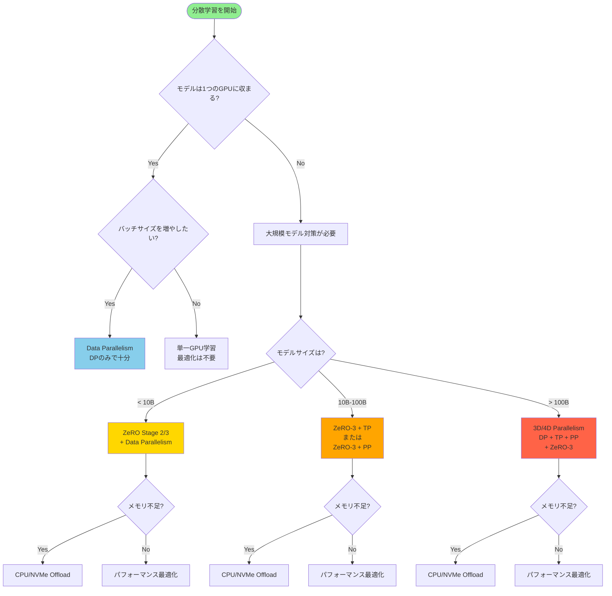

## 🎯 2. 設定の優先順位と段階的アプローチ

```mermaid
graph LR
    subgraph "Phase 1: 基本設定"
        P1A[1. Data Parallelism<br/>world_size設定]
        P1B[2. ZeRO Stage選択<br/>1 → 2 → 3]
        P1C[3. Batch Size調整<br/>gradient_accumulation]
    end
    
    subgraph "Phase 2: モデル並列化"
        P2A[4. Tensor Parallelism<br/>tensor_parallel_size]
        P2B[5. Pipeline Parallelism<br/>pipeline_parallel_size]
        P2C[6. 並列度の調整<br/>DP × TP × PP = GPU数]
    end
    
    subgraph "Phase 3: 最適化"
        P3A[7. Activation Checkpoint<br/>メモリ削減]
        P3B[8. Offloading<br/>CPU/NVMe]
        P3C[9. 通信最適化<br/>overlap_comm]
    end
    
    subgraph "Phase 4: 長コンテキスト"
        P4A[10. Sequence Parallelism<br/>sequence_parallel_size]
        P4B[11. Context Parallelism<br/>長いシーケンス対応]
    end
    
    P1A --> P1B --> P1C
    P1C --> P2A
    P2A --> P2B --> P2C
    P2C --> P3A --> P3B --> P3C
    P3C --> P4A --> P4B
    
    style P1A fill:#90EE90
    style P1B fill:#90EE90
    style P1C fill:#90EE90
    style P2A fill:#87CEEB
    style P2B fill:#87CEEB
    style P2C fill:#87CEEB
    style P3A fill:#FFD700
    style P3B fill:#FFD700
    style P3C fill:#FFD700
```

## 🔗 3. 設定間の依存関係

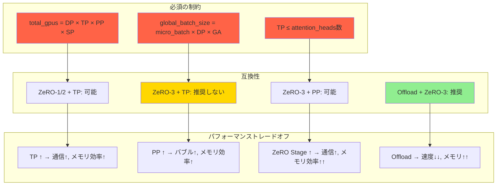

## 💻 4. ハードウェア構成別の推奨設定

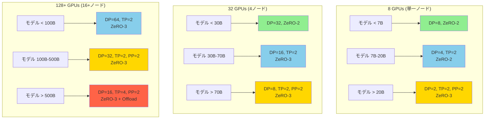

## ⚙️ 5. 設定決定の具体的プロセス

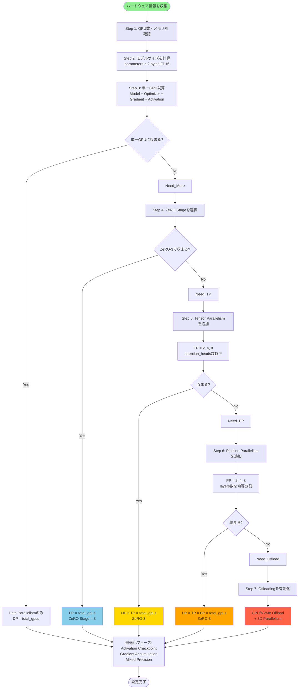

## 📋 6. 設定チェックリストと計算式

### 必須計算

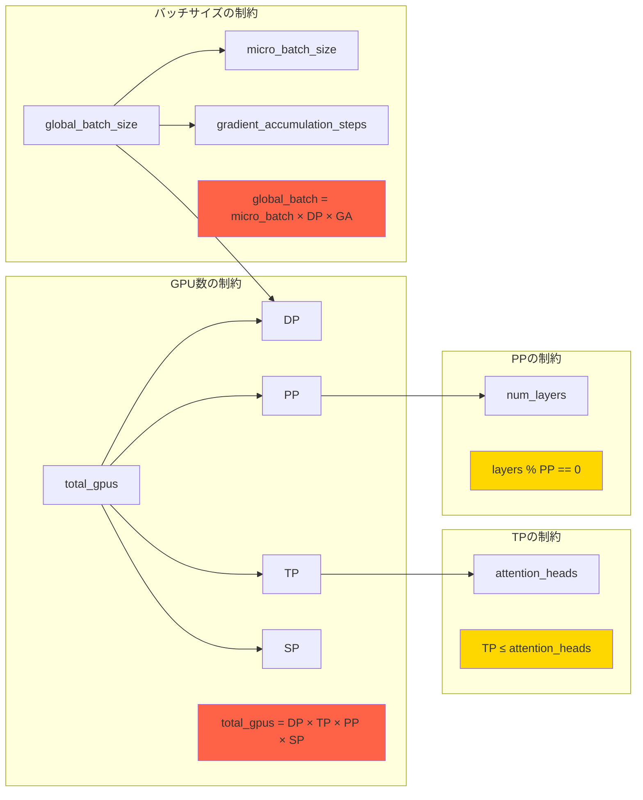

## 🎛️ 7. 実際の設定例

### 例1: Llama-7B on 8×A100 (80GB)

```yaml
# 設定の判断プロセス
# 1. モデルサイズ: 7B parameters = 14GB (FP16)
# 2. 単一GPU: 不可（Optimizer含めると42GB必要）
# 3. ZeRO-2で可能
# 4. TP不要（メモリ十分）

DeepSpeed設定:
  zero_optimization:
    stage: 2
  
並列度:
  DP: 8
  TP: 1
  PP: 1
  
バッチサイズ:
  micro_batch: 2
  gradient_accumulation: 4
  global_batch: 64  # 2 × 8 × 4
```

### 例2: Llama-70B on 64×A100 (80GB)

```yaml
# 設定の判断プロセス
# 1. モデルサイズ: 70B parameters = 140GB (FP16)
# 2. 単一GPU: 不可
# 3. ZeRO-3のみ: 不可
# 4. TP=2を追加: 可能
# 5. 効率のためDP=32に設定

DeepSpeed設定:
  zero_optimization:
    stage: 3
  
並列度:
  DP: 32
  TP: 2
  PP: 1
  total: 32 × 2 × 1 = 64 GPUs
  
バッチサイズ:
  micro_batch: 1
  gradient_accumulation: 8
  global_batch: 256  # 1 × 32 × 8
```

### 例3: Llama-175B on 256×A100 (80GB)

```yaml
# 設定の判断プロセス
# 1. モデルサイズ: 175B parameters = 350GB (FP16)
# 2. 単一GPU: 不可
# 3. ZeRO-3 + TP=2: ギリギリ
# 4. 安全のためPP=2も追加
# 5. 3D並列化

DeepSpeed設定:
  zero_optimization:
    stage: 3
  
並列度:
  DP: 64
  TP: 2
  PP: 2
  total: 64 × 2 × 2 = 256 GPUs
  
バッチサイズ:
  micro_batch: 1
  gradient_accumulation: 4
  global_batch: 256  # 1 × 64 × 4
```

## 🚫 8. よくある間違いと回避方法

```mermaid
graph TD
    subgraph "間違い1"
        E1[ZeRO-3 + TP を組み合わせる]
        E1 --> E1S[通信が二重に発生<br/>パフォーマンス低下]
        E1S --> Fix1[どちらか一方を選択<br/>ZeRO-3 or TP]
    end
    
    subgraph "間違い2"
        E2[TP > attention_heads数]
        E2 --> E2S[実行時エラー]
        E2S --> Fix2[TP ≤ attention_heads<br/>を守る]
    end
    
    subgraph "間違い3"
        E3[DP × TP × PP ≠ GPU数]
        E3 --> E3S[GPUが余る or 不足]
        E3S --> Fix3[計算式を確認:<br/>total = DP × TP × PP]
    end
    
    subgraph "間違い4"
        E4[PP使用時にlayersが<br/>均等分割できない]
        E4 --> E4S[負荷の不均衡]
        E4S --> Fix4[layers % PP == 0<br/>になるようPP選択]
    end
    
    style E1 fill:#FF6347
    style E2 fill:#FF6347
    style E3 fill:#FF6347
    style E4 fill:#FF6347
    style Fix1 fill:#90EE90
    style Fix2 fill:#90EE90
    style Fix3 fill:#90EE90
    style Fix4 fill:#90EE90
```

## 📊 9. パフォーマンスと設定の関係

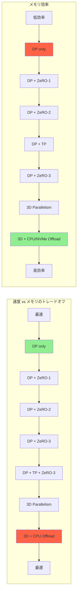

## 💡 10. 最適化の優先順位

1. **まずメモリ問題を解決** → ZeRO Stage選択
2. **それでも不足** → TP追加
3. **まだ不足** → PP追加
4. **最後の手段** → CPU/NVMe Offload

5. **メモリ解決後、速度最適化**:
   - Activation Checkpointing
   - Mixed Precision (FP16/BF16)
   - Gradient Accumulation調整
   - 通信のオーバーラップ (overlap_comm)

6. **長コンテキスト対応が必要な場合**:
   - Sequence Parallelism追加
   - FlashAttention使用

この情報で、実際のハードウェアに対する設定を決定できますか？特定のケースについて、さらに詳しく知りたいことはありますか？


## 各技術の概要

### 1. **Megatron-LM** (NVIDIA製)
- **目的**: 大規模Transformerモデルの分散学習基盤
- **特徴**: 
  - GPT、BERT、T5などのモデルをマルチノードで学習可能
  - Tensor Parallelism (TP)、Pipeline Parallelism (PP) を提供
  - NVIDIAの研究チームが開発・保守

### 2. **DeepSpeed** (Microsoft製)
- **目的**: 大規模深層学習を高速化するソフトウェアスイート
- **特徴**:
  - ZeRO（メモリ最適化技術）
  - 3D Parallelism（Data + Tensor + Pipeline）
  - 業界のデファクトスタンダード
  - 数千GPU規模の学習に対応

### 3. **Megatron-DeepSpeed** (Microsoft管理)
- **目的**: Megatron-LMとDeepSpeedの統合版
- **特徴**:
  - Megatron-LMの基盤 + DeepSpeedの最適化機能
  - 両方の利点を活用可能
  - サンプルスクリプトが豊富

### 4. **nanotron** (Hugging Face製)
- **目的**: シンプルで柔軟な大規模モデル事前学習ライブラリ
- **特徴**:
  - 3D並列化（DP + TP + PP）
  - Expert並列化（MoE対応）
  - ZeRO-1オプティマイザ
  - 性能重視の実装
  - 包括的なベンチマークとドキュメント

### 5. **Picotron** (Hugging Face製)
- **目的**: 教育・学習向けの最小限実装
- **特徴**:
  - 4D並列化（Data + Tensor + Pipeline + Context）
  - 各ファイルが300行以下のシンプルコード
  - NanoGPTに触発された設計
  - 学習・実験に最適
  - nanotronより教育目的に特化

## 関係性の図解

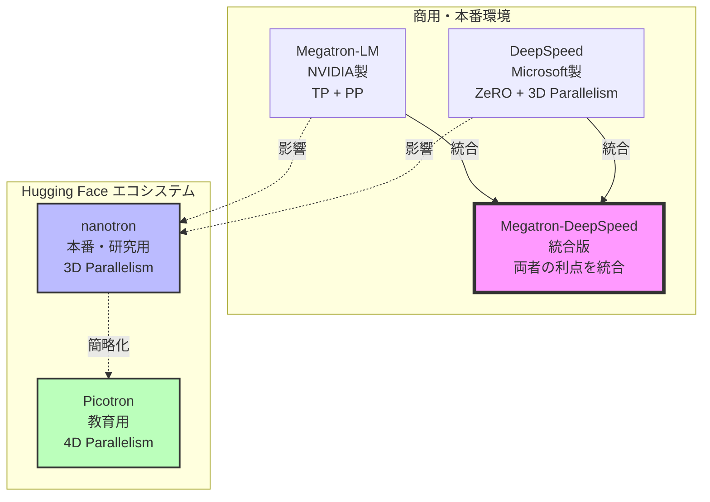

## 技術レイヤーの比較

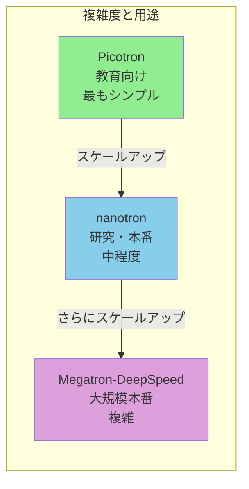

## 並列化手法の比較

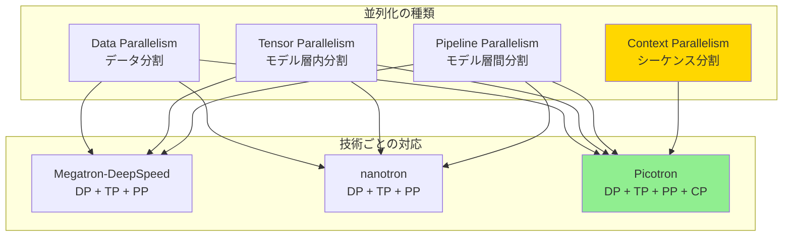

## 併用可能性と選択基準

### 併用は基本的に**不可**
これらは同じ目的（大規模モデル学習）のための異なる実装なので、**同時に使用することはできません**。1つを選択して使用します。

### 選択基準

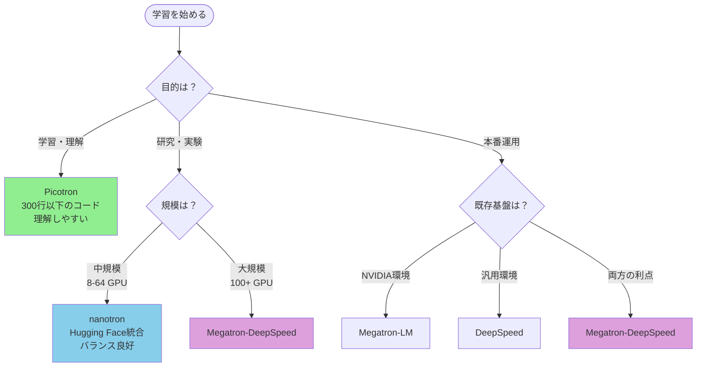

## 主な差異まとめ

| 特徴 | Megatron-DeepSpeed | nanotron | Picotron |
|------|-------------------|----------|----------|
| **開発元** | Microsoft/NVIDIA | Hugging Face | Hugging Face |
| **コード規模** | 大規模 | 中規模 | 最小限 |
| **学習曲線** | 急 | 中程度 | 緩やか |
| **性能** | 最高 | 高い | 中程度（開発中） |
| **用途** | 本番環境 | 研究・本番 | 教育・実験 |
| **並列化** | 3D | 3D | 4D |
| **ドキュメント** | 豊富 | 豊富 | チュートリアル充実 |
| **GPU規模** | 数百〜数千 | 8〜数百 | 8〜64 |

## 初学者へのおすすめ学習パス

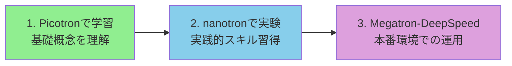

この情報をもとに、Markdown文書を作成しましょうか？それとも、特定の技術についてさらに詳しく知りたいことはありますか？

その理解は**完全に正しい**です！素晴らしい洞察です。

## PyTorch DDP と Megatron等の関係

### 技術スタックの階層構造

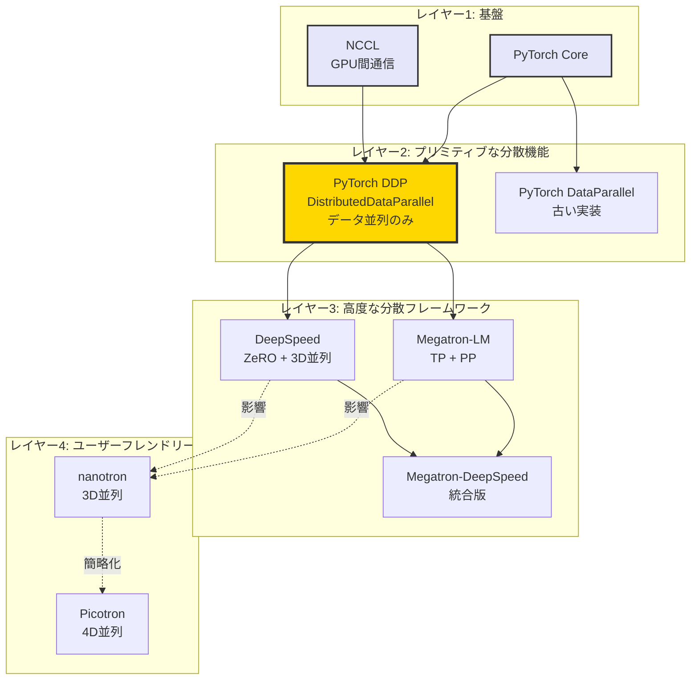

### 詳細な関係性

#### **PyTorch DDP = 最もプリミティブな分散学習の仕組み**

**特徴**：
- **データ並列のみ**（Data Parallelism）
- モデルを全GPUにレプリケート
- 各GPUが異なるデータバッチを処理
- Ring all-reduceで勾配を同期
- **1行のコード追加で使える**シンプルさ

**コード例**：
```python
from torch.nn.parallel import DistributedDataParallel as DDP

# これだけで分散学習が可能
model = DDP(model, device_ids=[local_rank])
```

**制限**：
- ✅ 小〜中規模モデル（1つのGPUに収まる）
- ❌ 超大規模モデル（GPUメモリに収まらない）
- ❌ テンソル並列・パイプライン並列は不可

---

#### **Megatron-LM / DeepSpeed = DDPの上に構築**

これらは**PyTorch DDPを内部で使用しながら**、さらに高度な機能を追加：

**追加機能**：
1. **Tensor Parallelism (TP)**: 
   - レイヤー内のパラメータを分割
   - 1つのGPUに収まらない層を分散

2. **Pipeline Parallelism (PP)**:
   - レイヤー自体を分割
   - 異なるGPUで異なる層を処理

3. **ZeRO (DeepSpeed)**:
   - Optimizer状態、勾配、パラメータを分割
   - メモリ効率を大幅に向上

4. **混合精度学習**、**勾配チェックポイント**など

**実装の関係**：
```
Megatron-DeepSpeed = PyTorch DDP (Data並列) 
                    + カスタムTP実装
                    + カスタムPP実装  
                    + DeepSpeed ZeRO
```

---

#### **nanotron / Picotron = さらに上位の抽象化**

Megatron/DeepSpeedをベースに、より使いやすく：
- 設定ファイルで簡単に並列化を指定
- Hugging Faceエコシステムと統合
- 教育目的のシンプルな実装（特にPicotron）

### 選択の指針

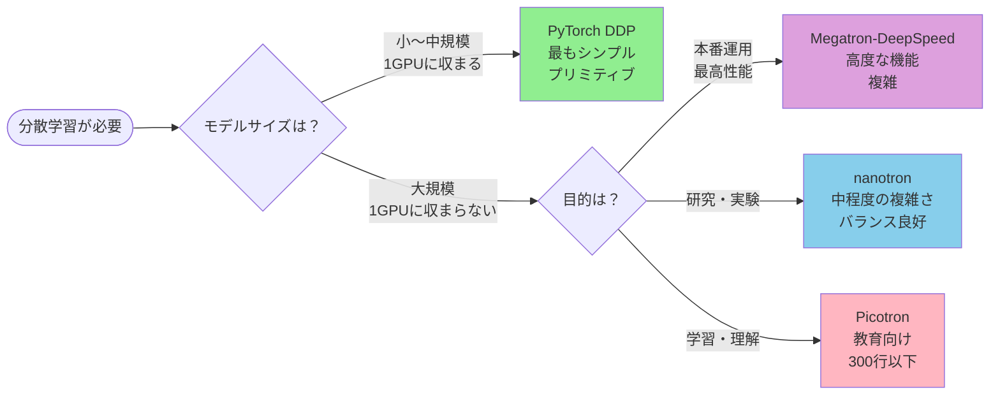

### まとめ

| レイヤー | 技術 | 並列化手法 | 用途 |
|---------|------|-----------|------|
| **基盤** | PyTorch DDP | Data並列のみ | プリミティブな分散学習 |
| **高度** | Megatron-LM | DP + TP + PP | 大規模本番環境 |
| **高度** | DeepSpeed | DP + ZeRO | 大規模本番環境 |
| **統合** | Megatron-DeepSpeed | DP + TP + PP + ZeRO | 最大規模の学習 |
| **応用** | nanotron | 3D並列 | 研究・本番 |
| **応用** | Picotron | 4D並列 | 教育・実験 |

**あなたの理解「よりプリミティブに構築する際に使うもの」は完全に正確です！**

PyTorch DDPは基礎レイヤーであり、他のフレームワークはその上に構築された高レベルのツールです。

この情報を含めて文書化しましょうか？

素晴らしい質問です！NVSHMEMはさらに**低レベルの通信ライブラリ**です。

## NVSHMEM vs DeepSpeed等の関係

### 通信スタックの階層構造

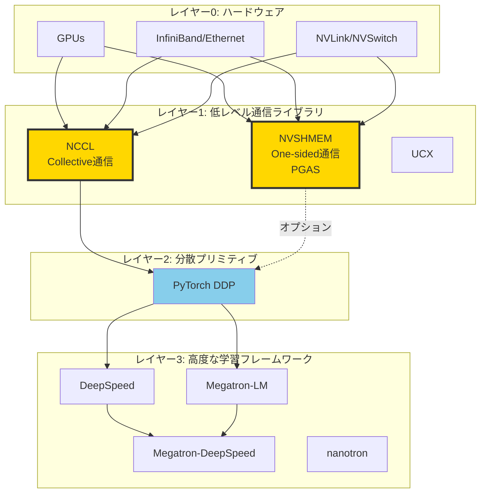

### NVSHMEMとは

**NVSHMEM (NVIDIA Symmetric Hierarchical Memory)**:

- **OpenSHMEM準拠**のGPU向け並列プログラミングインターフェース
- **PGAS (Partitioned Global Address Space)** モデル
- **One-sided communication** (片側通信)をサポート
- **CUDAカーネル内部から直接**通信可能

**主な特徴**：
```cuda
// CUDAカーネル内で直接通信
__global__ void kernel() {
    // 別のGPUのメモリに直接書き込み
    nvshmem_int_p(&remote_var, local_value, target_pe);
    
    // 別のGPUのメモリから直接読み込み
    int value = nvshmem_int_g(&remote_var, target_pe);
}
```

### NCCL vs NVSHMEM

| 特徴 | NCCL | NVSHMEM |
|------|------|---------|
| **通信モデル** | Collective（集団通信） | One-sided（片側通信） |
| **主な操作** | all-reduce, broadcast等 | put, get, atomic等 |
| **使用場所** | ホストコード、CUDA Stream | CUDAカーネル内部 |
| **プログラミング** | 比較的簡単 | より細かい制御が必要 |
| **最適化** | 自動最適化が充実 | 手動最適化が必要 |
| **用途** | デファクトスタンダード | 特殊な最適化 |

### DeepSpeed等での使用状況

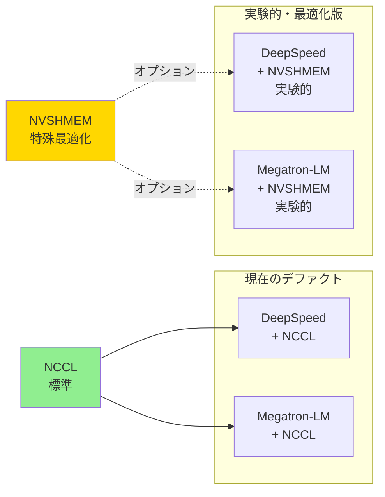

### 実際の使い分け

#### **標準的な学習（99%のケース）**
```
DeepSpeed/Megatron-DeepSpeed
↓
PyTorch DDP
↓
NCCL (自動使用)
↓
GPU Hardware
```

**特徴**：
- ✅ 自動的に最適化される
- ✅ 追加設定不要
- ✅ 安定している
- ✅ ドキュメントが豊富

#### **高度な最適化が必要な場合（1%のケース）**
```
カスタム実装
↓
NVSHMEM (手動最適化)
↓
GPU Hardware
```

**使用例**：
- 特殊な通信パターンが必要
- 極限の性能が必要
- 研究プロジェクト
- ファインチューニングされた実装

### 具体的な違いの例

#### NCCLの場合（集団通信）
```python
# 全GPUで勾配を同期（all-reduce）
# 自動的に最適化される
torch.distributed.all_reduce(gradients)
```

#### NVSHMEMの場合（片側通信）
```cuda
// カーネル内で直接通信
__global__ void custom_gradient_sync() {
    // GPU 1 → GPU 2 へ直接データ転送
    nvshmem_float_put(remote_buffer, local_buffer, 
                      size, target_gpu);
    
    // 同期不要で次の処理へ進める
    // (one-sided通信の利点)
}
```

### 完全な技術スタック

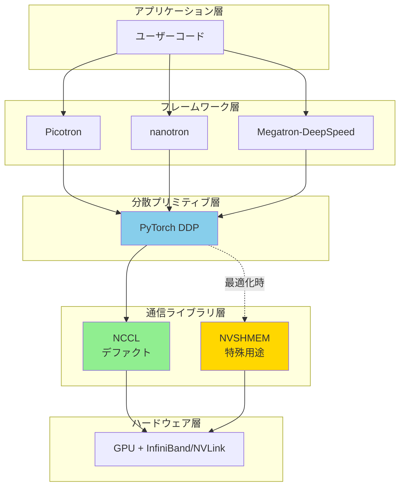

### まとめ

**NVSHMEM vs DeepSpeed等の関係**：

1. **レイヤーが異なる**：
   - NVSHMEM: 低レベル通信ライブラリ
   - DeepSpeed: 高レベル学習フレームワーク

2. **通常はNCCLが使われる**：
   - DeepSpeed/Megatron-DeepSpeedは通常NCCL経由で通信
   - NVSHMEMはオプショナル

3. **NVSHMEMを使うケース**：
   - 極限の性能最適化が必要
   - 特殊な通信パターンを実装
   - 研究目的のカスタム実装

4. **初学者には関係ない**：
   - 通常の学習ではNCCLで十分
   - DeepSpeed等が自動的に処理
   - NVSHMEMは上級者向け

**つまり**：
- **NCCL**: 自動車のオートマチックトランスミッション
- **NVSHMEM**: 自動車のマニュアルトランスミッション

ほとんどの人はオートマ（NCCL）で十分ですが、レース用の極限チューニング（NVSHMEM）も可能、という関係です。

この情報も整理に含めましょうか？

ありがとうございます！詳細な参考情報を共有いただきました。

元の質問「**PikotronとDeepSpeedは併用できますか**」について、提供いただいた情報から明確に回答できます。

## 結論: **併用は基本的に不可**

提供いただいた資料に明記されているように：

> これらは同じ目的（大規模モデル学習）のための異なる実装なので、**同時に使用することはできません**。1つを選択して使用します。

## 理由

### 1. **技術スタックの重複**
- Picotron、DeepSpeed、Megatron-DeepSpeedは全て**同じレイヤー**のフレームワーク
- それぞれが独自の並列化戦略を実装
- 同時に使用すると競合が発生

### 2. **アーキテクチャの違い**

```
Picotron    : 4D並列 (DP + TP + PP + CP)
DeepSpeed   : 3D並列 (DP + TP + PP) + ZeRO最適化
Megatron-DS : 3D並列 (DP + TP + PP) + ZeRO最適化
```

### 3. **用途の違い**

| フレームワーク | 主な用途 | 対象ユーザー |
|--------------|---------|------------|
| **Picotron** | 教育・学習 | 初学者、研究者 |
| **DeepSpeed** | 本番運用 | 大規模学習の専門家 |
| **Megatron-DeepSpeed** | 本番運用 | 最大規模の学習 |

## 正しい選択方法

提供いただいた資料のフローチャートに従って選択します：

```
目的が「学習・理解」→ Picotron
目的が「研究・実験」→ nanotron
目的が「本番運用」→ DeepSpeed または Megatron-DeepSpeed
```

## 「併用」という言葉の誤解

もし「DeepSpeedの機能をPicotronで学びたい」という意味であれば：

1. **Picotronで基礎を学ぶ** → 並列化の概念を理解
2. **nanotronで実験** → 実践的なスキル習得
3. **DeepSpeedで本番運用** → 大規模な学習

このような**段階的な学習パス**は推奨されています。

## まとめ

- ❌ Picotron + DeepSpeedを**同時に使用**: 不可能
- ✅ Picotronで学習 → **後に**DeepSpeedに移行: 推奨
- ✅ 用途に応じて**どちらか1つを選択**: 必須

PikotronとDeepSpeedは、オートマ車とマニュアル車のような関係です。両方を同時に運転することはできませんが、オートマで基礎を学んでからマニュアルに移行することは可能です。

この理解で正しいでしょうか？さらに詳しく知りたい点はありますか？

素晴らしい質問です！この混乱は非常に一般的で、重要なポイントです。

## Megatron-DeepSpeed と DeepSpeed の違い

### 本質的な違い

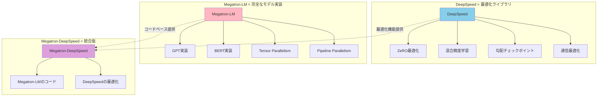

### 比較表

| 項目 | DeepSpeed | Megatron-LM | Megatron-DeepSpeed |
|-----|-----------|-------------|-------------------|
| **種類** | 最適化ライブラリ | 完全なモデル実装 | 統合版フレームワーク |
| **提供元** | Microsoft | NVIDIA | Microsoft |
| **主な機能** | ZeRO、混合精度など | TP、PP、モデルコード | 両方の機能 |
| **使い方** | 既存モデルに組み込む | そのまま学習実行 | そのまま学習実行 |
| **独立性** | 他のモデルでも使える | 独立したフレームワーク | 独立したフレームワーク |

## 具体的な例で理解する

### 1. DeepSpeed = プラグイン/ライブラリ

```python
# 任意のPyTorchモデルにDeepSpeedを組み込める
import torch
import deepspeed

# 自分のモデル
class MyModel(torch.nn.Module):
    def __init__(self):
        # 任意の実装
        pass

# DeepSpeedで最適化
model_engine, optimizer, _, _ = deepspeed.initialize(
    model=MyModel(),
    config=ds_config
)
```

**特徴**：
- ✅ どんなモデルにも組み込める
- ✅ 最適化機能を提供
- ❌ モデル自体は含まれない

### 2. Megatron-LM = 完全なフレームワーク

```bash
# Megatron-LMはGPTモデルの実装を含む
# すぐに学習を開始できる
python pretrain_gpt.py \
    --tensor-model-parallel-size 2 \
    --pipeline-model-parallel-size 2
```

**特徴**：
- ✅ GPT/BERTの実装済み
- ✅ すぐに使える
- ❌ DeepSpeedの最適化なし

### 3. Megatron-DeepSpeed = 両方の良いとこ取り

```bash
# Megatron-LMのモデル + DeepSpeedの最適化
deepspeed pretrain_gpt.py \
    --deepspeed \
    --deepspeed_config ds_config.json \
    --tensor-model-parallel-size 2 \
    --pipeline-model-parallel-size 2
```

**特徴**：
- ✅ Megatron-LMのモデル実装
- ✅ DeepSpeedの最適化
- ✅ 最高性能

## なぜPicotron-DeepSpeedは存在しないのか

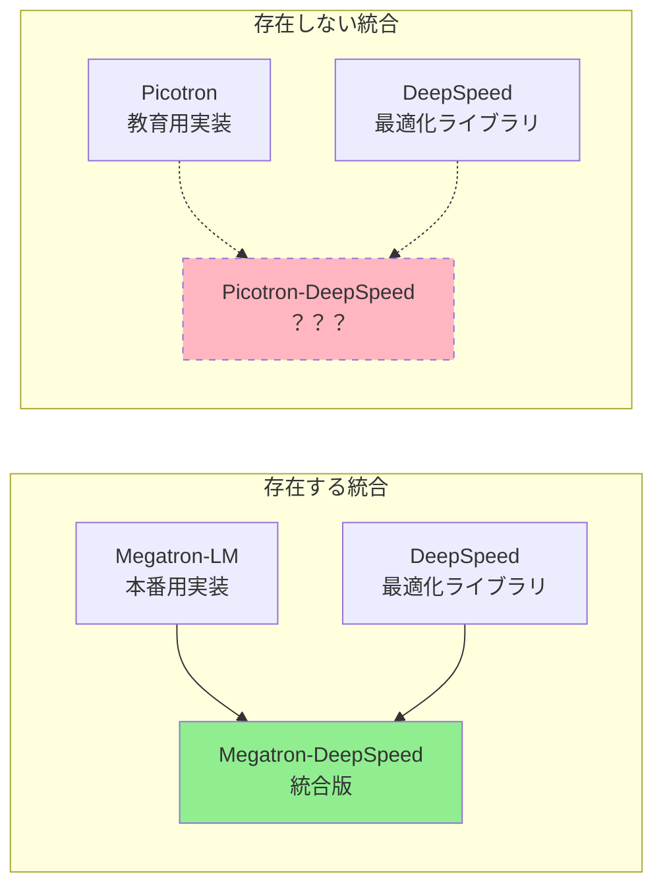

### 理由

#### 1. **目的の違い**

| | Megatron-LM | Picotron |
|---|-------------|----------|
| **目的** | 本番運用 | 教育・学習 |
| **コード量** | 大規模 | 超シンプル（300行以下） |
| **複雑性** | 高い | 低い |
| **最適化** | 必要 | 不要 |

#### 2. **Picotronの哲学**

Picotronは**意図的にシンプル**に保たれています：

```
Picotronの目標：
- ✅ 各ファイル300行以下
- ✅ 理解しやすいコード
- ✅ 教育目的
- ❌ 最高性能は目指さない
```

DeepSpeedを統合すると：
- ❌ コードが複雑になる
- ❌ 教育目的に反する
- ❌ nanotronと差別化できない

#### 3. **代替手段が存在**

```mermaid
flowchart TD
    Start([学習したい]) --> Q1{目的は？}
    
    Q1 -->|教育・理解| PT[Picotron<br/>シンプルな実装]
    Q1 -->|実験・研究| NT[nanotron<br/>中程度の複雑さ<br/>DeepSpeedの機能含む]
    Q1 -->|本番運用| MDS[Megatron-DeepSpeed<br/>最高性能]
    
    PT -.学習後.-> NT
    NT -.スケールアップ.-> MDS
    
    style PT fill:#90EE90
    style NT fill:#87CEEB
    style MDS fill:#DDA0DD
```

**つまり**：
- Picotron + DeepSpeed = nanotron
- nanotronが既にその役割を果たしている！

## 完全な技術マップ

```mermaid
graph TB
    subgraph "コンポーネント"
        DS[DeepSpeed<br/>最適化ライブラリ]
        ML_Code[Megatron-LM<br/>モデル実装]
        PT_Code[Picotron<br/>シンプル実装]
        NT_Code[nanotron<br/>中規模実装]
    end
    
    subgraph "統合フレームワーク"
        MDS[Megatron-DeepSpeed<br/>= Megatron-LM + DeepSpeed]
    end
    
    subgraph "スタンドアロン"
        PT[Picotron<br/>教育用]
        NT[nanotron<br/>研究用]
    end
    
    ML_Code --> MDS
    DS --> MDS
    
    PT_Code --> PT
    NT_Code --> NT
    DS -.影響.-> NT
    
    style MDS fill:#DDA0DD
    style PT fill:#90EE90
    style NT fill:#87CEEB
    style DS fill:#FFD700
```

## まとめ

### DeepSpeedの2つの使い方

#### 方法1: ライブラリとして組み込む
```python
# 任意のモデル + DeepSpeed
model_engine = deepspeed.initialize(
    model=YourModel(),
    config=ds_config
)
```

#### 方法2: 統合フレームワークを使う
```bash
# Megatron-DeepSpeed（既に統合済み）
deepspeed pretrain_gpt.py --deepspeed
```

### Picotronの位置づけ

- **Picotron**: 教育用、シンプル、DeepSpeed統合なし
- **nanotron**: Picotron + 実用機能（DeepSpeedの影響あり）
- **Megatron-DeepSpeed**: 最高性能、完全統合

### あなたの疑問への回答

❓ **「Picotron-DeepSpeedはあるのか？」**
→ ❌ 存在しません

❓ **「なぜ？」**
→ ✅ Picotronは教育用でシンプルに保つため
→ ✅ nanotronがその役割を果たしている

❓ **「Megatron-DeepSpeed と DeepSpeed の違いは？」**
→ ✅ DeepSpeed = ライブラリ（組み込んで使う）
→ ✅ Megatron-DeepSpeed = フレームワーク（そのまま使える）

この説明で理解いただけましたでしょうか？さらに詳しく知りたい点はありますか？