## はじめに

:::message
**記事の目的**: この記事では、Pipeline Parallelism の基本概念から最新のスケジューリング戦略（GPipe, 1F1B, Interleaved 1F1B, Zero Bubble, DualPipe）までを解説します。前章の Transformer 分散並列化で言及した Pipeline Parallelism について、詳細に学びます。
:::

::::details 本章を読む上での前提

本記事を理解するために、以下の知識があることを前提としています。

- 前章「Transformer の分散並列化」の基礎知識
- ニューラルネットワークの訓練・推論の基本概念
- GPU による並列計算の基礎

一方、以下の知識は**前提としていません**。

- Pipeline Parallelism の詳細な実装経験
- 各スケジューリング戦略の実装の詳細

### 用語

| 用語 | 説明 |
|------|------|
| **Stage** | パイプライン並列化で、モデルを分割した各部分 |
| **Microbatch** | バッチを細かく分割した単位。パイプラインで並列処理される |
| **Bubble** | GPU がアイドル状態になる時間。パイプライン効率の低下を示す |
| **Forward (F)** | 順伝播。入力から出力への計算 |
| **Backward (B)** | 逆伝播。勾配計算のための逆方向の計算 |
| **Weight Update (W)** | パラメータ更新。計算した勾配を使って重みを更新 |
| **B (dL/dx)** | 入力勾配。連鎖律により前ステージに伝播するため、ステージ間の依存関係がある |
| **W (dL/dw)** | 重み勾配。各ステージで独立して計算可能。空き時間に配置できる |
| **連鎖律（Chain Rule）** | 合成関数の微分の法則。逆伝播では、出力側から入力側へ順に勾配が伝播する |
| **ILP ソルバー** | 整数線形計画法を解く最適化ツール。ZB-H2 では最適なスケジュールを自動探索 |
| **勾配蓄積（Gradient Accumulation）** | 各マイクロバッチの勾配を足し合わせ、全マイクロバッチ完了後に 1 回の重み更新を行う手法 |

::::

前章では Transformer の分散並列化における 6 つの戦略と集団通信の全体像を解説しました。本章では、その中でも特に奥が深い**パイプライン並列化（Pipeline Parallelism, PP）**に焦点を当て、各スケジューリング戦略を詳しく解説します。

パイプライン並列化は、モデルを**層（レイヤー）方向に分割**し、複数のデバイスに配置する手法です。Tensor Parallel が 1 つの層の中の行列演算を分割するのに対し、Pipeline Parallel はモデル全体を層のブロック単位で分割します。

:::message
本記事は [ailzhang.github.io の記事](https://ailzhang.github.io/posts/pipeline-parallelism-demystified/) の内容を参考に、論文の検証を加えて日本語で再構成したものです。
:::

---

## 前提知識 -- パイプライン並列化の基本要素

パイプライン並列化を理解する上で、以下の 3 つの基本要素を押さえる必要があります。

| 要素 | 記号 | 意味 |
|------|------|------|
| Forward | F | 順伝播。入力から出力への計算 |
| Backward（入力勾配） | B | 逆伝播の入力勾配計算。連鎖律により前ステージに伝播する |
| Backward（重み勾配） | W | 逆伝播の重み勾配計算。各ステージで独立して計算可能 |

### F, B, W の実行フロー

以下の図は、1 つのマイクロバッチが 1 つのステージを通過する際の処理フローを示します。


### B と W の依存関係の違い

**B（入力勾配）**:
- 連鎖律により、前のステージに勾配を渡す必要がある
- ステージ間の依存関係があるため、逐次実行が必要
- 数式: $\frac{\partial L}{\partial x} = \frac{\partial L}{\partial y} \cdot \frac{\partial y}{\partial x}$

**W（重み勾配）**:
- ステージ内のパラメータの勾配を計算するだけ
- 他のステージとのデータのやり取りが不要
- 独立して実行可能（空き時間に配置できる）
- 数式: $\frac{\partial L}{\partial w} = \frac{\partial L}{\partial y} \cdot \frac{\partial y}{\partial w}$

:::message
この B と W の依存関係の違いが、Zero Bubble の設計の核心です。W が独立していることを利用して、バブル時間に W を配置することでパイプライン効率を改善します。
:::

---

## パイプライン並列化の基本概念

### ステージとマイクロバッチ

パイプライン並列化の 2 つの基本概念を押さえましょう。

**ステージ（Stage）**: モデルを層方向に分割した各ブロックです。例えば 24 層のモデルを 4 GPU に分割する場合、各 GPU は 6 層ずつを担当します。

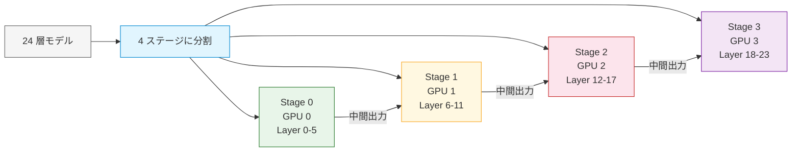

**マイクロバッチ（Microbatch）**: ミニバッチ（1 回の重み更新で使用するデータの単位）をさらに小さく分割したものです。パイプラインの並列度を高めるために使用されます。

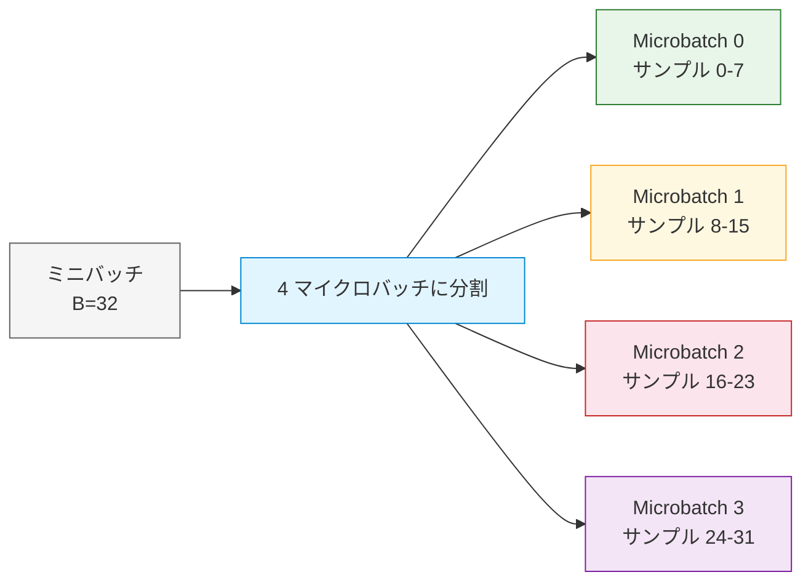

:::message
**重み更新のタイミング**: すべてのパイプラインスケジュール（GPipe, 1F1B, Zero Bubble など）では、**勾配蓄積（gradient accumulation）** を使用します。各マイクロバッチで計算された勾配を足し合わせ、全マイクロバッチの処理完了後にまとめて 1 回の重み更新を行います。これにより、ミニバッチ全体を一度に処理したのと同じ効果が得られます。
:::

### パイプラインバブル -- 最大の課題

パイプライン並列化の最大の課題が**パイプラインバブル（Pipeline Bubble）**です。バブルとは、GPU がアイドル状態になる時間のことを指します。

素朴にモデルを分割して逐次実行すると、ある GPU が計算している間、他の GPU は待機状態になります。

```mermaid
gantt
    title Naive Model Parallel -- ステージ間の逐次実行
    dateFormat X
    axisFormat %s

    section GPU 0
    F0       : f00, 0, 1
    idle     : crit, i00, 1, 7
    B0       : b00, 7, 8

    section GPU 1
    idle     : crit, i10, 0, 1
    F0       : f10, 1, 2
    idle     : crit, i11, 2, 6
    B0       : b10, 6, 7
    idle     : crit, i12, 7, 8

    section GPU 2
    idle     : crit, i20, 0, 2
    F0       : f20, 2, 3
    idle     : crit, i21, 3, 5
    B0       : b20, 5, 6
    idle     : crit, i22, 6, 8

    section GPU 3
    idle     : crit, i30, 0, 3
    F0       : f30, 3, 4
    B0       : b30, 4, 5
    idle     : crit, i31, 5, 8
```

F = Forward, B = Backward, 数字 = マイクロバッチ番号（各記号の詳細は前節「前提知識」を参照）。赤色の idle 部分がパイプラインバブル（待機時間）です。Forward は GPU 0 -> 1 -> 2 -> 3 と順に実行され、Backward は GPU 3 -> 2 -> 1 -> 0 と逆順に実行されます。

この非効率を解消するために、様々なスケジューリング戦略が提案されてきました。

### バブル率の定義

バブル率は、パイプラインの効率を測る指標です。以下のように定義されます。

```
バブル率 = (全 GPU の総アイドル時間) / (全 GPU の総実行可能時間)
```

理想的にはバブル率 0（全 GPU が常に稼働）ですが、実際にはステージ間の依存関係により一定のバブルが発生します。以降の節で、各スケジューリング戦略がこのバブル率をどのように削減するかを見ていきます。

---

## スケジューリング戦略の概要

本記事では、以下のスケジューリング戦略を解説します。

| 戦略 | バブル率 | 主な特徴 | メモリ効率 |
|------|---------|---------|----------|
| GPipe | $O(\frac{p-1}{m})$ | 最もシンプル。全 F 完了後に全 B を実行 | 低い（全マイクロバッチを保持） |
| 1F1B | $O(\frac{p-1}{m})$ | F と B を交互に実行。メモリ効率改善 | 中程度 |
| Interleaved 1F1B | $O(\frac{p-1}{mv})$ | 各ステージを v 個の仮想ステージに分割 | 中程度 |
| Zero Bubble (ZB-H1) | 1F1B の約 2/3 | B と W を分離し、W を空き時間に配置 | 中程度（1F1B 同等） |
| Zero Bubble (ZB-H2) | ほぼゼロ | ILP ソルバーで最適スケジュールを探索 | 低い（1F1B の約 2 倍） |
| Zero Bubble (ZB-V) | ZB-H1 相当 | V 字型配置で W を最適化 | 中程度（1F1B 同等） |
| DualPipe | 係数が p/2-1 に半減 | 双方向パイプライン + 計算通信重畳 | 低い（1F1B の約 2 倍） |
| Eager 1F1B | $O(\frac{p-1}{m})$（通信隠蔽） | 通信と計算の早期重なり | 中程度 |

各戦略の詳細は、以降のセクションで解説します。

---

## スケジューリング戦略の 2 つの系統 -- BFS と DFS

パイプラインスケジューリングを理解する上で重要な概念が、**BFS（Breadth-First Scheduling）** と **DFS（Depth-First Scheduling）** の 2 つの系統です。

### BFS（幅優先スケジューリング）

BFS では、**全マイクロバッチの順伝播を先に完了**してから、逆伝播を開始します。GPipe がこの方式を採用しています。

```mermaid
gantt
    title BFS -- 全マイクロバッチの Forward を先に実行
    dateFormat X
    axisFormat %s

    section GPU 0
    F0   : f00, 0, 1
    F1   : f01, 1, 2
    F2   : f02, 2, 3
    F3   : f03, 3, 4
    idle : crit, i00, 4, 7
    B3   : b03, 7, 8
    B2   : b02, 8, 9
    B1   : b01, 9, 10
    B0   : b00, 10, 11

    section GPU 1
    F0   : f10, 1, 2
    F1   : f11, 2, 3
    F2   : f12, 3, 4
    F3   : f13, 4, 5
    idle : crit, i10, 5, 8
    B3   : b13, 8, 9
    B2   : b12, 9, 10
    B1   : b11, 10, 11
    B0   : b10, 11, 12

    section GPU 2
    F0   : f20, 2, 3
    F1   : f21, 3, 4
    F2   : f22, 4, 5
    F3   : f23, 5, 6
    idle : crit, i20, 6, 9
    B3   : b23, 9, 10
    B2   : b22, 10, 11
    B1   : b21, 11, 12
    B0   : b20, 12, 13

    section GPU 3
    F0   : f30, 3, 4
    F1   : f31, 4, 5
    F2   : f32, 5, 6
    F3   : f33, 6, 7
    B3   : b33, 7, 8
    B2   : b32, 8, 9
    B1   : b31, 9, 10
    B0   : b30, 10, 11
```

**特徴**:
- 実装がシンプル
- 全マイクロバッチの中間アクティベーションを保持する必要があるため、メモリ使用量が大きい

### DFS（深さ優先スケジューリング）

DFS では、**順伝播と逆伝播を交互に実行**し、1 つのマイクロバッチの処理をできるだけ早く完了させます。1F1B がこの方式を採用しています。

```mermaid
gantt
    title DFS -- Forward と Backward を交互に実行
    dateFormat X
    axisFormat %s

    section GPU 0
    F0   : f00, 0, 1
    F1   : f01, 1, 2
    F2   : f02, 2, 3
    F3   : f03, 3, 4
    B0   : b00, 4, 5
    B1   : b01, 5, 6
    B2   : b02, 6, 7
    B3   : b03, 7, 8

    section GPU 1
    F0   : f10, 1, 2
    F1   : f11, 2, 3
    F2   : f12, 3, 4
    B0   : b10, 4, 5
    F3   : f13, 5, 6
    B1   : b11, 6, 7
    B2   : b12, 7, 8
    B3   : b13, 8, 9

    section GPU 2
    F0   : f20, 2, 3
    F1   : f21, 3, 4
    B0   : b20, 4, 5
    F2   : f22, 5, 6
    B1   : b21, 6, 7
    F3   : f23, 7, 8
    B2   : b22, 8, 9
    B3   : b23, 9, 10

    section GPU 3
    F0   : f30, 3, 4
    B0   : b30, 4, 5
    F1   : f31, 5, 6
    B1   : b31, 6, 7
    F2   : f32, 7, 8
    B2   : b32, 8, 9
    F3   : f33, 9, 10
    B3   : b33, 10, 11
```

**特徴**:
- 早期に逆伝播を開始するため、中間アクティベーションを早く解放でき、メモリ効率が良い
- 同時に保持するアクティベーション数が少ない

| 比較項目 | BFS (GPipe) | DFS (1F1B) |
|---------|-------------|------------|
| Forward の実行順序 | 全マイクロバッチを先に処理 | 逆伝播と交互に処理 |
| メモリ使用量 | 大（全アクティベーション保持） | 小（早期解放） |
| バブル率 | 同等 | 同等 |
| 代表的手法 | GPipe | PipeDream, Megatron 1F1B |

:::message
**注**: 上記の BFS/DFS の図は、スケジューリング方式の基本概念を示す簡略図です。実際のスケジュールでは、ウォームアップ（パイプラインへの投入）、定常状態、クールダウン（パイプラインからの排出）の 3 つのフェーズがあり、より複雑な配置になります。詳細は以降のセクション（GPipe, 1F1B など）で解説します。
:::

---

## GPipe -- BFS 方式の基本形

**提案**: [GPipe: Efficient Training of Giant Neural Networks using Pipeline Parallelism](https://arxiv.org/abs/1811.06965)（Huang et al., NeurIPS 2019）

:::message
**端的に言うと**: 全ての Forward を完了してから全ての Backward を実行する最もシンプルなスケジューリング。理解しやすいがメモリ効率が低い。
:::

論文では、バッチ分割によるパイプライン処理でほぼ線形のスピードアップを達成しています。

> GPipe partitions a model across different accelerators and automatically splits a mini-batch of training examples into smaller micro-batches, making it possible to achieve almost linear speedup when a model is partitioned across multiple accelerators.
>
> 出典: [GPipe: Efficient Training of Giant Neural Networks using Pipeline Parallelism](https://arxiv.org/abs/1811.06965)

### 動作原理

GPipe は BFS 方式を採用し、以下のように動作します。

1. ミニバッチを M 個のマイクロバッチに分割
2. 全マイクロバッチの順伝播を実行（パイプライン形式で順次投入）
3. 全順伝播が完了したら、逆伝播を実行
4. 勾配を蓄積し、全マイクロバッチの処理完了後に 1 回の重み更新を実行

```mermaid
gantt
    title GPipe スケジューリング (p=4 ステージ, m=4 マイクロバッチ)
    dateFormat X
    axisFormat %s

    section GPU 0
    F0     : f00, 0, 1
    F1     : f01, 1, 2
    F2     : f02, 2, 3
    F3     : f03, 3, 4
    idle   : crit, i00, 4, 7
    B3     : b03, 7, 8
    B2     : b02, 8, 9
    B1     : b01, 9, 10
    B0     : b00, 10, 11
    Update : done, u0, 11, 12

    section GPU 1
    F0     : f10, 1, 2
    F1     : f11, 2, 3
    F2     : f12, 3, 4
    F3     : f13, 4, 5
    idle   : crit, i10, 5, 8
    B3     : b13, 8, 9
    B2     : b12, 9, 10
    B1     : b11, 10, 11
    B0     : b10, 11, 12

    section GPU 2
    F0     : f20, 2, 3
    F1     : f21, 3, 4
    F2     : f22, 4, 5
    F3     : f23, 5, 6
    idle   : crit, i20, 6, 9
    B3     : b23, 9, 10
    B2     : b22, 10, 11
    B1     : b21, 11, 12
    B0     : b20, 12, 13

    section GPU 3
    F0     : f30, 3, 4
    F1     : f31, 4, 5
    F2     : f32, 5, 6
    F3     : f33, 6, 7
    B3     : b33, 7, 8
    B2     : b32, 8, 9
    B1     : b31, 9, 10
    B0     : b30, 10, 11
```

赤色の idle 部分がパイプラインバブルです。

::::details なぜ全 Forward を先に実行するのか

GPipe は実装のシンプルさを最優先した設計です。全 Forward を完了してから全 Backward を実行することで、以下の利点があります:

1. **実装とデバッグの容易さ**: Forward と Backward のフェーズが明確に分離されているため、コードの制御フローがシンプルで、問題の切り分けも容易です。
2. **勾配蓄積の自然な実装**: 全 Forward 完了後に一度だけ重み更新すればよいため、勾配蓄積のロジックがシンプルです。

一方、欠点として全マイクロバッチのアクティベーション（中間計算結果）を Backward まで保持する必要があり、メモリ使用量が O(m) と大きくなります。この「シンプルさとメモリ効率のトレードオフ」が、後続の 1F1B 方式の動機となりました。

::::

### バブル率

GPipe のバブル率は以下の通りです。

**なぜ (p-1) が係数になるのか**: 最初のマイクロバッチが Stage 0 で Forward を完了してから、Stage 1, 2, ..., p-1 を順に通過して最終ステージに到達するまでに (p-1) ステージ分の処理時間が必要です。この間、最初のステージは次のマイクロバッチを待つため、(p-1) 個のタイムスロット分のバブルが発生します。

```
バブルサイズ = (p - 1)(F + B + W)
バブル率 = (p - 1)(F + B + W) / [m(F + B + W)] = (p - 1) / m

p: パイプラインステージ数
m: マイクロバッチ数
F, B, W: 各処理の実行時間（Forward, Backward 入力勾配, Backward 重み勾配）
```

::::details 具体例: p=4, m=8 でのバブル率計算

p=4（4 ステージ）、m=8（8 マイクロバッチ）の場合を考えます。

**ステップ 1: バブルサイズの計算**

各 GPU の 1 タイムスロットの処理時間を `t = F + B + W` とすると:

```
バブルサイズ = (p - 1) * t = (4 - 1) * t = 3t
```

この `3t` は、Forward がパイプラインを満たすまでの待機時間（p-1 = 3 スロット）と、Backward が最終ステージから最初のステージに戻るまでの待機時間を合計したものです。

**ステップ 2: 総実行時間の計算**

全マイクロバッチの処理に必要な時間（1 GPU あたり）:

```
総実行時間 = m * t = 8 * t = 8t
```

**ステップ 3: バブル率の計算**

```
バブル率 = バブルサイズ / 総実行時間 = 3t / 8t = 3/8 = 37.5%
```

つまり、各 GPU の稼働時間のうち **37.5% がアイドル状態**です。これは p=4 の場合、4 GPU のうち実質 2.5 GPU 分の計算能力しか活用できていないことを意味します。

**マイクロバッチ数を増やした場合**:
- m=16: (4-1)/16 = 18.75%
- m=32: (4-1)/32 = 9.4%
- m=64: (4-1)/64 = 4.7%

マイクロバッチ数を増やすことでバブル率を下げられますが、マイクロバッチサイズが小さくなりすぎると GPU の演算効率が低下するため、適切なバランスが必要です。

::::

:::message
本記事では比較のために F, B, W 表記を統一して使用します。詳細は以下の details ブロックを参照してください。
:::

::::details F, B, W 表記について

GPipe 自体は逆伝播を B（入力勾配）と W（重み勾配）に分離しません。GPipe の文脈では逆伝播は一体の処理として扱われます。

しかし、本記事では Zero Bubble との統一的な比較のために、F, B, W に分けて表記しています。`F + B + W` = Forward + Backward 全体 という関係です。GPipe では全マイクロバッチが順伝播を完了してから逆伝播を開始するため、Forward と Backward 全体がパイプラインの依存関係に含まれ、バブル時間に寄与します。

後述の 1F1B も同様に F+B+W 全体がバブルに含まれますが、Zero Bubble では B と W を分離し、W を空き時間に配置することでバブルを削減します。

::::


### メモリ使用量

GPipe では全マイクロバッチの中間アクティベーションを保持する必要があるため、メモリ使用量は O(m) に比例します。これが GPipe の主要な制約です。

### 実装のポイント

- **PyTorch**: `torch.distributed.pipelining` モジュールの [`ScheduleGPipe`](https://github.com/pytorch/pytorch/blob/main/torch/distributed/pipelining/schedules.py) クラスで利用可能
- **DeepSpeed**: GPipe ベースのパイプライン実装を提供（[deepspeed/runtime/pipe/](https://github.com/microsoft/DeepSpeed/tree/master/deepspeed/runtime/pipe)）
- **実装時の注意点**:
  - 勾配蓄積（gradient accumulation）の実装が必要。全マイクロバッチの勾配を足し合わせてから 1 回の重み更新を行う
  - マイクロバッチ数 m の選定: 大きすぎるとメモリ不足、小さすぎるとバブル率が高い

::::details 処理の詳細: GPipe のスケジューリングフロー

GPipe のスケジューリングは、以下の 4 つのフェーズで構成されます。

## 処理フロー

| ステップ | フェーズ | ステージ | 具体的な処理 | ステージ間通信 | 結果 |
|---------|---------|---------|-------------|--------------|------|
| 1 | Forward | 0→1→2→3 | 全マイクロバッチの順伝播 | 各ステージ完了時に次ステージへ送信（P2P） | 全マイクロバッチが Stage 3 を通過 |
| 2 | Idle | 全ステージ | パイプライン排出待ち | なし | バブル時間（アイドル状態） |
| 3 | Backward | 3→2→1→0 | 全マイクロバッチの逆伝播 | 各ステージ完了時に前ステージへ送信（P2P） | 全ステージで勾配計算完了 |
| 4 | Weight Update | 全ステージ | 蓄積された勾配で重み更新 | なし（または AllReduce でデータ並列と統合） | 全ステージで重み更新完了 |

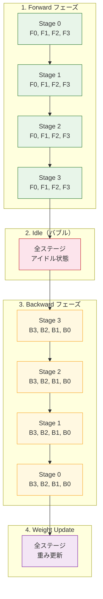

:::message
ステージ間通信は P2P（Point-to-Point）Send/Recv で実行されます。各ステージは前のステージからアクティベーションを受け取り、次のステージに送信します。Backward も同様に勾配を前のステージに送信します。
:::

::::

### トレードオフ

**利点**:
- 実装が最もシンプルで理解しやすい
- ステージ間の通信パターンが単純（Forward は順方向、Backward は逆方向のみ）
- パイプライン並列化の入門として適している

**欠点**:
- 全マイクロバッチの中間アクティベーションを保持するため、メモリ使用量が O(m) と大きい（例: m=32 では 32 マイクロバッチ分のアクティベーション）
- バブル率が (p-1)/m と高く、マイクロバッチ数を増やさないと効率が悪い
- 大規模モデルではメモリ制約が厳しく、実用的でないケースが多い

**推奨されるユースケース**:
- パイプライン並列化の初回導入時（プロトタイピング、検証用途）
- メモリに余裕がある小〜中規模モデル
- シンプルな実装を優先したい場合

---

## 1F1B -- DFS 方式の基本形

**提案**: [PipeDream: Fast and Efficient Pipeline Parallel DNN Training](https://arxiv.org/abs/1806.03377)（Harlap et al., SOSP 2019）

:::message
**端的に言うと**: Forward と Backward を交互に実行することでメモリ効率を改善。バブル率は GPipe と同じだが、保持するマイクロバッチ数が削減される。
:::

論文では、データ並列と比較して最大 5 倍の高速化と 95% の通信削減を報告しています。

> PipeDream reduces communication by up to 95% for large DNNs relative to data-parallel training, and is up to 5x faster in time-to-accuracy compared to data-parallel training.
>
> 出典: [PipeDream: Fast and Efficient Pipeline Parallel DNN Training](https://arxiv.org/abs/1806.03377)

1F1B（One Forward One Backward）は、PipeDream で提案された DFS 方式のスケジューリングです。Megatron-LM でも採用されています。

### 動作原理

1F1B は 3 つのフェーズで構成されます。

1. **ウォームアップフェーズ**: 順伝播のみを実行してパイプラインを埋める
2. **定常状態フェーズ**: 1 回の順伝播と 1 回の逆伝播を交互に実行
3. **クールダウンフェーズ**: 残りの逆伝播を完了

**注**: フェーズ区分線は GPU 0 の視点で記載しています。下位ステージ（GPU 1-3）では定常状態が延長され、ウォームアップで投入されなかったマイクロバッチの Forward が定常状態の一部として処理されます（例: GPU 1 の F7）。

```mermaid
gantt
    title 1F1B スケジューリング (p=4 ステージ, m=8 マイクロバッチ)
    dateFormat X
    axisFormat %s

    section GPU 0 (ウォームアップ / 定常状態 / クールダウン)
    F0   : f00, 0, 1
    F1   : f01, 1, 2
    F2   : f02, 2, 3
    F3   : f03, 3, 4
    B0   : b00, 4, 5
    F4   : f04, 5, 6
    B1   : b01, 6, 7
    F5   : f05, 7, 8
    B2   : b02, 8, 9
    F6   : f06, 9, 10
    B3   : b03, 10, 11
    F7   : f07, 11, 12
    B4   : b04, 12, 13
    B5   : b05, 13, 14
    B6   : b06, 14, 15
    B7   : b07, 15, 16

    section GPU 1
    F0   : f10, 1, 2
    F1   : f11, 2, 3
    F2   : f12, 3, 4
    B0   : b10, 4, 5
    F3   : f13, 5, 6
    B1   : b11, 6, 7
    F4   : f14, 7, 8
    B2   : b12, 8, 9
    F5   : f15, 9, 10
    B3   : b13, 10, 11
    F6   : f16, 11, 12
    B4   : b14, 12, 13
    F7   : f17, 13, 14
    B5   : b15, 14, 15
    B6   : b16, 15, 16
    B7   : b17, 16, 17

    section GPU 2
    F0   : f20, 2, 3
    F1   : f21, 3, 4
    B0   : b20, 4, 5
    F2   : f22, 5, 6
    B1   : b21, 6, 7
    F3   : f23, 7, 8
    B2   : b22, 8, 9
    F4   : f24, 9, 10
    B3   : b23, 10, 11
    F5   : f25, 11, 12
    B4   : b24, 12, 13
    F6   : f26, 13, 14
    B5   : b25, 14, 15
    F7   : f27, 15, 16
    B6   : b26, 16, 17
    B7   : b27, 17, 18

    section GPU 3
    F0   : f30, 3, 4
    B0   : b30, 4, 5
    F1   : f31, 5, 6
    B1   : b31, 6, 7
    F2   : f32, 7, 8
    B2   : b32, 8, 9
    F3   : f33, 9, 10
    B3   : b33, 10, 11
    F4   : f34, 11, 12
    B4   : b34, 12, 13
    F5   : f35, 13, 14
    B5   : b35, 14, 15
    F6   : f36, 15, 16
    B6   : b36, 16, 17
    F7   : f37, 17, 18
    B7   : b37, 18, 19
```

GPU 0 の視点で、ウォームアップ（F0-F3）、定常状態（B0-F4-B1-F5-...-F7）、クールダウン（B4-B7）の 3 フェーズが確認できます。

### バブル率

1F1B のバブル率は GPipe と同じです。

```
バブル率 = (p - 1) / m
```

バブル率は同じですが、メモリ効率が大幅に改善されている点が重要です。1F1B の改善は「バブル率の削減」ではなく「メモリ使用量の削減」にあります。

### メモリ使用量

1F1B の重要な利点はメモリ効率です。定常状態では、各 GPU が同時に保持するアクティベーションは最大 p 個（ステージ数）です。GPipe の O(m) と比較して大幅に削減されます。詳細は以下の details ブロックを参照してください。

::::details なぜ 1F1B はメモリを削減できるのか

1F1B がメモリを削減できる理由は、**アクティベーションの早期解放**にあります。

- **GPipe**: 全 Forward が完了するまで、すべてのマイクロバッチのアクティベーションをメモリに保持する必要がある。Backward が始まるまで何も解放できない
- **1F1B**: Forward の直後に対応する Backward を実行し、アクティベーションを即座に解放する

定常状態では、各 GPU が同時に保持するアクティベーション数は最大 p 個（パイプラインステージ数）です。これは、ウォームアップフェーズで投入された p 個のマイクロバッチが「パイプライン内に滞留」している状態に対応します。

**具体例**: p=4, m=32 の場合

- GPipe: 32 マイクロバッチ分のアクティベーションを保持（全 Forward が完了するまで）
- 1F1B: 最大 4 マイクロバッチ分のアクティベーションのみ保持（8 倍削減）

大規模モデルの訓練では、アクティベーションのメモリ消費がボトルネックになることが多いため、この削減効果は非常に大きな意味を持ちます。

::::

### 実装のポイント

- **PyTorch**: `torch.distributed.pipelining` モジュールの [`Schedule1F1B`](https://github.com/pytorch/pytorch/blob/main/torch/distributed/pipelining/schedules.py) クラスで利用可能
- **Megatron-LM**: 1F1B をデフォルトのパイプラインスケジュールとしてサポート（[`forward_backward_pipelining_without_interleaving`](https://github.com/NVIDIA/Megatron-LM/blob/main/megatron/core/pipeline_parallel/schedules.py) 関数）
- **実装時の注意点**:
  - ウォームアップフェーズの管理: 最初の p-1 個のマイクロバッチは Forward のみを実行し、パイプラインを埋める
  - 定常状態への遷移: ウォームアップ完了後に 1F1B の交互実行に切り替える制御が必要
  - クールダウンフェーズ: 最後の p-1 個のマイクロバッチは Backward のみを実行し、パイプラインを排出する

::::details 処理の詳細: 1F1B の 3 フェーズスケジューリング

1F1B は 3 つのフェーズで構成されます。

## 処理フロー

| ステップ | フェーズ | ステージ 0 | ステージ 1 | ステージ 2 | ステージ 3 | ステージ間通信 |
|---------|---------|-----------|-----------|-----------|-----------|--------------|
| 1 | ウォームアップ | F0,F1,F2,F3 | F0,F1,F2 | F0,F1 | F0 | 各 Forward 完了時に次ステージへ送信 |
| 2 | 定常状態 | B0,F4,B1,F5,B2,F6,B3,F7 | B0,F3,B1,F4,B2,F5,B3,F6 | B0,F2,B1,F3,B2,F4,B3,F5 | B0,F1,B1,F2,B2,F3,B3,F4 | F/B 交互実行、各完了時に送信 |
| 3 | クールダウン | B4,B5,B6,B7 | B4,F7,B5,B6,B7 | B4,F6,B5,F7,B6,B7 | B4,F5,B5,F6,B6,F7,B7 | 残りの Backward を順次実行 |

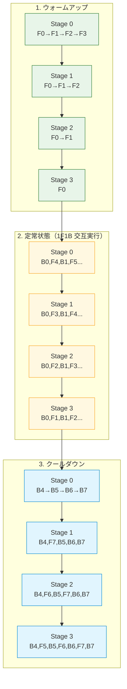

:::message
定常状態では、各ステージが Forward と Backward を交互に実行します。これにより、アクティベーションの早期解放が可能になり、メモリ使用量が O(p) に削減されます。
:::

::::

### トレードオフ

**利点**:
- メモリ効率が GPipe から大幅に改善（例: m=32, p=4 の場合、8 倍削減）
- 定常状態では O(p) のアクティベーションのみ保持
- 大規模モデルの訓練に適している

**欠点**:
- バブル率は GPipe と同じ (p-1)/m で改善されない
- ウォームアップとクールダウンフェーズの管理が必要
- GPipe より実装がやや複雑（3 つのフェーズの管理が必要）

**推奨されるユースケース**:
- メモリが制約となる大規模モデル訓練
- マイクロバッチ数 m がステージ数 p より十分大きい場合（m >> p）
- 安定した訓練パイプラインを構築したい場合

---

## Interleaved 1F1B -- 仮想ステージによるバブル削減

**提案**: [Efficient Large-Scale Language Model Training on GPU Clusters Using Megatron-LM](https://arxiv.org/abs/2104.04473)（Narayanan et al., SC 2021）

:::message
**端的に言うと**: 各 GPU に複数の非連続なステージ（仮想ステージ）を割り当てることで、1 ステージあたりの実行時間を短縮し、バブル率を 1/v に削減する。
:::

論文では、Interleaved 1F1B により既存手法と同等のメモリ使用量で 10% 以上のスループット向上を達成したと報告されています。

> We propose a novel interleaved pipelining schedule that can improve throughput by 10+% with memory footprint comparable to existing approaches.
>
> 出典: [Efficient Large-Scale Language Model Training on GPU Clusters Using Megatron-LM](https://arxiv.org/abs/2104.04473)

Interleaved 1F1B は **仮想パイプラインステージ（Virtual Pipeline Stages）** を導入してバブル率を削減します。

### 動作原理

通常の 1F1B では各 GPU が 1 つの連続した層ブロック（ステージ）を担当しますが、Interleaved 1F1B では各 GPU が**複数の非連続なステージ**を担当します。

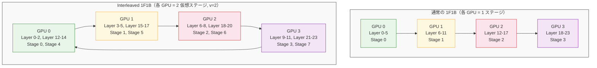

仮想ステージ数を v とすると、パイプラインの総ステージ数は p * v になります。各ステージが担当する層数は 1/v に減るため、1 ステージあたりの実行時間も 1/v に短縮されます。

### バブル率

```
バブル率 = (p - 1) / (v * m)

v: 仮想ステージ数（各デバイスが担当するチャンク数）
```

::::details 具体例: v=2 でバブル率が半分になる計算

p=4, m=8 の場合で、通常の 1F1B と Interleaved 1F1B（v=2）を比較します。

**通常の 1F1B**:

```
バブル率 = (p - 1) / m = (4 - 1) / 8 = 3/8 = 37.5%
```

**Interleaved 1F1B（v=2）**:

```
バブル率 = (p - 1) / (v * m) = (4 - 1) / (2 * 8) = 3/16 = 18.75%
```

バブル率が 37.5% から 18.75% に**半減**しています。

**なぜ半減するのか**: 仮想ステージ数 v=2 の場合、パイプラインの総ステージ数は p*v = 8 になりますが、各ステージが担当する層数は 1/v = 1/2 に減ります。結果として、1 ステージあたりの実行時間が半分になり、バブル内の「無駄な時間」も半分に短縮されます。

**v=4 にした場合**:

```
バブル率 = (4 - 1) / (4 * 8) = 3/32 = 9.4%
```

ただし、v を大きくするとステージ間の通信回数が v 倍に増加するため、通信コストとのバランスが重要です。

::::

#### v=2 の場合のデータフロー

v=2（仮想ステージ数 = 2）の場合、各 GPU が 2 つの非連続なステージを担当します。マイクロバッチは物理的に 8 つの仮想ステージ（Stage 0-7）を通過しますが、GPU 間の通信パターンは循環的になります。

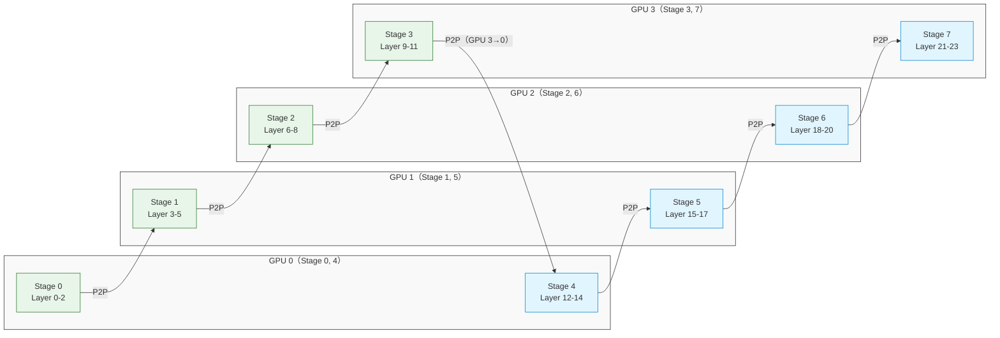

通常の 1F1B（v=1）では Forward の通信は GPU 0 -> 1 -> 2 -> 3 の一方向のみですが、v=2 では Stage 3（GPU 3）の後に Stage 4（GPU 0）への**逆方向の通信**が発生し、再び GPU 0 -> 1 -> 2 -> 3 と流れます。この循環的な通信パターンにより通信回数が 2 倍になる一方、各ステージの実行時間は半分になるためバブル率が半減します。

### メモリ使用量

メモリ使用量は 1F1B と同程度の O(p) です。仮想ステージの導入により各ステージの層数が減りますが、同時に保持するアクティベーション数は大きく変わりません。

### 実装のポイント

- **PyTorch**: `torch.distributed.pipelining` モジュールの [`ScheduleInterleaved1F1B`](https://github.com/pytorch/pytorch/blob/main/torch/distributed/pipelining/schedules.py) クラスで利用可能
- **Megatron-LM**: Interleaved 1F1B をサポート（[`forward_backward_pipelining_with_interleaving`](https://github.com/NVIDIA/Megatron-LM/blob/main/megatron/core/pipeline_parallel/schedules.py) 関数、`--num-layers-per-virtual-pipeline-stage` オプションで仮想ステージ数を設定）
- **実装時の注意点**:
  - マイクロバッチ数 m はパイプラインステージ数 p の整数倍である必要がある（m % p == 0）
  - 仮想ステージの配置（どの層をどの GPU に割り当てるか）は非連続になるため、通信パターンが複雑化する
  - 通信量が v 倍に増加するため、ネットワーク帯域幅がボトルネックになる可能性がある

### トレードオフ

:::message alert
仮想ステージ数 v を増やすとバブル率は下がりますが、ステージ間通信が v 倍に増加します。NVLink のような高速接続がない環境では効果が限定的です。
:::

**利点**:
- バブル率が (p-1)/(v*m) に削減され、v=2 で半減する
- 1F1B と同程度のメモリ効率を維持
- Megatron-LM で実績のある手法

**欠点**:
- ステージ間の通信回数が v 倍に増加し、通信コストが増大する
- マイクロバッチ数 m がパイプラインステージ数 p の整数倍である必要がある
- 通信コストとバブル削減のバランスを考慮する必要がある

**推奨されるユースケース**:
- 高速なインターコネクト（NVLink, InfiniBand など）を持つクラスタ環境
- バブル率の削減が通信コスト増大を上回る場合（v=2 程度が実用的）
- Megatron-LM を使用した大規模言語モデル訓練

---

## Zero Bubble -- 逆伝播の分離によるバブル解消

**提案**: [Zero Bubble Pipeline Parallelism](https://arxiv.org/abs/2401.10241)（Qi et al., ICLR 2024）

:::message
**端的に言うと**: Backward を入力勾配計算（B）と重み勾配計算（W）に分離し、依存関係のない W をバブル時間に配置することで、バブルをほぼゼロに削減する。
:::

論文では、同期訓練において初めてパイプラインバブルをゼロにすることに成功したと述べられています。同等のメモリ制約下で 23%、メモリ制約を緩和した場合は 31% のスループット向上を達成しています。

> We achieve the first to successfully achieve zero pipeline bubbles under synchronous training semantics. [...] it can achieve 23% improvement over the 1F1B baseline under a similar memory limit, or 31% when the memory constraint is relaxed.
>
> 出典: [Zero Bubble Pipeline Parallelism](https://arxiv.org/abs/2401.10241)

### 動作原理

#### 核心となるアイデア -- B と W の分離

従来のスケジューリングでは、逆伝播（Backward）を 1 つの単位として扱っていました。Zero Bubble はこれを 2 つに分離します。

- **B（dL/dx）**: 入力に対する勾配計算。**連鎖律（chain rule）により、前のステージに勾配を渡す必要がある**ため、ステージ間の依存関係がある
- **W（dL/dw）**: パラメータに対する勾配計算。**ローカルなパラメータの勾配なので、他のステージの結果を待たずに計算できる**ため、自由にスケジューリング可能

:::message
この依存関係の違いの数学的背景は、以下の details ブロックで解説しています。
:::

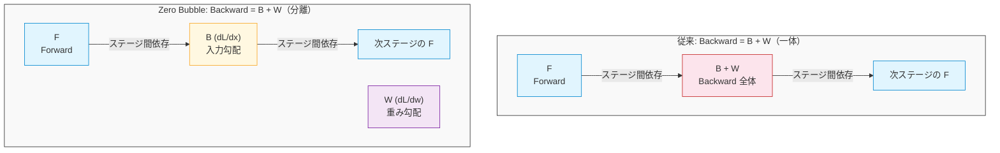

F と B はステージ間で逐次依存関係がありますが、W はどのステージにも依存しないため、バブルを埋めるのに使えます。

::::details なぜ B と W を分離できるのか -- クリティカルパスの観点

B と W の依存関係の基本（前提知識セクション参照）をクリティカルパスの観点で整理すると:

- **B（dL/dx）**: ステージ間で勾配を伝播するため、パイプラインの**クリティカルパス上**にある
- **W（dL/dw）**: ステージ内で完結するため、クリティカルパス上に**ない**

数学的には:
- B: $\frac{\partial L}{\partial x} = \frac{\partial L}{\partial y} \cdot \frac{\partial y}{\partial x}$（次のステージの勾配 $\frac{\partial L}{\partial y}$ が必要）
- W: $\frac{\partial L}{\partial w} = \frac{\partial L}{\partial y} \cdot \frac{\partial y}{\partial w}$（同じステージ内で完結）

W がクリティカルパス外であることを利用し、バブル時間に配置することでパイプライン効率を改善できます。

::::

#### B/W 分離によるバブル削減の流れ

以下の図は、1F1B と ZB-H1 を比較し、W を空き時間に配置する効果を示しています。1F1B ではクリティカルパス上に F, B, W のすべてが含まれますが、ZB-H1 では W がクリティカルパスから外れ、バブル時間に配置されます。

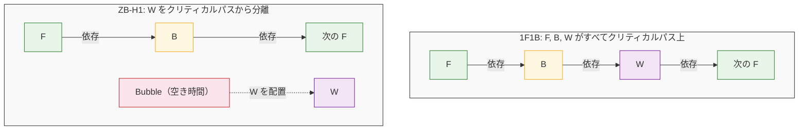

1F1B のクリティカルパスが `F + B + W` であるのに対し、ZB-H1 では `F + B` のみになります。これにより、バブルサイズが `(p-1)(F+B+W)` から `(p-1)(F+B)` に削減されます。

### 3 つのスケジュール変種

Zero Bubble 論文では 3 つのスケジュールが提案されています。

**ZB-H1（メモリ効率型）**:
- 1F1B と同等のメモリ使用量を維持
- バブルを 1F1B の約 1/3 に削減
- W をウォームアップ後の空き時間に配置

**ZB-H2（ゼロバブル型）**:
- バブルをほぼ完全に解消
- ウォームアップ中に追加の Forward を実行し、W の並べ替えで空き時間を解消
- メモリ使用量は 1F1B の約 2 倍

:::message alert
ZB-H2 はバブルをほぼゼロに削減しますが、メモリ使用量が 1F1B の約 2 倍になります。メモリが制約となる環境では ZB-H1 または ZB-V を推奨します。
:::

**ZB-V（バランス型）**:
- モデルを 2p 個のチャンクに分割し、各デバイスに**V 字型**（先頭と末尾のチャンクを同じ GPU に配置するパターン）で 2 チャンクを配置
- この配置により、Forward と Backward が同じデバイスから始まり、早期にアクティベーションを解放可能
- 1F1B と同等のメモリ制約内でバブルを最小化
- Interleaved 1F1B と類似のアプローチだが、チャンク配置パターンが異なる

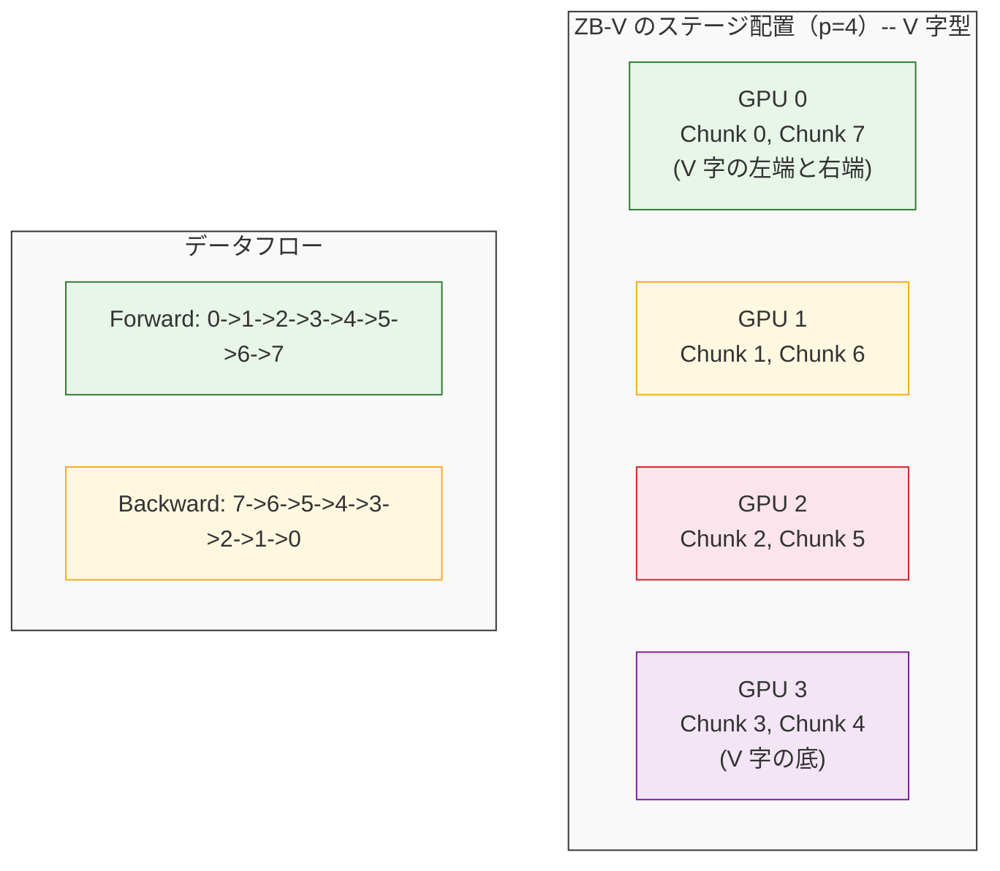

Forward と Backward が同じデバイス（GPU 0）から始まるため、アクティベーションの早期解放が可能です。

### バブル率の比較

```
            バブル率               メモリ（アクティベーション数）
1F1B:       (p-1)(F+B+W) / m      p

ZB-H1:      (p-1)(F+B) / m        p
            (W を空き時間に配置)

ZB-H2:      ≈ 0                   約 2p
            (ILP ソルバーで最適化)

ZB-V:       ZB-H1 相当に削減       p（1F1B と同等）
            (V 字配置 + W 最適化)

F: Forward 1 回の実行時間
B: dL/dx の実行時間（Backward の入力勾配計算）
W: dL/dw の実行時間（Backward の重み勾配計算）
m: マイクロバッチ数
p: パイプラインステージ数

※ バブルサイズは (p-1) * (該当する実行時間の合計) で表されます。
  1F1B では F, B, W のすべてがパイプラインの依存関係に含まれるため、
  バブルに F+B+W の全時間が寄与します。Zero Bubble は W を空き時間に
  配置することでバブルを削減します。

※ ZB-H2 のバブル率: 論文では整数線形計画法（ILP）ソルバーを使って
  最適なスケジュールを見つけるため、閉形式のバブル率は明示的には
  与えられていません。実際には追加の Forward と W の並べ替えにより、
  理論的にバブルをほぼゼロに近づけられます（ZB-H2 が「Zero Bubble」
  の名を冠する理由）。

※ ZB-V のバブル率: V 字型配置により Forward と Backward が同じデバイス
  から開始・終了するため、アクティベーションの早期解放と W の効率的な
  配置が可能になります。これにより、1F1B と同等のメモリ制約内で
  バブルを大幅に削減できます（ZB-H1 相当の削減効果）。論文では
  Interleaved 1F1B と類似のアプローチとして説明されていますが、
  チャンク配置パターンが異なります。
```

:::message
ILP（整数線形計画法）ソルバーは、制約条件を満たす最適なスケジュールを自動探索する最適化手法です。ZB-H2 では、バブルを最小化するマイクロバッチの配置を ILP で求めます。
:::

::::details 具体例: ZB-H1 と 1F1B のバブル率比較

p=4, m=8 で、各処理の実行時間が F=1, B=1, W=1（同一時間と仮定）の場合を考えます。

**1F1B のバブル**:

```
バブルサイズ = (p - 1)(F + B + W) = 3 * (1 + 1 + 1) = 9
総実行時間 = m * (F + B + W) = 8 * 3 = 24
バブル率 = 9 / 24 = 37.5%
```

**ZB-H1 のバブル**:

```
バブルサイズ = (p - 1)(F + B) = 3 * (1 + 1) = 6
総実行時間 = m * (F + B + W) = 8 * 3 = 24
バブル率 = 6 / 24 = 25.0%
```

**削減効果**: バブル率が 37.5% から 25.0% に削減（1/3 の削減）。W（= 1 * 3 = 3 単位時間）がバブルから除外され、空き時間に配置されたことで実現しています。

**スループット向上の計算**:
- 1F1B: 有効稼働率 = 1 - 0.375 = 0.625
- ZB-H1: 有効稼働率 = 1 - 0.250 = 0.750
- スループット向上率 = 0.750 / 0.625 = 1.20（約 20% 向上）

論文で報告されている「最大 23% のスループット向上」は、実際の実験環境（F, B, W の比率が異なる場合）での測定値です。

::::

Zero Bubble は、1F1B と比較して同等のメモリ制約（ZB-H1）で 23% のスループット向上、メモリ制約を緩和（ZB-H2）した場合は 31% のスループット向上を実現しています。

### トレードオフ

**利点**:
- バブルをほぼゼロに削減可能（ZB-H2）
- ZB-H1 は 1F1B と同等のメモリ制約内でバブルを約 1/3 に削減
- ZB-V は 1F1B と同等のメモリ制約内で ZB-H1 相当のバブル削減を実現
- W の分離という明確な原理に基づいており、理論的に理解しやすい

**欠点**:
- B と W の分離により実装が複雑化する
- ZB-H2 はメモリ使用量が 1F1B の約 2 倍になる（追加の Forward 実行のため）
- ILP ソルバーによる最適スケジュール探索が必要（ZB-H2）
- W の実行タイミングによっては勾配の「古さ」が問題になる可能性がある

**推奨されるユースケース**:
- ZB-H1: メモリ制約が厳しい環境で、1F1B からの効率改善を図りたい場合
- ZB-H2: メモリに余裕があり、最大のスループットを追求したい場合
- ZB-V: 1F1B と同等のメモリ制約で最高の効率を求める場合

---

## DualPipe -- 双方向パイプラインの革新

**提案**: [DeepSeek-V3 Technical Report](https://arxiv.org/abs/2412.19437)（DeepSeek-AI, 2024）

:::message
**端的に言うと**: パイプラインの両端からマイクロバッチを同時に送り込む双方向スケジューリングにより、ステージ係数を半減（p-1 --> p/2-1）させ、計算と通信を重畳してバブルを削減する。
:::

DeepSeek-V3 は 671B パラメータ（トークンごとに 37B がアクティブ）の MoE モデルであり、DualPipe は同モデルの訓練効率を支える重要な技術です。論文では、DualPipe により all-to-all 通信と PP 通信の両方を計算実行中に完全に隠蔽できると述べています。

> Within each pair, we employ DualPipe to achieve efficient pipeline parallelism, which overlaps the computation and communication phases of forward and backward, thereby overcoming the cross-node expert parallelism communication bottleneck.
>
> 出典: [DeepSeek-V3 Technical Report](https://arxiv.org/abs/2412.19437)

### 動作原理

DualPipe の核心は、2 つの 1F1B スケジュールを**逆方向**に同時実行することです。

**「逆方向」とは**: 通常のパイプラインは Stage 0 → Stage 1 → ... → Stage N と進みますが、逆方向パイプラインは **Stage N → ... → Stage 1 → Stage 0 の順序でマイクロバッチを送り込みます**。つまり、パイプラインの最終ステージから最初のステージへ向かう方向です。

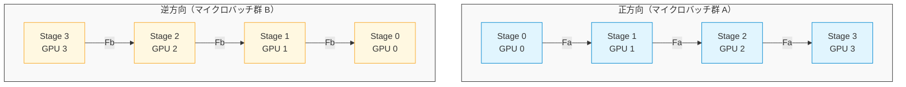

```mermaid
gantt
    title DualPipe スケジューリング概念 (p=4 ステージ)
    dateFormat X
    axisFormat %s

    section GPU 0
    Fa0  : fa00, 0, 1
    Fb0  : done, fb00, 1, 2
    Fa1  : fa01, 2, 3
    Fb1  : done, fb01, 3, 4
    Ba0  : ba00, 4, 5
    Bb0  : done, bb00, 5, 6

    section GPU 1
    Fb0  : done, fb10, 0, 1
    Fa0  : fa10, 1, 2
    Fb1  : done, fb11, 2, 3
    Fa1  : fa11, 3, 4
    Bb0  : done, bb10, 4, 5
    Ba0  : ba10, 5, 6

    section GPU 2
    Fa0  : fa20, 0, 1
    Fb0  : done, fb20, 1, 2
    Fa1  : fa21, 2, 3
    Fb1  : done, fb21, 3, 4
    Ba0  : ba20, 4, 5
    Bb0  : done, bb20, 5, 6

    section GPU 3
    Fb0  : done, fb30, 0, 1
    Fa0  : fa30, 1, 2
    Fb1  : done, fb31, 2, 3
    Fa1  : fa31, 3, 4
    Bb0  : done, bb30, 4, 5
    Ba0  : ba30, 5, 6
```

Fa = 正方向 Forward（青）、Fb = 逆方向 Forward（灰）、Ba = 正方向 Backward、Bb = 逆方向 Backward。両方向が同時に進行し、各 GPU で交互にスケジューリングされます。

### 計算と通信の重なり

DualPipe の重要な特徴は、計算と通信を重ねて実行できることです。DeepSeek-V3 の MoE アーキテクチャでは AllToAll 通信が頻繁に発生しますが、DualPipe により正方向と逆方向の計算を交互にスケジューリングすることで、通信の遅延を計算で隠蔽できます。

論文では「all-to-all と PP 通信の両方を実行中に完全に隠蔽できる」と述べられています。

### バブル率

DeepSeek-V3 の論文によると、DualPipe のバブル式は以下の通りです。

**記号の定義**:
- F&B: Forward と Backward が重なっている部分の実行時間（両方向の処理が同時に走る部分）
- F, B, W: 各処理の実行時間（Forward, Backward 入力勾配, Backward 重み勾配）

```
DualPipe:  (p/2 - 1) * (F&B + B - 3W)
1F1B:      (p - 1) * (F + B + W)
```

DualPipe では、ステージ係数の半減、W の重複実行、F と B の重なりの 3 つの理由でバブルが削減されます。詳細は以下の details ブロックを参照してください。

**直感的理解**: DualPipe は「パイプラインを 2 つに分けて両端から送り込む」ことで、各パイプラインが短くなり（p --> p/2）、さらに両方向が同時に進むことで空き時間に W を挿入できます。結果として、ステージ係数が (p-1) から (p/2-1) に削減されます。

**p=8 の場合**:
- 通常の 1F1B: $(p-1) = 7$
- DualPipe: $(p/2-1) = 3$
- 削減率: $3/7 \approx 43\%$（約 1/2.3 に削減）

::::details なぜ双方向でバブルが半減するのか

DualPipe がバブルを削減できる理由は、以下の 3 つです。

**1. ステージ係数が半減**

通常の 1F1B では全ステージ（p 個）を一方向に通るため (p-1) 個のバブルが発生しますが、DualPipe では各方向が p/2 ステージのみを通るため、バブルは (p/2-1) に削減されます。

**具体例**: p=4 の場合
- 通常の 1F1B: ステージ係数 = (p-1) = 3
- DualPipe: ステージ係数 = (p/2-1) = 1（約 1/3 に削減）

p が大きくなるほど、削減効果は (p-1)/(p/2-1) に近づき、約 2 倍の改善になります（本文の p=8 の数値例を参照）。

**2. W の重複実行**

正方向と逆方向の処理が交互に進むため、一方の計算中に他方の W を実行できます。これにより W がバブル時間から除外されます（Zero Bubble と同じ原理）。

**3. F と B の重なり**

正方向と逆方向の処理が重なることで、各 GPU が常に何らかの計算を実行している状態を実現できます。正方向の Forward 中に逆方向の Backward を実行するなど、計算リソースを最大限活用します。

::::

:::message
DeepSeek-V3 論文では、MoE の AllToAll 通信を含む実測環境で 1F1B と比較しています。1F1B のバブル式が `(p-1)(F+B)` と簡略化されているのは、この文脈での比較を示しています。理論的な完全なバブルサイズは `(p-1)(F+B+W)` です。
:::

### メモリ使用量

DualPipe は各デバイスが正方向と逆方向の両方のステージを保持する必要があるため、**メモリ使用量が約 2 倍**になります。例えば通常 2 層を担当するデバイスが、DualPipe では 4 層分のパラメータとアクティベーションを保持する必要があります。

### トレードオフ

:::message alert
メモリ使用量が約 2 倍になるため（前節参照）、メモリが十分でない環境では使用できません。
:::

**利点**:
- ステージ係数が p-1 から p/2-1 に半減し、バブルが大幅に削減される
- 計算と通信を重畳でき、AllToAll 通信の遅延を隠蔽可能
- W を空き時間に配置することで追加のバブル削減効果（Zero Bubble と同じ原理）

**欠点**:
- メモリ使用量が約 2 倍に増加する
- 双方向スケジューリングの実装が複雑
- 偶数のステージ数が必要
- 正方向と逆方向のマイクロバッチをバランスよく配分する必要がある

**推奨されるユースケース**:
- MoE アーキテクチャなど、AllToAll 通信が頻繁に発生する環境
- 十分なメモリを持つ大規模クラスタ
- DeepSeek-V3 のような超大規模モデルの訓練

---

## Eager 1F1B -- 通信と計算の早期重なり

**提案**: PyTorch の `torch.distributed.pipelining` で実装

:::message
**端的に言うと**: Forward の計算を分割し、最初の部分が完了した時点で送信を開始することで、通信と計算を重ねてパイプラインの効率を改善する。
:::

### 動作原理

通常の 1F1B では、Forward の計算が完全に終了してから次のステージに送信します。Eager スケジューリングでは、**Forward の計算を複数の部分（チャンク）に分割し、最初の部分が完了した時点で送信を開始**します。これにより、次のステージでの受信と計算を重ねられます。

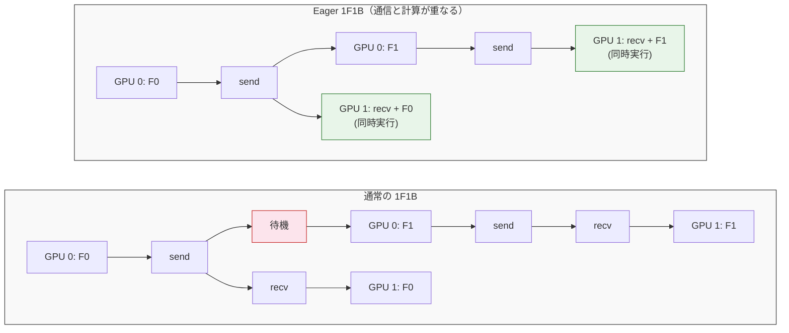

send/recv を計算と重ねることで待機時間を削減します。

### 効果

通信と計算の重なりにより、パイプライン全体のレイテンシが改善されます。効果の大きさは、ネットワーク帯域、計算負荷、マイクロバッチサイズに依存します。通信時間が計算時間の大部分を占める環境では、顕著な改善が期待できます。

### 実装のポイント

Eager スケジューリングは、PyTorch の非同期通信（`torch.distributed.isend`, `torch.distributed.irecv`）を活用して実装されます。計算と通信の重なりを最大化するためには、適切なチャンクサイズの選択が重要です。

### バブル率

バブル率自体は 1F1B と同じ (p-1)/m ですが、通信の隠蔽により実効的なスループットが改善されます。

### メモリ使用量

1F1B と比較してやや増加します（O(p) + alpha）。追加のマイクロバッチが同時にパイプライン内に存在するためです。

### トレードオフ

**利点**:
- 通信と計算の重なりにより、実効的なスループットが改善される
- 1F1B をベースにしているため、概念的に理解しやすい

**欠点**:
- 追加のマイクロバッチが同時にパイプライン内に存在するため、メモリ使用量がやや増加する
- 通信のチャンク分割に伴うオーバーヘッドが発生する可能性がある

---

## スケジューリング戦略の比較まとめ

:::message
スケジューリング戦略の選択は、メモリ制約、通信帯域、実装の複雑さのトレードオフで決まります。実務では、まず 1F1B から始めて、メモリに余裕があれば Interleaved 1F1B や Zero Bubble を検討することを推奨します。
:::

以下の表で各戦略を比較します。

| 戦略 | バブル率 | メモリ | 通信コスト | 実装の複雑さ |
|------|---------|-------|-----------|------------|
| GPipe | (p-1)/m | O(m) | 低 | 低 |
| 1F1B | (p-1)/m | O(p) | 低 | 中 |
| Interleaved 1F1B | (p-1)/(v*m) | O(p) | 中（v 倍） | 中 |
| ZB-H1 | (p-1)(F+B)/m | O(p) | 低 | 高 |
| ZB-H2 | ほぼ 0（ILP 最適化） | O(2p) | 低 | 高 |
| ZB-V | ZB-H1 相当 | O(p) | 中（2 倍） | 高 |
| DualPipe | (p/2-1)(F&B+B-3W) | O(2p) | 中 | 高 |
| Eager 1F1B | (p-1)/m（通信隠蔽） | O(p) + alpha | 低 | 中 |

### 推奨されるシナリオ

| 戦略 | 推奨されるシナリオ |
|------|----------------|
| GPipe | プロトタイピング、小規模モデル、シンプルな実装を優先 |
| 1F1B | 大規模モデル訓練の標準選択、メモリ制約がある場合 |
| Interleaved 1F1B | 高速インターコネクト環境でバブル率を削減したい場合 |
| ZB-H1 | メモリ制約を維持しつつ 1F1B からの効率改善を図りたい場合 |
| ZB-H2 | メモリに余裕があり、最大スループットを追求する場合 |
| ZB-V | 1F1B 同等のメモリ制約で最高効率を求める場合 |
| DualPipe | MoE モデル、AllToAll 通信が多い大規模クラスタ |
| Eager 1F1B | 通信レイテンシが大きい環境での効率改善 |

### フレームワークサポート状況

| 戦略 | PyTorch pipelining | Megatron-LM | DeepSpeed |
|------|-------------------|-------------|-----------|
| GPipe | `ScheduleGPipe` | -- | GPipe ベースの実装 |
| 1F1B | `Schedule1F1B` | デフォルトサポート | -- |
| Interleaved 1F1B | `ScheduleInterleaved1F1B` | サポート | -- |
| ZB-H1/H2 | -- | -- | -- |
| ZB-V | -- | -- | -- |
| DualPipe | -- | -- | -- |
| Eager 1F1B | サポート | -- | -- |

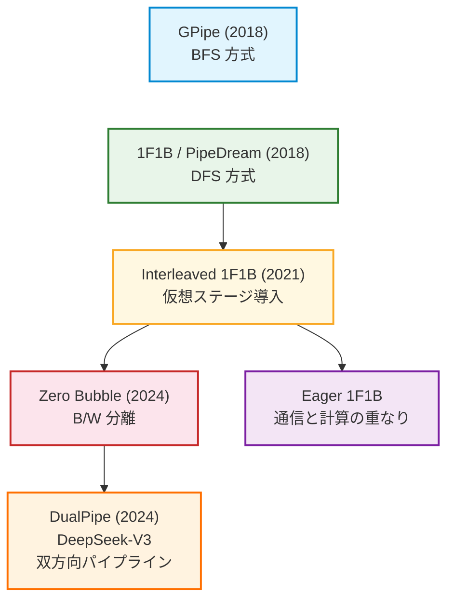

---

## 実装の観点 -- フレームワークでの対応状況

:::message
各フレームワークの実装には細かい差異があります。例えば、Megatron-LM は通信の最適化が進んでおり、PyTorch の標準実装よりも高速な場合があります。実務では、使用するフレームワークのドキュメントと実装を確認することが重要です。
:::

### PyTorch `torch.distributed.pipelining`

PyTorch の `torch.distributed.pipelining` モジュールでは、以下のスケジューリング戦略がサポートされています。

- `ScheduleGPipe`: GPipe 方式
- `Schedule1F1B`: 1F1B 方式
- `ScheduleInterleaved1F1B`: Interleaved 1F1B 方式
- `ScheduleLoopedBFS`: BFS 方式のループ型スケジュール

実装は以下のファイルで確認できます:

https://github.com/pytorch/pytorch/blob/main/torch/distributed/pipelining/schedules.py

基本的な使用例は以下の通りです。

```python
from torch.distributed.pipelining import ScheduleGPipe, Schedule1F1B

# GPipe スケジューリング
schedule = ScheduleGPipe(stage, n_microbatches, loss_fn=loss_fn)
schedule.step(input)

# 1F1B スケジューリング
schedule = Schedule1F1B(stage, n_microbatches, loss_fn=loss_fn)
schedule.step(input)
```

### Megatron-LM

Megatron-LM は、NVIDIA が開発した大規模言語モデル訓練フレームワークです。

- **1F1B**: デフォルトのパイプラインスケジュール（`forward_backward_pipelining_without_interleaving` 関数）
- **Interleaved 1F1B**: `--num-layers-per-virtual-pipeline-stage` オプションで仮想ステージ数を指定して利用可能（`forward_backward_pipelining_with_interleaving` 関数）
- 実運用で広く検証された実装

実装は以下のファイルで確認できます:

https://github.com/NVIDIA/Megatron-LM/blob/main/megatron/core/pipeline_parallel/schedules.py

### DeepSpeed

Microsoft の DeepSpeed フレームワークでは、GPipe ベースのパイプライン並列化を提供しています。

- GPipe スタイルの勾配蓄積に基づくパイプライン実装
- ZeRO（Zero Redundancy Optimizer）と組み合わせて使用されることが多い
- スケジューリングロジック、P2P 通信、トポロジー管理などが分離された構造

実装は以下のディレクトリで確認できます:

https://github.com/microsoft/DeepSpeed/tree/master/deepspeed/runtime/pipe

主要なファイル構成:
- `engine.py`: パイプライン実行エンジン
- `schedule.py`: スケジューリングロジック
- `p2p.py`: ステージ間の P2P 通信
- `topology.py`: パイプライントポロジー管理

### Zero Bubble / DualPipe

Zero Bubble と DualPipe は、上記の主要フレームワークにはまだ統合されていません。

- **Zero Bubble**: Megatron-LM をベースとした公式実装が公開されています。`--zero-bubble-v-schedule` フラグで ZB-V スケジュールを有効化できます。

  https://github.com/sail-sg/zero-bubble-pipeline-parallelism

- **DualPipe**: DeepSeek-V3 のリポジトリで参照可能です。

  https://github.com/deepseek-ai/DeepSeek-V3

---

## まとめ

本章では、パイプライン並列化の各スケジューリング戦略を解説しました。

**基本概念**:
- パイプライン並列化はモデルを層方向に分割し、マイクロバッチをパイプライン形式で処理する
- バブル（GPU アイドル時間）の削減が主要な課題
- BFS（幅優先）と DFS（深さ優先）の 2 つの系統がある

**各戦略の位置づけ**:
- **GPipe**: BFS の基本形。シンプルだがメモリ非効率
- **1F1B**: DFS の基本形。メモリ効率が大幅に改善
- **Interleaved 1F1B**: 仮想ステージでバブル率を 1/v に削減。通信コスト増
- **Zero Bubble**: 逆伝播の B/W 分離でバブルをほぼ解消
- **DualPipe**: 双方向パイプラインで計算と通信を重畳。DeepSeek-V3 で採用
- **Eager 1F1B**: 通信の早期開始による効率改善

パイプライン並列化は、Tensor Parallel や Data Parallel と組み合わせた 3D 並列化（あるいはさらに多くの並列化を組み合わせた nD 並列化）の重要な一角を担っています。モデルの規模、ハードウェア構成、メモリ制約に応じて、適切なスケジューリング戦略を選択することが重要です。

---

## 参考文献

### 論文

1. **GPipe**: Huang, Y., et al. (2019). "GPipe: Efficient Training of Giant Neural Networks using Pipeline Parallelism". *NeurIPS 2019*. [arXiv:1811.06965](https://arxiv.org/abs/1811.06965)

2. **PipeDream**: Harlap, A., et al. (2019). "PipeDream: Fast and Efficient Pipeline Parallel DNN Training". *SOSP 2019*. [arXiv:1806.03377](https://arxiv.org/abs/1806.03377)

3. **Megatron-LM (Interleaved 1F1B)**: Narayanan, D., et al. (2021). "Efficient Large-Scale Language Model Training on GPU Clusters Using Megatron-LM". *SC 2021*. [arXiv:2104.04473](https://arxiv.org/abs/2104.04473)

4. **Zero Bubble**: Qi, P., et al. (2024). "Zero Bubble Pipeline Parallelism". *ICLR 2024*. [arXiv:2401.10241](https://arxiv.org/abs/2401.10241)

5. **DeepSeek-V3**: DeepSeek-AI (2024). "DeepSeek-V3 Technical Report". [arXiv:2412.19437](https://arxiv.org/abs/2412.19437)

6. **Breadth-First Pipeline Parallelism**: Lamy-Poirier, J. (2022). "Breadth-First Pipeline Parallelism". [arXiv:2211.05953](https://arxiv.org/abs/2211.05953)

### 実装

1. **PyTorch Distributed Pipelining**: [torch.distributed.pipelining](https://pytorch.org/docs/stable/distributed.pipelining.html)
   - GitHub: [pytorch/pytorch](https://github.com/pytorch/pytorch/tree/main/torch/distributed/pipelining)
   - スケジュール実装: [schedules.py](https://github.com/pytorch/pytorch/blob/main/torch/distributed/pipelining/schedules.py)

2. **Megatron-LM**: [NVIDIA/Megatron-LM](https://github.com/NVIDIA/Megatron-LM)
   - Pipeline Parallel: [schedules.py](https://github.com/NVIDIA/Megatron-LM/blob/main/megatron/core/pipeline_parallel/schedules.py)

3. **DeepSpeed**: [microsoft/DeepSpeed](https://github.com/microsoft/DeepSpeed)
   - Pipeline: [runtime/pipe/](https://github.com/microsoft/DeepSpeed/tree/master/deepspeed/runtime/pipe)

4. **Zero Bubble (公式実装)**: [sail-sg/zero-bubble-pipeline-parallelism](https://github.com/sail-sg/zero-bubble-pipeline-parallelism)

5. **DeepSeek-V3**: [deepseek-ai/DeepSeek-V3](https://github.com/deepseek-ai/DeepSeek-V3)

### 関連記事

1. ailzhang.github.io: [Pipeline Parallelism Demystified](https://ailzhang.github.io/posts/pipeline-parallelism-demystified/) -- 本記事の主要な参考資料
