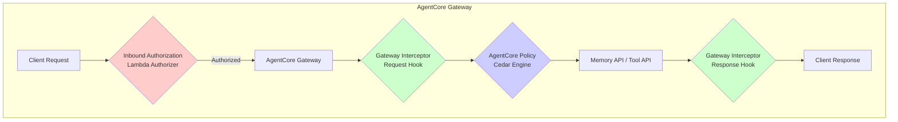

## 4. AWS AgentCore の 3 つのアクセス制御手法

前章まで、AI Agent の認証認可における課題と、MCP 認証の仕組みを確認しました。本章では、AWS AgentCore Gateway が提供する **3 つのアクセス制御手法** を詳しく解説します。それぞれの特徴を理解し、自身のユースケースに最適な手法を選択できるようにしましょう。

### 4.1 概要: Inbound Authorization / AgentCore Policy / Gateway Interceptors

AgentCore Gateway は、MCP サーバーのツールアクセスを制御するために 3 つの手法を提供しています。



上図は、3 つのアクセス制御手法が Gateway 内でどのように配置されているかを示しています。

- [赤] **Inbound Authorization**: Gateway 入口での JWT 検証（Layer 1）
- [青] **AgentCore Policy**: Cedar ポリシーによるツール単位認可（Layer 2）
- [緑] **Gateway Interceptors**: Request / Response Lambda によるカスタムロジック（Layer 3）

3 手法の位置づけを端的にまとめると以下の通りです。

| 手法 | 制御粒度 | 一言で言うと |
|------|---------|------------|
| Inbound Authorization | Gateway 単位 | 「この Gateway にアクセスできるか?」 |
| AgentCore Policy | ツール単位 | 「このツールを実行できるか?」 |
| Gateway Interceptors | ツール単位 + 入出力加工 | 「このツールをこの条件で実行してよいか? レスポンスを加工するか?」 |

重要なのは、これら 3 つの手法は**排他ではなく併用可能**であるという点です。後述する Defense in Depth アーキテクチャでは、3 手法を組み合わせて多層防御を実現します。

---

### 4.2 Inbound Authorization -- Gateway レベル認可

#### 概要

Inbound Authorization は、AgentCore Gateway への**入口で JWT カスタムクレームを検証**する仕組みです。Gateway 単位の binary（通す/通さない）な判定を行います。

#### 処理フロー

```
Client → JWT 送信 → Gateway が customClaims を検証 → 許可 or 拒否
```

#### 設定例（CDK TypeScript）

Inbound Authorization では、JWT のどのクレームをどの条件で検証するかを `customClaims` で定義します。

```typescript
customClaims: [
  {
    inboundTokenClaimName: "role",
    inboundTokenClaimValueType: "STRING",
    authorizingClaimMatchValue: {
      claimMatchOperator: "EQUALS",
      claimMatchValue: {
        matchValueString: "admin",
      },
    },
  },
]
```

この例では、JWT の `role` クレームが `"admin"` と完全一致する場合のみ Gateway へのアクセスを許可しています。

#### 検証演算子

| 演算子 | 説明 | ユースケース |
|--------|------|------------|
| `EQUALS` | 文字列完全一致 | `role == "admin"` |
| `CONTAINS` | 配列に値が含まれるか | `groups` に `"engineering"` が含まれるか |
| `CONTAINS_ANY` | 共通要素の有無 | `groups` に `["admin", "power-user"]` のいずれかがあるか |

#### 特徴と制約

- [OK] 設定のみで実装可能（Lambda 不要）
- [OK] 最も低レイテンシー
- [注意] ツール単位の制御は不可（Gateway への入口で一括判定）
- [注意] 「admin は全ツール OK、user は一部のみ」のような粒度の制御ができない

**適したユースケース**: テナント分離、社内/社外ユーザーの区別、ネットワークレベルのゲーティング

---

### 4.3 AgentCore Policy -- Cedar ポリシーによるツール単位 FGAC

#### 概要

AgentCore Policy は、**Cedar ポリシー言語を用いたツール単位の Fine-Grained Access Control（FGAC）** を実現するマネージドサービスです。Policy Engine がリクエストのたびに Cedar ポリシーを評価し、ツールごとに permit / deny を判定します。

#### アーキテクチャ

```
Policy Engine
  └── Policy（1 つ以上の Cedar ポリシー）
        └── permit/forbid ルール
              ├── principal（認証済みユーザー）
              ├── action（MCP ツール操作）
              ├── resource（対象 Gateway）
              └── when（条件: JWT クレーム検証）
```

Policy Engine は Gateway に紐づけて使用し、`ENFORCE`（本番用）または `LOG_ONLY`（検証用）の 2 つのモードで動作します。

| モード | 動作 | 推奨用途 |
|--------|------|---------|
| `LOG_ONLY` | ポリシーを評価するがブロックしない | 導入初期のテスト・影響調査 |
| `ENFORCE` | ポリシー違反時はリクエストをブロック | 本番環境 |

:::message alert
**LOG_ONLY モードの運用リスク**: LOG_ONLY モードでは Cedar ポリシーが認可判定に寄与しないため、4 層 Defense in Depth が**実質 3 層に劣化**します。この場合、Layer 3（Gateway Interceptor）が全認可判定を担うことになり、Interceptor のバグ（例: `AUTHZ_METHODS` セットへの新メソッド追加漏れ）や Lambda のタイムアウトが単一障害点となるリスクがあります。

LOG_ONLY モードはあくまで導入初期のテスト用です。ポリシー評価結果をログで検証し、問題がないことを確認したら速やかに `ENFORCE` モードに移行してください。ENFORCE モードに移行することで、仮に Interceptor に不備があっても Cedar がフォールバックとして機能し、真の多層防御が実現されます。
:::

#### Cedar ポリシーの書き方

Cedar ポリシーは「誰が（principal）」「何を（action）」「どのリソースに（resource）」「どの条件で（when）」実行できるかを宣言的に定義します。

**例 1: Admin ロール -- 全ツール許可**

```cedar
permit (
  principal is AgentCore::OAuthUser,
  action,
  resource == AgentCore::Gateway::"arn:aws:bedrock-agentcore:us-east-1:123456789012: gateway/<gateway-id>"
)
when {
  principal.hasTag("role") &&
  principal.getTag("role") == "admin"
};
```

`action` に特定のツールを指定していないため、全アクションが許可されます。`principal.hasTag("role")` で JWT にクレームが存在するか確認し、`principal.getTag("role")` でその値を取得して検証しています。

**例 2: User ロール -- retrieve_doc のみ許可**

```cedar
permit (
  principal is AgentCore::OAuthUser,
  action == AgentCore::Action::"mcp-target___retrieve_doc",
  resource == AgentCore::Gateway::"arn:aws:bedrock-agentcore:us-east-1:123456789012: gateway/<gateway-id>"
)
when {
  principal.hasTag("role") &&
  principal.getTag("role") == "user"
};
```

`action` に `mcp-target___retrieve_doc` を指定しています。AgentCore では MCP ツール名を `mcp-target___<ツール名>` という命名規則で参照します。

:::message
**実装上の注意**: bedrock-agentcore-cookbook の Example 04 では、Cedar ポリシーファイル内で `${ACCOUNT_ID}` プレースホルダーを使用し、`put-cedar-policies.py` スクリプトが STS GetCallerIdentity で取得した実際の AWS アカウント ID に自動置換します。これにより、複数環境（開発/本番）で同じポリシーファイルを再利用できます。

```python
# put-cedar-policies.py の自動置換処理
account_id = sts.get_caller_identity()["Account"]
policy_content = policy_content.replace("${ACCOUNT_ID}", account_id)
```

本番環境では、ARN の `123456789012` 部分を実際のアカウント ID に置き換えてください。
:::

**例 3: 複数ツールを許可するパターン**

Cedar ではアクションのワイルドカードをサポートしていないため、複数ツールを許可する場合は明示的に列挙します。

```cedar
permit (
  principal is AgentCore::OAuthUser,
  action in [
    AgentCore::Action::"mcp-target___retrieve_doc",
    AgentCore::Action::"mcp-target___sync_data_source"
  ],
  resource == AgentCore::Gateway::"arn:aws:bedrock-agentcore:us-east-1:123456789012: gateway/<gateway-id>"
)
when {
  principal.hasTag("role") &&
  principal.getTag("role") == "power-user"
};
```

#### Cedar ポリシーで使える演算子

`when` 句では以下の演算子を組み合わせて条件を記述できます。

| 演算子 | 記法 | 例 |
|--------|------|-----|
| AND | `&&` | `cond1 && cond2` |
| OR | `\|\|` | `cond1 \|\| cond2` |
| NOT | `!` | `!cond` |
| 等価 | `==`, `!=` | `principal.getTag("role") == "admin"` |
| 大小比較 | `<`, `<=`, `>`, `>=` | 数値条件 |
| パターンマッチ | `like` | `principal.getTag("email") like "*@example.com"` |
| 存在確認 | `.hasTag()` | `principal.hasTag("tenant_id")` |
| 包含 | `.contains()` | 文字列/配列要素の検索 |

#### PartiallyAuthorizeActions -- tools/list の自動フィルタリング

AgentCore Policy の注目すべき機能が **PartiallyAuthorizeActions** です。クライアントが `tools/list` を呼び出した際、Policy Engine が各ツールの認可を事前に評価し、**許可されたツールのみをレスポンスに含めます**。

例えば、`user` ロールのユーザーが `tools/list` を呼び出すと:

```
リクエスト: tools/list
レスポンス（user ロール）:
  - retrieve_doc     ... 表示される（許可済み）
  - delete_data_source ... 表示されない（未許可）
  - sync_data_source   ... 表示されない（未許可）
  - get_query_log      ... 表示されない（未許可）
```

AI Agent は「自分が使えるツール」のみを認識するため、不必要なツール呼び出しの試行が減り、UX とセキュリティの両方が向上します。

:::message
PartiallyAuthorizeActions は `tools/list` の結果のみをフィルタリングします。Semantic Search の結果はフィルタリングされないため、Semantic Search を利用する場合は Gateway Interceptors での対応が必要です。
:::

#### 特徴と制約

- [OK] 宣言的なポリシー定義で意図が明確。監査しやすい
- [OK] Lambda 不要のマネージドサービス
- [OK] `tools/list` の自動フィルタリング（PartiallyAuthorizeActions）
- [OK] `LOG_ONLY` モードで安全にテスト可能
- [注意] Cedar ポリシー言語の学習コスト
- [注意] アクションのワイルドカード非対応（ツール数が多いとポリシーが冗長に）
- [注意] 外部データソースとの連携不可（静的なポリシー定義のみ）

**適したユースケース**: ロールベースのツールアクセス制御、ツール数が限定的な環境

---

### 4.4 Gateway Interceptors -- Lambda によるカスタムロジック

#### 概要

Gateway Interceptors は、**Request / Response の 2 つの Lambda** を Gateway に接続し、MCP リクエスト・レスポンスに対してカスタムロジックを適用する仕組みです。最も柔軟性が高い手法ですが、実装コストも最大です。

:::message
Gateway Interceptor は AWS Bedrock AgentCore の GA リリース済み機能です。本書の実装例で使用している用語（Request Interceptor / Response Interceptor）とレスポンス形式（`interceptorOutputVersion: "1.0"`, `transformedGatewayRequest`, `transformedGatewayResponse`）は AWS 公式の仕様です。

CDK での設定方法については、執筆時点（2026-02-19）で L2 Construct が `InterceptorConfigurations` をサポートしていないため、`addPropertyOverride` を使用する必要があります。詳細は [AWS Japan の公式記事](https://zenn.dev/aws_japan/articles/002-bedrock-agentcore-interceptor) を参照してください。
:::

#### 処理フロー

```
Client → Request Lambda → Gateway → MCP Server → Response Lambda → Client
```

- **Request Interceptor**: リクエストを受け取り、認可チェックを行う。拒否する場合はエラーレスポンスを直接返却
- **Response Interceptor**: MCP サーバーからのレスポンスを受け取り、フィルタリングや加工を行う

#### Request Interceptor の実装例

以下は、JWT からロールを抽出し、`tools/call` メソッドに対してツール単位の認可チェックを行う Lambda の実装です。

::::details Request Interceptor Lambda（Python 完全版）

```python
import json
import os
import jwt

TARGET_NAME = os.environ["TARGET_NAME"]
JWKS_URL = os.environ["JWKS_URL"]
CLIENT_ID = os.environ["CLIENT_ID"]

jwks_client = jwt.PyJWKClient(JWKS_URL)

ROLE_PERMISSIONS = {
    "admin": ["*"],
    "user": ["retrieve_doc"],
}

def verify_jwt_signature(token: str) -> dict:
    """JWT 署名検証（JWKS）とクレーム抽出

    PyJWKClient で Cognito JWKS エンドポイントから署名キーを取得し、
    RS256 アルゴリズムで署名を検証した上でクレームを返す。
    """
    signing_key = jwks_client.get_signing_key_from_jwt(token)
    claims = jwt.decode(
        token,
        signing_key.key,
        algorithms=["RS256"],
        options={"require": ["exp", "client_id", "token_use"]},
    )
    if claims.get("client_id") != CLIENT_ID:
        raise jwt.InvalidTokenError("Invalid client_id")
    if claims.get("token_use") != "access":
        raise jwt.InvalidTokenError("Invalid token_use")
    return claims

def check_authorization(role: str, tool_name: str) -> bool:
    allowed_tools = ROLE_PERMISSIONS.get(role, [])
    if not allowed_tools:
        return False
    if "*" in allowed_tools:
        return True
    return tool_name in allowed_tools

def extract_tool_name(body):
    name = body.get("params", {}).get("name", "")
    return name.split("___")[-1] if "___" in name else name

def build_error_response(message, body):
    return {
        "interceptorOutputVersion": "1.0",
        "mcp": {
            "transformedGatewayResponse": {
                "statusCode": 403,
                "headers": {"Content-Type": "application/json"},
                "body": {
                    "jsonrpc": "2.0",
                    "id": body.get("id"),
                    "error": {"code": -32000, "message": message},
                },
            }
        },
    }

# セキュリティ注意: エラーメッセージには内部情報を含めない
# OK: "Unauthorized", "Invalid token"
# NG: "DynamoDB table 'AuthPolicyTable' not found", "IAM Role arn:aws:iam::123456789012:role/..."
# 詳細なエラー情報は CloudWatch Logs に記録し、クライアントには一般的なメッセージのみ返す

def build_pass_through(body):
    return {
        "interceptorOutputVersion": "1.0",
        "mcp": {
            "transformedGatewayRequest": {
                "headers": {"Content-Type": "application/json"},
                "body": body,
            }
        },
    }

def lambda_handler(event, context):
    mcp = event.get("mcp", {})
    req = mcp.get("gatewayRequest", {})
    headers = req.get("headers", {})
    body = req.get("body", {})
    auth = headers.get("Authorization", "")

    if not auth.startswith("Bearer "):
        return build_error_response("No token", body)

    try:
        token = auth.replace("Bearer ", "")
        claims = verify_jwt_signature(token)
        role = claims.get("role", "guest")
        method = body.get("method", "")
        tool_name = extract_tool_name(body)

        # tools/call 以外（tools/list 等）はそのまま通す
        if method != "tools/call":
            return build_pass_through(body)

        authorized = check_authorization(role, tool_name)
        if not tool_name or not authorized:
            return build_error_response(
                f"Insufficient permission: {tool_name}", body
            )
    except Exception as e:
        return build_error_response(f"Invalid token: {e}", body)

    return build_pass_through(body)
```

::::

実装のポイントは以下の通りです。

- **JWT 署名検証**: `verify_jwt_signature()` で `PyJWKClient` を使い Cognito の JWKS エンドポイントから署名キーを動的取得し、RS256 で署名を検証
- **メソッド分岐**: `tools/call` のみ認可チェック。`tools/list` 等の他メソッドはパススルー
- **ツール名の抽出**: AgentCore の `mcp-target___<ツール名>` 形式からツール名を取り出す
- **エラーレスポンス**: 拒否時は JSON-RPC 形式のエラーを `transformedGatewayResponse` で直接返却

#### Response Interceptor の実装例

Response Interceptor は、`tools/list` の結果や Semantic Search の結果をロールに基づいてフィルタリングします。

::::details Response Interceptor Lambda（Python 完全版）

```python
import json
import os
import jwt

JWKS_URL = os.environ["JWKS_URL"]
CLIENT_ID = os.environ["CLIENT_ID"]

jwks_client = jwt.PyJWKClient(JWKS_URL)

ROLE_PERMISSIONS = {
    "admin": ["*"],
    "user": ["retrieve_doc"],
}

def verify_jwt_signature(token: str) -> dict:
    """JWT 署名検証（JWKS）とクレーム抽出"""
    signing_key = jwks_client.get_signing_key_from_jwt(token)
    claims = jwt.decode(
        token,
        signing_key.key,
        algorithms=["RS256"],
        options={"require": ["exp", "client_id", "token_use"]},
    )
    if claims.get("client_id") != CLIENT_ID:
        raise jwt.InvalidTokenError("Invalid client_id")
    if claims.get("token_use") != "access":
        raise jwt.InvalidTokenError("Invalid token_use")
    return claims

def filter_tools(tools: list, role: str) -> list:
    allowed_tools = ROLE_PERMISSIONS.get(role, [])
    if not allowed_tools:
        return []
    if "*" in allowed_tools:
        return tools
    filtered = []
    for tool in tools:
        name = tool.get("name", "")
        tool_name = name.split("___")[-1] if "___" in name else name
        if tool_name in allowed_tools:
            filtered.append(tool)
    return filtered

def lambda_handler(event, context):
    mcp = event.get("mcp", {})
    resp = mcp.get("gatewayResponse", {})
    headers = resp.get("headers", {})
    body = resp.get("body") or {}
    auth = headers.get("Authorization", "")

    result = body.get("result", {})
    tools = result.get("tools", []) or result.get(
        "structuredContent", {}
    ).get("tools", [])

    if not tools:
        filtered_body = body
    else:
        try:
            token = (
                auth.replace("Bearer ", "")
                if auth.startswith("Bearer ")
                else ""
            )
            claims = verify_jwt_signature(token)
            role = claims.get("role", "guest")
            filtered = filter_tools(tools, role)
            filtered_body = body.copy()
            if "structuredContent" in filtered_body["result"]:
                filtered_body["result"]["structuredContent"]["tools"] = filtered
                filtered_body["result"]["content"] = [
                    {"type": "text", "text": json.dumps({"tools": filtered})}
                ]
            else:
                filtered_body["result"]["tools"] = filtered
        except Exception:
            # Fail-closed: JWT 検証失敗時は空のツールリストを返す
            filtered_body = body.copy()
            if "structuredContent" in filtered_body.get("result", {}):
                filtered_body["result"]["structuredContent"]["tools"] = []
                filtered_body["result"]["content"] = [
                    {"type": "text", "text": json.dumps({"tools": []})}
                ]
            else:
                if "result" in filtered_body:
                    filtered_body["result"]["tools"] = []

    return {
        "interceptorOutputVersion": "1.0",
        "mcp": {
            "transformedGatewayResponse": {
                "statusCode": 200,
                "headers": {"Content-Type": "application/json"},
                "body": filtered_body,
            }
        },
    }
```

::::

Response Interceptor の注目点は、**`tools/list` の通常レスポンスと Semantic Search のレスポンス（`structuredContent`）の両方に対応**している点です。

#### 特徴と制約

- [OK] 最も柔軟。任意のカスタムロジックを実装可能
- [OK] 外部 DB（DynamoDB 等）からの動的な権限取得
- [OK] MCP リクエスト/レスポンスの加工（PII 除去、ログ記録等）
- [OK] Semantic Search 結果のフィルタリング
- [注意] Lambda の開発・運用コスト
- [注意] レイテンシーが最も大きい
- [注意] Request Interceptor で拒否した場合、Gateway の CloudWatch Logs に記録されない

**適したユースケース**: 外部 DB 連携、PII 除去、入出力監視、Semantic Search のフィルタリング、複雑な認可ロジック

---

### 4.5 3 手法の使い分けガイドライン

#### 比較表

[表 4-1] 3 手法の総合比較

| 観点 | Inbound Authorization | AgentCore Policy | Gateway Interceptors |
|------|----------------------|-----------------|---------------------|
| **制御粒度** | Gateway 単位 | ツール単位 | ツール単位 + 入出力 |
| **実装容易性** | 高（設定のみ） | 中（Cedar ポリシー記述） | 低（Lambda 開発） |
| **カスタマイズ性** | 低 | 中 | 高 |
| **入出力加工** | 不可 | 不可 | 可 |
| **`tools/list` フィルタリング** | 不可 | 自動（PartiallyAuthorizeActions） | Lambda で実装 |
| **Semantic Search フィルタリング** | 不可 | 不可 | 可 |
| **外部データソース連携** | 不可 | 不可 | 可（DynamoDB 等） |
| **運用負荷** | 低 | 低 | 中（Lambda の監視・更新） |

#### 選択基準マトリックス

[表 4-2] ユースケース別の選択基準

| ユースケース | 推奨手法 | 理由 |
|------------|---------|------|
| テナント / ネットワークレベルのゲーティング | Inbound Authorization | binary な判定で十分。最も低コスト |
| ロールベースのツール制御（シンプル） | AgentCore Policy | Cedar ポリシーで宣言的に定義。Lambda 不要 |
| ツール数が多い環境でのロール制御 | Gateway Interceptors | Cedar のワイルドカード非対応を回避 |
| 外部 DB からの動的な権限取得 | Gateway Interceptors | Lambda 内で DynamoDB 等にアクセス可能 |
| PII 除去、レスポンス加工 | Gateway Interceptors | Response Lambda でレスポンスを書き換え |
| Semantic Search 結果のフィルタリング | Gateway Interceptors | AgentCore Policy では未対応 |
| 段階的導入（まず試したい） | AgentCore Policy（LOG_ONLY） | 本番影響なしでポリシー評価を検証可能 |
| 層別防御（Defense in Depth） | 3 手法の組み合わせ | 各手法が異なる防御レイヤーを担当 |

#### 段階的導入の推奨パス

```
Step 1: Inbound Authorization で Gateway レベルの認可を設定
   ↓
Step 2: AgentCore Policy を LOG_ONLY で追加し、ツール単位の認可を検証
   ↓
Step 3: 問題なければ Policy を ENFORCE に切り替え
   ↓
Step 4: 必要に応じて Gateway Interceptors を追加（PII 除去、動的認可等）
```

---

### 4.6 パフォーマンス比較

実際にどの程度のレイテンシー差があるのかを確認しましょう。以下は `tools/list` メソッドに対する 50 回試行の平均値です。

[表 4-3] パフォーマンスベンチマーク結果

| 手法 | レイテンシー（平均 +/- 標準偏差） | Inbound との差分 |
|------|-------------------------------|----------------|
| Inbound Authorization | 569.81 +/- 15.11 ms | -- |
| AgentCore Policy | 704.02 +/- 26.21 ms | +134.21 ms |
| Gateway Interceptors | 776.89 +/- 31.43 ms | +207.08 ms |

**分析**:

- **AgentCore Policy は Inbound と比較して +134ms** のオーバーヘッドです。これは Policy Engine による Cedar ポリシー評価の処理時間に相当します
- **Gateway Interceptors は Inbound と比較して +207ms** のオーバーヘッドです。Lambda のコールドスタートやネットワークホップが追加されるためです
- **Policy と Interceptors の差は約 73ms** です。Interceptors は Lambda 実行を伴うため若干大きくなります

:::message
単一のリクエストでは +134ms や +207ms は体感上の差にはなりません。しかし、AI Agent が 1 回のタスクで複数のツールを連続呼び出しする場合、累積オーバーヘッドが無視できなくなる可能性があります。例えば 10 回のツール呼び出しを行う Agent では、Interceptors 使用時に Inbound のみと比較して約 2 秒のオーバーヘッドが発生します。

とはいえ、セキュリティ機能のコストとしてこの差は一般的に許容範囲と評価されます。パフォーマンスよりもセキュリティ要件を優先して手法を選択することを推奨します。
:::

---

### 実装例

本章で解説した 3 つのアクセス制御手法の実装例は、bedrock-agentcore-cookbook で公開しています。

- **Power-user ロールの Cedar ポリシー実装**: [examples/04-policy-engine/](https://github.com/littlemex/bedrock-agentcore-cookbook/tree/main/examples/04-policy-engine)
  - `action in [...]` 構文による複数ツール列挙パターン
  - `forbid` ルールによる明示的拒否パターン
  - Admin / Power-user / User の 3 段階ロールベース制御

---

### 4 章のまとめ

AgentCore Gateway の 3 つのアクセス制御手法は、それぞれ異なる粒度と柔軟性を持っています。

- **Inbound Authorization**: Gateway レベルの入口制御。設定のみで最速
- **AgentCore Policy**: Cedar ポリシーによるツール単位 FGAC。マネージドで運用負荷低
- **Gateway Interceptors**: Lambda によるカスタムロジック。最も柔軟だが実装コスト大

シンプルなロールベース制御から始める場合は **AgentCore Policy** が最適な出発点です。要件が複雑化した際に **Gateway Interceptors** へ段階的に移行し、最終的には 3 手法を併用した **Defense in Depth** アーキテクチャを構築するのが推奨パスです。

次章では、この 3 手法に API Gateway Lambda Authorizer と外部サービス認証を加えた **4 層 Defense in Depth アーキテクチャ** の全体像を解説します。
