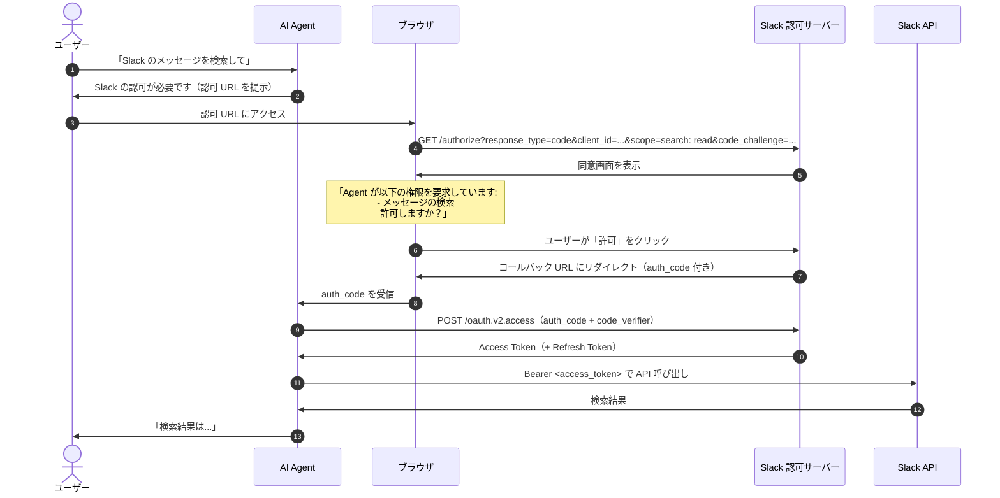
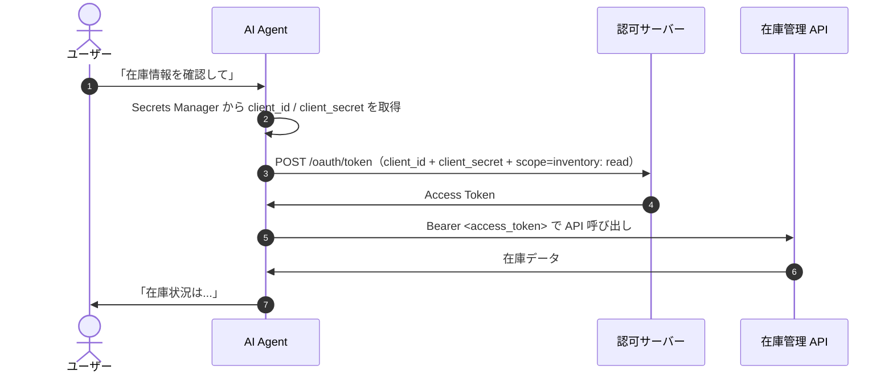
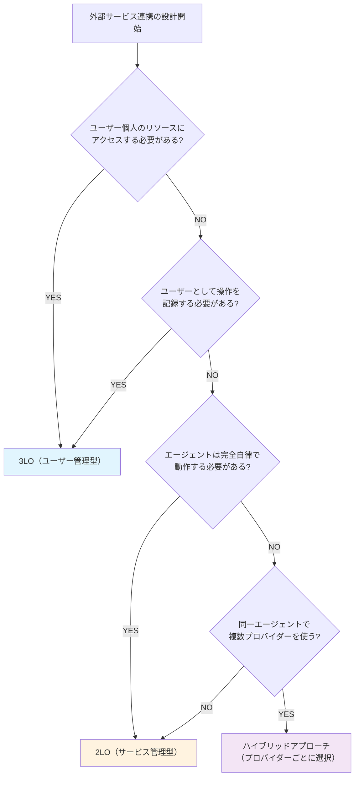
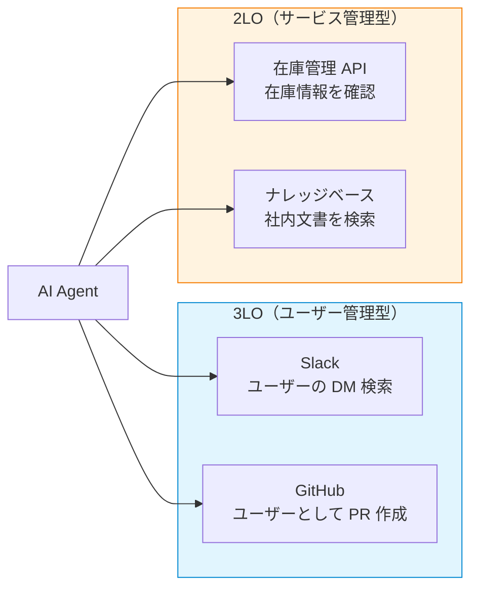

## 2. 認証パターン: 3LO vs 2LO

AI Agent が外部サービスと連携する際、最初に決めるべきは「**誰の権限で**外部サービスにアクセスするか」である。ここでは 2 つの基本パターンと、実運用で有効なハイブリッドアプローチを解説する。

### 2.1 3-Legged OAuth (3LO) -- ユーザー管理型

3-Legged OAuth（3LO）は、**ユーザー本人の同意**を介してエージェントがユーザー権限で外部サービスにアクセスするパターンである。「3 つの足（Leg）」は以下の 3 者を指す。

1. **リソースオーナー**（ユーザー）: 外部サービスのアカウント所有者
2. **クライアント**（エージェント / アプリ）: ユーザーに代わってリソースにアクセスするアプリケーション
3. **認可サーバー / リソースサーバー**（外部サービス）: ユーザーのデータを保持するサービス（Slack, GitHub, Salesforce 等）

OAuth 2.0/2.1 の **Authorization Code Grant**（+ PKCE）がその具体的な実装メカニズムとなる。

#### 3LO のシーケンス図

以下は、ユーザーが AI Agent 経由で Slack のメッセージを検索する場合のフローである。

ポイントは、ステップ 5-7 で**ユーザーがブラウザ上で明示的に認可を承認する**点である。発行されるトークンはユーザー個人の権限に紐づくため、そのユーザーの DM やプライベートチャンネルにもアクセスできる。

#### 3LO が適するケース

- ユーザーの Slack DM 検索、GitHub プライベートリポジトリ操作
- 特定ユーザー名でのコミット作成や Jira チケット更新
- 監査証跡で「誰が」操作したかを明確にする必要がある場合
- GDPR 等のコンプライアンス要件でユーザーの明示的同意が求められる場合

### 2.2 2-Legged OAuth (2LO) -- サービス管理型

2-Legged OAuth（2LO）は、**ユーザーの介在なし**にエージェントがサービスアカウントとして外部サービスにアクセスするパターンである。「2 つの足」は以下の 2 者を指す。

1. **クライアント**（エージェント / アプリ）: サービスアカウントのクレデンシャルを持つアプリケーション
2. **認可サーバー / リソースサーバー**（外部サービス）: Machine-to-Machine アクセスを受け付けるサービス

OAuth 2.0/2.1 の **Client Credentials Grant** がその具体的な実装メカニズムとなる。

#### 2LO のシーケンス図

以下は、エージェントがサービスアカウントとして在庫管理 API にアクセスする場合のフローである。

:::message alert
`client_secret` はソースコードや環境変数にハードコーディングしてはいけません。本番環境では必ず AWS Secrets Manager 等のシークレット管理サービスから動的に取得してください。上図のステップ 2 がこれに該当します。
:::

3LO と比較すると、ブラウザを介した同意フローが一切ない。管理者が事前にサービスアカウントを設定しておけば、エージェントは完全に自律的に動作できる。

#### 2LO が適するケース

- 組織全体のナレッジベース検索、共有 Slack チャンネルの読み取り
- 在庫確認、価格照会、ステータス確認など個人権限が不要な操作
- 定期的なデータ同期やバッチ処理
- ブラウザ操作なしに完全自律で動作する必要があるエージェント

### 2.3 パターン選択のガイドライン

#### 総合比較表

| 観点 | 3LO（ユーザー管理型） | 2LO（サービス管理型） |
|------|---------------------|---------------------|
| **OAuth Grant Type** | Authorization Code（+ PKCE） | Client Credentials |
| **ユーザー同意** | 必要（ブラウザ操作） | 不要 |
| **認証情報の所有者** | ユーザー個人 | Agent（サービスアカウント） |
| **外部サービスへのアクセス** | ユーザー権限で動作 | サービスアカウント権限で動作 |
| **個人リソースアクセス** | 可能（DM、プライベートリポ等） | 制限あり |
| **運用負荷** | 高い（個人管理） | 低い（一元管理） |
| **セキュリティ統制** | 分散（個人責任） | 集中（管理者統制） |
| **監査トレーサビリティ** | 高い（ユーザー特定可能） | 低い（サービスアカウント名で記録） |
| **エージェント自律動作** | 初回は同意フローで中断 | 完全自律 |
| **トークン管理規模** | users x providers | agents x providers |
| **トークン漏洩時の影響** | 個人リソースの露出 | 共有リソースの露出（影響範囲が広い） |

#### 選択フローチャート

どちらのパターンを選ぶか迷った場合は、以下のフローチャートに従って判断する。

重要な判断基準は以下の 3 つである。

1. **個人リソースへのアクセスが必要か**: YES なら 3LO 一択。DM、プライベートリポジトリ、個人の CRM データ等へのアクセスは 3LO でなければ実現できない
2. **監査証跡でユーザー特定が必要か**: コンプライアンス要件で「誰が操作したか」を記録する必要がある場合は 3LO
3. **エージェントの自律動作が必要か**: ブラウザ操作の中断なしに動作させたい場合は 2LO

### 2.4 ハイブリッドアプローチ

実際のエンタープライズ環境では、1 つのエージェントが複数の外部サービスと連携し、**プロバイダーごとに異なる認証パターンを使い分ける**のが一般的である。「全部 3LO」「全部 2LO」にする必要はない。

#### ハイブリッド構成の例

この例では、Slack と GitHub はユーザー個人の操作が必要なため 3LO を使い、在庫管理 API とナレッジベースは共有リソースへの読み取りのみのため 2LO を使う。

#### ハイブリッドアプローチの設計指針

1. **プロバイダーごとに最適なパターンを選択する**: プロバイダーの特性とアクセスするリソースの種類に応じて 3LO と 2LO を使い分ける
2. **Credential Manager で統合管理する**: ユーザートークン（3LO）とサービストークン（2LO）を統一的に管理するコンポーネントを設ける。3LO のトークンは `(user_id, provider_id)` で、2LO のトークンは `(agent_id, provider_id)` で取得する
3. **フォールバック設計を検討する**: 3LO のトークンが期限切れでユーザーが再認可できない場合、可能であれば 2LO のサービスアカウントで共有リソースのみにアクセスするフォールバックを用意する（ただし権限範囲は狭くなる）
4. **4 層チェックフローと統合する**: ユーザー管理型・サービス管理型のいずれの場合も、第 1 章で解説した 4 層チェックフロー（User -> Agent -> MCP -> Provider）を通過させる。認証パターンが異なるのは最終層（Layer 4: Credential 確認）のみであり、Layer 1-3 の認可判定は共通である

#### トークン管理の規模感

ハイブリッドアプローチでは、トークン管理の規模が 3LO と 2LO で大きく異なる点に注意が必要である。

| 方式 | トークン数の計算式 | 例（100 ユーザー / 3 プロバイダー / 2 エージェント） |
|------|----------------|--------------------------------------------------|
| 3LO | ユーザー数 x プロバイダー数 | 100 x 3 = **300 トークン** |
| 2LO | エージェント数 x プロバイダー数 | 2 x 3 = **6 トークン** |

3LO のトークンはユーザー数に比例して増加するため、Secrets Manager 等の外部ストアでの管理と、テナント ID をプレフィックスとしたキー設計（例: `tenant-001/user-123/slack/access_token`）が必須となる。

:::message
3LO と 2LO のどちらを選ぶかはプロバイダーごとに決めてよい。1 つのエージェントの中で両パターンを混在させるハイブリッドアプローチが、エンタープライズ環境では最も実用的である。
:::

#### シナリオ別推奨パターン

| シナリオ | 推奨パターン | 理由 |
|---------|------------|------|
| 社内チャットボット（個人の Slack DM 検索） | 3LO | 個人リソースへのアクセスが必要 |
| カスタマーサポート Agent（CRM + ナレッジベース） | ハイブリッド | CRM は 3LO、ナレッジベースは 2LO |
| 在庫確認 Agent（API 呼び出しのみ） | 2LO | 個人リソースへのアクセスは不要 |
| コードレビュー Agent（GitHub 操作） | 3LO | ユーザーとしてコメント・レビューを投稿 |
| データ分析 Agent（共有ダッシュボード） | 2LO | 共有データへの読み取りのみ |
| マルチ SaaS 連携 Agent（Slack + Salesforce + 在庫 API） | ハイブリッド | SaaS ごとに最適なパターンを選択 |

次章では、MCP（Model Context Protocol）が定める認証仕様と、AI Agent 固有の認証課題について解説する。
