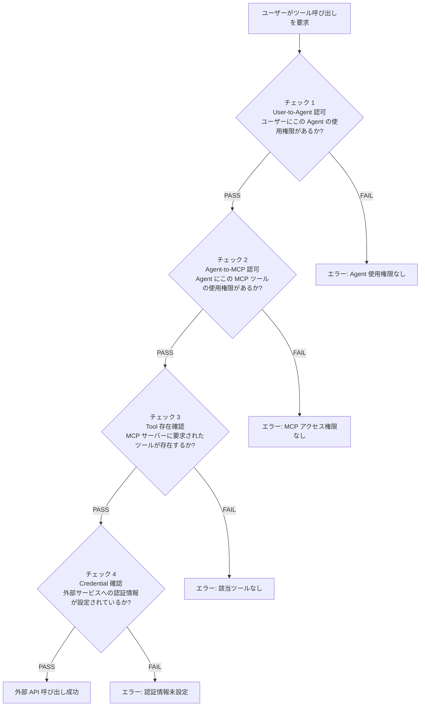

## はじめに

### 背景: AI Agent が外部サービスと連携する時代

AI Agent が Slack でメッセージを検索し、GitHub に PR を作成し、Salesforce から顧客情報を取得する -- こうしたユースケースが急速に現実のものとなっています。AWS Bedrock AgentCore や MCP（Model Context Protocol）の登場により、AI Agent と外部サービスの連携基盤は整いつつあります。

しかし、ここで避けて通れない問題があります。**認証認可**です。

従来の Web アプリケーションであれば「ユーザーがログインしてサービスにアクセスする」という 1 対 1 の関係で済みました。AI Agent が介在する環境では、話はもっと複雑になります。

- **誰が** そのエージェントを使えるのか？
- **どのツール** をエージェントは呼び出せるのか？
- **どの権限** で外部サービスにアクセスするのか？
- **マルチテナント** 環境でデータは安全に分離されるのか？

これらの問いに体系的に答える設計パターンは、まだ十分に整理されていません。

### この記事で解決する課題

本記事では、AI Agent の認証認可設計における以下の課題を解決します。

1. **User -> Agent -> MCP -> Provider の多段階認可** をどう設計するか
2. **3LO（ユーザー管理型）と 2LO（サービス管理型）** のどちらを選ぶべきか
3. **MCP の OAuth 2.1 認証** と AWS IAM をどう統合するか
4. **AgentCore の 3 つのアクセス制御手法**（Inbound Authorization / Policy / Interceptor）をどう使い分けるか
5. **マルチテナント環境** でテナント分離をどう実現するか
6. **AgentCore Memory** のアクセス制御をどう設計するか

これらの課題に対し、AWS AgentCore を中心とした **4 層 Defense in Depth（多層防御）** アーキテクチャを提案します。

### 想定読者と前提知識

本記事は以下の読者を想定しています。

**主なターゲット: **

- AWS 上で AI Agent を構築・運用するクラウドアーキテクト / インフラエンジニア
- AI Agent 連携の新規プロジェクトで認証設計を担当するバックエンドエンジニア
- AI Agent 導入に伴うセキュリティリスクを評価するセキュリティエンジニア

**前提知識: **

| カテゴリ | 必須 | あると望ましい |
|---------|------|-------------|
| 認証認可 | OAuth 2.0 の基本（Access Token, Refresh Token） | Cedar ポリシー言語、ABAC |
| AWS | IAM、Lambda、API Gateway の基本 | Cognito User Pool, DynamoDB |
| AI | AI Agent の概念（ツール呼び出し、LLM 連携） | MCP (Model Context Protocol) |
| 設計 | REST API の設計経験 | マルチテナント SaaS 設計 |

### 記事の構成

本記事は前後編で構成されています。

**前編（本記事）: **

- 第 1 章: AI Agent 認証認可の課題と全体像
- 第 2 章: 認証パターン -- 3LO vs 2LO
- 第 3 章: MCP 認証の仕組みと AI Agent との統合
- 第 4 章: AWS AgentCore の 3 つのアクセス制御手法
- 第 5 章: 4 層 Defense in Depth アーキテクチャ

**後編: **

- 第 6 章: エンティティ関係設計と DynamoDB Single Table Design
- 第 7 章: AgentCore Memory の権限制御
- 第 8 章: マルチテナント対応
- 第 9 章: 実装ロードマップとコスト見積もり
- 第 10 章: まとめ

---

## 1. AI Agent 認証認可の課題と全体像

### 1.1 従来の Web アプリ認証と AI Agent 認証の違い

従来の Web アプリケーションでは、認証認可は比較的シンプルです。

```
ユーザー --> [認証] --> サービス --> [認可] --> リソース
```

ユーザーがログインし、サービスが認可を判断し、リソースにアクセスする。1 対 1 の直線的な関係です。

AI Agent が介在する環境では、この関係が多段階になります。

```
ユーザー --> Agent --> MCP Server --> 外部サービス（Slack, GitHub 等）
```

ここで発生する認可判断は 1 つではなく、**4 つ**あります。

1. このユーザーは、このエージェントを使う権限があるか？
2. このエージェントは、この MCP サーバーのツールを使う権限があるか？
3. この MCP サーバーに、要求されたツールは存在するか？
4. 外部サービスへの認証情報は設定されているか？

これらのチェックを **1 つでも通過できなければ、リクエストは拒否される** という設計が、AI Agent 認証認可の基本原則です。

### 1.2 4 層チェックフロー: User -> Agent -> MCP -> Provider

AI Agent 環境における認可判定の核心は、以下の 4 層チェックフローです。このモデルは、外部サービス連携時に 4 段階のチェックを順に実行します。



各チェックの詳細を見ていきましょう。

**チェック 1: User-to-Agent 認可**

ユーザー単位、またはグループ単位で「このエージェントを使える」というポリシーを評価します。例えば、「営業部のユーザーは Sales Bot を使えるが、開発部のユーザーは使えない」といった制御です。

**チェック 2: Agent-to-MCP 認可**

エージェントがどの MCP サーバーのどのツールを呼び出せるかを制御します。例えば、「Sales Bot は Salesforce と Slack の MCP ツールを使えるが、GitHub の MCP ツールは使えない」といった制御です。Cedar ポリシー言語を使って宣言的に定義できます。

```cedar
// Sales Bot は Salesforce と Slack のツールのみ利用可
permit(
  principal == MCP::"sales-tools",
  action == Action::"connectProvider",
  resource in [Provider::"salesforce", Provider::"slack"]
);

// Dev Bot は GitHub、Jira、Slack のツールを利用可
permit(
  principal == MCP::"dev-tools",
  action == Action::"connectProvider",
  resource in [Provider::"github", Provider::"jira", Provider::"slack"]
);
```

**チェック 3: Tool 存在確認**

MCP サーバーに要求されたツールが実際に存在するかの確認です。例えば、Sales Tools MCP サーバーには Salesforce と Slack のツールは存在しますが、GitHub のツールは存在しません。

**チェック 4: Credential 確認**

外部サービスへの認証情報が設定されているかの最終チェックです。チェック 1-3 がすべて PASS しても、ユーザーが Salesforce の OAuth トークンを登録していなければ API 呼び出しは失敗します。この確認はポリシー評価ではなく、Credential Manager（Secrets Manager 等）での動的な状態チェックとして実装します。

### 1.3 アクセス制御マトリックスの考え方

4 層チェックフローを具体的に理解するため、アクセス制御マトリックスを見てみましょう。

#### Agent -> MCP -> Provider 接続可能性

まず、エージェントがどの MCP サーバー経由でどの外部サービス（Provider）に接続できるかのマトリックスです。

| MCP Server | Salesforce | GitHub | Slack | Jira |
|------------|-----------|--------|-------|------|
| Sales Tools（営業ツール） | OK | NG | OK | NG |
| Dev Tools（開発ツール） | NG | OK | OK | OK |

#### User -> Provider 認証情報設定状況

次に、ユーザーがどの外部サービスの認証情報（OAuth トークン等）を登録しているかのマトリックスです。

| ユーザー | Salesforce | GitHub | Slack | Jira |
|---------|-----------|--------|-------|------|
| 佐藤（営業部） | 設定済 | 未設定 | 設定済 | 未設定 |
| 田中（開発部） | 未設定 | 設定済 | 設定済 | 設定済 |

#### 総合判定例

2 つのマトリックスを組み合わせた総合判定の例です。

| ユーザー | Agent | MCP | Provider | User -> Agent | Agent -> MCP | Tool 存在 | Credential | 結果 | 失敗理由 |
|---------|-------|-----|----------|: ---: |:---: |:---: |:---: |:---: |---------|
| 佐藤 | Sales Bot | Sales Tools | Salesforce | PASS | PASS | PASS | PASS | **OK** | - |
| 佐藤 | Sales Bot | Sales Tools | GitHub | PASS | PASS | FAIL | - | **NG** | Sales Tools に GitHub ツールなし |
| 田中 | Dev Bot | Dev Tools | GitHub | PASS | PASS | PASS | PASS | **OK** | - |
| 田中 | Dev Bot | Dev Tools | Salesforce | PASS | PASS | FAIL | - | **NG** | Dev Tools に Salesforce ツールなし |
| 田中 | Sales Bot | Sales Tools | Salesforce | FAIL | - | - | - | **NG** | 田中に Sales Bot の使用権限なし |

このマトリックスが示すように、4 層チェックは **前段の FAIL で後段はスキップ** されます。最小権限の原則に基づき、必要最低限の権限のみを付与する設計です。

### 1.4 用語の整理

AI Agent の認証認可には、さまざまな概念が登場します。本記事では、特定のプロダクトや実装に依存しない一般的な用語を使用します。以下に、本記事で使用する主要な用語を整理します。

| 本記事での用語 | 説明 | AWS 実装での対応 |
|-------------|------|----------------|
| **API Gateway** | ユーザーリクエスト受付と初期認可を担当するゲートウェイ | Amazon API Gateway（HTTP API） |
| **User-to-Agent Authorization Policy** | ユーザー単位で Agent 使用権限を定義するポリシー | AgentCore Policy（Cedar） |
| **Group-to-Agent Authorization Policy** | グループ単位で Agent 使用権限を定義するポリシー | AgentCore Policy（Cedar） |
| **Agent-to-MCP Tool Access Policy** | Agent が MCP サーバーのツールを使用する権限を定義するポリシー | AgentCore Policy（Cedar）+ Interceptor |
| **Agent Runtime** | エージェント実行環境 | AgentCore Runtime |
| **MCP Server** | MCP プロトコルに基づくツール提供サーバー | AgentCore Gateway Target |
| **Token Store** | ユーザー / Agent 単位の認証情報を安全に保管するコンポーネント | AWS Secrets Manager |
| **Service Account Credential** | サービス管理型で Agent が所有するサービスアカウント認証情報 | Secrets Manager に保管 |
| **PDP (Policy Decision Point)** | ポリシー判定を行うコンポーネント | AgentCore Policy Engine |
| **PEP (Policy Enforcement Point)** | ポリシー判定結果を実施するコンポーネント | AgentCore Gateway |
| **Cedar** | AWS がオープンソースで公開しているポリシー言語 | AgentCore Policy で使用 |
| **AVP (Amazon Verified Permissions)** | Cedar ベースのマネージド認可サービス | AgentCore Policy Engine が内部利用 |
| **3LO (3-Legged OAuth)** | ユーザー同意画面を含む OAuth 認証フロー | Authorization Code Grant + PKCE |
| **2LO (2-Legged OAuth)** | Machine-to-Machine 認証（ユーザー同意なし） | Client Credentials Grant |

:::message
本記事の用語は、Zenn で公開されている AI Agent の認証概観記事（著者: tosshi 氏）のモデルを参考に、一般的な用語に変換して使用しています。元記事では AIPGW、UserAgentPolicy、AgentMCPPolicy 等の独自用語が定義されていますが、本記事ではより広い読者に理解しやすい表現を採用しています。
:::

ここまでで、AI Agent の認証認可における課題と全体像を把握しました。次章では、外部サービスへのアクセスにおける 2 つの認証パターン -- 3LO（ユーザー管理型）と 2LO（サービス管理型）-- を詳しく比較します。
